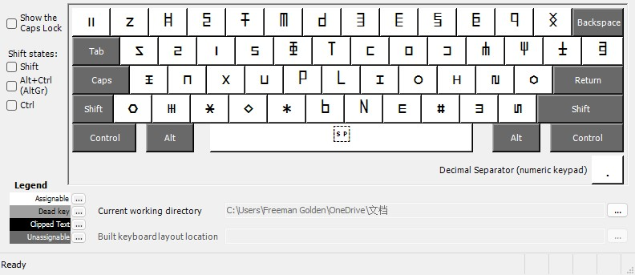
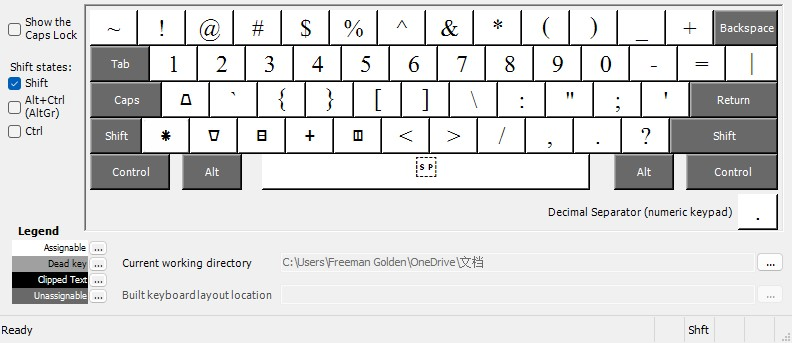
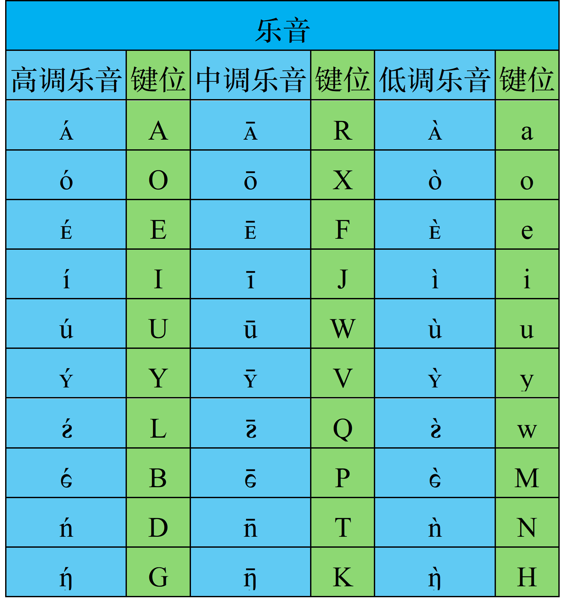
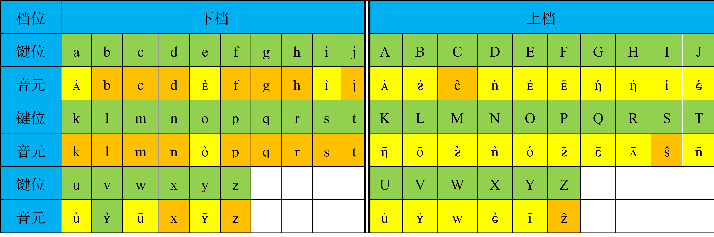
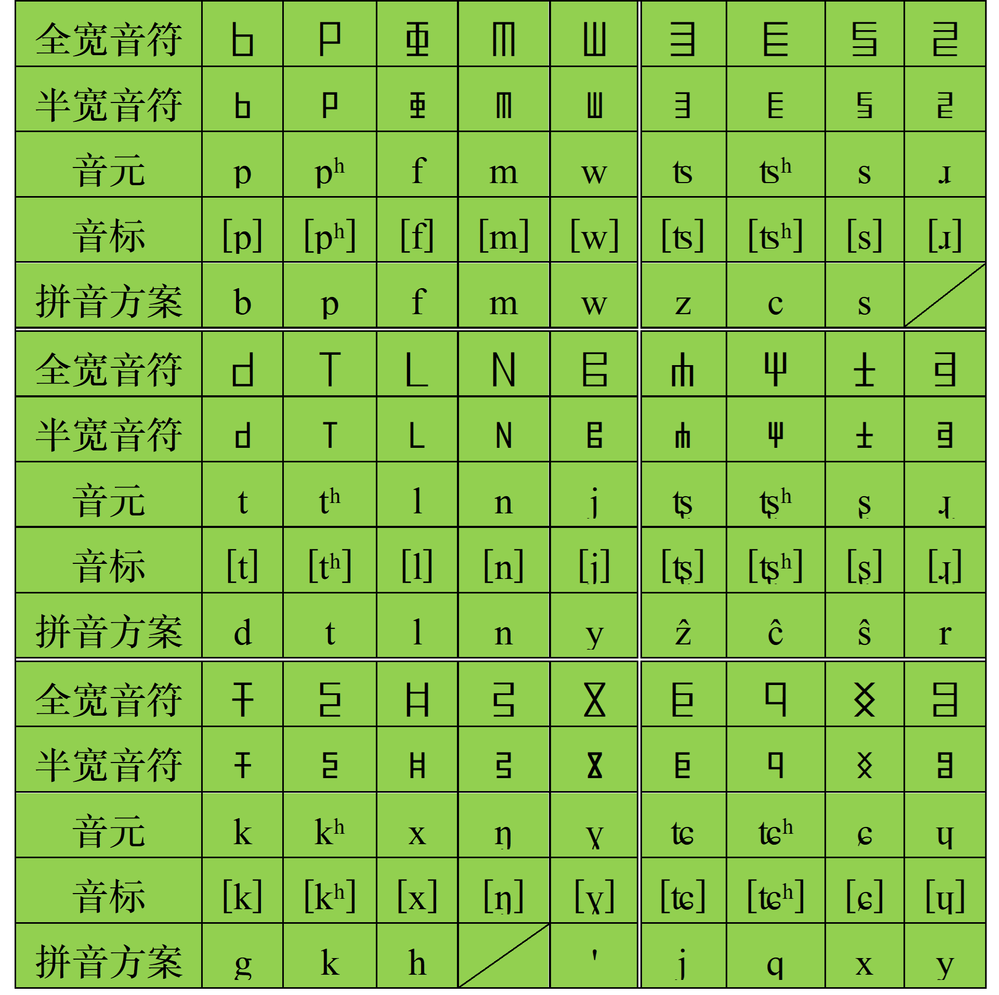
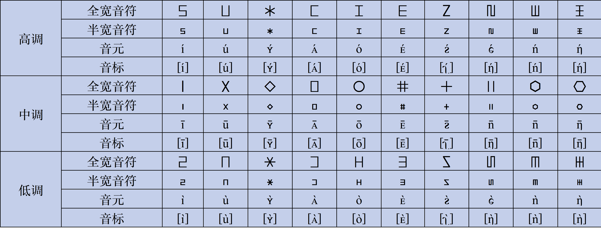
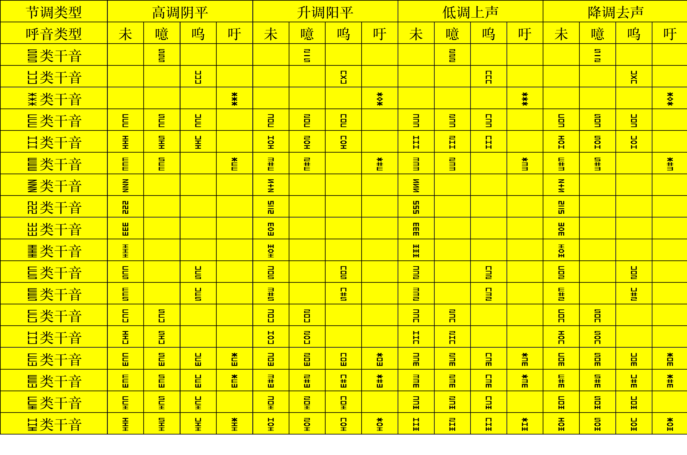
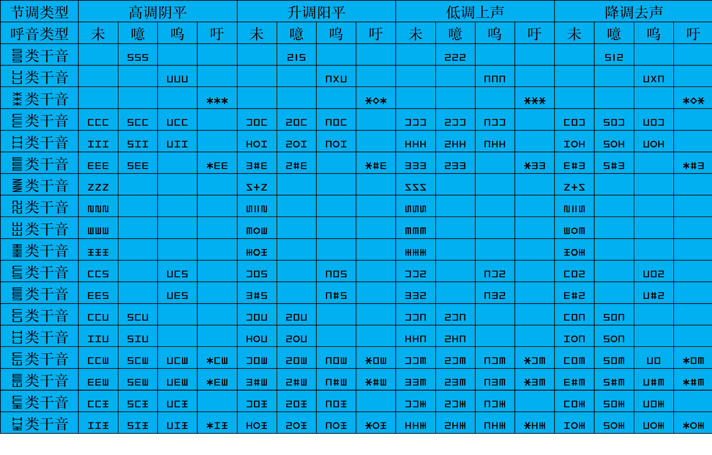
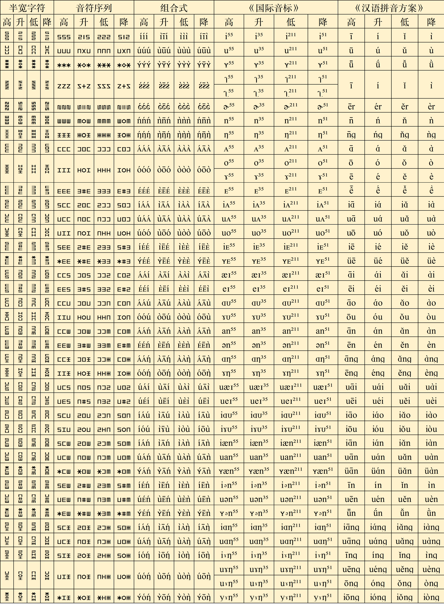
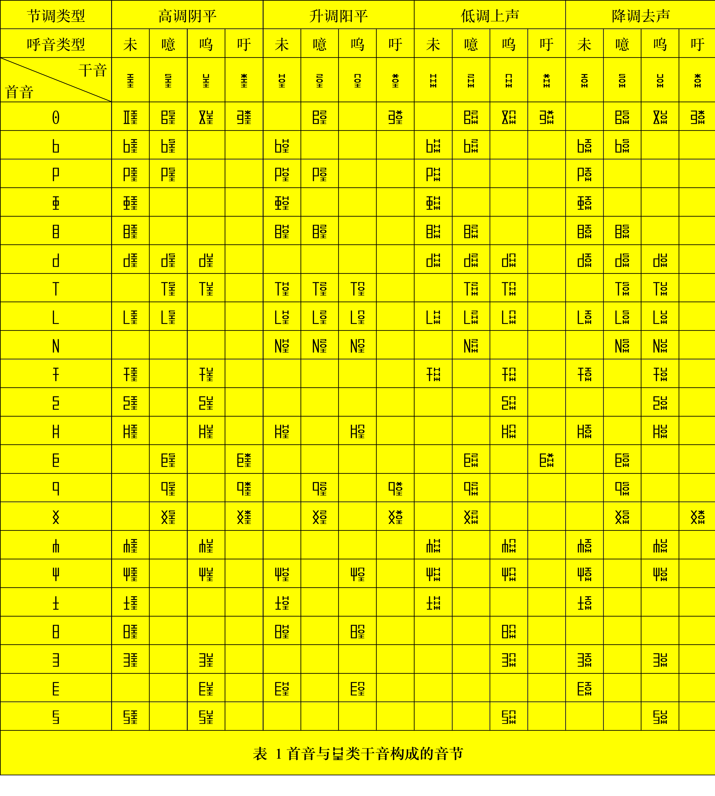

[](https://opensource.org/licenses/MIT)
[](https://www.apache.org/licenses/LICENSE-2.0)
[](https://github.com/tsaanghwang/YIME/releases)
[](https://www.python.org/)
[](https://nodejs.org/)

# 音元输入法编辑器 (Yinyuan Input Method Editor)

## 项目概述

音元输入法编辑器(YIME)，简称音元输入法，是以音元为码元的汉语音码输入系统。这套系统通过 52 个音元实现高效汉字输入，相比现行任何以《汉语拼音方案》为基础的全拼输入法具有以下优势：

- **更短的编码长度**：音节平均码长比现行任何全拼输入法的平均码长都短
- **更高的输入效率**：单字输入平均按键次数和词语输入平均按键次数更少
- **更精的音系表达**：音元系统比音位系统更能准确地表达汉语的音系特征

## 核心特性

### 输入法基础

音元输入法以音元系统为基础构建。音元系统是以音元为元素（基本结构单元）的汉语语音系统。在通用现代汉语的音元系统中，音元共有 52 个，分成噪音和乐音两类。其中，噪音有 22 个，乐音有 30 个。噪音特指充当首音的无固定音高的除阻辅音，只有音质是区别特征。乐音特指构成干音的有固定音高的舒音音元，音高和音质都是区别特征。乐音，根据音质分成10类，每类3个；根据音高分成高调乐音、中调乐音和低调乐音三类，每类 10 个。乐音与音位系统的音质音位和声调音位没有简单而又直接的对应关系。在结构上，噪音充当首音；乐音构成干音。在等长编码模式下，首音只由一个噪音充当，干音均由三个乐音构成。首音和干音构成音节。在输入法中，表示每个有声调的汉语音节的码元序列就是构成该有声调的汉语音节的音元序列。输入法通过输入构成每个有声调的汉语音节的音元序列输入每个有声调的汉语音节对应的汉字及其构成的语句。

- **首音系统**：首音只由噪音充当，共有22个。首音指位处音节首位的除阻辅音，分成实首音和虚首音两类。在等长编码模式下，首音只由一个噪音充当。首音对应音节声母。实首音对应非零声母。虚首音对应零声母。
- **干音系统**：干音均由乐音构成。干音指位处在首音后的乐音序列，分成高调干音、升调干音、低调干音和降调干音四类。在等长编码模式下，干音均由三个乐音构成。高调干音由三个高调乐音构成；升调干音由一个低调乐音、一个中调乐音和一个高调乐音构成；低调干音由三个低调乐音构成；降调干音由一个高调乐音、一个中调乐音和一个低调乐音构成。干音对应带调韵母。带调韵母指由声调与韵母构成的音段。高调干音、升调干音、低调干音和降调干音依序对应带阴平、阳平、上声和去声的韵母。
- **系统映射**：音元系统与《汉语拼音方案》建立精确对应关系，同时保持自身独立性。

### 输入法功能

- **四种模式输入**：全拼、简拼、双拼和并击四种输入模式
全拼由一个充当首音的音元和三个构成干音的音元构成。音元输入有与全拼对应的简拼、双拼和并击输入模式。在全拼中，省略虚首音、把构成干音的两个或三个连续且相同的音元合并成一个音元、从由三个音质相同的音元构成的干音中省略中间的中调乐音，就是简拼。双拼是指在一键输入首音后一键输入干音的输入模式。并击，也称合击，是指在一键输入首音后通过同时输入一组表示干音的音元的组合键输入干音从而输入音节的输入模式。
- **智能编码转换**：实时由语音到音元到汉字双向转换引擎
- **多种平台支持**：提供网页端、桌面端和移动端输入功能

## 码元

在音元输入系统中，码元就是音元系统的音元。

### 音元输入法的基本原则

全拼输入的基本原则是一音一码。

### 音元输入法的键盘布局

根据一音一码原则，音元输入法可用两种键盘输入汉字：

一种是重排键位的美式键盘。这种键盘布局，在全拼状态下，按照一音一码原则，从52个音元中，把47个音元映射到下档键位上，把5个音元映射到上档键位上。在这种键盘上，音元分布草图如图：



图 1 音元在键盘上的分布



图 2 音元在键盘上的分布

一种是一音一键的新式键盘。这种键盘的布局是，通过调用中英文切换键改变输入状态，在中文输入状态下，把美式键盘的大小写字母键全部做成下档键并重新建立音元与键位的映射关系。这就是说，这种键盘共有 52 个下档键位：键值为 65\~90 和 97\~122 的键位；其它键值的键位，包括数字 0\~9、运算符号、标点符号、等等，全部做成上档键位。这种键盘主要用来根据音元输入法输入汉字。

在这种键盘上，音元分布草图如图：

.png>)

图 3 音元在键盘上的分布

### 音元与键位的对应关系

在音元输入法中，根据一音一码原则确定音元与键位的对应关系。在通用现代汉语中，首音只由噪音充当。换句话说，首音就是噪音。首音与声母一一对应。首音 ng[ŋ]对应开口呼零声母或隔音符号，在美式键盘上，用小写字母键 v 键或其它字母键输入，以便做到完全不用符号键（除键值为 65\~90 和 97\~122 的键位外的键位）输入音元。

在音元输入法中，若用 ASCII 码编码，按照音元排序，在美式键盘上，音元对应的键位——首音和乐音对应的键位列表见表：

表 1 第一大类首音对应的键位

|    部位    | 上唇下唇 | 上唇下唇 | 上齿下唇 | 上齿下唇 | 齿龈 | 齿龈 | 软腭  | 软腭 |
| :--------: | :--: | :--: |:--: | :--: | :--: | :--: | :---: | :--: |
|    名称    | 首音 | 键位(声母) | 首音  | 键位(声母) |  首音   | 键位(声母) |首音   | 键位(声母) |
| 不送气爆破 |  b  |  b  |  |  | d   | d  |   g   |  g   |
|  送气爆破  |  p   |  p   |  |  |  t   |  t   |   k   |  k   |
|  鼻通除阻  |  m   |  m   |  |  |  n   |  n   | ŋ(ng) |  v   |
|  边通除阻  |      |       |  |  |  l   |  l   |       |      |
|    摩擦    |     |     |   f    | f |  |     |   h   |  h   |

表 2 第二大类首音对应的键位

|    部位    | 齿背 | 齿背 | 龈后  | 龈后 | 硬腭 | 硬腭 |
| :--------: | :--: | :--: | :---: | :--: | :--: | :--: |
|    名称    | 首音  | 键位(声母) |  首音   | 键位(声母) |  首音  | 键位(声母) |
| 不送气破擦 |  z   |  z   | ẑ(zh) |  Z   |  j   |  j   |
|  送气破擦  |  c   |  c   | ĉ(ch) |  C   |  q   |  q   |
|    摩擦    |  s   |  s   | ŝ(sh) |  S   |  x   |  x   |
|    近通    |      |      |   r   |  r   |      |      |

表 3 三类乐音对应的键位


在音元输入法中，若用 ASCII 码编码，根据键位排序，在美式键盘上，键位对应的音元——大写和小写键位对应的音元列表见表：

表 2 键位对应的音元


在新式键盘上，若用 ASCII 码编码，音元与键位的对应关系如图：

.png>)

音元与键位在美式键盘上的对应关系参考音元与键位在新式键盘上的对应关系修改。

### 音元与音符的对应关系

在音元输入法中，根据一音一符原则确定音元与音符的对应关系。在音元系统中，表示音元的字符也简称为音符。在音元系统中，为与中文或英文混排，表示音元，一共用到三套字符：与中文兼容的全宽字符、与中文兼容的半宽字符和与英文兼容的比例字符。

在音元输入法中，音元对应的音符——首音和乐音，用与中文兼容的全宽字符和与英文兼容的半宽字符来记音，列表见表：

表 3 首音的音符

表 4 乐音的音符

这套字符只是临时的试样，在使用过程中，可根据社会认可度修改。

## 干音

根据音元分析法标记干音，既可采用与汉字兼容的字符标音也可采用与英文兼容的字符标音。用与汉字兼容的字符来标音，其具体方法是：首先把标记干音的三个音元的音符竖向排成一列，然后，或把这列字符制作成一个高度占居一个汉字高度、宽度占居半个汉字宽度的标记干音的半宽字符，或把这列字符制作成一个高度占居一个汉字高度、宽度占居一个汉字宽度的标记干音的全宽字符。半宽字符在首音和干音拼合成音节时使用。全宽字符在首音或干音游离在行文中时使用。干音由呼音和韵音构成。韵音由主音和末音构成。韵音的音质被简称为韵质。干音根据韵质是否相近或相同分成十八类。

干音根据韵质分类采用与汉字兼容的字符标音详见表 5。

表 5 干音（采用半宽字符标音）


在本表中，列标题“未”、“噫”、“呜”和“吁”依序是未名呼干音、齐齿呼干音、合口呼干音和撮口呼干音的简称。在音元系统中，根据呼音的音质分类，干音分成未名呼干音、齐齿呼干音、合口呼干音和撮口呼干音四类。未名呼干音指除齐齿呼干音、合口呼干音和撮口呼干音外的干音。齐齿呼干音指呼音的音质是 i[i]的干音。合口呼干音指呼音的音质是 u[u]的干音。撮口呼干音指呼音的音质是 ʏ[ʏ]的干音。在根据韵音的音质的差异分类制表时，把未名呼干音、齐齿呼干音、合口呼干音和撮口呼干音各放在一列，把韵质相同或相近的干音合放在一行。

用与英文兼容的字符来标音，其具体方法是：把标记干音的三个音元的音符制作成三个高度占居半个汉字高度、宽度占居半个汉字宽度的半高半宽字符，并把标记干音的三个半高半宽字符依序在基线上横向排成一列标记干音的字符。

干音根据韵质分类采用与英文兼容的字符标音详见表6。

表 6 干音（采用音符序列标音）


干音分别采用半宽字符、音符序列、用上标来标调的组合式音符、《国际音标》和《汉语拼音方案》五种常用方式记音的对应关系列表见表7。

表 7 干音常用几种记音方式的对应关系

在本表中，列标题“高”、“升”、“低”和“降”依序是高调节调、升调节调、低调节调和降调节调的简称。高调节调、升调节调、低调节调和降调节调依序就是高调阴平、升调阳平、低调上声和降调去声。

## 音节

在音元系统中，首音和干音构成音节。由首音和干音构成的音节与有声调的音节一一对应。

音节表示例：

表 8 首音与 󰇘 类干音构成的音节

音节总表暂不列出。

综述说明，在音元系统中，表示每个有声调的汉语音节的码元序列就是构成该有声调的汉语音节的音元序列，音元输入法通过输入构成每个有声调的汉语音节的音元序列输入每个有声调的汉语音节对应的汉字及其构成的语句。强调说明，音元、音符与键位的对应关系可根据设计和使用需要修改。

## 码表

### 单字码表

根据音元系统的音节和《汉语拼音方案》的有声调的音节的一一对应关系构建音元输入法的单字码表。单字码表根据现有带调全拼单字码表转换。

### 词语码表

根据单字码表构建词语码表。词语码表根据现有带调全拼词语码表转换。在输入单字和词语基础上通过字频调整、词频调整和语句及语段生成算法（语义算法）输入语句和语段。

## 结论

音元输入法，在全拼模式下，是平均码长最短的音码输入法。

## 快速开始

### 环境要求

- Python 3.10+ (核心引擎)
- Node.js 16+ (Web 界面)
- 现代浏览器(Chrome/Firefox/Edge)

### 安装步骤

```bash
# 克隆仓库
git clone https://github.com/tsaanghwang/YIME.git
cd YIME

# 安装Python依赖
pip install -r requirements.txt

# 安装前端依赖
npm install

# 启动开发服务器
npm run dev
```

### 使用说明

1. 启动 Web 原型:

   ```bash
   npm run start
   ```

2. 访问 `http://localhost:3000` 使用输入法
3. 参考[使用文档](docs/USAGE.md)了解详细操作指南

## 许可证与授权

本项目采用 [MIT 许可证](LICENSE)，允许自由使用、修改和分发。商业使用需遵守以下条款：

1. **开源使用**：遵循 MIT 许可证条款
2. **商业授权**：需联系作者获取商业许可证
3. **学术引用**：科研使用请引用相关论文

## 社区与支持

### 官方渠道

- GitHub 仓库: [tsaanghwang/YIME](https://github.com/tsaanghwang/YIME)
- 问题追踪: [GitHub Issues](https://github.com/tsaanghwang/YIME/issues)
- 讨论区: [GitHub Discussions](https://github.com/tsaanghwang/YIME/discussions)

### 贡献指南

我们欢迎各种形式的贡献!请阅读[CONTRIBUTING.md](CONTRIBUTING.md)了解:

- 代码提交规范
- 测试要求
- Pull Request 流程

## 核心团队

- **创始人**:
  - Huang Chang (黄畅) - [yinyuanxitong@foxmail.com](mailto:yinyuanxitong@foxmail.com)
- **主要贡献者**:
  - [成为贡献者](CONTRIBUTORS.md)

## 相关资源

- [音元系统理论文档](docs/THEORY.md)
- [API 参考手册](docs/API.md)
- [开发路线图](ROADMAP.md)
- [常见问题解答](docs/FAQ.md)
