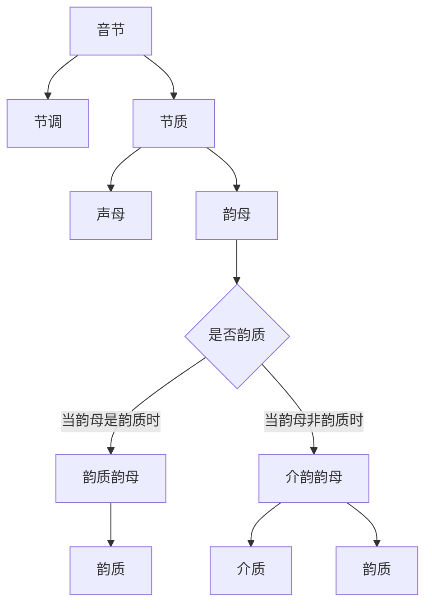

```mermaid
graph TB
    A[音节] --> B[节调]
    A --> C[节质]
    C --> D[声母]
    C --> E[韵母]
    E --> F{是否韵质}
    F --> |当韵母是韵质时|G[韵质韵母]
    G --> I[韵质]
    F --> |当韵母非韵质时|H[介韵韵母]
    H --> J[介质]
    H --> K[韵质]
```
