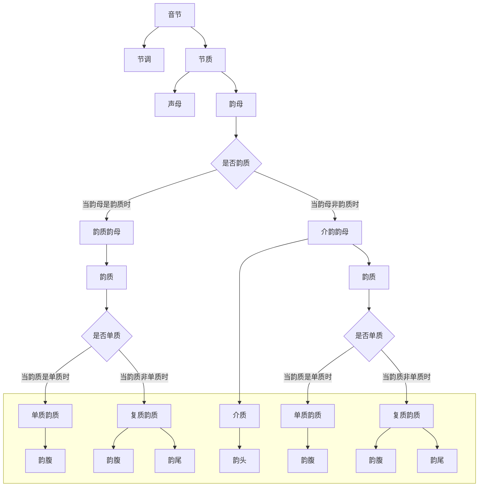

```mermaid
graph TB
    A[音节] --> B[节调]
    A --> C[节质]
    C --> D[声母]
    C --> E[韵母]
    E --> F{是否韵质}
    F --> |当韵母是韵质时|G[韵质韵母]
    G --> I[韵质]
    F --> |当韵母非韵质时|H[介韵韵母]
    H --> J[介质]
    H --> K[韵质]
    I --> L{是否单质}
    L --> |当韵质是单质时|M[单质韵质]
    K --> S{是否单质}
    L --> |当韵质非单质时|O[复质韵质]
    S --> |当韵质是单质时|T[单质韵质]
    S --> |当韵质非单质时|V[复质韵质]
    subgraph 韵母[ ]
        M --> N[韵腹]
        O --> P[韵腹]
        O --> Q[韵尾]
        T --> U[韵腹]
        J --> R[韵头]
        V --> W[韵腹]
        V --> X[韵尾]
    end
```
