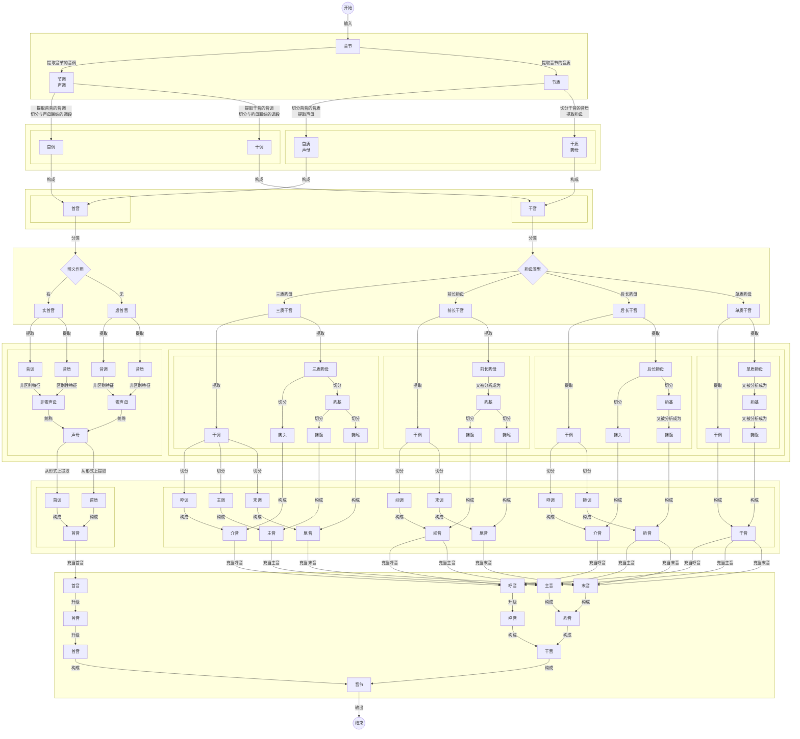

```mermaid
graph TB
    Start((开始)) --> |输入|A[音节]
    subgraph 提取节调和节质[" "]
        A --> |提取音节的音调|A1[节调<br>声调]
        A --> |提取音节的音质|A2[节质]
    end

    subgraph 切分节调和节质[" "]
        subgraph 切分节调[" "]
        A1 --> |提取首音的音调<br>切分与声母联结的调段|D1[首调]
        A1 --> |提取干音的音调<br>切分与韵母联结的调段|D2[干调]
        end
        subgraph 切分节质[" "]
        A2 --> |切分首音的音质<br>提取声母|C1[首质<br>声母]
        A2 --> |切分干音的音质<br>提取韵母|C2[干质<br>韵母]
        end
    end

    subgraph 切分首音和干音[" "]
        subgraph 切分首音[" "]
            D1 --> |构成|F[首音]
            C1 --> |构成|F
        end
        subgraph 切分干音[" "]
            D2 --> |构成|G[干音]
            C2 --> |构成|G
        end
    end

    subgraph 首音和干音的分类[" "]
        F --> |分类|F0{辨义作用}
        F0 --> |有|F1[实首音]
        F0 --> |无|F2[虚首音]
        G --> |分类|G0{韵母类型}
        G0 --> |三质韵母|G1[三质干音]
        G0 --> |前长韵母|G2[前长干音]
        G0 --> |后长韵母|G3[后长干音]
        G0 --> |单质韵母|G4[单质干音]
    end

    subgraph 首音和干音的分析[" "]
        subgraph 首音分析[" "]
            F1 --> |提取|H0[音调]
            F1 --> |提取|H1[音质]
            F2 --> |提取|H2[音调]
            F2 --> |提取|H3[音质]
            H0 --> |非区别特征|H4
            H1 --> |区别性特征|H4[非零声母]
            H2 --> |非区别特征|H5
            H3 --> |非区别特征|H5[零声母]
            H4 --> |统称|H6[声母]
            H5 --> |统称|H6
        end
        subgraph 干音分析[" "]
            subgraph 单质[" "]
            G4 --> |提取|J1[干调]
            G4 --> |提取|J2[单质韵母]
            J2 --> |又被分析成为|J3[韵基]
            J3 --> |又被分析成为|J4[韵腹]
            end
            subgraph 后长[" "]
            G3 --> |提取|K1[干调]
            G3 --> |提取|K2[后长韵母]
            K2 --> |切分|K3[韵头]
            K2 --> |切分|K4[韵基]
            K4 --> |又被分析成为|K5[韵腹]
            end
            subgraph 前长[" "]
            G2 --> |提取|L0[干调]
            G2 --> |提取|L3[前长韵母]
            L3 --> |又被分析成为|L4[韵基]
            L4 --> |切分|L5[韵腹]
            L4 --> |切分|L6[韵尾]
            end
            subgraph 三质[" "]
            G1 --> |提取|M0[干调]
            G1 --> |提取|M4[三质韵母]
            M4 --> |切分|M5[韵头]
            M4 --> |切分|M6[韵基]
            M6 --> |切分|M61[韵腹]
            M6 --> |切分|M62[韵尾]
            end
        end
    end

    H6 --> |从形式上提取|H7[首调]
    H6 --> |从形式上提取|H8[首质]

    K1 --> |切分|K6[呼调]
    K1 --> |切分|K7[韵调]

    L0 --> |切分|L1[间调]
    L0 --> |切分|L2[末调]

    M0 --> |切分|M1[呼调]
    M0 --> |切分|M2[主调]
    M0 --> |切分|M3[末调]

    subgraph 音元分析[" "]
        subgraph 噪音[" "]
            H7 --> |构成|H9[首音]
            H8 --> |构成|H9
        end
        subgraph 乐音[" "]
            J1 --> |构成|N1[干音]
            J4 --> |构成|N1

            K6 --> |构成|O1[介音]
            K3 --> |构成|O1
            K7 --> |构成|O2[韵音]
            K5 --> |构成|O2

            L1 --> |构成|P1[间音]
            L5 --> |构成|P1
            L2 --> |构成|P2[尾音]
            L6 --> |构成|P2

            M1 --> |构成|Q1[介音]
            M5 --> |构成|Q1
            M2 --> |构成|Q2[主音]
            M61 --> |构成|Q2
            M3 --> |构成|Q3[尾音]
            M62 --> |构成|Q3
        end
    end

    subgraph 音节层次结构模型[" "]
        H9 --> |充当首音|R1[首音]

        N1 --> |充当呼音|R2[呼音]
        N1 --> |充当主音|R3[主音]
        N1 --> |充当末音|R4[末音]

        O1 --> |充当呼音|R2
        O2 --> |充当主音|R3
        O2 --> |充当末音|R4

        P1 --> |充当呼音|R2
        P1 --> |充当主音|R3
        P2 --> |充当末音|R4

        Q1 --> |充当呼音|R2
        Q2 --> |充当主音|R3
        Q3 --> |充当末音|R4

        R1 --> |升级|S1[首音]
        R2 --> |升级|S2[呼音]
        R3 --> |构成|S3
        R4 --> |构成|S3[韵音]

        S1 --> |升级|T1[首音]
        S2 --> |构成|T2
        S3 --> |构成|T2[干音]

        T1 --> |构成|U1
        T2 --> |构成|U1[音节]
    end
    U1 --> |输出|End((结束))
```
