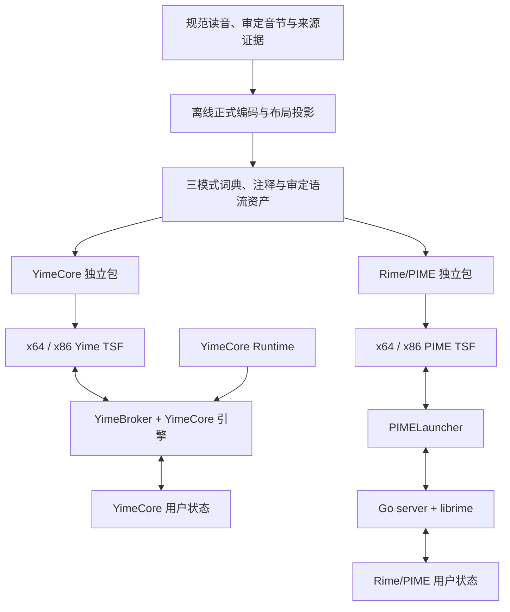

# Yime 工程架构

本文按 2026-09-16 的当前源码、产品清单和简版安装协议整理。Yime 包含两套可独立安装、运行和维护的 Windows 输入法：**YimeCore 是主要开发线，Rime/PIME 是独立维护的稳定产品线**。它们共享规范源和离线工具，各自携带运行组件与生成资产，各自保存用户状态。

当前通用安装包面向 x64 Windows，并包含 x64 与 x86 TSF，后者用于 WOW64 应用。ARM64 使用独立源码实验入口，仍缺少原生目标验收和通用安装包交付。开发包已有实机记录，正式签名发布尚未完成；具体结论以[安装验证记录](../installer/simple/VALIDATION.md)和[当前交接](../installer/simple/HANDOFF.md)为准。

## 1. 总体边界



两条链路之间没有运行时调用或自动回退。任一产品均不要求另一产品已安装、正在运行、可升级或可用于恢复；同时安装也不意味着共用引擎进程、用户词库或学习数据库。

开发契约见[双独立产品计划](project/YIME_DUAL_PRODUCT_DEVELOPMENT_PLAN_2026-09-05.md)。两产品可以共享合成测试规范、编码派生和通用工具源码，但受影响产品仍须分别验证；Rime 行为对照不能替代 YimeCore 独立测试。

## 2. YimeCore：Runtime、Broker 与 TSF

### 运行职责

| 组件 | 当前源码入口 | 职责 |
| --- | --- | --- |
| Runtime | `go-backend/cmd/yimecore-trial-runtime/` | 定位本包资产和本产品状态目录；维持 Broker，管理子进程及可选桌面工具，记录运行诊断 |
| Broker | `go-backend/cmd/yimebroker/`、`go-backend/input_methods/yime/yimebroker/` | 命名管道接入、认证后的会话与配额、请求分发、索引代际管理、用户模型持久化 |
| 引擎 | `go-backend/input_methods/yime/yimecore/` | 编码检索、候选排序、句子组合、分段纠正、用户词库覆盖及学习 |
| 引擎接口 | `go-backend/input_methods/yime/engineapi/` | 会话、按键、候选、句段和提交结果的数据契约 |
| TSF 表层 | `YimeTextServiceExperiment/` | Windows COM/TSF 接入、按键转发、预编辑与提交、候选窗口和语言栏 |

文件名中的 `Trial`、`Experiment` 保留了开发阶段命名；当前产品身份由 [local-product.json](../tools/yimecore/local-product.json) 指定，不能据文件名选择旧 CLSID/Profile 构件。

Runtime 与 Broker 在当前 x64 包中为原生 x64 进程。x64、x86 应用分别加载对应架构的 TSF DLL，均通过本产品命名管道连接 Broker；x86 工作流不要求 32 位 Windows，也不把引擎复制进每个应用。

### 数据与会话

构建生成 `indexes/full.yidx`、`variable.yidx`、`shorthand.yidx`。引擎读取经过验证的不可变索引，Windows 实现支持文件映射；用户学习、用户词库和屏蔽记录作为独立状态参与候选计算，不回写系统索引。

Broker 按会话和递增序列校验请求，响应向 TSF 提供完整状态快照。会话绑定打开时的模式和索引代际；表层不得把旧候选或旧句子状态拼回新响应。索引切换、语流资产更新和断线重连由各自的管理器处理。

命名管道连接只拥有自己创建的会话。连接结束时释放其会话和配额，不能清理同一客户端进程的其他活动连接。学习写入采用快照与日志；同一 mutation ID 的重试还须匹配上下文和有序 observation 集合，否则构成冲突。

Runtime 的 `runtime-status.json` 是诊断快照。证明启动和输入成功仍需核对实时进程、已加载的当前产品 DLL、实际宿主与用户输入结果。

### Windows 文本与界面

TSF 通过 `CompositionEditSession` 修改宿主文档。`TF_S_ASYNC` 只表示请求已排队，界面和状态必须以实际 `DoEditSession` 完成结果为准；写入失败时关闭候选 UI 并断开表层，不能假装提交成功。

焦点离开时取消尚未确认的 composition，只移除原预编辑范围。已确认的提交应保留，延迟取消必须匹配原 composition 身份，不能擦除新输入或已提交文本。语言栏回调在服务释放前解除，候选窗口也须容忍宿主从外部销毁 HWND。

主实现分别位于 `TextService.cpp`、`SurfaceSession.cpp`、`CompositionEditSession.cpp`、`CandidatePopup.cpp` 和 `LanguageBarItem.cpp`；详细接口见 [TSF 组件说明](../YimeTextServiceExperiment/README.md)，阶段实验设计与原始证据见 [YimeCore 替换实验](project/YIMECORE_REPLACEMENT_EXPERIMENT.md)。

## 3. Rime/PIME：独立宿主链路

```text
Windows 应用
  → PIMETextService.dll（与应用匹配的 x64 / x86 COM/TSF）
  → PIMELauncher.exe（Rust，Win32）
  → go-backend/server.exe（Go）
  → nativeBackend / librime（本包的 rime.dll）
  → 本产品 Rime 配置、编译缓存与学习数据
```

PIME TSF 经命名管道连接启动器，启动器按包内 `backends.json` 启动并转发到 Go 后端。Go 层承接 PIME 协议、Yime 菜单和工具、注释与设置，把原生候选和组合状态交给 librime 会话处理。

Rime/PIME 包携带自己的启动器、Go 后端、x64/x86 TSF、注册验证工具、Rime 运行文件及三模式资产。运行文件版本与哈希由 [rime_runtime.lock.json](../go-backend/input_methods/yime/rime_runtime.lock.json) 约束，部署与词库维护使用本包的工具。

原生 Rime 会话始终拥有候选分页：`nativeBackend.UsesBackendCandidatePaging()` 返回 `true`。Go 侧不通过切片代替原生翻页；候选数设置经配置、部署/重载和 `rimeState.PageSize` 回读同步到 `candidatePageSize`。

语言栏菜单命令须兼容宿主通过 `data.id` 报告子项的路径。修改菜单 ID、激活或点击处理时，应先覆盖具体宿主故障；源码单测通过不能代替已安装二进制与真实点击的核对。

主要实现位于 `PIMETextService/`、`libIME2/`、`PIMELauncher/`、`go-backend/input_methods/yime/yime.go`、`native_cgo.go` 与 `librime.go`。生产路径保持 Rime 所有权，不自动切换到 YimeCore。

## 4. 产品身份、安装目录与用户状态

安装身份和目录以 [installer/simple/Product.psm1](../installer/simple/Product.psm1) 与 `Setup.ps1` 为准：

| 项目 | YimeCore | Rime/PIME |
| --- | --- | --- |
| 安装器产品 ID | `yimecore` | `rime-pime` |
| 当前安装目录 | `%ProgramFiles%\YimeCore` | `%ProgramFiles%\Yime Rime-PIME` |
| 主程序 | `bin\YimeCoreTrialRuntime.exe` | `PIMELauncher.exe` |
| 用户状态根 | `%LOCALAPPDATA%\YimeCore Experimental Trial` | `%APPDATA%\PIME\Rime` |
| TSF DLL | `YimeTextServiceExperiment.dll` | `PIMETextService.dll` |
| CLSID | `{E40FA752-BB96-461D-A51D-F40EB437EC65}` | `{35F67E9D-A54D-4177-9697-8B0AB71A9E04}` |
| Profile | `{126F54C6-E9B1-4E22-8652-03224CBD49F9}` | `{3F6B5A12-8D44-4E71-9A2E-6B4F9C1D2A30}` |

YimeCore 端点为 `\\.\pipe\YimeBroker.YimeCoreTrial.v1`；PIME 启动器使用其独立的用户命名管道。YimeCore 状态目录中的 `Experimental Trial` 保留兼容命名，不代表使用旧产品身份。源码描述中的旧目录字段也不能替代当前简版安装器的目录契约。

系统词典、语流资产、私有字体、工具和帮助随各自产品包交付。YimeCore 的设置、学习模型、用户词库、屏蔽词、布局代际、专业词库选择及日志归自身状态目录；Rime/PIME 的用户配置、编译缓存、学习及词库归自己的目录。

共用工具源码在构包和启动时接收本产品的资产/状态路径，不能从另一套已安装目录补齐文件，也不能自动迁移另一套学习数据。私有字体不等于系统字体；维护本产品不得清理其他产品或系统资源。

简版包用 `product-package.json` 列出文件大小和 SHA-256，安装目录以 `.yime-product.json` 标记所有权。包校验涵盖所需运行程序、图标、工具、字体和两种架构的 TSF，发现缺失或归属不符即停止。

## 5. 共享离线数据：规范真源到产品资产

```text
有来源的带调拼音实例
  → 审定 canonical 音节库存
  → SyllableEncodingPipeline / YinjieEncoder
  → 四个稳定音元 ID 与规范语义编码
  → internal_data/manual_key_layout.json 的唯一键位投影
  → Go codemode 派生等长、变长、省键
  → 各产品的词典 / 索引 / 注释 / 帮助资产
```

规范词典读音及其来源记录是读音真源。音节准入基于实际材料或明确审定实例，不补造五调组合，也不因某个音节暂时不能编码而手写音元 ID 或物理键。

`syllable/`、`yime/` 与 `tools/lexicon/` 是仓内离线工具链。它们负责来源整理、正式编码、词库生成、审查和可重现验证，不进入 Windows 安装包，也不是另一套 Python 输入运行时。

`internal_data/manual_key_layout.json` 是可编辑布局源；`data/yime_yinyuan_layout.json` 和模式词典是生成投影。`yime_pinyin_codes.tsv` 表达规范音节编码，不能由生成的 Rime 词典反推或修补上游拼音语义。

`tools/lexicon/handoff/yime_core_fixed.dict.yaml` 是已批准的等长交接产物，用于锁定身份和单仓重放；它不是规范拼音来源的替代品。交接 evidence、目标锁和 `yime_core_source_manifest.json` 记录来源、selection、派生哈希及排序证据，数量应从当前清单读取。

大型外部输入通过内容锁放在所有 Git 工作树之外，仅以 `YIME_LEXICON_EXTERNAL_ROOT` 显式提供。正常工具不读取原型仓或其他 Git 仓库，不搜索父目录，也不设兄弟仓回退。来源完整重建与已批准交接重放有不同前提，见[离线词库工具](../tools/lexicon/README.md)和[仓库数据边界](project/YIME_REPOSITORY_DATA_BOUNDARY.md)。

## 6. 三模式、候选与语流输入

### 统一编码契约

| 模式 | 标识 | 派生关系 |
| --- | --- | --- |
| 等长 | `full` / `yime_full` | 每音节保留四位置完整编码 |
| 变长 | `variable` / `yime_variable` | 从同一完整编码按 `codemode` 规则派生；当前默认模式 |
| 省键 | `shorthand` / `yime_shorthand` | 从同一完整编码继续按确定性省键规则派生 |

两产品都保留裸数字用于组码，即使候选窗已显示也不改作选择键。序号选择为 `Shift+1` 至 `Shift+9`，候选标签显示 `⇧1` 至 `⇧9`；PIME 使用 `setSelLabels`，`SetSelKeys` 只保留旧宿主兼容职责。

候选来源可包含系统核心、审定外围条目、用户学习、自定义词库与受控语流别名，并接受屏蔽过滤。来源准入、编码一致性和文字身份共享规范；检索、句子组合及学习实现分别归 YimeCore 和 Rime。不能以一套运行时的候选位置认定另一套必然正确。

标准拼音注释保持规范读音，音元拼音和键位序列反映实际命中的编码；同码歧义需使用来源旁表，不能把确定性回退解释成唯一读音。详见[反查拼音来源映射](project/REVERSE_PINYIN_SOURCE_MAPPING.md)。

### 语流资产

语流支持是有来源、可移除的词或短语级附加输入路径。它不修改规范读音、单音节基础码、标准拼音注释或候选文字，不根据相邻发音自动增删“儿”或把“啊”替换为另一汉字。

规则在稳定音元 ID 和属性上进行四位置内的等位替换，然后投影布局并共同派生三模式。运行准入须遵守当前码长门禁：别名在任何模式下均不得长于对应规范码；研究记录、待审记录和未通过准入的投影不随运行包启用。

语流别名变更须保留等长、变长、省键的真实 Rime 回归，并独立覆盖受影响的 YimeCore 路径。词汇固有轻声不能推广成任意语境弱化，能产儿化、跨词界音变及其他新规则仍须明确审定范围和排除项。

现有源码包括经审定的儿化、上声及“啊”条件读法等资产和试验模块，模块存在不等于任意规则已获运行批准。Rime/PIME 的实际资产由 `yime_runtime_profile.json` 及各专项 manifest 描述。

YimeCore 通过独立语流准入、产品导出、包摘要和能力声明接入；`local-product.json` 将语流默认启用值设为 `false`。构建是否携带能力、设置是否启用及当前会话是否使用资产应分别核查，不能从 Rime/PIME 的通过记录推断 YimeCore 已启用。

总体模型和历次阶段证据见[语流音变计划](project/MANDARIN_CONNECTED_SPEECH_PLAN.md)与[审定记录目录](project/connected_speech/README.md)；当前 YimeCore 产品约束见 [speech-product-contract.json](../tools/yimecore/speech-product-contract.json)。历史阶段结论只适用于所记载的范围。

## 7. 构建、制包与交付

| 任务 | 当前入口 |
| --- | --- |
| YimeCore 当前身份的源码包 | `tools/yimecore/build-local-product.ps1` |
| 独立构建 WOW64 TSF | `tools/yimecore/build-local-x86-surface.ps1` |
| 已批准平台的隔离实验 | `tools/yimecore/run-platform-experiment.ps1` |
| YimeCore 语流准入与导出 | `run-connected-speech-admission.ps1`、`run-connected-speech-product-source.ps1`，位于 `tools/yimecore/` |
| Rime/PIME 构建并制包 | 根目录 `Build.ps1` |
| 从产品载荷制作简版包 | `installer/simple/Build-Package.ps1` |
| 从仓内 Rime/PIME 构建输出制包 | `installer/simple/Build-RimePackage.ps1` |
| 普通用户安装/卸载选择 | 完整交付目录中的 `Install-Uninstall.cmd` |

仓库 PowerShell 操作统一通过 checked 入口，复杂参数写入 UTF-8 JSON，并使用完整参数名。例如源码构建：

```text
python -X utf8 tools/powershell/run_checked.py --script tools/yimecore/build-local-product.ps1 --edition ps7 --params-file <参数.json>
```

该入口在选定 PowerShell 进程中先检查再执行。PS5 兼容性检查应明确选择 `--edition ps5`；语法通过不等于运行成功。源码工具应输出到全新隔离目录，维护测试另行记录。

PIMELauncher 的 Win32 构建保持 `stable-i686-pc-windows-msvc` **主机工具链**与 Corrosion 固定依赖；只在默认 x64 Rust 工具链添加 i686 target 不能替代它。当前依赖版本以仓库构建配置和工具链锁为准。

简版安装支持任一单产品或同时选择两套；双套先校验全部所选包，再顺序执行，失败时停止并报告。默认保留本产品用户数据，显式 `-ResetData` 才重置；维护过程中不强关文档应用，不改变默认输入法。

生产用户数据迁移和自动备份恢复仍在后续范围。旧事务票据、历史 PID 或失败现场恢复不是新包安装前置；当前使用说明见[简版安装器](../installer/simple/README.md)。

开发先完成本地验证，再提交推送并通过对应 CI。测试端使用完整交付包开展独立验收。分支交接见 `installer/simple/HANDOFF.md`；大型包的 GitHub artifact/release URL 与 SHA-256 应写入分支，源码 checkout 本身不是包交付。

## 8. 验证层次与证据

| 层次 | 入口或证据 | 能证明的范围 |
| --- | --- | --- |
| 离线真源与派生 | `tools/lexicon/test.ps1`、目标锁、交接重放及数据边界检查 | 来源和派生可验证；不证明已安装输入 |
| Go 单元与契约 | `tools/test-go.ps1`、相关 `yimecore` / `yimebroker` 测试 | 引擎、会话、学习、工具与数据契约 |
| 真实 Rime | `tools/test-real-rime.ps1` | 隔离 librime 的实际三模式、语流和候选行为 |
| 原生 TSF | `YimeTextServiceExperiment/tests/`、PIME 原生测试与构建入口 | 按具体用例区分隔离契约、composition 与已注册宿主 |
| 安装器 | `installer/simple/Test-*.ps1` | 包完整性、归属、启动项、失败停止、日志与进程等待等 |
| 实机产品 | `installer/simple/VALIDATION.md` 及其链接的原始报告 | 对应包、机器、应用、维护动作和重启后输入结果 |

CI 定义位于 [.github/workflows/ci.yaml](../.github/workflows/ci.yaml)，覆盖构建契约、离线工具、Rust、Go、真实 Rime、race、原生 PIME 和简版安装器；CI 通过不自动补齐全部 YimeCore 安装宿主或 ARM64 验收。

Windows 已注册宿主和实际应用必须确认当前产品已激活。旧的“Yime 自研栈试验版”条目不能作为当前身份的证据；跨编译、静态 PE 检查、隔离文件测试和持久化状态文件也不能替代实际输入。

完整测试组织与故障定位见[测试指南](YIME_TESTING_GUIDE.md)。本文描述组件关系和当前入口，历史报告保留原有结果；新源码、新包或新平台的通过范围需有各自证据。
