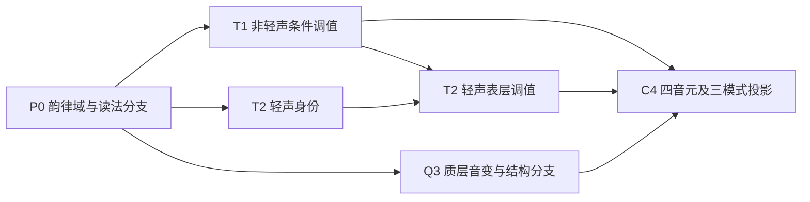

# 统一语境调层—质层假设模型（第一版）

## 1. 定性

这是一套**可证伪、可替换、可逐步完善的工程假设**，不是普通话语流规律的定论，也不宣称已经解决
语言学界尚无统一答案的规则优先级问题。它的作用是先给离线试算建立一个不会无限递归、不会把若干
现象互相覆盖的共同框架，使发现反例时能够修改单条规则、冲突裁决或韵律分组，而不必推倒整个编码链。

第一版只建立机器可读的[规则图](contextual_tone_rule_model.json)、
[冲突表](contextual_tone_rule_conflicts.tsv)、校验器和报告器。`runtime_enabled=false`，正式运行时候选
生成数必须为零；它不读取或修改已安装 PIME/Rime，也不改规范词典、基础拼音码表或三个运行词典。

## 2. 分层和偏序



这里采用偏序而不是强行给所有语言现象排一个总优先级：

1. 先依据词条、构式、停顿或人工分组证据确定韵律域和读法分支；没有证据时不猜。
2. 在所选分支内对上声、“一”“不”和可选“七、八”各求值一次。条件读取规范后续调类，不读取同轮
   其它规则刚产生的结果，避免级联递归。
3. 轻声先判定“本记录是否采用轻声读法”，再依据前驱完成 T1 后的暂定表层调值投影。
4. 儿缀兼容路径和融合儿化路径并行保存、互不冒充；融合儿化表示未定，第一版继续暂缓。
5. 只有韵律域、读法分支和冲突全部已有裁决，才允许从稳定音元 ID 一次派生等长、变长、省键三种码。

每条规则对每个音节最多应用一次，全局最多一轮；规则输出不得重新成为本轮同一规则的触发条件。

## 3. 质层（音质层）音变

质层音变指由音质特征变化引起的音元替换。第一版建立六个相互独立、可逐步补充证据的规则槽位：

1. **儿化音变**：区分轻声儿缀兼容路径与融合儿化路径；后者等待儿化类别、附着位置和音元目标审定。
2. **虚首音的实际音值**：保存零声母音节在具体语境中的表层首音实现，不回写规范零声母分析。
3. **语气词“啊”的音变**：读取前一音节已经裁决的表层末音类别；不得仅据读音自动把候选文字改成
   “呀”“哇”“哪”等字。
4. **相邻音节边界的同化或异化**：处理前一音节末音与后一音节首音之间有方向、有边界、有来源的
   音质变化，不从相似性自动建立全局规则。
5. **音质弱化与时域延展**：音元模型中不存在音元增减，只有音质替换。弱化时，相邻韵核的音质可以
   延长并联结到相应时域；该时域同时负载（承载）并行的音高特征，四音元位置和音节结构均保持不变。
6. **其它质层音变**：只登记尚未分类的问题；必须另立现象规则、来源、范围、排除项和冲突记录后
   才能试算，不能作为万能兜底生成器。

质层与调层是两个可组合但互不代替的轴。同一记录可以既改变调级又改变音质，但必须先完成各自的
分支裁决，最后共同写入同一组四音元位置，再统一派生三种输入模式。

## 4. 第一版的明确边界

第一版暂时接受这些可能偏离实际语言事实的简化，但把缺口显式记账：

- 双上声可试算；三个及以上连续上声必须具有显式韵律分组，否则暂缓。
- “一”“不”只接受经复核的词或构式记录；“七、八”保持独立可选规则且默认暂缓。
- 单个有词内非轻声前驱的轻声可试算；连续轻声链另立专题，不用机械还原的所谓本调填空。
- `er5` 儿缀是兼容路径，不等同于融合儿化；融合儿化需等待儿化类别、附着位置和音元表示审定。
- 编码投影必须处于最后一层，不能为了产生编码而猜造韵律结构或读法。

这些边界不是“已解决”，而是停止条件。新材料可以把 `deferred` 改成更具体的分支、添加来源记录，
或者提高模型 revision；不得直接放宽为全局规则。

## 5. 冲突处理

冲突表当前至少显式覆盖：

- V一V、A不A、V不V 构式轻声与“一、不”普通条件调值的互斥；
- 词汇轻声读法与同一音节非轻声上声规则的分支互斥；
- 儿缀兼容与融合儿化的平行路径；
- 三个以上连续上声的韵律分组依赖；
- 连续轻声链的特殊处理；
- “七、八”不得被合并成阴平全局规则；
- 虚首音、跨音节同化和异化不得越过未裁决的韵律边界；
- 语气词专门规则与一般边界规则不得在同一位置重复应用；
- 音质弱化和时域延展只能形成四音元位置内的音质替换，不得解释为音元位置增减；
- “其它质层音变”不得未经分类便直接生成编码；
- 存在未决韵律域或规则冲突时禁止三模式投影。

`blocks` 表示命中一个分支后阻断另一个规则，`exclusive_with` 表示必须保存为并行读法或路径，
`requires` 表示没有前置裁决便停止。以后发现新交叠时，应先增加冲突记录，再决定是否修改求值顺序。

## 6. 离线门禁

运行：

```powershell
powershell -NoProfile -ExecutionPolicy Bypass -File .\tools\audit-contextual-tone-model.ps1
```

报告只写入 `.tmp/contextual-tone-model-audit/`，至少检查：

- JSON 和 TSV 结构完整、引用存在且 ID 唯一；
- 依赖图无环，所有规则非递归且每音节最多应用一次；
- 已知高风险交叠均在冲突表出现；
- 输入规则文件审计前后 SHA-256 一致；
- 运行时候选生成数严格为零；
- 报告文件齐全，输出目录只能位于仓库 `.tmp` 下的固定子目录。

只有上述门禁通过，才允许用这套假设重新生成下一轮**临时**试算包；这仍不等于批准接入正式运行时。
