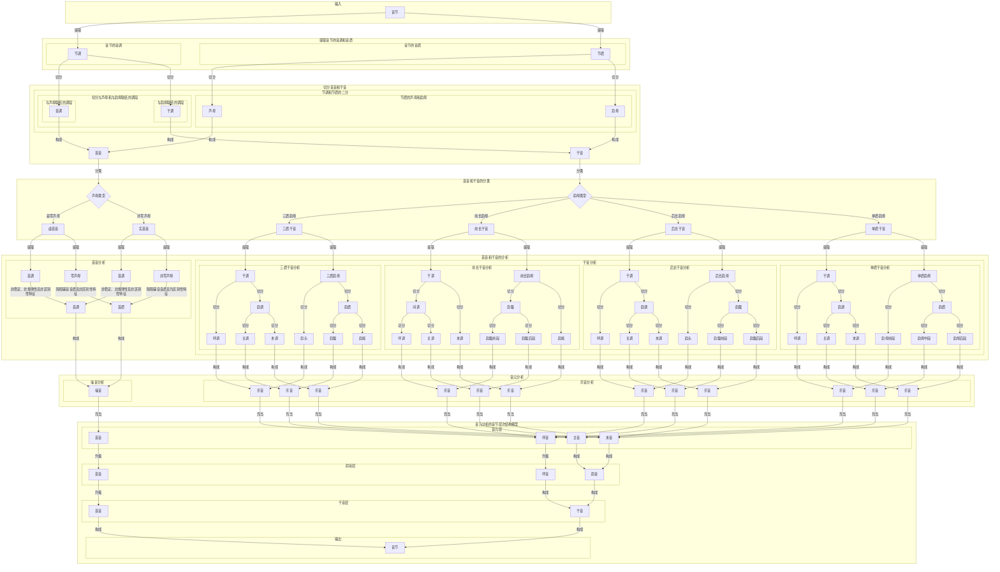

%%{init: {"theme":"default"}}%%

```mermaid
flowchart TB
  subgraph Input["输入"]
    DecomposingSyllable[音节]
  end

  subgraph ExtractQualityTone["提取音节的音调和音质"]
    subgraph ToneOfSyllable["音节的音调"]
      DecomposingSyllable --> |提取|SyllabicTone[节调]
    end
    subgraph QualityOfSyllable["音节的音质"]
      DecomposingSyllable --> |提取|SyllabicQuality[节质]
    end
  end

  subgraph SyllableDichotomy["切分首音和干音"]
    subgraph QualitativeLayer["节调和节质的二分"]
      subgraph ToneDichotomy["切分与声母和与韵母联结的调段"]
        subgraph InitialTone["与声母联结的调段"]
          SyllabicTone --> |切分|InitialTonalSegment[首调]
        end
        subgraph FinalTone["与韵母联结的调段"]
          SyllabicTone --> |切分|SubsequentTonalSegment[干调]
        end
      end
      subgraph QualityDichotomy["节质的声母和韵母"]
        SyllabicQuality --> |切分|InitialConsonant[声母]
        SyllabicQuality --> |切分|Final[韵母]
      end
    end

    InitialTonalSegment --> |构成|DecomposingInitialSound[首音]
    InitialConsonant --> |构成|DecomposingInitialSound[首音]
    SubsequentTonalSegment --> |构成|DecomposingSubsequentSound[干音]
    Final --> |构成|DecomposingSubsequentSound[干音]
  end

  subgraph InitialAndSubsequentSoundCategories["首音和干音的分类"]
    DecomposingInitialSound --> |分类|IsNotZeroInitial{声母类型}
    IsNotZeroInitial --> |是零声母|InsubstantialInitialSound[虚首音]
    IsNotZeroInitial --> |非零声母|SubstantialInitialSound[实首音]

    DecomposingSubsequentSound --> |分类|ChoiceFinalCategories{韵母类型}
    ChoiceFinalCategories --> |三质韵母|TriQualitySubsequentSound[三质干音]
    ChoiceFinalCategories --> |前长韵母|FrontLongSubsequentSound[前长干音]
    ChoiceFinalCategories --> |后长韵母|BackLongSubsequentSound[后长干音]
    ChoiceFinalCategories --> |单质韵母|SingleQualitySubsequentSound[单质干音]
  end

  subgraph InitialAndSubsequentSoundDecompose["首音和干音的分析"]
    subgraph InitialSoundAnalysis["首音分析"]
      InsubstantialInitialSound --> |提取|InsubstantialInitialSoundTone[首调]
      InsubstantialInitialSoundTone --> |非稳定、非规律性且非区别性特征|InitialSoundTone[首调]
      InsubstantialInitialSound --> |提取|InsubstantialInitialSoundQuality[零声母]
      InsubstantialInitialSoundQuality --> |除阻辅音音质且非区别性特征|InitialSoundQuality[首质]

      SubstantialInitialSound --> |提取|SubstantialInitialSoundTone[首调]
      SubstantialInitialSoundTone --> |非稳定、非规律性且非区别性特征|InitialSoundTone
      SubstantialInitialSound --> |提取|SubstantialInitialSoundQuality[非零声母]
      SubstantialInitialSoundQuality --> |除阻辅音音质且为区别性特征|InitialSoundQuality
    end

    subgraph SubsequentSoundAnalysis["干音分析"]
      subgraph DecomposingSingleQualitySubsequentSound["单质干音分析"]
        SingleQualitySubsequentSound --> |提取|SQTone[干调]
        SQTone --> |切分|SQSecondPitch[呼调]
        SQTone --> |切分|SQRimeTone[韵调]
        SQRimeTone --> |切分|SQMainPitch[主调]
        SQRimeTone --> |切分|SQLastPitch[末调]

        SingleQualitySubsequentSound --> |提取|SQFinal[单质韵母]
        SQFinal --> |切分|SQFinalAnteriorSegment[韵母前段]
        SQFinal --> |切分|SQRimeQuality[韵质]
        SQRimeQuality --> |切分|SQFinalMiddleSegment[韵母中段]
        SQRimeQuality --> |切分|SQFinalPosteriorSegment[韵母后段]
      end

      subgraph DecomposingBackLongSubsequentSound["后长干音分析"]
        BackLongSubsequentSound --> |提取|BLTone[干调]
        BLTone --> |切分|BLSecondPitch[呼调]
        BLTone --> |切分|BLRimeTone[韵调]
        BLRimeTone --> |切分|BLMainPitch[主调]
        BLRimeTone --> |切分|BLLastPitch[末调]

        BackLongSubsequentSound --> |提取|BLFinal[后长韵母]
        BLFinal --> |切分|BLFinalHead[韵头]
        BLFinal --> |切分|BLRimeQuality[韵腹]
        BLRimeQuality --> |切分|BLFinalNucleusAnteriorSegment[韵腹前段]
        BLRimeQuality --> |切分|BLFinalNucleusPosteriorSegment[韵腹后段]
      end

      subgraph DecomposingFrontLongSubsequentSound["前长干音分析"]
        FrontLongSubsequentSound --> |提取|FLTone[干调]
        FLTone --> |切分|FLIntermediateTonalSegment[间调]
        FLIntermediateTonalSegment --> |切分|FLSecondPitch[呼调]
        FLIntermediateTonalSegment --> |切分|FLMainPitch[主调]
        FLTone --> |切分|FLLastPitch[末调]

        FrontLongSubsequentSound --> |提取|FLFinal[前长韵母]
        FLFinal --> |切分|FLIntermediateQuality[韵腹]
        FLIntermediateQuality --> |切分|FLFinalNucleusAnteriorSegment[韵腹前段]
        FLIntermediateQuality --> |切分|FLFinalNucleusPosteriorSegment[韵腹后段]
        FLFinal --> |切分|FLFinalRail[韵尾]
      end

      subgraph DecomposingTriQualitySubsequentSound["三质干音分析"]
        TriQualitySubsequentSound --> |提取|TQTone[干调]
        TQTone --> |切分|TQSecondPitch[呼调]
        TQTone --> |切分|TQRimeTone[韵调]
        TQRimeTone --> |切分|TQMainPitch[主调]
        TQRimeTone --> |切分|TQLastPitch[末调]

        TriQualitySubsequentSound --> |提取|TQFinal[三质韵母]
        TQFinal --> |切分|TQFinalHead[韵头]
        TQFinal --> |切分|TQRimeQuality[韵质]
        TQRimeQuality --> |切分|TQFinalMain[韵腹]
        TQRimeQuality --> |切分|TQFinalTail[韵尾]
      end
    end
  end

  subgraph Yinyuan["音元分析"]
    subgraph YinyuanAnalysis["噪音分析"]
      InitialSoundTone --> |构成|UnpitchedSound[噪音]
      InitialSoundQuality --> |构成|UnpitchedSound
    end

    subgraph YinyuanDecomposition["乐音分析"]
      SQSecondPitch --> |构成|SQPitchedSound1[乐音]
      SQFinalAnteriorSegment --> |构成|SQPitchedSound1
      SQMainPitch --> |构成|SQPitchedSound2[乐音]
      SQFinalMiddleSegment --> |构成|SQPitchedSound2
      SQLastPitch --> |构成|SQPitchedSound3[乐音]
      SQFinalPosteriorSegment --> |构成|SQPitchedSound3

      BLSecondPitch --> |构成|BLPitchedSound1[乐音]
      BLFinalHead --> |构成|BLPitchedSound1
      BLMainPitch --> |构成|BLPitchedSound2[乐音]
      BLFinalNucleusAnteriorSegment --> |构成|BLPitchedSound2
      BLLastPitch --> |构成|BLPitchedSound3[乐音]
      BLFinalNucleusPosteriorSegment --> |构成|BLPitchedSound3

      FLSecondPitch --> |构成|FLPitchedSound1[乐音]
      FLFinalNucleusAnteriorSegment --> |构成|FLPitchedSound1
      FLMainPitch --> |构成|FLPitchedSound2[乐音]
      FLFinalNucleusPosteriorSegment --> |构成|FLPitchedSound2
      FLLastPitch --> |构成|FLPitchedSound3[乐音]
      FLFinalRail --> |构成|FLPitchedSound3

      TQSecondPitch --> |构成|TQPitchedSound1[乐音]
      TQFinalHead --> |构成|TQPitchedSound1
      TQMainPitch --> |构成|TQPitchedSound2[乐音]
      TQFinalMain --> |构成|TQPitchedSound2
      TQLastPitch --> |构成|TQPitchedSound3[乐音]
      TQFinalTail --> |构成|TQPitchedSound3
    end
  end

  subgraph SyllableStructureModel["音元分析的音节层次结构模型"]
    subgraph ThirdLayer["音元层"]
      UnpitchedSound --> |充当|ThirdLayerInitial[首音]
      SQPitchedSound1 --> |充当|SecondSound[呼音]
      SQPitchedSound2 --> |充当|MainSound[主音]
      SQPitchedSound3 --> |充当|LastSound[末音]

      BLPitchedSound1 --> |充当|SecondSound
      BLPitchedSound2 --> |充当|MainSound
      BLPitchedSound3 --> |充当|LastSound

      FLPitchedSound1 --> |充当|SecondSound
      FLPitchedSound2 --> |充当|MainSound
      FLPitchedSound3 --> |充当|LastSound

      TQPitchedSound1 --> |充当|SecondSound
      TQPitchedSound2 --> |充当|MainSound
      TQPitchedSound3 --> |充当|LastSound
    end

    subgraph SecondLayer["韵音层"]
      ThirdLayerInitial --> |升级|SecondLayerInitial[首音]
      SecondSound --> |升级|SecondLayerSecondSound[呼音]
      MainSound --> |构成|Rime[韵音]
      LastSound --> |构成|Rime
    end

    subgraph FirstLayer["干音层"]
      SecondLayerInitial --> |升级|InitialSound[首音]
      SecondLayerSecondSound --> |构成|SubsequentSound[干音]
      Rime --> |构成|SubsequentSound
    end

    subgraph SyllableLayer["输出"]
      InitialSound --> |构成|Syllable[音节]
      SubsequentSound --> |构成|Syllable
    end
  end
```
