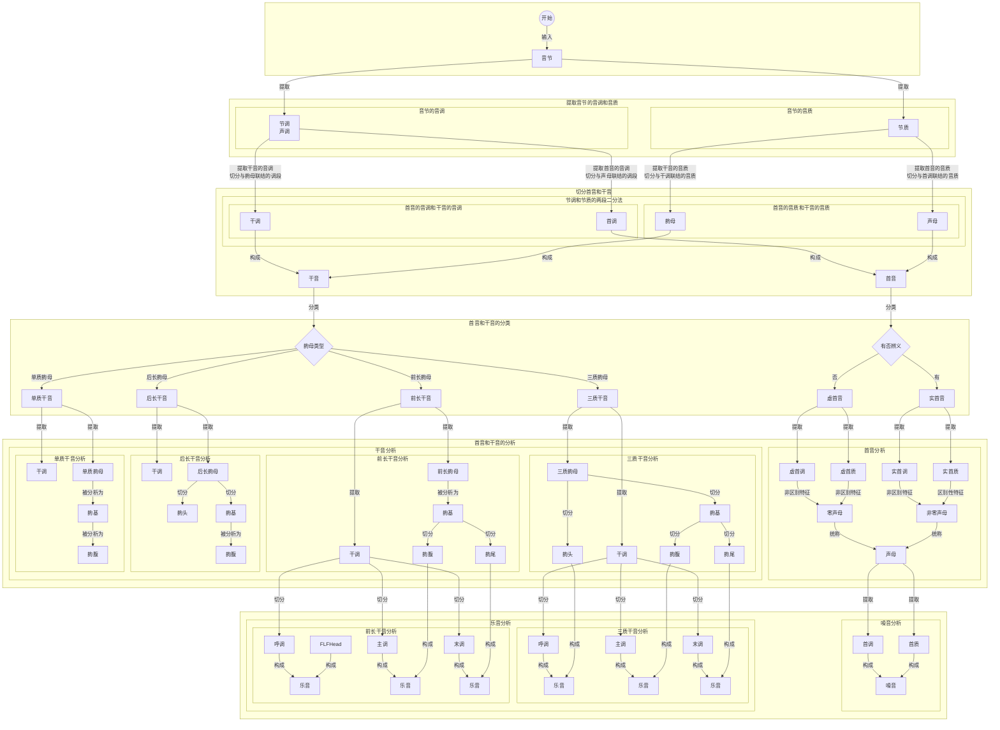

```mermaid
graph TD
  %% 输入层
  subgraph Input[" "]
  Start((开始)) --> |输入|Syllable[音节]
  end

%% 提取音调和音质
  subgraph ExtractToneAndQuality["提取音节的音调和音质"]
    subgraph ToneOfSyllable["音节的音调"]
      Syllable --> |提取| SyllabicTone[节调<br>声调]
    end
    subgraph QualityOfSyllable["音节的音质"]
      Syllable --> |提取| SyllabicQuality[节质]
    end
  end

  %% 切分首音和干音
  subgraph SyllableDichotomy["切分首音和干音"]
    subgraph QualitativeLayer["节调和节质的两段二分法"]
      subgraph ToneDichotomy["首音的音调和干音的音调"]
        SyllabicTone --> |提取首音的音调<br>切分与声母联结的调段| HeadTone[首调]
        SyllabicTone --> |提取干音的音调<br>切分与韵母联结的调段| TrunkTone[干调]
      end
      subgraph QualityDichotomy["首音的音质和干音的音质"]
        SyllabicQuality --> |提取首音的音质<br>切分与首调联结的音质|Initial[声母]
        SyllabicQuality --> |提取干音的音质<br>切分与干调联结的音质| Final[韵母]
      end
    end

    %% 构成首音和干音
    HeadTone --> |构成| Head[首音]
    Initial --> |构成| Head
    TrunkTone --> |构成| Trunk[干音]
    Final --> |构成| Trunk
  end

  %% 首音和干音分类
  subgraph HeadAndTrunkCategories["首音和干音的分类"]
    Head --> |分类| IsThereOrNot{有否辨义}
    IsThereOrNot --> |否| VoidHead[虚首音]
    IsThereOrNot --> |有| RealHead[实首音]

    Trunk --> |分类| FinalCategories{韵母类型}
    FinalCategories --> |三质韵母| TripleQualityTrunk[三质干音]
    FinalCategories --> |前长韵母| FrontLongTrunk[前长干音]
    FinalCategories --> |后长韵母| BackLongTrunk[后长干音]
    FinalCategories --> |单质韵母| SingleQualityTrunk[单质干音]
  end

  %% 首音和干音分析
  subgraph InitialAndSubsequentSoundDecompose["首音和干音的分析"]

    subgraph HeadAnalysis["首音分析"]
    VoidHead --> |提取| VoidHeadTone[虚首调]
    VoidHead --> |提取| VoidHeadQuality[虚首质]
    RealHead --> |提取| RealHeadTone[实首调]
    RealHead --> |提取| RealHeadQuality[实首质]
    VoidHeadTone --> |非区别特征| ZeroInitialConsonant[零声母]
    VoidHeadQuality --> |非区别特征| ZeroInitialConsonant[零声母]
    RealHeadTone --> |非区别特征| NonZeroInitialConsonant[非零声母]
    RealHeadQuality --> |区别性特征| NonZeroInitialConsonant[非零声母]
    ZeroInitialConsonant --> |统称| InitialConsonant[声母]
    NonZeroInitialConsonant --> |统称| InitialConsonant[声母]
    end

    subgraph TrunkAnalysis["干音分析"]
      subgraph TripleQuality["三质干音分析"]
      TripleQualityTrunk --> |提取| TQTrunkTone[干调]
      TripleQualityTrunk --> |提取| TQFinal[三质韵母]
      TQFinal --> |切分| TQFHead[韵头]
      TQFinal --> |切分| TQFRime[韵基]
      TQFRime --> |切分|TQFNuclear[韵腹]
      TQFRime --> |切分| TQFTail[韵尾]
      end

      subgraph FrontLong["前长干音分析"]
      FrontLongTrunk --> |提取| FLTrunkTone[干调]
      FrontLongTrunk --> |提取| FLFinal[前长韵母]
      FLFinal --> |被分析为| FLFRime[韵基]
      FLFRime --> |切分| FLFNuclear[韵腹]
      FLFRime --> |切分| FLFTail[韵尾]
      end

      subgraph BackLong["后长干音分析"]
      BackLongTrunk --> |提取| BLTrunkTone[干调]
      BackLongTrunk --> |提取| BLFinal[后长韵母]
      BLFinal --> |切分| BLFHead[韵头]
      BLFinal --> |切分| BLFRime[韵基]
      BLFRime --> |被分析为| BLFNuclear[韵腹]
      end

      subgraph SingleQuality["单质干音分析"]
      SingleQualityTrunk --> |提取| SQTrunkTone[干调]
      SingleQualityTrunk --> |提取| SQFinal[单质韵母]
      SQFinal --> |被分析为| SQFRime[韵基]
      SQFRime --> |被分析为| SQFNuclear[韵腹]
      end
    end
  end

  %% 输入层
  subgraph 音元分析[" "]
    subgraph 噪音分析["噪音分析"]
    InitialConsonant --> |提取| ToneOfHead[首调]
    InitialConsonant --> |提取| QualityOfHead[首质]
    ToneOfHead --> |构成| Noise[噪音]
    QualityOfHead --> |构成| Noise
    end
    subgraph 乐音分析["乐音分析"]
      subgraph 三质干音分析["三质干音分析"]
        TQTrunkTone --> |切分|FirstSegmentOfTQTT[呼调]
        TQTrunkTone --> |切分|LastSegmentOfTQTT[末调]
        TQTrunkTone --> |切分|MainSegmentOfTQTT[主调]
        FirstSegmentOfTQTT --> |构成|TQFirstMusicalSound[乐音]
        TQFHead --> |构成|TQFirstMusicalSound[乐音]
        MainSegmentOfTQTT --> |构成|TQMainMusicalSound[乐音]
        TQFNuclear --> |构成|TQMainMusicalSound[乐音]
        LastSegmentOfTQTT --> |构成|TQLastMusicalSound[乐音]
        TQFTail --> |构成|TQLastMusicalSound[乐音]
      end
      subgraph 前长干音分析["前长干音分析"]
        FLTrunkTone --> |切分|FirstSegmentOfFLTT[呼调]
        FLTrunkTone --> |切分|MainSegmentOfFLTT[主调]
        FLTrunkTone --> |切分|LastSegmentOfFLTT[末调]
        FirstSegmentOfFLTT --> |构成|FirstMusicalSound[乐音]
        FLFHead --> |构成|FirstMusicalSound
        MainSegmentOfFLTT --> |构成|MainMusicalSound[乐音]
        FLFNuclear --> |构成|MainMusicalSound
        LastSegmentOfFLTT --> |构成|LastMusicalSound[乐音]
        FLFTail --> |构成|LastMusicalSound
      end
    end
  end

```
