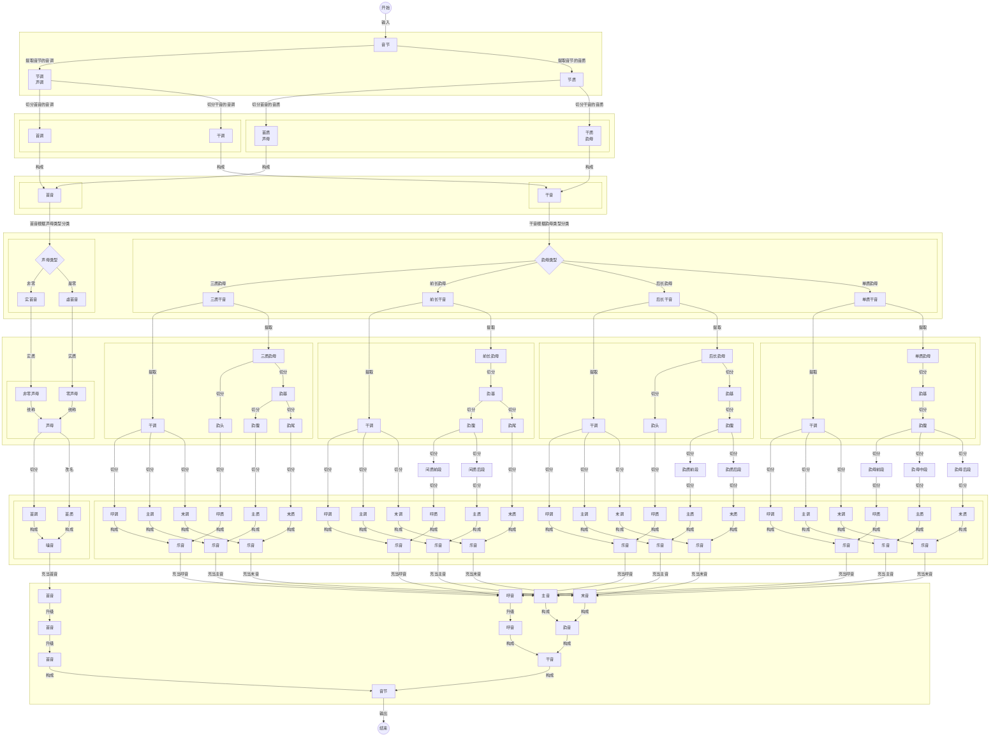

```mermaid
graph TB
    Start((开始)) --> |输入|A[音节]
    subgraph 提取音节的音调和音质[" "]
        A --> |提取音节的音调|B[节调<br>声调]
        A --> |提取音节的音质|C[节质]
    end

    subgraph 切分节调和节质[" "]
        subgraph 切分节调[" "]
        B --> |切分首音的音调|D1[首调]
        B --> |切分干音的音调|D2[干调]
        end
        subgraph 切分节质[" "]
        C --> |切分首音的音质|D3[首质<br>声母]
        C --> |切分干音的音质|D4[干质<br>韵母]
        end
    end

    subgraph 切分音节的首音和干音[" "]
        subgraph 首音[" "]
            D1 --> |构成|E1[首音]
            D3 --> |构成|E1
        end
        subgraph 干音[" "]
            D2 --> |构成|E2[干音]
            D4 --> |构成|E2
        end
    end

    subgraph 首音和干音的分类[" "]
        subgraph 首音分类[" "]
        E1 --> |首音根据声母类型分类|F1{声母类型}
        F1 --> |非零|H1[实首音]
        F1 --> |是零|H2[虚首音]
        end
        subgraph 干音分类[" "]
        E2 --> |干音根据韵母类型分类|F2{韵母类型}
        F2 --> |三质韵母|G1[三质干音]
        F2 --> |前长韵母|G2[前长干音]
        F2 --> |后长韵母|G3[后长干音]
        F2 --> |单质韵母|G4[单质干音]
        end
    end

    subgraph 传统分析[" "]
            subgraph 首音分析[" "]
            H1 --> |实质|H11[非零声母]
            H2 --> |实质|H21[零声母]
            H11 --> |统称|I0[声母]
            H21 --> |统称|I0
            end


            subgraph 单质[" "]
            G4 --> |提取|J0[干调]
            G4 --> |提取|J5[单质韵母]
            J5 --> |切分|J51[韵基]
            J51 --> |切分|J52[韵腹]
            end
            subgraph 后长[" "]
            G3 --> |提取|K0[干调]
            G3 --> |提取|K5[后长韵母]
            K5 --> |切分|K51[韵头]
            K5 --> |切分|K52[韵基]
            K52 --> |切分|K53[韵腹]
            end
            subgraph 前长[" "]
            G2 --> |提取|L0[干调]
            G2 --> |提取|L5[前长韵母]
            L5 --> |切分|L51[韵基]
            L51 --> |切分|L511[韵腹]
            L51 --> |切分|L512[韵尾]
            end
            subgraph 三质[" "]
            G1 --> |提取|M0[干调]
            G1 --> |提取|M5[三质韵母]
            M5 --> |切分|M51[韵头]
            M5 --> |切分|M52[韵基]
            M52 --> |切分|M521[韵腹]
            M52 --> |切分|M522[韵尾]
            end
    end

    I0 --> |切分|I22[首调]
    I0 --> |改名|I21[首质]

    J0 --> |切分|J1[呼调]
    J0 --> |切分|J3[主调]
    J0 --> |切分|J4[末调]
    J52 --> |切分|J531[韵母前段]
    J52 --> |切分|J532[韵母中段]
    J52 --> |切分|J533[韵母后段]
    J531 --> |切分|J6[呼质]
    J532 --> |切分|J8[主质]
    J533 --> |切分|J9[末质]

    K0 --> |切分|K1[呼调]
    K0 --> |切分|K3[主调]
    K0 --> |切分|K4[末调]
    K51 --> |切分|K6[呼质]
    K53 --> |切分|K531[韵质前段]
    K53 --> |切分|K532[韵质后段]
    K531 --> |切分|K8[主质]
    K532 --> |切分|K9[末质]


    L0 --> |切分|L2[呼调]
    L0 --> |切分|L3[主调]
    L0 --> |切分|L4[末调]
    L511 --> |切分|L5111[间质前段]
    L511 --> |切分|L5112[间质后段]
    L5111 --> |切分|L7[呼质]
    L5112 --> |切分|L8[主质]

    L512 --> |切分|L9[末质]

    M0 --> |切分|M1[呼调]
    M0 --> |切分|M3[主调]
    M0 --> |切分|M4[末调]
    M51 --> |切分|M6[呼质]
    M521 --> |切分|M8[主质]
    M522 --> |切分|M9[末质]

    subgraph 音元分析[" "]
        subgraph 噪音[" "]
            I22 --> |构成|N1[噪音]
            I21 --> |构成|N1
        end
        subgraph 乐音[" "]
            J1 --> |构成|N2[乐音]
            J6 --> |构成|N2
            J3 --> |构成|N3[乐音]
            J8 --> |构成|N3
            J4 --> |构成|N4[乐音]
            J9 --> |构成|N4

            K1 --> |构成|O1[乐音]
            K6 --> |构成|O1
            K3 --> |构成|O2[乐音]
            K8 --> |构成|O2
            K4 --> |构成|O3[乐音]
            K9 --> |构成|O3

            L2 --> |构成|P1[乐音]
            L7 --> |构成|P1
            L3 --> |构成|P2[乐音]
            L8 --> |构成|P2
            L4 --> |构成|P3[乐音]
            L9 --> |构成|P3

            M1 --> |构成|Q1[乐音]
            M6 --> |构成|Q1
            M3 --> |构成|Q2[乐音]
            M8 --> |构成|Q2
            M4 --> |构成|Q3[乐音]
            M9 --> |构成|Q3
        end
    end

    subgraph 音节层次结构模型[" "]
        N1 --> |充当首音|R1[首音]
        N2 --> |充当呼音|R2[呼音]
        N3 --> |充当主音|R3[主音]
        N4 --> |充当末音|R4[末音]

        O1 --> |充当呼音|R2
        O2 --> |充当主音|R3
        O3 --> |充当末音|R4

        P1 --> |充当呼音|R2
        P2 --> |充当主音|R3
        P3 --> |充当末音|R4

        Q1 --> |充当呼音|R2
        Q2 --> |充当主音|R3
        Q3 --> |充当末音|R4

        R1 --> |升级|S1[首音]
        R2 --> |升级|S2[呼音]
        R3 --> |构成|S3[韵音]
        R4 --> |构成|S3

        S1 --> |升级|T1[首音]
        S2 --> |构成|T2[干音]
        S3 --> |构成|T2

        T1 --> |构成|U1[音节]
        T2 --> |构成|U1
    end
    U1 --> |输出|End((结束))
```
