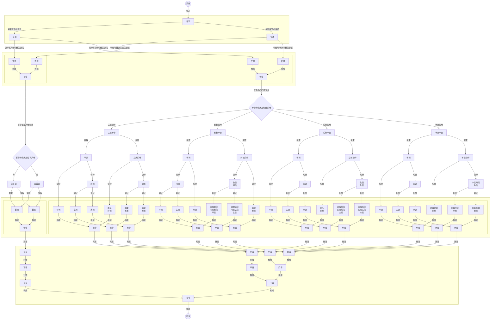

```mermaid
graph TB
    Start((开始)) --> |输入|A[音节]
    subgraph 提取音节的音调和音质[" "]
        A --> |提取音节的音调|B[节调]
        A --> |提取音节的音质|C[节质]
    end

    B --> |切分与声母联结的调段|D1[首调]
    B --> |切分与韵母联结的调段|D2[干调]
    C --> |切分与首调联结的音质|D3[声母]
    C --> |切分与干调联结的音质|D4[韵母]

    subgraph 切分音节的首音和干音[" "]
        subgraph 首音[" "]
            D1 --> |构成|E1[首音]
            D3 --> |构成|E1
        end
        subgraph 干音[" "]
            D2 --> |构成|E2[干音]
            D4 --> |构成|E2
        end
    end

    E1 --> |首音根据声母分类|F1{首音的音质是否零声母}
    F1 --> |非|H1[实首音]
    F1 --> |是|H2[虚首音]

    H1 --> |提取|I1[首调]
    H2 --> |提取|I1
    H1 --> |提取|I2[首质]
    H2 --> |提取|I2

    E2 --> |干音根据韵母分类|F2{干音的音质是何类韵母}
    F2 --> |三质韵母|G1[三质干音]
    F2 --> |前长韵母|G2[前长干音]
    F2 --> |后长韵母|G3[后长干音]
    F2 --> |单质韵母|G4[单质干音]

    G4 --> |提取|J0[干调]
    J0 --> |切分|J1[呼调]
    J0 --> |切分|J2[韵调]
    J2 --> |切分|J3[主调]
    J2 --> |切分|J4[末调]
    G4 --> |提取|J5[单质韵母]
    J5 --> |切分|J6[韵母前段<br>呼质]
    J5 --> |切分|J7[中后两段<br>韵质]
    J7 --> |切分|J8[韵母中段<br>主质]
    J7 --> |切分|J9[韵母后段<br>末质]

    G3 --> |提取|K0[干调]
    K0 --> |切分|K1[呼调]
    K0 --> |切分|K2[韵调]
    K2 --> |切分|K3[主调]
    K2 --> |切分|K4[末调]
    G3 --> |提取|K5[后长韵母]
    K5 --> |切分|K6[韵头<br>呼质]
    K5 --> |切分|K7[韵腹<br>韵质]
    K7 --> |切分|K8[韵腹前段<br>韵质前段<br>主质]
    K7 --> |切分|K9[韵腹后段<br>韵质后段<br>末质]

    G2 --> |提取|L0[干调]
    L0 --> |切分|L1[间调]
    L0 --> |切分|L4[末调]
    L1 --> |切分|L2[呼调]
    L1 --> |切分|L3[主调]
    G2 --> |提取|L5[前长韵母]
    L5 --> |切分|L6[韵腹<br>间质]
    L6 --> |切分|L7[韵腹前段<br>间质前段<br>呼质]
    L6 --> |切分|L8[韵腹后段<br>间质后段<br>主质]
    L5 --> |切分|L9[韵尾<br>末质]

    G1 --> |提取|M0[干调]
    M0 --> |切分|M1[呼调]
    M0 --> |切分|M2[韵调]
    M2 --> |切分|M3[主调]
    M2 --> |切分|M4[末调]
    G1 --> |提取|M5[三质韵母]
    M5 --> |切分|M6[韵头<br>呼质]
    M5 --> |切分|M7[韵质]
    M7 --> |切分|M8[韵腹<br>主质]
    M7 --> |切分|M9[韵尾<br>末质]

    subgraph 音元分析[" "]
        subgraph 噪音[" "]
            I1 --> |构成|N1[噪音]
            I2 --> |构成|N1
        end
        subgraph 乐音[" "]
            J1 --> |构成|N2[乐音]
            J6 --> |构成|N2
            J3 --> |构成|N3[乐音]
            J8 --> |构成|N3
            J4 --> |构成|N4[乐音]
            J9 --> |构成|N4

            K1 --> |构成|O1[乐音]
            K6 --> |构成|O1
            K3 --> |构成|O2[乐音]
            K8 --> |构成|O2
            K4 --> |构成|O3[乐音]
            K9 --> |构成|O3

            L2 --> |构成|P1[乐音]
            L7 --> |构成|P1
            L3 --> |构成|P2[乐音]
            L8 --> |构成|P2
            L4 --> |构成|P3[乐音]
            L9 --> |构成|P3

            M1 --> |构成|Q1[乐音]
            M6 --> |构成|Q1
            M3 --> |构成|Q2[乐音]
            M8 --> |构成|Q2
            M4 --> |构成|Q3[乐音]
            M9 --> |构成|Q3
        end
    end

    subgraph 音节层次结构模型[" "]
        N1 --> |充当|R1[首音]
        N2 --> |充当|R2[呼音]
        N3 --> |充当|R3[主音]
        N4 --> |充当|R4[末音]

        O1 --> |充当|R2
        O2 --> |充当|R3
        O3 --> |充当|R4

        P1 --> |充当|R2
        P2 --> |充当|R3
        P3 --> |充当|R4

        Q1 --> |充当|R2
        Q2 --> |充当|R3
        Q3 --> |充当|R4

        R1 --> |升级|S1[首音]
        R2 --> |升级|S2[呼音]
        R3 --> |构成|S3[韵音]
        R4 --> |构成|S3

        S1 --> |升级|T1[首音]
        S2 --> |构成|T2[干音]
        S3 --> |构成|T2

        T1 --> |构成|U1[音节]
        T2 --> |构成|U1
    end
    U1 --> |输出|End((结束))
```
