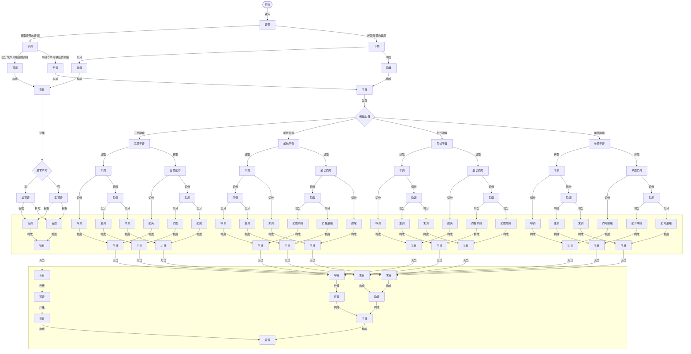

```mermaid
graph TB
    A([开始]) -->|输入|B[音节]
    B --> |析取音节的音调|C1[节调]
    B --> |析取音节的音质|C2[节质]

    C1 --> |切分与声母联结的调段|D1[首调]
    C1 --> |切分与声母联结的调段|D2[干调]
    C2 --> |切分|D3[声母]
    C2 --> |切分|D4[韵母]

    D1 --> |构成|E1[首音]
    D3 --> |构成|E1
    D2 --> |构成|E2[干音]
    D4 --> |构成|E2

    E1 --> |分类|F1{是零声母}
    F1 --> |是|H1[虚首音]
    F1 --> |否|H2[实首音]

    E2 --> |分类|F2{何类韵母}
    F2 --> |三质韵母|G1[三质干音]
    F2 --> |前长韵母|G2[前长干音]
    F2 --> |后长韵母|G3[后长干音]
    F2 --> |单质韵母|G4[单质干音]

    H1 --> |析取|I1[首调]
    H1 --> |析取|I2[首质]
    H2 --> |析取|I1
    H2 --> |析取|I2

    G4 --> |析取|J1[干调]
    J1 --> |切分|J2[呼调]
    J1 --> |切分|J3[韵调]
    J3 --> |切分|J4[主调]
    J3 --> |切分|J5[末调]
    G4 --> |析取|J6[单质韵母]
    J6 --> |切分|J7[韵母前段]
    J6 --> |切分|J8[韵质]
    J8 --> |切分|J9[韵母中段]
    J8 --> |切分|J10[韵母后段]

    G3 --> |析取|K1[干调]
    K1 --> |切分|K2[呼调]
    K1 --> |切分|K3[韵调]
    K3 --> |切分|K4[主调]
    K3 --> |切分|K5[末调]
    G3 --> |析取|K6[后长韵母]
    K6 --> |切分|K7[韵头]
    K6 --> |切分|K8[韵腹]
    K8 --> |切分|K9[韵腹前段]
    K8 --> |切分|K10[韵腹后段]

    G2 --> |析取|L1[干调]
    L1 --> |切分|L2[间调]
    L2 --> |切分|L3[呼调]
    L2 --> |切分|L4[主调]
    L1 --> |切分|L5[末调]
    G2 --> |析取|L6[前长韵母]
    L6 --> |切分|L7[韵腹]
    L7 --> |切分|L8[韵腹前段]
    L7 --> |切分|L9[韵腹后段]
    L6 --> |切分|L10[韵尾]

    G1 --> |析取|M1[干调]
    M1 --> |切分|M2[呼调]
    M1 --> |切分|M3[韵调]
    M3 --> |切分|M4[主调]
    M3 --> |切分|M5[末调]
    G1 --> |析取|M6[三质韵母]
    M6 --> |切分|M7[韵头]
    M6 --> |切分|M8[韵质]
    M8 --> |切分|M9[韵腹]
    M8 --> |切分|M10[韵尾]

    subgraph 音元分析[" "]
        I1 --> |构成|N1[噪音]
        I2 --> |构成|N1
        J2 --> |构成|N2[乐音]
        J7 --> |构成|N2
        J4 --> |构成|N3[乐音]
        J9 --> |构成|N3
        J5 --> |构成|N4[乐音]
        J10 --> |构成|N4

        K2 --> |构成|O1[乐音]
        K7 --> |构成|O1
        K4 --> |构成|O2[乐音]
        K9 --> |构成|O2
        K5 --> |构成|O3[乐音]
        K10 --> |构成|O3

        L3 --> |构成|P1[乐音]
        L8 --> |构成|P1
        L4 --> |构成|P2[乐音]
        L9 --> |构成|P2
        L5 --> |构成|P3[乐音]
        L10 --> |构成|P3

        M2 --> |构成|Q1[乐音]
        M7 --> |构成|Q1
        M4 --> |构成|Q2[乐音]
        M9 --> |构成|Q2
        M5 --> |构成|Q3[乐音]
        M10 --> |构成|Q3
    end

    subgraph 音节层次结构模型[" "]
        N1 --> |充当|R1[首音]
        N2 --> |充当|R2[呼音]
        N3 --> |充当|R3[主音]
        N4 --> |充当|R4[末音]

        O1 --> |充当|R2
        O2 --> |充当|R3
        O3 --> |充当|R4

        P1 --> |充当|R2
        P2 --> |充当|R3
        P3 --> |充当|R4

        Q1 --> |充当|R2
        Q2 --> |充当|R3
        Q3 --> |充当|R4

        R1 --> |升级|S1[首音]
        R2 --> |升级|S2[呼音]
        R3 --> |构成|S3[韵音]
        R4 --> |构成|S3

        S1 --> |升级|T1[首音]
        S2 --> |构成|T2[干音]
        S3 --> |构成|T2

        T1 --> |构成|U1[音节]
        T2 --> |构成|U1
    end

```
