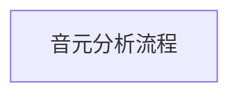
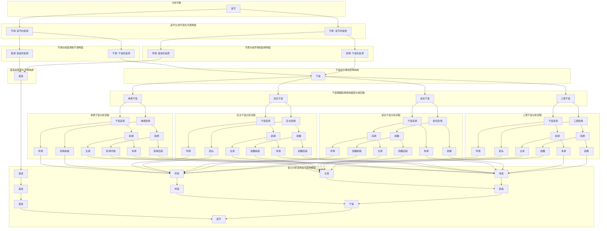

# 音元分析流程

## 音元分析流程描述

**开始**

- 音元分析法开始

**音节分析**

- 音节被分析成音元序列

**首音与干音**

- 音节由首音和干音构成
  - **首音**
    - 由首调与声母构成
    - 首调是与声母联结的调段
    - 首音由噪音充当
    - **干音**
      - 由干调与韵母构成
        - 干调是与韵母联结的调段
        - 干音由乐音构成

**干音分类**

- 干音分成四类:
  - **三质干音**
    - 由干调与三质韵母构成
      - 三质韵母由韵头、韵腹和韵尾构成
      - 干调分成呼调、主调和末调
        - 呼调与韵头构成呼音
        - 主调与韵腹构成主音
        - 末调与韵尾构成末音
    - **前长干音**
      - 由干调与前长韵母构成
      - 前长韵母由韵腹和韵尾构成
      - 干调分成间调和末调
        - 间调与韵腹构成间音
          - 间调分成呼调和主调
          - 韵腹分成呼质和主质（韵腹前段和韵腹后段）
          - 呼调与呼质构成呼音
          - 主调与主质构成主音
        - 末调与韵尾构成末音
    - **后长干音**
      - 由干调与后长韵母构成
      - 后长韵母由韵头和韵腹构成
      - 干调分成呼调和韵调
        - 呼调与韵头构成呼音
        - 韵调与韵腹构成韵音
          - 韵调分成主调和末调
          - 韵腹分成主质和末质（韵腹前段和韵腹后段）
          - 主调和主质构成主音
          - 末调和末质构成末音
    - **单质干音**
      - 由干调与单质韵母构成
      - 单质韵母由韵腹充当
      - 干调分成呼调、主调和末调
      - 韵母分成呼质、主质和末质（韵母前段、韵母中段和韵母后段）
        - 呼调与呼质构成呼音
        - 主调与主质构成主音
        - 末调与末质构成末音

**结束**

- 音元分析法结束

## 延伸方向

**音元分类的详细解释**：
音元分析法是把音节分析成音元序列的方法

在音元分析中，音节由首音和干音构成。首音是位处音节首段的音段，由首调与声母构成。首调是与声母联结的调段。干音是除首音外的音段，由干调与韵母构成。干调是与韵母联结的调段。音元分成噪音和乐音两类。首音都由噪音充当。干音都由乐音构成。

干音，根据韵母结构类型，分成三质干音、前长干音、后长干音和单质干音四类。三质干音由干调与三质韵母构成。前长干音由干调与前长韵母构成。后长干音由干调与后长韵母构成。单质干音由干调与单质韵母构成。

在三质干音中，三质韵母由韵头、韵腹和韵尾构成。相对应地，干调分成与韵头联结的调段、与调腹联结的调段和与调尾联结的调段三段，依序简称呼调、主调和末调。呼调与韵头构成呼音。主调与韵腹构成主音。末调与韵尾构成末音。呼音简单地说是指构成音节的第二个音元。主音意指构成音节的最主要音元。末音意指位处音节末位的音元。

在前长干音中，前长韵母由韵腹和韵尾构成。相对应地，干调分成与韵腹联结的调段和与韵尾联结的调段两段，依序简称间调和末调。间调与韵腹构成间音。末调与韵尾构成末音。间音意指间居在首音和末音间的音段。由于间调与三质干音的由呼调和主调构成的间调对应相同，所以间调分成呼调和主调两段。相对应地，间音分成呼音和主音两段。

在后长干音中，后长韵母由韵头和韵腹构成。相对应地，干调分成与韵头联结的调段和与韵腹联结的调段两段，依序简称呼调和韵调。呼调与韵头构成呼音。韵调与韵腹构成韵音。韵音指韵调与韵基或韵身构成的音段。由于韵调与三质干音的由主调和末调构成的韵调对应相同，所以韵调分成主调和末调两段。相对应地，韵音分成主音和末音两段。

在单质干音中，单质韵母由韵腹充当。相对应地，干调就是与韵母联结的调段，就是干音的音调。由于干调与三质干音的由呼调、主调和末调构成的干调对应相同，所以干调分成呼调、主调和末调三段。相对应地，干音分成呼音、主音和末音三段。

**音元分析法的应用场景**：音元分析法在语音识别和语音合成中的具体应用。

**音元分析法的历史与发展**：音元分析法的发展历程。

### 音元分析流程

### Key Terminology

1. **音元 (Phonetic Variable)**
   - 音节(Syllable) → **Initial（首音）** + **Divrhyme（干音）**
   - 音节(Syllable) → **Tone（节调）** + **Syllabic Quality（节质）**
     - 节调 (音节的音调 Tone)
     - 节质 (音节的音质 Syllabic Quality)
     - Syllabic Quality = 声母 (Initial) + 韵母 (Final)

2. **首音 (Initial)**
   - 首调 (Tonal Segment Connected to the Initial Consonant) + 声母 (Initial Consonant)
3. **干音 (干音)**
   - 干调 (Tonal Segment Connected to the Final) + 韵母 (Final)
4. **四类干音 (干音 Types)**
   - 三质干音 (Tri_Quality Divrhyme)
   - 前长干音 (Front Long Divrhyme)
   - 后长干音 (Back Long Divrhyme)
   - 单质干音 (Single Quality Divrhyme)
5. **调段 (Tone Segmentation)**
   - 呼调 (Tonal Segment Connected to the Medial)
   - 主调 (Tonal Segment Connected to the Nucleus of the Tri_Quality Final)
   - 末调 (Tonal Segment Connected to the coda)
   - 间调 (Tonal Segment Connected to the Nucleus of the Front Long Final)
   - 韵调 (Tonal Segment Connected to the Nucleus of the Back Long Final)
6. **音元组成 (Phonetic Variable Formation)**
   - 呼音(呼调+呼质)
     - 呼质=韵头/前长韵母的韵腹前段/单质韵母前段
   - 主音 (主调+主质)
     - 主质=三质韵母的韵腹/前长韵母的韵腹后段/后长韵母的韵腹前段/单质韵母中段
   - 末音 (末末调+末质)
     - 末质 (韵尾/后长韵母的韵腹后段/单质韵母后段)
7. **音节结构 (Syllable Structure)**
   - 音节 = 首音 + 呼音 + 主音 + 末音
   - 音节 = 首音 + 呼音 + 韵音
   - 韵音 = 主音 + 末音
   - 音节 = 首音 + 干音
   - 干音 = 呼音 + 韵音
   - 音节 = 首音 + 间音 + 末音
   - 间音 = 呼音 + 主音
