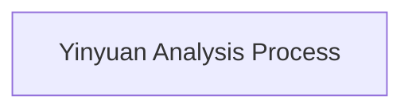

# Yinyuan Analysis Process

## Description of the Yinyuan Analysis Process

**Start**

- Begin the yinyuan(phonetic variable) analysis

**Yinjie Analysis**

- Syllables are analyzed into yinyuan sequence

**Shouyin and Ganyin**

- A syllable consists of an shouyin(initial) and a ganyin(divisional rhyme or final with tone)
  - **Shouyin**
    - Composed of an shouyin tone and an shouyin quality
      - The shouyin tone is the tonal segment connected to the shouyin quality
      - The shouyin is represented by unpitched sound
  - **Ganyin**
    - Composed of a ganyin tone and a final
      - The ganyin tone is the tonal segment connected to the final
      - The ganyin is represented by sequences of pitched sound

**Ganyin Classification**

- Ganyin is divided into four types:
  - **Tri-quality Ganyin**
    - Composed of a ganyin tone and a tri-quality final
      - The tri-quality final consists of a medial, nucleus, and coda
      - The ganyin tone is divided into onset tone, main tone, and coda tone
      - Onset tone and medial form the onset sound
      - Main tone and nucleus form the main sound
      - Coda tone and coda form the coda sound
  - **Front Long Ganyin**
    - Composed of a ganyin tone and a front long final
    - The front long final consists of a nucleus and coda
    - The ganyin tone is divided into medial tone and coda tone
      - Medial tone and nucleus form the medial sound
      - Medial tone is further divided into onset tone and main tone
      - The nucleus is divided into onset quality and main quality (anterior and posterior parts of the nucleus)
      - Onset tone and onset quality form the onset sound
      - Main tone and main quality form the main sound
      - Coda tone and coda form the coda sound
  - **Back Long Ganyin**
    - Composed of a ganyin tone and a back long final
    - The back long final consists of a medial and a nucleus
    - The ganyin tone is divided into onset tone and rhyme tone
      - Onset tone and medial form the onset sound
      - Rhyme tone and nucleus form the rhyme sound
      - Rhyme tone is further divided into main tone and coda tone
      - The nucleus is divided into main quality and coda quality (anterior and posterior parts of the nucleus)
      - Main tone and main quality form the main sound
      - Coda tone and coda quality form the coda sound
  - **Single Quality Ganyin**
    - Composed of a ganyin tone and a single quality final
    - The single quality final is represented by the nucleus
    - The ganyin tone is divided into onset tone, main tone, and coda tone
    - The final is divided into onset quality, main quality, and coda quality (anterior, middle, and posterior parts of the final)
      - Onset tone and onset quality form the onset sound
      - Main tone and main quality form the main sound
      - Coda tone and coda quality form the coda sound

**End**

- End of the yinyuan analysis

## Further Directions

**Detailed Explanation of Yinyuan Classification**:
The yinyuan analysis is a way to analyze syllables into yinyuan sequence.

In this analysis, a syllable consists of an shouyin and a ganyin. The shouyin is the segment at the beginning of the syllable, composed of an shouyin tone and an shouyin quality. The shouyin tone is the tonal segment connected to the shouyin quality. The ganyin is the segment excluding the shouyin, composed of a ganyin tone and a final. The ganyin tone is the tonal segment connected to the final. Phonetic variables are divided into noise and musical sound. The shouyin is always represented by unpitched sound. The ganyin is always represented by sequences of pitched sound.

Ganyin, according to the structure of the final, is divided into tri-quality ganyin, front long ganyin, back long ganyin, and single quality ganyin. Tri-quality ganyin is composed of a ganyin tone and a tri-quality final. Front long ganyin is composed of a ganyin tone and a front long final. Back long ganyin is composed of a ganyin tone and a back long final. Single quality ganyin is composed of a ganyin tone and a single quality final.

In tri-quality ganyin, the tri-quality final consists of a medial, nucleus, and coda. Correspondingly, the ganyin tone is divided into three segments: the segment connected to the medial, the segment connected to the nucleus, and the segment connected to the coda, abbreviated as onset tone, main tone, and coda tone. Onset tone and medial form the onset sound. Main tone and nucleus form the main sound. Coda tone and coda form the coda sound. The onset sound is simply the second yinyuan in the syllable. The main sound is the most important yinyuan in the syllable. The coda sound is the yinyuan at the end of the syllable.

In front long ganyin, the front long final consists of a nucleus and coda. Correspondingly, the ganyin tone is divided into two segments: the segment connected to the nucleus and the segment connected to the coda, abbreviated as medial tone and coda tone. Medial tone and nucleus form the medial sound. Coda tone and coda form the coda sound. The medial sound is the segment between the shouyin and the coda sound. Since the medial tone corresponds to the onset tone and main tone of the tri-quality ganyin, the medial tone is divided into onset tone and main tone. Correspondingly, the medial sound is divided into onset sound and main sound.

In back long ganyin, the back long final consists of a medial and a nucleus. Correspondingly, the ganyin tone is divided into two segments: the segment connected to the medial and the segment connected to the nucleus, abbreviated as onset tone and rhyme tone. Onset tone and medial form the onset sound. Rhyme tone and nucleus form the rhyme sound. The rhyme sound refers to the segment formed by the rhyme tone and the rhyme base or rhyme body. Since the rhyme tone corresponds to the main tone and coda tone of the tri-quality ganyin, the rhyme tone is divided into main tone and coda tone. Correspondingly, the rhyme sound is divided into main sound and coda sound.

In single quality ganyin, the single quality final is represented by the nucleus. Correspondingly, the ganyin tone is the segment connected to the final, which is the tone of the ganyin. Since the ganyin tone corresponds to the onset tone, main tone, and coda tone of the tri-quality ganyin, the ganyin tone is divided into onset tone, main tone, and coda tone. Correspondingly, the ganyin is divided into onset sound, main sound, and coda sound.

**Application Scenarios of the Yinyuan Analysis Method**:
Specific applications of the yinyuan analysis in speech recognition and speech synthesis.

**History and Development of the Yinyuan Analysis Method**:
The development history of the yinyuan analysis.

### Yinyuan Analysis Process

```mermaid
graph TD
   subgraph AnalysisObject["Analysis Object"]
   InputSyllable[Yinjie]
   end

   subgraph QualityToneLayer["Yinjie Divided into Tone and Quality Layers"]
   InputSyllable --> SyllableTone[Tone: Yinjie Tone]
   InputSyllable --> SyllableQuality[Quality: Yinjie Quality]
   end

   subgraph SyllableToneLayer["Yinjie Tone Divided into Shouyin Tone and Ganyin Tone"]
   SyllableTone --> InitialTone[Shouyin Tone: Tone of Shouyin]
   SyllableTone --> DivRhymeTone[Ganyin Tone: Tone of Ganyin]
   end

   subgraph SyllableQualityLayer["Yinjie Quality Divided into Shouyin and Final"]
   SyllableQuality --> InitialConsonant[Shouyin: Quality of Shouyin]
   SyllableQuality --> Final[Final: Quality of Ganyin]
   end

   subgraph InitialFormation["Shouyin Formed by Shouyin Tone and Shouyin Consonant"]
   InitialTone --> InputInitial[Shouyin]
   InitialConsonant --> InputInitial[Shouyin]
   end

   subgraph DivRhymeFormation["Ganyin Formed by Ganyin Tone and Final"]
   DivRhymeTone --> InputDivRhyme[Ganyin]
   Final --> InputDivRhyme[Ganyin]
   end

   subgraph DivRhymeTypes["Ganyin Divided into Four Types by Final Structure"]
   InputDivRhyme --> TriQualityDivRhyme[Tri-quality Ganyin]
   InputDivRhyme --> FrontLongDivRhyme[Front Long Ganyin]
   InputDivRhyme --> BackLongDivRhyme[Back Long Ganyin]
   InputDivRhyme --> SingleQualityDivRhyme[Single Quality Ganyin]
   end

   subgraph SingleQualityDivRhymeAnalysis["Single Quality Ganyin Analysis Process"]

   SingleQualityDivRhyme --> SQDivRhymeTone[Ganyin Tone]
   SQDivRhymeTone --> SQDivRhymeRhymeTone[Rhyme Tone]
   SQDivRhymeTone --> SQDivRhymeOnsetTone[Onset Tone]
   SQDivRhymeRhymeTone --> SQDivRhymeMainTone[Main Tone]
   SQDivRhymeRhymeTone --> SQDivRhymeCodaTone[Coda Tone]

   SingleQualityDivRhyme --> SQDivRhymeQuality[Single Quality Final]
   SQDivRhymeQuality --> SQDivRhymeRhymeQuality[Rhyme Quality]
   SQDivRhymeQuality --> SQDivRhymeOnsetQuality[Final Anterior]
   SQDivRhymeRhymeQuality --> SQDivRhymeMainQuality[Final Middle]
   SQDivRhymeRhymeQuality --> SQDivRhymeCodaQuality[Final Posterior]

   end

   subgraph BackLongDivRhymeAnalysis["Back Long Ganyin Analysis Process"]

   BackLongDivRhyme --> BLDivRhymeQuality[Back Long Final]
   BLDivRhymeQuality --> BLDivRhymeOnsetQuality[Medial]
   BLDivRhymeQuality --> BLDivRhymeRhymeQuality[Nucleus]
   BLDivRhymeRhymeQuality --> BLDivRhymeMainQuality[Nucleus Anterior]
   BLDivRhymeRhymeQuality --> BLDivRhymeCodaQuality[Nucleus Posterior]

   BackLongDivRhyme --> BLDivRhymeTone[Ganyin Tone]
   BLDivRhymeTone --> BLDivRhymeOnsetTone[Onset Tone]
   BLDivRhymeTone --> BLDivRhymeRhymeTone[Rhyme Tone]
   BLDivRhymeRhymeTone --> BLDivRhymeMainTone[Main Tone]
   BLDivRhymeRhymeTone --> BLDivRhymeCodaTone[Coda Tone]
   end

   subgraph FrontLongDivRhymeAnalysis["Front Long Ganyin Analysis Process"]

   FrontLongDivRhyme --> FLDivRhymeQuality[Front Long Final]
   FLDivRhymeQuality --> FLDivRhymeMedialQuality[Nucleus]
   FLDivRhymeMedialQuality --> FLDivRhymeOnsetQuality[Nucleus Anterior]
   FLDivRhymeMedialQuality --> FLDivRhymeMainQuality[Nucleus Posterior]
   FLDivRhymeQuality --> FLDivRhymeCodaQuality[Coda]

   FrontLongDivRhyme --> FLDivRhymeTone[Ganyin Tone]
   FLDivRhymeTone --> FLDivRhymeMedialTone[Medial Tone]
   FLDivRhymeMedialTone --> FLDivRhymeOnsetTone[Onset Tone]
   FLDivRhymeMedialTone --> FLDivRhymeMainTone[Main Tone]
   FLDivRhymeTone --> FLDivRhymeCodaTone[Coda Tone]
   end

   subgraph TriQualityDivRhymeAnalysis["Tri-quality Ganyin Analysis Process"]
   TriQualityDivRhyme --> TQDivRhymeQuality[Tri-quality Final]
   TQDivRhymeQuality --> TQDivRhymeOnsetQuality[Medial]
   TQDivRhymeQuality --> TQDivRhymeRhymeQuality[Rhyme Quality]
   TQDivRhymeRhymeQuality --> TQDivRhymeMainQuality[Nucleus]
   TQDivRhymeRhymeQuality --> TQDivRhymeCodaQuality[Coda]

   TriQualityDivRhyme --> TQDivRhymeTone[Ganyin Tone]
   TQDivRhymeTone --> TQDivRhymeOnsetTone[Onset Tone]
   TQDivRhymeTone --> TQDivRhymeRhymeTone[Rhyme Tone]
   TQDivRhymeRhymeTone --> TQDivRhymeMainTone[Main Tone]
   TQDivRhymeRhymeTone --> TQDivRhymeCodaTone[Coda Tone]
   end

   SQDivRhymeOnsetTone --> OnsetSound[Onset Sound]
   SQDivRhymeOnsetQuality --> OnsetSound[Onset Sound]
   SQDivRhymeMainTone --> MainSound[Main Sound]
   SQDivRhymeMainQuality --> MainSound[Main Sound]
   SQDivRhymeCodaTone --> CodaSound[Coda Sound]
   SQDivRhymeCodaQuality --> CodaSound[Coda Sound]

   BLDivRhymeOnsetTone --> OnsetSound[Onset Sound]
   BLDivRhymeOnsetQuality --> OnsetSound[Onset Sound]
   BLDivRhymeMainTone --> MainSound[Main Sound]
   BLDivRhymeMainQuality --> MainSound[Main Sound]
   BLDivRhymeCodaTone --> CodaSound[Coda Sound]
   BLDivRhymeCodaQuality --> CodaSound[Coda Sound]

   FLDivRhymeOnsetTone --> OnsetSound[Onset Sound]
   FLDivRhymeOnsetQuality --> OnsetSound[Onset Sound]
   FLDivRhymeMainTone --> MainSound[Main Sound]
   FLDivRhymeMainQuality --> MainSound[Main Sound]
   FLDivRhymeCodaTone --> CodaSound[Coda Sound]
   FLDivRhymeCodaQuality --> CodaSound[Coda Sound]

   TQDivRhymeOnsetTone --> OnsetSound[Onset Sound]
   TQDivRhymeOnsetQuality --> OnsetSound[Onset Sound]
   TQDivRhymeMainTone --> MainSound[Main Sound]
   TQDivRhymeMainQuality --> MainSound[Main Sound]
   TQDivRhymeCodaTone --> CodaSound[Coda Sound]
   TQDivRhymeCodaQuality --> CodaSound[Coda Sound]

   subgraph PhoneticVariableAnalysis["Yinjie Structure Model of the Yinyuan Analysis Method"]
   MainSound --> RhymeSound[Rhyme Sound]
   CodaSound --> RhymeSound[Rhyme Sound]
   OnsetSound --> RhymeLayerOnsetSound[Onset Sound] --> Ganyin[Ganyin]
   RhymeSound --> Ganyin[Ganyin]
   InputInitial --> Shouyin[Shouyin] --> RhymeLayerInitial[Shouyin] --> DivRhymeLayerInitial[Shouyin] --> Yinjie[Yinjie]
   Ganyin --> Yinjie[Yinjie]
   end
```

### Key Terminology

1. **Yinyuan (音元)**
   - Yinjie → **Shouyin** + **Ganyin**
   - Yinjie → **Tone** + **Syllabic Quality**
     - Tone (Yinjie Tone)
     - Syllabic Quality (Yinjie Quality)
     - Syllabic Quality = Shouyin (Shouyin Consonant) + Final

2. **Shouyin**
   - Shouyin Tone (Tonal Segment Connected to the Shouyin Consonant) + Shouyin Consonant
3. **Ganyin**
   - Ganyin Tone (Tonal Segment Connected to the Final) + Final
4. **Four Types of Ganyin**
   - Tri-quality Ganyin
   - Front Long Ganyin
   - Back Long Ganyin
   - Single Quality Ganyin
5. **Tone Segmentation**
   - Onset Tone (Tonal Segment Connected to the Medial)
   - Main Tone (Tonal Segment Connected to the Nucleus of the Tri-quality Final)
   - Coda Tone (Tonal Segment Connected to the Coda)
   - Medial Tone (Tonal Segment Connected to the Nucleus of the Front Long Final)
   - Rhyme Tone (Tonal Segment Connected to the Nucleus of the Back Long Final)
6. **Yinyuan Formation**
   - Onset Sound (Onset Tone + Onset Quality)
     - Onset Quality = Medial / Anterior part of the nucleus in front long final / Anterior part of single quality final
   - Main Sound (Main Tone + Main Quality)
     - Main Quality = Nucleus of tri-quality final / Posterior part of the nucleus in front long final / Anterior part of the nucleus in back long final / Middle part of single quality final
   - Coda Sound (Coda Tone + Coda Quality)
     - Coda Quality = Coda / Posterior part of the nucleus in back long final / Posterior part of single quality final
7. **Yinjie Structure**
   - Yinjie = Shouyin + Onset Sound + Main Sound + Coda Sound
   - Yinjie = Shouyin + Onset Sound + Rhyme Sound
   - Rhyme Sound = Main Sound + Coda Sound
   - Yinjie = Shouyin + Ganyin
   - Ganyin = Onset Sound + Rhyme Sound
   - Yinjie = Shouyin + Medial Sound + Coda Sound
   - Medial Sound = Onset Sound + Main Sound

  The standard English translation for “把音节分成四段" is:

  Divide the syllable into four segments. These four segments are named: Shouyin, Onset Sound, Main Sound, and Coda Sound.
  把音节音节分成四段，英语的标准译法是:
