# Yinyuan Analysis Process

## Description of the Yinyuan Analysis Process

**Start**

- Begin the yinyuan (phonetic variable) analysis

**Syllable Analysis**

- Each Syllable (syllable) is analyzed into a yinyuan sequence

**InitialSound and SubsequentSound**

- A syllable consists of a initial sound and a subsequent sound (final with tone  or divisional rhyme)
  - **InitialSound**
    - Composed of an initial tone and its quality
      - The initial tone is the tonal segment connected to the initial quality
      - The initial sound is represented by unpitched sound
  - **SubsequentSound**
    - Composed of a subsequent sound tone and a final
      - The subsequent sound tone is the tonal segment connected to the final
      - The subsequent sound is represented by sequences of pitched sound
  - **Yinyuan**
    - The yinyuan is the set of unpitched and pitched sounds that make up all syllables

**SubsequentSound Classification**

- SubsequentSound is divided into four types:
  - **Tri-Quality Subsequent Sound**
    - Composed of a subsequent sound tone and a tri-quality final
      - The tri-quality final consists of a medial, nucleus, and coda
      - The subsequent sound tone is divided into second tone, main tone, and coda tone
      - Onset tone and medial form the onset sound
      - Main tone and nucleus form the main sound
      - LastPitch and coda form the coda sound
  - **Front Long Subsequent Sound**
    - Composed of a subsequent sound tone and a front long final
    - The front long final consists of a nucleus and coda
    - The subsequent sound tone is divided into medial tone and coda tone
      - SecondPitch and nucleus form the medial sound
      - SecondPitch is further divided into second tone and main tone
      - The nucleus is divided into onset quality and main quality (anterior and posterior parts of the nucleus)
      - Onset tone and onset quality form the onset sound
      - Main tone and main quality form the main sound
      - LastPitch and coda form the coda sound
  - **Back Long Subsequent Sound**
    - Composed of a subsequent sound tone and a back long final
    - The back long final consists of a medial and a nucleus
    - The subsequent sound tone is divided into second tone and rhyme tone
      - Onset tone and medial form the onset sound
      - Rhyme tone and nucleus form the rhyme sound
      - Rhyme tone is further divided into main tone and coda tone
      - The nucleus is divided into main quality and coda quality (anterior and posterior parts of the nucleus)
      - Main tone and main quality form the main sound
      - LastPitch and coda quality form the coda sound
  - **Single Quality Subsequent Sound**
    - Composed of a subsequent sound tone and a single quality final
    - The single quality final is represented by the nucleus
    - The subsequent sound tone is divided into second tone, main tone, and coda tone
    - The final is divided into onset quality, main quality, and coda quality (anterior, middle, and posterior parts of the final)
      - Onset tone and onset quality form the onset sound
      - Main tone and main quality form the main sound
      - LastPitch and coda quality form the coda sound

**End**

- End of the yinyuan analysis

## Further Directions

**Detailed Explanation of Yinyuan Analysis**:
In the yinyuan analysis model, each syllable is analyzed into a yinyuan sequence.
In this model, the syllable is first split into syllabic tone (tonal layer) and syllabic quality (qualitative layer). The tonal layer is further divided into initial tone (initial tone) and subsequent Tone segment, while the qualitative layer is split into initial (onset quality) and final (rime quality). These components are then recombined into second sound (onset+second tone), main sound (rime core+rime core tone), and last sound (rime tail+rime tail tone), which finally merge into rime (rime complex) to complete the syllable.

In this analysis, a syllable consists of a initial sound and a subsequent sound. The initial sound is the segment at the beginning of the syllable, composed of a initial tone and a initial quality. The initial tone is the tonal segment connected to the initial quality. The subsequent sound is the segment excluding the initial sound, composed of a subsequent sound tone and a final. The subsequent sound tone is the tonal segment connected to the final. Phonetic variables are divided into noise and musical sound. The initial sound is always represented by unpitched sound. The subsequent sound is always represented by sequences of pitched sound.

SubsequentSound, according to the structure of the final, is divided into tri-quality subsequent sound, front long subsequent sound, back long subsequent sound, and single quality subsequent sound. Tri-quality subsequent sound is composed of a subsequent sound tone and a tri-quality final. Front long subsequent sound is composed of a subsequent sound tone and a front long final. Back long subsequent sound is composed of a subsequent sound tone and a back long final. Single quality subsequent sound is composed of a subsequent sound tone and a single quality final.

In tri-quality subsequent sound, the tri-quality final consists of a medial, nucleus, and coda. Correspondingly, the subsequent sound tone is divided into three segments: the segment connected to the medial, the segment connected to the nucleus, and the segment connected to the coda, abbreviated as second tone, main tone, and coda tone. Onset tone and medial form the onset sound. Main tone and nucleus form the main sound. LastPitch and coda form the coda sound. The onset sound is simply the second yinyuan in the syllable. The main sound is the most important yinyuan in the syllable. The coda sound is the yinyuan at the end of the syllable.

In front long subsequent sound, the front long final consists of a nucleus and coda. Correspondingly, the subsequent sound tone is divided into two segments: the segment connected to the nucleus and the segment connected to the coda, abbreviated as medial tone and coda tone. SecondPitch and nucleus form the medial sound. LastPitch and coda form the coda sound. The medial sound is the segment between the initial sound and the coda sound. Since the medial tone corresponds to the second tone and main tone of the tri-quality subsequent sound, the medial tone is divided into second tone and main tone. Correspondingly, the medial sound is divided into onset sound and main sound.

In back long subsequent sound, the back long final consists of a medial and a nucleus. Correspondingly, the subsequent sound tone is divided into two segments: the segment connected to the medial and the segment connected to the nucleus, abbreviated as second tone and rhyme tone. Onset tone and medial form the onset sound. Rhyme tone and nucleus form the rhyme sound. The rhyme sound refers to the segment formed by the rhyme tone and the rhyme base or rhyme body. Since the rhyme tone corresponds to the main tone and coda tone of the tri-quality subsequent sound, the rhyme tone is divided into main tone and coda tone. Correspondingly, the rhyme sound is divided into main sound and coda sound.

In single quality subsequent sound, the single quality final is represented by the nucleus. Correspondingly, the subsequent sound tone is the segment connected to the final, which is the tone of the subsequent sound. Since the subsequent sound tone corresponds to the second tone, main tone, and coda tone of the tri-quality subsequent sound, the subsequent sound tone is divided into second tone, main tone, and coda tone. Correspondingly, the subsequent sound is divided into onset sound, main sound, and coda sound.

**Application Scenarios of Yinyuan Analysis**:
Specific applications of the yinyuan analysis in speech recognition and speech synthesis.

**History and Development of Yinyuan Analysis**:
The development history of the yinyuan analysis.

### Yinyuan Analysis Process

```mermaid
flowchart TB
  subgraph Input["输入"]
      DecomposingSyllable[音节]
  end
  subgraph ExtractQualityTone["析取音节的音调和音质"]
      subgraph ToneOfSyllable["音节的音调"]
        DecomposingSyllable --> |析取|SyllabicTone[节调]
      end
      subgraph QualityOfSyllable["音节的音质"]
        DecomposingSyllable --> |析取|SyllabicQuality[节质]
      end
  end
  subgraph SyllableDichotomy["切分首音和干音"]
    subgraph QualitativeLayer["节调和节质的二分"]
        subgraph ToneDichotomy["切分与声母和与韵母联结的调段"]
          subgraph InitialTone["与声母联结的调段"]
            SyllabicTone --> |切分|InitialTonalSegment[首调]
          end
          subgraph FinalTone["与韵母联结的调段"]
            SyllabicTone --> |切分|SubsequentTonalSegment[干调]
          end
        end
        subgraph QualityDichotomy["节质的声母和韵母"]
          SyllabicQuality --> |切分|InitialConsonant[声母]
          SyllabicQuality --> |切分|Final[韵母]
        end
  end
        InitialTonalSegment --> |构成|DecomposingInitialSound[首音]
        InitialConsonant --> |构成|DecomposingInitialSound[首音]
        SubsequentTonalSegment --> |构成|DecomposingSubsequentSound[干音]
        Final --> |构成|DecomposingSubsequentSound[干音]
  end

  subgraph InitialAndSubsequentSoundCategories["首音和干音的分类"]
      DecomposingInitialSound --> |分类|IsNotZeroInitial{声母类型}
      IsNotZeroInitial -->|是零声母|InsubstantialInitialSound[虚首音]
      IsNotZeroInitial -->|非零声母|SubstantialInitialSound[实首音]
      DecomposingSubsequentSound --> |分类|ChoiceFinalCategories{韵母类型}
      ChoiceFinalCategories -->|三质韵母|TriQualitySubsequentSound[三质干音]
      ChoiceFinalCategories -->|前长韵母|FrontLongSubsequentSound[前长干音]
      ChoiceFinalCategories -->|后长韵母|BackLongSubsequentSound[后长干音]
      ChoiceFinalCategories -->|单质韵母|SingleQualitySubsequentSound[单质干音]
    end

   subgraph InitialAndSubsequentSoundDecompose["首音和干音的分析"]
    subgraph InitialSoundAnalysis["首音分析"]
        InsubstantialInitialSound --> |析取|InsubstantialInitialSoundTone[首调] --> |非稳定、非规律性且非区别性特征|InitialSoundTone[首调]
        InsubstantialInitialSound --> |析取|InsubstantialInitialSoundQuality[零声母] --> |除阻辅音音质且非区别性特征|InitialSoundQuality[首质]

        SubstantialInitialSound --> |析取|SubstantialInitialSoundTone[首调] --> |非稳定、非规律性且非区别性特征|InitialSoundTone[首调]
        SubstantialInitialSound --> |析取|SubstantialInitialSoundQuality[非零声母] --> |除阻辅音音质且为区别性特征|InitialSoundQuality[首质]
    end
    subgraph SubsequentSoundAnalysis["干音分析"]
        subgraph DecomposingSingleQualitySubsequentSound["单质干音分析"]
          SingleQualitySubsequentSound --> |析取|SQTone[干调]
          SQTone --> |切分|SQSecondPitch[呼调]
          SQTone --> |切分|SQRimeTone[韵调]
          SQRimeTone --> |切分|SQMainPitch[主调]
          SQRimeTone --> |切分|SQLastPitch[末调]

          SingleQualitySubsequentSound --> |析取|SQFinal[单质韵母]
          SQFinal --> |切分|SQFinalAnteriorSegment[韵母前段]
          SQFinal --> |切分|SQRimeQuality[韵质]
          SQRimeQuality --> |切分|SQFinalMiddleSegment[韵母中段]
          SQRimeQuality --> |切分|SQFinalPosteriorSegment[韵母后段]
        end

        subgraph DecomposingBackLongSubsequentSound["后长干音分析"]
          BackLongSubsequentSound --> |析取|BLTone[干调]
          BLTone --> |切分|BLSecondPitch[呼调]
          BLTone --> |切分|BLRimeTone[韵调]
          BLRimeTone --> |切分|BLMainPitch[主调]
          BLRimeTone --> |切分|LastPitch[末调]

          BackLongSubsequentSound --> |析取|BLFinal[后长韵母]
          BLFinal --> |切分|BLFinalHead[韵头]
          BLFinal --> |切分|BLRimeQuality[韵腹]
          BLRimeQuality --> |切分|BLFinalNucleusAnteriorSegment[韵腹前段]
          BLRimeQuality --> |切分|BLFinalNucleusPosteriorSegment[韵腹后段]
        end

        subgraph DecomposingFrontLongSubsequentSound["前长干音分析"]
          FrontLongSubsequentSound --> |析取|FLTone[干调]
          FLTone --> |切分|FLIntermediateTonalSegment[间调]
          FLIntermediateTonalSegment --> |切分|FLSecondPitch[呼调]
          FLIntermediateTonalSegment --> |切分|FLMainPitch[主调]
          FLTone --> |切分|FLLastPitch[末调]

          FrontLongSubsequentSound --> |析取|FLFinal[前长韵母]
          FLFinal --> |切分|FLIntermediateQuality[韵腹]
          FLIntermediateQuality --> |切分|FLFinalNucleusAnteriorSegment[韵腹前段]
          FLIntermediateQuality --> |切分|FLFinalNucleusPosteriorSegment[韵腹后段]
          FLFinal --> |切分|FLFinalRail[韵尾]
        end

        subgraph DecomposingTriQualitySubsequentSound["三质干音分析"]
          TriQualitySubsequentSound --> |析取|TQTone[干调]
          TQTone --> |切分|TQSecondPitch[呼调]
          TQTone --> |切分|TQRimeTone[韵调]
          TQRimeTone --> |切分|TQMainPitch[主调]
          TQRimeTone --> |切分|TQLastPitch[末调]

          TriQualitySubsequentSound --> |析取|TQFinal[三质韵母]
          TQFinal --> |切分|TQFinalHead[韵头]
          TQFinal --> |切分|TQRimeQuality[韵质]
          TQRimeQuality --> |切分|TQFinalMain[韵腹]
          TQRimeQuality --> |切分|TQFinalTail[韵尾]
        end
      end
    end

   subgraph Yinyuan["音元分析"]
    subgraph YinyuanAnalysis["噪音分析"]
      InitialSoundTone --> |构成|UnpitchedSound[噪音]
      InitialSoundQuality --> |构成|UnpitchedSound[噪音]
    end
    subgraph YinyuanDecomposition["乐音分析"]
      SQSecondPitch --> |构成|SQPitchedSound1[乐音]
      SQFinalAnteriorSegment --> |构成|SQPitchedSound1[乐音]
      SQMainPitch --> |构成|SQPitchedSound2[乐音]
      SQFinalMiddleSegment --> |构成|SQPitchedSound2[乐音]
      SQLastPitch --> |构成|SQPitchedSound3[乐音]
      SQFinalPosteriorSegment --> |构成|SQPitchedSound3[乐音]

      BLSecondPitch --> |构成|BLPitchedSound1[乐音]
      BLFinalHead --> |构成|BLPitchedSound1[乐音]
      BLMainPitch --> |构成|BLPitchedSound2[乐音]
      BLFinalNucleusAnteriorSegment --> |构成|BLPitchedSound2[乐音]
      LastPitch --> |构成|BLPitchedSound3[乐音]
      BLFinalNucleusPosteriorSegment --> |构成|BLPitchedSound3[乐音]

      FLSecondPitch --> |构成|FLPitchedSound1[乐音]
      FLFinalNucleusAnteriorSegment --> |构成|FLPitchedSound1[乐音]
      FLMainPitch --> |构成|FLPitchedSound2[乐音]
      FLFinalNucleusPosteriorSegment --> |构成|FLPitchedSound2[乐音]
      FLLastPitch --> |构成|FLPitchedSound3[乐音]
      FLFinalRail --> |构成|FLPitchedSound3[乐音]

      TQSecondPitch --> |构成|TQPitchedSound1[乐音]
      TQFinalHead --> |构成|TQPitchedSound1[乐音]
      TQMainPitch --> |构成|TQPitchedSound2[乐音]
      TQFinalMain --> |构成|TQPitchedSound2[乐音]
      TQLastPitch --> |构成|TQPitchedSound3[乐音]
      TQFinalTail --> |构成|TQPitchedSound3[乐音]
    end
   end

   subgraph SyllableStructureModel["音元分析的音节层次结构模型"]
    subgraph ThirdLayer["音元层"]
      UnpitchedSound --> |充当|ThirdLayerInitial[首音]
      SQPitchedSound1 --> |充当|SecondSound[呼音]
      SQPitchedSound2 --> |充当|MainSound[主音]
      SQPitchedSound3 --> |充当|LastSound[末音]

      BLPitchedSound1 --> |充当|SecondSound[呼音]
      BLPitchedSound2 --> |充当|MainSound[主音]
      BLPitchedSound3 --> |充当|LastSound[末音]

      FLPitchedSound1 --> |充当|SecondSound[呼音]
      FLPitchedSound2 --> |充当|MainSound[主音]
      FLPitchedSound3 --> |充当|LastSound[末音]

      TQPitchedSound1 --> |充当|SecondSound[呼音]
      TQPitchedSound2 --> |充当|MainSound[主音]
      TQPitchedSound3 --> |充当|LastSound[末音]
    end

    subgraph SecondLayer["韵音层"]
      ThirdLayerInitial --> |升级|SecondLayerInitial[首音]
      SecondSound --> |升级|SecondLayerSecondSound[呼音]
      MainSound --> |构成|Rime[韵音]
      LastSound --> |构成|Rime[韵音]
    end
    subgraph FirstLayer["干音层"]
      SecondLayerInitial --> |升级|InitialSound[首音]
      SecondLayerSecondSound --> |构成|SubsequentSound[干音]
      Rime --> |构成|SubsequentSound[干音]
    end
    subgraph SyllableLayer["输出"]
      InitialSound --> |构成|Syllable[音节]
      SubsequentSound --> |构成|Syllable[音节]
    end
   end
```

### Key Terminology

1. **Syllable(Mandarin Syllable)**
   - **Syllable** = **InitialSound** + **SubsequentSound**
   - **Syllable** = **SyllabicTone** + **SyllabicQuality**
     - SyllabicTone (Syllabic Tone or Tonal Layer)
     - SyllabicQuality (Syllabic Quality or Qualitative Layer)
     - **SyllabicTone** = **InitialTonalSegment** + **SubsequentTonalSegment**
       - InitialTonalSegment = Tone of InitialSound
       - SubsequentTonalSegment = Tone of SubsequentSound
     - **SyllabicQuality** = **Initial** + **Final**
       - Initial = Quality of InitialSound = InitialConsonant
       - Final = Quality of SubsequentSound = Final

2. **InitialSound**
   - InitialSound = InitialTonalSegment + InitialQuality
     - InitialTonalSegment = Tonal Segment Connected to the Initial
     - InitialQuality = Quality of the InitialSound = Initial = Initial
3. **SubsequentSound**
   - SubsequentSound = SubsequentTonalSegment + Final
     - SubsequentTonalSegment = Tonal Segment Connected to the Final
     - Final = Quality of the SubsequentSound = Final = Final
4. **Categories of SubsequentSound**
   - TriQualitySubsequentSound = SubsequentTonalSegment + TriQualityFinal
   - FrontLongSubsequentSound = SubsequentTonalSegment +FrontLongFinal
   - BackLongSubsequentSound = SubsequentTonalSegment + BackLongFinal
   - SingleQualitySubsequentSound = SubsequentTonalSegment + SingleQualityFinal
5. **Yinyuan Composition**
   - SecondSound = SecondPitch + SecondQualitySegment
   - MainSound = MainPitch + MainQuality
   - LastSound = LastPitch + LastQuality
     - SecondPitch = Tonal Segment Connected to the SecondQualitySegment
     - MainPitch = Tonal Segment Connected to the MainQuality
     - LastPitch = Tonal Segment Connected to the LastQuality
     - IntermediateTone = Tonal Segment Connected to the IntermediateQuality
     - RimeTone = Tonal Segment Connected to the RimeQuality
     - SecondQualitySegment = Head of the Final / Anterior part of the nucleus in front long final / Anterior part of single quality final
     - MainQuality = Nucleus of the tri-quality final / Posterior part of the nucleus in front long final / Anterior part of the nucleus in back long final / Middle part of single quality final
     - LastQuality = Tail of the Final / Posterior part of the nucleus in back long final / Posterior part of single quality final
6. **Syllable Structure**
   - Syllable = InitialSound + SecondSound + MainSound + LastSound
   - Syllable = InitialSound + SecondSound + Rime
   - Syllable = InitialSound + SubsequentSound

   - SubsequentSound = SecondSound + Rime
   - Rime = MainSound + LastSound
   -
   - Syllable = InitialSound + IntermediateSound + LastSound
   - IntermediateSound = SecondSound + MainSound
