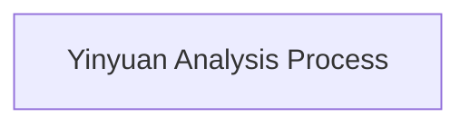

# Yinyuan Analysis Process

## Description of the Yinyuan Analysis Process

**Start**

- Begin the yinyuan (phonetic variable) analysis

**Yinjie Analysis**

- Each Yinjie (syllable) is analyzed into a yinyuan sequence

**Shouyin and Ganyin**

- A syllable consists of a shouyin (initial) and a ganyin (final with tone  or divisional rhyme)
  - **Shouyin**
    - Composed of a shoudiao and a shouzhi
      - The shoudiao is the tonal segment connected to the shouzhi
      - The shouyin is represented by unpitched sound
  - **Ganyin**
    - Composed of a ganyin tone and a final
      - The ganyin tone is the tonal segment connected to the final
      - The ganyin is represented by sequences of pitched sound
  - **Yinyuan**
    - The yinyuan is the set of unpitched and pitched sounds that make up all syllables

**Ganyin Classification**

- Ganyin is divided into four types:
  - **Tri-quality Ganyin**
    - Composed of a ganyin tone and a tri-quality final
      - The tri-quality final consists of a medial, nucleus, and coda
      - The ganyin tone is divided into second tone, main tone, and coda tone
      - Onset tone and medial form the onset sound
      - Main tone and nucleus form the main sound
      - Modiao and coda form the coda sound
  - **Front Long Ganyin**
    - Composed of a ganyin tone and a front long final
    - The front long final consists of a nucleus and coda
    - The ganyin tone is divided into medial tone and coda tone
      - Hudiao and nucleus form the medial sound
      - Hudiao is further divided into second tone and main tone
      - The nucleus is divided into onset quality and main quality (anterior and posterior parts of the nucleus)
      - Onset tone and onset quality form the onset sound
      - Main tone and main quality form the main sound
      - Modiao and coda form the coda sound
  - **Back Long Ganyin**
    - Composed of a ganyin tone and a back long final
    - The back long final consists of a medial and a nucleus
    - The ganyin tone is divided into second tone and rhyme tone
      - Onset tone and medial form the onset sound
      - Rhyme tone and nucleus form the rhyme sound
      - Rhyme tone is further divided into main tone and coda tone
      - The nucleus is divided into main quality and coda quality (anterior and posterior parts of the nucleus)
      - Main tone and main quality form the main sound
      - Modiao and coda quality form the coda sound
  - **Single Quality Ganyin**
    - Composed of a ganyin tone and a single quality final
    - The single quality final is represented by the nucleus
    - The ganyin tone is divided into second tone, main tone, and coda tone
    - The final is divided into onset quality, main quality, and coda quality (anterior, middle, and posterior parts of the final)
      - Onset tone and onset quality form the onset sound
      - Main tone and main quality form the main sound
      - Modiao and coda quality form the coda sound

**End**

- End of the yinyuan analysis

## Further Directions

**Detailed Explanation of Yinyuan Analysis**:
In the yinyuan analysis model, each syllable is analyzed into a yinyuan sequence.
In this model, the syllable is first split into jiediao (tonal layer) and jiezhi (qualitative layer). The tonal layer is further divided into shoudiao (initial tone) and gandiao (rime tone), while the qualitative layer is split into shengmu (onset quality) and yunmu (rime quality). These components are then recombined into huyin (onset+second tone), zhuyin (rime core+rime core tone), and moyin (rime tail+rime tail tone), which finally merge into yunyin (rime complex) to complete the syllable.

In this analysis, a syllable consists of a shouyin and a ganyin. The shouyin is the segment at the beginning of the syllable, composed of a shoudiao and a shouzhi. The shoudiao is the tonal segment connected to the shouzhi. The ganyin is the segment excluding the shouyin, composed of a ganyin tone and a final. The ganyin tone is the tonal segment connected to the final. Phonetic variables are divided into noise and musical sound. The shouyin is always represented by unpitched sound. The ganyin is always represented by sequences of pitched sound.

Ganyin, according to the structure of the final, is divided into tri-quality ganyin, front long ganyin, back long ganyin, and single quality ganyin. Tri-quality ganyin is composed of a ganyin tone and a tri-quality final. Front long ganyin is composed of a ganyin tone and a front long final. Back long ganyin is composed of a ganyin tone and a back long final. Single quality ganyin is composed of a ganyin tone and a single quality final.

In tri-quality ganyin, the tri-quality final consists of a medial, nucleus, and coda. Correspondingly, the ganyin tone is divided into three segments: the segment connected to the medial, the segment connected to the nucleus, and the segment connected to the coda, abbreviated as second tone, main tone, and coda tone. Onset tone and medial form the onset sound. Main tone and nucleus form the main sound. Modiao and coda form the coda sound. The onset sound is simply the second yinyuan in the syllable. The main sound is the most important yinyuan in the syllable. The coda sound is the yinyuan at the end of the syllable.

In front long ganyin, the front long final consists of a nucleus and coda. Correspondingly, the ganyin tone is divided into two segments: the segment connected to the nucleus and the segment connected to the coda, abbreviated as medial tone and coda tone. Hudiao and nucleus form the medial sound. Modiao and coda form the coda sound. The medial sound is the segment between the shouyin and the coda sound. Since the medial tone corresponds to the second tone and main tone of the tri-quality ganyin, the medial tone is divided into second tone and main tone. Correspondingly, the medial sound is divided into onset sound and main sound.

In back long ganyin, the back long final consists of a medial and a nucleus. Correspondingly, the ganyin tone is divided into two segments: the segment connected to the medial and the segment connected to the nucleus, abbreviated as second tone and rhyme tone. Onset tone and medial form the onset sound. Rhyme tone and nucleus form the rhyme sound. The rhyme sound refers to the segment formed by the rhyme tone and the rhyme base or rhyme body. Since the rhyme tone corresponds to the main tone and coda tone of the tri-quality ganyin, the rhyme tone is divided into main tone and coda tone. Correspondingly, the rhyme sound is divided into main sound and coda sound.

In single quality ganyin, the single quality final is represented by the nucleus. Correspondingly, the ganyin tone is the segment connected to the final, which is the tone of the ganyin. Since the ganyin tone corresponds to the second tone, main tone, and coda tone of the tri-quality ganyin, the ganyin tone is divided into second tone, main tone, and coda tone. Correspondingly, the ganyin is divided into onset sound, main sound, and coda sound.

**Application Scenarios of Yinyuan Analysis**:
Specific applications of the yinyuan analysis in speech recognition and speech synthesis.

**History and Development of Yinyuan Analysis**:
The development history of the yinyuan analysis.

### Yinyuan Analysis Process

<div style="display: flex; justify-content: center;">



</div>

```mermaid
graph TD
   subgraph PreSegmentationSyllable["SyllableDecompositionReady"]
   DecomposingSyllable[Syllable]
   end

   subgraph ExtractToneQuality["Syllable Divided into Tone and Quality Layers"]
   DecomposingSyllable --> |Extract|SyllabicTone[Tone]
   DecomposingSyllable --> |Extract|SyllabicQuality[Quality]
   end

   subgraph SyllableToneLayer["Syllabic Tone Divided into Shoudiao and Gandiao"]
   SyllabicTone --> |Segment|Shoudiao[Shoudiao]
   SyllabicTone --> |Segment|Gandiao[Gandiao]
   end

   subgraph SyllableQualityLayer["Syllabic Quality Divided into Initial and Final"]
   SyllabicQuality --> |Segment|Initial[Initial]
   SyllabicQuality --> |Segment|Final[Final]
   end

   subgraph ShouyinComposition["Shouyin Composed of Shoudiao and Initial"]
   Shoudiao --> |Compose|DecomposingShouyin[Shouyin]
   Initial --> |Compose|DecomposingShouyin[Shouyin]
   end

   subgraph GanyinComposition["Ganyin Composed of Gandiao and Final"]
   Gandiao --> |Compose|DecomposingGanyin[Ganyin]
   Final --> |Compose|DecomposingGanyin[Ganyin]
   end

   subgraph GanyinCategories["Ganyin Divided into Four Categories by Final Structure"]
   DecomposingGanyin --> |Categorize|TriQualityGanyin[Tri-quality Ganyin]
   DecomposingGanyin --> |Categorize|FrontLongGanyin[Front Long Ganyin]
   DecomposingGanyin --> |Categorize|BackLongGanyin[Back Long Ganyin]
   DecomposingGanyin --> |Categorize|SingleQualityGanyin[Single Quality Ganyin]
   end

   subgraph DecomposingSingleQualityGanyin["Single Quality Ganyin Decompose"]

   SingleQualityGanyin --> |Extract|SQGandiao[Gandiao]
   SQGandiao --> |Segment|SQHudiao[Hudiao]
   SQGandiao --> |Segment|SQYundiao[Yundiao]
   SQYundiao --> |Segment|SQZhudiao[Zhudiao]
   SQYundiao --> |Segment|SQModiao[Modiao]

   SingleQualityGanyin --> |Extract|SQGanzhi[Single Quality Final]
   SQGanzhi --> |Segment|SQHuzhi[Final Anterior]
   SQGanzhi --> |Segment|SQYunzhi[Rhyme Quality]
   SQYunzhi --> |Segment|SQZhuzhi[Final Middle]
   SQYunzhi --> |Segment|SQMozhi[Final Posterior]

   end

   subgraph DecomposingBackLongGanyin["Back Long Ganyin Decompose"]

   BackLongGanyin --> |Extract|BLGandiao[Gandiao]
   BLGandiao --> |Segment|BLHudiao[Hudiao]
   BLGandiao --> |Segment|BLYundiao[Yundiao]
   BLYundiao --> |Segment|BLZhudiao[Zhudiao]
   BLYundiao --> |Segment|Modiao[Modiao]

   BackLongGanyin --> |Extract|BLGanzhi[Back Long Final]
   BLGanzhi --> |Segment|BLHuzhi[Head of the Final]
   BLGanzhi --> |Segment|BLYunzhi[Nucleus]
   BLYunzhi --> |Segment|BLZhuzhi[Nucleus Anterior]
   BLYunzhi --> |Segment|BLMozhi[Nucleus Posterior]

   end

   subgraph DecomposingFrontLongGanyin["Front Long Ganyin Decompose"]

   FrontLongGanyin --> |Extract|FLGandiao[Gandiao]
   FLGandiao --> |Segment|FLJiandiao[Jiandiao]
   FLJiandiao --> |Segment|FLHudiao[Hudiao]
   FLJiandiao --> |Segment|FLZhudiao[Zhudiao]
   FLGandiao --> |Segment|FLModiao[Modiao]

   FrontLongGanyin --> |Extract|FLGanzhi[Front Long Final]
   FLGanzhi --> |Segment|FLJianzhi[Nucleus]
   FLJianzhi --> |Segment|FLHuzhi[Nucleus Anterior]
   FLJianzhi --> |Segment|FLZhuzhi[Nucleus Posterior]
   FLGanzhi --> |Segment|FLMozhi[Tail of the Final]

   end

   subgraph DecomposingTriQualityGanyin["Tri-quality Ganyin Decompose"]

   TriQualityGanyin --> |Extract|TQGandiao[Gandiao]
   TQGandiao --> |Segment|TQHudiao[Hudiao]
   TQGandiao --> |Segment|TQYundiao[Yundiao]
   TQYundiao --> |Segment|TQZhudiao[Zhudiao]
   TQYundiao --> |Segment|TQModiao[Modiao]

   TriQualityGanyin --> |Extract|TQGanzhi[Tri-quality Final]
   TQGanzhi --> |Segment|TQHuzhi[Head of the Final]
   TQGanzhi --> |Segment|TQYunzhi[Rhyme Quality]
   TQYunzhi --> |Segment|TQZhuzhi[Nucleus]
   TQYunzhi --> |Segment|TQMozhi[Tail of the Final]

   end

   SQHudiao --> |Compose Yinyuan|Huyin[Huyin]  %% Identify as Yinyuan --> Categorize into Pitched Yinyuan --> Decompose into Constituent
   SQHuzhi --> |Compose Yinyuan|Huyin[Huyin]
   SQZhudiao --> |Compose Yinyuan|Zhuyin[Zhuyin]
   SQZhuzhi --> |Compose Yinyuan|Zhuyin[Zhuyin]
   SQModiao --> |Compose Yinyuan|Moyin[Moyin]
   SQMozhi --> |Compose Yinyuan|Moyin[Moyin]

   BLHudiao --> |Compose Yinyuan|Huyin[Huyin]
   BLHuzhi --> |Compose Yinyuan|Huyin[Huyin]
   BLZhudiao --> |Compose Yinyuan|Zhuyin[Zhuyin]
   BLZhuzhi --> |Compose Yinyuan|Zhuyin[Zhuyin]
   Modiao --> |Compose Yinyuan|Moyin[Moyin]
   BLMozhi --> |Compose Yinyuan|Moyin[Moyin]

   FLHudiao --> |Compose Yinyuan|Huyin[Huyin]
   FLHuzhi --> |Compose Yinyuan|Huyin[Huyin]
   FLZhudiao --> |Compose Yinyuan|Zhuyin[Zhuyin]
   FLZhuzhi --> |Compose Yinyuan|Zhuyin[Zhuyin]
   FLModiao --> |Compose Yinyuan|Moyin[Moyin]
   FLMozhi --> |Compose Yinyuan|Moyin[Moyin]

   TQHudiao --> |Compose Yinyuan|Huyin[Huyin]
   TQHuzhi --> |Compose Yinyuan|Huyin[Huyin]
   TQZhudiao --> |Compose Yinyuan|Zhuyin[Zhuyin]
   TQZhuzhi --> |Compose Yinyuan|Zhuyin[Zhuyin]
   TQModiao --> |Compose Yinyuan|Moyin[Moyin]
   TQMozhi --> |Compose Yinyuan|Moyin[Moyin]

   subgraph SyllableStructureModel["Syllable Structure Model of Yinyuan Analysis"]
   Zhuyin --> |Combine|Yunyin[Yunyin]
   Moyin --> |Combine|Yunyin[Yunyin]
   Huyin --> |Ascend to Parent Level|YunyinLayerHuyin[Huyin] --> |Combine|Ganyin[Ganyin]
   Yunyin --> |Combine|Ganyin[Ganyin]
   DecomposingShouyin --> |Analyze as Yinyuan|Shouyin[Shouyin] --> |Ascend to Parent Level|YunyinLayerShouyin[Shouyin] --> |Ascend to Parent Level|GanyinLayerShouyin[Shouyin] --> |Combine|Yinjie[Yinjie]
   Ganyin --> |Combine|Yinjie[Yinjie]
   end
```

### Key Terminology

1. **Yinjie(Mandarin Syllable)**
   - Yinjie = **Shouyin** + **Ganyin**
   - Yinjie = **Jiediao** + **Jiezhi**
     - Jiediao (Syllabic Tone or Tonal Layer)
     - Jiezhi (Syllabic Quality or Qualitative Layer)
     - Jiediao = Shoudiao + Gandiao
       - Shoudiao = Tone of Shouyin
       - Gandiao = Tone of Ganyin
     - Jiezhi = Initial + Final
       - Initial = Quality of Shouyin = Shengmu
       - Final = Quality of Ganyin = Yunmu

2. **Shouyin**
   - Shouyin = Shoudiao + Shouzhi
     - Shoudiao = Tonal Segment Connected to the Initial
     - Shouzhi = Quality of the Shouyin = Shengmu = Initial
3. **Ganyin**
   - Ganyin = Gandiao + Ganzhi
     - Gandiao = Tonal Segment Connected to the Final
     - Ganzhi = Quality of the Ganyin = Yunmu = Final
4. **Categories of Ganyin**
   - Tri-quality Ganyin = Gandiao + Tri-Quality Final
   - Front Long Ganyin = Gandiao + Front Long Final
   - Back Long Ganyin = Gandiao + Back Long Final
   - Single Quality Ganyin = Gandiao + Single Quality Final
5. **Yinyuan Composition**
   - Huyin = Hudiao + Huzhi
   - Zhuyin = Zhudiao + Zhuzhi
   - Moyin = Modiao + Mozhi
     - Hudiao = Tonal Segment Connected to the Huzhi
     - Zhudiao = Tonal Segment Connected to the Zhuzhi
     - Modiao = Tonal Segment Connected to the Mozhi
     - Jiandiao = Tonal Segment Connected to the Jianzhi
     - Yundiao = Tonal Segment Connected to the Yunzhi
     - Huzhi = Head of the Final / Anterior part of the nucleus in front long final / Anterior part of single quality final
     - Zhuzhi = Nucleus of the tri-quality final / Posterior part of the nucleus in front long final / Anterior part of the nucleus in back long final / Middle part of single quality final
     - Mozhi = Tail of the Final / Posterior part of the nucleus in back long final / Posterior part of single quality final
6. **Yinjie Structure**
   - Yinjie = Shouyin + Huyin + Zhuyin + Moyin
   - Yinjie = Shouyin + Huyin + Yunyin
   - Yinjie = Shouyin + Ganyin

   - Ganyin = Huyin + Yunyin
   - Yunyin = Zhuyin + Moyin
   -
   - Yinjie = Shouyin + Jianyin + Moyin
   - Jianyin = Huyin + Zhuyin
