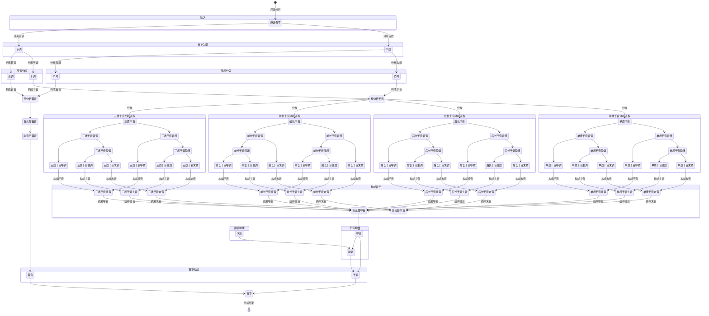
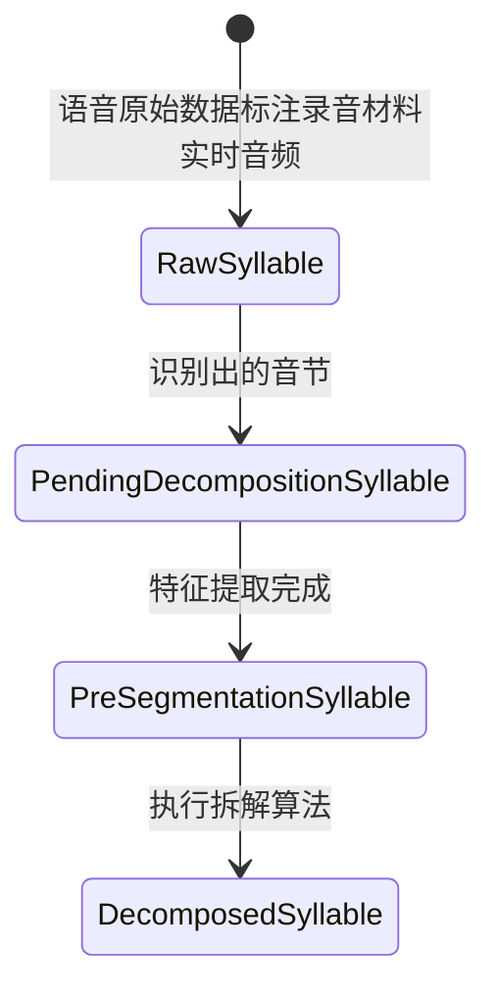
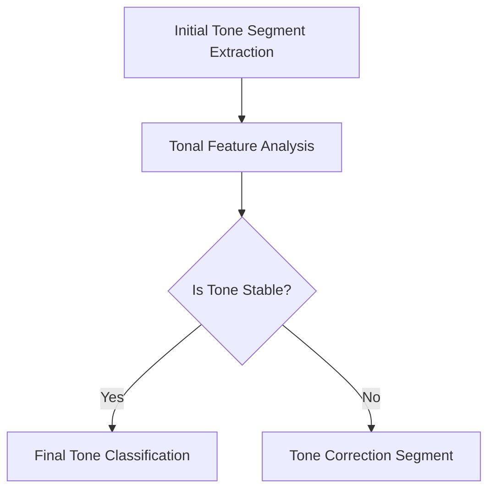

plaintext
是否需要强调语法/音系层级？
  ├─ 是 → 使用 `constituent` 或 `segment`
  └─ 否 → 是否涉及模块化系统（如工程）？
       ├─ 是 → 使用 `component`
       └─ 否 → 是否为非技术性描述？
            ├─ 是 → 使用 `part`
            └─ 否 → 使用 `element` 或 `component`（根据上下文）
   }

