# 音元系统

摘要

音元系统是由音元构成的语音系统。这种语音系统主要具有六个特征：

1. 语音是由音元构成的系统

2. 音节是由音元构成的音列

3. 音元是指表示片音的变元

4. 片音是能单发的最小短音

5. 片音是比音素还小的音段

6. 拼音是按照片音序列发音

在现代通用汉语中，音元系统与音位系统相对比主要具有两点不同：

1. 语音系统的元素不同

2. 表示声调的方式不同

本书说明现代通用汉语（现代汉语普通话）的音元系统。除因比较涉及外，本书，既不论及古代汉语、近代汉语和汉语方言的音元系统，也不论及除汉语外的其它语言的音元系统。

# 目录

[1 绪论 [1](#绪论)](#绪论)

[2 已有析音法 [11](#已有析音法)](#已有析音法)

[2.1 已有各式析音法的分类
[15](#已有各式析音法的分类)](#已有各式析音法的分类)

[2.1.1 各类各式二分法 [15](#各类各式二分法)](#各类各式二分法)

[2.1.1.1 两段二分法 [15](#两段二分法)](#两段二分法)

[2.1.1.1.1 声韵二分法 [15](#声韵二分法)](#声韵二分法)

[2.1.1.1.2 首干二分法 [17](#首干二分法)](#首干二分法)一调二质分析法

[2.1.1.2 质调二分法 [19](#质调二分法)](#质调二分法)

[2.1.2 一调二质分析法 [21](#一调二质分析法)](#一调二质分析法)

[2.1.2.1 节调声质韵质分析法
[21](#节调声质韵质分析法)](#节调声质韵质分析法)

[2.1.2.2 节调声母韵母分析法
[22](#节调声母韵母分析法)](#节调声母韵母分析法)

[2.1.3 一调三质分析法 [24](#一调三质分析法)](#一调三质分析法)

[2.2.4 节调质素分析法 [26](#节调质素分析法)](#节调质素分析法)

[2.2 已有各式析音法的分代
[41](#已有各式析音法的分代)](#已有各式析音法的分代)

[2.2.1 第一代析音法 [41](#第一代析音法)](#第一代析音法)

[2.2.1.1 指称对象 [41](#指称对象)](#指称对象)

[2.2.1.2 记音方法 [43](#记音方法)](#记音方法)

[2.2.1.3 形成标志 [45](#形成标志)](#形成标志)

[2.2.2 第二代析音法 [48](#第二代析音法)](#第二代析音法)

[2.2.3 第三代析音法 [50](#第三代析音法)](#第三代析音法)

[2.2.4 第四代析音法 [52](#第四代析音法)](#第四代析音法)

[2.3 节调质素分析法的问题
[67](#节调质素分析法的问题)](#节调质素分析法的问题)

[2.3.1 音素的内涵与外延不一
[67](#音素的内涵与外延不一)](#音素的内涵与外延不一)

[2.3.2 音节的析音与拼音脱节
[69](#音节的析音与拼音脱节)](#音节的析音与拼音脱节)

[2.3.3 音段的音调与音质分离
[71](#音段的音调与音质分离)](#音段的音调与音质分离)

[3 现行析音法 [79](#现行析音法)](#现行析音法)

[3.1 节调 [81](#节调)](#节调)

[3.1.1 节调与声调 [81](#节调与声调)](#节调与声调)

[3.1.2 调值与调类 [84](#调值与调类)](#调值与调类)

[3.1.3 节调的对立 [86](#节调的对立)](#节调的对立)

[3.2 节质 [95](#节质)](#节质)

[3.2.1 声母 [95](#声母)](#声母)

[3.2.2 韵母 [97](#韵母)](#韵母)

[3.2.2.1 根据韵头有无及韵头差异分类
[98](#根据韵头有无及韵头差异分类)](#根据韵头有无及韵头差异分类)

[3.2.2.2 根据韵尾有无及韵尾异同分类
[105](#根据韵尾有无及韵尾异同分类)](#根据韵尾有无及韵尾异同分类)

[3.2.2.3 根据韵头有无和韵尾有无分类
[107](#根据韵头有无和韵尾有无分类)](#根据韵头有无和韵尾有无分类)

[3.2.2.4 根据韵腹的地位及其特征分类
[110](#根据韵腹的地位及其特征分类)](#根据韵腹的地位及其特征分类)

[3.3 干音 [117](#干音)](#干音)

[3.3.1 韵腹的结构地位 [117](#韵腹的结构地位)](#韵腹的结构地位)

[3.3.2 干音的质调关系 [118](#干音的质调关系)](#干音的质调关系)

[3.3.2.1 质调关系的特征 [118](#质调关系的特征)](#质调关系的特征)

[3.3.2.2 质调关系的性质 [123](#质调关系的性质)](#质调关系的性质)

[3.3.2.3 质调关系的内容 [124](#质调关系的内容)](#质调关系的内容)

[3.3.3 韵母的结构类型 [126](#韵母的结构类型)](#韵母的结构类型)

[4 唱音分析法 [131](#唱音分析法)](#唱音分析法)

[4.1 唱音分析的内容 [135](#唱音分析的内容)](#唱音分析的内容)

[4.1.1 唱音的划分 [135](#唱音的划分)](#唱音的划分)

[4.1.1.1 划分与质素相联结的调段
[135](#划分与质素相联结的调段)](#划分与质素相联结的调段)

[4.1.1.2 划分与质素相对应的唱音
[138](#划分与质素相对应的唱音)](#划分与质素相对应的唱音)

[4.1.2 唱音的音值 [141](#唱音的音值)](#唱音的音值)

[4.1.2.1 充当首音的唱音 [141](#充当首音的唱音)](#充当首音的唱音)

[4.1.2.1.1 首音的音调 [141](#首音的音调)](#首音的音调)

[4.1.2.1.2 首音的音质 [142](#首音的音质)](#首音的音质)

[4.1.2.1.3 首音的音值 [142](#首音的音值)](#首音的音值)

[4.1.2.2 构成干音的唱音 [143](#构成干音的唱音)](#构成干音的唱音)

[4.1.2.2.1 干音各音的音调 [143](#干音各音的音调)](#干音各音的音调)

[4.1.2.2.1.1 三质干音各音的音调
[143](#三质干音各音的音调)](#三质干音各音的音调)

[4.1.2.2.1.2 前长干音各音的音调
[146](#前长干音各音的音调)](#前长干音各音的音调)

[4.1.2.2.1.3 后长干音各音的音调
[147](#后长干音各音的音调)](#后长干音各音的音调)

[4.1.2.2.1.4 单质干音各音的音调
[148](#单质干音各音的音调)](#单质干音各音的音调)

[4.1.2.2.2 干音各音的音质 [150](#干音各音的音质)](#干音各音的音质)

[4.1.2.2.3 干音各音的音值 [152](#干音各音的音值)](#干音各音的音值)

[4.1.2.3 拼音方案的拼法 [154](#拼音方案的拼法)](#拼音方案的拼法)

[4.1.3 唱音拼音法 [159](#唱音拼音法)](#唱音拼音法)

[4.2 唱音分析的困难 [165](#唱音分析的困难)](#唱音分析的困难)

[4.2.1 充当首音的唱音较简单
[165](#充当首音的唱音较简单)](#充当首音的唱音较简单)

[4.2.2 构成干音的唱音很复杂
[165](#构成干音的唱音很复杂)](#构成干音的唱音很复杂)

[4.2.3 唱音分析法面临的困难
[168](#唱音分析法面临的困难)](#唱音分析法面临的困难)

[4.3 质调关系的问题 [171](#质调关系的问题)](#质调关系的问题)

[4.3.1 经典生成音系学的问题
[172](#经典生成音系学的问题)](#经典生成音系学的问题)

[4.3.2 自主音段音系学的问题
[176](#自主音段音系学的问题)](#自主音段音系学的问题)

[4.3.3 两种不同调素论的问题
[189](#两种不同调素论的问题)](#两种不同调素论的问题)

[4.4 解决问题的方法 [195](#解决问题的方法)](#解决问题的方法)

[5 音元分析法 [201](#音元分析法)](#音元分析法)

[5.1 划分首音和干音 [205](#划分首音和干音)](#划分首音和干音)

[5.2 充当首音的音元 [207](#充当首音的音元)](#充当首音的音元)

[5.3 构成干音的音元 [211](#构成干音的音元)](#构成干音的音元)

[5.3.1 干音的分析过程 [218](#干音的分析过程)](#干音的分析过程)

[5.3.1.1 三质干音的分析 [220](#三质干音的分析)](#三质干音的分析)

[5.3.1.2 前长干音的分析 [231](#前长干音的分析)](#前长干音的分析)

[5.3.1.3 后长干音的分析 [236](#后长干音的分析)](#后长干音的分析)

[5.3.1.4 单质干音的分析 [240](#单质干音的分析)](#单质干音的分析)

[5.3.2 干音的分析模型 [245](#干音的分析模型)](#干音的分析模型)

[5.3.3 干音的结构简式 [250](#干音的结构简式)](#干音的结构简式)

[5.4 音节的分析模型 [257](#音节的分析模型)](#音节的分析模型)

[5.5 音元分析的范例 [261](#音元分析的范例)](#音元分析的范例)

[5.6 新型的析音方法 [263](#新型的析音方法)](#新型的析音方法)

[6 音元拼音法 [269](#音元拼音法)](#音元拼音法)

[6.1 音元和音符 [273](#音元和音符)](#音元和音符)

[6.1.1 音元的分类 [273](#音元的分类)](#音元的分类)

[6.1.2 音元的音符 [281](#音元的音符)](#音元的音符)

[6.1.3 音元的发音 [288](#音元的发音)](#音元的发音)

[6.1.3.1 噪音的发音 [290](#噪音的发音)](#噪音的发音)

[6.1.3.1.1 噪音根据发音部位分类
[290](#噪音根据发音部位分类)](#噪音根据发音部位分类)

[6.1.3.1.2 噪音根据发音方法分类
[291](#噪音根据发音方法分类)](#噪音根据发音方法分类)

[6.1.3.1.3 噪音发音方法一一说明
[292](#噪音发音方法一一说明)](#噪音发音方法一一说明)

[6.1.3.2 乐音的发音 [294](#乐音的发音)](#乐音的发音)

[6.1.3.2.1 乐音根据音高特征分类
[295](#乐音根据音高特征分类)](#乐音根据音高特征分类)

[6.1.3.2.2 乐音根据音质特征分类
[295](#乐音根据音质特征分类)](#乐音根据音质特征分类)

[6.1.3.2.3 乐音发音方法一一说明
[295](#乐音发音方法一一说明)](#乐音发音方法一一说明)

[6.2 首音和干音 [301](#首音和干音)](#首音和干音)

[6.2.1 首音 [301](#首音)](#首音)

[6.2.2 干音 [304](#干音-1)](#干音-1)

[6.2.2.1 干音的记音 [304](#干音的记音)](#干音的记音)

[6.2.2.2 干音的发音 [314](#干音的发音)](#干音的发音)

[6.2.2.3 干音的结构 [331](#干音的结构)](#干音的结构)

[6.2.2.4 干音的特征 [332](#干音的特征)](#干音的特征)

[6.2.2.4.1 干调 [332](#干调)](#干调)

[6.2.2.4.2 干质 [334](#干质)](#干质)

[6.3 音节与拼音 [339](#音节与拼音)](#音节与拼音)

[6.3.1 音节的结构 [339](#音节的结构)](#音节的结构)

[6.3.2 音节的构成 [341](#音节的构成)](#音节的构成)

[6.3.2.1 用和汉字等宽的字符来记音
[341](#用和汉字等宽的字符来记音)](#用和汉字等宽的字符来记音)

[6.3.2.2 用与英文兼容的字符来记音
[358](#用与英文兼容的字符来记音)](#用与英文兼容的字符来记音)

[6.3.3 音元的音值 [374](#音元的音值)](#音元的音值)

[6.3.3.1 噪音的音值 [375](#噪音的音值)](#噪音的音值)

[6.3.3.2 乐音的音值 [376](#乐音的音值)](#乐音的音值)

[7 结论 [383](#结论)](#结论)

# 绪论

音元系统是由音元构成的语音系统。在比较不同类型的语音系统时，把不同类型的语音系统的基本结构单元统称为元素。在汉语中，音元系统与已有语音系统的根本区别是元素不同。例如，音元系统与音位系统的根本区别是音元系统的元素是音元而音位系统的元素是音位。在汉语中，已有语音系统的元素都不是音元，换句话说，已有语音系统都不是用音元作元素的语音系统。因此，音元系统是一种新型的语音系统——由音元构成的或用音元作元素的语音系统。

在汉语中，已有语音系统都不是用音元作元素的语音系统。在汉语中，已有语音系统有声韵系统、声调声母韵母系统、声调声母介母韵基系统、音位系统等语音系统。在这些语音系统中，声韵系统，例如，由《切韵》系韵书的反切上下两字所记录的“声”和“韵”构成的语音系统；声调声母韵母系统，例如，由《韵镜》或《七音略》的声调与声母和韵母构成的语音系统；声调声母介母韵基系统，例如，由《注音符号方案》的声调与声母、介母和韵基构成的语音系统；音位系统，例如，由《汉语拼音方案》的声调音位和音质音位构成的语音系统；都不是用音元作元素的语音系统。

韵基是一个在近几十年里才在汉语语音学中兴起并正式确立的术语，稍早以前，例如在早期的解说《汉语拼音方案》的文献中，并不叫韵基而是叫韵身，更早以前，例如在《注音符号方案》中，甚至不叫韵身而叫“韵母”。《汉语拼音方案》的韵母，在《注音符号方案》中，或由“介母”充当或由“韵母”充当、或由“介母”和“韵母”构成。具体地说，在《注音符号方案》中，那些与《汉语拼音方案》的无头韵母对应的由“介母”或“韵母”充当的韵母，除三个叫“介母”外、其余的直接就叫“韵母”，并不叫“由韵身或韵基充当的韵母”；那些与《汉语拼音方案》的有头韵母对应的由“介母”和“韵母”构成的韵母，并不叫“由‘介母’和‘韵身’或“由‘介母’和‘韵基’构成的韵母”而是叫“由‘介母’和‘韵母’构成的‘韵母’”。坦率地说，两个方案的韵母名同实异。因此，在根据《汉语拼音方案》解说《注音符号方案》时，对那些与《汉语拼音方案》的有头韵母对应的由“介母”和“韵母”构成的韵母，在该类韵母中，在把介母改名为韵头后，作为组成部分的“韵母”不能再叫“韵母”，只能叫“韵身”或“韵基”。

音元，这个术语，尽管明人吴继仕在他所著的《音声纪元》一书中用过，然而音元系统的音元和《音声纪元》一书的音元不同。在音元系统中，音元是构成语音系统的元素，是表示分布在特定环境中的特定片音的变元。在现代通用汉语中，片音是根据一组决定音段的最小音高和最小音质的差异的发音特征切出的最小音段。然而，在《音声纪元》一书中，根据反切解说，“音元”实指由《切韵》系韵书的反切下字所记录的“韵”。在《音声纪元》一书中，作者在界定音元时说：“何谓音元？音元者，天之气也。”他的这个定义实际上是说，音元是指被邵雍命名为“天声”的“韵”。原来，他把邵雍在《皇极经世·声音唱和图》中取名为“天声”的“韵”分为二十四类，与历法的二十四个节气一一对应附会，声称这是“以二十四气为二十四韵之音”。因此，他说，音元是“天之气”。只有从内涵和外延上全面理解邵雍的“天声”才能理解《音声纪元》一书的音元。在邵雍的《声音唱和图》中，“天声”和“地音”相对。“地音”，用首音和介音这组术语来解说，或指首音或指首介合音。在汉语音节中，首音就是节首辅音，或指位处在韵前的辅音，或指位处在介韵合音前的辅音。介音特指介居在首音和韵间的高元音。首介合音由首音和介音构成，因首音都由辅音充当，又被称为辅介合音。介韵合音由介音和韵合成。相对“地音”，“天声”就是从音节中切除首音或首介合音以后剩下的韵。因此，根据反切解说，“地音”就是由《切韵》系韵书的反切上字所记录的“声”；“天声”就是由《切韵》系韵书的反切下字所记录的“韵”。综述可知，《音声纪元》一书的音元，就是邵雍的“天声”，就是《切韵》及《广韵》的“韵”，具体地说，就是从音节中切除首音或首介合音以后剩下的韵。因此，音元系统的音元和《音声纪元》一书的音元不同。具体地说，音元系统的音元和《音声纪元》一书的音元除名称相同外内涵和外延都不相同。

音元系统是根据音元分析法构建的语音系统。这种语音系统主要具有六个特征：

第一、语音是由音元构成的系统。把音节切分成片音序列并且确定表示片音的音元从而把音节分析成音元序列，这种把音节分析成音元序列的方法，被定名为音元分析法。在经过音元分析后，语音系统被分析成由音元构成的系统，被定名为音元系统。因此，音元分析法又被定义成是把语音系统分析成音元系统的方法，音元系统又被定义成是根据音元分析法构建的语音系统。任何一个具体语言，不论它是不是存在声调对立，不论它是不是存在长短对立，不论它是不是存在强弱对立，即使它确实只存在音质对立，都能根据音元分析法把它的语音系统分析成音元系统。因此，音元是构成语音系统的元素，语音是由音元构成的系统。

第二、音节是由音元构成的音列。在经过音元分析后，音节被分析成音元序列。因此，与在音位系统中音节由调位与质位序列构成其中质位序列由质位构成这种二维结构形式的音节不同，在音元系统中，音节是由音元构成的音列。这种一维结构形式的音节，被简称为音元音节。相对应地，在音位系统中，由音位构成的音节被简称为音位音节。

第三、音元是指表示片音的变元。在音元系统中，同元音集是由同一音元所表示的分布在不同环境中的不同片音构成的音集。一个音元对应一个同元音集。在音元系统中，片音是分布在特定环境中的特定音元所取的音值，简单地说，片音是音元的音值，因此，拼音是一个逐个代入音元的音值即逐个用片音来给音元赋值的过程；具体地说，拼音是一个逐个从每个音元对应的同元音集中选取由各个音元的分布环境确定的特定片音并用所取片音来给对应的音元赋值的过程。因此，音元是用来根据它的分布环境从它对应的同元音集中选取特定片音的变元。简单地说，音元是用来表示片音的变元。

第四、片音是能单发的最小短音。在人类语言中，片音是根据一组决定音段的最小音高、最小音强、最小音长和最小音质的差异的发音特征切出的最小音段。片音分析法是把语音切分成片音序列的方法。在根据片音分析法析音时，对存在长短对立而其它特征都不构成对立的音段，短音已是片音、无需再作分析，长音被分析成由至少两个相同的片音构成的音列。对不存在长短对立而实际音长较长和最长的长音，当需要从结构上表示这类音段的相对音长时，把较长的长音分析成由两个相同的片音构成的音列，把最长的长音分析成由三个相同的片音构成的音列。因此，在片音分析法中，片音都是最小短音。在计量音长时，拍是计量音长的单位。最小短音特指既能单独发出又能单独听到的长度只有一拍的音段，也就是说，最小短音就是单拍音段。长音是长度计有两拍或三拍的音段，分为二拍长音和三拍长音。因此，片音是根据一组决定音段的最小音高、最小音强、最小音长和最小音质的差异的发音特征切出的最小音段。简单地说，片音是能单发的最小短音。

在现代通用汉语中，片音是根据一组决定音段的最小音高和最小音质的差异的发音特征切出的最小音段。在现代通用汉语中，音节的音调差异和音质差异都构成对立，音节的音强差异和音长差异都不构成对立，因此，在切分片音时，一般地说，必须区分片音的音高差异和音质差异、不必区分片音的音强差异和音长差异，把片音分析成具有默认的音强和默认的音长、确定的音高和确定的音质的最小音段。具体地说，在现代通用汉语中，根据音节的音调差异和音质差异都构成对立，在把音节切分成片音序列时，既要区分片音的音高特征，又要区分片音的音质特征。因此，在现代通用汉语中，根据片音分析法，一般地说，两个不同的片音，或是两个音高和音质都不同的片音，或是两个音高相同而音质不同的片音，或是两个音高不同而音质相同的片音。

第五、片音是比音素还小的音段。片音与音素不同。在音素分析法中，音素既有长音也有短音。当音素是短音时，在片音分析法中，一个短音的音高存在几种构成对立的差异就被分析成几个音高不同的片音，一个短音的音强存在几种构成对立的差异就被分析成几个音强不同的片音。当音素是长音时，在片音分析法中，把较长的长音分析成由两个相同的片音构成的音列，把最长的长音分析成由三个相同的片音构成的音列。因此，片音是充当或构成音素的音质、音高或音强不同的短音。片音和音素的关系是：当音素是短音时，短音由音质、音高或音强不同的片音充当；当音素是长音时，长音至少由两个音质、音高和音强都相同的片音构成；片音是充当短音或构成长音的音段。因此，片音，作为充当或构成音素的音质、音高或音强不同的短音，是构成语音的比只区分音质差异不区分音高差异、音强差异和音长差异的音素更基本的音段。简单地说，片音是比音素还小的音段。

第六、拼音是按照片音序列发音。在音元系统中，拼音，是音元拼音的简称，笼统地说，是指根据音元分析拼音。这种拼音，从音元层次上说明，是指根据音元序列拼音。然而，在音元系统中，音元是表示分布在特定环境中的特定片音的变元。因此，从片音层次上说明，这种拼音实际是指根据片音序列发音。在音元系统中，片音是分布在特定环境中的特定音元所取的音值，是根据一组决定音段的最小音高和最小音质的差异的发音特征切出的最小音段，是单独能发的有声短音，是构成音节的基本音段，具有作为分析或识别对象的实发音段具备的语音特征。简单地说，片音是音元的音值。因此，按照片音序列发音，就是根据音元的音值拼音。按照片音序列发音，能够较逼真地拼出音节。因此，拼音是按照片音序列发音。

任何一个具体语言，不论它是不是存在声调对立，不论它是不是存在长短对立，不论它是不是存在强弱对立，即使它确实只存在音质对立，都能根据音元分析法把它的语音系统分析成音元系统。

根据各个语言用对立的音高、音强、音长或音质来区别语素或单词的情况，语言分为八类。人类语言都普遍用对立的音质来区别语素或单词。然而，各个语言在用对立的音高、音强或音长来区别语素或单词时却各有取舍。各个语言用对立的音高、音强、音长或音质来区别语素或单词的情况，不过八种情况：一、同时用音高、音强、音长和音质来区别语素或单词，二、用音高、音长和音质而不用音强来区别语素或单词，三、用音高、音强和音质而不用音长来区别语素或单词，四、用音强、音长和音质而不用音高来区别语素或单词，五、用音高和音质而不用音强和音长来区别语素或单词，六、用音长和音质而不用音高和音强来区别语素或单词，七、用音强和音质而不用音高和音长来区别语素或单词，八、用音质而不用音高、音强和音长来区别语素或单词。因此，从理论上分析，语言分为八类。

在第一类语言也即同时用音高、音强、音长和音质来区别语素或单词的语言中，音高、音强、音长和音质四者的差异都构成对立，因此，在确定这类语言的片音时，必须同时区分四者的差异，因而，在这类语言中，片音是具有确定的音高特征、音强特征、音长特征或音质特征的短音。因此，这类语言的片音只是人类语言的片音的一部分。在这类语言中，音元的音高特征、音强特征、音长特征和音质特征都是音元的区别特征。

在第二类语言也即用音高、音长和音质而不用音强来区别语素或单词的语言中，音高、音长和音质三者的差异都构成对立，只有音强的差异不构成对立，因此，在确定这类语言的片音时，一般不区分音强的差异，因而，在这类语言中，片音是具有确定的音高特征、音长特征或音质特征的短音，因此，根据发音系统不能发出任何不具有具体音强的片音把片音的音强分析成默认的音强，这类语言的片音只是人类语言的片音的一部分。在这类语言中，音元的音高特征、音长特征和音质特征都是音元的区别特征，只有音元的音强特征不是音元的区别特征。

在第三类语言也即用音高、音强和音质而不用音长来区别语素或单词的语言中，音高、音强和音质三者的差异都构成对立，只有音长的差异不构成对立，因此，在确定这类语言的片音时，一般不区分音长的差异，因而，在这类语言中，片音是具有确定的音高特征、音强特征和音质特征的短音，因此，根据发音系统不能发出任何不具有具体音长的片音把片音的音长分析成默认的音长，这类语言的片音只是人类语言的片音的一部分。在这类语言中，音元的音高特征、音强特征和音质特征都是音元的区别特征，只有音元的音长特征不是音元的区别特征。

在第四类语言也即用音强、音长和音质而不用音高来区别语素或单词的语言中，音强、音长和音质三者的差异都构成对立，只有音高的差异不构成对立，因此，在确定这类语言的片音时，一般不区分音高的差异，因而，在这类语言中，片音是具有确定的音强特征、音长特征和音质特征的短音，因此，根据发音系统不能发出任何不具有具体音高的片音把片音的音高分析成默认的音高，这类语言的片音只是人类语言的片音的一部分。在这类语言中，音元的音强特征、音长特征和音质特征都是音元的区别特征，只有音元的音高特征不是音元的区别特征。

在第五类语言也即用音高和音质而不用音强和音长来区别语素或单词的语言中，音高的差异和音质的差异都构成对立，音强的差异和音长的差异都不构成对立，因此，在确定这类语言的片音时，一般不区分音强的差异和音长的差异，因而，在这类语言中，片音是具有确定的音高特征和确定的音质特征的短音，因此，根据发音系统不能发出任何不具有具体音强和任何不具有具体音长的片音把片音的音强和音长分析成默认的音强和默认的音长，这类语言的片音只是人类语言的片音的一部分。在这类语言中，音元的音强特征和音长特征都不是音元的区别特征，只有音元的音高特征和音质特征是音元的区别特征。

在第六类语言也即用音长和音质而不用音高和音强来区别语素或单词的语言中，音长的差异和音质的差异都构成对立，音高的差异和音强的差异都不构成对立，因此，在确定这类语言的片音时，一般不区分音高的差异和音强的差异，因而，在这类语言中，片音是具有确定的音长特征和确定的音质特征的短音，因此，根据发音系统不能发出任何不具有具体音高和任何不具有具体音强的片音把片音的音高和音强分析成默认的音高和默认的音强，这类语言的片音只是人类语言的片音的一部分。在这类语言中，音元的音高特征和音强特征都不是音元的区别特征，只有音元的音长特征和音质特征是音元的区别特征。

在第七类语言也即用音强和音质而不用音高和音长来区别语素或单词的语言中，音强的差异和音质的差异都构成对立，音高的差异和音长的差异都不构成对立，因此，在确定这类语言的片音时，一般不区分音高的差异和音长的差异，因而，在这类语言中，片音是具有确定的音强特征和确定的音质特征的短音，因此，根据发音系统不能发出任何不具有具体音高和任何不具有具体音长的片音把片音的音高和音长分析成默认的音高和默认的音长，这类语言的片音只是人类语言的片音的一部分。在这类语言中，音元的音高特征和音长特征都不是音元的区别特征，只有音元的音强特征和音质特征是音元的区别特征。

在第八类语言也即用音质而不用音高、音强和音长来区别语素或单词的语言中，只有音质的差异构成对立，音高、音强和音长的差异都不构成对立，因此，在确定这类语言的片音时，一般不区分音高、音强和音长的差异，因而，在这类语言中，片音是具有确定的音质特征的短音，因此，根据发音系统不能发出任何不具有具体音高、任何不具有具体音强和任何不具有具体音长的片音把片音的音高、音强和音长分析成默认的音高、默认的音强和默认的音长，这类语言的片音只是人类语言的片音的一部分。在这类语言中，音元的音高特征、音强特征和音长特征都不是音元的区别特征，只有音元的音质特征是音元的区别特征。

在这八类语言中，用对立的音高来区别语素或单词的语言，被统称为声调语言；不用对立的音高来区别语素或单词的语言，被统称为非声调语言。声调语言的音元和非声调语言的音元不尽相同：在声调语言中，一般地说，音元的音高差异也构成对立；在非声调语言中，一般地说，音元的音高差异不构成对立。因此，在声调语言中，一般地说，音元的音高特征，和音质特征一样，也是音元的区别特征。

综述可知，现代通用汉语，尽管它是一种用音高和音质而不用音强和音长来区别语素的声调语言，根据音元分析法也能构建它的音元系统。

在现代通用汉语中，音元系统与音位系统相对比主要具有两点不同：

一是语音系统的元素不同。在比较不同类型的语音系统时，把不同类型的语音系统的基本结构单元统称为元素。音位是音位系统的元素，分成音质音位和声调音位两类，两者分别被简称为质位和调位，分别表示音素的音质和音节的声调。音元是音元系统的元素，是表示分布在特定环境中的特定片音的变元。在现代通用汉语中，片音是根据一组决定音段的最小音高和最小音质的差异的发音特征切出的最小音段。

二是表示声调的方式不同。在音位系统中，音节由调位与质位序列构成其中质位序列由质位构成，调位与质位序列既相对独立又并行联结，不论质位序列由几个质位构成，声调都既不是也不能用构成质位序列的一个、一些或全体质位的音调来表示。然而，在音元系统中，一般地说，每个音元的音高都表示声调的一段，换句话说，声调被一段段地分析成构成音节的每个音元的音高，因此，声调用构成音节的每个音元的音高来表示；重要和特别的是，音元的音高特征，和音质特征一样，也是音元的区别特征。因此，在音元系统中，音节既能表示音节的音质又能表示音节的声调。因此，根据音元序列拼音，不仅能够拼出音节的音质而且能够拼出音节的声调从而拼出音节的音值。

在非声调语言中，准确地说，在不用对立的音强和音长来区别语素或单词的非声调语言中，音元系统和音位系统相同。在这类非声调语言的音位系统中，音位表示音素。音素是从音质的角度划分出来的最小音段。在这类非声调语言的音元系统中，音元和音位一样也表示音素。具体地说，由音元所表示的片音和由音位所表示的音素是同一对象。因此，在这类非声调语言中，音元和音位，除名称不同外，内涵和外延相同，都是表示音素。因此，在这类非声调语言中，音元系统就是音位系统。

声调语言的音元和非声调语言的音元不同。首先，在这两类语言中，音元和音位的关系不同。在声调语言中，例如在汉语中，音元不是音位；然而，在非声调语言中，准确地说，在不用对立的音强和音长来区别语素或单词的非声调语言中，音元和音位一样也表示音素。具体地说，由音元所表示的片音和由音位所表示的音素是相同的。因此，音元就是音位。其次，在这两类语言中，音元的音高不同。声调语言和非声调语言的片音，都是从人类语言的片音中分出的一部分，因此，一般地说，音元既是声调语言也是非声调语言的语音系统的元素，两类语言都有而且只有音元一类元素。不同的地方是：在声调语言中，例如在汉语中，一般地说，每个音元的音高都表示声调的一段，换句话说，声调被一段段地分析成构成音节的每个音元的音高，因此，声调用构成音节的每个音元的音高来表示；重要和特别的是，音元的音高特征，和音质特征一样，也是音元的区别特征。然而，在非声调语言中，由于语调不是声调，即使根据发音系统不能发出任何不具有具体音高的片音把片音的音高分析成默认的音高，音元的音高也不是音元的区别特征，只需在发音时根据语调动态确定。

在说明音元系统时，为使说明简洁，事先说明节调和节质这对术语。以音节为对象说明，节调和节质是音节的音调和音质的简称。在汉语中，节调是声调的形式。换句话说，声调是节调的内容。声调语言分成单音节声调语言和多音节声调语言两类。汉语是单音节声调语言。前人通常并不严格区分汉语的声调是否单音节声调语言的声调、把两类声调语言的声调相提并论。然而，两类声调语言的声调的形式不同。在多音节声调语言中，声调表现为音节数量不定的语素、词语等语言单位的音调。然而，在汉语中，声调总是表现为音节数量唯一的单音节语素或单音节词的音调，换句话说，声调总是表现为音节的声调，具体地说，排除因受前后音节的声调等外部影响而发生的变调情况，每个音节都有且仅有一个声调。因此，在强调多音节声调语言的声调与单音节声调语言的声调在形式上不同、是一类特殊形式的声调——词的声调并专门用一个术语来指称这类语言的声调时，有人提议把这类语言的声调命名为词调
(五臺, 1986)。对应词调，在强调汉语的声调与多音节声调语言的声调在形式上不同、是一类特殊形式的声调——音节的声调并专门用一个术语来指称这类语言的声调时，根据汉语的声调表现为音节的声调并把音节的声调简称为节调，汉语的声调就是“节调”。在把音节的声调简称为节调后，把音节的音质简称为节质。在汉语中，音节和音节的音质完全不同。音节包含音节的声调和音质。音节的声调，也构成对立，是必不可少的。然而，音节的音质不含音节的声调。因此，音节和音节的音质两者不能混淆。然而，在许多文献中，这两者往往被混为一谈，也就是说，往往对两者不作严格区分；有些文献，虽对两者作严格区分，把音节的音质称为“基本音节”，但这种叫法严格地说不准确。根据这种叫法，在汉语中，实际发出和听到的音节不是基本音节，反而那种只不过是音节的音质的对象才是基本音节，这是很难理解的。因此，不能把音节的音质称为音节或基本音节。与把音节的音质称为“基本音节”不同，徐通锵把音节的音质称为“音段”
(徐通锵, 2001, 页 57)；朱晓农把音节称为“完整音节”、把音节的音质称为“音段音节”并把两者简称为“整音节”和“段音节”
(朱晓农, 《语音学》, 2010, 页 304)。这些情况说明，只有用一个专门的术语来指称音节的音质，才能把音节和它的音质区分开来。因此，音节的音质，被简称为节质，以便用“音节”、“节调”和“节质”这组术语来区别音节、音节的声调和音节的音质。

事实上，在汉语中，只要把“声调”解释成音节的声调并且把音节的声调简称为节调，就能把声调改名为节调。在学术上，声，这个术语，在双声叠韵这对术语产生后，开始被借用来指称双声的声(音节的除叠韵的韵外的音段)。根据历史文献记载，双声叠韵这对术语是在南北朝时产生的。然而，在双声叠韵这对术语产生前，声和音都存在表示音节的用例、在表示音节这个义项上是同义词。例如，东汉中期许慎在《说文解字》中就把音定义为：“音，声也。生于心，有节于外，谓之音。”又用音来互训声、把声定义为：“声，音也。”在《说文解字》中，形声是一种重要的构字法。“形声”的声就是音，就是音节。形声字的声旁就是音旁，就是形声字的字音或与形声字的本音相同或相近的变音。又如，在训诂学中“声训”就是根据字音解释字义的“音训”。汉末成书的《释名》是一部“声训”专著。双声叠韵这对术语在汉末时还未产生。这些用例说明，在双声叠韵这对术语产生前，声就是音，就是音节。然而，即使在南北朝时古人已经开始使用双声叠韵这对术语，也就是说，已经开始用声来指称双声的声，那时古人仍然沿用声来指称音节，依然把音称为声。例如在齐梁时，随着古人把舒声韵音节根据声调对立分为平声、上声和去声三类和把促声韵音节分析成声调与舒声韵音节的三类声调(平声、上声和去声)都对立的入声，古人就把四类声调不同的音节称为“四声”，也就是说，古人说的“四声”，指四类声调不同的音节，而不是指四类声调不同的音节的声调。因此，根据“四声”指四类声调不同的音节和声和音在表示音节这个义项上是同义词，“声调”就是”声之调”——音节的音调。因此，在汉语中，根据声在古代汉语中具有表示音节的义项，把“声调”解释成音节的声调，把音节的声调简称为节调，声调就是节调。

在说明音元系统时，事先说明质素这个术语。质素，简单地说，是音素的音质的简称，换句话说，是构成节质的元素。在汉语中，节调和节质的差异都构成对立。因此，在析音时，一种方法是先析出节调和节质再析出构成节质的质素从而把音节分析成由节调与构成节质的质素序列构成的音节；另种方法是先把音节分析成音素序列再从音素序列中析出节调和每个音素的音质——质素序列从而把音节分析成由节调与构成节质的质素序列构成的音节。不论根据哪种方法析音，结果都是“音素”实际上是质素。在非声调语言中，音素是从音质的角度划分出来的最小音段。然而，在汉语中，“音素”的名称和定义，都是不准确的。在由节调与充当声母和构成韵母的“音素”构成的音节中，无论是先析出节调还是后析出节调，只要析出节调，在析出节调后，准确地说，“音素”已不再是从音质的角度划分出来的最小音段、而仅仅是根据音质的差异从由声母和韵母构成的节质中析出的只表示音质不表示音调的最小音质，简单地说，“音素”只不过是音素的音质，因此，把音素的音质命名为“质素”，“音素”实际上是质素，音节实际上是由节调与构成节质的质素序列构成的音节。这种音节被简称为节调质素音节。因此，在说明节调质素音节时，不能沿用“音素”这个术语，只有把“音素”改名为质素才算名符其实。准确地说，尽管前人认为质素就是和非声调语言的音素实质相同的“音素”，然而，实际上，在现代通用汉语中，除充当声母的清音外，充当声母和构成韵母的“浊音”，特别是构成韵母的“浊音”，与非声调语言的浊音内涵不同、不是音素而是音素的音质。况且，由于充当声母的清音的音调是零，充当声母的清音既可以分析成音素又可以分析成质素，因此，一般地说，在现代通用汉语中，充当声母和构成韵母的“音素”实际上都是质素。因此，非声调语言的音素实为音段，汉语的“音素”实为意指音素的音质或音段的音质的质素。

在节调质素音节中，充当声母和构成韵母的“音素”与非声调语言的音素不同。在非声调语言中，音素是从音质的角度划分出来的最小音段。具体地说，从发音上分析，根据发音系统不能发出任何不具有具体音高、任何不具有具体音强和任何不具有具体音长的音素把音素的音高、音强和音长分析成默认的音高、默认的音强和默认的音长，音素是具有确定的音质、默认的音高、默认的音强和默认的音长的音段。然而，在现代通用汉语中，在把音节分析成由节调与充当声母和构成韵母的“音素”构成的音节后，充当声母和构成韵母的“浊音”实际上只不过是浊音的音质。在汉语中，在析出节调后，在分析“音素”时，由于受析对象是从音节中析出了节调以后剩下的音质——节质，也就是说，由于受析对象是音节的除节调外的声母和韵母，因此，把节质分析成“音素”序列，只不过是对节质分段，因而充当声母和构成韵母的“浊音”实际上只不过是构成节质的一段音质或一个质素。综合说明，在现代通用汉语中，由于充当声母的清音既可以分析成音素又可以分析成质素，由于充当声母和构成韵母的“浊音”实际上只不过是构成节质的一段音质或一个质素，因此，“音素”实际上不是音素而是质素——音素的音质。

质素与自主音段音系学的音段不同。在自主音段音系学中，普通语音学的音素被改名为音质音段并且经常被简称为音段(Segment)。自主音段音系学，在说明音质音段与非音质的重音和声调的联结关系时，把负载重音的音质音段称为重音的承负单位(Stress
Bearing Unit)，把负载声调的音质音段称为声调的承负单位(Tone Bearing
Unit)。声调的承负单位包智明等 (包智明, 1997, 页 133)翻译为带调单位，认为“元音通常是一个音节的核心，把声调与担任音节核心的音素联结在一起，这个音素就叫带调单位(Tone
Bearing
Unit)”。然而，在汉语中，在未把声调与担任音节核心的“音素”联结起来时，这个担任音节核心的“音素”，实际上只不过是构成节质的一段音质或一个质素，因此，这个“音素”不是未联结声调的音段，而是从联结了声调的音素中析出了由其负载的那个调段以后剩下的音质——质素。

在说明音元系统时，事先说明节调质素分析法。节调质素分析法是把音节分析成由节调与节质构成的音节并且把节质切分成质素序列的方法。在经过节调质素分析后，音节由节调与节质构成，节质在不省略零声母的情况下由声母和韵母构成，韵母分成单质韵母、前长韵母、后长韵母和三质韵母四类。单质韵母由韵腹充当，是单纯音质韵母的简称。前长韵母由韵腹和韵尾构成，是前长二合音质韵母的简称。后长韵母由韵头和韵腹构成，是后长二合音质韵母的简称。三质韵母由韵头、韵腹和韵尾构成，是三合音质韵母的简称。单质韵母、前长韵母、后长韵母和三质韵母，一一对应，依序就是根据韵头有无和韵尾有无分类分出的无头无尾韵母、无头有尾韵母、有头无尾韵母和有头有尾韵母。单质韵母和前长韵母，也就是说，无头无尾韵母和无头有尾韵母，被统称为无头韵母。后长韵母和三质韵母，也就是说，有头无尾韵母和有头有尾韵母，被统称为有头韵母。在节调质素音节中，在把声母、有头韵母的韵头、每类韵母的韵腹和有尾韵母的韵尾都分析成“音素”后，音节是由节调与充当声母和构成韵母的“音素”构成的音节。然而，在这种由节调与充当声母和构成韵母的“音素”构成的音节中，无论是先析出节调还是后析出节调，只要析出节调，在析出节调后，“音素”已不再是从音质的角度划分出来的最小音段、而仅仅是根据音质的差异从由声母和韵母构成的节质中析出的只表示音质不表示音调的最小音质，简单地说，“音素”只不过是音素的音质，因此，把音素的音质命名为“质素”，“音素”实际上是质素，音节实际上是由节调与构成节质的质素序列构成的音节。这种音节被简称为节调质素音节。这种把音节分析成节调质素音节的方法，就是节调质素分析法。

在说明音元系统时，事先说明音节的质调关系。在节调质素音节中，与质素联结的调段准确地说是与质素相联结的构成节调的调段的简称。音节的质调关系是每个质素都有与其相联结的调段。根据音节由节调与节质构成可知，音节的质调关系是节调与节质的关系，一般特征是：节调与节质既相对独立又通过并行联结关系构成音节。因此，在节调质素音节中，换句话说，在把节质切分成质素序列后，音节的质调关系是节调与构成节质的质素序列的关系，一般特征是：节质由几个质素构成，节调就分成几个与质素相联结的调段，每个质素都有与其相联结的调段。

音元系统是为解决音位系统的问题而提出的。在现代通用汉语中，音位系统是根据节调质素分析法构建的以质位和调位为音位的语音系统。节调质素分析法是制定《汉语拼音方案》的根据。这就是说，《汉语拼音方案》的语音系统是根据节调质素分析法构建的以质位和调位为音位的音位系统。通俗地说，《汉语拼音方案》根据节调质素分析拼音。根据节调质素分析拼音，既不能撇开节调单方面地根据构成节质的质素序列拼音，也不能搬用或套用非声调语言的音素拼音法，只能根据节调与构成节质的质素序列的联结关系的内容拼音，简单地说，只能根据质调关系的内容拼音。只有确定与质素联结的调段的音调，才能根据质调关系的内容拼音。确定与质素联结的调段的音调，就是确定与充当声母和构成韵母的质素相联结的调段的音调。当声母是清音时，与声母联结的调段是零；当声母是浊音时，与声母联结的调段非零。然而，不论声母清浊，与声母联结的调段都不是节调的区别特征且都与声母相对独立，因此，简单地说，当声母是浊音时，与声母联结的调段的音调受与韵母联结的调段制约、由与韵母联结的调段逆同化动态确定。因此，在确定与质素联结的调段的音调时，不论声母清浊，都不必具体确定与声母联结的调段的音调。因此，确定与质素联结的调段的音调，只需确定与构成韵母的质素相联结的调段的音调。然而，根据节调质素分析法不能全面而又具体地确定与构成韵母的质素相联结的调段的音调。因此，根据节调质素分析法不能全面而又具体地确定与质素相联结的调段的音调。简单地说，根据节调质素分析法不能全面而又具体地确定质调关系的内容。这导致常人实际使用的拼音方法都不是真正的根据质调关系的内容拼音的方法。这是节调质素分析法的问题。从表面上分析，导致这个问题的原因，是根据节调质素分析法不能全面而又具体地确定质调关系的内容，换句话说，是根据节调质素分析法不能全面而又具体地确定与质素相联结的调段的音调。然而，在全面而又具体地确定了与质素联结的调段的音调后，结果表明，质调关系的内容很复杂，因此，根据质调关系的内容拼音很困难。这就是说，即使全面而又具体地确定了质调关系的内容，还是很难根据质调关系的内容拼音。这就是音位系统的问题。只要把音位系统分析成音元系统并根据音元系统拼音，也就是说，只要根据音元分析法析音和拼音，就能根据质调关系的内容拼音，就能解决音位系统的问题。

# 已有析音法

析音法是分析语音的方法。分析语音，就是对语音作分析，被简称为析音。因此，分析语音的方法被简称为析音法。在汉语中，在学术上，析音法过去通常被称呼为语音分析法或音节分析法。

在汉语中，析音的基本内容是分析音节。在汉语中，古人析音，基本内容就是分析音节，通常轻视、甚至忽视分析除音节外的内容，例如很少分析包含在复音词句内的音节的变音、变调、轻音、重音等等语音现象。在汉语中，今人析音，尽管既分析音节，又分析包含在复音词句内的音节的变音、变调、轻音、重音等等语音现象，还分析语句的语调、韵律等等语音现象，但基本内容仍是分析音节。因此，在汉语中，分析音节是语音分析的基本内容(林焘、耿振声, 2004, 页 22)。

在汉语中，分析音节是分析其它语音现象的前提。在某些语言例如英语中，分析语音通常不必首先析出和分析音节。因此，在这些语言中，分析音节通常不是分析其它语音现象的前提。然而，在汉语中，分析语音通常首先析出和分析音节，然后才以对音节所作的分析为基础分析其它语音现象。这就是说，在汉语中，分析音节不仅仅是语音分析的基本内容而且也是分析其它语音现象的前提。因此，在汉语中，语音分析是以音节分析为前提的语音分析，分析音节是分析其它语音现象的前提。

在汉语中，把分析音节作为语音分析的基本内容和分析其它语音现象的前提，是由汉语的音义关系的基本特征决定的。在汉语中，音节分为有义音节和无义音节两类。有义音节就是单音节语素的语音，包含那些只被用作拟声语素的音节。无义音节是指虽则在多音节语素中存在但却并不表示任何单音节语素的语音的音节。在汉语中，既不出现在多音节语素中也不是任何单音节语素的语音的音节是不存在的。因此，准确地说，无义音节是指那些从多音节语素中分离出来孤立地看不是任何一个单音节语素的语音的有音无义的音节。例如，在“尴尬”这个双音节单语素词(双音节单纯词)中，“尬”的字音，在频繁地被用来表示尬笑、尬聊、尬黑、尬舞、尬演、尬住和不尴不尬等等词语的“尬”前，就是一个无义音节。在汉语中，只有数量极少甚至可以忽略不计的个别音节是无义音节。无义音节的归宿不外三种情况：一、因被当成单音节语素使用而变成有义音节。例如，“尬”的字音，原本只是一个有音无义的音节，但近些年来在频繁地被用来表示尬笑、尬聊、尬黑、尬舞、尬演、尬住和不尴不尬等等词语的“尬”后，却变成了一个具有“尴尬”这个义项的有义音节。二、因一向不被当成单音节语素使用导致使用频率越来越低而渐渐消亡。就算是有义音节例如“挼”的字音也存在这种情况，何况是那些从来不被用来表示任何语义的无义音节。三、因被当成拟声语素使用具有模拟某个声音的义项而变成有义音节。由于语言具有能产性，因此，在汉语中，一个无义音节即使从未被当成拟声语素用过，也不能确定它将来一定不会被当成拟声语素来用。因此，每个无义音节尽管不是现实的有义音节但却都是潜在的有义音节。因而，在现代通用汉语中，由于语言具有能产性，音节不是现实的有义音节就是潜在的有义音节、没有无义音节。这就是说，由于语言具有能产性，音节不是现实的单音节语素的语音就是潜在的单音节语素的语音[^1]。因此，分析音节就是分析现实的和潜在的有义音节，就是分析表现为音节的现实的和潜在的最小表义单位——单音节语素的语音，简单地说，就是分析单音节语素的语音。因此，分析汉语语音系统，只有从表现为音节的最小表义单位——单音节语素的语音入手(王理嘉, 1991, 页 89)，才能系统而又准确地体现汉语音义关系的基本特征。

在汉语中，在汉字系统形成后，分析音节就是分析字音。在汉字系统中，把记录同一语素的不同汉字算作同一汉字的不同形式并选出一个通用字、把记录不同语素的同一汉字算作不同汉字，音同而义别的汉字构成一个同音字集，音节就是同音字集的字音。因此，在汉字系统形成后，音节就是字音[^2]，因而，分析音节就是分析字音[^3]。因此，在汉语中，只有字音才是语音分析的基本内容，分析语音系统首先就是分析字音(王洪君, 1999, 页 49)，而不是和在某些语言例如英语中一样首先分析词的语音。事实证明，在韵学韵书形成后，分析音节就是分析字音。在韵学韵书形成后，古人在韵学韵书中把同音字集称为小韵。因此，在韵学韵书中，音节就是小韵的字音。小韵的字音是韵学和韵书的分析对象。因此，在韵学韵书形成后，古人在韵学韵书中分析小韵的字音，就是分析音节。

根据析音法的典型特征分类，已有析音法分成二分法、一调二质分析法、一调三质分析法和节调质素分析法四类。根据析音法的演变历程分代，已有析音法分成第一代析音法、第二代析音法、第三代析音法和第四代析音法四代。第四代析音法是节调质素分析法。第四代析音法是现行析音法。

节调质素分析法是现行析音法。节调质素分析法是制定《汉语拼音方案》的根据。这就是说，《汉语拼音方案》的语音系统是根据节调质素分析法构建的以质位和调位为音位的音位系统。通俗地说，《汉语拼音方案》根据节调质素分析拼音。《汉语拼音方案》是现行拼音方案。因此，节调质素分析法是现行析音法。

节调质素分析法是把音节分析成由节调与节质构成的音节并且把节质切分成质素序列的方法。在经过节调质素分析后，音节由节调与节质构成，节质在不省略零声母的情况下由声母和韵母构成，韵母分成单质韵母、前长韵母、后长韵母和三质韵母四类。单质韵母由韵腹充当，是单纯音质韵母的简称。前长韵母由韵腹和韵尾构成，是前长二合音质韵母的简称。后长韵母由韵头和韵腹构成，是后长二合音质韵母的简称。三质韵母由韵头、韵腹和韵尾构成，是三合音质韵母的简称。单质韵母、前长韵母、后长韵母和三质韵母，一一对应，依序就是根据韵头有无和韵尾有无分类分出的无头无尾韵母、无头有尾韵母、有头无尾韵母和有头有尾韵母。单质韵母和前长韵母，也就是说，无头无尾韵母和无头有尾韵母，被统称为无头韵母。后长韵母和三质韵母，也就是说，有头无尾韵母和有头有尾韵母，被统称为有头韵母。在节调质素音节中，在把声母、有头韵母的韵头、每类韵母的韵腹和有尾韵母的韵尾都分析成“音素”后，音节是由节调与充当声母和构成韵母的“音素”构成的音节。然而，在这种由节调与充当声母和构成韵母的“音素”构成的音节中，无论是先析出节调还是后析出节调，只要析出节调，在析出节调后，“音素”已不再是从音质的角度划分出来的最小音段、而仅仅是根据音质的差异从由声母和韵母构成的节质中析出的只表示音质不表示音调的最小音质，简单地说，“音素”只不过是音素的音质，因此，把音素的音质命名为“质素”，“音素”实际上是质素，音节实际上是由节调与构成节质的质素序列构成的音节。这种音节被简称为节调质素音节。这种把音节分析成节调质素音节的方法，就是节调质素分析法。

在根据节调质素分析拼音时，常人实际使用的拼音方法都不是真正的根据质调关系的内容拼音的方法。根据节调质素分析拼音必须根据质调关系的内容拼音。只有确定与质素联结的调段的音调，才能根据质调关系的内容拼音。确定与质素联结的调段的音调，就是确定与充当声母和构成韵母的质素相联结的调段的音调。当声母是清音时，与声母联结的调段是零；当声母是浊音时，与声母联结的调段非零。然而，不论声母清浊，与声母联结的调段都不是节调的区别特征且都与声母相对独立，因此，简单地说，当声母是浊音时，与声母联结的调段的音调受与韵母联结的调段制约、由与韵母联结的调段逆同化动态确定。因此，在确定与质素联结的调段的音调时，不论声母清浊，都不必具体确定与声母联结的调段的音调。因此，确定与质素联结的调段的音调，只需确定与构成韵母的质素相联结的调段的音调。然而，根据节调质素分析法不能全面而又具体地确定与构成韵母的质素相联结的调段的音调。因此，根据节调质素分析法不能全面而又具体地确定与质素相联结的调段的音调。简单地说，根据节调质素分析法不能全面而又具体地确定质调关系的内容。这导致常人实际使用的拼音方法都不是真正的根据质调关系的内容拼音的方法。这是节调质素分析法的问题。

## 已有各式析音法的分类

根据析音法的典型特征分类，已有析音法分成二分法、一调二质分析法、一调三质分析法和节调质素分析法四类。二分法或指把音节分析成由一前和一后两个音段构成的音节的方法或指把音节分析成由节调与节质两个特征构成的音节的方法。一调二质分析法是把音节分析成由节调与节质构成的音节并且把节质或切分成声质和韵质或切分成声母和韵母两段音质的方法。一调三质分析法是把音节分析成由节调与节质构成的音节并且当音节无介音时把节质切分成首质和韵质两段音质当音节有介音时把节质切分成首质、介质和韵质三段音质的方法。节调质素分析法是把音节分析成由节调与节质构成的音节并且把节质切分成质素序列的方法。

### 各类各式二分法

在已有析音法中，二分法共有两类：一类是两段二分法，一类是质调二分法。两段二分法是把音节分析成或由声段和韵段或由首音和干音两个音段构成的音节的方法。质调二分法是指把音节分析成由节调与节质构成的音节的方法。

#### 两段二分法

两段二分法共有两种：一种是声韵二分法，一种是首干二分法。声韵二分法是把音节分析成由声段和韵段构成的音节的方法。首干二分法是把音节分析成由首音和干音构成的音节的方法。

##### 声韵二分法

声韵二分法是把音节分析成由声段和韵段构成的音节的方法。在汉语中，从词源上说明，“韵”本义指韵语及韵文的韵。它是古人根据韵语及韵文的用韵实践从音节中最先分析出来的一类音段。在切出了韵后，古人把从音节中切除了韵以后剩下的音段整体分析成“声”，把音节分析成由声和韵构成的音节[^4]。这种析音法就是声韵二分法。“声”和“韵”是古人使用的术语，在现代通用汉语中，顺应现代汉语双音节化的趋势，依序被改名为“声段”和“韵段”，以免产生歧义。在把“声”和“韵”改名为声段和韵段后，把音节分析成由声和韵构成的音节，就是把音节分析成由声段和韵段构成的音节。因此，声韵二分法是把音节分析成由声段和韵段构成的音节的方法。

在声韵二分法中，分析结果是由声段和韵段构成的音节。这个结果根据记音实践从形式上用列表来表示，换句话说，音节的结构通式，记成：

$$
\begin{bmatrix}
声段 & 韵段
\end{bmatrix}
$$

在声韵二分法中，分析对象和分析结果的关系，也就是说，分析过程，用等式来表示，记成：

$$
音节 = \begin{bmatrix}
声段 & 韵段
\end{bmatrix}
$$

这个表示声韵二分法的分析过程的等式，被命名为声韵二分法的一般程式或分析模型。顺便说明，在说明各式析音法时，表示作为分析对象的音节和作为分析结果的音节的关系的等式，被统称为分析程式且常被简称为程式。

在声韵二分法中，根据声段是否首音，把由首音充当的声段也就是说把既充当首音又充当声段的辅音简称为单纯声段，把由首介合音充当的声段简称为首介声段，声段分成单纯声段和首介声段两类。声段和首音不尽相同。首音就是节首辅音，指从音节中切除了韵段或介韵合音以后剩下的辅音。介音特指介居在首音和韵段间的高元音。顺便说明，根据音节有无介音，音节分成无介音节和有介音节两类。介韵合音由介音和韵段合成。首介合音由首音和介音构成，因首音都由辅音充当，又被称为辅介合音。强调说明，在汉语中，古人在析音时最初既不把首介合音切分成首音和介音两段，也不把介韵合音整体切分成一个音段，而是把首介合音整体切分成一个音段并分析成与单纯声段不同的另外一类声段。

在把声段划分成单纯声段和首介声段两类后，根据音节分成无介音节和有介音节两类，两类音节的析音过程，也就是说，声韵二分法的分析过程图示如图
2.1‑1。

<figure>
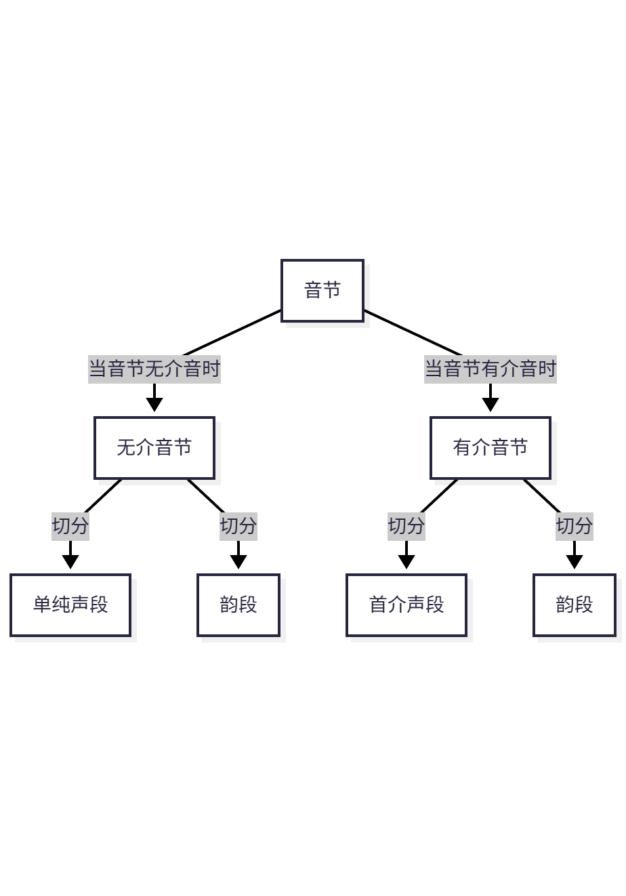
<figcaption>
图 2.1‑1声韵二分法的分析过程
</figcaption>
</figure>

根据声段是单纯声段或首介声段，声韵二分法的具体程式记成：

$$
音节 = \left\{ \begin{matrix}
\begin{bmatrix}
单纯声段 & 韵段
\end{bmatrix} & ， & 当音节无介音时 \\[6pt]
\begin{bmatrix}
首介声段 & 韵段
\end{bmatrix} & ， & 当音节有介音时
\end{matrix} \right.
$$

根据这个程式可知：声段或由首音充当或由首介合音充当。韵段是指从音节中切除了声段以后剩下的音段，是所有同韵的音节共同具有的音调和音质都相同的音段(全类同调同部相押的音节共同具有的音段)。具体地说，当音节无介音时，韵段是音节的除首音外的音段；当音节有介音时，韵段是音节的除首介合音外的音段[^5]。

根据反切解说，声韵二分法就是汉末曹魏孙炎在编撰《〈尔雅〉音义》时使用的析音法。换句话说，声韵二分法就是，古人，在制作反切时，不论音节有无介音都把音节划分成声段和韵段两段，也就是说，把首音或首介合音分析成声段，把音节的除声段外的音段分析成韵段，并用反切上字和反切下字来记录声段和韵段的两段二分法。因此，根据古人，在按照声韵二分法制作反切时，把由反切上字所记录的声段统称为“声”[^6]、把由反切下字所记录的韵段统称为“韵”[^7]，音节记成：

$$
音节 = \begin{bmatrix}
声 & 韵
\end{bmatrix}
$$

根据这个程式可知，声韵二分法就是古人在制作反切时使用的把音节分析成由声和韵构成的音节的方法。然而，在学术上，“声”和“韵”这对术语的用法通常都是不专一的[^8]，存在多种不同的用法，甚至存在两者混用的情况。因此，说明声韵二分法，只有把声韵二分法的“声”和“韵”与非声韵二分法的“声”和“韵”区别开来，才能避免歧义。简便和有效的区别方法就是改变声韵二分法的“声”和“韵”的名称。换句话说，说明声韵二分法，若要防止产生歧义和避免把说明淹没在对“声”和“韵”这对术语的不同用法的冗繁考据、辨析、剔择和注解中，只要简单地用一对新的术语来替换声韵二分法的“声”和“韵”，就能达到目的。因此，说明声韵二分法，引入声段和韵段这对新的术语，用声段来指称由反切上字所记录的“声”、用韵段来指称由反切下字所记录的“韵”，也就是说，把声韵二分法的“声”和“韵”改名为声段和韵段。因此，在把“声”和“韵”改名为声段和韵段后，声韵二分法就是古人在制作反切时使用的把音节分析成由声段和韵段构成的音节的方法。

##### 首干二分法

首干二分法是把音节分析成由首音和干音构成的音节的方法。在声韵二分法形成后，在声段是单纯声段的音节中，把声段和韵段改名为首音和干音；在声段是首介声段的音节中，把声段切分成首音和介音两段，并把由介音和韵段合成的介韵合音整体切分成一个音段且命名为干音；这种把音节分析成由首音和干音构成的音节的方法就是首干二分法。首干二分法的一般程式记成：

$$
音节 = \begin{bmatrix}
首音 & 干音
\end{bmatrix}
$$

在首干二分法中，根据干音是否由韵段充当，把由韵段充当的干音也就是说把既充当韵段又充当干音的音节的除首音外的音段简称为唯韵干音，把由介韵合音充当的干音简称为介韵干音，干音分成唯韵干音和介韵干音两类。干音和韵段不尽相同。干音或指韵段或指由介音和韵段合成的介韵合音。具体地说，当音节无介音时，韵段既是韵段又是干音。然而，当音节有介音时，韵段不是干音；干音包含介音、是介韵合音；韵段不含介音、是构成干音的除介音外的音段。

在把干音划分成唯韵干音和介韵干音两类后，根据音节分成无介音节和有介音节两类，两类音节的析音过程，也就是说，首干二分法的分析过程图示如图
2.1‑2。

<figure>
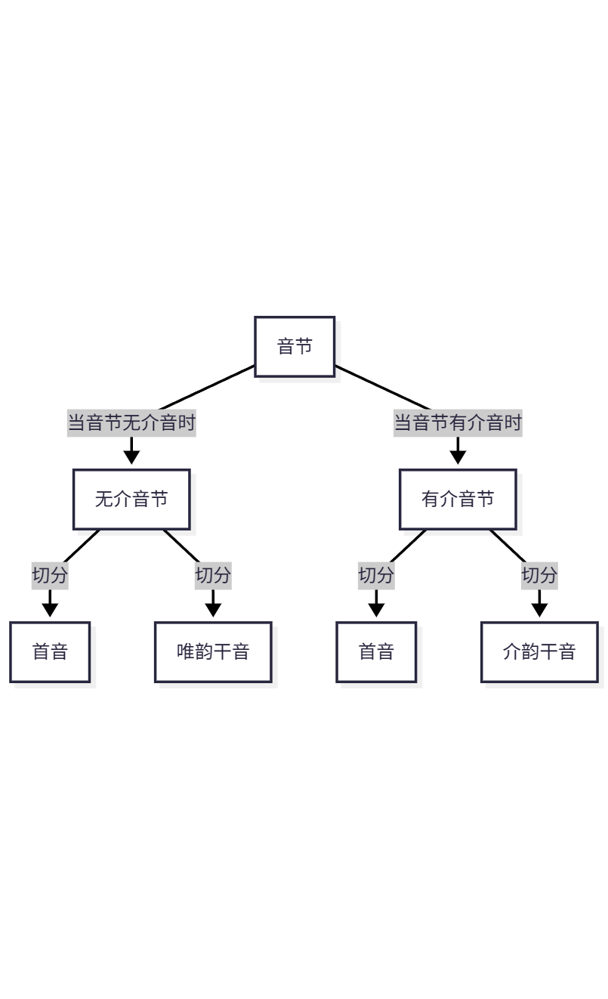
<figcaption>
图 2.1‑2首干二分法的分析过程
</figcaption>
</figure>

根据干音是唯韵干音或介韵干音，首干二分法的具体程式记成：

$$
音节 = \left\{ \begin{matrix}
\begin{bmatrix}
首音 & 唯韵干音
\end{bmatrix} & ， & 当音节无介音时 \\[6pt]
\begin{bmatrix}
首音 & 介韵干音
\end{bmatrix} & ， & 当音节有介音时
\end{matrix} \right.
$$

根据这个程式可知：首音指音节的除干音外的节首辅音。干音是音节的除首音外的音段。干音当音节无介音时由韵段充当，当音节有介音时由介韵合音充当。

根据反切解说，首干二分法就是古人在根据韵图制作反切时使用的字母等韵分析法。换句话说，首干二分法就是，古人，在根据韵图制作反切时，把音节划分成“字母”和“等韵”两段，不论音节有无介音都把首音分析成“字母”、把干音分析成“等韵”，也就是说，当音节无介音时把韵段分析成“等韵”，当音节有介音时把介韵合音分析成“等韵”，并用反切上字和反切下字来记录“字母”和“等韵”的两段二分法。因此，根据古人在根据韵图制作反切时把首音分析成“字母”、把干音分析成“等韵”，音节记成：

$$
音节 = \begin{bmatrix}
字母 & 等韵
\end{bmatrix}
$$

根据这个程式可知，首干二分法就是字母等韵分析法，就是古人在根据韵图制作反切时使用的把音节分析成由“字母”和“等韵”构成的音节的方法。尽管古人在根据韵图制作反切时分别用“字母”和“等韵”来指称首音和干音。然而，在清朝中期后，在学术上，主流的看法是用“字母”来指称首音名不副实，因此，根据“字母”实际上是首音，把“字母”改名为首音。在把“字母”改名为首音后，沿用“等韵”这个术语也无必要。因此，“等韵”被改名为干音。因此，字母等韵分析法被改名为首干二分法。

比较声韵二分法和首干二分法的具体程式可知，把音节分析成由两个音段构成的音节，当音节无介音时，声段就是首音、韵段就是干音，分段方法是相同的，都是把音节分析成声段和韵段或首音和干音两段。然而，当音节有介音时，分段方法却有两种：一种是把首介合音整体分析成声段，一种是把介韵合音整体分析成干音。这种差异是划分声韵二分法和首干二分法的根据。因此，在已有各式析音法中，两段二分法共有两种：一种是声韵二分法，一种是首干二分法，换句话说，声韵二分法和首干二分法合称两段二分法。声韵二分法是把音节分析成由声段和韵段构成的音节的方法。声段或由首音充当或由首介合音充当。韵段是指从音节中切除了声段以后剩下的音段，是所有同韵的音节共同具有的音调和音质都相同的音段(全类同调同部相押的音节共同具有的音段)。首干二分法是把音节分析成由首音和干音构成的音节的方法。首音就是节首辅音，指从音节中切除了韵段或介韵合音以后剩下的辅音。干音是音节的除首音外的音段。干音当音节无介音时由韵段充当，当音节有介音时由介韵合音充当。声韵二分法和首干二分法是两种形式的两段二分法，两者又名一式两段二分法和二式两段二分法，两者统称两段二分法。

综述说明，两段二分法是把音节分析成或由声段和韵段或由首音和干音两个音段构成的音节的方法。声韵二分法是把音节分析成由声段和韵段构成的音节的方法。首干二分法是把音节分析成由首音和干音构成的音节的方法。

#### 质调二分法

质调二分法是指把音节分析成由节调与节质构成的音节的方法。节调是音节的音调的简称。在把音节的声调简称为节调后，把音节的音质简称为节质。声调语言分成单音节声调语言和多音节声调语言两类。汉语是单音节声调语言[^9]。在多音节声调语言中，声调表现为音节数量不定的语素、词语等语言单位的音调。然而，在汉语中，声调总是表现为音节数量唯一的单音节语素或单音节词的音调，换句话说，声调总是表现为音节的声调，具体地说，排除因受前后音节的声调等外部影响而发生的变调情况，每个音节都有且仅有一个声调。因此，在强调汉语的声调与多音节声调语言的声调在形式上不同、是一类特殊形式的声调——音节的声调并专门用一个术语来指称这类语言的声调时，根据汉语的声调表现为音节的声调并把音节的声调简称为节调，汉语的声调就是“节调”。在汉语中，节调和节质的差异都构成对立。因此，在析音时，一种方法是从音节中既析出节调又析出节质、把音节分析成由节调与节质构成的音节。这种析音法就是质调二分法。根据质调二分法，音节记成：

$$
\begin{matrix}
音节 & = & \begin{bmatrix}
节调 \\
节质
\end{bmatrix}
\end{matrix}
$$

在汉语中，根据是否把音节分析成离散的音段序列，析音法分成一维音段序列分析法和二维质调序列分析法两类。在汉语中，节调和节质的差异都构成对立。因此，在已有析音法中，既有把音节分析成由两个音段构成的音节、把节调划分成两段、分析成构成音节的两个音段的音调的，例如声韵二分法和首干二分法；也有把节调分析成与节质相对独立的音节的特征的，例如一调二质分析法、一调三质分析法和节调质素分析法。在两段二分法中，节调或被分析成声段的音调和韵段的音调两段或被分析成首音的音调和干音的音调两段，也就是说，节调被分析成两个音段的特征，因此，这类析音法是一维音段序列分析法。在把节调分析成与节质相对独立的特征后，不论把节质划分成几段，这类析音法根据音节由节调与节质构成都是二维质调序列分析法。这就是说，一调二质分析法、一调三质分析法和节调质素分析法都是二维质调序列分析法。

两段二分法的特征是从时域上把音节分析成或由声段和韵段或由首音和干音构成的音节。在声韵二分法中，声段和韵段同属音段，音节是由声段和韵段构成的音节。在首干二分法中，首音和干音同属音段，音节是由首音和干音构成的音节。

二维质调序列分析法的特征是把音节分析成由节调与节质构成的音节，且把节质或一律划分成两段音质、或至多划分成三段音质、或一律切分成质素序列。例如，在节调声质韵质分析中，音节由节调与节质构成，节质由声质和韵质构成，因此，节调声质韵质分析法是一种二维质调序列分析法。又如，在节调声母韵母分析中，音节由节调与节质构成，节质由声母和韵母构成，因此，节调声母韵母分析法是一种二维质调序列分析法。再如，在节调质素分析法中，音节由节调与节质构成，节质由质素构成的序列，因此，节调质素分析法是一类二维质调序列分析法。

两段二分法与一调二质分析法表示节调的方式不同。在两段二分法中，节调间接或用声段的音调和韵段的音调来表达或用首音的音调和干音的音调来表达。然而，在一调二质分析法中，节调与节质相对独立，节调是构成音节的与音质相对独立的结构单元。例如，在节调声母韵母分析中，节调与节质相对独立，节调是构成音节的与音质相对独立的结构单元；声母和韵母构成节质；节调与节质构成音节；节调不用也不能用声母的音调和韵母的音调来表达。

综述说明，二分法分为两段二分法和质调二分法两类。

### 一调二质分析法

一调二质分析法是把音节分析成由节调与节质构成的音节并且把节质或切分成声质和韵质或切分成声母和韵母两段音质的方法。一种是节调声质韵质分析法，一种是节调声母韵母分析法。前者把节质一律划分成声质和韵质两段，后者把节质一律划分成声母和韵母两段。两者都把音节分析成由一个声调与两段音质构成的音节。因此，两者被统称为一调二质分析法。

#### 节调声质韵质分析法

在声韵二分法形成后，节调声质韵质分析法是从由声段和韵段构成的音节中析出节调且把声段的音质分析成声质、把韵段的音质分析成韵质的方法。

节调声质韵质分析法的一般程式记成：

$$
音节 = \begin{bmatrix}
节 & 调 \\
声质 & 韵质
\end{bmatrix}
$$

在节调声质韵质分析中，当声质是单纯声段的音质时，把单纯声段的音质简称为首质，把由首质充当的声质也就是说把既是首质又是声质的单纯声段的音质简称为单纯声质；当声质是首介声段的音质时，把由首介声段的音质充当的声质简称为首介声质；声质分成单纯声质和首介声质两类。

在把声质划分成单纯声质和首介声质两类后，根据音节分成无介音节和有介音节两类，两类音节的析音过程，也就是说，节调声质韵质分析法的分析过程图示如图
2.1‑3。

<figure>
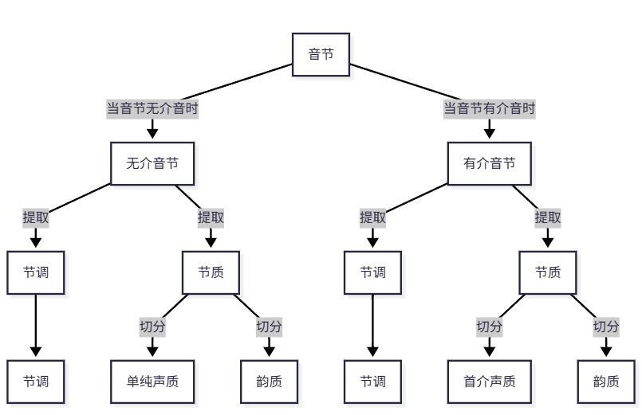
<figcaption>
图 2.1‑3节调声质韵质分析法
</figcaption>
</figure>

在把声质划分成单纯声质和首介声质两类后，节调声质韵质分析法的具体程式记成：

$$
音节 = \left\{ \begin{matrix}
\begin{bmatrix}
节 & 调 \\
单纯声质 & 韵质
\end{bmatrix} & ， & 当音节无介音时 \\[12pt]
\begin{bmatrix}
节 & 调 \\
首介声质 & 韵质
\end{bmatrix} & ， & 当音节有介音时
\end{matrix} \right.
$$

在节调声质韵质分析中，在析出节调后，声质和韵质构成节质，节调与节质既相对独立又通过并行联结关系构成音节。因此，严格地说，单纯声质不是单纯声段而是单纯声段的音质；首介声质不是首介声段而是首介声段的音质。无论音节是哪类音节，韵质都不是韵段而是韵段的音质。

强调说明，前人，在说明节调声质韵质分析法时，并不使用节调、声质和韵质这套术语，而是使用声母、韵母和声调这套术语，且经常把三者简称为“声”、“韵”和“调”，并把这种析音法简称为“声韵调分析法”。然而，在节调声质韵质分析中，在使用声母和韵母这对术语的情况下，声母和韵母只不过是声韵二分法的“声”和“韵”的音质。因此，在节调声质韵质分析中，尽管完全可以和前人一样分别把声段的音质和韵段的音质命名为声母和韵母，但却不能把声母和韵母简称为“声”和“韵”。在根据节调声质韵质分析法析音时，无论是先析出节调还是后析出节调，只要析出节调，在析出节调后，就从声段和韵段中析出了各自具有的那段作为节调的一个调段的音调，因此，在节调声质韵质分析中，声母和韵母已不是声段和韵段而是声段的音质和韵段的音质。因此，在把声段的音质和韵段的音质简称为声质和韵质后，只有把声母和韵母改名为声质和韵质才算名符其实。同时，在说明节调声母韵母分析法时，前人也使用声母、韵母和声调这套术语。因此，为使术语名符其实，为严格区分两种形式的一调二质分析法的声母和韵母，在说明节调声质韵质分析法时，不再使用声母、韵母和声调这套术语及其简称，不再使用“声韵调分析法”这个术语，把这种形式的“声韵调分析法”改名为节调声质韵质分析法。

#### 节调声母韵母分析法

在首干二分法形成后，节调声母韵母分析法是从由首音和干音构成的音节中析出节调且把首音的音质分析成声母、把干音的音质分析成韵母的方法。

节调声母韵母分析法的一般程式记成：

$$
音节 = \begin{bmatrix}
节 & 调 \\
声母 & 韵母
\end{bmatrix}
$$

在节调声母韵母分析中，当韵母是唯韵干音的音质时，把唯韵干音的音质简称为韵质，把由唯韵干音的音质充当的韵母也就是说把既是韵质又是韵母的节质的除声母外的音质简称为无介韵母；当韵母是介韵干音的音质时，把由介韵干音的音质充当的韵母简称为有介韵母；韵母分成无介韵母和有介韵母两类。

强调说明，前人，在说明节调声母韵母分析法时，和说明节调声质韵质分析法一样，也使用声母、韵母和声调这套术语，也把三者简称为“声”、“韵”和“调”，也把这种析音法简称为“声韵调分析法”。然而，两种形式的一调二质分析法的声母和韵母的内涵和外延(指称对象)不尽相同。在节调声质韵质分析中，声母或指单纯声段的音质或指首介声段的音质，无论音节有无介音，韵母都指韵质。然而，在节调声母韵母分析中，无论音节有无介音，声母都指首音的音质，韵母都指干音的音质。具体地说，当音节无介音时韵母指韵段的音质、当音节有介音时韵母指介韵合音的音质。在根据节调声母韵母分析法析音时，无论是先析出节调还是后析出节调，只要析出节调，在析出节调后，就从首音和干音中析出了各自具有的那段作为节调的一个调段的音调，因此，在节调声母韵母分析中，声母和韵母已不是首音和干音而是首音的音质和干音的音质。因此，为严格区分两种形式的一调二质分析法的声母和韵母，不再把节调声质韵质分析法的声质和韵质称为声母和韵母，只把节调声母韵母分析法的指称首音的音质和干音的音质的声母和韵母仍旧称为声母和韵母。因此，节调声母韵母分析法是从由首音和干音构成的音节中析出节调且把首音的音质分析成声母、把干音的音质分析成韵母的方法。在说明节调声母韵母分析法时，把声母和韵母简称为“声”和“韵”会导致两者与声韵二分法的“声”和“韵”相混，因此，不能把声母和韵母简称为“声”和“韵”，因此，在说明这种析音法时，不再使用“声韵调分析法”这个术语，把这种形式的“声韵调分析法”改名为节调声母韵母分析法。

在把韵母划分成无介韵母和有介韵母两类后，根据音节分成无介音节和有介音节两类，两类音节的析音过程，也就是说，节调声母韵母分析法的分析过程图示如图
2.1‑4。

<figure>
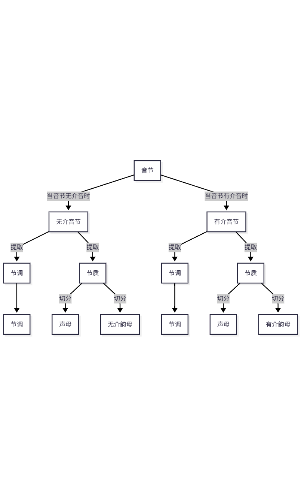
<figcaption>
图 2.1‑4节调声母韵母分析法
</figcaption>
</figure>

在把韵母划分成无介韵母和有介韵母两类后，节调声母韵母分析法的具体程式记成：

$$
音节 = \left\{ \begin{matrix}
\begin{bmatrix}
节 & 调 \\
声母 & 无介韵母
\end{bmatrix} & ， & 当音节无介音时 \\[12pt]
\begin{bmatrix}
节 & 调 \\
声母 & 有介韵母
\end{bmatrix} & ， & 当音节有介音时
\end{matrix} \right.
$$

在节调声母韵母分析中，在析出节调后，无论音节是哪类音节，声母严格地说都不是首音而是首音的音质；当音节无介音时，无介韵母不是唯韵干音而是唯韵干音的音质；当音节有介音时，有介韵母不是介韵干音而是介韵干音的音质。

一调二质分析法是一类二维质调序列分析法。在两种形式的一调二质分析法中，节调与节质既相对独立又通过并行联结关系构成音节，准确地说，节调是与节质相联结的音调。在节调声质韵质分析中，声质和韵质构成节质。在节调声母韵母分析中，声母和韵母构成节质。在两种形式的一调二质分析法中，音节内部的组合关系分为两个层次：在节调声质韵质分析中，第一层、声质和韵质构成节质；第二层、节调与节质构成音节。在节调声母韵母分析中，第一层、声母和韵母构成节质；第二层、节调与节质构成音节。因此，一调二质分析法是一类二维质调序列分析法。

综述可知，一调二质分析法是把音节分析成由节调与节质构成的音节并且把节质或切分成声质和韵质或切分成声母和韵母两段音质的方法。节调声质韵质分析法和节调声母韵母分析法的差异是：在节调声质韵质分析中，当音节无介音时把单纯声段的音质分析成声质、把韵段的音质分析成韵质，当音节有介音时把首介声段的音质分析成声质、把韵段的音质分析成韵质。在节调声母韵母分析中，不论音节有无介音都把首音的音质分析成声母，当音节无介音时把唯韵干音的音质分析成韵母、当音节有介音时把介韵干音的音质分析成韵母。

### 一调三质分析法

一调三质分析法是把音节分析成由节调与节质构成的音节并且当音节无介音时把节质切分成首质和韵质两段音质当音节有介音时把节质切分成首质、介质和韵质三段音质的方法。简单地说，一调三质分析法是把音节分析成由节调与节质构成的音节并且把节质切分成至多三段音质——首质、介质和韵质的方法；其中，首质或介质是可有可无的，节调和韵质是必不可少的。

首质是首音的音质的简称。首质在《注音符号方案》中被定名为声母。把声母改名为首质，是为从术语上突出显示首质与介质和韵质一样都是构成节质的一段音质。首质根据有无是否构成对立分成实首质和虚首质两类。实首质就是非零声母。虚首质就是零声母。

介质是介音的音质的简称。介质在《注音符号方案》中被定名为介母，在解说《汉语拼音方案》时被改名为韵头。

韵质是韵段的音质的简称。韵质在《注音符号方案》中被定名为韵母，在解说《汉语拼音方案》时被改名为韵身，在生成音系学中被改名为韵基。

在经过一调三质分析后，具体地说，音节必有节调和韵质，有些音节既无首质也无介质，有些音节虽无首质但有介质，有些音节虽有首质但无介质，有些音节既有首质也有介质。因此，这种当音节既无首质也无介质时把音节分析成由节调与韵质构成的音节，当音节虽无首质但有介质时把音节分析成由节调与介质和韵质构成的音节，当音节虽有首质但无介质时把音节分析成由节调与首质和韵质构成的音节和当音节既有首质也有介质时把音节分析成由节调与首质、介质和韵质构成的音节的方法；由于组成部分最多的音节由一个节调与三段音质首质、介质和韵质构成，被简称为“一调三质分析法”。

强调说明，前人，在说明一调三质分析法时，并不用首质、介质、韵质和节调这套术语，而是用声母、介母、韵母和声调这套术语，并把四者简称为“声”、“介”、“韵”和“调”，从而把这种析音法简称为“声介韵调分析法”。然而，一方面，把声母和韵母简称为“声”和“韵”会导致两者与声韵二分法的“声”和“韵”相混；另方面，把介母简称为“介”会导致介母和介音相混。因此，不能把声母、介母和韵母简称为“声”、“介”、“韵”，因此，在说明这种析音法时，不再使用“声介韵调分析法”这个术语，把这种形式的析音法改名为“一调三质分析法”。

根据一调二质分析法分成节调声质韵质分析法和节调声母韵母分析法两种可知，在一调二质分析法形成后，一调三质分析法既指在节调声质韵质分析法基础上把单纯声质分析成首质、把首介声质切分成首质和介质两段的方法，也指在节调声母韵母分析法基础上把声母分析成首质、把无介韵母分析成韵质、把有介韵母划分成介质和韵质两段的方法。

在节调声质韵质分析法基础上把单纯声质分析成首质、把首介声质切分成首质和介质两段的过程图示如图
2.1‑5。

<figure>
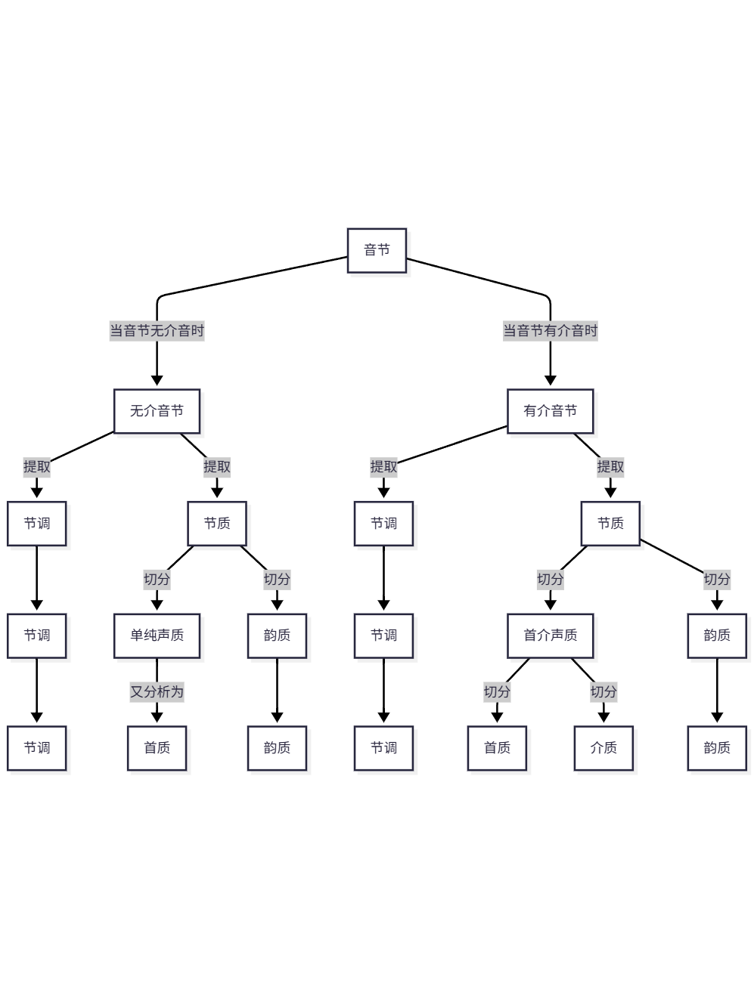
<figcaption>
图
2.1‑5在节调声质韵质分析法基础上分出首质和介质的过程
</figcaption>
</figure>

一调三质分析法的一般程式记成：

$$
音节 = \left\{ \begin{matrix}
\begin{bmatrix}
节 &&& 调 \\
首质 & 韵 && 质
\end{bmatrix}， & 当音节无介音时 \\[12pt]
\begin{bmatrix}
节 && 调 \\
首质 & 介质 & 韵质
\end{bmatrix}， & 当音节有介音时
\end{matrix} \right.
$$

在节调声母韵母分析法基础上把声母分析成首质、把无介韵母分析成韵质、把有介韵母划分成介质和韵质两段的过程图示如图
2.1‑6。

<figure>
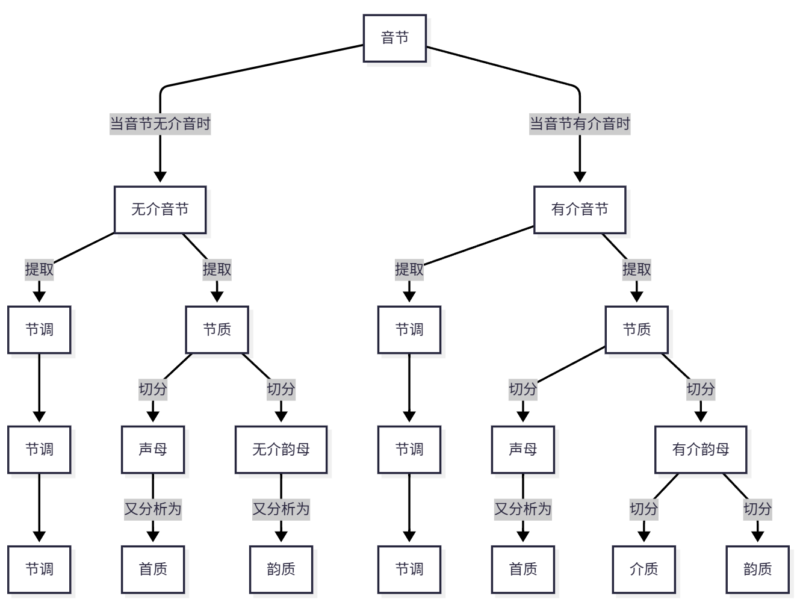
<figcaption>
图
2.1‑6在节调声母韵母分析法基础上分出介质和韵质的过程
</figcaption>
</figure>

根据在节调声质韵质分析法基础上分出首质和介质的过程和在节调声母韵母分析法基础上分出介质和韵质的过程可知，这两个分析过程异曲同工，尽管中间环节因介质的有无不同而不同，然而，由于两者的分析对象相同(都是未经分解的音节)和分析结果相同(都是把音节分析成由节调与节质构成的音节并且当音节无介音时把节质切分成首质和韵质两段音质当音节有介音时把节质切分成首质、介质和韵质三段音质)。因此，从这两个分析过程中省去中间环节，这两个分析过程的分析程式完全相同。

在一调三质分析中，根据介质有无及介质差异分类，韵母分成无介韵母、噫介韵母、呜介韵母和吁介韵母四类。根据韵母是否由介质和韵质构成分类，韵母分成无介韵母和有介韵母两类。无介韵母由韵质充当，没有介质。有介韵母由介质和韵质构成，具有介质。根据介质差异分类，有介韵母分成介质为 i[i]的韵母、介质为 u[u]的韵母和介质为 ü[ʏ]的韵母三类，依序被命名为“噫介韵母”、“呜介韵母”和“吁介韵母”。因此，根据介质有无及介质差异分类，韵母分成无介韵母、噫介韵母、呜介韵母和吁介韵母四类。

在一调三质分析中，音节分成无介音节和有介音节两类。当音节无介音时，节质由声母和韵母构成，声母由首质充当，韵母由韵质充当，首质和韵质构成节质，节调与节质构成音节，这类音节被简称为无介音节。当音节无介音时，节质由声母和韵母构成，声母由首质充当，韵母由介质和韵质构成，首质、介质和韵质构成节质，节调与节质构成音节，这类音节被简称为有介音节。

一调三质分析法是一种二维质调序列分析法。在一调三质分析中，节调与节质既相对独立又通过并行联结关系构成音节，准确地说，节调是与节质相联结的音调。音节内部的组合关系是：在无介音节中，声母由首质充当，韵母由韵质充当，首质和韵质构成节质，节调与节质构成音节。在有介音节中，声母由首质充当，韵母由介质和韵质构成，首质、介质和韵质构成节质；节调与节质构成音节。因此，一调三质分析法是一种二维质调序列分析法。

一调三质分析法是制定《注音符号方案》的根据。换句话说，《注音符号方案》根据一调三质分析法记音和拼音。《注音符号方案》是经过多次修订的《注音字母方案》。《注音字母方案》是民国教育部 1918 年公布的一套法定的汉字笔画式的拼音方案。在《注音字母方案》公布后，民国政府在 1919 至 1932 年间对这个方案作了多次修订[^10]，并在 1930 年把这个方案改名为《注音符号方案》。当不区别《注音符号方案》和《注音字母方案》两者的差异时，把两者笼统称为《注音方案》。因此，在要区别两者的差异时，把改名前的方案称为《注音字母方案》，把改名后的方案称为《注音符号方案》。《注音方案》的基本内容分为声母、介母、韵母和声调[^11]四个部分。在《注音方案》中，在韵母由介母充当时，介母也是韵母。

在一调三质分析中，介质是介音的音质的简称。介质在《注音符号方案》中被定名为介母，在解说《汉语拼音方案》时被改名为韵头。在多数解说《注音方案》的文献中，介母通常被解释成介音。然而，不能把《注音方案》的介母解释成介音。在根据一调三质分析法析音时，无论是先析出节调还是后析出节调，只要析出节调，在析出节调后，就从介音中析出了它所包含的那段作为节调的一段的音调，介音已不再是介音而仅仅是介音的音质，因此，在一调三质分析中，介母只不过是介音的音质、不能被解释成介音。这就是说，介音是由介母和与其相联结的调段构成的音段。因此，介母仅指介音的音质，不含与介母联结的调段——介音的音调。因而，不能把介母解释成介音。严格地说，根据介母实际上是介音的音质，把介音的音质简称为介质，介母就是介质。因此，在一调三质分析中，介母被改名为介质。

在解说《注音方案》时，无介韵母曾被称为基本韵母，有介韵母曾被称为结合韵母。基本韵母或由“韵母”充当或由“介母”充当。结合韵母由“介母”和“韵母”构成[^12]。这就是说，在《注音方案》中，当韵母是由介质与韵质构成的有介韵母时，介质不叫介质而叫“介母”，韵质最初既不是叫韵身或韵基也不是叫韵质而是叫“韵母”。

《注音方案》的“韵母”在根据《汉语拼音方案》解说《注音方案》时被改名为韵身，在生成音系学中被改名为韵基，现在被改名为韵质。在《汉语拼音方案》中，如果也和在《注音方案》中一样，把有介韵母的韵质称为“韵母”，尽管对无介韵母没有任何问题，然而对有介韵母就会出现问题。在《汉语拼音方案》中，《注音方案》的无介韵母和有介韵母被统称为韵母，因此，在说明韵母时，说一个韵母包含介母和另一个“韵母”，这会使韵母不符合它在《汉语拼音方案》中的内涵。因此，为使韵母这个术语在解说《注音方案》和《汉语拼音方案》时具有相同的内涵、指称相同的对象，在根据《汉语拼音方案》解说《注音方案》时，不能再把有介韵母的韵质称为“韵母”。只有这样，才能比较容易从结构上说清《注音方案》的“韵母”和《汉语拼音方案》的“韵母”的关系，避免韵母含义在两个方案中不同产生的问题。在《注音方案》中，当音节无介音时，单纯从音质上比较，无介韵母和有介韵母的韵质相同。这是《注音方案》把韵质称为“韵母”的依据。正是因为韵母和韵质的指称对象存在交叉导致歧义，当音节有介音时，根据《汉语拼音方案》解说《注音方案》，在有介韵母中，“韵母”被改名为韵质，指有介韵母的除介质外的音质。

### 节调质素分析法

节调质素分析法是把音节分析成由节调与节质构成的音节并且把节质切分成质素序列的方法。在经过节调质素分析后，音节由节调与节质构成，节质在不省略零声母的情况下由声母和韵母构成，韵母分成单质韵母、前长韵母、后长韵母和三质韵母四类。单质韵母由韵腹充当，是单纯音质韵母的简称。前长韵母由韵腹和韵尾构成，是前长二合音质韵母的简称。后长韵母由韵头和韵腹构成，是后长二合音质韵母的简称。三质韵母由韵头、韵腹和韵尾构成，是三合音质韵母的简称。单质韵母、前长韵母、后长韵母和三质韵母，一一对应，依序就是根据韵头有无和韵尾有无分类分出的无头无尾韵母、无头有尾韵母、有头无尾韵母和有头有尾韵母。单质韵母和前长韵母，也就是说，无头无尾韵母和无头有尾韵母，被统称为无头韵母。后长韵母和三质韵母，也就是说，有头无尾韵母和有头有尾韵母，被统称为有头韵母。在节调质素音节中，在把声母、有头韵母的韵头、每类韵母的韵腹和有尾韵母的韵尾都分析成“音素”后，音节是由节调与充当声母和构成韵母的“音素”构成的音节。然而，在这种由节调与充当声母和构成韵母的“音素”构成的音节中，无论是先析出节调还是后析出节调，只要析出节调，在析出节调后，“音素”已不再是从音质的角度划分出来的最小音段、而仅仅是根据音质的差异从由声母和韵母构成的节质中析出的只表示音质不表示音调的最小音质，简单地说，“音素”只不过是音素的音质，因此，把音素的音质命名为“质素”，“音素”实际上是质素，音节实际上是由节调与构成节质的质素序列构成的音节。这种音节被简称为节调质素音节。这种把音节分析成节调质素音节的方法，就是节调质素分析法。

在一调三质分析法形成后，简单地说，节调质素分析法是指在一调三质分析法基础上把介质分析成韵头、把单质韵质分析成韵腹、把复合韵质分析成由韵腹和韵尾构成的韵质的方法。这种方法，具体内容，就是：

在无介韵母中，根据韵母由韵质充当，把韵母，也就是说，把韵质分析成单质韵质和复合韵质两类。为表示每类韵母必有韵腹，把单质韵质分析成由韵腹充当的韵质，把由单质韵质充当的韵母分析成由韵腹充当的韵母且命名为单质韵母。把复合韵质分析成由韵腹和韵尾构成的韵质，把由复合韵质充当的韵母分析成由韵腹和韵尾构成的韵母且命名为前长韵母。

在有介韵母中，把有介韵母的介质分析成韵头；把有介韵母的韵质分析成单质韵质和复合韵质两类。为表示每类韵母必有韵腹，把单质韵质分析成由韵腹充当的韵质，把由韵头和单质韵质构成的韵母分析成由韵头和韵腹构成的韵母且命名为后长韵母。把复合韵质分析成由韵腹和韵尾构成的韵质，把由韵头和复合韵质构成的韵母分析成由韵头、韵腹和韵尾构成的韵母且命名为三质韵母。

在节调质素分析形成后，音节记成：

$$
音节 = \left\{ \begin{matrix}
\begin{bmatrix}
\begin{matrix}
节 &&&&&&&&& 调
\end{matrix} \\
\begin{matrix}
声母 & 韵 &&&&&& 腹
\end{matrix}
\end{bmatrix}， & 当韵母是单质韵母时 \\[12pt]
\begin{bmatrix}
\begin{matrix}
节 &&&&&&&&& 调
\end{matrix} \\
\begin{matrix}
声母 & \begin{matrix}
韵 &&& 腹
\end{matrix} & 韵尾
\end{matrix}
\end{bmatrix}， & 当韵母是前长韵母时 \\[12pt]
\begin{bmatrix}
\begin{matrix}
节 &&&&&&&&& 调
\end{matrix} \\
\begin{matrix}
声母 & 韵头 & \begin{matrix}
韵 &&& 腹
\end{matrix}
\end{matrix}
\end{bmatrix}， & 当韵母是后长韵母时 \\[12pt]
\begin{bmatrix}
\begin{matrix}
节 &&&&&&&&& 调
\end{matrix} \\
\begin{matrix}
声母 & 韵头 & 韵腹 & 韵尾
\end{matrix}
\end{bmatrix}， & 当韵母是三质韵母时
\end{matrix} \right.
$$

节调质素分析法的分析过程图示如图 2.1‑7。

<figure>
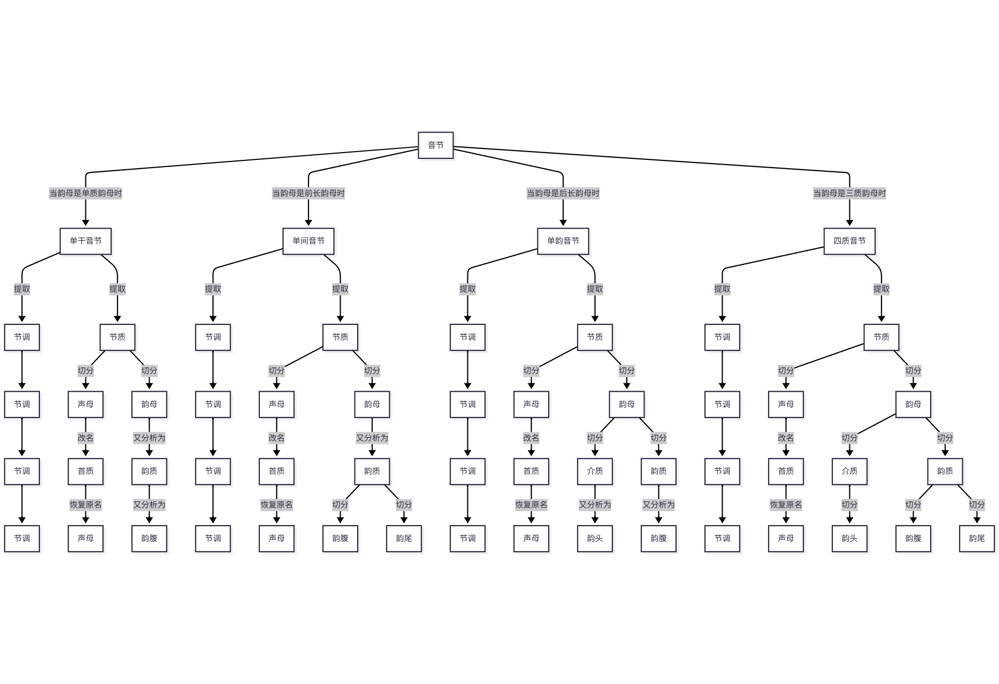
<figcaption>
图 2.1‑7节调质素分析法的分析过程
</figcaption>
</figure>

在图
2.1‑7 中，把音节划分成四类并命名为单干音节、单间音节、单韵音节和四质音节的方法，后续将有多处说明。因此，这里只先引用分类结果，暂时不作具体说明。

在节调质素音节中，根据质素数量和韵腹的结构地位、位置特征和时长特征分类，韵母分成单质韵母、前长韵母、后长韵母和三质韵母四类。这种韵母分类法的具体内容是：一、根据音质单复把韵母划分成单纯音质韵母和复合音质韵母两类[^13]；二、根据复合程度把复合音质韵母细分成二合音质韵母和三合音质韵母两类；三、根据韵腹的结构地位、位置特征和时长特征把二合音质韵母再分成前长二合音质韵母和后长二合音质韵母两类。根据这种层次分类法，依序把单纯音质韵母、前长二合音质韵母、后长二合音质韵母和三合音质韵母简称为单质韵母、前长韵母、后长韵母和三质韵母，韵母分成单质韵母、前长韵母、后长韵母和三质韵母四类。在四类韵母中，尽管各类韵母的韵腹都被命名为“韵腹”，然而各类韵母的“韵腹”的结构地位各不相同。具体地说，当韵母是单质韵母时，韵腹充当韵母；当韵母是前长韵母时，韵腹充当间质；当韵母是后长韵母时，韵腹充当韵质；当韵母是三质韵母时，韵腹充当主质（主质是主要质素的简称也被简称为主体或核心）。因此，根据质素数量和韵腹的结构地位、位置特征和时长特征对韵母进行分类，简单地说，就是根据韵腹的地位及其特征分类。根据这种韵母分类法分出的四类韵母，依序就是根据韵头有无和韵尾有无分类分出的无头无尾韵母、无头有尾韵母、有头无尾韵母和有头有尾韵母。在现代通用汉语中，把单鼻韵母排除在外，单质韵母仅指单韵母[^14]。二合音质韵母是二合复韵母和开口呼鼻韵母两类韵母的统称[^15]。三质韵母是三合复韵母和非开口呼鼻韵母两类韵母的统称[^16]。前长韵母是开口呼复韵母和开口呼鼻韵母两类韵母的统称[^17]。开口呼复韵母就是前响复韵母。后长韵母，在现代通用汉语中，在不根据实际音质把非开口呼鼻韵母 in[in]、ün[ʏn]、ing[iŋ]、ong[uŋ]和 iong[yŋ]归入后长韵母时，仅指非开口呼二合复韵母[^18]。非开口呼二合复韵母就是后响复韵母。

单质韵母、前长韵母、后长韵母和三质韵母，这四类韵母，在一些文献中，被表示成“韵腹”型韵母、“韵腹+韵尾”型韵母、“韵头+韵腹”型韵母和“韵头+韵腹+韵尾”型韵母
(王力, 汉语音韵, 2003) (沈阳, 2005)。

根据韵母分成单质韵母、前长韵母、后长韵母和三质韵母四类，韵母记成：

$$
韵母 = \left\{ \begin{matrix}
\begin{bmatrix}
韵 &&&&&& 腹
\end{bmatrix}， & 当韵母是单质韵母时 \\[12pt]
\begin{bmatrix}
\begin{matrix}
韵 &&& 腹
\end{matrix} & 韵尾
\end{bmatrix}， & 当韵母是前长韵母时 \\[12pt]
\begin{bmatrix}
韵头 & \begin{matrix}
韵 &&& 腹
\end{matrix}
\end{bmatrix}， & 当韵母是后长韵母时 \\[12pt]
\begin{bmatrix}
韵头 & 韵腹 & 韵尾
\end{bmatrix}， & 当韵母是三质韵母时
\end{matrix} \right.
$$

在节调质素音节中，充当无头无尾韵母的韵腹、构成无头有尾韵母的除韵尾外的韵腹、构成有头无尾韵母的除韵头外的韵腹和构成有头有尾韵母的除头尾外的韵腹在名义上都被称作“韵腹”。因此，每类韵母必有韵腹，有无韵头和有无韵尾是各类韵母相互区别的标志。具体地说，各类韵母相互区别的标志是：无头无尾韵母无韵头无韵尾；无头有尾韵母无韵头有韵尾；有头无尾韵母有韵头无韵尾；有头有尾韵母有韵头有韵尾；每类韵母都有韵腹。

节调质素分析法是一种二维质调序列分析法。在节调质素音节中，韵质或由韵腹充当或由韵腹和韵尾构成，韵母或由韵质充当或由韵头和韵质构成，声母和韵母构成节质，节调与节质构成音节。音节的结构具有层层二分的特性[^19]
(徐通锵, 2001)，既可以用一个树形图来表示 (施向东, 2008)，也可以用一个平面图来表示 (黄伯荣、廖序东等, 2002, 页 90)。因此，节调质素分析法是一种二维质调序列分析法。

在节调质素音节中，位居在声母和韵尾间的音质被命名为间质。这就是说，间质是有韵尾的节质的除声母和韵尾外的部分。根据间质的定义，节质具有间质，必有韵尾。有韵尾的节质被统称为有尾节质。在有尾节质中，韵母就是有尾韵母。有尾韵母分为前长韵母(无头有尾韵母)和三质韵母(有头有尾韵母)两类。因此，有尾节质分为两类：一类是韵母为前长韵母的节质，一类是韵母为三质韵母的节质。在有尾节质中，间质就是位居在声母和韵尾间的音质。具体地说，在节质中，前长韵母的韵腹被统称为单质间质；三质韵母的由韵头和韵腹构成的间质被统称为复合间质；单质间质和复合间质被统称为间质。在前长韵母中，间质是单质间质，由韵腹充当。单质间质在不会发生歧义时被简称为间质。

在节调质素音节中，尽管充当无头无尾韵母的韵腹、构成无头有尾韵母的除韵尾外的韵腹、构成有头无尾韵母的除韵头外的韵腹和构成有头有尾韵母的除头尾外的韵腹在名义上都被称作“韵腹”，然而各类韵母的“韵腹”的结构地位各不相同。具体地说，在无头无尾韵母中，韵腹充当韵母；在无头有尾韵母中，韵腹充当间质；在有头无尾韵母中，韵腹充当韵质；在有头有尾韵母中，韵腹充当主质（主质是主要质素的简称也被简称为主体或核心）。因此，为表示各类韵母的“韵腹”的结构地位各不相同，在后续说明中，一般不再使用或不再不加修饰和限制地使用“韵腹”这个术语，而是依序用单质韵母、单质间质、单质韵质和三质韵母的主要质素来指称无头无尾韵母、无头有尾韵母、有头无尾韵母和有头有尾韵母四类韵母的韵腹，并在不会发生歧义时依序把单质韵母、单质间质、单质韵质和三质韵母的主要质素简称为韵母、间质、韵质和主质。

根据韵腹的结构地位，韵母记成：

$$
韵母 = \left\{ \begin{matrix}
\begin{bmatrix}
韵 &&&&&& 母
\end{bmatrix}， & 当韵母是单质韵母时 \\[12pt]
\begin{bmatrix}
\begin{matrix}
间 &&& 质
\end{matrix} & 韵尾
\end{bmatrix}， & 当韵母是前长韵母时 \\[12pt]
\begin{bmatrix}
韵头 & \begin{matrix}
韵 &&& 质
\end{matrix}
\end{bmatrix}， & 当韵母是后长韵母时 \\[12pt]
\begin{bmatrix}
韵头 & 主质 & 韵尾
\end{bmatrix}， & 当韵母是三质韵母时
\end{matrix} \right.
$$

根据这个程式可知，在单质韵母中，韵母由韵腹充当；在前长韵母中，韵母由间质和韵尾构成，间质由韵腹充当；在后长韵母中，韵母由韵头和韵质构成，韵质由韵腹充当；在三质韵母中，韵母由韵头和韵质构成，韵质由韵腹和韵尾构成。

在节调质素音节中，在把声母、有头韵母的韵头、每类韵母的韵腹和有尾韵母的韵尾都分析成“音素”后，音节是由节调与充当声母和构成韵母的“音素”构成的音节。然而，在这种由节调与充当声母和构成韵母的“音素”构成的音节中，无论是先析出节调还是后析出节调，只要析出节调，在析出节调后，“音素”已不再是从音质的角度划分出来的最小音段、而仅仅是根据音质的差异从由声母和韵母构成的节质中析出的只表示音质不表示音调的最小音质，简单地说，“音素”只不过是音素的音质，因此，把音素的音质命名为“质素”，“音素”实际上是质素，音节实际上是由节调与构成节质的质素序列构成的音节。这种音节被简称为节调质素音节[^20]。在把声母、有头韵母的韵头、每类韵母的韵腹和有尾韵母的韵尾都分析成质素后，音节记成：

$$
音节 = \left\{ \begin{matrix}
\begin{bmatrix}
\begin{matrix}
节 &&&&&&&&& 调
\end{matrix} \\
\begin{matrix}
质素 & 质 &&&&&& 素
\end{matrix}
\end{bmatrix}， & 当韵母是单质韵母时 \\[12pt]
\begin{bmatrix}
\begin{matrix}
节 &&&&&&&&& 调
\end{matrix} \\
\begin{matrix}
质素 & \begin{matrix}
质 &&& 素
\end{matrix} & 质素
\end{matrix}
\end{bmatrix}， & 当韵母是前长韵母时 \\[12pt]
\begin{bmatrix}
\begin{matrix}
节 &&&&&&&&& 调
\end{matrix} \\
\begin{matrix}
质素 & 质素 & \begin{matrix}
质 &&& 素
\end{matrix}
\end{matrix}
\end{bmatrix}， & 当韵母是后长韵母时 \\[12pt]
\begin{bmatrix}
\begin{matrix}
节 &&&&&&&&& 调
\end{matrix} \\
\begin{matrix}
质素 & 质素 & 质素 & 质素
\end{matrix}
\end{bmatrix}， & 当韵母是三质韵母时
\end{matrix} \right.
$$

在汉语中，把节质分析成质素序列的方法，尽管前人认为它是一种与非声调语言的音素分析法实质相同的方法，然而它实际上不是音素分析法而是质素分析法[^21]。因此，节调质素分析法是既析出节调又析出节质并把节质分析成质素序列的方法。在汉语中，在析出节调后，运用质素分析法，把声母分析成辅音的音质；把韵头分析成前高或后高元音的音质；把韵腹或分析成元音的音质或分析成辅音的音质；把韵尾或分析成元音的音质或分析成辅音的音质，把辅音的音质和元音的音质统称为质素[^22]，从而把音节分析成由节调与构成节质的质素序列构成的音节，这种析音方法，就是节调质素分析法[^23]。把韵腹或韵尾分析成辅音的音质，在现代通用汉语中，就是分析成鼻音的音质。

节调质素分析法的“音素”分析法和非声调语言的音素分析法是两种性质不同的方法。两者相比，尽管两者的分析标准相同、分析结果从名称上也都被称为音素，因而两者似乎没有差异、都是音素分析法，然而两者不仅分析对象完全不同而且分析结果内容不同，因而两者是两种性质不同的方法。

首先，两者的分析对象完全不同。非声调语言的音素分析法的分析对象是实际语音，是具有具体音高、音质、音强和音长的音段，也就是说，是语音的音值。然而，在汉语中，在析出节调后，节调质素分析法的“音素”分析法的分析对象是从音节中析出了节调以后剩下的音质——节质，也就是说，是音节的除节调外的声母和韵母。

其次，两者的分析结果内容不同。非声调语言的音素实为音段，汉语的“音素”实为意指音素的音质或音段的音质的质素。在非声调语言中，音素是从音质的角度划分出来的最小音段。具体地说，从发音上分析，根据发音系统不能发出任何不具有具体音高、任何不具有具体音强和任何不具有具体音长的音素把音素的音高、音强和音长分析成默认的音高、默认的音强和默认的音长，音素是具有确定的音质、默认的音高、默认的音强和默认的音长的音段。然而，在汉语中，在析出节调后，在分析“音素”时，由于受析对象是从音节中析出了节调以后剩下的音质——节质，也就是说，由于受析对象是音节的除节调外的声母和韵母，因此，把节质分析成“音素”序列，只不过是对节质分段，因而充当声母和构成韵母的“浊音”实际上只不过是构成节质的一段音质或一个质素。综合说明，在现代通用汉语中，由于充当声母的清音既可以分析成音素又可以分析成质素，由于充当声母和构成韵母的“浊音”实际上只不过是构成节质的一段音质或一个质素，因此，“音素”实际上不是音素而是质素——音素的音质。

综述说明，根据析音法的典型特征分类，已有析音法分成二分法、一调二质分析法、一调三质分析法和节调质素分析法四类。

## 已有各式析音法的分代

根据析音法的演变历程分代，已有析音法分成第一代析音法、第二代析音法、第三代析音法和第四代析音法四代。第一代析音法是声韵二分法。第二代析音法是节调声质韵质分析法。第三代析音法是一调三质分析法。第四代析音法是节调质素分析法。第四代析音法是现行析音法。

### 第一代析音法

声韵二分法是把音节分析成由声段和韵段构成的音节的方法。它是最早产生和形成的析音法，被划分成第一代析音法。它是古人在第一代反切中使用的析音法。第一代反切是古人在第二代析音形成以前根据第一代析音法制作的反切[^24]。第一代反切是第一代析音法的记音方法。第一代反切的形成标志声韵二分法的形成[^25]。声韵二分法的形成标志汉语语音学的形成。

#### 指称对象

一种析音法，只有当它是古人在第一代反切中使用的析音法时，才是第一代析音法；相反，它就不是第一代析音法。根据考证，古人在第二代析音法形成以前制作的反切都是根据声韵二分法制作的反切、都不是根据其它析音法制作的反切。

第一代析音法不包含后起的任何一种析音法。古人在第二代析音法形成以前还不能析出节调因而还不能根据一调二质分析法、一调三质分析法或节调质素分析法析音并制作相应的反切，只能根据声韵二分法析音并制作相应的反切。因此，第一代析音法不包含后起的一调二质分析法、一调三质分析法或节调质素分析法。首干二分法是第三代析音法(一调三质分析法)形成以后形成的。在一调三质分析法形成后，为沿用反切记音，古人采用两种方法根据等呼分韵。一是沿用声韵二分法把首介合音分析成“声段”、把音节划分成“声段”和“韵段”两段。一是改用字母等韵分析法把介韵合音分析成“等韵”、把音节划分成“字母”和“等韵”两段。以反切为对象分析，字母等韵分析法就是首干二分法。因此，首干二分法是一种由第三代析音法退变成的两段二分法。因此，古人在第二代析音法形成以前还不能根据首干二分法析音并制作相应的反切，只能根据声韵二分法析音并制作相应的反切。因此，第一代析音法不包含首干二分法。

声韵二分法是根据双声叠韵关系把音节划分成声韵两段的方法。双声就是同声，叠韵就是同韵。因此，双声叠韵就是同声同韵。在汉语中，不同音节的关系，或是声同韵别关系、或是声别韵同关系、或是声韵各别关系。因此，根据双声叠韵析音，就是根据声韵差异分析音节。根据声韵差异分析音节，音节分成声和韵两段。这就是说，根据双声叠韵析音，音节分成声和韵两段。因此，根据声韵二分法制作反切，在反切中，反切上字记录音节的声段，反切下字记录音节的韵段。古人不仅根据双声叠韵关系制作反切，而且根据双声叠韵关系分析反切。古人长期根据双声叠韵关系分析反切，甚至直到清末陈澧(1810 ～ 1882)在《切韵考》中仍然根据双声叠韵关系分析反切[^26]。强调说明，古人根据双声叠韵关系分析反切，往往不是直截了当地说：反切上字记录音节的声段、反切下字记录音节的韵段，而是迂回曲折地说：反切上字与被注音字双声，反切下字与被注音字叠韵。音节是反切注音的对象，分析反切就是分析音节，因此，根据双声叠韵关系分析反切，也是根据声韵差异分析音节。

清代李汝珍(约 1763 ～约 1828)较早用同声同韵来定义双声叠韵
(中国大百科全书出版社, 1988)。他在《音鉴》中定义：“双声者，两字同归一母；叠韵者，两字同归一韵也。”暂不考虑“母”和“韵”在李氏《音鉴》与其它文献中存在的差异，这个定义，译成现代汉语就是，双声就是同母；叠韵就是同韵。在韵图中，“母”记录“声”。因此，同“母”就是同“声”。因此，根据这个定义，双声就是同声；叠韵就是同韵。字母本来是指固定充当反切上字的汉字，最初称为“母”。李汝珍在《音鉴》中把介音划分在“母”(由反切上字所记录的声段)一边，而不是划分在韵(由反切下字所记录的韵段)一边。因此，根据李汝珍在《音鉴》中的分析，“母”或指单纯声段、或指首介声段。因此，把“母”还原成为“声”；“韵”就是不含介音的韵，这个“韵”，正是隋朝陆法言在《切韵》中用来指称 193 个韵目和宋人在《广韵》中用来指称 206 个韵目的“韵”。因此，根据“声”和“韵”在《切韵》系韵书中的用法，根据双声叠韵析音，就是根据声韵差异分析音节，就是根据声韵二分法析音。

尽管清代李汝珍(约 1763 ～约 1828)较早用同声同韵来定义双声叠韵，然而，双声叠韵在汉语中的运用(根据双声叠韵析音的实践)早在南北朝时就开始了[^27]。即使南北朝人根据双声叠韵关系分析的大致都是诗文章句的格律(当时称为声律)而不是直接分析音节，也是间接分析音节。从词源上解说，双声叠韵最初完全不是分析音节的术语，而是分析格律的术语。因此，古人当初用这对术语来分析音节只能算是术语借用。在分析诗文章句的格律时，双声指两个汉字同声；叠韵指两个汉字同韵。然而，啥是同声同韵，南北朝人未作明确说明。目前，学界流行的看法是，双声指两个汉字声母相同；叠韵指两个汉字韵基相同。韵基指韵段的音质，在《注音符号方案》中被命名为韵母，后来被改名为韵身，近来才被叫做韵基。韵基分为复合韵基和单质韵基两类。复合韵基由韵腹和韵尾构成。单质韵基指单韵母和后响复韵母的韵腹。韵基相同，对复合韵基指韵腹和韵尾都相同，对单质韵基指单韵母和后响复韵母的韵腹相同，不仅韵头的有无和韵头的差异可以不管，而且有时甚至连声调的差异也可以不管。例如，在现代通用汉语中，“蓝天”l󰉝nti󰉜n 两字，一个有韵头 i，一个没有韵头，一个声调为升调阳平，一个声调为高调阴平，可是韵腹和韵尾相同，就是叠韵；又如“哗啦”hu󰉜l󰉜 两字，一个有韵头 u，一个没有韵头，声调相同、都是高调阴平，韵基相同、都是 ɑ、都没有韵尾，也是叠韵。可是，用双声叠韵来分析和说明音节，根本不能不管韵头的有无、韵头的差异和声调的差异。因此，双声叠韵，在借用来分析和说明音节时，和使用来分析格律时相比，两者的含义并不完全相同，只是大致相当。因此，在根据双声叠韵关系分析字音和说明反切时，只有认识到这种差异，只有根据清代李汝珍在《音鉴》中的定义和用法理解双声叠韵，才能说明双声的声和叠韵的韵，才能理解双声叠韵这种分析字音和反切的方法——声韵二分法。

#### 记音方法

第一代反切是古人在第二代析音形成以前根据第一代析音法制作的反切。古人在第二代析音法形成以前制作的反切，例如汉末曹魏孙炎在《〈尔雅〉音义》中编订的反切，都属这代反切[^28]。一般地说，在韵图产生和形成前，也就是说，在字母等韵分析法产生和形成前，古人制作的反切，都属这代反切。

第一代反切是第一代析音法的记音方法。古人在根据第一代析音法析音时使用第一代反切记音。古人在第二代析音法形成以前只能根据声韵二分法制作反切。因此，第一代反切是第一代析音法的记音方法。

当用反切来给汉字注音时，完整的反切从结构上分成被注音字、反切上字、反切下字和反切标志四个部分。例如，在“箌，都耗反”[^29]这个反切中，“箌”是被注音字、“都”是反切上字、“耗”是反切下字、“反”是反切标志。又如，在“冬，都宗切”[^30]这个反切中，“冬”是被注音字、“都”是反切上字、“宗”是反切下字、“切”是反切标志。在反切中，被注音字，是反切注音的对象，也被称为被反切字或被切字；反切上字和反切下字，是反切的注音符号、表现在形式上是和被注音字不同的另外两个汉字，反切上字和被注音字具有相同的声段、反切下字和被注音字具有相同的韵段，也被称为切上字和切下字，有时甚至被简称为上字和下字；反切标志，指在反切下字后附加的一个作为注音标志的“反”字或“切”字[^31]。

反切既是一种汉字注音法又是一种音节记音法。汉字不是拼音文字，因此，在注书和字书中注释汉字，既要注义又要注音。古人称字典为字书。在反切产生前，古人在注书和字典中注音，不能用反切法，主要用直音法。在反切被完全废止前，古人在注书和字典中注音，主要并长期用反切法。在用反切来注音的字典中，一条规则是：每个作为条目的汉字都要用反切来注音，一个作为条目的汉字有几个读音就对应标注几个反切[^32]。根据这条规则，反切是一种汉字注音法。在汉字系统形成后，音节就是同音字集的字音，简单地说，音节就是字音。在韵学韵书形成后，古人在韵学韵书中把同音字集称为小韵。因此，在韵学韵书中，音节就是小韵的字音。在用反切来记音的韵书中，一条规则是：一个小韵(同音字集)的字音共用一个反切来记音。这就是说，在韵书中一个音节只用一个反切来记音[^33]。在根据这条规则记音的韵书出现后，古人不仅在后起的韵书中遵循这条规则，而且在除韵书外的音书主要是字典中遵循这条规则[^34]。因此，在根据这条规则记音的韵书出现后，在字典中，反切注音既遵循韵书的一个音节只用一个反切来记音的规则，又遵循字典的一个作为条目的汉字有几个读音就对应标注几个反切的规则。因此，在这类字典中，从同音字集的角度分析，尽管每个作为条目的同音汉字都有一个反切，然而全部同音字的反切相同[^35]。因此，在这类字典中，根据全部同音字的反切相同及音节就是同音字集的字音，从音节上分析，就是一个音节只用一个反切来记音。综述说明，在一个音节只用一个反切来记音的韵书和字典中，反切是一种音节记音法。

反切是两段二分法的记音方法。换句话说，反切用字就是两段二分法的音标。古人发明反切的原因，大致具有三种不同的说法：第一种是借鉴说，认为反切是古人在受到梵文的拼音法启发后作出的发明；第二种是自发说，认为反切是汉语自古就有的合音的发展[^36]。鉴于这两种说法都没有确凿和充分的证据，又有人提出了第三种说法。这种说法，承认古人发明反切的事实，但回避古人发明反切的原因，认为现在无法也不必考证这个问题
(林焘、耿振声, 2004)。根据这几种说法，都不会得出反切是两段二分法的记音方法这个结论，也就是说，这些说法都不认为反切是为根据两段二分法记音而作出的发明。然而，由于反切根据两段二分法记音，因此，不论怎么理解，根据已知事实判断，反切都是两段二分法的记音方法。这就是说，根据结果追溯原因，为根据两段二分法记音，是古人发明反切的真正原因。从理论上说明，只有在两段二分法产生和形成后，古人才会去发明根据两段二分法记音的工具。古人不可能首先发明反切，然后才恍然大悟，认识到每个音节原来都由声段和韵段构成。从思维活动的机制看，虽然根据两段二分法析音不一定非要借助反切才能进行，但是如果有了反切这个记音方法，把分出的两个音段用外在的记音符号(反切用字)记录下来，而不是记忆在析音人的脑海里，两段二分法就会如虎添翼，长足进步。只有借助反切这个记音方法，两段二分法才能变成系统的而不是零散的、完善的而不是缺漏的。因此，反切的形成是两段二分法形成的标志。因此，由果溯因，反切是两段二分法的记音方法。这就是说，反切是一种根据两段二分法记音的方法。根据反切的早期功能，也可得出这个结论。反切的早期功能就是根据声韵二分法给汉字注音。因此，反切是两段二分法的记音方法。

根据两段二分法析音是根据反切记音和拼音的前提和基础。把音节分析成或由声段和韵段或由首音和干音构成的音节，也就是说，根据两段二分法析音，是用反切来注音的前提。古人把这个过程称为“切(qi󰍧)”。因此，古人常把析音说成切音。根据反切拼音，是根据反切还原音节的过程。古人把这个过程称为“反”。在古代汉语中，“反”有恢复、还原的义项。反切用作为注音符号的汉字来注音。在汉字中，字音就是音节。在经过声韵二分法析音后，在音节中，根本没有一个音节是只有声段没有韵段的音节，只有少数音节是没有声段只有韵段的音节，多数音节都是既有声段又有韵段的音节，因此，在汉字中，根本没有一个汉字是只有声段没有韵段的汉字，只有少数汉字是只有韵段没有声段的汉字，多数汉字都是既有声段又有韵段的汉字。因此，从汉字中选择反切上字和反切下字，根本不能选出一个单纯表示声段的汉字，只有少数韵段能够选出对应的单纯表示韵段的汉字，多数韵段只能选出既有声段又有韵段的汉字。因此，在反切中，古人记录声段的反切上字总是带有韵段、记录韵段的反切下字通常带有声段，因而，记录声段的反切上字总是含有多余的韵段、记录韵段的反切下字通常含有多余的声段，在拼合时，只有去掉反切上字的韵段和反切下字的声段才能顺利拼音。因此，确切地说，根据反切拼音，反切上字只取它的声段、完全舍弃它的韵段；反切下字只取它的韵段、完全舍弃它的声段；然后把取出的反切上字的声段和反切下字的韵段拼接成字音。尽管根据反切拼音，和直接根据声段韵段拼音相比，有它的独特的特征和缺陷，然而，根据反切拼音，无论怎么解说，就是根据声韵二分法拼音。同理，按照根据首干二分法制作的反切拼音，就是根据首干二分法拼音。因此，根据两段二分法析音是根据反切记音和拼音的前提和基础。

反切不是两段二分法。在反切中，反切上字的声段和被注音字的声段相同，反切下字的韵段和被注音字的韵段相同。从音系上分析，两个音义不同的汉字，声段相同就是韵段对立、韵段相同就是声段对立。因此，从音系上分析，根据声韵二分法析音就是分析音节的声段与声段、韵段与韵段的对立，确定不同的声段和不同的韵段。因此，声韵二分法是一种音系分析法，是一种分析语音系统的思维活动。相反，反切为汉字注音法或音节记音法，它用汉字作记音符号，记录声韵二分法的声段和韵段，从而记录音节的音值或标注汉字的字音。反切只不过记录了声韵二分法的分析结果——声段和韵段。语言是思维的工具。从思维活动的机制来看，声韵二分法，作为一种有意识的思维活动，只要把作为分析对象的音节和作为分析结果的声段和韵段用名称(概念或术语)来表示，不同的音节、声段和韵段用不同的名称来表示，就能分析字音；甚至采用古人转弯抹角的办法，根据双声叠韵关系间接用“甲和乙双声，甲和丙叠韵”的办法来指称“甲”音的声段和韵段，就能分析字音，不一定非要借助汉字、用刻写工具、在刻写材料(例如竹简或木牍甚至沙地)上、把它们刻写下来、制作成为反切才能分析字音。因此，虽然反切体现一种两段二分法，但是反切并不等于两段二分法。这正如，在西方语音学中，把音流分析成音素序列的方法不等于用一列音符来把音素序列记录下来的方法。综述说明，反切不是两段二分法。

#### 形成标志

第一代析音法的产生再晚也是和反切的发明同时的。第一代析音法是声韵二分法。声韵二分法的产生可能比反切的发明还早[^37]。尽管目前没有确凿史实证明声韵二分法的产生早于反切的发明，然而声韵二分法的产生最晚不会晚于反切的发明，即便不是更早，也是同时产生的。根据考证，古人在第二代析音法形成以前制作的反切都是根据声韵二分法制作的反切、都不是根据其它析音法制作的反切。因此，声韵二分法的产生再晚也是和反切的发明同时的。反切的发明是声韵二分法存在的标志。在没有确凿史实证明声韵二分法的产生早于反切的发明的情况下，用反切的发明时间作第一代析音法的产生标志是合理的。因此，反切的发明是第一代析音法产生的标志。

反切在东汉末期时产生、在汉末曹魏时形成。古人发明反切的时间，前后大约不会超出东汉末期。这有两个证据：一、东汉中期许慎在《说文解字》中完全不用反切注音。如果当时古人已经发明反切，许慎在《说文解字》中即使有意不用反切也会提到不用反切的理由。二、东汉末期，服虔在《〈汉书〉音训》中和应劭(约 153 ～ 196)在《〈汉书〉音义》中已零星用反切来给汉字注音。服虔和应劭在各自的注书中已零星用反切来给汉字注音，因为没有充分证据证明他俩最先发明了反切，只能说明他俩运用了反切，只能说明反切是在东汉末期时产生的
(林焘、耿振声, 2004)。在反切零星出现后，汉末曹魏孙炎(？～ 260)[^38]编著《〈尔雅〉音义》，最早用反切来记录整部《尔雅》收录的汉字的字音
(班弨, 1998, 页 64)。孙炎在《〈尔雅〉音义》中用反切来注音的时间，比服虔和应劭在各自的注书中用反切来注音的时间晚、约晚三十到六十年，因此，孙炎不是发明了反切，而是系统整理了前人制作的和增补了前人缺漏的反切，基本完成了反切的制作工作。因此，孙炎的《〈尔雅〉音义》成书是反切形成的标志。因此，反切在东汉末期时产生、在汉末曹魏时形成。

尽管孙炎的《〈尔雅〉音义》成书是反切形成的标志，然而，孙炎的《〈尔雅〉音义》早已失传，因此，在孙炎的《〈尔雅〉音义》成书以前，古人究竟根据哪种析音方法制作反切？这个问题的答案，古代文献没有明确记载。

古人在第二代析音法形成以前只能根据声韵二分法制作反切。古人究竟根据哪种析音方法制作第一代反切？换句话说，在第一代反切中，反切上字所记录的音段和反切下字所记录的音段究竟是哪种性质的音段？针对这个问题，在学术上，目前流行的说法是：古人根据一调二质分析法制作反切，把音节分析成由声母和韵母与声调构成的音节，用反切上字来记录声母、用反切下字来标记韵母和声调。然而，这种说法，只有在古人析出节调以后才是合理的，而在古人析出节调以前却是悖理的。尽管，史实证明，汉语在古人发明反切时早已变成声调语言[^39]。然而，在南朝齐梁以前，古人还不能从理论上析出节调[^40]，这就是说，古人在反切形成时还不能从理论上析出节调。古人从理论上析出节调的时间比反切的形成时间约晚两百到三百四五十年[^41]。因此，在古人析出节调以前，也就是说，在一调二质分析法产生以前，古人制作第一代反切，不能根据一调二质分析法制作反切，不能把音节分析成由声母和韵母与声调构成的音节。既然古人在制作第一代反切时不能和后人一样根据一调二质分析法制作反切，那么，古人究竟根据哪种析音方法制作第一代反切呢？答案只能是声韵二分法。因为在一调二质分析法产生以前古人只会声韵二分法。这个结论也可从在古人析出节调以前成书的韵书和除韵书外的音书的编撰体例上间接得到证明。根据考证，在古人析出节调以前，古人编著的韵书(例如西晋吕静的《韵集》)和除韵书外的音书(例如曹魏李登的《声类》)，与后来的按照调类分类编排的韵书(例如隋朝陆法言编写的《切韵》)不同，都不根据调类分类编排。

反切的形成标志声韵二分法的形成。根据考证，古人在第二代析音法形成以前制作的反切都是根据声韵二分法制作的反切、都不是根据其它析音法制作的反切。因此，在目前没有确凿史实证明声韵二分法的产生早于反切的发明的情况下，只能用反切的形成作声韵二分法形成的标志。

声韵二分法的产生和形成是析音法产生和形成的标志。声韵二分法是最早产生和形成的析音法。在汉语中，析音法不是从来就有的，在声韵二分法产生以前，没有从结构上分析音节的方法，只有从属性上描述音节的方法。从属性上描述音节的方法主要有直音、譬况、读若(读如)等几种，最主要的是直音法。这类方法，不从结构上分析说明音节。在声韵二分法产生以后，尽管这种方法只简单地把音节分析成由声段和韵段构成的音节，是最简单的析音法，然而，正是因为它把音节分析成由声段和韵段构成的音节，它是一种真正的析音法。因此，声韵二分法的产生和形成是析音法产生和形成的标志。

声韵二分法的产生是汉语语音学产生的标志。反切的形成，不仅表明古人发明了根据反切注音和拼音的方法，而且最重要的是表明古人发现了音节由声段和韵段构成、发明了一种根据声韵二分法析音的方法、创立了汉语语音学。这就是说，反切的形成，表明古人实际完成了根据声韵二分法析音并用反切来记录分出的声段和韵段的工作、创立了汉语语音学。

孙炎的《〈尔雅〉音义》体现声韵二分法。根据文献记载，孙炎在《〈尔雅〉音义》中最早用反切来记录整部《尔雅》收录的汉字的字音。《尔雅》是最早的一部解释字义的字书(字典)。《汉书·艺文志》著录《尔雅》三卷二十篇。今本十九篇，2091 条，4300 多字。内容根据意义分类，分为释诂、释言、释训、释亲、释宫、释器、释乐、释天、释地、释丘、释山、释水、释草、释木、释虫、释鱼、释鸟、释兽和释畜，比较系统和全面。孙炎在用反切来注音时，尽管是否提及甚至说明声韵二分法留待考证；然而，只有根据经验运用声韵二分法，把所注汉字的字音都分为声段和韵段两段，才能系统地使用反切来给这些汉字注音。因此，《〈尔雅〉音义》的反切反映当时汉语语音系统的概貌。因此，即使《〈尔雅〉音义》没有从理论上说明声韵二分法，仅仅是系统地用反切来给整部《尔雅》收录的汉字注音，根据第一代反切不论怎么理解都是声韵二分法的记音方法，也能得出《〈尔雅〉音义》的反切体现声韵二分法这个结论。

孙炎的《〈尔雅〉音义》成书是声韵二分法形成的标志。在《〈尔雅〉音义》中，声韵二分法通过反切获得系统和完整的体现。尽管《〈尔雅〉音义》对节调是否作某种形式的说明，是否和后来齐梁周颙编写的《四声切韵》或沈约(441 ～ 513)编写的《四声谱》和隋朝陆法言编写的《切韵》一样从理论上析出节调，留待考证。然而，即使《〈尔雅〉音义》没有从理论上析出节调，因而书中体现的方法是名符其实的声韵二分法，也并不表明这一时期汉语音节没有节调。这只表明，在《〈尔雅〉音义》中，音节存在节调对立，但却没有根据节调对立析音。因此，在《四声切韵》或《四声谱》成书以前，析音法只能是声韵二分法[^42]，因而，《〈尔雅〉音义》体现的析音法只能是声韵二分法。因此，《〈尔雅〉音义》成书，标志反切最终形成。在反切形成后，声韵二分法通过反切获得系统和完整的体现，因此，《〈尔雅〉音义》成书，同时标志声韵二分法最终形成。因此，反切的形成标志声韵二分法的形成。

第一代析音法是声韵二分法。声韵二分法的音节结构，与后起的一调二质分析法、一调三质分析法和节调质素分析法的音节结构相比，是最简单的，是音节结构的初级形式。因此，声韵二分法与后起的一调二质分析法、一调三质分析法和节调质素分析法相比，是最原始、最低级的析音法，是析音法的初级形式。尽管也可，根据古人在这个阶段上、虽然已能从直觉上辨认节调但却还未从理论上析出节调、只认识到一个字音可以双分，把这个阶段称为字音双分阶段[^43]
(施向东, 2008)，然而由于在第二代析音法(节调声质韵质分析法)形成以后才产生的首干二分法(通过反切记音的字母等韵分析法)也是一种两段二分法，因此，把这个阶段称为字音双分阶段不太合理，因而，把这个阶段称为第一代析音法阶段比较恰当[^44]。

把声韵二分法划分为析音法的初级析音法(第一代析音法)，在汉语语音学中，是一种普遍的分代法。在学术上，普遍的看法是，汉末服虔、应劭等人开始用反切来注音，是反切产生的标志；孙炎在《〈尔雅〉音义》中最早系统运用反切来给整部《尔雅》收录的汉字注音，是反切形成的标志；反切的形成标志声韵二分法的形成；周颙编写的《四声切韵》或沈约(441 ～ 513)编写的《四声谱》成书，是第一代析音法开始演变成第二代析音法的标志；隋朝陆法言编成《切韵》，是第一代析音法完全演变成第二代析音法的标志。

### 第二代析音法

第二代析音法是节调声质韵质分析法。它是由声韵二分法演变成的。史实证明，在一调三质分析法形成以前，古人在编著韵书时使用的节调声质韵质分析法是由声韵二分法演变成的。

第二代析音法不是由首干二分法演变成的。第一代析音法是声韵二分法。只有由声韵二分法演变成的节调声质韵质分析法才是第二代析音法。首干二分法是一种由一调三质分析法退变成的两段二分法。一调三质分析法是第三代析音法。因此，由一调三质分析法退变成的首干二分法，不是第一代析音法。因而，第二代析音法不是由首干二分法演变成的。

第二代析音法不包含节调声母韵母分析法。尽管节调声母韵母分析法，和节调声质韵质分析法一样，也是一种一调二质分析法，然而，史实证明，节调声母韵母分析法不是由第一代析音法演变成的，而是由第三代析音法退变成的，换句话说，是由一调三质分析法退变成的。在一调三质分析法形成以前，古人在编著韵书时使用的一调二质分析法都是节调声质韵质分析法，都不是节调声母韵母分析法。因此，由一调三质分析法退变成的节调声母韵母分析法不属第二代析音法。

第二代反切是根据第二代析音法编订的反切。古人根据第二代析音法制作并在韵书中编订的反切，例如隋朝陆法言在《切韵》中编订的反切，就属这代反切。广义地说，《切韵》系韵书的反切都属这代反切。

反切不是根据一调二质分析法记音的记音法。在根据节调声质韵质分析法记音的反切中，节调隐藏在反切下字中，韵质(韵基或韵身)相同调类不同的音节，反切下字不同，因此，从记录韵质相同调类不同的音节的反切下字中，不能直观看出哪是记录这类音节的韵质的符号，哪是记录这类音节的声调的符号。例如，按照清末陈澧等人的收集和整理，稍作简化，平声东韵的反切下字为：红、东、公，上声董韵的反切下字为：孔、董、动、揔、蠓，去声送韵的反切下字为：贡、弄、送、冻，这三类音节的韵质相同调类不同，因而反切下字不同，但从记录这些韵质相同的音节的反切下字中，不能直观看出哪是记录这类音节的韵质的符号，哪是记录这类音节的声调的符号。这就是说，如果严格根据节调声质韵质分析法记音，分别用记录声质、韵质和节调的符号来记录声质、韵质和节调，并把这种记音法命名为根据节调声质韵质分析法记音的记音法，那么反切不是根据节调声质韵质分析法记音的记音法。同理，在根据节调声母韵母分析法记音的反切中，反切也不是根据节调声母韵母分析法记音的记音法。虽然自从唐宋以来，古人就用加圈加点的方法来记录汉字调类，但由于汉字本身是有节调的，除同形异调字外，加注的圈点只对不认识反切下字的人具有附加的提示调类的作用，对已认识反切下字的人纯粹是多余和无用的赘疣，因为，“‘发圈法’是为汉字标声调，不是给音节标声调。所以，‘发圈法’没有将声调从声母和韵母中独立出来。”(包智明, 1997, 页 132)
根据一调二质分析法记音的记音法形成很晚。尽管一调二质分析法形成很早，在《切韵》中就形成了，然而，由于一调二质分析法长期用反切来注音，因此，根据一调二质分析法记音的记音法形成很晚；直到元初，才产生间接蕴含根据一调二质分析法记音的记音法因素的韵书《蒙古字韵》[^45]；直到明末，才出现虽比根据一调二质分析法记音的记音法超前但用还原法可还原成根据一调二质分析法记音的记音法的方案《西字奇迹》方案。然而，真正的根据一调二质分析法记音的记音法，到清末汉语拼音文字运动(前期称为切音字运动)兴起后才出现。卢憨章在 1892 年提出“两字合切成音”的厦门话切音字方案《中国第一快切音新字》，是最早的根据一调二质分析法记音的记音法方案[^46]。在汉语拼音文字运动中，属于根据一调二质分析法记音的记音法的方案，还有蔡锡勇的《传音快字》。《传音快字》尽管采用速记符号记录声母和韵母，但却是一个根据一调二质分析法记音的记音法。综述可知，尽管从理论上说明，《四声切韵》或《四声谱》成书是节调声质韵质分析法产生的标志，《切韵》问世是一调二质分析法形成的标志，然而，根据事实说明，真正根据一调二质分析法记音的记音法形成很晚。从广义上说，真正根据一调二质分析法记音的记音法是明末利玛窦等人拟订的。利玛窦等人采用的析音法，不仅析出了声母、韵母和节调，而且把韵母分析成质素序列，事实上是节调质素分析法。因此，放宽标准，用还原法，把韵母看成是未作分析的整体，这种析音法也算是一调二质分析法。严格地说，由国人提出的一调二质分析法，直到清末汉语拼音文字运动兴起后才出现。清末卢憨章的《中国切音新字》，严格根据一调二质分析法记音，是一种最早的记录汉语的根据一调二质分析法记音的记音法，体现一调二质分析法，标志一调二质分析法最终形成。

古人析出节调的时间，是第二代析音法产生的标志。古人析出节调的时间，特指古人最早根据调类划分音节类别的时间。根据调类划分音节类别，一般是先根据调类划分韵段类别再根据韵类划分音节类别。

第二代析音法在齐梁时产生。尽管史实证明最晚从《诗经》时代起，汉语已是声调语言[^47]，然而，直到齐梁时期，古人才从理论上析出节调，才根据调类划分音节类别，才根据节调声质韵质分析法析音[^48]。因此，第二代析音法是在齐梁时产生的[^49]。

第二代析音法产生的时间，就是古人从理论上析出节调的时间，比古人从直觉上辨认节调的时间要晚得多。汉语曾系统使用变调法构词。在根据变调法构词时，古人必定能够从直觉上辨认节调，因此，古人从直觉上辨认节调的时间，和古人使用变调法构词的历史同样悠久。因此，古人从理论上析出节调的时间，比古人从直觉上辨认节调的时间要晚得多[^50]。

齐梁周颙编写的《四声切韵》或沈约(441 ～ 513)编写的《四声谱》，是第二代析音法产生的标志。在学术上，一种观点是，沈约在《四声谱》中最早根据节调对立析音；另种观点是，周颙在《四声切韵》中最早根据节调对立析音[^51]
(谭世宝, 2009)。然而，《四声切韵》和《四声谱》早已失传，因此，两人究竟何人最早根据节调对立析音，留待考证，因而，目前只能认为不是周颙在《四声切韵》中就是沈约在《四声谱》中最早根据节调对立析音。孙炎的《〈尔雅〉音义》成书是声韵二分法形成的标志。《〈尔雅〉音义》成书比《四声切韵》或《四声谱》成书早约两百年。因此，把声韵二分法和根据节调对立析音的方法结合起来，可以认为当时节调声质韵质分析法已经产生，只差系统综合和完善。因此，《四声切韵》或《四声谱》成书是节调声质韵质分析法产生的标志。然而，《四声切韵》和《四声谱》早已失传，因此，两书作者在根据节调对立析音时是否同时析出了节调和构成节质的声质和韵质，也就是说，是否把声韵二分法和根据节调对立析音的方法结合起来析出节调、声质和韵质，提出系统的节调声质韵质分析法，留待考证。因此，目前只能根据《切韵》证明，把声韵二分法和根据节调对立析音的方法结合起来，加以系统综合和完善，提出系统的节调声质韵质分析法的任务，是由隋朝陆法言在《切韵》中完成的。

隋朝陆法言编成《切韵》，是第二代析音法形成的标志。《切韵》按照调类是否相同把韵段分成平、上、去、入四类；按照韵目是否相同分别把平声韵、上声韵、去声韵和入声韵各分成若干个不同的韵，具体地说就是把平声韵分为 54 韵、把上声韵分为 51 韵、把去声韵分为 56 韵、把入声韵分为 32 韵，总计把韵分为 193 韵；根据字音是否相同把同韵的字分成若干个字音不同的小组(小韵)。同韵的任何两个小韵，反切不同，也就是说，字音(音节)不同。因此，尽管《切韵》在给汉字注音时采用反切，但由于《切韵》按照调类是否相同把韵段分成平、上、去、入四类，反切下字和被注音字同调同韵，从《切韵》的韵目中可以析出节调和韵质，从《切韵》的小韵中可以分出声质。因此，尽管《切韵》用反切来注音，但可以认为《切韵》在理论上已经完全有了节调、声质和韵质的概念，已系统根据节调声质韵质分析法析音。《切韵》根据节调声质韵质分析法析音，收集和整理出相当完整的语音系统，标志析音法也就是说声韵二分法演变成了节调声质韵质分析法。因此，《切韵》问世是节调声质韵质分析法形成的标志。节调声质韵质分析法的形成，是第二代析音法形成的标志[^52]。

### 第三代析音法

第三代析音法是一调三质分析法。一调三质分析法就是节调质素分析法形成以前古人在韵图中使用的析音法。它是由节调声质韵质分析法演变成的。古人在节调质素分析法形成以前在韵图中使用的析音法，都是由节调声质韵质分析法演变成的。

第三代析音法是字母等韵分析法的前期阶段。字母等韵分析法在唐末五代时产生、在清末时废止。以古人分出韵尾的时间为分段标志，字母等韵分析法分为前期和后期两个阶段。在古人分出韵尾以前，字母等韵分析法属第三代析音法。这个阶段是字母等韵分析法的前期阶段。在古人分出韵尾以后，字母等韵分析法由第三代析音法演变成第四代析音法(节调质素分析法)。这个阶段是字母等韵分析法的后期阶段。因此，第三代析音法只是字母等韵分析法的前期阶段。古人至迟在明末时析出了韵尾。古人分出韵尾的时间，特指古人根据韵尾划分韵类的时间。根据韵尾划分韵类是指根据韵尾有无及韵尾异同划分韵类。

第三代析音法不是由节调声母韵母分析法演变成的。第二代析音法是节调声质韵质分析法。只有由节调声质韵质分析法演变成的一调三质分析法才是第三代析音法。相反，节调声母韵母分析法是由一调三质分析法退变成的。因此，一调三质分析法不可能是由自身退变成的节调声母韵母分析法演变成的。

第三代反切仅指根据第三代析音法编订的反切。具体地说，古人根据韵图编订的反切，例如古人根据南宋张麟之的《韵镜》和郑樵的《七音略》编订的反切，就属这代反切。

古人分出等韵的时间，是第三代析音法产生的标志。古人分出等韵的时间，特指古人按照等呼分韵的时间，用韵头这个术语来解说，就是古人分出韵头的时间。古人分出等韵的时间，大致就是古人开始根据字母等韵分析法制作韵图的时间。韵图是根据首音和干音(字母和等韵)的组合关系制作的音节总表。一般认为，韵图是在唐末五代时产生的。《韵镜》和《七音略》是两部现存最早的韵图。韵图的特征是根据等呼分韵。唐宋时期古人编制的韵图，尽管还未把韵头作为一个独立的部分、从韵母中分离出来、用专门的音符例如《注音方案》的介母ㄧ、ㄨ和ㄩ来表示，然而，在编制韵图时，古人根据开合把韵图分为开合两图，就是根据构成等韵的第一个音是否圆唇把等韵分成开口呼等韵和合口呼等韵两类；根据等第把等韵分成一等韵、二等韵、三等韵和四等韵，就是根据韵头有无及韵腹的音质特征差异分析等韵。在韵图中，开表示构成等韵的第一个音是展唇，合表示构成等韵的第一个音是圆唇。开合后来被合称为呼。在韵图中，等第表示韵头有无及韵腹的音质特征差异。因此，古人在编制韵图时采用的析音法就是第三代析音法。在韵图中，等和呼都跟韵头有关，因此，尽管在早期韵图中古人对这一点只有模糊的认识，但到声韵学作为“字母等呼之学”成立，声韵学就进入了一调三质分析法时期或等韵时期(施向东, 2008)。这就是说，字母等韵分析法的前期阶段就是第三代析音法，析音法演变成了第三代析音法。

《注音方案》的公布，是第三代析音法最终形成的标志。尽管一调三质分析法形成很早，在韵图中就形成了，然而，一调三质分析法长期用反切来注音，因此，严格按照一调三质分析法注音的注音法形成很晚。严格按照一调三质分析法注音的注音法是在清末时兴起的切音字运动中形成的，最有影响的是民国的《注音方案》[^53]。《注音方案》的基本内容分为声母、介母、韵母和声调四个部分。因此，《注音方案》的公布，标志第三代析音法最终发展成形。

一调三质分析法是唐末五代时期前人在节调声质韵质分析法基础上析出了介质(介母或韵头)的结果。从唐宋韵图的开合两呼到明清时期的各种名目繁多的呼直至最后概括为开齐合撮四呼，前人经过长期探索，终于弄明白了近代和现代汉语四呼的实质：四呼的差异是由韵头的有无及韵头的异同来决定的。在四呼中，把前人认为只有韵腹没有韵头的单质韵母 i[i]、u[u]和 ü[ʏ]，也就是说，把齐齿呼单质韵母 i[i]、合口呼单质韵母 u[u]和撮口呼单质韵母 ü[ʏ]，分别分析成由具有与韵腹音质相同的韵头和“韵腹”构成的韵母 ii、uu 和 üü(薛凤生, 1986)，也就是说，把单质韵母 i[i]、u[u]和 ü[ʏ]分析成分别带有韵头 i、u 和 ü 的韵母(王洪君, 1999, 页 130)，四呼就完全是韵头的有无及韵头的异同的问题，和韵腹完全无关 (施向东, 2008)。这就是说，根据这种分析，在四呼中，齐齿呼、合口呼和撮口呼三呼的差异就是韵头的差异。根据这种分析可知，古人对四呼的分析，仅就对韵头的分析判断，已经到达音位(音素)这一层次，已经彻底完成了对韵头的音位分析。因此，在节调声质韵质分析法基础上，当音节无介音时不分解节调、声母和韵母；当音节有介音时，把首介声质切分成首质和介质两段，不论韵质有无韵尾都把韵质整体分析成一段，把节质分析成由声母、介质和韵质构成的序列，就是一调三质分析法。

### 第四代析音法

第四代析音法是节调质素分析法。这代析音法分为前期和后期两个阶段。前期阶段是字母等韵分析法的后期阶段，后期阶段是前人把声母、韵头、韵腹和韵尾分析成“音素”的阶段。以古人分出韵尾的时间为分段标志，字母等韵分析法分为前期和后期两个阶段。在古人分出韵尾以前，字母等韵分析法属第三代析音法。这个阶段是字母等韵分析法的前期阶段。在古人分出韵尾以后，字母等韵分析法由第三代析音法演变成第四代析音法。这个阶段是字母等韵分析法的后期阶段。以前人把声母、韵头、韵腹和韵尾分析成“音素”的时间为分段标志，节调质素分析法分为前期和后期两个阶段。第四代析音法就是节调质素分析法。因此，第四代析音法的前期阶段，就是字母等韵分析法的后期阶段。第四代析音法的后期阶段，就是前人把声母、韵头、韵腹和韵尾分析成“音素”的阶段。

古人分出韵尾的时间，是第四代析音法产生和形成的标志。这个时间，特指古人根据韵尾划分韵类的时间。根据韵尾划分韵类是指根据韵尾有无及韵尾异同划分韵类。第四代析音法再晚也是在明末时产生的。

第四代析音法(节调质素分析法)在明末时产生[^54]。在节调质素音节中，在把声母、有头韵母的韵头、每类韵母的韵腹和有尾韵母的韵尾都分析成“音素”后，音节是由节调与充当声母和构成韵母的“音素”构成的音节。这种把音节分析成由声调与“音素”序列构成的音节的方法是在明末时产生的。在明末时，来华意大利人利玛窦，在《西字奇迹》一书中，拟订了一个用罗马字符来标注汉字字音的方案。这在历史上是第一个采用罗马字符拼注汉语语音的方案。1625 年，来华法国人金尼阁对利玛窦拟订的方案作修补，在《西儒耳目资》一书中，写成一个完整的采用罗马字符注音的方案。金尼阁拟定的方案只用 25 个字符(5 个元音和 20 个辅音字符)和 5 个调号来记录当时“官话”的全部音节。他俩的方案都是根据节调质素分析法记音。这种比反切简易得多的方法，引起了当时大明中国学人方以智等人的注意和兴趣，甚至有人还受到他俩的方案的启发，产生了方块汉字可以转换为拼音汉字的设想。例如，方以智在《通雅》中说：“字之纷也，即缘通与借耳。若事属一字，字各一义，如远西因事乃合音，因音而成字，不重不共，不尤愈乎。”在鸦片战争后，根据节调质素分析法记音的方案逐渐增多，影响较大的有教会罗马字、威妥玛拼音，等等。然而，在汉语拼音文字运动兴起以前，这种把声母、有头韵母的韵头、每类韵母的韵腹和有尾韵母的韵尾都分析成“音素”的方法在学术上影响不大，没有成为主流。

第四代析音法(节调质素分析法)在民国时形成。尽管节调质素分析法产生很早、在明末时就产生了，然而，在汉语拼音文字运动兴起以前，这种把声母、有头韵母的韵头、每类韵母的韵腹和有尾韵母的韵尾都分析成“音素”的方法在学术上影响不大，没有成为主流，因此，节调质素分析法形成很晚。在汉语拼音文字运动中，直到音素拼音文字方案成为设计汉语拼音文字的首选，节调质素分析法才发展成形、才取代以前的一调三质分析法等析音法成为主流析音法。在汉语拼音文字运动中，随着西方语言理论的深入传播和影响扩大，汉语语音研究发生了根本变化。1913 年，胡以鲁写成《国语学草创》一书，套用音素分析法分析汉语语音，根据西方语音学理论解释了汉语的辅音和元音、清浊、轻唇重唇、双声叠韵等问题，绘制了汉语的元音舌位图，用《国际音标》来记录古代韵图的三十六字母，这标志节调质素分析法已初步发展成形。稍后，从 1915 到 1926 年，瑞典人高本汉陆续发表《中国音韵学研究》，用比较语言学(comparative
linguistics)的方法研究汉语语音，构拟中古音和上古音，并用《国际音标》来注音，使汉语语音研究避开了反切的缺陷、走上了“音素”化的道路，这标志节调质素分析法已经取代以前的一调三质分析法等析音法成为主流析音法[^55]。在这一历史背景下，1925 ～ 1926 年国语统一筹备会组建“罗马字母拼音研究委员会”并研制了《国语罗马字拼音法式》。1928 年，民国政府大学院公布了这套法式，作为“国音字母第二式”。这是中国推行国语和供注音用的第一个法定的用拉丁字符来记音的拼音方案[^56]。这套法式的公布，标志节调质素分析法最终发展成形。《汉语拼音方案》实为根据节调质素分析法制定的《国语罗马字拼音法式》等方案的完善[^57]。

节调质素分析法的形成，是明末以来前人的析音精度或深度逐步变精变深的结果。明人和清人对字母等韵分析法进行了深入细致的研究，析音精度或深度越加精深，基本已经到达音位(音素)这一层次
(施向东, 2008)。具体地说，就是：

第一、析出了声母。这要从两个方面来说明：在古音的分析上，清末陈澧(1810 ～ 1882)在《切韵考》中使用反切系联法和字母等韵分析法，增删三十六字母为 40 声类。他分正齿音“照穿床审禅”为两类：二等“庄初床山”为一类，三等“照穿神审禅”为一类；分喉音“喻”为两类：三等“于”为一类，四等“喻”为一类。后人大多普遍接受他的分析成果。在时音(明清时期的通用汉语的语音)和方音的分析上，明人和清人往往撇开三十六字母，根据实际读音另造一套表示声母的字母，明代兰茂在《韵略易通》中提出的“早梅诗”，明代抗倭名将戚继光在《戚参军八音字义便览》中提出的“柳边诗”，就是著名的代表。这些分析不仅突破了三十六字母的限制，而且也都已经到达音位(音素)这一层次，只不过是还仍然用字母还没有用音标来记录声母罢了。

第二、析出了韵头。从唐宋韵图的开合两呼经明清时期的各种名目繁多的呼到最后统一为清末的四呼，前人经过长期探索，终于弄明白了近代和现代汉语四呼的实质：四呼的差异是由韵头的有无及韵头的异同来决定的。清代潘耒在《类音》中，用“开、齐、合、撮”来分析呼。其实，这种四呼分类法，最早是由明代桑绍良在《青韵杂著》中提出的。桑氏在《青韵杂著》中把呼分为四科：轻科即开口呼，极轻科即齐齿呼，重科即合口呼，次重科即撮口呼。这是最早的四呼分类法，只是还没有用“开、齐、合、撮”这套术语。继明末沈宠绥在《度曲须知》中把字音分为字头、字腹、字尾三段后，清朝中期贾存仁在《等韵精要》中进一步把字音分为头、项、腹、尾四段。项就是介质(介母或韵头)。这表明，他的析音精度或深度比前人更加深入和细致，把构成节质的质素都划分出来了
(李新魁, 1983)。后来，清末劳乃宣(1843 ～ 1921)也曾主张把音节分为四段，用“四合切法(四拼法)”来拼音，例如用“希伊阿乌”来拼“枵”字。在四呼中，齐齿呼、合口呼和撮口呼，不论是从韵头的角度还是从韵腹的角度来说，都是已经到达音位(音素)这一层次的穷尽性的分析；只有开口呼，从韵腹的角度来说，还包括多个元音，还没有到达音位(音素)这一层次，还需继续分析。

根据《汉语拼音方案》解说，统一用 e 来表示韵母 ê[ᴇ]、ie[iᴇ]和 üe[ʏᴇ]的[ᴇ]，用 ï 来表示韵母[ɿ]和[ʅ]、以便区分表示韵头[i]和韵腹[i]的 i，把韵母 er 整体看成一个音位，韵母的韵头和韵腹的音位分布情况列表见表
2.2‑1。

<table style="width:81%;">
<caption>
表 2.2‑1韵母的韵头和韵腹
</caption>
<colgroup>
<col style="width: 12%" />
<col style="width: 19%" />
<col style="width: 5%" />
<col style="width: 11%" />
<col style="width: 5%" />
<col style="width: 11%" />
<col style="width: 5%" />
<col style="width: 11%" />
</colgroup>
<thead>
<tr>
<th>结构成分</th>
<th>开口呼韵母</th>
<th colspan="2">齐齿呼韵母</th>
<th colspan="2">合口呼韵母</th>
<th colspan="2">齐齿呼韵母</th>
</tr>
</thead>
<tbody>
<tr>
<td>韵头</td>
<td>无</td>
<td>无</td>
<td>i</td>
<td>无</td>
<td>u</td>
<td>无</td>
<td>ü</td>
</tr>
<tr>
<td>韵腹</td>
<td>ɑ、o、e、ï、er</td>
<td>i</td>
<td>ɑ、o、e</td>
<td>u</td>
<td>ɑ、o、e</td>
<td>ü</td>
<td>ɑ、o、e</td>
</tr>
</tbody>
</table>

根据韵母的韵头和韵腹的音位分布情况，把单质韵母 i[i]、u[u]和 ü[ʏ]分别分析成由具有与韵腹音质相同的韵头和“韵腹”构成的韵母 ii、uu 和 üü
(薛凤生, 1986)，也就是说，把单质韵母 i[i]、u[u]和 ü[ʏ]分析成分别带有韵头 i、u 和 ü 的韵母
(王洪君, 1999, 页 130)，韵母的韵头和韵腹的音位分布情况列表见表 2.2‑2。

<table style="width:83%;">
<caption>
表 2.2‑2韵母的韵头和韵腹
</caption>
<colgroup>
<col style="width: 13%" />
<col style="width: 19%" />
<col style="width: 4%" />
<col style="width: 12%" />
<col style="width: 4%" />
<col style="width: 12%" />
<col style="width: 4%" />
<col style="width: 12%" />
</colgroup>
<thead>
<tr>
<th>结构成分</th>
<th>开口呼韵母</th>
<th colspan="2">齐齿呼韵母</th>
<th colspan="2">合口呼韵母</th>
<th colspan="2">齐齿呼韵母</th>
</tr>
</thead>
<tbody>
<tr>
<td>韵头</td>
<td>无</td>
<td colspan="2">i</td>
<td colspan="2">u</td>
<td colspan="2">ü</td>
</tr>
<tr>
<td>韵腹</td>
<td>ɑ、o、e、ï、er</td>
<td>i</td>
<td>ɑ、o、e</td>
<td>u</td>
<td>ɑ、o、e</td>
<td>ü</td>
<td>ɑ、o、e</td>
</tr>
</tbody>
</table>

根据这种分析，四呼就完全是韵头的有无及韵头的异同的问题，和韵腹完全无关
(施向东, 2008)。因此，古人对四呼的分析，仅就对韵头的分析判断，已经到达音位(音素)这一层次，已经彻底完成了对韵头的音位分析。

第三、析出了韵尾。明人和清人研究上古语音不仅按照“阴阳促(阴阳入)”三分法分韵尾为由元音、鼻音和促音(不除阻塞音)充当的韵尾三类，而且根据韵尾发音部位是否相同说明“阴阳促(阴阳入)对转”，事实上就是进一步根据发音部位分析韵尾。不仅这样，而且明人和清人研究曲韵还根据韵尾不同分曲韵为六部：直喉、展辅、敛唇、穿鼻、抵腭、闭口[^58]。明末沈宠绥(？～ 1645)在《度曲须知》中把字音分为字头、字腹、字尾三段，根据字尾划分曲韵类型，提出根据“出字”、“归韵”、“收音”三音相切法拼音，也就是说，提出根据字头、字腹、字尾相拼的三拼法拼音的理论。清初毛先舒(1620 ～ 1688)在《韵学通指》中明确根据字尾分韵，把曲韵分为直喉、展辅、敛唇、穿鼻、抵腭、闭口六部。这种分类法后来被贾存仁等人采用。清代贾存仁在《等韵精要》中定字尾为 6 种：i、u、n、ŋ、m 及直尾(直喉)。清末劳乃宣(1843 ～ 1921)在《等韵一得》中把曲韵六部称为：喉音一部、喉音二部、喉音三部、鼻音部、舌齿音部、唇音部。仅从韵尾角度上判断，这种析音法已经到达音位(音素)这一层次。

根据这种分析，考虑现代汉语没有促声韵和闭口韵，现代通用汉语的韵尾列表见表
2.2‑3。

|                    |          |          |          |        |          |
| ------------------ | -------- | -------- | -------- | ------ | -------- |
| 沈宠绥《度曲须知》 | 直出无收 | 噫音     | 呜音     | 鼻音   | 抵腭     |
| 毛先舒《韵学通指》 | 直喉     | 展辅     | 敛唇     | 穿鼻   | 抵腭     |
| 劳乃宣《等韵一得》 | 喉音一部 | 喉音二部 | 喉音三部 | 鼻音部 | 舌齿音部 |
| 王力《汉语音韵》   | 无尾     | i 尾     | u 尾     | ŋ 尾   | n 尾     |

表 2.2‑3 韵尾分类对照表

根据这个对照表可知，从韵尾角度上判断，用这种析音法来分析现代通用汉语语音，结果和节调质素分析法的结果完全相同，已经到达音位(音素)这一层次。

第四、析出了韵腹。明人和清人研究上古语音讲究“阴阳促(阴阳入)”三分，根据韵尾有无及韵尾是由元音、鼻音和促音(不除阻塞音)充当把韵分成三类：没有韵尾和韵尾是元音韵尾的是阴声韵，韵尾是鼻音韵尾的是阳声韵，韵尾是不除阻塞音韵尾的是促声韵。明人和清人研究中古语音和字母等韵不仅讲究“阴阳促(阴阳入)”三分而且讲究“四声相承”，在根据阴阳促(阴阳入)分析法和曲韵分析法析出了韵尾后，四声相承对舒声韵(含阴声韵和阳声韵)指平上去三声韵的韵腹和韵尾对应相同、对与阳声韵相承的促声韵指阳声韵(含平上去三声韵)和促声韵(只有入声韵)的韵腹相同及阳声韵的鼻韵尾和促声韵的塞韵尾发音部位相同。根据这种分析，结合四呼的分析，一个音节至多分为五个部分：节调、声母、韵头、韵腹和韵尾。这已经到达目前的音位分析的水平。

综述可知，汉语语音学，自从产生以来，对汉语音节的结构层次和结构成分的分析，完全不是在一个平面上展开的，而是层层深入的：第一层析出节调和节质，第二层分出构成节质的声母和韵母，第三层分出构成韵母的韵头(介质)和韵质，第四层分出构成韵质的韵腹和韵尾
(徐通锵, 2001) (施向东, 2008)。

节调质素分析法的形成，标志析音法与以前的析音法相比取得了巨大进步。节调质素分析法，套用音素分析法分析韵母，彻底克服了两段二分法、一调二质分析法或一调三质分析法对韵母的构成的分析和说明粗浅、笼统、繁琐，对韵母与韵母间的关系的分析和说明不清晰的弊端。两段二分法并未析出节调、韵头、韵腹和韵尾，一调二质分析法并未分出韵头、韵腹和韵尾，一调三质分析法并未分出韵腹和韵尾，因此，这些析音法对韵母的构成的分析和说明粗浅、笼统、繁琐，对韵母与韵母间的关系的分析和说明不清晰。与两段二分法、一调二质分析法或一调三质分析法相比，节调质素分析法对韵母的构成的分析和说明更加精深、具体和简洁，对韵母与韵母间的关系的分析和说明更加清晰。节调质素分析法由于把韵母分析成由充当韵头、韵腹或韵尾的“音素”构成的韵母，因此，韵母与韵母间的差异表现为充当韵头、韵腹或韵尾的“音素”的差异，韵母与韵母间的联系表现为充当韵头、韵腹或韵尾的“音素”的联系，因而，对韵母的构成的分析和说明更加精深、具体和简洁，对韵母与韵母间的关系的分析和说明更加清晰。因此，节调质素分析法的形成，标志析音法与以前的析音法相比取得了巨大进步。

综述说明，根据析音法的演变历程分代，已有析音法分成第一代析音法、第二代析音法、第三代析音法和第四代析音法四代。

## 节调质素分析法的问题

节调质素分析法是现行析音法。节调质素分析法是制定《汉语拼音方案》的根据。这就是说，《汉语拼音方案》的语音系统是根据节调质素分析法构建的以质位和调位为音位的音位系统。通俗地说，《汉语拼音方案》根据节调质素分析拼音。《汉语拼音方案》是现行拼音方案。因此，节调质素分析法是现行析音法。

根据节调质素分析拼音必须根据质调关系的内容拼音。根据节调质素分析拼音，既不能撇开节调单方面地根据构成节质的质素序列拼音，也不能搬用或套用非声调语言的音素拼音法，只能根据节调与构成节质的质素序列的联结关系的内容拼音，简单地说，只能根据质调关系的内容拼音。

只有确定与质素联结的调段的音调，才能根据质调关系的内容拼音。确定与质素联结的调段的音调，就是确定与充当声母和构成韵母的质素相联结的调段的音调。当声母是清音时，与声母联结的调段是零；当声母是浊音时，与声母联结的调段非零。然而，不论声母清浊，与声母联结的调段都不是节调的区别特征且都与声母相对独立，因此，简单地说，当声母是浊音时，与声母联结的调段的音调受与韵母联结的调段制约、由与韵母联结的调段逆同化动态确定。因此，在确定与质素联结的调段的音调时，不论声母清浊，都不必具体确定与声母联结的调段的音调。因此，确定与质素联结的调段的音调，只需确定与构成韵母的质素相联结的调段的音调。然而，根据节调质素分析法不能全面而又具体地确定与构成韵母的质素相联结的调段的音调。因此，根据节调质素分析法不能全面而又具体地确定与质素相联结的调段的音调。简单地说，根据节调质素分析法不能全面而又具体地确定质调关系的内容。这导致常人实际使用的拼音方法都不是真正的根据质调关系的内容拼音的方法。这是节调质素分析法的问题。

### 音素的内涵与外延不一

根据节调质素分析拼音，不能撇开节调单方面地根据构成节质的质素序列拼音。在节调质素音节中，节调既然是必要特征，在拼音时，就必定不能被撇开。如果能够撇开节调单方面地根据构成节质的质素序列拼音拼出具有节调的音节，那么节调就是不必要的，完全不必确定具体调值。况且，在析出节调后，无论是充当声母还是构成韵母的质素，都不具有作为节调的一个调段的音调，因此，在根据节调质素分析拼音时，撇开节调单方面地根据构成节质的质素序列拼音，根本不能拼出任何具有实际调值的节调。

然而，在历史上，确实有人认为根据节调质素分析拼音就是撇开节调单方面地根据构成节质的质素序列拼音。在节调质素音节中，在把声母、有头韵母的韵头、每类韵母的韵腹和有尾韵母的韵尾都分析成“音素”后，音节是由节调与充当声母和构成韵母的“音素”构成的音节。这就是说，在节调质素音节中，质素长期被看成是与非声调语言的音素实质相同的“音素”。这种看法，不仅导致有人认为根据节调质素分析拼音就是撇开节调单方面地根据构成节质的质素序列拼音，而且导致有人认为这种根据构成节质的质素序列拼音的方法就是与非声调语言的音素拼音法实质相同的“音素”拼音法。

在汉语中，把节质分析成质素序列的方法，尽管前人认为它是一种与非声调语言的音素分析法实质相同的方法，然而它实际上不是音素分析法而是质素分析法；尽管前人认为质素就是和非声调语言的音素实质相同的“音素”，然而，实际上，在现代通用汉语中，除充当声母的清音外，充当声母和构成韵母的“浊音”，特别是构成韵母的“浊音”，与非声调语言的浊音内涵不同、不是音素而是音素的音质。况且，由于充当声母的清音的音调是零，充当声母的清音既可以分析成音素又可以分析成质素，因此，一般地说，在现代通用汉语中，充当声母和构成韵母的“音素”实际上都是质素。从源头上解说，音素分析法是分析非声调语言语音的方法。音素是运用音素分析法从非声调语言的语音中划分出来的音质不同的最小音段。学过非声调语言例如学过英语的人都知道，非声调语言的语音，在被分析成音素序列后，能够根据音素拼音法拼音。这种音素拼音法具有根据音素的音值能够较逼真地拼出语音的音值的优点。相反，在节调质素音节中，把节质分析成质素序列的“音素”分析法，是一种在析出节调后套用音素分析法分析节质的方法。这种套用音素分析法分析节质的方法，名义上是“音素”分析法，实际上是质素分析法，因而，是一种有名无实的“音素”分析法。正是由于把这种有名无实的“音素”分析法看成就是真正的音素分析法，不仅导致有人认为：汉语音节，在被分析成由声调与“音素”序列构成的音节后，也能根据音素拼音法拼音、也具有与非声调语言实质相同的能够根据音素拼音法拼音的优点；而且导致有人认为：既然两类语言都是根据音素分析法析音，既然分析结果都被称为音素，拼音也就都是根据音素拼音法拼音。

然而，理论和实践证明，这个结论不能成立。套用音素分析法从节质中划分出来的“音素”不是名实相称的音素，而是音素的音质或构成节质的质素，因此，这种“音素”是有名无实的“音素”，这种“音素”拼音法是一种有名无实的“音素”拼音法，因此，根据这种有名无实的“音素”拼音法拼音，只能拼出音节的音质(节质)，不能拼出音节的声调(节调)。从发音上说明，在正常语言中，脱离节调的节质是不能发音的。因此，汉语音节，在被分析成由声调与“音素”序列构成的音节后，根本不能根据这种有名无实的“音素”拼音法拼音。

强调说明，在非声调语言中，音素分析法是被运用而不是被套用来分析非声调语言的语音，因此，根据音素分析法分出的音素是名实相称的音素，音素分析法是名实相称的音素分析法。然而，在汉语中，音素分析法是被套用而不是被运用来分析节质。音素分析法，在被套用来分析节质后，名存实亡，不再是一种与非声调语言的音素分析法名实相称的方法，而是一种有名无实的“音素”分析法——质素分析法。因此，根据这种有名无实的“音素”分析法析出的“音素”不再是名实相称的音素，而是音素的音质或构成节质的质素。尽管，从现象上分析，在析出节调后，套用音素分析法从音节中划分出来的“浊音”，与运用音素分析法从非声调语言的语音中划分出来的浊音相比，音质相同；然而，两者只不过是音质相同，事实上两者的内容不同：充当声母和构成韵母的“浊音”是析出了作为节调的一个调段的音调的“音素”，而从非声调语言的语音中划分出来的浊音只是不考虑音调的差异并未析出任何音调。因此，认为根据节调质素分析拼音就是根据“音素”拼音法拼音，事实上是撇开节调单方面地根据构成节质的质素序列拼音。因此，这种“音素”拼音法，不是名实相称的音素拼音法，而是一种有名无实的“音素”拼音法。

根据这种有名无实的“音素”拼音法拼音，不能拼出具有节调的音节。在声调语言中，声调既然是必要的，在拼音时，就必定不能被撇开。在汉语中，把音节的声调简称为节调，节调是声调的形式。在拼音时，如果能够撇开节调单方面地根据“音素”序列拼音，拼出具有节调的音节，那么节调就是不必要的，完全不必确定具体调值。况且，在析出节调后，无论是充当声母还是构成韵母的“音素”，都不具有作为节调的一个调段的音调，因此，撇开节调单方面地根据“音素”序列拼音，根本不能拼出任何具有实际调值的节调。

导致根据节调质素分析拼音不能根据有名无实的“音素”拼音法拼音的原因，具体地说，是套用音素分析法从音节中划分出来的“浊音”与运用音素分析法从非声调语言的语音中划分出来的浊音名同实别。充当声母和构成韵母的“浊音”是析出了作为节调的一个调段的音调的“音素”，而从非声调语言的语音中划分出来的浊音只是不考虑音调的差异并未析出任何音调。

严格地说，在汉语中，充当声母的清音与音素分析法的清音是名实相同的。当声母是清音时，清声母就是充当声母的清辅音。当声母是清音时，运用音素分析法从非声调语言的语音中分出的清辅音和套用音素分析法从汉语音节中分出的清声母是相同的，都是清辅音。清音就是清辅音。清辅音，在发音时声带不振动。因此，清音就是清音的音质。因此，无论是运用音素分析法从非声调语言的语音中分出的清辅音、还是套用音素分析法从汉语音节中分出的清声母，都是清辅音或清辅音的音质。

然而，在汉语中，除充当声母的清音外，充当声母和构成韵母的“浊音”实际上只不过是构成节质的一段音质或一个质素。由于节质只不过是音节的析出节调以后的音质，换句话说，由于节质只不过是音节的音质，因此，把节质分析成“音素”序列，只不过是对节质分段，因而充当声母和构成韵母的“浊音”实际上只不过是构成节质的一段音质或一个质素。因此，撇开节调单方面地根据除只有声母是清音外其余都是“浊音”或全部都是“浊音”的“音素”序列拼音，不能同时拼出音节的音调和音质，也就是说，不能拼出带有实际调值的音节。

综述说明，在节调质素音节中，套用音素分析法从音节中划分出来的“浊音”，与运用音素分析法从非声调语言的语音中划分出来的浊音相比，实际上只不过是构成节质的一段音质或一个质素，是导致根据节调质素分析拼音不能根据名实相称的音素拼音法或有名无实的“音素”拼音法拼音的原因，也就是说，是不能撇开节调单方面地根据构成节质的质素序列拼音的原因。

### 音节的析音与拼音脱节

根据节调质素分析拼音，不能搬用或套用非声调语言的音素拼音法。根据节调质素分析拼音，既然不能撇开节调单方面地根据构成节质的质素序列拼音，那么是不是不把“音素”看成质素而是看成与非声调语言的音素实质相同的音素就能根据音素拼音法拼音呢？答案是否定的。退一步说，即使把“音素”看成与非声调语言的音素实质相同的音素，事实证明，根据节调质素分析拼音，同样不能搬用或套用非声调语言的音素拼音法。

然而，在根据节调质素分析拼音时，无论是过去还是现在确实经常有人搬用或套用非声调语言的音素拼音法。学习和使用拼音的人，多是常人不是专家。常人一般不是把充当声母和构成韵母的“浊音”当成浊音的音质来理解和掌握，而是通常把充当声母和构成韵母的“浊音”当成真正的浊音来理解和掌握，也就是说，通常把有名无实的“音素”当成名实相称的音素来理解和掌握，并在没有完全掌握拼音时根据非声调语言的音素拼音法来拼音的。母语是非声调语言的人，在学习和使用拼音时，通常都会照搬照套非声调语言的音素拼音法。

根据节调质素分析拼音，既然总是有人搬用或套用非声调语言的音素拼音法，那么，能否照搬照套非声调语言的音素拼音法呢？答案是不能。

在非声调语言中，常人掌握音素，通常赋予音素确定的音高。语调是千变万化的，在掌握音调随语调变化而变化的浊音时，既不能也不必穷尽掌握这个浊音对应的每个音调随语调变化而变化的调值不定的各种可能的音段(音质相同音调随语调变化而变化的调值不定的各种可能的音段)，只能掌握从这类音调随语调变化而变化的调值不定的各种可能的音段中抽取的一两个样本(一两个具有确定的音高的音段)。例如，元音[i]通常抽取高调的[i]作为样本。又如，浊辅音[n]通常抽取高调的[n]作为样本。这种表示浊音的音段，不仅具有确定的音质，而且具有确定的音高，是具有确定的音质和确定的音高的音段。同理，在非声调语言中，无论音素的音强差异是否构成对立，常人掌握音素，都会赋予音素确定的音强；无论音素的音长差异是否构成对立，常人掌握音素，都会赋予音素确定的音长。综述说明，在非声调语言中，表示音段的音素，不仅具有确定的音质和确定的音高，而且具有确定的音强和确定的音长，是具有确定的音高特征、音强特征、音长特征和音质特征的音段。这种音段，不仅仅是发音器官实际发出而且也是听音器官实际听到的音段，是具有实际音值的音段。在非声调语言中，常人掌握的音素，事实上是这种具有实际音值的音段，而不是音高、音强或音长随语流变化而变化的动态音素。

然而，在汉语中，套用音素分析法从音节中划分出来的“浊音”，与运用音素分析法从非声调语言的语音中划分出来的浊音名同实别，不能用一个具有实际的音高的音段来表示。在析出了“音素”后，充当声母和构成韵母的“浊音”，实际上只不过是构成节质的一段音质或一个质素，不具有作为节调的一个调段的音调，而常人在掌握这类质素时却赋予实际的音高，把充当声母和构成韵母的“浊音”当成一个具有确定的音高的音段来掌握，这是自相矛盾的。这种自相矛盾，必然导致常人对这类“音素”实际上只不过是构成节质的一段音质或一个质素这一事实的误解。从理论上判断，充当声母和构成韵母的“浊音”实际上只不过是构成节质的一段音质或一个质素，从发音上辨认，发出的却是具有实际的音高的浊音，是两码事。例如，常人在掌握从韵母 iɑ[iᴀ]中分出的“浊音”——质素[ᴀ]时，通常赋予实际的音高高平[5]，把这个“浊音”当成名实相称的音素[ᴀ⁵]来掌握，这必然导致常人对这个质素[ᴀ]只不过是浊音[ᴀ⁵]的音质这一事实的误解。

尽管套用音素分析法从音节中划分出来的“浊音”，与运用音素分析法从非声调语言的语音中划分出来的浊音名同实别，不能用一个具有实际的音高的音段来表示。然而，事实上，在汉语中，常人掌握这类质素，和掌握运用音素分析法从非声调语言的语音中划分出来的浊音一样，常常是赋予实际的音高，一般是高平[5]，来掌握的。这使实际上只不过是构成节质的一段音质或一个质素的“浊音”变成了具有实际的音高的浊音。具有实际的音高的浊音就是真正的浊音。当充当声母和构成韵母的“浊音”具有实际的音高时，它们就已不是浊音的音质而是浊音，具有自带的音高，因此，它们自带的音高将形成自带的声调。因此，不需声调，只需根据它们的音质和自带的音高就能拼出具有自带的声调的音节。因此，当自带的声调与实际的声调不一致时，要根据实际的声调拼音，就会出现这两个声调之间是啥关系，怎样由自带的声调调整到实际的声调，怎样不受自带的声调的影响发出实际的声调的问题。因此，在拼音时，当自带的声调与实际的声调不一致时，根据赋予实际的音高的浊音拼音，是不可能不受自带的声调的影响而直接拼出实际的声调的。例如，当赋予“浊音”[i]自带的音高高平[5]时，不需声调就能拼出调值为阴平[55]的音节[i⁵⁵]，而实际的声调却不是阴平[55]，而是上声[211]，这在拼音时是不可能不受自带的声调阴平[55]的影响而直接拼出实际的声调是上声[211]的音节[i²¹¹]的。综述可知，在把充当声母和构成韵母的“浊音”当成真正的浊音来掌握后，当浊音自带的音高构成的音调与实际的声调的调值不同时，必然导致拼音困难。

综述说明，根据节调质素分析拼音，不能搬用或套用非声调语言的音素拼音法。照搬照套非声调语言的音素拼音法，不能逼真地拼出音节的声调(节调)，不能逼真地拼出音节。这正是在照搬照套非声调语言的音素拼音法时经常出现的问题。母语是非声调语言的人，在学习和使用拼音时，听起来声调失真，多半就是这个原因。

### 音段的音调与音质分离

音节的质调关系是每个质素都有与其相联结的调段。根据音节由节调与节质构成可知，音节的质调关系是节调与节质的关系，一般特征是：节调与节质既相对独立又通过并行联结关系构成音节。因此，在节调质素音节中，换句话说，在把节质切分成质素序列后，音节的质调关系是节调与构成节质的质素序列的关系，一般特征是：节质由几个质素构成，节调就分成几个与质素相联结的调段，每个质素都有与其相联结的调段。

根据节调质素分析拼音，既然既不能撇开节调单方面地根据构成节质的质素序列拼音也不能搬用或套用非声调语言的音素拼音法，那就只能根据质调关系的内容拼音。只有确定与质素联结的调段的音调，才能根据质调关系的内容拼音。确定与质素联结的调段的音调，就是确定与充当声母和构成韵母的质素相联结的调段的音调。当声母是清音时，与声母联结的调段是零；当声母是浊音时，与声母联结的调段非零。然而，不论声母清浊，与声母联结的调段都不是节调的区别特征且都与声母相对独立，因此，简单地说，当声母是浊音时，与声母联结的调段的音调受与韵母联结的调段制约、由与韵母联结的调段逆同化动态确定。因此，在确定与质素联结的调段的音调时，不论声母清浊，都不必具体确定与声母联结的调段的音调。因此，确定与质素联结的调段的音调，只需确定与构成韵母的质素相联结的调段的音调。然而，根据节调质素分析法不能全面而又具体地确定与构成韵母的质素相联结的调段的音调。因此，根据节调质素分析法不能全面而又具体地确定与质素相联结的调段的音调。简单地说，根据节调质素分析法不能全面而又具体地确定质调关系的内容。

在节调质素音节中，界定质调关系的说法，也就是说，界定声调内涵的说法，归类列出，共有七种：

1. 声调是贯穿在整个音节中的音高的高低升降[(徐世荣1957)](#(徐世荣1957))[文献](#(史存直1957))
   (胡裕树, 1987, 页 87) (王理嘉, 1991, 页 147)。

2. 声调是贯串在音节中的浊音序列上的音高变化过程 (赵元任,
   《汉语口语语法》, 1979, 页 17) (胡伟民, 1987)。

3. 声调只依附在韵母上 (包智明, 1997, 页 90)。

4. 声调由韵负载 [(王洪君1999)](#(王洪君1999)) (朱晓农, 《语音学》, 2010)。

5. 声调信息主要由主要元音及其过渡携带 (林茂灿, 1995)。

6. 声调主要依附在音节里的主要元音上 (傅懋勣, 1955) (张静, 1957)
   (程祥徽, 1957) (周耀文, 1958)。

7. 声调指的是音节中具有区别意义作用的音高变化 (黄伯荣、廖序东等, 2002,
   页 29)。

根据这些说法都不能全面而又具体地确定质调关系的内容。这个结论，分别针对每种说法一一说明如下：

一、声调是贯穿在整个音节中的音高的高低升降，这种说法，具体说法有三个：(一)声调隶属于音节，是一种独立的音位，与辅音音位、元音音位并列(徐世荣, 1957) [(史存直1957)](#(史存直1957)) 。(二)字，除了有声母、韵母两个部件外，还有一个贯穿整个字音的高低升降，这就是声调。声调的性质主要决定于音高。音高的分别，是由于发音时声带的松紧。声带的松紧造成的种种不同的音高变化，就构成各种不同的声调(胡裕树, 1987, 页 87)。(三)音高变化既然决定于声带的松紧以及由此产生的振动频率，声调就必然依附于元音和浊辅音。清辅音在发音时声带不颤动，不能显示音高。因此，从声学上说，声调和音节的关系实际上有两种情形：① 音高依附在整个音节上，如“苗”[miɑᴜ³⁵]；② 音高只依附在韵母上，如“瓢”[pʰiɑᴜ³⁵]。但是，由于清辅音，特别是清爆破音，时长很短(甚至只有八九毫秒)，所以在听觉上，“瓢”和“苗”的声调都是依附在整个音节上的。因此，声调可以定义为附着在音节上的沿时间轴线而发生的音高变化(王理嘉, 1991, 页 147)。这种声调观念与古人的声调观念相合。古人早就知道，声调跟整个音节有密切的关系；根据声母清浊，古代声调分为阴阳两类；凡是古清声母音节，声调属阴调；凡是古浊声母音节，声调属阳调。因此，汉语语音学，不管是古代的还是现代的，都没有明确提出声调独立于声母的观念，并不认为声调只依附在韵母上，也不认为声调只贯穿在音节的除清音外的全部浊音中，而是认为声调贯穿在整个音节中。这种声调观念是一种模型观念，具有整齐划一的特点。

然而，根据声调是贯穿在整个音节中的音高的高低升降这种说法只能笼统地确定质调关系的内容，不能具体确定与质素联结的调段的音调。具体地说，根据这种说法不能具体确定在韵母非单质韵母且节调非阴平的音节中与构成韵母的质素联结的调段起讫点在哪里、在起讫点间是否存在声调的特征点、各点音高几度、整段音调何值，换句话说，就是根据节调质素分析法不能全面而又具体地确定与质素相联结的调段的音调。补充说明，声调的特征点指包含声调的起讫点在内的自起始点到讫止点间存在的特征点。自起始点到讫止点间存在的特征点，包含极点、拐点、折点、整点，等等。折点指由斜变平或由平变斜的转折点。整点指音高在变化过程中经过的调值为整数的点。

二、声调是贯串在音节中的浊音序列上的音高变化过程，这种说法，具体说法有两个：(一)声调是音节的必要组成部分，它主要表示音节的浊音部分的音高模式，因此，要是声母是浊音，那么声调就贯串在整个音节中，要是声母是清音，那么声调只贯串在韵母中(赵元任, 《汉语口语语 法》, 1979, 页 17)。(二)声调并非贯穿于整个音节，只是贯穿于整个音节的浊音部分的整体音高模式(胡伟民, 1987)。简单地说，这种说法认为，在现代通用汉语中，当声母是清音时与声母联结的调段不是节调的一段，只有当声母是浊音时与声母联结的调段才是节调的一段。

然而，根据这种说法只能在声母是清声母、韵母是单质韵母，声母是清声母、韵母非单质韵母且节调是阴平，声母是浊声母、韵母是单质韵母且节调是阴平和声母是浊声母、韵母非单质韵母且节调是阴平四种情况下确定质调关系的内容：

(一)在声母是清声母且韵母是单质韵母时，能够确定与声母联结的调段是零、与韵母联结的调段是节调。在声母是清声母且韵母是单质韵母时，由于清声母的发音特征是声带不振动，与声母联结的调段是零；由于韵母只由一个质素充当，节调是与充当韵母的质素联结的音调，与韵母联结的调段是节调。因此，对这类音节，把声母改名为首音，把由节调与韵母构成的音段分析成干音，拼音就是连发首音和干音。例如，对音节[po⁵⁵]、[po³⁵]、[po²¹¹]和[po⁵¹]，与充当韵母的质素联结的调段就是节调亦即声调[55]、[35]、[211]和[51]。因此，把韵母[o]分别和节调[55]、[35]、[211]和[51]构成干音[o⁵⁵]、[o³⁵]、[o²¹¹]和[o⁵¹]，发出首音亦即声母[p]接着分别发出干音[o⁵⁵]、[o³⁵]、[o²¹¹]或[o⁵¹]就能分别拼出音节[po⁵⁵]、[po³⁵]、[po²¹¹]或[po⁵¹]。

(二)在声母是清声母、韵母非单质韵母且节调是阴平时，能够确定与声母联结的调段是零、与构成韵母的质素联结的调段都是高平[5]。在高调阴平中，节调的任何一段都是高平[5]。因此，在声母是清声母、韵母非单质韵母且节调是阴平时，与声母联结的调段是零，与构成韵母的质素联结的调段都是高平[5]。因此，对这类音节，根据与声母联结的调段是零保持声母不变，依序把构成韵母的各个质素与高平[5]构成音调是高平[5]的音段，连发声母和各个音调是高平[5]的音段就能拼出音节。例如，对音节[huo⁵⁵]，保持声母[h]不变，依序把构成韵母的两个质素[u]和[o]与高平[5]构成音调是高平[5]的音段[u⁵]和[o⁵]，把音节[huo⁵⁵]变成声母[h]和音调是高平[5]的音段[u⁵]和[o⁵]构成的音节[hu⁵o⁵]，连发声母[h]和音调是高平[5]的音段[u⁵]和[o⁵]就能拼出音节[huo⁵⁵]。

(三)在声母是浊声母、韵母是单质韵母且节调是阴平时，能够确定与声母联结的调段虽非零但不必具体确定其音调、与韵母联结的调段是高平[5]。在高调阴平中，节调的任何一段都是高平[5]。因此，在声母是浊声母、韵母是单质韵母且节调是阴平时，与声母联结的调段近似高平[5]、与韵母联结的调段是高平[5]。然而，不论声母清浊，与声母联结的调段都不构成对立、都不是声调的区别特征且都与声母相对独立，因此，简单地说，当声母是浊音时，与声母联结的调段的音调受与韵母联结的调段制约、由与韵母联结的调段逆同化动态确定。因此，在音节中，不论声母清浊，与声母联结的调段都不必区分音高差异和确定具体音高。因此，对这类音节，把声母改名为首音，把充当韵母的质素和与其相联结的调段高平[5]构成的音段分析成干音，拼音就是连发首音和干音。例如，对音节[mo⁵⁵]，把声母[m]和与其相联结的调段构成的音段依旧记成[m]、把[o]与[5]构成[o⁵]，连发[m]和[o⁵]就能拼出音节[mo⁵⁵]。

(四)在声母是浊声母、韵母非单质韵母且节调是阴平时，能够确定与声母联结的调段虽非零但不必具体确定其音调、与构成韵母的质素联结的调段都是高平[5]。在高调阴平中，节调的任何一段都是高平[5]。因此，在声母是浊声母、韵母非单质韵母且节调是阴平时，与声母联结的调段近似高平[5]、与构成韵母的质素联结的调段都是高平[5]。因此，对这类音节，根据与声母联结的调段的差异不构成对立不必具体确定调值保持声母不变，依序把构成韵母的每个质素与高平[5]构成音调是高平[5]的音段，连发声母和各个音调是高平[5]的音段就能拼出音节。例如，对音节[liɑᴜ⁵⁵]，与声母联结的调段的差异不构成对立不必具体确定调值，依序把构成韵母的每个质素[i]、[ɑ]和[ᴜ]与高平[5]构成音调是高平[5]的音段[i⁵]、[ɑ⁵]和[ᴜ⁵]，把音节[liɑᴜ⁵⁵]分析成[li⁵ɑ⁵ᴜ⁵]，连发声母和各个音调是高平[5]的音段就能拼出音节[liɑᴜ⁵⁵]。又如，对音节[lɤᴜ⁵⁵]，与声母联结的调段的差异不构成对立不必具体确定调值，依序把构成韵母的每个质素[ɤ]和[ᴜ]与高平[5]构成音调是高平[5]的音段[ɤ⁵]和[ᴜ⁵]，把音节[lɤᴜ⁵⁵]分析成[lɤ⁵ᴜ⁵]，连发声母和各个音调是高平[5]的音段就能拼出音节[lɤᴜ⁵⁵]。又如，对音节[luo⁵⁵]，与声母联结的调段的差异不构成对立不必具体确定调值，依序把构成韵母的每个质素[u]和[o]与高平[5]构成音调是高平[5]的音段[u⁵]和[o⁵]，把音节[luo⁵⁵]分析成[lu⁵o⁵]，连发声母和各个音调是高平[5]的音段就能拼出音节[luo⁵⁵]。

然而，除才述四类音节外，也就是说，即使根据与声母联结的调段的差异不构成对立不必具体确定调值保持声母不变，在韵母非单质韵母、节调非阴平的音节中，也就是说，在韵母是前长韵母、后长韵母和三质韵母，声调是阳平、上声和去声的音节中，根据这种说法只能笼统地确定质调关系的内容(声调是贯串在音节中的浊音序列上的音高变化过程)，不能具体确定与质素联结的调段的音调。这就是说，根据声调是贯串在音节中的浊音序列上的音高变化过程这种说法，构成韵母的每个质素与节调的关系是模糊的、不具体，不能具体确定与构成韵母的每个质素联结的调段是哪段、调值是什么。例如，当声母是零声母、韵母非单质韵母、节调非阴平时，在音节[iɤᴜ³⁵]、[iɤᴜ²¹¹]、[iɤᴜ⁵¹]、[ɤᴜ³⁵]、[ɤᴜ²¹¹]、[ɤᴜ⁵¹]、[uo³⁵]、[uo²¹¹]和[uo⁵¹]中，构成韵母的质素[i]、[u]、[ɤ]、[o]和[ᴜ]与节调的关系的细节不清楚、内容不具体。因此，根据这种说法不能全面而又具体地确定质调关系的内容。

三、声调只依附在韵母上，这种说法，具体说法有两个：一个具体的说法是：声调普遍的看法是属于韵母(包智明, 1997, 页 90)。一个具体的说法是：字调一般认为是由声母和韵母共同负载，实际上主要表现在韵母上(石锋, 《北京话的元音格局》, 2002)。字调实际上主要表现在韵母上和声调只依附在韵母上，两者存在细微差异。差异在于如何理解主要表现在韵母上。把主要表现在韵母上理解为声调的主要部分依附在韵母上、次要部分依附在声母上，字调实际上主要表现在韵母上这个说法，或与声调是贯穿在整个音节中的音高的高低升降这个说法相同，或与声调是贯串在音节中的浊音序列上的音高变化过程这个说法相同，而与声调只依附在韵母上这个说法不同。然而，把主要表现在韵母上理解为声调的对立由与韵母联结的调段决定、与声母联结的调段不是节调的一段，字调实际上主要表现在韵母上这个说法，事实上是说声调只依附在韵母上。认为声调只依附在韵母上，就是认为不论声母清浊与声母联结的调段都不是节调的一段。然而，根据这种说法只能在两类音节中确定质调关系的内容：(一)当韵母是单质韵母时，能够确定与声母联结的调段的差异因不构成对立且与声母相对独立而不必具体确定调值、与韵母联结的调段是节调。(二)在声母是清声母、韵母非单质韵母且节调是阴平时，能够确定与声母联结的调段是零、与构成韵母的质素联结的调段都是高平[5]。可是，在韵母非单质韵母、节调非阴平的音节中，也就是说，在韵母是前长韵母、后长韵母和三质韵母，声调是阳平、上声和去声的音节中，根据这种说法只能笼统地确定质调关系的内容(声调只依附在韵母上)，不能具体确定与质素联结的调段的音调。

四、声调由韵负载，这个说法，把声调分析成韵的音调 [(王洪君1999)](#(王洪君1999)) (朱晓农, 《语音学》, 2010)。韵由声调与韵基构成、不含韵头。这种说法不仅认为与声母联结的调段不是节调的一段而且认为与韵头联结的调段也不是节调的一段。然而，只有在韵母没有韵头的音节中，声调才确实是由韵负载。相反，在韵母含有韵头的音节中，声调不是由韵负载，而是分成两段分别由韵头和韵基负载。因此，笼统地说声调由韵负载，不全面不具体。这只是一方面。另方面，当韵母是前长韵母和三质韵母时，既然声调由韵负载，根据韵基分为韵腹和韵尾两段，就应分别确定与韵腹和与韵尾联结的调段的调值。然而，根据声调由韵负载这种说法，不能确定这些内容。因此，根据这种说法只能笼统地确定质调关系的内容(声调由韵负载)，不能具体确定与质素联结的调段的音调。因此，根据这种说法不能全面而又具体地确定质调关系的内容。

五、声调信息主要由主要元音及其过渡携带，这种说法，具体说法是：实验证明，并非音节的整个浊音段都携带声调信息，负载声调信息的浊音段是不含韵头的韵，甚至将韵尾也排除在外，即“北京话单说的声调信息主要由主要元音及其过渡携带”(林茂灿, 1995)。然而，一方面，只有当韵母非单质韵母时，声调信息才确实是主要由主要元音及其过渡携带。相反，当韵母是单质韵母时，声调信息不是主要由主要元音及其过渡携带，而是完全由主要元音及其过渡携带。因此，笼统地说声调信息主要由主要元音及其过渡携带，不全面不具体。另方面，当韵母非单质韵母时，既然声调信息主要由主要元音及其过渡携带，当韵母有韵头时就应确定由韵头携带的声调的次要部分的声调信息和由韵腹及其过渡携带的声调的主要部分的声调信息；当韵母有韵尾时就应确定由韵腹及其过渡携带的声调的主要部分的声调信息和由韵尾携带的声调的次要部分的声调信息。可是，根据声调信息主要由主要元音及其过渡携带这种说法，不能确定这些内容。因此，根据这种说法只能笼统地确定质调关系的内容(声调信息主要由主要元音及其过渡携带)，不能具体确定与质素联结的调段的音调。况且，由主要元音的过渡段携带的声调信息，当韵母有韵头时，既可以分析成由韵腹的过渡段携带的声调信息，也可以分析成由韵头的过渡段携带的声调信息；当韵母有韵尾时，既可以分析成由韵腹的过渡段携带的声调信息，也可以分析成由韵尾的过渡段携带的声调信息。当韵母有韵头时，把由韵腹的过渡段携带的声调信息分析成由韵头的过渡段携带的声调信息；当韵母有韵尾时，把由韵腹的过渡段携带的声调信息分析成由韵尾的过渡段携带的声调信息；这样分析，在析音、记音和拼音时，可使语音系统简化。因此，根据这种说法不能全面而又具体地确定质调关系的内容。

六、声调主要依附在音节里的主要元音上，这种说法，具体说法是：声调附着于元音，不是独立的音位，是区分元音音位的特征(间或区分辅音音位)，一个元音有几个声调就有几个音位(傅懋勣, 1955) (张静, 1957) (程祥徽, 1957) (周耀文, 1958)。然而，一方面，只有在认为不论声母清浊与声母联结的调段都不是节调的一段、把声调分析成与韵母联结的调段的情况下，并且只有当韵母是单质韵母时，声调才确实是完全依附在音节里的主要元音上。主要元音就是韵腹。在把韵母划分成单质韵母、前长韵母、后长韵母和三质韵母四类后，在四类韵母中，尽管各类韵母的韵腹都被命名为“韵腹”，然而在质调关系上与各类韵母的韵腹相联结的调段各不相同。这种不同，根据韵母的结构类型分析，就是：当韵母是单质韵母时，与韵腹联结的调段就是声调，声调完全依附在音节里的主要元音上；当韵母是前长韵母时，声调分成与韵腹和与韵尾联结的调段两段，把声调分析成完全依附在音节里的主要元音上，少了与韵尾联结的调段；当韵母是后长韵母时，声调分成与韵头和与韵腹联结的调段两段，把声调分析成完全依附在音节里的主要元音上，少了与韵头联结的调段；当韵母是三质韵母时，声调分成与韵头、与韵腹和与韵尾联结的调段三段，把声调分析成完全依附在音节里的主要元音上，少了与韵头和与韵尾联结的调段两段。因此，只有当韵母是单质韵母时，声调才确实是完全依附在音节里的主要元音上。与此不同，当韵母非单质韵母时，根据韵母不同，与韵腹联结的调段，和与韵母联结的调段相比，存在三种情形：或少了与韵尾联结的调段，或少了与韵头联结的调段，或少了与韵头和与韵尾联结的调段两段。因此，当韵母非单质韵母时，只能粗略地说声调主要依附在音节里的主要元音上。因而，根据与各类韵母的韵腹相联结的调段各不相同，准确地说，不能认为声调完全依附在音节里的主要元音上。因此，把声调主要依附在音节里的主要元音上看成是完全依附在音节里的主要元音上，然后把声调与韵腹构成带调韵腹(带声调的主要元音)，不全面不具体。

另方面，当韵母非单质韵母时，既然声调主要依附在音节里的主要元音上，就应分别确定依附在音节里的主要元音上的声调的主要部分的调值和依附在音节里的韵头或韵尾上的声调的次要部分的调值。这就是说，当韵母是前长韵母时，就应分别确定与韵腹和与韵尾联结的调段的调值；当韵母是后长韵母时，就应分别确定与韵头和与韵腹联结的调段的调值；当韵母是三质韵母时，就应分别确定与韵头、与韵腹和与韵尾联结的调段的调值。然而，根据声调主要依附在音节里的主要元音上这种说法，不能确定这些内容。因此，根据这种说法只能笼统地确定质调关系的内容(声调主要依附在音节里的主要元音上)，不能具体确定与质素联结的调段的音调。

七、声调指的是音节中具有区别意义作用的音高变化 (黄伯荣、廖序东等, 2002, 页 29)，这种说法，只不过是界定了声调的性质，并未明确说明声调究竟是与构成节质的质素序列、与构成节质的除清音外的质素序列、与构成韵母的质素序列、与构成韵基的质素序列、与主要元音及其过渡或是只与主要元音联结。因此，这种说法，不能具体确定与质素联结的调段的音调。

综述说明，根据节调质素分析法不能全面而又具体地确定与质素相联结的调段的音调。简单地说，根据节调质素分析法不能全面而又具体地确定质调关系的内容。这导致常人实际使用的拼音方法都不是真正的根据质调关系的内容拼音的方法。这是节调质素分析法的问题。

实际使用的拼音方法，归类列出，无非是由声母与带调韵母相拼的两拼法，由声母或声介合母与带调韵基相拼的两拼法，由声母、韵头和带调韵基相拼的三拼法，由声母、带调韵腹、韵尾相拼的三拼法和由声母、韵头、带调韵腹、韵尾相拼的四拼法等几种。由声母、韵头和带调韵基相拼的三拼法只对有韵头的音节适用。由声母、带调韵腹、韵尾相拼的三拼法只对无韵头有韵尾的音节适用。由声母、韵头、带调韵腹、韵尾相拼的四拼法只对有韵头有韵尾的音节适用。这些拼音方法，在拼音时，都不能全面而又具体地确定与质素相联结的调段的音调，因此，都不是真正的根据质调关系的内容拼音的方法。现对这个结论分别针对每种拼音方法稍作具体说明：

由声母与带调韵母相拼的两拼法的要领是，在学习拼音时事先把由声调与韵母构成的带调韵母念熟记牢，然后在拼音时把声母与带调韵母相拼。这种方法，根据声调只依附在韵母上(包智明, 1997, 页 90)这个说法确定质调关系，在带调韵母中并未确定与质素联结的调段的音调，只不过是笼统地根据质调关系的特征(声调只依附在韵母上)拼音。尽管，在韵母是单质韵母或节调是阴平的音节中，这种方法就是根据质调关系的内容拼音的方法。然而，在韵母非单质韵母、节调非阴平的音节中，也就是说，在韵母是前长韵母、后长韵母和三质韵母，声调是阳平、上声和去声的音节中，这种方法，把由声调与韵母构成的带调韵母封装成一个整体，整个地按照已经掌握的封装的带调韵母的音值发音，不是一种真正的根据质调关系的内容拼音的方法。因而，这种方法，从总体上分析，不是一种真正的根据质调关系的内容拼音的方法。

由声母或声介合母与带调韵基相拼的两拼法的要领是，在学习拼音时事先把由声母与介母(韵头)构成的声介合母念熟记牢、事先把由声调与韵基构成的带调韵基(带调韵身)念熟记牢，然后在拼音时把声母或声介合母与带调韵基相拼。这种方法根据声调由韵负载[(王洪君1999)](#(王洪君1999)) (朱晓农, 《语音学》, 2010)这个说法确定质调关系。然而，声调由韵负载，这个说法，事实上是笼统地和粗略地把声调分析成带调韵基的音调。因此，这种方法，一方面，导致韵头和与其相联结的调段在拼合时发生错位也就是说时间不同步；另方面，当韵基由韵腹和韵尾构成时，把由声调与韵基构成的带调韵基封装成一个整体，整个地按照已经掌握的封装的带调韵基的音值发音，只不过是笼统地根据质调关系的特征(声调由韵负载)拼音，不是真正的根据质调关系的内容拼音。因此，这种方法，从总体上分析，不是一种真正的根据质调关系的内容拼音的方法。

由声母、韵头和带调韵基相拼的三拼法的要领是，在学习拼音时事先把由声调与韵基构成的带调韵基(带调韵身)念熟记牢，然后在拼音时依序把声母与韵头及带调韵基相拼。这种方法根据声调由韵负载[(王洪君1999)](#(王洪君1999)) (朱晓农, 《语音学》, 2010)这个说法确定质调关系。然而，声调由韵负载，这个说法，事实上是笼统地和粗略地把声调分析成带调韵基的音调。因此，这种方法，一方面，导致韵头和与其相联结的调段在拼合时发生错位也就是说时间不同步；另方面，当韵基由韵腹和韵尾构成时，把由声调与韵基构成的带调韵基封装成一个整体，整个地按照已经掌握的封装的带调韵基的音值发音，只不过是笼统地根据质调关系的特征(声调由韵负载)拼音，不是真正的根据质调关系的内容拼音。因此，这种方法，从总体上分析，不是一种真正的根据质调关系的内容拼音的方法。

由声母、带调韵腹、韵尾相拼的三拼法的要领是，在学习拼音时事先把由声调与韵腹构成的带调韵腹念熟记牢，然后在拼音时依序把声母与带调韵腹及韵尾相拼。这种方法，或根据声调主要依附在音节里的主要元音上这个说法确定质调关系、或根据声调信息主要由主要元音及其过渡携带这个说法确定质调关系。然而，这两个界定质调关系的说法，事实上是笼统地和粗略地把声调分析成带调韵腹的音调，不仅导致韵头和与其相联结的调段在拼合时发生错位也就是说时间不同步，而且导致韵尾和与其相联结的调段在拼合时发生错位也就是说时间不同步，因此，不能明确而又具体地确定质调关系的内容。因此，这种方法，从总体上分析，不是一种真正的根据质调关系的内容拼音的方法。

由声母、韵头、带调韵腹、韵尾相拼的四拼法的要领是，在学习拼音时事先把由声调与韵腹构成的带调韵腹念熟记牢，然后在拼音时依序把声母与韵头再与带调韵腹及韵尾相拼。这种方法，或根据声调主要依附在音节里的主要元音上这个说法确定质调关系、或根据声调信息主要由主要元音及其过渡携带这个说法确定质调关系。然而，这两个界定质调关系的说法，事实上是笼统地和粗略地把声调分析成带调韵腹的音调，不仅导致韵头和与其相联结的调段在拼合时发生错位也就是说时间不同步，而且导致韵尾和与其相联结的调段在拼合时发生错位也就是说时间不同步，因此，不能明确而又具体地确定质调关系的内容。因此，这种方法，从总体上分析，不是一种真正的根据质调关系的内容拼音的方法。

根据节调质素分析拼音必须根据质调关系的内容拼音。然而，常人，在拼音时，由于不能真正的根据质调关系的内容拼音，往往采用一种既不是根据质调关系的内容拼音也不是前述说明的几种拼音法的方法，这就是整体认读法。这种方法把整个音节整个地按照已经掌握的封装的音值发音，既避开了不能撇开节调单方面地根据构成节质的质素序列拼音的问题，也避开了不能搬用或套用非声调语言的音素拼音法的问题，还避开了只能根据质调关系的内容拼音的要求。然而，这种方法，由于整体发出整个音节的音值，事实上与用一个同音字来记录另一个字的字音的直音法无异，不是一种拼音法。这种方法，或根据声调是贯穿在整个音节中的音高的高低升降这个说法确定质调关系、或根据声调是贯串在音节中的浊音序列上的音高变化过程这个说法确定质调关系，只不过是笼统地根据质调关系的特征(声调是音节的声调或声调是音节的除清音外的全部浊音的声调)发出整个音节的音值，不是真正的根据质调关系的内容拼音。这就是说，这种方法，不是事先确定与质素联结的调段的音调，然后依序按照由每对并行联结的调段和质素构成的音段拼音。因此，这种方法只不过是一种根据质调关系的特征发音的方法，不是一种真正的根据质调关系的内容拼音的方法。

综述说明，在根据节调质素分析拼音时，常人实际使用的拼音方法都不是真正的根据质调关系的内容拼音的方法。

# 现行析音法

节调质素分析法是把音节分析成由节调与节质构成的音节并且把节质切分成质素序列的方法。在经过节调质素分析后，音节由节调与节质构成，节质在不省略零声母的情况下由声母和韵母构成，韵母分成单质韵母、前长韵母、后长韵母和三质韵母四类。单质韵母由韵腹充当，是单纯音质韵母的简称。前长韵母由韵腹和韵尾构成，是前长二合音质韵母的简称。后长韵母由韵头和韵腹构成，是后长二合音质韵母的简称。三质韵母由韵头、韵腹和韵尾构成，是三合音质韵母的简称。单质韵母、前长韵母、后长韵母和三质韵母，一一对应，依序就是根据韵头有无和韵尾有无分类分出的无头无尾韵母、无头有尾韵母、有头无尾韵母和有头有尾韵母。单质韵母和前长韵母，也就是说，无头无尾韵母和无头有尾韵母，被统称为无头韵母。后长韵母和三质韵母，也就是说，有头无尾韵母和有头有尾韵母，被统称为有头韵母。在节调质素音节中，在把声母、有头韵母的韵头、每类韵母的韵腹和有尾韵母的韵尾都分析成“音素”后，音节是由节调与充当声母和构成韵母的“音素”构成的音节。然而，在这种由节调与充当声母和构成韵母的“音素”构成的音节中，无论是先析出节调还是后析出节调，只要析出节调，在析出节调后，“音素”已不再是从音质的角度划分出来的最小音段、而仅仅是根据音质的差异从由声母和韵母构成的节质中析出的只表示音质不表示音调的最小音质，简单地说，“音素”只不过是音素的音质，因此，把音素的音质命名为“质素”，“音素”实际上是质素，音节实际上是由节调与构成节质的质素序列构成的音节。这种音节被简称为节调质素音节。这种把音节分析成节调质素音节的方法，就是节调质素分析法。

节调质素分析法是现行析音法。节调质素分析法是制定《汉语拼音方案》的根据。这就是说，《汉语拼音方案》的语音系统是根据节调质素分析法构建的以质位和调位为音位的音位系统。通俗地说，《汉语拼音方案》根据节调质素分析拼音。《汉语拼音方案》是现行拼音方案。因此，节调质素分析法是现行析音法。

在根据节调质素分析拼音时，常人实际使用的拼音方法都不是真正的根据质调关系的内容拼音的方法。根据节调质素分析拼音必须根据质调关系的内容拼音。只有确定与质素联结的调段的音调，才能根据质调关系的内容拼音。确定与质素联结的调段的音调，就是确定与充当声母和构成韵母的质素相联结的调段的音调。当声母是清音时，与声母联结的调段是零；当声母是浊音时，与声母联结的调段非零。然而，不论声母清浊，与声母联结的调段都不是节调的区别特征且都与声母相对独立，因此，简单地说，当声母是浊音时，与声母联结的调段的音调受与韵母联结的调段制约、由与韵母联结的调段逆同化动态确定。因此，在确定与质素联结的调段的音调时，不论声母清浊，都不必具体确定与声母联结的调段的音调。因此，确定与质素联结的调段的音调，只需确定与构成韵母的质素相联结的调段的音调。然而，根据节调质素分析法不能全面而又具体地确定与构成韵母的质素相联结的调段的音调。因此，根据节调质素分析法不能全面而又具体地确定与质素相联结的调段的音调。简单地说，根据节调质素分析法不能全面而又具体地确定质调关系的内容。这导致常人实际使用的拼音方法都不是真正的根据质调关系的内容拼音的方法。这是节调质素分析法的问题。

说明节调质素分析法的音节，也就是说，说明由节调与构成节质的质素序列构成的音节，是说明节调质素分析法的问题的前提。说明由节调与构成节质的质素序列构成的音节，就是说明由节调与构成节质的质素序列构成的音节的节调和节质。说明节质，就是说明构成节质的质素序列，就是说明充当声母的质素和构成韵母的质素序列，主要说明构成韵母的质素序列。

## 节调

节调是音节的音调的简称。在汉语中，节调是声调的形式。换句话说，声调是节调的内容。因此，简单地说，声调就是节调。

### 节调与声调

在现代通用汉语中，声调是音节的音高的构成对立的高、升、低、降。在现代通用汉语中，根据传统分类法分类，声调分成阴平、阳平、上声和去声四类，没有入声。四类声调的调型特征是高、升、低和降(石锋, 《北京话的声调格局》, 1991)。因此，声调分成阴平、阳平、上声和去声四类，就是声调分成高调声调、升调声调、低调声调和降调声调四类。因此，声调是音节的音高的构成对立的高、升、低、降。

在汉语中，节调是声调的形式。声调语言分成单音节声调语言和多音节声调语言两类。汉语是单音节声调语言。前人通常并不严格区分汉语的声调是否单音节声调语言的声调、把两类声调语言的声调相提并论。然而，两类声调语言的声调的形式不同。在多音节声调语言中，声调表现为音节数量不定的语素、词语等语言单位的音调。然而，在汉语中，声调总是表现为音节数量唯一的单音节语素或单音节词的音调，换句话说，声调总是表现为音节的声调，具体地说，排除因受前后音节的声调等外部影响而发生的变调情况，每个音节都有且仅有一个声调。因此，在强调多音节声调语言的声调与单音节声调语言的声调在形式上不同、是一类特殊形式的声调——词的声调并专门用一个术语来指称这类语言的声调时，有人提议把这类语言的声调命名为词调(五臺, 1986)。对应词调，在强调汉语的声调与多音节声调语言的声调在形式上不同、是一类特殊形式的声调——音节的声调并专门用一个术语来指称这类语言的声调时，根据汉语的声调表现为音节的声调并把音节的声调简称为节调，汉语的声调就是“节调”。强调说明，在汉语中，严格地说，节调与声调不是完全同一的。声调指音节的具有区别意义作用的音高变化(黄伯荣、廖序东等, 2002, 29)。不是节调的任何一段都是声调的区别特征，因此，声调比节调小、只是节调的一段。例如，在音节中，与声母联结的调段，因其差异不构成对立，只能认为它是节调的一段、不能认为它是声调的一段，在这种情况下，声调只是与韵母联结的调段。因此，严格地说，不能认为声调就是节调，只能认为节调体现声调的内容、包含声调。然而，在汉语中，每个音节都有且仅有一个声调，不存在一个声调分成几段依序与几个音节联结的情况，也不存在由几个声调构成的声调序列与一个音节联结的情况。因此，在汉语中，把音节的声调简称为节调，节调是声调的形式。换句话说，声调是节调的内容。因此，简单地说，声调就是节调。

事实上，在汉语中，只要把“声调”解释成音节的声调并且把音节的声调简称为节调，就能把声调改名为节调。在学术上，声，这个术语，在双声叠韵这对术语产生后，开始被借用来指称双声的声(音节的除叠韵的韵外的音段)。根据历史文献记载，双声叠韵这对术语是在南北朝时产生的。然而，在双声叠韵这对术语产生前，声和音都存在表示音节的用例、在表示音节这个义项上是同义词。例如，东汉中期许慎在《说文解字》中就把音定义为：“音，声也。生于心，有节于外，谓之音。”又用音来互训声、把声定义为：“声，音也。”在《说文解字》中，形声是一种重要的构字法。“形声”的声就是音，就是音节。形声字的声旁就是音旁，就是形声字的字音或与形声字的本音相同或相近的变音。又如，在训诂学中“声训”就是根据字音解释字义的“音训”。汉末成书的《释名》是一部“声训”专著。双声叠韵这对术语在汉末时还未产生。这些用例说明，在双声叠韵这对术语产生前，声就是音，就是音节。然而，即使在南北朝时古人已经开始使用双声叠韵这对术语，也就是说，已经开始用声来指称双声的声，那时古人仍然沿用声来指称音节，依然把音称为声。例如在齐梁时，随着古人把舒声韵音节根据声调对立分为平声、上声和去声三类和把促声韵音节分析成声调与舒声韵音节的三类声调(平声、上声和去声)都对立的入声，古人就把四类声调不同的音节称为“四声”，也就是说，古人说的“四声”，指四类声调不同的音节，而不是指四类声调不同的音节的声调。因此，根据“四声”指四类声调不同的音节和声和音在表示音节这个义项上是同义词，“声调”就是”声之调”——音节的音调。因此，在汉语中，根据声在古代汉语中具有表示音节的义项，把“声调”解释成音节的声调，把音节的声调简称为节调，声调就是节调。

节调具有两个作用：

一、节调具有辨别单音节语素或单音节词的意义的作用 (黄伯荣、廖序东等, 2002, 页 29) (黄伯荣、廖序东等, 2002, 页 78)。

二、节调在语流中具有确定音节界限的作用 (徐通锵, 2001, 页 57)。节调不仅具有区别意义的作用，而且还具有从结构上把构成节质的各个质素整合为一个整体的作用，这种整合作用在音流中能把一个音节清楚地与前后的音节分隔开来，使音节具有封闭性的特点，因此，节调在语流中具有确定音节界限的作用。

在现代通用汉语中，在把音节的声调简称为节调后，节调分成高调节调、升调节调、低调节调和降调节调四类。前述说明，在现代通用汉语中，声调分成阴平、阳平、上声和去声四类，就是声调分成高调声调、升调声调、低调声调和降调声调四类。因此，在现代通用汉语中，阴平、阳平、上声和去声被改名为高调阴平、升调阳平、低调上声和降调去声，以便突显现代通用汉语的四类声调的调型的基本特征。在把音节的声调简称为节调后，高调阴平、升调阳平、低调上声和降调去声依序就是高调节调、升调节调、低调节调和降调节调。

在节调质素音节中，界定质调关系的说法，也就是说，界定声调内涵的说法，归类列出，共有七种：

一、声调是贯穿在整个音节中的音高的高低升降[(徐世荣1957)](#(徐世荣1957))[(史存直1957)](#(史存直1957)) (胡裕树, 1987, 页 87) (王理嘉, 1991, 页 147)。这种说法认为，尽管，实验表明，声调只是贯串在音节中的浊音序列上的音高变化过程，然而，不具体考虑清浊声母的差异把与声母联结的调段都从形式上分析成节调的一段，声调是贯穿在构成音节的整列音素上的音高变化过程，也就是说，声调是贯穿在整个音节中的音高的高低升降(徐世荣, 1957) [(史存直1957)](#(史存直1957))  (胡裕树, 1987, 页 87) (王理嘉, 1991, 页 147)。具体地说，“声调由整个音节的高低升降形成，随着音节的开始而开始，随着音节的结束而结束。声调附加在声母、韵母上头，是超音质类的音位，跟声母、韵母是‘非线性组合’。”(林焘、耿振声, 2004, 页 23)这种说法体现汉语传统语音学的基本观点。

二、声调只是贯串在音节中的浊音序列上的音高变化过程 (赵元任, 《汉语口语语法》, 1979, 页 17) (胡伟民, 1987)。这种说法，具体说法有两个：(一)声调是音节的必要组成部分，它主要表示音节的浊音部分的音高模式，因此，要是声母是浊音，那么声调就贯串在整个音节中，要是声母是清音，那么声调只贯串在韵母中(赵元任, 《汉语口语语法》, 1979, 页 17)。(二)声调并非贯穿于整个音节，只是贯穿于整个音节的浊音部分的整体音高模式(胡伟民, 1987)。简单地说，这种说法认为，在现代通用汉语中，当声母是清音时与声母联结的调段不是节调的一段，只有当声母是浊音时与声母联结的调段才是节调的一段。

三、声调只依附在韵母上。比较准确地说，声调只是与韵母联结的调段。具体说法是：声调普遍的看法是属于韵母(包智明, 1997, 页 90)。在音节中，与韵母联结的调段的对立就是声调的对立，也就是说，声调的形式，既表现为与韵母联结的调段，又表现为节调。因此，完全可以认为，声调对立，比较准确地说，就是与韵母联结的调段的对立。因此，声调只是与韵母联结的调段。认为声调只依附在韵母上，就是认为不论声母清浊与声母联结的调段都不是节调的一段。

四、声调由韵负载 [(王洪君1999)](#(王洪君1999)) (朱晓农, 《语音学》, 2010)。这种说法，把声调分析成韵的音调。韵由声调与韵基构成、不含韵头。这种说法不仅认为与声母联结的调段不是节调的一段而且认为与韵头联结的调段也不是节调的一段。

五、声调信息主要由主要元音及其过渡携带。这个说法认为，实验证明，并非音节的整个浊音段都携带声调信息，负载声调信息的浊音段是不含韵头的韵，甚至将韵尾也排除在外，即“北京话单说的声调信息主要由主要元音及其过渡携带”(林茂灿, 1995)。

六、声调主要依附在音节里的主要元音上。这个说法认为，声调附着于元音，不是独立的音位，是区分元音音位的特征(间或区分辅音音位)，一个元音有几个声调就有几个音位(傅懋勣, 1955) (张静, 1957) (程祥徽, 1957) (周耀文, 1958)。

七、声调指的是音节中具有区别意义作用的音高变化 (黄伯荣、廖序东等, 2002, 页 29)。这种说法，只不过是界定了声调的性质，并未明确说明声调究竟是与构成节质的质素序列、与构成节质的除清音外的质素序列、与构成韵母的质素序列、与构成韵基的质素序列、与主要元音及其过渡或是只与主要元音联结。

### 调值与调类

节调既有调值的差异又有调类的差异。调值是音高随着时间变化的过程或音高在时轴上的动程。调类是根据调值是否构成对立划分的调值的类别。在具体语言中，调类不同的节调，一般地说，除因发生变调而变得雷同外，调值不同。

划分调域并且确定音程是表示调值的基础。声调用音高的相对变化来区别意义。因此，确定音程就是确定把调域分成几度能够表示对立的声调。一般地说，在一种声调语言中，有几个对立的平调，就把这种声调语言的调域划分成几度。有分成高、低两度的。有分成高、中、低三度的。有分成高、次高、次低、低四度的。有分成高平、半高、中平、半低和低平五度的。确定音程，不仅有把调域根据调类的阴阳对立先分为阴、阳两个调域再分别对阴、阳两个调域确定音程分成几度的；而且有把调域根据调类的阴、中、阳对立先分为阴、中、阳三个调域再分别对阴、中、阳三个调域确定音程分成几度的。美国汉学家 Yip 认为，汉语许多南方方言的调类对立，其实不单纯是音高的不同，而是涉及阴阳调域的不同，因此，调域应先分为阴阳两个调域再分别对阴、阳两个调域确定音程分成几度[(YipMoira1980)](<#(YipMoira1980)>)。朱晓农甚至认为，上海音系的调域分为阴、中、阳三个调域，每个调域各分高、次高、次低和低四度。从绝对音高来看，阴、中、阳三个调域的高调依序降低一度，其余各调类推(朱晓农, 《上海音系》，夏剑钦摘译, 1996)。在节调质素音节中，表示调值一般采用赵元任创制的五度标调法。在现代通用汉语中，阴平与阳平的对立已不再是调域的阴阳对立而仅仅是调型的对立，因此，调域不分阴阳，通常直接把调域划分成高平、半高、中平、半低和低平五度。把调域划分成五度，方便比较精确地表示调值。然而，在现代通用汉语中，只需把调域划分成高调、中调和低调三度，甚至只需把调域划分成高调和低调两度，就能表示调型或调类的对立。尽管比较精细的分度导致节调系统变得繁杂，但却方便较精确地描述各类节调分布在不同环境中的实际调值。因此，确定音程，往往先根据五度标调法把调域划分成五度，再在需要根据三度标调法标调时，根据五度标调法与三度标调法的换算关系，把五度标调法的调值换算成三度标调法的调值。

在根据五度标调法标调时，在学术上，一种常用的方式是用数码[5]、[4]、[3]、[2]和[1]来标记高平[˥]、半高[˦]、中平[˧]、半低[˨]和低平[˩](林焘、王理嘉, 1992, 页 126)。这种方式，在标调时，具体地说，在单独标记音高或声调时，不用把数码做成角标；在标音时，也就是说，在既标记音质又标记音高或声调时，通常把数码做成角标后附在记录音质的字符或音标的右上角。例如，音高分别是高平[˥]、半高[˦]、中平[˧]、半低[˨]和低平[˩]而音质同是[u]的音段，既可记作[u˥]、[u˦]、[u˧]、[u˨]和[u˩]，也可记作[u⁵]、[u⁴]、[u³]、[u²]和[u¹]。根据这种方式记音，在语音技术领域内，甚至直接把[u⁵]、[u⁴]、[u³]、[u²]和[u¹]记作[u5]、[u4]、[u3]、[u2]和[u1]。

在根据三度标调法标调时，常用的方式有两种：

第一种是用上标[ˊ]、[ˉ]和[ˋ]来记录高调、中调和低调。上标添加在记录音质的字符上方，两者共处一行。例如，音高分别是高调、中调和低调而音质同是[u]的音段，用带上标的组合字符来表示，依序记作 󰌪、󰌫 和 󰌮。这种记音方式，在析音时和在实际应用中比较实用。

第二种是用英文字符 H(High)、M(Middle)、L(Low)来记录高调、中调和低调。在现代通用汉语中，根据五度标调法与三度标调法的换算关系，用 H 来记录高调；用 M 来记录中调；用 L 来记录低调。例如，音高分别是高调、中调和低调而音质同是[u]的音段，用特征矩阵来表示，分别记作：

$$
\left\{ \begin{matrix}
\lbrack ū\rbrack & = & \begin{matrix}
\begin{bmatrix}
ʜ \\
u
\end{bmatrix}
\end{matrix} \\[12pt]
\lbrack ū\rbrack & = & \begin{matrix}
\begin{bmatrix}
ᴍ \\
u
\end{bmatrix}
\end{matrix} \\[12pt]
\lbrack ù\rbrack & = & \begin{matrix}
\begin{bmatrix}
ʟ \\
u
\end{bmatrix}
\end{matrix}
\end{matrix} \right.
$$

根据这种方式记音，记录音高的字符和记录音质的字符各占一行，共占两行。这种方式，在单独表示声调时是适用的，在既要记录声调又要记录音质时不适用。

在划分调域并且确定音程后，调值既可以分析成一个连续的音高动程，也可以分析成一个离散的音高序列，因此，有两种调值表示法：连续调值表示法和离散调值表示法。

连续调值表示法是节调质素分析表示调值的方法。根据这种方法，调值被分析成音高随着时间变化的过程。这些过程，绘成图象，是一条条音高随着时间变化的调线。这些调线就是节调的调值。一般地说，在具体语言中，当不计变调时，不同声调具有不同调值，也就是说，声调不同调线不同。根据调线的形状(调形)划分的声调类型，被统称为调型。根据调型分类，声调分为直线调和曲折调两个大类。直线调根据是否存在升降变化被细分为平直调(水平的直线调)和斜直调(倾斜的直线调)两个小类。平直调，简称平调，根据高度不同至多分成高平调、半高调、中平调、半低调和低平调五种。斜直调，简称斜调，根据升降分为升调和降调两个小类。升调根据起讫点的高度具体分为全升调(低高升调)、中高升调、低中升调，等等。降调根据起讫点的高度具体分为全降调(高低降调)、高中降调、中低降调，等等。准确地说，斜调通常不是一条斜率不变的倾斜的直线而是一条倾斜的曲线，因此，斜调分成斜直调和斜曲调两类。曲折调分为折线调和曲线调两个小类。折线调，主要是指前段平直后段倾斜的折线调和前段倾斜后段平直的折线调，也被称为角调
(刘俐李, 2004)。曲线调主要是指凹形调(降升调)和凸形调(升降调)。根据声调的特征点的高度，可以近似描绘声调，也就是说，可以近似表示调值。声调的特征点指包含声调的起讫点在内的自起始点到讫止点间存在的特征点。自起始点到讫止点间存在的特征点，包含极点、拐点、折点、整点，等等。折点指由斜变平或由平变斜的转折点。整点指音高在变化过程中经过的调值为整数的点。根据调型分类，一般把直线调表示成从起始点到讫止点间的水平直线或倾斜直线，把曲折调表示成从起始点经折点或极点到讫止点间的折线或曲线。这种表示调值的方法就是连续调值表示法。

在现代通用汉语中，根据五度标调法，用连续调值表示法来表示调值，用数码来标调，四类节调：高调阴平是[55]、升调阳平是[35]、低调上声是[211]、降调去声是[51]。上声的另外两个条件调值是[214]和[35]。去声的另外一个条件调值是[53]。上声[211]有时被简记为[21]，常被称为半上。去声[53]常被称为半去。

在分析上声时，选择调值[211]作为常用调型。这是根据上声的各个调值的分布频率的高低和能使调型简化的性质作出的选择。

首先，选择调值[211]作为上声的常用调型，是因为这个调值分布频率较高。上声的调值，在非上声前是[211]，在上声前是[35]，在停顿前和单念时是[214]。在话语中，一方面，除列举外，一个个地单念上声音节的情况很少；另方面，列举时的单念，与停顿重合，事实上就是停顿。在话语中，由于非上声音节有三类，因此，出现在上声后的非上声音节的总数，大于出现在上声后的上声和停顿的总数。因此，上声分布在非上声前的频率，比分布在上声前和停顿前的累计频率高。

其次，选择调值[211]作为上声的常用调型，是选择这个调值能使调型简化。选择调值[211]作为上声的常用调型，一方面，在根据五度标调法标调时，可避免在四类声调的常用调型中出现唯一一个曲折型的凹形调[214]；另方面，调值[211]是低降折调，近似低平调，完全可以被简化成低平调，因此，选择调值[211]作为上声的常用调型，四类调型一高一低，一升一降，形成一个准对称形，形成高升低降的对立。“北京话的上声，基本上是个低平调，调头的降，调尾的升，都是次要的。”“上声字在双音词组的第一字时，如果下字不是上声，上字要读半上，半上就是没有调尾升的部分的，有时候连调头降的部分也可不用。半上事实上是个低平调。”(王力, 《现代汉语语音分析中的几个问题》, 1979)实验证实，半上就是一个低平调 (石锋, 《北京话的声调格局》, 1991)。因此，在分析上声时，选择调值[211]作为上声的常用调型。在强调上声是低平调时，甚至可把[211]记为[111]并简记为[11]。

### 节调的对立

与声母联结的调段不是节调的区别特征。当声母是清音时，与声母联结的调段是零。当声母是浊音时，与声母联结的调段非零。因此，当声母是浊音时，与声母联结的调段也是节调的一段。虽然与清声母联结的调段和与浊声母联结的调段音调不同，但是两者与节调的关系在形式上没有差异。在节调中，构成对立的调段，称为节调的区别特征；节调的全部区别特征，称为节调信息或声调信息。在现代通用汉语中，不论声母清浊，与声母联结的调段，都不构成对立，都不是节调的区别特征，都不包含在声调的调型段或声调信息中。然而，与韵母联结的调段的对立就是声调的对立，也就是说，声调的形式，既表现为与韵母联结的调段，又表现为节调。因此，声调对立，比较准确地说，就是与韵母联结的调段的对立，更加准确地说，有些节调对立是比与韵母联结的调段更小的声调调型段的对立。

用离散调值表示法来表示调值，较易简便说明节调对立。离散调值表示法是调素论表示调值的方法。简单地说，调素论是关于调素分析法的理论；调素分析法是把声调分析成调素序列的方法。离散调值表示法亦即调素分析法分段记录调值，把调值分析成离散的音高序列。目前调素分析法是自主音段音系学的一个理论基础。调素论大致分成等长调素论和不等长调素论两种。不等长调素论要具体些。

调素论的形成过程和基本内容大致是：

1985 年，瞿霭堂在《汉藏语言调值研究的价值和方法》一文中提出“调素”概念，认为“调素与 mora 的涵义不完全相等，不仅指小于音节的节律特征单位，还是小于音节的受外部因素制约或与外部因素关联的声调构成单位”，“认为在汉藏语言声调和调值研究中有必要像音素的研究一样，确立调素的概念，以及相应的调素的组合、融合、相互影响和制约等等一系列必要的概念和术语”(瞿霭堂, 1985)。

1991 年，石锋在《北京话的声调格局》一文中虽未使用调素和等长调素这套术语但事实上提出了等长调素论，认为，在一般情况下，研究声调主要考虑的还是音高和时长，即音高随时间的变化；时长构成声调调长；音高的变化范围称为调域；调域可以分出高、中、低的层次，称为调层（调程）；声调音位指一种具体语言的调类；调型指声调音位相同的调值的类型(平均调值曲线)；在一个具体语言中，全部调型在调域空间中形成声调格局。调型段分为调头、调干和调尾，每段时长各占三分之一；调头和调尾与弯头和弯尾不同，弯头和弯尾不属于调型段，是声调之间的过渡段(石锋, 《北京话的声调格局》, 1991)。作者在这篇文章中不把调头、调干和调尾分析成调素或声调特征；只说每段时长各占三分之一，没说具体理由。

1998 年，林华在《“调素论”及普通话连读变调》一文中明确提出了等长调素论，认为“调素，顾名思义，即最小声调单位；它必须有两个功能，一是表示音高，二是表示音长”；认为“普通话音高可用高调、中调、低调三种调素来表示”；提议“沿用传统生成音系学方法”、“用字母 H、M、L 来分别表示这三种调素”；定义“一个调素的相对时长为所载单位音节的相对时长的三分之一”；证明“一个独立的、单独发出的、未曾发生变调的普通话声调可视为含有三个调素”；把普通话的四个声调记录为“阴平＝ HHH、阳平＝ MHH、上声＝ LLM、去声＝ HML”。作者在这篇文章中只是简单地说构成声调的三个调素等长(刘俐李, 2004)。根据 HHH ＝[55]、MHH ＝[35]、LLM ＝[214]和 HML ＝[51]可知，在这篇文章中，五度标调法的[3]、[4]两度对应三度标调法的中调(M)，五度标调法与三度标调法的换算关系用等式来表示记成：

$$
\left\{ \begin{matrix}
H & = & \lbrack 5\rbrack \\
M & = & \left\{ \begin{matrix}
\lbrack 4\rbrack \\
\lbrack 3\rbrack
\end{matrix} \right.\  \\
L & = & \left\{ \begin{matrix}
\lbrack 2\rbrack \\
\lbrack 1\rbrack
\end{matrix} \right.\
\end{matrix} \right.
$$

2004 年，刘俐李在《汉语声调论》一书中，针对“等长调素论”只简单规定三个调素等长的问题，提出了“不等长调素论”。在这本专著中，作者认为，普通话的每个声调都由三个调素构成，但构成声调的三个调素地位不等值。理由是：由于声调中有羡余，构成声调的三个调素地位不等值，有必不可少的调素，有羡余调素或带有羡余的调素。因此，“不等长调素”也被称为“不等值调素”。依据是：根据已知测量数据，不论声调的单念时长、必要时长还是最低听阈时长，构成声调的三个调素的时长都不是等长的。因此，可以判定，地位不等的调素，其调长也不会相等。因此，调素分为核心调素和非核心调素。核心调素维持着声调的基本区别度和辨识度，简称调核。非核心调素，附丽于核心调素，参与构成声调，称作调缀。调核和调缀的不等值用调长来区别。两者组调作用不同。调核失落则声调不复存在。调缀失落则不危及声调的存在。不过，在这本专著中，作者声明：调核和调缀的时长比尚需大量细致的数据测量，不等长调素论只是一种假说(刘俐李, 2004)。

根据《汉语声调论》一书的作者在附录中提供的分析普通话调值的相关材料分析可知，普通话的四个声调，高调阴平是[555]、升调阳平是[345]、低调上声是[214]、降调去声是[541]。强调说明，在《汉语声调论》一书中，在对声调作一般分析时，斜调[541]、[531]、[521]和[51]被合并为[51]，因此，普通话的去声似乎也可只用两个调素来记录、记成[51]。然而，根据作者在这本专著中认同普通话的每个声调都由三个调素构成这个论断可知，普通话的去声不应只用两个调素来记录记成[51]。因此，根据去声实际调值[51]前段和中段缓降、后段陡降和去声的另外一个条件调值是[53]两个事实，同时根据普通话的每个声调都由三个调素构成这个论断，可以确定普通话的去声用三个调素来记录记成[541]。

根据作者在这本专著中提供的算法 (刘俐李, 2004, 页
141-142)计算，普通话声调系统的调域中值是[3.79]。计算过程分为三步：

第一步，计算调值中值。计算调值中值的算式为：

$$
调值中值 = \frac{调值最高音高 + 调值最低音高}{2}
$$

通过计算，普通话的四类声调的七个调值的调值中值：阴平[555]的中值是[5]；阳平[345]的中值是[4]；上声在非上声前的调值[211]、在另一个上声前的调值[345]、在停顿前和单念时的调值[214]三者的中值依次是[1.5]、[4]、[2.5]；去声的两个调值[541]和[543]的中值依次是[3]和[4]。

第二步，计算调类中值。计算调类中值的算式为：

$$
调类中值 = \frac{同一调类的各个调值中值的总和}{调值个数}
$$

通过计算，阴平的中值是[5]、阳平的中值是[4]、上声的中值是[2.67]、去声的中值是[3.5]。

第三步，计算调域中值。计算调域中值的算式为：

$$
调域中值 = \frac{不同调类的调类中值的总和}{调类个数}
$$

通过计算，普通话声调系统的调域中值是[3.79]。

与这个算法相比，音元分析法确定调域中值的的算法是：根据呼调、主调和末调的音高均值确定五度标调法的调域中值。

根据音元分析法确定调域中值，前提是把节调分析成由首调、呼调、主调和末调构成的音调序列。把节调分析成由首调、呼调、主调和末调构成的音调序列，第一个阶段是：划分与质素相联结的调段。这就是说，划分与充当声母和构成韵母的质素相联结的调段。这个阶段分为两步：

第一步，划分首调和干调。这一步，具体内容是：划分与声母和与韵母相联结的调段，并把析出的两个调段命名为首调和干调。在节调质素音节中，根据节质由声母和韵母构成可知，节调由与声母联结的调段和与韵母联结的调段构成。根据首干二分法可知，与声母联结的调段是首音的音调，与韵母联结的调段是干音的音调。因此，把首音的音调和干音的音调简称为首调和干调，首调是与声母联结的调段，干调是与韵母联结的调段。因此，节调分成首调和干调两段。

在析出了首调和干调后，音节记成：

$$
音节 = \left\{ \begin{matrix}
\begin{bmatrix}
首调 & \begin{matrix}
干 &&&&&& 调
\end{matrix} \\
声母 & \begin{matrix}
韵 &&&&&& 腹
\end{matrix}
\end{bmatrix}， & 当韵母是单质韵母时 \\[12pt]
\begin{bmatrix}
首调 & \begin{matrix}
干 &&&&&& 调
\end{matrix} \\
声母 & \begin{matrix}
\begin{matrix}
韵 &&& 腹
\end{matrix} & 韵尾
\end{matrix}
\end{bmatrix}， & 当韵母是前长韵母时 \\[12pt]
\begin{bmatrix}
首调 & \begin{matrix}
干 &&&&&& 调
\end{matrix} \\
声母 & \begin{matrix}
韵头 & \begin{matrix}
韵 &&& 腹
\end{matrix}
\end{matrix}
\end{bmatrix}， & 当韵母是后长韵母时 \\[12pt]
\begin{bmatrix}
\begin{matrix}
首调 & \begin{matrix}
干 &&&&&& 调
\end{matrix}
\end{matrix} \\
\begin{matrix}
声母 & 韵头 & 韵腹 & 韵尾
\end{matrix}
\end{bmatrix}， & 当韵母是三质韵母时
\end{matrix} \right.
$$

第二步，划分与构成韵母的质素相联结的调段。根据音节由节调与节质构成且节质由声母和韵母构成和节调由首调和干调构成，把由首调与声母构成的音段分析成首音，把由干调与韵母构成的音段分析成干音，音节由首音和干音构成。根据韵母分成单质韵母、前长韵母、后长韵母和三质韵母四类，干音分成单质干音、前长干音、后长干音和三质干音四类。单质干音由干调与单质韵母构成。前长干音由干调与前长韵母构成。后长干音由干调与后长韵母构成。三质干音由干调与三质韵母构成。因此，划分与构成韵母的质素相联结的调段，根据干音类型不同分类说明，具体内容分为四种情况：

在三质干音中，具体内容是：划分与韵头、与韵腹和与韵尾相联结的调段，并把析出的三个调段命名为呼调、主调和末调。呼调指与韵头联结的调段。在把与声母联结的调段分析成首调后，由于首和头同义，不能再把与韵头联结的调段简称为头调。在三质干音中，根据古人认为每个音节都有“呼”的“呼分析法”把由韵头和与其联结的调段构成的音段分析成“呼音”且把呼音的音调简称为呼调，与韵头联结的调段就是呼调。主调指与三质韵母的韵腹联结的调段。在三质干音中，韵腹是韵母的主体（主要质素或核心），与韵腹联结的调段就是与主体联结的调段。因此，把与主体联结的调段简称为主调，与三质韵母的韵腹联结的调段就是主调。末调指与韵尾联结的调段。在三质干音中，根据韵尾位列末位把与末位质素联结的调段简称为末调，与韵尾联结的调段就是末调。

在前长干音中，具体内容是：划分与韵腹和与韵尾相联结的调段，并把析出的两个调段命名为间调和末调。在前长干音中，根据韵腹充当间质把与韵腹联结的调段改名为与间质联结的调段；根据韵尾位列末位把与韵尾联结的调段改名为与末位质素联结的调段；把与间质联结的调段和与末位质素联结的调段简称为间调和末调，就析出了间调和末调。

在后长干音中，具体内容是：划分与韵头和与韵腹相联结的调段，并把析出的两个调段命名为呼调和韵调。在后长干音中，根据古人认为每个音节都有“呼”的“呼分析法”把由韵头和与其联结的调段构成的音段分析成“呼音”且把呼音的音调简称为呼调，与韵头联结的调段就是呼调；根据韵腹充当韵质，把与韵质联结的调段简称为韵调，与韵腹联结的调段就是韵调。

在单质干音中，具体内容是：对干调没必要再进行分段。在单质干音中，韵腹充当韵母且由质素充当，与韵腹联结的调段就是与韵母联结的调段就是干调，干调已是与质素联结的调段。因此，在单质干音中，在划分与构成韵母的质素相联结的调段时，对干调用不着再进行分段。

综述说明，划分与质素相联结的调段，在音节中，当韵母是单质韵母时，就是分出与声母和与充当韵母的韵腹相联结的调段；当韵母是前长韵母时，就是分出与声母、与充当间质的韵腹和与韵尾相联结的调段；当韵母是后长韵母时，就是分出与声母、与韵头和与充当韵质的韵腹相联结的调段；当韵母是三质韵母时，就是分出与声母、与韵头、与充当主体的韵腹和与韵尾联结的调段。

在析出了与充当声母和构成韵母的质素相联结的调段后，就析出了与质素联结的调段。在析出了与质素联结的调段后，音节记成：

$$
音节 = \left\{ \begin{matrix}
\begin{bmatrix}
首调 & \begin{matrix}
干 &&&&&& 调
\end{matrix} \\
声母 & \begin{matrix}
韵 &&&&&& 腹
\end{matrix}
\end{bmatrix}， & 当韵母是单质韵母时 \\[12pt]
\begin{bmatrix}
首调 & \begin{matrix}
间 &&& 调
\end{matrix} & 末调 \\
声母 & \begin{matrix}
韵 &&& 腹
\end{matrix} & 韵尾
\end{bmatrix}， & 当韵母是前长韵母时 \\[12pt]
\begin{bmatrix}
\begin{matrix}
首调 & 呼调 & \begin{matrix}
韵 &&& 调
\end{matrix}
\end{matrix} \\
\begin{matrix}
声母 & 韵头 & \begin{matrix}
韵 &&& 腹
\end{matrix}
\end{matrix}
\end{bmatrix}， & 当韵母是后长韵母时 \\[12pt]
\begin{bmatrix}
\begin{matrix}
首调 & 呼调 & 主调 & 末调
\end{matrix} \\
\begin{matrix}
声母 & 韵头 & 韵腹 & 韵尾
\end{matrix}
\end{bmatrix}， & 当韵母是三质韵母时
\end{matrix} \right.
$$

在节调质素音节中，声母、有头韵母的韵头、每类韵母的韵腹和有尾韵母的韵尾都只由一个质素充当。因此，在析出了与质素联结的调段后，与声母、与有头韵母的韵头、与每类韵母的韵腹和与有尾韵母的韵尾联结的调段，都是与质素联结的调段。因此，根据首调是与声母联结的调段、呼调是与韵头联结的调段、主调是与三质韵母的韵腹联结的调段、末调是与韵尾联结的调段、间调是与前长韵母的韵腹联结的调段、韵调是与后长韵母的韵腹联结的调段和干调是与单质韵母的韵腹联结的调段，首调、呼调、主调、末调、间调、韵调和干调都是与质素联结的调段。

在析出了与质素联结的调段后，与各类韵母的韵腹相联结的调段各不相同。根据各类韵母的韵腹的地位各不相同说明，这种不同具体地说就是：在单质干音中，与韵腹联结的调段是干调；在前长干音中，与韵腹联结的调段是间调；在后长干音中，与韵腹联结的调段是韵调；在三质干音中，与韵腹联结的调段是主调。换句话说，在干音中，与单质韵母的韵腹联结的调段为干调，与前长韵母的韵腹联结的调段为间调，与后长韵母的韵腹联结的调段为韵调、与三质韵母的韵腹联结的调段为主调。根据当调类相同时各类干音的干调相同和三质干音的干调由呼调、主调和末调构成，在单质干音中，干调与三质干音的由呼调、主调和末调构成的调段相同；在前长干音中，间调与三质干音的由呼调和主调构成的调段相同；在后长干音中，韵调与三质干音的由主调和末调构成的调段相同。

把节调分析成由首调、呼调、主调和末调构成的音调序列，第二个阶段是：把干调分析成由呼调、主调和末调构成的序列。这个阶段，在把三质干音的干调分析成由呼调、主调和末调构成的序列后，笼统地说，就是：根据当调类相同时各类干音的干调相同，以三质干音的干调的分段结果为基准，对其余三类干音都把干调分析成与三质干音的呼调、主调和末调对应相同的三段。这个阶段，在析出了与构成韵母的质素联结的调段后，具体地说，就是：在前长干音中，把间调分析成由呼调和主调构成的序列；在后长干音中，把韵调分析成由主调和末调构成的序列；在单质干音中，把干调分析成由呼调、主调和末调构成的序列；从而把各类干音的干调都分析成由呼调、主调和末调构成的序列。

在把干调分析成由呼调、主调和末调构成的序列后，音节记成：

$$
音节 = \left\{ \begin{matrix}
\begin{bmatrix}
\begin{matrix}
首调 & 呼调 & 主调 & 末调
\end{matrix} \\
\begin{matrix}
声母 & \begin{matrix}
韵 &&&&&& 腹
\end{matrix}
\end{matrix}
\end{bmatrix}， & 当韵母是单质韵母时 \\[12pt]
\begin{bmatrix}
\begin{matrix}
首调 & 呼调 & 主调 & 末调
\end{matrix} \\
\begin{matrix}
声母 & \begin{matrix}
韵 &&& 腹
\end{matrix} & 韵尾
\end{matrix}
\end{bmatrix}， & 当韵母是前长韵母时 \\[12pt]
\begin{bmatrix}
\begin{matrix}
首调 & 呼调 & 主调 & 末调
\end{matrix} \\
\begin{matrix}
声母 & 韵头 & \begin{matrix}
韵 &&& 腹
\end{matrix}
\end{matrix}
\end{bmatrix}， & 当韵母是后长韵母时 \\[12pt]
\begin{bmatrix}
\begin{matrix}
首调 & 呼调 & 主调 & 末调
\end{matrix} \\
\begin{matrix}
声母 & 韵头 & 韵腹 & 韵尾
\end{matrix}
\end{bmatrix}， & 当韵母是三质韵母时
\end{matrix} \right.
$$

根据这个程式可知，在析出了首调和干调并且把干调分析成由呼调、主调和末调构成的序列后，节调就被分析成由首调、呼调、主调和末调构成的序列。

在把节调分析成由首调、呼调、主调和末调构成的音调序列后，根据构成干调的呼调、主调和末调的音高均值确定五度标调法的调域中值。在把节调分析成由首调、呼调、主调和末调构成的音调序列后，不论声母清浊首调都不是节调的区别特征，因此，在确定五度标调法的调域中值时，无需考虑首调，只需根据构成干调的呼调、主调和末调的音高均值确定五度标调法的调域中值。

在把节调分析成由首调、呼调、主调和末调构成的音调序列后，根据构成干调的呼调、主调和末调的音高均值确定五度标调法的调域中值的算法为：

第一步，计算调值中值

计算调值中值的算式为：

$$
调值中值 = \frac{同一调值的三段调值中值的总和}{3}
$$

通过计算，普通话的四类节调的七个调值的调值中值：阴平[555]的中值是[5]；阳平[345]的中值是[4]；上声在非上声前的调值[211]、在另一个上声前的调值[345]、在停顿前和单念时的调值[214]三者的中值依次是[1.33]、[4]、[2.33]；去声的两个调值[541]和[543]中值依次是[2.33]和[4]。

第二步，计算调类中值

计算调类中值的算式为：

$$
调类中值 = \frac{同一调类的各个调值中值的总和}{调值个数}
$$

通过计算，阴平中值是[5]，阳平中值是[4]，上声中值是[2.56]，去声中值是[3.67]。

第三步，计算调域中值

计算调域中值的算式为：

$$
调域中值 = \frac{不同调类的调类中值的总和}{调类个数}
$$

通过计算，普通话的调域中值是[3.81]。

第四步，调域中值取整

在算出调域中值后，当调域中值不是整数时，根据五度标调法就近取整。[3.81]大于[3.5]，就近取整为[4]。因此，在把干调分析成由呼调、主调和末调构成的序列后，根据五度标调法就近取整，调域中值为[4]。

三度标调法把调域划分成高调(H)、中调(M)和低调(L)三度。中调(M)是三度标调法的调域中值。确定五度标调法与三度标调法的换算关系，关键是确定三度标调法的调域中值对应的五度标调法的调域中值。在算出五度标调法的调域中值为半高[4]后，三度标调法的调域中值中调(M)对应五度标调法的调域中值半高[4]。根据这种确定三度标调法的调域中值对应的五度标调法的调域中值的方法，五度标调法与三度标调法的换算关系用等式来表示记成：

$$
\left\{ \begin{matrix}
H & = & \lbrack 5\rbrack \\
M & = & \left. \ \begin{matrix}
\lbrack 4\rbrack
\end{matrix} \right.\  \\
L & = & \left\{ \begin{matrix}
\lbrack 3\rbrack \\
\lbrack 2\rbrack \\
\lbrack 1\rbrack
\end{matrix} \right.\
\end{matrix} \right.
$$

在把三度标调法的调域中值中调(M)定为五度标调法的调域中值半高[4]后，三度标调法的高调(H)对应五度标调法的高平[5]，低调(L)对应五度标调法的包含半低[2]在内的从低平[1]到中平[3]的区间。因此，在现代通用汉语中，根据五度标调法记调的高调阴平[555]、升调阳平[345]、低调上声[211]和降调去声[541]，根据三度标调法用字符来标调，高调阴平[555]=HHH、升调阳平[345]=LMH、低调上声[211]=LLL 和降调去声[541]=HML。

这种确定三度标调法的调值对应的五度标调法的调值的方法，也就是说，音元论确定调域中值的方法，与调素论的方法相比，在内容和细节上略有不同：

在内容上，这种方法，在分析上声时，选择调值[211]作为常用调型，根据五度标调法把上声记成[211]，根据三度标调法把上声记成 LLL。因此，在内容上，这种方法的上声 LLL 与等长调素论的的上声 LLM 不同。这一不同说明，在分析上声时，选择调值[211]作为上声的常用调型，不仅在根据五度标调法标调时可避免在各类声调的常用调型中出现唯一一个曲折型的凹形调[214]，而且在根据三度标调法标调时可简化调型、把上声的调型简化成低平调。调值[211]是低降折调，近似低平调，完全可以被简化成低平调，因此，根据三度标调法用字符来标调，上声是 LLL，而不是 LLM，从而四类调型形成高(HHH)、低(LLL)、升(LMH)、降(HML)的对立。四类调型一高一低，一升一降，由五度标调法的准对称形变成三度标调法的全对称形，对立更加明显。

在细节上，这种方法，由于计算调域中值的算法的细节不同，因此，算出的调域中值是[3.81]，而不是不等长调素论的[3.79]。因而，在把调域中值就近取整为半高[4]时，精度更高。尽管如此，由于[3.79]和[3.81]都大于[3.5]，就近取整都是半高[4]。因此，两者实际差异不大。然而，在把三度标调法的调域中值中调(M)定为五度标调法的调域中值半高[4]后，与等长调素论的方法相比，阳平和上声都不同：根据这种方法记调，阳平是升调 LMH、上声是低调 LLL。在等长调素论中，阳平是折调 MHH、上声是折调 LLM。因此，在把三度标调法的调域中值中调(M)定为五度标调法的调域中值半高[4]后，更容易说明各类节调的对立状况。

把五度标调法的调值换算成三度标调法的调值，不是用字符而是用调号来记调，高调阴平的呼调、主调和末调都是高调，依序记作[ˊ]、[ˊ]、[ˊ]；升调阳平的呼调、主调和末调依序是低调、中调和高调，依序记作[ˋ]、[ˉ]、[ˊ]；低调上声的呼调、主调和末调都是低调，依序记作[ˋ]、[ˋ]、[ˋ]；降调去声的呼调、主调和末调依序是高调、中调和低调，依序记作[ˊ]、[ˉ]、[ˋ]。

综述可知，在析出了首调和干调并且把干调分析成由呼调、主调和末调构成的序列后，把首调从形式上分析成零且在标调时省略，根据三度标调法，四类节调的调值依序和四类干调的调值在形式上完全相同：高调阴平记作[ˊˊˊ]，升调阳平记作[ˋˉˊ]，低调上声记作[ˋˋˋ]，降调去声记作[ˊˉˋ]。

在现代通用汉语中，根据五度标调法与三度标调法的换算关系，各类节调的相互对立分别说明如述：

高调阴平[55]与升调阳平[35]的对立，不是简单的高低对立，而是在末调同是中值为高调(H)或高平[5]的单拍短调的条件下由呼调和主调构成的二拍长调高高[55\_]与低中[34\_]的对立，总体特征是高与升的对立，记成：

$$
\begin{matrix}
\lbrack 55\rbrack \neq \lbrack 35\rbrack & \Rightarrow & \lbrack 555\rbrack \neq \lbrack 345\rbrack \\
 & \Rightarrow & \lbrack 55\_\rbrack \neq {\lbrack 34\_\rbrack}/{\lbrack 5\rbrack} \\
 & \Rightarrow & \begin{matrix}
HH\_  \neq  LM\_  /H
\end{matrix} \\
 & \Rightarrow & HHH \neq LMH
\end{matrix}
$$

在分析节调的对立状况时，“拍”是计量调段长度的单位。调段的调长只有一拍的，称为“单拍短调”或“最短短调”。调段的调长计有两拍、三拍或四拍的，分别称为“二拍长调”、“三拍长调”和“四拍长调”。

高调阴平[55]与低调上声[21]的对立，分段说明，就是呼调与呼调、主调与主调和末调与末调的高低对立，整体说明，是由呼调、主调和末调构成的三拍长调高高高[555]与低低低[211]的对立，简单地说，总体特征是高与低的对立，记成：

$$
\begin{matrix}
\lbrack 55\rbrack \neq \lbrack 21\rbrack & \Rightarrow & \lbrack 555\rbrack \neq \lbrack 211\rbrack \\
 & \Rightarrow & HHH \neq LLL \\
 & \Rightarrow & H \neq L
\end{matrix}
$$

高调阴平[55]与降调去声[51]的对立，不是简单的高低对立，而是在呼调同是中值为高调(H)或高平[5]的单拍短调的条件下由主调和末调构成的二拍长调高高[\_55]与中低[\_41]的对立，总体特征是高与降的对立，记成：

$$
\begin{matrix}
\lbrack 55\rbrack \neq \lbrack 51\rbrack & \Rightarrow & \lbrack 555\rbrack \neq \lbrack 541\rbrack \\
 & \Rightarrow & \begin{matrix}
\lbrack\_ 55\rbrack \neq \lbrack\_ 41\rbrack /5
\end{matrix} \\
 & \Rightarrow & \begin{matrix}
\lbrack\_ HH\rbrack \neq \lbrack\_ ML\rbrack /H
\end{matrix} \\
 & \Rightarrow & HHH \neq HML
\end{matrix}
$$

升调阳平[35]与低调上声[21]的对立，不是简单的高低对立，而是在呼调同是中值为低调(L)的单拍短调的条件下由主调和末调构成的二拍长调中高[\_45]与低低[\_11]的对立，总体特征是升与低的对立，记成：

$$
\begin{matrix}
\lbrack 35\rbrack \neq \lbrack 21\rbrack & \Rightarrow & \lbrack 345\rbrack \neq \lbrack 211\rbrack \\
 & \Rightarrow & \begin{matrix}
\lbrack\_ MH\rbrack \neq \lbrack\_ LL\rbrack /L
\end{matrix} \\
 & \Rightarrow & LMH \neq LLL
\end{matrix}
$$

升调阳平[35]与降调去声[51]的对立，既不是简单的高低对立，又不是由主调和末调构成的二拍长调的对立，也不是由呼调和主调构成的二拍长调的对立，还不能确定究竟是呼调的低[3\_\_]与高[5\_\_]的对立还是末调的高[\_\_5]与低[\_\_1]的对立，只能从整体上确定是在主调同是中值为中调(M)或半高[4]的单拍短调的条件下由呼调的低[3\_\_]与高[5\_\_]和末调的高[\_\_5]与低[\_\_1]构成的对立，总体特征是升与降的对立，记成：

$$
\begin{matrix}
\lbrack 35\rbrack \neq \lbrack 51\rbrack & \Rightarrow & \lbrack 345\rbrack \neq \lbrack 541\rbrack \\
 & \Rightarrow & \begin{matrix}
\lbrack 3\_ 5\rbrack \neq \lbrack 5\_ 1\rbrack /4
\end{matrix} \\
 & \Rightarrow & \begin{matrix}
\lbrack L\_ H\rbrack \neq \lbrack H\_ L\rbrack /M
\end{matrix} \\
 & \Rightarrow & LMH \neq HML
\end{matrix}
$$

低调上声[21]与降调去声[51]的对立，不是简单的高低对立，而是在末调同是中值为低调(L)的单拍短调的条件下由呼调和主调构成的二拍长调低低[21\_]与高中[54\_]的对立，总体特征是低与降的对立，记成：

$$
\begin{matrix}
\lbrack 21\rbrack \neq \lbrack 51\rbrack & \Rightarrow & \lbrack 211\rbrack \neq \lbrack 541\rbrack \\
 & \Rightarrow & \begin{matrix}
\lbrack 21\_\rbrack \neq \lbrack 54\_\rbrack /1
\end{matrix} \\
 & \Rightarrow & \begin{matrix}
\lbrack LL\_\rbrack \neq \lbrack HM\_\rbrack /L
\end{matrix} \\
 & \Rightarrow & LLL \neq HML
\end{matrix}
$$

根据这种对立分析可知，在四类节调构成的六种对立中，没有一种对立是首调的对立(与声母联结的调段的对立)。

顺便说明，在现代汉语中，即便是节调的对立真有调域的阴阳对立的方言，调域的阴阳对立，例如厦门方言的阴去[21]和阳去[11]的对立，其实也不是首调的对立。调域的阴阳对立，从音调上分析，笼统地说是节调与节调的对立，准确地说，仍然是干调与干调的对立(与韵母联结的调段的对立)或比干调小的调段的对立，反之，才是节调的阴阳调域的对立，反之，才是声母的清浊的对立。

综述说明，在现代通用汉语中，不具体考虑清浊声母的差异把与声母联结的调段都从形式上分析成节调的一段，根据声调没有入声，根据连续调值表示法，节调是贯穿在整个音节中的音高变化过程，换句话说，把音节的声调简称为节调，节调是声调的形式。

## 节质

节质是音节的音质的简称。说明节质，就是说明构成节质的质素序列，就是说明充当声母的质素和构成韵母的质素序列，主要说明构成韵母的质素序列。

### 声母

粗略地说，声母是音节的首音。精确地说，声母是首音的音质。根据首干二分法可知，在析出节调后，严格地说，声母只是首音的音质。然而，由于清首音的音调是零，清首音的音质就是清首音，因此，清声母就是清首音；由于浊首音的音调不构成对立，在析出节调时，不必析出浊首音的音调也就是说不必析出由浊首音负载的那段音调，因此，析出浊声母就是析出浊首音，因而，浊声母就是浊首音。因此，无论首音清浊，声母都既可以分析成首音的音质也可分析成首音。首音指音节的除干音外的节首辅音。在现代通用汉语中，一个声母只由一个辅音充当，根本不存在复合辅音声母。

在现代通用汉语中，声母分成零声母和非零声母两类。零声母与非零声母形成对立。因此，零声母也是声母，每个音节都有声母。

从音值上分析，零声母和非零声母一样也是实际存在的声母。零声母的音值不是零。在开口呼韵母前，零声母往往是一个比较轻微的清声门塞音[ʔ]或浊软腭擦音[ɣ]。在齐齿呼、合口呼和撮口呼韵母前，零声母往往是一个分别与韵头或韵母 i[i]、u[u]、ü[ʏ]同部位的[j]、[w]、[ɥ]
(林焘、王理嘉, 1992, 页 106)。因此，从音值上分析，零声母和非零声母一样也是实际存在的声母。零声母在语流中具有确定音节界限的作用，这也是零声母是实际存在的声母的证据。尽管零声母的音值不是零，然而，在音节中，零声母的有无不构成对立，因此，零声母通常被从形式上分析成零。

声母分为清声母和浊声母两类。清声母的发音特征是声带不振动，浊声母的发音特征是声带振动。因此，从声带振动基频意义上分析，清声母的音调是零；浊声母的音调非零。在现代通用汉语中，清浊不是声母的区别特征
(王理嘉, 1991, 页 140)，因此，声母根据清浊分类与清浊是否声母的区别特征无关。然而，从调值上分析，节调与声母的清浊有一定的关系。当声母是清音时，与声母联结的调段是零。当声母是浊音时，与声母联结的调段非零。

零声母，根据实际音值分类，[ɣ]、[j]、[w]和[ɥ]是浊声母，[ʔ]是清声母。零声母[ʔ]和[ɣ]可以自由替换，换句话说，清声门塞音[ʔ]和浊软腭擦音[ɣ]是同属一个声母的两个互不对立的并立分布的习惯变体，因此，把浊音[ɣ]和清音[ʔ]归纳为一个浊声母 ɣ，零声母都是浊声母。然而，零声母是一类与非零声母对立的特殊声母，因此，在分析声母时，一般不必把零声母和非零声母一样也分成清声母和浊声母两类，而是把零声母作为一类与非零声母对立的特殊声母进行分析和处理。

清声母分为不送气清声母和送气清声母两类。送气，相对不送气，气流较强。送气与否是清声母的区别特征。这对特征，曾被古人称为全清和次清。尽管在现代通用汉语中清声母送气与否与声调调类的分化不存在严格的对应关系，然而在某些汉语方言中清声母送气与否与声调调类的分化存在严格的对应关系。

在现代通用汉语中，声母根据质位(音质音位)、质素(《国际音标》)、《汉语拼音方案》和《注音符号方案》记音列表见表
3.2‑1。

<table style="width:74%;">
<caption>
表 3.2‑1声母的四种记音方式
</caption>
<colgroup>
<col style="width: 12%" />
<col style="width: 7%" />
<col style="width: 10%" />
<col style="width: 21%" />
<col style="width: 21%" />
</colgroup>
<tbody>
<tr>
<td>分类</td>
<td>质位</td>
<td>质素</td>
<td>《汉语拼音方案》</td>
<td>《注音符号方案》</td>
</tr>
<tr>
<td rowspan="21">非零声母</td>
<td>p</td>
<td>[p]</td>
<td>b</td>
<td>ㄅ</td>
</tr>
<tr>
<td>pʰ</td>
<td>[pʰ]</td>
<td>p</td>
<td>ㄆ</td>
</tr>
<tr>
<td>f</td>
<td>[f]</td>
<td>f</td>
<td>ㄈ</td>
</tr>
<tr>
<td>m</td>
<td>[m]</td>
<td>m</td>
<td>ㄇ</td>
</tr>
<tr>
<td>t</td>
<td>[t]</td>
<td>d</td>
<td>ㄉ</td>
</tr>
<tr>
<td>tʰ</td>
<td>[tʰ]</td>
<td>t</td>
<td>ㄊ</td>
</tr>
<tr>
<td>l</td>
<td>[l]</td>
<td>l</td>
<td>ㄌ</td>
</tr>
<tr>
<td>n</td>
<td>[n]</td>
<td>n</td>
<td>ㄋ</td>
</tr>
<tr>
<td>k</td>
<td>[k]</td>
<td>g</td>
<td>ㄍ</td>
</tr>
<tr>
<td>kʰ</td>
<td>[kʰ]</td>
<td>k</td>
<td>ㄎ</td>
</tr>
<tr>
<td>x</td>
<td>[x]</td>
<td>h</td>
<td>ㄏ</td>
</tr>
<tr>
<td>ʦ</td>
<td>[ʦ]</td>
<td>z</td>
<td>ㄗ</td>
</tr>
<tr>
<td>ʦʰ</td>
<td>[ʦʰ]</td>
<td>c</td>
<td>ㄘ</td>
</tr>
<tr>
<td>s</td>
<td>[s]</td>
<td>s</td>
<td>ㄙ</td>
</tr>
<tr>
<td>ꭧ</td>
<td>[ꭧ]</td>
<td>zh</td>
<td>ㄓ</td>
</tr>
<tr>
<td>ꭧʰ</td>
<td>[ꭧʰ]</td>
<td>ch</td>
<td>ㄔ</td>
</tr>
<tr>
<td>ʂ</td>
<td>[ʂ]</td>
<td>sh</td>
<td>ㄕ</td>
</tr>
<tr>
<td>ɻ</td>
<td>[ɻ]</td>
<td>r</td>
<td>ㄖ</td>
</tr>
<tr>
<td>ʨ</td>
<td>[ʨ]</td>
<td>j</td>
<td>ㄐ</td>
</tr>
<tr>
<td>ʨʰ</td>
<td>[ʨʰ]</td>
<td>q</td>
<td>ㄑ</td>
</tr>
<tr>
<td>ɕ</td>
<td>[ɕ]</td>
<td>x</td>
<td>ㄒ</td>
</tr>
<tr>
<td rowspan="4">零声母</td>
<td>ɣ</td>
<td>[ɣ]或[ʔ]</td>
<td>'</td>
<td></td>
</tr>
<tr>
<td>j</td>
<td>[j]</td>
<td>y</td>
<td></td>
</tr>
<tr>
<td>w</td>
<td>[w]</td>
<td>w</td>
<td></td>
</tr>
<tr>
<td>ɥ</td>
<td>[ɥ]</td>
<td>y</td>
<td></td>
</tr>
</tbody>
</table>

在现代通用汉语中，根据质位标记声母，零声母共有 ɣ、j、w 和 ɥ 四个。零声母 ɣ 表示[ɣ]或[ʔ]。零声母 j 表示[j]。零声母 w 表示[w]。零声母 ɥ 表示[ɥ]。零声母在《注音符号方案》中不标。在根据质位标记声母时，零声母通常不标。在中文中，在标记质位时，通常不必在质位两侧加注标志质位的斜线，例如/i/、/u/和/b/、/d/直接记为 i、u 和 b、d，又如/ɣ/、/j/、/w/和/ɥ/直接记为 ɣ、j、w 和 ɥ。质位是表示质素的音质单位，是音质单位的简称。在《汉语拼音方案》中，尽管有标记零声母的音符，然而这些音符大多还兼具表示隔音或韵头的作用，作用不是单一的。这些音符的作用根据《汉语拼音方案》的规定解说是：

《汉语拼音方案》规定：ɑ、o、e 开头的音节出现在其它音节后面时，如果音节界限发生混淆，用隔音符号(')隔开，例如：pi'󰉞o(皮袄)；当音节界限不发生混淆时，不用隔音符号。这条规定说明，当由零声母 ɣ 与以 ɑ、o、e 开头的韵母构成的音节与前一音节的界限发生混淆时，隔音符号(')既具有标明音节界限的作用又具有明示零声母[ɣ]或[ʔ]的作用；当由零声母 ɣ 与以 ɑ、o、e 开头的韵母构成的音节与前一音节的界限不发生混淆时，连隔音符号都不用的音节界限具有暗示零声母[ɣ]或[ʔ]的作用。因此，在《汉语拼音方案》中，隔音符号或音节界限具有表示由零声母 ɣ 与以 ɑ、o、e 开头的韵母构成的音节的零声母[ɣ]或[ʔ]的作用。

《汉语拼音方案》规定：i 行的韵母，前面没有声母的时候，写成 yi、yɑ、ye、yɑo、you、yɑn、yin、yɑnɡ、yinɡ 和 yonɡ。这条规定说明，在把 yin 和 yinɡ 的 i 也分析成韵腹的情况下，在 yi、yin 和 yinɡ 中，y 既具有标明音节界限的作用又具有表示零声母[j]的作用；在 yɑ、ye、yɑo、you、yɑn 和 yɑnɡ 中，y 既具有标明音节界限的作用，又具有表示零声母[j]的作用，还有表示韵头[i]的作用；在 yonɡ 中，y 既具有标明音节界限的作用，又具有与 o 一起构成 yo 表示 yonɡ 的零声母[ɥ]和韵头[y]的作用。

《汉语拼音方案》规定：u 行的韵母，前面没有声母的时候，写成 wu、wɑ、wo、wɑi、wei、wɑn、wen、wɑnɡ 和 wenɡ。这条规定说明，在 wu 中，w 既具有标明音节界限的作用又具有表示零声母[w]的作用；在 wɑ、wo、wɑi、wei、wɑn、wen、wɑnɡ 和 wenɡ 中，w 既具有标明音节界限的作用，又具有表示零声母[w]的作用，还具有表示韵头[u]的作用。

《汉语拼音方案》规定：ü 行的韵母，前面没有声母的时候，写成 yu、yue、yuɑn 和 yun；ü 上两点省略(也就是说用 u 来代替 ü)。这条规定说明，在 yu、yue、yuɑn 和 yun 中，y 既具有标明音节界限的作用又具有表示零声母[ɥ]的作用。

### 韵母

在现代通用汉语中，韵母是由一至三个质素构成的序列。韵母既可根据质素数量及质素特征分类、根据韵头有无及韵头差异分类、根据韵质单复及韵质差异分类、根据韵尾有无及韵尾异同分类、根据韵头有无和韵尾有无分类，也可根据韵腹的地位及其特征分类。根据韵腹的地位及其特征分类，韵母分成单质韵母、前长韵母、后长韵母和三质韵母四类。这种韵母分类，具体地说，是指根据质素数量和韵腹的结构地位、位置特征和时长特征分类。这种韵母分类，实际上是根据干音的质调关系的特征对韵母分类。这是一种新式的韵母分类。说明这种新式的韵母分类，是说明节调质素分析法的问题和音元分析法的内容的前提。

#### 根据韵头有无及韵头差异分类

在现代通用汉语中，根据韵头有无及韵头差异和韵质单复及韵质差异交叉分类制表，分别根据质位(音质音位)、质素(《国际音标》)、《汉语拼音方案》和《注音符号方案》四种方式标记韵母，各类韵母列表见表
3.2‑2。

<table style="width:93%;">
<caption>
表 3.2‑2韵母常用几式记法的对应关系
</caption>
<colgroup>
<col style="width: 3%" />
<col style="width: 4%" />
<col style="width: 5%" />
<col style="width: 5%" />
<col style="width: 5%" />
<col style="width: 6%" />
<col style="width: 7%" />
<col style="width: 7%" />
<col style="width: 5%" />
<col style="width: 5%" />
<col style="width: 6%" />
<col style="width: 5%" />
<col style="width: 3%" />
<col style="width: 6%" />
<col style="width: 6%" />
<col style="width: 6%" />
</colgroup>
<tbody>
<tr>
<td colspan="4">质位(音质音位)</td>
<td colspan="4">质素(《国际音标》)</td>
<td colspan="4">《汉语拼音方案》</td>
<td colspan="4">《注音符号方案》</td>
</tr>
<tr>
<td>无</td>
<td>噫</td>
<td>呜</td>
<td>吁</td>
<td>无</td>
<td>噫</td>
<td>呜</td>
<td>吁</td>
<td>无</td>
<td>噫</td>
<td>呜</td>
<td>吁</td>
<td>无</td>
<td>噫</td>
<td>呜</td>
<td>吁</td>
</tr>
<tr>
<td>i</td>
<td></td>
<td></td>
<td></td>
<td>[i]</td>
<td></td>
<td></td>
<td></td>
<td>i</td>
<td></td>
<td></td>
<td></td>
<td>ㄧ</td>
<td></td>
<td></td>
<td></td>
</tr>
<tr>
<td>u</td>
<td></td>
<td></td>
<td></td>
<td>[u]</td>
<td></td>
<td></td>
<td></td>
<td>u</td>
<td></td>
<td></td>
<td></td>
<td>ㄨ</td>
<td></td>
<td></td>
<td></td>
</tr>
<tr>
<td>ʏ</td>
<td></td>
<td></td>
<td></td>
<td>[ʏ]</td>
<td></td>
<td></td>
<td></td>
<td>ü</td>
<td></td>
<td></td>
<td></td>
<td>ㄩ</td>
<td></td>
<td></td>
<td></td>
</tr>
<tr>
<td>ᴀ</td>
<td>iᴀ</td>
<td>uᴀ</td>
<td></td>
<td>[ᴀ]</td>
<td>[iᴀ]</td>
<td>[uᴀ]</td>
<td></td>
<td>ɑ</td>
<td>iɑ</td>
<td>uɑ</td>
<td></td>
<td>ㄚ</td>
<td>ㄧㄚ</td>
<td>ㄨㄚ</td>
<td></td>
</tr>
<tr>
<td rowspan="2">o</td>
<td>io</td>
<td>uo</td>
<td></td>
<td>[o]</td>
<td>[io]</td>
<td>[uo]</td>
<td></td>
<td>o</td>
<td></td>
<td>uo</td>
<td></td>
<td>ㄛ</td>
<td></td>
<td>ㄨㄛ</td>
<td></td>
</tr>
<tr>
<td></td>
<td></td>
<td></td>
<td>[ɤ]</td>
<td></td>
<td></td>
<td></td>
<td>e</td>
<td></td>
<td></td>
<td></td>
<td>ㄜ</td>
<td></td>
<td></td>
<td></td>
</tr>
<tr>
<td>ᴇ</td>
<td>iᴇ</td>
<td></td>
<td>ʏᴇ</td>
<td>[ᴇ]</td>
<td>[iᴇ]</td>
<td></td>
<td>[ʏᴇ]</td>
<td>ê</td>
<td>ie</td>
<td></td>
<td>üe</td>
<td>ㄝ</td>
<td>ㄧㄝ</td>
<td></td>
<td>ㄩㄝ</td>
</tr>
<tr>
<td rowspan="2">󰉺</td>
<td rowspan="2"></td>
<td rowspan="2"></td>
<td rowspan="2"></td>
<td>[ɿ]</td>
<td></td>
<td></td>
<td></td>
<td rowspan="2">i</td>
<td rowspan="2"></td>
<td rowspan="2"></td>
<td rowspan="2"></td>
<td rowspan="2">ㄭ</td>
<td rowspan="2"></td>
<td rowspan="2"></td>
<td rowspan="2"></td>
</tr>
<tr>
<td>[ʅ]</td>
<td></td>
<td></td>
<td></td>
</tr>
<tr>
<td>󰉻</td>
<td></td>
<td></td>
<td></td>
<td>[ɚ]</td>
<td></td>
<td></td>
<td></td>
<td>er</td>
<td></td>
<td></td>
<td></td>
<td>ㄦ</td>
<td></td>
<td></td>
<td></td>
</tr>
<tr>
<td>n</td>
<td></td>
<td></td>
<td></td>
<td>[󰉽]</td>
<td></td>
<td></td>
<td></td>
<td>n</td>
<td></td>
<td></td>
<td></td>
<td></td>
<td></td>
<td></td>
<td></td>
</tr>
<tr>
<td>ŋ</td>
<td></td>
<td></td>
<td></td>
<td>[󰉾]</td>
<td></td>
<td></td>
<td></td>
<td>nɡ</td>
<td></td>
<td></td>
<td></td>
<td></td>
<td></td>
<td></td>
<td></td>
</tr>
<tr>
<td>ᴀi</td>
<td></td>
<td>uᴀi</td>
<td></td>
<td>[æɪ]</td>
<td></td>
<td>[uæɪ]</td>
<td></td>
<td>ɑi</td>
<td></td>
<td>uɑi</td>
<td></td>
<td>ㄞ</td>
<td></td>
<td>ㄨㄞ</td>
<td></td>
</tr>
<tr>
<td>ᴇi</td>
<td></td>
<td>uᴇi</td>
<td></td>
<td>[eɪ]</td>
<td></td>
<td>[ueɪ]</td>
<td></td>
<td>ei</td>
<td></td>
<td>uei</td>
<td></td>
<td>ㄟ</td>
<td></td>
<td>ㄨㄟ</td>
<td></td>
</tr>
<tr>
<td>ᴀu</td>
<td>iᴀu</td>
<td></td>
<td></td>
<td>[ɑᴜ]</td>
<td>[iɑᴜ]</td>
<td></td>
<td></td>
<td>ɑo</td>
<td>iɑo</td>
<td></td>
<td></td>
<td>ㄠ</td>
<td>ㄧㄠ</td>
<td></td>
<td></td>
</tr>
<tr>
<td>ou</td>
<td>iou</td>
<td></td>
<td></td>
<td>[ɤᴜ]</td>
<td>[iɤᴜ]</td>
<td></td>
<td></td>
<td>ou</td>
<td>iou</td>
<td></td>
<td></td>
<td>ㄡ</td>
<td>ㄧㄡ</td>
<td></td>
<td></td>
</tr>
<tr>
<td>ᴀn</td>
<td>iᴀn</td>
<td>uᴀn</td>
<td>ʏᴀn</td>
<td>[an]</td>
<td>[iæn]</td>
<td>[uan]</td>
<td>[ʏæn]</td>
<td>ɑn</td>
<td>iɑn</td>
<td>uɑn</td>
<td>üɑn</td>
<td>ㄢ</td>
<td>ㄧㄢ</td>
<td>ㄨㄢ</td>
<td>ㄩㄢ</td>
</tr>
<tr>
<td>ᴇn</td>
<td>iᴇn</td>
<td>uᴇn</td>
<td>ʏᴇn</td>
<td>[ən]</td>
<td>[i󰉸n]</td>
<td>[uən]</td>
<td>[ʏ󰉸n]</td>
<td>en</td>
<td>in</td>
<td>uen</td>
<td>ün</td>
<td>ㄣ</td>
<td>ㄧㄣ</td>
<td>ㄨㄣ</td>
<td>ㄩㄣ</td>
</tr>
<tr>
<td>ᴀŋ</td>
<td>iᴀŋ</td>
<td>uᴀŋ</td>
<td></td>
<td>[ɑŋ]</td>
<td>[iɑŋ]</td>
<td>[uɑŋ]</td>
<td></td>
<td>ɑnɡ</td>
<td>iɑnɡ</td>
<td>uɑnɡ</td>
<td></td>
<td>ㄤ</td>
<td>ㄧㄤ</td>
<td>ㄨㄤ</td>
<td></td>
</tr>
<tr>
<td rowspan="2">oŋ</td>
<td rowspan="2">ioŋ</td>
<td rowspan="2">uoŋ</td>
<td rowspan="2">ʏoŋ</td>
<td rowspan="2">[ɤŋ]</td>
<td rowspan="2">[i󰉹ŋ]</td>
<td>[uɤŋ]</td>
<td rowspan="2">[y󰉹ŋ]</td>
<td rowspan="2">enɡ</td>
<td rowspan="2">inɡ</td>
<td>uenɡ</td>
<td rowspan="2">ionɡ</td>
<td rowspan="2">ㄥ</td>
<td rowspan="2">ㄧㄥ</td>
<td rowspan="2">ㄨㄥ</td>
<td rowspan="2">ㄩㄥ</td>
</tr>
<tr>
<td>[ᴜ󰉹ŋ]</td>
<td>onɡ</td>
</tr>
</tbody>
</table>

韵母表 3.2‑2 说明：

1. 在本表中，根据韵头有无及韵头差异分类，韵母分成无头韵母、噫头韵母、呜头韵母和吁头韵母四类。根据韵母是否由韵头和韵身构成分类，韵母分成无头韵母和有头韵母两类。无头韵母由韵身充当，没有韵头。有头韵母由韵头和韵身构成，具有韵头。韵头就是介音的音质，又被简称为介质。韵身，就是韵段的音质，又被简称为韵质，曾被改名为韵基。根据韵头差异分类，有头韵母分成“噫头韵母”、“呜头韵母”和“吁头韵母”三类，依序指韵头为 i[i]、u[u]和 ü[ʏ]的韵母。因此，根据韵头有无及韵头差异分类，韵母分成无头韵母、噫头韵母、呜头韵母和吁头韵母四类。

2. 本表，收录单鼻韵母 n[n]和 nɡ[ŋ]。《现代汉语词典》收有 11 个音节：󰎓、ň、󰎗、󰎓ɡ、ňɡ、󰎗ɡ、hnɡ、󰎏、󰎎、󰎒 和 hm。这 11 个音节，除 󰎏 词典注为方言音节外，其余 10 个都是现代通用汉语的音节。在这类音节中，n[n]、nɡ[ŋ]和 m[m]充当韵母。这类只由一个鼻音的音质充当的韵母被命名为单鼻韵母。在词典中，音节 󰎓、ň、󰎗 注释为 󰎓ɡ、ňɡ、󰎗ɡ 的又音，因此，把韵母 nɡ[ŋ]分析成音节 󰎓ɡ、ňɡ、󰎗ɡ 的又音 󰎓、ň、󰎗 的韵母 n[n]，韵母[n]和[ŋ]就是一个韵母。然而，n[n]不仅充当韵母，而且充当韵母 ᴀn、ᴇn、iᴀn、iᴇn、uᴀn、uᴇn、ʏᴀn 和 ʏᴇn 的韵尾；[ŋ]不仅充当韵母，而且充当韵母 ᴀŋ、oŋ、iᴀŋ、ioŋ、uᴀŋ、uoŋ 和 ʏoŋ 的韵尾；[n]和[ŋ]在这两类韵母中是对立的。因此，把充当韵母的[n]和[ŋ]分析成两个不同的韵母[n]和[ŋ]，方便分析分布在韵母 n、ŋ，ᴀn、ᴇn、ᴀŋ、oŋ 和 iᴀn、iᴇn、uᴀn、uᴇn、ʏᴀn、ʏᴇn、iᴀŋ、ioŋ、uᴀŋ、uoŋ 和 ʏoŋ 中的[n]和[ŋ]的各种表现。因此，不必把韵母[n]和韵母[ŋ]归纳成一个韵母。在现代通用汉语中，[m]虽充当韵母、但不充当韵尾。从语音演变历程上分析，在古代汉语中，充当韵尾的[m]，在现代通用汉语中，毫无例外地都演变成为韵尾[n]，因此，这个只充当韵母不充当韵尾的[m]，根据精简原则，完全可以被分析成音节 󰎏、󰎎、󰎒 的又音 󰎓、ň、󰎗 的韵母 n[n]，不必被分析成一个独立的韵母[m]。因此，单鼻韵母，尽管根据实际音质分析，有 3 个韵母[n]、[ŋ]和[m]，然而根据精简原则可以用两个韵母[n]和[ŋ]来表示。在现代通用汉语中，单鼻韵母是次要韵母，在分析韵母时，通常不予考虑。因此，《汉语拼音方案》和《注音符号方案》都没有收录这些单鼻韵母。然而，单鼻韵母也是韵母，在划分韵母类型时，如果把这类单鼻韵母完全排除在外，分类就不具有系统性和完备性。因此，在划分韵母类型时，只有包含这类韵母，至少只有提及这类韵母，分类才具有系统性。在编制韵母表时，在强调在汉语中实际存在这些单鼻韵母的情况下，只有收录这类单鼻韵母，才符合语音事实。根据惯例，为与分类方法适应，例如为与四呼分类法适应，也可不必收录这些单鼻韵母。

3. 本表，收录韵母 io[io]。韵母 io[io]是根据《现代汉语词典》收录的。这个韵母在《汉语拼音方案》中未被列出。

4. 在本表中，i 表示[i]和[ɪ]。在《汉语拼音方案》中，i 除表示[i]和[ɪ]外，还表示ㄭ([ɿ]和[ʅ])。然而，在本表中，i 只表示[i]和[ɪ]、不表示ㄭ([ɿ]和[ʅ])。

5. 在本表中，u 表示[u]和[ᴜ]。在《汉语拼音方案》中，u 除表示[u]和[ᴜ]外，根据规定，在声母为 j、q、x 韵母为 ü、üe、üɑn 和 ün 的音节中，ü[ʏ]上两点省略(也就是说用 u 来代替 ü)，因此，u 还表示省略两点的 ü[ʏ]。然而，在本表中，u 不表示[ʏ]。

6. 在本表中，ʏ 表示[ʏ]和[y]。在《汉语拼音方案》中，y 只表示[ʏ]、不表示[y]。在《汉语拼音方案》中，字符组 io 表示出现在韵母 ionɡ[y󰉹ŋ]中的[y]，是韵母 ionɡ([y󰉹ŋ]或[yŋ])的韵头。与这不同，在本表中，ʏ 表示[ʏ]和[y]。用 ʏ 而不用 y 来表示[ʏ]和[y]，主要理由是[ʏ]是单质韵质。

7. 在本表中，ᴀ 表示[ᴀ]、[a]、[æ]和[ɑ]。在《汉语拼音方案》中，ɑ 表示[ᴀ]、[a]、[æ]和[ɑ]。在本表中，用 ᴀ 来表示[ᴀ]、[a]、[æ]和[ɑ]，不用 ɑ 或 a 来表示[ᴀ]、[a]、[æ]和[ɑ]，主要理由是[ᴀ]是单质韵质。

8. 在本表中，o 表示[o]、[ɤ]和[󰉹]。在《汉语拼音方案》中，[ɤ]既用 e 也用 o 来表示，例如，eng[ɤŋ]和 ou[ɤᴜ]。在韵母 ou 里，o 的实际舌位比元音舌位图上的[o]略略靠前且圆唇程度较低，甚至有些人的发音已经接近[ə]，把 ou 记录成[əu]也是可以的
   (林焘、王理嘉, 1992, 页 111)。既然把 ou 记录成[əu]也是可以的，那么根据[ɤ]位处在[ə]和[o]间把 ou 记录成[ɤᴜ]也是可以的。事实上，在韵母 ou 里，o 的实际音质严式记音就是[󰊌]。[󰊌]与[ɤ]相比，舌位偏下且偏前(央)
   (宋欣桥, 1993) (石锋, 《语音格局》, 2008, 页 62)
   (国家语言文字工作委员会普通话培训测试中心, 2008)。因此，把[󰊌]根据宽式标法记成[ɤ]，《汉语拼音方案》的 ou 和 iou 依序记作[ɤᴜ]和[iɤᴜ]。在《汉语拼音方案》中，o，除表示[o]外，还在 ou[ɤᴜ]和 iou[iɤᴜ]中表示[ɤ]、还在 ɑo[ɑᴜ]、iɑo[iɑᴜ]和 onɡ[ᴜ󰉹ŋ]中表示[ᴜ]、还与 i 构成 io 在 ionɡ[y󰉹ŋ]中表示[y]。在本表中，o 只表示[o]和[ɤ](单韵母[o]严式记音记成[󰊍])，既不表示[ᴜ]，也不与 i 构成 io 表示[y]。用 o 来表示[o]、[ɤ]和[󰉹]，不用 ɤ 来表示[o]、[ɤ]和[󰉹]，主要理由是[o]不仅是能单独充当韵母而是能与韵头[i]和[u]构成韵母的单质韵质。

9. 在本表中，ᴇ 表示[ᴇ]、[e]、[ə]和[󰉸]。在《汉语拼音方案》中，[ᴇ]分布在单韵母[ᴇ](<ê(ㄝ)>)中时用 ê 来表示，分布在韵母[iᴇ](<ie(ㄧㄝ)>)和[ʏᴇ](<üe(ㄩㄝ)>)中时用 e 来表示，因此，e 不仅表示[ᴇ]、[e]、[ə]和[󰉸]，而且表示[ɤ]。然而，在本表中，ᴇ 不表示[ɤ]，[ɤ]用 ɤ 来表示。用 ᴇ 而不用 e 来表示[ᴇ]、[e]、[ə]和[󰉸]，主要理由是[ᴇ]是单质韵质。

10. 在本表中，󰉺 表示ㄭ([ɿ]和[ʅ])。在《汉语拼音方案》中，ㄭ([ɿ]和[ʅ])用 i 来表示。用 󰉺 来表示[ɿ]和[ʅ]，当在字符上添加调号后，整个字符更加美观。例如，把 󰍿、󰎀 和 󰎃 记成 󰍵、󰍶 和 󰍹 就美观得多。

11. 在本表中，󰉻 表示ㄦ[ɚ]。在《汉语拼音方案》中，[ɚ]用双符 er 来表示。用 󰉻 来表示[ɚ]，当在字符上添加调号后，整个字符更加美观。例如，把 󰎉、󰎊 和 󰎍 记成 󰎄、󰎅 和 󰎈 就美观得多。同时，用 󰉻 来表示[ɚ]，也是为方便在后续说明中分析[ɚ]。例如，在把音节 󰍪r[ɚ⁵¹]分析成[󰎉󰎊󰎍]时，把[󰎉󰎊󰎍]记成 󰎄󰎅󰎈 就比记成 󰍦r󰍧r󰍪r 直观得多，也比直接记成[󰎉󰎊󰎍]美观得多。

12. 在本表中，n 表示[󰉽]。在韵母中，韵尾[󰉽]，不除阻，是唯闭音
    (黄伯荣、廖序东等, 2002, 页 54)，通过在[n]下附加短竖线来表示，通常被简记为[n]。因此，n 实际表示[󰉽]。在《汉语拼音方案》中，韵尾[󰉽]也用 n 来表示。在《现代汉语词典》中，n 还充当韵母。这个韵母在《汉语拼音方案》中未被列出，已被根据《现代汉语词典》收录在本表中。

13. 在本表中，ŋ 表示[󰉾]。在韵母中，韵尾[󰉾]，不除阻，是唯闭音
    (黄伯荣、廖序东等, 2002, 页 54)，通过在[ŋ]上附加短竖线来表示，通常被简记为[ŋ]。因此，ŋ 实际表示[󰉾]。在《汉语拼音方案》中，韵尾[󰉾]也用 nɡ 来表示。在《现代汉语词典》中，nɡ 还充当韵母。这个韵母在《汉语拼音方案》中未被列出，已被根据《现代汉语词典》收录在本表中。

14. 在本表中，韵母 o 表示 o(ㄛ[o])和 e(ㄜ[ɤ])。在《注音方案》中，起初，ㄛ既表示 o[o]也表示 e[ɤ]。后来，ㄜ被从既表示 o[o]也表示 e[ɤ]的ㄛ中分化出来、专门表示[ɤ]，因此，在《注音符号方案》中，ㄛ表示 o[o]，ㄜ表示 e[ɤ]。《汉语拼音方案》继承了《注音符号方案》把包含[o]和[ɤ]的韵母ㄛ分析成 o(ㄛ[o])和 e(ㄜ[ɤ])的分法。事实上，沿用《注音方案》的早期分法把 o([o])和 e([ɤ])合并成为一个韵母并用 o 来表示[o]和[ɤ]比较合理。音节分为基本音、派生音和边际音三种。分析语音系统，应以基本音为依据，派生音和边际音应另作分析。o([o])只在象声词、语气词和感叹词中出现，为边际音。o([o])和 e([ɤ])，除在边际音中对立外，在基本音中是分布互补的，可以合并
    [(王洪君1999)](#(王洪君1999))。

15. 在本表中，当 ʏ 分布在韵母 ʏ、ʏᴇ、ʏᴀn 和 ʏᴇn 中时，ʏ 表示[ʏ]；当 ʏ 分布在 ʏoŋ(ionɡ(ㄩㄥ))中时，ʏ 表示[y]。ʏ、ʏᴇ、ʏᴀn 和 ʏᴇn 依序表示 ü(ㄩ)、üe(ㄩㄝ)、üɑn(ㄩㄢ)和 ün(ㄩㄣ)。分布在 ʏ、ʏᴇ、ʏᴀn 和 ʏᴇn 中的 ʏ，在多数文献中常被记成与[i]相对的[y]。然而，在 ʏ、ʏᴇ、ʏᴀn 和 ʏᴇn 中，ʏ 其实不是和[i]相对的[y]，而是舌位和圆唇度略低的、和[ɪ]相对的[ʏ]
    (林焘、王理嘉, 1992, 页 105)。相反，分布在 ʏoŋ(ionɡ[y󰉹ŋ])中的 ʏ 是圆唇度更高的和[i]相对的[y]，严式记音记成[󰊎]。

16. 在本表中，ᴇ、iᴇ 和 ʏᴇ 依序表示[ᴇ](<ê(ㄝ)>)、[iᴇ](<ie(ㄧㄝ)>)和[ʏᴇ](<üe(ㄩㄝ)>)。[ᴇ]、[iᴇ]和[ʏᴇ]在多数文献中常被记成[ɛ]、[iɛ]和[yɛ]。然而，韵母[ɛ]的发音不稳定，舌位有时偏高；韵母[iɛ]和[yɛ]里的[ɛ]，舌位略偏高，接近[ᴇ]
    (林焘、王理嘉, 1992, 页 112)。[yɛ]里的[y]，其实不是和[i]相对的[y]，而是舌位和圆唇度略低的、和[ɪ]相对的[ʏ]
    (林焘、王理嘉, 1992, 页 105)。因此，把[ɛ]改为[ᴇ]、把[y]改为[ʏ]，[ɛ]、[iɛ]和[yɛ]就是[ᴇ]、[iᴇ]和[ʏᴇ]
    (国家语言文字工作委员会普通话培训测试中心, 2008)。

17. 在本表中，ᴀi 和 uᴀi 依序表示[æɪ](<ɑi(ㄞ)>)和[uæɪ](<uɑi(ㄨㄞ)>)。[æɪ]和[uæɪ]在多数文献中常被记成[aɪ]和[uaɪ]。然而，[aɪ]和[uaɪ]里的[a]，舌位偏高且偏后。偏高偏后的[a]就是偏低偏后的[æ]。因此，把[a]改为[æ]，[aɪ]和[uaɪ]就是[æɪ]和[uæɪ]
    (林焘、王理嘉, 1992, 页 111)。

18. 在本表中，iᴇn 和 ʏᴇn，既表示[i󰉸n]和[ʏ󰉸n]，也表示[in](<in(ㄧㄣ)>)和[ʏn](<ün(ㄩㄣ)>)。在[i󰉸n]和[ʏ󰉸n]中，[󰉸]是弱化的[ə]。[󰉸]在发音时容易脱落。在[󰉸]脱落后，[i󰉸n]和[ʏ󰉸n]变成[in]和[ʏn]。因此，iᴇn 和 ʏᴇn 表示[in]和[ʏn]。因此，iᴇn 和 ʏᴇn 在《汉语拼音方案》中被记录成 in 和 ün。在用 ᴇ 来表示[ᴇ]、[e]、[ə]和[󰉸]后，[i󰉸n]和[ʏ󰉸n]就被记成 iᴇn 和 ʏᴇn。把[ən]、[in]、[uən]和[ʏn]记为 ᴇn、iᴇn、uᴇn 和 ʏᴇn，可使四者的韵质在形式上相同，同为 ᴇn[ən]，分属开齐合撮四呼，形成四呼对立的局面，体现韵母的系统性
    (王力, 《现代汉语语音分析中的几个问题》, 1979)。

19. 在本表中，韵母 oŋ、ioŋ、uoŋ、ʏoŋ 依序表示[ɤŋ](<enɡ(ㄥ)>)、[i󰉹ŋ](<inɡ(ㄧㄥ)>)、[uɤŋ](<onɡ或uenɡ(ㄨㄥ)>)、[y󰉹ŋ](<ionɡ(ㄩㄥ)>)。在用 o 来表示[o]、[ɤ]和[󰉹]和用 ʏ 来表示[ʏ]和[y]后，[ɤŋ]、[i󰉹ŋ]、[uɤŋ]和[y󰉹ŋ]依序记作 oŋ、ioŋ、uoŋ 和 ʏoŋ。根据这种方法，oŋ、ioŋ、uoŋ 和 ʏoŋ 的韵质在形式上相同，同为 oŋ[ɤŋ]，分属开齐合撮四呼，形成四呼对立的局面，体现语音的系统性
    (王力, 《现代汉语语音分析中的几个问题》, 1979)。

20. 韵母 oŋ(enɡ)和 uoŋ(uenɡ)共有三种内容相同形式不同(音值相同音符不同)的记法：第一种是[󰊊ŋ]和[u󰊊ŋ]。[󰊊]与[ɜ]相比，舌位偏上且略后
    (罗常培、王均, 2002)。第二种是[󰊋ŋ]和[u󰊋ŋ]。[󰊋]与[ʌ]相比，舌位偏上且略前
    (林焘、王理嘉, 1992, 页 103)。第三种是[󰊌ŋ]和[u󰊌ŋ]。[󰊌]与[ɤ]相比，舌位偏下且偏前(央)
    (宋欣桥, 1993) (石锋, 《语音格局》, 2008, 页 62)
    (国家语言文字工作委员会普通话培训测试中心, 2008)。因此，根据第三种记法，把[󰊌]根据宽式标法记成[ɤ]，在用 o 来表示[o]、[ɤ]和[󰉹]后，[󰊌ŋ]和[u󰊌ŋ]依序记作 oŋ[ɤŋ]和 uoŋ[uɤŋ]。

21. 韵母 ioŋ(inɡ)共有两种内容相同形式不同(音值相同音符不同)的记法：第一种是[i󰉸ŋ]。在[i󰉸ŋ]中，[󰉸]是弱化的[ə]。在[i󰉸ŋ]中，[󰉸]在发音时容易脱落。在[󰉸]脱落后，[i󰉸ŋ]变成[iŋ]
    (王理嘉, 1991, 页 103) (罗常培、王均, 2002)。因此，[i󰉸ŋ]在《汉语拼音方案》中被记录成 inɡ。第二种是[i󰉹ŋ]
    (石锋, 《语音格局》, 2008, 页 62)。在[i󰉹ŋ]中，[󰉹]是弱化的[ɤ]。[󰉹]在发音时容易脱落。在[󰉹]脱落后，[i󰉹ŋ]变成[iŋ]。因此，根据第二种记法，在用 o 来表示[o]、[ɤ]和[󰉹]后，ioŋ 表示[i󰉹ŋ](inɡ)。

22. 韵母 uoŋ(onɡ)共有两种内容相同形式不同(音值相同音符不同)的记法：第一种是[ᴜ󰉹ŋ]
    (王理嘉, 1991, 页 103)。在[ᴜ󰉹ŋ]中，[󰉹]是弱化的[ɤ]。[󰉹]在发音时容易脱落。在[󰉹]脱落后，[ᴜ󰉹ŋ]变成[ᴜŋ]。在[ᴜŋ]中，[ᴜ]与[u]相比舌位略低，圆唇度也不高
    (黄伯荣、廖序东等, 2002, 页 59) (林焘、王理嘉, 1992, 页 115)。因此，[ᴜŋ]在《汉语拼音方案》中被记录成 onɡ。强调说明，在《汉语拼音方案》的韵母 onɡ 中，o 表示[ᴜ]、不表示[ɤ]，因此，在用 u 来表示[ᴜ]和[u]后，onɡ 就是 uŋ。第二种是[u󰉹ŋ]
    (石锋, 《语音格局》, 2008, 页 62)。因此，根据第二种记法，在用 o 来表示[o]、[ɤ]和[󰉹]后，uoŋ 表示[uɤŋ](onɡ)。

23. 在把《汉语拼音方案》的韵母 onɡ 和 uenɡ 记为[uɤŋ]后，onɡ 与 uenɡ 合为一个韵母 uoŋ[uɤŋ]，属合口呼。在《汉语拼音方案》中，onɡ 和 uenɡ 是两个韵母，onɡ 属开口呼，uenɡ 属合口呼。然而，在《注音方案》中 onɡ 和 uenɡ 是一个韵母，同为ㄨㄥ，属合口呼。ㄨㄥ在《国语罗马字拼音法式》中被分为开口 onɡ 与合口 uenɡ 两个韵母。《汉语拼音方案》沿用了《国语罗马字拼音法式》把ㄨㄥ分为开口 onɡ 与合口 uenɡ 两个韵母的做法。事实上，onɡ 是 uenɡ 的条件变体，属合口呼
    (王力, 《现代汉语语音分析中的几个问题》, 1979)。因此，把《汉语拼音方案》的韵母 onɡ 和 uenɡ 合并成为合口呼韵母 uoŋ[uɤŋ]比较合理。

24. 韵母 ʏoŋ(ionɡ)共有两种内容相同形式不同(音值相同音符不同)的记法：第一种是[ycᴜŋ]、[iyᴜŋ]、[yuŋ]、[yᴜŋ]、[iuŋ]或[iᴜŋ]
    (王理嘉, 1991, 页 104)。第二种是[y󰉹ŋ]，属撮口呼 (石锋,
    《语音格局》, 2008, 页 62)。在[y󰉹ŋ]中，[󰉹]是弱化的[ɤ]。[󰉹]在发音时容易脱落。在[󰉹]脱落后，[y󰉹ŋ]变成[yŋ]。因此，[yŋ]在《汉语拼音方案》中被记录成 ionɡ。这就是说，字符组 io 在韵母 ionɡ([y󰉹ŋ]或[yŋ])中实际表示[y]。因此，根据第二种记法，在用 o 来表示[o]、[ɤ]和[󰉹]后，ʏoŋ 表示[y󰉹ŋ](ionɡ)。

25. 在把《汉语拼音方案》的韵母 ionɡ 记为 ʏoŋ[y󰉹ŋ]后，ʏoŋ[y󰉹ŋ]属撮口呼。在《汉语拼音方案》中，ionɡ 属齐齿呼。然而，在《注音方案》中，表示《汉语拼音方案》ionɡ 的ㄩㄥ属撮口呼。ㄩㄥ在《国语罗马字拼音法式》中被分析成齐齿呼韵母 iunɡ。《汉语拼音方案》沿用了《国语罗马字拼音法式》把ㄩㄥ分析成齐齿呼韵母的做法。事实上，ionɡ 属撮口呼
    (王力, 《现代汉语语音分析中的几个问题》, 1979)。因此，把《汉语拼音方案》的韵母 ionɡ 分析成撮口呼韵母 ʏoŋ[y󰉹ŋ]比较合理。

26. 在本表中，韵母 iᴇn、ioŋ、uoŋ、ʏᴇn 和 ʏoŋ 的实际音质，依序既可记为[i󰉸n]、[i󰉹ŋ]、[u󰉹ŋ]、[ʏ󰉸n]和[y󰉹ŋ]也可记为[in]、[iŋ]、[uŋ]、[ʏn]和[yŋ]。把 iᴇn、ioŋ、uoŋ、ʏᴇn 和 ʏoŋ 的实际音质依序记为[in]、[iŋ]、[uŋ]、[ʏn]和[yŋ]，比较符合语音实际。

27. 在本表中，列标题“无”、“噫”、“呜”和“吁”依序表示无头韵母、噫头韵母、呜头韵母和吁头韵母。

28. 本表，根据韵头有无及韵头差异分类，把无头韵母、噫头韵母、呜头韵母和吁头韵母各放在一列；把韵质相同的韵母合放在一行。这种制表法，事实上是先根据韵头有无及韵头差异对韵母分类再根据韵质差异对韵母分类。这是一种划分韵母类型的交叉分类法。在收录单鼻韵母 n[n]和 nɡ[ŋ]的情况下，根据韵质单复及韵质差异分类，约有 18 类韵质各不相同的韵母。根据韵质单复及韵质差异分类，事实上是根据韵质单复把韵质分成单质韵质和复合韵质两类并根据韵质差异把韵母分成 18 类韵质各不相同的韵母。

根据韵头有无及韵头差异和韵质单复及韵质差异交叉分类，不考虑根据质位标记韵母与根据质素(《国际音标》)、《汉语拼音方案》和《注音符号方案》标记韵母的标记方式的对应关系，韵母列表见表
3.2‑3。

<table style="width:80%;">
<caption>
表 3.2‑3韵母根据韵质单复及韵质差异分类
</caption>
<colgroup>
<col style="width: 11%" />
<col style="width: 2%" />
<col style="width: 2%" />
<col style="width: 2%" />
<col style="width: 3%" />
<col style="width: 3%" />
<col style="width: 3%" />
<col style="width: 2%" />
<col style="width: 2%" />
<col style="width: 2%" />
<col style="width: 2%" />
<col style="width: 4%" />
<col style="width: 4%" />
<col style="width: 4%" />
<col style="width: 4%" />
<col style="width: 5%" />
<col style="width: 5%" />
<col style="width: 5%" />
<col style="width: 5%" />
</colgroup>
<tbody>
<tr>
<td></td>
<td colspan="10">单质韵质</td>
<td colspan="8">复合韵质</td>
</tr>
<tr>
<td>无头韵母</td>
<td>i</td>
<td>u</td>
<td>ʏ</td>
<td>ᴀ</td>
<td>o</td>
<td>ᴇ</td>
<td>󰉺</td>
<td>󰉻</td>
<td>n</td>
<td>ŋ</td>
<td>ᴀi</td>
<td>ᴇi</td>
<td>ᴀu</td>
<td>ou</td>
<td>ᴀn</td>
<td>ᴇn</td>
<td>ᴀŋ</td>
<td>oŋ</td>
</tr>
<tr>
<td>噫头韵母</td>
<td></td>
<td></td>
<td></td>
<td>iᴀ</td>
<td></td>
<td>iᴇ</td>
<td></td>
<td></td>
<td></td>
<td></td>
<td></td>
<td></td>
<td>iᴀu</td>
<td>iou</td>
<td>iᴀn</td>
<td>iᴇn</td>
<td>iᴀŋ</td>
<td>ioŋ</td>
</tr>
<tr>
<td>呜头韵母</td>
<td></td>
<td></td>
<td></td>
<td>uᴀ</td>
<td>uo</td>
<td></td>
<td></td>
<td></td>
<td></td>
<td></td>
<td>uᴀi</td>
<td>uᴇi</td>
<td></td>
<td></td>
<td>uᴀn</td>
<td>uᴇn</td>
<td>uᴀŋ</td>
<td>uoŋ</td>
</tr>
<tr>
<td>吁头韵母</td>
<td></td>
<td></td>
<td></td>
<td></td>
<td></td>
<td>ʏᴇ</td>
<td></td>
<td></td>
<td></td>
<td></td>
<td></td>
<td></td>
<td></td>
<td></td>
<td>ʏᴀn</td>
<td>ʏᴇn</td>
<td></td>
<td>ʏoŋ</td>
</tr>
</tbody>
</table>

根据韵头有无及韵头差异分类不是根据四呼分类。四呼分类法在汉语中是一种具有悠久传统的常用韵母分类法。这种韵母分类法把韵母分成开口呼、齐齿呼、合口呼和撮口呼韵母四类。在不收单鼻韵母 n[n]和 nɡ[ŋ]的情况下，开口呼韵母指除无头韵母 i[i]、u[u]和 ʏ[ʏ]外的无头韵母 ᴀ、o、ᴇ、󰉺、󰉻，ᴀi、ᴇi、ᴀu、ou、ᴀn、ᴇn、ᴀŋ、oŋ。齐齿呼韵母包含无头韵母 i[i]和噫头韵母。合口呼韵母包含无头韵母 u[u]和呜头韵母。撮口呼韵母包含无头韵母 ʏ[ʏ]和吁头韵母。因此，根据四呼分类，无头韵母 i[i]、u[u]和 ʏ[ʏ]依序分属齐齿呼韵母、合口呼韵母和撮口呼韵母。然而，根据韵头有无及韵头差异分类，无头韵母 i[i]、u[u]和 ʏ[ʏ]都不由韵头和韵身构成。因此，根据韵头有无及韵头差异分类，不能把无头韵母 i[i]和韵头为 i[i]的有头韵母归并成噫头韵母，不能把无头韵母 u[u]和韵头为 u[u]的有头韵母归并成呜头韵母，不能把无头韵母 ʏ[ʏ]和韵头为 ʏ[ʏ]的有头韵母归并成吁头韵母。

根据前述分析可知，在不收单鼻韵母 n[n]和 nɡ[ŋ]的情况下，把舌尖韵母和卷舌韵母看成开口呼韵母，就可根据四呼差异把韵母分成开口呼、齐齿呼、合口呼和撮口呼韵母四类。比较这两种交叉分类法的分类结果可知，根据四呼分类事实上是：在不收单鼻韵母 n[n]和 nɡ[ŋ]的情况下，把舌尖韵母和卷舌韵母看成开口呼韵母，把无头韵母 i[i]和噫头韵母归并成齐齿呼韵母，把无头韵母 u[u]和呜头韵母归并成合口呼韵母，把无头韵母 ʏ[ʏ]和吁头韵母归并成撮口呼韵母。

韵母根据四呼分类，分类结果列表见表 3.2‑4。

<table>
<caption>
表
3.2‑4韵母根据四呼差异和韵质差异分类(旧四呼分类法)
</caption>
<colgroup>
<col style="width: 16%" />
<col style="width: 3%" />
<col style="width: 3%" />
<col style="width: 3%" />
<col style="width: 5%" />
<col style="width: 5%" />
<col style="width: 5%" />
<col style="width: 3%" />
<col style="width: 3%" />
<col style="width: 5%" />
<col style="width: 5%" />
<col style="width: 5%" />
<col style="width: 5%" />
<col style="width: 6%" />
<col style="width: 6%" />
<col style="width: 6%" />
<col style="width: 6%" />
</colgroup>
<tbody>
<tr>
<td></td>
<td colspan="8">单质韵质</td>
<td colspan="8">复合韵质</td>
</tr>
<tr>
<td>开口呼韵母</td>
<td></td>
<td></td>
<td></td>
<td>ᴀ</td>
<td>o</td>
<td>ᴇ</td>
<td>󰉺</td>
<td>󰉻</td>
<td>ᴀi</td>
<td>ᴇi</td>
<td>ᴀu</td>
<td>ou</td>
<td>ᴀn</td>
<td>ᴇn</td>
<td>ᴀŋ</td>
<td>oŋ</td>
</tr>
<tr>
<td>齐齿呼韵母</td>
<td>i</td>
<td></td>
<td></td>
<td>iᴀ</td>
<td></td>
<td>iᴇ</td>
<td></td>
<td></td>
<td></td>
<td></td>
<td>iᴀu</td>
<td>iou</td>
<td>iᴀn</td>
<td>iᴇn</td>
<td>iᴀŋ</td>
<td>ioŋ</td>
</tr>
<tr>
<td>合口呼韵母</td>
<td></td>
<td>u</td>
<td></td>
<td>uᴀ</td>
<td>uo</td>
<td></td>
<td></td>
<td></td>
<td>uᴀi</td>
<td>uᴇi</td>
<td></td>
<td></td>
<td>uᴀn</td>
<td>uᴇn</td>
<td>uᴀŋ</td>
<td>uoŋ</td>
</tr>
<tr>
<td>撮口呼韵母</td>
<td></td>
<td></td>
<td>ʏ</td>
<td></td>
<td></td>
<td>ʏᴇ</td>
<td></td>
<td></td>
<td></td>
<td></td>
<td></td>
<td></td>
<td>ʏᴀn</td>
<td>ʏᴇn</td>
<td></td>
<td>ʏoŋ</td>
</tr>
</tbody>
</table>

在根据韵质单复及韵质差异分类后，在收录单鼻韵母 n[n]和 nɡ[ŋ]的情况下，也可根据一种新四呼分类法把韵母分成未名呼韵母、齐齿呼韵母、合口呼韵母和撮口呼韵母四类。这种新四呼分类法的要领是：把齐齿呼、合口呼和撮口呼三类韵母统称为已名呼韵母；把单鼻韵母和开口呼韵母(包括被看成开口呼韵母的特殊韵母舌尖韵母和卷舌韵母)统称为未名呼韵母。根据这种新四呼分类法，已名呼韵母是齐齿呼、合口呼和撮口呼三类韵母的统称；未名呼韵母指除齐齿呼韵母、合口呼韵母和撮口呼韵母三类已名呼韵母外的韵母。齐齿呼、合口呼和撮口呼韵母就是旧四呼分类法的齐齿呼、合口呼和撮口呼韵母。简单地说，新四呼分类法和旧四呼分类法的区别是：新四呼分类法的未名呼韵母包含单鼻韵母，旧四呼分类法的开口呼韵母不含单鼻韵母。

韵母根据新四呼分类法分类，分类结果列表见表 3.2‑5。

<table>
<caption>
表
3.2‑5韵母根据四呼差异和韵质差异分类(新四呼分类法)
</caption>
<colgroup>
<col style="width: 17%" />
<col style="width: 2%" />
<col style="width: 3%" />
<col style="width: 3%" />
<col style="width: 4%" />
<col style="width: 4%" />
<col style="width: 4%" />
<col style="width: 3%" />
<col style="width: 3%" />
<col style="width: 3%" />
<col style="width: 3%" />
<col style="width: 5%" />
<col style="width: 5%" />
<col style="width: 5%" />
<col style="width: 5%" />
<col style="width: 6%" />
<col style="width: 6%" />
<col style="width: 6%" />
<col style="width: 6%" />
</colgroup>
<tbody>
<tr>
<td></td>
<td colspan="10">单质韵质</td>
<td colspan="8">复合韵质</td>
</tr>
<tr>
<td>未名呼韵母</td>
<td></td>
<td></td>
<td></td>
<td>ᴀ</td>
<td>o</td>
<td>ᴇ</td>
<td>󰉺</td>
<td>󰉻</td>
<td>n</td>
<td>ŋ</td>
<td>ᴀi</td>
<td>ᴇi</td>
<td>ᴀu</td>
<td>ou</td>
<td>ᴀn</td>
<td>ᴇn</td>
<td>ᴀŋ</td>
<td>oŋ</td>
</tr>
<tr>
<td>齐齿呼韵母</td>
<td>i</td>
<td></td>
<td></td>
<td>iᴀ</td>
<td></td>
<td>iᴇ</td>
<td></td>
<td></td>
<td></td>
<td></td>
<td></td>
<td></td>
<td>iᴀu</td>
<td>iou</td>
<td>iᴀn</td>
<td>iᴇn</td>
<td>iᴀŋ</td>
<td>ioŋ</td>
</tr>
<tr>
<td>合口呼韵母</td>
<td></td>
<td>u</td>
<td></td>
<td>uᴀ</td>
<td>uo</td>
<td></td>
<td></td>
<td></td>
<td></td>
<td></td>
<td>uᴀi</td>
<td>uᴇi</td>
<td></td>
<td></td>
<td>uᴀn</td>
<td>uᴇn</td>
<td>uᴀŋ</td>
<td>uoŋ</td>
</tr>
<tr>
<td>撮口呼韵母</td>
<td></td>
<td></td>
<td>ʏ</td>
<td></td>
<td></td>
<td>ʏᴇ</td>
<td></td>
<td></td>
<td></td>
<td></td>
<td></td>
<td></td>
<td></td>
<td></td>
<td>ʏᴀn</td>
<td>ʏᴇn</td>
<td></td>
<td>ʏoŋ</td>
</tr>
</tbody>
</table>

根据前述分析可知，在不收单鼻韵母 n[n]和 nɡ[ŋ]的情况下，韵母系统是一个根据韵质差异分成十六类的韵母系统。

在学术上，由于韵质的归类标准不同，不同的韵母系统，韵质个数和韵母个数往往存在一些差异[^59]。《注音方案》在经过 1920 年的修订后，从包含[o]和[ɤ]的韵母ㄛ中分离出韵母ㄜ[ɤ]，因此，《注音符号方案》的“韵母”系统是一个根据韵质差异分成十七类的韵母系统。然而，从语音系统性的角度考虑，韵母ㄛ[o]和ㄜ[ɤ]是两个互补的韵母，完全可以用一个韵母来表示，因此，本表不分韵母ㄛ[o]和ㄜ[ɤ]。《汉语拼音方案》的韵母系统，是一个根据韵质单复把韵质分成九个单质韵质(ɑ、o[o]、e[ɤ]、ê[ᴇ]、i、u、y、󰉺([ɿ]和[ʅ])、󰉻[ɚ])和九个复合韵质(ɑi、ei、ɑu、ou、ɑn、en、ɑŋ、eŋ 和
oŋ)并根据韵质差异把韵母分成十八类的韵母系统。

《汉语拼音方案》的韵母系统与《注音符号方案》的“韵母”系统相比主要有两点不同：一是把《注音方案》的“韵母”ㄨㄥ分为 onɡ 和 uenɡ，分别归入开口呼和合口呼；二是把《注音方案》的“韵母”ㄩㄥ记为 ionɡ 归入齐齿呼。由于《汉语拼音方案》的韵母系统，既分别韵母 e[ɤ]和 o[o]，又分别韵母 onɡ 和 uenɡ，主要由于用 o 来表示分布在韵母 o[o]和 uo[uo]中的[o]和分布在韵母 ou[ɤu]和 ong[ɤŋ]中的[ɤ]，用 ê 来表示充当零声音节的韵母[ᴇ]，用 e 来表示分布在 ie[iᴇ]和 üe[ʏᴇ]中的[ᴇ]、分布在 eng[ɤŋ]中的[ɤ]和分布在 ing[i󰉹ŋ]中的[󰉹]、分布在 ei[eɪ]中的[e]、分布在 en[ən]中的[ə]和分布在 in[i󰉸n]中的[󰉸]，致使表示中元音的音位存在交叉、不太合理，因此，在说明音元系统时不采用《汉语拼音方案》的韵母系统。

#### 根据韵尾有无及韵尾异同分类

在现代通用汉语中，根据韵尾有无，韵母分成无尾韵母和有尾韵母两类。无尾韵母无韵尾，包括普通元音韵母、特殊元音韵母、单质鼻音韵母和后响复合元音韵母。普通元音韵母、特殊元音韵母和单质鼻音韵母被统称为单质韵母。后响复合元音韵母归属后长韵母。有尾韵母有韵尾，根据韵尾是口腔元音或不除阻鼻音(唯闭鼻音)，分成口尾韵母和鼻尾韵母两类。口尾韵母是韵尾为口腔元音的韵母。鼻尾韵母是韵尾为不除阻鼻音的韵母，通常被简称为鼻韵母。根据韵尾是前高展唇元音 i 或后高圆唇元音 u，口尾韵母分成噫尾韵母和呜尾韵母两类。噫尾韵母指韵尾为 i 的韵母。呜尾韵母指韵尾为 u 的韵母。根据韵尾是舌尖鼻音 n 或舌根鼻音 ŋ，鼻尾韵母分成前鼻韵母和后鼻韵母两类
(林焘、王理嘉, 1992, 页 113)。前鼻韵母，也被称为嗯尾韵母，指韵尾为 n 的韵母。后鼻韵母，也被称为鞥尾韵母，指韵尾为 ŋ 的韵母。

在根据韵尾有无及韵尾异同分类后，韵母还可根据质素数量及质素特征分类。在节调质素音节中，在把声母、有头韵母的韵头、每类韵母的韵腹和有尾韵母的韵尾都分析成“音素”后，音节是由节调与充当声母和构成韵母的“音素”构成的音节。因此，在现代通用汉语中，韵母是由一至三个“音素”构成的序列。因此，一种常用的韵母分类法是根据“音素”的单复和特征分类。这种分类，根据韵母是由单元音或复元音充当或是由单元音或复元音和鼻音构成，把韵母划分成元音韵母和鼻韵母两类；根据元音单复把元音韵母划分成单元音韵母和复元音韵母两类并把两者依序简称为单韵母和复韵母；根据舌位动程(复合程度)把复韵母划分成二合复韵母和三合复韵母两类；根据响度较大的元音居前或居后(主要元音居前或居后)把二合复韵母划分成前响复韵母和后响复韵母两类；相对前响复韵母和后响复韵母，把响度最大的元音居中(主要元音居中)的韵母也就是说把三合复韵母改名为中响复韵母
(林焘、王理嘉, 1992, 页 110)。

这种根据“音素”的单复和特征分类的韵母分类法，事实上就是传统的阴阳分类法。传统的舒促分类法，在把韵母分成舒声韵母和促声韵母两类后，根据阴阳分类法把舒声韵母分为阴声韵母和阳声韵母两类，事实上是根据韵母是口腔元音(包含简单元音和复合元音)或元鼻合音(由前面的单元音或复元音与后面的鼻音构成)把口腔元音分析成元音韵母、把元鼻合音分析成鼻尾韵母(鼻韵母)。然而，在这种由节调与充当声母和构成韵母的“音素”构成的音节中，无论是先析出节调还是后析出节调，只要析出节调，在析出节调后，“音素”已不再是从音质的角度划分出来的最小音段、而仅仅是根据音质的差异从由声母和韵母构成的节质中析出的只表示音质不表示音调的最小音质，简单地说，“音素”只不过是音素的音质，因此，把音素的音质命名为“质素”，“音素”实际上是质素，音节实际上是由节调与构成节质的质素序列构成的音节。这种音节被简称为节调质素音节。因此，在节调质素音节中，单韵母实指由单元音的音质充当的韵母，复韵母实指由复元音的音质充当的韵母，鼻韵母实指由元鼻合音的音质充当的韵母。依此类推，前响复韵母、后响复韵母和中响复韵母依序实指由前响复元音的音质、后响复元音的音质和中响复元音的音质充当的韵母；前鼻韵母和后鼻韵母依序实指由鼻音是舌尖鼻音和鼻音是舌根鼻音的元鼻合音的音质充当的韵母。因此，对韵母，根据“音素”的单复和特征分类，事实上是根据构成韵母的质素的单复及其发音特征分类。根据韵尾有无及韵尾异同和质素数量及质素特征交叉分类，韵母分类结果列表见表
3.2‑6。

<table style="width:100%;">
<caption>
表 3.2‑6韵母根据韵尾有无及韵尾异同分类
</caption>
<colgroup>
<col style="width: 5%" />
<col style="width: 5%" />
<col style="width: 6%" />
<col style="width: 9%" />
<col style="width: 9%" />
<col style="width: 3%" />
<col style="width: 3%" />
<col style="width: 3%" />
<col style="width: 4%" />
<col style="width: 4%" />
<col style="width: 12%" />
<col style="width: 12%" />
<col style="width: 4%" />
<col style="width: 5%" />
<col style="width: 5%" />
</colgroup>
<tbody>
<tr>
<td colspan="3" rowspan="4"></td>
<td colspan="7">元音韵母</td>
<td colspan="5">单鼻韵母和元鼻韵母</td>
</tr>
<tr>
<td>单韵母</td>
<td colspan="6">复韵母</td>
<td>单鼻韵母</td>
<td colspan="4">元鼻韵母</td>
</tr>
<tr>
<td>单韵母</td>
<td colspan="4">二合复韵母</td>
<td colspan="2">三合复韵母</td>
<td>单鼻韵母</td>
<td>二合元鼻韵母</td>
<td colspan="3">三合元鼻韵母</td>
</tr>
<tr>
<td>单韵母</td>
<td>前响复韵母</td>
<td colspan="3">后响复韵母</td>
<td colspan="2">中响复韵母</td>
<td>单鼻韵母</td>
<td>开口呼鼻韵母</td>
<td colspan="3">非开口呼鼻韵母</td>
</tr>
<tr>
<td colspan="3" rowspan="10">无尾韵母</td>
<td>i</td>
<td></td>
<td></td>
<td></td>
<td></td>
<td></td>
<td></td>
<td></td>
<td></td>
<td></td>
<td></td>
<td></td>
</tr>
<tr>
<td>u</td>
<td></td>
<td></td>
<td></td>
<td></td>
<td></td>
<td></td>
<td></td>
<td></td>
<td></td>
<td></td>
<td></td>
</tr>
<tr>
<td>ʏ</td>
<td></td>
<td></td>
<td></td>
<td></td>
<td></td>
<td></td>
<td></td>
<td></td>
<td></td>
<td></td>
<td></td>
</tr>
<tr>
<td>ᴀ</td>
<td></td>
<td>iᴀ</td>
<td></td>
<td></td>
<td></td>
<td></td>
<td></td>
<td></td>
<td></td>
<td></td>
<td></td>
</tr>
<tr>
<td>o</td>
<td></td>
<td></td>
<td></td>
<td></td>
<td></td>
<td></td>
<td></td>
<td></td>
<td></td>
<td></td>
<td></td>
</tr>
<tr>
<td>ᴇ</td>
<td></td>
<td>iᴇ</td>
<td></td>
<td>ʏᴇ</td>
<td></td>
<td></td>
<td></td>
<td></td>
<td></td>
<td></td>
<td></td>
</tr>
<tr>
<td>󰉺</td>
<td></td>
<td></td>
<td></td>
<td></td>
<td></td>
<td></td>
<td></td>
<td></td>
<td></td>
<td></td>
<td></td>
</tr>
<tr>
<td>󰉻</td>
<td></td>
<td></td>
<td></td>
<td></td>
<td></td>
<td></td>
<td></td>
<td></td>
<td></td>
<td></td>
<td></td>
</tr>
<tr>
<td></td>
<td></td>
<td></td>
<td></td>
<td></td>
<td></td>
<td></td>
<td>n</td>
<td></td>
<td></td>
<td></td>
<td></td>
</tr>
<tr>
<td></td>
<td></td>
<td></td>
<td></td>
<td></td>
<td></td>
<td></td>
<td>ŋ</td>
<td></td>
<td></td>
<td></td>
<td></td>
</tr>
<tr>
<td rowspan="8">有尾韵母</td>
<td rowspan="4">口尾韵母</td>
<td rowspan="2">
噫尾

韵母
</td>
<td></td>
<td>ᴀi</td>
<td></td>
<td></td>
<td></td>
<td></td>
<td>uᴀi</td>
<td></td>
<td></td>
<td></td>
<td></td>
<td></td>
</tr>
<tr>
<td></td>
<td>ᴇi</td>
<td></td>
<td></td>
<td></td>
<td></td>
<td>uᴇi</td>
<td></td>
<td></td>
<td></td>
<td></td>
<td></td>
</tr>
<tr>
<td rowspan="2">
呜尾

韵母
</td>
<td></td>
<td>ᴀu</td>
<td></td>
<td></td>
<td></td>
<td>iᴀu</td>
<td></td>
<td></td>
<td></td>
<td></td>
<td></td>
<td></td>
</tr>
<tr>
<td></td>
<td>ou</td>
<td></td>
<td></td>
<td></td>
<td>iou</td>
<td></td>
<td></td>
<td></td>
<td></td>
<td></td>
<td></td>
</tr>
<tr>
<td rowspan="4">鼻尾韵母</td>
<td rowspan="2">
嗯尾

韵母
</td>
<td></td>
<td></td>
<td></td>
<td>ᴀn</td>
<td></td>
<td></td>
<td></td>
<td></td>
<td>ᴀn</td>
<td>iᴀn</td>
<td>uᴀn</td>
<td>ʏᴀn</td>
</tr>
<tr>
<td></td>
<td></td>
<td></td>
<td>ᴇn</td>
<td></td>
<td></td>
<td></td>
<td></td>
<td>ᴇn</td>
<td>iᴇn</td>
<td>uᴇn</td>
<td>ʏᴇn</td>
</tr>
<tr>
<td rowspan="2">
鞥尾

韵母
</td>
<td></td>
<td></td>
<td></td>
<td>ᴀŋ</td>
<td></td>
<td></td>
<td></td>
<td></td>
<td>ᴀŋ</td>
<td>iᴀŋ</td>
<td>uᴀŋ</td>
<td></td>
</tr>
<tr>
<td></td>
<td></td>
<td></td>
<td>oŋ</td>
<td></td>
<td></td>
<td></td>
<td></td>
<td>oŋ</td>
<td>ioŋ</td>
<td>uoŋ</td>
<td>ʏoŋ</td>
</tr>
</tbody>
</table>

在这个韵母分类表中，根据“音素”分析法解说，单韵母特指单元音韵母，复韵母特指复元音韵母，鼻韵母特指元鼻韵母。元鼻韵母指由单元音或复元音和鼻音构成的韵母。前响复韵母指前响复元音韵母，后响复韵母指后响复元音韵母，中响复韵母指中响复元音韵母(三合复韵母)。嗯尾韵母指韵尾是舌尖鼻音的韵母，鞥尾韵母指韵尾是舌根鼻音的韵母。

根据阴阳分类法把韵母分成元音韵母和鼻尾韵母(鼻韵母)两类不是根据韵尾是口腔元音或不除阻鼻音(唯闭鼻音)划分韵母类型。元音韵母根据韵尾有无分为有尾元音韵母和无尾元音韵母两类，元鼻韵母根据韵尾有无分为有尾元鼻韵母和无尾元鼻韵母两类。介鼻韵母(由介音和鼻音构成的元鼻韵母)事实上是无尾元鼻韵母(由鼻音充当韵质的韵母)。单鼻韵母(只由一个鼻音充当的韵母)无疑也是无尾韵母。因此，元音韵母和有尾元音韵母不尽相同，元鼻韵母和有尾元鼻韵母不尽相同，因而，根据韵尾是口腔元音或不除阻鼻音(唯闭鼻音)只能把有尾韵母分为有尾元音韵母和有尾元鼻韵母两类，不能把韵母分为元音韵母和元鼻韵母两类，也就是说，把韵母分为元音韵母和元鼻韵母两类不是根据韵尾是口腔元音或不除阻鼻音(唯闭鼻音)划分韵母类型。相反，把有尾元音韵母和无尾元音韵母分析成元音韵母，把有尾元鼻韵母和无尾元鼻韵母分析成元鼻韵母，就能根据韵母是口腔元音或元鼻合音把舒声韵母分为元音韵母和元鼻韵母两类。有尾韵母包含有尾元音韵母和有尾元鼻韵母；无尾韵母包含无尾元音韵母和无尾元鼻韵母。因此，根据韵母有无韵尾，把舒声韵母分为有尾韵母和无尾韵母两类，在这两类韵母中，只有有尾韵母有韵尾。单韵母和后响复韵母是两类无尾韵母。介鼻韵母和单鼻韵母，也是两类无尾韵母。在介鼻韵母中，鼻音就是韵质(鼻音名为韵腹实为韵质)。在单鼻韵母中，鼻音就是韵母。

#### 根据韵头有无和韵尾有无分类

除根据前述各种方法分类外，韵母还可根据韵头有无和韵尾有无分类。根据韵头有无和韵尾有无分类，韵母分成无头无尾韵母、无头有尾韵母、有头无尾韵母和有头有尾韵母四类。在节调质素音节中，充当无头无尾韵母的韵腹、构成无头有尾韵母的除韵尾外的韵腹、构成有头无尾韵母的除韵头外的韵腹和构成有头有尾韵母的除头尾外的韵腹在名义上都被称作“韵腹”。因此，每类韵母必有韵腹，有无韵头和有无韵尾是各类韵母相互区别的标志。具体地说，各类韵母相互区别的标志是：无头无尾韵母只有韵腹，无头有尾韵母只无韵头，有头无尾韵母只无韵尾，有头有尾韵母无所不有。在现代通用汉语中，根据韵头有无和韵尾有无分类制表，无头无尾韵母、无头有尾韵母、有头无尾韵母和有头有尾韵母列表见表
3.2‑7。

<table>
<caption>
表 3.2‑7韵母根据韵头有无和韵尾有无分类
</caption>
<colgroup>
<col style="width: 19%" />
<col style="width: 2%" />
<col style="width: 3%" />
<col style="width: 3%" />
<col style="width: 4%" />
<col style="width: 4%" />
<col style="width: 4%" />
<col style="width: 2%" />
<col style="width: 2%" />
<col style="width: 3%" />
<col style="width: 3%" />
<col style="width: 5%" />
<col style="width: 5%" />
<col style="width: 5%" />
<col style="width: 5%" />
<col style="width: 6%" />
<col style="width: 5%" />
<col style="width: 6%" />
<col style="width: 6%" />
</colgroup>
<tbody>
<tr>
<td>无头无尾韵母</td>
<td>i</td>
<td>u</td>
<td>ʏ</td>
<td>ᴀ</td>
<td>o</td>
<td>ᴇ</td>
<td>󰉺</td>
<td>󰉻</td>
<td>n</td>
<td>ŋ</td>
<td></td>
<td></td>
<td></td>
<td></td>
<td></td>
<td></td>
<td></td>
<td></td>
</tr>
<tr>
<td>无头有尾韵母</td>
<td></td>
<td></td>
<td></td>
<td></td>
<td></td>
<td></td>
<td></td>
<td></td>
<td></td>
<td></td>
<td>ᴀi</td>
<td>ᴇi</td>
<td>ᴀu</td>
<td>ou</td>
<td>ᴀn</td>
<td>ᴇn</td>
<td>ᴀŋ</td>
<td>oŋ</td>
</tr>
<tr>
<td rowspan="3">有头无尾韵母</td>
<td></td>
<td></td>
<td></td>
<td>iᴀ</td>
<td></td>
<td>iᴇ</td>
<td></td>
<td></td>
<td></td>
<td></td>
<td></td>
<td></td>
<td></td>
<td></td>
<td></td>
<td></td>
<td></td>
<td></td>
</tr>
<tr>
<td></td>
<td></td>
<td></td>
<td>uᴀ</td>
<td>uo</td>
<td></td>
<td></td>
<td></td>
<td></td>
<td></td>
<td></td>
<td></td>
<td></td>
<td></td>
<td></td>
<td></td>
<td></td>
<td></td>
</tr>
<tr>
<td></td>
<td></td>
<td></td>
<td></td>
<td></td>
<td>ʏᴇ</td>
<td></td>
<td></td>
<td></td>
<td></td>
<td></td>
<td></td>
<td></td>
<td></td>
<td></td>
<td></td>
<td></td>
<td></td>
</tr>
<tr>
<td rowspan="3">有头有尾韵母</td>
<td></td>
<td></td>
<td></td>
<td></td>
<td></td>
<td></td>
<td></td>
<td></td>
<td></td>
<td></td>
<td></td>
<td></td>
<td>iᴀu</td>
<td>iou</td>
<td>iᴀn</td>
<td>iᴇn</td>
<td>iᴀŋ</td>
<td>ioŋ</td>
</tr>
<tr>
<td></td>
<td></td>
<td></td>
<td></td>
<td></td>
<td></td>
<td></td>
<td></td>
<td></td>
<td></td>
<td>uᴀi</td>
<td>uᴇi</td>
<td></td>
<td></td>
<td>uᴀn</td>
<td>uᴇn</td>
<td>uᴀŋ</td>
<td>uoŋ</td>
</tr>
<tr>
<td></td>
<td></td>
<td></td>
<td></td>
<td></td>
<td></td>
<td></td>
<td></td>
<td></td>
<td></td>
<td></td>
<td></td>
<td></td>
<td></td>
<td>ʏᴀn</td>
<td>ʏᴇn</td>
<td></td>
<td>ʏoŋ</td>
</tr>
</tbody>
</table>

根据韵头有无和韵尾有无分类与根据韵头有无及韵头差异分类这两种韵母分类法的分类结果的对应关系，也就是说，无头无尾韵母、无头有尾韵母、有头无尾韵母和有头有尾韵母四类韵母与无头韵母、噫头韵母(韵头为 i[i]的韵母)、呜头韵母(韵头为 u[u]的韵母)和吁头韵母(韵头为 ʏ[ʏ]的韵母)四类韵母的对应关系，列表见表
3.2‑8。

<table style="width:93%;">
<caption>
表
3.2‑8两种根据韵头有无分类的韵母分类法的对应关系
</caption>
<colgroup>
<col style="width: 12%" />
<col style="width: 2%" />
<col style="width: 3%" />
<col style="width: 3%" />
<col style="width: 4%" />
<col style="width: 4%" />
<col style="width: 4%" />
<col style="width: 3%" />
<col style="width: 3%" />
<col style="width: 3%" />
<col style="width: 3%" />
<col style="width: 5%" />
<col style="width: 5%" />
<col style="width: 5%" />
<col style="width: 5%" />
<col style="width: 5%" />
<col style="width: 5%" />
<col style="width: 5%" />
<col style="width: 5%" />
</colgroup>
<tbody>
<tr>
<td></td>
<td colspan="10">无头无尾韵母</td>
<td colspan="8">无头有尾韵母</td>
</tr>
<tr>
<td>无头韵母</td>
<td>i</td>
<td>u</td>
<td>ʏ</td>
<td>ᴀ</td>
<td>o</td>
<td>ᴇ</td>
<td>󰉺</td>
<td>󰉻</td>
<td>n</td>
<td>ŋ</td>
<td>ᴀi</td>
<td>ᴇi</td>
<td>ᴀu</td>
<td>ou</td>
<td>ᴀn</td>
<td>ᴇn</td>
<td>ᴀŋ</td>
<td>oŋ</td>
</tr>
<tr>
<td>噫头韵母</td>
<td></td>
<td></td>
<td></td>
<td>iᴀ</td>
<td></td>
<td>iᴇ</td>
<td></td>
<td></td>
<td></td>
<td></td>
<td></td>
<td></td>
<td>iᴀu</td>
<td>iou</td>
<td>iᴀn</td>
<td>iᴇn</td>
<td>iᴀŋ</td>
<td>ioŋ</td>
</tr>
<tr>
<td>呜头韵母</td>
<td></td>
<td></td>
<td></td>
<td>uᴀ</td>
<td>uo</td>
<td></td>
<td></td>
<td></td>
<td></td>
<td></td>
<td>uᴀi</td>
<td>uᴇi</td>
<td></td>
<td></td>
<td>uᴀn</td>
<td>uᴇn</td>
<td>uᴀŋ</td>
<td>uoŋ</td>
</tr>
<tr>
<td>吁头韵母</td>
<td></td>
<td></td>
<td></td>
<td></td>
<td></td>
<td>ʏᴇ</td>
<td></td>
<td></td>
<td></td>
<td></td>
<td></td>
<td></td>
<td></td>
<td></td>
<td>ʏᴀn</td>
<td>ʏᴇn</td>
<td></td>
<td>ʏoŋ</td>
</tr>
<tr>
<td></td>
<td colspan="10">有头无尾韵母</td>
<td colspan="8">有头有尾韵母</td>
</tr>
</tbody>
</table>

在现代通用汉语中，无头无尾韵母共有十个：i、u、ʏ、ᴀ、o、ᴇ、󰉺、󰉻 和 n、ŋ。在不收单鼻韵母 n[n]和 nɡ[ŋ]的情况下，无头无尾韵母仅指单韵母。然而，在现代通用汉语中，系统地说，无头无尾韵母，不仅包含单韵母 i、u、ʏ、ᴀ、o、ᴇ、󰉺 和 󰉻，而且包含单鼻韵母 n 和 ŋ。单韵母和单鼻韵母，都只由一个质素充当，因此，被归类成单质韵母。

在现代通用汉语中，韵母 iᴇn、ioŋ、uoŋ、ʏᴇn 和 ʏoŋ 的实际音质，依序既可记为[i󰉸n]、[i󰉹ŋ]、[u󰉹ŋ]、[ʏ󰉸n]和[y󰉹ŋ]也可记为[in]、[iŋ]、[uŋ]、[ʏn]和[yŋ]。把 iᴇn、ioŋ、uoŋ、ʏᴇn 和 ʏoŋ 的实际音质依序记为[in]、[iŋ]、[uŋ]、[ʏn]和[yŋ]，比较符合语音实际。然而，在把 iᴇn、ioŋ、uoŋ、ʏᴇn 和 ʏoŋ 的实际音质依序记为[in]、[iŋ]、[uŋ]、[ʏn]和[yŋ]后，[in]、[iŋ]、[uŋ]、[ʏn]和[yŋ]究竟是有头无尾韵母、是无头有尾韵母或是有头有尾韵母呢？针对这个问题，常有三种处理方法：

一、根据韵质相同的韵母四呼相互对立，把韵母[in]、[iŋ]、[uŋ]、[ʏn]和[yŋ]分析成有头有尾韵母 iᴇn[i󰉸n]、ioŋ[i󰉹ŋ]、uoŋ[u󰉹ŋ]、ʏᴇn[ʏ󰉸n]和 ʏoŋ[y󰉹ŋ]在韵腹脱落后的实际音质，从而把韵母 in[in]、iŋ[iŋ]、uŋ[uŋ]、ʏn[ʏn]和 ʏŋ[yŋ]分析成有头有尾韵母。

二、把[n]分析成韵母[in]和[ʏn]的韵尾，把[ŋ]分析成韵母[iŋ]、[uŋ]和[yŋ]的韵尾，把韵母 in[in]、iŋ[iŋ]、uŋ[uŋ]、ʏn[ʏn]和 ʏŋ[yŋ]分析成无头有尾韵母。理由是：根据韵母必有韵腹，在这些韵母中，既然[n]或[ŋ]充当韵尾，这些韵母的韵腹只能由 i[i]、u[u]、ʏ[ʏ]或 ʏ[y]充当。各种解说《汉语拼音方案》的《现代汉语》教材都采用这种方法。因此，在这些韵母中，韵腹是韵尾[n]或[ŋ]前面的 i[i]、u[u]、ʏ[ʏ]或 ʏ[y]。既然韵尾[n]或[ŋ]前面的 i[i]、u[u]、ʏ[ʏ]或 ʏ[y]是韵腹，就不能认为韵尾[n]或[ŋ]前面的 i[i]、u[u]、ʏ[ʏ]或 ʏ[y]是这些韵母的韵头，因此，这些韵母属无头有尾韵母。

三、根据分布在韵母[in]和[ʏn]中的[n]和分布在韵母[iŋ]、[uŋ]和[yŋ]中的[ŋ]与节调的关系，把韵母 in[in]、iŋ[iŋ]、uŋ[uŋ]、ʏn[ʏn]和 ʏŋ[yŋ]分析成有头无尾韵母。根据这种处理方法，在这些韵母中，i[i]、u[u]、ʏ[ʏ]或 ʏ[y]是韵头、n[n]和 nɡ[ŋ]是充当韵质的韵腹，没有韵尾。尽管根据韵质相同的韵母四呼相互对立，可把这些韵母分析成有头有尾韵母 iᴇn[i󰉸n]、ioŋ[i󰉹ŋ]、uoŋ[u󰉹ŋ]、ʏᴇn[ʏ󰉸n]和 ʏoŋ[y󰉹ŋ]。然而，在把这些韵母分析成有头有尾韵母后，在这些韵母中，韵腹 ᴇ[󰉸]或 o[󰉹]发音不稳定、容易变弱甚至脱落。在韵腹 ᴇ[󰉸]或 o[󰉹]脱落后，这些韵母变为 in[in]、iŋ[iŋ]、uŋ[uŋ]、ʏn[ʏn]和 ʏŋ[yŋ]。根据声调的独立性，在韵母[i󰉸n]、[ʏ󰉸n]、[i󰉹ŋ]、[u󰉹ŋ]和[y󰉹ŋ]中，韵腹 ᴇ[󰉸]或 o[󰉹]的脱落并不导致与韵腹联结的调段的消失，相反，根据音调和音质的依存性，必然存在一段和与韵腹联结的调段联结的音质。那么，在这些韵母中，在韵腹 ᴇ[󰉸]或 o[󰉹]脱落时，和与韵腹联结的调段联结的音质，是由前面的 i[i]、u[u]、ʏ[ʏ]或 ʏ[y]延伸出来的一段音质，还是由后面的 n[n]或 nɡ[ŋ]延伸出来的一段音质呢？把韵母 in[in]、iŋ[iŋ]、uŋ[uŋ]、ʏn[ʏn]和 ʏŋ[yŋ]分析成无头有尾韵母，话句话说，把这些韵母的韵腹分析成 i[i]、u[u]、ʏ[ʏ]或 ʏ[y]和韵尾分析成 n[n]或 nɡ[ŋ]，就是认为，在这些韵母中，在韵腹 ᴇ[󰉸]或 o[󰉹]脱落时，和与韵腹联结的调段联结的音质，是由前面的 i[i]、u[u]、ʏ[ʏ]或 ʏ[y]延伸出来的一段音质。例如，认为韵腹 ə 在 i_n 中音质是[i]。理由是：尽管多数学者认为 in 韵母的实际音值在介音、韵腹位置上都是[i]，但从区别特征的音段考虑，韵腹位置上的[i]是央元音 ə 在前后都是高、前、不圆唇成分夹击下产生的变体
(王洪君, 1999, 页 63)。然而，在[i󰉸n]、[ʏ󰉸n]、[i󰉹ŋ]、[u󰉹ŋ]和[y󰉹ŋ]变成 in[in]、iŋ[iŋ]、uŋ[uŋ]、ʏn[ʏn]和 ʏŋ[yŋ]后，究竟能不能把这些韵母分析成无头有尾韵母呢？答案是否定的。

只不过是，根据韵质相同的韵母四呼相互对立，这些韵母归入有头有尾韵母比较合理，因此，一般不把这些韵母另立一类，分析成有头无尾韵母。然而，在强调这些韵母根据韵腹的地位及其特征分类是有头无尾韵母的情况下，也就是说，在强调在汉语中根据实际音质实际存在这些有头无尾韵母的情况下，只有把这些韵母分析成有头无尾韵母，才能符合语音事实。

无头无尾韵母包含 i、u、ʏ、ᴀ、o、ᴇ、󰉺、󰉻 和 n、ŋ 两类韵母。无头有尾韵母包含 ᴀi、ᴇi、ᴀu、ou 和 ᴀn、ᴇn、ᴀŋ、oŋ 两类韵母。有头无尾韵母，在把韵母[in]、[iŋ]、[uŋ]、[ʏn]和[yŋ]分析成有头无尾韵母的情况下，包含 iᴀ、iᴇ、uᴀ、uo、ʏᴇ 和[in]、[iŋ]、[uŋ]、[ʏn]、[yŋ]两类韵母；否则，只含 iᴀ、iᴇ、uᴀ、uo 和 ʏᴇ 一类韵母。有头有尾韵母包含 iᴀu、iou、uᴀi、uᴇi 和 iᴀn、iᴇn、iᴀŋ、ioŋ、uᴀn、uᴇn、uᴀŋ、uoŋ、ʏᴀn、　 ʏᴇn、ʏoŋ 两类韵母。在有头有尾韵母中，iᴇn[i󰉸n]、ioŋ[i󰉹ŋ]、uoŋ[u󰉹ŋ]、ʏᴇn[ʏ󰉸n]和 ʏoŋ[y󰉹ŋ]，在韵腹 ᴇ[󰉸]或 o[󰉹]脱落后，变成有头无尾韵母[in]、[iŋ]、[uŋ]、[ʏn]和[yŋ]。

#### 根据韵腹的地位及其特征分类

除根据前述各种方法分类外，韵母还可根据韵腹的地位及其特征分类。根据这种方法分类，韵母分成单质韵母、前长韵母、后长韵母和三质韵母四类。这种韵母分类，具体地说，是指根据质素数量和韵腹的结构地位、位置特征和时长特征分类。这种韵母分类法的具体内容是：一、根据音质单复把韵母划分成单纯音质韵母和复合音质韵母两类[^60]；二、根据复合程度把复合音质韵母细分成二合音质韵母和三合音质韵母两类；三、根据韵腹的结构地位、位置特征和时长特征把二合音质韵母再分成前长二合音质韵母和后长二合音质韵母两类。根据这种层次分类法，依序把单纯音质韵母、前长二合音质韵母、后长二合音质韵母和三合音质韵母简称为单质韵母、前长韵母、后长韵母和三质韵母，韵母分成单质韵母、前长韵母、后长韵母和三质韵母四类。在四类韵母中，尽管各类韵母的韵腹都被命名为“韵腹”，然而各类韵母的“韵腹”的结构地位各不相同。具体地说，当韵母是单质韵母时，韵腹充当韵母；当韵母是前长韵母时，韵腹充当间质；当韵母是后长韵母时，韵腹充当韵质；当韵母是三质韵母时，韵腹充当主质（主质是主要质素的简称也被简称为主体或核心）。因此，根据质素数量和韵腹的结构地位、位置特征和时长特征对韵母进行分类，简单地说，就是根据韵腹的地位及其特征分类。根据这种韵母分类法分出的四类韵母，依序就是根据韵头有无和韵尾有无分类分出的无头无尾韵母、无头有尾韵母、有头无尾韵母和有头有尾韵母。

在单质韵母中，韵腹充当韵母且时长最长。因此，根据韵腹的地位及其特征，单质韵母被单独划分成一类。

在前长韵母中，根据韵腹的结构地位，也就是说，根据韵腹充当间质，根据充当间质的韵腹相对韵尾位置居前，根据充当间质的韵腹的时长与三质韵母的韵腹的时长相比较长、长出部分和三质韵母的韵头的时长相对等长，并且根据这类韵母归属二合音质韵母，这类韵母被单独划分成一类并命名为前长二合音质韵母且简称为前长韵母。

在后长韵母中，根据韵腹的结构地位，也就是说，根据韵腹充当韵质，根据充当韵质的韵腹相对韵头位置居后，根据充当韵质的韵腹的时长与三质韵母的韵腹的时长相比较长、长出部分和三质韵母的韵尾的时长相对等长，并且根据这类韵母归属二合音质韵母，这类韵母被单独划分成一类并命名为后长二合音质韵母且简称为后长韵母。前长韵母和后长韵母同属二合音质韵母。二合音质韵母简称二质韵母。

在三质韵母中，韵腹的结构地位与其余三类韵母的韵腹的结构地位都不同且位置居中、时长最短。因此，根据韵腹的地位及其特征，三质韵母被单独划分成一类。

综述说明，在根据质素数量把韵母分成单质韵母、二质韵母和三质韵母三类后，根据韵腹的地位及其特征分类，单质韵母被单独划分成一类；二质韵母被划分成前长韵母和后长韵母两类；三质韵母被单独划分成一类。单质韵母、前长韵母、后长韵母和三质韵母，一一对应，依序就是根据韵头有无和韵尾有无分类分出的无头无尾韵母、无头有尾韵母、有头无尾韵母和有头有尾韵母。

在把韵母划分成单质韵母、前长韵母、后长韵母和三质韵母四类后，还可根据构成各类韵母的质素的发音特征对韵母分类。根据单质韵母是单质口音的音质或单质鼻音的音质，单质韵母分成单口韵母和单鼻韵母两类[^61]。根据二质韵母是口口合音的音质(复合口音的音质)或口鼻合音的音质，后长韵母分成后长口口韵母和后长口鼻韵母两类、前长韵母分成前长口口韵母和前长口鼻韵母两类。根据三质韵母是口口口合音的音质或口口鼻合音的音质，三质韵母分成三质口口韵母和三质口鼻韵母两类[^62]。

综述可知，在把韵母划分成单质韵母、前长韵母、后长韵母和三质韵母四类后，根据构成各类韵母的质素的发音特征对韵母分类，在现代通用汉语中，韵母分为单口韵母、单鼻韵母、后长口口韵母、后长口鼻韵母、前长口口韵母、前长口鼻韵母、三质口口韵母和三质口鼻韵母八类。

根据这种分类方法制表，各类韵母列表见表 3.2‑9。

<table style="width:91%;">
<caption>
表 3.2‑9韵母根据韵腹的地位及其特征分类
</caption>
<colgroup>
<col style="width: 5%" />
<col style="width: 5%" />
<col style="width: 12%" />
<col style="width: 17%" />
<col style="width: 12%" />
<col style="width: 12%" />
<col style="width: 12%" />
<col style="width: 12%" />
</colgroup>
<thead>
<tr>
<th colspan="4"></th>
<th>无头韵母</th>
<th>噫头韵母</th>
<th>呜头韵母</th>
<th>吁头韵母</th>
</tr>
</thead>
<tbody>
<tr>
<td rowspan="10">
单

质

韵

母
</td>
<td rowspan="10">
单

质

韵

母
</td>
<td rowspan="10">单质韵母</td>
<td rowspan="8">单口韵母</td>
<td>i</td>
<td></td>
<td></td>
<td></td>
</tr>
<tr>
<td>u</td>
<td></td>
<td></td>
<td></td>
</tr>
<tr>
<td>ʏ</td>
<td></td>
<td></td>
<td></td>
</tr>
<tr>
<td>ᴀ</td>
<td></td>
<td></td>
<td></td>
</tr>
<tr>
<td>o</td>
<td></td>
<td></td>
<td></td>
</tr>
<tr>
<td>ᴇ</td>
<td></td>
<td></td>
<td></td>
</tr>
<tr>
<td>󰉺</td>
<td></td>
<td></td>
<td></td>
</tr>
<tr>
<td>󰉻</td>
<td></td>
<td></td>
<td></td>
</tr>
<tr>
<td rowspan="2">单鼻韵母</td>
<td>n</td>
<td></td>
<td></td>
<td></td>
</tr>
<tr>
<td>ŋ</td>
<td></td>
<td></td>
<td></td>
</tr>
<tr>
<td rowspan="21">
复

质

韵

母
</td>
<td rowspan="13">
二

质

韵

母
</td>
<td rowspan="5">后长韵母</td>
<td rowspan="3">后长口口韵母</td>
<td></td>
<td>iᴀ</td>
<td>uᴀ</td>
<td></td>
</tr>
<tr>
<td></td>
<td></td>
<td>uo</td>
<td></td>
</tr>
<tr>
<td></td>
<td>iᴇ</td>
<td></td>
<td>ʏᴇ</td>
</tr>
<tr>
<td rowspan="2">后长口鼻韵母</td>
<td></td>
<td></td>
<td></td>
<td></td>
</tr>
<tr>
<td></td>
<td></td>
<td></td>
<td></td>
</tr>
<tr>
<td rowspan="8">前长韵母</td>
<td rowspan="4">前长口口韵母</td>
<td>ᴀi</td>
<td></td>
<td></td>
<td></td>
</tr>
<tr>
<td>ᴇi</td>
<td></td>
<td></td>
<td></td>
</tr>
<tr>
<td>ᴀu</td>
<td></td>
<td></td>
<td></td>
</tr>
<tr>
<td>ou</td>
<td></td>
<td></td>
<td></td>
</tr>
<tr>
<td rowspan="4">前长口鼻韵母</td>
<td>ᴀn</td>
<td></td>
<td></td>
<td></td>
</tr>
<tr>
<td>ᴇn</td>
<td></td>
<td></td>
<td></td>
</tr>
<tr>
<td>ᴀŋ</td>
<td></td>
<td></td>
<td></td>
</tr>
<tr>
<td>oŋ</td>
<td></td>
<td></td>
<td></td>
</tr>
<tr>
<td rowspan="8">
三

质

韵

母
</td>
<td rowspan="8">三质韵母</td>
<td rowspan="4">三质口口韵母</td>
<td></td>
<td></td>
<td>uᴀi</td>
<td></td>
</tr>
<tr>
<td></td>
<td></td>
<td>uᴇi</td>
<td></td>
</tr>
<tr>
<td></td>
<td>iᴀu</td>
<td></td>
<td></td>
</tr>
<tr>
<td></td>
<td>iou</td>
<td></td>
<td></td>
</tr>
<tr>
<td rowspan="4">三质口鼻韵母</td>
<td></td>
<td>iᴀn</td>
<td>uᴀn</td>
<td>ʏᴀn</td>
</tr>
<tr>
<td></td>
<td>iᴇn</td>
<td>uᴇn</td>
<td>ʏᴇn</td>
</tr>
<tr>
<td></td>
<td>iᴀŋ</td>
<td>uᴀŋ</td>
<td></td>
</tr>
<tr>
<td></td>
<td>ioŋ</td>
<td>uoŋ</td>
<td>ʏoŋ</td>
</tr>
</tbody>
</table>

在现代通用汉语中，根据单质韵母是单质口音的音质或单质鼻音的音质，单质韵母分为单口韵母 i、u、ʏ、ᴀ、o、ᴇ、󰉺、󰉻 和单鼻韵母 n、ŋ 两类。单口韵母由单质口音(单质元音)的音质充当。单鼻韵母由单质鼻音的音质充当。在不收单鼻韵母 n[n]和 nɡ[ŋ]的情况下，单质韵母仅指单韵母。在现代通用汉语中，单鼻韵母是次要韵母，在分析韵母时，通常不予考虑。因此，《汉语拼音方案》和《注音符号方案》都没有收录这些单鼻韵母。然而，单鼻韵母也是韵母，在划分韵母类型时，如果把这类单鼻韵母完全排除在外，分类就不具有系统性和完备性。因此，在现代通用汉语中，系统地说，单质韵母，不仅包含单口韵母，而且包含单鼻韵母。换句话说，单口韵母和单鼻韵母被归类成单质韵母。

在现代通用汉语中，根据二质韵母是后长韵母或前长韵母，二质韵母分为后长口口韵母 iᴀ、iᴇ、uᴀ、uo、ʏᴇ，前长口口韵母 ᴀi、ᴇi、ᴀu、ou，后长口鼻韵母[in]、[ʏn]、[iŋ]、[uŋ]、[yŋ]和前长口鼻韵母 ᴀn、ᴇn、ᴀŋ、oŋ 四类。二合音质韵母用两个质素来表示，或是口口合音的音质或是口鼻合音的音质。因此，二质韵母分为二质口口韵母 iᴀ、iᴇ、uᴀ、uo、ʏᴇ，ᴀi、ᴇi、ᴀu、ou 和二质口鼻韵母[in]、[ʏn]、[iŋ]、[uŋ]、[yŋ]，ᴀn、ᴇn、ᴀŋ、oŋ 两类。二质口口韵母就是二质口口合音的音质。二质口鼻韵母就是二质口鼻合音的音质[^63]。根据韵腹的地位及其特征分类，二质口口韵母分为后长口口韵母 iᴀ、iᴇ、uᴀ、uo、ʏᴇ 和前长口口韵母 ᴀi、ᴇi、ᴀu、ou 两类，二质口鼻韵母分为后长口鼻韵母[in]、[ʏn]、[iŋ]、[uŋ]、[yŋ]和前长口鼻韵母 ᴀn、ᴇn、ᴀŋ、oŋ 两类。后长口口韵母就是后响复韵母。前长口口韵母就是前响复韵母。后长口鼻韵母就是非开口呼二质口鼻韵母[in]、[ʏn]、[iŋ]、[uŋ]和[yŋ]。前长口鼻韵母就是开口呼二质口鼻韵母。后长口口韵母、前长口口韵母、后长口鼻韵母和前长口鼻韵母，都用两个质素来表示，因此，被归类成二质韵母。

在现代通用汉语中，根据三质韵母是口口韵母或口鼻韵母，三质韵母分为三质口口韵母 iᴀu、iou、uᴀi、uᴇi 和三质口鼻韵母 iᴀn、iᴇn、iᴀŋ、ioŋ、uᴀn、uᴇn、uᴀŋ、uoŋ、ʏᴀn、ʏᴇn、ʏoŋ 两类。三质口口韵母就是三合复韵母(中响复韵母)。三质口鼻韵母就是非开口呼鼻韵母。三质口口韵母和三质口鼻韵母，都用三个质素来表示，因此，被归类成三质韵母。

在三质口鼻韵母中，韵母 iᴇn、ioŋ、uoŋ、ʏᴇn 和 ʏoŋ 的实际音质，依序既可记为[i󰉸n]、[i󰉹ŋ]、[u󰉹ŋ]、[ʏ󰉸n]和[y󰉹ŋ]也可记为[in]、[iŋ]、[uŋ]、[ʏn]和[yŋ]。在[i󰉸n]、[i󰉹ŋ]、[u󰉹ŋ]、[ʏ󰉸n]和[y󰉹ŋ]中，韵腹 ᴇ[󰉸]或 o[󰉹]发音不稳定、容易变弱甚至脱落。因此，这五个韵母，在韵腹 ᴇ[󰉸]或 o[󰉹]脱落后，就是[in]、[ʏn]、[iŋ]、[uŋ]和[yŋ]。这时，这五个韵母，是二质口鼻合音的音质，是二质口鼻韵母。然而，根据韵腹的地位及其特征分类，这类二质口鼻韵母都是后长口鼻韵母。相反，另类二质口鼻韵母 ᴀn[an]、ᴇn[ən]、ᴀŋ[ɑŋ]和 oŋ[ɤŋ]都是前长口鼻韵母。因此，只有在把三质口鼻韵母 iᴇn[i󰉸n]、ioŋ[i󰉹ŋ]、uoŋ[u󰉹ŋ]、ʏᴇn[ʏ󰉸n]和 ʏoŋ[y󰉹ŋ]，在韵腹 ᴇ[󰉸]或 o[󰉹]脱落后，变成的二质口鼻韵母[in]、[ʏn]、[iŋ]、[uŋ]和[yŋ]，与另类二质口鼻韵母 ᴀn[an]、ᴇn[ən]、ᴀŋ[ɑŋ]和 oŋ[ɤŋ]放在一起来分类时，二质口鼻韵母才能分为后长口鼻韵母和前长口鼻韵母两类。否则，根据韵腹的地位及其特征分类，二质口鼻韵母只有前长口鼻韵母一类 ᴀn[an]、ᴇn[ən]、ᴀŋ[ɑŋ]和 oŋ[ɤŋ]。这就是说，在把三质口鼻韵母 iᴇn[i󰉸n]、ioŋ[i󰉹ŋ]、uoŋ[u󰉹ŋ]、ʏᴇn[ʏ󰉸n]和 ʏoŋ[y󰉹ŋ]的 ᴇ[󰉸]或 o[󰉹]脱落后变成的二质口鼻韵母[in]、[ʏn]、[iŋ]、[uŋ]和[yŋ]仍然看作三质口鼻韵母、不根据实际音质看作二质口鼻韵母的情况下，二质口鼻韵母都是前长口鼻韵母。

在二质口鼻韵母中，[in]、[iŋ]、[uŋ]、[ʏn]和[yŋ]依序就是三质口鼻韵母 iᴇn、ioŋ、uoŋ、ʏᴇn 和 ʏoŋ 的实际音质。把 iᴇn、ioŋ、uoŋ、ʏᴇn 和 ʏoŋ 的实际音质依序记为[in]、[iŋ]、[uŋ]、[ʏn]和[yŋ]，归入后长韵母，比较符合语音实际。在韵母系统中，韵质相同的韵母四呼相互对立。根据这个性质，由三质口鼻韵母 iᴇn[i󰉸n]、ioŋ[i󰉹ŋ]、uoŋ[u󰉹ŋ]、ʏᴇn[ʏ󰉸n]和 ʏoŋ[y󰉹ŋ]，在韵腹 ᴇ[󰉸]或 o[󰉹]脱落后，变成的二质口鼻韵母[in]、[ʏn]、[iŋ]、[uŋ]和[yŋ]，不能根据实际音质看作二质口鼻韵母，只能仍然看作三质口鼻韵母。[ən]、[in]、[uən]和[ʏn]是韵质相同的韵母、四呼相互对立。因此，韵母[ən]、[in]、[uən]和[ʏn]可以分析成具有相同韵质的韵母[ən]、[i󰉸n]、[uən]和[ʏ󰉸n]，也就是说，韵母[in]和[ʏn]可以分析成三质口鼻韵母 iᴇn[i󰉸n]和 ʏᴇn[ʏ󰉸n]。换句话说，韵母[in]和[ʏn]可以分析成韵头为 i[i]或 ʏ[ʏ]、韵尾为 n[n]、韵腹为过渡性的 ᴇ[󰉸]的韵母 iᴇn[i󰉸n]和 ʏᴇn[ʏ󰉸n]。同理，[ɤŋ]、[iŋ]、[uŋ]和[yŋ]是韵质相同的韵母、四呼相互对立。因此，韵母[ɤŋ]、[iŋ]、[uŋ]和[yŋ]可以分析成具有相同韵质的韵母[ɤŋ]、[i󰉹ŋ]、[uɤŋ]和[y󰉹ŋ]，也就是说，韵母[iŋ]、[uŋ]和[yŋ]可以分析成三质口鼻韵母 ioŋ[i󰉹ŋ]、uoŋ[uɤŋ]和 ʏoŋ[y󰉹ŋ]。换句话说，韵母[iŋ]、[uŋ]和[yŋ]可以分析成韵头为 i[i]或 ʏ[ʏ]、韵尾为 nɡ[ŋ]、韵腹为过渡性的 o[󰉹]的韵母 ioŋ[i󰉹ŋ]、uoŋ[uɤŋ]和 ʏoŋ[y󰉹ŋ]。综述说明，根据韵质相同的韵母四呼相互对立，后长口鼻韵母[in]、[ʏn]、[iŋ]、[uŋ]和[yŋ]，就是[i󰉸n]、[ʏ󰉸n]、[i󰉹ŋ]、[uɤŋ]和[y󰉹ŋ]，根据质位记录记作 iᴇn、ʏᴇn、ioŋ、uoŋ 和 ʏoŋ，属三质口鼻韵母。这就是说，韵母 iᴇn[i󰉸n]、ioŋ[i󰉹ŋ]、uoŋ[u󰉹ŋ]、ʏᴇn[ʏ󰉸n]和 ʏoŋ[y󰉹ŋ]，在韵腹 ᴇ[󰉸]或 o[󰉹]脱落后，尽管实际音质就是[in]、[iŋ]、[uŋ]、[ʏn]和[yŋ]，然而，根据韵质相同的韵母四呼相互对立，这五个韵母不是后长口鼻韵母，而是三质口鼻韵母。只有这种分析，才能真实体现韵质相同的韵母四呼相互对立这个性质，体现韵母的系统性。

前长口口韵母和前长口鼻韵母同属前长韵母。只有在强调在汉语中实际存在后长口鼻韵母[in]、[iŋ]、[uŋ]、[ʏn]和[yŋ]的情况下，后长韵母才能包含后长口口韵母和后长口鼻韵母。否则，后长韵母只有后长口口韵母一类。

比较根据质素数量及质素特征分类的韵母分类法(在比较时被简称为旧分类法)和根据韵腹的地位及其特征分类的韵母分类法(在比较时被简称为新分类法)可知，两者的关系是：

一、旧分类法的单韵母和新分类法的单质韵母不同。旧分类法的单韵母对应新分类法的单口韵母。然而，新分类法的单质韵母，除包含旧分类法的单韵母外，还包含新分类法的单鼻韵母。

二、旧分类法的复韵母和新分类法的复合音质韵母不同。旧分类法的复韵母对应新分类法的口口韵母(二质口口韵母和三质口口韵母)。然而，新分类法的复合音质韵母，不仅包含复韵母(二合复韵母和三合复韵母)，而且包含新分类法的口鼻韵母(二质口鼻韵母和三质口鼻韵母)。

三、旧分类法的二合复韵母和新分类法的二质韵母不同。旧分类法的二合复韵母对应新分类法的二质口口韵母。然而，新分类法的二质韵母，除包含二合复韵母外，还包含新分类法的前长口鼻韵母。前长口鼻韵母是前长二质口鼻韵母的简称。前长口鼻韵母就是开口呼鼻韵母。

四、旧分类法的三合复韵母和新分类法的三质韵母不同。旧分类法的三合复韵母对应新分类法的三质口口韵母。然而，新分类法的三质韵母，除包含三合复韵母外，还包含新分类法的三质口鼻韵母。三质口鼻韵母就是非开口呼鼻韵母。

五、旧分类法的鼻韵母对应新分类法的口鼻韵母(二质口鼻韵母和三质口鼻韵母)。在把二质口鼻韵母分为前长口鼻韵母和后长口鼻韵母两类后，前长口鼻韵母就是开口呼鼻韵母。后长口鼻韵母，就是三质口鼻韵母 iᴇn[i󰉸n]、ioŋ[i󰉹ŋ]、uoŋ[u󰉹ŋ]、ʏᴇn[ʏ󰉸n]和 ʏoŋ[y󰉹ŋ]在韵腹脱落后的实际音质[in]、[iŋ]、[uŋ]、[ʏn]和[yŋ]，就是非开口呼二质口鼻韵母。

## 干音

根据韵腹的地位及其特征分类，韵母分成单质韵母、前长韵母、后长韵母和三质韵母四类。这种韵母分类，实际上是根据干音的质调关系的特征对韵母分类。各类干音的质调关系各不相同，主要表现是与各类韵母的韵腹相联结的调段各不相同。与各类韵母的韵腹相联结的调段各不相同，根据干音类型定性说明，就是：在干音中，当韵母是无头无尾韵母时，与韵腹联结的调段是干调；当韵母是无头有尾韵母时，与韵腹联结的调段是间调；当韵母是有头无尾韵母时，与韵腹联结的调段是韵调；当韵母是有头有尾韵母时，与韵腹联结的调段是主调；干调、间调、韵调和主调各不相同。干调、间调、韵调和主调各不相同，不仅表现为四者的实际调值各不相同，而且表现为四者的相对位置和相对时长各不相同。与各类韵母的韵腹相联结的调段的相对时长各不相同，原因是各类韵母的韵腹的相对时长各不相同，根源是各类韵母的韵腹的地位各不相同。因此，根据干音的质调关系的特征对韵母分类，具体地说，是指根据与韵腹联结的调段的位置特征和时长特征对韵母分类。这是一种新式的韵母分类。说明这种新式的韵母分类，是说明节调质素分析法的问题和音元分析法的内容的前提。说明这种新式的韵母分类，就是说明干音及其韵母类型。

说明干音及其韵母类型，前提是说明干音的质调关系。干音的质调关系是每个质素都有与其相联结的调段。在节调质素音节中，根据节质由声母和韵母构成可知，节调由与声母联结的调段和与韵母联结的调段构成。根据首干二分法可知，与声母联结的调段是首音的音调，与韵母联结的调段是干音的音调。因此，把首音的音调和干音的音调简称为首调和干调，首调是与声母联结的调段，干调是与韵母联结的调段。因此，节调分成首调和干调两段。首音的质调关系是首调与声母并行联结。在把韵母分析成质素序列后，在干音中，质调关系是干调与构成韵母的质素序列的联结关系，一般特征是：韵母由几个质素构成，干调就分成几个与质素相联结的调段，每个质素都有与其相联结的调段。干音的质调关系随韵母类型不同而不同。根据韵母分成无头无尾韵母、无头有尾韵母、有头无尾韵母和有头有尾韵母四类，干音分成韵母是无头无尾韵母的干音、韵母是无头有尾韵母的干音、韵母是有头无尾韵母的干音和韵母是有头有尾韵母的干音四类。在干音中，质调关系随韵母类型不同而不同。韵母根据干音的质调关系的特征分成单质韵母、前长韵母、后长韵母和三质韵母四类。

### 韵腹的结构地位

各类干音的质调关系各不相同，主要表现是与各类韵母的韵腹相联结的调段各不相同。这是由各类韵母的韵腹的地位各不相同决定的。因此，在说明各类干音的质调关系时，事先说明各类韵母的韵腹的结构地位。

各类韵母的韵腹的地位各不相同。在节调质素音节中，尽管充当无头无尾韵母的韵腹、构成无头有尾韵母的除韵尾外的韵腹、构成有头无尾韵母的除韵头外的韵腹和构成有头有尾韵母的除头尾外的韵腹在名义上都被称作“韵腹”，然而各类韵母的韵腹的地位各不相同。具体地说，在干音中，当韵母是无头无尾韵母时，韵腹充当韵母；当韵母是无头有尾韵母时，韵腹充当间质；当韵母是有头无尾韵母时，韵腹充当韵质；当韵母是有头有尾韵母时，韵腹充当主质（主质是主要质素的简称也被简称为主体或核心）。

### 干音的质调关系

各类干音的质调关系各不相同。这是由各类韵母的韵腹的地位各不相同决定的。各类干音的质调关系各不相同，具体内容是指各类干音的质调关系的内容各不相同。

#### 质调关系的特征

各类干音的质调关系各不相同，主要表现是与各类韵母的韵腹相联结的调段各不相同。与各类韵母的韵腹相联结的调段各不相同，根据干音类型定性说明，就是：在干音中，当韵母是无头无尾韵母时，与韵腹联结的调段是干调；当韵母是无头有尾韵母时，与韵腹联结的调段是间调；当韵母是有头无尾韵母时，与韵腹联结的调段是韵调；当韵母是有头有尾韵母时，与韵腹联结的调段是主调；干调、间调、韵调和主调各不相同。干调、间调、韵调和主调各不相同，不仅表现为四者的实际调值各不相同，而且表现为四者的相对位置和相对时长各不相同。这就是说，与各类韵母的韵腹联结的调段具有三个具体特征：

一、与各类韵母的韵腹相联结的调段的实际调值各不相同。这种不同，根据干音类型对比说明，是指干调、间调、韵调和主调的调值各不相同。

在干音中，当韵母是有头有尾韵母时，与这类韵母的韵腹联结的调段就是主调。在韵母是有头有尾韵母的干音中，根据这类韵母由韵头、韵腹和韵尾构成，干调分成与韵头、与韵腹和与韵尾联结的调段三段。因此，在这类干音中，依序把与韵头、与韵腹和与韵尾联结的调段分析成呼调、主调和末调，与这类韵母的韵腹联结的调段就是主调。主调，当节调是高调阴平时是高平[5]；当节调是升调阳平时是半高[4]；当节调是低调上声时是低平[1]；当节调是降调去声时是半高[4]。强调说明，尽管在阳平和去声中主调都是半高[4]，然而阳平和去声的主调的过渡段不同：在升调阳平中，主调中居(介居)在干调[345]的呼调[3]和末调[5]间，是干调[345]在由呼调[3]上升到末调[5]的过程中经过的主调[4]。在降调去声中，主调中居(介居)在干调[541]的呼调[5]和末调[1]间，是干调[541]在由呼调[5]下降到末调[1]的过程中经过的主调[4]。

在干音中，当韵母是无头有尾韵母时，与韵腹联结的调段是间调。在韵母是无头有尾韵母的干音中，韵腹充当间质，间调指与充当间质的韵腹联结的调段。在韵母是有头有尾韵母的干音中，间质由韵头和韵腹构成，间调由呼调和主调构成。在这两类干音中，当调类相同时，间调相同。因此，间调，用拍数来表示调长，当节调是高调阴平时是二拍高调[55]；当节调是升调阳平时是二拍升调[34]；当节调是低调上声时是二拍降调[21]；当节调是降调去声时是二拍降调[54]。

在干音中，当韵母是有头无尾韵母时，与韵腹联结的调段是韵调。在韵母是有头无尾韵母的干音中，韵腹充当韵质，韵调指与充当韵质的韵腹联结的调段。在韵母是有头有尾韵母的干音中，韵质由韵腹和韵尾构成，韵调由主调和末调构成。在这两类干音中，当调类相同时，韵调相同。因此，韵调，用拍数来表示调长，当节调是高调阴平时是二拍高调[55]；当节调是升调阳平时是二拍升调[45]；当节调是低调上声时是二拍低调[11]；当节调是降调去声时是二拍降调[41]。

在干音中，当韵母是无头无尾韵母时，与韵腹联结的调段是干调。在韵母是无头无尾韵母的干音中，韵腹充当韵母，与韵腹联结的调段就是与韵母联结的调段就是干调。在韵母是有头有尾韵母的干音中，韵母由韵头、韵腹和韵尾构成，干调由呼调、主调和末调构成。在这两类干音中，当调类相同时，干调相同。因此，干调，当节调是高调阴平时是三拍高调[555]；当节调是升调阳平时是三拍升调[345]；当节调是低调上声时是三拍低调[211]；当节调是降调去声时是三拍降调[541]。

干调、间调、韵调和主调的调值各不相同，也可根据干调类型分类说明：

在节调是高调阴平的音节中，与韵腹联结的调段，在韵母是有头有尾韵母的干音中为主调[\_5\_]；在韵母是有头无尾韵母的干音中为韵调[\_55]；在韵母是无头有尾韵母的干音中为间调[55\_]；在韵母是无头无尾韵母的干音中为干调[555]。主调[\_5\_]不含干调[555]的呼调[5]和末调[5]。韵调[\_55]不含干调[555]的呼调[5]。间调[55\_]不含干调[555]的末调[5]。

在节调是升调阳平的音节中，与韵腹联结的调段，在韵母是有头有尾韵母的干音中为主调[4]；在韵母是有头无尾韵母的干音中为韵调[45]；在韵母是无头有尾韵母的干音中为间调[34]；在韵母是无头无尾韵母的干音中为干调[345]。主调[4]不含干调[345]的呼调[3]和末调[5]。韵调[45]不含干调[345]的呼调[3]。间调[34]不含干调[345]的末调[5]。

在节调是低调上声的音节中，与韵腹联结的调段，在韵母是有头有尾韵母的干音中为主调[1]；在韵母是有头无尾韵母的干音中为韵调[11]；在韵母是无头有尾韵母的干音中为间调[21]；在韵母是无头无尾韵母的干音中为干调[211]。主调[1]不含干调[211]的呼调[2]和末调[1]。韵调[11]不含干调[211]的呼调[2]。间调[21]不含干调[211]的末调[1]。

在节调是降调去声的音节中，与韵腹联结的调段，在韵母是有头有尾韵母的干音中为主调[4]；在韵母是有头无尾韵母的干音中为韵调[41]；在韵母是无头有尾韵母的干音中为间调[54]；在韵母是无头无尾韵母的干音中为干调[541]。主调[4]不含干调[541]的呼调[5]和末调[1]。韵调[41]不含干调[541]的呼调[5]。间调[54]不含干调[541]的末调[1]。

与各类韵母的韵腹联结的调段的调值列表见表
3.3‑1。在本表中，列标题“第一类干音”、“第二类干音”、“第三类干音”和“第四类干音”依序指韵母是无头无尾韵母的干音、韵母是有头无尾韵母的干音、韵母是无头有尾韵母的干音和韵母是有头有尾韵母的干音。

<table style="width:81%;">
<caption>
表 3.3‑1与各类韵母的韵腹联结的调段的调值
</caption>
<colgroup>
<col style="width: 8%" />
<col style="width: 14%" />
<col style="width: 14%" />
<col style="width: 14%" />
<col style="width: 14%" />
<col style="width: 14%" />
</colgroup>
<tbody>
<tr>
<td colspan="2">干音的类型</td>
<td>第一类干音</td>
<td>第二类干音</td>
<td>第三类干音</td>
<td>第四类干音</td>
</tr>
<tr>
<td colspan="2">与韵腹联结的调段</td>
<td>干调</td>
<td>韵调</td>
<td>间调</td>
<td>主调</td>
</tr>
<tr>
<td rowspan="4">调类</td>
<td>高调阴平</td>
<td>[555]</td>
<td>[_55]</td>
<td>[55_]</td>
<td>[_5_]</td>
</tr>
<tr>
<td>升调阳平</td>
<td>[345]</td>
<td>[_45]</td>
<td>[34_]</td>
<td>[_4_]</td>
</tr>
<tr>
<td>低调上声</td>
<td>[211]</td>
<td>[_11]</td>
<td>[21_]</td>
<td>[_1_]</td>
</tr>
<tr>
<td>降调去声</td>
<td>[541]</td>
<td>[_41]</td>
<td>[54_]</td>
<td>[_4_]</td>
</tr>
</tbody>
</table>

二、与各类韵母的韵腹相联结的调段的相对位置各不相同。这种不同，从时域上说明，是指与干调、间调、韵调和主调对应的时段各不相同。在韵母是有头有尾韵母的干音中，与主调联结的时段是与有头有尾韵母的韵腹对应的时段。在韵母是无头有尾韵母的干音中，与间调对应的时段是与无头有尾韵母的韵腹对应的时段，对应与有头有尾韵母的韵头和韵腹对应的时段。在韵母是有头无尾韵母的干音中，与韵调对应的时段是与有头无尾韵母的韵腹对应的时段，对应与有头有尾韵母的韵腹和韵尾对应的时段。在韵母是无头无尾韵母的干音中，与干调对应的时段是与无头无尾韵母的韵腹对应的时段，对应与有头有尾韵母的韵头、韵腹和韵尾对应的时段。

三、与各类韵母的韵腹相联结的调段的相对时长各不相同。这种不同，从时域上说明，是指干调、间调、韵调和主调的相对时长各不相同。主调的时长，与间调、韵调和干调的时长相比最短。间调的时长，与干调的时长相比较短，与主调的时长相比较长，与韵母是有头有尾韵母的干音的呼调的时长和主调的时长的总长相对等长。韵调的时长，与干调的时长相比较短，与主调的时长相比较长，与韵母是有头有尾韵母的干音的主调的时长和末调的时长的总长相对等长。干调的时长，与间调、韵调和干调的时长相比最长，与韵母是有头有尾韵母的干音的呼调、主调和末调的时长的总长相对等长。

与各类韵母的韵腹相联结的调段的相对时长各不相同，原因是各类韵母的韵腹的相对时长各不相同。在韵母是有头有尾韵母的干音中，韵腹的时长，就是主调的时长，就是韵母的时长的除头尾的时长外的时长，与另外三类韵母的韵腹的时长相比最短。在韵母是有头无尾韵母的干音中，韵腹的时长，就是韵调的时长，和韵母是有头有尾韵母的干音的韵腹和韵尾的时长的总长相对等长，和韵母是有头有尾韵母的干音的韵腹的时长相比较长、长出部分和韵母是有头有尾韵母的干音的韵尾的时长相对等长。在韵母是无头有尾韵母的干音中，韵腹的时长，就是间调的时长，和韵母是有头有尾韵母的干音的韵头和韵腹的时长的总长相对等长，和韵母是有头有尾韵母的干音的韵腹的时长相比较长、长出部分和韵母是有头有尾韵母的干音的韵头的时长相对等长。在韵母是无头无尾韵母的干音中，韵腹的时长，就是干调的时长，和韵母是有头有尾韵母的干音的韵头、韵腹和韵尾的时长的总长相对等长，与另外三类韵母的韵腹的时长相比最长。

各类韵母的韵腹的相对时长各不相同，根源是各类韵母的韵腹的地位各不相同。根据韵母类型说明，这种不同是指：

有头无尾韵母的韵腹的时长，和有头有尾韵母的韵腹和韵尾的时长的总长相对等长，是由有头无尾韵母的韵腹的结构地位决定的。有头无尾韵母的韵腹，就是韵质(韵身或韵基)。有头无尾韵母分成韵头和韵腹两段。在有头无尾韵母中，韵腹是响度较大的质素。根据在有头无尾韵母中韵头居前韵基居后，有头无尾韵母分为后长口口韵母和后长口鼻韵母两类。后长口口韵母就是后响复韵母。后响复韵母的韵腹，和韵头相比，不仅强度较强，而且时长较长，因此较响。这有理论和实验证据。端木三认为，在韵母中，不仅韵腹的位置是必不可少的，而且韵尾的位置也是必不可少的；不仅有尾韵母的韵尾位置由韵尾占据，而且无尾韵母的韵尾位置也不空缺，由韵腹占据；无尾韵母其实都是长元音
(Duanmu, Against Contour Tone Units, 1994)；大量实验证据显示，从听感上说，汉语的无尾韵母和有尾韵母的长度没有什么不同；不把无尾韵记录成长元音，只不过是因为汉语没有长短元音的对立，不必标明罢了
(Duanmu, A Formal Study of Syllable, Tone, stress and Domain in Chinese
Language, 1990)。无尾韵母分为无头无尾韵母(单质韵母)和有头无尾韵母(后响复韵母)两类，有头无尾韵母只是一类无尾韵母。因此，有头无尾韵母的韵腹都是长元音。因此，有头无尾韵母的韵腹的时长较长。强调说明，在节调质素音节中，元音实为元音的音质，因此，长元音实为长元音的音质。和后长口口韵母一样，后长口鼻韵母的韵腹也有同样的性质。后长口鼻韵母是指由三质口鼻韵母 iᴇn[i󰉸n]、ioŋ[i󰉹ŋ]、uoŋ[u󰉹ŋ]、ʏᴇn[ʏ󰉸n]和 ʏoŋ[y󰉹ŋ]，在 ᴇ[󰉸]或 o[󰉹]脱落后，变成的二质口鼻韵母[in]、[ʏn]、[iŋ]、[uŋ]和[yŋ]。这就是说，后长口鼻韵母[in]、[ʏn]、[iŋ]、[uŋ]和[yŋ]依序就是三质口鼻韵母 iᴇn[i󰉸n]、ioŋ[i󰉹ŋ]、uoŋ[u󰉹ŋ]、ʏᴇn[ʏ󰉸n]和 ʏoŋ[y󰉹ŋ]在韵腹脱落后的实际音质。尽管，由于韵质相同的韵母四呼相互对立，这些韵母不能根据实际音质看作二质口鼻韵母，只能仍然看作三质口鼻韵母。然而，在强调在现代通用汉语中根据实际音质实际存在这类二质口鼻韵母的情况下，这类二质口鼻韵母究竟是不是后长口鼻韵母？一种处理方法是把这些韵母分析成后长口鼻韵母 in[in]、iŋ[iŋ]、uŋ[uŋ]、ʏn[ʏn]和 ʏŋ[yŋ]。根据这种方法，在这些韵母中，i[i]、u[u]、ʏ[ʏ]或 ʏ[y]是韵头、n[n]和 nɡ[ŋ]是充当韵质的韵腹，没有韵尾。因此，这些韵母是有头无尾韵母。另种处理方法是把这些韵母分析成前长口鼻韵母。这种方法把这些韵母的韵腹分析成 i[i]、u[u]、ʏ[ʏ]或 ʏ[y]和韵尾分析成 n[n]或 nɡ[ŋ]。这种方法认为，尽管可把这些韵母分析成有头有尾韵母 iᴇn[i󰉸n]、ioŋ[i󰉹ŋ]、uoŋ[u󰉹ŋ]、ʏᴇn[ʏ󰉸n]和 ʏoŋ[y󰉹ŋ]。然而，在把这些韵母分析成有头有尾韵母后，在这些韵母中，ᴇ[󰉸]或 o[󰉹]发音不稳定、容易变弱甚至脱落。在 ᴇ[󰉸]或 o[󰉹]脱落后，这些韵母变为 in[in]、iŋ[iŋ]、uŋ[uŋ]、ʏn[ʏn]和 ʏŋ[yŋ]。根据声调的独立性，在韵母[i󰉸n]、[ʏ󰉸n]、[i󰉹ŋ]、[u󰉹ŋ]和[y󰉹ŋ]中，韵腹 ᴇ[󰉸]或 o[󰉹]的脱落并不导致与韵腹联结的调段的消失，相反，根据音调和音质的依存性，必然存在一段和与韵腹联结的调段联结的音质。那么，在这些韵母中，在韵腹 ᴇ[󰉸]或 o[󰉹]脱落时，和与韵腹联结的调段联结的音质，是由前面的 i[i]、u[u]、ʏ[ʏ]或 ʏ[y]延伸出来的一段音质，还是由后面的 n[n]或 nɡ[ŋ]延伸出来的一段音质呢？把韵母 in[in]、iŋ[iŋ]、uŋ[uŋ]、ʏn[ʏn]和 ʏŋ[yŋ]分析成无头有尾韵母，话句话说，把这些韵母的韵腹分析成 i[i]、u[u]、ʏ[ʏ]或 ʏ[y]和韵尾分析成 n[n]或 nɡ[ŋ]，就是认为，在这些韵母中，在韵腹 ᴇ[󰉸]或 o[󰉹]脱落时，和与韵腹联结的调段联结的音质，是由前面的 i[i]、u[u]、ʏ[ʏ]或 ʏ[y]延伸出来的一段音质。例如，认为韵腹 ə 在 i_n 中音质是[i]。理由是：尽管多数学者认为 in 韵母的实际音值在介音、韵腹位置上都是[i]，但从区别特征的音段考虑，韵腹位置上的[i]是央元音 ə 在前后都是高、前、不圆唇成分夹击下产生的变体
(王洪君, 1999, 页 63)。根据这种方法，这些韵母是无头有尾韵母。然而，在有头有尾韵母 iᴇn[i󰉸n]、ioŋ[i󰉹ŋ]、uoŋ[u󰉹ŋ]、ʏᴇn[ʏ󰉸n]和 ʏoŋ[y󰉹ŋ]依序变成 in[in]、iŋ[iŋ]、uŋ[uŋ]、ʏn[ʏn]和 ʏŋ[yŋ]后，究竟能不能，根据后一种方法，把韵母 in[in]、iŋ[iŋ]、uŋ[uŋ]、ʏn[ʏn]和 ʏŋ[yŋ]分析成无头有尾韵母呢？答案是否定的。根据听辨分析，在这些韵母中，在韵腹 ᴇ[󰉸]或 o[󰉹]脱落时，和与韵腹联结的调段联结的音质，实际上是由后面的 n[n]或 nɡ[ŋ]延伸出来的一段音质。因此，在这些韵母中，在韵腹 ᴇ[󰉸]或 o[󰉹]脱落时，由后面的 n[n]或 nɡ[ŋ]延伸出来的一段音质才真正是这些韵母的韵腹。因此，有头有尾韵母 iᴇn[i󰉸n]、ioŋ[i󰉹ŋ]、uoŋ[u󰉹ŋ]、ʏᴇn[ʏ󰉸n]和 ʏoŋ[y󰉹ŋ]，在 ᴇ[󰉸]或 o[󰉹]脱落后，变成的 in[in]、iŋ[iŋ]、uŋ[uŋ]、ʏn[ʏn]和 ʏŋ[yŋ]是有头无尾韵母。这就是前一种方法的理论依据。根据这种方法，在后长口鼻韵母 in[in]、iŋ[iŋ]、uŋ[uŋ]、ʏn[ʏn]和 ʏŋ[yŋ]中，i[i]、u[u]、ʏ[ʏ]或 ʏ[y]是韵头、n[n]和 nɡ[ŋ]是充当韵质的韵腹，没有韵尾。因此，这些韵母是有头无尾韵母。因此，和后长口口韵母一样，后长口鼻韵母的韵腹的时长与三质韵母的韵腹的时长相比较长、长出部分和三质韵母的韵尾的时长相对等长，是由后长口鼻韵母的韵腹的结构地位决定的。综述说明，有头无尾韵母的韵腹的时长，和有头有尾韵母的韵腹和韵尾的时长的总长相对等长，是由有头无尾韵母的韵腹的结构地位决定的。

无头有尾韵母的韵腹的时长，和有头有尾韵母的韵头和韵腹的时长的总长相对等长，是由无头有尾韵母的韵腹的结构地位决定的。无头有尾韵母分成韵腹和韵尾两段。无头有尾韵母的韵腹，就是间质(位居在声母和韵尾间的音质)，就是韵母的除韵尾外的部分。在无头有尾韵母中，韵腹是响度较大的质素。根据在无头有尾韵母中充当间质的韵腹居前韵尾居后，无头有尾韵母分为前长口口韵母和前长口鼻韵母两类。前长口口韵母就是前响复韵母。前响复韵母的韵腹，和韵尾相比，不仅强度较强，而且时长较长，因此较响。从语图上看，前响复韵母的韵腹都有较长的稳定段，因此，听起来是音节中最响的部分
(林焘、王理嘉, 1992, 页 98)。和前长口口韵母一样，前长口鼻韵母的韵腹也有同样的性质。声调信息主要由主要元音及其过渡携带
(林茂灿, 1995)或声调主要依附在音节里的主要元音上 (傅懋勣, 1955) (张静, 1957) (程祥徽, 1957) (周耀文, 1958)，这种确定质调关系的说法，就是无头有尾韵母的充当间质的韵腹的时长和有头有尾韵母的韵头和韵腹的时长的总长相对等长这个性质的佐证。既然声调信息主要由主要元音及其过渡携带，那么根据声调的独立性和无头有尾韵母既没有韵头也没有韵头和韵腹间的过渡段，与有头有尾韵母的韵头联结的调段和与有头有尾韵母的韵头和韵腹间的过渡段联结的调段，当韵母是无头有尾韵母时只能由韵腹延长一段音质来与其联结。这就决定无头有尾韵母的韵腹的时长与三质韵母的韵腹的时长相比较长、长出部分和三质韵母的韵头的时长相对等长。

无头无尾韵母和另外三类韵母相对等长，是由无头无尾韵母的韵腹的结构地位决定的。在无头无尾韵母中，韵腹充当韵母。根据《现代汉语词典》收录单质韵母 n[n]和 nɡ[ŋ]，单质韵母分为单质韵母 i[i]、u[u]和 ü[ʏ]和除单质韵母 i[i]、u[u]和 ü[ʏ]外的单质韵母 󰉺、󰉻、ᴀ、o、ᴇ 和 n[n]、nɡ[ŋ]两类。单质韵母 i[i]、u[u]和 ü[ʏ]可以分析成分别带有韵头 i-、u-和 ʏ-的韵母 ii、uu 和 ʏʏ
(薛凤生, 1986) (王洪君, 1999, 页 130) (施向东, 2008) (石锋,
《语音格局》, 2008)。单质韵母 i[i]、u[u]可以分析成分别带有韵尾-i、-u 的韵母 (石锋,
《关于声调分析的几个问题》, 1994)。依此类推，单质韵母 ü[ʏ]也可以分析成为带有韵尾-ʏ 的韵母。因此，单质韵母 i[i]、u[u]和 ü[ʏ]是由韵母填充了韵头和韵尾的时段的韵母。单质韵母 󰉺、󰉻、ᴀ、o、ᴇ 和 n[n]、nɡ[ŋ]也是由韵母填充了韵头和韵尾的时段的韵母。端木三认为，在韵母中，不仅韵腹的位置是必不可少的，而且韵尾的位置也是必不可少的；不仅有尾韵母的韵尾位置由韵尾占据，而且无尾韵母的韵尾位置也不空缺，由韵腹占据；无尾韵母其实都是长元音
(Duanmu, Against Contour Tone Units, 1994)；大量实验证据显示，从听感上说，汉语的无尾韵母和有尾韵母的长度没有什么不同；不把无尾韵记录成长元音，只不过是因为汉语没有长短元音的对立，不必标明罢了
(Duanmu, A Formal Study of Syllable, Tone, stress and Domain in Chinese
Language, 1990)。无尾韵母分为无头无尾韵母(单质韵母)和有头无尾韵母(后响复韵母)两类，单质韵母只是一类无尾韵母。因此，单质韵母都是长元音。鼻音 n[n]和 nɡ[ŋ]是元音性质的鼻音
(王力, 汉语音韵, 2003)，也可以说，是长鼻音。强调说明，在节调质素音节中，元音实为元音的音质，因此，长元音实为长元音的音质。综述可知，单质韵母不仅仅是由韵母填充了韵尾的时段的韵母，而且也是由韵母填充了韵头的时段的韵母。这是因为声调的时长决定了韵母的时长。从时长上分析，与单质韵母联结的调段和与另外三类韵母联结的调段都是相同的，都是干调。这是单质韵母是由韵母填充了韵头的时段和韵尾的时段的韵母的佐证。因此，单质韵母的韵腹的时长就是单质韵母的时长，和有头有尾韵母的韵头、韵腹和韵尾的时长的总长相对等长，与其它三类韵母的韵腹的时长相比最长。

有头有尾韵母的韵腹的时长，就是韵母的时长的除头尾的时长外的时长，和另外三类韵母的韵腹的时长相比最短，是由有头有尾韵母的韵腹的结构地位决定的。

综述可知，在干音中，不仅与各类韵母的韵腹相联结的调段的实际调值各不相同，而且与各类韵母的韵腹联结的调段的相对位置和相对时长各不相同，综合起来说明就是，与各类韵母的韵腹相联结的调段各不相同。

#### 质调关系的性质

各类干音的质调关系各不相同，是由各类韵母的韵腹的地位、各类干音的质调关系的特征和性质决定的。各类干音的质调关系的性质是：

一、韵母和干调既相对独立又并行联结。一方面，韵母和干调是干音的音质和音调，两者在干音中是相对独立的；另方面，尽管韵母与干调相对独立，然而，在现代通用汉语中，各类干音自始至终都是浊音，在各类干音中韵母和干调自始至终都不能脱离对方而存在，两者在干音中是并行联结、缺一不可的。因此，韵母和干调既相对独立又并行联结。

二、调类相同的干音的干调相对等长。调类是调值的类型。不论韵母的结构类型是何种类型，同类干调的时长是相对等长的。换句话说，同类干调的时长因调类相同而相对等长。具体地说，当调类相同时，与单质韵母、前长韵母、后长韵母和三质韵母四类韵母联结的干调的时长相对等长。例如，与单质韵母、前长韵母、后长韵母和三质韵母四类韵母联结的干调降调[541]的时长相对等长。

三、调类不同的干音的干调相对等长。根据节调分成高调阴平[555]、升调阳平[345]、低调上声[211]和降调去声[541]四类，根据声调的形式既表现为干调又表现为节调，干调相应分成高调干调[555]、升调干调[345]、低调干调[211]和降调干调[541]四类。因此，根据与单质韵母、前长韵母、后长韵母和三质韵母四类韵母联结的干调的时长相对等长，把各类干调的时长缩放成为一个时长单位，调类不同的干音的干调相对等长。这就是说，高调干调[555]、升调干调[345]、低调干调[211]和降调干调[541]四类干调的时长相对等长。

四、调类相同的干音的韵母相对等长。由于韵母和干调既相对独立又并行联结，且由于调类相同的干音的干调相对等长，因此，干调相同的干音要根据相对等长的时长发音，必然决定与干调并行联结的韵母也要根据相对等长的时长发音。具体地说，当调类相同时，干调时长不仅不受韵母影响；相反，在时间上决定韵母的时长，从而使调类相同的干音的韵母相对等长。尽管如此，这并不意味着，和同类干调联结的四类韵母的实际时长完全不受各类韵母自身的最低听阈时长的影响，但这种影响以不改变干调的区别特征为限，即以不改变调类为限。

五、调类不同的干音的韵母相对等长。由于调类相同的干音的干调相对等长，且由于调类不同的干音的干调相对等长，又由于调类相同的干音的韵母相对等长，因此，当调类不同时，调类不同的干音的韵母相对等长。四类韵母实现时长相对等长的方式是，以有头有尾韵母的时长为基准，无头有尾韵母通过延长韵腹来实现和另外三类韵母相对等长、长出部分和三质韵母的韵头的时长相对等长，有头无尾韵母通过延长韵腹来实现和另外三类韵母相对等长、长出部分和三质韵母的韵尾的时长相对等长，无头无尾韵母通过延长韵腹来实现和另外三类韵母相对等长、长出部分一段和有头有尾韵母的韵头相对等长、另外一段和有头有尾韵母的韵尾相对等长。换句话说，以有头有尾韵母的时长为基准，无头无尾韵母的时长、无头有尾韵母的时长、有头无尾韵母的时长都和有头有尾韵母的时长相对等长。

#### 质调关系的内容

各类干音的质调关系各不相同，具体内容是指各类干音的质调关系的内容各不相同。根据干音类型说明，各类干音的质调关系的内容，具体地说，就是：

在韵母是有头有尾韵母的干音中，韵母由韵头、韵腹和韵尾构成，在把干调分析成由呼调、主调和末调构成的序列后，呼调、主调和末调依序指与这类干音的韵母的韵头、韵腹和韵尾联结的调段，呼调与韵头相联结，主调与韵腹相联结，末调与韵尾相联结。呼调、主调和末调，当节调是高调阴平时是中值为[5]、[5]、[5]的单拍短调；当节调是升调阳平时是中值为[3]、[4]、[5]的单拍短调；当节调是低调上声时是中值为[2]、[1]、[1]的单拍短调；当节调是降调去声时是中值为[5]、[4]、[1]的单拍短调。这就是说，呼调是中值为[5]、[3]或[2]的单拍短调，主调是中值为[5]、[4]或[1]的单拍短调，末调是中值为[5]或[1]的单拍短调。

在韵母是无头有尾韵母的干音中，韵母由充当间质的韵腹与韵尾构成，干调由间调和末调构成，间调与充当间质的韵腹相联结，末调与韵尾相联结。间调指与充当间质的韵腹联结的调段。末调指与韵尾联结的调段。间调，用拍数来表示调长，当节调是高调阴平时是二拍高调[55]；当节调是升调阳平时是二拍升调[34]；当节调是低调上声时是二拍降调[21]；当节调是降调去声时是二拍降调[54]。末调，当节调是高调阴平和升调阳平时是中值为[5]的短调、当节调是低调上声和降调去声时是中值为[1]的短调。

在韵母是有头无尾韵母的干音中，韵母由韵头与充当韵质的韵腹构成，在把干调分析成呼调和韵调两段后，呼调与韵头相联结，韵调与充当韵质的韵腹相联结。呼调指与韵头联结的调段。韵调指与充当韵质的韵腹联结的调段。呼调，当节调是高调阴平和降调去声时是中值为[5]的短调、当节调是升调阳平时是中值为[3]的短调、当节调是低调上声时是中值为[2]的短调。韵调，用拍数来表示调长，当节调是高调阴平时是二拍高调[55]；当节调是升调阳平时是二拍升调[45]；当节调是低调上声时是二拍低调[11]；当节调是降调去声时是二拍降调[41]。

在韵母是无头无尾韵母的干音中，韵腹充当韵母，与韵腹联结的调段就是与韵母联结的调段就是干调；干调和韵母相联结。干调，当节调是高调阴平时是三拍高调[555]；当节调是升调阳平时是三拍升调[345]；当节调是低调上声时是三拍低调[211]；当节调是降调去声时是三拍降调[541]。

综述可知，根据韵母分成无头无尾韵母、无头有尾韵母、有头无尾韵母和有头有尾韵母四类，干音分成韵母是无头无尾韵母的干音、韵母是无头有尾韵母的干音、韵母是有头无尾韵母的干音和韵母是有头有尾韵母的干音四类。根据节调分成高调阴平[555]、升调阳平[345]、低调上声[211]和降调去声[541]四类，根据声调的形式既表现为干调又表现为节调，干调相应分成高调干调[555]、升调干调[345]、低调干调[211]和降调干调[541]四类。因此，韵母是无头无尾韵母的干音、韵母是无头有尾韵母的干音、韵母是有头无尾韵母的干音和韵母是有头有尾韵母的干音各分四类。

与韵母是无头无尾韵母的干音、韵母是无头有尾韵母的干音、韵母是有头无尾韵母的干音和韵母是有头有尾韵母的干音四类干音的韵母的各个质素联结的调段的音调列表见表
3.3‑2。

<table style="width:93%;">
<caption>
表 3.3‑2与各类韵母的各个质素联结的调段的音调
</caption>
<colgroup>
<col style="width: 19%" />
<col style="width: 17%" />
<col style="width: 8%" />
<col style="width: 8%" />
<col style="width: 8%" />
<col style="width: 8%" />
<col style="width: 7%" />
<col style="width: 7%" />
<col style="width: 7%" />
</colgroup>
<tbody>
<tr>
<td>干音的类型</td>
<td>
韵母是无头无

尾韵母的干音
</td>
<td colspan="2">
韵母是有头无

尾韵母的干音
</td>
<td colspan="2">
韵母是无头有

尾韵母的干音
</td>
<td colspan="3">
韵母是有头有

尾韵母的干音
</td>
</tr>
<tr>
<td>干音的韵母</td>
<td>无头无尾韵母</td>
<td colspan="2">有头无尾韵母</td>
<td colspan="2">无头有尾韵母</td>
<td colspan="3">有头有尾韵母</td>
</tr>
<tr>
<td>构成韵母的质素</td>
<td>韵腹</td>
<td>韵头</td>
<td>韵腹</td>
<td>韵腹</td>
<td>韵尾</td>
<td>韵头</td>
<td>韵腹</td>
<td>韵尾</td>
</tr>
<tr>
<td>构成节调的调段</td>
<td>干调</td>
<td>呼调</td>
<td>韵调</td>
<td>间调</td>
<td>末调</td>
<td>呼调</td>
<td>主调</td>
<td>末调</td>
</tr>
<tr>
<td>高调干调</td>
<td>[555]</td>
<td>[5]</td>
<td>[55]</td>
<td>[55]</td>
<td>[5]</td>
<td>[5]</td>
<td>[5]</td>
<td>[5]</td>
</tr>
<tr>
<td>升调干调</td>
<td>[345]</td>
<td>[3]</td>
<td>[45]</td>
<td>[34]</td>
<td>[5]</td>
<td>[3]</td>
<td>[4]</td>
<td>[5]</td>
</tr>
<tr>
<td>低调干调</td>
<td>[211]</td>
<td>[2]</td>
<td>[11]</td>
<td>[21]</td>
<td>[1]</td>
<td>[2]</td>
<td>[1]</td>
<td>[1]</td>
</tr>
<tr>
<td>降调干调</td>
<td>[541]</td>
<td>[5]</td>
<td>[41]</td>
<td>[54]</td>
<td>[1]</td>
<td>[5]</td>
<td>[4]</td>
<td>[1]</td>
</tr>
</tbody>
</table>

根据该表可知，与各类干音的韵母的各个质素联结的调段的音调，就是与各类韵母的各个质素联结的调段的音调，就是与构成各类韵母的质素联结的调段的音调。

### 韵母的结构类型

各类干音的质调关系各不相同，主要表现是与各类韵母的韵腹相联结的调段各不相同。与各类韵母的韵腹相联结的调段各不相同，根据干音类型定性说明，就是：在干音中，当韵母是无头无尾韵母时，与韵腹联结的调段是干调；当韵母是无头有尾韵母时，与韵腹联结的调段是间调；当韵母是有头无尾韵母时，与韵腹联结的调段是韵调；当韵母是有头有尾韵母时，与韵腹联结的调段是主调；干调、间调、韵调和主调各不相同。干调、间调、韵调和主调各不相同，不仅表现为四者的实际调值各不相同，而且表现为四者的相对位置和相对时长各不相同。与各类韵母的韵腹相联结的调段的相对时长各不相同，原因是各类韵母的韵腹的相对时长各不相同，根源是各类韵母的韵腹的地位各不相同。因此，根据韵腹的地位及其特征分类，就是根据干音的质调关系的特征对韵母分类。这种韵母分类，具体地说，是指根据与韵腹联结的调段的位置特征和时长特征对韵母分类。这是一种新式的韵母分类。这种新式的韵母分类的具体内容是：

在韵母是有头有尾韵母的干音中，根据与韵腹联结的调段就是与主质联结的调段就是主调；根据主调的时长与干调、间调和韵调的时长相比最短，是干调的时长的除呼调的时长和末调的时长外的时长；
根据主调的相对时长决定韵腹的相对时长；根据有头有尾韵母都是三质韵母；把有头有尾韵母单独划分成一类并命名为三质韵母。

在韵母是无头无尾韵母的干音中，根据与韵腹联结的调段就是与韵母联结的调段就是干调；根据干调的时长与主调、间调和韵调的时长相比最长，与韵母是有头有尾韵母的干音的呼调、主调和末调的时长的总长相对等长；根据干调的相对时长决定韵腹的相对时长；根据无头无尾韵母都是单质韵母；把无头无尾韵母单独划分成一类并命名为单质韵母。

在韵母是无头有尾韵母的干音中，根据韵腹的相对位置与韵尾相比位置居前；根据与韵腹联结的调段就是与间质联结的调段就是间调；根据间调对应韵母是有头有尾韵母的干音的干调的呼调和主调构成的调段；根据间调的时长和主调的时长相比较长、长出部分和呼调的时长相对等长；根据间调的相对时长决定韵腹的相对时长；根据这类韵母归属二合音质韵母；这类韵母被单独划分成一类并命名为前长二合音质韵母且简称为前长韵母。

在韵母是有头无尾韵母的干音中，根据韵腹的相对位置与韵头相比位置居后；根据与韵腹联结的调段就是与韵质联结的调段就是韵调；根据韵调对应韵母是有头有尾韵母的干音的干调的主调和末调构成的调段；根据韵调的时长和主调的时长相比较长、长出部分和末调的时长相对等长；根据韵调的相对时长决定韵腹的相对时长；根据这类韵母归属二合音质韵母；这类韵母被单独划分成一类并命名为后长二合音质韵母且简称为后长韵母。

在现代通用汉语中，根据与韵腹联结的调段的位置特征和时长特征分类，各类韵母列表见表
3.3‑3。

<table style="width:80%;">
<caption>
表
3.3‑3韵母根据与韵腹联结的调段的位置特征和时长特征分类
</caption>
<colgroup>
<col style="width: 11%" />
<col style="width: 2%" />
<col style="width: 2%" />
<col style="width: 2%" />
<col style="width: 3%" />
<col style="width: 3%" />
<col style="width: 3%" />
<col style="width: 2%" />
<col style="width: 2%" />
<col style="width: 2%" />
<col style="width: 2%" />
<col style="width: 4%" />
<col style="width: 4%" />
<col style="width: 4%" />
<col style="width: 4%" />
<col style="width: 5%" />
<col style="width: 5%" />
<col style="width: 5%" />
<col style="width: 5%" />
</colgroup>
<tbody>
<tr>
<td>单质韵母</td>
<td>i</td>
<td>u</td>
<td>ʏ</td>
<td>ᴀ</td>
<td>o</td>
<td>ᴇ</td>
<td>󰉺</td>
<td>󰉻</td>
<td>n</td>
<td>ŋ</td>
<td></td>
<td></td>
<td></td>
<td></td>
<td></td>
<td></td>
<td></td>
<td></td>
</tr>
<tr>
<td>前长韵母</td>
<td></td>
<td></td>
<td></td>
<td></td>
<td></td>
<td></td>
<td></td>
<td></td>
<td></td>
<td></td>
<td>ᴀi</td>
<td>ᴇi</td>
<td>ᴀu</td>
<td>ou</td>
<td>ᴀn</td>
<td>ᴇn</td>
<td>ᴀŋ</td>
<td>oŋ</td>
</tr>
<tr>
<td rowspan="3">后长韵母</td>
<td></td>
<td></td>
<td></td>
<td>iᴀ</td>
<td></td>
<td>iᴇ</td>
<td></td>
<td></td>
<td></td>
<td></td>
<td></td>
<td></td>
<td></td>
<td></td>
<td></td>
<td></td>
<td></td>
<td></td>
</tr>
<tr>
<td></td>
<td></td>
<td></td>
<td>uᴀ</td>
<td>uo</td>
<td></td>
<td></td>
<td></td>
<td></td>
<td></td>
<td></td>
<td></td>
<td></td>
<td></td>
<td></td>
<td></td>
<td></td>
<td></td>
</tr>
<tr>
<td></td>
<td></td>
<td></td>
<td></td>
<td></td>
<td>ʏᴇ</td>
<td></td>
<td></td>
<td></td>
<td></td>
<td></td>
<td></td>
<td></td>
<td></td>
<td></td>
<td></td>
<td></td>
<td></td>
</tr>
<tr>
<td rowspan="3">三质韵母</td>
<td></td>
<td></td>
<td></td>
<td></td>
<td></td>
<td></td>
<td></td>
<td></td>
<td></td>
<td></td>
<td></td>
<td></td>
<td>iᴀu</td>
<td>iou</td>
<td>iᴀn</td>
<td>iᴇn</td>
<td>iᴀŋ</td>
<td>ioŋ</td>
</tr>
<tr>
<td></td>
<td></td>
<td></td>
<td></td>
<td></td>
<td></td>
<td></td>
<td></td>
<td></td>
<td></td>
<td>uᴀi</td>
<td>uᴇi</td>
<td></td>
<td></td>
<td>uᴀn</td>
<td>uᴇn</td>
<td>uᴀŋ</td>
<td>uoŋ</td>
</tr>
<tr>
<td></td>
<td></td>
<td></td>
<td></td>
<td></td>
<td></td>
<td></td>
<td></td>
<td></td>
<td></td>
<td></td>
<td></td>
<td></td>
<td></td>
<td>ʏᴀn</td>
<td>ʏᴇn</td>
<td></td>
<td>ʏoŋ</td>
</tr>
</tbody>
</table>

根据与韵腹联结的调段的位置特征和时长特征分类和根据韵头有无和韵尾有无分类这两种韵母分类法的分类结果的对应关系列表见表
3.3‑4。

<table style="width:81%;">
<caption>
表 3.3‑4两种韵母分类法的对应关系
</caption>
<colgroup>
<col style="width: 2%" />
<col style="width: 3%" />
<col style="width: 3%" />
<col style="width: 4%" />
<col style="width: 4%" />
<col style="width: 4%" />
<col style="width: 3%" />
<col style="width: 3%" />
<col style="width: 3%" />
<col style="width: 3%" />
<col style="width: 5%" />
<col style="width: 5%" />
<col style="width: 5%" />
<col style="width: 5%" />
<col style="width: 5%" />
<col style="width: 5%" />
<col style="width: 5%" />
<col style="width: 5%" />
</colgroup>
<tbody>
<tr>
<td colspan="10">单质韵母(无头无尾韵母)</td>
<td colspan="8">前长韵母(无头有尾韵母)</td>
</tr>
<tr>
<td>i</td>
<td>u</td>
<td>ʏ</td>
<td>ᴀ</td>
<td>o</td>
<td>ᴇ</td>
<td>󰉺</td>
<td>󰉻</td>
<td>n</td>
<td>ŋ</td>
<td>ᴀi</td>
<td>ᴇi</td>
<td>ᴀu</td>
<td>ou</td>
<td>ᴀn</td>
<td>ᴇn</td>
<td>ᴀŋ</td>
<td>oŋ</td>
</tr>
<tr>
<td></td>
<td></td>
<td></td>
<td>iᴀ</td>
<td></td>
<td>iᴇ</td>
<td></td>
<td></td>
<td></td>
<td></td>
<td></td>
<td></td>
<td>iᴀu</td>
<td>iou</td>
<td>iᴀn</td>
<td>iᴇn</td>
<td>iᴀŋ</td>
<td>ioŋ</td>
</tr>
<tr>
<td></td>
<td></td>
<td></td>
<td>uᴀ</td>
<td>uo</td>
<td></td>
<td></td>
<td></td>
<td></td>
<td></td>
<td>uᴀi</td>
<td>uᴇi</td>
<td></td>
<td></td>
<td>uᴀn</td>
<td>uᴇn</td>
<td>uᴀŋ</td>
<td>uoŋ</td>
</tr>
<tr>
<td></td>
<td></td>
<td></td>
<td></td>
<td></td>
<td>ʏᴇ</td>
<td></td>
<td></td>
<td></td>
<td></td>
<td></td>
<td></td>
<td></td>
<td></td>
<td>ʏᴀn</td>
<td>ʏᴇn</td>
<td></td>
<td>ʏoŋ</td>
</tr>
<tr>
<td colspan="10">后长韵母(有头无尾韵母)</td>
<td colspan="8">三质韵母(有头有尾韵母)</td>
</tr>
</tbody>
</table>

根据该表可知，根据韵头有无和韵尾有无分类分出的无头无尾韵母、无头有尾韵母、有头无尾韵母和有头有尾韵母四类韵母，根据与韵腹联结的调段的位置特征和时长特征分类，依序就是单质韵母、前长韵母、后长韵母和三质韵母。

根据与韵腹联结的调段的位置特征和时长特征分类，在现代通用汉语中，单质韵母有 i、u、ʏ、ᴀ、o、ᴇ、󰉺、󰉻 和 n、ŋ，分为单口韵母和单鼻韵母两类。单质韵母根据《汉语拼音方案》和《国际音标》依序记作 i[i]、u[u]、ü[ʏ]、ɑ[ᴀ]、o[o]、e[ɤ]、ê[ᴇ]、-i([ɿ]或[ʅ])、er[ɚ]和 n[n]、nɡ[ŋ]。单质韵母只由一个质素充当。单口韵母由单质口音(单质元音)的音质充当。单鼻韵母由单质鼻音的音质充当。

根据与韵腹联结的调段的位置特征和时长特征分类，在现代通用汉语中，前长韵母有 ᴀi、ᴇi、ᴀu、ou 和 ᴀn、ᴇn、ᴀŋ、oŋ，分为前长口口韵母(前响复韵母)和前长口鼻韵母(开口呼二质口鼻韵母)两类。前长韵母根据《汉语拼音方案》和《国际音标》依序记作 ɑi[æɪ]、ei[eɪ]、ɑo[ɑᴜ]、ou[ɤᴜ]和 ɑn[an]、en[ən]、ɑnɡ[ɑŋ]、enɡ[ɤŋ]。前长韵母用两个质素来表示。根据四呼分类，前长韵母就是开口呼二质韵母，包含前响复韵母和开口呼鼻韵母。前长韵母，是前长二质韵母的简称，是一类二质韵母。二质韵母分为二质口口韵母 ᴀi、ᴇi、ᴀu、ou、iᴀ、uᴀ、uo、iᴇ、ʏᴇ 和二质口鼻韵母 ᴀn、ᴇn、ᴀŋ、oŋ、in[in]、ʏn[ʏn]、iŋ[iŋ]、uŋ[uŋ]、ʏŋ[yŋ]两类。在二质口口韵母中，只有 ᴀi、ᴇi、ᴀu 和 ou 是前长韵母。在二质口鼻韵母中，只有 ᴀn、ᴇn、ᴀŋ 和 oŋ 是前长韵母。

根据与韵腹联结的调段的位置特征和时长特征分类，后长韵母，在现代通用汉语中，有 iᴀ、uᴀ、uo、iᴇ 和 ʏᴇ。后长韵母根据《汉语拼音方案》和《国际音标》依序记作 iɑ[iᴀ]、uɑ[uᴀ]、uo[uo]、ie[iᴇ]和 üe[ʏᴇ]。后长韵母用两个质素来表示，就是后响复韵母。根据语音事实，后长韵母，在现代通用汉语中，不仅包含后长口口韵母(后响复韵母)而且包含后长口鼻韵母——非开口呼二质口鼻韵母 in[in]、ʏn[ʏn]、iŋ[iŋ]、uŋ[uŋ]、ʏŋ[yŋ]。后长韵母，是后长二质韵母的简称，相对前长韵母，是另类二质韵母。二质韵母分为二质口口韵母 ᴀi、ᴇi、ᴀu、ou、iᴀ、uᴀ、uo、iᴇ、ʏᴇ 和二质口鼻韵母 ᴀn、ᴇn、ᴀŋ、oŋ、in[in]、ʏn[ʏn]、iŋ[iŋ]、uŋ[uŋ]、ʏŋ[yŋ]两类。在二质口口韵母中，只有 iᴀ、uᴀ、uo、iᴇ 和 ʏᴇ 是后长韵母。在二质口鼻韵母中，根据语音事实，只有 in[in]、ʏn[ʏn]、iŋ[iŋ]、uŋ[uŋ]和 ʏŋ[yŋ]是后长韵母。

强调说明，在二质口鼻韵母中，韵母[in]、[ʏn]、[iŋ]、[uŋ]和[yŋ]依序指三质口鼻韵母 iᴇn、ʏᴇn、ioŋ、uoŋ 和 ʏoŋ 的实际音质，只有在强调在汉语中根据实际音质实际存在这些后长韵母的情况下，这些韵母才是后长韵母。虽然，根据韵母的系统性，后长韵母只包括后长口口韵母(后响复韵母)一类韵母。但是，根据听辨和实验分析，后长韵母不仅包括后长口口韵母，而且包括后长口鼻韵母——非开口呼二质口鼻韵母[in]、[ʏn]、[iŋ]、[uŋ]和[yŋ]。根据听辨和实验分析，后长口鼻韵母[in]、[ʏn]、[iŋ]、[uŋ]和[yŋ]，实际是由高元音的音质充当韵头、由鼻音的音质充当韵腹并自成韵质，因此，这些韵母根据韵腹的地位及其特征分类归属后长韵母。然而，从语音系统上分析，后长口鼻韵母是一类特殊三质口鼻韵母，根据《国际音标》记作[i󰉸n]、[ʏ󰉸n]、[i󰉹ŋ]、[u󰉹ŋ]和[y󰉹ŋ]，根据质位记录记作 iᴇn、ʏᴇn、ioŋ、uoŋ 和 ʏoŋ，根据质调关系的内容归入三质韵母比较合理，因此，一般不根据实际音质把这些韵母归入后长口鼻韵母。前人认为，鼻音的音质在韵母中只能充当韵尾不能充当韵腹，因此，这事实上是把《汉语拼音方案》记为 in[in]、ün[ʏn]、inɡ[iŋ]、onɡ[uŋ]和 ionɡ[yŋ]的五个韵母分析成前长口鼻韵母，也就是说，这些韵母分为韵腹和韵尾两段，前面的高元音的音质为韵腹，后面的鼻音的音质为韵尾，归属前长韵母。然而，根据语音系统的系统性，根据质调关系的内容，通过听辨分析，这些韵母都不能被分析成前长口鼻韵母。

根据与韵腹联结的调段的位置特征和时长特征分类，在现代通用汉语中，三质韵母有 iᴀu、iou、uᴀi、uᴇi 和 iᴀn、uᴀn、ʏᴀn、iᴇn、uᴇn、ʏᴇn、iᴀŋ、uᴀŋ、ioŋ、uoŋ、ʏoŋ，分为三质口口韵母和三质口鼻韵母两类。三质韵母根据《汉语拼音方案》和《国际音标》依序记作 iɑo[iɑᴜ]、iou[iɤᴜ]、uɑi[uæɪ]、uei[ueɪ]和 iɑn[iæn]、uɑn[uan]、
üɑn[ʏæn]、in[i󰉸n]或[in]、uen[uən]、ün[ʏ󰉸n]或[ʏn]、iɑnɡ[iɑŋ]、uɑnɡ[uɑŋ]、inɡ[i󰉹ŋ]或[iŋ]、uenɡ[uɤŋ]或 onɡ[ᴜ󰉹ŋ]或[uŋ]、ionɡ([y󰉹ŋ]或[yŋ])。

在三质口鼻韵母中，韵母 iᴇn、ioŋ、uoŋ、ʏᴇn 和 ʏoŋ 的实际音质，根据《国际音标》依序记作[i󰉸n]、[ʏ󰉸n]、[i󰉹ŋ]、[u󰉹ŋ]和[y󰉹ŋ]。只有当[i󰉸n]、[ʏ󰉸n]、[i󰉹ŋ]、[u󰉹ŋ]和[y󰉹ŋ]根据实际发音依序记作[in]、[ʏn]、[iŋ]、[uŋ]和[yŋ]时，[in]、[ʏn]、[iŋ]、[uŋ]和[yŋ]才是二质口鼻韵母。在[i󰉸n]和[ʏ󰉸n]中，[󰉸]是弱化的[ə]，受发音机制制约(受到前后两音影响)发生脱落；在[i󰉹ŋ]中，[󰉹]和基准[ɤ]相比，舌位偏下且偏央，近似弱化的[󰉹]，受发音机制制约(受到前后两音影响)发生脱落；在[u󰉹ŋ]和[y󰉹ŋ]中，[󰉹]和基准[ɤ]相比，舌位偏上且偏前，近似弱化的[󰉹]，受发音机制制约(受到前后两音影响)发生脱落。因此，韵母[i󰉸n]、[ʏ󰉸n]、[i󰉹ŋ]、[u󰉹ŋ]和[y󰉹ŋ]，在韵腹的[󰉸]或[󰉹]脱落后，变为[in]、[ʏn]、[iŋ]、[uŋ]和[yŋ]，都变成了二质口鼻韵母。这就产生了一个问题，韵母[in]、[ʏn]、[iŋ]、[uŋ]和[yŋ]究竟是前长口鼻韵母还是后长口鼻韵母？根据声调的独立性，在韵母[i󰉸n]、[ʏ󰉸n]、[i󰉹ŋ]、[u󰉹ŋ]和[y󰉹ŋ]中，韵腹 ᴇ[󰉸]或 o[󰉹]的脱落并不导致与韵腹联结的调段的消失，相反，根据音调和音质的依存性，必然存在一段和与韵腹联结的调段联结的音质。那么，在这些韵母中，在韵腹 ᴇ[󰉸]或 o[󰉹]脱落时，和与韵腹联结的调段联结的音质，是由前面的 i[i]、u[u]、ʏ[ʏ]或 ʏ[y]延伸出来的一段音质，还是由后面的 n[n]或 nɡ[ŋ]延伸出来的一段音质呢？把韵母 in[in]、iŋ[iŋ]、uŋ[uŋ]、ʏn[ʏn]和 ʏŋ[yŋ]分析成无头有尾韵母，话句话说，把这些韵母的韵腹分析成 i[i]、u[u]、ʏ[ʏ]或 ʏ[y]和韵尾分析成 n[n]或 nɡ[ŋ]，就是认为，在这些韵母中，在韵腹 ᴇ[󰉸]或 o[󰉹]脱落时，和与韵腹联结的调段联结的音质，是由前面的 i[i]、u[u]、ʏ[ʏ]或 ʏ[y]延伸出来的一段音质。这实际上是把[in]、[ʏn]、[iŋ]、[uŋ]和[yŋ]分析成前长口鼻韵母。然而，根据听辨分析，在这些韵母中，在韵腹 ᴇ[󰉸]或 o[󰉹]脱落时，和与韵腹联结的调段联结的音质，实际上是由后面的 n[n]或 nɡ[ŋ]延伸出来的一段音质。因此，在这些韵母中，在韵腹 ᴇ[󰉸]或 o[󰉹]脱落时，由后面的 n[n]或 nɡ[ŋ]延伸出来的一段音质才真正是这些韵母的韵腹。这就是说，在[in]、[ʏn]、[iŋ]、[uŋ]和[yŋ]中，后面的鼻音的音质才确实是这些韵母的韵腹。因此，这些韵母实际上是后长口鼻韵母。也就是说，当韵母 iᴇn、ʏᴇn、ioŋ、uoŋ 和 ʏoŋ 变为[in]、[ʏn]、[iŋ]、[uŋ]和[yŋ]时，根据实际音质分析，[in]、[ʏn]、[iŋ]、[uŋ]和[yŋ]是后长口鼻韵母。然而，从语音系统上分析，后长口鼻韵母是一类特殊三质口鼻韵母，根据《国际音标》记作[i󰉸n]、[ʏ󰉸n]、[i󰉹ŋ]、[u󰉹ŋ]和[y󰉹ŋ]，根据质位记录记作 iᴇn、ʏᴇn、ioŋ、uoŋ 和 ʏoŋ，根据质调关系的内容归入三质韵母比较合理，因此，一般不根据实际音质把[in]、[ʏn]、[iŋ]、[uŋ]和[yŋ]归入后长口鼻韵母。

综述可知，在把韵母划分成单质韵母、前长韵母、后长韵母和三质韵母四类后，根据构成各类韵母的质素的发音特征对韵母分类，在现代通用汉语中，韵母分为单口韵母、单鼻韵母、后长口口韵母(后响复韵母)、后长口鼻韵母——非开口呼二质口鼻韵母、前长口口韵母(前响复韵母)、前长口鼻韵母(开口呼二质口鼻韵母)、三质口口韵母(中响复韵母)和三质口鼻韵母八类。

综述可知，把韵母划分成单质韵母、前长韵母、后长韵母和三质韵母四类，就是把根据构成各类韵母的质素的发音特征分类分出的单口韵母和单鼻韵母归类成单质韵母、前长口口韵母和前长口鼻韵母归类成前长韵母、后长口口韵母和后长口鼻韵母归类成后长韵母、三质口口韵母和三质口鼻韵母归类成三质韵母。单质韵母、前长韵母、后长韵母和三质韵母，一一对应，依序就是根据韵头有无和韵尾有无分类分出的无头无尾韵母、无头有尾韵母、有头无尾韵母和有头有尾韵母。

# 唱音分析法

唱音分析法是把音节分析成唱音序列的方法。在节调质素音节中，与质素联结的调段准确地说是与质素相联结的构成节调的调段的简称。在把音节分析成由唱音构成的音列后，唱音是由质素和与其相联结的调段构成的音段。唱音的音质是充当声母的质素和构成韵母的质素。唱音的音调是与质素联结的调段。与质素联结的调段是节调的一段，具有根据节调调值确定的音调。因此，由质素和与其相联结的调段构成的音段，是具有确定的音调的音段，换句话说，是按照一定的调值吟唱出来的音段，被命名为唱音。

节调质素分析法是把音节分析成由节调与节质构成的音节并且把节质切分成质素序列的方法。在经过节调质素分析后，音节由节调与节质构成，节质在不省略零声母的情况下由声母和韵母构成，韵母分成单质韵母、前长韵母、后长韵母和三质韵母四类。单质韵母由韵腹充当，是单纯音质韵母的简称。前长韵母由韵腹和韵尾构成，是前长二合音质韵母的简称。后长韵母由韵头和韵腹构成，是后长二合音质韵母的简称。三质韵母由韵头、韵腹和韵尾构成，是三合音质韵母的简称。单质韵母、前长韵母、后长韵母和三质韵母，一一对应，依序就是根据韵头有无和韵尾有无分类分出的无头无尾韵母、无头有尾韵母、有头无尾韵母和有头有尾韵母。单质韵母和前长韵母，也就是说，无头无尾韵母和无头有尾韵母，被统称为无头韵母。后长韵母和三质韵母，也就是说，有头无尾韵母和有头有尾韵母，被统称为有头韵母。在节调质素音节中，在把声母、有头韵母的韵头、每类韵母的韵腹和有尾韵母的韵尾都分析成“音素”后，音节是由节调与充当声母和构成韵母的“音素”构成的音节。然而，在这种由节调与充当声母和构成韵母的“音素”构成的音节中，无论是先析出节调还是后析出节调，只要析出节调，在析出节调后，“音素”已不再是从音质的角度划分出来的最小音段、而仅仅是根据音质的差异从由声母和韵母构成的节质中析出的只表示音质不表示音调的最小音质，简单地说，“音素”只不过是音素的音质，因此，把音素的音质命名为“质素”，“音素”实际上是质素，音节实际上是由节调与构成节质的质素序列构成的音节。这种音节被简称为节调质素音节。这种把音节分析成节调质素音节的方法，就是节调质素分析法。

在根据节调质素分析拼音时，常人实际使用的拼音方法都不是真正的根据质调关系的内容拼音的方法。根据节调质素分析拼音必须根据质调关系的内容拼音。只有确定与质素联结的调段的音调，才能根据质调关系的内容拼音。确定与质素联结的调段的音调，就是确定与充当声母和构成韵母的质素相联结的调段的音调。当声母是清音时，与声母联结的调段是零；当声母是浊音时，与声母联结的调段非零。然而，不论声母清浊，与声母联结的调段都不是节调的区别特征且都与声母相对独立，因此，简单地说，当声母是浊音时，与声母联结的调段的音调受与韵母联结的调段制约、由与韵母联结的调段逆同化动态确定。因此，在确定与质素联结的调段的音调时，不论声母清浊，都不必具体确定与声母联结的调段的音调。因此，确定与质素联结的调段的音调，只需确定与构成韵母的质素相联结的调段的音调。然而，根据节调质素分析法不能全面而又具体地确定与构成韵母的质素相联结的调段的音调。因此，根据节调质素分析法不能全面而又具体地确定与质素相联结的调段的音调。简单地说，根据节调质素分析法不能全面而又具体地确定质调关系的内容。这导致常人实际使用的拼音方法都不是真正的根据质调关系的内容拼音的方法。这是节调质素分析法的问题。

既然根据节调质素分析拼音必须根据质调关系的内容拼音，既然常人实际使用的拼音方法都不是真正的根据质调关系的内容拼音的方法，那么，能否找到一种真正的根据质调关系的内容拼音的方法呢？研究发现，在根据节调质素分析拼音时，只要切分出由质素和与其相联结的调段所构成的唱音，把音节分析成唱音序列并根据唱音的音值拼音，就是根据质调关系的内容拼音。

唱音与非声调语言的音素不同。非声调语言有语调无声调。因此，在非声调语言中，音素不可能是由质素和与其相联结的构成声调的调段构成的音段。因此，在非声调语言中，音素的音调是动态的、随语调变化而变化。这就是说，在非声调语言中，音素的音调由语调动态确定。换句话说，在非声调语言中，在脱离语句时，音素是具有确定的音质、未定的音调的音段。然而，在汉语中，唱音在脱离语句的音节中是具有确定的音调的音段。唱音是由质素和与其相联结的调段构成的音段。与质素联结的调段是节调的一段，具有根据节调调值确定的音调。因此，唱音是具有确定的音调的音段。

唱音与充当声母和构成韵母的“音素”不同。在非声调语言中，音素是从音质的角度划分出来的最小音段。具体地说，从发音上分析，根据发音系统不能发出任何不具有具体音高、任何不具有具体音强和任何不具有具体音长的音素把音素的音高、音强和音长分析成默认的音高、默认的音强和默认的音长，音素是具有确定的音质、默认的音高、默认的音强和默认的音长的音段。然而，在现代通用汉语中，在把音节分析成由节调与充当声母和构成韵母的“音素”构成的音节后，充当声母和构成韵母的“浊音”实际上只不过是浊音的音质。在把由节调与充当声母和构成韵母的“音素”构成的音节分析成由唱音构成的音列后，唱音的音质就是充当声母和构成韵母的“音素”。这就是说，充当声母和构成韵母的“音素”只不过是唱音的音质。

唱音与自主音段音系学的音段不同。在自主音段音系学中，普通语音学的音素被改名为音质音段并且经常被简称为音段(Segment)。自主音段音系学，在说明音质音段与非音质的重音和声调的联结关系时，把负载重音的音质音段称为重音的承负单位(Stress
Bearing Unit)，把负载声调的音质音段称为声调的承负单位(Tone Bearing
Unit)。声调的承负单位包智明等 (包智明, 1997, 页 133)翻译为带调单位，认为“元音通常是一个音节的核心，把声调与担任音节核心的音素联结在一起，这个音素就叫带调单位(Tone
Bearing
Unit)”。然而，在汉语中，在未把声调与担任音节核心的“音素”联结起来时，这个担任音节核心的“音素”，实际上只不过是构成节质的一段音质或一个质素，因此，这个“音素”不是未联结声调的音段，而是从联结了声调的音素中析出了由其负载的那个调段以后剩下的音质——质素。在把由节调与构成节质的质素序列构成的音节分析成由唱音构成的音列后，这类“音段”就是唱音的音质。

根据节调质素分析拼音在把音节分析成由唱音构成的音列后就是根据唱音的音值拼音。把音节分析成唱音序列，是包含在根据节调质素分析拼音的过程中的析音法，体现质调关系的内容，是一种具有语音事实根据的析音法。因此，根据节调质素分析拼音在把音节分析成由唱音构成的音列后就是根据唱音的音值拼音。

尽管根据节调质素分析拼音在把音节分析成由唱音构成的音列后就是根据唱音的音值拼音，然而根据唱音的音值拼音很困难。只有确定唱音的音值，才能根据唱音的音值拼音。确定唱音的音值就是确定唱音的音调和音质。唱音的音质是充当声母的质素和构成韵母的质素。唱音的音调是与质素联结的调段。唱音的音质已经确定，只有唱音的音调尚需确定。然而，在确定了每个唱音的音调并且确定了每个唱音的音值后，结果表明，在干音中唱音的音值很复杂。因此，根据唱音的音值拼音很困难。

解决根据节调质素分析拼音面临的拼音困难，真正实现根据质调关系的内容拼音，根本方法是根据音元分析法析音和拼音。在把音节分析成由唱音构成的音列后，由于在干音中唱音的音调很复杂，导致在干音中唱音的音值很复杂。因此，音节的质调关系的内容很复杂。因此，根据唱音的音值拼音很困难。解决这个困难，只有改变音质相同音调不同的唱音至少也有两个、平均约有六到七个、甚至有多达十一个音调不同的音值的复杂状况，简化质调关系，解决根据节调质素分析拼音面临的拼音困难，提出一种更加易学易用的拼音方法。这种方法，不仅要求拼出音节的声调和音质(节调和节质)，而且要求消除由唱音的音值很复杂所导致的拼音困难，具有易学易用的优点。研究发现，在把音节分析成由唱音构成的音列后，只要根据音元分析法析音和拼音，也就是说，只要把由唱音构成的音节分析成由音元构成的音节并根据音元的音值拼音，就能实现这个目标。把由唱音构成的音节分析成由音元构成的音节，音调是平调的唱音已是音元、不用再作分析，因此，只需把音调不是平调的唱音分析成由音元构成的唱音，就能把由唱音构成的音节分析成由音元构成的音节。把音调不是平调的唱音分析成由音元构成的唱音，具体内容就是：

首先，在音调维度上，把音调不是平调的唱音的音调分析成由高度不同的音高构成的序列；

然后，在音质维度上，从不是平调的唱音的音质中，也就是说，从质素中，析出与构成唱音的音调的音高序列的每段音高联结的音质；

最后，把由析出的每对并行联结的音高和音质所构成的音段分析成片音，确定表示片音的音元，从而把音调不是平调的唱音分析成由音元构成的唱音，换句话说，把音调不是平调的唱音分析成由音高不同音质相同的音元构成的唱音，从而把音节分析成音元序列。

这种把音节分析成音元序列的方法，就是音元分析法。这种方法，体现质调关系的内容，是一种具有语音事实根据的析音法。因此，根据该法拼音是一种体现质调关系的内容、具有语音事实根据的拼音。综述说明，消除由唱音的音值很复杂所导致的拼音困难，解决根据节调质素分析拼音面临的拼音困难，根本方法是根据音元分析法析音和拼音。

综述可知，唱音分析法，既是包含在根据节调质素分析拼音的过程中的析音法也是包含在把由节调与构成节质的质素序列构成的音节分析成音元序列的过程中的析音法。说明这种析音法，是说明节调质素分析法的问题和音元分析法的内容的前提。

## 唱音分析的内容

唱音分析的内容是：划分构成音节的唱音从而把音节分析成唱音序列；确定唱音的音值；根据唱音的音值拼音。

### 唱音的划分

划分构成音节的唱音的过程分成两个阶段：第一个阶段，划分与质素相联结的调段；第二个阶段，划分与质素相对应的唱音。

#### 划分与质素相联结的调段

划分与质素相联结的调段，是唱音分析的前提。根据音节由节调与节质构成可知，音节的质调关系是节调与节质的关系，一般特征是：节调与节质既相对独立又通过并行联结关系构成音节。因此，在节调质素音节中，换句话说，在把节质切分成质素序列后，音节的质调关系是节调与构成节质的质素序列的关系，一般特征是：节质由几个质素构成，节调就分成几个与质素相联结的调段，每个质素都有与其相联结的调段。因此，只要分出与质素联结的调段，就能把音节分析成唱音序列。

划分与质素相联结的调段，准备阶段是：首先根据质调关系的特征把韵母划分成单质韵母、前长韵母、后长韵母和三质韵母四类，然后根据韵母类型划分干音类别把干音划分成单质干音、前长干音、后长干音和三质干音四类，最后根据干音类型划分音节类别把音节划分成单干音节、单间音节、单韵音节和四质音节四类。根据质调关系的特征对韵母分类，分类结果与根据韵腹的地位及其特征对韵母分类的分类结果完全相同。根据韵腹的地位及其特征分类，韵母分成单质韵母、前长韵母、后长韵母和三质韵母四类。根据韵母分成单质韵母、前长韵母、后长韵母和三质韵母四类，干音分成单质干音、前长干音、后长干音和三质干音四类。单质干音由干调与单质韵母构成。前长干音由干调与前长韵母构成。后长干音由干调与后长韵母构成。三质干音由干调与三质韵母构成。根据干音分成单质干音、前长干音、后长干音和三质干音四类，音节分成单干音节、单间音节、单韵音节和四质音节四类。韵母类型不同的音节，质调关系的内容不同，划分与质素相联结的调段的细节不同。在把韵母划分成单质韵母、前长韵母、后长韵母和三质韵母四类后，划分与质素相联结的调段，就是分别对四类韵母不同的音节或四类干音不同的音节划分与质素相联结的调段。

划分与质素相联结的调段，过程分为两步：

第一步，划分首调和干调。这一步，具体内容是：划分与声母和与韵母相联结的调段，并把析出的两个调段命名为首调和干调。在节调质素音节中，根据节质由声母和韵母构成可知，节调由与声母联结的调段和与韵母联结的调段构成。根据首干二分法可知，与声母联结的调段是首音的音调，与韵母联结的调段是干音的音调。因此，把首音的音调和干音的音调简称为首调和干调，首调是与声母联结的调段，干调是与韵母联结的调段。因此，节调分成首调和干调两段。

在析出了首调和干调后，音节记成：

$$
音节 = \left\{ \begin{matrix}
\begin{bmatrix}
首调 & \begin{matrix}
干 &&&&&& 调
\end{matrix} \\
声母 & \begin{matrix}
韵 &&&&&& 腹
\end{matrix}
\end{bmatrix}， & 当韵母是单质韵母时 \\[12pt]
\begin{bmatrix}
首调 & \begin{matrix}
干 &&&&&& 调
\end{matrix} \\
声母 & \begin{matrix}
\begin{matrix}
韵 &&& 腹
\end{matrix} & 韵尾
\end{matrix}
\end{bmatrix}， & 当韵母是前长韵母时 \\[12pt]
\begin{bmatrix}
首调 & \begin{matrix}
干&&&&&& 调
\end{matrix} \\
声母 & \begin{matrix}
韵头 & \begin{matrix}
韵 &&& 腹
\end{matrix}
\end{matrix}
\end{bmatrix}， & 当韵母是后长韵母时 \\[12pt]
\begin{bmatrix}
\begin{matrix}
首调 & \begin{matrix}
干 &&&&&& 调
\end{matrix}
\end{matrix} \\
\begin{matrix}
声母 & 韵头 & 韵腹 & 韵尾
\end{matrix}
\end{bmatrix}， & 当韵母是三质韵母时
\end{matrix} \right.
$$

第二步，划分与构成韵母的质素相联结的调段。这一步，根据干音类型说明，具体内容是：

在三质干音中，具体内容是：划分与韵头、与韵腹和与韵尾相联结的调段，并把析出的三个调段命名为呼调、主调和末调。呼调指与韵头联结的调段。在把与声母联结的调段分析成首调后，由于首和头同义，不能再把与韵头联结的调段简称为头调。在三质干音中，根据古人认为每个音节都有“呼”的“呼分析法”把由韵头和与其联结的调段构成的音段分析成“呼音”且把呼音的音调简称为呼调，与韵头联结的调段就是呼调。主调指与三质韵母的韵腹联结的调段。在三质干音中，韵腹是韵母的主体（主要质素或核心），与韵腹联结的调段就是与主体联结的调段。因此，把与主体联结的调段简称为主调，与三质韵母的韵腹联结的调段就是主调。末调指与韵尾联结的调段。在三质干音中，根据韵尾位列末位把与末位质素联结的调段简称为末调，与韵尾联结的调段就是末调。

在前长干音中，具体内容是：划分与韵腹和与韵尾相联结的调段，并把析出的两个调段命名为间调和末调。在前长干音中，根据韵腹充当间质把与韵腹联结的调段改名为与间质联结的调段；根据韵尾位列末位把与韵尾联结的调段改名为与末位质素联结的调段；把与间质联结的调段和与末位质素联结的调段简称为间调和末调，就析出了间调和末调。

在后长干音中，具体内容是：划分与韵头和与韵腹相联结的调段，并把析出的两个调段命名为呼调和韵调。在后长干音中，根据古人认为每个音节都有“呼”的“呼分析法”把由韵头和与其联结的调段构成的音段分析成“呼音”且把呼音的音调简称为呼调，与韵头联结的调段就是呼调；根据韵腹充当韵质，把与韵质联结的调段简称为韵调，与韵腹联结的调段就是韵调。

在单质干音中，具体内容是：对干调没必要再进行分段。在单质干音中，韵腹充当韵母且由质素充当，与韵腹联结的调段就是与韵母联结的调段就是干调，干调已是与质素联结的调段。因此，在单质干音中，在划分与构成韵母的质素相联结的调段时，对干调用不着再进行分段。

在析出了与充当声母和构成韵母的质素相联结的调段后，就析出了与质素联结的调段。

在析出了与质素联结的调段后，音节记成：

$$
音节 = \left\{ \begin{matrix}
\begin{bmatrix}
首调 & \begin{matrix}
干 &&&&&& 调
\end{matrix} \\
声母 & \begin{matrix}
韵 &&&&&& 腹
\end{matrix}
\end{bmatrix}， & 当韵母是单质韵母时 \\[12pt]
\begin{bmatrix}
首调 & \begin{matrix}
间 &&& 调
\end{matrix} & 末调 \\
声母 & \begin{matrix}
韵 &&& 腹
\end{matrix} & 韵尾
\end{bmatrix}， & 当韵母是前长韵母时 \\[12pt]
\begin{bmatrix}
\begin{matrix}
首调 & 呼调 & \begin{matrix}
韵 &&& 调
\end{matrix}
\end{matrix} \\
\begin{matrix}
声母 & 韵头 & \begin{matrix}
韵 &&& 腹
\end{matrix}
\end{matrix}
\end{bmatrix}， & 当韵母是后长韵母时 \\[12pt]
\begin{bmatrix}
\begin{matrix}
首调 & 呼调 & 主调 & 末调
\end{matrix} \\
\begin{matrix}
声母 & 韵头 & 韵腹 & 韵尾
\end{matrix}
\end{bmatrix}， & 当韵母是三质韵母时
\end{matrix} \right.
$$

根据这个程式可知，划分与质素相联结的调段，在音节中，当韵母是单质韵母时，就是分出与声母和与充当韵母的韵腹相联结的调段；当韵母是前长韵母时，就是分出与声母、与充当间质的韵腹和与韵尾相联结的调段；当韵母是后长韵母时，就是分出与声母、与韵头和与充当韵质的韵腹相联结的调段；当韵母是三质韵母时，就是分出与声母、与韵头、与充当主体的韵腹和与韵尾联结的调段。

在节调质素音节中，声母、有头韵母的韵头、每类韵母的韵腹和有尾韵母的韵尾都只由一个质素充当。因此，在析出了与质素联结的调段后，与声母、与有头韵母的韵头、与每类韵母的韵腹和与有尾韵母的韵尾联结的调段，都是与质素联结的调段。因此，根据首调是与声母联结的调段、呼调是与韵头联结的调段、主调是与三质韵母的韵腹联结的调段、末调是与韵尾联结的调段、间调是与前长韵母的韵腹联结的调段、韵调是与后长韵母的韵腹联结的调段和干调是与单质韵母的韵腹联结的调段，首调、呼调、主调、末调、间调、韵调和干调都是与质素联结的调段。

在析出了与质素联结的调段后，与各类韵母的韵腹相联结的调段各不相同。根据各类韵母的韵腹的地位各不相同说明，这种不同具体地说就是：在单质干音中，与韵腹联结的调段是干调；在前长干音中，与韵腹联结的调段是间调；在后长干音中，与韵腹联结的调段是韵调；在三质干音中，与韵腹联结的调段是主调。换句话说，在干音中，与单质韵母的韵腹联结的调段为干调，与前长韵母的韵腹联结的调段为间调，与后长韵母的韵腹联结的调段为韵调、与三质韵母的韵腹联结的调段为主调。根据当调类相同时各类干音的干调相同和三质干音的干调由呼调、主调和末调构成，在单质干音中，干调与三质干音的由呼调、主调和末调构成的调段相同；在前长干音中，间调与三质干音的由呼调和主调构成的调段相同；在后长干音中，韵调与三质干音的由主调和末调构成的调段相同。

#### 划分与质素相对应的唱音

划分与质素相对应的唱音，在析出了与质素联结的调段后，就是切分出由质素和与其相联结的调段所构成的唱音。切分出由质素和与其相联结的调段所构成的唱音，在根据质调关系的特征把韵母划分成单质韵母、前长韵母、后长韵母和三质韵母四类后，具体地说，就是：

在韵母是单质韵母的音节中，把由首调与声母构成的音段分析成首音，把由干调与充当韵母的韵腹构成的音段分析成单质干音，把音节分析成由首音和单质干音构成的音节，并根据这类音节的干音是单质干音，把这类音节简称为单干音节。

在韵母是前长韵母的音节中，把由首调与声母构成的音段分析成首音，把由间调与充当间质的韵腹构成的音段分析成单质间音，把由末调与韵尾构成的音段分析成尾音，把音节分析成由首音、单质间音和尾音构成的音节，并根据这类音节的间音是单质间音，把这类音节简称为单间音节。

在韵母是后长韵母的音节中，把由首调与声母构成的音段分析成首音，把由呼调与韵头构成的音段分析成介音，把由韵调与充当韵质的韵腹构成的音段分析成单质韵音，把音节分析成由首音、介音和单质韵音构成的音节，并根据这类音节的韵音是单质韵音，把这类音节简称为单韵音节。

在韵母是三质韵母的音节中，把由首调与声母构成的音段分析成首音，把由呼调与韵头构成的音段分析成介音，把由主调与三质韵母的韵腹构成的音段分析成主音，把由末调与韵尾构成的音段分析成尾音，把音节分析成由首音、介音、主音和尾音四个音质各不相同的音段构成的音节，并根据这类音节由首音、介音、主音和尾音四个音质各不相同的音段构成，把这类音节简称为四质音节。

在把音节分析成由唱音构成的音列后，音节记成：

$$
\begin{matrix}
音节
\end{matrix} = \left\{ \begin{matrix}
\begin{bmatrix}
首音 & 单&质&&干&音
\end{bmatrix}，当音节是单干音节时 \\[6pt]
\begin{bmatrix}
首音 & \begin{matrix}
单质间音 && 尾音
\end{matrix}
\end{bmatrix}，当音节是单间音节时 \\[6pt]
\begin{bmatrix}
首音 & \begin{matrix}
介音 && 单质韵音
\end{matrix}
\end{bmatrix}，当音节是单韵音节时 \\[6pt]
\begin{bmatrix}
首音 & \begin{matrix}
介音 & \begin{matrix}
主音 & 尾音
\end{matrix}
\end{matrix}
\end{bmatrix}，当音节是四质音节时
\end{matrix} \right.
$$

在节调质素音节中，声母、有头韵母的韵头、每类韵母的韵腹和有尾韵母的韵尾都只由一个质素充当。因此，在把音节分析成由唱音构成的音列后，首音、介音、主音、尾音、单质间音、单质韵音和单质干音，都是由质素和与其相联结的调段构成的音段。与质素联结的调段是节调的一段，具有根据节调调值确定的音调。因此，由质素和与其相联结的调段构成的音段，是具有确定的音调的音段，换句话说，是按照一定的调值吟唱出来的音段，被命名为唱音。这就是说，在把音节分析成由唱音构成的音列后，各类音节的首音、单韵音节和四质音节的介音、四质音节的主音、单间音节和四质音节的尾音、单间音节的间音、单韵音节的韵音和单干音节的干音都是唱音，音节是由唱音构成的音列。

唱音分析的过程，图示如图 4.1‑1。

<figure>
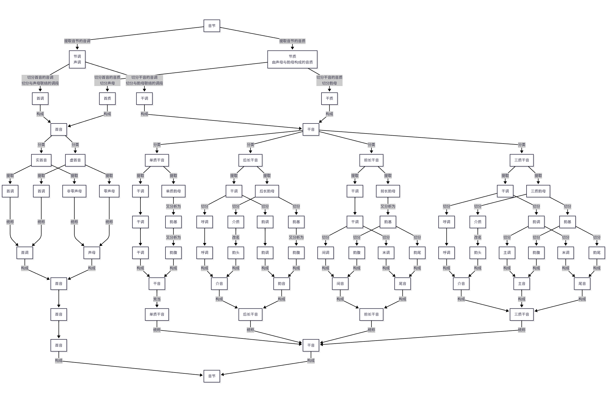
<figcaption>
图 4.1‑1唱音分析的过程
</figcaption>
</figure>

唱音与非声调语言的音素不同。非声调语言有语调无声调。因此，在非声调语言中，音素不可能是由质素和与其相联结的构成声调的调段构成的音段。因此，在非声调语言中，音素的音调是动态的、随语调变化而变化。这就是说，在非声调语言中，音素的音调由语调动态确定。换句话说，在非声调语言中，在脱离语句时，音素是具有确定的音质、未定的音调的音段。然而，在汉语中，唱音在脱离语句的音节中是具有确定的音调的音段。唱音是由质素和与其相联结的调段构成的音段。与质素联结的调段是节调的一段，具有根据节调调值确定的音调。因此，唱音是具有确定的音调的音段。

唱音与充当声母和构成韵母的“音素”不同。在非声调语言中，音素是从音质的角度划分出来的最小音段。具体地说，从发音上分析，根据发音系统不能发出任何不具有具体音高、任何不具有具体音强和任何不具有具体音长的音素把音素的音高、音强和音长分析成默认的音高、默认的音强和默认的音长，音素是具有确定的音质、默认的音高、默认的音强和默认的音长的音段。然而，在现代通用汉语中，在把音节分析成由节调与充当声母和构成韵母的“音素”构成的音节后，充当声母和构成韵母的“浊音”实际上只不过是浊音的音质。在把由节调与充当声母和构成韵母的“音素”构成的音节分析成由唱音构成的音列后，唱音的音质就是充当声母和构成韵母的“音素”。这就是说，充当声母和构成韵母的“音素”只不过是唱音的音质。

综述可知，唱音分析，就是把单干音节分析成由首音和单质干音两个唱音构成的音节，把单间音节分析成由首音、单质间音和尾音三个唱音构成的音节，把单韵音节分析成由首音、介音和单质韵音三个唱音构成的音节，把四质音节分析成由首音、介音、主音和尾音四个唱音构成的音节。

各举一例具体说明把单干音节、单间音节、单韵音节和四质音节分析成由唱音构成的音列的方法，以便具体理解。

例如，在单干音节 kě[kʰɤ²¹⁴](可)中，由于不论声母清浊首调都不是节调的区别特征从而都不必区分音高差异和确定具体音高，因而声母实际上就是首音，因此，把声母改名为首音 k[kʰ]、把干调[214]与单质韵母 e[ɤ]合成单质干音 ě[ɤ²¹⁴]，音节 kě[kʰɤ²¹⁴]变成由首音 k[kʰ]和单质干音 ě[ɤ²¹⁴]构成的音节 kě[kʰɤ²¹⁴]。

例如，在单间音节 h󰉢u[xɤᴜ²¹⁴](吼)中，由于不论声母清浊首调都不是节调的区别特征从而都不必区分音高差异和确定具体音高，因而声母实际上就是首音，因此，把声母改名为首音 h[x]，把韵腹 o[ɤ]与间调[21]合成单质间音[ɤ²¹]，把韵尾 u[ᴜ]与末调[4]合成尾音[ᴜ⁴]，音节 h󰉢u[xɤᴜ²¹⁴]变成由首音[x]、单质间音[ɤ²¹]和尾音[ᴜ⁴]构成的音节 h󰉢u[xɤ²¹ᴜ⁴]。

例如，在单韵音节 hu󰉢[xuo²¹⁴](火)中，由于不论声母清浊首调都不是节调的区别特征从而都不必区分音高差异和确定具体音高，因而声母实际上就是首音，因此，把声母改名为首音 h[x]，把韵头 u[u]与呼调[2]合成介音[u²]，把韵腹[o]与韵调[14]合成单质韵音[o¹⁴]，音节 hu󰉢[xuo²¹⁴]变成由首音[x]、介音[u²]和单质韵音[o¹⁴]构成的音节 hu󰉢[xu²o¹⁴]。

例如，在四质音节 xi󰉖[ɕiɤᴜ²¹⁴](朽)中，由于不论声母清浊首调都不是节调的区别特征从而都不必区分音高差异和确定具体音高，因而声母实际上就是首音，因此，把声母改名为首音 x[ɕ]，把韵头 i[i]与呼调[2]合成介音[i²]，把韵腹 o[ɤ]与主调[1]合成主音[ɤ¹]，把韵尾 u[ᴜ]与末调[4]合成尾音[ᴜ⁴]，音节 xi󰉖[ɕiɤᴜ²¹⁴]变成由首音[ɕ]、介音[i²]、主音[ɤ¹]和尾音[ᴜ⁴]构成的音节 xi󰉖[ɕi²ɤ¹ᴜ⁴]。

在把音节分析成由唱音构成的音列后，各音的特征是：首音由首调与声母构成。首调指与声母联结的调段。介音由呼调与韵头构成。呼调指与韵头联结的调段。主音由主调与三质韵母的韵腹构成。主调指与三质韵母的韵腹联结的调段。尾音由末调与韵尾构成。末调指与韵尾联结的调段。单质间音由间调与充当间质的韵腹构成。间调指与充当间质的韵腹联结的调段。单质韵音由韵调与充当韵质的韵腹构成。韵调指与充当韵质的韵腹联结的调段。单质干音由干调与充当韵母的韵腹构成。干调指与充当韵母的韵腹联结的调段。

在把音节分析成由唱音构成的音列后，各类干音的特征是：单质干音只由一个唱音充当；前长干音由单质间音和尾音构成；后长干音由介音和单质韵音构成；三质干音由介音、主音和尾音构成。在前长干音中，单质间音的音质与尾音的音质不同。在后长干音中，介音的音质与单质韵音的音质不同。在三质干音中，介音、主音和尾音三音的音质不同。

在把音节分析成由唱音构成的音列后，各类干音的节质的特征是：在单干音节中，节质由首音的音质和单质干音的音质构成；在单间音节中，节质由首音的音质、单质间音的音质和尾音的音质构成；在单韵音节中，节质由首音的音质、介音的音质和单质韵音的音质构成；在四质音节中，节质由首音的音质、介音的音质、主音的音质和尾音的音质构成。

在把音节分析成由唱音构成的音列后，各类干音的节调的特征是：在单干音节中，首调指首音的音调，干调指单质干音的音调，节调由首调和干调构成；在单间音节中，首调指首音的音调，间调指单质间音的音调，末调指尾音的音调，节调由首调、间调和末调构成；在单韵音节中，首调指首音的音调，呼调指介音的音调，韵调指单质韵音的音调，节调由首调、呼调和韵调构成；在四质音节中，首调指首音的音调，呼调指介音的音调，主调指主音的音调，末调指尾音的音调，节调由首调、呼调、主调和末调构成。

根据节调质素分析拼音在把音节分析成由唱音构成的音列后就是根据唱音的音值拼音。这种拼音，在单干音节中，就是连发首音和单质干音；在单间音节中，就是连发首音、单质间音和尾音；在单韵音节中，就是连发首音、介音和单质韵音；在四质音节中，就是连发首音、介音、主音和尾音。只要确定了唱音就能拼出音节。

### 唱音的音值

只有确定唱音的音值，才能根据唱音的音值拼音。确定唱音的音值就是确定唱音的音调和音质。唱音是由质素和与其相联结的调段构成的音段。唱音的音质是充当声母的质素和构成韵母的质素。唱音的音调是与质素联结的调段。唱音的音质已经确定，只有唱音的音调尚需确定。确定唱音的音调就是全面而又具体地确定与质素联结的调段的音调。构成音节的唱音就是充当首音的唱音和构成干音的唱音。因此，确定唱音的音值就是确定充当首音的唱音的音值和构成干音的唱音的音值。

#### 充当首音的唱音

在把音节分析成由唱音构成的音列后，首音是由首调与声母构成的音段。首音的音值根据首调的调值和声母的音质确定。首调，是首音的音调的简称，指与声母联结的调段。声母就是首音的音质。因此，首音的音值根据首调和声母确定。

首音根据有无是否构成对立分成实首音和虚首音两类。实首音的有无通常构成对立。虚首音的有无不构成对立。实首音由首调与非零声母构成。实首音的区别特征由实首音的音质决定，也就是说，实首音的区别特征由非零声母决定，换句话说，实首音的区别特征就是非零声母的区别特征。虚首音由首调与零声母构成。虚首音的音调和音质的有无都不构成对立。

首音分成清首音和浊首音两类。在虚首音中，清音只有清声门塞音[ʔ]。清声门塞音[ʔ]和浊软腭擦音[ɣ]可以自由替换，换句话说，清声门塞音[ʔ]和浊软腭擦音[ɣ]是同属一个首音的两个互不对立的并立分布的习惯首音，因此，把浊音[ɣ]和清音[ʔ]归纳为浊首音 ɣ，虚首音都是浊音。因此，在把首音分成清首音和浊首音两类时，一般地说，不必把虚首音划分成清首音和浊首音两类。

##### 首音的音调

清首音的音调与浊首音的音调不同。清首音就是充当首音的清辅音，浊首音就是充当首音的浊辅音。在清首音中，由于清声母的发音特征是声带不振动，与声母联结的调段是零，也就是说，清首音的音调——首调是零。在浊首音中，由于浊声母的发音特征是声带振动，与声母联结的调段非零，也就是说，浊首音的音调——首调非零。具体地说，浊首音的音调就是与浊声母联结的调段，调值随调类不同而不尽相同、具有一定的音调。然而，不论首音清浊，首音的音调都不是首音的区别特征且都与首音的音质相对独立，因此，简单地说，浊首音的音调受干音的音调制约，由干音的音调逆同化动态确定。因此，在音节中，不论首音清浊，通常都不必具体确定首音的首调。

虚首音的音调从形式上分析是零。虚首音因其有无不构成对立而在析音和记音时常被省略。因此，在省略虚首音的情况下，也就是说，在把零声母从形式上分析成零的情况下，无论清浊，虚首音在形式上都被分析成零。因此，虚首音的音调也被从形式上分析成零，根本不必记录。

综述可知，在实首音中，清首音的音调是零；浊首音的音调，由于不是首音的区别特征，不必具体确定调值。虚首音的音调从形式上分析是零。

##### 首音的音质

确定首音的音质，根据首音分成实首音和虚首音两类，就是分别确定实首音的音质和虚首音的音质。

实首音的音质就是非零声母。根据清浊分类，实首音的音质，既有清首音的音质也有浊首音的音质。清首音的音质就是清声母。浊首音的音质就是浊声母。在现代通用汉语中，当首音是实首音时，清实首音的音质共有 17 个：p、pʰ、f、t、tʰ、k、kʰ、x、ʦ、ʦʰ、s、ꭧ、ꭧʰ、ʂ、ʨ、ʨʰ 和 ɕ；浊实首音的音质共有 4 个：m、l、n 和 ɻ。

虚首音的音质就是零声母。根据清浊分类，虚首音的音质，既有清首音的音质也有浊首音的音质。清虚首音的音质只有一个[ʔ]；浊虚首音的音质共有[ɣ]、[j]，[w]和[ɥ]4 个。在把浊音[ɣ]和清音[ʔ]归纳为浊首音 ɣ 的情况下，虚首音的音质只有 4 个：ɣ、j，w 和 ɥ。

##### 首音的音值

在现代通用汉语中，当首音是实首音且是清首音时，根据清音的音调是零和清音的音质是 p、pʰ、f、t、tʰ、k、kʰ、x、ʦ、ʦʰ、s、ꭧ、ꭧʰ、ʂ、ʨ、ʨʰ 和 ɕ，清音就是清音的音质，因此，清实首音就是清音、就是清音的音质。因此，清实首音共有 17 个：p、pʰ、f、t、tʰ、k、kʰ、x、ʦ、ʦʰ、s、ꭧ、ꭧʰ、ʂ、ʨ、ʨʰ 和 ɕ。当首音是实首音且是浊首音时，尽管首调非零，然而根据首调不是首音的区别特征通常不必具体确定，浊实首音就是充当声母的浊辅音。因此，浊实首音共有 4 个：m、l、n 和 ɻ。当首音是虚首音且是浊首音时，尽管首调非零，然而根据首调不是首音的区别特征通常不必具体确定，浊虚首音就是充当零声母的浊辅音 ɣ、j、w 和 ɥ。在虚首音中，清音只有清声门塞音[ʔ]。在把浊音[ɣ]和清音[ʔ]归纳为浊首音 ɣ 的情况下，虚首音都是浊音。

在首音中，清音，就是清音的音质，就是清辅音，就是清声母；浊音调值随调类不同而不尽相同、具有一定的音调。然而，不论首音清浊，首音的音调都不是首音的区别特征且都与首音的音质相对独立，因此，简单地说，浊首音的音调受干音的音调制约，由干音的音调逆同化动态确定。因此，在音节中，不论首音清浊，通常都不必具体确定首音的首调。因此，在首音中，浊音，就是浊辅音，就是浊声母。

根据在首音中清音就是清声母和浊音就是浊声母可知，首音指位处音节首段的除阻辅音。

#### 构成干音的唱音

在把音节分析成由唱音构成的音列后，只要确定了构成干音的唱音的音调和音质，就能确定构成干音的唱音的音值。

##### 干音各音的音调

根据干音分成单质干音、前长干音、后长干音和三质干音四类，干音各音的音调，就是充当单质干音本身、后长干音的介音和单质韵音、前长干音的单质间音和尾音和三质干音的介音、主音和尾音的唱音的音调。充当单质干音的唱音的音调，就是与单质韵母联结的调段，就是干调；充当后长干音的介音的音调和韵音的音调，就是与后长韵母的韵头和韵腹联结的调段，就是呼调和韵调；充当前长干音的间音的音调和尾音的音调，就是与前长韵母的韵腹和韵尾联结的调段，就是间调和末调；充当三质干音的介音的音调、主音的音调和尾音的音调，就是与韵头、与三质韵母的韵腹和与韵尾联结的调段，就是呼调、主调和末调。

###### 三质干音各音的音调

三质干音由介音、主音和尾音构成。介音、主音和尾音三音的音调被简称为呼调、主调和末调，依序指与韵头、与三质韵母的韵腹和与韵尾联结的调段。

呼调、主调和末调的调值用单拍短调来表示。尽管呼调、主调和末调三者时长不尽等长，主调稍长，然而在把节调分成首调、呼调、主调和末调四段后，首调、呼调、主调和末调都只是节调的四个短长不一的分段的一段，因此，把节调时长亦即音节时长看作单位时长(按比例缩放为一个时长单位)，不论是呼调、主调还是末调，和整个节调相比，都是一段短调。这种短调的调值，用短调的中值来表示。这种用短调的中值来表示的短调，就是单拍短调。“拍”是计量调段长度的单位。调段的调长只有一拍的，称为“单拍短调”或“最短短调”。调长计有两拍、三拍或四拍的，分别称为“二拍长调”、“三拍长调”和“四拍长调”。

构成各类节调的调型曲线的呼调、主调和末调图示如图 4.1‑2。

图 4.1‑2 各类节调的呼调、主调和末调

在图
4.1‑2 中，把音节时长取整归 1 并细分为 10 个分段，也就是说，把音节时长按比例缩放为 1 个时长单位并细分为 10 个分段，把这 10 个分段的中点的音高测量数据换算为五度标调法的连续调值，用调型曲线来表示节调的调值，就能绘制各类节调的调型曲线。根据实验数据，一类节调是分布在一条带状区域内的走向大致相同的一族曲线，不是一条唯一的曲线。调型曲线是这条带状区域的中线或主线
(石锋, 《语音格局》, 2008)。调型曲线是调值的代表。

在图
4.1‑2 中，音高轴分成低平[1]、半低[2]、中平[3]、半高[4]和高平[5]五度；时间轴也就是说音节时长或节调时长被细分为 10 个分段。首调、呼调和末调各占 1 个分段，主调约占 3 个分段。首调与呼调间、呼调与主调间、主调与末调间的过渡段各占 1 个分段。干调由呼调、主调和末调构成，因此，干调共占 7 个分段。末调与后一音节的首调间的过渡段约占１个分段。首调不是节调的区别特征，因此，首调不必绘制调线。

在高调阴平中，呼调、主调和末调依序记作[5]、[5]、[5]。阴平是高高平调[55]。在阴平中，呼调、主调和末调都是高平，因此，呼调、主调和末调用单拍短调来表示依序记作[5]、[5]、[5]。事实上阴平有时微升有时微降，但由于呼调、主调和末调各段的起始点、从起始点到讫止点间经过的特征点、讫止点的音高都约为高平[5]，各段音高中值都约为高平[5]，各段及全调升降幅度不超过半度，因此，各段都就近取整为高平[5]。

在升调阳平中，呼调、主调和末调依序记作[3]、[4]、[5]。阳平是中高升调。在阳平中，呼调是上升的短调，起始点约为[2.5]，从起始点到讫止点间经过的特征点为中平[3]，讫止点约为[[3.5]]，中值约为中平[3]，因此，就近取整为中平[3]；主调是上升的短调，起始点约为[3.5]，从起始点到讫止点间经过的特征点为半高[4]，讫止点约为[4.5]，中值约为半高[4]，因此，就近取整为半高[4]；末调是微凸的短调，起始点、从起始点到讫止点间经过的特征点、讫止点的音高都约为高平[5]，中值约为高平[5]，升降幅度不超过半度，因此，就近取整为高平[5]。

在低调上声中，当调值是[211]时，呼调、主调和末调依序记作[2]、[1]、[1]。在分析上声时，选择调值[211]作为常用调型。上声[211]是低降折调。在上声中，呼调是一段低降的短调，起始点约为[2.5]，从起始点到讫止点间经过的特征点为半低[2]，讫止点约为[1.5]，中值约为半低[2]，因此，就近取整为半低[2]；主调是一段缓平的短调，起始点、从起始点到讫止点间经过的特征点、讫止点的音高都约为低平[1]，因此，就近取整为低平[1]；末调是一段微升的短调，起始点、从起始点到讫止点间经过的特征点、讫止点的音高都约为低平[1]，因此，就近取整为低平[1]。当调值是[214]时，由于[214]结束段为急升段，末调是一段急升的短调，起始点约为低平[1]，从起始点到讫止点间经过的特征点约为半低[2]，讫止点约为半高[4]，尽管音高中值不足半高[4]，但仍根据惯例取整为半高[4]。因此，当调值是[214]时，呼调、主调和末调依序记作[2]、[1]、[4]。当调值是[35]时，呼调、主调和末调依序记作[3]、[4]、[5]。

在降调去声中，当调值是[51]时，呼调、主调和末调依序记作[5]、[4]、[1]。去声是先缓后急的高降调。在去声中，呼调是一段微凸的短调，起始点、从起始点到讫止点间经过的特征点、讫止点的音高都约为高平[5]，中值约为高平[5]，升降幅度不超过半度，因此，就近取整为高平[5]；主调是陡降的斜调，起始点约为高平[5]，从起始点到讫止点间经过的特征点为半高[4]，讫止点约为[3.5]，中值约为半高[4]，因此，就近取整为半高[4]；末调是一段微凹的短调，起始点、从起始点到讫止点间经过的特征点、讫止点的音高都约为低平[1]，中值约为低平[1]，因此，就近取整为低平[1]。当调值是[53]时，末调就近取整为中平[3]。

综述可知，在三质干音中，呼调、主调和末调，当节调是高调阴平时是中值为[5]、[5]、[5]的单拍短调；当节调是升调阳平时是中值为[3]、[4]、[5]的单拍短调；当节调是低调上声时是中值为[2]、[1]、[1]的单拍短调；当节调是降调去声时是中值为[5]、[4]、[1]的单拍短调。这就是说，呼调是中值为[5]、[3]或[2]的单拍短调。主调是中值为[5]、[4]或[1]的单拍短调。末调是中值为[5]或[1]的单拍短调。

各类节调的呼调、主调和末调汇总列表见表 4.1‑1。

<table style="width:75%;">
<caption>
表 4.1‑1各类节调的呼调、主调和末调
</caption>
<colgroup>
<col style="width: 11%" />
<col style="width: 19%" />
<col style="width: 6%" />
<col style="width: 6%" />
<col style="width: 6%" />
<col style="width: 6%" />
<col style="width: 19%" />
</colgroup>
<tbody>
<tr>
<td rowspan="2">调类</td>
<td rowspan="2">节调的连续调值</td>
<td colspan="4">节调各段的音调</td>
<td rowspan="2">节调的离散调值</td>
</tr>
<tr>
<td>首调</td>
<td>呼调</td>
<td>主调</td>
<td>末调</td>
</tr>
<tr>
<td>高调阴平</td>
<td>[55]</td>
<td>[0]</td>
<td>[5]</td>
<td>[5]</td>
<td>[5]</td>
<td>[0555]</td>
</tr>
<tr>
<td>升调阳平</td>
<td>[35]</td>
<td>[0]</td>
<td>[3]</td>
<td>[4]</td>
<td>[5]</td>
<td>[0345]</td>
</tr>
<tr>
<td>低调上声</td>
<td>[21]</td>
<td>[0]</td>
<td>[2]</td>
<td>[1]</td>
<td>[1]</td>
<td>[0211]</td>
</tr>
<tr>
<td>降调去声</td>
<td>[51]</td>
<td>[0]</td>
<td>[5]</td>
<td>[4]</td>
<td>[1]</td>
<td>[0541]</td>
</tr>
</tbody>
</table>

综述可知，在四质音节中，根据干调由呼调、主调和末调构成，各类干调的调值分别记成：高调干调[555]、升调干调[345]、低调干调[211]和降调干调[541]；根据节调由首调、呼调、主调和末调构成，各类节调的调值分别记成：阴平[0555]、阳平[0345]、上声[0211]和去声[0541]。

###### 前长干音各音的音调

前长干音由单质间音和尾音构成。在前长干音中，单质间音的音调和尾音的音调，依序被简称为间调和末调，依序指与充当间质的韵腹和与韵尾联结的调段。

前长干音与三质干音在质调关系上不同。在前长干音中，干调由间调和末调构成，间调与充当间质的韵腹相联结，末调与韵尾相联结。在三质干音中，干调由呼调、主调和末调构成；呼调与韵头相联结；主调与韵腹相联结；末调与韵尾相联结。间调与主调相比，有两点不同：一是时长较长，间调的时长与三质干音的干调的由呼调和主调构成的调段的时长相对等长，因此，间调比主调长、长出部分和呼调的时长相对等长。二是调值不同，当调类相同时，间调与三质干音的干调的由呼调和主调构成的调段的调值相同。

构成各类节调的调型曲线的间调和末调图示如图 4.1‑3。

图 4.1‑3 各类节调的间调和末调

在前长干音中，间调，当调类相同时，与三质干音的由呼调和主调构成的调段相同。在高调阴平中，间调是平调，由于间调时长较长，与阴平时长相比，为二拍平调，不能记成短调，因此，记为高平二拍平调[55]。在升调阳平中，间调是上升的斜调，起始点约为[2.5]，讫止点约为[4.5]，增幅约为 1，由于间调时长较长，与阳平时长相比，为二拍斜调，不能记成短调，因此，用斜调近似记成[34]。在低调上声中，间调是先降后平的曲折调，起始点约为[2.5]，讫止点约为低平[1]，降幅约为 1，由于间调时长较长，与上声时长相比，为二拍斜调，不能记成短调，因此，用斜调近似记成[21]。在降调去声中，间调是先平后降的曲折调，起始点约为高平[5]，讫止点约为中平[3]，降幅约为 1，由于间调时长较长，与去声时长相比，为二拍斜调，不能记成短调，因此，用斜调近似记成[54]。因此，各类干调的间调，根据干调的调型顺序高升低降依序记作[55]、[34]、[21]和[54]。

在前长干音中，当调类相同时，末调与三质干音的末调相同，根据干调的调型顺序高升低降依序记作[5]、[5]、[1]和[1]。

在前长干音中，各类节调的间调和末调的调值汇总列表见表 4.1‑2。

<table style="width:73%;">
<caption>
表 4.1‑2各类节调的间调和末调的调值
</caption>
<colgroup>
<col style="width: 12%" />
<col style="width: 19%" />
<col style="width: 7%" />
<col style="width: 7%" />
<col style="width: 7%" />
<col style="width: 19%" />
</colgroup>
<tbody>
<tr>
<td rowspan="2">调类</td>
<td rowspan="2">节调的连续调值</td>
<td colspan="3">节调各段的音调</td>
<td rowspan="2">节调的离散调值</td>
</tr>
<tr>
<td>首调</td>
<td>间调</td>
<td>末调</td>
</tr>
<tr>
<td>高调阴平</td>
<td>[55]</td>
<td>[0]</td>
<td>[55]</td>
<td>[5]</td>
<td>[0555]</td>
</tr>
<tr>
<td>升调阳平</td>
<td>[35]</td>
<td>[0]</td>
<td>[34]</td>
<td>[5]</td>
<td>[0345]</td>
</tr>
<tr>
<td>低调上声</td>
<td>[21]</td>
<td>[0]</td>
<td>[21]</td>
<td>[1]</td>
<td>[0211]</td>
</tr>
<tr>
<td>降调去声</td>
<td>[51]</td>
<td>[0]</td>
<td>[54]</td>
<td>[1]</td>
<td>[0541]</td>
</tr>
</tbody>
</table>

综述可知，在单间音节中，在把各类干调分析成间调和末调两段后，各类干调的调值分别记成：高调干调[555]、升调干调[345]、低调干调[211]和降调干调[541]；在把各类节调分析成首调、间调和末调三段后，各类节调的调值分别记成：阴平[0555]、阳平[0345]、上声[0211]和去声[0541]。

###### 后长干音各音的音调

后长干音由介音和单质韵音构成。在后长干音中，介音的音调和单质韵音的音调，依序被简称为呼调和韵调，依序指与韵头和与充当韵质的韵腹联结的调段。

后长干音与三质干音在质调关系上不同。在后长干音中，在把干调分析成呼调和韵调两段后，呼调与韵头相联结，韵调与充当韵质的韵腹相联结。在三质干音中，干调由呼调、主调和末调构成；呼调与韵头相联结；主调与韵腹相联结；末调与韵尾相联结。韵调与主调相比，有两点不同：一是时长较长，韵调的时长与由主调和末调构成的调段的时长相对等长，因此，韵调比主调长、长出部分和末调的时长相对等长。二是调值不同，当调类相同时，韵调与由主调和末调构成的调段相同。

在后长干音中，当调类相同时，呼调与三质干音的呼调相同，根据干调的调型顺序高升低降依序记作[5]、[3]、[2]和[5]。

在后长干音中，韵调，当调类相同时，与三质干音的由主调和末调构成的调段相同。在高调阴平中，韵调是平调，由于韵调时长较长，与阴平时长相比，为二拍平调，不能记成短调，因此，记为高平二拍平调[55]。在升调阳平中，韵调是上升的斜调，起始点约为[3.5]，讫止点约为高平[5]，增幅约为 1，由于韵调时长较长，与阳平时长相比，为二拍斜调，不能记成短调，因此，用斜调近似记成[45]。在低调上声中，韵调是平调，起始点和讫止点约为低平[1]，由于韵调时长较长，与上声时长相比，为二拍平调，不能记成短调，因此，记为低平二拍平调为[11]。在降调去声中，韵调是陡降的斜调，起始点约为[4.5]，讫止点约为低平[1]，降幅为 3，由于韵调时长较长，与去声时长相比，为二拍斜调，不能记成短调，因此，用斜调近似记成[41]。因此，各类干调的韵调，根据干调的调型顺序高升低降依序记作[55]、[45]、[11]和[41]。

构成各类节调的调型曲线的呼调和韵调图示如图 4.1‑4。

图 4.1‑4 各类节调的呼调和韵调

各类节调的呼调和韵调的调值汇总列表见表 4.1‑3。

<table style="width:69%;">
<caption>
表 4.1‑3各类节调的呼调和韵调的调值
</caption>
<colgroup>
<col style="width: 11%" />
<col style="width: 18%" />
<col style="width: 6%" />
<col style="width: 6%" />
<col style="width: 6%" />
<col style="width: 18%" />
</colgroup>
<tbody>
<tr>
<td rowspan="2">调类</td>
<td rowspan="2">节调的连续调值</td>
<td colspan="3">节调各段的音调</td>
<td rowspan="2">节调的离散调值</td>
</tr>
<tr>
<td>首调</td>
<td>呼调</td>
<td>韵调</td>
</tr>
<tr>
<td>高调阴平</td>
<td>[55]</td>
<td>[0]</td>
<td>[5]</td>
<td>[55]</td>
<td>[0555]</td>
</tr>
<tr>
<td>升调阳平</td>
<td>[35]</td>
<td>[0]</td>
<td>[3]</td>
<td>[45]</td>
<td>[0345]</td>
</tr>
<tr>
<td>低调上声</td>
<td>[21]</td>
<td>[0]</td>
<td>[2]</td>
<td>[11]</td>
<td>[0211]</td>
</tr>
<tr>
<td>降调去声</td>
<td>[51]</td>
<td>[0]</td>
<td>[5]</td>
<td>[41]</td>
<td>[0541]</td>
</tr>
</tbody>
</table>

综述可知，在单韵音节中，在把各类干调分析成呼调和韵调两段后，各类干调的调值分别记成：高调干调[555]、升调干调[345]、低调干调[211]和降调干调[541]；在把各类节调分析成首调、呼调和韵调三段后，各类节调的调值分别记成：阴平[0555]、阳平[0345]、上声[0211]和去声[0541]。

###### 单质干音各音的音调

单质干音只由一个唱音充当。在单质干音中，单质干音的音调，被简称为干调，指与充当单质韵母的韵腹联结的调段。

单质干音与三质干音在质调关系上不同。在单质干音中，由于韵腹充当韵母，与韵腹联结的调段就是与韵母联结的调段就是干调。在三质干音中，干调由呼调、主调和末调构成；呼调与韵头相联结；主调与韵腹相联结；末调与韵尾相联结。干调与主调相比，当调类相同时，有两点不同：一是时长较长，干调的时长与三质干音的干调的由呼调、主调和末调构成的调段的时长相对等长，因此，干调比主调长，长出部分一段与呼调的时长相对等长、另外一段与末调的时长相对等长。二是调值不同，当调类相同时，干调与由三质干音的呼调、主调和末调构成的调段相同。

在单质干音中，干调，当节调是高调阴平时是三拍高调[555]；当节调是升调阳平时是三拍升调[345]；当节调是低调上声时是三拍低调[211]；当节调是降调去声时是三拍降调[541]。单质干音的干调，根据连续调值表示法，各类节调的干调依序记作[55]、[35]、[211]和[51]。这就是说，在单质干音中，根据连续调值表示法，干调和节调相同：都是[55]、[35]、[211]和[51]。为与根据连续调值表示法记录的各类节调的调值区别，同时，为与韵调和间调的调值区别，各类节调的干调，统一用三个离散短调来记录，根据干调的调型顺序高升低降依序记作[555]、[345]、[211]和[541]。

构成各类节调的调型曲线的干调的调值曲线如图 4.1‑5。

图 4.1‑5 各类节调的干调

各类节调的干调的调值汇总列表图示如表 4.1‑4。

<table style="width:68%;">
<caption>
表 4.1‑4各类节调的干调的调值
</caption>
<colgroup>
<col style="width: 11%" />
<col style="width: 18%" />
<col style="width: 9%" />
<col style="width: 9%" />
<col style="width: 18%" />
</colgroup>
<tbody>
<tr>
<td rowspan="2">调类</td>
<td rowspan="2">节调的连续调值</td>
<td colspan="2">节调各段的音调</td>
<td rowspan="2">节调的离散调值</td>
</tr>
<tr>
<td>首调</td>
<td>干调</td>
</tr>
<tr>
<td>高调阴平</td>
<td>[55]</td>
<td>[0]</td>
<td>[555]</td>
<td>[0555]</td>
</tr>
<tr>
<td>升调阳平</td>
<td>[35]</td>
<td>[0]</td>
<td>[345]</td>
<td>[0345]</td>
</tr>
<tr>
<td>低调上声</td>
<td>[21]</td>
<td>[0]</td>
<td>[211]</td>
<td>[0211]</td>
</tr>
<tr>
<td>降调去声</td>
<td>[51]</td>
<td>[0]</td>
<td>[541]</td>
<td>[0541]</td>
</tr>
</tbody>
</table>

综述可知，在单干音节中，在把各类节调分析成首调和干调两段后，各类干调的调值分别记成：高调干调[555]、升调干调[345]、低调干调[211]和降调干调[541]；各类节调的调值分别记成：阴平[0555]、阳平[0345]、上声[0211]和去声[0541]。

综述可知，在根据韵腹的结构地位及其位置特征和时长特征把韵母划分成单质韵母、前长韵母、后长韵母和三质韵母四类，并根据韵母类型把干音划分成单质干音、前长干音、后长干音和三质干音四类，且根据干音类型把音节划分成单干音节、单间音节、单韵音节和四质音节四类后，构成各类音节的各音的音调列表见表
4.1‑5。

<table>
<caption>
表 4.1‑5构成各类音节的各音的音调
</caption>
<colgroup>
<col style="width: 14%" />
<col style="width: 5%" />
<col style="width: 11%" />
<col style="width: 5%" />
<col style="width: 5%" />
<col style="width: 11%" />
<col style="width: 5%" />
<col style="width: 11%" />
<col style="width: 5%" />
<col style="width: 5%" />
<col style="width: 5%" />
<col style="width: 5%" />
<col style="width: 5%" />
</colgroup>
<tbody>
<tr>
<td>音节的类型</td>
<td colspan="2">单干音节</td>
<td colspan="3">单韵音节</td>
<td colspan="3">单间音节</td>
<td colspan="4">四质音节</td>
</tr>
<tr>
<td>首音和干音</td>
<td>首音</td>
<td>单质干音</td>
<td>首音</td>
<td colspan="2">后长干音</td>
<td>首音</td>
<td colspan="2">前长干音</td>
<td>首音</td>
<td colspan="3">三质干音</td>
</tr>
<tr>
<td>唱音的地位</td>
<td>首音</td>
<td>单质干音</td>
<td>首音</td>
<td>介音</td>
<td>单质韵音</td>
<td>首音</td>
<td>单质间音</td>
<td>尾音</td>
<td>首音</td>
<td>介音</td>
<td>主音</td>
<td>尾音</td>
</tr>
<tr>
<td>唱音的音调</td>
<td>首调</td>
<td>干调</td>
<td>首调</td>
<td>呼调</td>
<td>韵调</td>
<td>首调</td>
<td>间调</td>
<td>末调</td>
<td>首调</td>
<td>呼调</td>
<td>主调</td>
<td>末调</td>
</tr>
<tr>
<td>高调阴平</td>
<td>[0]</td>
<td>[555]</td>
<td>[0]</td>
<td>[5]</td>
<td>[55]</td>
<td>[0]</td>
<td>[55]</td>
<td>[5]</td>
<td>[0]</td>
<td>[5]</td>
<td>[5]</td>
<td>[5]</td>
</tr>
<tr>
<td>升调阳平</td>
<td>[0]</td>
<td>[345]</td>
<td>[0]</td>
<td>[3]</td>
<td>[45]</td>
<td>[0]</td>
<td>[34]</td>
<td>[5]</td>
<td>[0]</td>
<td>[3]</td>
<td>[4]</td>
<td>[5]</td>
</tr>
<tr>
<td>低调上声</td>
<td>[0]</td>
<td>[211]</td>
<td>[0]</td>
<td>[2]</td>
<td>[11]</td>
<td>[0]</td>
<td>[21]</td>
<td>[1]</td>
<td>[0]</td>
<td>[2]</td>
<td>[1]</td>
<td>[1]</td>
</tr>
<tr>
<td>降调去声</td>
<td>[0]</td>
<td>[541]</td>
<td>[0]</td>
<td>[5]</td>
<td>[41]</td>
<td>[0]</td>
<td>[54]</td>
<td>[1]</td>
<td>[0]</td>
<td>[5]</td>
<td>[4]</td>
<td>[1]</td>
</tr>
</tbody>
</table>

在该表中，构成各类干音的各音的音调，分为四类：

第一类，单拍短调，包括介音的音调——呼调、主音的音调——主调和尾音的音调——末调，合并调值共有[1]、[2]、[3]、[4]和[5]五个调值。

第二类，二拍间调，指单质间音的音调——间调[55]、[34]、[21]、[54]。

第三类，二拍韵调，指单质韵音的音调——韵调[55]、[45]、[11]、[41]。

第四类，三拍干调，指单质干音的音调——干调[555]、[345]、[211]、[541]。

这些音调，不考虑单质间音的音调[55]和单质韵音的音调[55]对应的时段不同，把两者合并，共有 16 个不同的音调；即使不考虑相对时长差异，把[555]、[55]和[5]合并成为[5]，把[11]和[1]合并成为[1]，也有 13 个不同的音调。

##### 干音各音的音质

构成各类干音的各音的音质，就是单质干音的音质、后长干音的介音的音质和单质韵音的音质、前长干音的单质间音的音质和尾音的音质、三质干音的介音的音质、主音的音质和尾音的音质。单质干音的音质，就是单质韵母。后长干音的介音的音质和单质韵音的音质，就是后长韵母的韵头和韵腹。前长干音的单质间音的音质和尾音的音质，就是前长韵母的韵腹和韵尾。三质干音的介音的音质、主音的音质和尾音的音质，就是三质韵母的韵头、韵腹和韵尾。

单质干音的音质共有[i]、[u]、[ʏ]、[ᴀ]、[o]、[ɤ]、[ᴇ]、[ɿ]、[ʅ]、[ɚ]、[n]和[ŋ]12 个。单质干音由干调与充当韵母的韵腹构成。干调指与充当韵母的韵腹联结的调段。单质干音的音质就是单质韵母。单质韵母共有[i]、[u]、[ʏ]、[ᴀ]、[o]、[ɤ]、[ᴇ]、[ɿ]、[ʅ]、[ɚ]、[n]和[ŋ]12 个。因此，单质干音的音质共有[i]、[u]、[ʏ]、[ᴀ]、[o]、[ɤ]、[ᴇ]、[ɿ]、[ʅ]、[ɚ]、[n]和[ŋ]12 个。

介音的音质共有[i]、[u]、[ʏ]和[y]4 个。介音由呼调与韵头构成。介音的音质就是韵头。韵头有[i]、[u]、[ʏ]和[y]4 个。因此，介音的音质共有[i]、[u]、[ʏ]和[y]4 个。强调说明，在韵母 ʏoŋ(ionɡ([y󰉹ŋ]或[yŋ]))中，韵头是[y]、不是[ʏ]，因此，由韵头和与其联结的调段构成的介音的音质是[y]、不是[ʏ]。在《汉语拼音方案》中，字符组 io 表示出现在韵母 ionɡ[y󰉹ŋ]中的[y]，是韵母 ionɡ([y󰉹ŋ]或[yŋ])的韵头。

单质韵音的音质共有[ᴀ]、[o]和[ᴇ]3 个。单质韵音由韵调与充当韵质的韵腹构成。韵调指与充当韵质的韵腹联结的调段。单质韵音的音质是单质韵质。单质韵质是后长韵母的韵腹。后长韵母的韵腹共有[ᴀ]、[o]和[ᴇ]3 个。因此，单质韵音的音质共有[ᴀ]、[o]和[ᴇ]3 个。

主音的音质共有[a]、[æ]、[ɑ]、[ɤ](包括[󰉹])、[e]和[ə](包括[󰉸])6 个。主音由主调与三质韵母的韵腹构成。主调就是与三质韵母的韵腹联结的调段。主音的音质就是三质韵母的韵腹。三质韵母的韵腹共有[a]、[æ]、[ɑ]、[ɤ](包括[󰉹])、[e]和[ə](包括[󰉸])6 个。因此，主音的音质共有[a]、[æ]、[ɑ]、[ɤ](包括[󰉹])、[e]和[ə](包括[󰉸])6 个。[󰉸]分布在[i󰉸n]和[ʏ󰉸n]中，是弱化的[ə]，受发音机制制约(受到前后两音影响)发生脱落。[󰉹]分布在[i󰉹ŋ]、[u󰉹ŋ]和[y󰉹ŋ]中。在[i󰉹ŋ]中，[󰉹]和基准[ɤ]相比，舌位偏下且偏央，近似弱化的[󰉹]，受发音机制制约(受到前后两音影响)发生脱落。在[u󰉹ŋ]和[y󰉹ŋ]中，[󰉹]和基准[ɤ]相比，舌位偏上且偏前，近似弱化的[󰉹]，受发音机制制约(受到前后两音影响)发生脱落。在记录时，把[󰉸]近似记作[ə]、把[󰉹]近似记作[ɤ]。因此，[ə]和[󰉸]是一个质素，[ɤ]和[󰉹]是一个质素。

尾音的音质共有[ɪ]、[ᴜ]、[n]和[ŋ]4 个。尾音由末调与韵尾构成。末调指与韵尾联结的调段。尾音的音质就是韵尾。韵尾共有[ɪ]、[ᴜ]、[n]和[ŋ]4 个。因此，尾音的音质共有[ɪ]、[ᴜ]、[n]和[ŋ]4 个。

单质间音的音质共有[a]、[æ]、[ɑ]、[ɤ]、[e]和[ə]6 个。单质间音由间调与充当间质的韵腹构成。间调就是与前长韵母的韵腹联结的调段。单质间音的音质就是前长韵母的韵腹。前长韵母的韵腹共有[a]、[æ]、[ɑ]、[ɤ]、[e]和[ə]6 个。因此，单质间音的音质共有[a]、[æ]、[ɑ]、[ɤ]、[e]和[ə]6 个。

构成各类干音的各音的音质的分布汇总列表见表 4.1‑6。

<table style="width:80%;">
<caption>
表 4.1‑6构成各类干音的各音的音质
</caption>
<colgroup>
<col style="width: 13%" />
<col style="width: 11%" />
<col style="width: 11%" />
<col style="width: 11%" />
<col style="width: 11%" />
<col style="width: 11%" />
<col style="width: 11%" />
</colgroup>
<tbody>
<tr>
<td>唱音的地位</td>
<td>介音</td>
<td>单质干音</td>
<td>单质韵音</td>
<td>单质间音</td>
<td>主音</td>
<td>尾音</td>
</tr>
<tr>
<td>所属的干音</td>
<td>
后长干音

三质干音
</td>
<td>单质干音</td>
<td>后长干音</td>
<td>前长干音</td>
<td>三质干音</td>
<td>
前长干音

三质干音
</td>
</tr>
<tr>
<td>唱音的音质</td>
<td>韵头</td>
<td>韵腹</td>
<td>韵腹</td>
<td>韵腹</td>
<td>韵腹</td>
<td>韵尾</td>
</tr>
<tr>
<td>[i]</td>
<td>[i]</td>
<td>[i]</td>
<td></td>
<td></td>
<td></td>
<td></td>
</tr>
<tr>
<td>[u]</td>
<td>[u]</td>
<td>[u]</td>
<td></td>
<td></td>
<td></td>
<td></td>
</tr>
<tr>
<td>[ʏ]</td>
<td>[ʏ]</td>
<td>[ʏ]</td>
<td></td>
<td></td>
<td></td>
<td></td>
</tr>
<tr>
<td>[y]</td>
<td>[y]</td>
<td></td>
<td></td>
<td></td>
<td></td>
<td></td>
</tr>
<tr>
<td>[ᴀ]</td>
<td></td>
<td>[ᴀ]</td>
<td>[ᴀ]</td>
<td></td>
<td></td>
<td></td>
</tr>
<tr>
<td>[a]</td>
<td></td>
<td></td>
<td></td>
<td>[a]</td>
<td>[a]</td>
<td></td>
</tr>
<tr>
<td>[ɑ]</td>
<td></td>
<td></td>
<td></td>
<td>[ɑ]</td>
<td>[ɑ]</td>
<td></td>
</tr>
<tr>
<td>[æ]</td>
<td></td>
<td></td>
<td></td>
<td>[æ]</td>
<td>[æ]</td>
<td></td>
</tr>
<tr>
<td>[o]</td>
<td></td>
<td>[o]</td>
<td>[o]</td>
<td></td>
<td></td>
<td></td>
</tr>
<tr>
<td>[ɤ]</td>
<td></td>
<td>[ɤ]</td>
<td></td>
<td>[ɤ]</td>
<td>[ɤ]</td>
<td></td>
</tr>
<tr>
<td>[ᴇ]</td>
<td></td>
<td>[ᴇ]</td>
<td>[ᴇ]</td>
<td></td>
<td></td>
<td></td>
</tr>
<tr>
<td>[e]</td>
<td></td>
<td></td>
<td></td>
<td>[e]</td>
<td>[e]</td>
<td></td>
</tr>
<tr>
<td>[ə]</td>
<td></td>
<td></td>
<td></td>
<td>[ə]</td>
<td>[ə]</td>
<td></td>
</tr>
<tr>
<td>[ɿ]</td>
<td></td>
<td>[ɿ]</td>
<td></td>
<td></td>
<td></td>
<td></td>
</tr>
<tr>
<td>[ʅ]</td>
<td></td>
<td>[ʅ]</td>
<td></td>
<td></td>
<td></td>
<td></td>
</tr>
<tr>
<td>[ɚ]</td>
<td></td>
<td>[ɚ]</td>
<td></td>
<td></td>
<td></td>
<td></td>
</tr>
<tr>
<td>[ɪ]</td>
<td></td>
<td></td>
<td></td>
<td></td>
<td></td>
<td>[ɪ]</td>
</tr>
<tr>
<td>[ᴜ]</td>
<td></td>
<td></td>
<td></td>
<td></td>
<td></td>
<td>[ᴜ]</td>
</tr>
<tr>
<td>[n]</td>
<td></td>
<td>[n]</td>
<td>[n]</td>
<td></td>
<td></td>
<td>[n]</td>
</tr>
<tr>
<td>[ŋ]</td>
<td></td>
<td>[ŋ]</td>
<td>[ŋ]</td>
<td></td>
<td></td>
<td>[ŋ]</td>
</tr>
</tbody>
</table>

综述可知，不考虑分布位置，通过合并相同的音质，构成各类干音的各音的音质共有 20 个：[i]、[u]、[ʏ]、[y]、[ᴀ]、[a]、[æ]、[ɑ]、[o]、[ɤ]、[ᴇ]、[e]、[ə]、[ɿ]、[ʅ]、[ɚ]、[ɪ]、[ᴜ]、[n]和[ŋ]。

##### 干音各音的音值

在确定了构成各类干音的各音的音调和音质后，把构成各类干音的各音的音调和音质构成唱音，就是构成各类干音的各音的音值。

构成各类干音的各音的音值汇总列表见表 4.1‑7。

<table>
<caption>
表 4.1‑7构成各类干音的各音的音值
</caption>
<colgroup>
<col style="width: 10%" />
<col style="width: 3%" />
<col style="width: 3%" />
<col style="width: 3%" />
<col style="width: 3%" />
<col style="width: 3%" />
<col style="width: 3%" />
<col style="width: 4%" />
<col style="width: 4%" />
<col style="width: 4%" />
<col style="width: 4%" />
<col style="width: 4%" />
<col style="width: 4%" />
<col style="width: 4%" />
<col style="width: 4%" />
<col style="width: 5%" />
<col style="width: 5%" />
<col style="width: 5%" />
<col style="width: 5%" />
<col style="width: 3%" />
<col style="width: 3%" />
</colgroup>
<tbody>
<tr>
<td>
唱音

音质
</td>
<td colspan="3">介音</td>
<td colspan="3">主音</td>
<td colspan="4">单质间音</td>
<td colspan="4">单质韵音</td>
<td colspan="4">单质干音</td>
<td colspan="2">尾音</td>
</tr>
<tr>
<td>[i]</td>
<td>i⁵</td>
<td>i³</td>
<td>i²</td>
<td></td>
<td></td>
<td></td>
<td></td>
<td></td>
<td></td>
<td></td>
<td></td>
<td></td>
<td></td>
<td></td>
<td>i⁵⁵⁵</td>
<td>i³⁴⁵</td>
<td>i²¹¹</td>
<td>i⁵⁴¹</td>
<td></td>
<td></td>
</tr>
<tr>
<td>[u]</td>
<td>u⁵</td>
<td>u³</td>
<td>u²</td>
<td></td>
<td></td>
<td></td>
<td></td>
<td></td>
<td></td>
<td></td>
<td></td>
<td></td>
<td></td>
<td></td>
<td>u⁵⁵⁵</td>
<td>u³⁴⁵</td>
<td>u²¹¹</td>
<td>u⁵⁴¹</td>
<td></td>
<td></td>
</tr>
<tr>
<td>[ʏ]</td>
<td>ʏ⁵</td>
<td>ʏ³</td>
<td>ʏ²</td>
<td></td>
<td></td>
<td></td>
<td></td>
<td></td>
<td></td>
<td></td>
<td></td>
<td></td>
<td></td>
<td></td>
<td>ʏ⁵⁵⁵</td>
<td>ʏ³⁴⁵</td>
<td>ʏ²¹¹</td>
<td>ʏ⁵⁴¹</td>
<td></td>
<td></td>
</tr>
<tr>
<td>[y]</td>
<td>y⁵</td>
<td>y³</td>
<td>y²</td>
<td></td>
<td></td>
<td></td>
<td></td>
<td></td>
<td></td>
<td></td>
<td></td>
<td></td>
<td></td>
<td></td>
<td></td>
<td></td>
<td></td>
<td></td>
<td></td>
<td></td>
</tr>
<tr>
<td>[ɿ]</td>
<td></td>
<td></td>
<td></td>
<td></td>
<td></td>
<td></td>
<td></td>
<td></td>
<td></td>
<td></td>
<td></td>
<td></td>
<td></td>
<td></td>
<td>ɿ⁵⁵⁵</td>
<td>ɿ³⁴⁵</td>
<td>ɿ²¹¹</td>
<td>ɿ⁵⁴¹</td>
<td></td>
<td></td>
</tr>
<tr>
<td>[ʅ]</td>
<td></td>
<td></td>
<td></td>
<td></td>
<td></td>
<td></td>
<td></td>
<td></td>
<td></td>
<td></td>
<td></td>
<td></td>
<td></td>
<td></td>
<td>ʅ⁵⁵⁵</td>
<td>ʅ³⁴⁵</td>
<td>ʅ²¹¹</td>
<td>ʅ⁵⁴¹</td>
<td></td>
<td></td>
</tr>
<tr>
<td>[ɚ]</td>
<td></td>
<td></td>
<td></td>
<td></td>
<td></td>
<td></td>
<td></td>
<td></td>
<td></td>
<td></td>
<td></td>
<td></td>
<td></td>
<td></td>
<td>ɚ⁵⁵⁵</td>
<td>ɚ³⁴⁵</td>
<td>ɚ²¹¹</td>
<td>ɚ⁵⁴¹</td>
<td></td>
<td></td>
</tr>
<tr>
<td>[ᴀ]</td>
<td></td>
<td></td>
<td></td>
<td></td>
<td></td>
<td></td>
<td></td>
<td></td>
<td></td>
<td></td>
<td>ᴀ⁵⁵</td>
<td>ᴀ⁴⁵</td>
<td>ᴀ¹¹</td>
<td>ᴀ⁴¹</td>
<td>ᴀ⁵⁵⁵</td>
<td>ᴀ³⁴⁵</td>
<td>ᴀ²¹¹</td>
<td>ᴀ⁵⁴¹</td>
<td></td>
<td></td>
</tr>
<tr>
<td>[a]</td>
<td></td>
<td></td>
<td></td>
<td>a⁵</td>
<td>a⁴</td>
<td>a¹</td>
<td>a⁵⁵</td>
<td>a³⁴</td>
<td>a²¹</td>
<td>a⁵⁴</td>
<td></td>
<td></td>
<td></td>
<td></td>
<td></td>
<td></td>
<td></td>
<td></td>
<td></td>
<td></td>
</tr>
<tr>
<td>[æ]</td>
<td></td>
<td></td>
<td></td>
<td>æ⁵</td>
<td>æ⁴</td>
<td>æ¹</td>
<td>æ⁵⁵</td>
<td>æ³⁴</td>
<td>æ²¹</td>
<td>æ⁵⁴</td>
<td></td>
<td></td>
<td></td>
<td></td>
<td></td>
<td></td>
<td></td>
<td></td>
<td></td>
<td></td>
</tr>
<tr>
<td>[ɑ]</td>
<td></td>
<td></td>
<td></td>
<td>ɑ⁵</td>
<td>ɑ⁴</td>
<td>ɑ¹</td>
<td>ɑ⁵⁵</td>
<td>ɑ³⁴</td>
<td>ɑ²¹</td>
<td>ɑ⁵⁴</td>
<td></td>
<td></td>
<td></td>
<td></td>
<td></td>
<td></td>
<td></td>
<td></td>
<td></td>
<td></td>
</tr>
<tr>
<td>[o]</td>
<td></td>
<td></td>
<td></td>
<td></td>
<td></td>
<td></td>
<td></td>
<td></td>
<td></td>
<td></td>
<td>o⁵⁵</td>
<td>o⁴⁵</td>
<td>o¹¹</td>
<td>o⁴¹</td>
<td>o⁵⁵⁵</td>
<td>o³⁴⁵</td>
<td>o²¹¹</td>
<td>o⁵⁴¹</td>
<td></td>
<td></td>
</tr>
<tr>
<td>[ɤ]</td>
<td></td>
<td></td>
<td></td>
<td>ɤ⁵</td>
<td>ɤ⁴</td>
<td>ɤ¹</td>
<td>ɤ⁵⁵</td>
<td>ɤ³⁴</td>
<td>ɤ²¹</td>
<td>ɤ⁵⁴</td>
<td></td>
<td></td>
<td></td>
<td></td>
<td>ɤ⁵⁵⁵</td>
<td>ɤ³⁴⁵</td>
<td>ɤ²¹¹</td>
<td>ɤ⁵⁴¹</td>
<td></td>
<td></td>
</tr>
<tr>
<td>[ə]</td>
<td></td>
<td></td>
<td></td>
<td>ə⁵</td>
<td>ə⁴</td>
<td>ə¹</td>
<td>ə⁵⁵</td>
<td>ə³⁴</td>
<td>ə²¹</td>
<td>ə⁵⁴</td>
<td></td>
<td></td>
<td></td>
<td></td>
<td></td>
<td></td>
<td></td>
<td></td>
<td></td>
<td></td>
</tr>
<tr>
<td>[e]</td>
<td></td>
<td></td>
<td></td>
<td>e⁵</td>
<td>e⁴</td>
<td>e¹</td>
<td>e⁵⁵</td>
<td>e³⁴</td>
<td>e²¹</td>
<td>e⁵⁴</td>
<td></td>
<td></td>
<td></td>
<td></td>
<td></td>
<td></td>
<td></td>
<td></td>
<td></td>
<td></td>
</tr>
<tr>
<td>[ᴇ]</td>
<td></td>
<td></td>
<td></td>
<td></td>
<td></td>
<td></td>
<td></td>
<td></td>
<td></td>
<td></td>
<td>ᴇ⁵⁵</td>
<td>ᴇ⁴⁵</td>
<td>ᴇ¹¹</td>
<td>ᴇ⁴¹</td>
<td>ᴇ⁵⁵⁵</td>
<td>ᴇ³⁴⁵</td>
<td>ᴇ²¹¹</td>
<td>ᴇ⁵⁴¹</td>
<td></td>
<td></td>
</tr>
<tr>
<td>[ɪ]</td>
<td></td>
<td></td>
<td></td>
<td></td>
<td></td>
<td></td>
<td></td>
<td></td>
<td></td>
<td></td>
<td></td>
<td></td>
<td></td>
<td></td>
<td></td>
<td></td>
<td></td>
<td></td>
<td>ɪ¹</td>
<td>ɪ¹</td>
</tr>
<tr>
<td>[ᴜ]</td>
<td></td>
<td></td>
<td></td>
<td></td>
<td></td>
<td></td>
<td></td>
<td></td>
<td></td>
<td></td>
<td></td>
<td></td>
<td></td>
<td></td>
<td></td>
<td></td>
<td></td>
<td></td>
<td>ᴜ¹</td>
<td>ᴜ¹</td>
</tr>
<tr>
<td>[n]</td>
<td></td>
<td></td>
<td></td>
<td></td>
<td></td>
<td></td>
<td></td>
<td></td>
<td></td>
<td></td>
<td>n⁵⁵</td>
<td>n⁴⁵</td>
<td>n¹¹</td>
<td>n⁴¹</td>
<td>n⁵⁵⁵</td>
<td>n³⁴⁵</td>
<td>n²¹¹</td>
<td>n⁵⁴¹</td>
<td>n¹</td>
<td>n¹</td>
</tr>
<tr>
<td>[ŋ]</td>
<td></td>
<td></td>
<td></td>
<td></td>
<td></td>
<td></td>
<td></td>
<td></td>
<td></td>
<td></td>
<td>ŋ⁵⁵</td>
<td>ŋ⁴⁵</td>
<td>ŋ¹¹</td>
<td>ŋ⁴¹</td>
<td>ŋ⁵⁵⁵</td>
<td>ŋ³⁴⁵</td>
<td>ŋ²¹¹</td>
<td>ŋ⁵⁴¹</td>
<td>ŋ¹</td>
<td>ŋ¹</td>
</tr>
</tbody>
</table>

介音根据音质分为[i⁵]、[i³]、[i²]，[u⁵]、[u³]、[u²]，[ʏ⁵]、[ʏ³]、[ʏ²]，[y⁵]、[y³]和[y²]四组，共有 12 个。介音由呼调与韵头构成。介音的音质就是韵头。介音的音调，被简称为呼调，指与韵头联结的调段。介音的音质共有[i]、[u]、[ʏ]和[y]4 个。呼调是中值为[5]、[3]或[2]的单拍短调。因此，把由呼调与韵头构成的音段分析成介音，介音共有 12 个。

主音共有[a⁵]、[a⁴]、[a¹]，[æ⁵]、[æ⁴]、[æ¹]，[ɑ⁵]、[ɑ⁴]、[ɑ¹]，[ɤ⁵]、[ɤ⁴]、[ɤ¹]，
[ə⁵]、[ə⁴]、[ə¹]和[e⁵]、[e⁴]、[e¹]18 个。主音由主调与三质韵母的韵腹构成。主调就是与三质韵母的韵腹联结的调段。主音的音质就是三质韵母的韵腹。主音的音质共有[a]、[æ]、[ɑ]、[ɤ]、[e]、[ə]6 个。主调是中值为[5]、[4]或[1]的单拍短调。因此，把由主调与三质韵母的韵腹构成的音段分析成主音，主音共有 18 个。

尾音共有[ɪ⁵]、[ɪ¹]，[ᴜ⁵]、[ᴜ¹]，[n⁵]、[n¹]和[ŋ⁵]、[ŋ¹]8 个。尾音由末调与韵尾构成。末调指与韵尾联结的调段。尾音的音质就是韵尾。韵尾共有[ɪ]、[ᴜ]和[n]、[ŋ]4 个。末调是中值为[5]或[1]的单拍短调。因此，把由末调与韵尾构成的音段分析成尾音，尾音共有 8 个。

单质间音根据音质分为[a⁵⁵]、[a³⁴]、[a²¹]、[a⁵⁴]，[æ⁵⁵]、[æ³⁴]、[æ²¹]、[æ⁵⁴]，
[ɑ⁵⁵]、[ɑ³⁴]、[ɑ²¹]、[ɑ⁵⁴]，[ɤ⁵⁵]、[ɤ³⁴]、[ɤ²¹]、[ɤ⁵⁴]，[ə⁵⁵]、[ə³⁴]、[ə²¹]、[ə⁵⁴]和[e⁵⁵]、[e³⁴]、[e²¹]、[e⁵⁴]六组，共有 24 个。单质间音由间调与充当间质的韵腹构成。间调就是与前长韵母的韵腹联结的调段。单质间音的音质就是前长韵母的韵腹。单质间音的音质共有[a]、[æ]、[ɑ]、[ɤ]、[e]和[ə]6 个。间调共有四个调值[55]、[34]、[21]和[54]。因此，把由间调与充当间质的韵腹构成的音段分析成单质间音，单质间音共有 24 个。

单质韵音共有[ᴀ⁵⁵]、[ᴀ⁴⁵]、[ᴀ¹¹]、[ᴀ⁴¹]，[o⁵⁵]、[o⁴⁵]、[o¹¹]、[o⁴¹]，[ᴇ⁵⁵]、[ᴇ⁴⁵]、[ᴇ¹¹]、[ᴇ⁴¹]，[n⁵⁵]、[n⁴⁵]、[n¹¹]、[n⁴¹]和[ŋ⁵⁵]、[ŋ⁴⁵]、[ŋ¹¹]、[ŋ⁴¹]20 个。单质韵音由韵调与充当韵质的韵腹构成。韵调指与充当韵质的韵腹联结的调段。单质韵音的音质是单质韵质。单质韵质是后长韵母的韵腹。因此，单质韵音的音质共有[ᴀ]、[o]和[ᴇ]3 个。韵调共有[55]、[45]、[11]和[41]四个。因此，把由韵调与充当韵质的韵腹构成的音段分析成单质韵音，单质韵音共有 20 个。

单质干音共有 48 个。单质干音由干调与充当韵母的韵腹构成。干调指与充当韵母的韵腹联结的调段。单质干音的音质就是单质韵母。单质韵母共有[i]、[u]、[ʏ]、[ɿ]、[ʅ]、[ɚ]、[ᴀ]、[o]、[ɤ]、[ᴇ]、[n]和[ŋ]12 个。干调共有四个：高调干调[555]、升调干调[345]、低调干调[211]和降调干调[541]。因此，把由干调与充当韵母的韵腹构成的音段分析成单质干音，单质干音共有 48 个：[i⁵⁵⁵]、[i³⁴⁵]、[i²¹¹]、[i⁵⁴¹]，[u⁵⁵⁵]、[u³⁴⁵]、[u²¹¹]、[u⁵⁴¹]，[ʏ⁵⁵⁵]、[ʏ³⁴⁵]、[ʏ²¹¹]、[ʏ⁵⁴¹]，[ɿ⁵⁵⁵]、[ɿ³⁴⁵]、[ɿ²¹¹]、[ɿ⁵⁴¹]，[ʅ⁵⁵⁵]、[ʅ³⁴⁵]、[ʅ²¹¹]、[ʅ⁵⁴¹]，[ɚ⁵⁵⁵]、[ɚ³⁴⁵]、[ɚ²¹¹]、[ɚ⁵⁴¹]，[ᴀ⁵⁵⁵]、[ᴀ³⁴⁵]、[ᴀ²¹¹]、[ᴀ⁵⁴¹]，[o⁵⁵⁵]、[o³⁴⁵]、[o²¹¹]、[o⁵⁴¹]，[ɤ⁵⁵⁵]、[ɤ³⁴⁵]、[ɤ²¹¹]、[ɤ⁵⁴¹]，[ᴇ⁵⁵⁵]、[ᴇ³⁴⁵]、[ᴇ²¹¹]、[ᴇ⁵⁴¹]和[n⁵⁵⁵]、[n³⁴⁵]、[n²¹¹]、[n⁵⁴¹]和[ŋ⁵⁵⁵]、[ŋ³⁴⁵]、[ŋ²¹¹]、[ŋ⁵⁴¹]。

通过合计可知，在把[󰉹]近似分析成[ɤ]、把[󰉸]近似分析成[ə]的情况下，构成各类干音的唱音共有 130 个。在不计分布在韵母 iᴇn(in[i󰉸n]或[in])和 ʏᴇn(ün[ʏ󰉸n]或[ʏn])中的 n[n]对应的唱音[n⁵⁵]、[n⁴⁵]、[n¹¹]和[n⁴¹]和分布在韵母 ioŋ(inɡ[i󰉹ŋ]或[iŋ])、uoŋ(uenɡ[uɤŋ]或 onɡ[ᴜ󰉹ŋ]或[uŋ])和 ʏoŋ(ionɡ([y󰉹ŋ]或[yŋ]))中的 nɡ[ŋ]对应的唱音[ŋ⁵⁵]、[ŋ⁴⁵]、[ŋ¹¹]、[ŋ⁴¹]的情况下，构成各类干音的唱音共有 122 个。

#### 拼音方案的拼法

在《汉语拼音方案》中，确定表示声母和各类韵母的结构单位的字符对应的唱音，是根据《汉语拼音方案》拼音的前提。表示声母的字符对应的唱音，就是首音、就是声母，音值已经确定。表示各类韵母的结构单位的字符对应的唱音，根据表示各类韵母的结构单位的字符记录的质素和与质素联结的调段的音调确定。

在《汉语拼音方案》中，表示各类韵母的结构单位的字符记录的质素，列表见表
4.1‑8。

<table>
<caption>
表 4.1‑8表示各类韵母的结构单位的字符记录的质素
</caption>
<colgroup>
<col style="width: 17%" />
<col style="width: 23%" />
<col style="width: 2%" />
<col style="width: 2%" />
<col style="width: 3%" />
<col style="width: 2%" />
<col style="width: 2%" />
<col style="width: 2%" />
<col style="width: 2%" />
<col style="width: 2%" />
<col style="width: 2%" />
<col style="width: 2%" />
<col style="width: 2%" />
<col style="width: 2%" />
<col style="width: 1%" />
<col style="width: 1%" />
<col style="width: 2%" />
<col style="width: 1%" />
<col style="width: 2%" />
<col style="width: 2%" />
<col style="width: 2%" />
<col style="width: 3%" />
<col style="width: 3%" />
<col style="width: 2%" />
<col style="width: 4%" />
</colgroup>
<tbody>
<tr>
<td colspan="2">表示各类韵母的结构单位的字符</td>
<td colspan="4">ɑ</td>
<td colspan="3">o</td>
<td colspan="4">e</td>
<td>ê</td>
<td colspan="4">i</td>
<td colspan="2">u</td>
<td>ü</td>
<td>io</td>
<td>er</td>
<td>n</td>
<td>nɡ</td>
</tr>
<tr>
<td colspan="2">各字符记录的质素</td>
<td>ᴀ</td>
<td>a</td>
<td>æ</td>
<td>ɑ</td>
<td>o</td>
<td>ᴜ</td>
<td>ɤ</td>
<td>ɤ</td>
<td>e</td>
<td>ə</td>
<td>ᴇ</td>
<td>ᴇ</td>
<td>i</td>
<td>ɿ</td>
<td>ʅ</td>
<td>ɪ</td>
<td>u</td>
<td>ᴜ</td>
<td>ʏ</td>
<td>y</td>
<td>ɚ</td>
<td>n</td>
<td>ŋ</td>
</tr>
<tr>
<td rowspan="6">字符的作用</td>
<td>有头韵母的韵头</td>
<td></td>
<td></td>
<td></td>
<td></td>
<td></td>
<td>ᴜ</td>
<td></td>
<td></td>
<td></td>
<td></td>
<td></td>
<td></td>
<td>i</td>
<td></td>
<td></td>
<td></td>
<td>u</td>
<td></td>
<td>ʏ</td>
<td>y</td>
<td></td>
<td></td>
<td></td>
</tr>
<tr>
<td>单质韵母的韵腹</td>
<td>ᴀ</td>
<td></td>
<td></td>
<td></td>
<td>o</td>
<td></td>
<td></td>
<td>ɤ</td>
<td></td>
<td></td>
<td></td>
<td>ᴇ</td>
<td>i</td>
<td>ɿ</td>
<td>ʅ</td>
<td></td>
<td>u</td>
<td></td>
<td>ʏ</td>
<td></td>
<td>ɚ</td>
<td>n</td>
<td>ŋ</td>
</tr>
<tr>
<td>后长韵母的韵腹</td>
<td>ᴀ</td>
<td></td>
<td></td>
<td></td>
<td>o</td>
<td></td>
<td></td>
<td></td>
<td></td>
<td></td>
<td>ᴇ</td>
<td></td>
<td></td>
<td></td>
<td></td>
<td></td>
<td></td>
<td></td>
<td></td>
<td></td>
<td></td>
<td></td>
<td></td>
</tr>
<tr>
<td>前长韵母的韵腹</td>
<td></td>
<td>a</td>
<td>æ</td>
<td>ɑ</td>
<td></td>
<td></td>
<td>ɤ</td>
<td>ɤ</td>
<td>e</td>
<td>ə</td>
<td></td>
<td></td>
<td></td>
<td></td>
<td></td>
<td></td>
<td></td>
<td></td>
<td></td>
<td></td>
<td></td>
<td></td>
<td></td>
</tr>
<tr>
<td>三质韵母的韵腹</td>
<td></td>
<td>a</td>
<td>æ</td>
<td>ɑ</td>
<td></td>
<td></td>
<td>ɤ</td>
<td>ɤ</td>
<td>e</td>
<td>ə</td>
<td></td>
<td></td>
<td></td>
<td></td>
<td></td>
<td></td>
<td></td>
<td></td>
<td></td>
<td></td>
<td></td>
<td></td>
<td></td>
</tr>
<tr>
<td>有尾韵母的韵尾</td>
<td></td>
<td></td>
<td></td>
<td></td>
<td></td>
<td>ᴜ</td>
<td></td>
<td></td>
<td></td>
<td></td>
<td></td>
<td></td>
<td></td>
<td></td>
<td></td>
<td>ɪ</td>
<td></td>
<td>ᴜ</td>
<td></td>
<td></td>
<td></td>
<td>n</td>
<td>ŋ</td>
</tr>
</tbody>
</table>

在《汉语拼音方案》中，表示各类韵母的结构单位的字符记录的质素，根据字符说明，分别就是：

字符 ɑ 表示单质干音的音质[ᴀ]、单质韵音的音质[ᴀ]、单质间音的音质[a]、[æ]、[ɑ]和主音的音质[a]、[æ]、[ɑ]。在《汉语拼音方案》中，单质韵母 ɑ[ᴀ]和后长韵母 iɑ[iᴀ]、uɑ[uᴀ]的韵腹[ᴀ]，前长韵母 ɑn[an]和三质韵母 uɑn[uan]的韵腹[a]，前长韵母 ɑi[æɪ]和三质韵母 uɑi[uæɪ]、iɑn[iæn]、üɑn[ʏæn]的韵腹[æ]，前长韵母 ɑnɡ[ɑŋ]和三质韵母 iɑnɡ[iɑŋ]、uɑnɡ[uɑŋ]的韵腹[ɑ]，记为 ɑ。因此，字符 ɑ 表示单质干音的音质[ᴀ]、单质韵音的音质[ᴀ]、单质间音的音质[a]、[æ]、[ɑ]和主音的音质[a]、[æ]、[ɑ]。

字符 o 表示单质干音的音质[o]、单质韵音的音质[o]、单质间音的音质[ɤ]、主音的音质[ɤ]、介音的音质[u]和尾音的音质[ᴜ]。在《汉语拼音方案》中，单质韵母 o[o]、后长韵母 uo[uo]的韵腹[o]，前长韵母 ou[ɤᴜ]和三质韵母 iou[iɤᴜ]的韵腹[ɤ]，三质韵母 onɡ[ᴜɤŋ]的韵头 o[ᴜ]，前长韵母 ɑo[ɑᴜ]和三质韵母 iɑo[iɑᴜ]的韵尾[ᴜ]，记为 o。因此，字符 o 表示单质干音的音质[o]、单质韵音的音质[o]、单质间音的音质[ɤ]、主音的音质[ɤ]、介音的音质[u]和尾音的音质[ᴜ]。

字符 e 表示单质干音的音质[ɤ]、单质韵音的音质[ᴇ]、单质间音的音质[ɤ]、[e]、[ə]和主音的音质[ɤ]、[e]、[ə]。在《汉语拼音方案》中，单质韵母 e[ɤ]，前长韵母 enɡ[ɤŋ]和三质韵母 uenɡ[uɤŋ]的韵腹[ɤ]，前长韵母 ei[eɪ]和三质韵母 uᴇi[ueɪ]的韵腹[e]，前长韵母 en[ən]和三质韵母 uen[uən]的韵腹[ə]，后长韵母 ie[iᴇ]和 üe[ʏᴇ]的韵腹[ᴇ]，记为 e。因此，字符 e 表示单质干音的音质[ɤ]、单质韵音的音质[ᴇ]、单质间音的音质[ɤ]、[e]、[ə]和主音的音质[ɤ]、[e]、[ə]。

字符 ê 表示单质干音的音质[ᴇ]。在《汉语拼音方案》中，单质韵母[ᴇ]记为 ê。因此，字符 ê 表示单质干音的音质[ᴇ]。

字符 i 表示单质干音的音质[i]和-i([ɿ]或[ʅ])、介音的音质[i]和尾音的音质[ɪ]。在《汉语拼音方案》中，单质韵母 i[i]、i[ɿ]和 i[ʅ]，后长韵母 iɑ[iᴀ]、ie[iᴇ]和三质韵母
iɑo[iɑᴜ]、iou[iɤᴜ]、iɑn[iæn]、in[i󰉸n]、iɑnɡ[iɑŋ]、inɡ[i󰉹ŋ]的韵头[i]，前长韵母 ɑi[æɪ]、ei[eɪ]和三质韵母 uɑi[uæɪ]、uei[ueɪ]的韵尾[ɪ]，记为 i。因此，字符 i 表示单质干音的音质 i[i]、i[ɿ]、i[ʅ]，介音的音质[i]和尾音的音质[ɪ]。

字符 u 表示单质干音的音质[u]、介音的音质[u]和尾音的音质[ᴜ]。在《汉语拼音方案》中，单质韵母 u[u]，后长韵母 uɑ[uᴀ]、uo[uo]和三质韵母 uɑi[uæɪ]、uei[ueɪ]、
uɑn[uæn]、uᴇn[uən]、uɑnɡ[uɑŋ]、uenɡ[uɤŋ]的韵头[u]，前长韵母 ou[ɤᴜ]和三质韵母 iou[iɤᴜ]的韵尾[ᴜ]，记为 u。因此，字符 u 表示单质干音的音质[u]、介音的音质[u]和尾音的音质[ᴜ]。强调说明，字符 u 表示的音质，不含把字符 ü 的上方两点省略记为 u 的情况。《汉语拼音方案》规定：ü 行的韵母，前面没有声母的时候，写成：yu(迂)，yue(约)，yuɑn(冤)，yun(晕)，ü 上两点省略(也就是说用 u 来代替 ü)。ü 行的韵母跟声母 j，q，x 拼的时候，写成：ju(居)，qu(区)，xu(虚)，ü 上两点也省略。

字符 ü 表示单质干音的音质[ʏ]和介音的音质[ʏ]。在《汉语拼音方案》中，单质韵母 ü[ʏ]，后长韵母 üe[ʏᴇ]和三质韵母 üɑn[ʏæn]、ün[ʏ󰉸n]的韵头[ʏ]，记为 ü。因此，字符 ü 表示单质干音的音质[ʏ]和介音的音质[ʏ]。

字符 io 表示[y]。在《汉语拼音方案》中，根据实际音质分析，字符组 io 在韵母 ionɡ([y󰉹ŋ]或[yŋ])中实际表示[y]、而不是表示[ʏ]。

字符 er 表示单质干音的音质[ɚ]。在《汉语拼音方案》中，单质韵母[ɚ]记为 er。因此，字符 er 表示单质干音的音质[ɚ]。

字符 n 表示单质干音的音质[n]和尾音的音质[n]。当不根据《现代汉语词典》收录韵母[n]时，在《汉语拼音方案》中，n[n]只充当韵尾；当根据《现代汉语词典》收录韵母[n]时，n[n]也充当单质韵母。因此，当根据《现代汉语词典》收录韵母[n]时，字符 n 表示单质干音的音质[n]和尾音的音质[n]。这还不含当字符 n 分布在韵母 in[in]和 ün[ʏn]中时表示的音质。

字符 nɡ 表示单质干音的音质[ŋ]和尾音的音质[ŋ]。当不根据《现代汉语词典》收录韵母[ŋ]时，在《汉语拼音方案》中，nɡ[ŋ]只充当韵尾；当根据《现代汉语词典》收录韵母[ŋ]时，nɡ[ŋ]也充当单质韵母。因此，当根据《现代汉语词典》收录韵母[ŋ]时，字符 nɡ 表示单质干音的音质[ŋ]和尾音的音质[ŋ]。这还不含当字符 nɡ 分布在韵母 inɡ[iŋ]、ionɡ[yŋ]和 onɡ[uŋ]中时表示的音质。

综述说明，在《汉语拼音方案》中，把记录韵头的字符和与韵头联结的调段构成唱音，把记录韵尾的字符和与韵尾联结的调段构成唱音，把记录各类韵母的韵腹的字符分别和与本类韵母的韵腹联结的调段构成唱音，表示各类韵母的结构单位的字符对应的唱音，列表见表
4.1‑9。

<table>
<caption>
表 4.1‑9表示各类韵母的结构单位的字符对应的唱音
</caption>
<colgroup>
<col style="width: 4%" />
<col style="width: 4%" />
<col style="width: 4%" />
<col style="width: 3%" />
<col style="width: 4%" />
<col style="width: 3%" />
<col style="width: 4%" />
<col style="width: 3%" />
<col style="width: 3%" />
<col style="width: 4%" />
<col style="width: 3%" />
<col style="width: 3%" />
<col style="width: 3%" />
<col style="width: 4%" />
<col style="width: 3%" />
<col style="width: 3%" />
<col style="width: 4%" />
<col style="width: 3%" />
<col style="width: 4%" />
<col style="width: 3%" />
<col style="width: 4%" />
<col style="width: 3%" />
<col style="width: 4%" />
<col style="width: 4%" />
<col style="width: 4%" />
</colgroup>
<tbody>
<tr>
<td rowspan="3">字符功用</td>
<td rowspan="3">调段调值</td>
<td colspan="23">表示各类韵母的结构单位的字符对应的唱音</td>
</tr>
<tr>
<td colspan="4">ɑ</td>
<td colspan="3">o</td>
<td colspan="4">e</td>
<td>ê</td>
<td colspan="4">i</td>
<td colspan="2">u</td>
<td>ü</td>
<td>io</td>
<td>er</td>
<td>n</td>
<td>nɡ</td>
</tr>
<tr>
<td>[ᴀ]</td>
<td>[a]</td>
<td>[æ]</td>
<td>[ɑ]</td>
<td>[o]</td>
<td>[ᴜ]</td>
<td>[ɤ]</td>
<td>[ɤ]</td>
<td>[e]</td>
<td>[ə]</td>
<td>[ᴇ]</td>
<td>[ᴇ]</td>
<td>[i]</td>
<td>[ɿ]</td>
<td>[ʅ]</td>
<td>[ɪ]</td>
<td>[u]</td>
<td>[ᴜ]</td>
<td>[ʏ]</td>
<td>[y]</td>
<td>[ɚ]</td>
<td>[n]</td>
<td>[ŋ]</td>
</tr>
<tr>
<td rowspan="3">
韵

头
</td>
<td>5</td>
<td></td>
<td></td>
<td></td>
<td></td>
<td></td>
<td>ᴜ⁵</td>
<td></td>
<td></td>
<td></td>
<td></td>
<td></td>
<td></td>
<td>i⁵</td>
<td></td>
<td></td>
<td></td>
<td>u⁵</td>
<td></td>
<td>ʏ⁵</td>
<td>y⁵</td>
<td></td>
<td></td>
<td></td>
</tr>
<tr>
<td>3</td>
<td></td>
<td></td>
<td></td>
<td></td>
<td></td>
<td>ᴜ³</td>
<td></td>
<td></td>
<td></td>
<td></td>
<td></td>
<td></td>
<td>i³</td>
<td></td>
<td></td>
<td></td>
<td>u³</td>
<td></td>
<td>ʏ³</td>
<td>y³</td>
<td></td>
<td></td>
<td></td>
</tr>
<tr>
<td>2</td>
<td></td>
<td></td>
<td></td>
<td></td>
<td></td>
<td>ᴜ²</td>
<td></td>
<td></td>
<td></td>
<td></td>
<td></td>
<td></td>
<td>i²</td>
<td></td>
<td></td>
<td></td>
<td>u²</td>
<td></td>
<td>ʏ²</td>
<td>y²</td>
<td></td>
<td></td>
<td></td>
</tr>
<tr>
<td rowspan="15">
韵

腹
</td>
<td>5</td>
<td></td>
<td>a⁵</td>
<td>æ⁵</td>
<td>ɑ⁵</td>
<td></td>
<td></td>
<td>ɤ⁵</td>
<td>ɤ⁵</td>
<td>e⁵</td>
<td>ə⁵</td>
<td></td>
<td></td>
<td></td>
<td></td>
<td></td>
<td></td>
<td></td>
<td></td>
<td></td>
<td></td>
<td></td>
<td></td>
<td></td>
</tr>
<tr>
<td>4</td>
<td></td>
<td>a⁴</td>
<td>æ⁴</td>
<td>ɑ⁴</td>
<td></td>
<td></td>
<td>ɤ⁴</td>
<td>ɤ⁴</td>
<td>e⁴</td>
<td>ə⁴</td>
<td></td>
<td></td>
<td></td>
<td></td>
<td></td>
<td></td>
<td></td>
<td></td>
<td></td>
<td></td>
<td></td>
<td></td>
<td></td>
</tr>
<tr>
<td>1</td>
<td></td>
<td>a¹</td>
<td>æ¹</td>
<td>ɑ¹</td>
<td></td>
<td></td>
<td>ɤ¹</td>
<td>ɤ¹</td>
<td>e¹</td>
<td>ə¹</td>
<td></td>
<td></td>
<td></td>
<td></td>
<td></td>
<td></td>
<td></td>
<td></td>
<td></td>
<td></td>
<td></td>
<td></td>
<td></td>
</tr>
<tr>
<td>55</td>
<td></td>
<td>a⁵⁵</td>
<td>æ⁵⁵</td>
<td>ɑ⁵⁵</td>
<td></td>
<td></td>
<td>ɤ⁵⁵</td>
<td>ɤ⁵⁵</td>
<td>e⁵⁵</td>
<td>ə⁵⁵</td>
<td></td>
<td></td>
<td></td>
<td></td>
<td></td>
<td></td>
<td></td>
<td></td>
<td></td>
<td></td>
<td></td>
<td></td>
<td></td>
</tr>
<tr>
<td>34</td>
<td></td>
<td>a³⁴</td>
<td>æ³⁴</td>
<td>ɑ³⁴</td>
<td></td>
<td></td>
<td>ɤ³⁴</td>
<td>ɤ³⁴</td>
<td>e³⁴</td>
<td>ə³⁴</td>
<td></td>
<td></td>
<td></td>
<td></td>
<td></td>
<td></td>
<td></td>
<td></td>
<td></td>
<td></td>
<td></td>
<td></td>
<td></td>
</tr>
<tr>
<td>21</td>
<td></td>
<td>a²¹</td>
<td>æ²¹</td>
<td>ɑ²¹</td>
<td></td>
<td></td>
<td>ɤ²¹</td>
<td>ɤ²¹</td>
<td>e²¹</td>
<td>ə²¹</td>
<td></td>
<td></td>
<td></td>
<td></td>
<td></td>
<td></td>
<td></td>
<td></td>
<td></td>
<td></td>
<td></td>
<td></td>
<td></td>
</tr>
<tr>
<td>54</td>
<td></td>
<td>a⁵⁴</td>
<td>æ⁵⁴</td>
<td>ɑ⁵⁴</td>
<td></td>
<td></td>
<td>ɤ⁵⁴</td>
<td>ɤ⁵⁴</td>
<td>e⁵⁴</td>
<td>ə⁵⁴</td>
<td></td>
<td></td>
<td></td>
<td></td>
<td></td>
<td></td>
<td></td>
<td></td>
<td></td>
<td></td>
<td></td>
<td></td>
<td></td>
</tr>
<tr>
<td>55</td>
<td>ᴀ⁵⁵</td>
<td></td>
<td></td>
<td></td>
<td>o⁵⁵</td>
<td></td>
<td></td>
<td></td>
<td></td>
<td></td>
<td>ᴇ⁵⁵</td>
<td></td>
<td></td>
<td></td>
<td></td>
<td></td>
<td></td>
<td></td>
<td></td>
<td></td>
<td></td>
<td></td>
<td></td>
</tr>
<tr>
<td>45</td>
<td>ᴀ⁴⁵</td>
<td></td>
<td></td>
<td></td>
<td>o⁴⁵</td>
<td></td>
<td></td>
<td></td>
<td></td>
<td></td>
<td>ᴇ⁴⁵</td>
<td></td>
<td></td>
<td></td>
<td></td>
<td></td>
<td></td>
<td></td>
<td></td>
<td></td>
<td></td>
<td></td>
<td></td>
</tr>
<tr>
<td>11</td>
<td>ᴀ¹¹</td>
<td></td>
<td></td>
<td></td>
<td>o¹¹</td>
<td></td>
<td></td>
<td></td>
<td></td>
<td></td>
<td>ᴇ¹¹</td>
<td></td>
<td></td>
<td></td>
<td></td>
<td></td>
<td></td>
<td></td>
<td></td>
<td></td>
<td></td>
<td></td>
<td></td>
</tr>
<tr>
<td>41</td>
<td>ᴀ⁴¹</td>
<td></td>
<td></td>
<td></td>
<td>o⁴¹</td>
<td></td>
<td></td>
<td></td>
<td></td>
<td></td>
<td>ᴇ⁴¹</td>
<td></td>
<td></td>
<td></td>
<td></td>
<td></td>
<td></td>
<td></td>
<td></td>
<td></td>
<td></td>
<td></td>
<td></td>
</tr>
<tr>
<td>555</td>
<td>ᴀ⁵⁵⁵</td>
<td></td>
<td></td>
<td></td>
<td>o⁵⁵⁵</td>
<td></td>
<td></td>
<td>ɤ⁵⁵⁵</td>
<td></td>
<td></td>
<td></td>
<td>ᴇ⁵⁵⁵</td>
<td>i⁵⁵⁵</td>
<td>ɿ⁵⁵⁵</td>
<td>ʅ⁵⁵⁵</td>
<td></td>
<td>u⁵⁵⁵</td>
<td></td>
<td>ʏ⁵⁵⁵</td>
<td></td>
<td>ɚ⁵⁵⁵</td>
<td>n⁵⁵⁵</td>
<td>ŋ⁵⁵⁵</td>
</tr>
<tr>
<td>345</td>
<td>ᴀ³⁴⁵</td>
<td></td>
<td></td>
<td></td>
<td>o³⁴⁵</td>
<td></td>
<td></td>
<td>ɤ³⁴⁵</td>
<td></td>
<td></td>
<td></td>
<td>ᴇ³⁴⁵</td>
<td>i³⁴⁵</td>
<td>ɿ³⁴⁵</td>
<td>ʅ³⁴⁵</td>
<td></td>
<td>u³⁴⁵</td>
<td></td>
<td>ʏ³⁴⁵</td>
<td></td>
<td>ɚ³⁴⁵</td>
<td>n³⁴⁵</td>
<td>ŋ³⁴⁵</td>
</tr>
<tr>
<td>211</td>
<td>ᴀ²¹¹</td>
<td></td>
<td></td>
<td></td>
<td>o²¹¹</td>
<td></td>
<td></td>
<td>ɤ²¹¹</td>
<td></td>
<td></td>
<td></td>
<td>ᴇ²¹¹</td>
<td>i²¹¹</td>
<td>ɿ²¹¹</td>
<td>ʅ²¹¹</td>
<td></td>
<td>u²¹¹</td>
<td></td>
<td>ʏ²¹¹</td>
<td></td>
<td>ɚ²¹¹</td>
<td>n²¹¹</td>
<td>ŋ²¹¹</td>
</tr>
<tr>
<td>541</td>
<td>ᴀ⁵⁴¹</td>
<td></td>
<td></td>
<td></td>
<td>o⁵⁴¹</td>
<td></td>
<td></td>
<td>ɤ⁵⁴¹</td>
<td></td>
<td></td>
<td></td>
<td>ᴇ⁵⁴¹</td>
<td>i⁵⁴¹</td>
<td>ɿ⁵⁴¹</td>
<td>ʅ⁵⁴¹</td>
<td></td>
<td>u⁵⁴¹</td>
<td></td>
<td>ʏ⁵⁴¹</td>
<td></td>
<td>ɚ⁵⁴¹</td>
<td>n⁵⁴¹</td>
<td>ŋ⁵⁴¹</td>
</tr>
<tr>
<td rowspan="2">
韵

尾
</td>
<td>5</td>
<td></td>
<td></td>
<td></td>
<td></td>
<td></td>
<td>ᴜ⁵</td>
<td></td>
<td></td>
<td></td>
<td></td>
<td></td>
<td></td>
<td></td>
<td></td>
<td></td>
<td>ɪ⁵</td>
<td></td>
<td>ᴜ⁵</td>
<td></td>
<td></td>
<td></td>
<td>n⁵</td>
<td>ŋ⁵</td>
</tr>
<tr>
<td>1</td>
<td></td>
<td></td>
<td></td>
<td></td>
<td></td>
<td>ᴜ¹</td>
<td></td>
<td></td>
<td></td>
<td></td>
<td></td>
<td></td>
<td></td>
<td></td>
<td></td>
<td>ɪ¹</td>
<td></td>
<td>ᴜ¹</td>
<td></td>
<td></td>
<td></td>
<td>n¹</td>
<td>ŋ¹</td>
</tr>
</tbody>
</table>

在《汉语拼音方案》中，表示各类韵母的结构单位的字符对应的唱音，根据字符说明，分别就是：

字符 ɑ 对应的唱音分为[a⁵]、[a⁴]、[a¹]，[æ⁵]、[æ⁴]、[æ¹]，[ɑ⁵]、[ɑ⁴]、[ɑ¹]，[a⁵⁵]、[a³⁴]、[a²¹]、[a⁵⁴]，[æ⁵⁵]、[æ³⁴]、[æ²¹]、[æ⁵⁴]，[ɑ⁵⁵]、[ɑ³⁴]、[ɑ²¹]、[ɑ⁵⁴]，[ᴀ⁵⁵]、[ᴀ⁴⁵]、[ᴀ¹¹]、[ᴀ⁴¹]和[ᴀ⁵⁵⁵]、[ᴀ³⁴⁵]、[ᴀ²¹¹]、[ᴀ⁵⁴¹]8 组；共有 29 个。字符 ɑ 表示单质干音的音质[ᴀ]、单质韵音的音质[ᴀ]、单质间音的音质[a]、[æ]、[ɑ]和主音的音质[a]、[æ]、[ɑ]。当字符 ɑ 表示单质干音的音质[ᴀ]时，干调和[ᴀ]构成干音。干调共有四个：高调干调[555]、升调干调[345]、低调干调[211]和降调干调[541]。因此，字符 ɑ 对应的干音，音值是[ᴀ⁵⁵⁵]、[ᴀ³⁴⁵]、[ᴀ²¹¹]、[ᴀ⁵⁴¹]。当字符 ɑ 表示单质韵音的音质[ᴀ]时，韵调和[ᴀ]构成韵音。韵调共有[55]、[45]、[11]和[41]四个。因此，字符 ɑ 对应的韵音，音值是[ᴀ⁵⁵]、[ᴀ⁴⁵]、[ᴀ¹¹]、[ᴀ⁴¹]。当字符 ɑ 表示单质间音的音质[a]、[æ]、[ɑ]时，间调分别和[a]、[æ]和[ɑ]构成单质间音。间调共有四个调值[55]、[34]、[21]和[54]。因此，字符 ɑ 对应的单质间音，音值是[a⁵⁵]、[a³⁴]、[a²¹]、[a⁵⁴]，[æ⁵⁵]、[æ³⁴]、[æ²¹]、[æ⁵⁴]和[ɑ⁵⁵]、
[ɑ³⁴]、[ɑ²¹]、[ɑ⁵⁴]。当字符 ɑ 表示主音的音质[a]、[æ]、[ɑ]时，主调分别和[a]、[æ]和[ɑ]构成主音。主调是中值为[5]、[4]或[1]的单拍短调。因此，字符 ɑ 对应的主音，音值是[a⁵]、[a⁴]、[a¹]，[æ⁵]、[æ⁴]、[æ¹]和[ɑ⁵]、[ɑ⁴]、[ɑ¹]。通过合计可知，字符 ɑ 对应的唱音共有 29 个。

字符 o 对应的唱音分为[o⁵⁵⁵]、[o³⁴⁵]、[o²¹¹]、[o⁵⁴¹]，[o⁵⁵]、[o⁴⁵]、[o¹¹]、[o⁴¹]，[ɤ⁵]、[ɤ⁴]、[ɤ¹]，[ɤ⁵⁵]、[ɤ³⁴]、[ɤ²¹]、[ɤ⁵⁴]，[ᴜ⁵]、[ᴜ³]、[ᴜ²]和[ᴜ⁵]、[ᴜ¹]6 组。字符 o 表示单质干音的音质[o]、单质韵音的音质[o]、单质间音的音质[ɤ]、主音的音质[ɤ]、介音的音质[u]和尾音的音质[ᴜ]。当字符 o 表示单质干音的音质[o]时，[o]和干调构成干音。干调共有四个：高调干调[555]、升调干调[345]、低调干调[211]和降调干调[541]。因此，字符 o 对应的干音，音值是[o⁵⁵⁵]、[o³⁴⁵]、[o²¹¹]和[o⁵⁴¹]。当字符 o 表示单质韵音的音质[o]时，[o]和韵调构成单质韵音。韵调共有[55]、[45]、[11]和[41]四个。因此，字符 o 对应的单质韵音，音值是[o⁵⁵]、[o⁴⁵]、[o¹¹]和[o⁴¹]。当字符 o 表示单质间音的音质[ɤ]时，[ɤ]和间调构成单质间音。间调共有四个调值[55]、[34]、[21]和[54]。因此，字符 o 对应的单质间音，音值是[ɤ⁵⁵]、[ɤ³⁴]、[ɤ²¹]、[ɤ⁵⁴]。当字符 o 表示主音的音质[ɤ]时，[ɤ]与主调构成主音。主调是中值为[5]、[4]或[1]的单拍短调。因此，字符 o 对应的主音，音值是[ɤ⁵]、[ɤ⁴]、[ɤ¹]。当字符 o 在三质韵母 onɡ[ᴜɤŋ]中表示介音的音质[u](韵头[ᴜ])时，[ᴜ]与呼调构成介音。呼调是中值为[5]、[3]或[2]的单拍短调。因此，字符 o 对应的介音，音值是[ᴜ⁵]、[ᴜ³]和[ᴜ²]。当字符 o 表示尾音的音质[ᴜ]时，[ᴜ]与末调构成尾音。末调是中值为[5]或[1]的单拍短调。因此，字符 o 对应的尾音，音值是[ᴜ⁵]和[ᴜ¹]。通过合计可知，字符 o 对应的唱音共有 20 个。把介音[ᴜ⁵]和尾音[ᴜ⁵]合并，只有 19 个。

字符 e 对应的唱音分为[ɤ⁵]、[ɤ⁴]、[ɤ¹]，[e⁵]、[e⁴]、[e¹]，[ə⁵]、[ə⁴]、[ə¹]，[ɤ⁵⁵]、[ɤ³⁴]、[ɤ²¹]、[ɤ⁵⁴]，[e⁵⁵]、[e³⁴]、[e²¹]、[e⁵⁴]，[ə⁵⁵]、[ə³⁴]、[ə²¹]、[ə⁵⁴]，[ɤ⁵⁵⁵]、[ɤ³⁴⁵]、[ɤ²¹¹]、[ɤ⁵⁴¹]和[ᴇ⁵⁵]、[ᴇ⁴⁵]、[ᴇ¹¹]、[ᴇ⁴¹]8 组；共有 29 个。字符 e 表示单质干音的音质[ɤ]、单质韵音的音质[ᴇ]、单质间音的音质[ɤ]、[e]、[ə]和主音的音质[ɤ]、[e]、[ə]。当字符 e 表示单质干音的音质[ɤ]时，[ɤ]和干调构成干音。干调共有四个：高调干调[555]、升调干调[345]、低调干调[211]和降调干调[541]。因此，字符 e 对应的干音，音值是[ɤ⁵⁵⁵]、[ɤ³⁴⁵]、[ɤ²¹¹]和[ɤ⁵⁴¹]。当字符 e 表示单质韵音的音质[ᴇ]时，[ᴇ]和韵调构成韵音。韵调共有[55]、[45]、[11]和[41]四个。因此，字符 e 对应的韵音，音值是[ᴇ⁵⁵]、[ᴇ⁴⁵]、[ᴇ¹¹]和[ᴇ⁴¹]。当字符 e 表示单质间音的音质[ɤ]、[e]和[ə]时，[ɤ]、[e]和[ə]分别和间调构成单质间音。间调共有四个调值[55]、[34]、[21]和[54]。因此，字符 e 对应的单质间音，音值是[ɤ⁵⁵]、[ɤ³⁴]、[ɤ²¹]、[ɤ⁵⁴]；[e⁵⁵]、[e³⁴]、[e²¹]、[e⁵⁴]和[ə⁵⁵]、[ə³⁴]、[ə²¹]、[ə⁵⁴]。当字符 e 表示主音的音质[ɤ]、[e]和[ə]时，[ɤ]、[e]和[ə]与主调构成主音。主调是中值为[5]、[4]或[1]的单拍短调。因此，字符 e 对应的主音，音值是[ɤ⁵]、[ɤ⁴]、[ɤ¹]，[e⁵]、[e⁴]、[e¹]和[ə⁵]、[ə⁴]、[ə¹]。通过合计可知，字符 e 对应的唱音共有 29 个。

字符 ê 对应的唱音分为[ᴇ⁵⁵⁵]、[ᴇ³⁴⁵]、[ᴇ²¹¹]和[ᴇ⁵⁴¹]一组，只有 4 个。字符 ê 表示单质干音的音质[ᴇ]，[ᴇ]和干调构成干音。干调共有四个：高调干调[555]、升调干调[345]、低调干调[211]和降调干调[541]。因此，字符 ê 对应的干音，音值是[ᴇ⁵⁵⁵]、[ᴇ³⁴⁵]、[ᴇ²¹¹]和[ᴇ⁵⁴¹]。

字符 i 对应的唱音分为[i⁵]、[i³]、[i²]，[ɪ⁵]、[ɪ¹]，[i⁵⁵⁵]、[i³⁴⁵]、[i²¹¹]、[i⁵⁴¹]，[ɿ⁵⁵⁵]、
[ɿ³⁴⁵]、[ɿ²¹¹]、[ɿ⁵⁴¹]和[ʅ⁵⁵⁵]、[ʅ³⁴⁵]、[ʅ²¹¹]、[ʅ⁵⁴¹]5 组；共有 17 个。字符 i 既表示单质干音的音质[i]、i[ɿ]和[ʅ]，也表示介音的音质[i]和尾音的音质[ɪ]。当字符 i 表示单质干音的音质[i]、i[ɿ]和[ʅ]时，[i]、[ɿ]和[ʅ]分别和干调构成干音。干调共有四个：高调干调[555]、升调干调[345]、低调干调[211]和降调干调[541]。因此，字符 i 对应的干音，音值是[i⁵⁵⁵]、[i³⁴⁵]、[i²¹¹]、[i⁵⁴¹]，[ɿ⁵⁵⁵]、[ɿ³⁴⁵]、[ɿ²¹¹]、[ɿ⁵⁴¹]和[ʅ⁵⁵⁵]、[ʅ³⁴⁵]、[ʅ²¹¹]、[ʅ⁵⁴¹]。当字符 i 表示介音的音质[i]时，[i]与呼调构成介音。呼调是中值为[5]、[3]或[2]的单拍短调。因此，字符 i 对应的介音，音值是[i⁵]、[i³]和[i²]。当字符 i 表示尾音的音质[ɪ]时，[ɪ]与末调构成尾音。末调是中值为[5]或[1]的单拍短调。因此，字符 i 对应的尾音，音值是[ɪ⁵]和[ɪ¹]。通过合计可知，字符 i 对应的唱音共有 17 个。

字符 u 对应的唱音分为[u⁵]、[u³]、[u²]，[ᴜ⁵]、[ᴜ¹]和[u⁵⁵⁵]、[u³⁴⁵]、[u²¹¹]、[u⁵⁴¹]3 组；共有 9 个。字符 u 表示单质干音的音质[u]、介音的音质[u]和尾音的音质[ᴜ]。当字符 u 表示单质干音的音质[u]时，[u]和干调构成干音。干调共有四个：高调干调[555]、升调干调[345]、低调干调[211]和降调干调[541]。因此，字符 u 对应的干音，音值是[u⁵⁵⁵]、[u³⁴⁵]、[u²¹¹]和[u⁵⁴¹]。当字符 u 表示介音的音质[u]时，[u]与呼调构成介音。呼调是中值为[5]、[3]或[2]的单拍短调。因此，字符 u 对应的介音，音值是[u⁵]、[u³]和[u²]。当字符 u 表示尾音的音质[ᴜ]时，[ᴜ]与末调构成尾音。末调是中值为[5]或[1]的单拍短调。因此，字符 u 对应的尾音，音值是[ᴜ⁵]和[ᴜ¹]。

字符 ü 对应的唱音分为[ʏ⁵]、[ʏ³]、[ʏ²]和[ʏ⁵⁵⁵]、[ʏ³⁴⁵]、[ʏ²¹¹]、[ʏ⁵⁴¹]两组；共有 7 个。字符 ü 表示单质干音的音质[ʏ]和介音的音质[ʏ]。当字符 ü 表示单质干音的音质[ʏ]时，[ʏ]和干调构成干音。干调共有四个：高调干调[555]、升调干调[345]、低调干调[211]和降调干调[541]。因此，字符 ü 对应的干音，音值是[ʏ⁵⁵⁵]、[ʏ³⁴⁵]、[ʏ²¹¹]和[ʏ⁵⁴¹]。当字符 ü 表示介音的音质[ʏ]时，[ʏ]与呼调构成介音。呼调是中值为[5]、[3]或[2]的单拍短调。因此，字符 ü 对应的介音，音值是[ʏ⁵]、[ʏ³]和[ʏ²]。

字符 io 对应的唱音分为[y⁵]、[y³]和[y²]一组，只有 3 个。在《汉语拼音方案》中，当字符组 io 分布在韵母 ionɡ[yŋ]中时，io 表示介音的音质[y]。因此，当 io 表示介音的音质[y]时，[y]与呼调构成介音。呼调是中值为[5]、[3]或[2]的单拍短调。因此，io 对应的介音，音值是[y⁵]、[y³]和[y²]。

字符 er 对应的唱音分为[ɚ⁵⁵⁵]、[ɚ³⁴⁵]、[ɚ²¹¹]和[ɚ⁵⁴¹]一组，只有 4 个。在《汉语拼音方案》中，字符 er 表示单质干音的音质[ɚ]，[ɚ]和干调构成干音。干调共有四个：高调干调[555]、升调干调[345]、低调干调[211]和降调干调[541]。因此，字符 er 对应的干音，音值是[ɚ⁵⁵⁵]，[ɚ³⁴⁵]，[ɚ²¹¹]，[ɚ⁵⁴¹]。

字符 n 对应的唱音分为[n⁵]、[n¹]和[n⁵⁵⁵]、[n³⁴⁵]、[n²¹¹]、[n⁵⁴¹]两组；共有 6 个。字符 n 表示单质干音的音质[n]和尾音的音质[n]。当字符 n 表示单质干音的音质[n]时，[n]和干调构成干音。干调共有四个：高调干调[555]、升调干调[345]、低调干调[211]和降调干调[541]。因此，字符 n 对应的干音，音值是[n⁵⁵⁵]、[n³⁴⁵]、[n²¹¹]和[n⁵⁴¹]。当字符 n 表示尾音的音质[n]时，[n]与末调构成尾音。末调是中值为[5]或[1]的单拍短调。因此，字符 n 对应的尾音，音值是[n⁵]和[n¹]。强调说明，在确定《汉语拼音方案》的字符 n 对应的唱音时，没有考虑字符 n[n]分布在韵母 in[in]和 ün[ʏn]中时对应的唱音[n⁵⁵]、[n⁴⁵]、[n¹¹]和[n⁴¹]。

字符 nɡ 对应的唱音分为[ŋ⁵]、[ŋ¹]和[ŋ⁵⁵⁵]、[ŋ³⁴⁵]、[ŋ²¹¹]、[ŋ⁵⁴¹]两组；共有 6 个。字符 nɡ 表示单质干音的音质[ŋ]和尾音的音质[ŋ]。当字符 nɡ 表示单质干音的音质[ŋ]时，[ŋ]和干调构成干音。干调共有四个：高调干调[555]、升调干调[345]、低调干调[211]和降调干调[541]。因此，字符 nɡ 对应的干音，音值是[ŋ⁵⁵⁵]、[ŋ³⁴⁵]、[ŋ²¹¹]和[ŋ⁵⁴¹]。当字符 nɡ 表示尾音的音质[ŋ]时，[ŋ]与末调构成尾音。末调是中值为[5]或[1]的单拍短调。因此，字符 nɡ 对应的尾音，音值是[ŋ⁵]和[ŋ¹]。强调说明，在确定《汉语拼音方案》的字符 nɡ 对应的唱音时，没有考虑字符 nɡ[ŋ]分布在韵母 inɡ[iŋ]、onɡ[uŋ]和 ionɡ[yŋ]中时对应的唱音[ŋ⁵⁵]、[ŋ⁴⁵]、[ŋ¹¹]、[ŋ⁴¹]。

通过合计可知，在《汉语拼音方案》中，在不计字符 n[n]分布在韵母 in[in]和
ün[ʏn]中时对应的唱音[n⁵⁵]、[n⁴⁵]、[n¹¹]和[n⁴¹]和不计字符 nɡ[ŋ]分布在韵母 inɡ[iŋ]、onɡ[uŋ]和 ionɡ[yŋ]中时对应的唱音[ŋ⁵⁵]、[ŋ⁴⁵]、[ŋ¹¹]、[ŋ⁴¹]的情况下，把字符 o 分布在韵母 onɡ[uŋ]中时对应的介音[ᴜ⁵]、[ᴜ³]和[ᴜ²]与字符 u 对应的介音[u⁵]、[u³]和[u²]合并称为一组[u⁵]、[u³]和[u²]，把字符 o 分布在韵母 ɑo[ɑᴜ]和 iɑo[iɑᴜ]中时对应的尾音[ᴜ⁵]和[ᴜ¹]与字符 u 对应的尾音[ᴜ⁵]和[ᴜ¹]合并称为一组[ᴜ⁵]和[ᴜ¹]，表示各类韵母的结构单位的字符对应的唱音共有 122 个。在计[n⁵⁵]、[n⁴⁵]、[n¹¹]和[n⁴¹]和[ŋ⁵⁵]、[ŋ⁴⁵]、[ŋ¹¹]、[ŋ⁴¹]时，共有 130 个。

### 唱音拼音法

根据节调质素分析拼音在把音节分析成由唱音构成的音列后就是根据唱音的音值拼音。这种拼音，在单干音节中，就是连发首音和单质干音；在单间音节中，就是连发首音、单质间音和尾音；在单韵音节中，就是连发首音、介音和单质韵音；在四质音节中，就是连发首音、介音、主音和尾音。只要确定了唱音就能拼出音节。

根据唱音的音值拼音，在单干音节中，就是连发首音和单质干音。在单干音节中，首音由首调和声母构成，事实上就是声母；单质干音由干调与充当单质韵母的韵腹构成，就是音调为与韵母联结的调段音质为单质韵母的干音。例如，在把干调[55]、[35]、[211]和[51]分别和韵母[ɤ]构成单质干音[ɤ⁵⁵]、[ɤ³⁵]、[ɤ²¹¹]和[ɤ⁵¹]后，音节[kʰɤ⁵⁵]、[kʰɤ³⁵]、[kʰɤ²¹¹]和[kʰɤ⁵¹]由充当首音的唱音[kʰ]分别和充当单质干音的唱音[ɤ⁵⁵]、[ɤ³⁵]、[ɤ²¹¹]和[ɤ⁵¹]构成。因此，拼音就是把首音[kʰ]分别和音调为高调阴平、升调阳平、低调上声和降调去声的唱音[ɤ⁵⁵]、[ɤ³⁵]、[ɤ²¹¹]和[ɤ⁵¹]相拼。

根据唱音的音值拼音，在单间音节中，就是连发首音、单质间音和尾音。在单间音节中，首音由首调和声母构成，事实上就是声母；单质间音由间调与充当间质的韵腹构成；尾音由末调与韵尾构成。这类音节的唱音拼音法，根据节调不同，分为四种情况：

在单间音节中，当节调是高调阴平时，阴平是高高平调[55]。在高调阴平中，节调的任何一段都是高平[5]。因此，阴平[55]用三段中值相同的短调来表示就是[555]。因此，根据质调关系的内容可以确定单质间音的音调为[55]，尾音的音调为[5]。因此，当韵母是前长韵母时，把阴平[555]和韵母构成音调为阴平[555]的干音，就是把间调[55]和韵腹构成音调为间调[55]的单质间音、把末调[5]和韵尾构成音调为末调[5]的尾音，把两者构成音调为阴平、音质为前长韵母的干音。例如，当韵母是前长韵母[ɤᴜ]时，把阴平[555]和韵母构成音调为阴平[555]的干音[ɤᴜ⁵⁵]，就是把构成韵母的两个质素[ɤ]和[ᴜ]依序与间调[55]和末调[5]构成唱音[ɤ⁵⁵]和[ᴜ⁵]，把干音[ɤᴜ⁵⁵]分析成由两个唱音构成的唱音序列[ɤ⁵⁵ᴜ⁵]，把[ɤ⁵⁵]和[ᴜ⁵]构成音调为阴平[555]的干音[ɤᴜ⁵⁵⁵]。因此，当韵母是前长韵母、节调是阴平时，拼音就是把首音、音调为[55]的单质间音和音调为[5]的尾音连拼。例如，当音节为[lɤᴜ⁵⁵]时，拼音就是把[l]、[ɤ⁵⁵]和[ᴜ⁵]连拼。

在单间音节中，当节调是升调阳平时，阳平是中高升调[35]。阳平由中平[3]连续上升到高平[5]中间必然经过半高[4]。因此，阳平[35]用三段中值不同的短调来表示就是[345]。因此，根据质调关系的内容可以确定单质间音的音调为[34]，尾音的音调为[5]。因此，当韵母是前长韵母时，把阳平[345]和韵母构成音调为阳平[345]的干音，就是把间调[34]和韵腹构成音调为间调[34]的单质间音、把末调[5]和韵尾构成音调为末调[5]的尾音，把两者构成音调为阳平、音质为前长韵母的干音。例如，当韵母是前长韵母[ɤᴜ]时，把阳平[345]和韵母构成音调为阳平[345]的干音[ɤᴜ³⁵]，就是把构成韵母的两个质素[ɤ]和[ᴜ]依序与间调[34]和末调[5]构成[ɤ³⁴]和[ᴜ⁵]，把干音[ɤᴜ³⁵]分析成由两个唱音构成的唱音序列[ɤ³⁴ᴜ⁵]，把[ɤ³⁴]和[ᴜ⁵]构成音调为[345]的干音[ɤᴜ³⁴⁵]。因此，当韵母是前长韵母、节调是阳平时，拼音就是把首音、音调为[34]的单质间音和音调为[5]的尾音连拼。例如，当音节为[lɤᴜ³⁵]时，拼音就是把[l]、[ɤ³⁴]和[ᴜ⁵]连拼。

在单间音节中，当节调是低调上声时，上声是低降折调[211]。上声在语流中共有三种调值[211]、[214]和[35]。在分析上声时，选择调值[211]作为常用调型。因此，根据质调关系的内容可以确定单质间音的音调为[21]，尾音的音调为[1]。因此，当韵母是前长韵母时，把上声[211]和韵母构成音调为上声[211]的干音，就是把间调[21]和韵腹构成音调为间调[21]的单质间音、把末调[1]和韵尾构成音调为末调[1]的尾音，把两者构成音调为上声、音质为前长韵母的干音。例如，当韵母是前长韵母[ɤᴜ]时，把上声[211]和韵母构成音调为上声[211]的干音[ɤᴜ²¹¹]，就是把构成韵母的两个质素[ɤ]和[ᴜ]依序与间调[21]和末调[1]构成[ɤ²¹]和[ᴜ¹]，把干音[ɤᴜ²¹¹]分析成由两个唱音构成的唱音序列[ɤ²¹ᴜ¹]，把[ɤ²¹]和[ᴜ¹]构成音调为[211]的干音[ɤᴜ²¹¹]。因此，当韵母是前长韵母、节调是上声时，拼音就是把首音、音调为[21]的单质间音和音调为[1]的尾音连拼。例如，当音节为[lɤᴜ²¹¹]时，拼音就是把[l]、[ɤ²¹]和[ᴜ¹]连拼。

在单间音节中，当节调是降调去声时，去声是先缓后急的高降调[51]。去声在语流中共有两种调值[51]和[53]。在分析去声时，选择调值[51]为常用调型。根据调值的连续性，同时考虑去声在语流中的条件调值[53]，可以确定，去声由高平[5]连续下降到低平[1]中间必然经过半高[4]。因此，去声[51]用三段中值不同的短调来表示就是[541]。因此，根据质调关系的内容可以确定单质间音的音调为[54]，尾音的音调为[1]。因此，当韵母是前长韵母时，把去声[541]和韵母构成音调为去声[541]的干音，就是把间调[54]和韵腹构成音调为间调[54]的单质间音、把末调[1]和韵尾构成音调为末调[1]的尾音，把两者构成音调为去声、音质为前长韵母的干音。例如，当韵母是前长韵母[ɤᴜ]时，把去声[541]和韵母构成音调为去声[541]的干音[ɤᴜ⁵⁴¹]，就是把构成韵母的两个质素[ɤ]和[ᴜ]依序与间调[54]和末调[1]构成[ɤ⁵⁴]和[ᴜ¹]，把干音[ɤᴜ⁵⁴¹]分析成由两个唱音构成的唱音序列[ɤ⁵⁴ᴜ¹]，把[ɤ⁵⁴]和[ᴜ¹]构成音调为[541]的干音[ɤᴜ⁵⁴¹]。因此，当韵母是前长韵母、节调是去声时，拼音就是把首音、音调为[54]的单质间音和音调为[1]的尾音连拼。例如，当音节为[lɤᴜ⁵⁴¹]时，拼音就是把[l]、[ɤ⁵⁴]和[ᴜ¹]连拼。

根据唱音的音值拼音，在单韵音节中，就是连发首音、介音和单质韵音。在单韵音节中，首音由首调和声母构成，事实上就是声母；介音由呼调与韵头构成；单质韵音由韵调和单质韵质构成。这类音节的唱音拼音法，根据节调不同，分为四种情况：

在单韵音节中，当节调是高调阴平时，阴平是高高平调[55]。在高调阴平中，节调的任何一段都是高平[5]。因此，阴平[55]用三段中值相同的短调来表示就是[555]。因此，根据质调关系的内容可以确定介音的音调为[5]，单质韵音的音调为[55]。因此，当韵母是后长韵母时，把阴平[555]和韵母构成音调为阴平[555]的干音，就是把呼调[5]和韵头构成音调为呼调[5]的介音、把韵调[55]和韵腹构成音调为韵调[55]的单质韵音，把两者构成音调为阴平、音质为后长韵母的干音。例如，当韵母是后长韵母[uo]时，把阴平[555]和韵母构成音调为阴平[555]的干音[uo⁵⁵]，就是把构成韵母的两个质素[u]和[o]依序与呼调[5]和韵调[55]构成唱音[u⁵]和[o⁵⁵]，把干音[uo⁵⁵]分析成由两个唱音构成的唱音序列[u⁵o⁵⁵]，把[u⁵]和[o⁵⁵]构成音调为阴平[555]的干音[uo⁵⁵⁵]。因此，当韵母是后长韵母、节调是阴平时，拼音就是把首音、音调为[5]的介音和音调为[55]的单质韵音连拼。例如，当音节为[luo⁵⁵]时，拼音就是把[l]、[u⁵]和[o⁵⁵]连拼。

在单韵音节中，当节调是升调阳平时，阳平是中高升调[35]。阳平由中平[3]连续上升到高平[5]中间必然经过半高[4]。因此，阳平[35]用三段中值不同的短调来表示就是[345]。因此，根据质调关系的内容可以确定介音的音调为[3]，单质韵音的音调为[45]。因此，当韵母是后长韵母时，把阳平[345]和韵母构成音调为阳平[345]的干音，就是把呼调[3]和韵头构成音调为呼调[3]的介音、把韵调[45]和韵腹构成音调为韵调[45]的单质韵音，把两者构成音调为阳平、音质为后长韵母的干音。例如，当韵母是后长韵母[uo]时，把阳平[345]和韵母构成音调为阳平[345]的干音[uo³⁵]，就是把构成韵母的两个质素[u]和[o]依序与呼调[3]和韵调[45]构成唱音[u³]和[o⁴⁵]，把干音[uo³⁵]分析成由两个唱音构成的唱音序列[u³o⁴⁵]，把[u³]和[o⁴⁵]构成音调为[345]的干音[uo³⁴⁵]。因此，当韵母是后长韵母、节调是阳平时，拼音就是把首音、音调为[3]的介音和音调为[45]的单质韵音连拼。例如，当音节为[luo³⁵]时，拼音就是把[l]、[u³]和[o⁴⁵]连拼。

在单韵音节中，当节调是低调上声时，上声是低降折调[211]。上声在语流中共有三种调值[211]、[214]和[35]。在分析上声时，选择调值[211]作为常用调型。因此，根据质调关系的内容可以确定介音的音调为[2]，单质韵音的音调为[11]。因此，当韵母是后长韵母时，把上声[211]和韵母构成音调为上声[211]的干音，就是把呼调[2]和韵头构成音调为呼调[2]的介音、把韵调[11]和韵腹构成音调为韵调[11]的单质韵音，把两者构成音调为上声、音质为后长韵母的干音。例如，当韵母是后长韵母[uo]时，把上声[211]和韵母构成音调为上声[211]的干音[uo¹¹]，就是把构成韵母的两个质素[u]和[o]依序与呼调[2]和韵调[11]构成唱音[u²]和[o¹¹]，把干音[uo²¹]分析成由两个唱音构成的唱音序列[u²o¹¹]，把[u²]和[o¹¹]构成音调为[211]的干音[uo²¹¹]。因此，当韵母是后长韵母、节调是上声时，拼音就是把首音、音调为[2]的介音和音调为[11]的单质韵音连拼。例如，当音节为[luo¹¹]时，拼音就是把[l]、[u²]和[o¹¹]连拼。

在单韵音节中，当节调是降调去声时，去声是先缓后急的高降调[51]。去声在语流中共有两种调值[51]和[53]。在分析去声时，选择调值[51]为常用调型。根据调值的连续性，同时考虑去声在语流中的条件调值[53]，可以确定，去声由高平[5]连续下降到低平[1]中间必然经过半高[4]。因此，去声[51]用三段中值不同的短调来表示就是[541]。因此，根据质调关系的内容可以确定介音的音调为[5]，单质韵音的音调为[41]。因此，当韵母是后长韵母时，把去声[541]和韵母构成音调为去声[541]的干音，就是把呼调[5]和韵头构成音调为呼调[5]的介音、把韵调[41]和韵腹构成音调为韵调[41]的单质韵音，把两者构成音调为去声、音质为后长韵母的干音。例如，当韵母是后长韵母[uo]时，把去声[541]和韵母构成音调为去声[541]的干音[uo⁴¹]，就是把构成韵母的两个质素[u]和[o]依序与呼调[5]和韵调[41]构成唱音[u⁵]和[o⁴¹]，把干音[uo⁵¹]分析成由两个唱音构成的唱音序列[u⁵o⁴¹]，把[u⁵]和[o⁴¹]构成音调为[541]的干音[uo⁵⁴¹]。因此，当韵母是后长韵母、节调是去声时，拼音就是把首音、音调为[5]的介音和音调为[41]的单质韵音连拼。例如，当音节为[luo⁴¹]时，拼音就是把[l]、[u⁵]和[o⁴¹]连拼。

根据唱音的音值拼音，在四质音节中，就是连发首音、介音、主音和尾音。在四质音节中，首音由首调和声母构成，事实上就是声母；介音由呼调与韵头构成；主音由韵腹和主调构成；尾音由末调与韵尾构成。这类音节的唱音拼音法，根据节调不同，分为四种情况：

在四质音节中，当节调是高调阴平时，阴平是高高平调[55]。在高调阴平中，节调的任何一段都是高平[5]。因此，阴平[55]用三段中值相同的短调来表示就是[555]。因此，根据质调关系的内容可以确定介音的音调为[5]，主音的音调为[5]，尾音的音调为[5]。因此，当韵母是三质韵母时，把阴平[555]和韵母构成音调为阴平[555]的干音，就是把呼调[5]和韵头构成音调为呼调[5]的介音、把主调[5]和韵腹构成音调为主调[5]的主音，把末调[5]和韵尾构成音调为末调[5]的尾音，把三者构成音调为阴平、音质为三质韵母的干音。例如，当韵母是三质韵母[iɤᴜ]时，把阴平[555]和韵母构成音调为阴平[555]的干音[iɤᴜ⁵⁵]，就是把构成韵母的三个质素[i]、[ɤ]和[ᴜ]依序与呼调[5]、主调[5]和末调[5]构成唱音[i⁵]、[ɤ⁵]和[ᴜ⁵]，把干音[iɤᴜ⁵⁵]分析成由三个唱音构成的唱音序列[i⁵ɤ⁵ᴜ⁵]，把[i⁵]、[ɤ⁵]和[ᴜ⁵]构成音调为阴平[555]的干音[iɤᴜ⁵⁵⁵]。因此，当韵母是三质韵母、节调是阴平时，拼音就是把首音、音调为[5]的介音和音调为[5]的主音和音调为[5]的尾音连拼。例如，当音节为[liɤᴜ⁵⁵]时，拼音就是把[l]、[i⁵]、[ɤ⁵]和[ᴜ⁵]连拼。

在四质音节中，当节调是升调阳平时，阳平是中高升调[35]。阳平由中平[3]连续上升到高平[5]中间必然经过半高[4]。因此，阳平[35]用三段中值不同的短调来表示就是[345]。因此，根据质调关系的内容可以确定介音的音调为[3]，主音的音调为[4]，尾音的音调为[5]。因此，当韵母是三质韵母时，把阳平[345]和韵母构成音调为阳平[345]的干音，就是把呼调[3]和韵头构成音调为呼调[3]的介音、把主调[4]和韵腹构成音调为主调[4]的主音，把末调[5]和韵尾构成音调为末调[5]的尾音，把三者构成音调为阳平、音质为三质韵母的干音。例如，当韵母是三质韵母[iɤᴜ]时，把阳平[345]和韵母构成音调为阳平[345]的干音[iɤᴜ³⁵]，就是把构成韵母的三个质素[i]、[ɤ]和[ᴜ]依序与呼调[3]、主调[4]和呼调[5]构成唱音[i³]、[ɤ⁴]和[ᴜ⁵]，把干音[iɤᴜ³⁵]分析成由三个唱音构成的唱音序列[i²ɤ⁴ᴜ⁵]，把[i³]、[ɤ⁴]和[ᴜ⁵]构成音调为[345]的干音[iɤᴜ³⁴⁵]。因此，当韵母是三质韵母、节调是阳平时，拼音就是把首音、音调为[3]的介音和音调为[4]的主音和音调为[5]的尾音连拼。例如，当音节为[liɤᴜ³⁵]时，拼音就是把[l]、[i³]、[ɤ⁴]和[ᴜ⁵]连拼。

在四质音节中，当节调是低调上声时，上声是低降折调[211]。上声在语流中共有三种调值[211]、[214]和[35]。在分析上声时，选择调值[211]作为常用调型。因此，根据质调关系的内容可以确定介音的音调为[2]，主音的音调为[1]，尾音的音调为[1]。因此，当韵母是三质韵母时，把上声[211]和韵母构成音调为上声[211]的干音，就是把呼调[2]和韵头构成音调为呼调[2]的介音、把主调[1]和韵腹构成音调为主调[4]的主音，把末调[1]和韵尾构成音调为末调[1]的尾音，把三者构成音调为上声、音质为三质韵母的干音。例如，当韵母是三质韵母[iɤᴜ]时，把上声[211]和韵母构成音调为上声[211]的干音[iɤᴜ²¹¹]，就是把构成韵母的三个质素[i]、[ɤ]和[ᴜ]依序与呼调[2]、主调[1]和末调[1]构成唱音[i²]、[ɤ¹]和[ᴜ¹]，把干音[iɤᴜ²¹¹]分析成由三个唱音构成的唱音序列[i²ɤ¹ᴜ¹]，把[i²]、[ɤ¹]和[ᴜ¹]构成音调为[211]的干音[iɤᴜ²¹¹]。因此，当韵母是三质韵母、节调是上声时，拼音就是把首音、音调为[2]的介音和音调为[4]的主音和音调为[1]的尾音连拼。例如，当音节为[liɤᴜ²¹¹]时，拼音就是把[l]、[i²]、[ɤ¹]和[ᴜ¹]连拼。

在四质音节中，当节调是降调去声时，去声是先缓后急的高降调[51]。去声在语流中共有两种调值[51]和[53]。在分析去声时，选择调值[51]为常用调型。根据调值的连续性，同时考虑去声在语流中的条件调值[53]，可以确定，去声由高平[5]连续下降到低平[1]中间必然经过半高[4]。因此，去声[51]用三段中值不同的短调来表示就是[541]。因此，根据质调关系的内容可以确定介音的音调为[5]，主音的音调为[4]，尾音的音调为[1]。因此，当韵母是三质韵母时，把去声[541]和韵母构成音调为去声[541]的干音，就是把呼调[5]和韵头构成音调为呼调[5]的介音、把主调[4]和韵腹构成音调为主调[4]的主音，把末调[1]和韵尾构成音调为末调[1]的尾音，把三者构成音调为去声、音质为三质韵母的干音。例如，当韵母是三质韵母[iɤᴜ]时，把去声[541]和韵母构成音调为去声[541]的干音[iɤᴜ⁵¹]，就是把构成韵母的三个质素[i]、[ɤ]和[ᴜ]依序与呼调[5]、主调[4]和末调[1]构成唱音[i⁵]、[ɤ⁴]和[ᴜ¹]，把干音[iɤᴜ⁵¹]分析成由三个唱音构成的唱音序列[i⁵ɤ⁴ᴜ¹]，把[i⁵]、[ɤ⁴]和[ᴜ¹]构成音调为[541]的干音[iɤᴜ⁵⁴¹]。因此，当韵母是三质韵母、节调是去声时，拼音就是把首音、音调为[5]的介音和音调为[4]的主音和音调为[1]的尾音连拼。例如，当音节为[liɤᴜ⁵¹]时，拼音就是把[l]、[i⁵]、[ɤ⁴]和[ᴜ¹]连拼。

综述说明，根据节调质素分析拼音在把音节分析成由唱音构成的音列后就是根据唱音的音值拼音。

## 唱音分析的困难

只有确定唱音的音值，才能根据唱音的音值拼音。确定唱音的音值就是确定唱音的音调和音质。唱音的音质是充当声母的质素和构成韵母的质素。唱音的音调是与质素联结的调段。唱音的音质已经确定，只有唱音的音调尚需确定。然而，在确定了每个唱音的音调并且确定了每个唱音的音值后，结果表明，在干音中唱音的音值很复杂。因此，根据唱音的音值拼音很困难。

### 充当首音的唱音较简单

在把音节分析成由唱音构成的音列后，由于充当首音的唱音的音调相当简单，因此，充当首音的唱音的音值相当简单。简单地说，首音就是声母。

充当首音的唱音的音调相当简单。首音由首调与声母构成。首音分成清首音和浊首音两类。在清首音中，由于清声母的发音特征是声带不振动，与声母联结的调段是零，也就是说，清首音的音调——首调是零。在浊首音中，由于浊声母的发音特征是声带振动，与声母联结的调段非零，也就是说，浊首音的音调——首调非零。具体地说，浊首音的音调就是与浊声母联结的调段，调值随调类不同而不尽相同、具有一定的音调。然而，不论首音清浊，首音的音调都不是首音的区别特征且都与首音的音质相对独立，因此，简单地说，浊首音的音调受干音的音调制约，由干音的音调逆同化动态确定。因此，在音节中，不论首音清浊，通常都不必具体确定首音的首调。

充当首音的唱音的音值相当简单。由于不论声母清浊、首调不必具体确定、声母已经确定，因此，只需在干调制约下把首调和声母构成唱音，就是首音。事实上，由于清首音的音调是零；由于简单地说，浊首音的音调受干音的音调制约，由干音的音调逆同化动态确定。因此，简单地说，首音就是声母，音值不难确定。

### 构成干音的唱音很复杂

在把音节分析成由唱音构成的音列后，由于在干音中唱音的音调很复杂，因此，在干音中唱音的音值很复杂。

在干音中唱音的音调很复杂。构成各类干音的各音的音调，分为四类：第一类，单拍短调，包括介音的音调——呼调、主音的音调——主调和尾音的音调——末调，合并调值共有[1]、[2]、[3]、[4]和[5]五个调值。第二类，二拍间调，指单质间音的音调——间调[55]、[34]、[21]、[54]。第三类，二拍韵调，指单质韵音的音调——韵调[55]、[45]、[11]、[41]。第四类，三拍干调，指单质干音的音调——干调[555]、[345]、[211]、[541]。这些音调，不考虑单质间音的音调[55]和单质韵音的音调[55]对应的时段不同，把两者合并，共有 16 个不同的音调；即使不考虑相对时长差异，把[555]、[55]和[5]合并成为[5]，把[11]和[1]合并成为[1]，也有 13 个不同的音调。因此，在干音中唱音的音调很复杂。

这导致在干音中唱音的音值很复杂。干音由干调与韵母构成。干音分成单质干音、前长干音、后长干音和三质干音四类。根据调型分类，干调分成高调干调、升调干调、低调干调和降调干调四类。高调干调、升调干调、低调干调和降调干调依序就是阴平干调、阳平干调、上声干调和去声干调。因此，单质干音、前长干音、后长干音和三质干音四类干音根据调类不同各分四类。因此，干音分成 16 类。在这 16 类干音中，质调关系十分复杂：

一方面，在这 16 类干音中，构成韵母的质素共有 20 个：[i]、[u]、[ʏ]、[y]、[ᴀ]、[a]、[æ]、[ɑ]、[o]、[ɤ]、[ᴇ]、[e]、[ə]、[ɿ]、[ʅ]、[ɚ]、[ɪ]、[ᴜ]、[n]和[ŋ]。这些质素在韵母中的结构地位不同、分布状况相当复杂。这表现在：[i]、[u]、[ʏ]，既充当后长韵母和三质韵母的韵头，又充当单质韵母。[y]只在韵母 ʏoŋ(ionɡ([y󰉹ŋ]或[yŋ]))中充当韵头。[ɿ]、[ʅ]、[ɚ]只充当单质韵母。[a]、[æ]、[ɑ]、[e]和[ə]既充当前长韵母的韵腹又充当三质韵母的韵腹。[ᴀ]、[ᴇ]和[o]既充当单质韵母又充当后长韵母的韵腹。[ɤ]既充当单质韵母，又充当前长韵母的韵腹，还充当三质韵母的韵腹。[ɪ]和[ᴜ]只充当韵尾。[n]和[ŋ]既充当单质韵母又充当韵尾。当不根据《现代汉语词典》收录韵母[n]和[ŋ]时，[n]和[ŋ]只充当韵尾；然而，当根据《现代汉语词典》收录韵母[n]和[ŋ]时，[n]和[ŋ]还充当单质韵母。这还没有考虑 n[n]在韵母 iᴇn(in[i󰉸n]或[in])和 ʏᴇn(ün[ʏ󰉸n]或[ʏn])中实际上是韵质和 nɡ[ŋ]在韵母 ioŋ(inɡ[i󰉹ŋ]或[iŋ])、uoŋ(uenɡ[uɤŋ]或 onɡ[ᴜ󰉹ŋ]或[uŋ])和 ʏoŋ(ionɡ([y󰉹ŋ]或[yŋ]))中实际上是韵质的情况。

另方面，在这 16 类干音中，与各类韵母的韵腹相联结的调段各不相同，导致与质素联结的调段相当复杂，有些联结至少两个、多数联结七到八个、有些联结多达十一个，因而，构成的唱音的音值不同，有些构成至少两个、多数构成七到八个、有些构成多达十一个。具体内容是：

质素[ɪ]和[ᴜ]，只充当韵尾，只与末调联结。末调只有两个：[5]和[1]。因此，质素[ɪ]和[ᴜ]分别和末调[5]和[1]各构成两个尾音：[ɪ⁵]、[ɪ¹]和[ᴜ⁵]、[ᴜ¹]。这两个质素对应的唱音的音值最简单。

质素[ɿ]、[ʅ]和[ɚ]，只充当单质韵母，只与干调联结。干调共有四个：[555]、[345]、[211]和[541]。因此，质素[ɿ]、[ʅ]和[ɚ]分别和四个干调各构成 4 个干音：[ɿ⁵⁵⁵]、[ɿ³⁴⁵]、[ɿ²¹¹]、[ɿ⁵⁴¹]、[ʅ⁵⁵⁵]、[ʅ³⁴⁵]、[ʅ²¹¹]、[ʅ⁵⁴¹]和[ɚ⁵⁵⁵]、[ɚ³⁴⁵]、[ɚ²¹¹]、[ɚ⁵⁴¹]。这三个质素对应的唱音的音值较简单。

当不根据《现代汉语词典》收录韵母[n]和[ŋ]时，质素[n]和[ŋ]，只充当韵尾，只与末调联结。末调只有两个：[5]和[1]。因此，质素[n]和[ŋ]分别和末调[5]和[1]各构成两个尾音：[n⁵]、[n¹]和[ŋ⁵]、[ŋ¹]。这时，这两个质素对应的唱音的音值最简单。然而，当根据《现代汉语词典》收录韵母[n]和[ŋ]时，[n]和[ŋ]还充当单质韵母，还和干调联结。在《现代汉语词典》中分别和[n]和[ŋ]联结的干调有三个：[345]、[211]和[541]。因此，[n]和[ŋ]还分别和三个干调各构成 3 个干音：[n³⁴⁵]、[n²¹¹]、[n⁵⁴¹]和[ŋ³⁴⁵]、[ŋ²¹¹]、[ŋ⁵⁴¹]。这时，这两个质素分别和 5 个音调不同的调段(两个末调和三个干调)各构成 5 个音值不同的唱音。这两个质素对应的唱音的音值的复杂程度中等。可是，当进一步考虑 n[n]分布在韵母 in[in]和 ün[ʏn]中和进一步考虑 nɡ[ŋ]分布在韵母 inɡ[iŋ]、onɡ[uŋ]和 ionɡ[yŋ]中实际上是韵质的情况时，这两个质素对应的唱音的音值较复杂。

质素[i]、[u]和[ʏ]，既充当后长韵母和三质韵母的韵头，又充当单质韵母，既与呼调又与干调联结。呼调共有三个：[5]、[3]和[2]；干调共有四个：[555]、[345]、[211]和[541]。因此，质素[i]、[u]和[ʏ]分别与三个呼调各构成三个干音：[i⁵]、[i³]、[i²]，[u⁵]、[u³]、[u²]和[ʏ⁵]、[ʏ³]、[ʏ²]；分别和四个干调各构成 4 个干音：[i⁵⁵⁵]、[i³⁴⁵]、[i²¹¹]、[i⁵⁴¹]，[u⁵⁵⁵]、[u³⁴⁵]、[u²¹¹]、[u⁵⁴¹]和[ʏ⁵⁵⁵]、[ʏ³⁴⁵]、[ʏ²¹¹]、[ʏ⁵⁴¹]。因此，这三个质素分别和 7 个音调不同的调段(三个呼调和四个干调)各构成 7 个音值不同的唱音。这三个质素对应的唱音的音值较复杂。

质素[y]只在韵母 ʏoŋ(ionɡ([y󰉹ŋ]或[yŋ]))中充当韵头，只与呼调[5]、[3]和[2]联结构成介音[y⁵]、[y³]和[y²]。这个质素对应的唱音的音值较简单。

质素[a]、[æ]、[ɑ]、[e]和[ə]，既充当前长韵母的韵腹又充当三质韵母的韵腹，既和间调又和主调联结。间调共有四个：[55]、[34]、[21]和[54]；主调共有三个：[5]、[4]和[1]。因此，质素[a]、[æ]、[ɑ]、[e]和[ə]分别和三个主调各构成 3 个主音：[a⁵]、[a⁴]、[a¹]，[æ⁵]、[æ⁴]、[æ¹]，[ɑ⁵]、[ɑ⁴]、[ɑ¹]，[e⁵]、[e⁴]、[e¹]和[ə⁵]、[ə⁴]、[ə¹]；分别和四个间调各构成 4 个单质间音：[a⁵⁵]、[a³⁴]、[a²¹]、[a⁵⁴]，[æ⁵⁵]、[æ³⁴]、[æ²¹]、[æ⁵⁴]，[ɑ⁵⁵]、[ɑ³⁴]、[ɑ²¹]、[ɑ⁵⁴]，[e⁵⁵]、[e³⁴]、[e²¹]、[e⁵⁴]和[ə⁵⁵]、[ə³⁴]、[ə²¹]、[ə⁵⁴]。因此，这五个质素分别和 7 个音调不同的调段(三个主调和四个间调)各构成 7 个音值不同的唱音。这五个质素对应的唱音的音值较复杂。

质素[ᴀ]、[ᴇ]和[o]，既充当单质韵母又充当后长韵母的韵腹，既和干调又和韵调联结。干调共有四个：[555]、[345]、[211]和[541]；韵调共有四个：[55]、[45]、[11]和[41]。因此，质素[ᴀ]、[ᴇ]和[o]分别和 4 个干调各构成 4 个干音：[ᴀ⁵⁵⁵]、[ᴀ³⁴⁵]、[ᴀ²¹¹]、[ᴀ⁵⁴¹]，[ᴇ⁵⁵⁵]、[ᴇ³⁴⁵]、[ᴇ²¹¹]、[ᴇ⁵⁴¹]和[o⁵⁵⁵]、[o³⁴⁵]、[o²¹¹]、[o⁵⁴¹]；分别和 4 个韵调各构成 4 个韵音：[ᴀ⁵⁵]、[ᴀ⁴⁵]、[ᴀ¹¹]、[ᴀ⁴¹]，[ᴇ⁵⁵]、[ᴇ⁴⁵]、[ᴇ¹¹]、[ᴇ⁴¹]和[o⁵⁵]、[o⁴⁵]、[o¹¹]、[o⁴¹]。因此，这三个质素分别和 8 个音调不同的调段(四个韵调和四个干调)各构成 8 个音值不同的唱音。这三个质素对应的唱音的音值较复杂。

质素[ɤ]，既充当单质韵母，又充当前长韵母的韵腹，还充当三质韵母的韵腹，既和干调又和间调还和主调联结。干调共有四个：[555]、[345]、[211]和[541]；间调共有四个：[55]、[34]、[21]和[54]；主调共有三个：[5]、[4]和[1]。因此，质素[ɤ]分别和 4 个干调构成 4 个单质干音：[ɤ⁵⁵⁵]、[ɤ³⁴⁵]、[ɤ²¹¹]和[ɤ⁵⁴¹]；分别和 4 个间调构成 4 个单质间音：[ɤ⁵⁵]、[ɤ³⁴]、[ɤ²¹]、[ɤ⁵⁴]；分别和 3 个主调构成 3 个主音：[ɤ⁵]、[ɤ⁴]、[ɤ¹]。因此，这个质素分别和 11 个音调不同的调段(三个主调、四个间调和四个干调)构成 11 个音值不同的唱音。这个质素对应的唱音的音值最复杂。

综述说明，在把音节分析成由唱音构成的音列后，在干音中唱音的音值很复杂。

### 唱音分析法面临的困难

在把音节分析成由唱音构成的音列后，由于在干音中唱音的音值很复杂，因此，根据唱音的音值拼音很困难。

在根据《汉语拼音方案》拼音时，由于与表示各类韵母的结构单位的字符联结的调段的调值更加复杂，因而，这些字符对应的唱音的音值更加复杂。

在《汉语拼音方案》中，字符 ɑ、e 和 o 都充当四类韵母的韵腹，因此，分别与字符 ɑ、e 和 o 联结的调段共有 15 个：干调 4 个，韵调 4 个，间调 4 个，主调 3 个。因此，根据 ɑ 表示[ᴀ]、[a]、[æ]和[ɑ]可知，字符 ɑ 对应的唱音共有 29 个；根据 e 表示[ɤ]、[ᴇ]、[e]和[ə]可知，字符 e 对应的唱音共有 29 个；根据 o 表示韵腹[o]和[ɤ]可知，字符 o 对应的唱音共有 15 个。对 o，这还没有考虑 o 还在韵母 ong[ᴜ󰉹ŋ]中表示韵头[ᴜ]和在韵母 ɑo[ɑᴜ]和 iɑo[iɑᴜ]中表示韵尾[ᴜ]的情况。计入这些情况，字符 o 对应的唱音共有 19 个。

在《汉语拼音方案》中，字符 i 和 u，既充当后长韵母和三质韵母的韵头，又充当单质韵母，还充当前长韵母和三质韵母的韵尾，因此，分别与字符 i 和 u 联结的调段共有 9 个。因此，根据 i 表示[i]和[ɪ]可知，字符 i 对应的唱音共有 9 个：[i⁵]、[i³]、[i²]，[i⁵⁵⁵]、[i³⁴⁵]、[i²¹¹]、[i⁵⁴¹]和[ɪ⁵]、[ɪ¹]。根据 u 表示[u]和[ᴜ]可知，字符 u 对应的唱音共有 9 个：[u⁵]、[u³]、[u²]，[u⁵⁵⁵]、[u³⁴⁵]、[u²¹¹]、[u⁵⁴¹]和[ᴜ⁵]、[ᴜ¹]。

在《汉语拼音方案》中，字符 ü[ʏ]，既充当后长韵母和三质韵母的韵头，又充当单质韵母，因此，与字符 ü[ʏ]联结的调段共有 7 个：呼调共有三个：[5]、[3]和[2]；干调共有四个：有[555]、[345]、[211]和[541]。因此，字符 ü[ʏ]对应的唱音共有 7 个：[ʏ⁵]、[ʏ³]、[ʏ²]和[ʏ⁵⁵⁵]、[ʏ³⁴⁵]、[ʏ²¹¹]、[ʏ⁵⁴¹]。

在《汉语拼音方案》中，字符 ê[ᴇ]、i[ɿ]、i[ʅ]和 er[ɚ]，只充当单质韵母，因此，分别与字符 ê[ᴇ]、i[ɿ]、i[ʅ]和 er[ɚ]联结的调段共有 4 个：[555]、[345]、[211]和[541]。因此，字符 ê[ᴇ]、i[ɿ]、i[ʅ]和 er[ɚ]对应的唱音各有 4 个、共 16 个：[ᴇ⁵⁵⁵]、[ᴇ³⁴⁵]、[ᴇ²¹¹]、[ᴇ⁵⁴¹]，[ɿ⁵⁵⁵]、[ɿ³⁴⁵]、[ɿ²¹¹]、[ɿ⁵⁴¹]，[ʅ⁵⁵⁵]、[ʅ³⁴⁵]、[ʅ²¹¹]、[ʅ⁵⁴¹]和[ɚ⁵⁵⁵]、[ɚ³⁴⁵]、[ɚ²¹¹]、[ɚ⁵⁴¹]。

在《汉语拼音方案》中，字符 n[n]和 nɡ[ŋ]，只充当韵尾，因此，分别与两者联结的调段只有 2 个：[5]和[1]。然而，在根据《现代汉语词典》收录韵母[n]和[ŋ]后，分别与两者联结的调段共有 5 个。因此，字符 n[n]和 nɡ[ŋ]对应的唱音各有 5 个、共 10 个：[n⁵]、[n¹]，[n³⁴⁵]、[n²¹¹]、[n⁵⁴¹]和[ŋ⁵]、[ŋ¹]，[ŋ³⁴⁵]、[ŋ²¹¹]、[ŋ⁵⁴¹]。

强调说明，前述几点说明既未考虑分布在五个特殊韵母 in[in]、ün[ʏn]、inɡ[iŋ]、ionɡ[ʏŋ]和 onɡ[uŋ]中的字符 i、u、ü 和 n、nɡ[ŋ]对应的唱音的音值；也未考虑分布在省略韵腹的韵母 ui[uei]、iu[iɤu]和 un[uen]中的字符 i、u 和 n 对应的唱音的音值；还未考虑在一些特殊情况下，例如字符 ü 省略上方两点记为 u 时对应的唱音的音值。把这些情况都考虑在内，情况变得越加复杂。这种复杂性正是导致根据《汉语拼音方案》拼音存在困难的根源。

例如，根据《汉语拼音方案》拼音，当 o 充当单质韵母 o[o]时，在发出首音后，把韵母分别与四个干调配合起来拼出干音 󰍓[o⁵⁵⁵]、󰍒[o³⁴⁵]、ǒ[o²¹¹]或 󰍖[o⁵⁴¹]就能拼出干音是 󰍓[o⁵⁵⁵]、󰍒[o³⁴⁵]、ǒ[o²¹¹]或 󰍖[o⁵⁴¹]的音节。

然而，在《汉语拼音方案》中，o 既表示[o]又表示[ɤ]，因此，当 o 在前长韵母 ou[ɤᴜ]中充当韵腹时，拼音就变得复杂起来：

当节调是高调阴平时，在发出首音后，只有根据韵母的构成把干调分析成间调和末调两段，把间调的调值与韵腹的音质构成单质间音[ɤ⁵⁵]，把末调的音调和韵尾的音质构成尾音[ᴜ⁵]，把间音[ɤ⁵⁵]和尾音[ᴜ⁵]依序拼合起来拼出干音[ɤᴜ⁵⁵]的音值，才能拼出干音是[ɤᴜ⁵⁵]的音节。

当节调是升调阳平时，在发出首音后，只有根据韵母的构成把干调分析成间调和末调两段，把间调的调值与韵腹的音质构成单质间音[ɤ³⁴]，把末调的音调和韵尾的音质构成尾音[ᴜ⁵]，把间音[ɤ³⁴]和尾音[ᴜ⁵]依序拼合起来拼出干音[ɤᴜ³⁵]的音值，才能拼出干音是[ɤᴜ³⁵]的音节。

当节调是低调上声时，在发出首音后，只有根据韵母的构成把干调分析成间调和末调两段，把间调的调值与韵腹的音质构成单质间音[ɤ²¹]，把末调的音调和韵尾的音质构成尾音[ᴜ¹]，把间音[ɤ²¹]和尾音[ᴜ¹]依序拼合起来拼出干音[ɤᴜ²¹¹]的音值，才能拼出干音是[ɤᴜ²¹¹]的音节。

当节调是降调去声时，在发出首音后，只有根据韵母的构成把干调分析成间调和末调两段，把间调的调值与韵腹的音质构成单质间音[ɤ⁵⁴]，把末调的音调和韵尾的音质构成尾音[ᴜ¹]，把间音[ɤ⁵⁴]和尾音[ᴜ¹]依序拼合起来拼出干音[ɤᴜ⁵¹]的音值，才能拼出干音是[ɤᴜ⁵¹]的音节。

再者，当 o 在后长韵母 uo[uo]中充当韵腹时，情况又有不同：

当节调是高调阴平时，在发出首音后，只有根据韵母的构成把干调分析成呼调和韵调两段，把呼调的音调和韵头的音质构成介音[u⁵]，把韵调的调值与韵腹的音质构成韵音[o⁵⁵]，把介音[u⁵]和韵音[o⁵⁵]依序拼合起来拼出干音[uo⁵⁵]的音值，才能拼出干音是[uo⁵⁵]的音节。

当节调是升调阳平时，在发出首音后，只有根据韵母的构成把干调分析成呼调和韵调两段，把呼调的音调和韵头的音质构成介音[u³]，把韵调的调值与韵腹的音质构成韵音[o⁴⁵]，把介音[u³]和韵音[o⁴⁵]依序拼合起来拼出干音[uo³⁵]的音值，才能拼出干音是[uo³⁵]的音节。

当节调是低调上声时，在发出首音后，只有根据韵母的构成把干调分析成呼调和韵调两段，把呼调的音调和韵头的音质构成介音[u²]，把韵调的调值与韵腹的音质构成韵音[o¹¹]，把介音[u²]和韵音[o¹¹]依序拼合起来拼出干音[uo²¹¹]的音值，才能拼出干音是[uo²¹¹]的音节。

当节调是降调去声时，在发出首音后，只有根据韵母的构成把干调分析成呼调和韵调两段，把呼调的音调和韵头的音质构成介音[u⁵]，把韵调的调值与韵腹的音质构成韵音[o⁴¹]，把介音[u⁵]和韵音[o⁴¹]依序拼合起来拼出干音[uo⁵¹]的音值，才能拼出干音是[uo⁵¹]的音节。

甚者，当 o 在三质韵母 iou[iɤᴜ]中充当韵腹时，情况变得更加复杂：

当节调是高调阴平时，在发出首音后，只有把干调分析成由呼调、主调和末调构成的序列，把呼调的音调和韵头的音质构成介音[i⁵]，把主调的音调与韵腹的音质构成主音[ɤ⁵]，把末调的音调和韵尾的音质构成尾音[ᴜ⁵]，把介音[i⁵]、主音[ɤ⁵]和尾音[ᴜ⁵]依序拼合起来拼出干音[iɤᴜ⁵⁵]的音值，才能拼出干音是[iɤᴜ⁵⁵]的音节。

当节调是升调阳平时，在发出首音后，只有把干调分析成由呼调、主调和末调构成的序列，把呼调的音调和韵头的音质构成介音[i³]，把主调的音调与韵腹的音质构成主音[ɤ⁴]，把末调的音调和韵尾的音质构成尾音[ᴜ⁵]，把介音[i³]、主音[ɤ⁴]和尾音[ᴜ⁵]依序拼合起来拼出干音[iɤᴜ³⁵]的音值，才能拼出干音是[iɤᴜ³⁵]的音节。

当节调是低调上声时，在发出首音后，只有把干调分析成由呼调、主调和末调构成的序列，把呼调的音调和韵头的音质构成介音[i²]，把主调的音调与韵腹的音质构成主音[ɤ¹]，把末调的音调和韵尾的音质构成尾音[ᴜ¹]，把介音[i²]、主音[ɤ¹]和尾音[ᴜ¹]依序拼合起来拼出干音[iɤᴜ²¹¹]的音值，才能拼出干音是[iɤᴜ²¹¹]的音节。

当节调是降调去声时，在发出首音后，只有把干调分析成由呼调、主调和末调构成的序列，把呼调的音调和韵头的音质构成介音[i⁵]，把主调的音调与韵腹的音质构成主音[ɤ⁴]，把末调的音调和韵尾的音质构成尾音[ᴜ¹]，把介音[i⁵]、主音[ɤ⁴]和尾音[ᴜ¹]依序拼合起来拼出干音[iɤᴜ⁵¹]的音值，才能拼出干音是[iɤᴜ⁵¹]的音节。

这个例子说明，同一个字符 o，充当四类韵母的韵腹，表示两种不同的音质[o]和[ɤ]，联结 15 个不同的调段，对应 15 个音值不同的唱音：[o⁵⁵⁵]、[o³⁴⁵]、[o²¹¹]、[o⁵⁴¹]，[ɤ⁵⁵]、[ɤ³⁴]、[ɤ²¹]、[ɤ⁵⁴]，[o⁵⁵]、[o⁴⁵]、[o¹¹]、[o⁴¹]，[ɤ⁵]、[ɤ⁴]、[ɤ¹]。对 o，这还没有考虑 o 还在韵母 ong[ᴜ󰉹ŋ]中表示韵头[ᴜ]和在韵母 ɑo[ɑᴜ]和 iɑo[iɑᴜ]中表示韵尾[ᴜ]的情况。计入这些情况，字符 o 对应的唱音还有 4 个[ᴜ⁵]、[ᴜ³]、[ᴜ²]和[ᴜ¹]。因此，字符 o 对应的唱音共有 19 个。

在根据《汉语拼音方案》拼音时，字符 ɑ 和 e 的情况比字符 o 的情况还复杂；字符 i，u 与 ü 的情况也不简单。这种复杂性是常人较难胜任的。

综述说明，从表面上分析，根据节调质素分析拼音，导致常人实际使用的拼音方法都不是真正的根据质调关系的内容拼音的方法的原因，是根据节调质素分析法不能全面而又具体地确定质调关系的内容，换句话说，就是根据节调质素分析法不能全面而又具体地确定与质素相联结的调段的音调。然而，在把音节分析成由唱音构成的音列后，也就是说，在全面而又具体地确定了与质素联结的调段的音调后，结果表明，质调关系的内容很复杂，因此，根据质调关系的内容拼音很困难。这就是说，即使全面而又具体地确定了质调关系的内容，还是很难根据质调关系的内容拼音。

## 质调关系的问题

根据节调质素分析拼音在把音节分析成由唱音构成的音列后就是根据唱音的音值拼音。然而，在把音节分析成由唱音构成的音列后，由于在干音中唱音的音调很复杂，导致在干音中唱音的音值很复杂。因此，音节的质调关系的内容很复杂。因此，根据唱音的音值拼音很困难。因此，根据唱音分析法析音并不能真正地处理好音节的质调关系问题并解决由此引发的拼音困难问题。

事实上，在现代通用汉语中，音节的质调关系问题，在结构音系学传入后，是结构音系学长期未能彻底解决的问题。在汉语语音学中，音系学大致分成传统音系学和现代音系学两个时期。现代音系学大致分成结构音系学(Structural Phonology)和生成音系学(Generative Phonology)两个阶段或分支。节调质素分析法是结构音系学在汉语中的推广。音节的质调关系问题在节调质素分析法中一直没有得到解决。因此，在汉语中，音节的质调关系问题是结构音系学长期面临的难题。

然而，在汉语中，音节的质调关系问题，不仅仅是结构音系学面临的难题，而且也是生成音系学面临的难题。生成音系学最初是为克服结构音系学在重音、声调、句调、音渡等超音质问题上的缺陷而提出的。1952 年，Jakobson、Fant 和 Halle[(JakobsonHalle1952)](#(JakobsonHalle1952))合著《言语分析初探》(Preliminaries to Speech Analysis)，初步提出了区别特征理论的基本思想。这些思想是后起的生成音系学的理论基础。1956 年，Chomsky、Halle 和 Lukoff[(Chomsky1956)](#(Chomsky1956))合著《英语的重音与音渡》(On Accent and Juncture in English)，这是生成音系学的第一篇重要论文。1968 年，Chomsky 和 Halle[(HalleChomsky1968)](#(HalleChomsky1968))合著《英语语音模式》(The Sound Pattern of 1968)合著《英语语音模式》(The Sound Pattern of English)，提出生成音系学理论，标志生成音系学形成。在声调语言中，质调关系问题属超音质问题，是结构音系学的一个难点。针对这个难点，自从生成音系学形成以来，用生成音系学的方法和理论来确定声调语言的质调关系，成为生成音系学的一项重要内容。生成音系学，在初创时，与结构音系学一样，仍然把声调分析成作为带调单位的音段的特征，仍然把音流分析成一列由不带调的和带调的音段依照时序排列成的音列。然而，在汉语中，声调和音质具有相对独立性，声调的变化并不必然伴随音质的变化；同样，音质的变化也并不必然伴随声调的变化。例如汉语的变调，声调发生了变化，但声母和韵母却保持不变。可是，生成音系学，在初创时，由于把声调分析成元音的特征，在解释这种现象时显得捉襟见肘、无能为力[(包智明1997)](#(包智明1997))，在确定音节的质调关系时更是显得顾此失彼、破绽百出[(王洪君1999)](#(王洪君1999))。正是为了处理声调现象，1976 年，Goldsmith 发表《自主音段音系学》[(Goldsmith1976)](#(Goldsmith1976))。随后不久，就相继有人开始把自主音段学的理论推广到其它音系问题上，例如[(McCarthy1979)](#(McCarthy1979))运用这种理论来分析阿拉伯语的动词形态变化问题，又如，Goldsmith 运用这种理论来分析土耳其语的元音和谐问题[(Goldsmith1990)](#(Goldsmith1990))，再如，Kenstowicz 运用这种理论来分析非洲利比亚的 Kepelle 语的鼻音和谐问题[(Kenstowicz1994)](#(Kenstowicz1994))，等等。这些理论被统称为非线性音系学 [(王洪君1999)](#(王洪君1999))。非线性音系学，从总体理论框架上判断，仍属生成音系学的范畴，相对经典生成音系学阶段，属非线性音系学时期。自主音段音系学是一种非线性音系学理论。在自主音段音系学中，国内逐渐形成一种专门处理声调问题从而也是处理质调关系问题的调素论例如不等长调素论[(刘俐李 2004)](#(刘俐李2004))。从现状上判断，不论是经典生成音系学还是自主音段音系学，都还没有彻底处理好汉语的质调关系问题，都未找到化解或解决质调关系的复杂性的方法。因此，根据这些新型理论拼音，不能解决根据节调质素分析拼音面临的拼音困难。

### 经典生成音系学的问题

经典生成音系学，以 1968 年 Chomsky 和 Halle 合著的《英语语音模式》[(HalleChomsky1968)](#(HalleChomsky1968))为代表，是生成音系学的前期阶段。经典生成音系学虽然对现代语言学作出了划时代的贡献，但在处理质调关系时却与结构音系学大同小异，只是简单地把声调分析成作为带调单位的音段或音节的区别特征。因此，在现代通用汉语中，在确定质调关系的内容时，不论是把声调分析成音段的特征还是把声调分析成音节的特征，经典生成音系学和结构音系学一样都存在质调关系的内容不具体不全面的问题。

在结构音系学中，声调被分析成作为带调单位的音段的特征。声调语言分为高低型声调语言和旋律型声调语言两类[(林焘、王理嘉 1992)](#(林焘、王理嘉1992))。这两类声调语言，在某些文献中，也被称为非曲线型声调语言和曲线型声调语言
(赵元任, 《汉语的音调》, 1930) (包智明, 1997, 页 132)。在高低型声调语言中，调型只有相对高低的对立。根据调查，在高低型声调语言中，对立的调型一般不超过五种。例如许多非洲班图语言的声调就是高低型声调。在这类声调语言中，对立的声调，有的分为高调和低调两种，有的分为高调、中调和低调三种。在这类声调语言中，声调与语素或单词相连、与音节个数无关，音节结构简单、一般是[辅音-元音]或[辅音-介音-元音]型结构，元音通常是一个音节的核心且为短音，调型只有相对高低的对立，每个声调表现在形式上都是一段平调，因此，声调事实上由包含在构成语素或词的语音中的元音负载。在高低型声调语言中，在记录声调时，通常用上标锐音符[ˊ]来记录高调，通常用上标钝音符[ˋ]来记录低调，中调调号通常不标也可以用上标短横线[ˉ]来标注，调号通常添加在元音上。例如，在非洲声调语言 Bakwiri 语里，一个高调的词记为 k󰍦l󰌠(死的)。因此，在一个有高调、中调和低调的高低型声调语言里，当元音 e 出现在三个声调不同的词中时，分别记为 󰍦、e 和 󰍪。在单词中，担任音节核心的负载声调的音素，称为带调单位(Tone
Bearing
Unit)。因此，在结构音系学中，声调被分析成这类带调单位(事实上是带调音素或带调音段)的特征，音流是一列由不带调的和带调的音段依照时序排列成的音列。

在经典生成音系学的理论框架内，声调或声调特征被列举在音段主要是元音的区别特征矩阵中，声调与其它区别特征相比，在地位上并无二致，都是音段的区别特征。1969 年，Woo 按类似定义元音舌位高低的方式，用两个平调的调素(高调[high
tone]和低调[low
tone])来定义三个平调的调型：高平调[55]、中平调[33]和低平调[11]，并增加一个特征(修饰[modify])来把高平调[55]和低平调[11]调整为次高平调[44]和次低平调[22][(YipMoira2002)](#(YipMoira2002))。例如在一个有高、中、低三种声调的高低型声调语言里，带高声调的元音就有[+高调]的特征，带低声调的元音就有[+低调]的特征，带中声调的元音就有[− 高调，− 低调]的特征。因此，当元音 e 出现在三个不同声调的音节中时，它们的区别特征矩阵分别记作：

$$
é = \begin{matrix}
\begin{bmatrix}
 + 成音节 \\
 - 辅音 \\
 + 响音 \\
 + 高调 \\
 - 低调
\end{bmatrix}
\end{matrix}
$$

$$
ē = \begin{matrix}
\begin{bmatrix}
 + 成音节 \\
 - 辅音 \\
 + 响音 \\
 - 高调 \\
 - 低调
\end{bmatrix}
\end{matrix}
$$

$$
è = \begin{matrix}
\begin{bmatrix}
 + 成音节 \\
 - 辅音 \\
 + 响音 \\
 - 高调 \\
 + 低调
\end{bmatrix}
\end{matrix}
$$

可见，经典生成音系学，与结构音系学一样，仍然把声调分析成作为带调单位的音段的特征，仍然把音流分析成一列由不带调的和带调的音段依照时序排列成的音列。这种看法用在结构音系学中流行的说法来说明就是，声调主要依附在音节里的主要元音上。

然而，在汉语中，声调和音质具有相对独立性，声调的变化并不必然伴随音质的变化；同样，音质的变化也并不必然伴随声调的变化。例如汉语的变调，声调发生了变化，但声母和韵母却保持不变。可是，经典生成音系学，由于把声调分析成元音的特征，在解释这种现象时显得捉襟见肘、无能为力
[(包智明1997)](#(包智明1997))，在确定音节的质调关系时更是显得顾此失彼、破绽百出
[(王洪君1999)](#(王洪君1999))。

针对这种情况，早在 1967 年时，王士元就提出声调特征不是音段的特征而是音节的特征的观点
(Wang, 1967)。他最早使用七个声调特征：曲、高、央、中、升、降和凸来说明汉语声调。他认为，虽然音段特征和声调特征一起产生，但是音段序列里的声调的相互作用与音段性质通常无关，因此，把属于声调的声调特征项加到音段的特征矩阵中不妥，建议最好不要用规定音段特征的办法来规定声调特征，而是把声调特征看作一个附属在音节上的特征。这种做法与经典生成音系学的惯常做法不同。经典生成音系学通常认为，音流由时域离散的音列构成，声调特征是音段的特征
(Woo, 1969)，通过把属于声调的声调特征项加到音段的特征矩阵中来确定质调关系。因此，这种做法，在一定程度上，突破了经典生成音系学设定的理论框框的限制，初步提出了声调具有相对独立性的思想。事实上，把声调分析成音节的特征，正是汉语语音学的传统。然而，这种理论，由于毕竟没有明确提出声调具有相对独立性的理论，仍然属于经典生成音系学的理论框架范围。

把声调分析成音节的特征，就不必具体确定结构类型不同的音节内部的音段与声调的关系。因此，不论声调是用声调特征还是用五度标调法的连续调值来表示，可以说是把声调作为一个调值连续的整体，即把声调看作一个封装的单位，通过一个作为中介的声调结点(tonal
root node)，把声调与作为带调单位的音节的音质联结起来 [(YipMoira1989)](<#(YipMoira1989)>) [(Bao1990)](<#(Bao1990)>)。

在现代通用汉语中，尽管从形式上可以把声调分析成音节的特征，然而，根据语音事实和对立情况分析，声调实际不是音节的特征，换句话说，声调属于韵母
(包智明, 1997, 页 90)。因此，在把声调分析成调素序列和把韵母分析成质素序列后，声调与质素的联结关系，例如声调和分布在韵母 o[o]、uo[uo]、ou[ɤᴜ]和 iou[iɤᴜ]中的五个质素[i]、[u]、[o]、[ɤ]和[ᴜ]的联结关系，如图
4.3‑1 至图 4.3‑4：

<figure>
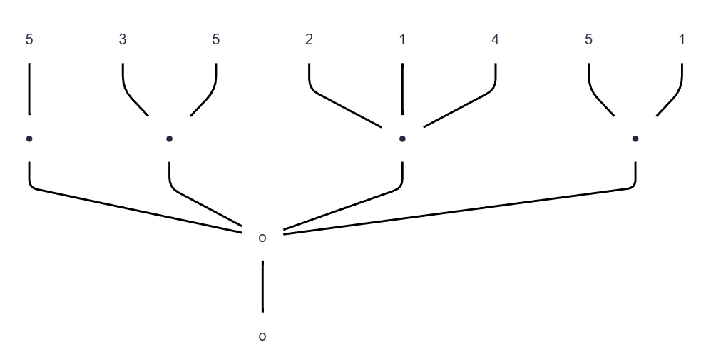
<figcaption>
图
4.3‑1各调调素与充当单质韵母的质素的联结方式
</figcaption>
</figure>

<figure>
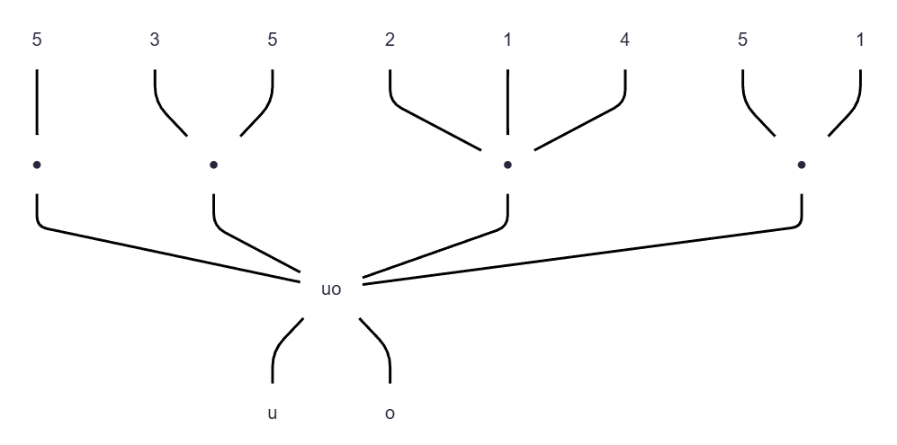
<figcaption>
图
4.3‑2各调调素与构成后长韵母的质素的联结方式
</figcaption>
</figure>

<figure>
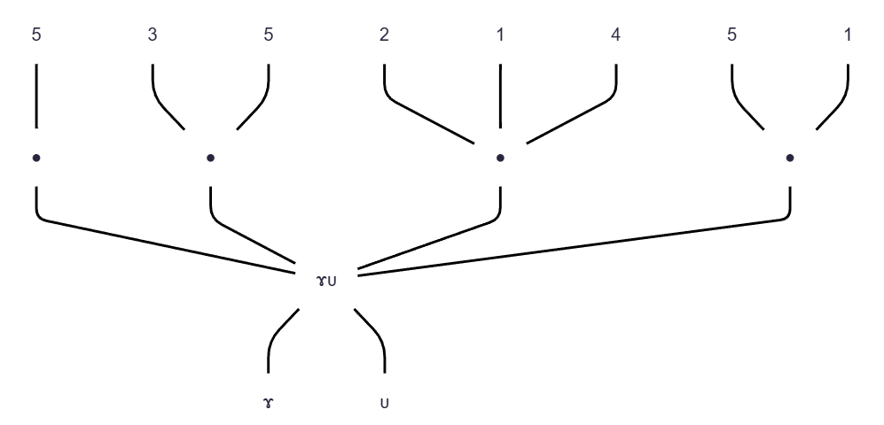
<figcaption>
图
4.3‑3各调调素与构成前长韵母的质素的联结方式
</figcaption>
</figure>

<figure>
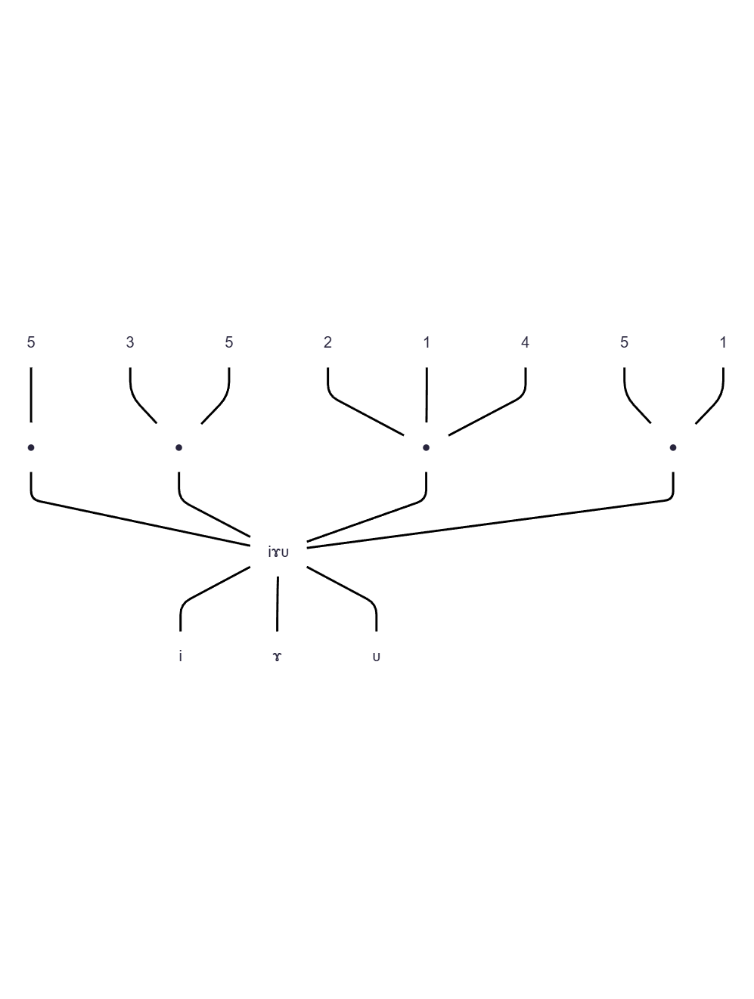
<figcaption>
图
4.3‑4各调调素与构成三质韵母的质素的联结方式
</figcaption>
</figure>

在图 4.3‑1 至图
4.3‑4 中，声调结点用实心圆点(●)来表示。在把声调分析成调素序列后，声调，根据调型不同，由于平调根据自主音段音系学的强制性曲线原则只能用一个调素来表示，因此高调阴平是[5]；由于斜调(升调和降调)用两个调素来表示，因此升调阳平是[35]、降调去声是[51](条件调值是[53])；由于折调[211]用两个调素表示成[21]，因此上声是[21](条件调值是[35])；由于曲线型的凹形调用三个调素来表示，因此上声在变为凹形调时的条件调值是[214]。

根据图 4.3‑1 至图
4.3‑4 可知，按照把声调分析成音节的特征的方法确定质调关系，在把声调分析成调素序列和把韵母分析成质素序列后，实际存在这样一些问题：

一、当声调只由一个调素充当时，充当声调的调素，除整体与一个充当单质韵母的质素相联结外，事实上还分成两段与两个构成二质韵母的质素相联结和分成三段与三个构成三质韵母的质素相联结。例如，充当高调阴平的调素[5]，既整体与一个充当单质韵母的质素[o]联结，又分为两段[5\_]和[\_5]分别与构成韵母 ou[ɤᴜ]的两个质素[ɤ]、[ᴜ]和构成韵母 uo[uo]的两个质素[u]、[o]联结，还分为三段[5\_\_]、[\_5\_]和[\_\_5]依序与构成韵母 iou[iɤᴜ]的三个质素[i]、[ɤ]和[ᴜ]联结。

二、当韵母只由一个质素充当时，充当韵母的质素，除整体与一个充当高调阴平的调素相联结外，事实上还分成两段与两个构成阳平和去声的调素相联结和分成三段与三个构成上声的调素相联结。例如，充当单质韵母的质素[o]，既整体与一个充当高调阴平的调素[5]联结，又分为两段[o\_]和[\_o]分别与构成升调阳平[35]的两个调素[3]、[5]和构成降调去声[51]的两个调素[5]、[1]联结，还分为三段[o\_\_]、[\_o\_]和[\_\_o]依序与构成上声[214]的三个调素[2]、[1]和[4]联结。

三、当声调由两个或三个调素构成且当韵母由两个或三个质素构成时，构成声调的调素与构成韵母的质素的联结关系不明确。当韵母用两个质素来表示时，这类韵母被统称为二质韵母，分为两类：一类为前长韵母，另一类为后长韵母。这两类韵母结构不同：前长韵母由韵腹和韵尾构成、没有韵头，后长韵母由韵头和韵腹构成、没有韵尾。因此，声调与这两类二质韵母的联结关系的内容内部细节不同。例如，当韵母[ɤᴜ]与声调阳平[35]和去声[51]联结时，只能笼统确定声调与整个韵母联结，但是既不能具体确定质素[ɤ]和[ᴜ]与构成阳平[35]的两个调素[3]、[5]的联结关系的具体内容，也不能具体确定质素[ɤ]和[ᴜ]与构成去声[51]的两个调素[5]、[1]的联结关系的具体内容。当韵母是二质韵母[uo]时，情况类似二质韵母[ɤᴜ]，但因两类韵母的结构类型不同而内容内部细节各不相同。当韵母是三质韵母[iɤᴜ]时，[i]、[ɤ]和[ᴜ]与高升低降四类声调的联结关系变得更加复杂，而根据把声调分析成音节的特征的方法只能笼统确定声调与整个韵母联结，不能具体确定质素[i]、[ɤ]和[ᴜ]与除阴平外的阳平、上声和去声三类声调的联结关系的具体内容。

综述可知，在现代通用汉语中，在确定质调关系的内容时，不论是把声调分析成音段的特征还是把声调分析成音节的特征，经典生成音系学和结构音系学一样都存在质调关系的内容不具体不全面的问题。

### 自主音段音系学的问题

在现代通用汉语中，在确定质调关系的内容时，不论是把声调分析成音段的特征还是把声调分析成音节的特征，既然经典生成音系学和结构音系学一样都存在质调关系的内容不具体不全面的问题，那么，后起的自主音段音系学是不是解决了这个问题呢？

自主音段音系学，与结构音系学不同，既不是把声调分析成音段的特征也不是把声调分析成音节的特征，而是与把音质分析成音质音段序列类似把声调分析成调素序列。因此，声调或由调素(toneme)充当或由调素构成，相对由音段构成的质层(segmental
tier)，是独立存在的调层(tonal
tier)。调层的调素和质层的音质音段(实际上是质素)通过时间作为中介并行联结。这种联结关系被命名为非线性联结(nonlinear
association)。

调素指具有区别调型作用的平调，是构成声调的元素。调素具有区别声调的作用，类似音质的区别特征(distinctive
feature)，因此，在一些文献中，也被称为声调特征(tonal
feature)。调型，也被称为声调模型、声调模式(tonal
pattern)、声调旋律(tonal melody)或声调曲线(tonal
contour)，指最小的、具有区别语素或单词的意义作用的调素序列，性质与汉语传统语音学的调类相同。一种语言的调型就是根据调值是否构成对立归纳的调类。调域根据具有区别调型作用的高低对立划分高度(确定音程)。一度表示一个调素。调域的分度或音程的划分，或被称为分级，或被称为分区，或被称为分层。不同的语言，调域的分度不尽相同，至少分为两度，至多分为五度。在非洲声调语言中，调域大多分为高低两度或高中低三度就能充分区别各种调型。在某些汉语方言中，实践表明，只有把调域分为四度甚至五度才能充分区别各种调型。确定音程，不仅有把调域根据调类的阴阳对立先分为阴、阳两个调域再分别对阴、阳两个调域确定音程分成几度的；而且有把调域根据调类的阴、中、阳对立先分为阴、中、阳三个调域再分别对阴、中、阳三个调域确定音程分成几度的。美国汉学家 Yip 认为，汉语许多南方方言的调类对立，其实不单纯是音高的不同，而是涉及阴阳调域的不同，因此，调域应先分为阴阳两个调域再分别对阴、阳两个调域确定音程分成几度
[(YipMoira1980)](<#(YipMoira1980)>)。朱晓农甚至认为，上海音系的调域分为阴、中、阳三个调域，每个调域各分高、次高、次低和低四度。从绝对音高来看，阴、中、阳三个调域的高调依序降低一度，其余各调类推
(朱晓农, 《上海音系》，夏剑钦摘译, 1996)。然而，在现代通用汉语中，阴平与阳平的对立已不再是调域的阴阳对立而仅仅是调型的对立，因此，调域不分阴阳，通常直接把调域划分成高平、半高、中平、半低和低平五度。把调域划分成五度，方便比较精确地表示调值。然而，在现代通用汉语中，只需把调域划分成高调、中调和低调三度，甚至只需把调域划分成高调和低调两度，就能表示调型或调类的对立。尽管比较精细的分度导致声调系统变得繁杂，但却方便较精确地描述各类声调分布在不同环境中的实际调值。因此，确定音程，往往先根据五度标调法把调域划分成五度，再在需要根据三度标调法标调时，根据五度标调法与三度标调法的换算关系，把五度标调法的调值换算成三度标调法的调值。

自主音段(autosegment)，是自主音段音系学的一个最基本的概念，分为音质音段(segment)和超音质音段(suprasegment)两类。前者指音位或音素。后者指声调、重音、语调和节奏等非音质成分。音段这个术语是从结构音系学和经典生成音系学中继承来的。在生成音系学产生前，结构音系学设立了两个基本表达式用来解释语音现象。一个是音位表达式(phonemic
representation)，另一个是音素表达式(phonetic
representation)。前者由音位(phoneme)组成，后者由音素(phone)组成。通过音位分析确定音位和音素在两者间的对应关系，音位分析的基本原则是双向单一性原则。音位是音系表达的基本单位。音素是音位在特定语音环境中的具体实现。在一般情况下，音位和音素的对应关系是一多对应，也就是说，一个音位往往对应分布在不同的语音环境中的不止一个不同的音素。同一音位对应的不同音素称为同位音素(allophone)。在生成音系学产生后，经典生成音系学，和结构音系学一样，也设立了两个基本表达式用来解释语音现象。一个是音系表达式(phonological
representation)，另一个是语音表达式(phonetic
representation)。这两个表达式在形式上是独立的，通过音系规则(phonological
rule)来联结。在经典生成音系学中，由于采纳了雅各布森(Roman
Jakobson)提出的“区别特征是音系表达的基本单位、音位是区别特征的组合”的理论
(Jakobson, 1952)，音位不再是一个重要的概念，不再严格区别音位和音素，而是把两者统称为音段(segment)。在音系表达上，音段对应结构音系学的音位；在语音表达上，音段对应结构音系学的音素或同位音素。自主音段音系学继承了音段这个概念。

在自主音段音系学中，质层和调层是两个既相对独立又并行联结的层。质层和调层的关系是非线性联结。声调与音段的联结关系受一系列联结规则制约。这些规则包含普遍联结常规(Universal
Association Convention)，声调延展原则(Tone spreading
rule)，浮游调(Floating tone)删除或飘移原则，强制性曲线原则(Obligatory
Contour Principle)，默认调插入(Default tone
insert)原则，等等。普遍联结常规大致包含声调与音段依照时序联结和联结线不能交叉两个原则。调素和音段的联结关系在书面上用联结线(association
line)来表示；由联结线联结起来的调素和音段在时间上是并行的。因此，这种联结在本书中又被称为并行联结。

自主音段音系学，与结构音系学和经典生成音系学相比，最大的不同是不把调素或声调分析成音段或音节的特征，因此，语音的结构不是单线性结构(single
linear structure)，而是非线性结构(non-linear
structure)或多线性结构(multi-linear
structure)。自主音段音系学认为，音流的各类元素组成两个或更多相对独立的层。然而结构音系学认为，音流由依照时序排列的一串音位或音素构成。类似地，经典生成音系学认为，音流是由音段根据时序排列成的音段序列，换句话说，音流是由表示音段的特征矩阵根据时序排列成的特征矩阵序列。

自主音段音系学用调素分析法来分析非洲声调语言的声调。在自主音段音系学产生前，1969 年，Woo 在《Prosody
and Phonology》 (Woo, 1969)中提出，平调由一个声调特征充当，斜调和折调由至少两个音高不同的声调特征构成。与后来的自主音段音系学不同，Woo 不把由声调特征构成的声调分析成和音质相对独立的层，而把声调特征分析成作为它的载体的音段的一个特征，即声调特征是音段的特征。然而，仅从分析调值的角度上看，后来的自主音段音系学采用了这种方法。非洲声调语言的声调，是高低型声调，调型只有相对高低的对立，都是平直调(水平的直线调)，一个声调只需用一个调素来表示；只有当两个高低不同的平调的语素或单词结合在一起时，才产生斜调或折调，一般没有曲线型的凹形或凸形的调型；斜调或折调只出现在词的边缘，不是出现在词首就是出现在词尾，从来不会出现在词首和词尾间，分布不自由(受限制)，可预测，且随语素分解而分解。因此，高低型声调语言的声调(包含平调、斜调和折调)都可表示成平调序列。这种调值表示法就是离散调值表示法。在划分调域并且确定音程后，调值既可以分析成一个连续的音高动程，也可以分析成一个离散的音高序列。因此，有两种调值表示法：连续调值表示法和离散调值表示法。连续调值表示法把声调分析成一个调值连续的过程，描绘成一条音高随时间变化的曲线，是汉语语音学的传统。离散调值表示法是调素论表示调值的方法。简单地说，调素论是关于调素分析法的理论；调素分析法是把声调分析成调素序列的方法。离散调值表示法亦即调素分析法分段记录调值，把调值分析成离散的音高序列。目前调素分析法是自主音段音系学的一个理论基础。调素分析法，在用来分析高低型声调语言的声调时，实践证明，都是很成功的。

随着自主音段音系学的形成和推广，在汉语语音学中，先后有人运用这种方法来确定音节的质调关系。于是，汉语语音学发生了变化，出现了一种运用这种方法来确定音节的质调关系的学说：汉语自主音段音系学。

然而，汉语的声调系统比非洲声调语言的声调系统复杂得多。汉语的声调根据声调的形式分析是节调。非洲声调语言的声调根据声调的形式分析是词调。汉语的声调是典型的旋律型声调。非洲声调语言的声调是典型的高低型声调。尽管在这两类声调语言的声调系统中都有曲线型声调，然而这两类声调语言的声调系统性质不同
(Yip, Contour Tones, 1989) [(Bao1990)](<#(Bao1990)>)。这种不同大致分成两种情形：

一、在旋律型声调语言中，声调和音节在语流中一对一相连，换句话说，声调总是表现为音节的声调，具体地说，排除因受前后音节的声调等外部影响而发生的变调情况，每个音节都有且仅有一个声调；然而在高低型声调语言中，声调与语素或单词相连、与音节个数无关，一个语素或单词既可以是单音节的也可以是多音节的、不管包含几个音节都只包含一个声调。

二、在旋律型声调语言中，不仅高低型声调是基本调型，而且曲线型声调也是基本调型；然而在高低型声调语言中，只有高低型声调才是基本调型，曲线型声调是派生调型。也就是说，在高低型声调语言中，一个声调只需用一个调素来表示，只有当两个高低不同的平调的语素或单词结合在一起时才产生斜调或折调，一般没有曲线型的凹形或凸形的调型。因此，一方面，在旋律型声调语言中，曲线型声调不随语素分解而分解；然而在高低型声调语言中，曲线型声调可以随语素分解而分解；另方面，在旋律型声调语言中，曲线型声调是自由分布的，不可预测；然而在高低型声调语言中，曲线型声调只出现在词的边缘，不是出现在词首就是出现在词尾，从来不会出现在词首和词尾间，分布不自由(受限制)，可预测。

正是由于存在这些不同，调素分析法，在用来分析旋律型声调语言的声调例如汉语声调时，最初碰到了许多棘手的问题。高低型声调语言的声调，不论具有区别调型作用的调素分为几个，调型的对立就是单个调素的对立；然而旋律型声调语言的声调，调型的对立往往不仅仅是单个调素的对立，有时是单个调素的对立，有时是比单个调素更大的由两三个调素构成的调段甚至是整个调型的对立。在现代通用汉语中，声调，根据调型不同，由于平调根据自主音段音系学的强制性曲线原则只能用一个调素来表示，因此高调阴平是[5]；由于斜调(升调和降调)用两个调素来表示，因此升调阳平是[35]、降调去声是[51](条件调值是[53])；由于折调[211]用两个调素表示成[21]，因此上声是[21](条件调值是[35])；由于曲线型的凹形调用三个调素来表示，因此上声在变为凹形调时的条件调值是[214]。根据这种方法，构成各类声调的调素数量不等。在现代通用汉语中，由于根据这种方法不便分析声调的对立状况，因此，为分析声调的对立状况，把各类声调都分析成由三个调素构成的调素序列。在把各类声调都分析成由三个调素构成的调素序列后，高调阴平是[555]、升调阳平是[345]、低调上声是[211]、降调去声是[541]。把五度标调法的调值换算成三度标调法的调值，用英文字符来标调，高调阴平是 HHH、升调阳平是 LMH、低调上声是 LLL、降调去声是 HML。于是，四类声调的对立状况是：

高调阴平[55]与升调阳平[35]的对立，不是简单的高低对立，而是在第三个调素同是高调(H)或高平[5]的条件下由第一和第二两个调素构成的二拍长调高高[55\_]与低中[34\_]的对立，总体特征是高与升的对立，记成：

$$
\begin{matrix}
\lbrack 55\rbrack \neq \lbrack 35\rbrack & \Rightarrow & \lbrack 555\rbrack \neq \lbrack 345\rbrack \\
 & \Rightarrow & \lbrack 55\_\rbrack \neq {\lbrack 34\_\rbrack}/{\lbrack 5\rbrack} \\
 & \Rightarrow & \begin{matrix}
HH\_  \neq  LM\_  /H
\end{matrix} \\
 & \Rightarrow & HHH \neq LMH
\end{matrix}
$$

高调阴平[55]与低调上声[21]的对立，分段说明，就是第一个调素与第一个调素、第二个调素与第二个调素和第三个调素与第三个调素的高低对立，整体说明，是由呼调、主调和末调构成的三拍长调高高高[555]与低低低[211]的对立，简单地说，总体特征是高与低的对立，记成：

$$
\begin{matrix}
\lbrack 55\rbrack \neq \lbrack 21\rbrack & \Rightarrow & \lbrack 555\rbrack \neq \lbrack 211\rbrack \\
 & \Rightarrow & HHH \neq LLL \\
 & \Rightarrow & H \neq L
\end{matrix}
$$

高调阴平[55]与降调去声[51]的对立，不是简单的高低对立，而是在第一个调素同是高调(H)或高平[5]的条件下由第二和第三两个调素构成的二拍长调高高[\_55]与中低[\_41]的对立，总体特征是高与降的对立，记成：

$$
\begin{matrix}
\lbrack 55\rbrack \neq \lbrack 51\rbrack & \Rightarrow & \lbrack 555\rbrack \neq \lbrack 541\rbrack \\
 & \Rightarrow & \begin{matrix}
\lbrack\_ 55\rbrack  \neq  \lbrack\_ 41\rbrack  /5
\end{matrix} \\
 & \Rightarrow & \begin{matrix}
\lbrack\_ HH\rbrack \neq \lbrack\_ ML\rbrack /H
\end{matrix} \\
 & \Rightarrow & HHH \neq HML
\end{matrix}
$$

升调阳平[35]与低调上声[21]的对立，不是简单的高低对立，而是在第一个调素同是低调(L)的条件下由第二和第三两个调素构成的二拍长调中高[\_45]与低低[\_11]的对立，总体特征是升与低的对立，记成：

$$
\begin{matrix}
\lbrack 35\rbrack \neq \lbrack 21\rbrack & \Rightarrow & \lbrack 345\rbrack \neq \lbrack 211\rbrack \\
 & \Rightarrow & \begin{matrix}
\lbrack\_ MH\rbrack \neq \lbrack\_ LL\rbrack /L
\end{matrix} \\
 & \Rightarrow & LMH \neq LLL
\end{matrix}
$$

升调阳平[35]与降调去声[51]的对立，既不是简单的高低对立，又不是由第二和第三两个调素构成的二拍长调的对立，也不是由第一和第二两个调素构成的二拍长调的对立，还不能确定究竟是第一个调素的低[3\_\_]与高[5\_\_]的对立还是第三个调素的高[\_\_5]与低[\_\_1]的对立，只能从整体上确定是在第二个调素同是中调(M)或半高[4]的条件下由第一个调素的低[3\_\_]与高[5\_\_]和第三个调素的高[\_\_5]与低[\_\_1]构成的对立，总体特征是升与降的对立，记成：

$$
\begin{matrix}
\lbrack 35\rbrack \neq \lbrack 51\rbrack & \Rightarrow & \lbrack 345\rbrack \neq \lbrack 541\rbrack \\
 & \Rightarrow & \begin{matrix}
\lbrack 3\_ 5\rbrack \neq \lbrack 5\_ 1\rbrack /4
\end{matrix} \\
 & \Rightarrow & \begin{matrix}
\lbrack L\_ H\rbrack \neq \lbrack H\_ L\rbrack /M
\end{matrix} \\
 & \Rightarrow & LMH \neq HML
\end{matrix}
$$

低调上声[21]与降调去声[51]的对立，不是简单的高低对立，而是在第三个调素同是低调(L)的条件下由第一和第二两个调素构成的二拍长调低低[21\_]与高中[54\_]的对立，总体特征是低与降的对立，记成：

$$
\begin{matrix}
\lbrack 21\rbrack \neq \lbrack 51\rbrack & \Rightarrow & \lbrack 211\rbrack \neq \lbrack 541\rbrack \\
 & \Rightarrow & \begin{matrix}
\lbrack 21\_\rbrack \neq \lbrack 54\_\rbrack /1
\end{matrix} \\
 & \Rightarrow & \begin{matrix}
\lbrack LL\_\rbrack \neq \lbrack HM\_\rbrack /L
\end{matrix} \\
 & \Rightarrow & LLL \neq HML
\end{matrix}
$$

由于存在这些比简单的高低或高中低对立复杂的对立现象，调素分析法，在用来分析旋律型声调语言的声调例如汉语声调时，最初并不能解释这些现象，因而都不是很成功。在汉语语音学中，连续调值表示法至少具有一千五百年的传统，因此，调素分析法最初更是不被认可。甚至有人声称，在旋律型声调语言中，曲线型声调不能被分析成由两三个不同的调素的组合；相反，在高低型声调语言中，曲线型声调能够被分析成由两三个不同的调素的组合。因此，在汉语中，在自主音段音系学产生前，结构音系学和经典生成音系学都是把声调作为一个调值连续的整体来处理声调与音段或音节的关系，不是把声调分析成音段就是把声调分析成音节的特征。

然而，在汉语中是不是确实不能把曲线型声调分析成调素序列呢？换句话说，是否真的不能用调素分析法来分析曲线型声调呢？尽管针对这个问题的答案最初都是否定的，但是随着一些理论和方法问题的解决，用调素分析法来分析汉语声调也获得了一定程度的成功，初步形成了以调素分析法为基础的自主音段音系学。这种方法，在调层上把声调分析成调素序列，在质层上把作为带调单位的质素序列分析成韵素序列，把调素与韵素在时轴上一对一联结起来
(Duanmu, Against Contour Tone Units, 1994)。韵素是摸挼(mora)的意译
(王洪君, 1999, 页 137)，最初是用来说明某些语言例如日语音节轻重的术语，用韵素来说明质调关系是术语借用。在说明音节轻重时，重音节的“韵”，或为长元音或由短元音和辅音构成，分为两个韵素；轻音节的“韵”，只有短元音，只含一个韵素。在被借用来说明质调关系时，韵素指音节的韵这一部分的一个分段，有时与元音或辅音重合，一个元音或辅音就是一个韵素；有时比元音短，充当韵基的元音被分析成由两个音质相同的韵素的组合。用调素分析法来分析汉语声调，尽管把调素与韵素一对一联结可以解决一些问题，但还存在一些尚未解决的问题、还不是很完善，因此，以调素分析法为基础的汉语自主音段音系学，是一种正处在探索阶段的尚未完全定型的理论，因而呈现出众说纷纭的状况：

首先，分析声调构成的方法呈现多样性的特点。一方面，调素这个名称还不完全统一。例如沿用经典生成音系学的叫法把调素称为声调特征。但不论如何命名，事实上都相同，都指构成声调的具有区别调型作用的平调，都指构成声调的元素。另方面，关于声调构成，有把各类声调都分析成由两个调素构成的，有把各类声调都分析成由三个调素构成的，有把各类声调分别分析成由一至三个数量不等的调素构成的。但不论调素数量相等或不等，都是把声调分析成调素序列。

其次，确定质调关系的方法呈现多样性的特点。在把声调分析成调素序列后，还要确定调素与多大的音质单位联结。在汉语自主音段音系学中，确定质调关系的方法大致分成两种：一是把与调素联结的音质分析成韵素(mora)，一个声调由几个调素构成，与声调联结的音质就分成几个韵素，韵素与调素在时轴上一对一联结
(王洪君, 1999)。二是把与调素联结的音质分析成元音或辅音(统称音质音段)，一个音段可以与一个、两个或三个调素联结；相反，一个调素也可与一个、两个或三个音段联结。

然而，自主音段音系学，不管它目前如何众说纷纭，它确定质调关系的方法都是大致相同的：一般都是，根据调素分析法，首先把声调分析成调素序列，然后通过确定构成声调的调素与构成韵母的质素的联结关系来确定质调关系。然而，目前它确定质调关系的结果却都是令人失望的：都出现调素与质素的联结关系很复杂，因而在干音中唱音的音调很复杂，从而根据质调关系的内容确定唱音的音值相当困难，因此，根据自主音段音系学确定质调关系的方法拼音相当困难。

尽管目前自主音段音系学确定质调关系的结果令人失望，但通过分析这些学说在确定质调关系时面临的问题，可以进一步揭示质调关系的复杂性，为化解质调关系的复杂性、解决根据节调质素分析拼音面临的拼音困难提供启示和找到出路。

在自主音段音系学产生后，声调理论，根据术语不同分为两种：一种是把声调分析成声调特征矩阵序列的非线性声调学，属非线性音系学；一种是把声调分析成调素序列的调素论。强调说明，这种分类只是根据说明简便而进行的简单分类，并不表示这些分析声调的理论在实质上一定存在差异。

前述说过，1967 年，王士元，最早提出声调特征不是音段的特征而是音节的特征的观点，并初步提出声调具有相对独立性的思想。他最早使用七个声调特征来说明声调，认为，虽然音段特征和声调特征一起产生，但是音段序列里的声调的相互作用与音段性质通常无关，因此，把属于声调的声调特征项加到音段的特征矩阵中不妥，建议最好不要用规定音段特征的办法来规定声调特征，而是把声调特征看作一个附属在音节上的特征
(Wang, 1967)。这种方法与经典生成音系学不同。经典生成音系学认为，音流由时域离散的音列构成，声调特征是音段的特征。因此，这种方法，突破了经典生成音系学设定的理论框框的限制，初步提出了声调具有相对独立性的观点。

1976 年，Goldsmith 提出自主音段音系学，认为，由调素构成的声调是相对独立于由音质音段构成的质层而存在的调层；调层与质层通过一定的联结规则发生非线性联结[(Goldsmith1976)](<#(Goldsmith1976)>)；把声调分析成调素序列，不把调素分析成音段的特征。

1980 年，美国汉学家 Yip 开始用自主音段音系学理论来分析汉语声调，初步创立了汉语自主音段音系学[(YipMoira1980)](<#(YipMoira1980)>)。这种学说，目前还是一种正处在探索阶段的尚未完全定型的理论，后继探索者不少，国内的有王洪君在《汉语非线性音系学》一书中提出的汉语非线性声调学和刘俐李在《汉语声调论》一书中针对等长调素论只简单规定三个调素等长提出的不等长调素论等。

1999 年，王洪君在《汉语非线性音系学》一书中认为，汉语的每个正常音节(非轻声音节)，不论韵母的结构类型是何种类型，都是双韵素的结构，即汉语的韵都占两个时间格(timing
slot)，都与两个声调特征有深层的一对一的联结，形成斜调，但在某些有较大停顿的词界处还可能再联结一个浮游的声调特征，形成曲折调。这个浮游的声调特征在单念或多音节词的末位音节时实现出来，在前字位置时被删去，在后面有空位时飘移到后面的空位上，如轻声就是因底层无调或语流中失去本来的声调而造成的空位。空位指没有联结声调特征的空时位(空时间格)，即没有联结任何声调特征的韵素。介音的有无和声调的这一分布特点无关[(王洪君1999)](#(王洪君1999))。朱晓农在《语音学》一书中也持同样看法[(朱晓农 2010)](<#(朱晓农2010)>)。声调特征大致相当于调素论的调素。因此，声调各由两个调素构成，上声[21]在带浮游调素时是[214]，有三个调素，[4]是浮游调素。从模型上说明，王洪君采用的音节结构模型，是一种把韵一律分析成由两个调素和与其相联结的两个韵素构成的韵的音节结构模型。这个音节结构模型与以往的音节结构模型不同。以往的音节结构模型共有三种：

第一种，线性学派的结构模型：这个结构模型的特征是：节质结构是线性结构，也就是说，在构成节质的质素序列中，质素按照时序排列、层次相同；声调作为一个调值连续的整体是与节质既相对独立又并行联结的元素。在这个结构模型中，只考虑节质，节质的结构模型图示如图
4.3‑5。

<figure>
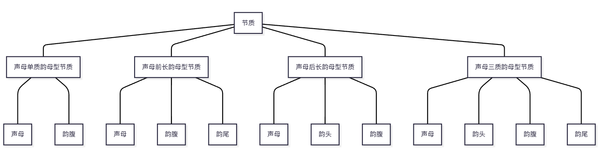
<figcaption>
图 4.3‑5线性学派的结构模型
</figcaption>
</figure>

第二种，等韵学派的结构模型：这个结构模型的特征是：音节由节调与节质构成；节质由声母和韵母构成；韵母，如果在韵质(韵身或韵基)前还有介质(韵头)，又分为介质和韵质两段；韵质，如果在韵核(韵腹或韵核)后还有韵尾，又分为韵核和韵尾两段。介质是可有可无的。韵核是必不可少的。韵尾是可有可无的。在这个结构模型中，只考虑节质，节质的结构模型图示如图
4.3‑6。

<figure>
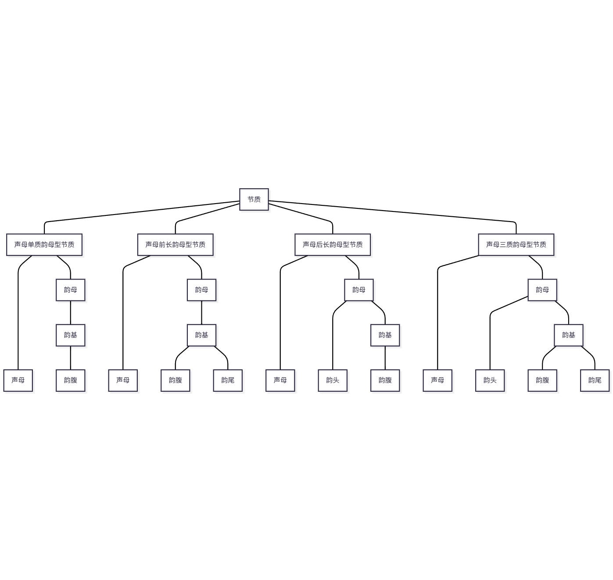
<figcaption>
图 4.3‑6等韵学派的结构模型
</figcaption>
</figure>

第三种，曲韵学派的结构模型：这个结构模型的特征是：节质分成节首和韵基两段。节首，当在韵基前有辅音无介音时由节首辅音充当，当在韵基前无辅音有介音时由介音(半元音)充当，当在韵基前有辅音有介音时由辅介合音充当。在汉语中，无论是过去和现在，都有把辅介合音整体分成一段的分析，甚至有把辅介合音的介音分析成介音前面的辅音的特征的
(Duanmu, 1990)。韵基，当在韵核后还有韵尾时，分为韵核和韵尾两段。韵核是必不可少的。韵尾是可有可无的。声调作为一个调值连续的整体是与节质既相对独立又并行联结的元素。

曲韵学派的结构模型的节首和韵基，就是声韵二分法的声段的音质和韵段的音质。依序把声段的音质和韵段的音质简称为声质和韵质，节首和韵基就是节调声质韵质分析法声质和韵质。因此，曲韵学派的结构模型，就是节调声质韵质分析法的节质的结构模型，图示如图
4.3‑7。

<figure>
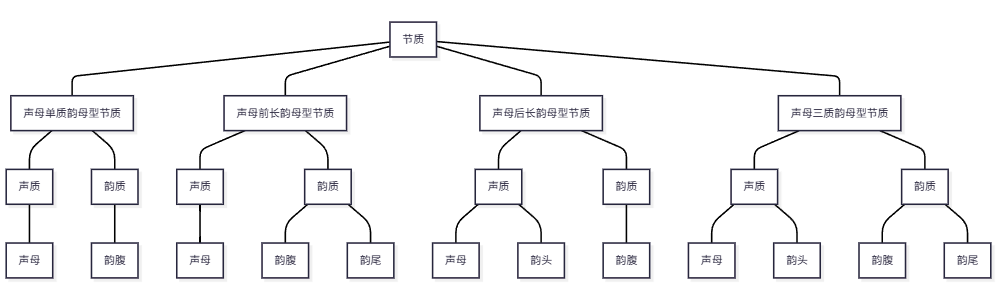
<figcaption>
图 4.3‑7曲韵学派的结构模型
</figcaption>
</figure>

在曲韵学派的结构模型中，只考虑节质，曲韵学派的结构模型，事实上就是生成学派的结构模型，用生成学派的术语和符号来表示，音节(Syllable，简记为 S 或 σ)实为节质，分成节首(Onset，简记为 O)和韵基(Rime，简记为 R)两段；韵基，当在韵核后还有韵尾时，又分为韵核(Nucleus，简记为 N)和韵尾(Coda，简记为 C 或 Co)两段；韵核前的辅音或辅音丛(包含流音(liquid)和介音(glide))属节首；韵核后的元音、辅音或辅音丛属韵尾。因此，曲韵学派的结构模型用生成学派的结构模型来表示，图示如图
4.3‑8。

<figure>
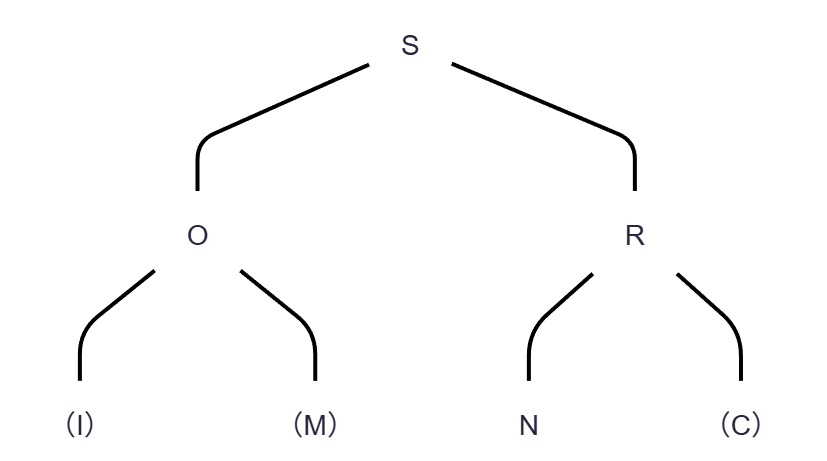
<figcaption>
图 4.3‑8生成学派的结构模型
</figcaption>
</figure>

与前面三种结构模型不同，王洪君在《汉语非线性音系学》一书中采用的音节结构模型的特征是：节质分为节首和韵基两段；节首，当在辅音后还有介音时，分为声母和介音两段；韵基，当在韵核后没有韵尾时分成两个音质相同的韵素，当在韵核后还有韵尾时分为韵核和韵尾两个韵素。介音是可有可无的。这个结构模型事实上是曲韵学派的结构模型或生成学派的结构模型的变种。王洪君在结合生成学派的结构模型分析了汉语音节的结构特点后得出结论说：“综上所述，吸取了非线性音系学的研究成果后，我们对汉语音节结构的看法与以前稍有不同。上述对汉语音节结构的看法可以整理为下面的模型：”
(王洪君, 1999, 页 131)

<figure>
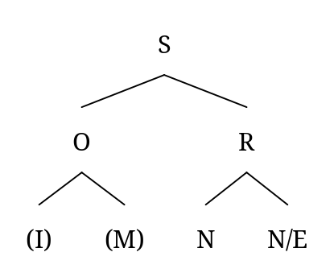
<figcaption>
图 4.3‑9韵基一律二分的节质树形结构模型
</figcaption>
</figure>

在这个结构模型中，当音节无介音时，O 表示声母；当音节有介音时，O 表示由声母和介音构成的辅介合音(节首)。I 表示声母(Initial)。M 表示韵头(Medial)或介质，但和通常含义的韵头不尽相同，不仅指通常含义的韵头，而且指单质韵母 i[i]、u[u]和 ü[ʏ]的“韵头”，即占据单质韵母 i[i]、u[u]和 ü[ʏ]最前面的一个时间格(Timing
Slot，简记为 X)的没有联结调素的音质。也就是说，单质韵母 i[i]、u[u]和 ü[ʏ]占据的相当于有头韵母的韵头位置的部分，也是韵头。M 放在括号中表示韵头是可有可无的。R 表示韵基(Rime)，不仅指通常含义的韵基，而且指特殊含义的韵基。通常含义的韵基是指除韵母 i[i]、u[u]和 ü[ʏ]外的韵母的韵基。特殊含义的韵基是指，在把单质韵母 i[i]、u[u]和 ü[ʏ]分别分析成由韵头和韵基构成的韵母 ii、uu 和 ʏʏ 的情况下
(薛凤生, 1986)，也就是说，在把单质韵母 i[i]、u[u]和 ü[ʏ]分析成分别带有韵头 i-、u-和 ʏ-的韵母的情况下
(王洪君, 1999, 页 130)，单质韵母 ii、uu 和 ʏʏ 的韵基-i、-u 和-ʏ。因此，韵基共有五种情形，或指单质韵母 ii、uu 和 ʏʏ 的韵基-i、-u 和-ʏ，或指除单质韵母 i[i]、u[u]和 ü[ʏ]外的单质韵母的韵基，或指由有头无尾韵母的韵腹自成的韵基，或指由无头有尾韵母的韵腹和韵尾构成的韵基，或指由有头有尾韵母的韵腹和韵尾构成的韵基。N 表示韵腹或韵核(Nucleus)，但无尾韵母的韵腹分成两个音质相同的韵素(Mora，简记为 μ)，第二个韵素 N 占据相当于有尾韵母的韵尾位置的部分。E 表示韵尾(Ending)。E 相当于生成学派的结构模型的尾音(Coda)，由有尾韵母的韵尾占据。

根据这个结构模型，在现代通用汉语中，节质的结构具体分为五种结构类型，举例说明如图
4.3‑10。

<figure>
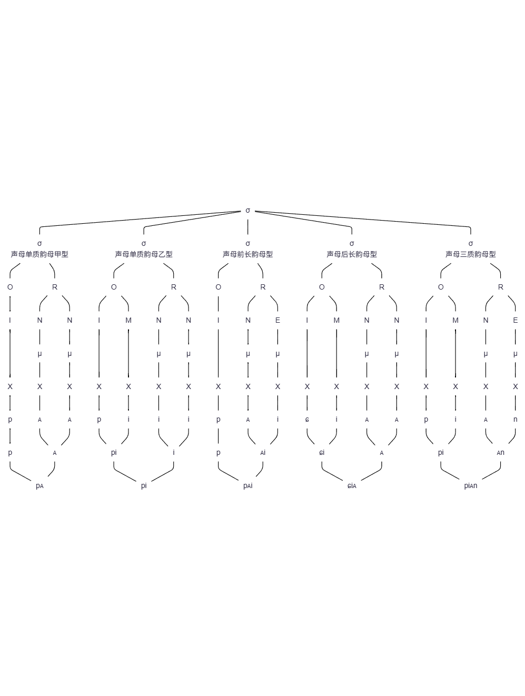
<figcaption>
图 4.3‑10节质的五种结构类型
</figcaption>
</figure>

在该图中，pᴀ 表示[pᴀ]，ɕiᴀ 表示[ɕiᴀ]，pᴀi 表示[pæi]，piᴀn 表示[piæn]。在该图中，μ 表示韵素。在三质韵母和前长韵母中，韵素与元音或辅音重合，一个元音或辅音就是一个韵素；在单质韵母和后长韵母中，韵素比元音短，充当韵基的元音被分析成由两个音质相同的韵素的组合。

根据该图可知，在全不考虑浮游调素的浮游问题时，韵素与调素的联结关系图示如图
4.3‑11。

<figure>
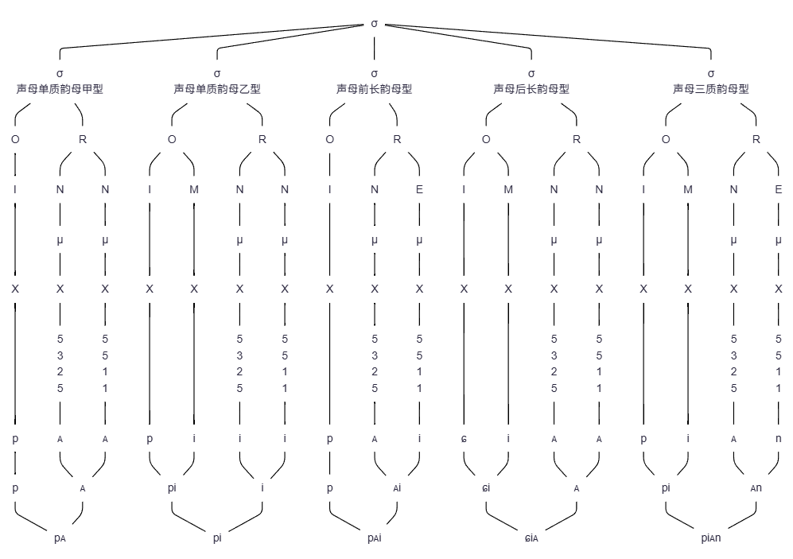
<figcaption>
图 4.3‑11韵素与调素的联结关系
</figcaption>
</figure>

在这个结构模型的五种结构类型的音节中，韵素与调素的联结关系分别是：

1. 在韵母是单质韵母 i[i]、u[u]和 ü[ʏ]的音节中，韵母虽属无头无尾韵母，但被分成韵头和韵基两段；韵基，分为两个韵素，与两个调素一对一联结。韵头，当音节无声母时独自充当节首、当音节有声母时和前面的辅音构成节首(由辅音和介音构成节首)。韵头不联结调素，但占据一个时间格(X)。

2. 在韵母是除单质韵母 i[i]、u[u]和 ü[ʏ]外的单质韵母的音节中，韵母没有韵头和韵尾、分为两个韵素，与两个调素一对一联结。

3. 在韵母是有头无尾韵母的音节中，韵母亦即韵基无韵尾、分为两个韵素，与两个调素一对一联结。韵头，当音节无声母时独自充当节首、当音节有声母时和前面的辅音构成节首(由辅音和介音构成节首)。韵头不联结调素，但占据一个时间格(X)。

4. 在韵母是无头有尾韵母的音节中，韵母无韵头，韵基由韵腹和韵尾构成、韵腹和韵尾各为一个韵素，与两个调素一对一联结。

5. 在韵母是有头有尾韵母的音节中，韵母有韵头，韵基由韵腹和韵尾构成、韵腹和韵尾各为一个韵素，与两个调素一对一联结。韵头，当音节无声母时独自充当节首、当音节有声母时和前面的辅音构成节首(由辅音和介音构成节首)。韵头不联结调素，但占据一个时间格(X)。

这种处理质调关系的方法存在这样一些问题：

1. 介音的音质是否真的不联结调素？在这个结构模型中，介音的音质不联结调素。然而，如果介音的音质不联结调素，那么，在拼音时，介音的实际音高是啥？如何生成介音的实际音高？退一步说，即使介音的音质不联结调素，在拼音时，为使发音精确，也应确定与介音的音质联结的调段的音调。

2. 不仅单质韵母 i[i]、u[u]和 ü[ʏ]的介音的音质(单质韵母 i[i]、u[u]和 ü[ʏ]的前段)属节首，而且有头韵母的韵头也属节首。尽管“汉语音段在音节中配列的主要限制是声母与介音的配合限制”，“介音无疑是与声母的关系更加密切”；“另外，从韵律上考虑，……介音与韵律关系不大。这也是人类语言的普遍特征。从这点考虑，把介音归到声母的一边为好”。但这并不说明把介音的音质分在节首一边一点也不存在问题。把介音的音质分在节首一边，就会出现单质韵母 i[i]、u[u]和 ü[ʏ]明明是一个音质前后同一的音段却既属节首又属韵基的两属问题。

3. 单质韵母 i[i]、u[u]和 ü[ʏ]占据三个时间格(X)，但为啥除单质韵母 i[i]、u[u]和 ü[ʏ]外的单质韵母例如 ᴀ 不能占据三个时间格？单质韵母 i[i]、u[u]和 ü[ʏ]占据韵头和韵基的位置，一方面，由于“汉语的介音是声韵之间的独立成分，而不是仅隶属于声母的发音特征”，“所以出于系统的考虑，应该统一处理为占一个时间格”；然而另方面，由于汉语的每个正常音节(非轻声音节)，不论韵母的结构类型是何种类型，都是双韵素的结构，即汉语的韵(韵基)都占两个时间格(X)，因此，单质韵母 i[i]、u[u]和 ü[ʏ]事实上总共占据三个时间格；但为啥除单质韵母 i[i]、u[u]和 ü[ʏ]外的单质韵母例如 ᴀ 不能占据三个时间格？难道，和声调配合后，除单质韵母 i[i]、u[u]和 ü[ʏ]外的单质韵母，与单质韵母 i[i]、u[u]和 ü[ʏ]相比，真的短一个时间格(X)？

4. 有头无尾韵母的韵腹因是韵基，分为两个韵素，联结两个调素，无头有尾韵母的韵腹同样响，为啥只能分为一个韵素，只能联结一个调素？如果无头有尾韵母的韵腹只联结一个调素，那么联结这个调素的韵腹，在发音时，是否时长应该长一些才能拼出节调的调值和音节的音值？才能体现韵腹是韵母的主要元音的特点？

5. 是否只用两个调素就能表示声调？如果只用两个调素就能表示声调，那么这两个调素和韵基分段联结后如何才能逼真地拼出节调的调值？如果用三个调素不仅能逼真地拼出节调的调值，而且能更好地确定调素与质素的联结关系，那么能否用三个调素来表示声调？从而能否把韵母都分为三个韵素？

除这些问题外，汉语非线性音系学，还存在一些前后不一的地方。一个明显的例子是，王洪君在《汉语非线性音系学》一书中，一方面强调只能根据强制性曲线原则(Obligatory
Contour
Principle，王洪君译为强制非恒值原则)确定韵素与调素的联结关系；另方面，又总是用两个相同的调素把阴平记录成[55]，但却没有明确指出：阴平是这条原则的一个不合原则的例外。这是自相矛盾的。反之，如果严格按照这条原则记录阴平，就会出现，当韵母是三质韵母和前长韵母时，一个调素和前后两个音质不同的韵素联结的问题，不符合调素与韵素一对一联结的要求。朱晓农在《语音学》一书中对这条普遍联结常规(Universal
Association
Convention)的普遍性也表示怀疑，说究竟这是否适合汉语还要等着瞧 (朱晓农,
《语音学》, 2010)。

这种处理质调关系的方法存在的主要问题是，调素与质素的联结关系很复杂：

1. 在把分为两个韵素的韵腹如 ᴀ 还原为一个音段即质素后，分布在四类韵母中的 ᴀ，至少与两类 7 种调值不同的调素序列：[55]，[35]，[21]，[51]，[5]，[3]和[2]联结，[55]，[35]，[21]和[51]是调型，[5]，[3]和[2]是调素，联结关系不简单；此外，还要确定与质素 ᴀ 联结的浮游调素的浮游问题。同样，分布在四种类型的韵母中的 o 和 ᴇ，也会面临同样的问题。

2. 单质韵母 i[i]、u[u]和 ü[ʏ]，既充当韵腹又充当韵尾，至少与两类 6 种调值不同的调素序列：[55]，[35]，[21]，[51]，[5]和[1]联结，联结关系也不简单；如果同时还要确定介音的音调，问题就会变得更加复杂。

3. 只用两个调素来表示声调，这两个调素和韵基分两个韵素联结后，不能逼真地拼出节调的调值和音节。因为“曲折调、全升或全降的斜调其实都含有三个不同的调素，但汉语的正常音节是两韵素结构，所以第三个调素其实是与 TBU 没有固定联结的浮游调”。然而，正是由于把第三个调素处理为与 TBU 没有固定联结的浮游调，这就出现了两个调素联结一个韵素(第二个韵素)的问题，而在拼音时第三个调素什么时候浮游、什么时候不浮游，至少要有一条规则来约束，不能随便浮游，否则就不能逼真地拼出节调的调值和音节的音值。

第二个韵素与第二和第三两个调素的联结关系图示如图 4.3‑12。

<figure>
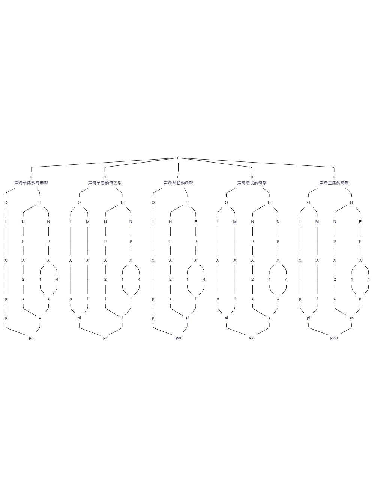
<figcaption>
图
4.3‑12第二个韵素与第二和第三两个调素的联结关系
</figcaption>
</figure>

综述可知，根据这种方法确定质调关系的内容和拼音不是一件轻而易举的事情。

### 两种不同调素论的问题

调素论大致分成等长调素论和不等长调素论两种。不等长调素论要具体些。然而，根据这两种调素论确定质调关系的内容都存在问题。调素论的形成过程和基本内容大致是：

1985 年，瞿霭堂在《汉藏语言调值研究的价值和方法》一文中提出“调素”概念，认为“调素与 mora 的涵义不完全相等，不仅指小于音节的节律特征单位，还是小于音节的受外部因素制约或与外部因素关联的声调构成单位”，“认为在汉藏语言声调和调值研究中有必要像音素的研究一样，确立调素的概念，以及相应的调素的组合、融合、相互影响和制约等等一系列必要的概念和术语”
(瞿霭堂, 1985)。

1991 年，石锋在《北京话的声调格局》一文中虽未使用调素和等长调素这套术语但事实上提出了等长调素论，认为，在一般情况下，研究声调主要考虑的还是音高和时长，即音高随时间的变化；时长构成声调调长；音高的变化范围称为调域；调域可以分出高、中、低的层次，称为调层（调程）；声调音位指一种具体语言的调类；调型指声调音位相同的调值的类型(平均调值曲线)；在一个具体语言中，全部调型在调域空间中形成声调格局。调型段分为调头、调干和调尾，每段时长各占三分之一；调头和调尾与弯头和弯尾不同，弯头和弯尾不属于调型段，是声调之间的过渡段
(石锋, 《北京话的声调格局》, 1991)。作者在这篇文章中不把调头、调干和调尾分析成调素或声调特征；只说每段时长各占三分之一，没说具体理由。

1998 年，林华在《“调素论”及普通话连读变调》一文中明确提出了等长调素论，认为“调素，顾名思义，即最小声调单位；它必须有两个功能，一是表示音高，二是表示音长”；认为“普通话音高可用高调、中调、低调三种调素来表示”；提议“沿用传统生成音系学方法”、“用字母 H、M、L 来分别表示这三种调素”；定义“一个调素的相对时长为所载单位音节的相对时长的三分之一”；证明“一个独立的、单独发出的、未曾发生变调的普通话声调可视为含有三个调素”；把普通话的四个声调记录为“阴平＝ HHH、阳平＝ MHH、上声＝ LLM、去声＝ HML”。作者在这篇文章中只是简单地说构成声调的三个调素等长
(刘俐李, 2004)。根据 HHH ＝[55]、MHH ＝[35]、LLM ＝[214]和 HML ＝[51]可知，在这篇文章中，五度标调法的[3]、[4]两度对应三度标调法的中调(M)，五度标调法与三度标调法的换算关系用等式来表示记成：

$$
\left\{ \begin{matrix}
H & = & \lbrack 5\rbrack \\
M & = & \left\{ \begin{matrix}
\lbrack 4\rbrack \\
\lbrack 3\rbrack
\end{matrix} \right.\  \\
L & = & \left\{ \begin{matrix}
\lbrack 2\rbrack \\
\lbrack 1\rbrack
\end{matrix} \right.\
\end{matrix} \right.
$$

2004 年，刘俐李在《汉语声调论》一书中，针对“等长调素论”只简单规定三个调素等长的问题，提出了“不等长调素论”。在这本专著中，作者认为，普通话的每个声调都由三个调素构成，但构成声调的三个调素地位不等值。理由是：由于声调中有羡余，构成声调的三个调素地位不等值，有必不可少的调素，有羡余调素或带有羡余的调素。因此，“不等长调素”也被称为“不等值调素”。依据是：根据已知测量数据，不论声调的单念时长、必要时长还是最低听阈时长，构成声调的三个调素的时长都不是等长的。因此，可以判定，地位不等的调素，其调长也不会相等。因此，调素分为核心调素和非核心调素。核心调素维持着声调的基本区别度和辨识度，简称调核。非核心调素，附丽于核心调素，参与构成声调，称作调缀。调核和调缀的不等值用调长来区别。两者组调作用不同。调核失落则声调不复存在。调缀失落则不危及声调的存在。不过，在这本专著中，作者声明：调核和调缀的时长比尚需大量细致的数据测量，不等长调素论只是一种假说
(刘俐李, 2004)。

根据《汉语声调论》一书的作者在附录中提供的分析普通话调值的相关材料分析可知，普通话的四个节调，高调阴平是[555]、升调阳平是[345]、低调上声是[214]、降调去声是[541]。强调说明，在《汉语声调论》一书中，在对声调作一般分析时，斜调[541]、[531]、[521]和[51]被合并为[51]，因此，普通话的去声似乎也可只用两个调素来记录、记成[51]。然而，根据作者在这本专著中认同普通话的每个声调都由三个调素构成这个论断可知，普通话的去声不应只用两个调素来记录记成[51]。因此，根据普通话的每个声调都由三个调素构成这个论断，同时根据去声实际调值[51]前段和中段缓降、后段陡降和去声的另外一个条件调值是[53]两个事实，可以确定普通话的去声用三个调素来记录记成[541]。

不等长调素论，只一般地分析声调，没有具体分析构成声调的调素与构成韵母的质素的联结关系。尽管刘俐李在《汉语声调论》一书中不赞成把韵基只分为两个韵素的作法，但并未明确说明普通话韵母究竟应该分为几个韵素，各类韵母的韵素个数是否相等，每个韵素是否都有与其联结的调素。然而，根据声调调型段主要与韵母联结和普通话的每个声调都由三个调素构成这两个前提，推定每个韵素都有与其联结的调素，可以认为，根据不等长调素论，构成声调的调素与构成韵母的质素的联结关系，举例说明，大致如图
4.3‑13 至图 4.3‑16。

<figure>
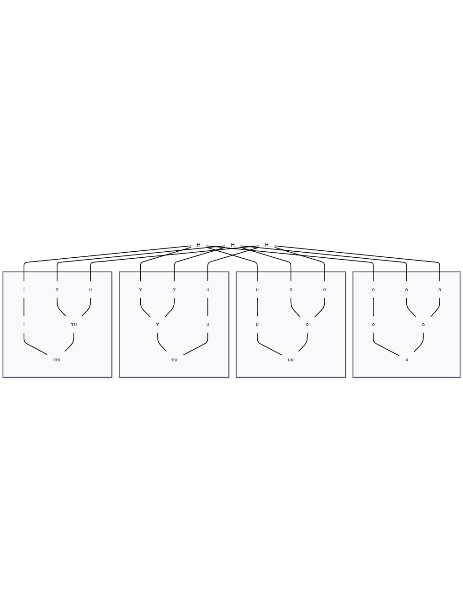
<figcaption>
图 4.3‑13与构成阴平的调素相联结的质素
</figcaption>
</figure>

<figure>
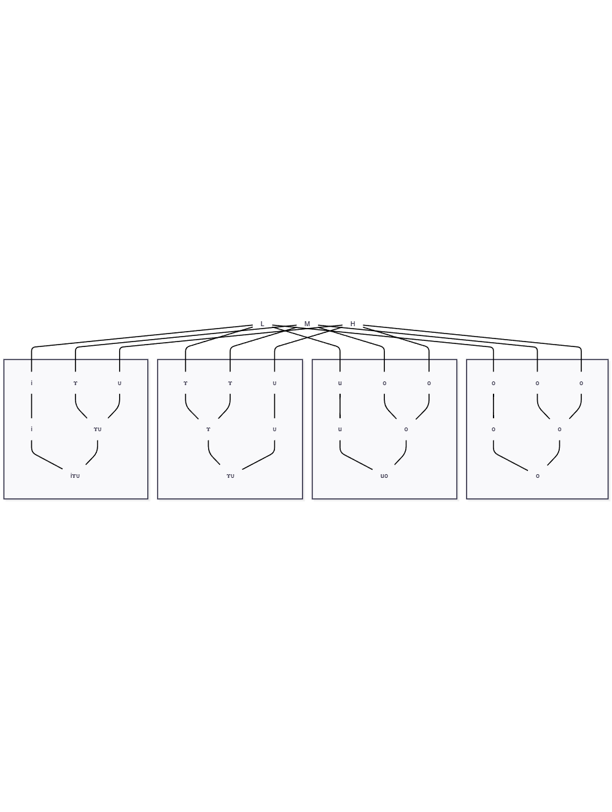
<figcaption>
图 4.3‑14与构成阳平的调素相联结的质素
</figcaption>
</figure>

<figure>
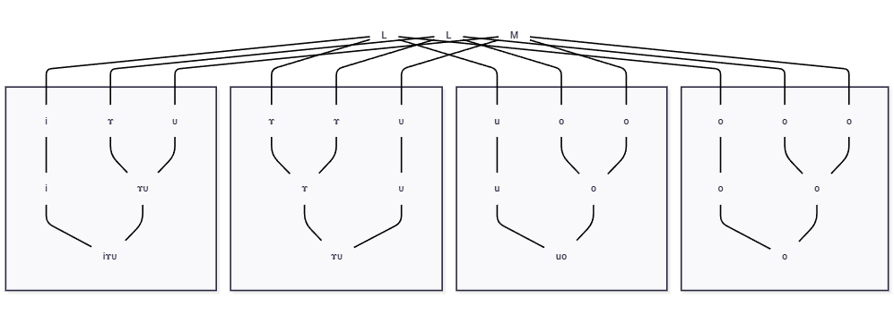
<figcaption>
图 4.3‑15与构成上声的调素相联结的质素
</figcaption>
</figure>

<figure>
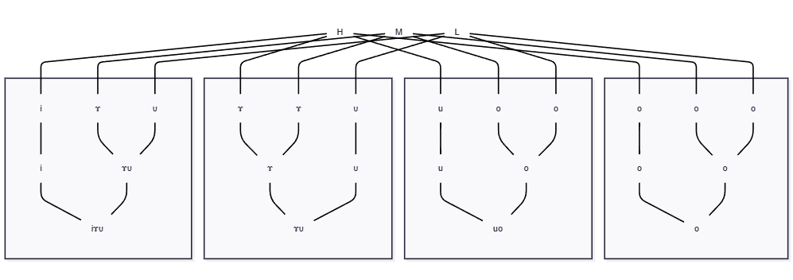
<figcaption>
图 4.3‑16与构成去声的调素相联结的质素
</figcaption>
</figure>

根据不等长调素论，推定每个韵素都有与其联结的调素，调素与质素的联结关系很复杂。这表现在：

一方面，分布在四类韵母中的 o，至少与三类 13 种调值不同的调素序列：HHH、MHH、LLM、HML，HH、LM、ML、MH、LL、HM 和 H、M、L 联结。同理，分布在四类韵母中的 ᴀ 和 ᴇ，也面临同样的问题。同理，分布在四类韵母中的 i 和 u，至少与两类 7 种调值不同的调素序列：HHH、MHH、LLM、HML 和 H、M、L 联结；分布在四类韵母中的 ʏ，至少与两类 6 种调值不同的调素序列：HHH、MHH、LLM、HML 和 H、L 联结。

另方面，根据不等长调素论，还要处理第一和第三两个边缘调素的脱落问题。强调说明，刘俐李在《汉语声调论》一书中没有明确说明构成声调的调素与构成韵母的质素的联结关系，因此，调素与质素的联结关系很复杂这个结论，只是根据不等长调素论推定每个韵素都有与其联结的调素而作出的推论，但每个韵素都有与其联结的调素不一定是不等长调素论的倡导者的观点。

综述可知，根据不等长调素论，调素与质素的联结关系很复杂。可见，根据这种方法确定质调关系的内容和拼音同样也不是一件轻而易举的事情。

综述可知，不论是根据结构音系学、根据经典生成音系学还是根据自主音段音系学的方法确定质调关系的内容，结果都是在干音中唱音的音调很复杂，因而拼音都相当困难。

在干音中唱音的音调很复杂，既不能根据结构音系学的不同说法“声调是贯穿在整个音节中的音高的高低升降”、“声调是贯串在音节中的浊音序列上的音高变化过程”、“声调只依附在韵母上”、“声调由韵负载”、“声调信息主要由主要元音及其过渡携带”、“声调主要依附在音节里的主要元音上”或“声调指的是音节中具有区别意义作用的音高变化”来化简；又不能根据经典生成音系学的“声调是音段的特征”、“声调是韵母的特征”或“声调是音节的特征”等说法来化简；也不能根据自主音段音系学的“声调由两个调素构成”或“声调由三个调素构成”等说法来化简。

在干音中唱音的音调很复杂，是节调质素分析法未曾料到的，是自主音段音系学始料未及的，也是难以处理的。出现这种局面，主要原因约有这样一些：

一、音节的结构和成分是复杂的。音节的音值是连续的，没有经过专门的分析方法训练的人，不能分出哪是声调，哪是声母、哪是韵母，哪是韵母的韵头、哪是韵母的韵腹、哪是韵母的韵尾。在节调质素音节中，声母分成零声母、清非零声母和浊非零声母三类；韵母分成单质韵母、前长韵母、后长韵母和三质韵母四类；节调分为高调阴平、升调阳平、低调上声和降调去声四类；三类声母、四类韵母和四类节调构成 48 种结构类型不同的音节。在这 48 种结构类型不同的音节中，不计零声母，分布着 41 个质素，包含 21 个充当声母的质素和 20 个构成韵母的质素。因此，在音节中，不论是根据结构音系学或经典生成音系学把声调作为一个调值连续的整体来确定质调关系，还是根据自主音段音系学把声调分析成由一个、两个或三个调素构成的调素序列来确定质调关系，要确定这些质素分布在这 48 种结构类型不同的音节中时对应的唱音的音值，可想而知，是相当复杂的。这就决定拼音肯定是相当困难的。

二、析音的方法和理论是粗浅的。结构音系学和经典生成音系学把声调作为一个调值连续的整体来确定质调关系，根本不考虑质素与声调的联结关系的具体细节。汉语自主音段音系学把声调分析成调素序列，多半只是就声调分析声调，不是结合质素序列与声调的联结关系的内容把声调分析成调素序列，没有找到声调究竟是分为两个调素还是三个调素的语音根据，对构成声调的调素与构成韵母的质素的联结关系的分析更是莫衷一是，往往不系统和不彻底。况且，汉语自主音段音系学大都还在为介绍自主音段音系学的方法和理论而忙活，是介绍性的研究，不专门研究现代通用汉语语音，即使有一些针对现代通用汉语语音的分析，但在理论上也远远还没有达到系统而全面分析现代通用汉语语音的高度和深度。

三、方法和理论与传统是脱节的。汉语自主音段音系学，在分析现代通用汉语语音时，或直接搬用自主音段音系学的方法和理论，或在汉语传统语音学基础上简单嫁接自主音段音系学的方法和理论，与汉语传统语音学的方法和理论相对脱节，没有明显和合理的历史和理论演变关系，不能很好体现汉语语音学的传统。

四、对解决困难的认识是不足的。汉语自主音段音系学都不以解决根据节调质素分析拼音面临的拼音困难为目标，都不以寻找简易的拼音方法为宗旨。因此，在汉语中，自主音段音系学对处理构成声调的调素与构成韵母的质素的联结关系的必要性和紧迫性，理论上认识不足，没有认识到，通过处理构成声调的调素与构成韵母的质素的联结关系，正好可以从更深层面上揭示质调关系的复杂性、从更深层面上揭示根据节调质素分析拼音面临的困难的根源，从而为解决根据节调质素分析拼音面临的拼音困难找到新型的途径和方法。

综述可知，尽管结构音系学和经典生成音系学确定质调关系的方法，在一定程度上，被后来的自主音段音系学所否定，然而，即使根据自主音段音系学的方法来确定唱音的音值，结果也是由于唱音的音值相当复杂，导致根据节调质素分析拼音相当困难。因此，只有寻找新的方法和理论，才能解决根据节调质素分析拼音面临的拼音困难。

在提出解决根据节调质素分析拼音面临的拼音困难的方法和理论时，鉴于经典生成音系学和自主音段音系学的析音方法，和汉语语音学的传统方法相对脱节，没有明显和合理的历史和理论演变关系，不能很好体现汉语语音学的传统，因此，为继承汉语语音学的传统，不能直接以这两种尚未完全定型的方法为基础提出解决根据节调质素分析拼音面临的拼音困难的方法和理论，只能在说明过程中使用这两种方法的理论成果，只能直接以节调质素分析法为基础提出解决根据节调质素分析拼音面临的拼音困难的方法和理论。

## 解决问题的方法

在把音节分析成由唱音构成的音列后，由于在干音中唱音的音调很复杂，导致在干音中唱音的音值很复杂。因此，音节的质调关系的内容很复杂。因此，根据唱音的音值拼音很困难。解决这个困难，只有改变音质相同音调不同的唱音至少也有两个、平均约有六到七个、甚至有多达十一个音调不同的音值的复杂状况，简化质调关系，解决根据节调质素分析拼音面临的拼音困难，提出一种更加易学易用的拼音方法。这种方法，不仅要求拼出音节的声调和音质(节调和节质)，而且要求消除由唱音的音值很复杂所导致的拼音困难，具有易学易用的优点。

然而，找出了导致拼音困难的根源不是找到了解决拼音困难的方法。这要首先回答，这个困难在方法上能解决吗？答案是肯定的。

在把音节分析成由唱音构成的音列后，当韵母是三质韵母时，音节被分析成由首音、介音、主音和尾音四个音质各不相同的音段构成的音节，被命名为四质音节。在四质音节中，首音、介音、主音和尾音的音调被简称为首调、呼调、主调和末调，依序指与声母、与韵头、与三质韵母的韵腹和与韵尾相联结的调段。首调不构成对立，不必区分音高差异和确定具体音高。呼调、主调和末调：当节调是高调阴平时是中值为[5]、[5]、[5]的单拍短调；当节调是升调阳平时是中值为[3]、[4]、[5]的单拍短调；当节调是低调上声时是中值为[2]、[1]、[1]的单拍短调；当节调是降调去声时是中值为[5]、[4]、[1]的单拍短调。这就是说，呼调是中值为[5]、[3]或[2]的单拍短调，主调是中值为[5]、[4]或[1]的单拍短调，末调是中值为[5]或[1]的单拍短调。因此，在四质音节中，构成干音的介音、主音和尾音的音调已是最小短调。因而，在四质音节中，构成干音的介音、主音和尾音的音段已是最小音段——片音。因此，在把韵母是三质韵母的音节分析成四质音节后，只要根据唱音分析法拼音，就能解决这类音节根据节调质素分析拼音面临的拼音困难。综述说明，对韵母是三质韵母的音节，只要把与声母、与韵头、与三质韵母的韵腹和与韵尾相联结的调段分析成首调、呼调、主调和末调，把与首调、与呼调、与主调和与末调相联结的音质，也就是说，把声母、韵头、韵腹和韵尾改名为首质、呼质、主质和末质，把由首调与首质、由呼调与呼质、由主调与主质和由末调与末质构成的音段从结构上分析成首音、呼音、主音和末音，把充当首音、呼音、主音或末音的音段分析成片音，确定表示片音的音元，从而把音节分析成音元序列并根据音元的音值拼音，就能解决这类音节根据节调质素分析拼音面临的拼音困难。

在把音节分析成由唱音构成的音列后，当韵母是前长韵母时，音节被分析成由首音、单质间音和尾音构成的音节，被命名为单间音节。在单间音节中，首音、单质间音和尾音的音调，依序被简称为首调、间调和末调，依序指与声母、与充当间质的韵腹和与韵尾相联结的调段。单间音节与四质音节相比，当调类相同时，两类音节的首调和末调都是相同的。然而，单间音节的间调与四质音节的呼调和主调都不相同。在四质音节中，呼调是中值为[5]、[3]或[2]的单拍短调；主调是中值为[5]、[4]或[1]的单拍短调。可是，当调类相同时，单间音节的间调，用拍数来表示调长，当节调是高调阴平时是二拍高调[55]；当节调是升调阳平时是二拍升调[34]；当节调是低调上声时是二拍降调[21]；当节调是降调去声时是二拍降调[54]。因此，在单间音节中，间音的音调不是最小短调——单拍短调。因而，在单间音节中，间音的音值不是最小音值——片音。这种不同正是导致韵母是前长韵母的音节在把音节分析成由唱音构成的音列后仍然面临拼音困难的根源。既是这样，那么，在单间音节中，能不能把间调分析成由呼调和主调构成的序列、并把充当间质的韵腹分析成与呼调联结的间质前段和与主调联结的间质后段(韵腹前段和韵腹后段)两段并依序简称为呼质和主质，使这类音节也和四质音节一样具有相同的结构模型呢？事实上，在单间音节中，当调类相同时，间调与四质音节的由呼调和主调构成的调段相同，因此，在单间音节中，把间调分析成由呼调和主调构成的序列，是有事实根据的。在把间调分析成由呼调和主调构成的序列后，与在四质音节中一样，呼调、主调和末调，当节调是高调阴平时是中值为[5]、[5]、[5]的单拍短调；当节调是升调阳平时是中值为[3]、[4]、[5]的单拍短调；当节调是低调上声时是中值为[2]、[1]、[1]的单拍短调；当节调是降调去声时是中值为[5]、[4]、[1]的单拍短调。这就是说，呼调是中值为[5]、[3]或[2]的单拍短调，主调是中值为[5]、[4]或[1]的单拍短调，末调是中值为[5]或[1]的单拍短调。同时，由于充当间质的韵腹在时间上是始终如一的，因此，把充当间质的韵腹分析成由呼质和主质构成的序列，不会有任何困难和问题。在把间调分析成由呼调和主调构成的序列和把间质分析成由呼质和主质构成的序列后，单间音节和四质音节的结构在模型上是相同的，区别只是：当韵母是三质韵母时，与呼调联结的音质是韵头、与主调联结的音质是韵腹；当韵母是前长韵母时，与呼调联结的音质是间质前段(韵腹前段)、与主调联结的音质是间质后段(韵腹后段)。综述说明，对韵母是前长韵母的音节，只要把与声母、与充当间质的韵腹和与韵尾相联结的调段分析成首调、间调和末调且把间调分析成呼调和主调两段，把与首调、与呼调、与主调和与末调相联结的音质，也就是说，把声母、间质前段、间质后段和韵尾改名为首质、呼质、主质和末质，把由首调与首质、由呼调与呼质、由主调与主质和由末调与末质构成的音段从结构上分析成首音、呼音、主音和末音，把充当首音、呼音、主音或末音的音段分析成片音，确定表示片音的音元，从而把音节分析成音元序列并根据音元的音值拼音，就能解决这类音节根据节调质素分析拼音面临的拼音困难。

在把音节分析成由唱音构成的音列后，当韵母是后长韵母时，音节被分析成由首音、介音和单质韵音构成的音节，被命名为单韵音节。在单韵音节中，首音、介音和单质韵音的音调，依序被简称为首调、呼调和韵调，依序指与声母、与韵头和与充当韵质的韵腹相联结的调段。单韵音节与四质音节相比，当调类相同时，两类音节的首调和呼调都是相同的。然而，单韵音节的韵调与四质音节的主调和末调都不相同。在四质音节中，主调是中值为[5]、[4]或[1]的单拍短调；末调是中值为[5]或[1]的单拍短调。可是，当调类相同时，单韵音节的韵调，用拍数来表示调长，当节调是高调阴平时是二拍高调[55]；当节调是升调阳平时是二拍升调[45]；当节调是低调上声时是二拍低调[11]；当节调是降调去声时是二拍降调[41]。因此，在单韵音节中，构成干音的韵音的音调不是最小短调——单拍短调。因而，在单韵音节中，构成干音的韵音的音值不是最小音值——片音。这种不同正是导致韵母是后长韵母的音节在把音节分析成由唱音构成的音列后仍然面临拼音困难的根源。与在单间音节中类似，在单韵音节中，只要根据当调类相同时韵调与四质音节的由主调和末调构成的调段相同把韵调分析成与四质音节的主调和末调对应相同的两段，只要把充当韵质的韵腹分析成与主调联结的韵质前段和与末调联结的韵质后段(韵腹前段和韵腹后段)两段，这类音节和四质音节的结构在模型上是相同的，区别只是：当韵母是三质韵母时，与主调联结的音质是韵腹、与末调联结的音质是韵尾；当韵母是后长韵母时，与主调联结的音质是韵质前段(韵腹前段)、与末调联结的音质是韵质后段(韵腹后段)。综述说明，对韵母是后长韵母的音节，只要把与声母、与韵头和与充当韵质的韵腹相联结的调段分析成首调、呼调和韵调且把韵调分析成主调和末调两段，把与首调、与呼调、与主调和与末调相联结的音质，也就是说，把声母、韵头、韵质前段和韵质后段改名为首质、呼质、主质和末质，把由首调与首质、由呼调与呼质、由主调与主质和由末调与末质构成的音段从结构上分析成首音、呼音、主音和末音，把充当首音、呼音、主音或末音的音段分析成片音，确定表示片音的音元，从而把音节分析成音元序列并根据音元的音值拼音，就能解决这类音节根据节调质素分析拼音面临的拼音困难。

在把音节分析成由唱音构成的音列后，当韵母是单质韵母时，音节被分析成由首音和单质干音构成的音节，被命名为单干音节。在单干音节中，首音和单质干音的音调，依序被简称为首调和干调，依序指与声母和与充当韵母的韵腹相联结的调段。单干音节与四质音节相比，当调类相同时，两类音节的首调是相同的。然而，单干音节的干调与四质音节的呼调、主调和末调都不相同。在四质音节中，呼调是中值为[5]、[3]或[2]的单拍短调；主调是中值为[5]、[4]或[1]的单拍短调；末调是中值为[5]或[1]的单拍短调。可是，当调类相同时，单干音节的干调，用拍数来表示调长，当节调是高调阴平时是三拍高调[555]；当节调是升调阳平时是三拍升调[345]；当节调是低调上声时是三拍低调[211]；当节调是降调去声时是三拍降调[541]。因此，在单干音节中，充当干音的唱音的音调不是最小短调——单拍短调。因而，在单干音节中，充当干音的唱音的音值不是最小音值——片音。这种不同正是导致韵母是单质韵母的音节在把音节分析成由唱音构成的音列后仍然面临拼音困难的根源。与在单间音节或单韵音节中类似，在单干音节中，只要根据当调类相同时干调与四质音节的由呼调、主调和末调构成的调段相同把干调分析成由呼调、主调和末调构成的序列，只要把充当韵母的韵腹分析成与呼调联结的韵母前段、与主调联结的韵母中段和与末调联结的韵母后段三段，这类音节和四质音节的结构在模型上是相同的，区别只是：当韵母是三质韵母时，与呼调联结的音质是韵头、与主调联结的音质是韵腹、与末调联结的音质是韵尾；当韵母是单质韵母时，与呼调联结的音质是韵母前段(韵腹前段)、与主调联结的音质是韵母中段(韵腹中段)、与末调联结的音质是韵母后段(韵腹后段)。综述说明，对韵母是单质韵母的音节，只要把与声母和与充当韵母的韵腹相联结的调段分析成首调和干调且把干调分析成呼调、主调和末调三段，把与首调、与呼调、与主调和与末调相联结的音质，也就是说，把声母、韵母前段、韵母中段和韵母后段改名为首质、呼质、主质和末质，把由首调与首质、由呼调与呼质、由主调与主质和由末调与末质构成的音段从结构上分析成首音、呼音、主音和末音，把充当首音、呼音、主音或末音的音段分析成片音，确定表示片音的音元，从而把音节分析成音元序列并根据音元的音值拼音，就能解决这类音节根据节调质素分析拼音面临的拼音困难。

在根据质调关系的内容把节调分析成由首调、呼调、主调和末调构成的音调序列和把节质分析成由首质、呼质、主质和末质构成的音质序列后，也就是说，在把节调从模型上分析成首调、呼调、主调和末调四段；并把四质音节的声母、韵头、韵腹和韵尾，把单间音节的声母、与呼调联结的间质前段、与主调联结的间质后段和韵尾，把单韵音节的声母、韵头、与主调联结的韵质前段和与末调联结的韵质后段，把单干音节的声母、与呼调联结的韵母前段、与主调联结的韵母中段和与末调联结的韵母后段从模型上分析成首质、呼质、主质和末质后，与首质、呼质、主质和末质相联结的首调、呼调、主调和末调，都是中值为[5]、[4]、[3]、[2]或[1]的单拍短调。具体地说，与首质联结的首调不构成对立，不必区分音高差异和确定具体音高；与呼质联结的呼调是中值为[5]、[3]或[2]的单拍短调；与主质联结的主调是中值为[5]、[4]或[1]的单拍短调；与末质联结的末调是中值为[5]或[1]的单拍短调。这和同一质素至少与两个、平均与六七个、甚至与多达十一个音调不同的调段相联结；既可能与呼调、主调或末调相联结，也可能与间调、韵调或干调相联结的情形相比；简单得多。

在确定表示片音的音元后，只用 52 个音元就能把任何音节都分析成由音元构成的音节。这种把音节分析成音元序列的方法，就是音元分析法。在经过音元分析后，语音系统被分析成由音元构成的系统，被定名为音元系统。因此，音元分析法又被定义成是把语音系统分析成音元系统的方法，音元系统又被定义成是根据音元分析法构建的语音系统。因此，音元是构成语音系统的元素，语音是由音元构成的系统。

在现代通用汉语中，根据音节分成首音和干音两段和音元分成噪音和乐音两类，首音和干音与噪音和乐音的关系是：首音只由噪音充当，干音只由乐音构成。首音有虚有实，不计虚首音，只计实首音，充当首音的噪音共有 21 个。构成干音的乐音分成高调乐音、中调乐音和低调乐音三类，每类各有 10 个，累计共有 30 个。累计可得，构成音节的音元共有 51 个。

充当首音的 21 个噪音是：p、pʰ、f、m，t、tʰ、l、n，k、kʰ、x，ʦ、ʦʰ、s，ꭧ、ꭧʰ、ʂ、ɻ 和 ʨ、ʨʰ、ɕ，依序表示噪音[p]、[pʰ]、[f]、[m]，[t]、[tʰ]、[l]、[n]，[k]、[kʰ]、[x]，[ʦ]、[ʦʰ]、[s]，[ꭧ]、[ꭧʰ]、[ʂ]、[ɻ]和[ʨ]、[ʨʰ]、[ɕ]，依序对应《汉语拼音方案》21 个声母。构成干音的 30 个乐音是：高调乐音 10 个：󰌠、󰌪、󰌴、󰍵、󰎄、󰌾、󰍒、󰍡、󰎓 和 󰎘；中调乐音 10 个：󰌡、󰌫、󰌵、󰍶、󰎅、󰌿、󰍓、󰍢、󰎔 和 󰎙；低调乐音 10 个：󰌤、󰌮、󰌸、󰍹、󰎈、󰍂、󰍖、󰍥、󰎗 和 󰎜。

这套音元，如果进一步用 󰌠 来表示 󰌠 和 󰍵、用 󰌡 来表示 󰌡 和 󰍶、用 󰌤 来表示 󰌤 和 󰍹，那么，乐音只有 27 个，音元只有 48 个；如果进一步用 󰍦 来表示 󰍒 和 󰍡、用 󰍧 来表示 󰍓 和 󰍢、用 󰍪 来表示 󰍖 和 󰍥，那么，乐音只有 24 个，音元只有 45 个；如果进一步通过增加几条规则把构成干音的音元 󰎅、󰎔 和 󰎙 省略，那么，乐音只有 21 个，音元只有 42 个。这就是说，在现代通用汉语中，如果计入虚首音，那么，音元系统至少由 42 个音元、至多由 52 个音元构成；如果不计虚首音，那么，音元系统至少由 42 个音元、至多由 51 个音元构成。

根据音元分析拼音就是根据音元序列拼音。由于音元是用来表示片音的变元，根据音元序列拼音，只要根据由音元所表示的片音拼音，就能较逼真地拼出音节的音值，包括拼出音节的声调和音质(节调和节质)。在音元系统中，一般地说，每个音元的音高都表示节调的一段音调，换句话说，节调被一段段地分析成构成音节的每个音元的音高，因此，节调用构成音节的每个音元的音高来表示；重要和特别的是，音元的音高特征，和音质特征一样，也是音元的区别特征。因此，在音元系统中，音节既能表示音节的音质又能表示音节的声调。因此，根据音元序列拼音，不仅能够拼出音节的音质而且能够拼出音节的声调从而拼出音节的音值。

综述说明，提出一种易学易用的拼音方法是完全可行的。只要，在深入、具体、全面和系统地分析根据节调质素分析拼音面临的困难的成因和状况后，针对根据节调质素分析拼音面临的困难，根据汉语音义关系的特征，根据音元分析拼音，就能实现这个目标。

# 音元分析法

音元分析法是把音节分析成音元序列的方法。把音节切分成片音序列并且确定表示片音的音元从而把音节分析成音元序列，这种把音节分析成音元序列的方法，被定名为音元分析法。

语音是由音元构成的系统。在经过音元分析后，语音系统被分析成由音元构成的系统，被定名为音元系统。因此，音元分析法又被定义成是把语音系统分析成音元系统的方法，音元系统又被定义成是根据音元分析法构建的语音系统。任何一个具体语言，不论它是不是存在声调对立，不论它是不是存在长短对立，不论它是不是存在强弱对立，即使它确实只存在音质对立，都能根据音元分析法把它的语音系统分析成音元系统。因此，音元是构成语音系统的元素，语音是由音元构成的系统。

音节是由音元构成的音列。在经过音元分析后，音节被分析成音元序列。因此，与在音位系统中音节由调位与质位序列构成其中质位序列由质位构成这种二维结构形式的音节不同，在音元系统中，音节是由音元构成的音列。这种一维结构形式的音节，被简称为音元音节。相对应地，在音位系统中，由音位构成的音节被简称为音位音节。

片音是能单发的最小短音。在人类语言中，片音是根据一组决定音段的最小音高、最小音强、最小音长和最小音质的差异的发音特征切出的最小音段。片音分析法是把语音切分成片音序列的方法。在根据片音分析法析音时，对存在长短对立而其它特征都不构成对立的音段，短音已是片音、无需再作分析，长音被分析成由至少两个相同的片音构成的音列。对不存在长短对立而实际音长较长和最长的长音，当需要从结构上表示这类音段的相对音长时，把较长的长音分析成由两个相同的片音构成的音列，把最长的长音分析成由三个相同的片音构成的音列。因此，在片音分析法中，片音都是最小短音。在计量音长时，拍是计量音长的单位。最小短音特指既能单独发出又能单独听到的长度只有一拍的音段，也就是说，最小短音就是单拍音段。长音是长度计有两拍或三拍的音段，分为二拍长音和三拍长音。因此，片音是根据一组决定音段的最小音高、最小音强、最小音长和最小音质的差异的发音特征切出的最小音段。简单地说，片音是能单发的最小短音。

在现代通用汉语中，片音是根据一组决定音段的最小音高和最小音质的差异的发音特征切出的最小音段。在现代通用汉语中，音节的音调差异和音质差异都构成对立，音节的音强差异和音长差异都不构成对立，因此，在切分片音时，一般地说，必须区分片音的音高差异和音质差异、不必区分片音的音强差异和音长差异，把片音分析成具有默认的音强和默认的音长、确定的音高和确定的音质的最小音段。具体地说，在现代通用汉语中，根据音节的音调差异和音质差异都构成对立，在把音节切分成片音序列时，既要区分片音的音高特征，又要区分片音的音质特征。因此，在现代通用汉语中，根据片音分析法，一般地说，两个不同的片音，或是两个音高和音质都不同的片音，或是两个音高相同而音质不同的片音，或是两个音高不同而音质相同的片音。

片音是比音素还小的音段。片音与音素不同。在音素分析法中，音素既有长音也有短音。当音素是短音时，在片音分析法中，一个短音的音高存在几种构成对立的差异就被分析成几个音高不同的片音，一个短音的音强存在几种构成对立的差异就被分析成几个音强不同的片音。当音素是长音时，在片音分析法中，把较长的长音分析成由两个相同的片音构成的音列，把最长的长音分析成由三个相同的片音构成的音列。因此，片音是充当或构成音素的音质、音高或音强不同的短音。片音和音素的关系是：当音素是短音时，短音由音质、音高或音强不同的片音充当；当音素是长音时，长音至少由两个音质、音高和音强都相同的片音构成；片音是充当短音或构成长音的音段。因此，片音，作为充当或构成音素的音质、音高或音强不同的短音，是构成语音的比只区分音质差异不区分音高差异、音强差异和音长差异的音素更基本的音段。简单地说，片音是比音素还小的音段。

在确定表示片音的音元时，片音分布是确定表示片音的音元的基本依据。片音分布是各个片音出现在不同的环境中的总况，在汉语中就是各个片音散布在哪些音节的哪些位置上的总况。根据分布环境是否相同，片音分布分成并立分布和互补分布两种情形。并立分布是指不同片音共同出现在相同的环境中的情形。互补分布是指不同片音分别出现在不同的环境中的情形。在确定表示片音的音元时，根据是否构成对立确定表示并立分布的片音的音元，根据递相置换是否呈现趋同态势确定表示互补分布的片音的音元。换句话说，并立分布的片音是否构成对立、互补分布的片音递相置换是否呈现趋同态势，是用一个音元来表示分布在不同环境中的不同片音的基本依据。另外，在确定表示片音的音元时，通常还要满足尽量保持音元系统的系统性、尽量减少音元系统的音元数和尽量保持音元的历史继承性等要求。

在确定表示片音的音元时，根据是否构成对立确定表示并立分布的片音的音元。并立分布的片音，根据是否构成对立，分为互相对立的片音和互不对立的片音两类。互相对立的片音通常各用一个音元来表示。互不对立的片音通常共用一个音元来表示。当互相对立的并立分布的片音各用一个音元来表示时，一个音元表示一个片音，每个音元表示的片音都是它的条件片音。当互不对立的并立分布的片音共用一个音元来表示时，一个音元表示多个片音，这个音元表示的每个片音都是它的一个习惯片音。

在确定表示片音的音元时，根据递相置换是否呈现趋同态势确定表示互补分布的片音的音元。互补分布的片音，通常既不能各用一个音元来表示，也不能共用一个音元来表示。互补分布的片音，根据递相置换是否呈现趋同态势，分为递相置换呈现趋同态势的片音和递相置换保持音值独立的片音两类。因此，通常根据递相置换是否呈现趋同态势确定表示互补分布的片音的音元。一般地说，递相置换呈现趋同态势的片音通常共用一个音元来表示；递相置换保持音值独立的片音通常各用一个音元来表示。当递相置换呈现趋同态势的互补分布的片音共用一个音元来表示时，一个音元表示多个片音，每个片音都是表示它们的同一音元的一个条件片音。当递相置换保持音值独立的互补分布的片音各用一个音元来表示时，一个音元表示一个片音，每个音元表示的片音都是它的条件片音。

置换呈现趋同态势是指，在两个互补分布的片音中，把某一片音置换到另一片音的环境中构造一个虚拟的音节，根据这个虚拟的音节拼音，都发生这个片音受到另一片音的分布环境的制约而被同化为另一片音的情况或趋势，由使用母语的人来听辨，都认为虚拟的音节和实际的音节相同、听起来不失真，都会把虚拟的音节和实际的音节辨认成同一音节。递相置换呈现趋同态势是指，在互补分布的片音中，根据在置换后是否呈现趋同态势编号，出现片音一与片音二、片音二与片音三，依次类推，在置换后呈现趋同态势的情况。

置换保持音值独立是指，在两个互补分布的片音中，把任一片音置换到另一片音的环境中构造一个虚拟的音节，根据这个虚拟的音节拼音，不发生这个片音受到另一片音的分布环境的制约而被同化为另一片音的情况或趋势，由使用母语的人来听辨，都认为虚拟的音节和实际的音节不同、听起来已失真，都不把虚拟的音节和实际的音节辨认成同一音节。递相置换保持音值独立是指，在互补分布的片音中，根据在置换后是否保持音值独立编号，出现片音一与片音二、片音二与片音三，依次类推，在置换后保持音值独立的情况。

在互补分布的片音中，一般地说，递相置换呈现趋同态势的片音通常共用一个音元来表示。然而，那些因不满足尽量保持音元系统的系统性的要求而不宜共用一个音元来表示的互补分布的片音、那些因不满足尽量减少音元系统的音元数的要求而不能共用一个音元来表示的互补分布的片音、那些因不满足尽量保持音元的历史继承性的要求而不宜共用一个音元来表示的互补分布的片音，即使是置换呈现趋同态势的，通常也不能共用一个音元来表示，往往各用一个音元来表示。

在互补分布的片音中，一般地说，递相置换保持音值独立的片音通常各用一个音元来表示。然而，那些因其满足尽量保持音元系统的系统性的要求而能够共用一个音元来表示的互补分布的片音、那些因其满足尽量减少音元系统的音元数的要求而能够共用一个音元来表示的互补分布的片音、那些因其满足尽量保持音元的历史继承性的要求而能够共用一个音元来表示的互补分布的片音，即使是置换保持音值独立的，通常也不能各用一个音元来表示，往往共用一个音元来表示。

乐音音元具有音高和音质两个区别特征。在现代通用汉语中，有些音元只有音质差异构成对立，被划分为噪音；有些音元的音高差异和音质差异都构成对立，被划分为乐音；因此，在音元系统中，乐音音元的音高特征和音质特征都是音元的区别特征。

音元是表示分布在特定环境中的特定片音的变元。在音元系统中，同元音集是由同一音元所表示的分布在不同环境中的不同片音构成的音集。一个音元对应一个同元音集。当一个音元对应的同元音集至少含有两个习惯片音时，这个音元，不受分布条件制约，可以根据特定的发音习惯从与其对应的同元音集中选择特定习惯片音。当一个音元对应的同元音集至少含有两个条件片音时，这个音元，因受分布条件制约，只能根据自身的分布环境从与其对应的同元音集中选择特定条件片音。当一个音元对应的同元音集只有一个片音时，把这个片音从形式上分析成条件片音；当一个音元对应的同元音集至少含有两个习惯片音时，把每个习惯片音都分析成是由特定的发音习惯确定的特殊条件片音；针对每个音元，都有由一个音元所表示的不同片音都是这个音元的条件片音。因此，片音是分布在特定环境中的特定音元所取的音值，简单地说，片音是音元的音值，因此，拼音是一个逐个代入音元的音值即逐个用片音来给音元赋值的过程；具体地说，拼音是一个逐个从每个音元对应的同元音集中选取由各个音元的分布环境确定的特定片音并用所取片音来给对应的音元赋值的过程。因此，音元是用来根据它的分布环境从它对应的同元音集中选取特定片音的变元。简单地说，音元是用来表示片音的变元。

音元分析法是已有析音法的继承和发展。一方面，它继承了已有析音法的成果。在已有析音法中，两段二分法是结构形式最简单的析音法，一调二质分析法继承了两段二分法的成果，一调三质分析法继承了一调二质分析法的成果，节调质素分析法继承了一调三质分析法的成果，音元分析法继承了节调质素分析法的成果，因此，音元分析法继承了已有析音法的成果。另方面，它是已有析音法的发展。音元分析法，与两段二分法、一调二质分析法、一调三质分析法和节调质素分析法不同，它把音节分析成音元序列。因此，在音元系统中，音节的结构，与已有析音法的音节结构相比，都不相同。这种不同是符合语音事实的，只不过是分析深度比已有析音法的深度更深一些，是已有析音法的发展。因此，音元分析法是已有析音法的继承和发展。

音元分析法是第五代析音法。音元分析法是已有析音法的继承和发展。音元分析法与已有析音法都不相同。因此，音元分析法是一种新型的析音法。已有析音法分成第一代析音法、第二代析音法、第三代析音法和第四代析音法四代。第四代析音法是节调质素分析法。因此，音元分析法的形成，标志已有析音法已演变成新一代的析音法——第五代析音法。因此，音元分析法是第五代析音法。

## 划分首音和干音

在把音节分析成由节调与构成节质的质素序列构成的音节后，根据音元分析法析音，就是把由节调与构成节质的质素序列构成的音节分析成音元序列。这有两种方式：一是分段把音节分析成音元序列。二是分类把音节分析成音元序列。前一方式较易说明。后一方式较难说明。

分段把音节分析成音元序列的过程，分成三个阶段：首先，划分音节的首音和干音；然后，确定充当首音的音元和构成干音的音元；最后，把充当首音的音元和构成干音的音元按时序排列成音元序列。

划分音节的首音和干音的过程，分成两步：

第一步，划分首调和干调。这一步，具体内容是：划分与声母和与韵母相联结的调段，并把析出的两个调段命名为首调和干调。在节调质素音节中，根据节质由声母和韵母构成可知，节调由与声母联结的调段和与韵母联结的调段构成。根据首干二分法可知，与声母联结的调段是首音的音调，与韵母联结的调段是干音的音调。因此，把首音的音调和干音的音调简称为首调和干调，首调是与声母联结的调段，干调是与韵母联结的调段。因此，节调分成首调和干调两段。

在析出了首调和干调后，音节记成：

$$
音节 = \left\{ \begin{matrix}
\begin{bmatrix}
首调 & \begin{matrix}
干 &&&&&& 调
\end{matrix} \\
声母 & \begin{matrix}
韵 &&&&&& 腹
\end{matrix}
\end{bmatrix}， & 当韵母是单质韵母时 \\[12pt]
\begin{bmatrix}
首调 & \begin{matrix}
干 &&&&&& 调
\end{matrix} \\
声母 & \begin{matrix}
\begin{matrix}
韵 &&& 腹
\end{matrix} & 韵尾
\end{matrix}
\end{bmatrix}， & 当韵母是前长韵母时 \\[12pt]
\begin{bmatrix}
首调 & \begin{matrix}
干 &&&&&& 调
\end{matrix} \\
声母 & \begin{matrix}
韵头 & \begin{matrix}
韵 &&& 腹
\end{matrix}
\end{matrix}
\end{bmatrix}， & 当韵母是后长韵母时 \\[12pt]
\begin{bmatrix}
\begin{matrix}
首调 & \begin{matrix}
干 &&&&&& 调
\end{matrix}
\end{matrix} \\
\begin{matrix}
声母 & 韵头 & 韵腹 & 韵尾
\end{matrix}
\end{bmatrix}， & 当韵母是三质韵母时
\end{matrix} \right.
$$

根据音节由节调与节质构成且节质由声母和韵母构成和节调由首调和干调构成，音节记成：

$$
音节 = \begin{bmatrix}
\begin{matrix}
首调
\end{matrix} & \begin{matrix}
干调
\end{matrix} \\
\begin{matrix}
声母
\end{matrix} & \begin{matrix}
韵母
\end{matrix}
\end{bmatrix}
$$

第二步，划分音节的首音和干音。根据音节由节调与节质构成且节质由声母和韵母构成和节调由首调和干调构成，把由首调与声母构成的音段分析成首音，把由干调与韵母构成的音段分析成干音，音节由首音和干音构成。

在切出了首音和干音后，根据音节由首音和干音构成，音节记成：

$$
音节 = \begin{bmatrix}
首音 & 干音
\end{bmatrix}
$$

在切出了首音和干音后，根据首音由首调与声母构成，首音记成：

$$
首音 = \begin{bmatrix}
首调 \\
\begin{matrix}
声母
\end{matrix}
\end{bmatrix}
$$

在切出了首音和干音后，根据干音由干调与韵母构成，干音记成：

$$
干音 = \begin{bmatrix}
干调 \\
\begin{matrix}
韵母
\end{matrix}
\end{bmatrix}
$$

在干音中，根据韵母分成单质韵母、前长韵母、后长韵母和三质韵母四类，韵母记成：

$$
韵母 = \left\{ \begin{matrix}
\begin{bmatrix}
韵 &&&&&& 腹
\end{bmatrix}， & 当韵母是单质韵母时 \\[12pt]
\begin{bmatrix}
\begin{matrix}
韵 &&& 腹
\end{matrix} & 韵尾
\end{bmatrix}， & 当韵母是前长韵母时 \\[12pt]
\begin{bmatrix}
韵头 & \begin{matrix}
韵 &&& 腹
\end{matrix}
\end{bmatrix}， & 当韵母是后长韵母时 \\[12pt]
\begin{bmatrix}
韵头 & 韵腹 & 韵尾
\end{bmatrix}， & 当韵母是三质韵母时
\end{matrix} \right.
$$

在干音中，根据韵母分成单质韵母、前长韵母、后长韵母和三质韵母四类，干音分成单质干音、前长干音、后长干音和三质干音四类。单质干音由干调与单质韵母构成。前长干音由干调与前长韵母构成。后长干音由干调与后长韵母构成。三质干音由干调与三质韵母构成。

根据干音分成单质干音、前长干音、后长干音和三质干音四类，干音记成：

$$
干音 = \left\{ \begin{matrix}
\begin{bmatrix}
干 &&&&&& 调 \\
韵 &&&&&& 腹
\end{bmatrix}， & 当干音是单质干音时 \\[12pt]
\begin{bmatrix}
\begin{matrix}
干 &&&&&& 调\end{matrix} \\
\begin{matrix}
韵&&&腹 & 韵尾
\end{matrix}
\end{bmatrix}， & 当干音是前长干音时 \\[12pt]
\begin{bmatrix}
\begin{matrix}
干 &&&&&& 调\end{matrix} \\
\begin{matrix}
韵头 &韵 &&& 腹
\end{matrix}
\end{bmatrix}， & 当干音是后长干音时 \\[12pt]
\begin{bmatrix}
\begin{matrix}
干 &&&&&& 调\end{matrix} \\
\begin{matrix}
韵头 & 韵腹 & 韵尾
\end{matrix}
\end{bmatrix}， & 当干音是三质干音时
\end{matrix} \right.
$$

根据音元分析法析音，在切出了首音和干音后，就是确定充当首音的音元和构成干音的音元并且把充当首音的音元和构成干音的音元按时序排列成音元序列。确定充当首音的音元，就是切分充当首音的片音和确定表示片音的音元。确定构成干音的音元，在把干音划分成单质干音、前长干音、后长干音和三质干音四类后，就是分别根据质调关系的内容把单质干音、前长干音、后长干音和三质干音分析成由音元构成的序列。

## 充当首音的音元

在析出了首调和干调后，首音由首调与声母构成。在切出了首音和干音后，首音是音节的除干音外的音段。首音的音调被简称为首调，指与声母联结的调段。首音的音质被简称为首质，指声母。在首音中，首调已是单拍短调；声母已是与短调联结的质素；都不用继续分解。因此，确定充当首音的音元，就是切分充当首音的片音和确定表示片音的音元。

首音根据有无是否构成对立分成实首音和虚首音两类。实首音的有无通常构成对立。虚首音的有无不构成对立。实首音由首调与非零声母构成。实首音的区别特征由实首音的音质决定，也就是说，实首音的区别特征由非零声母决定，换句话说，实首音的区别特征就是非零声母的区别特征。虚首音由首调与零声母构成。虚首音的音调和音质的有无都不构成对立。

首音分成清首音和浊首音两类。在虚首音中，清音只有清声门塞音[ʔ]。清声门塞音[ʔ]和浊软腭擦音[ɣ]可以自由替换，换句话说，清声门塞音[ʔ]和浊软腭擦音[ɣ]是同属一个首音的两个互不对立的并立分布的习惯片音，因此，把浊音[ɣ]和清音[ʔ]归纳为浊首音 ɣ，虚首音都是浊音。因此，在把首音分成清首音和浊首音两类时，一般地说，不必把虚首音划分成清首音和浊首音两类。

在实首音中，清首音由首调与清声母构成。清首音记成：

$$
清首音 = \begin{bmatrix}
首调 \\
清声母
\end{bmatrix}
$$

在清首音中，由于清声母的发音特征是声带不振动，与声母联结的调段是零，也就是说，清首音的音调——首调是零。因此，在实首音中，清首音就是清声母，就是充当声母的清辅音。清声母共有 17 个：p、pʰ、f、ts、tsʰ、s、t、tʰ、ꭧ、ꭧʰ、ʂ、ʨ、ʨʰ、ɕ、k、kʰ 和 x。因此，在实首音中，清实首音共有 17 个：p、pʰ、f、ts、tsʰ、s、t、tʰ、ꭧ、ꭧʰ、ʂ、ʨ、ʨʰ、ɕ、k、kʰ 和 x。

清首音和清声母音值相同。清首音由首调与清声母构成。清首音包括清首音的音调和音质，但由于清首音的音调是零，在音值上，清首音事实上是清声母。清声母，仅指清首音的音质，不包括清首音的音调，但因清首音的音调是零，因此，从音值上分析，清声母事实上是清首音。

在实首音中，浊首音由首调与浊声母构成。浊首音记成：

$$
浊首音 = \begin{bmatrix}
首调 \\
浊声母
\end{bmatrix}
$$

在浊首音中，由于浊声母的发音特征是声带振动，与声母联结的调段非零，也就是说，浊首音的音调——首调非零。具体地说，浊首音的音调就是与浊声母联结的调段，调值随调类不同而不尽相同、具有一定的音调。然而，不论首音清浊，首音的音调都不是首音的区别特征且都与首音的音质相对独立，因此，简单地说，浊首音的音调受干音的音调制约，由干音的音调逆同化动态确定。因此，在音节中，不论首音清浊，通常都不必具体确定首音的首调。因此，在实首音中，浊首音就是浊声母，就是充当声母的浊辅音。浊声母共有 4 个：[m]、[n]、[l]和[ɻ]。因此，在实首音中，浊首音共有 4 个：[m]、[n]、[l]和[ɻ]。

浊首音和浊声母音值相同。浊首音的音调非零；但因浊首音的音调不是区别特征，一般不必区分浊首音的音调的差异。然而，在析出节调后，浊声母仅含浊首音的音质，不含浊首音的音调，因此，从音值上分析，浊声母事实上不等于浊首音。但因浊首音的音调差异不是浊首音的区别特征，只有音质即声母是浊首音的区别特征，因此，浊声母就是浊首音。这就是说，浊首音，在音值上包括浊首音的音调和音质，不等于浊声母，但根据它的音调不是区别特征进行分析就是浊声母。

在首音中，虚首音由首调与零声母构成。虚首音记成：

$$
虚首音 = \begin{bmatrix}
首调 \\
零声母
\end{bmatrix}
$$

在现代通用汉语中，从音值上分析，零声母和非零声母一样也是实际存在的声母。零声母的音值不是零。在开口呼韵母前，零声母往往是一个比较轻微的清声门塞音[ʔ]或浊软腭擦音[ɣ]。在齐齿呼、合口呼和撮口呼韵母前，零声母往往是一个分别与韵头或韵母 i[i]、u[u]、ü[ʏ]同部位的[j]、[w]、[ɥ]
(林焘、王理嘉, 1992, 页 106)。因此，从音值上分析，零声母和非零声母一样也是实际存在的声母。零声母在语流中具有确定音节界限的作用，这也是零声母是实际存在的声母的证据。零声母[ʔ]和[ɣ]可以自由替换，换句话说，清声门塞音[ʔ]和浊软腭擦音[ɣ]是同属一个声母的两个互不对立的并立分布的习惯变体，因此，把浊音[ɣ]和清音[ʔ]归纳为一个浊声母 ɣ，零声母都是浊声母。因此，虚首音的音调不是零，因而，由虚首音的音调与零声母构成的虚首音的音值不是零。因此，在确定虚首音时，虚首音的音调，可按确定实首音的音调的方法确定，因而虚首音的音值可按确定实首音的音值的方法确定。

虚首音从形式上分析是零。尽管零声母音值非零，然而当零声母是零时，音节的意义并不发生改变，因而，零声母，不是虚首音的区别特征。因此，在析音时，一般不考虑零声母的实际音质、把零声母从形式上分析成零。由于音高不能完全脱离音质而存在，把零声母从形式上分析成零，必然把虚首音的音调从形式上分析成零。因此，在把零声母从形式上分析成零和把虚首音的音调从形式上分析成零后，虚首音从形式上分析是零。

虚首音和零声母音值相同。抽象地说，根据零声母从形式上分析是零和虚首音从形式上分析是零可知，虚首音就是零声母。具体地说，在把浊音[ɣ]和清音[ʔ]归纳为浊首音 ɣ 的情况下，虚首音都是浊音、音调非零；但因虚首音的音调不是区别特征，一般不必区分虚首音的音调的差异；从音值上分析，虚首音包括虚首音的音调和音质，不等于零声母。在析出节调后，零声母仅含虚首音的音质，不含虚首音的音调，因此，零声母不等于虚首音。然而，因虚首音的音调差异和音质差异都不是虚首音的区别特征，因此，虚首音就是零声母。

综述可知，根据首音分成实首音和虚首音两类和首音分成清首音和浊首音两类，清实首音共有 17 个。清实首音与清声母一一对应。浊实首音共有 4 个。浊实首音与浊声母一一对应。因此，实首音共有 21 个：p、pʰ、f、m，t、tʰ、l、n，k、kʰ、x，ʦ、ʦʰ、s，ꭧ、ꭧʰ、ʂ、ɻ 和 ʨ、ʨʰ、ɕ。虚首音与零声母一一对应。虚首音因其有无不构成对立而在析音和记音时常被省略。然而，虚首音在语流中具有确定音节界限的作用，不是可有可无的，而是必不可少的，因此，虚首音在语流中不能省略。

综述可知，尽管首音和声母一一对应，尽管声母实际上就是首音。然而，首音和声母含义不同。在首音中，实首音由首调与非零声母构成，非零声母仅指实首音的音质，不含实首音的音调。况且，严格地说，在首音中，浊首音，具有一定的音调，在音值上不全等于浊声母。

在切分充当首音的片音和确定表示片音的音元时，一般地说，一个首音就是一个音元。实首音共有 21 个。虚首音因其有无不构成对立而在析音和记音时常被省略，通常不算一个首音；若考虑其实际音值，既可各算一个首音，也可合算一个首音。

综述说明，确定充当首音的音元，就是切分充当首音的片音和确定表示片音的音元。

## 构成干音的音元

在析出了首调和干调后，干音由干调与韵母构成。在切出了首音和干音后，干音是音节的除首音外的音段。干音的音调被简称为干调，指与韵母联结的调段。干音的音质被简称为干质，指韵母。这就是说，韵母是干音的音质。

干音根据干调和质位、根据干调和质素、根据《汉语拼音方案》三种方式记音的对应关系列表见表
5.3‑1。

<table>
<caption>
表
5.3‑1干音根据质位、质素和《汉语拼音方案》记音的对应关系
</caption>
<colgroup>
<col style="width: 5%" />
<col style="width: 7%" />
<col style="width: 6%" />
<col style="width: 6%" />
<col style="width: 7%" />
<col style="width: 6%" />
<col style="width: 9%" />
<col style="width: 9%" />
<col style="width: 10%" />
<col style="width: 9%" />
<col style="width: 5%" />
<col style="width: 5%" />
<col style="width: 5%" />
<col style="width: 5%" />
</colgroup>
<thead>
<tr>
<th colspan="2">记音方式</th>
<th colspan="4">根据干调和质位记音</th>
<th colspan="4">根据干调和质素记音</th>
<th colspan="4">《汉语拼音方案》</th>
</tr>
<tr>
<th>分类</th>
<th style="text-align: right;">
干调

韵母
</th>
<th>阴平</th>
<th>阳平</th>
<th>上声</th>
<th>去声</th>
<th>阴平</th>
<th>阳平</th>
<th>上声</th>
<th>去声</th>
<th>阴平</th>
<th>阳平</th>
<th>上声</th>
<th>去声</th>
</tr>
</thead>
<tbody>
<tr>
<td rowspan="12">单质干音</td>
<td>i</td>
<td>i⁵⁵</td>
<td>i³⁵</td>
<td>i²¹¹</td>
<td>i⁵¹</td>
<td>[i⁵⁵]</td>
<td>[i³⁵]</td>
<td>[i²¹¹]</td>
<td>[i⁵¹]</td>
<td>󰌡</td>
<td>󰌠</td>
<td>ǐ</td>
<td>󰌤</td>
</tr>
<tr>
<td>u</td>
<td>u⁵⁵</td>
<td>u³⁵</td>
<td>u²¹¹</td>
<td>u⁵¹</td>
<td>[u⁵⁵]</td>
<td>[u³⁵]</td>
<td>[u²¹¹]</td>
<td>[u⁵¹]</td>
<td>󰉔</td>
<td>󰉕</td>
<td>󰉖</td>
<td>󰉗</td>
</tr>
<tr>
<td>ʏ</td>
<td>ʏ⁵⁵</td>
<td>ʏ³⁵</td>
<td>ʏ²¹¹</td>
<td>ʏ⁵¹</td>
<td>[ʏ⁵⁵]</td>
<td>[ʏ³⁵]</td>
<td>[ʏ²¹¹]</td>
<td>[ʏ⁵¹]</td>
<td>󰉘</td>
<td>󰉙</td>
<td>󰉚</td>
<td>󰉛</td>
</tr>
<tr>
<td>ᴀ</td>
<td>ᴀ⁵⁵</td>
<td>ᴀ³⁵</td>
<td>ᴀ²¹¹</td>
<td>ᴀ⁵¹</td>
<td>[ᴀ⁵⁵]</td>
<td>[ᴀ³⁵]</td>
<td>[ᴀ²¹¹]</td>
<td>[ᴀ⁵¹]</td>
<td>󰉜</td>
<td>󰉝</td>
<td>󰉞</td>
<td>󰉟</td>
</tr>
<tr>
<td rowspan="2">o</td>
<td rowspan="2">o⁵⁵</td>
<td rowspan="2">o³⁵</td>
<td rowspan="2">o²¹¹</td>
<td rowspan="2">o⁵¹</td>
<td>[o⁵⁵]</td>
<td>[o³⁵]</td>
<td>[o²¹¹]</td>
<td>[o⁵¹]</td>
<td>󰉠</td>
<td>󰉡</td>
<td>󰉢</td>
<td>󰉣</td>
</tr>
<tr>
<td>[ɤ⁵⁵]</td>
<td>[ɤ³⁵]</td>
<td>[ɤ²¹¹]</td>
<td>[ɤ⁵¹]</td>
<td>󰍧</td>
<td>󰍦</td>
<td>ě</td>
<td>󰍪</td>
</tr>
<tr>
<td>ᴇ</td>
<td>ᴇ⁵⁵</td>
<td>ᴇ³⁵</td>
<td>ᴇ²¹¹</td>
<td>ᴇ⁵¹</td>
<td>[ᴇ⁵⁵]</td>
<td>[ᴇ³⁵]</td>
<td>[ᴇ²¹¹]</td>
<td>[ᴇ⁵¹]</td>
<td>󰉨</td>
<td>ế</td>
<td>󰉪</td>
<td>ề</td>
</tr>
<tr>
<td rowspan="2">󰉺</td>
<td rowspan="2">󰉺⁵⁵</td>
<td rowspan="2">󰉺³⁵</td>
<td rowspan="2">󰉺²¹¹</td>
<td rowspan="2">󰉺⁵¹</td>
<td>[ɿ⁵⁵]</td>
<td>[ɿ³⁵]</td>
<td>[ɿ²¹¹]</td>
<td>[ɿ⁵¹]</td>
<td rowspan="2">󰌡</td>
<td rowspan="2">󰌠</td>
<td rowspan="2">ǐ</td>
<td rowspan="2">󰌤</td>
</tr>
<tr>
<td>[ʅ⁵⁵]</td>
<td>[ʅ³⁵]</td>
<td>[ʅ²¹¹]</td>
<td>[ʅ⁵¹]</td>
</tr>
<tr>
<td>󰉻</td>
<td>󰉻⁵⁵</td>
<td>󰉻³⁵</td>
<td>󰉻²¹¹</td>
<td>󰉻⁵¹</td>
<td>[ɚ⁵⁵]</td>
<td>[ɚ³⁵]</td>
<td>[ɚ²¹¹]</td>
<td>[ɚ⁵¹]</td>
<td>󰍧r</td>
<td>󰍦r</td>
<td>ěr</td>
<td>󰍪r</td>
</tr>
<tr>
<td>n</td>
<td>n⁵⁵</td>
<td>n³⁵</td>
<td>n²¹¹</td>
<td>n⁵¹</td>
<td>[n⁵⁵]</td>
<td>[n³⁵]</td>
<td>[n²¹¹]</td>
<td>[n⁵¹]</td>
<td>󰉬</td>
<td>󰉭</td>
<td>󰉮</td>
<td>󰉯</td>
</tr>
<tr>
<td>ŋ</td>
<td>ŋ⁵⁵</td>
<td>ŋ³⁵</td>
<td>ŋ²¹¹</td>
<td>ŋ⁵¹</td>
<td>[ŋ⁵⁵]</td>
<td>[ŋ³⁵]</td>
<td>[ŋ²¹¹]</td>
<td>[ŋ⁵¹]</td>
<td>󰉬ɡ</td>
<td>󰉭ɡ</td>
<td>󰉮ɡ</td>
<td>󰉯ɡ</td>
</tr>
<tr>
<td rowspan="8">前长干音</td>
<td>ᴀi</td>
<td>ᴀi⁵⁵</td>
<td>ᴀi³⁵</td>
<td>ᴀi²¹¹</td>
<td>ᴀi⁵¹</td>
<td>[æɪ⁵⁵]</td>
<td>[æɪ³⁵]</td>
<td>[æɪ²¹¹]</td>
<td>[æɪ⁵¹]</td>
<td>󰉜i</td>
<td>󰉝i</td>
<td>󰉞i</td>
<td>󰉟i</td>
</tr>
<tr>
<td>ᴇi</td>
<td>ᴇi⁵⁵</td>
<td>ᴇi³⁵</td>
<td>ᴇi²¹¹</td>
<td>ᴇi⁵¹</td>
<td>[eɪ⁵⁵]</td>
<td>[eɪ³⁵]</td>
<td>[eɪ²¹¹]</td>
<td>[eɪ⁵¹]</td>
<td>󰍧i</td>
<td>󰍦i</td>
<td>ěi</td>
<td>󰍪i</td>
</tr>
<tr>
<td>ᴀu</td>
<td>ᴀu⁵⁵</td>
<td>ᴀu³⁵</td>
<td>ᴀu²¹¹</td>
<td>ᴀu⁵¹</td>
<td>[ɑᴜ⁵⁵]</td>
<td>[ɑᴜ³⁵]</td>
<td>[ɑᴜ²¹¹]</td>
<td>[ɑᴜ⁵¹]</td>
<td>󰉜o</td>
<td>󰉝o</td>
<td>󰉞o</td>
<td>󰉟o</td>
</tr>
<tr>
<td>ou</td>
<td>ou⁵⁵</td>
<td>ou³⁵</td>
<td>ou²¹¹</td>
<td>ou⁵¹</td>
<td>[ɤᴜ⁵⁵]</td>
<td>[ɤᴜ³⁵]</td>
<td>[ɤᴜ²¹¹]</td>
<td>[ɤᴜ⁵¹]</td>
<td>󰉠u</td>
<td>󰉡u</td>
<td>󰉢u</td>
<td>󰉣u</td>
</tr>
<tr>
<td>ᴀn</td>
<td>ᴀn⁵⁵</td>
<td>ᴀn³⁵</td>
<td>ᴀn²¹¹</td>
<td>ᴀn⁵¹</td>
<td>[an⁵⁵]</td>
<td>[an³⁵]</td>
<td>[an²¹¹]</td>
<td>[an⁵¹]</td>
<td>󰉜n</td>
<td>󰉝n</td>
<td>󰉞n</td>
<td>󰉟n</td>
</tr>
<tr>
<td>ᴇn</td>
<td>ᴇn⁵⁵</td>
<td>ᴇn³⁵</td>
<td>ᴇn²¹¹</td>
<td>ᴇn⁵¹</td>
<td>[ən⁵⁵]</td>
<td>[ən³⁵]</td>
<td>[ən²¹¹]</td>
<td>[ən⁵¹]</td>
<td>󰍧n</td>
<td>󰍦n</td>
<td>ěn</td>
<td>󰍪n</td>
</tr>
<tr>
<td>ᴀŋ</td>
<td>ᴀŋ⁵⁵</td>
<td>ᴀŋ³⁵</td>
<td>ᴀŋ²¹¹</td>
<td>ᴀŋ⁵¹</td>
<td>[ɑŋ⁵⁵]</td>
<td>[ɑŋ³⁵]</td>
<td>[ɑŋ²¹¹]</td>
<td>[ɑŋ⁵¹]</td>
<td>󰉜nɡ</td>
<td>󰉝nɡ</td>
<td>󰉞nɡ</td>
<td>󰉟nɡ</td>
</tr>
<tr>
<td>oŋ</td>
<td>oŋ⁵⁵</td>
<td>oŋ³⁵</td>
<td>oŋ²¹¹</td>
<td>oŋ⁵¹</td>
<td>[ɤŋ⁵⁵]</td>
<td>[ɤŋ³⁵]</td>
<td>[ɤŋ²¹¹]</td>
<td>[ɤŋ⁵¹]</td>
<td>󰍧nɡ</td>
<td>󰍦nɡ</td>
<td>ěnɡ</td>
<td>󰍪nɡ</td>
</tr>
<tr>
<td rowspan="5">后长干音</td>
<td>iᴀ</td>
<td>iᴀ⁵⁵</td>
<td>iᴀ³⁵</td>
<td>iᴀ²¹¹</td>
<td>iᴀ⁵¹</td>
<td>[iᴀ⁵⁵]</td>
<td>[iᴀ³⁵]</td>
<td>[iᴀ²¹¹]</td>
<td>[iᴀ⁵¹]</td>
<td>i󰉜</td>
<td>i󰉝</td>
<td>i󰉞</td>
<td>i󰉟</td>
</tr>
<tr>
<td>uᴀ</td>
<td>uᴀ⁵⁵</td>
<td>uᴀ³⁵</td>
<td>uᴀ²¹¹</td>
<td>uᴀ⁵¹</td>
<td>[uᴀ⁵⁵]</td>
<td>[uᴀ³⁵]</td>
<td>[uᴀ²¹¹]</td>
<td>[uᴀ⁵¹]</td>
<td>u󰉜</td>
<td>u󰉝</td>
<td>u󰉞</td>
<td>u󰉟</td>
</tr>
<tr>
<td>uo</td>
<td>uo⁵⁵</td>
<td>uo³⁵</td>
<td>uo²¹¹</td>
<td>uo⁵¹</td>
<td>[uo⁵⁵]</td>
<td>[uo³⁵]</td>
<td>[uo²¹¹]</td>
<td>[uo⁵¹]</td>
<td>u󰉠</td>
<td>u󰉡</td>
<td>u󰉢</td>
<td>u󰉣</td>
</tr>
<tr>
<td>iᴇ</td>
<td>iᴇ⁵⁵</td>
<td>iᴇ³⁵</td>
<td>iᴇ²¹¹</td>
<td>iᴇ⁵¹</td>
<td>[iᴇ⁵⁵]</td>
<td>[iᴇ³⁵]</td>
<td>[iᴇ²¹¹]</td>
<td>[iᴇ⁵¹]</td>
<td>i󰍧</td>
<td>i󰍦</td>
<td>iě</td>
<td>i󰍪</td>
</tr>
<tr>
<td>ʏᴇ</td>
<td>ʏᴇ⁵⁵</td>
<td>ʏᴇ³⁵</td>
<td>ʏᴇ²¹¹</td>
<td>ʏᴇ⁵¹</td>
<td>[ʏᴇ⁵⁵]</td>
<td>[ʏᴇ³⁵]</td>
<td>[ʏᴇ²¹¹]</td>
<td>[ʏᴇ⁵¹]</td>
<td>ü󰍧</td>
<td>ü󰍦</td>
<td>üě</td>
<td>ü󰍪</td>
</tr>
<tr>
<td rowspan="16">三质干音</td>
<td>uᴀi</td>
<td>uᴀi⁵⁵</td>
<td>uᴀi³⁵</td>
<td>uᴀi²¹¹</td>
<td>uᴀi⁵¹</td>
<td>[uæɪ⁵⁵]</td>
<td>[uæɪ³⁵]</td>
<td>[uæɪ²¹¹]</td>
<td>[uæɪ⁵¹]</td>
<td>u󰉜i</td>
<td>u󰉝i</td>
<td>u󰉞i</td>
<td>u󰉟i</td>
</tr>
<tr>
<td>uᴇi</td>
<td>uᴇi⁵⁵</td>
<td>uᴇi³⁵</td>
<td>uᴇi²¹¹</td>
<td>uᴇi⁵¹</td>
<td>[ueɪ⁵⁵]</td>
<td>[ueɪ³⁵]</td>
<td>[ueɪ²¹¹]</td>
<td>[ueɪ⁵¹]</td>
<td>u󰍧i</td>
<td>u󰍦i</td>
<td>uěi</td>
<td>u󰍪i</td>
</tr>
<tr>
<td>iᴀu</td>
<td>iᴀu⁵⁵</td>
<td>iᴀu³⁵</td>
<td>iᴀu²¹¹</td>
<td>iᴀu⁵¹</td>
<td>[iɑᴜ⁵⁵]</td>
<td>[iɑᴜ³⁵]</td>
<td>[iɑᴜ²¹¹]</td>
<td>[iɑᴜ⁵¹]</td>
<td>i󰉜o</td>
<td>i󰉝o</td>
<td>i󰉞o</td>
<td>i󰉟o</td>
</tr>
<tr>
<td>iou</td>
<td>iou⁵⁵</td>
<td>iou³⁵</td>
<td>iou²¹¹</td>
<td>iou⁵¹</td>
<td>[iɤᴜ⁵⁵]</td>
<td>[iɤᴜ³⁵]</td>
<td>[iɤᴜ²¹¹]</td>
<td>[iɤᴜ⁵¹]</td>
<td>i󰉠u</td>
<td>i󰉡u</td>
<td>i󰉢u</td>
<td>i󰉣u</td>
</tr>
<tr>
<td>iᴀn</td>
<td>iᴀn⁵⁵</td>
<td>iᴀn³⁵</td>
<td>iᴀn²¹¹</td>
<td>iᴀn⁵¹</td>
<td>[iæn⁵⁵]</td>
<td>[iæn³⁵]</td>
<td>[iæn²¹¹]</td>
<td>[iæn⁵¹]</td>
<td>i󰉜n</td>
<td>i󰉝n</td>
<td>i󰉞n</td>
<td>i󰉟n</td>
</tr>
<tr>
<td>uᴀn</td>
<td>uᴀn⁵⁵</td>
<td>uᴀn³⁵</td>
<td>uᴀn²¹¹</td>
<td>uᴀn⁵¹</td>
<td>[uan⁵⁵]</td>
<td>[uan³⁵]</td>
<td>[uan²¹¹]</td>
<td>[uan⁵¹]</td>
<td>u󰉜n</td>
<td>u󰉝n</td>
<td>u󰉞n</td>
<td>u󰉟n</td>
</tr>
<tr>
<td>ʏᴀn</td>
<td>ʏᴀn⁵⁵</td>
<td>ʏᴀn³⁵</td>
<td>ʏᴀn²¹¹</td>
<td>ʏᴀn⁵¹</td>
<td>[ʏæn⁵⁵]</td>
<td>[ʏæn³⁵]</td>
<td>[ʏæn²¹¹]</td>
<td>[ʏæn⁵¹]</td>
<td>ü󰉜n</td>
<td>ü󰉝n</td>
<td>ü󰉞n</td>
<td>ü󰉟n</td>
</tr>
<tr>
<td>iᴇn</td>
<td>iᴇn⁵⁵</td>
<td>iᴇn³⁵</td>
<td>iᴇn²¹¹</td>
<td>iᴇn⁵¹</td>
<td>[i󰉸n⁵⁵]</td>
<td>[i󰉸n³⁵]</td>
<td>[i󰉸n²¹¹]</td>
<td>[i󰉸n⁵¹]</td>
<td>󰌡n</td>
<td>󰌠n</td>
<td>ǐn</td>
<td>󰌤n</td>
</tr>
<tr>
<td>uᴇn</td>
<td>uᴇn⁵⁵</td>
<td>uᴇn³⁵</td>
<td>uᴇn²¹¹</td>
<td>uᴇn⁵¹</td>
<td>[uən⁵⁵]</td>
<td>[uən³⁵]</td>
<td>[uən²¹¹]</td>
<td>[uən⁵¹]</td>
<td>u󰍧n</td>
<td>u󰍦n</td>
<td>uěn</td>
<td>u󰍪n</td>
</tr>
<tr>
<td>ʏᴇn</td>
<td>ʏᴇn⁵⁵</td>
<td>ʏᴇn³⁵</td>
<td>ʏᴇn²¹¹</td>
<td>ʏᴇn⁵¹</td>
<td>[ʏ󰉸n⁵⁵]</td>
<td>[ʏ󰉸n³⁵]</td>
<td>[ʏ󰉸n²¹¹]</td>
<td>[ʏ󰉸n⁵¹]</td>
<td>󰉘n</td>
<td>󰉙n</td>
<td>󰉚n</td>
<td>󰉛n</td>
</tr>
<tr>
<td>iᴀŋ</td>
<td>iᴀŋ⁵⁵</td>
<td>iᴀŋ³⁵</td>
<td>iᴀŋ²¹¹</td>
<td>iᴀŋ⁵¹</td>
<td>[iɑŋ⁵⁵]</td>
<td>[iɑŋ³⁵]</td>
<td>[iɑŋ²¹¹]</td>
<td>[iɑŋ⁵¹]</td>
<td>i󰉜nɡ</td>
<td>i󰉝nɡ</td>
<td>i󰉞nɡ</td>
<td>i󰉟nɡ</td>
</tr>
<tr>
<td>uᴀŋ</td>
<td>uᴀŋ⁵⁵</td>
<td>uᴀŋ³⁵</td>
<td>uᴀŋ²¹¹</td>
<td>uᴀŋ⁵¹</td>
<td>[uɑŋ⁵⁵]</td>
<td>[uɑŋ³⁵]</td>
<td>[uɑŋ²¹¹]</td>
<td>[uɑŋ⁵¹]</td>
<td>u󰉜nɡ</td>
<td>u󰉝nɡ</td>
<td>u󰉞nɡ</td>
<td>u󰉟nɡ</td>
</tr>
<tr>
<td>ioŋ</td>
<td>ioŋ⁵⁵</td>
<td>ioŋ³⁵</td>
<td>ioŋ²¹¹</td>
<td>ioŋ⁵¹</td>
<td>[i󰉹ŋ⁵⁵]</td>
<td>[i󰉹ŋ³⁵]</td>
<td>[i󰉹ŋ²¹¹]</td>
<td>[i󰉹ŋ⁵¹]</td>
<td>󰌡nɡ</td>
<td>󰌠nɡ</td>
<td>ǐnɡ</td>
<td>󰌤nɡ</td>
</tr>
<tr>
<td rowspan="2">uoŋ</td>
<td rowspan="2">uoŋ⁵⁵</td>
<td rowspan="2">uoŋ³⁵</td>
<td rowspan="2">uoŋ²¹¹</td>
<td rowspan="2">uoŋ⁵¹</td>
<td>[uɤŋ⁵⁵]</td>
<td>[uɤŋ³⁵]</td>
<td>[uɤŋ²¹¹]</td>
<td>[uɤŋ⁵¹]</td>
<td>u󰍧nɡ</td>
<td>u󰍦nɡ</td>
<td>uěnɡ</td>
<td>u󰍪nɡ</td>
</tr>
<tr>
<td>[ᴜ󰉹ŋ⁵⁵]</td>
<td>[ᴜ󰉹ŋ³⁵]</td>
<td>[ᴜ󰉹ŋ²¹¹]</td>
<td>[ᴜ󰉹ŋ⁵¹]</td>
<td>󰉠nɡ</td>
<td>󰉡nɡ</td>
<td>󰉢nɡ</td>
<td>󰉣nɡ</td>
</tr>
<tr>
<td>ʏoŋ</td>
<td>ʏoŋ⁵⁵</td>
<td>ʏoŋ³⁵</td>
<td>ʏoŋ²¹¹</td>
<td>ʏoŋ⁵¹</td>
<td>[y󰉹ŋ⁵⁵]</td>
<td>[y󰉹ŋ³⁵]</td>
<td>[y󰉹ŋ²¹¹]</td>
<td>[y󰉹ŋ⁵¹]</td>
<td>i󰉠nɡ</td>
<td>i󰉡nɡ</td>
<td>i󰉢nɡ</td>
<td>i󰉣nɡ</td>
</tr>
</tbody>
</table>

确定构成干音的音元，就是根据干音由干调与韵母构成把干调分析成由呼调、主调和末调构成的序列和把韵母分析成由呼质、主质和末质构成的序列，把由呼调与呼质、由主调与主质和由末调与末质构成的音段从结构上分析成呼音、主音和末音，把充当呼音、主音或末音的音段分析成片音，确定表示片音的音元，从而把干音分析成音元序列。

确定各类干音的质调关系的内容，是把干音分析成音元序列的前提。确定构成干音的音元，在根据质调关系的特征把韵母划分成单质韵母、前长韵母、后长韵母和三质韵母四类并根据韵母类型把干音划分成单质干音、前长干音、后长干音和三质干音四类后，就是分别把单质干音、前长干音、后长干音和三质干音分析成由音元构成的序列。因此，确定构成干音的音元，就是根据质调关系的内容把干音分析成音元序列。因此，确定各类干音的质调关系的内容，是把干音分析成音元序列的前提。

说明各类韵母的韵腹的地位、各类干音的质调关系的特征和性质，是确定各类干音的质调关系的内容的前提。各类干音的质调关系的内容，是由各类韵母的韵腹的地位、各类干音的质调关系的特征和性质决定的。因此，说明各类韵母的韵腹的地位、各类干音的质调关系的特征和性质，是确定各类干音的质调关系的内容的前提。

各类韵母的韵腹的地位各不相同。在把韵母划分成单质韵母、前长韵母、后长韵母和三质韵母四类后，在四类韵母中，尽管各类韵母的韵腹都被命名为“韵腹”，然而各类韵母的韵腹的地位各不相同。具体地说，在单质干音中，韵腹充当韵母；在前长干音中，韵腹充当间质；在后长干音中，韵腹充当韵质；在三质干音中，韵腹充当主质（主质是主要质素的简称也被简称为主体或核心）。因此，为区分地位各不相同的各类韵母的韵腹，在后续说明中，一般不再使用或不再不加修饰和限制地使用“韵腹”这个术语，而是依序用单质韵母、单质间质、单质韵质和三质韵母的主要质素来指称单质韵母、前长韵母、后长韵母和三质韵母四类韵母的韵腹，并在不会发生歧义时依序把单质韵母、单质间质、单质韵质和三质韵母的主要质素简称为韵母、间质、韵质和主质。

在把韵母分析成质素序列后，在干音中，质调关系是干调与构成韵母的质素序列的联结关系，一般特征是：韵母由几个质素构成，干调就分成几个与质素相联结的调段，每个质素都有与其相联结的调段。然而，各类干音的质调关系各不相同，主要表现是与各类韵母的韵腹相联结的调段各不相同。与各类韵母的韵腹相联结的调段各不相同，根据干音类型定性说明，就是：在单质干音中，与韵腹联结的调段是干调；在前长干音中，与韵腹联结的调段是间调；在后长干音中，与韵腹联结的调段是韵调；在三质干音中，与韵腹联结的调段是主调；干调、间调、韵调和主调各不相同。干调、间调、韵调和主调各不相同，不仅表现为四者的实际调值各不相同，而且表现为四者的相对位置和相对时长各不相同。这就是说，与各类韵母的韵腹联结的调段具有三个具体特征：

一、与各类韵母的韵腹相联结的调段的实际调值各不相同。这种不同，根据干音类型对比说明，是指干调、间调、韵调和主调的调值各不相同。在单质干音中，与韵腹联结的调段，就是与韵母联结的调段，就是干调，当调类相同时，与三质干音的由呼调、主调和末调构成的干调相同。在前长干音中，与韵腹联结的调段，就是与间质联结的调段，就是间调，当调类相同时，与三质干音的由呼调和主调构成的间调相同。在后长干音中，与韵腹联结的调段，就是与韵质联结的调段，就是韵调，当调类相同时，与三质干音的由主调和末调构成的韵调相同。在三质干音中，与韵腹联结的调段，就是与主质联结的调段，就是主调，在考虑相对位置和相对时长不同时，调值与干调、间调和韵调都不相同。

二、与各类韵母的韵腹相联结的调段的相对位置各不相同。这种不同，从时域上说明，是指与干调、间调、韵调和主调对应的时段各不相同。在单质干音中，与干调对应的时段是与韵母对应的时段，对应与三质韵母的韵头、韵腹和韵尾对应的时段。在前长干音中，与间调对应的时段是与间质对应的时段，对应与三质韵母的韵头和韵腹对应的时段。在后长干音中，与韵调对应的时段是与韵质对应的时段，对应与三质韵母的韵腹和韵尾对应的时段。在三质干音中，与主调联结的时段是与主质对应的时段，仅指与三质韵母的韵腹对应的时段。

三、与各类韵母的韵腹相联结的调段的相对时长各不相同。这种不同，从时域上说明，是指干调、间调、韵调和主调的相对时长各不相同。主调的时长，与间调、韵调和干调的时长相比最短。间调的时长，与干调的时长相比较短，与主调的时长相比较长，与三质干音的呼调的时长和主调的时长的总长相对等长。韵调的时长，与干调的时长相比较短，与主调的时长相比较长，与三质干音的主调的时长和末调的时长的总长相对等长。干调的时长，与间调、韵调和干调的时长相比最长，与三质干音的呼调、主调和末调的时长的总长相对等长。

与各类韵母的韵腹相联结的调段的相对时长各不相同，原因是各类韵母的韵腹的相对时长各不相同。在三质干音中，韵腹的时长，就是主质的时长，就是韵母的时长的除头尾的时长外的时长，与另外三类韵母的韵腹的时长相比最短。在前长干音中，韵腹的时长，就是间质的时长，和三质韵母的韵头的时长和韵腹的时长的总长相对等长，与三质韵母的韵腹的时长相比较长、长出部分和三质韵母的韵头的时长相对等长。在后长干音中，韵腹的时长，就是韵质的时长，和三质韵母的韵腹的时长和韵尾的时长的总长相对等长，与三质韵母的韵腹的时长相比较长、长出部分和三质韵母的韵尾的时长相对等长。在单质干音中，韵腹的时长，就是韵母的时长，和三质韵母的韵头、韵腹和韵尾的时长的总长相对等长，与另外三类韵母的韵腹的时长相比最长。

各类韵母的韵腹的相对时长各不相同，根源是各类韵母的韵腹的地位各不相同。这种不同，根据韵母类型定性说明，就是：

后长韵母的韵腹的时长，和三质韵母的韵腹和韵尾的时长的总长相对等长，是由后长韵母的韵腹的结构地位决定的。后长韵母的韵腹，就是韵质(韵身或韵基)。后长韵母分成韵头和韵腹两段。在后长韵母中，韵腹是响度较大的质素。后长韵母分为后长口口韵母和后长口鼻韵母两类。后长口口韵母就是后响复韵母。后响复韵母的韵腹，和韵头相比，不仅强度较强，而且时长较长，因此较响。这有理论和实验证据。端木三认为，在韵母中，不仅韵腹的位置是必不可少的，而且韵尾的位置也是必不可少的；不仅有尾韵母的韵尾位置由韵尾占据，而且无尾韵母的韵尾位置也不空缺，由韵腹占据；无尾韵母其实都是长元音
(Duanmu, Against Contour Tone Units, 1994)；大量实验证据显示，从听感上说，汉语的无尾韵母和有尾韵母的长度没有什么不同；不把无尾韵记录成长元音，只不过是因为汉语没有长短元音的对立，不必标明罢了
(Duanmu, A Formal Study of Syllable, Tone, stress and Domain in Chinese
Language, 1990)。无尾韵母分为单质韵母(单韵母)和后长韵母(后响复韵母)两类，后长韵母只是一类无尾韵母。因此，后长韵母的韵腹都是长元音。因此，后长韵母的韵腹的时长较长。强调说明，在节调质素音节中，元音实为元音的音质，因此，长元音实为长元音的音质。和后长口口韵母一样，后长口鼻韵母的韵腹也有同样的性质。后长口鼻韵母是指由三质口鼻韵母 iᴇn[i󰉸n]、ioŋ[i󰉹ŋ]、uoŋ[u󰉹ŋ]、ʏᴇn[ʏ󰉸n]和 ʏoŋ[y󰉹ŋ]，在 ᴇ[󰉸]或 o[󰉹]脱落后，变成的二质口鼻韵母[in]、[ʏn]、[iŋ]、[uŋ]和[yŋ]。这就是说，后长口鼻韵母[in]、[ʏn]、[iŋ]、[uŋ]和[yŋ]依序就是三质口鼻韵母 iᴇn[i󰉸n]、ioŋ[i󰉹ŋ]、uoŋ[u󰉹ŋ]、ʏᴇn[ʏ󰉸n]和 ʏoŋ[y󰉹ŋ]在韵腹脱落后的实际音质。尽管，由于韵质相同的韵母四呼相互对立，这些韵母不能根据实际音质看作二质口鼻韵母，只能仍然看作三质口鼻韵母。然而，在强调在现代通用汉语中根据实际音质实际存在这类二质口鼻韵母的情况下，这类二质口鼻韵母究竟是不是后长口鼻韵母？一种处理方法是把这些韵母分析成后长口鼻韵母 in[in]、iŋ[iŋ]、uŋ[uŋ]、ʏn[ʏn]和 ʏŋ[yŋ]。根据这种方法，在这些韵母中，i[i]、u[u]、ʏ[ʏ]或 ʏ[y]是韵头、n[n]和 nɡ[ŋ]是充当韵质的韵腹，没有韵尾。因此，这些韵母是后长韵母。另种处理方法是把这些韵母分析成前长口鼻韵母。这种方法把这些韵母的韵腹分析成 i[i]、u[u]、ʏ[ʏ]或 ʏ[y]和韵尾分析成 n[n]或 nɡ[ŋ]。这种方法认为，尽管可把这些韵母分析成三质韵母 iᴇn[i󰉸n]、ioŋ[i󰉹ŋ]、uoŋ[u󰉹ŋ]、ʏᴇn[ʏ󰉸n]和 ʏoŋ[y󰉹ŋ]。然而，在把这些韵母分析成三质韵母后，在这些韵母中，ᴇ[󰉸]或 o[󰉹]发音不稳定、容易变弱甚至脱落。在 ᴇ[󰉸]或 o[󰉹]脱落后，这些韵母变为 in[in]、iŋ[iŋ]、uŋ[uŋ]、ʏn[ʏn]和 ʏŋ[yŋ]。根据声调的独立性，在韵母[i󰉸n]、[ʏ󰉸n]、[i󰉹ŋ]、[u󰉹ŋ]和[y󰉹ŋ]中，韵腹 ᴇ[󰉸]或 o[󰉹]的脱落并不导致与韵腹联结的调段的消失，相反，根据音调和音质的依存性，必然存在一段和与韵腹联结的调段联结的音质。那么，在这些韵母中，在韵腹 ᴇ[󰉸]或 o[󰉹]脱落时，和与韵腹联结的调段联结的音质，是由前面的 i[i]、u[u]、ʏ[ʏ]或 ʏ[y]延伸出来的一段音质，还是由后面的 n[n]或 nɡ[ŋ]延伸出来的一段音质呢？把韵母 in[in]、iŋ[iŋ]、uŋ[uŋ]、ʏn[ʏn]和 ʏŋ[yŋ]分析成无头有尾韵母，话句话说，把这些韵母的韵腹分析成 i[i]、u[u]、ʏ[ʏ]或 ʏ[y]和韵尾分析成 n[n]或 nɡ[ŋ]，就是认为，在这些韵母中，在韵腹 ᴇ[󰉸]或 o[󰉹]脱落时，和与韵腹联结的调段联结的音质，是由前面的 i[i]、u[u]、ʏ[ʏ]或 ʏ[y]延伸出来的一段音质。例如，认为韵腹 ə 在 i_n 中音质是[i]。理由是：尽管多数学者认为 in 韵母的实际音值在介音、韵腹位置上都是[i]，但从区别特征的音段考虑，韵腹位置上的[i]是央元音 ə 在前后都是高、前、不圆唇成分夹击下产生的变体
(王洪君, 1999, 页 63)。根据这种方法，这些韵母是三质韵母。然而，在三质韵母 iᴇn[i󰉸n]、ioŋ[i󰉹ŋ]、uoŋ[u󰉹ŋ]、ʏᴇn[ʏ󰉸n]和 ʏoŋ[y󰉹ŋ]依序变成 in[in]、iŋ[iŋ]、uŋ[uŋ]、ʏn[ʏn]和 ʏŋ[yŋ]后，究竟能不能，根据后一种方法，把韵母 in[in]、iŋ[iŋ]、uŋ[uŋ]、ʏn[ʏn]和 ʏŋ[yŋ]分析成三质韵母呢？答案是否定的。根据听辨分析，在这些韵母中，在韵腹 ᴇ[󰉸]或 o[󰉹]脱落时，和与韵腹联结的调段联结的音质，实际上是由后面的 n[n]或 nɡ[ŋ]延伸出来的一段音质。因此，在这些韵母中，在韵腹 ᴇ[󰉸]或 o[󰉹]脱落时，由后面的 n[n]或 nɡ[ŋ]延伸出来的一段音质才真正是这些韵母的韵腹。因此，三质韵母 iᴇn[i󰉸n]、ioŋ[i󰉹ŋ]、uoŋ[u󰉹ŋ]、ʏᴇn[ʏ󰉸n]和 ʏoŋ[y󰉹ŋ]，在 ᴇ[󰉸]或 o[󰉹]脱落后，依序变成的 in[in]、iŋ[iŋ]、uŋ[uŋ]、ʏn[ʏn]和 ʏŋ[yŋ]是后长韵母。这就是前一种方法的理论依据。根据这种方法，在后长口鼻韵母 in[in]、iŋ[iŋ]、uŋ[uŋ]、ʏn[ʏn]和 ʏŋ[yŋ]中，i[i]、u[u]、ʏ[ʏ]或 ʏ[y]是韵头、n[n]和 nɡ[ŋ]是充当韵质的韵腹，没有韵尾。因此，这些韵母是后长韵母。因此，和后长口口韵母一样，后长口鼻韵母的韵腹的时长与三质韵母的韵腹的时长相比较长、长出部分和三质韵母的韵尾的时长相对等长，是由后长口鼻韵母的韵腹的结构地位决定的。综述说明，后长韵母的韵腹的时长，和三质韵母的韵腹和韵尾的时长的总长相对等长，是由后长韵母的韵腹的结构地位决定的。

前长韵母的韵腹的时长，和三质韵母的韵头和韵腹的时长的总长相对等长，是由前长韵母的韵腹的结构地位决定的。前长韵母分成韵腹和韵尾两段。前长韵母的韵腹，就是间质(位居在声母和韵尾间的音质)，就是韵母的除韵尾外的部分。在前长韵母中，韵腹是响度较大的质素。前长韵母分为前长口口韵母和前长口鼻韵母两类。前长口口韵母就是前响复韵母。前响复韵母的韵腹，和韵尾相比，不仅强度较强，而且时长较长，因此较响。从语图上看，前响复韵母的韵腹都有较长的稳定段，因此，听起来是音节中最响的部分
(林焘、王理嘉, 1992, 页 98)。和前长口口韵母一样，前长口鼻韵母的韵腹也有同样的性质。声调信息主要由主要元音及其过渡携带
(林茂灿, 1995)或声调主要依附在音节里的主要元音上 (傅懋勣, 1955) (张静, 1957) (程祥徽, 1957) (周耀文, 1958)，这种确定质调关系的说法，就是前长韵母的充当间质的韵腹的时长和三质韵母的韵头和韵腹的时长的总长相对等长这个性质的佐证。既然声调信息主要由主要元音及其过渡携带，那么根据声调的独立性和前长韵母既没有韵头也没有韵头和韵腹间的过渡段，与三质韵母的韵头联结的调段和与三质韵母的韵头和韵腹间的过渡段联结的调段，当韵母是前长韵母时只能由韵腹延长一段音质来与其联结。这就决定前长韵母的韵腹的时长与三质韵母的韵腹的时长相比较长、长出部分和三质韵母的韵头的时长相对等长。

单质韵母和另外三类韵母相对等长，是由单质韵母的韵腹的结构地位决定的。当韵母是单质韵母时，韵腹充当韵母。根据《现代汉语词典》收录单质韵母 n[n]和 nɡ[ŋ]，单质韵母分为单质韵母 i[i]、u[u]和 ü[ʏ]和除单质韵母 i[i]、u[u]和 ü[ʏ]外的单质韵母 󰉺、󰉻、ᴀ、o、ᴇ 和 n[n]、nɡ[ŋ]两类。单质韵母 i[i]、u[u]和 ü[ʏ]可以分析成分别带有韵头 i-、u-和 ʏ-的韵母 ii、uu 和 ʏʏ
(薛凤生, 1986) (王洪君, 1999, 页 130) (施向东, 2008) (石锋,
《语音格局》, 2008)。单质韵母 i[i]、u[u]可以分析成分别带有韵尾-i、-u 的韵母 (石锋,
《关于声调分析的几个问题》, 1994)。依此类推，单质韵母 ü[ʏ]也可以分析成为带有韵尾-ʏ 的韵母。因此，单质韵母 i[i]、u[u]和 ü[ʏ]是由韵母填充了韵头和韵尾的时段的韵母。单质韵母 󰉺、󰉻、ᴀ、o、ᴇ 和 n[n]、nɡ[ŋ]也是由韵母填充了韵头和韵尾的时段的韵母。端木三认为，在韵母中，不仅韵腹的位置是必不可少的，而且韵尾的位置也是必不可少的；不仅有尾韵母的韵尾位置由韵尾占据，而且无尾韵母的韵尾位置也不空缺，由韵腹占据；无尾韵母其实都是长元音
(Duanmu, Against Contour Tone Units, 1994)；大量实验证据显示，从听感上说，汉语的无尾韵母和有尾韵母的长度没有什么不同；不把无尾韵记录成长元音，只不过是因为汉语没有长短元音的对立，不必标明罢了
(Duanmu, A Formal Study of Syllable, Tone, stress and Domain in Chinese
Language, 1990)。无尾韵母分为单质韵母(单韵母)和后长韵母(后响复韵母)两类，单质韵母只是一类无尾韵母。因此，单质韵母都是长元音。鼻音 n[n]和 nɡ[ŋ]是元音性质的鼻音
(王力, 汉语音韵, 2003)，也可以说，是长鼻音。强调说明，在节调质素音节中，元音实为元音的音质，因此，长元音实为长元音的音质。综述可知，单质韵母不仅仅是由韵母填充了韵尾的时段的韵母，而且也是由韵母填充了韵头的时段的韵母。这是因为声调的时长决定了韵母的时长。从时长上分析，与单质韵母联结的调段和与另外三类韵母联结的调段都是相同的，都是干调。这是单质韵母是由韵母填充了韵头的时段和韵尾的时段的韵母的佐证。因此，单质韵母的韵腹的时长就是单质韵母的时长，和三质韵母的韵头、韵腹和韵尾的时长的总长相对等长，与其它三类韵母的韵腹的时长相比最长。

三质韵母的韵腹的时长，就是韵母的时长的除头尾的时长外的时长，和另外三类韵母的韵腹的时长相比最短，是由三质韵母的韵腹的结构地位决定的。当韵母是三质韵母时，韵腹充当主质（主质是主要质素的简称也被简称为主体或核心）。

各类干音的质调关系各不相同，是由各类韵母的韵腹的地位、各类干音的质调关系的特征和性质决定的。各类干音的质调关系的性质是：

一、韵母和干调既相对独立又并行联结。一方面，韵母和干调是干音的音质和音调，两者在干音中是相对独立的；另方面，尽管韵母与干调相对独立，然而，在现代通用汉语中，各类干音自始至终都是浊音，在各类干音中韵母和干调自始至终都不能脱离对方而存在，两者在干音中是并行联结、缺一不可的。因此，韵母和干调既相对独立又并行联结。

二、调类相同的干音的干调相对等长。调类是调值的类型。不论韵母的结构类型是何种类型，同类干调的时长是相对等长的。换句话说，同类干调的时长因调类相同而相对等长。具体地说，当调类相同时，与单质韵母、前长韵母、后长韵母和三质韵母四类韵母联结的干调的时长相对等长。例如，当调类是低调上声[211]时，与单质韵母、前长韵母、后长韵母和三质韵母四类韵母联结的干调低调[211]的时长相对等长。又如，当调类是降调去声[541]时，与单质韵母、前长韵母、后长韵母和三质韵母四类韵母联结的干调降调[541]的时长相对等长。

三、调类不同的干音的干调相对等长。根据节调分成高调阴平[555]、升调阳平[345]、低调上声[211]和降调去声[541]四类，根据声调的形式既表现为干调又表现为节调，干调相应分成高调干调[555]、升调干调[345]、低调干调[211]和降调干调[541]四类。因此，根据与单质韵母、前长韵母、后长韵母和三质韵母四类韵母联结的干调的时长相对等长，把各类干调的时长缩放成为一个时长单位，调类不同的干音的干调相对等长。这就是说，高调干调[555]、升调干调[345]、低调干调[211]和降调干调[541]四类干调的时长相对等长。

四、调类相同的干音的韵母相对等长。由于韵母和干调既相对独立又并行联结，且由于调类相同的干音的干调相对等长，因此，干调相同的干音要根据相对等长的时长发音，必然决定与干调并行联结的韵母也要根据相对等长的时长发音。具体地说，当调类相同时，干调时长不仅不受韵母影响；相反，在时间上决定韵母的时长，从而使调类相同的干音的韵母相对等长。尽管如此，这并不意味着，和同类干调联结的四类韵母的实际时长完全不受各类韵母自身的最低听阈时长的影响，但这种影响以不改变干调的区别特征为限，即以不改变调类为限。

五、调类不同的干音的韵母相对等长。由于调类相同的干音的干调相对等长，且由于调类不同的干音的干调相对等长，又由于调类相同的干音的韵母相对等长，因此，当调类不同时，调类不同的干音的韵母相对等长。四类韵母实现时长相对等长的方式是，以三质韵母的时长为基准，前长韵母通过延长韵腹来实现和另外三类韵母相对等长、长出部分和三质韵母的韵头相对等长，后长韵母通过延长韵腹来实现和另外三类韵母相对等长、长出部分和三质韵母的韵尾相对等长，单质韵母通过延长韵腹来实现和另外三类韵母相对等长、长出部分一段和三质韵母的韵头相对等长、另外一段和三质韵母的韵尾相对等长。换句话说，以三质韵母的时长为基准，单质韵母的时长、前长韵母的时长、后长韵母的时长都和三质韵母的时长相对等长。

各类干音的质调关系的具体内容是：

在三质干音中，三质韵母的韵腹的时长，与另外三类韵母的韵腹的时长相比最短；根据三质韵母分成韵头、韵腹和韵尾三段，干调分成呼调、主调和末调三段；呼调与韵头相联结，主调与韵腹相联结，末调与韵尾相联结。呼调、主调和末调指与韵头、与韵腹和与韵尾联结的调段。呼调、主调和末调，当节调是高调阴平时是中值为[5]、[5]、[5]的单拍短调；当节调是升调阳平时是中值为[3]、[4]、[5]的单拍短调；当节调是低调上声时是中值为[2]、[1]、[1]的单拍短调；当节调是降调去声时是中值为[5]、[4]、[1]的单拍短调。这就是说，呼调是中值为[5]、[3]或[2]的单拍短调，主调是中值为[5]、[4]或[1]的单拍短调，末调是中值为[5]或[1]的单拍短调。

在前长干音中，前长韵母的韵腹的时长，与单质韵母的韵腹的时长相比较短，与三质韵母的韵腹的时长相比较长、长出部分和三质韵母的韵头的时长相对等长，和三质韵母的韵头的时长和韵腹的时长的总长相对等长；根据韵腹充当间质把韵腹改名为间质，与韵腹联结的调段、就是与间质联结的调段、被命名为间调。间调与充当间质的韵腹相联结，末调与韵尾相联结。间调指与充当间质的韵腹联结的调段。末调指与韵尾联结的调段。间调，用拍数来表示调长，当节调是高调阴平时是二拍高调[55]；当节调是升调阳平时是二拍升调[34]；当节调是低调上声时是二拍降调[21]；当节调是降调去声时是二拍降调[54]。末调，当节调是高调阴平和升调阳平时是中值为[5]的短调、当节调是低调上声和降调去声时是中值为[1]的短调。

在后长干音中，后长韵母的韵腹的时长，与单质韵母的韵腹的时长相比较短，与三质韵母的韵腹的时长相比较长、长出部分和三质韵母的韵尾的时长相对等长，和三质韵母的韵腹的时长和韵尾的时长的总长相对等长；根据韵腹充当韵质把韵腹改名为韵质，与韵腹联结的调段、就是与韵质联结的调段、被命名为韵调。呼调与韵头相联结，韵调与充当韵质的韵腹相联结。呼调指与韵头联结的调段。韵调指与充当韵质的韵腹联结的调段。呼调，当节调是高调阴平和降调去声时是中值为[5]的短调、当节调是升调阳平时是中值为[3]的短调、当节调是低调上声时是中值为[2]的短调。韵调，用拍数来表示调长，当节调是高调阴平时是二拍高调[55]；当节调是升调阳平时是二拍升调[45]；当节调是低调上声时是二拍低调[11]；当节调是降调去声时是二拍降调[41]。

在单质干音中，韵腹充当韵母。单质韵母的韵腹的时长，就是韵母的时长，与另外三类韵母的韵腹的时长相比最长，和三质韵母的韵头、韵腹和韵尾的时长的总长相对等长；与韵腹联结的调段就是与韵母联结的调段就是干调；干调和韵母相联结。干调，当节调是高调阴平时是三拍高调[555]；当节调是升调阳平时是三拍升调[345]；当节调是低调上声时是三拍低调[211]；当节调是降调去声时是三拍降调[541]。

根据质调关系的内容把干音分析成音元序列，根据干音分成单质干音、前长干音、后长干音和三质干音四类，就是分别确定各类干音的质调关系的内容并根据各类干音的质调关系的内容把各类干音都分析成由音元构成的序列。

### 干音的分析过程

确定构成干音的音元，分成两个阶段。第一个阶段是把干调分析成由呼调、主调和末调构成的序列和把韵母分析成由呼质、主质和末质构成的序列。

把干调分析成由呼调、主调和末调构成的序列，一般地说，分为两步：第一步，划分与构成韵母的质素相联结的调段。这一步，根据干音类型说明，具体内容是：

在三质干音中，具体内容是：划分与韵头、与韵腹和与韵尾相联结的调段，并把析出的三个调段命名为呼调、主调和末调。呼调指与韵头联结的调段。在把与声母联结的调段分析成首调后，由于首和头同义，不能再把与韵头联结的调段简称为头调。在三质干音中，根据古人认为每个音节都有“呼”的“呼分析法”把由韵头和与其联结的调段构成的音段分析成“呼音”且把呼音的音调简称为呼调，与韵头联结的调段就是呼调。主调指与三质韵母的韵腹联结的调段。在三质干音中，韵腹是韵母的主体（主要质素或核心），与韵腹联结的调段就是与主体联结的调段。因此，把与主体联结的调段简称为主调，与三质韵母的韵腹联结的调段就是主调。末调指与韵尾联结的调段。在三质干音中，根据韵尾位列末位把与末位质素联结的调段简称为末调，与韵尾联结的调段就是末调。

在前长干音中，具体内容是：划分与韵腹和与韵尾相联结的调段，并把析出的两个调段命名为间调和末调。在前长干音中，根据韵腹充当间质把与韵腹联结的调段改名为与间质联结的调段；根据韵尾位列末位把与韵尾联结的调段改名为与末位质素联结的调段；把与间质联结的调段和与末位质素联结的调段简称为间调和末调，就析出了间调和末调。

在后长干音中，具体内容是：划分与韵头和与韵腹相联结的调段，并把析出的两个调段命名为呼调和韵调。在后长干音中，根据古人认为每个音节都有“呼”的“呼分析法”把由韵头和与其联结的调段构成的音段分析成“呼音”且把呼音的音调简称为呼调，与韵头联结的调段就是呼调；根据韵腹充当韵质，把与韵质联结的调段简称为韵调，与韵腹联结的调段就是韵调。

在单质干音中，具体内容是：对干调没必要再进行分段。在单质干音中，韵腹充当韵母且由质素充当，与韵腹联结的调段就是与韵母联结的调段就是干调，干调已是与质素联结的调段。因此，在单质干音中，在划分与构成韵母的质素相联结的调段时，对干调用不着再进行分段。

第二步，把干调分析成由呼调、主调和末调构成的序列。这一步，在把三质干音的干调分析成由呼调、主调和末调构成的序列后，笼统地说，就是：根据当调类相同时各类干音的干调相同，以三质干音的干调的分段结果为基准，对其余三类干音都把干调分析成与三质干音的呼调、主调和末调对应相同的三段。这一步，在析出了与构成韵母的质素联结的调段后，具体地说，就是：在前长干音中，把间调分析成由呼调和主调构成的序列；在后长干音中，把韵调分析成由主调和末调构成的序列；在单质干音中，把干调分析成由呼调、主调和末调构成的序列；从而把各类干音的干调都分析成由呼调、主调和末调构成的序列。这一步，根据干音类型说明，具体内容是：

在三质干音中，具体内容是：对干调没必要再进行分段。在三质干音中，在析出了与构成韵母的质素联结的调段后，也就是说，在把与韵头、与韵腹和与韵尾联结的调段命名为呼调、主调和末调后，干调已是由呼调、主调和末调构成的序列。因此，在三质干音中，在把干调分析成由呼调、主调和末调构成的序列时，对干调用不着再进行分段。

在前长干音中，具体内容是：根据干调分成间调和末调两段，根据当调类相同时前长干音的干调和三质干音的干调相同，以三质干音的干调的分段结果为基准，把间调分析成与三质干音的呼调和主调对应相同的两段，也就是说，把前长干音的干调分析成与三质干音的呼调、主调和末调对应相同的三段，从而把干调分析成由呼调、主调和末调构成的序列。

在后长干音中，具体内容是：根据干调分成呼调和韵调两段，根据当调类相同时后长干音的干调和三质干音的干调相同，以三质干音的干调的分段结果为基准，把韵调分析成与三质干音的主调和末调对应相同的两段，也就是说，把后长干音的干调分析成与三质干音的呼调、主调和末调对应相同的三段，从而把干调分析成由呼调、主调和末调构成的序列。

在单质干音中，具体内容是：根据与韵腹联结的调段就是与韵母联结的调段就是干调，根据当调类相同时单质干音的干调与三质干音的干调相同，以三质干音的干调的分段结果为基准，把单质干音的干调分析成与三质干音的呼调、主调和末调对应相同的三段，从而把干调分析成由呼调、主调和末调构成的序列。

确定构成干音的音元，分成两个阶段。第一个阶段是把干调分析成由呼调、主调和末调构成的序列和把韵母分析成由呼质、主质和末质构成的序列。把韵母分析成由呼质、主质和末质构成的序列，根据干音类型说明，具体内容分为四种情况：

在三质干音中，根据韵头、韵腹和韵尾是与呼调、与主调和与末调联结的音质，把与呼调、与主调和与末调联结的音质简称为呼质、主质和末质，也就是说，把韵头、韵腹和韵尾改名为呼质、主质和末质，从而把韵母分析成由呼质、主质和末质构成的序列。

在前长干音中，根据韵腹充当间质、与间质联结的调段是间调和间调分成呼调和主调两段，把韵腹分析成与呼调和与主调联结的音质，也就是说，把间质分析成间质前段和间质后段；根据末调是与韵尾联结的调段，把韵尾分析成与末调联结的音质；把与呼调、与主调和与末调联结的音质简称为呼质、主质和末质，也就是说，把间质前段、间质后段和韵尾改名为呼质、主质和末质，从而把韵母分析成由呼质、主质和末质构成的序列。

在后长干音中，根据呼调是与韵头联结的调段，把韵头分析成与呼调联结的音质；根据韵腹充当韵质、与韵质联结的调段是韵调和韵调分成主调和末调两段，把韵腹分析成与主调和与末调联结的音质，也就是说，把韵质分析成韵质前段和韵质后段；把与呼调、与主调和与末调联结的音质简称为呼质、主质和末质，也就是说，把韵头、韵质前段和韵质后段改名为呼质、主质和末质，从而把韵母分析成由呼质、主质和末质构成的序列。

在单质干音中，根据与韵腹联结的调段就是与韵母联结的调段就是干调和干调分成呼调、主调和末调三段，把韵母分析成由与呼调、与主调和与末调联结的音质，也就是说，把韵母分析成韵母前段、韵母中段和韵母后段；把与呼调、与主调和与末调联结的音质简称为呼质、主质和末质，也就是说，把韵母前段、韵母中段和韵母后段改名为呼质、主质和末质，从而把韵母分析成由呼质、主质和末质构成的序列。

确定构成干音的音元，第二个阶段是：用音元来表示呼音、主音和末音。在把干调分析成由呼调、主调和末调构成的序列和把韵母分析成由呼质、主质和末质构成的序列后，把由呼调与呼质、由主调与主质和由末调与末质构成的音段从结构上分析成呼音、主音和末音，把充当呼音、主音或末音的音段分析成片音，确定表示片音的音元，干音就被分析成由三个音元所表示的呼音、主音和末音构成的序列。

在现代通用汉语中，这种把干音分析成由三个音元所表示呼音、主音和末音构成的序列的方法，就是对干音的音元分析。

在分类说明把单质干音、前长干音、后长干音和三质干音分析成由音元构成的序列的具体方法时，首先说明把三质干音分析成由音元构成的序列的具体方法。

#### 三质干音的分析

三质干音由干调与三质韵母构成。在三质干音中，韵母是三质韵母，由韵头、韵腹和韵尾构成。根据三质干音的构成，三质干音记成：

$$
三质干音 = \begin{bmatrix}
\begin{matrix}
节 &&&&&& 调
\end{matrix} \\
\begin{matrix}
韵头 & 韵腹 & 韵尾
\end{matrix}
\end{bmatrix}
$$

把三质干音分析成音元序列的过程分为三步：

第一步，把干调分析成由呼调、主调和末调构成的序列。具体内容是：划分与韵头、与韵腹和与韵尾相联结的调段，并把析出的三个调段命名为呼调、主调和末调。在三质干音中，根据古人认为每个音节都有“呼”的“呼分析法”把由韵头和与其联结的调段构成的音段分析成“呼音”且把呼音的音调简称为呼调，与韵头联结的调段就是呼调。在三质干音中，韵腹是韵母的主体（主要质素或核心），与韵腹联结的调段就是与主体联结的调段。因此，把与主体联结的调段简称为主调，与三质韵母的韵腹联结的调段就是主调。在三质干音中，根据韵尾位列末位把与末位质素联结的调段简称为末调，与韵尾联结的调段就是末调。

在把干调分析成由呼调、主调和末调构成的序列后，三质干音记成：

$$
三质干音 = \begin{bmatrix}
呼调 & 主调 & 末调 \\
韵头 & 韵腹 & 韵尾
\end{bmatrix}
$$

第二步，把韵母分析成由呼质、主质和末质构成的序列。具体内容是：根据古人认为每个音节都有“呼”的“呼分析法”把由韵头和与其联结的调段构成的音段分析成“呼音”并把呼音的音质简称为呼质且根据韵头就是呼质把韵头改名为呼质；根据在三质干音中韵腹是构成韵母的主要质素把韵腹改名为主质；根据韵尾是位列末位的质素把韵尾改名为末质。

在把韵母分析成由呼质、主质和末质构成的序列后，三质干音记成：

$$
三质干音 = \begin{bmatrix}
呼调 & 主调 & 末调 \\
呼质 & 主质 & 末质
\end{bmatrix}
$$

第三步，用音元来表示呼音、主音和末音。在把干调分析成由呼调、主调和末调构成的序列和把韵母分析成由呼质、主质和末质构成的序列后，把由呼调与呼质、由主调与主质和由末调与末质构成的音段从结构上分析成呼音、主音和末音，把充当呼音、主音或末音的音段分析成片音，确定表示片音的音元，干音就被分析成由三个音元所表示的呼音、主音和末音构成的序列。

在把干音分析成由三个音元所表示的呼音、主音和末音构成的序列后，三质干音记成：

$$
干音 = \begin{bmatrix}
呼音 & 主音 & 末音
\end{bmatrix}
$$

三质干音的分析过程图示如图 5.3‑1。

在经过音元分析后，在三质干音中，呼音是由呼调与呼质构成的音段。根据节调质素分析法解说，呼调指与韵头联结的调段；呼质指韵头。因此，呼音就是由韵头和与其联结的调段构成的音段。

在经过音元分析后，在三质干音中，主音是由主调与主质构成的音段。根据节调质素分析法解说，主调指与三质韵母的韵腹联结的调段；主质指三质韵母的韵腹。因此，主音就是由三质韵母的韵腹和与其联结的调段构成的音段。

在经过音元分析后，在三质干音中，末音是由末调与末质构成的音段。根据节调质素分析法解说，末调指与韵尾联结的调段；末质指韵尾。因此，末音就是由韵尾和与其联结的调段构成的音段。

综述说明，三质干音由呼音、主音和末音构成。

<figure>
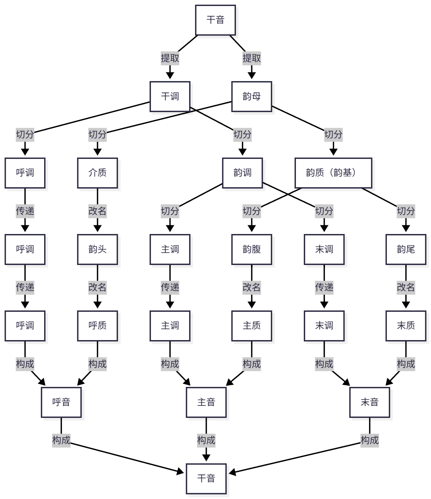
<figcaption>
图 5.3‑1三质干音的分析过程
</figcaption>
</figure>

在音元音节中，首音、呼音、主音和末音的音调，也就是说，首调、呼调、主调和末调，被统称为音元的音调；首音、呼音、主音和末音的音质，也就是说，首质、呼质、主质和末质，被统称为音元的音质。

在音元音节中，把音位音节的韵头改名为呼质，是为在音元音节中表示每类音节都有呼质，主要是为表示尽管在音位音节中无韵头的音节没有韵头但在音元音节中节质却有呼质。

在音元音节中，把音位音节的韵尾改名为末质，是为在音元音节中表示每类音节都有末质，主要是为表示尽管在音位音节中无韵尾的音节没有韵尾但在音元音节中节质却有末质。

呼调、主调和末调，在三质干音中，依序就是与韵头、与三质韵母的韵腹和与韵尾联结的调段。

在确定构成干音的音元时，音元的音调根据干音的音调——干调确定。根据节调分成高调阴平、升调阳平、低调上声和降调去声四类，干调分成高调干调、升调干调、低调干调和降调干调四类。高调干调、升调干调、低调干调和降调干调依序就是阴平干调、阳平干调、上声干调和去声干调。根据五度标调法，高调干调记作[555]、升调干调记作[345]、低调干调记作[211]、降调干调记作[541]。根据三度标调法，高调阴平记作[ˊˊˊ]，升调阳平记作[ˋˉˊ]，低调上声记作[ˋˋˋ]，降调去声记作[ˊˉˋ]。因此，在干音中，呼调、主调和末调，根据五度标调法，当节调是高调阴平时是中值为[5]、[5]、[5]的单拍短调；当节调是升调阳平时是中值为[3]、[4]、[5]的单拍短调；当节调是低调上声时是中值为[2]、[1]、[1]的单拍短调；当节调是降调去声时是中值为[5]、[4]、[1]的单拍短调。这就是说，呼调是中值为[5]、[3]或[2]的单拍短调，主调是中值为[5]、[4]或[1]的单拍短调，末调是中值为[5]或[1]的单拍短调。根据三度标调法，呼调、主调和末调，当节调是高调阴平时是高调[ˊ]、高调[ˊ]和高调[ˊ]，当节调是升调阳平时是低调[ˋ]、中调[ˉ]和高调[ˊ]，当节调是低调上声时是低调[ˋ]、低调[ˋ]和低调[ˋ]，当节调是降调去声时是高调[ˊ]、中调[ˉ]和低调[ˋ]。

在干音中，音元的音调，分别根据五度标调法和三度标调法标调，列表见表
5.3‑2。

<table style="width:69%;">
<caption>
表 5.3‑2构成干音的音元的音调
</caption>
<colgroup>
<col style="width: 14%" />
<col style="width: 9%" />
<col style="width: 9%" />
<col style="width: 9%" />
<col style="width: 9%" />
<col style="width: 9%" />
<col style="width: 9%" />
</colgroup>
<tbody>
<tr>
<td rowspan="2">干调类型</td>
<td colspan="3">五度标调法</td>
<td colspan="3">三度标调法</td>
</tr>
<tr>
<td>呼调</td>
<td>主调</td>
<td>末调</td>
<td>呼调</td>
<td>主调</td>
<td>末调</td>
</tr>
<tr>
<td>高调干调</td>
<td>[5]</td>
<td>[5]</td>
<td>[5]</td>
<td>[ˊ]</td>
<td>[ˊ]</td>
<td>[ˊ]</td>
</tr>
<tr>
<td>升调干调</td>
<td>[3]</td>
<td>[4]</td>
<td>[5]</td>
<td>[ˋ]</td>
<td>[ˉ]</td>
<td>[ˊ]</td>
</tr>
<tr>
<td>低调干调</td>
<td>[2]</td>
<td>[1]</td>
<td>[1]</td>
<td>[ˋ]</td>
<td>[ˋ]</td>
<td>[ˋ]</td>
</tr>
<tr>
<td>降调干调</td>
<td>[5]</td>
<td>[4]</td>
<td>[1]</td>
<td>[ˊ]</td>
<td>[ˉ]</td>
<td>[ˋ]</td>
</tr>
</tbody>
</table>

呼质、主质和末质，在三质干音中，依序就是韵头、韵腹和韵尾。

在确定构成干音的音元时，音元的音质根据干音的音质——韵母确定。

在三质干音中，音元的音质根据质位、质素和《汉语拼音方案》三种方式记录列表见表
5.3‑3。

<table style="width:100%;">
<caption>
表 5.3‑3构成三质干音的音元的音质
</caption>
<colgroup>
<col style="width: 12%" />
<col style="width: 6%" />
<col style="width: 6%" />
<col style="width: 6%" />
<col style="width: 12%" />
<col style="width: 6%" />
<col style="width: 6%" />
<col style="width: 6%" />
<col style="width: 12%" />
<col style="width: 7%" />
<col style="width: 6%" />
<col style="width: 6%" />
</colgroup>
<thead>
<tr>
<th colspan="4">质位</th>
<th colspan="4">质素</th>
<th colspan="4">《汉语拼音方案》</th>
</tr>
<tr>
<th>
质位

干质
</th>
<th>呼质</th>
<th>主质</th>
<th>末质</th>
<th>
质素

干质
</th>
<th>呼质</th>
<th>主质</th>
<th>末质</th>
<th>
质素

韵母
</th>
<th>韵头</th>
<th>韵腹</th>
<th>韵尾</th>
</tr>
</thead>
<tbody>
<tr>
<td>uᴀi</td>
<td>u</td>
<td>ᴀ</td>
<td>i</td>
<td>[uæɪ]</td>
<td>[u]</td>
<td>[æ]</td>
<td>[ɪ]</td>
<td>uɑi</td>
<td>u</td>
<td>ɑ</td>
<td>i</td>
</tr>
<tr>
<td>uᴇi</td>
<td>u</td>
<td>ᴇ</td>
<td>i</td>
<td>[ueɪ]</td>
<td>[u]</td>
<td>[e]</td>
<td>[ɪ]</td>
<td>uei</td>
<td>u</td>
<td>e</td>
<td>i</td>
</tr>
<tr>
<td>iᴀu</td>
<td>i</td>
<td>ᴀ</td>
<td>u</td>
<td>[iɑᴜ]</td>
<td>[i]</td>
<td>[ɑ]</td>
<td>[ᴜ]</td>
<td>iɑo</td>
<td>i</td>
<td>ɑ</td>
<td>o</td>
</tr>
<tr>
<td>iou</td>
<td>i</td>
<td>o</td>
<td>u</td>
<td>[iɤᴜ]</td>
<td>[i]</td>
<td>[ɤ]</td>
<td>[ᴜ]</td>
<td>iou</td>
<td>i</td>
<td>o</td>
<td>u</td>
</tr>
<tr>
<td>iᴀn</td>
<td>i</td>
<td>ᴀ</td>
<td>n</td>
<td>[iæn]</td>
<td>[i]</td>
<td>[æ]</td>
<td>[n]</td>
<td>iɑn</td>
<td>i</td>
<td>ɑ</td>
<td>n</td>
</tr>
<tr>
<td>uᴀn</td>
<td>u</td>
<td>ᴀ</td>
<td>n</td>
<td>[uan]</td>
<td>[u]</td>
<td>[a]</td>
<td>[n]</td>
<td>uɑn</td>
<td>u</td>
<td>ɑ</td>
<td>n</td>
</tr>
<tr>
<td>ʏᴀn</td>
<td>ʏ</td>
<td>ᴀ</td>
<td>n</td>
<td>[ʏæn]</td>
<td>[ʏ]</td>
<td>[æ]</td>
<td>[n]</td>
<td>üɑn</td>
<td>ü</td>
<td>ɑ</td>
<td>n</td>
</tr>
<tr>
<td>iᴇn</td>
<td>i</td>
<td>ᴇ</td>
<td>n</td>
<td>[i󰉸n]</td>
<td>[i]</td>
<td>[󰉸]</td>
<td>[n]</td>
<td>in</td>
<td>i</td>
<td>󰉼</td>
<td>n</td>
</tr>
<tr>
<td>uᴇn</td>
<td>u</td>
<td>ᴇ</td>
<td>n</td>
<td>[uən]</td>
<td>[u]</td>
<td>[ə]</td>
<td>[n]</td>
<td>uen</td>
<td>u</td>
<td>e</td>
<td>n</td>
</tr>
<tr>
<td>ʏᴇn</td>
<td>ʏ</td>
<td>ᴇ</td>
<td>n</td>
<td>[ʏ󰉸n]</td>
<td>[ʏ]</td>
<td>[󰉸]</td>
<td>[n]</td>
<td>ün</td>
<td>ü</td>
<td>󰉼</td>
<td>n</td>
</tr>
<tr>
<td>iᴀŋ</td>
<td>i</td>
<td>ᴀ</td>
<td>ŋ</td>
<td>[iɑŋ]</td>
<td>[i]</td>
<td>[ɑ]</td>
<td>[ŋ]</td>
<td>iɑnɡ</td>
<td>i</td>
<td>ɑ</td>
<td>nɡ</td>
</tr>
<tr>
<td>uᴀŋ</td>
<td>u</td>
<td>ᴀ</td>
<td>ŋ</td>
<td>[uɑŋ]</td>
<td>[u]</td>
<td>[ɑ]</td>
<td>[ŋ]</td>
<td>uɑnɡ</td>
<td>u</td>
<td>ɑ</td>
<td>nɡ</td>
</tr>
<tr>
<td>ioŋ</td>
<td>i</td>
<td>o</td>
<td>ŋ</td>
<td>[i󰉹ŋ]</td>
<td>[i]</td>
<td>[󰉹]</td>
<td>[ŋ]</td>
<td>inɡ</td>
<td>i</td>
<td>󰉼</td>
<td>nɡ</td>
</tr>
<tr>
<td rowspan="2">uoŋ</td>
<td rowspan="2">u</td>
<td rowspan="2">o</td>
<td rowspan="2">ŋ</td>
<td>[uɤŋ]</td>
<td>[u]</td>
<td>[ɤ]</td>
<td>[ŋ]</td>
<td>uenɡ</td>
<td>u</td>
<td>e</td>
<td>nɡ</td>
</tr>
<tr>
<td>[ᴜ󰉹ŋ]</td>
<td>[ᴜ]</td>
<td>[󰉹]</td>
<td>[ŋ]</td>
<td>onɡ</td>
<td>o[ᴜ]</td>
<td>󰉼</td>
<td>nɡ</td>
</tr>
<tr>
<td>ʏoŋ</td>
<td>ʏ</td>
<td>o</td>
<td>ŋ</td>
<td>[y󰉹ŋ]</td>
<td>[y]</td>
<td>[󰉹]</td>
<td>[ŋ]</td>
<td>ionɡ</td>
<td>io[y]</td>
<td>󰉼</td>
<td>nɡ</td>
</tr>
</tbody>
</table>

在标记韵母时，把韵母 in[in]和 ün[ʏn]记录成[i󰉸n]和[ʏ󰉸n]，把韵母 inɡ[iŋ]、onɡ[ᴜŋ]和 ionɡ[yŋ]记录成[i󰉹ŋ]、[ᴜ󰉹ŋ]和[y󰉹ŋ]，这五个韵母是三质韵母。在表
5.3‑3 中，为表明这几个韵母是三质韵母，这几个韵母的在《汉语拼音方案》中省略不记的韵腹根据实际音质并与《汉语拼音方案》保持一致用小号的 󰉼 来记录，这就是说，用小号的 󰉼 来表示这几个韵母的省略不记的韵腹[󰉸]和[󰉹]。韵母 in[i󰉸n]和 ün[ʏ󰉸n]的韵腹[󰉸]，韵母[i󰉹ŋ]、[ᴜ󰉹ŋ]和[y󰉹ŋ]的韵腹[󰉹]，在发音时通常弱化甚至脱落，因此，韵母 in[i󰉸n]和
ün[ʏ󰉸n]依序表示[in]和[ʏn]，韵母 inɡ[i󰉹ŋ]、onɡ[ᴜ󰉹ŋ]和 ionɡ[y󰉹ŋ]依序表示[iŋ]、[ᴜŋ]和[yŋ]。这就是韵母[i󰉸n]和[ʏ󰉸n]在《汉语拼音方案》中被简记成 in 和 ün，韵母[i󰉹ŋ]、[ᴜ󰉹ŋ]和[y󰉹ŋ]在《汉语拼音方案》中被简记成 inɡ[iŋ]、onɡ[ᴜŋ]和 ionɡ[yŋ]的根据。根据这种分析，在《汉语拼音方案》中，字符 o 在韵母 onɡ[ᴜŋ]中实际表示[ᴜ]、字符组 io 在韵母 ionɡ([y󰉹ŋ]或[yŋ])中实际表示[y]。

根据三质干音的分析过程代入每个三质干音就能把每个三质干音都分析成由音元构成的序列。例如，四个干调分别与韵母 iou[iɤᴜ]构成的四个干音[iɤᴜ⁵⁵]、[iɤᴜ³⁵]、
[iɤᴜ²¹¹]和[iɤᴜ⁵¹]的分析过程依序记作：

1. [iɤᴜ⁵⁵]＝[i⁵ɤᴜ⁵⁵]＝[i⁵ɤ⁵ᴜ⁵]＝[󰌠󰍗󰌯]＝ 󰌠󰍒󰌪。

2. [iɤᴜ³⁵]＝[i³ɤᴜ⁴⁵]＝[i³ɤ⁴ᴜ⁵]＝[󰌢󰍘󰌯]＝ 󰌤󰍓󰌪。

3. [iɤᴜ²¹¹]＝[i²ɤᴜ¹¹]＝[i²ɤ¹ᴜ¹]＝[󰌣󰍛󰌳]＝ 󰌤󰍖󰌮。

4. [iɤᴜ⁵¹]＝[i⁵ɤᴜ⁴¹]＝[i⁵ɤ⁴ᴜ¹]＝[󰌠󰍘󰌳]＝ 󰌠󰍓󰌮。

从这四个干音的分析过程中，省去中间环节，干音[iɤᴜ⁵⁵]、[iɤᴜ³⁵]、[iɤᴜ²¹¹]和
[iɤᴜ⁵¹]的分析过程被简化成：

1. [iɤᴜ⁵⁵]＝ 󰌠󰍒󰌪。

2. [iɤᴜ³⁵]＝ 󰌤󰍓󰌪。

3. [iɤᴜ²¹¹]＝ 󰌤󰍖󰌮。

4. [iɤᴜ⁵¹]＝ 󰌠󰍓󰌮。

根据这四个干音的分析过程可知，干音[iɤᴜ⁵⁵]、[iɤᴜ³⁵]、[iɤᴜ²¹¹]和[iɤᴜ⁵¹]，在经过音元分析后，被分析成 󰌠󰍒󰌪、󰌤󰍓󰌪、󰌤󰍖󰌮、󰌠󰍓󰌮。

在经过音元分析后，三质干音的构成列表见表 5.3‑4。

<table style="width:76%;">
<caption>
表 5.3‑4三质干音的构成
</caption>
<colgroup>
<col style="width: 7%" />
<col style="width: 8%" />
<col style="width: 16%" />
<col style="width: 21%" />
<col style="width: 21%" />
</colgroup>
<tbody>
<tr>
<td>音元</td>
<td>片音</td>
<td>《国际音标》</td>
<td>《拼音拼音方案》</td>
<td>《注音符号方案》</td>
</tr>
<tr>
<td>󰌪󰌾󰌠</td>
<td>[󰌪󰍈󰌥]</td>
<td>[uæɪ⁵⁵]</td>
<td>u󰉜i</td>
<td>ㄨ󰈇</td>
</tr>
<tr>
<td>󰌮󰌿󰌠</td>
<td>[󰌬󰍉󰌥]</td>
<td>[uæɪ³⁵]</td>
<td>u󰉝i</td>
<td>ㄨ󰈘</td>
</tr>
<tr>
<td>󰌮󰍂󰌤</td>
<td>[󰌭󰍌󰌩]</td>
<td>[uæɪ²¹¹]</td>
<td>u󰉞i</td>
<td>ㄨ󰈩</td>
</tr>
<tr>
<td>󰌪󰌿󰌤</td>
<td>[󰌪󰍉󰌩]</td>
<td>[uæɪ⁵¹]</td>
<td>u󰉟i</td>
<td>ㄨ󰈺</td>
</tr>
<tr>
<td>󰌪󰍡󰌠</td>
<td>[󰌪󰍦󰌥]</td>
<td>[ueɪ⁵⁵]</td>
<td>u󰍧i</td>
<td>ㄨ󰈈</td>
</tr>
<tr>
<td>󰌮󰍢󰌠</td>
<td>[󰌬󰍧󰌥]</td>
<td>[ueɪ³⁵]</td>
<td>u󰍦i</td>
<td>ㄨ󰈙</td>
</tr>
<tr>
<td>󰌮󰍥󰌤</td>
<td>[󰌭󰍪󰌩]</td>
<td>[ueɪ²¹¹]</td>
<td>uěi</td>
<td>ㄨ󰈪</td>
</tr>
<tr>
<td>󰌪󰍢󰌤</td>
<td>[󰌪󰍧󰌩]</td>
<td>[ueɪ⁵¹]</td>
<td>u󰍪i</td>
<td>ㄨ󰈻</td>
</tr>
<tr>
<td>󰌠󰌾󰌪</td>
<td>[󰌠󰍍󰌯]</td>
<td>[iɑᴜ⁵⁵]</td>
<td>i󰉜o</td>
<td>ㄧ󰈉</td>
</tr>
<tr>
<td>󰌤󰌿󰌪</td>
<td>[󰌢󰍎󰌯]</td>
<td>[iɑᴜ³⁵]</td>
<td>i󰉝o</td>
<td>ㄧ󰈚</td>
</tr>
<tr>
<td>󰌤󰍂󰌮</td>
<td>[󰌣󰍑󰌳]</td>
<td>[iɑᴜ²¹¹]</td>
<td>i󰉞o</td>
<td>ㄧ󰈫</td>
</tr>
<tr>
<td>󰌠󰌿󰌮</td>
<td>[󰌠󰍎󰌳]</td>
<td>[iɑᴜ⁵¹]</td>
<td>i󰉟o</td>
<td>ㄧ󰈼</td>
</tr>
<tr>
<td>󰌠󰍒󰌪</td>
<td>[󰌠󰍗󰌯]</td>
<td>[iɤᴜ⁵⁵]</td>
<td>i󰉠u</td>
<td>ㄧ󰈊</td>
</tr>
<tr>
<td>󰌤󰍓󰌪</td>
<td>[󰌢󰍘󰌯]</td>
<td>[iɤᴜ³⁵]</td>
<td>i󰉡u</td>
<td>ㄧ󰈛</td>
</tr>
<tr>
<td>󰌤󰍖󰌮</td>
<td>[󰌣󰍛󰌳]</td>
<td>[iɤᴜ²¹¹]</td>
<td>i󰉢u</td>
<td>ㄧ󰈬</td>
</tr>
<tr>
<td>󰌠󰍓󰌮</td>
<td>[󰌠󰍘󰌳]</td>
<td>[iɤᴜ⁵¹]</td>
<td>i󰉣u</td>
<td>ㄧ󰈽</td>
</tr>
<tr>
<td>󰌠󰌾󰎓</td>
<td>[󰌠󰍈󰎓]</td>
<td>[iæn⁵⁵]</td>
<td>i󰉜n</td>
<td>ㄧ󰈋</td>
</tr>
<tr>
<td>󰌤󰌿󰎓</td>
<td>[󰌢󰍉󰎓]</td>
<td>[iæn³⁵]</td>
<td>i󰉝n</td>
<td>ㄧ󰈜</td>
</tr>
<tr>
<td>󰌤󰍂󰎗</td>
<td>[󰌣󰍌󰎗]</td>
<td>[iæn²¹¹]</td>
<td>i󰉞n</td>
<td>ㄧ󰈭</td>
</tr>
<tr>
<td>󰌠󰌿󰎗</td>
<td>[󰌠󰍉󰎗]</td>
<td>[iæn⁵¹]</td>
<td>i󰉟n</td>
<td>ㄧ󰈾</td>
</tr>
<tr>
<td>󰌪󰌾󰎓</td>
<td>[󰌪󰍃󰎓]</td>
<td>[uan⁵⁵]</td>
<td>u󰉜n</td>
<td>ㄨ󰈋</td>
</tr>
<tr>
<td>󰌮󰌿󰎓</td>
<td>[󰌬󰍄󰎓]</td>
<td>[uan³⁵]</td>
<td>u󰉝n</td>
<td>ㄨ󰈜</td>
</tr>
<tr>
<td>󰌮󰍂󰎗</td>
<td>[󰌭󰍇󰎗]</td>
<td>[uan²¹¹]</td>
<td>u󰉞n</td>
<td>ㄨ󰈭</td>
</tr>
<tr>
<td>󰌪󰌿󰎗</td>
<td>[󰌪󰍄󰎗]</td>
<td>[uan⁵¹]</td>
<td>u󰉟n</td>
<td>ㄨ󰈾</td>
</tr>
<tr>
<td>󰌴󰌾󰎓</td>
<td>[󰌴󰍈󰎓]</td>
<td>[ʏæn⁵⁵]</td>
<td>ü󰉜n</td>
<td>ㄩ󰈋</td>
</tr>
<tr>
<td>󰌸󰌿󰎓</td>
<td>[󰌶󰍉󰎓]</td>
<td>[ʏæn³⁵]</td>
<td>ü󰉝n</td>
<td>ㄩ󰈜</td>
</tr>
<tr>
<td>󰌸󰍂󰎗</td>
<td>[󰌷󰍌󰎗]</td>
<td>[ʏæn²¹¹]</td>
<td>ü󰉞n</td>
<td>ㄩ󰈭</td>
</tr>
<tr>
<td>󰌴󰌿󰎗</td>
<td>[󰌴󰍉󰎗]</td>
<td>[ʏæn⁵¹]</td>
<td>ü󰉟n</td>
<td>ㄩ󰈾</td>
</tr>
<tr>
<td>󰌠󰍡󰎓</td>
<td>[󰌠󰍰󰎓]</td>
<td>[i󰉸n⁵⁵]</td>
<td>󰌡n</td>
<td>ㄧ󰈌</td>
</tr>
<tr>
<td>󰌤󰍢󰎓</td>
<td>[󰌢󰍱󰎓]</td>
<td>[i󰉸n³⁵]</td>
<td>󰌠n</td>
<td>ㄧ󰈝</td>
</tr>
<tr>
<td>󰌤󰍥󰎗</td>
<td>[󰌣󰍴󰎗]</td>
<td>[i󰉸n²¹¹]</td>
<td>ǐn</td>
<td>ㄧ󰈮</td>
</tr>
<tr>
<td>󰌠󰍢󰎗</td>
<td>[󰌠󰍱󰎗]</td>
<td>[i󰉸n⁵¹]</td>
<td>󰌤n</td>
<td>ㄧ󰈿</td>
</tr>
<tr>
<td>󰌪󰍡󰎓</td>
<td>[󰌪󰍫󰎓]</td>
<td>[uən⁵⁵]</td>
<td>u󰍧n</td>
<td>ㄨ󰈌</td>
</tr>
<tr>
<td>󰌮󰍢󰎓</td>
<td>[󰌬󰍬󰎓]</td>
<td>[uən³⁵]</td>
<td>u󰍦n</td>
<td>ㄨ󰈝</td>
</tr>
<tr>
<td>󰌮󰍥󰎗</td>
<td>[󰌭󰍯󰎗]</td>
<td>[uən²¹¹]</td>
<td>uěn</td>
<td>ㄨ󰈮</td>
</tr>
<tr>
<td>󰌪󰍢󰎗</td>
<td>[󰌪󰍬󰎗]</td>
<td>[uən⁵¹]</td>
<td>u󰍪n</td>
<td>ㄨ󰈿</td>
</tr>
<tr>
<td>󰌴󰍡󰎓</td>
<td>[󰌴󰍰󰎓]</td>
<td>[ʏ󰉸n⁵⁵]</td>
<td>󰉘n</td>
<td>ㄩ󰈌</td>
</tr>
<tr>
<td>󰌸󰍢󰎓</td>
<td>[󰌶󰍱󰎓]</td>
<td>[ʏ󰉸n³⁵]</td>
<td>󰉙n</td>
<td>ㄩ󰈝</td>
</tr>
<tr>
<td>󰌸󰍥󰎗</td>
<td>[󰌷󰍴󰎗]</td>
<td>[ʏ󰉸n²¹¹]</td>
<td>󰉚n</td>
<td>ㄩ󰈮</td>
</tr>
<tr>
<td>󰌴󰍢󰎗</td>
<td>[󰌴󰍱󰎗]</td>
<td>[ʏ󰉸n⁵¹]</td>
<td>󰉛n</td>
<td>ㄩ󰈿</td>
</tr>
<tr>
<td>󰌠󰌾󰎘</td>
<td>[󰌠󰍍󰎘]</td>
<td>[iɑŋ⁵⁵]</td>
<td>i󰉜nɡ</td>
<td>ㄧ󰈍</td>
</tr>
<tr>
<td>󰌤󰌿󰎘</td>
<td>[󰌢󰍎󰎘]</td>
<td>[iɑŋ³⁵]</td>
<td>i󰉝nɡ</td>
<td>ㄧ󰈞</td>
</tr>
<tr>
<td>󰌤󰍂󰎜</td>
<td>[󰌣󰍑󰎜]</td>
<td>[iɑŋ²¹¹]</td>
<td>i󰉞nɡ</td>
<td>ㄧ󰈯</td>
</tr>
<tr>
<td>󰌠󰌿󰎜</td>
<td>[󰌠󰍎󰎜]</td>
<td>[iɑŋ⁵¹]</td>
<td>i󰉟nɡ</td>
<td>ㄧ󰉀</td>
</tr>
<tr>
<td>󰌪󰌾󰎘</td>
<td>[󰌪󰍍󰎘]</td>
<td>[uɑŋ⁵⁵]</td>
<td>u󰉜nɡ</td>
<td>ㄨ󰈍</td>
</tr>
<tr>
<td>󰌮󰌿󰎘</td>
<td>[󰌬󰍎󰎘]</td>
<td>[uɑŋ³⁵]</td>
<td>u󰉝nɡ</td>
<td>ㄨ󰈞</td>
</tr>
<tr>
<td>󰌮󰍂󰎜</td>
<td>[󰌭󰍑󰎜]</td>
<td>[uɑŋ²¹¹]</td>
<td>u󰉞nɡ</td>
<td>ㄨ󰈯</td>
</tr>
<tr>
<td>󰌪󰌿󰎜</td>
<td>[󰌪󰍎󰎜]</td>
<td>[uɑŋ⁵¹]</td>
<td>u󰉟nɡ</td>
<td>ㄨ󰉀</td>
</tr>
<tr>
<td>󰌠󰍒󰎘</td>
<td>[󰌠󰍜󰎘]</td>
<td>[i󰉹ŋ⁵⁵]</td>
<td>󰌡nɡ</td>
<td>ㄧ󰈎</td>
</tr>
<tr>
<td>󰌤󰍓󰎘</td>
<td>[󰌢󰍝󰎘]</td>
<td>[i󰉹ŋ³⁵]</td>
<td>󰌠nɡ</td>
<td>ㄧ󰈟</td>
</tr>
<tr>
<td>󰌤󰍖󰎜</td>
<td>[󰌣󰍠󰎜]</td>
<td>[i󰉹ŋ²¹¹]</td>
<td>ǐnɡ</td>
<td>ㄧ󰈰</td>
</tr>
<tr>
<td>󰌠󰍓󰎜</td>
<td>[󰌠󰍝󰎜]</td>
<td>[i󰉹ŋ⁵¹]</td>
<td>󰌤nɡ</td>
<td>ㄧ󰉁</td>
</tr>
<tr>
<td rowspan="2">󰌪󰍒󰎘</td>
<td>[󰌪󰍗󰎘]</td>
<td>[uɤŋ⁵⁵]</td>
<td>u󰍧nɡ</td>
<td rowspan="2">ㄨ󰈎</td>
</tr>
<tr>
<td>[󰌪󰍜󰎘]</td>
<td>[u󰉹ŋ⁵⁵]</td>
<td>󰉠nɡ</td>
</tr>
<tr>
<td rowspan="2">󰌮󰍓󰎘</td>
<td>[󰌬󰍘󰎘]</td>
<td>[uɤŋ³⁵]</td>
<td>u󰍦nɡ</td>
<td rowspan="2">ㄨ󰈟</td>
</tr>
<tr>
<td>[󰌬󰍝󰎘]</td>
<td>[u󰉹ŋ³⁵]</td>
<td>󰉡nɡ</td>
</tr>
<tr>
<td rowspan="2">󰌮󰍖󰎜</td>
<td>[󰌭󰍛󰎜]</td>
<td>[uɤŋ²¹¹]</td>
<td>uěnɡ</td>
<td rowspan="2">ㄨ󰈰</td>
</tr>
<tr>
<td>[󰌭󰍠󰎜]</td>
<td>[u󰉹ŋ²¹¹]</td>
<td>󰉢nɡ</td>
</tr>
<tr>
<td rowspan="2">󰌪󰍓󰎜</td>
<td>[󰌪󰍘󰎜]</td>
<td>[uɤŋ⁵¹]</td>
<td>u󰍪nɡ</td>
<td rowspan="2">ㄨ󰉁</td>
</tr>
<tr>
<td>[󰌪󰍝󰎜]</td>
<td>[u󰉹ŋ⁵¹]</td>
<td>󰉣nɡ</td>
</tr>
<tr>
<td>󰌴󰍒󰎘</td>
<td>[󰌹󰍜󰎘]</td>
<td>[y󰉹ŋ⁵⁵]</td>
<td>i󰉠nɡ</td>
<td>ㄩ󰈎</td>
</tr>
<tr>
<td>󰌸󰍓󰎘</td>
<td>[󰌻󰍝󰎘]</td>
<td>[y󰉹ŋ³⁵]</td>
<td>i󰉡nɡ</td>
<td>ㄩ󰈟</td>
</tr>
<tr>
<td>󰌸󰍖󰎜</td>
<td>[󰌼󰍠󰎜]</td>
<td>[y󰉹ŋ²¹¹]</td>
<td>i󰉢nɡ</td>
<td>ㄩ󰈰</td>
</tr>
<tr>
<td>󰌴󰍓󰎜</td>
<td>[󰌹󰍝󰎜]</td>
<td>[y󰉹ŋ⁵¹]</td>
<td>i󰉣nɡ</td>
<td>ㄩ󰉁</td>
</tr>
</tbody>
</table>

在《国际音标》中，有两套调号：一套是记录旋律型声调的调号高平[˥]、半高[˦]、中平[˧]、半低[˨]和低平[˩]。这套调号，在汉语中，在学术上，通常用数码[5]、[4、[3]、[2]和[1]来代替，通常做成角标附加在记录音质的字符的右上角旁。一套是记录高低型声调的调号超高[˝]、高[ˊ]、中[ˉ]、低[ˋ]和超低[᫵]，通常添加在记录音质的字符上方。强调说明，在《国际音标》中，尽管从直觉上想象，调号超高[˝]、高[ˊ]、中[ˉ]、低[ˋ]和超低[᫵]似乎和调号高平[˥]、半高[˦]、中平[˧]、半低[˨]和低平[˩]一一对应对等。然而，从内容上比较，这两套调号没有可比性
(国际语音学会, 2008)。因此，在标调时，不宜直接用调号超高[˝]、高[ˊ]、中[ˉ]、低[ˋ]和超低[᫵]来代替调号高平[˥]、半高[˦]、中平[˧]、半低[˨]和低平[˩]。只有重新定义调号超高[˝]、高[ˊ]、中[ˉ]、低[ˋ]和超低[᫵]的内涵和外延，才能直接用这套调号来表示高平[˥]、半高[˦]、中平[˧]、半低[˨]和低平[˩]。为不重新定义这套调号，在根据五度标调法用上标来标调时，依序用上标[᫰]、[᫱]、[᫲]、[᫳]和[᫴]来记录高平[˥]、半高[˦]、中平[˧]、半低[˨]和低平[˩]。

#### 前长干音的分析

前长干音由干调与前长韵母构成。在前长干音中，韵母是前长韵母，由充当间质的韵腹与韵尾构成。

根据前长干音的构成，前长干音记成：

$$
前长干音 = \begin{bmatrix}
干 & 调 \\
韵腹 & 韵尾
\end{bmatrix}
$$

把前长干音分析成音元序列的过程分为四步：

第一步，划分间调和末调。具体内容是：划分与韵腹和与韵尾相联结的调段，并把与韵腹联结的调段命名为间调且把与韵尾联结的调段命名为末调。在前长干音中，根据韵腹充当间质把韵腹改名为间质，与韵腹联结的调段、就是与间质联结的调段、被命名为间调。在前长干音中，与在三质干音中一样，根据韵尾位列末位把与末位质素联结的调段简称为末调，与韵尾联结的调段就是末调。在把与韵腹联结的调段和与韵尾联结的调段命名为间调和末调后，干调就被分析成由间调和末调构成的序列。

在析出了间调和末调后，前长干音记成：

$$
前长干音 = \begin{bmatrix}
\begin{matrix}
间 & 调
\end{matrix} & 末调 \\
\begin{matrix}
韵 & 腹
\end{matrix} & 韵尾
\end{bmatrix}
$$

第二步，把干调分析成由呼调、主调和末调构成的序列。具体内容是：根据当调类相同时前长干音的干调与三质干音的干调相同，以三质干音的干调的分段结果为基准，把前长干音的干调分析成与三质干音的呼调、主调和末调对应相同的三段。在析出了间调和末调后，这个过程就是把间调分析成由呼调和主调构成的序列、保持末调不变。

在把干调分析成由呼调、主调和末调构成的序列后，前长干音记成：

$$
前长干音 = \begin{bmatrix}
呼调 & 主调 & 末调 \\
韵 & 腹 & 韵尾
\end{bmatrix}
$$

第三步，把韵母分析成由呼质、主质和末质构成的序列。具体内容是：根据韵腹充当间质、与间质联结的调段是间调和间调分成呼调和主调两段，把韵腹分析成与呼调和与主调联结的音质，也就是说，把间质分析成间质前段和间质后段；根据末调是与韵尾联结的调段，把韵尾分析成与末调联结的音质；把与呼调、与主调和与末调联结的音质简称为呼质、主质和末质，也就是说，把间质前段、间质后段和韵尾改名为呼质、主质和末质，从而把韵母分析成由呼质、主质和末质构成的序列。

前长韵母与三质韵母的对立，不是韵头有无的对立，而是前长韵母的间质前段(韵腹前段)与三质韵母的韵头的对立。因此，尽管前长韵母没有韵头，然而在质调关系上却存在与三质韵母的韵头相对的一段音质。换句话说，在前长干音中，在把干调分析成由呼调、主调和末调构成的序列后，存在一段与呼调联结的音质。这段音质就是呼质。因此，前长韵母被分析成由呼质、主质和末质构成的序列。

在把韵母分析成由呼质、主质和末质构成的序列后，前长干音记成：

$$
前长干音 = \begin{bmatrix}
呼调 & 主调 & 末调 \\
呼质 & 主质 & 末质
\end{bmatrix}
$$

第四步，用音元来表示呼音、主音和末音。在前长干音中，在把干调分析成由呼调、主调和末调构成的序列和把韵母分析成由呼质、主质和末质构成的序列后，把由呼调与呼质、由主调与主质和由末调与末质构成的音段从结构上分析成呼音、主音和末音，把充当呼音、主音或末音的音段分析成片音，确定表示片音的音元，干音就被分析成由三个音元所表示的呼音、主音和末音构成的序列。

在把干音分析成由三个音元所表示的呼音、主音和末音构成的序列后，前长干音记成：

$$
干音 = \begin{bmatrix}
呼音 & 主音 & 末音
\end{bmatrix}
$$

前长干音的分析过程图示如图 5.3‑2。

在经过音元分析后，在前长干音中，呼音是由呼调与呼质构成的音段。根据节调质素分析法解说，呼调指与间质前段联结的调段；呼质指间质前段。间质前段就是前长韵母的韵腹前段。在前长干音中，根据韵腹充当间质，把间质分析成与呼调联结的间质前段和与主调联结的间质后段两段，呼调就是与间质前段联结的调段，呼质就是间质前段。因此，呼音就是由间质前段和与其联结的调段构成的音段。

在经过音元分析后，在前长干音中，主音是由主调与主质构成的音段。根据节调质素分析法解说，主调指与间质后段联结的调段；主质指间质后段。间质后段就是前长韵母的韵腹后段。在前长干音中，根据韵腹充当间质，把间质分析成与呼调联结的间质前段和与主调联结的间质后段两段，主调就是与间质后段联结的调段，主质就是间质后段。因此，主音就是由间质前段和与其联结的调段构成的音段。

在经过音元分析后，在前长干音中，末音是由末调与末质构成的音段。根据节调质素分析法解说，末调指与韵尾联结的调段；末质指韵尾。因此，末音就是由韵尾和与其联结的调段构成的音段。

综述说明，前长干音由呼音、主音和末音构成。

<figure>
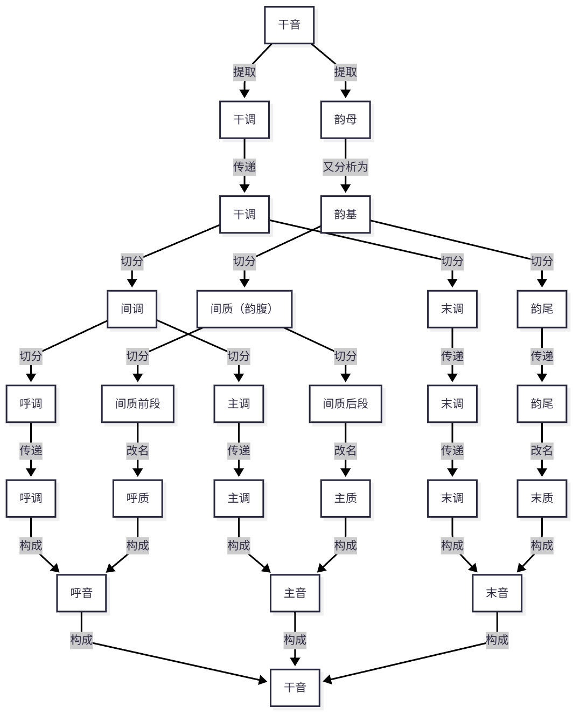
<figcaption>
图 5.3‑2前长干音的分析过程
</figcaption>
</figure>

在音元音节中，首音、呼音、主音和末音的音调，也就是说，首调、呼调、主调和末调，被统称为音元的音调；首音、呼音、主音和末音的音质，也就是说，首质、呼质、主质和末质，被统称为音元的音质。呼调、主调和末调，在前长干音中，依序就是与前长韵母的间质前段(韵腹前段)、与前长韵母的间质后段(韵腹后段)和与韵尾联结的调段。当调类相同时，前长干音的呼调、主调和末调依序与三质干音的呼调、主调和末调相同。呼质、主质和末质，在前长干音中，依序就是前长韵母的间质前段(韵腹前段)、间质后段(韵腹后段)和韵尾。在前长干音中，音元的音质根据质位、质素和《汉语拼音方案》三种方式记录列表见表
5.3‑5。

<table style="width:78%;">
<caption>
表 5.3‑5构成前长干音的音元的音质
</caption>
<colgroup>
<col style="width: 10%" />
<col style="width: 5%" />
<col style="width: 5%" />
<col style="width: 5%" />
<col style="width: 10%" />
<col style="width: 5%" />
<col style="width: 5%" />
<col style="width: 5%" />
<col style="width: 10%" />
<col style="width: 5%" />
<col style="width: 5%" />
</colgroup>
<tbody>
<tr>
<td colspan="4">质位</td>
<td colspan="4">质素</td>
<td colspan="3">《汉语拼音方案》</td>
</tr>
<tr>
<td style="text-align: left;">
质位

干质
</td>
<td>呼质</td>
<td>主质</td>
<td>末质</td>
<td style="text-align: left;">
质素

干质
</td>
<td>呼质</td>
<td>主质</td>
<td>末质</td>
<td style="text-align: left;">
质素

韵母
</td>
<td>韵腹</td>
<td>韵尾</td>
</tr>
<tr>
<td>ᴀᴀi</td>
<td>ᴀ</td>
<td>ᴀ</td>
<td>i</td>
<td>[ææɪ]</td>
<td>[æ]</td>
<td>[æ]</td>
<td>[ɪ]</td>
<td>ɑi</td>
<td>ɑ</td>
<td>i</td>
</tr>
<tr>
<td>ᴇᴇi</td>
<td>ᴇ</td>
<td>ᴇ</td>
<td>i</td>
<td>[eeɪ]</td>
<td>[e]</td>
<td>[e]</td>
<td>[ɪ]</td>
<td>ei</td>
<td>e</td>
<td>i</td>
</tr>
<tr>
<td>ᴀᴀu</td>
<td>ᴀ</td>
<td>ᴀ</td>
<td>u</td>
<td>[ɑɑᴜ]</td>
<td>[ɑ]</td>
<td>[ɑ]</td>
<td>[ᴜ]</td>
<td>ɑo</td>
<td>ɑ</td>
<td>o</td>
</tr>
<tr>
<td>oou</td>
<td>o</td>
<td>o</td>
<td>u</td>
<td>[ɤɤᴜ]</td>
<td>[ɤ]</td>
<td>[ɤ]</td>
<td>[ᴜ]</td>
<td>ou</td>
<td>o</td>
<td>u</td>
</tr>
<tr>
<td>ᴀᴀn</td>
<td>ᴀ</td>
<td>ᴀ</td>
<td>n</td>
<td>[aan]</td>
<td>[a]</td>
<td>[a]</td>
<td>[n]</td>
<td>ɑn</td>
<td>ɑ</td>
<td>n</td>
</tr>
<tr>
<td>ᴇᴇn</td>
<td>ᴇ</td>
<td>ᴇ</td>
<td>n</td>
<td>[əən]</td>
<td>[ə]</td>
<td>[ə]</td>
<td>[n]</td>
<td>en</td>
<td>e</td>
<td>n</td>
</tr>
<tr>
<td>ᴀᴀŋ</td>
<td>ᴀ</td>
<td>ᴀ</td>
<td>ŋ</td>
<td>[ɑɑŋ]</td>
<td>[ɑ]</td>
<td>[ɑ]</td>
<td>[ŋ]</td>
<td>ɑnɡ</td>
<td>ɑ</td>
<td>nɡ</td>
</tr>
<tr>
<td>ooŋ</td>
<td>o</td>
<td>o</td>
<td>ŋ</td>
<td>[ɤɤŋ]</td>
<td>[ɤ]</td>
<td>[ɤ]</td>
<td>[ŋ]</td>
<td>enɡ</td>
<td>e</td>
<td>nɡ</td>
</tr>
</tbody>
</table>

根据前长干音的分析过程代入每个前长干音就能把每个前长干音都分析成由音元构成的序列。例如，四个干调分别与韵母 ou[ɤᴜ]构成的四个干音[ɤᴜ⁵⁵]、[ɤᴜ³⁵]、[ɤᴜ²¹¹]和[ɤᴜ⁵¹]的分析过程依序记作：

1. [ɤᴜ⁵⁵]＝[ɤ⁵⁵ᴜ⁵]＝[ɤ⁵ɤ⁵ᴜ⁵]＝[󰍗󰍗󰌯]＝ 󰍒󰍒󰌪。

2. [ɤᴜ³⁵]＝[ɤ³⁴ᴜ⁵]＝[ɤ³ɤ⁴ᴜ⁵]＝[󰍙󰍘󰌯]＝ 󰍖󰍓󰌪。

3. [ɤᴜ²¹¹]＝[ɤ²¹ᴜ¹]＝[ɤ²ɤ¹ᴜ¹]＝[󰍚󰍛󰌳]＝ 󰍖󰍖󰌮。

4. [ɤᴜ⁵¹]＝[ɤ⁵⁴ᴜ¹]＝[ɤ⁵ɤ⁴ᴜ¹]＝[󰍗󰍘󰌳]＝ 󰍒󰍓󰌮。

从这四个干音的分析过程中，省去中间环节，干音[ɤᴜ⁵⁵]、[ɤᴜ³⁵]、[ɤᴜ²¹¹]和[ɤᴜ⁵¹]的分析过程被简化成：

1. [ɤᴜ⁵⁵]＝ 󰍒󰍒󰌪。

2. [ɤᴜ³⁵]＝ 󰍖󰍓󰌪。

3. [ɤᴜ²¹¹]＝ 󰍖󰍖󰌮。

4. [ɤᴜ⁵¹]＝ 󰍒󰍓󰌮。

根据这四个干音的分析过程可知，干音[ɤᴜ⁵⁵]、[ɤᴜ³⁵]、[ɤᴜ²¹¹]和[ɤᴜ⁵¹]，在经过音元分析后，被分析成 󰍒󰍒󰌪、󰍖󰍓󰌪、󰍖󰍖󰌮、󰍒󰍓󰌮。

在经过音元分析后，前长干音的构成列表见表 5.3‑6。

|      |       |              |                  |                  |
| ---- | ----- | ------------ | ---------------- | ---------------- |
| 音元 | 片音  | 《国际音标》 | 《拼音拼音方案》 | 《注音符号方案》 |
| 󰌾󰌾󰌠  | [󰍈󰍈󰌥] | [æɪ⁵⁵]       | 󰉜i               | 󰈇                |
| 󰍂󰌿󰌠  | [󰍊󰍉󰌥] | [æɪ³⁵]       | 󰉝i               | 󰈘                |
| 󰍂󰍂󰌤  | [󰍋󰍌󰌩] | [æɪ²¹¹]      | 󰉞i               | 󰈩                |
| 󰌾󰌿󰌤  | [󰍈󰍉󰌩] | [æɪ⁵¹]       | 󰉟i               | 󰈺                |
| 󰍡󰍡󰌠  | [󰍦󰍦󰌥] | [eɪ⁵⁵]       | 󰍧i               | 󰈈                |
| 󰍥󰍢󰌠  | [󰍨󰍧󰌥] | [eɪ³⁵]       | 󰍦i               | 󰈙                |
| 󰍥󰍥󰌤  | [󰍩󰍪󰌩] | [eɪ²¹¹]      | ěi               | 󰈪                |
| 󰍡󰍢󰌤  | [󰍦󰍧󰌩] | [eɪ⁵¹]       | 󰍪i               | 󰈻                |
| 󰌾󰌾󰌪  | [󰍍󰍍󰌯] | [ɑᴜ⁵⁵]       | 󰉜o               | 󰈉                |
| 󰍂󰌿󰌪  | [󰍏󰍎󰌯] | [ɑᴜ³⁵]       | 󰉝o               | 󰈚                |
| 󰍂󰍂󰌮  | [󰍐󰍑󰌳] | [ɑᴜ²¹¹]      | 󰉞o               | 󰈫                |
| 󰌾󰌿󰌮  | [󰍍󰍎󰌳] | [ɑᴜ⁵¹]       | 󰉟o               | 󰈼                |
| 󰍒󰍒󰌪  | [󰍗󰍗󰌯] | [ɤᴜ⁵⁵]       | 󰉠u               | 󰈊                |
| 󰍖󰍓󰌪  | [󰍙󰍘󰌯] | [ɤᴜ³⁵]       | 󰉡u               | 󰈛                |
| 󰍖󰍖󰌮  | [󰍚󰍛󰌳] | [ɤᴜ²¹¹]      | 󰉢u               | 󰈬                |
| 󰍒󰍓󰌮  | [󰍗󰍘󰌳] | [ɤᴜ⁵¹]       | 󰉣u               | 󰈽                |
| 󰌾󰌾󰎓  | [󰍃󰍃󰎓] | [an⁵⁵]       | 󰉜n               | 󰈋                |
| 󰍂󰌿󰎓  | [󰍅󰍄󰎓] | [an³⁵]       | 󰉝n               | 󰈜                |
| 󰍂󰍂󰎗  | [󰍆󰍇󰎗] | [an²¹¹]      | 󰉞n               | 󰈭                |
| 󰌾󰌿󰎗  | [󰍃󰍄󰎗] | [an⁵¹]       | 󰉟n               | 󰈾                |
| 󰍡󰍡󰎓  | [󰍫󰍫󰎓] | [ən⁵⁵]       | 󰍧n               | 󰈌                |
| 󰍥󰍢󰎓  | [󰍭󰍬󰎓] | [ən³⁵]       | 󰍦n               | 󰈝                |
| 󰍥󰍥󰎗  | [󰍮󰍯󰎗] | [ən²¹¹]      | ěn               | 󰈮                |
| 󰍡󰍢󰎗  | [󰍫󰍬󰎗] | [ən⁵¹]       | 󰍪n               | 󰈿                |
| 󰌾󰌾󰎘  | [󰍍󰍍󰎘] | [ɑŋ⁵⁵]       | 󰉜nɡ              | 󰈍                |
| 󰍂󰌿󰎘  | [󰍏󰍎󰎘] | [ɑŋ³⁵]       | 󰉝nɡ              | 󰈞                |
| 󰍂󰍂󰎜  | [󰍐󰍑󰎜] | [ɑŋ²¹¹]      | 󰉞nɡ              | 󰈯                |
| 󰌾󰌿󰎜  | [󰍍󰍎󰎜] | [ɑŋ⁵¹]       | 󰉟nɡ              | 󰉀                |
| 󰍒󰍒󰎘  | [󰍗󰍗󰎘] | [ɤŋ⁵⁵]       | 󰍧nɡ              | 󰈎                |
| 󰍖󰍓󰎘  | [󰍙󰍘󰎘] | [ɤŋ³⁵]       | 󰍦nɡ              | 󰈟                |
| 󰍖󰍖󰎜  | [󰍚󰍛󰎜] | [ɤŋ²¹¹]      | ěnɡ              | 󰈰                |
| 󰍒󰍓󰎜  | [󰍗󰍘󰎜] | [ɤŋ⁵¹]       | 󰍪nɡ              | 󰉁                |

表 5.3‑6 前长干音的构成

#### 后长干音的分析

后长干音由干调与后长韵母构成。在后长干音中，韵母是后长韵母，由韵头与充当韵质的韵腹构成。

根据后长干音的构成，后长干音记成：

$$
后长干音 = \begin{bmatrix}
干 & 调 \\
韵头 & 韵 腹
\end{bmatrix}
$$

把后长干音分析成音元序列的过程分为四步：

第一步，划分呼调和韵调。具体内容是：划分与韵头和与韵腹相联结的调段，并把与韵头联结的调段命名为呼调且把与韵腹联结的调段命名为韵调。在后长干音中，根据古人认为每个音节都有“呼”的“呼分析法”把由韵头和与其联结的调段构成的音段分析成“呼音”且把呼音的音调简称为呼调，与韵头联结的调段就是呼调。在后长干音中，根据韵腹充当韵质把韵腹改名为韵质，与韵腹联结的调段、就是与韵质联结的调段、被命名为韵调。在把与韵头联结的调段和与韵腹联结的调段命名为呼调和韵调后，干调就被分析成由呼调和韵调构成的序列。

在析出了呼调和韵调后，后长干音记成：

$$
后长干音 = \begin{bmatrix}
呼调 & \begin{matrix}
韵 & 调
\end{matrix} \\
韵头 & \begin{matrix}
韵 & 腹
\end{matrix}
\end{bmatrix}
$$

第二步，把干调分析成由呼调、主调和末调构成的序列。具体内容是：根据当调类相同时后长干音的干调与三质干音的干调相同，以三质干音的干调的分段结果为基准，把后长干音的干调分析成与三质干音的呼调、主调和末调对应相同的三段。在析出了呼调和韵调后，这个过程就是保持呼调不变、把韵调分析成由主调和末调构成的序列。

在把干调分析成由呼调、主调和末调构成的序列后，后长干音记成：

$$
后长干音 = \begin{bmatrix}
呼调 & 主调 & 末调 \\
韵头 & 韵 & 腹
\end{bmatrix}
$$

第三步，把韵母分析成由呼质、主质和末质构成的序列。具体内容是：根据呼调是与韵头联结的调段，把韵头分析成与呼调联结的音质；根据韵腹充当韵质、与韵质联结的调段是韵调和韵调分成主调和末调两段，把韵腹分析成与主调和与末调联结的音质，也就是说，把韵质分析成韵质前段和韵质后段；把与呼调、与主调和与末调联结的音质简称为呼质、主质和末质，也就是说，把韵头、韵质前段和韵质后段改名为呼质、主质和末质，从而把韵母分析成由呼质、主质和末质构成的序列。

后长韵母与三质韵母的对立，不是韵尾有无的对立，而是后长韵母的韵质后段(韵腹后段)与三质韵母的韵尾的对立。因此，尽管后长韵母没有韵尾，然而在质调关系上却存在与三质韵母的韵尾相对的一段音质。换句话说，在后长干音中，在把干调分析成由呼调、主调和末调构成的序列后，存在一段与末调联结的音质。这段音质就是末质。因此，后长韵母被分析成由呼质、主质和末质构成的序列。

在把韵母分析成由呼质、主质和末质构成的序列后，后长干音记成：

$$
后长干音 = \begin{bmatrix}
呼调 & 主调 & 末调 \\
呼质 & 主质 & 末质
\end{bmatrix}
$$

第四步，用音元来表示呼音、主音和末音。在后长干音中，在把干调分析成由呼调、主调和末调构成的序列和把韵母分析成由呼质、主质和末质构成的序列后，把由呼调与呼质、由主调与主质和由末调与末质构成的音段从结构上分析成呼音、主音和末音，把充当呼音、主音或末音的音段分析成片音，确定表示片音的音元，干音就被分析成由三个音元所表示的呼音、主音和末音构成的序列。

在把干音分析成由三个音元所表示的呼音、主音和末音构成的序列后，后长干音记成：

$$
干音 = \begin{bmatrix}
呼音 & 主音 & 末音
\end{bmatrix}
$$

后长干音的分析过程图示如图 5.3‑3。

在经过音元分析后，在后长干音中，呼音是由呼调与呼质构成的音段。根据节调质素分析法解说，呼调指与韵头联结的调段；呼质指韵头。因此，呼音就是由韵头和与其联结的调段构成的音段。

在经过音元分析后，在后长干音中，主音是由主调与主质构成的音段。根据节调质素分析法解说，主调指与韵质前段联结的调段；主质指韵质前段。韵质前段就是后长韵母的韵腹前段。在后长干音中，根据韵腹充当韵质，把韵质分析成与主调联结的韵质前段和与末调联结的韵质后段两段，主调就是与韵质前段联结的调段，主质就是韵质前段。因此，主音就是由韵质前段和与其联结的调段构成的音段。

在经过音元分析后，在后长干音中，末音是由末调与末质构成的音段。根据节调质素分析法解说，末调指与韵质后段联结的调段；末质指韵质后段。韵质后段就是后长韵母的韵腹后段。在后长干音中，根据韵腹充当韵质，把韵质分析成与主调联结的韵质前段和与末调联结的韵质后段两段，末调就是与韵质后段联结的调段，末质就是韵质后段。因此，末音就是由韵质后段和与其联结的调段构成的音段。

综述说明，后长干音由呼音、主音和末音构成。

<figure>
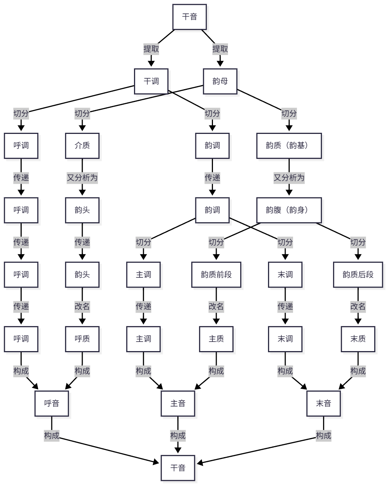
<figcaption>
图 5.3‑3后长干音的分析过程
</figcaption>
</figure>

在音元音节中，首音、呼音、主音和末音的音调，也就是说，首调、呼调、主调和末调，被统称为音元的音调；首音、呼音、主音和末音的音质，也就是说，首质、呼质、主质和末质，被统称为音元的音质。呼调、主调和末调，在后长干音中，依序就是与后长韵母的韵头、与后长韵母的韵质前段(韵腹前段)和与后长韵母的韵质后段(韵腹后段)联结的调段。当调类相同时，后长干音的呼调、主调和末调依序与三质干音的呼调、主调和末调相同。呼质、主质和末质，在后长干音中，依序就是后长韵母的韵头、后长韵母的韵质前段(韵腹前段)和后长韵母的韵质后段(韵腹后段)。在后长干音中，音元的音质根据质位、质素和《汉语拼音方案》三种方式记录列表见表
5.3‑7。

<table style="width:78%;">
<caption>
表 5.3‑7构成后长干音的音元的音质
</caption>
<colgroup>
<col style="width: 10%" />
<col style="width: 5%" />
<col style="width: 5%" />
<col style="width: 5%" />
<col style="width: 10%" />
<col style="width: 5%" />
<col style="width: 5%" />
<col style="width: 5%" />
<col style="width: 10%" />
<col style="width: 5%" />
<col style="width: 5%" />
</colgroup>
<tbody>
<tr>
<td colspan="4">质位</td>
<td colspan="4">质素</td>
<td colspan="3">《汉语拼音方案》</td>
</tr>
<tr>
<td>
质位

干质
</td>
<td>呼质</td>
<td>主质</td>
<td>末质</td>
<td>
质位

干质
</td>
<td>呼质</td>
<td>主质</td>
<td>末质</td>
<td>
质素

韵母
</td>
<td>韵头</td>
<td>韵腹</td>
</tr>
<tr>
<td>iᴀᴀ</td>
<td>i</td>
<td>ᴀ</td>
<td>ᴀ</td>
<td>[iᴀᴀ]</td>
<td>[i]</td>
<td>[ᴀ]</td>
<td>[ᴀ]</td>
<td>iɑ</td>
<td>i</td>
<td>ɑ</td>
</tr>
<tr>
<td>uᴀᴀ</td>
<td>u</td>
<td>ᴀ</td>
<td>ᴀ</td>
<td>[uᴀᴀ]</td>
<td>[u]</td>
<td>[ᴀ]</td>
<td>[ᴀ]</td>
<td>uɑ</td>
<td>u</td>
<td>ɑ</td>
</tr>
<tr>
<td>uoo</td>
<td>u</td>
<td>o</td>
<td>o</td>
<td>[uoo]</td>
<td>[u]</td>
<td>[o]</td>
<td>[o]</td>
<td>uo</td>
<td>u</td>
<td>o</td>
</tr>
<tr>
<td>iᴇᴇ</td>
<td>i</td>
<td>ᴇ</td>
<td>ᴇ</td>
<td>[iᴇᴇ]</td>
<td>[i]</td>
<td>[ᴇ]</td>
<td>[ᴇ]</td>
<td>ie</td>
<td>i</td>
<td>e</td>
</tr>
<tr>
<td>ʏᴇᴇ</td>
<td>ʏ</td>
<td>ᴇ</td>
<td>ᴇ</td>
<td>[ʏᴇᴇ]</td>
<td>[ʏ]</td>
<td>[ᴇ]</td>
<td>[ᴇ]</td>
<td>üe</td>
<td>ü</td>
<td>e</td>
</tr>
</tbody>
</table>

根据后长干音的分析过程代入每个后长干音就能把每个后长干音都分析成由音元构成的序列。例如，四个干调分别与韵母 uo[uo]构成的四个干音[uo⁵⁵]、[uo³⁵]、[uo²¹¹]和[uo⁵¹]的分析过程依序记作：

1. [uo⁵⁵]＝[u⁵o⁵⁵]＝[u⁵o⁵o⁵]＝[󰌪󰍒󰍒]＝ 󰌪󰍒󰍒。

2. [uo³⁵]＝[u³o⁴⁵]＝[u³o⁴o⁵]＝[󰌬󰍓󰍒]＝ 󰌮󰍓󰍒。

3. [uo²¹¹]＝[u²o¹¹]＝[u²o¹o¹]＝[󰌭󰍖󰍖]＝ 󰌮󰍖󰍖。

4. [uo⁵¹]＝[u⁵o⁴¹]＝[u⁵o⁴o¹]＝[󰌪󰍓󰍖]＝ 󰌪󰍓󰍖。

从这四个干音的分析过程中，省去中间环节，干音[uo⁵⁵]、[uo³⁵]、[uo²¹¹]和[uo⁵¹]的分析过程被简化成：

1. [uo⁵⁵]＝ 󰌪󰍒󰍒。

2. [uo³⁵]＝ 󰌮󰍓󰍒。

3. [uo²¹¹]＝ 󰌮󰍖󰍖。

4. [uo⁵¹]＝ 󰌪󰍓󰍖。

根据这四个干音的分析过程可知，干音[uo⁵⁵]、[uo³⁵]、[uo²¹¹]和[uo⁵¹]，在经过音元分析后，被分析成 󰌪󰍒󰍒、󰌮󰍓󰍒、󰌮󰍖󰍖、󰌪󰍓󰍖。

在经过音元分析后，后长干音的构成列表见表 5.3‑8。

|      |       |              |                  |                  |
| ---- | ----- | ------------ | ---------------- | ---------------- |
| 音元 | 片音  | 《国际音标》 | 《拼音拼音方案》 | 《注音符号方案》 |
| 󰌠󰌾󰌾  | [󰌠󰌾󰌾] | [iᴀ⁵⁵]       | i󰉜               | ㄧ 󰈃             |
| 󰌤󰌿󰌾  | [󰌢󰌿󰌾] | [iᴀ³⁵]       | i󰉝               | ㄧ 󰈔             |
| 󰌤󰍂󰍂  | [󰌣󰍂󰍂] | [iᴀ²¹¹]      | i󰉞               | ㄧ 󰈥             |
| 󰌠󰌿󰍂  | [󰌠󰌿󰍂] | [iᴀ⁵¹]       | i󰉟               | ㄧ 󰈶             |
| 󰌪󰌾󰌾  | [󰌪󰌾󰌾] | [uᴀ⁵⁵]       | u󰉜               | ㄨ 󰈃             |
| 󰌮󰌿󰌾  | [󰌬󰌿󰌾] | [uᴀ³⁵]       | u󰉝               | ㄨ 󰈔             |
| 󰌮󰍂󰍂  | [󰌭󰍂󰍂] | [uᴀ²¹¹]      | u󰉞               | ㄨ 󰈥             |
| 󰌪󰌿󰍂  | [󰌪󰌿󰍂] | [uᴀ⁵¹]       | u󰉟               | ㄨ 󰈶             |
| 󰌠󰍡󰍡  | [󰌠󰍡󰍡] | [iᴇ⁵⁵]       | i󰍧               | ㄧ 󰈆             |
| 󰌤󰍢󰍡  | [󰌢󰍢󰍡] | [iᴇ³⁵]       | i󰍦               | ㄧ 󰈗             |
| 󰌤󰍥󰍥  | [󰌣󰍥󰍥] | [iᴇ²¹¹]      | iě               | ㄧ 󰈨             |
| 󰌠󰍢󰍥  | [󰌠󰍢󰍥] | [iᴇ⁵¹]       | i󰍪               | ㄧ 󰈹             |
| 󰌴󰍡󰍡  | [󰌴󰍡󰍡] | [ʏᴇ⁵⁵]       | ü󰍧               | ㄩ 󰈆             |
| 󰌸󰍢󰍡  | [󰌶󰍢󰍡] | [ʏᴇ³⁵]       | ü󰍦               | ㄩ 󰈗             |
| 󰌸󰍥󰍥  | [󰌷󰍥󰍥] | [ʏᴇ²¹¹]      | üě               | ㄩ 󰈨             |
| 󰌴󰍢󰍥  | [󰌴󰍢󰍥] | [ʏᴇ⁵¹]       | ü󰍪               | ㄩ 󰈹             |
| 󰌠󰍒󰍒  | [󰌠󰍒󰍒] | [io⁵⁵]       | i󰍓               | ㄧ 󰈄             |
| 󰌤󰍓󰍒  | [󰌢󰍓󰍒] | [io³⁵]       | i󰍒               | ㄧ 󰈕             |
| 󰌤󰍖󰍖  | [󰌣󰍖󰍖] | [io²¹¹]      | iǒ               | ㄧ 󰈦             |
| 󰌠󰍓󰍖  | [󰌠󰍓󰍖] | [io⁵¹]       | i󰍖               | ㄧ 󰈷             |
| 󰌪󰍒󰍒  | [󰌪󰍒󰍒] | [uo⁵⁵]       | u󰉠               | ㄨ 󰈄             |
| 󰌮󰍓󰍒  | [󰌬󰍓󰍒] | [uo³⁵]       | u󰉡               | ㄨ 󰈕             |
| 󰌮󰍖󰍖  | [󰌭󰍖󰍖] | [uo²¹¹]      | u󰉢               | ㄨ 󰈦             |
| 󰌪󰍓󰍖  | [󰌪󰍓󰍖] | [uo⁵¹]       | u󰉣               | ㄨ 󰈷             |

表 5.3‑8 后长干音的构成

#### 单质干音的分析

单质干音由干调与单质韵母构成。在单质干音中，韵腹充当韵母，与韵腹联结的调段就是与韵母联结的调段就是干调。

根据单质干音的构成，单质干音记成：

$$
单质干音 = \begin{bmatrix}
干 & 调 \\
韵 & 腹
\end{bmatrix}
$$

把单质干音分析成音元序列的过程分为三步：

第一步，把干调分析成由呼调、主调和末调构成的序列。具体内容是：根据与韵腹联结的调段就是与韵母联结的调段就是干调，根据当调类相同时单质干音的干调与三质干音的干调相同，以三质干音的干调的分段结果为基准，把单质干音的干调分析成与三质干音的呼调、主调和末调对应相同的三段，从而把干调分析成由呼调、主调和末调构成的序列。

在把干调分析成由呼调、主调和末调构成的序列后，单质干音记成：

$$
单质干音 = \left. \ \begin{array}{r}
\begin{bmatrix}
\begin{matrix}
呼调 & 主调 & 末调
\end{matrix} \\
\begin{matrix}
韵 &&&&&& 母
\end{matrix}
\end{bmatrix}
\end{array} \right.
$$

第二步，把韵母分析成由呼质、主质和末质构成的序列。具体内容是：根据与韵腹联结的调段就是与韵母联结的调段就是干调和干调分成呼调、主调和末调三段，把韵母分析成由与呼调、与主调和与末调联结的音质，也就是说，把韵母分析成韵母前段、韵母中段和韵母后段；把与呼调、与主调和与末调联结的音质简称为呼质、主质和末质，也就是说，把韵母前段、韵母中段和韵母后段改名为呼质、主质和末质，从而把韵母分析成由呼质、主质和末质构成的序列。

单质韵母与后长韵母的对立，不是韵头有无的对立，而是单质韵母的前段和后长韵母的韵头的对立。因此，尽管单质韵母没有韵头，然而在质调关系上却存在与后长韵母的韵头相对的一段音质。换句话说，在单质干音中，在把干调分析成由呼调、主调和末调构成的序列后，存在一段与呼调联结的音质。这段音质就是呼质。单质韵母与前长韵母的对立，不是韵尾有无的对立，而是单质韵母的后段和前长韵母的韵尾的对立。因此，尽管单质韵母没有韵尾，然而在质调关系上却存在与前长韵母的韵尾相对的一段音质。换句话说，在单质干音中，在把干调分析成由呼调、主调和末调构成的序列后，存在一段与末调联结的音质。这段音质就是末质。因此，根据单质韵母既存在与后长韵母的韵头相对的一段音质又存在与前长韵母的韵尾相对的一段音质，单质韵母被分析成由呼质、主质和末质构成的序列。

在把韵母分析成由呼质、主质和末质构成的序列后，单质干音记成：

$$
单质干音 = \left. \ \begin{array}{r}
\begin{bmatrix}
呼调 & 主调 & 末调 \\
呼质 & 主质 & 末质
\end{bmatrix}
\end{array} \right.
$$

第三步，用音元来表示呼音、主音和末音。在单质干音中，在把干调分析成由呼调、主调和末调构成的序列和把韵母分析成由呼质、主质和末质构成的序列后，把由呼调与呼质、由主调与主质和由末调与末质构成的音段从结构上分析成呼音、主音和末音，把充当呼音、主音或末音的音段分析成片音，确定表示片音的音元，干音就被分析成由三个音元所表示的呼音、主音和末音构成的序列。

在把干音分析成由三个音元所表示的呼音、主音和末音构成的序列后，单质干音记成：

$$
干音 = \begin{bmatrix}
呼音 & 主音 & 末音
\end{bmatrix}
$$

单质干音的分析过程图示如图 5.3‑4。

<figure>
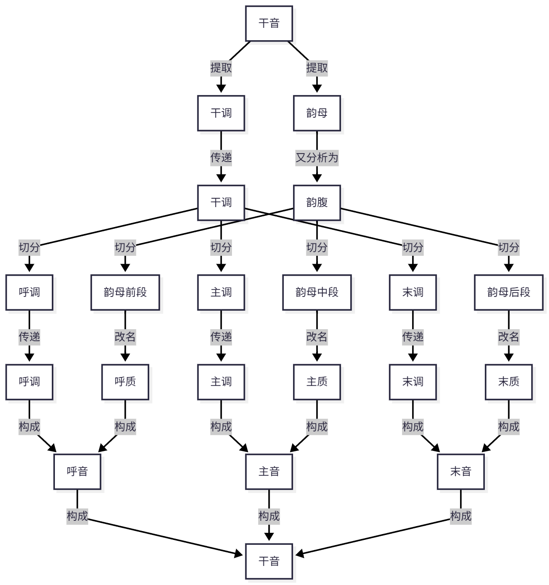
<figcaption>
图 5.3‑4单质干音的分析过程
</figcaption>
</figure>

在音元音节中，首音、呼音、主音和末音的音调，也就是说，首调、呼调、主调和末调，被统称为音元的音调；首音、呼音、主音和末音的音质，也就是说，首质、呼质、主质和末质，被统称为音元的音质。

呼调、主调和末调，在单质干音中，依序就是与单质韵母的韵母前段、韵母中段和韵母后段联结的调段。当调类相同时，单质干音的呼调、主调和末调依序与三质干音的呼调、主调和末调相同。

呼质、主质和末质，在单质干音中，依序就是单质韵母的韵母前段、韵母中段和韵母后段。

在单质干音中，音元的音质根据质位、质素和《汉语拼音方案》三种方式记录列表见表
5.3‑9。

<table style="width:78%;">
<caption>
表 5.3‑9构成单质干音的音元的音质
</caption>
<colgroup>
<col style="width: 11%" />
<col style="width: 6%" />
<col style="width: 6%" />
<col style="width: 6%" />
<col style="width: 11%" />
<col style="width: 6%" />
<col style="width: 6%" />
<col style="width: 6%" />
<col style="width: 12%" />
<col style="width: 7%" />
</colgroup>
<tbody>
<tr>
<td colspan="4">质位</td>
<td colspan="4">质素</td>
<td colspan="2">《汉语拼音方案》</td>
</tr>
<tr>
<td>
质位

干质
</td>
<td>呼质</td>
<td>主质</td>
<td>末质</td>
<td>
质位

干质
</td>
<td>呼质</td>
<td>主质</td>
<td>末质</td>
<td>
质素

韵母
</td>
<td>韵母</td>
</tr>
<tr>
<td>iii</td>
<td>i</td>
<td>i</td>
<td>i</td>
<td>[i]</td>
<td>[i]</td>
<td>[i]</td>
<td>[i]</td>
<td>i</td>
<td>i</td>
</tr>
<tr>
<td>uuu</td>
<td>u</td>
<td>u</td>
<td>u</td>
<td>[u]</td>
<td>[u]</td>
<td>[u]</td>
<td>[u]</td>
<td>u</td>
<td>u</td>
</tr>
<tr>
<td>ʏʏʏ</td>
<td>ʏ</td>
<td>ʏ</td>
<td>ʏ</td>
<td>[ʏ]</td>
<td>[ʏ]</td>
<td>[ʏ]</td>
<td>[ʏ]</td>
<td>ü</td>
<td>ü</td>
</tr>
<tr>
<td>ᴀᴀᴀ</td>
<td>ᴀ</td>
<td>ᴀ</td>
<td>ᴀ</td>
<td>[ᴀ]</td>
<td>[ᴀ]</td>
<td>[ᴀ]</td>
<td>[ᴀ]</td>
<td>ɑ</td>
<td>ɑ</td>
</tr>
<tr>
<td rowspan="2">ooo</td>
<td rowspan="2">o</td>
<td rowspan="2">o</td>
<td rowspan="2">o</td>
<td>[o]</td>
<td>[o]</td>
<td>[o]</td>
<td>[o]</td>
<td>o</td>
<td>o</td>
</tr>
<tr>
<td>[ɤ]</td>
<td>[ɤ]</td>
<td>[ɤ]</td>
<td>[ɤ]</td>
<td>e</td>
<td>e</td>
</tr>
<tr>
<td>ᴇᴇᴇ</td>
<td>ᴇ</td>
<td>ᴇ</td>
<td>ᴇ</td>
<td>[ᴇ]</td>
<td>[ᴇ]</td>
<td>[ᴇ]</td>
<td>[ᴇ]</td>
<td>ê</td>
<td>ê</td>
</tr>
<tr>
<td rowspan="2">󰉺󰉺󰉺</td>
<td rowspan="2">󰉺</td>
<td rowspan="2">󰉺</td>
<td rowspan="2">󰉺</td>
<td>[ɿ]</td>
<td>[ɿ]</td>
<td>[ɿ]</td>
<td>[ɿ]</td>
<td rowspan="2">i</td>
<td rowspan="2">i</td>
</tr>
<tr>
<td>[ʅ]</td>
<td>[ʅ]</td>
<td>[ʅ]</td>
<td>[ʅ]</td>
</tr>
<tr>
<td>󰉻󰉻󰉻</td>
<td>󰉻</td>
<td>󰉻</td>
<td>󰉻</td>
<td>[ɚ]</td>
<td>[ɚ]</td>
<td>[ɚ]</td>
<td>[ɚ]</td>
<td>er</td>
<td>er</td>
</tr>
<tr>
<td>nnn</td>
<td>n</td>
<td>n</td>
<td>n</td>
<td>[n]</td>
<td>[n]</td>
<td>[n]</td>
<td>[n]</td>
<td>n</td>
<td>n</td>
</tr>
<tr>
<td>ŋŋŋ</td>
<td>ŋ</td>
<td>ŋ</td>
<td>ŋ</td>
<td>[ŋ]</td>
<td>[ŋ]</td>
<td>[ŋ]</td>
<td>[ŋ]</td>
<td>nɡ</td>
<td>nɡ</td>
</tr>
</tbody>
</table>

根据单质干音的分析过程代入每个单质干音就能把每个单质干音都分析成由音元构成的序列。例如，四个干调分别与韵母 o[o]构成的四个干音[o⁵⁵]、[o³⁵]、[o²¹¹]和[o⁵¹]的分析过程依序记作：

1. [o⁵⁵]＝[o⁵o⁵⁵]＝[o⁵o⁵o⁵]＝ 󰍒󰍒󰍒 ＝ 󰍒󰍒󰍒。

2. [o³⁵]＝[o³o⁴⁵]＝[o³o⁴o⁵]＝ 󰍔󰍓󰍒 ＝ 󰍖󰍓󰍒。

3. [o²¹¹]＝[o²o¹¹]＝[o²o¹o¹]＝ 󰍕󰍖󰍖 ＝ 󰍖󰍖󰍖。

4. [o⁵¹]＝[o⁵o⁴¹]＝[o⁵o⁴o¹]＝ 󰍒󰍓󰍖 ＝ 󰍒󰍓󰍖。

从这四个干音的分析过程中，省去中间环节，干音[o⁵⁵]、[o³⁵]、[o²¹¹]和[o⁵¹]的分析过程被简化成：

1. [o⁵⁵]＝ 󰍒󰍒󰍒。

2. [o³⁵]＝ 󰍖󰍓󰍒。

3. [o²¹¹]＝ 󰍖󰍖󰍖。

4. [o⁵¹]＝ 󰍒󰍓󰍖。

根据这四个干音的分析过程可知，干音[o⁵⁵]、[o³⁵]、[o²¹¹]和[o⁵¹]，在经过音元分析后，被分析成 󰍒󰍒󰍒、󰍖󰍓󰍒、󰍖󰍖󰍖、󰍒󰍓󰍖。

在经过音元分析后，单质干音的构成列表见表 5.3‑10。

<table style="width:77%;">
<caption>
表 5.3‑10单质干音的构成
</caption>
<colgroup>
<col style="width: 7%" />
<col style="width: 9%" />
<col style="width: 16%" />
<col style="width: 21%" />
<col style="width: 21%" />
</colgroup>
<tbody>
<tr>
<td>音元</td>
<td>片音</td>
<td>《国际音标》</td>
<td>《汉语拼音方案》</td>
<td>《注音符号方案》</td>
</tr>
<tr>
<td>󰌠󰌠󰌠</td>
<td>[󰌠󰌠󰌠]</td>
<td>[i⁵⁵]</td>
<td>󰌡</td>
<td>󰈀</td>
</tr>
<tr>
<td>󰌤󰌡󰌠</td>
<td>[󰌢󰌡󰌠]</td>
<td>[i³⁵]</td>
<td>󰌠</td>
<td>󰈑</td>
</tr>
<tr>
<td>󰌤󰌤󰌤</td>
<td>[󰌣󰌤󰌤]</td>
<td>[i²¹¹]</td>
<td>ǐ</td>
<td>󰈢</td>
</tr>
<tr>
<td>󰌠󰌡󰌤</td>
<td>[󰌠󰌡󰌤]</td>
<td>[i⁵¹]</td>
<td>󰌤</td>
<td>󰈳</td>
</tr>
<tr>
<td>󰌪󰌪󰌪</td>
<td>[󰌪󰌪󰌪]</td>
<td>[u⁵⁵]</td>
<td>󰉔</td>
<td>󰈁</td>
</tr>
<tr>
<td>󰌮󰌫󰌪</td>
<td>[󰌬󰌫󰌪]</td>
<td>[u³⁵]</td>
<td>󰉕</td>
<td>󰈒</td>
</tr>
<tr>
<td>󰌮󰌮󰌮</td>
<td>[󰌭󰌮󰌮]</td>
<td>[u²¹¹]</td>
<td>󰉖</td>
<td>󰈣</td>
</tr>
<tr>
<td>󰌪󰌫󰌮</td>
<td>[󰌪󰌫󰌮]</td>
<td>[u⁵¹]</td>
<td>󰉗</td>
<td>󰈴</td>
</tr>
<tr>
<td>󰌴󰌴󰌴</td>
<td>[󰌴󰌴󰌴]</td>
<td>[ʏ⁵⁵]</td>
<td>󰉘</td>
<td>󰈂</td>
</tr>
<tr>
<td>󰌸󰌵󰌴</td>
<td>[󰌶󰌵󰌴]</td>
<td>[ʏ³⁵]</td>
<td>󰉙</td>
<td>󰈓</td>
</tr>
<tr>
<td>󰌸󰌸󰌸</td>
<td>[󰌷󰌸󰌸]</td>
<td>[ʏ²¹¹]</td>
<td>󰉚</td>
<td>󰈤</td>
</tr>
<tr>
<td>󰌴󰌵󰌸</td>
<td>[󰌴󰌵󰌸]</td>
<td>[ʏ⁵¹]</td>
<td>󰉛</td>
<td>󰈵</td>
</tr>
<tr>
<td>󰌾󰌾󰌾</td>
<td>[󰌾󰌾󰌾]</td>
<td>[ᴀ⁵⁵]</td>
<td>󰉜</td>
<td>󰈃</td>
</tr>
<tr>
<td>󰍂󰌿󰌾</td>
<td>[󰍀󰌿󰌾]</td>
<td>[ᴀ³⁵]</td>
<td>󰉝</td>
<td>󰈔</td>
</tr>
<tr>
<td>󰍂󰍂󰍂</td>
<td>[󰍁󰍂󰍂]</td>
<td>[ᴀ²¹¹]</td>
<td>󰉞</td>
<td>󰈥</td>
</tr>
<tr>
<td>󰌾󰌿󰍂</td>
<td>[󰌾󰌿󰍂]</td>
<td>[ᴀ⁵¹]</td>
<td>󰉟</td>
<td>󰈶</td>
</tr>
<tr>
<td rowspan="2">󰍒󰍒󰍒</td>
<td>[󰍒󰍒󰍒]</td>
<td>[o⁵⁵]</td>
<td>󰉠</td>
<td rowspan="2">󰈄</td>
</tr>
<tr>
<td>[󰍗󰍗󰍗]</td>
<td>[ɤ⁵⁵]</td>
<td>󰍧</td>
</tr>
<tr>
<td rowspan="2">󰍖󰍓󰍒</td>
<td>[󰍔󰍓󰍒]</td>
<td>[o³⁵]</td>
<td>󰉡</td>
<td rowspan="2">󰈕</td>
</tr>
<tr>
<td>[󰍙󰍘󰍗]</td>
<td>[ɤ³⁵]</td>
<td>󰍦</td>
</tr>
<tr>
<td rowspan="2">󰍖󰍖󰍖</td>
<td>[󰍕󰍖󰍖]</td>
<td>[o²¹¹]</td>
<td>󰉢</td>
<td rowspan="2">󰈦</td>
</tr>
<tr>
<td>[󰍚󰍛󰍛]</td>
<td>[ɤ²¹¹]</td>
<td>ě</td>
</tr>
<tr>
<td rowspan="2">󰍒󰍓󰍖</td>
<td>[󰍒󰍓󰍖]</td>
<td>[o⁵¹]</td>
<td>󰉣</td>
<td rowspan="2">󰈷</td>
</tr>
<tr>
<td>[󰍗󰍘󰍛]</td>
<td>[ɤ⁵¹]</td>
<td>󰍪</td>
</tr>
<tr>
<td>󰍡󰍡󰍡</td>
<td>[󰍡󰍡󰍡]</td>
<td>[ᴇ⁵⁵]</td>
<td>󰉨</td>
<td>󰈆</td>
</tr>
<tr>
<td>󰍥󰍢󰍡</td>
<td>[󰍣󰍢󰍡]</td>
<td>[ᴇ³⁵]</td>
<td>ế</td>
<td>󰈗</td>
</tr>
<tr>
<td>󰍥󰍥󰍥</td>
<td>[󰍤󰍥󰍥]</td>
<td>[ᴇ²¹¹]</td>
<td>󰉪</td>
<td>󰈨</td>
</tr>
<tr>
<td>󰍡󰍢󰍥</td>
<td>[󰍡󰍢󰍥]</td>
<td>[ᴇ⁵¹]</td>
<td>ề</td>
<td>󰈹</td>
</tr>
<tr>
<td rowspan="2">󰍵󰍵󰍵</td>
<td>[󰍺󰍺󰍺]</td>
<td>[ɿ⁵⁵]</td>
<td rowspan="2">󰌡</td>
<td rowspan="2">󰈐</td>
</tr>
<tr>
<td>[󰍿󰍿󰍿]</td>
<td>[ʅ⁵⁵]</td>
</tr>
<tr>
<td rowspan="2">󰍹󰍶󰍵</td>
<td>[󰍼󰍻󰍺]</td>
<td>[ɿ³⁵]</td>
<td rowspan="2">󰌠</td>
<td rowspan="2">󰈡</td>
</tr>
<tr>
<td>[󰎁󰎀󰍿]</td>
<td>[ʅ³⁵]</td>
</tr>
<tr>
<td rowspan="2">󰍹󰍹󰍹</td>
<td>[󰍽󰍾󰍾]</td>
<td>[ɿ²¹¹]</td>
<td rowspan="2">ǐ</td>
<td rowspan="2">󰈲</td>
</tr>
<tr>
<td>[󰎂󰎃󰎃]</td>
<td>[ʅ²¹¹]</td>
</tr>
<tr>
<td rowspan="2">󰍵󰍶󰍹</td>
<td>[󰍺󰍻󰍾]</td>
<td>[ɿ⁵¹]</td>
<td rowspan="2">󰌤</td>
<td rowspan="2">󰉃</td>
</tr>
<tr>
<td>[󰍿󰎀󰎃]</td>
<td>[ʅ⁵¹]</td>
</tr>
<tr>
<td>󰎄󰎄󰎄</td>
<td>[󰎉󰎉󰎉]</td>
<td>[ɚ⁵⁵]</td>
<td>󰍧r</td>
<td>󰈏</td>
</tr>
<tr>
<td>󰎈󰎅󰎄</td>
<td>[󰎋󰎊󰎉]</td>
<td>[ɚ³⁵]</td>
<td>󰍦r</td>
<td>󰈠</td>
</tr>
<tr>
<td>󰎈󰎈󰎈</td>
<td>[󰎌󰎍󰎍]</td>
<td>[ɚ²¹¹]</td>
<td>ěr</td>
<td>󰈱</td>
</tr>
<tr>
<td>󰎄󰎅󰎈</td>
<td>[󰎉󰎊󰎍]</td>
<td>[ɚ⁵¹]</td>
<td>󰍪r</td>
<td>󰉂</td>
</tr>
<tr>
<td>󰎓󰎓󰎓</td>
<td>[󰎓󰎓󰎓]</td>
<td>[n⁵⁵]</td>
<td>󰉬</td>
<td></td>
</tr>
<tr>
<td>󰎗󰎔󰎓</td>
<td>[󰎗󰎔󰎓]</td>
<td>[n³⁵]</td>
<td>󰉭</td>
<td></td>
</tr>
<tr>
<td>󰎗󰎗󰎗</td>
<td>[󰎗󰎗󰎗]</td>
<td>[n²¹¹]</td>
<td>󰉮</td>
<td></td>
</tr>
<tr>
<td>󰎓󰎔󰎗</td>
<td>[󰎓󰎔󰎗]</td>
<td>[n⁵¹]</td>
<td>󰉯</td>
<td></td>
</tr>
<tr>
<td>󰎘󰎘󰎘</td>
<td>[󰎘󰎘󰎘]</td>
<td>[ŋ⁵⁵]</td>
<td>󰉬ɡ</td>
<td></td>
</tr>
<tr>
<td>󰎜󰎙󰎘</td>
<td>[󰎜󰎙󰎘]</td>
<td>[ŋ³⁵]</td>
<td>󰉭ɡ</td>
<td></td>
</tr>
<tr>
<td>󰎜󰎜󰎜</td>
<td>[󰎜󰎜󰎜]</td>
<td>[ŋ²¹¹]</td>
<td>󰉮ɡ</td>
<td></td>
</tr>
<tr>
<td>󰎘󰎙󰎜</td>
<td>[󰎘󰎙󰎜]</td>
<td>[ŋ⁵¹]</td>
<td>󰉯ɡ</td>
<td></td>
</tr>
</tbody>
</table>

在经过音元分析后，在单质干音中，呼音是由呼调与呼质构成的音段。根据节调质素分析法解说，呼调指与韵母前段联结的调段；呼质指韵母前段。在单质干音中，把充当韵母的韵腹分析成与呼调联结的韵母前段、与主调联结的韵母中段和与末调联结的韵母后段三段，呼调就是与韵母前段联结的调段，呼质就是韵母前段。因此，呼音就是由韵母前段和与其联结的调段构成的音段。

在经过音元分析后，在单质干音中，主音是由主调与主质构成的音段。根据节调质素分析法解说，主调指与韵母中段联结的调段；主质指韵母中段。在单质干音中，把充当韵母的韵腹分析成与呼调联结的韵母前段、与主调联结的韵母中段和与末调联结的韵母后段三段，主调就是与韵母中段联结的调段，主质就是韵母中段。因此，主音就是由韵母中段和与其联结的调段构成的音段。

在经过音元分析后，在单质干音中，末音是由末调与末质构成的音段。根据节调质素分析法解说，末调指与韵母后段联结的调段；末质指韵母后段。在单质干音中，把充当韵母的韵腹分析成与呼调联结的韵母前段、与主调联结的韵母中段和与末调联结的韵母后段三段，末调就是与韵母后段联结的调段，末质就是韵母后段。因此，末音就是由韵母后段和与其联结的调段构成的音段。

综述说明，单质干音由呼音、主音和末音构成。

### 干音的分析模型

在分别把各类干音分析成音元序列后，必需以对各类干音的音元分析为基础构建一个对全类干音都适用的一般程式或分析模型。

根据分别把各类干音分析成音元序列的过程可知，无论干音是哪类干音，把干音分析成音元序列，都需首先把干调分析成由呼调、主调和末调构成的序列和把韵母分析成由呼质、主质和末质构成的序列。

把干调分析成由呼调、主调和末调构成的序列，由于构成各类干音的韵母的类型不同，细节各有不同。

把干调分析成由呼调、主调和末调构成的序列，根据干音类型说明，具体内容分为四种情况：

在三质干音中，具体内容是：划分与韵头、与韵腹和与韵尾相联结的调段，并把析出的三个调段命名为呼调、主调和末调。

在前长干音中，具体内容是：划分与韵腹和与韵尾相联结的调段，并把析出的两个调段命名为间调和末调。然后，根据当调类相同时前长干音的干调与三质干音的干调相同，以三质干音的干调的分段结果为基准，把间调分析成与三质干音的呼调和主调对应相同的两段，也就是说，把前长干音的干调分析成与三质干音的呼调、主调和末调对应相同的三段，从而把干调分析成由呼调、主调和末调构成的序列。

在后长干音中，具体内容是：划分与韵头和与韵腹相联结的调段，并把析出的两个调段命名为呼调和韵调。然后，根据当调类相同时后长干音的干调与三质干音的干调相同，以三质干音的干调的分段结果为基准，把韵调分析成与三质干音的主调和末调对应相同的两段，也就是说，把后长干音的干调分析成与三质干音的呼调、主调和末调对应相同的三段，从而把干调分析成由呼调、主调和末调构成的序列。

在单质干音中，具体内容是：根据与韵腹联结的调段就是与韵母联结的调段就是干调，根据当调类相同时单质干音的干调与三质干音的干调相同，以三质干音的干调的分段结果为基准，把单质干音的干调分析成与三质干音的呼调、主调和末调对应相同的三段，从而把干调分析成由呼调、主调和末调构成的序列。

把韵母分析成由呼质、主质和末质构成的序列，就是在把干调分析成由呼调、主调和末调构成的序列时同时把各类干音的韵母都分析成由与呼调、与主调和与末调联结的音质构成的序列，并把与呼调、与主调和与末调联结的音质简称为呼质、主质和末质，从而把韵母分析成由呼质、主质和末质构成的序列。把韵母分析成由呼质、主质和末质构成的序列，根据干音类型说明，具体内容分为四种情况：

在三质干音中，具体内容是：根据韵头、韵腹和韵尾是与呼调、与主调和与末调联结的音质，把与呼调、与主调和与末调联结的音质简称为呼质、主质和末质，也就是说，把韵头、韵腹和韵尾改名为呼质、主质和末质，从而把韵母分析成由呼质、主质和末质构成的序列。

在前长干音中，具体内容是：根据韵腹充当间质、与间质联结的调段是间调和间调分成呼调和主调两段，把韵腹分析成与呼调和与主调联结的音质，也就是说，把间质分析成间质前段和间质后段；根据末调是与韵尾联结的调段，把韵尾分析成与末调联结的音质；把与呼调、与主调和与末调联结的音质简称为呼质、主质和末质，也就是说，把间质前段、间质后段和韵尾改名为呼质、主质和末质，从而把韵母分析成由呼质、主质和末质构成的序列。

在后长干音中，具体内容是：根据呼调是与韵头联结的调段，把韵头分析成与呼调联结的音质；根据韵腹充当韵质、与韵质联结的调段是韵调和韵调分成主调和末调两段，把韵腹分析成与主调和与末调联结的音质，也就是说，把韵质分析成韵质前段和韵质后段；把与呼调、与主调和与末调联结的音质简称为呼质、主质和末质，也就是说，把韵头、韵质前段和韵质后段改名为呼质、主质和末质，从而把韵母分析成由呼质、主质和末质构成的序列。

在单质干音中，具体内容是：根据与韵腹联结的调段就是与韵母联结的调段就是干调和干调分成呼调、主调和末调三段，把韵母分析成由与呼调、与主调和与末调联结的音质，也就是说，把韵母分析成韵母前段、韵母中段和韵母后段；把与呼调、与主调和与末调联结的音质简称为呼质、主质和末质，也就是说，把韵母前段、韵母中段和韵母后段改名为呼质、主质和末质，从而把韵母分析成由呼质、主质和末质构成的序列。

在把干调分析成由呼调、主调和末调构成的序列和把韵母分析成由呼质、主质和末质构成的序列后，各类干音记成：

$$
干音 = \left. \ \begin{array}{r}
\begin{bmatrix}
呼调 & 主调 & 末调 \\
呼质 & 主质 & 末质
\end{bmatrix}
\end{array} \right.
$$

根据分别把各类干音分析成音元序列的过程可知，无论干音是哪类干音，把干音分析成音元序列，在把干调分析成由呼调、主调和末调构成的序列和把韵母分析成由呼质、主质和末质构成的序列后，结果都是：把由呼调与呼质、由主调与主质和由末调与末质构成的音段从结构上分析成呼音、主音和末音，把充当呼音、主音或末音的音段分析成片音，确定表示片音的音元，从而把干音分析成由三个音元所表示的呼音、主音和末音构成的序列。

在经过音元分析后，各类干音记成：

$$
干音 = \begin{bmatrix}
呼音 & 主音 & 末音
\end{bmatrix}
$$

这个程式，就是干音的一般程式或分析模型。换句话说，在经过音元分析后，干音的结构通式是：[呼音
主音
末音]。干音的结构通式指从形式上表示全类干音的音元个数都相等的音元序列，又叫干音的等数音元序列。

综述可知，在经过音元分析后，各类干音，无论韵母是单质韵母、后长韵母、前长韵母还是三质韵母，无论节调是高调阴平、升调阳平、低调上声还是降调去声，都被分析成由表示呼音、主音和末音的三个音元构成的音元序列。

由于音元是用来表示片音的变元，因此，在记音时，干音既可以根据音元记音也可以根据片音记音。

干音根据音元、片音和《汉语拼音方案》三种记音方式记音的对应关系，列表见表
5.3‑11。

<table>
<caption>
表
5.3‑11干音根据音元、片音和《汉语拼音方案》三种记音方式记音的对应关系
</caption>
<colgroup>
<col style="width: 7%" />
<col style="width: 7%" />
<col style="width: 7%" />
<col style="width: 7%" />
<col style="width: 7%" />
<col style="width: 8%" />
<col style="width: 8%" />
<col style="width: 8%" />
<col style="width: 8%" />
<col style="width: 7%" />
<col style="width: 7%" />
<col style="width: 7%" />
<col style="width: 7%" />
</colgroup>
<thead>
<tr>
<th></th>
<th colspan="4">音元</th>
<th colspan="4">片音</th>
<th colspan="4">《汉语拼音方案》</th>
</tr>
<tr>
<th style="text-align: left;">
干调

干质
</th>
<th>阴平</th>
<th>阳平</th>
<th>上声</th>
<th>去声</th>
<th>阴平</th>
<th>阳平</th>
<th>上声</th>
<th>去声</th>
<th>阴平</th>
<th>阳平</th>
<th>上声</th>
<th>去声</th>
</tr>
</thead>
<tbody>
<tr>
<td>i</td>
<td>󰌠󰌠󰌠</td>
<td>󰌤󰌡󰌠</td>
<td>󰌤󰌤󰌤</td>
<td>󰌠󰌡󰌤</td>
<td>[󰌠󰌠󰌠]</td>
<td>[󰌢󰌡󰌠]</td>
<td>[󰌣󰌤󰌤]</td>
<td>[󰌠󰌡󰌤]</td>
<td>󰌡</td>
<td>󰌠</td>
<td>ǐ</td>
<td>󰌤</td>
</tr>
<tr>
<td>u</td>
<td>󰌪󰌪󰌪</td>
<td>󰌮󰌫󰌪</td>
<td>󰌮󰌮󰌮</td>
<td>󰌪󰌫󰌮</td>
<td>[󰌪󰌪󰌪]</td>
<td>[󰌬󰌫󰌪]</td>
<td>[󰌭󰌮󰌮]</td>
<td>[󰌪󰌫󰌮]</td>
<td>󰉔</td>
<td>󰉕</td>
<td>󰉖</td>
<td>󰉗</td>
</tr>
<tr>
<td>ʏ</td>
<td>󰌴󰌴󰌴</td>
<td>󰌸󰌵󰌴</td>
<td>󰌸󰌸󰌸</td>
<td>󰌴󰌵󰌸</td>
<td>[󰌴󰌴󰌴]</td>
<td>[󰌶󰌵󰌴]</td>
<td>[󰌷󰌸󰌸]</td>
<td>[󰌴󰌵󰌸]</td>
<td>󰉘</td>
<td>󰉙</td>
<td>󰉚</td>
<td>󰉛</td>
</tr>
<tr>
<td>a</td>
<td>󰌾󰌾󰌾</td>
<td>󰍂󰌿󰌾</td>
<td>󰍂󰍂󰍂</td>
<td>󰌾󰌿󰍂</td>
<td>[󰌾󰌾󰌾]</td>
<td>[󰍀󰌿󰌾]</td>
<td>[󰍁󰍂󰍂]</td>
<td>[󰌾󰌿󰍂]</td>
<td>󰉜</td>
<td>󰉝</td>
<td>󰉞</td>
<td>󰉟</td>
</tr>
<tr>
<td rowspan="2">o</td>
<td rowspan="2">󰍒󰍒󰍒</td>
<td rowspan="2">󰍖󰍓󰍒</td>
<td rowspan="2">󰍖󰍖󰍖</td>
<td rowspan="2">󰍒󰍓󰍖</td>
<td>[󰍒󰍒󰍒]</td>
<td>[󰍔󰍓󰍒]</td>
<td>[󰍕󰍖󰍖]</td>
<td>[󰍒󰍓󰍖]</td>
<td>󰉠</td>
<td>󰉡</td>
<td>󰉢</td>
<td>󰉣</td>
</tr>
<tr>
<td>[󰍗󰍗󰍗]</td>
<td>[󰍙󰍘󰍗]</td>
<td>[󰍚󰍛󰍛]</td>
<td>[󰍗󰍘󰍛]</td>
<td>󰍧</td>
<td>󰍦</td>
<td>ě</td>
<td>󰍪</td>
</tr>
<tr>
<td>e</td>
<td>󰍡󰍡󰍡</td>
<td>󰍥󰍢󰍡</td>
<td>󰍥󰍥󰍥</td>
<td>󰍡󰍢󰍥</td>
<td>[󰍡󰍡󰍡]</td>
<td>[󰍣󰍢󰍡]</td>
<td>[󰍤󰍥󰍥]</td>
<td>[󰍡󰍢󰍥]</td>
<td>󰉨</td>
<td>ế</td>
<td>󰉪</td>
<td>ề</td>
</tr>
<tr>
<td rowspan="2">󰉺</td>
<td rowspan="2">󰍵󰍵󰍵</td>
<td rowspan="2">󰍹󰍶󰍵</td>
<td rowspan="2">󰍹󰍹󰍹</td>
<td rowspan="2">󰍵󰍶󰍹</td>
<td>[󰍺󰍺󰍺]</td>
<td>[󰍼󰍻󰍺]</td>
<td>[󰍽󰍾󰍾]</td>
<td>[󰍺󰍻󰍾]</td>
<td rowspan="2">󰌡</td>
<td rowspan="2">󰌠</td>
<td rowspan="2">ǐ</td>
<td rowspan="2">󰌤</td>
</tr>
<tr>
<td>[󰍿󰍿󰍿]</td>
<td>[󰎁󰎀󰍿]</td>
<td>[󰎂󰎃󰎃]</td>
<td>[󰍿󰎀󰎃]</td>
</tr>
<tr>
<td>󰉻</td>
<td>󰎄󰎄󰎄</td>
<td>󰎈󰎅󰎄</td>
<td>󰎈󰎈󰎈</td>
<td>󰎄󰎅󰎈</td>
<td>[󰎉󰎉󰎉]</td>
<td>[󰎋󰎊󰎉]</td>
<td>[󰎌󰎍󰎍]</td>
<td>[󰎉󰎊󰎍]</td>
<td>r</td>
<td>󰍦r</td>
<td>ěr</td>
<td>󰍪r</td>
</tr>
<tr>
<td>n</td>
<td>󰎓󰎓󰎓</td>
<td>󰎗󰎔󰎓</td>
<td>󰎗󰎗󰎗</td>
<td>󰎓󰎔󰎗</td>
<td>[󰎓󰎓󰎓]</td>
<td>[󰎕󰎔󰎓]</td>
<td>[󰎖󰎗󰎗]</td>
<td>[󰎓󰎔󰎗]</td>
<td>󰉬</td>
<td>󰉭</td>
<td>󰉮</td>
<td>󰉯</td>
</tr>
<tr>
<td>ŋ</td>
<td>󰎘󰎘󰎘</td>
<td>󰎜󰎙󰎘</td>
<td>󰎜󰎜󰎜</td>
<td>󰎘󰎙󰎜</td>
<td>[󰎘󰎘󰎘]</td>
<td>[󰎚󰎙󰎘]</td>
<td>[󰎛󰎜󰎜]</td>
<td>[󰎘󰎙󰎜]</td>
<td>󰉬ɡ</td>
<td>󰉭ɡ</td>
<td>󰉮ɡ</td>
<td>󰉯ɡ</td>
</tr>
<tr>
<td>ia</td>
<td>󰌠󰌾󰌾</td>
<td>󰌤󰌿󰌾</td>
<td>󰌤󰍂󰍂</td>
<td>󰌠󰌿󰍂</td>
<td>[󰌠󰌾󰌾]</td>
<td>[󰌢󰌿󰌾]</td>
<td>[󰌣󰍂󰍂]</td>
<td>[󰌠󰌿󰍂]</td>
<td>i󰉜</td>
<td>i󰉝</td>
<td>i󰉞</td>
<td>i󰉟</td>
</tr>
<tr>
<td>ua</td>
<td>󰌪󰌾󰌾</td>
<td>󰌮󰌿󰌾</td>
<td>󰌮󰍂󰍂</td>
<td>󰌪󰌿󰍂</td>
<td>[󰌪󰌾󰌾]</td>
<td>[󰌬󰌿󰌾]</td>
<td>[󰌭󰍂󰍂]</td>
<td>[󰌪󰌿󰍂]</td>
<td>u󰉜</td>
<td>u󰉝</td>
<td>u󰉞</td>
<td>u󰉟</td>
</tr>
<tr>
<td>uo</td>
<td>󰌪󰍒󰍒</td>
<td>󰌮󰍓󰍒</td>
<td>󰌮󰍖󰍖</td>
<td>󰌪󰍓󰍖</td>
<td>[󰌪󰍒󰍒]</td>
<td>[󰌬󰍓󰍒]</td>
<td>[󰌭󰍖󰍖]</td>
<td>[󰌪󰍓󰍖]</td>
<td>u󰉠</td>
<td>u󰉡</td>
<td>u󰉢</td>
<td>u󰉣</td>
</tr>
<tr>
<td>ie</td>
<td>󰌠󰍡󰍡</td>
<td>󰌤󰍢󰍡</td>
<td>󰌤󰍥󰍥</td>
<td>󰌠󰍢󰍥</td>
<td>[󰌠󰍡󰍡]</td>
<td>[󰌢󰍢󰍡]</td>
<td>[󰌣󰍥󰍥]</td>
<td>[󰌠󰍢󰍥]</td>
<td>i󰍧</td>
<td>i󰍦</td>
<td>iě</td>
<td>i󰍪</td>
</tr>
<tr>
<td>ʏᴇ</td>
<td>󰌴󰍡󰍡</td>
<td>󰌸󰍢󰍡</td>
<td>󰌸󰍥󰍥</td>
<td>󰌴󰍢󰍥</td>
<td>[󰌴󰍡󰍡]</td>
<td>[󰌶󰍢󰍡]</td>
<td>[󰌷󰍥󰍥]</td>
<td>[󰌴󰍢󰍥]</td>
<td>ü󰍧</td>
<td>ü󰍦</td>
<td>üě</td>
<td>ü󰍪</td>
</tr>
<tr>
<td>ᴀi</td>
<td>󰌾󰌾󰌠</td>
<td>󰍂󰌿󰌠</td>
<td>󰍂󰍂󰌤</td>
<td>󰌾󰌿󰌤</td>
<td>[󰍈󰍈󰌥]</td>
<td>[󰍊󰍉󰌥]</td>
<td>[󰍋󰍌󰌩]</td>
<td>[󰍈󰍉󰌩]</td>
<td>󰉜i</td>
<td>󰉝i</td>
<td>󰉞i</td>
<td>󰉟i</td>
</tr>
<tr>
<td>ᴇi</td>
<td>󰍡󰍡󰌠</td>
<td>󰍥󰍢󰌠</td>
<td>󰍥󰍥󰌤</td>
<td>󰍡󰍢󰌤</td>
<td>[󰍦󰍦󰌥]</td>
<td>[󰍨󰍧󰌥]</td>
<td>[󰍩󰍪󰌩]</td>
<td>[󰍦󰍧󰌩]</td>
<td>󰍧i</td>
<td>󰍦i</td>
<td>ěi</td>
<td>󰍪i</td>
</tr>
<tr>
<td>ᴀu</td>
<td>󰌾󰌾󰌪</td>
<td>󰍂󰌿󰌪</td>
<td>󰍂󰍂󰌮</td>
<td>󰌾󰌿󰌮</td>
<td>[󰍍󰍍󰌯]</td>
<td>[󰍏󰍎󰌯]</td>
<td>[󰍐󰍑󰌳]</td>
<td>[󰍍󰍎󰌳]</td>
<td>󰉜o</td>
<td>󰉝o</td>
<td>󰉞o</td>
<td>󰉟o</td>
</tr>
<tr>
<td>ou</td>
<td>󰍒󰍒󰌪</td>
<td>󰍖󰍓󰌪</td>
<td>󰍖󰍖󰌮</td>
<td>󰍒󰍓󰌮</td>
<td>[󰍗󰍗󰌯]</td>
<td>[󰍙󰍘󰌯]</td>
<td>[󰍚󰍛󰌳]</td>
<td>[󰍗󰍘󰌳]</td>
<td>󰉠u</td>
<td>󰉡u</td>
<td>󰉢u</td>
<td>󰉣u</td>
</tr>
<tr>
<td>ᴀn</td>
<td>󰌾󰌾󰎓</td>
<td>󰍂󰌿󰎓</td>
<td>󰍂󰍂󰎗</td>
<td>󰌾󰌿󰎗</td>
<td>[󰍃󰍃󰎓]</td>
<td>[󰍅󰍄󰎓]</td>
<td>[󰍆󰍇󰎗]</td>
<td>[󰍃󰍄󰎗]</td>
<td>󰉜n</td>
<td>󰉝n</td>
<td>󰉞n</td>
<td>󰉟n</td>
</tr>
<tr>
<td>ᴇn</td>
<td>󰍡󰍡󰎓</td>
<td>󰍥󰍢󰎓</td>
<td>󰍥󰍥󰎗</td>
<td>󰍡󰍢󰎗</td>
<td>[󰍫󰍫󰎓]</td>
<td>[󰍭󰍬󰎓]</td>
<td>[󰍮󰍯󰎗]</td>
<td>[󰍫󰍬󰎗]</td>
<td>󰍧n</td>
<td>󰍦n</td>
<td>ěn</td>
<td>󰍪n</td>
</tr>
<tr>
<td>ᴀŋ</td>
<td>󰌾󰌾󰎘</td>
<td>󰍂󰌿󰎘</td>
<td>󰍂󰍂󰎜</td>
<td>󰌾󰌿󰎜</td>
<td>[󰍍󰍍󰎘]</td>
<td>[󰍏󰍎󰎘]</td>
<td>[󰍐󰍍󰎘]</td>
<td>[󰍍󰍎󰎜]</td>
<td>󰉜nɡ</td>
<td>󰉝nɡ</td>
<td>󰉞nɡ</td>
<td>󰉟nɡ</td>
</tr>
<tr>
<td>oŋ</td>
<td>󰍒󰍒󰎘</td>
<td>󰍖󰍓󰎘</td>
<td>󰍖󰍖󰎜</td>
<td>󰍒󰍓󰎜</td>
<td>[󰍗󰍗󰎘]</td>
<td>[󰍙󰍘󰎘]</td>
<td>[󰍚󰍛󰎜]</td>
<td>[󰍗󰍘󰎜]</td>
<td>󰍧nɡ</td>
<td>󰍦nɡ</td>
<td>ěnɡ</td>
<td>󰍪nɡ</td>
</tr>
<tr>
<td>iᴀu</td>
<td>󰌠󰌾󰌪</td>
<td>󰌤󰌿󰌪</td>
<td>󰌤󰍂󰌮</td>
<td>󰌠󰌿󰌮</td>
<td>[󰌠󰍍󰌯]</td>
<td>[󰌢󰍎󰌯]</td>
<td>[󰌣󰍑󰌳]</td>
<td>[󰌠󰍎󰌳]</td>
<td>i󰉜o</td>
<td>i󰉝o</td>
<td>i󰉞o</td>
<td>i󰉟o</td>
</tr>
<tr>
<td>iou</td>
<td>󰌠󰍒󰌪</td>
<td>󰌤󰍓󰌪</td>
<td>󰌤󰍖󰌮</td>
<td>󰌠󰍓󰌮</td>
<td>[󰌠󰍗󰌯]</td>
<td>[󰌢󰍘󰌯]</td>
<td>[󰌣󰍛󰌳]</td>
<td>[󰌠󰍘󰌳]</td>
<td>i󰉠u</td>
<td>i󰉡u</td>
<td>i󰉢u</td>
<td>i󰉣u</td>
</tr>
<tr>
<td>uᴀi</td>
<td>󰌪󰌾󰌠</td>
<td>󰌮󰌿󰌠</td>
<td>󰌮󰍂󰌤</td>
<td>󰌪󰌿󰌤</td>
<td>[󰌪󰍈󰌥]</td>
<td>[󰌬󰍉󰌥]</td>
<td>[󰌭󰍌󰌩]</td>
<td>[󰌪󰍉󰌩]</td>
<td>u󰉜i</td>
<td>u󰉝i</td>
<td>u󰉞i</td>
<td>u󰉟i</td>
</tr>
<tr>
<td>uᴇi</td>
<td>󰌪󰍡󰌠</td>
<td>󰌮󰍢󰌠</td>
<td>󰌮󰍥󰌤</td>
<td>󰌪󰍢󰌤</td>
<td>[󰌪󰍦󰌥]</td>
<td>[󰌬󰍧󰌥]</td>
<td>[󰌭󰍪󰌩]</td>
<td>[󰌪󰍧󰌩]</td>
<td>u󰍧i</td>
<td>u󰍦i</td>
<td>uěi</td>
<td>u󰍪i</td>
</tr>
<tr>
<td>iᴀn</td>
<td>󰌠󰌾󰎓</td>
<td>󰌤󰌿󰎓</td>
<td>󰌤󰍂󰎗</td>
<td>󰌠󰌿󰎗</td>
<td>[󰌠󰍈󰎓]</td>
<td>[󰌢󰍉󰎓]</td>
<td>[󰌣󰍌󰎗]</td>
<td>[󰌠󰍉󰎗]</td>
<td>i󰉜n</td>
<td>i󰉝n</td>
<td>i󰉞n</td>
<td>i󰉟n</td>
</tr>
<tr>
<td>uᴀn</td>
<td>󰌪󰌾󰎓</td>
<td>󰌮󰌿󰎓</td>
<td>󰌮󰍂󰎗</td>
<td>󰌪󰌿󰎗</td>
<td>[󰌪󰍃󰎓]</td>
<td>[󰌬󰍄󰎓]</td>
<td>[󰌭󰍇󰎗]</td>
<td>[󰌪󰍄󰎗]</td>
<td>u󰉜n</td>
<td>u󰉝n</td>
<td>u󰉞n</td>
<td>u󰉟n</td>
</tr>
<tr>
<td>ʏᴀn</td>
<td>󰌴󰌾󰎓</td>
<td>󰌸󰌿󰎓</td>
<td>󰌸󰍂󰎗</td>
<td>󰌴󰌿󰎗</td>
<td>[󰌴󰍈󰎓]</td>
<td>[󰌶󰍉󰎓]</td>
<td>[󰌷󰍌󰎗]</td>
<td>[󰌴󰍉󰎗]</td>
<td>ü󰉜n</td>
<td>ü󰉝n</td>
<td>ü󰉞n</td>
<td>ü󰉟n</td>
</tr>
<tr>
<td>iᴇn</td>
<td>󰌠󰍡󰎓</td>
<td>󰌤󰍢󰎓</td>
<td>󰌤󰍥󰎗</td>
<td>󰌠󰍢󰎗</td>
<td>[󰌠󰍰󰎓]</td>
<td>[󰌢󰍱󰎓]</td>
<td>[󰌣󰍴󰎗]</td>
<td>[󰌠󰍱󰎗]</td>
<td>󰌡n</td>
<td>󰌠n</td>
<td>ǐn</td>
<td>󰌤n</td>
</tr>
<tr>
<td>uᴇn</td>
<td>󰌪󰍡󰎓</td>
<td>󰌮󰍢󰎓</td>
<td>󰌮󰍥󰎗</td>
<td>󰌪󰍢󰎗</td>
<td>[󰌪󰍫󰎓]</td>
<td>[󰌬󰍬󰎓]</td>
<td>[󰌭󰍯󰎗]</td>
<td>[󰌪󰍬󰎗]</td>
<td>u󰍧n</td>
<td>u󰍦n</td>
<td>uěn</td>
<td>u󰍪n</td>
</tr>
<tr>
<td>ʏᴇn</td>
<td>󰌴󰍡󰎓</td>
<td>󰌸󰍢󰎓</td>
<td>󰌸󰍥󰎗</td>
<td>󰌴󰍢󰎗</td>
<td>[󰌴󰍰󰎓]</td>
<td>[󰌶󰍱󰎓]</td>
<td>[󰌷󰍴󰎗]</td>
<td>[󰌴󰍱󰎗]</td>
<td>󰉘n</td>
<td>󰉙n</td>
<td>󰉚n</td>
<td>󰉛n</td>
</tr>
<tr>
<td>iᴀŋ</td>
<td>󰌠󰌾󰎘</td>
<td>󰌤󰌿󰎘</td>
<td>󰌤󰍂󰎜</td>
<td>󰌠󰌿󰎜</td>
<td>[󰌠󰍍󰎘]</td>
<td>[󰌢󰍎󰎘]</td>
<td>[󰌣󰍍󰎘]</td>
<td>[󰌠󰍎󰎜]</td>
<td>i󰉜nɡ</td>
<td>i󰉝nɡ</td>
<td>i󰉞nɡ</td>
<td>i󰉟nɡ</td>
</tr>
<tr>
<td>uᴀŋ</td>
<td>󰌪󰌾󰎘</td>
<td>󰌮󰌿󰎘</td>
<td>󰌮󰍂󰎜</td>
<td>󰌪󰌿󰎜</td>
<td>[󰌪󰍍󰎘]</td>
<td>[󰌬󰍎󰎘]</td>
<td>[󰌭󰍍󰎘]</td>
<td>[󰌪󰍎󰎜]</td>
<td>u󰉜nɡ</td>
<td>u󰉝nɡ</td>
<td>u󰉞nɡ</td>
<td>u󰉟nɡ</td>
</tr>
<tr>
<td>ioŋ</td>
<td>󰌠󰍒󰎘</td>
<td>󰌤󰍓󰎘</td>
<td>󰌤󰍖󰎜</td>
<td>󰌠󰍓󰎜</td>
<td>[󰌠󰍜󰎘]</td>
<td>[󰌢󰍝󰎘]</td>
<td>[󰌣󰍠󰎜]</td>
<td>[󰌠󰍝󰎜]</td>
<td>󰌡nɡ</td>
<td>󰌠nɡ</td>
<td>ǐnɡ</td>
<td>󰌤nɡ</td>
</tr>
<tr>
<td rowspan="2">uoŋ</td>
<td rowspan="2">󰌪󰍒󰎘</td>
<td rowspan="2">󰌮󰍓󰎘</td>
<td rowspan="2">󰌮󰍖󰎜</td>
<td rowspan="2">󰌪󰍓󰎜</td>
<td>[󰌪󰍗󰎘]</td>
<td>[󰌬󰍘󰎘]</td>
<td>[󰌭󰍛󰎜]</td>
<td>[󰌪󰍘󰎜]</td>
<td>u󰍧nɡ</td>
<td>u󰍦nɡ</td>
<td>uěnɡ</td>
<td>u󰍪nɡ</td>
</tr>
<tr>
<td>[󰌪󰍜󰎘]</td>
<td>[󰌬󰍝󰎘]</td>
<td>[󰌭󰍠󰎜]</td>
<td>[󰌪󰍝󰎜]</td>
<td>󰉠nɡ</td>
<td>󰉡nɡ</td>
<td>󰉢nɡ</td>
<td>󰉣nɡ</td>
</tr>
<tr>
<td>ʏoŋ</td>
<td>󰌴󰍒󰎘</td>
<td>󰌸󰍓󰎘</td>
<td>󰌸󰍖󰎜</td>
<td>󰌴󰍓󰎜</td>
<td>[󰌹󰍜󰎘]</td>
<td>[󰌻󰍝󰎘]</td>
<td>[󰌼󰍠󰎜]</td>
<td>[󰌹󰍝󰎜]</td>
<td>i󰉠nɡ</td>
<td>i󰉡nɡ</td>
<td>i󰉢nɡ</td>
<td>i󰉣nɡ</td>
</tr>
</tbody>
</table>

在经过音元分析后，高调干音、升调干音、低调干音和降调干音（阴平干音、阳平干音、上声干音和去声干音），依序记作：

$$
干音 = \left\{ \begin{matrix}
\begin{bmatrix}
高调呼音 & 高调主音 & 高调末音
\end{bmatrix}，当干音是高调干音时； \\[6pt]
\begin{bmatrix}
低调呼音 & 中调主音 & 高调末音
\end{bmatrix}，当干音是升调干音时； \\[6pt]
\begin{bmatrix}
低调呼音 & 低调主音 & 低调末音
\end{bmatrix}，当干音是低调干音时； \\[6pt]
\begin{bmatrix}
高调呼音 & 中调主音 & 低调末音
\end{bmatrix}，当干音是降调干音时。
\end{matrix} \right.
$$

在经过音元分析后，单质干音、前长干音、后长干音和三质干音四类的特征分别是：在单质干音中，三个音元的音质都相同，也就是说，呼音、主音和末音各音的音质都相同；在前长干音中，只有呼音和主音两音的音质相同；在后长干音中，只有主音和末音两音的音质相同；在三质干音中，三个音元的音质都不同，也就是说，呼音、主音和末音各音的音质都不同。

在经过音元分析后，干音根据紧邻的音元是否相同分成四类：

第一类，构成干音的音元个个相同的干音；

第二类，只有构成间音的音元相同的干音；

第三类，只有构成韵音的音元相同的干音；

第四类，构成干音的音元各不相同的干音。

音元相同指音元的音高和音质都相同。在干音中，音元相同分成两种类型：构成干音的音元个个相同和只有两个相同。个个相同只有一种情形。只有两个相同只有两种情形：只有构成间音的呼音和主音相同和只有构成韵音的主音和末音相同。在干音中，构成干音的音元各不相同只有一种情形。因此，干音分成构成干音的音元个个相同的干音、只有构成间音的音元相同的干音、只有构成韵音的音元相同的干音和构成干音的音元各不相同的干音四类。

根据紧邻的音元是否相同分类分出的四类干音和根据四类干调和四类韵母交叉分类分出的各类干音的对应关系是：

一、构成干音的音元个个相同的干音对应高调单质干音(高调干调与单质韵母构成的干音)和低调单质干音(低调干调与单质韵母构成的干音)。

二、只有构成间音的音元相同的干音对应高调前长干音(高调干调与前长韵母构成的干音)和低调前长干音(低调干调与前长韵母构成的干音)。

三、只有构成韵音的音元相同的干音对应高调后长干音(高调干调与后长韵母构成的干音)和低调后长干音(低调干调与后长韵母构成的干音)。

四、构成干音的音元各不相同的干音对应高调三质干音(高调干调与三质韵母构成的干音)，升调单质、前长、后长和三质干音(升调干调与单质、前长、后长和三质韵母构成的干音)，低调三质干音(低调干调与三质韵母构成的干音)和降调单质、前长、后长和三质干音(降调干调与单质、前长、后长和三质韵母构成的干音)。

根据紧邻的音元是否相同分类分出的四类干音和根据四类干调和四类韵母交叉分类分出的各类干音的对应关系列表见表
5.3‑12。

<table>
<caption>
表 5.3‑12干音根据紧邻的音元是否相同分类
</caption>
<colgroup>
<col style="width: 19%" />
<col style="width: 19%" />
<col style="width: 15%" />
<col style="width: 15%" />
<col style="width: 15%" />
<col style="width: 15%" />
</colgroup>
<tbody>
<tr>
<td colspan="2">干音根据干调和韵母交叉分类</td>
<td colspan="4">干音根据紧邻的音元是否相同分类</td>
</tr>
<tr>
<td>干调</td>
<td>韵母</td>
<td>第一类干音</td>
<td>第二类干音</td>
<td>第三类干音</td>
<td>第四类干音</td>
</tr>
<tr>
<td rowspan="4">高调干调</td>
<td>单质韵母</td>
<td>●</td>
<td></td>
<td></td>
<td></td>
</tr>
<tr>
<td>前长韵母</td>
<td></td>
<td>●</td>
<td></td>
<td></td>
</tr>
<tr>
<td>后长韵母</td>
<td></td>
<td></td>
<td>●</td>
<td></td>
</tr>
<tr>
<td>三质韵母</td>
<td></td>
<td></td>
<td></td>
<td>●</td>
</tr>
<tr>
<td rowspan="4">升调干调</td>
<td>单质韵母</td>
<td></td>
<td></td>
<td></td>
<td>●</td>
</tr>
<tr>
<td>前长韵母</td>
<td></td>
<td></td>
<td></td>
<td>●</td>
</tr>
<tr>
<td>后长韵母</td>
<td></td>
<td></td>
<td></td>
<td>●</td>
</tr>
<tr>
<td>三质韵母</td>
<td></td>
<td></td>
<td></td>
<td>●</td>
</tr>
<tr>
<td rowspan="4">低调干调</td>
<td>单质韵母</td>
<td>●</td>
<td></td>
<td></td>
<td></td>
</tr>
<tr>
<td>前长韵母</td>
<td></td>
<td>●</td>
<td></td>
<td></td>
</tr>
<tr>
<td>后长韵母</td>
<td></td>
<td></td>
<td>●</td>
<td></td>
</tr>
<tr>
<td>三质韵母</td>
<td></td>
<td></td>
<td></td>
<td>●</td>
</tr>
<tr>
<td rowspan="4">降调干调</td>
<td>单质韵母</td>
<td></td>
<td></td>
<td></td>
<td>●</td>
</tr>
<tr>
<td>前长韵母</td>
<td></td>
<td></td>
<td></td>
<td>●</td>
</tr>
<tr>
<td>后长韵母</td>
<td></td>
<td></td>
<td></td>
<td>●</td>
</tr>
<tr>
<td>三质韵母</td>
<td></td>
<td></td>
<td></td>
<td>●</td>
</tr>
</tbody>
</table>

在表
5.3‑12 中，黑点表示在该单元格里存在由该行的干调和韵母构成的干音对应的该列的干音。

### 干音的结构简式

在经过音元分析后，音元的音长不构成对立，换句话说，音长不是音元的区别特征。具体地说，当在干音中连续存在两个完全相同的音元时，一个音元发音而另外一个音元发不发音，在听觉上都不会引起歧义或不解；当在干音中连续存在三个完全相同的音元时，一个音元发音而另外两个音元发不发音，在听觉上也不会引起歧义或不解。因此，在干音中连续存在的两个或三个完全相同的音元，是同一音元在干调制约下的延长。因此，在根据紧邻的音元是否相同分类分出的四类干音中，根据音元的音长不构成对立，当只有构成间音的音元相同时完全可以把由呼音和主音构成的平调的单质间音分析成一个音元，当只有构成韵音的音元相同时完全可以把由主音和末音构成的平调的单质韵音分析成一个音元，当构成干音的音元个个相同时完全可以把由相同的音元构成的平调的单质干音分析成一个音元。

在经过音元分析后，干音的结构通式是：[呼音 主音
末音]。根据音元的音长不构成对立，把在干音中连续存在的两个或三个完全相同的音元分析成一个音元，实际上是对干音的结构通式作化简。干音的结构通式，在经过化简后，就是干音的结构简式。在根据分析模型分析干音时，为便从模型上把每个干音都分析成具有相同结构形式的干音，通常不在一旦在干音中连续存在相同的音元时就立即对干音的结构通式作化简。然而，在分析完成后，根据语音事实、音义关系和应用需求对干音的结构通式作化简是必不可少的。一方面，在经过化简后，在干音中连续存在的两个或三个完全相同的音元都被分析成一个音元，在书写打印时，就可只书写打印一个，能够提高书写打印速度；另方面，在确定表示片音的音元时，有些片音只有根据干音的结构通式与结构简式的对应关系才能确定对应的音元。

在经过化简后，干音分成单音干音、双音干音和三音干音三类。在经过化简后，根据构成干音的音元数量分析，干音有由一个音元充当的，有由两个音元构成的；有由三个音元构成的。因此，在经过化简后，干音分成单音干音、双音干音和三音干音三类。

单音干音，由一个音元充当，对应由三个相同的音元构成的干音，包括高调单质干音(阴平单质干音)和低调单质干音(上声单质干音)。

双音干音，由两个音元构成，对应只有构成间音的音元相同的干音和只有构成韵音的音元相同的干音，包括高调前长干音(阴平前长干音)、低调前长干音(上声前长干音)、高调后长干音(阴平后长干音)和低调后长干音(上声后长干音)。

三音干音，由三个音元构成，对应由三个不同的音元构成的干音，包括高调三质干音(阴平三质干音)，升调单质、前长、后长和三质干音(阳平单质、前长、后长和三质干音)，低调三质干音(上声三质干音)和降调单质、前长、后长和三质干音(去声单质、前长、后长和三质干音)。

在经过化简后，构成干音的音元的数量不尽相等。在根据分析模型分析干音时，构成干音的音元的数量完全相等、都是三个。然而，在经过化简后，构成干音的音元的数量不尽相等：单音干音的音元个数是一个、双音干音的音元个数是二个、三音干音的音元个数是三个。

在经过化简后，构成干音的音元的时长不尽等长。在单音干音中，充当平调的单质干音的音元的时长，也就是说，单音干音的时长，与构成三音干音的三个音元的时长的总长相对等长。在双音干音中，当双音干音是高调前长干音(阴平前长干音)和低调前长干音(上声前长干音)时，充当平调的单质间音的音元的时长与构成三音干音的前两个音元的时长的总长相对等长；当双音干音是高调后长干音(阴平后长干音)和低调后长干音(上声后长干音)时，充当平调的单质韵音的音元的时长与构成三音干音的后两个音元的时长的总长相对等长。

综述可知，在经过化简后，干音具有两个特征：(一)构成干音的音元的时长不尽等长；(二)构成干音的音元的数量不尽相等。相反，在根据分析模型分析干音时，构成干音的音元的时长相对等长、构成干音的音元的数量完全相等。

由于音元是用来表示片音的变元，因此，在记音时，干音既可以根据音元记音也可以根据片音记音。

干音根据音元、片音、《国际音标》、《汉语拼音方案》和《注音符号方案》五类八种方式记音的对应关系列表见表
5.3‑13。

<table style="width:87%;">
<caption>
表 5.3‑13干音的八种记音方式的对应关系
</caption>
<colgroup>
<col style="width: 7%" />
<col style="width: 7%" />
<col style="width: 8%" />
<col style="width: 7%" />
<col style="width: 15%" />
<col style="width: 20%" />
<col style="width: 20%" />
</colgroup>
<tbody>
<tr>
<td colspan="2">音元</td>
<td colspan="2">片音</td>
<td rowspan="2">《国际音标》</td>
<td rowspan="2">《汉语拼音方案》</td>
<td rowspan="2">《注音符号方案》</td>
</tr>
<tr>
<td>通式</td>
<td>简式</td>
<td>通式</td>
<td>简式</td>
</tr>
<tr>
<td>󰌠󰌠󰌠</td>
<td>󰌠</td>
<td>[󰌠󰌠󰌠]</td>
<td>[󰌠]</td>
<td>[i⁵⁵]</td>
<td>󰌡</td>
<td>󰈀</td>
</tr>
<tr>
<td>󰌤󰌡󰌠</td>
<td></td>
<td>[󰌢󰌡󰌠]</td>
<td></td>
<td>[i³⁵]</td>
<td>󰌠</td>
<td>󰈑</td>
</tr>
<tr>
<td>󰌤󰌤󰌤</td>
<td>󰌤</td>
<td>[󰌣󰌤󰌤]</td>
<td>[󰌣󰌤]</td>
<td>[i²¹¹]</td>
<td>ǐ</td>
<td>󰈢</td>
</tr>
<tr>
<td>󰌠󰌡󰌤</td>
<td></td>
<td>[󰌠󰌡󰌤]</td>
<td></td>
<td>[i⁵¹]</td>
<td>󰌤</td>
<td>󰈳</td>
</tr>
<tr>
<td>󰌪󰌪󰌪</td>
<td>󰌪</td>
<td>[󰌪󰌪󰌪]</td>
<td>[󰌪]</td>
<td>[u⁵⁵]</td>
<td>󰉔</td>
<td>󰈁</td>
</tr>
<tr>
<td>󰌮󰌫󰌪</td>
<td></td>
<td>[󰌬󰌫󰌪]</td>
<td></td>
<td>[u³⁵]</td>
<td>󰉕</td>
<td>󰈒</td>
</tr>
<tr>
<td>󰌮󰌮󰌮</td>
<td>󰌮</td>
<td>[󰌭󰌮󰌮]</td>
<td>[󰌭󰌮]</td>
<td>[u²¹¹]</td>
<td>󰉖</td>
<td>󰈣</td>
</tr>
<tr>
<td>󰌪󰌫󰌮</td>
<td></td>
<td>[󰌪󰌫󰌮]</td>
<td></td>
<td>[u⁵¹]</td>
<td>󰉗</td>
<td>󰈴</td>
</tr>
<tr>
<td>󰌴󰌴󰌴</td>
<td>󰌴</td>
<td>[󰌴󰌴󰌴]</td>
<td>[󰌴]</td>
<td>[ʏ⁵⁵]</td>
<td>󰉘</td>
<td>󰈂</td>
</tr>
<tr>
<td>󰌸󰌵󰌴</td>
<td></td>
<td>[󰌶󰌵󰌴]</td>
<td></td>
<td>[ʏ³⁵]</td>
<td>󰉙</td>
<td>󰈓</td>
</tr>
<tr>
<td>󰌸󰌸󰌸</td>
<td>󰌸</td>
<td>[󰌷󰌸󰌸]</td>
<td>[󰌷󰌸]</td>
<td>[ʏ²¹¹]</td>
<td>󰉚</td>
<td>󰈤</td>
</tr>
<tr>
<td>󰌴󰌵󰌸</td>
<td></td>
<td>[󰌴󰌵󰌸]</td>
<td></td>
<td>[ʏ⁵¹]</td>
<td>󰉛</td>
<td>󰈵</td>
</tr>
<tr>
<td rowspan="2">󰍵󰍵󰍵</td>
<td rowspan="2">󰍵</td>
<td>[󰍺󰍺󰍺]</td>
<td>[󰍺]</td>
<td>[ɿ⁵⁵]</td>
<td rowspan="2">󰌡</td>
<td rowspan="2">󰈐</td>
</tr>
<tr>
<td>[󰍿󰍿󰍿]</td>
<td>[󰍿]</td>
<td>[ʅ⁵⁵]</td>
</tr>
<tr>
<td rowspan="2">󰍹󰍶󰍵</td>
<td rowspan="2"></td>
<td>[󰍼󰍻󰍺]</td>
<td></td>
<td>[ɿ³⁵]</td>
<td rowspan="2">󰌠</td>
<td rowspan="2">󰈡</td>
</tr>
<tr>
<td>[󰎁󰎀󰍿]</td>
<td></td>
<td>[ʅ³⁵]</td>
</tr>
<tr>
<td rowspan="2">󰍹󰍹󰍹</td>
<td rowspan="2">󰍹</td>
<td>[󰍽󰍾󰍾]</td>
<td>[󰍽󰍾]</td>
<td>[ɿ²¹¹]</td>
<td rowspan="2">ǐ</td>
<td rowspan="2">󰈲</td>
</tr>
<tr>
<td>[󰎂󰎃󰎃]</td>
<td>[󰎂󰎃]</td>
<td>[ʅ²¹¹]</td>
</tr>
<tr>
<td rowspan="2">󰍵󰍶󰍹</td>
<td rowspan="2"></td>
<td>[󰍺󰍻󰍾]</td>
<td></td>
<td>[ɿ⁵¹]</td>
<td rowspan="2">󰌤</td>
<td rowspan="2">󰉃</td>
</tr>
<tr>
<td>[󰍿󰎀󰎃]</td>
<td></td>
<td>[ʅ⁵¹]</td>
</tr>
<tr>
<td>󰎄󰎄󰎄</td>
<td>󰎄</td>
<td>[󰎉󰎉󰎉]</td>
<td>[󰎉]</td>
<td>[ɚ⁵⁵]</td>
<td>󰍧r</td>
<td>󰈏</td>
</tr>
<tr>
<td>󰎈󰎅󰎄</td>
<td></td>
<td>[󰎋󰎊󰎉]</td>
<td></td>
<td>[ɚ³⁵]</td>
<td>󰍦r</td>
<td>󰈠</td>
</tr>
<tr>
<td>󰎈󰎈󰎈</td>
<td>󰎈</td>
<td>[󰎌󰎍󰎍]</td>
<td>[󰎌󰎍]</td>
<td>[ɚ²¹¹]</td>
<td>ěr</td>
<td>󰈱</td>
</tr>
<tr>
<td>󰎄󰎅󰎈</td>
<td></td>
<td>[󰎉󰎊󰎍]</td>
<td></td>
<td>[ɚ⁵¹]</td>
<td>󰍪r</td>
<td>󰉂</td>
</tr>
<tr>
<td>󰎓󰎓󰎓</td>
<td>󰎓</td>
<td>[󰎓󰎓󰎓]</td>
<td>[󰎓]</td>
<td>[n⁵⁵]</td>
<td>󰉬</td>
<td></td>
</tr>
<tr>
<td>󰎗󰎔󰎓</td>
<td></td>
<td>[󰎕󰎔󰎓]</td>
<td></td>
<td>[n³⁵]</td>
<td>󰉭</td>
<td></td>
</tr>
<tr>
<td>󰎗󰎗󰎗</td>
<td>󰎗</td>
<td>[󰎖󰎗󰎗]</td>
<td>[󰎖󰎗]</td>
<td>[n²¹¹]</td>
<td>󰉮</td>
<td></td>
</tr>
<tr>
<td>󰎓󰎔󰎗</td>
<td></td>
<td>[󰎓󰎔󰎗]</td>
<td></td>
<td>[n⁵¹]</td>
<td>󰉯</td>
<td></td>
</tr>
<tr>
<td>󰎘󰎘󰎘</td>
<td>󰎘</td>
<td>[󰎘󰎘󰎘]</td>
<td>[󰎘]</td>
<td>[ŋ⁵⁵]</td>
<td>󰉬ɡ</td>
<td></td>
</tr>
<tr>
<td>󰎜󰎙󰎘</td>
<td></td>
<td>[󰎚󰎙󰎘]</td>
<td></td>
<td>[ŋ³⁵]</td>
<td>󰉭ɡ</td>
<td></td>
</tr>
<tr>
<td>󰎜󰎜󰎜</td>
<td>󰎜</td>
<td>[󰎛󰎜󰎜]</td>
<td>[󰎛󰎜]</td>
<td>[ŋ²¹¹]</td>
<td>󰉮ɡ</td>
<td></td>
</tr>
<tr>
<td>󰎘󰎙󰎜</td>
<td></td>
<td>[󰎘󰎙󰎜]</td>
<td></td>
<td>[ŋ⁵¹]</td>
<td>󰉯ɡ</td>
<td></td>
</tr>
<tr>
<td>󰌾󰌾󰌾</td>
<td>󰌾</td>
<td>[󰌾󰌾󰌾]</td>
<td>[󰌾]</td>
<td>[ᴀ⁵⁵]</td>
<td>󰉜</td>
<td>󰈃</td>
</tr>
<tr>
<td>󰍂󰌿󰌾</td>
<td></td>
<td>[󰍀󰌿󰌾]</td>
<td></td>
<td>[ᴀ³⁵]</td>
<td>󰉝</td>
<td>󰈔</td>
</tr>
<tr>
<td>󰍂󰍂󰍂</td>
<td>󰍂</td>
<td>[󰍁󰍂󰍂]</td>
<td>[󰍁󰍂]</td>
<td>[ᴀ²¹¹]</td>
<td>󰉞</td>
<td>󰈥</td>
</tr>
<tr>
<td>󰌾󰌿󰍂</td>
<td></td>
<td>[󰌾󰌿󰍂]</td>
<td></td>
<td>[ᴀ⁵¹]</td>
<td>󰉟</td>
<td>󰈶</td>
</tr>
<tr>
<td>󰌠󰌾󰌾</td>
<td>󰌠󰌾</td>
<td>[󰌠󰌾󰌾]</td>
<td>[󰌠󰌾]</td>
<td>[iᴀ⁵⁵]</td>
<td>i󰉜</td>
<td>ㄧ󰈃</td>
</tr>
<tr>
<td>󰌤󰌿󰌾</td>
<td></td>
<td>[󰌢󰌿󰌾]</td>
<td></td>
<td>[iᴀ³⁵]</td>
<td>i󰉝</td>
<td>ㄧ󰈔</td>
</tr>
<tr>
<td>󰌤󰍂󰍂</td>
<td>󰌤󰍂</td>
<td>[󰌣󰍂󰍂]</td>
<td>[󰌣󰍂]</td>
<td>[iᴀ²¹¹]</td>
<td>i󰉞</td>
<td>ㄧ󰈥</td>
</tr>
<tr>
<td>󰌠󰌿󰍂</td>
<td></td>
<td>[󰌠󰌿󰍂]</td>
<td></td>
<td>[iᴀ⁵¹]</td>
<td>i󰉟</td>
<td>ㄧ󰈶</td>
</tr>
<tr>
<td>󰌪󰌾󰌾</td>
<td>󰌪󰌾</td>
<td>[󰌪󰌾󰌾]</td>
<td>[󰌪󰌾]</td>
<td>[uᴀ⁵⁵]</td>
<td>u󰉜</td>
<td>ㄨ󰈃</td>
</tr>
<tr>
<td>󰌮󰌿󰌾</td>
<td></td>
<td>[󰌬󰌿󰌾]</td>
<td></td>
<td>[uᴀ³⁵]</td>
<td>u󰉝</td>
<td>ㄨ󰈔</td>
</tr>
<tr>
<td>󰌮󰍂󰍂</td>
<td>󰌮󰍂</td>
<td>[󰌭󰍂󰍂]</td>
<td>[󰌭󰍂]</td>
<td>[uᴀ²¹¹]</td>
<td>u󰉞</td>
<td>ㄨ󰈥</td>
</tr>
<tr>
<td>󰌪󰌿󰍂</td>
<td></td>
<td>[󰌪󰌿󰍂]</td>
<td></td>
<td>[uᴀ⁵¹]</td>
<td>u󰉟</td>
<td>ㄨ󰈶</td>
</tr>
<tr>
<td rowspan="2">󰍒󰍒󰍒</td>
<td rowspan="2">󰍒</td>
<td>[󰍒󰍒󰍒]</td>
<td>[󰍒]</td>
<td>[o⁵⁵]</td>
<td>󰉠</td>
<td rowspan="2">󰈄</td>
</tr>
<tr>
<td>[󰍗󰍗󰍗]</td>
<td>[󰍗]</td>
<td>[ɤ⁵⁵]</td>
<td>󰍧</td>
</tr>
<tr>
<td rowspan="2">󰍖󰍓󰍒</td>
<td rowspan="2"></td>
<td>[󰍔󰍓󰍒]</td>
<td></td>
<td>[o³⁵]</td>
<td>󰉡</td>
<td rowspan="2">󰈕</td>
</tr>
<tr>
<td>[󰍙󰍘󰍗]</td>
<td></td>
<td>[ɤ³⁵]</td>
<td>󰍦</td>
</tr>
<tr>
<td rowspan="2">󰍖󰍖󰍖</td>
<td rowspan="2">󰍖</td>
<td>[󰍕󰍖󰍖]</td>
<td>[󰍕󰍖]</td>
<td>[o²¹¹]</td>
<td>󰉢</td>
<td rowspan="2">󰈦</td>
</tr>
<tr>
<td>[󰍚󰍛󰍛]</td>
<td>[󰍚󰍛]</td>
<td>[ɤ²¹¹]</td>
<td>ě</td>
</tr>
<tr>
<td rowspan="2">󰍒󰍓󰍖</td>
<td rowspan="2"></td>
<td>[󰍒󰍓󰍖]</td>
<td></td>
<td>[o⁵¹]</td>
<td>󰉣</td>
<td rowspan="2">󰈷</td>
</tr>
<tr>
<td>[󰍗󰍘󰍛]</td>
<td></td>
<td>[ɤ⁵¹]</td>
<td>󰍪</td>
</tr>
<tr>
<td>󰌪󰍒󰍒</td>
<td>󰌪󰍒</td>
<td>[󰌪󰍒󰍒]</td>
<td>[󰌪󰍒]</td>
<td>[uo⁵⁵]</td>
<td>u󰉠</td>
<td>ㄨ󰈄</td>
</tr>
<tr>
<td>󰌮󰍓󰍒</td>
<td></td>
<td>[󰌬󰍓󰍒]</td>
<td></td>
<td>[uo³⁵]</td>
<td>u󰉡</td>
<td>ㄨ󰈕</td>
</tr>
<tr>
<td>󰌮󰍖󰍖</td>
<td>󰌮󰍖</td>
<td>[󰌭󰍖󰍖]</td>
<td>[󰌭󰍖]</td>
<td>[uo²¹¹]</td>
<td>u󰉢</td>
<td>ㄨ󰈦</td>
</tr>
<tr>
<td>󰌪󰍓󰍖</td>
<td></td>
<td>[󰌪󰍓󰍖]</td>
<td></td>
<td>[uo⁵¹]</td>
<td>u󰉣</td>
<td>ㄨ󰈷</td>
</tr>
<tr>
<td>󰍡󰍡󰍡</td>
<td>󰍡</td>
<td>[󰍡󰍡󰍡]</td>
<td>[󰍡]</td>
<td>[ᴇ⁵⁵]</td>
<td>󰉨</td>
<td>󰈆</td>
</tr>
<tr>
<td>󰍥󰍢󰍡</td>
<td></td>
<td>[󰍣󰍢󰍡]</td>
<td></td>
<td>[ᴇ³⁵]</td>
<td>ế</td>
<td>󰈗</td>
</tr>
<tr>
<td>󰍥󰍥󰍥</td>
<td>󰍥</td>
<td>[󰍤󰍥󰍥]</td>
<td>[󰍤󰍥]</td>
<td>[ᴇ²¹¹]</td>
<td>󰉪</td>
<td>󰈨</td>
</tr>
<tr>
<td>󰍡󰍢󰍥</td>
<td></td>
<td>[󰍡󰍢󰍥]</td>
<td></td>
<td>[ᴇ⁵¹]</td>
<td>ề</td>
<td>󰈹</td>
</tr>
<tr>
<td>󰌠󰍡󰍡</td>
<td>󰌠󰍡</td>
<td>[󰌠󰍡󰍡]</td>
<td>[󰌠󰍡]</td>
<td>[iᴇ⁵⁵]</td>
<td>i󰍧</td>
<td>ㄧ󰈆</td>
</tr>
<tr>
<td>󰌤󰍢󰍡</td>
<td></td>
<td>[󰌢󰍢󰍡]</td>
<td></td>
<td>[iᴇ³⁵]</td>
<td>i󰍦</td>
<td>ㄧ󰈗</td>
</tr>
<tr>
<td>󰌤󰍥󰍥</td>
<td>󰌤󰍥</td>
<td>[󰌣󰍥󰍥]</td>
<td>[󰌣󰍥]</td>
<td>[iᴇ²¹¹]</td>
<td>iě</td>
<td>ㄧ󰈨</td>
</tr>
<tr>
<td>󰌠󰍢󰍥</td>
<td></td>
<td>[󰌠󰍢󰍥]</td>
<td></td>
<td>[iᴇ⁵¹]</td>
<td>i󰍪</td>
<td>ㄧ󰈹</td>
</tr>
<tr>
<td>󰌴󰍡󰍡</td>
<td>󰌴󰍡</td>
<td>[󰌴󰍡󰍡]</td>
<td>[󰌴󰍡]</td>
<td>[ʏᴇ⁵⁵]</td>
<td>ü󰍧</td>
<td>ㄩ󰈆</td>
</tr>
<tr>
<td>󰌸󰍢󰍡</td>
<td></td>
<td>[󰌶󰍢󰍡]</td>
<td></td>
<td>[ʏᴇ³⁵]</td>
<td>ü󰍦</td>
<td>ㄩ󰈗</td>
</tr>
<tr>
<td>󰌸󰍥󰍥</td>
<td>󰌸󰍥</td>
<td>[󰌷󰍥󰍥]</td>
<td>[󰌷󰍥]</td>
<td>[ʏᴇ²¹¹]</td>
<td>üě</td>
<td>ㄩ󰈨</td>
</tr>
<tr>
<td>󰌴󰍢󰍥</td>
<td></td>
<td>[󰌴󰍢󰍥]</td>
<td></td>
<td>[ʏᴇ⁵¹]</td>
<td>ü󰍪</td>
<td>ㄩ󰈹</td>
</tr>
<tr>
<td>󰌾󰌾󰌠</td>
<td>󰌾󰌠</td>
<td>[󰍈󰍈󰌥]</td>
<td>[󰍈󰌥]</td>
<td>[æɪ⁵⁵]</td>
<td>󰉜i</td>
<td>󰈇</td>
</tr>
<tr>
<td>󰍂󰌿󰌠</td>
<td></td>
<td>[󰍊󰍉󰌥]</td>
<td></td>
<td>[æɪ³⁵]</td>
<td>󰉝i</td>
<td>󰈘</td>
</tr>
<tr>
<td>󰍂󰍂󰌤</td>
<td>󰍂󰌤</td>
<td>[󰍋󰍌󰌩]</td>
<td></td>
<td>[æɪ²¹¹]</td>
<td>󰉞i</td>
<td>󰈩</td>
</tr>
<tr>
<td>󰌾󰌿󰌤</td>
<td></td>
<td>[󰍈󰍉󰌩]</td>
<td></td>
<td>[æɪ⁵¹]</td>
<td>󰉟i</td>
<td>󰈺</td>
</tr>
<tr>
<td>󰌪󰌾󰌠</td>
<td></td>
<td>[󰌪󰍈󰌥]</td>
<td></td>
<td>[uæɪ⁵⁵]</td>
<td>u󰉜i</td>
<td>ㄨ󰈇</td>
</tr>
<tr>
<td>󰌮󰌿󰌠</td>
<td></td>
<td>[󰌬󰍉󰌥]</td>
<td></td>
<td>[uæɪ³⁵]</td>
<td>u󰉝i</td>
<td>ㄨ󰈘</td>
</tr>
<tr>
<td>󰌮󰍂󰌤</td>
<td></td>
<td>[󰌭󰍌󰌩]</td>
<td></td>
<td>[uæɪ²¹¹]</td>
<td>u󰉞i</td>
<td>ㄨ󰈩</td>
</tr>
<tr>
<td>󰌪󰌿󰌤</td>
<td></td>
<td>[󰌪󰍉󰌩]</td>
<td></td>
<td>[uæɪ⁵¹]</td>
<td>u󰉟i</td>
<td>ㄨ󰈺</td>
</tr>
<tr>
<td>󰍡󰍡󰌠</td>
<td>󰍡󰌠</td>
<td>[󰍦󰍦󰌥]</td>
<td>[󰍦󰌥]</td>
<td>[eɪ⁵⁵]</td>
<td>󰍧i</td>
<td>󰈈</td>
</tr>
<tr>
<td>󰍥󰍢󰌠</td>
<td></td>
<td>[󰍨󰍧󰌥]</td>
<td></td>
<td>[eɪ³⁵]</td>
<td>󰍦i</td>
<td>󰈙</td>
</tr>
<tr>
<td>󰍥󰍥󰌤</td>
<td>󰍥󰌤</td>
<td>[󰍩󰍪󰌩]</td>
<td></td>
<td>[eɪ²¹¹]</td>
<td>ěi</td>
<td>󰈪</td>
</tr>
<tr>
<td>󰍡󰍢󰌤</td>
<td></td>
<td>[󰍦󰍧󰌩]</td>
<td></td>
<td>[eɪ⁵¹]</td>
<td>󰍪i</td>
<td>󰈻</td>
</tr>
<tr>
<td>󰌪󰍡󰌠</td>
<td></td>
<td>[󰌪󰍦󰌥]</td>
<td></td>
<td>[ueɪ⁵⁵]</td>
<td>u󰍧i</td>
<td>ㄨ󰈈</td>
</tr>
<tr>
<td>󰌮󰍢󰌠</td>
<td></td>
<td>[󰌬󰍧󰌥]</td>
<td></td>
<td>[ueɪ³⁵]</td>
<td>u󰍦i</td>
<td>ㄨ󰈙</td>
</tr>
<tr>
<td>󰌮󰍥󰌤</td>
<td></td>
<td>[󰌭󰍪󰌩]</td>
<td></td>
<td>[ueɪ²¹¹]</td>
<td>uěi</td>
<td>ㄨ󰈪</td>
</tr>
<tr>
<td>󰌪󰍢󰌤</td>
<td></td>
<td>[󰌪󰍧󰌩]</td>
<td></td>
<td>[ueɪ⁵¹]</td>
<td>u󰍪i</td>
<td>ㄨ󰈻</td>
</tr>
<tr>
<td>󰌾󰌾󰌪</td>
<td>󰌾󰌪</td>
<td>[󰍍󰍍󰌯]</td>
<td>[󰍍󰌯]</td>
<td>[ɑᴜ⁵⁵]</td>
<td>󰉜o</td>
<td>󰈉</td>
</tr>
<tr>
<td>󰍂󰌿󰌪</td>
<td></td>
<td>[󰍏󰍎󰌯]</td>
<td></td>
<td>[ɑᴜ³⁵]</td>
<td>󰉝o</td>
<td>󰈚</td>
</tr>
<tr>
<td>󰍂󰍂󰌮</td>
<td>󰍂󰌮</td>
<td>[󰍐󰍑󰌳]</td>
<td></td>
<td>[ɑᴜ²¹¹]</td>
<td>󰉞o</td>
<td>󰈫</td>
</tr>
<tr>
<td>󰌾󰌿󰌮</td>
<td></td>
<td>[󰍍󰍎󰌳]</td>
<td></td>
<td>[ɑᴜ⁵¹]</td>
<td>󰉟o</td>
<td>󰈼</td>
</tr>
<tr>
<td>󰌠󰌾󰌪</td>
<td></td>
<td>[󰌠󰍍󰌯]</td>
<td></td>
<td>[iɑᴜ⁵⁵]</td>
<td>i󰉜o</td>
<td>ㄧ󰈉</td>
</tr>
<tr>
<td>󰌤󰌿󰌪</td>
<td></td>
<td>[󰌢󰍎󰌯]</td>
<td></td>
<td>[iɑᴜ³⁵]</td>
<td>i󰉝o</td>
<td>ㄧ󰈚</td>
</tr>
<tr>
<td>󰌤󰍂󰌮</td>
<td></td>
<td>[󰌣󰍑󰌳]</td>
<td></td>
<td>[iɑᴜ²¹¹]</td>
<td>i󰉞o</td>
<td>ㄧ󰈫</td>
</tr>
<tr>
<td>󰌠󰌿󰌮</td>
<td></td>
<td>[󰌠󰍎󰌳]</td>
<td></td>
<td>[iɑᴜ⁵¹]</td>
<td>i󰉟o</td>
<td>ㄧ󰈼</td>
</tr>
<tr>
<td>󰍒󰍒󰌪</td>
<td>󰍒󰌪</td>
<td>[󰍗󰍗󰌯]</td>
<td>[󰍗󰌯]</td>
<td>[ɤᴜ⁵⁵]</td>
<td>󰉠u</td>
<td>󰈊</td>
</tr>
<tr>
<td>󰍖󰍓󰌪</td>
<td></td>
<td>[󰍙󰍘󰌯]</td>
<td></td>
<td>[ɤᴜ³⁵]</td>
<td>󰉡u</td>
<td>󰈛</td>
</tr>
<tr>
<td>󰍖󰍖󰌮</td>
<td>󰍖󰌮</td>
<td>[󰍚󰍛󰌳]</td>
<td></td>
<td>[ɤᴜ²¹¹]</td>
<td>󰉢u</td>
<td>󰈬</td>
</tr>
<tr>
<td>󰍒󰍓󰌮</td>
<td></td>
<td>[󰍗󰍘󰌳]</td>
<td></td>
<td>[ɤᴜ⁵¹]</td>
<td>󰉣u</td>
<td>󰈽</td>
</tr>
<tr>
<td>󰌠󰍒󰌪</td>
<td></td>
<td>[󰌠󰍗󰌯]</td>
<td></td>
<td>[iɤᴜ⁵⁵]</td>
<td>i󰉠u</td>
<td>ㄧ󰈊</td>
</tr>
<tr>
<td>󰌤󰍓󰌪</td>
<td></td>
<td>[󰌢󰍘󰌯]</td>
<td></td>
<td>[iɤᴜ³⁵]</td>
<td>i󰉡u</td>
<td>ㄧ󰈛</td>
</tr>
<tr>
<td>󰌤󰍖󰌮</td>
<td></td>
<td>[󰌣󰍛󰌳]</td>
<td></td>
<td>[iɤᴜ²¹¹]</td>
<td>i󰉢u</td>
<td>ㄧ󰈬</td>
</tr>
<tr>
<td>󰌠󰍓󰌮</td>
<td></td>
<td>[󰌠󰍘󰌳]</td>
<td></td>
<td>[iɤᴜ⁵¹]</td>
<td>i󰉣u</td>
<td>ㄧ󰈽</td>
</tr>
<tr>
<td>󰌾󰌾󰎓</td>
<td>󰌾󰎓</td>
<td>[󰍃󰍃󰎓]</td>
<td>[󰍃󰎓]</td>
<td>[an⁵⁵]</td>
<td>󰉜n</td>
<td>󰈋</td>
</tr>
<tr>
<td>󰍂󰌿󰎓</td>
<td></td>
<td>[󰍅󰍄󰎓]</td>
<td></td>
<td>[an³⁵]</td>
<td>󰉝n</td>
<td>󰈜</td>
</tr>
<tr>
<td>󰍂󰍂󰎗</td>
<td>󰍂󰎗</td>
<td>[󰍆󰍇󰎗]</td>
<td></td>
<td>[an²¹¹]</td>
<td>󰉞n</td>
<td>󰈭</td>
</tr>
<tr>
<td>󰌾󰌿󰎗</td>
<td></td>
<td>[󰍃󰍄󰎗]</td>
<td></td>
<td>[an⁵¹]</td>
<td>󰉟n</td>
<td>󰈾</td>
</tr>
<tr>
<td>󰌠󰌾󰎓</td>
<td></td>
<td>[󰌠󰍈󰎓]</td>
<td></td>
<td>[iæn⁵⁵]</td>
<td>i󰉜n</td>
<td>ㄧ󰈋</td>
</tr>
<tr>
<td>󰌤󰌿󰎓</td>
<td></td>
<td>[󰌢󰍉󰎓]</td>
<td></td>
<td>[iæn³⁵]</td>
<td>i󰉝n</td>
<td>ㄧ󰈜</td>
</tr>
<tr>
<td>󰌤󰍂󰎗</td>
<td></td>
<td>[󰌣󰍌󰎗]</td>
<td></td>
<td>[iæn²¹¹]</td>
<td>i󰉞n</td>
<td>ㄧ󰈭</td>
</tr>
<tr>
<td>󰌠󰌿󰎗</td>
<td></td>
<td>[󰌠󰍉󰎗]</td>
<td></td>
<td>[iæn⁵¹]</td>
<td>i󰉟n</td>
<td>ㄧ󰈾</td>
</tr>
<tr>
<td>󰌪󰌾󰎓</td>
<td></td>
<td>[󰌪󰍃󰎓]</td>
<td></td>
<td>[uan⁵⁵]</td>
<td>u󰉜n</td>
<td>ㄨ󰈋</td>
</tr>
<tr>
<td>󰌮󰌿󰎓</td>
<td></td>
<td>[󰌬󰍄󰎓]</td>
<td></td>
<td>[uan³⁵]</td>
<td>u󰉝n</td>
<td>ㄨ󰈜</td>
</tr>
<tr>
<td>󰌮󰍂󰎗</td>
<td></td>
<td>[󰌭󰍇󰎗]</td>
<td></td>
<td>[uan²¹¹]</td>
<td>u󰉞n</td>
<td>ㄨ󰈭</td>
</tr>
<tr>
<td>󰌪󰌿󰎗</td>
<td></td>
<td>[󰌪󰍄󰎗]</td>
<td></td>
<td>[uan⁵¹]</td>
<td>u󰉟n</td>
<td>ㄨ󰈾</td>
</tr>
<tr>
<td>󰌴󰌾󰎓</td>
<td></td>
<td>[󰌴󰍈󰎓]</td>
<td></td>
<td>[ʏæn⁵⁵]</td>
<td>ü󰉜n</td>
<td>ㄩ󰈋</td>
</tr>
<tr>
<td>󰌸󰌿󰎓</td>
<td></td>
<td>[󰌶󰍉󰎓]</td>
<td></td>
<td>[ʏæn³⁵]</td>
<td>ü󰉝n</td>
<td>ㄩ󰈜</td>
</tr>
<tr>
<td>󰌸󰍂󰎗</td>
<td></td>
<td>[󰌷󰍌󰎗]</td>
<td></td>
<td>[ʏæn²¹¹]</td>
<td>ü󰉞n</td>
<td>ㄩ󰈭</td>
</tr>
<tr>
<td>󰌴󰌿󰎗</td>
<td></td>
<td>[󰌴󰍉󰎗]</td>
<td></td>
<td>[ʏæn⁵¹]</td>
<td>ü󰉟n</td>
<td>ㄩ󰈾</td>
</tr>
<tr>
<td>󰍡󰍡󰎓</td>
<td>󰍡󰎓</td>
<td>[󰍫󰍫󰎓]</td>
<td>[󰍫󰎓]</td>
<td>[ən⁵⁵]</td>
<td>󰍧n</td>
<td>󰈌</td>
</tr>
<tr>
<td>󰍥󰍢󰎓</td>
<td></td>
<td>[󰍭󰍬󰎓]</td>
<td></td>
<td>[ən³⁵]</td>
<td>󰍦n</td>
<td>󰈝</td>
</tr>
<tr>
<td>󰍥󰍥󰎗</td>
<td>󰍥󰎗</td>
<td>[󰍮󰍯󰎗]</td>
<td></td>
<td>[ən²¹¹]</td>
<td>ěn</td>
<td>󰈮</td>
</tr>
<tr>
<td>󰍡󰍢󰎗</td>
<td></td>
<td>[󰍫󰍬󰎗]</td>
<td></td>
<td>[ən⁵¹]</td>
<td>󰍪n</td>
<td>󰈿</td>
</tr>
<tr>
<td>󰌠󰍡󰎓</td>
<td></td>
<td>[󰌠󰍰󰎓]</td>
<td></td>
<td>[i󰉸n⁵⁵]</td>
<td>󰌡n</td>
<td>ㄧ󰈌</td>
</tr>
<tr>
<td>󰌤󰍢󰎓</td>
<td></td>
<td>[󰌢󰍱󰎓]</td>
<td></td>
<td>[i󰉸n³⁵]</td>
<td>󰌠n</td>
<td>ㄧ󰈝</td>
</tr>
<tr>
<td>󰌤󰍥󰎗</td>
<td></td>
<td>[󰌣󰍴󰎗]</td>
<td></td>
<td>[i󰉸n²¹¹]</td>
<td>ǐn</td>
<td>ㄧ󰈮</td>
</tr>
<tr>
<td>󰌠󰍢󰎗</td>
<td></td>
<td>[󰌠󰍱󰎗]</td>
<td></td>
<td>[i󰉸n⁵¹]</td>
<td>󰌤n</td>
<td>ㄧ󰈿</td>
</tr>
<tr>
<td>󰌪󰍡󰎓</td>
<td></td>
<td>[󰌪󰍫󰎓]</td>
<td></td>
<td>[uən⁵⁵]</td>
<td>u󰍧n</td>
<td>ㄨ󰈌</td>
</tr>
<tr>
<td>󰌮󰍢󰎓</td>
<td></td>
<td>[󰌬󰍬󰎓]</td>
<td></td>
<td>[uən³⁵]</td>
<td>u󰍦n</td>
<td>ㄨ󰈝</td>
</tr>
<tr>
<td>󰌮󰍥󰎗</td>
<td></td>
<td>[󰌭󰍯󰎗]</td>
<td></td>
<td>[uən²¹¹]</td>
<td>uěn</td>
<td>ㄨ󰈮</td>
</tr>
<tr>
<td>󰌪󰍢󰎗</td>
<td></td>
<td>[󰌪󰍬󰎗]</td>
<td></td>
<td>[uən⁵¹]</td>
<td>u󰍪n</td>
<td>ㄨ󰈿</td>
</tr>
<tr>
<td>󰌴󰍡󰎓</td>
<td></td>
<td>[󰌴󰍰󰎓]</td>
<td></td>
<td>[ʏ󰉸n⁵⁵]</td>
<td>󰉘n</td>
<td>ㄩ󰈌</td>
</tr>
<tr>
<td>󰌸󰍢󰎓</td>
<td></td>
<td>[󰌶󰍱󰎓]</td>
<td></td>
<td>[ʏ󰉸n³⁵]</td>
<td>󰉙n</td>
<td>ㄩ󰈝</td>
</tr>
<tr>
<td>󰌸󰍥󰎗</td>
<td></td>
<td>[󰌷󰍴󰎗]</td>
<td></td>
<td>[ʏ󰉸n²¹¹]</td>
<td>󰉚n</td>
<td>ㄩ󰈮</td>
</tr>
<tr>
<td>󰌴󰍢󰎗</td>
<td></td>
<td>[󰌴󰍱󰎗]</td>
<td></td>
<td>[ʏ󰉸n⁵¹]</td>
<td>󰉛n</td>
<td>ㄩ󰈿</td>
</tr>
<tr>
<td>󰌾󰌾󰎘</td>
<td>󰌾󰎘</td>
<td>[󰍍󰍍󰎘]</td>
<td>[󰍍󰎘]</td>
<td>[ɑŋ⁵⁵]</td>
<td>󰉜nɡ</td>
<td>󰈍</td>
</tr>
<tr>
<td>󰍂󰌿󰎘</td>
<td></td>
<td>[󰍏󰍎󰎘]</td>
<td></td>
<td>[ɑŋ³⁵]</td>
<td>󰉝nɡ</td>
<td>󰈞</td>
</tr>
<tr>
<td>󰍂󰍂󰎜</td>
<td>󰍂󰎜</td>
<td>[󰍐󰍍󰎘]</td>
<td></td>
<td>[ɑŋ²¹¹]</td>
<td>󰉞nɡ</td>
<td>󰈯</td>
</tr>
<tr>
<td>󰌾󰌿󰎜</td>
<td></td>
<td>[󰍍󰍎󰎜]</td>
<td></td>
<td>[ɑŋ⁵¹]</td>
<td>󰉟nɡ</td>
<td>󰉀</td>
</tr>
<tr>
<td>󰌠󰌾󰎘</td>
<td></td>
<td>[󰌠󰍍󰎘]</td>
<td></td>
<td>[iɑŋ⁵⁵]</td>
<td>i󰉜nɡ</td>
<td>ㄧ󰈍</td>
</tr>
<tr>
<td>󰌤󰌿󰎘</td>
<td></td>
<td>[󰌢󰍎󰎘]</td>
<td></td>
<td>[iɑŋ³⁵]</td>
<td>i󰉝nɡ</td>
<td>ㄧ󰈞</td>
</tr>
<tr>
<td>󰌤󰍂󰎜</td>
<td></td>
<td>[󰌣󰍍󰎘]</td>
<td></td>
<td>[iɑŋ²¹¹]</td>
<td>i󰉞nɡ</td>
<td>ㄧ󰈯</td>
</tr>
<tr>
<td>󰌠󰌿󰎜</td>
<td></td>
<td>[󰌠󰍎󰎜]</td>
<td></td>
<td>[iɑŋ⁵¹]</td>
<td>i󰉟nɡ</td>
<td>ㄧ󰉀</td>
</tr>
<tr>
<td>󰌪󰌾󰎘</td>
<td></td>
<td>[󰌪󰍍󰎘]</td>
<td></td>
<td>[uɑŋ⁵⁵]</td>
<td>u󰉜nɡ</td>
<td>ㄨ󰈍</td>
</tr>
<tr>
<td>󰌮󰌿󰎘</td>
<td></td>
<td>[󰌬󰍎󰎘]</td>
<td></td>
<td>[uɑŋ³⁵]</td>
<td>u󰉝nɡ</td>
<td>ㄨ󰈞</td>
</tr>
<tr>
<td>󰌮󰍂󰎜</td>
<td></td>
<td>[󰌭󰍍󰎘]</td>
<td></td>
<td>[uɑŋ²¹¹]</td>
<td>u󰉞nɡ</td>
<td>ㄨ󰈯</td>
</tr>
<tr>
<td>󰌪󰌿󰎜</td>
<td></td>
<td>[󰌪󰍎󰎜]</td>
<td></td>
<td>[uɑŋ⁵¹]</td>
<td>u󰉟nɡ</td>
<td>ㄨ󰉀</td>
</tr>
<tr>
<td>󰍒󰍒󰎘</td>
<td>󰍒󰎘</td>
<td>[󰍗󰍗󰎘]</td>
<td>[󰍗󰎘]</td>
<td>[ɤŋ⁵⁵]</td>
<td>󰍧nɡ</td>
<td>󰈎</td>
</tr>
<tr>
<td>󰍖󰍓󰎘</td>
<td></td>
<td>[󰍙󰍘󰎘]</td>
<td></td>
<td>[ɤŋ³⁵]</td>
<td>󰍦nɡ</td>
<td>󰈟</td>
</tr>
<tr>
<td>󰍖󰍖󰎜</td>
<td>󰍖󰎜</td>
<td>[󰍚󰍛󰎜]</td>
<td></td>
<td>[ɤŋ²¹¹]</td>
<td>ěnɡ</td>
<td>󰈰</td>
</tr>
<tr>
<td>󰍒󰍓󰎜</td>
<td></td>
<td>[󰍗󰍘󰎜]</td>
<td></td>
<td>[ɤŋ⁵¹]</td>
<td>󰍪nɡ</td>
<td>󰉁</td>
</tr>
<tr>
<td>󰌠󰍒󰎘</td>
<td></td>
<td>[󰌠󰍜󰎘]</td>
<td></td>
<td>[i󰉹ŋ⁵⁵]</td>
<td>󰌡nɡ</td>
<td>ㄧ󰈎</td>
</tr>
<tr>
<td>󰌤󰍓󰎘</td>
<td></td>
<td>[󰌢󰍝󰎘]</td>
<td></td>
<td>[i󰉹ŋ³⁵]</td>
<td>󰌠nɡ</td>
<td>ㄧ󰈟</td>
</tr>
<tr>
<td>󰌤󰍖󰎜</td>
<td></td>
<td>[󰌣󰍠󰎜]</td>
<td></td>
<td>[i󰉹ŋ²¹¹]</td>
<td>ǐnɡ</td>
<td>ㄧ󰈰</td>
</tr>
<tr>
<td>󰌠󰍓󰎜</td>
<td></td>
<td>[󰌠󰍝󰎜]</td>
<td></td>
<td>[i󰉹ŋ⁵¹]</td>
<td>󰌤nɡ</td>
<td>ㄧ󰉁</td>
</tr>
<tr>
<td rowspan="2">󰌪󰍒󰎘</td>
<td rowspan="2"></td>
<td>[󰌪󰍗󰎘]</td>
<td></td>
<td>[uɤŋ⁵⁵]</td>
<td>u󰍧nɡ</td>
<td rowspan="2">ㄨ󰈎</td>
</tr>
<tr>
<td>[󰌪󰍜󰎘]</td>
<td></td>
<td>[u󰉹ŋ⁵⁵]</td>
<td>󰉠nɡ</td>
</tr>
<tr>
<td rowspan="2">󰌮󰍓󰎘</td>
<td rowspan="2"></td>
<td>[󰌬󰍘󰎘]</td>
<td></td>
<td>[uɤŋ³⁵]</td>
<td>u󰍦nɡ</td>
<td rowspan="2">ㄨ󰈟</td>
</tr>
<tr>
<td>[󰌬󰍝󰎘]</td>
<td></td>
<td>[u󰉹ŋ³⁵]</td>
<td>󰉡nɡ</td>
</tr>
<tr>
<td rowspan="2">󰌮󰍖󰎜</td>
<td rowspan="2"></td>
<td>[󰌭󰍛󰎜]</td>
<td></td>
<td>[uɤŋ²¹¹]</td>
<td>uěnɡ</td>
<td rowspan="2">ㄨ󰈰</td>
</tr>
<tr>
<td>[󰌭󰍠󰎜]</td>
<td></td>
<td>[u󰉹ŋ²¹¹]</td>
<td>󰉢nɡ</td>
</tr>
<tr>
<td rowspan="2">󰌪󰍓󰎜</td>
<td rowspan="2"></td>
<td>[󰌪󰍘󰎜]</td>
<td></td>
<td>[uɤŋ⁵¹]</td>
<td>u󰍪nɡ</td>
<td rowspan="2">ㄨ󰉁</td>
</tr>
<tr>
<td>[󰌪󰍝󰎜]</td>
<td></td>
<td>[u󰉹ŋ⁵¹]</td>
<td>󰉣nɡ</td>
</tr>
<tr>
<td>󰌴󰍒󰎘</td>
<td></td>
<td>[󰌹󰍜󰎘]</td>
<td></td>
<td>[y󰉹ŋ⁵⁵]</td>
<td>i󰉠nɡ</td>
<td>ㄩ󰈎</td>
</tr>
<tr>
<td>󰌸󰍓󰎘</td>
<td></td>
<td>[󰌻󰍝󰎘]</td>
<td></td>
<td>[y󰉹ŋ³⁵]</td>
<td>i󰉡nɡ</td>
<td>ㄩ󰈟</td>
</tr>
<tr>
<td>󰌸󰍖󰎜</td>
<td></td>
<td>[󰌼󰍠󰎜]</td>
<td></td>
<td>[y󰉹ŋ²¹¹]</td>
<td>inɡ</td>
<td>ㄩ󰈰</td>
</tr>
<tr>
<td>󰌴󰍓󰎜</td>
<td></td>
<td>[󰌹󰍝󰎜]</td>
<td></td>
<td>[y󰉹ŋ⁵¹]</td>
<td>i󰉣nɡ</td>
<td>ㄩ󰉁</td>
</tr>
</tbody>
</table>

在表
5.3‑13 中，列标题“通式”表示根据干音的结构通式记音；列标题“简式”表示对有与结构通式对应的结构简式的干音根据干音的结构简式记音。

根据《国际音标》记音有两种标调方式：一是用数码来标调，一是用调号来标调。在表
5.3‑13 中，干音的用调号来标调的记音方式省略。

## 音节的分析模型

在确定了充当首音的音元和构成干音的音元后，把充当首音的音元和构成干音的音元按时序排列成音元序列，就是对音节的音元分析。

根据音元分析的过程可知，音元分析的过程，准备阶段是：首先根据质调关系的特征把韵母划分成单质韵母、前长韵母、后长韵母和三质韵母四类，然后根据韵母类型划分干音类别把干音划分成单质干音、前长干音、后长干音和三质干音四类，最后根据干音类型划分音节类别把音节划分成单干音节、单间音节、单韵音节和四质音节四类。根据质调关系的特征对韵母分类，分类结果与根据韵腹的地位及其特征对韵母分类的分类结果完全相同。根据韵腹的地位及其特征分类，韵母分成单质韵母、前长韵母、后长韵母和三质韵母四类。根据韵母分成单质韵母、前长韵母、后长韵母和三质韵母四类，干音分成单质干音、前长干音、后长干音和三质干音四类。单质干音由干调与单质韵母构成。前长干音由干调与前长韵母构成。后长干音由干调与后长韵母构成。三质干音由干调与三质韵母构成。根据干音分成单质干音、前长干音、后长干音和三质干音四类，音节分成单干音节、单间音节、单韵音节和四质音节四类。韵母类型不同的音节，质调关系的内容不同，音元分析的细节不同。在把韵母划分成单质韵母、前长韵母、后长韵母和三质韵母四类后，音元分析就是分别对四类韵母不同的音节或四类干音不同的音节作分析。

在把音节划分成单干音节、单间音节、单韵音节和四质音节四类后，音节记成：

$$
音节 = \left\{ \begin{matrix}
\begin{bmatrix}
\begin{matrix}
节 &&&&&&&&& 调
\end{matrix} \\
\begin{matrix}
声母 & 韵 &&&&&& 腹
\end{matrix}
\end{bmatrix}， & 当韵母是单质韵母时 \\[12pt]
\begin{bmatrix}
\begin{matrix}
节 &&&&&&&&& 调
\end{matrix} \\
\begin{matrix}
声母 & \begin{matrix}
韵 &&& 腹
\end{matrix} & 韵尾
\end{matrix}
\end{bmatrix}， & 当韵母是前长韵母时 \\[12pt]
\begin{bmatrix}
\begin{matrix}
节 &&&&&&&&& 调
\end{matrix} \\
\begin{matrix}
声母 & 韵头 & \begin{matrix}
韵 &&& 腹
\end{matrix}
\end{matrix}
\end{bmatrix}， & 当韵母是后长韵母时 \\[12pt]
\begin{bmatrix}
\begin{matrix}
节 &&&&&&&&& 调
\end{matrix} \\
\begin{matrix}
声母 & 韵头 & 韵腹 & 韵尾
\end{matrix}
\end{bmatrix}， & 当韵母是三质韵母时
\end{matrix} \right.
$$

根据音元分析的过程可知，音元分析的过程，第一个阶段是：把节调分析成由首调、呼调、主调和末调构成的音调序列和把节质分析成由首质、呼质、主质和末质构成的音质序列。

把节调分析成由首调、呼调、主调和末调构成的音调序列，一般地说，分为三步：

第一步，划分首调和干调。这一步，具体内容是：划分与声母和与韵母相联结的调段，并把析出的两个调段命名为首调和干调。

第二步，划分与构成韵母的质素相联结的调段。这一步，根据干音类型说明，具体内容是：在三质干音中，划分与韵头、与韵腹和与韵尾相联结的调段，并把析出的三个调段命名为呼调、主调和末调；在前长干音中，划分与韵腹和与韵尾相联结的调段，并把析出的两个调段命名为间调和末调；在后长干音中，划分与韵头和与韵腹相联结的调段，并把析出的两个调段命名为呼调和韵调；在单质干音中，对干调没必要再进行分段。

第三步，把干调分析成由呼调、主调和末调构成的序列。这一步，在析出了与构成韵母的质素联结的调段后，具体地说，就是：在前长干音中，把间调分析成由呼调和主调构成的序列；在后长干音中，把韵调分析成由主调和末调构成的序列；在单质干音中，把干调分析成由呼调、主调和末调构成的序列；从而把各类干音的干调都分析成由呼调、主调和末调构成的序列。

在析出了首调和干调并且把干调分析成由呼调、主调和末调构成的序列后，节调就被分析成由首调、呼调、主调和末调构成的序列。

在把节调分析成由首调、呼调、主调和末调构成的音调序列后，音节记成：

$$
音节 = \left\{ \begin{matrix}
\begin{bmatrix}
\begin{matrix}
首调 & 呼调 & 主调 & 末调
\end{matrix} \\
\begin{matrix}
声母 & \begin{matrix}
韵 & 腹
\end{matrix}
\end{matrix}
\end{bmatrix}， & 当韵母是单质韵母时 \\[12pt]
\begin{bmatrix}
\begin{matrix}
首调 & 呼调 & 主调 & 末调
\end{matrix} \\
\begin{matrix}
声母 & \begin{matrix}
韵 & 腹
\end{matrix} & 韵尾
\end{matrix}
\end{bmatrix}， & 当韵母是前长韵母时 \\[12pt]
\begin{bmatrix}
\begin{matrix}
首调 & 呼调 & 主调 & 末调
\end{matrix} \\
\begin{matrix}
声母 & 韵头 & \begin{matrix}
韵 & 腹
\end{matrix}
\end{matrix}
\end{bmatrix}， & 当韵母是后长韵母时 \\[12pt]
\begin{bmatrix}
\begin{matrix}
首调 & 呼调 & 主调 & 末调
\end{matrix} \\
\begin{matrix}
声母 & 韵头 & 韵腹 & 韵尾
\end{matrix}
\end{bmatrix}， & 当韵母是三质韵母时
\end{matrix} \right.
$$

根据音元分析的过程可知，音元分析的过程，第一个阶段是：在把节调分析成由首调、呼调、主调和末调构成的音调序列时，同时把节质分析成由首质、呼质、主质和末质构成的音质序列。把节质分析成由首质、呼质、主质和末质构成的音质序列，根据节质由声母和韵母构成，具体内容就是把声母分析成首质和把韵母分析成由呼质、主质和末质构成的序列：

一、把声母分析成首质。在析出了首调和干调后，首调是与声母联结的调段。与首调是与声母联结的调段相对应，声母是与首调联结的音质。因此，把与首调联结的音质简称为首质，声母就是首质。

二、把韵母分析成由呼质、主质和末质构成的序列。这个过程，就是在把干调分析成由呼调、主调和末调构成的序列时同时把各类干音的韵母都分析成由与呼调、与主调和与末调联结的音质构成的序列，并把与呼调、与主调和与末调联结的音质简称为呼质、主质和末质，从而把韵母分析成由呼质、主质和末质构成的序列。这个过程，根据音节类型说明，具体内容分为四种情况：

在四质音节中，具体内容是：根据韵头、韵腹和韵尾是与呼调、与主调和与末调联结的音质，把与呼调、与主调和与末调联结的音质简称为呼质、主质和末质，也就是说，把韵头、韵腹和韵尾改名为呼质、主质和末质，从而把韵母分析成由呼质、主质和末质构成的序列。

在单韵音节中，具体内容是：根据呼调是与韵头联结的调段，把韵头分析成与呼调联结的音质；根据韵腹充当韵质、与韵质联结的调段是韵调和韵调分成主调和末调两段，把韵腹分析成与主调和与末调联结的音质，也就是说，把韵质分析成韵质前段和韵质后段；把与呼调、与主调和与末调联结的音质简称为呼质、主质和末质，也就是说，把韵头、韵质前段和韵质后段改名为呼质、主质和末质，从而把韵母分析成由呼质、主质和末质构成的序列。

在单间音节中，具体内容是：根据韵腹充当间质、与间质联结的调段是间调和间调分成呼调和主调两段，把韵腹分析成与呼调和与主调联结的音质，也就是说，把间质分析成间质前段和间质后段；根据末调是与韵尾联结的调段，把韵尾分析成与末调联结的音质；把与呼调、与主调和与末调联结的音质简称为呼质、主质和末质，也就是说，把间质前段、间质后段和韵尾改名为呼质、主质和末质，从而把韵母分析成由呼质、主质和末质构成的序列。

在单干音节中，具体内容是：根据与韵腹联结的调段就是与韵母联结的调段就是干调和干调分成呼调、主调和末调三段，把韵母分析成由与呼调、与主调和与末调联结的音质，也就是说，把韵母分析成韵母前段、韵母中段和韵母 00 后段；把与呼调、与主调和与末调联结的音质简称为呼质、主质和末质，也就是说，把韵母前段、韵母中段和韵母后段改名为呼质、主质和末质，从而把韵母分析成由呼质、主质和末质构成的序列。

在把声母分析成首质和把韵母分析成由呼质、主质和末质构成的序列后，节质就被分析成由首质、呼质、主质和末质构成的序列。

在把节质分析成由首质、呼质、主质和末质构成的音质序列后，音节记成：

$$
音节 = \begin{bmatrix}
首调 & 呼调 & 主调 & 末调 \\
首质 & 呼质 & 主质 & 末质
\end{bmatrix}
$$

根据音元分析的过程可知，音元分析的过程，第二个阶段是：用音元来表示首音、呼音、主音和末音。在把节调分析成由首调、呼调、主调和末调构成的音调序列和把节质分析成由首质、呼质、主质和末质构成的音质序列后，把由首调与首质、由呼调与呼质、由主调与主质和由末调与末质构成的音段从结构上分析成首音、呼音、主音和末音，把充当首音、呼音、主音或末音的音段分析成片音，确定表示片音的音元，音节就被分析成由四个音元所表示的首音、呼音、主音和末音构成的序列。在把音节分析成由四个音元所表示的首音、呼音、主音和末音构成的序列后，音节记成：

$$
\begin{matrix}
音节 & = & \begin{bmatrix}
首音 & 呼音 & 主音 & 末音
\end{bmatrix}
\end{matrix}
$$

这个程式，就是对音节的音元分析的一般程式或分析模型。换句话说，在经过音元分析后，音节的结构通式是：

$$
\begin{bmatrix}
首音 & 呼音 & 主音 & 末音
\end{bmatrix}
$$

在现代通用汉语中，这种把音节分析成由四个音元所表示的首音、呼音、主音和末音构成的序列的方法，就是音元分析法。在现代通用汉语中，在把充当首音、呼音、主音或末音的音段分析成片音后，片音是根据一组决定音段的最小音高和最小音质的差异的发音特征切出的最小音段，音元是表示分布在特定环境中的特定片音的变元。首音、呼音、主音或末音四音的音调，也就是说，首调、呼调、主调和末调，根据节调确定；首音、呼音、主音或末音四音的音质，也就是说，首质、呼质、主质和末质，根据节质确定。

音元分析的过程，图示如图 5.4‑1。

<figure>
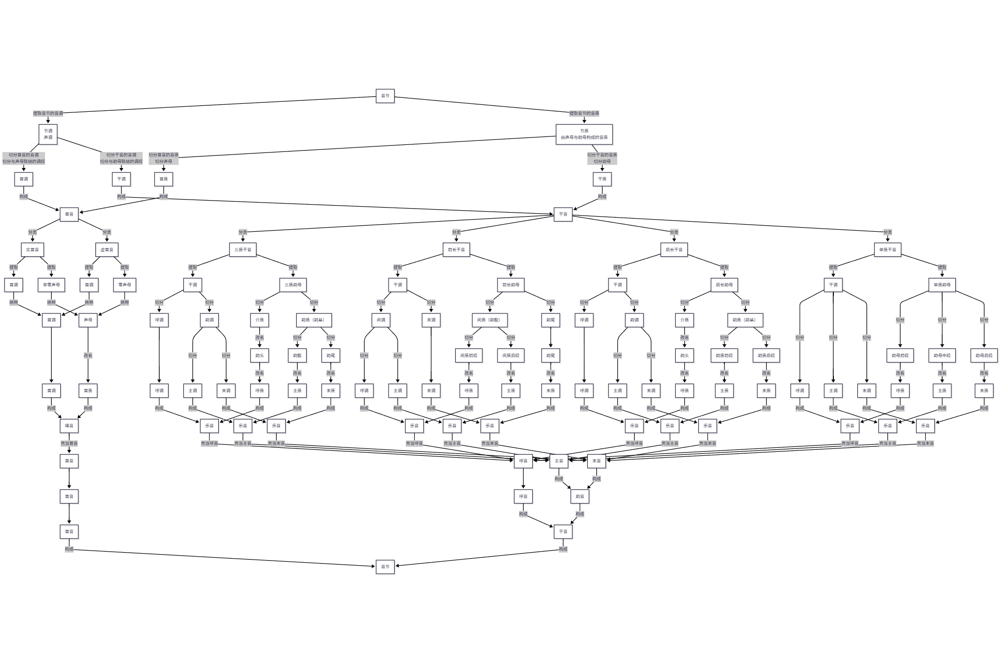
<figcaption>
图 5.4‑1音元分析的过程
</figcaption>
</figure>

## 音元分析的范例

在节调质素音节中，声母分成零声母、清非零声母和浊非零声母三类；韵母分成单质韵母、前长韵母、后长韵母和三质韵母四类；节调分为高调阴平、升调阳平、低调上声和降调去声四类；三类声母、四类韵母和四类节调构成 48 种结构类型不同的音节。从这 48 种结构类型不同的音节中各选一个音节，根据音元分析的流程代入选出的每个音节就能把选出的每个音节都分析成音元序列。对这些音节的音元分析，就是音元分析的范例，列表见表
5.5‑1。

<table style="width:94%;">
<caption>
表 5.5‑1音元分析的范例
</caption>
<colgroup>
<col style="width: 11%" />
<col style="width: 8%" />
<col style="width: 6%" />
<col style="width: 11%" />
<col style="width: 10%" />
<col style="width: 6%" />
<col style="width: 8%" />
<col style="width: 7%" />
<col style="width: 7%" />
<col style="width: 6%" />
<col style="width: 8%" />
</colgroup>
<thead>
<tr>
<th colspan="6">节调质素分析法</th>
<th colspan="4">音元分析法</th>
<th rowspan="3">注音</th>
</tr>
<tr>
<th colspan="4">音节结构类型</th>
<th colspan="2">记音方式</th>
<th colspan="2">片音</th>
<th colspan="2">音元</th>
</tr>
<tr>
<th colspan="2">声母</th>
<th>节调</th>
<th>韵母</th>
<th>音标</th>
<th>拼音</th>
<th>通式</th>
<th>简式</th>
<th>通式</th>
<th>简式</th>
</tr>
</thead>
<tbody>
<tr>
<td colspan="2" rowspan="16">零声母</td>
<td rowspan="4">阴平</td>
<td>三质韵母</td>
<td>[iɤᴜ⁵⁵]</td>
<td>y󰍓u</td>
<td>[󰌠󰍗󰌯]</td>
<td></td>
<td>󰌠󰍒󰌪</td>
<td></td>
<td>ㄧ󰈊</td>
</tr>
<tr>
<td>前长韵母</td>
<td>[ɤᴜ⁵⁵]</td>
<td>󰉠u</td>
<td>[󰍗󰍗󰌯]</td>
<td>[󰍗󰌯]</td>
<td>󰍒󰍒󰌪</td>
<td>󰍒󰌪</td>
<td>󰈊</td>
</tr>
<tr>
<td>后长韵母</td>
<td>[uo⁵⁵]</td>
<td>w󰉠</td>
<td>[󰌪󰍒󰍒]</td>
<td>[󰌪󰍒]</td>
<td>󰌪󰍒󰍒</td>
<td>󰌪󰍒</td>
<td>ㄨ󰈄</td>
</tr>
<tr>
<td>单质韵母</td>
<td>[o⁵⁵]</td>
<td>󰉠</td>
<td>[󰍒󰍒󰍒]</td>
<td>[󰍒]</td>
<td>󰍒󰍒󰍒</td>
<td>󰍒</td>
<td>󰈄</td>
</tr>
<tr>
<td rowspan="4">阳平</td>
<td>三质韵母</td>
<td>[iɤᴜ³⁵]</td>
<td>y󰍒u</td>
<td>[󰌢󰍘󰌯]</td>
<td></td>
<td>󰌤󰍓󰌪</td>
<td></td>
<td>ㄧ󰈛</td>
</tr>
<tr>
<td>前长韵母</td>
<td>[ɤᴜ³⁵]</td>
<td>󰉡u</td>
<td>[󰍙󰍘󰌯]</td>
<td></td>
<td>󰍖󰍓󰌪</td>
<td></td>
<td>󰈛</td>
</tr>
<tr>
<td>后长韵母</td>
<td>[uo³⁵]</td>
<td>w󰉡</td>
<td>[󰌬󰍓󰍒]</td>
<td></td>
<td>󰌮󰍓󰍒</td>
<td></td>
<td>ㄨ󰈕</td>
</tr>
<tr>
<td>单质韵母</td>
<td>[o³⁵]</td>
<td>󰉡</td>
<td>[󰍔󰍓󰍒]</td>
<td></td>
<td>󰍖󰍓󰍒</td>
<td></td>
<td>󰈕</td>
</tr>
<tr>
<td rowspan="4">上声</td>
<td>三质韵母</td>
<td>[iɤᴜ²¹¹]</td>
<td>yǒu</td>
<td>[󰌣󰍛󰌳]</td>
<td></td>
<td>󰌤󰍖󰌮</td>
<td></td>
<td>ㄧ󰈬</td>
</tr>
<tr>
<td>前长韵母</td>
<td>[ɤᴜ²¹¹]</td>
<td>󰉢u</td>
<td>[󰍚󰍛󰌳]</td>
<td></td>
<td>󰍖󰍖󰌮</td>
<td>󰍖󰌮</td>
<td>󰈬</td>
</tr>
<tr>
<td>后长韵母</td>
<td>[uo²¹¹]</td>
<td>w󰉢</td>
<td>[󰌭󰍖󰍖]</td>
<td>[󰌭󰍖]</td>
<td>󰌮󰍖󰍖</td>
<td>󰌮󰍖</td>
<td>ㄨ󰈦</td>
</tr>
<tr>
<td>单质韵母</td>
<td>[o²¹¹]</td>
<td>󰉢</td>
<td>[󰍕󰍖󰍖]</td>
<td>[󰍕󰍖]</td>
<td>󰍖󰍖󰍖</td>
<td>󰍖</td>
<td>󰈦</td>
</tr>
<tr>
<td rowspan="4">去声</td>
<td>三质韵母</td>
<td>[iɤᴜ⁵¹]</td>
<td>y󰍖u</td>
<td>[󰌠󰍘󰌳]</td>
<td></td>
<td>󰌠󰍓󰌮</td>
<td></td>
<td>ㄧ󰈽</td>
</tr>
<tr>
<td>前长韵母</td>
<td>[ɤᴜ⁵¹]</td>
<td>󰉣u</td>
<td>[󰍗󰍘󰌳]</td>
<td></td>
<td>󰍒󰍓󰌮</td>
<td></td>
<td>󰈽</td>
</tr>
<tr>
<td>后长韵母</td>
<td>[uo⁵¹]</td>
<td>w󰍖</td>
<td>[󰌪󰍓󰍖]</td>
<td></td>
<td>󰌪󰍓󰍖</td>
<td></td>
<td>ㄨ󰈷</td>
</tr>
<tr>
<td>单质韵母</td>
<td>[o⁵¹]</td>
<td>󰉣</td>
<td>[󰍒󰍓󰍖]</td>
<td></td>
<td>󰍒󰍓󰍖</td>
<td></td>
<td>󰈷</td>
</tr>
<tr>
<td rowspan="32">非零声母</td>
<td rowspan="16">清声母</td>
<td rowspan="4">阴平</td>
<td>三质韵母</td>
<td>[ɕiɤᴜ⁵⁵]</td>
<td>xi󰉔</td>
<td>[ɕ󰌠󰍗󰌯]</td>
<td></td>
<td>ɕ󰌠󰍒󰌪</td>
<td></td>
<td>ㄒㄧ󰈊</td>
</tr>
<tr>
<td>前长韵母</td>
<td>[xɤᴜ⁵⁵]</td>
<td>h󰉠u</td>
<td>[x󰍗󰍗󰌯]</td>
<td>[x󰍗󰌯]</td>
<td>x󰍒󰍒󰌪</td>
<td>x󰍒󰌪</td>
<td>ㄏ󰈊</td>
</tr>
<tr>
<td>后长韵母</td>
<td>[xuo⁵⁵]</td>
<td>hu󰉠</td>
<td>[x󰌪󰍒󰍒]</td>
<td>[x󰌪󰍒]</td>
<td>x󰌪󰍒󰍒</td>
<td>x󰌪󰍒</td>
<td>ㄏㄨ󰈄</td>
</tr>
<tr>
<td>单质韵母</td>
<td>[po⁵⁵]</td>
<td>b󰉠</td>
<td>[p󰍒󰍒󰍒]</td>
<td>[p󰍒]</td>
<td>p󰍒󰍒󰍒</td>
<td>p󰍒</td>
<td>ㄅ󰈄</td>
</tr>
<tr>
<td rowspan="4">阳平</td>
<td>三质韵母</td>
<td>[ʨʰiɤᴜ³⁵]</td>
<td>qi󰉕</td>
<td>[ʨʰ󰌢󰍘󰌯]</td>
<td></td>
<td>ʨʰ󰌤󰍓󰌪</td>
<td></td>
<td>ㄑㄧ󰈛</td>
</tr>
<tr>
<td>前长韵母</td>
<td>[xɤᴜ³⁵]</td>
<td>h󰉡u</td>
<td>[x󰍙󰍘󰌯]</td>
<td></td>
<td>x󰍖󰍓󰌪</td>
<td></td>
<td>ㄏ󰈛</td>
</tr>
<tr>
<td>后长韵母</td>
<td>[xuo³⁵]</td>
<td>hu󰉡</td>
<td>[x󰌬󰍓󰍒]</td>
<td></td>
<td>x󰌮󰍓󰍒</td>
<td></td>
<td>ㄏㄨ󰈕</td>
</tr>
<tr>
<td>单质韵母</td>
<td>[po³⁵]</td>
<td>b󰉡</td>
<td>[p󰍔󰍓󰍒]</td>
<td></td>
<td>p󰍖󰍓󰍒</td>
<td></td>
<td>ㄅ󰈕</td>
</tr>
<tr>
<td rowspan="4">上声</td>
<td>三质韵母</td>
<td>[ɕiɤᴜ²¹¹]</td>
<td>xi󰉖</td>
<td>[ɕ󰌣󰍛󰌳]</td>
<td></td>
<td>ɕ󰌤󰍖󰌮</td>
<td></td>
<td>ㄒㄧ󰈬</td>
</tr>
<tr>
<td>前长韵母</td>
<td>[xɤᴜ²¹¹]</td>
<td>h󰉢u</td>
<td>[x󰍚󰍛󰌳]</td>
<td></td>
<td>x󰍖󰍖󰌮</td>
<td>x󰍖󰌮</td>
<td>ㄏ󰈬</td>
</tr>
<tr>
<td>后长韵母</td>
<td>[xuo²¹¹]</td>
<td>hu󰉢</td>
<td>[x󰌭󰍖󰍖]</td>
<td>[x󰌭󰍖]</td>
<td>x󰌮󰍖󰍖</td>
<td>x󰌮󰍖</td>
<td>ㄏㄨ󰈦</td>
</tr>
<tr>
<td>单质韵母</td>
<td>[po²¹¹]</td>
<td>b󰉢</td>
<td>[p󰍕󰍖󰍖]</td>
<td>[p󰍕󰍖]</td>
<td>p󰍖󰍖󰍖</td>
<td>p󰍖</td>
<td>ㄅ󰈦</td>
</tr>
<tr>
<td rowspan="4">去声</td>
<td>三质韵母</td>
<td>[ɕiɤᴜ⁵¹]</td>
<td>xi󰉗</td>
<td>[ɕ󰌠󰍘󰌳]</td>
<td></td>
<td>ɕ󰌠󰍓󰌮</td>
<td></td>
<td>ㄒㄧ󰈽</td>
</tr>
<tr>
<td>前长韵母</td>
<td>[xɤᴜ⁵¹]</td>
<td>h󰉣u</td>
<td>[x󰍗󰍘󰌳]</td>
<td></td>
<td>x󰍒󰍓󰌮</td>
<td></td>
<td>ㄏ󰈽</td>
</tr>
<tr>
<td>后长韵母</td>
<td>[xuo⁵¹]</td>
<td>hu󰉣</td>
<td>[x󰌪󰍓󰍖]</td>
<td></td>
<td>x󰌪󰍓󰍖</td>
<td></td>
<td>ㄏㄨ󰈷</td>
</tr>
<tr>
<td>单质韵母</td>
<td>[po⁵¹]</td>
<td>b󰉣</td>
<td>[p󰍒󰍓󰍖]</td>
<td></td>
<td>p󰍒󰍓󰍖</td>
<td></td>
<td>ㄅ󰈷</td>
</tr>
<tr>
<td rowspan="16">浊声母</td>
<td rowspan="4">阴平</td>
<td>三质韵母</td>
<td>[liɤᴜ⁵⁵]</td>
<td>li󰉔</td>
<td>[l󰌠󰍗󰌯]</td>
<td></td>
<td>l󰌠󰍒󰌪</td>
<td></td>
<td>ㄌㄧ󰈊</td>
</tr>
<tr>
<td>前长韵母</td>
<td>[lɤᴜ⁵⁵]</td>
<td>l󰉠u</td>
<td>[l󰍗󰍗󰌯]</td>
<td>[l󰍗󰌯]</td>
<td>l󰍒󰍒󰌪</td>
<td>l󰍒󰌪</td>
<td>ㄌ󰈊</td>
</tr>
<tr>
<td>后长韵母</td>
<td>[luo⁵⁵]</td>
<td>lu󰉠</td>
<td>[l󰌪󰍒󰍒]</td>
<td>[l󰌪󰍒]</td>
<td>l󰌪󰍒󰍒</td>
<td>l󰌪󰍒</td>
<td>ㄌㄨ󰈄</td>
</tr>
<tr>
<td>单质韵母</td>
<td>[mo⁵⁵]</td>
<td>m󰉠</td>
<td>[m󰍒󰍒󰍒]</td>
<td>[m󰍒]</td>
<td>m󰍒󰍒󰍒</td>
<td>m󰍒</td>
<td>ㄇ󰈄</td>
</tr>
<tr>
<td rowspan="4">阳平</td>
<td>三质韵母</td>
<td>[liɤᴜ³⁵]</td>
<td>li󰉕</td>
<td>[l󰌢󰍘󰌯]</td>
<td></td>
<td>l󰌤󰍓󰌪</td>
<td></td>
<td>ㄌㄧ󰈛</td>
</tr>
<tr>
<td>前长韵母</td>
<td>[lɤᴜ³⁵]</td>
<td>l󰉡u</td>
<td>[l󰍙󰍘󰌯]</td>
<td></td>
<td>l󰍖󰍓󰌪</td>
<td></td>
<td>ㄌ󰈛</td>
</tr>
<tr>
<td>后长韵母</td>
<td>[luo³⁵]</td>
<td>lu󰉡</td>
<td>[l󰌬󰍓󰍒]</td>
<td></td>
<td>l󰌮󰍓󰍒</td>
<td></td>
<td>ㄌㄨ󰈕</td>
</tr>
<tr>
<td>单质韵母</td>
<td>[mo³⁵]</td>
<td>m󰉡</td>
<td>[m󰍔󰍓󰍒]</td>
<td></td>
<td>m󰍖󰍓󰍒</td>
<td></td>
<td>ㄇ󰈕</td>
</tr>
<tr>
<td rowspan="4">上声</td>
<td>三质韵母</td>
<td>[liɤᴜ²¹¹]</td>
<td>li󰉖</td>
<td>[l󰌣󰍛󰌳]</td>
<td></td>
<td>l󰌤󰍖󰌮</td>
<td></td>
<td>ㄌㄧ󰈬</td>
</tr>
<tr>
<td>前长韵母</td>
<td>[lɤᴜ²¹¹]</td>
<td>l󰉢u</td>
<td>[l󰍚󰍛󰌳]</td>
<td></td>
<td>l󰍖󰍖󰌮</td>
<td>l󰍖󰌮</td>
<td>ㄌ󰈬</td>
</tr>
<tr>
<td>后长韵母</td>
<td>[luo²¹¹]</td>
<td>lu󰉢</td>
<td>[l󰌭󰍖󰍖]</td>
<td>[l󰌭󰍖]</td>
<td>l󰌮󰍖󰍖</td>
<td>l󰌮󰍖</td>
<td>ㄌㄨ󰈦</td>
</tr>
<tr>
<td>单质韵母</td>
<td>[mo²¹¹]</td>
<td>m󰉢</td>
<td>[m󰍕󰍖󰍖]</td>
<td>[m󰍕󰍖]</td>
<td>m󰍖󰍖󰍖</td>
<td>m󰍖</td>
<td>ㄇ󰈦</td>
</tr>
<tr>
<td rowspan="4">去声</td>
<td>三质韵母</td>
<td>[liɤᴜ⁵¹]</td>
<td>li󰉗</td>
<td>[l󰌠󰍘󰌳]</td>
<td></td>
<td>l󰌠󰍓󰌮</td>
<td></td>
<td>ㄌㄧ󰈽</td>
</tr>
<tr>
<td>前长韵母</td>
<td>[lɤᴜ⁵¹]</td>
<td>l󰉣u</td>
<td>[l󰍗󰍘󰌳]</td>
<td></td>
<td>l󰍒󰍓󰌮</td>
<td></td>
<td>ㄌ󰈽</td>
</tr>
<tr>
<td>后长韵母</td>
<td>[luo⁵¹]</td>
<td>lu󰉣</td>
<td>[l󰌪󰍓󰍖]</td>
<td></td>
<td>l󰌪󰍓󰍖</td>
<td></td>
<td>ㄌㄨ󰈷</td>
</tr>
<tr>
<td>单质韵母</td>
<td>[mo⁵¹]</td>
<td>m󰉣</td>
<td>[m󰍒󰍓󰍖]</td>
<td></td>
<td>m󰍒󰍓󰍖</td>
<td></td>
<td>ㄇ󰈷</td>
</tr>
</tbody>
</table>

根据这些范例可知：

在声母是零声母的音节中，首音是虚首音，虚首音因其有无不构成对立而在析音和记音时常被省略，因此，对这类音节，音元分析就是把干音分析成音元序列。

在声母非零声母的音节中，首音是实首音，实首音因其在并立时构成对立而在析音和记音时不能省略，因此，对这类音节，音元分析就是确定充当首音的音元和构成干音的音元并且把充当首音的音元和构成干音的音元按时序排列成音元序列。

在节调质素音节中，音节结构类型只有 48 种。因此，仿照 48 个结构类型不同的音节的分析实例，代入每个具有相同结构类型的音节就能把每个音节都分析成音元序列。强调说明，因受篇幅限制，这里并未列出每个音节的音元序列。尽管如此，由于前述已经析出了充当首音的音元和构成干音的音元序列。因此，把充当首音的音元和构成干音的音元序列排列起来，就是构成音节的音元序列。

## 新型的析音方法

把由节调与构成节质的质素序列构成的音节分析成音元序列的过程是一个间接分析过程。把由节调与构成节质的质素序列构成的音节分析成音元序列的过程，具体地说，就是：对由节调与构成节质的质素序列构成的音节，根据质调关系的内容把节调分析成由首调、呼调、主调和末调构成的音调序列和把节质分析成由首质、呼质、主质和末质构成的音质序列，把由首调与首质、由呼调与呼质、由主调与主质和由末调与末质构成的音段从结构上分析成首音、呼音、主音和末音，把充当首音、呼音、主音或末音的音段分析成片音，确定表示片音的音元，从而把音节分析成音元序列。这个过程，包含一个根据质调关系的内容把节调分析成由首调、呼调、主调和末调构成的音调序列和把节质分析成由首质、呼质、主质和末质构成的音质序列的中间环节，是一个间接分析过程。

这个间接分析过程图示如图 5.6‑1。

<figure>
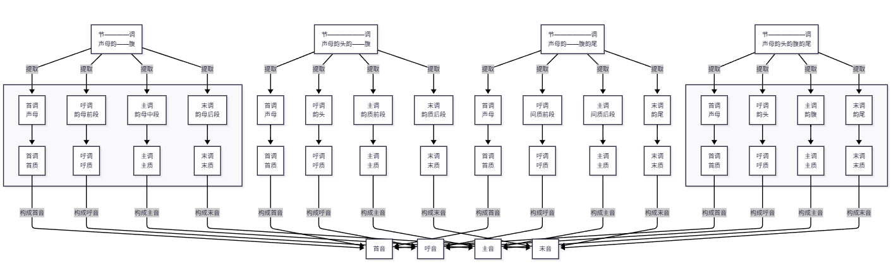
<figcaption>
图
5.6‑1间接把节调质素音节分析成音元序列的过程
</figcaption>
</figure>

把音节分析成由节调与构成节质的质素序列构成的音节继而分析成音元序列的过程是一个间接分析过程。把由节调与构成节质的质素序列构成的音节分析成音元序列事先必须把音节分析成由节调与构成节质的质素序列构成的音节。因此，即使从把由节调与构成节质的质素序列构成的音节分析成音元序列的过程中省去把节调和节质对应各分四段的中间环节，把音节分析成音元序列的过程，还是一个间接分析过程。这就是说，把音节分析成音元序列的过程，还包含一个先把音节分析成由节调与构成节质的质素序列构成的音节的中间环节，还是一个间接分析过程。

这个间接分析过程图示如图 5.6‑2。

<figure>
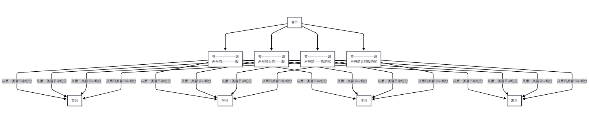
<figcaption>
图 5.6‑2间接把音节分析成音元序列的过程
</figcaption>
</figure>

根据这个间接分析过程可知，在析音时，也可从这个间接分析过程中省去把音节分析成由节调与构成节质的质素序列构成的音节这个中间环节，直接把音节分析成音元序列。这就是说，在析音时，只要掌握把音节分析成音元序列的方法，不需经过把音节分析成由节调与构成节质的质素序列构成的音节这个中间环节，就能直接把音节分析成音元序列。

这个过程图示如图 5.6‑3。

<figure>
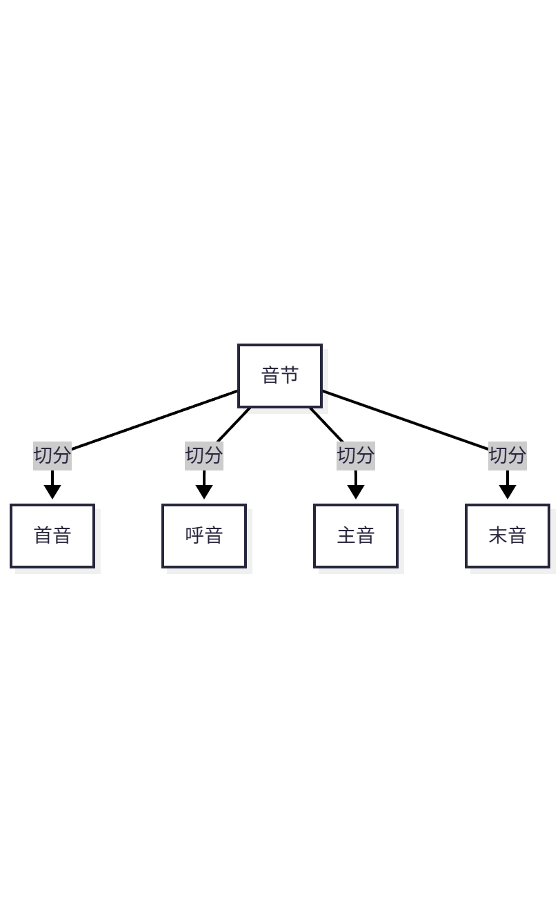
<figcaption>
图 5.6‑3直接把音节分析成音元序列的过程
</figcaption>
</figure>

音元分析法是已有析音法的继承和发展。已有析音法分成二分法、一调二质分析法、一调三质分析法和节调质素分析法四类。因此，音元分析法与已有析音法的继承关系和发展历程，根据析音法类型说明，分成四类情况：

一、音元分析法是二分法的继承和发展。在已有析音法中，二分法共有两类：一类是两段二分法，一类是质调二分法。两段二分法共有两种：一种是声韵二分法，一种是首干二分法。因此，音元分析法是二分法的继承和发展，分成三种情形：

(一)音元分析法是声韵二分法的继承和发展。在声韵二分法中，音节由声段和韵段构成。声段或由首音充当或由首介合音充当。在音元系统中，音节由首音、呼音、主音和末音构成。当呼音非介音时，首音对应无介音节的声段；干音由呼音、主音和末音构成，对应无介音节的韵段。当呼音是介音时，首音和呼音构成首介合音，首介合音对应有介音节的声段；主音和末音构成韵音，韵音对应有介音节的韵段。在继承关系和发展历程上，音元分析，就是，对声韵二分法的音节，当音节无介音时，把声段分析成首音，把韵段分析成由呼音、主音和末音构成的音列；当音节有介音时，把声段分析成由首音和呼音构成的音列、介音充当呼音，把韵段分析成由主音和末音构成的音列。综合说明，音元分析就是把由声段和韵段构成的音节分析成由四个音元所表示的首音、呼音、主音和末音构成的序列。因此，音元分析法是声韵二分法的继承和发展。

(二)音元分析法是首干二分法的继承和发展。在首干二分法中，音节由首音和干音构成。在音元系统中，音节由首音、呼音、主音和末音构成。首音对应首干二分法的首音；干音由呼音、主音和末音构成，对应首干二分法的干音。在继承关系和发展历程上，音元分析，就是，对首干二分法的音节，不再分析首音，把干音分析成由呼音、主音和末音构成的序列。综合说明，音元分析就是把由首音和干音构成的音节分析成由四个音元所表示的首音、呼音、主音和末音构成的序列。因此，音元分析法是首干二分法的继承和发展。

(三)音元分析法是质调二分法的继承和发展。在质调二分法中，音节由节调与节质构成。在音元系统中，音节由首音、呼音、主音和末音构成；节调和节质分别用首音、呼音、主音和末音的音调和音质来表示，也就是说，由首音、呼音、主音和末音的音调和音质构成的节调和节质对应质调二分法的节调和节质。在继承关系和发展历程上，音元分析，就是，对由节调与节质构成的音节，根据质调关系的内容把节调分析成由首调、呼调、主调和末调构成的音调序列和把节质分析成由首质、呼质、主质和末质构成的音质序列，把由首调与首质、由呼调与呼质、由主调与主质和由末调与末质构成的音段从结构上分析成首音、呼音、主音和末音，把充当首音、呼音、主音或末音的音段分析成片音，确定表示片音的音元，从而把由节调与节质构成的音节分析成由四个音元所表示的首音、呼音、主音和末音构成的序列。因此，音元分析法是质调二分法的继承和发展。

二、音元分析法是一调二质分析法的继承和发展。一调二质分析法共有两种：一种是节调声质韵质分析法，一种是节调声母韵母分析法。因此，音元分析法是一调二质分析法的继承和发展，分成两种情形：

(一)音元分析法是节调声质韵质分析法的继承和发展。在节调声质韵质分析中，音节由节调与构成节质的声质和韵质构成。声质或由单纯声段的音质充当或由首介声段的音质充当。在音元系统中，音节由首音、呼音、主音和末音构成。节调由首音、呼音、主音和末音的音调构成，对应节调声质韵质分析的节调。当呼音非介音时，首音的音质对应无介音节的声质；干音由呼音、主音和末音构成，干音的音质对应无介音节的韵质。当呼音是介音时，首音和呼音构成首介合音，首介合音的音质对应有介音节的声质；主音和末音构成韵音，韵音的音质对应有介音节的韵质。在继承关系和发展历程上，音元分析，就是，对节调声质韵质分析的音节，把节调分析成由首调、呼调、主调和末调构成的音调序列；当音节无介音时，把声质分析成首质，把韵质分析成由呼质、主质和末质构成的序列；当音节有介音时，把充当声质的首介合音的音质分析成由首质和呼质构成的序列，把韵质分析成由主质和末质构成的序列；把由首调与首质、由呼调与呼质、由主调与主质和由末调与末质构成的音段从结构上分析成首音、呼音、主音和末音，把充当首音、呼音、主音或末音的音段分析成片音，确定表示片音的音元，从而把音节分析成音元序列。综合说明，音元分析就是把由节调与由声质和韵质构成的节质构成的音节分析成由四个音元所表示的首音、呼音、主音和末音构成的序列。因此，音元分析法是节调声质韵质分析法的继承和发展。

(二)音元分析法是节调声母韵母分析法的继承和发展。在节调声母韵母分析中，音节由节调与构成节质的声母和韵母构成。声母由首音的音质充当，韵母由干音的音质充当。在音元系统中，音节由首音、呼音、主音和末音构成。在音元系统中，节调由首音、呼音、主音和末音的音调构成，对应节调声母韵母分析的节调；首音的音质对应节调声母韵母分析的声母；干音由呼音、主音和末音构成，干音的音质对应节调声母韵母分析的韵母。在继承关系和发展历程上，音元分析，就是，对节调声母韵母分析的音节，把节调分析成由首调、呼调、主调和末调构成的音调序列；把声母分析成首质，把韵母分析成由呼质、主质和末质构成的序列；把由首调与首质、由呼调与呼质、由主调与主质和由末调与末质构成的音段从结构上分析成首音、呼音、主音和末音，把充当首音、呼音、主音或末音的音段分析成片音，确定表示片音的音元，从而把音节分析成音元序列。综合说明，音元分析就是把由节调与由声母和韵母构成的节质构成的音节分析成由四个音元所表示的首音、呼音、主音和末音构成的序列。因此，音元分析法是节调声母韵母分析法的继承和发展。

三、音元分析法是一调三质分析法的继承和发展。在一调三质分析中，当音节无介音时，音节由节调与构成节质的声母和韵母构成，声母由首质充当，韵母由韵质充当；当音节有介音时，音节由节调与构成节质的声母和韵母构成，声母由首质充当，韵母由介质和韵质构成。在音元系统中，音节由首音、呼音、主音和末音构成。节调由首音、呼音、主音和末音的音调构成，对应一调三质分析的节调。当呼音非介音时，首音的音质对应一调三质分析的无介音节的声母；干音由呼音、主音和末音构成，干音的音质对应一调三质分析的无介音节的韵母。当呼音是介音时，首音的音质对应一调三质分析的有介音节的声母；呼音的音质对应一调三质分析的有介音节的介质；主音和末音构成韵音，韵音的音质对应一调三质分析的有介音节的韵质。在继承关系和发展历程上，音元分析，就是，对经过一调三质分析的音节，把节调分析成由首调、呼调、主调和末调构成的音调序列；当音节无介音时，把声母分析成首质，把韵母分析成由呼质、主质和末质构成的序列；当音节有介音时，把声母分析成首质，把介质分析成呼质，把韵质分析成由主质和末质构成的序列；把由首调与首质、由呼调与呼质、由主调与主质和由末调与末质构成的音段从结构上分析成首音、呼音、主音和末音，把充当首音、呼音、主音或末音的音段分析成片音，确定表示片音的音元，从而把音节分析成音元序列。综合说明，音元分析就是当音节无介音时把由节调与由声母和韵母构成的节质构成的音节和当音节有介音时把由节调与构成节质的声母、介质和韵质构成的音节分析成由四个音元所表示的首音、呼音、主音和末音构成的序列。因此，音元分析法是一调三质分析法的继承和发展。

四、音元分析法是节调质素分析法的继承和发展。在节调质素音节中，音节由节调与构成节质的质素序列构成。在音元系统中，音节由首音、呼音、主音和末音构成；节调由首音、呼音、主音和末音的音调构成，对应节调质素分析的节调；首音的音质对应节调质素分析的声母；干音由呼音、主音和末音构成，干音的音质对应节调质素分析的韵母。当只有呼音和主音两者音质不同时，介音充当呼音，呼音的音质对应韵头。当呼音、主音和末音三者音质相同时，呼音、主音和末音构成单质干音，单质干音的音质对应充当单质韵母的韵腹。当只有呼音和主音两者音质相同时，呼音和主音构成单质间音，单质间音的音质对应充当前长韵母的间质的韵腹。当只有主音和末音两者音质相同时，主音和末音构成单质韵音，单质韵音的音质对应充当后长韵母的韵质的韵腹。当呼音、主音和末音三者音质不同时，主音的音质对应充当三质韵母的主要质素的韵腹。当末音的音质与主音的音质不同时，末音的音质对应韵尾。在继承关系和发展历程上，音元分析，就是，对由节调与构成节质的质素序列构成的音节，把节调分析成由首调、呼调、主调和末调构成的音调序列；把声母分析成首质；当韵母是单质韵母时把充当韵母的韵腹分析成呼质、主质和末质三段；当韵母是前长韵母时把充当间质的韵腹分析成由呼质和主质构成的序列并把韵尾分析成末质；当韵母是后长韵母时把韵头分析成呼质并把充当韵质的韵腹分析成主质和末质两段；当韵母是三质韵母时把韵头分析成呼质、把韵腹分析成主质、把韵尾分析成末质；把由首调与首质、由呼调与呼质、由主调与主质和由末调与末质构成的音段从结构上分析成首音、呼音、主音和末音，把充当首音、呼音、主音或末音的音段分析成片音，确定表示片音的音元，从而把音节分析成音元序列。综合说明，音元分析就是把由节调与构成节质的质素序列构成的音节分析成由四个音元所表示的首音、呼音、主音和末音构成的序列。因此，音元分析法是节调质素分析法的继承和发展。

综述说明，音元分析法是已有析音法的继承和发展。

析音法由首干二分法经节调声母韵母分析法、一调三质分析法和节调质素分析法到音元分析法的继承关系和发展历程，图示如图
5.6‑4。

<figure>
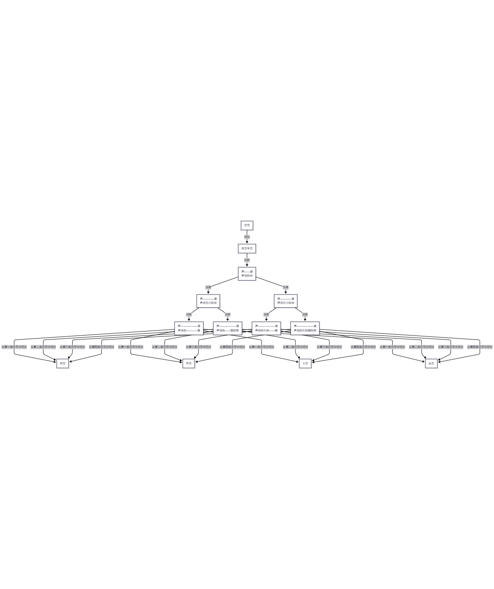
<figcaption>
图
5.6‑4音元分析法与已有几种主要析音法的继承关系和发展历程
</figcaption>
</figure>

音元分析法是第五代析音法。音元分析法是已有析音法的继承和发展。音元分析法与已有析音法都不相同。因此，音元分析法是一种新型的析音法。已有析音法分成第一代析音法、第二代析音法、第三代析音法和第四代析音法四代。第四代析音法是节调质素分析法。因此，音元分析法的形成，标志已有析音法已演变成新一代的析音法——第五代析音法。因此，音元分析法是第五代析音法。

# 音元拼音法

音元拼音法是根据音元分析拼音的方法。在音元系统中，拼音，是音元拼音的简称，笼统地说，是指根据音元分析拼音。这种拼音，从音元层次上说明，是指根据音元序列拼音。然而，在音元系统中，音元是表示分布在特定环境中的特定片音的变元。因此，从片音层次上说明，这种拼音实际是指根据片音序列发音。在音元系统中，片音是分布在特定环境中的特定音元所取的音值，是根据一组决定音段的最小音高和最小音质的差异的发音特征切出的最小音段，是单独能发的有声短音，是构成音节的基本音段，具有作为分析或识别对象的实发音段具备的语音特征。简单地说，片音是音元的音值。因此，按照片音序列发音，就是根据音元的音值拼音。按照片音序列发音，能够较逼真地拼出音节。因此，拼音是按照片音序列发音。

在音元系统中，从树形结构上说明，主音和末音构成韵音，呼音和韵音构成干音，首音和干音构成音节。在音元系统中，为便根据紧邻的音元是否相同划分音节类别，把由呼音和主音构成的音段统称为间音。根据紧邻的音元是否相同划分音节类别，音节分成四类：构成音节的音元个个不同的音节；构成干音的音元个个相同的音节；只有构成间音的音元相同的音节；只有构成韵音的音元相同的音节。首音分成实首音和虚首音两类。实首音的有无通常构成对立。虚首音的有无不构成对立。在音元系统中，根据虚首音的有无不构成对立，完全可以省略虚首音；根据音元的音长不构成对立，当只有构成间音的音元相同时完全可以把由呼音和主音构成的平调的单质间音分析成一个音元，当只有构成韵音的音元相同时完全可以把由主音和末音构成的平调的单质韵音分析成一个音元，当构成干音的音元个个相同时完全可以把由相同的音元构成的平调的单质干音分析成一个音元。在音元系统中，音节的结构通式是：[首音
呼音 主音
末音]。在音元系统中，根据虚首音的有无不构成对立，省略虚首音；根据音元的音长不构成对立，把在干音中连续存在的两个或三个完全相同的音元分析成一个音元，实际上是对音节的结构通式作化简。音节的结构通式，在经过化简后，就是音节的结构简式。

在现代通用汉语中，片音是根据一组决定音段的最小音高和最小音质的差异的发音特征切出的最小音段，音元是表示分布在特定环境中的特定片音的变元。在音元系统中，同元音集是由同一音元所表示的分布在不同环境中的不同片音构成的音集，一个音元对应一个同元音集；当一个音元对应的同元音集只有一个片音时，把这个片音从形式上分析成条件片音；当一个音元对应的同元音集至少含有两个习惯片音时，把每个习惯片音都分析成是由特定的发音习惯确定的特殊条件片音；针对每个音元，都有由一个音元所表示的不同片音都是这个音元的条件片音。因此，一般地说，针对每个音元，都有分布在特定环境中的特定音元只能表示特定片音。因此，在音元系统中，音元是表示分布在特定环境中的特定片音的变元。简单地说，音元是用来表示片音的变元。

音元分析法与已有析音法不同。已有析音法分成二分法、一调二质分析法、一调三质分析法和节调质素分析法四类。因此，音元分析法与已有析音法不同，根据析音法类型说明，分成四类情况：

一、音元分析法与两类二分法不同。在已有析音法中，二分法共有两类：一类是两段二分法，一类是质调二分法。两段二分法共有两种：一种是声韵二分法，一种是首干二分法。因此，音元分析法与两类二分法不同，分成三种情形：

(一)音元分析法与声韵二分法不同。在声韵二分法中，音节由声段和韵段构成。声段或由首音充当或由首介合音充当。韵段是指从音节中切除了声段以后剩下的音段，是所有同韵的音节共同具有的音调和音质都相同的音段(全类同调同部相押的音节共同具有的音段)。在音元系统中，音节由首音、呼音、主音和末音构成。当呼音非介音时，首音对应无介音节的声段；干音由呼音、主音和末音构成，对应无介音节的韵段。当呼音是介音时，首音和呼音构成首介合音，首介合音对应有介音节的声段；主音和末音构成韵音，韵音对应有介音节的韵段。当呼音非介音时，尽管音元和声韵二分法的声段和韵段同属音段，然而构成韵段的呼音、主音和末音和由呼音、主音和末音构成的韵段不同。当呼音是介音时，尽管音元和声韵二分法的声段和韵段同属音段，然而构成声段的首音和呼音和由首音和呼音构成的声段不同、构成韵段的主音和末音和由主音和末音构成的韵段不同。这种不同，简单地说，就是音元分析法与声韵二分法的音段大小不尽相同，也就是说，音元分析法与声韵二分法的分析深度或分析精度不尽相同。

(二)音元分析法与首干二分法不同。在首干二分法中，音节由首音和干音构成。在音元系统中，音节由首音、呼音、主音和末音构成；首音对应首干二分法的首音；干音由呼音、主音和末音构成，对应首干二分法的干音。尽管音元和首干二分法的首音和干音同属音段，然而构成干音的呼音、主音和末音和由呼音、主音和末音构成的干音不同。这种不同，简单地说，就是音元分析法与首干二分法的音段大小不尽相同，也就是说，音元分析法与首干二分法的分析深度或分析精度不尽相同。

(三)
音元分析法与质调二分法不同。在质调二分法中，音节由节调与节质构成。在音元系统中，音节由首音、呼音、主音和末音构成；节调和节质分别用首音、呼音、主音和末音的音调和音质来表示，也就是说，由首音、呼音、主音和末音的音调和音质构成的节调和节质对应质调二分法的节调和节质。

二、音元分析法与一调二质分析法不同。一调二质分析法共有两种：一种是节调声质韵质分析法，一种是节调声母韵母分析法。因此，音元分析法与一调二质分析法不同，分成两种情形：

(一)音元分析法与节调声质韵质分析法不同。在节调声质韵质分析中，音节由节调与构成节质的声质和韵质构成。声质或由单纯声段的音质充当或由首介声段的音质充当。声质和韵质构成节质；节调与节质构成音节。在音元系统中，音节由首音、呼音、主音和末音构成。节调由首音、呼音、主音和末音的音调构成，对应节调声质韵质分析的节调。当呼音非介音时，首音的音质对应无介音节的声质；干音由呼音、主音和末音构成，干音的音质对应无介音节的韵质；节质由首音、呼音、主音和末音的音质构成，对应无介音节的由声质和韵质构成的节质。当呼音是介音时，首音和介音构成首介合音，首介合音的音质对应有介音节的声质；主音和末音构成韵音，韵音的音质对应有介音节的韵质；节质由首音、呼音、主音和末音的音质构成，对应有介音节的由声质和韵质构成的节质。

(二)音元分析法与节调声母韵母分析法不同。在节调声母韵母分析中，音节由节调与构成节质的声母和韵母构成。声母由首音的音质充当，韵母由干音的音质充当。无论音节有无介音，声母都指首音的音质，韵母都指干音的音质。声母和韵母构成节质；节调与节质构成音节。在音元系统中，节调由首音、呼音、主音和末音的音调构成，对应节调声母韵母分析的节调；首音的音质对应节调声母韵母分析的声母；干音由呼音、主音和末音构成，干音的音质对应节调声母韵母分析的韵母；节质由首音、呼音、主音和末音的音质构成，对应由声母和韵母构成的节质。

三、音元分析法与一调三质分析法不同。在一调三质分析中，当音节无介音时，音节由节调与构成节质的声母和韵母构成，声母由首质充当，韵母由韵质充当；当音节有介音时，音节由节调与构成节质的声母和韵母构成，声母由首质充当，韵母由介质和韵质构成。在音元系统中，音节由首音、呼音、主音和末音构成。节调由首音、呼音、主音和末音的音调构成，对应一调三质分析的节调。当呼音非介音时，首音的音质对应一调三质分析的无介音节的声母；干音由呼音、主音和末音构成，干音的音质对应一调三质分析的无介音节的韵母。当呼音是介音时，首音的音质对应一调三质分析的有介音节的声母；呼音的音质对应一调三质分析的有介音节的介质；主音和末音构成韵音，韵音的音质对应一调三质分析的有介音节的韵质。

四、音元分析法与节调质素分析法不同。在节调质素音节中，音节由节调与构成节质的质素序列构成。在音元系统中，音节由首音、呼音、主音和末音构成。节调由首音、呼音、主音和末音的音调构成，对应节调质素分析的节调；节质由首音、呼音、主音和末音的音质构成，对应构成节质的质素序列。具体地说，在结构上，音元分析法与节调质素分析法的对应关系是：首音的音质对应声母。呼音的音质对应后长韵母的韵头、三质韵母的韵头、前长韵母的间质前段和单质韵母的前段。主音的音质对应单质韵母的中段、后长韵母的韵质前段、前长韵母的间质后段和三质韵母的韵腹。末音的音质对应前长韵母的韵尾、三质韵母的韵尾、后长韵母的韵质后段和单质韵母的后段。这就是说，在音元系统中，单质韵母被分析成韵母前段、韵母中段和韵母后段三段；后长韵母的充当韵质的韵腹被分析成韵质前段和韵质后段两段；前长韵母的充当间质的韵腹被分析成间质前段和间质后段两段。

音元系统的音元与音位系统的音位不同。在比较不同类型的语音系统时，把不同类型的语音系统的基本结构单元统称为元素。音位是音位系统的元素，分成音质音位和声调音位两类，两者分别被简称为质位和调位，分别表示质素和节调。音元是音元系统的元素，是表示分布在特定环境中的特定片音的变元。在现代通用汉语中，片音是根据一组决定音段的最小音高和最小音质的差异的发音特征切出的最小音段。因此，在音元系统中，乐音类音元具有确定的音高特征。具体地说，充当首音的音元的音高特征不是区别特征；构成干音的音元的音高特征，和音质特征一样，也是音元的区别特征。因此，构成干音的音元具有根据片音的音高确定的音高特征。然而，在音位系统中，质位是表示质素的变元。在音位系统中，质素过去并不叫“质素”而是叫“音素”。在非声调语言中，音素是从音质的角度划分出来的最小音段。然而，在汉语中，“音素”的名称和定义，都是不准确的。在由节调与充当声母和构成韵母的“音素”构成的音节中，无论是先析出节调还是后析出节调，只要析出节调，在析出节调后，准确地说，“音素”已不再是从音质的角度划分出来的最小音段、而仅仅是根据音质的差异从由声母和韵母构成的节质中析出的只表示音质不表示音调的最小音质，简单地说，“音素”只不过是音素的音质，因此，把音素的音质命名为“质素”，“音素”实际上是质素，音节实际上是由节调与构成节质的质素序列构成的音节。这种音节被简称为节调质素音节。因此，在音位系统中，质位是表示质素的变元。强调说明，在现代通用汉语中，音元系统没有表示声调或节调的调位这类元素的音元。

音元系统和音位系统两者表示节调的方式不同。在音位系统中，音节由调位与质位序列构成其中质位序列由质位构成，调位与质位序列既相对独立又并行联结，不论质位序列由几个质位构成，节调都既不是也不能用构成质位序列的一个、一些或全体质位的音调来表示。然而，在音元系统中，一般地说，每个音元的音高都表示节调的一段音调，换句话说，节调被一段段地分析成构成音节的每个音元的音高，因此，节调用构成音节的每个音元的音高来表示；重要和特别的是，音元的音高特征，和音质特征一样，也是音元的区别特征。因此，在音元系统中，音节既能表示音节的音质又能表示音节的声调。因此，根据音元序列拼音，不仅能够拼出音节的音质而且能够拼出音节的声调从而拼出音节的音值。

现代通用汉语的音元与非声调语言的音位不同。在现代通用汉语中，片音是根据一组决定音段的最小音高和最小音质的差异的发音特征切出的最小音段，音元是表示分布在特定环境中的特定片音的变元。因此，在音元系统中，乐音类音元具有确定的音高特征。具体地说，充当首音的音元的音高特征不是区别特征；构成干音的音元的音高特征，和音质特征一样，也是音元的区别特征。因此，构成干音的音元具有根据片音的音高确定的音高特征。由音元构成的音节能充分表示节调。在非声调语言中，音位表示仅仅根据音质差异划分出来的音素，音素的音高不是确定的。这就是说，非声调语言的音素是具有确定的音质、未定的音调的音段。非声调语言不用对立的声调来区别语义，由音素构成语素、词语或更大的语言单位的语音时根本不存在需要表示的声调，因此，在从非声调语言中划分音素时，完全不必区分音素的音调。

音元拼音是第五代拼音。在音元分析法产生前，拼音分成四代。四代拼音依序根据四代分析拼音。音元分析法是第五代析音法，是历代析音法的继承和发展。因此，音元拼音是历代拼音的继承和发展。因此，音元拼音是一种新型的拼音。因此，音元拼音的形成，标志拼音已演变成新一代的拼音——第五代拼音。

## 音元和音符

在现代通用汉语中，片音是根据一组决定音段的最小音高和最小音质的差异的发音特征切出的最小音段，音元是表示分布在特定环境中的特定片音的变元。精确地说，音元是用来根据它的分布环境从它对应的同元音集中选取特定片音的变元。简单地说，音元是用来表示片音的变元。

### 音元的分类

在汉语中，音元分成舒音和促音两类。促音特指充当末音的不除阻塞音。舒音指除促音外的音元。根据末音是否促音，韵音分成舒声韵和促声韵两类。根据有无促声韵，汉语分成无促声韵的汉语和有促声韵的汉语两类。无促声韵的汉语，无由不除阻塞音充当的末音。有促声韵的汉语，有由不除阻塞音充当的末音。因此，在汉语中，只能充当末音的不除阻塞音被命名为促音。相对促音，舒音就是普通音元，就是元音和普通的辅音，包括不除阻鼻音和不除阻边音。相对舒音，促音是一类特殊的音元，是只能充当末音的不除阻塞音，都是辅音。从发音上说明，促音是不除阻塞音，发音特征只有成阻和持阻、没有除阻。从听觉上分析，舒音是有声音元，在单独发音时既能由发音系统激发又能激起听音系统的响应；相反，促音是无声音元，在单独发音时不能激起听音系统的响应，换句话说，是无听感音元。因此，音元根据舒促分成舒音和促音两类。

在现代通用汉语中，音元都是舒音。促音特指充当末音的不除阻塞音。然而，在现代通用汉语中，韵音只有舒声韵、没有促声韵，末音都非促音，音元都是舒音。因此，说明现代通用汉语语音，完全不必使用舒音和促音这对术语。然而，有促声韵的汉语具有促音。这就是说，在有促声韵的汉语中，音元分成舒音和促音两类。因此，只有使用舒音和促音这对术语，才能比较现代通用汉语和有促声韵的汉语的语音差异。主要理由是，一般认为，现代通用汉语是由有促声韵的汉语演变来的。因此，只有使用舒音和促音这对术语，才能说明现代通用汉语的历时音变。

根据音元在发音时声带是否振动，音元分成清音和浊音两类。在把音元划分成舒音和促音两类后，根据舒音在发音时声带是否振动，舒音分成清音和浊音两类；根据促音在发音时声带都不振动，促音都是清音。

根据音元在发音时声带振动是否具有规律(音元是否有确定的音调)，音元分成噪音和乐音两类。在把音元划分成舒音和促音两类后，促音在发音时声带连振动都没有当然不存在有规律的振动，因此，促音不是乐音。然而，促音是不是噪音？这个问题在学术上未有现存结论。在后续说明中，为使说明简洁，姑且把促音划分到噪音中。在把音元划分成舒音和促音两类后，在舒音中，元音、不除阻鼻音和不除阻边音都非噪音。因此，在姑且把促音划分到噪音中的情况下，噪音是除不除阻鼻音和不除阻边音外的辅音、包含促音。这就是说，噪音是除元音、不除阻鼻音和不除阻边音外的音元。从发音上说明，噪音要么是声带不振动要么是在声带振动时还兼有爆破或摩擦等振动的音元。在把音元划分成舒音和促音两类后，在舒音中，元音、不除阻鼻音和不除阻边音都是乐音。换句话说，乐音包含普通元音、鼻化元音、不除阻鼻音和不除阻边音。这类音元只以有规律的声带振动为声源。因此，乐音是单独由有规律的声带振动激发音腔共鸣而形成的音元。综述说明，音元分成噪音和乐音两类。

在把音元划分成噪音和乐音两类后，噪音和乐音与清音和浊音的对应关系如下：

噪音有清有浊。清噪音就是清辅音。浊噪音是不含不除阻鼻音和不除阻边音的浊辅音。在浊辅音中，不除阻鼻音和不除阻边音，虽属辅音，但属乐音，因而不属噪音。因此，浊辅音并非都是噪音，既有噪音，也有乐音。换句话说，在噪音中，有些是清音，有些是浊音。

乐音都属浊音。乐音包含普通元音、鼻化元音、不除阻鼻音和不除阻边音。普通元音、鼻化元音、不除阻鼻音和不除阻边音都是浊音。因此，乐音都属浊音。然而，浊音并非都是乐音。浊音包含浊辅音。在浊辅音中除阻浊鼻音和除阻浊边音不是乐音而是噪音，不除阻鼻音和不除阻边音是乐音而不是噪音。换句话说，在浊音中，有些是噪音，有些是乐音。

乐音根据音腔类型分类分成口腔乐音、鼻腔乐音、联腔乐音和边腔乐音四类。音腔就是共鸣腔，又名声腔，分成四种类型：(一)口腔：保持鼻腔通道关闭并同时保持口腔通道畅通形成的共鸣腔。(二)鼻腔：保持口腔通道关闭并同时保持鼻腔通道畅通形成的共鸣腔。(三)联腔：同时保持口腔通道和鼻腔通道畅通形成的共鸣腔，即由口腔和鼻腔联合在一起形成的共鸣腔。(四)边腔：舌尖接触上齿龈，舌边松弛、自然且与上颚构成通道并保持通道畅通形成的共鸣腔。因此，乐音根据音腔类型分类分成口腔乐音、鼻腔乐音、联腔乐音和边腔乐音四类。

口腔乐音是单独由有规律的声带振动激发口腔共鸣而形成的音元。口腔，特指与边腔相对的普通口腔，它的主要特征是软腭提起、不与舌面接触、关闭鼻腔，舌头平放、隆起、翘起或卷起且不与上颚接触，下唇下齿不与上唇上齿接触。在激发口腔乐音时，声带振动，气流从口腔中顺畅呼出，激起口腔共鸣。口腔乐音就是普通元音。普通元音指与鼻化元音相对的口腔元音。

鼻腔乐音是单独由有规律的声带振动激发鼻腔共鸣而形成的音元。鼻腔乐音就是不除阻鼻音，又名唯闭鼻音。在现代通用汉语中，不除阻鼻音根据发音部位分类只有双唇不除阻鼻音、上齿龈舌尖不除阻鼻音、软腭舌面后部不除阻鼻音三种。在现代通用汉语中，鼻腔乐音既有充当末音的又有充当音节的，不能充当首音。在现代通用汉语中，充当首音的鼻音不是不除阻鼻音而是除阻鼻音，也就是说，充当首音的鼻音不是乐音而是噪音。

联腔乐音是单独由有规律的声带振动激发联腔共鸣而形成的音元。联腔乐音就是鼻化元音。在现代通用汉语中，联腔乐音是口腔乐音受到紧随其后的鼻腔乐音的影响而发生的逆同化音变，不是一类独立的乐音，只需在说明音变过程时说明。在汉语中，有的汉语方言例如湖南洞口方言有与口腔乐音对立的联腔乐音
(杜天, 2020)。

边腔乐音是单独由有规律的声带振动激发边腔共鸣而形成的音元。边腔，特指与普通口腔相对的由舌边与上颚构成通道形成的特殊口腔，它的主要特征是软腭提起、不与舌面接触、关闭鼻腔，舌尖抬起、隆起、翘起或卷起、且与上颚接触、堵住口腔，但留出舌体两侧的通道。在激发边腔乐音时，声带振动，气流从舌体两边的通道中顺畅呼出，激起边腔共鸣。边腔乐音就是不除阻边音。在汉语中，有的汉语方言例如赣方言有由边腔乐音充当的末音
(林焘、耿振声, 2004, 页 43)，有的汉语方言例如吴方言有由边腔乐音充当的音节 (林焘、耿振声, 2004,
页 35)。然而，在现代通用汉语中，乐音既没有充当末音的边腔乐音，也没有充当音节的边腔乐音。在现代通用汉语中，充当首音的边音不是不除阻边音而是除阻边音，也就是说，充当首音的边音不是乐音而是噪音。

在把音元划分成舒音和促音两类后，舒音和促音与辅音和元音的对应关系如下：

舒音包含元音和除促音外的辅音。在辅音中，除不除阻塞音外的辅音都是舒音，只有不除阻塞音是促音。因此，除不除阻塞音外的辅音，就是除促音外的辅音。元音都是舒音，包含普通元音和鼻化元音。前者是口腔乐音。后者是联腔乐音。

促音特指充当末音的不除阻塞音，都是辅音。这就是说，促音是一类特殊的辅音，都非元音。尽管促音是一类特殊的辅音，然而，以辅音为对象说明，辅音并非都是促音。在辅音中，除促音外的辅音都是舒音，都非促音。促音都非元音。对此，以元音为对象说明，元音都非促音。

在把音元划分成噪音和乐音两类后，噪音和乐音与辅音和元音的对应关系如下：

噪音是除不除阻鼻音和不除阻边音外的辅音，都是辅音。对此，以辅音为对象说明，辅音并非都是噪音。在辅音中，不除阻鼻音和不除阻边音不是噪音因而都是乐音。噪音都是辅音，因而都非元音。噪音都非元音，以元音为对象说明，元音都非噪音。这就是说，噪音是除元音、不除阻鼻音和不除阻边音外的音元。

乐音是元音、不除阻鼻音和不除阻边音的统称，既有元音也有辅音。元音都是乐音。在辅音中，只有不除阻鼻音和不除阻边音是乐音。在现代通用汉语中，在不把联腔乐音分析成口腔乐音受到紧随其后的鼻腔乐音的影响而发生的逆同化音变时，乐音只有口腔乐音和鼻腔乐音两类；联腔乐音是口腔乐音受到紧随其后的鼻腔乐音的影响而发生的逆同化音变，不是一类独立的乐音，只需在说明音变过程时说明；没有边腔乐音。然而，在用边腔乐音来充当末音或音节的汉语方言中，乐音分成口腔乐音、鼻腔乐音、联腔乐音和边腔乐音四类，含有边腔乐音。因此，在汉语中，乐音分成口腔乐音、鼻腔乐音、联腔乐音和边腔乐音四类。口腔乐音和联腔乐音是元音。鼻腔乐音和边腔乐音是辅音。

综述说明，音元与辅音和元音的对应关系是：在把音元划分成舒促两类和噪乐两类后，元音，包含普通元音和鼻化元音，归属乐音；辅音既有乐音，又有噪音；噪音既有舒音，又有促音。在辅音中，不除阻鼻音和不除阻边音归属乐音。在辅音中，在把促音分析成清音后，促音不是乐音。因此，在辅音中，除不除阻鼻音和不除阻边音外的辅音都属噪音。在噪音中，除不除阻塞音外的噪音都是舒音、只有不除阻塞音是促音。

根据音元与辅音和元音的对应关系可知，噪音都是辅音。这就是说，在姑且把促音划分到噪音中的情况下，噪音是除不除阻鼻音和不除阻边音外的辅音、包含促音。浊鼻音分成噪音和乐音两类。不除阻鼻音归属乐音。除阻鼻音归属噪音。浊边音分成噪音和乐音两类。不除阻边音归属乐音。除阻边音归属噪音。

根据音元与辅音和元音的对应关系可知，口腔乐音、鼻腔乐音、联腔乐音和边腔乐音四类乐音，依序就是普通元音、鼻化元音、不除阻鼻音和不除阻边音。乐音既有辅音也有元音。口腔乐音和联腔乐音是元音。鼻腔乐音和边腔乐音是辅音。

根据音元与辅音和元音的对应关系可知，相对促音，舒音就是普通音元，就是元音和普通的辅音，包括不除阻鼻音和不除阻边音。相对舒音，促音是一类特殊的音元，是只能充当末音的不除阻塞音，都是辅音。因此，音元分成舒音和促音两类，其实只有塞音分成舒音和促音两类，除阻塞音归属舒音，不除阻塞音归属促音。除阻塞音就是爆破音。

音元与辅音和元音的对应关系列表见表 6.1‑1。

<table style="width:73%;">
<caption>
表 6.1‑1音元与辅音和元音的对应关系
</caption>
<colgroup>
<col style="width: 7%" />
<col style="width: 10%" />
<col style="width: 15%" />
<col style="width: 12%" />
<col style="width: 12%" />
<col style="width: 15%" />
</colgroup>
<tbody>
<tr>
<td colspan="3" rowspan="2" style="text-align: right;">
音元

辅音和元音
</td>
<td colspan="2">舒音</td>
<td>促音</td>
</tr>
<tr>
<td>乐音</td>
<td>噪音</td>
<td>噪音</td>
</tr>
<tr>
<td rowspan="2" style="text-align: right;">元音</td>
<td colspan="2" style="text-align: right;">普通元音</td>
<td>口腔乐音</td>
<td></td>
<td></td>
</tr>
<tr>
<td colspan="2" style="text-align: right;">鼻化元音</td>
<td>联腔乐音</td>
<td></td>
<td></td>
</tr>
<tr>
<td rowspan="12" style="text-align: right;">辅音</td>
<td rowspan="8" style="text-align: right;">浊辅音</td>
<td style="text-align: right;">不除阻鼻音</td>
<td>鼻腔乐音</td>
<td></td>
<td></td>
</tr>
<tr>
<td style="text-align: right;">不除阻边音</td>
<td>边腔乐音</td>
<td></td>
<td></td>
</tr>
<tr>
<td style="text-align: right;">半元音</td>
<td></td>
<td>半元音</td>
<td></td>
</tr>
<tr>
<td style="text-align: right;">浊爆破音</td>
<td></td>
<td>浊爆破音</td>
<td></td>
</tr>
<tr>
<td style="text-align: right;">浊摩擦音</td>
<td></td>
<td>浊摩擦音</td>
<td></td>
</tr>
<tr>
<td style="text-align: right;">浊塞擦音</td>
<td></td>
<td>浊塞擦音</td>
<td></td>
</tr>
<tr>
<td style="text-align: right;">除阻边音</td>
<td></td>
<td>除阻边音</td>
<td></td>
</tr>
<tr>
<td style="text-align: right;">除阻鼻音</td>
<td></td>
<td>除阻鼻音</td>
<td></td>
</tr>
<tr>
<td rowspan="4" style="text-align: right;">清辅音</td>
<td style="text-align: right;">清爆破音</td>
<td></td>
<td>清爆破音</td>
<td></td>
</tr>
<tr>
<td style="text-align: right;">清摩擦音</td>
<td></td>
<td>清摩擦音</td>
<td></td>
</tr>
<tr>
<td style="text-align: right;">清塞擦音</td>
<td></td>
<td>清塞擦音</td>
<td></td>
</tr>
<tr>
<td style="text-align: right;">不除阻塞音</td>
<td></td>
<td></td>
<td>不除阻塞音</td>
</tr>
</tbody>
</table>

在现代通用汉语中，从结构上说明，噪音是充当首音的音元。在现代通用汉语中，根据音节分成首音和干音两段和音元分成噪音和乐音两类，首音和干音与噪音和乐音的关系是：首音只由噪音充当，干音只由乐音构成。换句话说，充当首音的音元都是噪音、都非乐音，构成干音的音元都是乐音、都非噪音。因此，首音就是噪音并且噪音就是首音。因此，噪音是充当首音的音元。

噪音分成实首音和虚首音两类。首音根据有无是否构成对立分成实首音和虚首音两类。实首音的有无通常构成对立。虚首音的有无不构成对立。因此，在现代通用汉语中，有些噪音充当实首音，有些噪音充当虚首音。

在现代通用汉语中，噪音根据发音特征分类列表见表 6.1‑2。

<table style="width:95%;">
<caption>
表 6.1‑2噪音根据发音特征分类
</caption>
<colgroup>
<col style="width: 7%" />
<col style="width: 7%" />
<col style="width: 12%" />
<col style="width: 7%" />
<col style="width: 7%" />
<col style="width: 7%" />
<col style="width: 7%" />
<col style="width: 4%" />
<col style="width: 4%" />
<col style="width: 4%" />
<col style="width: 4%" />
<col style="width: 4%" />
<col style="width: 4%" />
<col style="width: 4%" />
<col style="width: 7%" />
</colgroup>
<tbody>
<tr>
<td colspan="3">辨义作用</td>
<td colspan="8">实</td>
<td colspan="4">虚</td>
</tr>
<tr>
<td colspan="3" rowspan="3" style="text-align: right;">
发音方法

发音部位
</td>
<td colspan="5">清</td>
<td colspan="3">浊</td>
<td colspan="3">浊</td>
<td>清</td>
</tr>
<tr>
<td colspan="2">不送气</td>
<td colspan="2">送气</td>
<td rowspan="2">擦</td>
<td rowspan="2">边</td>
<td rowspan="2">近</td>
<td rowspan="2">鼻</td>
<td rowspan="2">鼻</td>
<td rowspan="2">近</td>
<td rowspan="2">擦</td>
<td rowspan="2">爆破</td>
</tr>
<tr>
<td>爆破</td>
<td>塞擦</td>
<td>爆破</td>
<td>塞擦</td>
</tr>
<tr>
<td rowspan="4">唇音</td>
<td rowspan="2">双唇</td>
<td>上唇</td>
<td rowspan="2">p</td>
<td></td>
<td rowspan="2">pʰ</td>
<td></td>
<td></td>
<td rowspan="2"></td>
<td rowspan="2"></td>
<td rowspan="2">m</td>
<td rowspan="2"></td>
<td rowspan="2">w</td>
<td rowspan="2"></td>
<td rowspan="2"></td>
</tr>
<tr>
<td>下唇</td>
<td></td>
<td></td>
<td></td>
</tr>
<tr>
<td rowspan="2">齿唇</td>
<td>上齿</td>
<td></td>
<td></td>
<td></td>
<td></td>
<td rowspan="2">f</td>
<td></td>
<td></td>
<td rowspan="2"></td>
<td rowspan="2"></td>
<td rowspan="2"></td>
<td rowspan="2"></td>
<td rowspan="2"></td>
</tr>
<tr>
<td>下唇</td>
<td></td>
<td></td>
<td></td>
<td></td>
<td></td>
<td></td>
</tr>
<tr>
<td colspan="2" rowspan="2">齿龈</td>
<td>齿龈</td>
<td rowspan="2">t</td>
<td></td>
<td rowspan="2">tʰ</td>
<td></td>
<td></td>
<td rowspan="2">l</td>
<td rowspan="2"></td>
<td rowspan="2">n</td>
<td rowspan="2"></td>
<td rowspan="2">j</td>
<td rowspan="2"></td>
<td rowspan="2"></td>
</tr>
<tr>
<td>舌尖</td>
<td></td>
<td></td>
<td></td>
</tr>
<tr>
<td colspan="2" rowspan="2">软腭</td>
<td>软腭</td>
<td rowspan="2">k</td>
<td></td>
<td rowspan="2">kʰ</td>
<td></td>
<td rowspan="2">x</td>
<td rowspan="2"></td>
<td rowspan="2"></td>
<td rowspan="2"></td>
<td rowspan="2">ŋ</td>
<td rowspan="2"></td>
<td rowspan="2">ɣ</td>
<td rowspan="2">ʔ</td>
</tr>
<tr>
<td>舌面后部</td>
<td></td>
<td></td>
</tr>
<tr>
<td colspan="2" rowspan="2">齿背</td>
<td>齿背</td>
<td></td>
<td rowspan="2">ʦ</td>
<td></td>
<td rowspan="2">ʦʰ</td>
<td rowspan="2">s</td>
<td rowspan="2"></td>
<td></td>
<td rowspan="2"></td>
<td rowspan="2"></td>
<td rowspan="2">ɹ</td>
<td rowspan="2"></td>
<td rowspan="2"></td>
</tr>
<tr>
<td>舌尖</td>
<td></td>
<td></td>
<td></td>
</tr>
<tr>
<td colspan="2" rowspan="2">翘舌</td>
<td>硬腭前部</td>
<td></td>
<td rowspan="2">ꭧ</td>
<td></td>
<td rowspan="2">ꭧʰ</td>
<td rowspan="2">ʂ</td>
<td rowspan="2"></td>
<td rowspan="2">ɻ</td>
<td rowspan="2"></td>
<td rowspan="2"></td>
<td rowspan="2"></td>
<td rowspan="2"></td>
<td rowspan="2"></td>
</tr>
<tr>
<td>舌尖</td>
<td></td>
<td></td>
</tr>
<tr>
<td colspan="2" rowspan="2">硬腭</td>
<td>硬腭前部</td>
<td></td>
<td rowspan="2">ʨ</td>
<td></td>
<td rowspan="2">ʨʰ</td>
<td rowspan="2">ɕ</td>
<td></td>
<td></td>
<td rowspan="2"></td>
<td rowspan="2"></td>
<td rowspan="2">ɥ</td>
<td rowspan="2"></td>
<td rowspan="2"></td>
</tr>
<tr>
<td>舌面前部</td>
<td></td>
<td></td>
<td></td>
<td></td>
</tr>
</tbody>
</table>

在现代通用汉语中，噪音[ɣ]、[j]、[w]和[ɥ]只能充当首音，有无不构成对立，是虚首音。噪音[ʔ]是与噪音[ɣ]并立的习惯片音。当前一音节的末音的音质是[ŋ]并且后一音节的首音是噪音[ɣ]或[ʔ]时，后面的首音或噪音[ɣ]或[ʔ]受到前面的乐音的影响被同化成[ŋ]。在噪音[ɣ]或[ʔ]被同化成[ŋ]后，[ŋ]的有无不构成对立，是虚首音。在记音时，充当虚首音的噪音常被省略。然而，在发音时，虚首音在音节中是一个必不可少的音段、不是可有可无的，因此，在说明音节的音值时，不能忽略虚首音。

在现代通用汉语中，与声母[ʐ]对应的首音在本书中被分析成近音 ɻ[ɻ]。这个首音（声母），在高本汉把它分析成浊摩擦音[ʐ]
(高本汉, 1940)后，后人大多把它分析成浊摩擦音[ʐ]。这个首音（声母）在《汉语拼音方案》中用 r 来记录。赵元任认为它类似英语的 r，但在记音时却和高本汉一样把它记为[ʐ]
(赵元任, 《现代吴语的研究》, 1928)。石锋从音位学角度把它记为[ʐ]
(石锋、廖荣蓉, 1987)。王力虽也认为它类似英语的 r，但在结论中却认为根据语音的系统性应把它定为无擦通音[ɹ]
(王力, 《再论日母的音值，兼论普通话声母表》, 1983)。林焘认为它是个翘舌通音[ɽ]，但为注音方便，用[r]来代替[ɽ]
(林焘、王理嘉, 1992, 页 69)，也就是说，把[ɽ]记为[r]。朱晓农尽管一度认为它是半元音[ɻ]
(朱晓农、夏秋, 1982)，但后来却在《语音学》 (朱晓农, 《语音学》, 2010)中认定它是近音[ɻ]。强调说明，在 2005 年版《国际音标》中，[ɻ]和[ɽ]不同，[ɻ]是硬腭舌尖近音，[ɽ]是硬腭舌尖闪音。在把这个音元分析成近音[ɻ]的情况下，根据惯例，这个音元应用字符 ɻ 来记录。

在现代通用汉语中，乐音根据音腔类型分为口腔乐音和鼻腔乐音两类。口腔乐音就是口腔元音(普通元音)，音质根据元音的发音特征说明。鼻腔乐音就是不除阻鼻音，又名唯闭鼻音，音质根据不除阻鼻音的发音特征说明。乐音根据音高特征分为高调、中调和低调三类。乐音的音高根据三度标调法确定。

在现代通用汉语中，乐音根据发音特征分类列表见表 6.1‑3。

<table>
<caption>
表 6.1‑3乐音根据发音特征分类
</caption>
<colgroup>
<col style="width: 8%" />
<col style="width: 8%" />
<col style="width: 8%" />
<col style="width: 8%" />
<col style="width: 8%" />
<col style="width: 8%" />
<col style="width: 8%" />
<col style="width: 8%" />
<col style="width: 8%" />
<col style="width: 11%" />
<col style="width: 14%" />
</colgroup>
<tbody>
<tr>
<td rowspan="5">
音质

音高
</td>
<td colspan="8">口音</td>
<td colspan="2">鼻音</td>
</tr>
<tr>
<td>舌面</td>
<td>舌面</td>
<td>舌面</td>
<td>舌面</td>
<td>舌面</td>
<td>舌面</td>
<td>舌尖</td>
<td>卷舌</td>
<td>上齿龈</td>
<td>软腭</td>
</tr>
<tr>
<td>前</td>
<td>后</td>
<td>前</td>
<td>央</td>
<td>后</td>
<td>前</td>
<td>前</td>
<td>央</td>
<td>舌尖</td>
<td>舌面后部</td>
</tr>
<tr>
<td>高</td>
<td>高</td>
<td>高</td>
<td>低</td>
<td>次高</td>
<td>次低</td>
<td>高</td>
<td>中</td>
<td>阻塞</td>
<td>阻塞</td>
</tr>
<tr>
<td>展唇</td>
<td>圆唇</td>
<td>圆唇</td>
<td>展唇</td>
<td>圆唇</td>
<td>展唇</td>
<td>展唇</td>
<td>展唇</td>
<td>不除阻</td>
<td>不除阻</td>
</tr>
<tr>
<td>高调</td>
<td>󰌠[󰌠]</td>
<td>󰌪[󰌪]</td>
<td>󰌴[󰌴]</td>
<td>󰌾[󰌾]</td>
<td>󰍒[󰍒]</td>
<td>󰍡[󰍡]</td>
<td>󰍵[󰍿]</td>
<td>󰎄[󰎉]</td>
<td>󰎓[󰎓]</td>
<td>󰎘[󰎘]</td>
</tr>
<tr>
<td>中调</td>
<td>󰌡[󰌡]</td>
<td>󰌫[󰌫]</td>
<td>󰌵[󰌵]</td>
<td>󰌿[󰌿]</td>
<td>󰍓[󰍓]</td>
<td>󰍢[󰍢]</td>
<td>󰍶[󰎀]</td>
<td>󰎅[󰎊]</td>
<td>󰎔[󰎔]</td>
<td>󰎙[󰎙]</td>
</tr>
<tr>
<td>低调</td>
<td>󰌤[󰌤]</td>
<td>󰌮[󰌮]</td>
<td>󰌸[󰌸]</td>
<td>󰍂[󰍂]</td>
<td>󰍖[󰍖]</td>
<td>󰍥[󰍥]</td>
<td>󰍹[󰎃]</td>
<td>󰎈[󰎍]</td>
<td>󰎗[󰎗]</td>
<td>󰎜[󰎜]</td>
</tr>
</tbody>
</table>

噪乐分类法和辅元分类法是两种大同小异的音元分类法。噪乐分类法根据音元是否单独由有规律的声带振动激发音腔共鸣而形成的音元把音元划分成噪音和乐音两类。辅元分类法根据气流是否在咽腔及口腔中受到阻碍或发生摩擦把音元划分成辅音和元音两类。两者相比主要有三点不同：

一、分类结果不同。音元，根据噪乐特征分类，分成噪音和乐音两类。音元，根据辅元特征分类，分成辅音和元音两类。噪音都是辅音。乐音既有辅音也有元音。

二、分类标准不同。噪乐分类法的分类标准是音元是否单独由有规律的声带振动激发音腔共鸣而形成的音元。辅元分类法的分类标准是气流是否在咽腔及口腔中受到阻碍或发生摩擦。音元是否单独由有规律的声带振动激发音腔共鸣而形成的音元与气流是否在咽腔及口腔中受到阻碍或发生摩擦不同。在发不除阻鼻音和不除阻边音时，气流在口腔中受阻然而却是单独由有规律的声带振动激发音腔共鸣而形成的音元。这就是说，从鼻腔中顺畅呼出的乐音气流和从边腔中顺畅呼出的乐音气流，在口腔中受阻。因此，鼻腔乐音和边腔乐音不是元音而是辅音。

三、分类细节不同。两种分类法的分类标准不同导致两者的分类细节不同。辅元分类法，与噪乐分类法相比，既未明确把塞音划分成舒音和促音(除阻塞音和不除阻塞音)两类，又未明确把浊鼻音划分成噪音和乐音(除阻鼻音和不除阻鼻音)两类，也未明确把浊边音划分成噪音和乐音(除阻边音和不除阻边音)两类，因此，辅元分类法不从类型上区分除阻塞音与不除阻塞音、除阻鼻音与不除阻鼻音、除阻边音与不除阻边音的差异。因此，根据辅元分类法，在有促声韵的汉语中，不能从类型上区分充当首音的塞音(除阻塞音)与充当末音的塞音(不除阻塞音)的差异；在用鼻音来充当末音的汉语中，不能从类型上区分充当首音的鼻音(除阻鼻音)与充当末音的鼻音(不除阻鼻音)的差异；在用边音来充当末音的汉语中，不能从类型上区分充当首音的边音(除阻边音)与充当末音的边音(不除阻边音)的差异。只有根据噪乐分类法把塞音划分成舒音和促音(除阻塞音和不除阻塞音)两类，在有促声韵的汉语中，才能从类型上区分充当首音的塞音(除阻塞音)与充当末音的塞音(不除阻塞音)的差异；只有根据噪乐分类法把浊鼻音划分成噪音和乐音(除阻鼻音和不除阻鼻音)两类，在用鼻音来充当末音的汉语中，才能从类型上区分充当首音的鼻音(除阻鼻音)与充当末音的鼻音(不除阻鼻音)的差异；只有根据噪乐分类法把浊边音划分成噪音和乐音(除阻边音和不除阻边音)两类，在用边音来充当末音的汉语中，才能从类型上区分充当首音的边音(除阻边音)与充当末音的边音(不除阻边音)的差异。

强调说明，噪乐分类法和辅元分类法不是两种互斥而是两种兼容的音元分类法，在不必强调塞音、鼻音和边音的除阻与不除阻的差异时，噪乐分类法就是辅元分类法。综述说明，噪乐分类法和辅元分类法是两种大同小异的音元分类法。

采用噪乐分类法把音元划分成噪音和乐音两类，具有三个理由：

一、把音元划分成噪音和乐音两类，具有发音方面的根据。把音元划分成噪音和乐音两类，就是根据声源是否乐音声源也即单独以有规律的声带振动为声源把音元划分成噪音和乐音两类。语音声源分为基本声源和复合声源两类。基本声源分为乐音声源(纯浊声源)、瞬音声源(清爆破声源)和紊音声源(清摩擦声源)三种
(林焘、王理嘉, 1992, 页 17)。复合声源，由两种或三种基本声源复合而成，分为清塞擦、浊爆破、浊摩擦和浊塞擦四种声源。这七种声源(三种基本声源和四种复合声源)，根据是否纯清、纯浊和清浊混合声源分为乐音声源、纯清声源和清浊混合声源三类。乐音声源、纯清声源和清浊混合声源三类声源，根据声源是否乐音声源，分为乐音声源和噪音声源两类。因此，简单地说，乐音就是声源是纯浊声源的音元；噪音就是声源是纯清声源或清浊混合声源的音元。具体地说，噪音包含清爆破、清摩擦、清塞擦、浊爆破、浊摩擦和浊塞擦六种辅音。另外，在姑且把促音划分到噪音中的情况下，噪音声源还包括不除阻塞音声源。

二、把音元划分成噪音和乐音两类，符合音节结构的特点。把音元划分成噪音和乐音两类，与把音元划分成辅音和元音两类相比，只不过是从细节上更精确地分别把塞音(除阻塞音和不除阻塞音)、浊鼻音(除阻鼻音和不除阻鼻音)、浊边音(除阻边音和不除阻边音)划分成噪音和乐音两类。根据是在这三组音中，各组音的两类音在音节中音值存在差异、分布位置不同和演变历程不同。这些不同分别说明如下：

在汉语中，除阻塞音与不除阻塞音在音节中音值存在差异、分布位置不同和演变历程不同。在音值上，从发音上说明，除阻塞音是除阻辅音；不除阻塞音是不除阻辅音(唯闭音)；从声源上分析，充当首音的爆破音(除阻塞音)与充当末音的不除阻塞音，是两类声源特征不同的音元。爆破音(除阻塞音)的声源是瞬音声源。不除阻塞音的声源不是瞬音声源。这种塞音，发音特征只有成阻和持阻、没有除阻、气流不能通过声道，声源不是瞬音声源。因此，充当末音的不除阻塞音的音质与充当首音的爆破音(除阻塞音)的音质不同。从类型上区分，充当首音的爆破音(除阻塞音)是舒音(有声音元)，充当末音的不除阻塞音是促音(无声音元)。在分布位置上，除阻塞音只能充当首音；不除阻塞音只能充当末音。在演变历程上，从历史上分析，随着古代汉语演变成为现代通用汉语，古代汉语的促音(充当末音的不除阻塞音)在现代通用汉语中全都消失了。然而，古代汉语的爆破音(除阻塞音)都是演变成为现代通用汉语的首音，演变情况比较复杂。
(王力, 《汉语史稿》, 2015) (王理嘉, 1991, 页 142)

在汉语中，除阻鼻音与不除阻鼻音在音节中音值存在差异、分布位置不同和演变历程不同。在音值上，从发音上说明，除阻鼻音是除阻辅音；不除阻鼻音是不除阻辅音(唯闭音)；从声源上分析，充当首音的除阻鼻音与充当末音的不除阻鼻音，是两类声源特征不同的音元。浊除阻鼻音的声源是清浊混合声源。不除阻鼻音的声源是乐音声源。这种鼻音，发音特征只有成阻和持阻、没有除阻、气流不从口腔中通过，声源不是清浊混合声源、而是乐音声源。因此，充当末音的不除阻鼻音的音质与充当首音的除阻鼻音的音质不同。从类型上区分，充当首音的除阻鼻音是噪音，充当末音的不除阻鼻音是乐音。在分布位置上，除阻鼻音只能充当首音；不除阻鼻音不能充当首音。在演变历程上，在古代汉语中，充当末音的不除阻鼻音共有三个，然而，在现代通用汉语中，充当末音的不除阻鼻音只有两个，古代汉语的双唇不除阻鼻音全部演变成为现代通用汉语的上齿龈舌尖不除阻鼻音，也就是说，古代汉语的双唇不除阻鼻音与上齿龈舌尖不除阻鼻音在现代通用汉语中合流、合并成为上齿龈舌尖不除阻鼻音。然而，古代汉语的双唇不除阻鼻音(明母)在现代通用汉语中仍是双唇不除阻鼻音，演变情况大致是古今不变。
(王力, 《汉语史稿》, 2015) (王理嘉, 1991, 页 142)

在汉语中，除阻边音与不除阻边音在音节中音值存在差异、分布位置不同和演变历程不同。在音值上，从发音上说明，除阻边音是除阻辅音；不除阻边音是不除阻辅音(唯闭音)；从声源上分析，充当首音的除阻边音与充当末音的不除阻边音，是两类声源特征不同的音元。浊除阻边音的声源是清浊混合声源。不除阻边音的声源是乐音声源。这种边音，发音特征只有成阻和持阻、没有除阻、气流不从舌面上通过，声源不是清浊混合声源、而是乐音声源。因此，充当末音的不除阻边音的音质与充当首音的除阻边音的音质不同。从类型上区分，充当首音的除阻边音是噪音，充当末音的不除阻边音是乐音。在分布位置上，除阻边音只能充当首音；不除阻边音不能充当首音。在演变历程上，从历史上分析，中古汉语是否用不除阻边音(边腔乐音)来充当末音没有证据，根据《切韵》和《广韵》判断是不用，然而用边腔乐音来充当末音或音节的汉语方言具有边腔乐音。这就是说，在用边腔乐音来充当末音或音节的汉语方言中，边腔乐音可能是由中古汉语的某些舒音或促音演变成的。然而，古代汉语和中古汉语的除阻边音(来母)在现代通用汉语中仍是除阻边音，演变情况大致是古今不变。
(王力, 《汉语史稿》, 2015) (王理嘉, 1991, 页 142)

综述说明，把音元划分成噪音和乐音两类，与把音元划分成辅音和元音两类相比，更符合音节结构的特点，在说明音节的音值和结构和语音演变的历程时更加方便、合理和有力(有解释力和说服力)。

三、把音元划分成噪音和乐音两类，继承析音方法的传统。把音元划分成噪音和乐音两类，特别是从细节上把浊鼻音划分成噪音和乐音(除阻鼻音和不除阻鼻音)两类，把塞音划分成舒音和促音(除阻塞音和不除阻塞音)两类，继承析音方法的传统。一方面，古人在根据韵图制作反切时曾把音节划分成“字母”和“等韵”两段，曾把充当首音的噪音称为“字母”，这就是说，在古人眼口中，“字母”就是充当首音的噪音。另方面，古人把“等韵”分成舒声韵和促声韵两类，就是根据末音舒促对韵分类；把舒声韵分成阴声韵和阳声韵两类，就是根据末音是口腔乐音或鼻腔乐音对韵分类。根据末音舒促对韵分类，舒声韵都由乐音构成，促声韵由乐音和促音构成，促音在促声韵中只能充当末音。根据末音是口腔乐音或鼻腔乐音对韵分类，阴声韵都由口腔乐音构成，阳声韵由口腔乐音和鼻腔乐音构成，鼻腔乐音在阳声韵中充当末音。因此，把音元划分成舒音和促音两类且把音元划分成噪音和乐音两类，把充当首音的辅音分析成噪音，把充当末音的不除阻塞音分析成促音，把除首音和促音外的音元分析成乐音，是汉语传统析音方法的继承和发展。

综述可知，噪乐分类法不仅具有发音方面的根据，不仅符合音节结构的特点，而且继承析音方法的传统。

### 音元的音符

在现代通用汉语中，根据音节分成首音和干音两段和音元分成噪音和乐音两类，首音和干音与噪音和乐音的关系是：首音只由噪音充当，干音只由乐音构成。首音有虚有实，不计虚首音，只计实首音，充当首音的噪音共有 21 个。构成干音的乐音分成高调乐音、中调乐音和低调乐音三类，每类各有 10 个，累计共有 30 个。累计可得，构成音节的音元共有 51 个。

在对音节作音元分析时，为便说明分析过程，制作了一套表示这套音元的音符。这套音符，用记录辅音的音标来记录噪音，噪音的音符是：p、pʰ、f、m，t、tʰ、l、n，k、kʰ、x，ʦ、ʦʰ、s，ꭧ、ꭧʰ、ʂ、ɻ 和 ʨ、ʨʰ、ɕ。这套音符，用添加在表示乐音音质的音标上方的调号亦即上标来表示乐音的音高，乐音的音符是：󰌠、󰌪、󰌴、󰌾、󰍒、󰍡、󰍵、󰎄、󰎓、󰎘，󰌡、󰌫、󰌵、󰌿、󰍓、󰍢、󰍶、󰎅、󰎔、󰎙 和 󰌤、󰌮、󰌸、󰍂、󰍖、󰍥、󰍹、󰎈、󰎗、󰎜。这套音符，用 󰉺 来代替 ʅ、用 󰉻 来代替 ɚ，以使在表示音质的音标上方添加了表示音高的调号后整个字符更加美观。

这套音元，直接列出由音元所表示的片音，由音元所表示的片音是：

1. 噪音音元 p、pʰ、f、m，t、tʰ、l、n，k、kʰ、x，ʦ、ʦʰ、s，ꭧ、ꭧʰ、ʂ、ɻ 和 ʨ、ʨʰ、ɕ，依序表示噪音[p]、[pʰ]、[f]、[m]，[t]、[tʰ]、[l]、[n]，[k]、[kʰ]、[x]，[ʦ]、[ʦʰ]、[s]，[ꭧ]、[ꭧʰ]、[ʂ]、[ɻ]和[ʨ]、[ʨʰ]、[ɕ]。

2. 高调乐音 󰌠、󰌪、󰌴、󰍵、󰎄、󰌾、󰍒、󰍡、󰎓 和 󰎘：󰌠 表示[󰌠]和[󰌥]，󰌪 表示[󰌪]和[󰌯]，󰌴 表示[󰌴]和[󰌹]，󰍵 表示[󰍺]和[󰍿]，󰎄 表示[󰎉]，󰌾 表示[󰌾]、[󰍃]、[󰍍]和[󰍈]，󰍒 表示[󰍒]和[󰍗]，󰍡 表示[󰍡]、[󰍦]和[󰍫]，󰎓 表示[󰎓]，󰎘 表示[󰎘]。

3. 中调乐音 󰌡、󰌫、󰌵、󰍶、󰎅、󰌿、󰍓、󰍢、󰎔 和 󰎙：󰌡 表示[󰌡]和[󰌦]，󰌫 表示[󰌫]和[󰌰]，󰌵 表示[󰌵]和[󰌺]，󰍶 表示[󰍻]和[󰎀]，󰎅 表示[󰎊]，󰌿 表示[󰌿]、[󰍄]、[󰍎]和[󰍉]，󰍓 表示[󰍓]和[󰍘]，󰍢 表示[󰍢]、[󰍧]和[󰍬]，󰎔 表示[󰎔]，󰎙 表示[󰎙]。

4. 低调乐音 󰌤、󰌮、󰌸、󰍹、󰎈、󰍂、󰍖、󰍥、󰎗 和 󰎜：󰌤 表示[󰌢]、[󰌧]，[󰌣]、[󰌨]和[󰌤]、[󰌩]；󰌮 表示[󰌬]、[󰌱]，[󰌭]、[󰌲]和[󰌮]、[󰌳]；󰌸 表示[󰌶]、[󰌻]，[󰌷]、[󰌼]和[󰌸]、[󰌽]；󰍹 表示[󰍼]、[󰎁]，[󰍽]、[󰎂]和[󰍾]、[󰎃]；󰎈 表示[󰎋]、[󰎌]和[󰎍]；󰍂 表示[󰍀]、[󰍅]、[󰍏]、[󰍊]，[󰍁]、[󰍆]、[󰍐]、[󰍋]和[󰍂]、[󰍇]、[󰍑]、[󰍌]；󰍖 表示[󰍔]、[󰍙]，[󰍕]、[󰍚]和[󰍖]、[󰍛]；󰍥 表示[󰍣]、[󰍨]、[󰍭]，[󰍤]、[󰍩]、[󰍮]和[󰍥]、[󰍪]、[󰍯]；󰎗 表示[󰎕]、[󰎖]和[󰎗]；󰎜 表示[󰎚]、[󰎛]和[󰎜]。

这套为便说明音元分析的析音过程而制作的表示音元的音符不是一套理想的音符。一般地说，在记录音元时，一套理想的音符，既要尽量做到每个音符都是一音一符且不带附标的；又要考虑重新学习的难度和替代费用的大小等因素尽量做到借用惯用的音符，例如借用《汉语拼音方案》的音符，作为记录音元的音符；关键还要尽量做到体现音元系统的性质和特点。然而，在这套为便说明音元分析的析音过程而制作的表示音元的音符中，即便是按照最新版的
Unicode
标准的做法把 ʦ、ꭧ 和 ʨ 各制作成一个连体字符，也只有噪音的音符 p、f、m、t、l、n、k、x、ʦ、s、ꭧ、ʂ、ɻ、ʨ 和 ɕ 是一音一符且不带附标的。因此，在这套为便说明音元分析的析音过程而制作的表示音元的音符中，还有 6 个送气噪音的音符 pʰ、tʰ、kʰ、ʦʰ、ꭧʰ 和 ʨʰ 都是带附标的；更有整类 30 个乐音的音符 󰌠、󰌪、󰌴、󰌾、󰍒、󰍡、󰍵、󰎄、󰎓、󰎘，󰌡、󰌫、󰌵、󰌿、󰍓、󰍢、󰍶、󰎅、󰎔、󰎙 和 󰌤、󰌮、󰌸、󰍂、󰍖、󰍥、󰍹、󰎈、󰎗、󰎜 都是带附标的。这套音符，也不是借用惯用的音符，例如借用《汉语拼音方案》的音符，作为记录音元的音符。在《汉语拼音方案》中，不计调号和未派上用场的音符 V，音符只有 25 个；然而，在音元系统中，构成音节的音元共有 51 个；因此，如果借用《汉语拼音方案》借用的 26 个英文字符来记录 51 个音元，要想尽量做到每个音符都是一音一符且不带附标的是完全不可能的。这套音符，由于借用《国际音标》，必然受到《国际音标》的限制，并不完全符合音元系统的性质和特点。因此，根据音元分析法析音和拼音，只有摆脱《国际音标》和《汉语拼音方案》的限制另制一套每个音符都是一音一符且不带附标的符合音元系统的性质和特点的音符，才是一套理想的音符。

摆脱《国际音标》和《汉语拼音方案》的限制，另制一套每个音符都是一音一符且不带附标的符合音元系统的性质和特点的音符，一方面，这是一种社会行为、需要获得社会认可；另一方面，任何一套记录音元的音符，在获得社会认可前，至少要有一套试样。一套具有抛砖引玉作用的试样分别按噪音和乐音制表见表。

| 全宽音符 | 󰄠   | 󰄡    | 󰄢   | 󰄣   | 󰄤   | 󰄥   | 󰄦    | 󰄧   | 󰄨   |
| -------- | --- | ---- | --- | --- | --- | --- | ---- | --- | --- |
| 半宽音符 | 󰃐   | 󰃑    | 󰃒   | 󰃓   | 󰃔   | 󰃕   | 󰃖    | 󰃗   | 󰃘   |
| 音元     | p   | pʰ   | f   | m   | w   | ʦ   | ʦʰ   | s   | ɹ   |
| 代称     | [p] | [pʰ] | [f] | [m] | [w] | [ʦ] | [ʦʰ] | [s] | [ɹ] |
| 拼音     | b   | p    | f   | m   | w   | z   | c    | s   |     |
| 全宽音符 | 󰄩   | 󰄪    | 󰄫   | 󰄬   | 󰄭   | 󰄮   | 󰄯    | 󰄰   | 󰄱   |
| 半宽音符 | 󰃙   | 󰃚    | 󰃛   | 󰃜   | 󰃝   | 󰃞   | 󰃟    | 󰃠   | 󰃡   |
| 音元     | t   | tʰ   | l   | n   | j   | ʨ   | ʨʰ   | ɕ   | ɥ   |
| 代称     | [t] | [tʰ] | [l] | [n] | [j] | [ʨ] | [ʨʰ] | [ɕ] | [ɥ] |
| 拼音     | d   | t    | l   | n   | y   | j   | q    | x   | y   |
| 全宽音符 | 󰄲   | 󰄳    | 󰄴   | 󰄵   | 󰄶   | 󰄷   | 󰄸    | 󰄹   | 󰄺   |
| 半宽音符 | 󰃢   | 󰃣    | 󰃤   | 󰃥   | 󰃦   | 󰃧   | 󰃨    | 󰃩   | 󰃪   |
| 音元     | k   | kʰ   | x   | ŋ   | ɣ   | ꭧ   | ꭧʰ   | ʂ   | ɻ   |
| 代称     | [k] | [kʰ] | [x] | [ŋ] | [ɣ] | [ꭧ] | [ꭧʰ] | [ʂ] | [ɻ] |
| 拼音     | g   | k    | h   |     | '   | zh  | ch   | sh  | r   |

表 6.1‑4 噪音

<table style="width:77%;">
<caption>
表 6.1‑5乐音
</caption>
<colgroup>
<col style="width: 7%" />
<col style="width: 12%" />
<col style="width: 5%" />
<col style="width: 5%" />
<col style="width: 5%" />
<col style="width: 5%" />
<col style="width: 5%" />
<col style="width: 5%" />
<col style="width: 5%" />
<col style="width: 6%" />
<col style="width: 5%" />
<col style="width: 5%" />
</colgroup>
<tbody>
<tr>
<td rowspan="4">高调</td>
<td>全宽音符</td>
<td>󰊰</td>
<td>󰊳</td>
<td>󰊶</td>
<td>󰊹</td>
<td>󰊼</td>
<td>󰊿</td>
<td>󰋂</td>
<td>󰋅</td>
<td>󰋈</td>
<td>󰋋</td>
</tr>
<tr>
<td>半宽音符</td>
<td>󰃰</td>
<td>󰃳</td>
<td>󰃶</td>
<td>󰃹</td>
<td>󰃼</td>
<td>󰃿</td>
<td>󰄂</td>
<td>󰄅</td>
<td>󰄈</td>
<td>󰄋</td>
</tr>
<tr>
<td>音元</td>
<td>󰌠</td>
<td>󰌪</td>
<td>󰌴</td>
<td>󰌾</td>
<td>󰍒</td>
<td>󰍡</td>
<td>󰍵</td>
<td>󰎄</td>
<td>󰎓</td>
<td>󰎘</td>
</tr>
<tr>
<td>代称</td>
<td>[󰌠]</td>
<td>[󰌪]</td>
<td>[󰌴]</td>
<td>[󰌾]</td>
<td>[󰍒]</td>
<td>[󰍡]</td>
<td>[󰍿]</td>
<td>[󰎉]</td>
<td>[󰎓]</td>
<td>[󰎘]</td>
</tr>
<tr>
<td rowspan="4">中调</td>
<td>全宽音符</td>
<td>󰊱</td>
<td>󰊴</td>
<td>󰊷</td>
<td>󰊺</td>
<td>󰊽</td>
<td>󰋀</td>
<td>󰋃</td>
<td>󰋆</td>
<td>󰋉</td>
<td>󰋌</td>
</tr>
<tr>
<td>半宽音符</td>
<td>󰃱</td>
<td>󰃴</td>
<td>󰃷</td>
<td>󰃺</td>
<td>󰃽</td>
<td>󰄀</td>
<td>󰄃</td>
<td>󰄆</td>
<td>󰄉</td>
<td>󰄌</td>
</tr>
<tr>
<td>音元</td>
<td>󰌡</td>
<td>󰌫</td>
<td>󰌵</td>
<td>󰌿</td>
<td>󰍓</td>
<td>󰍢</td>
<td>󰍶</td>
<td>󰎅</td>
<td>󰎔</td>
<td>󰎙</td>
</tr>
<tr>
<td>代称</td>
<td>[󰌡]</td>
<td>[󰌫]</td>
<td>[󰌵]</td>
<td>[󰌿]</td>
<td>[󰍓]</td>
<td>[󰍢]</td>
<td>[󰎀]</td>
<td>[󰎊]</td>
<td>[󰎔]</td>
<td>[󰎙]</td>
</tr>
<tr>
<td rowspan="4">低调</td>
<td>全宽音符</td>
<td>󰊲</td>
<td>󰊵</td>
<td>󰊸</td>
<td>󰊻</td>
<td>󰊾</td>
<td>󰋁</td>
<td>󰋄</td>
<td>󰋇</td>
<td>󰋊</td>
<td>󰋍</td>
</tr>
<tr>
<td>半宽音符</td>
<td>󰃲</td>
<td>󰃵</td>
<td>󰃸</td>
<td>󰃻</td>
<td>󰃾</td>
<td>󰄁</td>
<td>󰄄</td>
<td>󰄇</td>
<td>󰄊</td>
<td>󰄍</td>
</tr>
<tr>
<td>音元</td>
<td>󰌤</td>
<td>󰌮</td>
<td>󰌸</td>
<td>󰍂</td>
<td>󰍖</td>
<td>󰍥</td>
<td>󰍹</td>
<td>󰎈</td>
<td>󰎗</td>
<td>󰎜</td>
</tr>
<tr>
<td>代称</td>
<td>[󰌤]</td>
<td>[󰌮]</td>
<td>[󰌸]</td>
<td>[󰍂]</td>
<td>[󰍖]</td>
<td>[󰍥]</td>
<td>[󰎃]</td>
<td>[󰎍]</td>
<td>[󰎗]</td>
<td>[󰎜]</td>
</tr>
</tbody>
</table>

强调说明，这套试样，不是根据音元分析法记音的初步方案，只是一套根据音元分析法记音的具有抛砖引玉作用的试验方案。

在记录音元时，根据用途不同，需要三套体式不同的字符：与中文兼容的全宽字符、与中文兼容的半宽字符和与英文兼容的比例字符。

与中文兼容的全宽字符，主要用途是混排在中文中记录音元。在中文中，当记录游离的音元时，使用一套与中文兼容的全宽字符。这就是说，在中文中，当记录游离的音元时，把记录每个音元的音符都从字面上制作成一个高度和宽度都和汉字的高度和宽度相同的字符。

与中文兼容的半宽字符，主要用途是混排在中文中记录音节。根据音元分析法记音，在记录音节时，采用两套体式不同的字符记音：在中文中，音节用与中文兼容的全宽字符来记音，也就是说，音节用一个由两个分别记录首音和干音的半宽字符所构成的全宽字符来记录；在《国际音标》或解说汉语语音的外文例如英文中，用与英文兼容的比例字符来记音。

音节用与中文兼容的全宽字符来记音，简单地说，就是用一个半宽字符来记录首音、用一个半宽字符来记录干音并把两者横向排成一个由两个半宽字符构成的记录音节的全宽字符。只有制作一套与中文兼容的记录每个音元和每个干音的半宽字符，才能在与中文混排时做到与中文完美兼容。

制作一套与中文兼容的记录每个音元和每个干音的半宽字符，具体方法是，把记录每个音元的字符(包括充当首音的音元的音符和构成干音的音元的音符)制作成高度和汉字的高度相同、宽度是汉字的宽度的一半的半宽字符，把记录构成干音的三个音元的音符纵向排列并把这列音符缩放成一个记录干音的高度和汉字的高度相同、宽度是汉字的宽度的一半的半宽字符，并把分别记录首音和干音的两个半宽字符横向排成一个记录音节的全宽字符。强调说明，这套记录音节的字符，主要用途是混排在中文中记录由音元构成的音节，不是替代方块汉字的拼音汉字。在汉语中，能够替代方块汉字的拼音汉字，在最终找到完全能够完美区别同音汉字的方案前，没有可行的方案。

与英文兼容的比例字符，主要用途是混排在《国际音标》或解说汉语语音的外文例如英文中记录现代通用汉语的音元和音节。只有制作一套与英文兼容的记录音元的比例字符或半宽字符，才能在与《国际音标》或解说汉语语音的外文例如英文混排时做到与《国际音标》或解说汉语语音的外文例如英文完美兼容。换句话说，根据这种用途记音，在记录音节时，每个音元都用一个半宽字符来记录。这种记音方式，就是把记录首音的音符制作成高度和英文大写字符 H 的高度相同、宽度是汉字的宽度的一半的半宽字符，把记录构成干音的三个音元的音符制作成三个高度和英文小写字符 x 的高度相同、宽度是汉字的宽度的一半的半宽字符，并把记录首音的半宽字符和记录干音的三个半宽字符依序横向排列成记录音节的音符序列。

在噪音表中，噪音的音符与《汉语拼音方案》的声母的音符存在一一对应关系。在记录充当首音的噪音时，音符 󰄻 表示虚首音的一般形式。在说明虚首音的实际音值时，通常还会用到几个记录由虚首音所表示的片音的音符：记录片音[ɣ]或[ʔ]的音符 󰄶。记录片音[ŋ]的音符 󰄵。记录片音[j]的音符 󰄭。记录片音[w]的音符 󰄤。记录片音[ɥ]的音符 󰄱。这些记录由虚首音所表示的片音的音符在噪音表中也被一并列出。在记录音节时，记录虚首音或由虚首音所表示的片音的音符也作隔音符号用。

从音元对应的同元音集中选出一个片音，用这个片音的音值来指称这个音元，这个片音的音值就是这个音元的根据音元命名法命名的音名的代称，例如用音值为[󰌠]的片音来代指音元 󰊰 的音名——高调、舌面、前、高、展唇音元，音值[󰌠]就是音元 󰊰 的音名——高调、舌面、前、高、展唇音元的代称。音名是根据音元的发音特征命名的音元的名称。在指称音元时，使用代称通常比使用音名更加简便。当一个音元仅只表示一个条件片音时，换句话说，当音元对应的同元音集只由一个片音构成时，片音就是音元，这时，片音就是音元的代称。当一个音元表示多个条件片音时，音元的代称只是由音元所表示的一个条件片音。这时，一般选择由这个音元所表示的某个特殊条件片音作为音元的代称。一般地说，在噪音中，噪音的代称就是由噪音所表示的片音；在乐音中，乐音的代称只是由音元所表示的一个条件片音。因此，在说明具体发音时，若用乐音的代称来指称乐音的音元，在拼音时还需分辨代称具体表示哪个条件片音。

在音元系统中，强调说明，在每个同元音集中，每个片音的地位都是相同的，各个片音互不相同是由分布条件不同决定的，不存在由一个音元所表示的某个片音是这个音元的主要片音或基本片音而其余片音是次要片音或非基本片音的问题，因此，在由一个音元所表示的不同条件片音中，不能把某个片音划定为主要片音或基本片音而把其余片音都划定为次要片音或非基本片音。

在音元系统中，强调说明，在每个同元音集中，每个片音的存在与否都是由各自的分布条件决定的，因此，每个片音都不是由抽象的音元本体随分布条件变化而生成的条件变体，而是因分布条件不同而实际存在的条件片音。因此，由一个音元所表示的不同片音都是条件片音。因此，音元没有抽象本体和条件变体的区别，只有音元变元与音元音值的区别。音元音值是条件片音。因此，在一个同元音集中，每个片音都是条件片音。

在记录音节时，当虚首音的条件片音是鼻音[ŋ]时，用音符 󰄵 来记录鼻音[ŋ]，起补充或完善音元系统的作用。噪音[ŋ]在古代汉语和某些汉语方言中是实首音。噪音[ŋ]在北京语音系统中是虚首音。现代通用汉语语音只是以北京语音系统为标准语音，但并不是完全一音不改地照搬北京语音系统。一方面，在北京语音系统中，过份土俗的语音、较难得到人们普遍接受的语音，不能不加分析和选择地都吸收到现代通用汉语语音中来。另方面，在北京语音系统中系统性较差的部分，只有进行补充、调整和完善，才能成为完善的现代通用汉语语音系统。北京语音系统不用软腭鼻音[ŋ]作实首音，是缺乏系统性的一种表现。事实上，这个首音，不仅在北京方言中，例如在叹词“啊”前，还在以逆向同化音变的形式存在着，而且在北京周围的河北、稍远的东北、山东和河南和许多较远的西北、江淮和西南等北方方言中，还在以实首音的形式存在着。而北方方言是现代通用汉语的基础方言，从基础方言中吸纳个别北京语音系统从系统性上分析没有的首音来弥补它的不足，完善现代通用汉语语音系统，是必要的和值得的。因此，从历史演变和语音系统性上着眼，可以考虑在首音中增加这个首音。这个记录首音的音符在噪音表中也被一并列出。强调说明，在首音中增加软腭鼻音 󰄵[ŋ]，需要获得社会认可。

在记录音节时，用音符 󰄨 来记录首音[ɹ]，起补充或完善音元系统的作用。当前一音节的末音是 󰍵 或 󰍹 时，例如在 ʦ󰍵󰍶󰍹ɻ󰍂󰌿󰎓[ʦ󰍺󰍻󰍾ɻ󰍅󰍄󰎓](自然)中，首音[ɻ]受到前面的乐音 󰍵 或 󰍹 的影响被同化成[ɹ]。因此，[ɹ]充当首音，与其它首音构成对立，是实首音。这就是说，噪音[ɹ]是首音 ɻ 的一个条件片音。在首音中保留[ɹ]，一个好处是在音译时可以用[ɹ]作[z]的对音。例如英文字符 Z，源音为[zed]或[zi:]，在音译时，由于在现代通用汉语中没有[z]，即使有[z]也不能与[e]或[i]相拼，因此，如果在首音中保留[ɹ]，英文字符 Z[zed]或[zi:]在音译时根据在现代通用汉语中通常用[ei]来代替[e]就能用[ɹ󰍪i]来音译。z[ɹ󰍪i]这个根据现代通用汉语语音系统音译的音节，在数学和科技语言中使用频率极高，例如变量 z[ɹ󰍪i]，任何一个完成义务教育的人一生不知听过说过多少遍；在口语中也常被使用，例如现在在许多人的口语中通常把“之字型”说成“Z 字型”，也很少意译为“曲折型”，因此，可以说 z[ɹ󰍪i]这个音节已经成为一个汉语常用的音节，没有人认为“z[ɹ󰍪i]等于 5”这句话是英语或其它语言，而按现在的各种常用的音近译法，例如某些方言把 z 音译为“齐”或“热”，音差较大，效果较差，没有人把“z 等于 5”这句话说成“之等于 5”、“齐等于 5”或“热等于 5”，因此，根据这个语音事实，可以考虑在噪音表中增加一个噪音 󰄨[ɹ]。这个噪音，尽管目前只出现在[ɹ󰍪i]这个唯一的边缘音节中，属边缘噪音，但增加这个噪音，可以增强现代通用汉语语音系统的系统性和灵活性，可以辅助或完善现代通用汉语语音系统，可以克服，在根据现代通用汉语语音系统音译和记录带有这个噪音的音节时，缺乏灵活性的缺陷。由于现代通用汉语语音系统具有非常强烈的独立性，往往采用意译法，因此，并不意味着，任何根据现代通用汉语语音系统不能对译的外来语音或方言语音，都要通过直接借音的方法借用到现代通用汉语语音系统中来。因此，在噪音表中增加这个噪音，只能算是一个特例，不能作为可以类推的通例。这个记录首音的音符在噪音表中也被一并列出。强调说明，在首音中保留 󰄨[ɹ]，需要获得社会认可。

在乐音表中，乐音的音符与《汉语拼音方案》的韵母和声调的音符都不存在直接的对应关系，因此，不能根据乐音的音符与《汉语拼音方案》的韵母和声调的音符的对应关系理解和掌握乐音，只能根据乐音类的音元与片音的对应关系理解和掌握乐音。

在乐音中，音元与片音的对应关系，也就是说，乐音类的音元与片音的对应关系列表见表
6.1‑6。

<table style="width:88%;">
<caption>
表 6.1‑6乐音类的音元与片音的对应关系
</caption>
<colgroup>
<col style="width: 12%" />
<col style="width: 12%" />
<col style="width: 12%" />
<col style="width: 12%" />
<col style="width: 12%" />
<col style="width: 9%" />
<col style="width: 9%" />
<col style="width: 9%" />
</colgroup>
<thead>
<tr>
<th style="text-align: left;">高调乐音</th>
<th>高平片音</th>
<th>中调乐音</th>
<th>次高片音</th>
<th>低调乐音</th>
<th colspan="3">中平、次低和低平片音</th>
</tr>
</thead>
<tbody>
<tr>
<td rowspan="2">󰊰</td>
<td>[󰌠]󰒿</td>
<td rowspan="2">󰊱</td>
<td>[󰌡]󰒾</td>
<td rowspan="2">󰊲</td>
<td>[󰌢]󰒽</td>
<td>[󰌣]󰒼</td>
<td>[󰌤]󰒻</td>
</tr>
<tr>
<td>[󰌥]󰓉</td>
<td>[󰌦]󰓈</td>
<td>[󰌧]󰓇</td>
<td>[󰌨]󰓆</td>
<td>[󰌩]󰓅</td>
</tr>
<tr>
<td rowspan="2">󰊳</td>
<td>[󰌪]󰓓</td>
<td rowspan="2">󰊴</td>
<td>[󰌫]󰓒</td>
<td rowspan="2">󰊵</td>
<td>[󰌬]󰓑</td>
<td>[󰌭]󰓐</td>
<td>[󰌮]󰓏</td>
</tr>
<tr>
<td>[󰌯]󰓝</td>
<td>[󰌰]󰓜</td>
<td>[󰌱]󰓛</td>
<td>[󰌲]󰓚</td>
<td>[󰌳]󰓙</td>
</tr>
<tr>
<td rowspan="2">󰊶</td>
<td>[󰌴]󰓧</td>
<td rowspan="2">󰊷</td>
<td>[󰌵]󰓦</td>
<td rowspan="2">󰊸</td>
<td>[󰌶]󰓥</td>
<td>[󰌷]󰓤</td>
<td>[󰌸]󰓣</td>
</tr>
<tr>
<td>[󰌹]󰓱</td>
<td>[󰌺]󰓰</td>
<td>[󰌻]󰓯</td>
<td>[󰌼]󰓮</td>
<td>[󰌽]󰓭</td>
</tr>
<tr>
<td rowspan="4">󰊹</td>
<td>[󰌾]󰔅</td>
<td rowspan="4">󰊺</td>
<td>[󰌿]󰔄</td>
<td rowspan="4">󰊻</td>
<td>[󰍀]󰔃</td>
<td>[󰍁]󰔂</td>
<td>[󰍂]󰔁</td>
</tr>
<tr>
<td>[󰍃]󰔏</td>
<td>[󰍄]󰔎</td>
<td>[󰍅]󰔍</td>
<td>[󰍆]󰔌</td>
<td>[󰍇]󰔋</td>
</tr>
<tr>
<td>[󰍈]󰔙</td>
<td>[󰍉]󰔘</td>
<td>[󰍊]󰔗</td>
<td>[󰍋]󰔖</td>
<td>[󰍌]󰔕</td>
</tr>
<tr>
<td>[󰍍]󰔣</td>
<td>[󰍎]󰔢</td>
<td>[󰍏]󰔡</td>
<td>[󰍐]󰔠</td>
<td>[󰍑]󰔟</td>
</tr>
<tr>
<td rowspan="2">󰊼</td>
<td>[󰍒]󰔭</td>
<td rowspan="2">󰊽</td>
<td>[󰍓]󰔬</td>
<td rowspan="2">󰊾</td>
<td>[󰍔]󰔫</td>
<td>[󰍕]󰔪</td>
<td>[󰍖]󰔩</td>
</tr>
<tr>
<td>[󰍗]󰔷</td>
<td>[󰍘]󰔶</td>
<td>[󰍙]󰔵</td>
<td>[󰍚]󰔴</td>
<td>[󰍛]󰔳</td>
</tr>
<tr>
<td rowspan="3">󰊿</td>
<td>[󰍡]󰕁</td>
<td rowspan="3">󰋀</td>
<td>[󰍢]󰕀</td>
<td rowspan="3">󰋁</td>
<td>[󰍣]󰔿</td>
<td>[󰍤]󰔾</td>
<td>[󰍥]󰔽</td>
</tr>
<tr>
<td>[󰍦]󰕋</td>
<td>[󰍧]󰕊</td>
<td>[󰍨]󰕉</td>
<td>[󰍩]󰕈</td>
<td>[󰍪]󰕇</td>
</tr>
<tr>
<td>[󰍫]󰕕</td>
<td>[󰍬]󰕔</td>
<td>[󰍭]󰕓</td>
<td>[󰍮]󰕒</td>
<td>[󰍯]󰕑</td>
</tr>
<tr>
<td rowspan="2">󰋂</td>
<td>[󰍺]󰕟</td>
<td rowspan="2">󰋃</td>
<td>[󰍻]󰕞</td>
<td rowspan="2">󰋄</td>
<td>[󰍼]󰕝</td>
<td>[󰍽]󰕜</td>
<td>[󰍾]󰕛</td>
</tr>
<tr>
<td>[󰍿]󰕩</td>
<td>[󰎀]󰕨</td>
<td>[󰎁]󰕧</td>
<td>[󰎂]󰕦</td>
<td>[󰎃]󰕥</td>
</tr>
<tr>
<td>󰋅</td>
<td>[󰎉]󰕷</td>
<td>󰋆</td>
<td>[󰎊]󰕶</td>
<td>󰋇</td>
<td>[󰎋]󰕵</td>
<td>[󰎌]󰕴</td>
<td>[󰎍]󰕳</td>
</tr>
<tr>
<td>󰖃</td>
<td>[󰎎]󰖋</td>
<td>󰖄</td>
<td>[󰎏]󰖊</td>
<td>󰖅</td>
<td>[󰎐]󰖉</td>
<td>[󰎑]󰖈</td>
<td>[󰎒]󰖇</td>
</tr>
<tr>
<td>󰋈</td>
<td>[󰎓]󰖕</td>
<td>󰋉</td>
<td>[󰎔]󰖔</td>
<td>󰋊</td>
<td>[󰎕]󰖓</td>
<td>[󰎖]󰖒</td>
<td>[󰎗]󰖑</td>
</tr>
<tr>
<td>󰋋</td>
<td>[󰎘]󰖟</td>
<td>󰋌</td>
<td>[󰎙]󰖞</td>
<td>󰋍</td>
<td>[󰎚]󰖝</td>
<td>[󰎛]󰖜</td>
<td>[󰎜]󰖛</td>
</tr>
</tbody>
</table>

在表
6.1‑6 中，高调乐音表示高平片音，例如 󰊰 表示[󰌠]和[󰌥]。每个高平片音备有三个等值的音符，例如 󰌠=[󰌠]=󰒿。带上标的音符主要用途是混排在英文等西文中记录片音，例如 󰌠 主要用途是混排在英文等西文中记录片音[󰌠]。全宽字符主要用途是混排在中文中记录片音，例如 󰒿 主要用途是混排在中文中记录片音[󰌠]。

在表
6.1‑6 中，中调乐音表示次高片音，例如 󰊱 表示[󰌡]和[󰌦]。每个次高片音备有三个等值的音符，例如 󰌡=[󰌡]=󰒾。带上标的音符主要用途是混排在英文等西文中记录片音，例如 󰌡 主要用途是混排在英文等西文中记录片音[󰌡]。全宽字符主要用途是混排在中文中记录片音，例如 󰒾 主要用途是混排在中文中记录片音[󰌡]。

在表
6.1‑6 中，低调乐音表示中平片音、次低片音和低平片音，例如 󰊲 表示[󰌢]、[󰌣]、[󰌤]和[󰌧]、[󰌨]、[󰌩]。每个中平片音、次低片音和低平片音备有三个等值的音符，例如 󰌢=[󰌢]=󰒽、󰌣=[󰌣]=󰒼、󰌤=[󰌤]=󰒻。带上标的音符主要用途是混排在英文等西文中记录片音，例如 󰌤 主要用途是混排在英文等西文中记录片音[󰌤]。全宽字符主要用途是混排在中文中记录片音，例如 󰒽、󰒼 和 󰒻 主要用途是混排在中文中记录片音[󰌢]、[󰌧]，[󰌣]、[󰌨]和[󰌤]、[󰌩]。

在现代通用汉语中，不论乐音是口腔乐音还是鼻腔乐音，乐音的音高和音质都是区别特征。因此，乐音既可以根据音高特征分类也可以根据音质特征分类。

乐音根据音质和音高交叉分类列表见表 6.1‑7。

在表
6.1‑7 中，音质列的全宽字符例如 󰒺 表示音质[i]；音高各列的全宽字符依序标记高平[5]、半高[4]、中平[3]、半低[2]、低平[1]片音，例如 󰒿、󰒾、󰒽、󰒼、󰒻 依序标记[󰌠]、[󰌡]、[󰌢]、[󰌣]、[󰌤]。

<table style="width:74%;">
<caption>
表 6.1‑7乐音根据音质和音高交叉分类
</caption>
<colgroup>
<col style="width: 29%" />
<col style="width: 8%" />
<col style="width: 8%" />
<col style="width: 8%" />
<col style="width: 8%" />
<col style="width: 8%" />
</colgroup>
<thead>
<tr>
<th><table style="width:27%;">
<colgroup>
<col style="width: 26%" />
</colgroup>
<thead>
<tr>
<th style="text-align: right;">音高</th>
</tr>
</thead>
<tbody>
</tbody>
</table>
<table style="width:27%;">
<colgroup>
<col style="width: 26%" />
</colgroup>
<thead>
<tr>
<th style="text-align: left;">音质</th>
</tr>
</thead>
<tbody>
</tbody>
</table></th>
<th>高平</th>
<th>次高</th>
<th>中平</th>
<th>次低</th>
<th>低平</th>
</tr>
</thead>
<tbody>
<tr>
<td>[i]󰒺</td>
<td>[󰌠]󰒿</td>
<td>[󰌡]󰒾</td>
<td>[󰌢]󰒽</td>
<td>[󰌣]󰒼</td>
<td>[󰌤]󰒻</td>
</tr>
<tr>
<td>[ɪ]󰓄</td>
<td>[󰌥]󰓉</td>
<td>[󰌦]󰓈</td>
<td>[󰌧]󰓇</td>
<td>[󰌨]󰓆</td>
<td>[󰌩]󰓅</td>
</tr>
<tr>
<td>[u]󰓎</td>
<td>[󰌪]󰓓</td>
<td>[󰌫]󰓒</td>
<td>[󰌬]󰓑</td>
<td>[󰌭]󰓐</td>
<td>[󰌮]󰓏</td>
</tr>
<tr>
<td>[ᴜ]󰓘</td>
<td>[󰌯]󰓝</td>
<td>[󰌰]󰓜</td>
<td>[󰌱]󰓛</td>
<td>[󰌲]󰓚</td>
<td>[󰌳]󰓙</td>
</tr>
<tr>
<td>[ʏ]󰓢</td>
<td>[󰌴]󰓧</td>
<td>[󰌵]󰓦</td>
<td>[󰌶]󰓥</td>
<td>[󰌷]󰓤</td>
<td>[󰌸]󰓣</td>
</tr>
<tr>
<td>[y]󰓬</td>
<td>[󰌹]󰓱</td>
<td>[󰌺]󰓰</td>
<td>[󰌻]󰓯</td>
<td>[󰌼]󰓮</td>
<td>[󰌽]󰓭</td>
</tr>
<tr>
<td>[ᴀ]󰔀</td>
<td>[󰌾]󰔅</td>
<td>[󰌿]󰔄</td>
<td>[󰍀]󰔃</td>
<td>[󰍁]󰔂</td>
<td>[󰍂]󰔁</td>
</tr>
<tr>
<td>[a]󰔊</td>
<td>[󰍃]󰔏</td>
<td>[󰍄]󰔎</td>
<td>[󰍅]󰔍</td>
<td>[󰍆]󰔌</td>
<td>[󰍇]󰔋</td>
</tr>
<tr>
<td>[æ]󰔔</td>
<td>[󰍈]󰔙</td>
<td>[󰍉]󰔘</td>
<td>[󰍊]󰔗</td>
<td>[󰍋]󰔖</td>
<td>[󰍌]󰔕</td>
</tr>
<tr>
<td>[ɑ]󰔞</td>
<td>[󰍍]󰔣</td>
<td>[󰍎]󰔢</td>
<td>[󰍏]󰔡</td>
<td>[󰍐]󰔠</td>
<td>[󰍑]󰔟</td>
</tr>
<tr>
<td>[o]󰔨</td>
<td>[󰍒]󰔭</td>
<td>[󰍓]󰔬</td>
<td>[󰍔]󰔫</td>
<td>[󰍕]󰔪</td>
<td>[󰍖]󰔩</td>
</tr>
<tr>
<td>[ɤ]󰔲</td>
<td>[󰍗]󰔷</td>
<td>[󰍘]󰔶</td>
<td>[󰍙]󰔵</td>
<td>[󰍚]󰔴</td>
<td>[󰍛]󰔳</td>
</tr>
<tr>
<td>[ᴇ]󰔼</td>
<td>[󰍡]󰕁</td>
<td>[󰍢]󰕀</td>
<td>[󰍣]󰔿</td>
<td>[󰍤]󰔾</td>
<td>[󰍥]󰔽</td>
</tr>
<tr>
<td>[e]󰕆</td>
<td>[󰍦]󰕋</td>
<td>[󰍧]󰕊</td>
<td>[󰍨]󰕉</td>
<td>[󰍩]󰕈</td>
<td>[󰍪]󰕇</td>
</tr>
<tr>
<td>[ə]󰕐</td>
<td>[󰍫]󰕕</td>
<td>[󰍬]󰕔</td>
<td>[󰍭]󰕓</td>
<td>[󰍮]󰕒</td>
<td>[󰍯]󰕑</td>
</tr>
<tr>
<td>[ɿ]󰕚</td>
<td>[󰍺]󰕟</td>
<td>[󰍻]󰕞</td>
<td>[󰍼]󰕝</td>
<td>[󰍽]󰕜</td>
<td>[󰍾]󰕛</td>
</tr>
<tr>
<td>[ʅ]󰕤</td>
<td>[󰍿]󰕩</td>
<td>[󰎀]󰕨</td>
<td>[󰎁]󰕧</td>
<td>[󰎂]󰕦</td>
<td>[󰎃]󰕥</td>
</tr>
<tr>
<td>[ɚ]󰕲</td>
<td>[󰎉]󰕷</td>
<td>[󰎊]󰕶</td>
<td>[󰎋]󰕵</td>
<td>[󰎌]󰕴</td>
<td>[󰎍]󰕳</td>
</tr>
<tr>
<td>[m]󰖆</td>
<td>[󰎎]󰖋</td>
<td>[󰎏]󰖊</td>
<td>[󰎐]󰖉</td>
<td>[󰎑]󰖈</td>
<td>[󰎒]󰖇</td>
</tr>
<tr>
<td>[n]󰖐</td>
<td>[󰎓]󰖕</td>
<td>[󰎔]󰖔</td>
<td>[󰎕]󰖓</td>
<td>[󰎖]󰖒</td>
<td>[󰎗]󰖑</td>
</tr>
<tr>
<td>[ŋ]󰖚</td>
<td>[󰎘]󰖟</td>
<td>[󰎙]󰖞</td>
<td>[󰎚]󰖝</td>
<td>[󰎛]󰖜</td>
<td>[󰎜]󰖛</td>
</tr>
</tbody>
</table>

在表 6.1‑6 和表
6.1‑7 中，一并列出了尽管在实际语言中使用频率极低但却实际使用的片音 󰎎[󰎎]󰖋、󰎏[󰎏]󰖊、󰎐[󰎐]󰖉、󰎑[󰎑]󰖈 和 󰎒[󰎒]󰖇 的音符和记录它们的音质[m]󰖆 的字符。

### 音元的发音

在现代通用汉语中，音元分析法兼用音高特征和音质特征作为确定片音并确定表示片音的音元的标准。确定音元的标准和确定质位的标准不同。在现代通用汉语中，从音节中确定质素并确定表示质素的质位，完全不区分质素和与其所对应的质位的音高差异。相反，从音节中确定片音并确定表示片音的音元，除噪音外，兼用音高特征和音质特征作为确定片音和确定音元的标准，不仅区分这类音元的音质特征的差异，而且区分音元的音高特征的差异。

在现代通用汉语中，乐音音元具有音高和音质两个区别特征。确定音元的标准和确定质位的标准不同，导致音元和质位不同。在现代通用汉语中，质位表示单只根据音质差异划分出来的质素，尽管具有确定的音质特征但却不具有由与质素联结的调段的音调确定的音高特征。因此，质位只由音质特征确定。相反，在音元系统中，音元是表示分布在特定环境中的特定片音的变元。在音元中，除噪音外，乐音具有确定的音高和确定的音质。因此，乐音音元，不仅音质与其它音质构成对立，是音元的区别特征；而且音高也也与其它音高构成对立，也是音元的区别特征。因此，在音元系统中，乐音音元的音高特征和音质特征都是音元的区别特征。

在现代通用汉语中，音元和质位不同，是针对噪音和乐音两类音元，也就是说，是针对全类音元，作出的一般性判断。然而，分别针对噪音和乐音两类音元进行具体分析，具体情况，严格地说，只有乐音音元与普通元音、鼻化元音、不除阻鼻音和不除阻边音四类质位不同。根据音元和质位的关系判断，噪音都是辅音，分成清音和浊音两类。清噪音就是清辅音，两者在音值上没有任何差异。浊噪音，由于音高不是区别特征，完全不必区分音高差异和确定具体音高，因此，浊噪音就是不含不除阻鼻音和不除阻边音的浊辅音。因此，噪音音元和质位系统的除不除阻鼻音和不除阻边音外的辅音事实上是相同的。然而，乐音音元既有元音又有不除阻鼻音和不除阻边音。不论乐音音元是元音、不除阻鼻音还是不除阻边音，乐音音元都具有确定的音高和确定的音质，乐音的音高和音质都是区别特征，因此，乐音音元和普通元音、鼻化元音、不除阻鼻音和不除阻边音四类质位不同。因此，分类说明，严格地说，音元和质位不同，只有乐音音元与普通元音、鼻化元音、不除阻鼻音和不除阻边音四类质位不同。

音元的音高是根据特定的调域分度法测定的某一高度的平调，是音元的一个区别特征。在汉语中，音元的音高差异也构成对立，因此，在从音节中确定片音并确定表示片音的音元时，既要确定音元的音质又要确定音元的音高。在汉语中，综合考虑各个方言的情况，一般把调域划分成高平、半高、中平、半低和低平五度。把调域划分成五度，方便比较精确地说明音元的音高和音节的声调。然而，在现代通用汉语中，只需把调域划分成高调、中调和低调三度，甚至只需把调域划分成高调和低调两度，就能表示调型或调类的对立。尽管把调域划分成五度导致音元系统变得繁杂，但却方便较精确地确定同一音元分布在不同环境中的实际音高。因此，确定音程，往往先根据五度标调法把调域划分成五度，再在需要根据三度标调法标调时，根据五度标调法与三度标调法的换算关系，把五度标调法的调值换算成三度标调法的调值。强调说明，音元的音高指根据特定的调域分度法测定的某一高度的平调，和节调不是同一性质的对象。音高是音元的特征。节调是音节的特征。

在确定音元的音高时，噪音的音调一般不需具体确定，乐音的音高根据五度标调法或三度标调法确定。在噪音中，清音的基本特征是声带不振动，因此，清音的音调是零；浊音的基本特征是声带振动，因此，浊音的音调非零，可以根据五度标调法或三度标调法确定音高。然而，由于浊噪音的音调不是区别特征，因此，在确定噪音音元时，不需具体确定音元的音高。相反，在现代通用汉语中，在确定乐音音元时，由于乐音的音高差异也构成对立，不论乐音是元音还是不除阻鼻音，都只有根据五度标调法或三度标调法确定音高，才能表示乐音的音高差异构成的对立。

在把调域划分成高调、中调和低调三度后，乐音分成高调、中调和低调三类。根据五度标调法与三度标调法的换算关系，高调乐音对应高平乐音，两者是一一对应关系；中调乐音对应次高乐音，两者是一一对应关系；低调乐音对应中平乐音、次低乐音和低平乐音，低调乐音与中平乐音、次低乐音和低平乐音是一多对应关系。低调乐音与中平乐音、次低乐音和低平乐音的对应关系，也可以看成是低调乐音对应包含半低[2]在内的从低平[1]到中平[3]的区间的乐音的对应关系。

音元的音质是音元的一个区别特征。从发音上说明，音元的音质由一束发音特征确定。噪音的音质根据确定噪音的音质的发音特征确定。确定噪音的音质的发音特征，分为发音部位和发音方法两个方面的特征。乐音的音质根据确定乐音的音质的发音特征确定。在现代通用汉语中，乐音分成口腔乐音和鼻腔乐音两类。口腔乐音就是口腔元音(普通元音)。鼻腔乐音就是不除阻鼻音。因此，确定乐音的音质的发音特征，口腔乐音的音质根据口腔元音的发音特征确定，鼻腔乐音的音质根据不除阻鼻音的发音特征确定。

综述可知，从发音上说明，乐音由一束确定乐音的音高和音质的发音特征确定，噪音由一束确定噪音的音质的发音特征确定。从形式上把噪音的音调分析成零，噪音也具有音高和音质两种性质的发音特征。因此，音元不仅可以根据音高和音质交叉分类，而且可以根据确定音高和音质的发音特征分类。在脱离具体语音环境单独发音时，例如在教学音元时，发音器官不能发出任何不具有确定音强和音长的音段，因此，这时发音器官发出的音元实际具有一定强度的音强和一定长度的音长。因此，由音元所表示的片音只是人类语言的片音的一部分，换句话说，音元表示片音。然而，由于音强和音长在单音节语素中不是区别特征，因此，在分析音元时，音元的音强和音长都不必具体确定，只需把音元的音强和音长分析成默认的音强和默认的音长。

在现代通用汉语中，根据音元分成噪音和乐音两类，噪音不用音高只用音质来区别语素意义，乐音既用音高又用音质来区别语素意义，因此，在噪音中只有音质是区别特征，在乐音中音高和音质都是区别特征。因此，以全类音元为对象，说明音元的发音，把噪音的音调分析成零，综合地说，就是说明决定音元的音高和音质的发音特征。分别对噪音和乐音作说明，在说明噪音的发音时，噪音只有音质是区别特征，只说明确定噪音的音质的发音特征；在说明乐音的发音时，乐音的音高和音质都是区别特征，分别说明决定乐音的音高和乐音的音质的发音特征，并把两者结合起来从总体上说明乐音的发音。

#### 噪音的发音

从发音上说明，噪音要么是声带不振动要么是在声带振动时还兼有爆破或摩擦等振动的音元。在姑且把促音划分到噪音中的情况下，噪音是除不除阻鼻音和不除阻边音外的辅音、包含促音。因此，说明噪音的发音就是说明除不除阻鼻音和不除阻边音两类舒音外的辅音的发音。噪音的发音的基本特征是：要么以清爆破、清摩擦或清塞擦振动为声源，要么以浊爆破、浊摩擦或浊塞擦振动为声源，但都不单独以有规律的声带振动为声源。因此，噪音分成清音和浊音两类。在发清噪音时，声带不振动，发音部位采用爆破、摩擦或塞擦等方法调控清音气流发音。在发浊噪音时，声带虽发生振动但都不单独以有规律的声带振动为声源，发音部位采用爆破、摩擦或塞擦等方法调控浊音气流发音。因此，清噪音分为清爆破音、清摩擦音和清塞擦音等类；浊噪音分为浊爆破音、浊摩擦音和浊塞擦音等类。

从结构上说明，噪音是充当首音的音元。在现代通用汉语中，根据音节分成首音和干音两段和音元分成噪音和乐音两类，首音和干音与噪音和乐音的关系是：首音只由噪音充当，干音只由乐音构成。换句话说，充当首音的音元都是噪音、都非乐音，构成干音的音元都是乐音、都非噪音。因此，首音就是噪音并且噪音就是首音。因此，噪音是充当首音的音元，说明噪音的发音就是说明首音的发音。

噪音的发音就是声母的发音。在现代通用汉语中，噪音和声母一一对应。噪音的发音和声母的发音，除噪音和声母这对术语不同外，完全相同。因此，把声母改名为噪音，声母的发音说明就是噪音的发音说明。

噪音的不同由发音部位和发音方法不同确定。一般地说，噪音的发音方法包括肺部调控气流强弱、声门调控气流清浊和声腔调控气流的方法。在激发噪音时，发音部位或发音方法不同，发出的噪音不同。因此，噪音的发音必需从发音部位和发音方法上说明。

##### 噪音根据发音部位分类

噪音的发音部位，指气流在咽腔及口腔中受到阻塞或发生摩擦的部位。在根据发音部位分类说明噪音时，除翘舌噪音(舌尖后音)外，使用上部固定发音部位作为主要分类依据。在现代通用汉语中，根据发音部位不同，噪音分为 7 个大类：

双唇噪音：由上唇和下唇闭塞形成阻碍并且随即解除阻碍发音。双唇噪音共有 󰄠[p]、󰄡[pʰ]和 󰄣[m]三个。现代通用汉语有一个充当虚首音的双唇噪音 󰄤[w]，一般不作说明。

齿唇噪音：由上齿和下唇接近形成窄缝并且持续摩擦气流发音。齿唇噪音只有一个 󰄢[f]。在北方方言的一些次级方言中，齿唇噪音 󰄤[ʋ]是和虚首音 󰄤[w]并立的习惯片音。现代通用汉语没有这个齿唇噪音。

齿背噪音(舌尖前音)：或由舌尖抵住上齿背形成阻碍并随即解除阻碍且形成窄缝持续摩擦气流发音，或由舌尖接近上齿背形成窄缝并且持续摩擦气流发音。齿背噪音有 󰄥[ʦ]、󰄦[ʦʰ]和 󰄧[s]三个。在现代通用汉语中，可以认为齿背噪音 󰄨[ɹ]是实首音 󰄺[ɻ]的条件片音，一般不作说明。

齿龈噪音(舌尖中音)：或由舌尖抵住上齿龈且舌边不留缝隙或由舌尖抵住上齿龈但舌边留有缝隙形成阻碍并且随即解除阻碍发音。齿龈噪音有 󰄩[t]、󰄪[tʰ]、󰄫[l]和 󰄬[n]4 个。

翘舌噪音(舌尖后音)：或由舌尖向上翘起抵住硬腭前部形成阻碍并随即解除阻碍且形成窄缝持续摩擦气流发音，或由舌尖向上翘起接近硬腭前部形成窄缝并且持续摩擦气流发音。翘舌噪音有 󰄷[ꭧ]、󰄸[ꭧʰ]、󰄹[ʂ]和 󰄺[ɻ]4 个。

硬腭噪音(前舌面音)：或由舌面前部抵住硬腭中部形成阻碍并随即解除阻碍且形成窄缝持续摩擦气流发音，或由舌面前部接近硬腭中部形成窄缝并且持续摩擦气流发音。硬腭噪音有 󰄮[ʨ]、󰄯[ʨʰ]和 󰄰[ɕ]三个。现代通用汉语有两个充当虚首音的硬腭噪音 󰄭[j]和 󰄱[ɥ]，一般不作说明。

软腭噪音(后舌面音)：或由舌面后部抵住软腭形成阻碍并且随即解除阻碍发音，或由舌面后部接近软腭形成窄缝并且持续摩擦气流发音。软腭噪音有 󰄲[k]、󰄳[kʰ]和 󰄴[x]三个。现代通用汉语有一个充当虚首音的软腭噪音 󰄶[ɣ]和一个它的历史片音或条件片音 󰄵[ŋ]，一般不作说明。

##### 噪音根据发音方法分类

噪音的发音方法，存在广义和狭义两种情况。广义泛指肺部、声门、声带、咽腔、口腔和鼻腔调控气流的方法。咽腔、口腔和鼻腔合称音腔或声腔。狭义仅指声腔调控气流的方法。从广义上说明噪音的发音方法，需从决定气流强弱的方法、决定气流清浊的方法、声腔调控气流的方法三个方面进行。

送气音和不送气音：根据气流强弱，噪音分为送气音和不送气音两类。由口腔呼出的气流较强，称为送气音；由口腔呼出的气流较弱，称为不送气音。送气音有 󰄡[pʰ]、󰄪[tʰ]、󰄳[kʰ]和 󰄦[ʦʰ]、󰄸[ꭧʰ]、󰄯[ʨʰ]两组，共有 6 个。不送气音有 󰄠[p]、󰄩[t]、󰄲[k]和 󰄥[ʦ]、󰄷[ꭧ]、󰄮[ʨ]两组，共有 6 个。

清音和浊音：根据声带在气流通过声门的过程中是否振动，噪音分成清音和浊音两类。清音的特征是，声带在气流通过声门的过程中不振动；浊音的特征是，声带在气流通过声门的过程中振动。清音有不送气音 󰄠[p]、󰄩[t]、󰄲[k]、󰄥[ʦ]、󰄷[ꭧ]、󰄮[ʨ]，送气音 󰄡[pʰ]、󰄪[tʰ]、󰄳[kʰ]、󰄦[ʦʰ]、󰄸[ꭧʰ]、󰄯[ʨʰ]和擦音 󰄢[f]、󰄴[x]、󰄧[s]、󰄹[ʂ]、󰄰[ɕ]三组，共有 17 个。浊噪音分成充当实首音的浊噪音和充当虚首音的浊噪音两类。充当实首音的浊噪音有边音 󰄫[l]，鼻音 󰄣[m]、󰄬[n]，通音 󰄺[ɻ]，共有 4 个。充当虚首音的浊噪音有 󰄭[j]、󰄤[w]或[ʋ]和 󰄱[ɥ]，擦音 󰄶[ɣ]和它的历史片音或条件片音鼻音 󰄵[ŋ]等。

根据声腔调控气流的方法不同，噪音分为爆破音(除阻塞音)、塞擦音、摩擦音、边音、鼻音 5 个大类。

爆破音(除阻塞音)：发音时，发音部位闭塞，软腭上升关闭鼻腔，气流积聚在受阻部位后面的声腔中并暂时不让气流通过，然后，阻塞部位突然裂开，形成一道裂口，气流从裂口中迸出，激发出带有爆发或破裂色彩的爆破音。爆破音有不送气音 󰄠[p]、󰄩[t]、󰄲[k]和送气音 󰄡[pʰ]、󰄪[tʰ]、󰄳[kʰ]两组，共有 6 个。

塞擦音：发音时，发音部位闭塞，软腭上升关闭鼻腔，气流积聚在受阻部位后面的声腔中并暂时不让气流通过，然后，阻塞部位轻轻松开，形成一条窄缝，气流从窄缝中摩擦挤出，激发出带有爆发摩擦色彩的塞擦音。塞擦音有不送气音 󰄥[ʦ]、󰄷[ꭧ]、󰄮[ʨ]和送气音 󰄦[ʦʰ]、󰄸[ꭧʰ]、󰄯[ʨʰ]两组，共有 6 个。

摩擦音：发音时，发音部位接近，形成一条窄缝，软腭上升关闭鼻腔，气流从窄缝中摩擦挤出，激发出带有单纯摩擦色彩的摩擦音。摩擦音有 󰄢[f]、󰄴[x]、󰄧[s]、󰄹[ʂ]、󰄰[ɕ]和 󰄺[ɻ]，共有 6 个，前五个为清摩擦音，后一个实际音质为浊摩擦音[ʐ]或近音——无擦通音[ɻ]。

边音：发音时，舌尖接触上齿龈，舌边松弛、自然且与上颚形成通道，同时软腭上升关闭鼻腔，声带振动，气流从舌边通道中流出，激发边腔共鸣，随即，余气冲破舌尖和上齿龈的阻碍，在保持边腔共鸣的情况下，发出极度轻微的爆破音。边音只有 󰄫[l]一个。

鼻音：发音时，口腔中形成阻碍的发音部位完全闭塞，软腭下降，打开鼻腔，气流不能从口腔中通过，转道从鼻腔流出，激发鼻腔共鸣，随即，余气冲破发音部位的阻碍，在保持鼻腔共鸣的情况下，发出极度轻微的爆破音。鼻音有 󰄣[m]和 󰄬[n]两个。在现代通用汉语中，鼻音还有一个擦音 󰄶[ɣ]的历史片音或条件片音 󰄵[ŋ]，一般不作说明。

##### 噪音发音方法一一说明

说明噪音的发音，在分别根据发音部位和发音方法对噪音作分类说明后，还需把发音部位和发音方法结合起来一一具体说明每个噪音的发音方法。

噪音 󰄠[b]是双唇、不送气、清、爆破音。在发噪音 󰄠 时，双唇闭合关闭口腔，软腭上升关闭鼻腔，声带不振动，气流积聚在受阻部位后面的声腔中并暂时不让气流通过，气流较弱，随即，闭合的双唇突然裂开，形成一道裂口，气流从双唇间的裂口中迸出，激发出爆破音(除阻塞音)。

噪音 󰄡[pʰ]是双唇、送气、清、爆破音。噪音 󰄡 的发音与噪音 󰄠 的发音相比，除气流较强外，别的情况相同。

噪音 󰄣[m]是双唇、浊、鼻音。在发噪音 󰄣 时，双唇闭合，软腭下降，打开鼻腔，声带振动，气流从鼻腔通过，激发鼻腔共鸣，随即，余气冲破双唇的阻碍，在保持鼻腔共鸣的情况下，发出极度轻微的爆破音。

噪音 󰄢[f]是双唇、清、摩擦音。在发噪音 󰄢 时，下唇接近上齿，形成窄缝，软腭上升关闭鼻腔，声带不振动，气流从齿唇间的窄缝中挤出，激发出摩擦音。

噪音 󰄩[t]是齿龈(舌尖中)、不送气、清、爆破音。在发噪音 󰄩 时，舌尖抵住上齿龈关闭口腔，软腭上升关闭鼻腔，声带不振动，气流积聚在受阻部位后面的声腔中并暂时不让气流通过，气流较弱，随即，抵住上齿龈的舌尖突然裂开，形成一道裂口，气流从舌尖和上齿龈间的裂口中迸出，激发出爆破音(除阻塞音)。

噪音 󰄪[tʰ]是齿龈(舌尖中)、送气、清、爆破音。噪音 󰄪 的发音与噪音 󰄩 的发音相比，除气流较强外，别的情况相同。

噪音 󰄬[n]是齿龈(舌尖中)、浊、鼻音。在发噪音 󰄬 时，舌尖抵住上齿龈，软腭下降，打开鼻腔，声带振动，气流从鼻腔通过，激发鼻腔共鸣，随即，余气冲破舌尖和上齿龈的阻碍，在保持鼻腔共鸣的情况下，发出极度轻微的爆破音。

噪音 󰄫[l]是齿龈(舌尖中)、浊、边音。在发噪音 󰄫 时，舌尖抵住上齿龈，舌边自然、放松、与上颚形成通道，软腭上升关闭鼻腔，气流振动声带，从舌边的通道中通过，激发边腔共鸣，随即，余气冲破舌尖和上齿龈的阻碍，在保持边腔共鸣的情况下，发出极度轻微的爆破音。

噪音 󰄲[k]是软腭(后舌面)、不送气、清、爆破音。在发噪音 󰄲 时，舌面后部抵住软腭关闭口腔，软腭上升关闭鼻腔，声带不振动，气流积聚在受阻部位后面的声腔中并暂时不让气流通过，气流较弱，随即，抵住软腭的舌面后部突然裂开，形成一道裂口，气流从舌面后部与软腭间的裂口中迸出，激发出爆破音(除阻塞音)。

噪音 󰄳[kʰ]是软腭(后舌面)、送气、清、爆破音。噪音 󰄳 的发音与噪音 󰄲 的发音相比，除气流较强外，别的情况相同。

噪音 󰄴[x]是软腭(后舌面)、清、摩擦音。在发噪音 󰄴 时，舌面后部接近软腭，形成窄缝，软腭上升关闭鼻腔，声带不振动，气流从舌面后部和软腭间的窄缝中挤出，激发出摩擦音。

噪音 󰄥[ʦ]是齿背(舌尖前)、不送气、清、塞擦音。在发噪音 󰄥 时，舌尖轻轻抵住上齿背关闭口腔，软腭上升关闭鼻腔，声带不振动，气流积聚在受阻部位后面的声腔中并暂时不让气流通过，气流较弱，随即，抵住上齿背的舌尖轻轻松开，形成一条窄缝，气流从舌尖和上齿背间的窄缝中迸出和挤出，激发出塞擦音。

噪音 󰄦[ʦʰ]是齿背(舌尖前)、送气、清、塞擦音。噪音 󰄦 的发音与噪音 󰄥 的发音相比，除气流较强外，别的情况相同。

噪音 󰄧[s]是齿背(舌尖前)、清、摩擦音。在发噪音 󰄧 时，舌尖接近上齿背，形成窄缝，软腭上升关闭鼻腔，声带不振动，气流从舌尖和上齿背间的窄缝中挤出，激发出摩擦音。

噪音 󰄷[ꭧ]是翘舌(舌尖后)、不送气、清、塞擦音。在发噪音 󰄷 时，舌尖上翘抵住硬腭前部关闭口腔，软腭上升关闭鼻腔，声带不振动，气流积聚在受阻部位后面的声腔中并暂时不让气流通过，气流较弱，随即，上翘抵住硬腭前部的舌尖轻轻松开，形成一条窄缝，气流从舌尖和硬腭前部间的窄缝中迸出和挤出，激发出塞擦音。

噪音 󰄸[ꭧʰ]是翘舌(舌尖后)、送气、清、塞擦音。噪音 󰄸 的发音与噪音 󰄷 的发音相比，除气流较强外，别的情况相同。

噪音 󰄹[ʂ]是翘舌(舌尖后)、清、摩擦音。在发噪音 󰄹 时，舌尖上翘接近硬腭前部，形成窄缝，软腭上升关闭鼻腔，声带不振动，气流从舌尖和硬腭前部间的窄缝中挤出，激发出摩擦音。

噪音 󰄺[ɻ]是翘舌(舌尖后)、浊、摩擦音。在发噪音 󰄺 时，舌尖上翘接近硬腭前部，形成窄缝，软腭上升关闭鼻腔，声带振动，气流从舌尖和硬腭前部间的窄缝中挤出，气流较弱，激发出浊摩擦音。噪音 󰄺 的发音与噪音 󰄹 的发音相比，除摩擦较弱和气流振动声带激发出浊音外，别的情况相同。

噪音 󰄮[ʨ]是硬腭(前舌面)、不送气、清、塞擦音。在发噪音 󰄮 时，舌面前部抵住硬腭中部关闭口腔，软腭上升关闭鼻腔，声带不振动，气流积聚在受阻部位后面的声腔中并暂时不让气流通过，气流较弱，随即，抵住硬腭中部的舌面前部轻轻松开，形成一条窄缝，气流从舌面前部和硬腭前部间的窄缝中迸出和挤出，激发出塞擦音。

噪音 󰄯[ʨʰ]是硬腭(前舌面)、送气、清、塞擦音。噪音 󰄯 的发音与噪音 󰄮 的发音相比，除气流较强外，别的情况相同。

噪音 󰄰[ɕ]是硬腭(前舌面)、清、摩擦音。在发噪音 󰄰 时，舌面前部接近硬腭中部，形成窄缝，软腭上升关闭鼻腔，声带不振动，气流从舌面前部和硬腭前部间的窄缝中挤出，激发出摩擦音。

虚首音是有无不构成对立的噪音。从音值上分析，虚首音不虚、是具有实有的音值的噪音。在呼音非高元音的音节中，虚首音为[ŋ]、[ɣ]或[ʔ]；在呼音是高元音的音节中，虚首音为[j]、[w]、[ɥ]。因此，虚首音根据实际音值被分析成[ɣ]、[j]、[w]或[ɥ]。然而，虚首音的有无不构成对立，因而，虚首音是可有可无的。虚首音因其有无不构成对立而在析音和记音时常被省略。然而，虚首音在语流中具有确定音节界限的作用，不是可有可无的，而是必不可少的，因此，虚首音在语流中不能省略。

#### 乐音的发音

从发音上说明，乐音是单独由有规律的声带振动激发音腔共鸣而形成的音元。在汉语中，乐音包含普通元音、鼻化元音、不除阻鼻音和不除阻边音。普通元音和鼻化元音同属元音。普通元音指与鼻化元音相对的口腔元音。元音都是乐音。在辅音中，只有不除阻鼻音和不除阻边音是乐音。在现代通用汉语中，在不把联腔乐音分析成口腔乐音受到紧随其后的鼻腔乐音的影响而发生的逆同化音变时，乐音只有口腔乐音和鼻腔乐音两类；联腔乐音是口腔乐音受到紧随其后的鼻腔乐音的影响而发生的逆同化音变，不是一类独立的乐音，只需在说明音变过程时说明；没有边腔乐音。乐音的发音的基本特征是：单独以有规律的声带振动为声源。在乐音的发音过程中，气流通过声门激发声带振动，浊音气流顺畅地通过咽腔、口腔、边腔或鼻腔，浊音气流在咽腔及口腔中既不受到阻塞也不发生摩擦。

从结构上说明，乐音是构成干音的音元。在现代通用汉语中，根据音节分成首音和干音两段和音元分成噪音和乐音两类，首音和干音与噪音和乐音的关系是：首音只由噪音充当，干音只由乐音构成。换句话说，充当首音的音元都是噪音、都非乐音，构成干音的音元都是乐音、都非噪音。干音只由乐音构成，具体地说，就是：干音由呼音、主音和末音构成，呼音、主音和末音都只由乐音充当。因此，乐音是构成干音的音元，干音是由乐音构成的音段。

在汉语中，乐音根据音腔类型分类分成口腔乐音、鼻腔乐音、联腔乐音和边腔乐音四类。口腔乐音就是普通元音。联腔乐音就是鼻化元音。鼻腔乐音就是不除阻鼻音，又名唯闭鼻音。边腔乐音就是不除阻边音。

在现代通用汉语中，不论乐音是口腔乐音还是鼻腔乐音，由于乐音的音强和音长都非区别特征，都不必对确定乐音的音强和音长的发音特征作具体说明，只需把乐音的音强和音长分析成默认的音强和默认的音长。

在现代通用汉语中，不论乐音是口腔乐音还是鼻腔乐音，由于乐音的音高和音质都是区别特征，都必需对确定乐音的音高和音质的发音特征作具体说明。因此，乐音既可以根据音高特征分类也可以根据音质特征分类。

##### 乐音根据音高特征分类

乐音根据音高不同分为高调乐音、中调乐音和低调乐音三类。乐音的音高由声带振动基频决定。乐音的音高的发音可以简单地说明为根据高平、半高、中平、半低或低平某一具体高度发音，或声带根据高平、半高、中平、半低或低平某一具体高度振动。声带振动不必通过声带绷多紧、变多厚来说明，只能通过一定程度的模仿，然后由发音人根据自己声带的固有频率和音域范围自发校准自己的音高高度。因此，在说明某个乐音的音高的发音时，只需简单说明这个乐音的发音特征为高平、半高、中平、半低和低平，就能说明这个乐音的音高的发音。

##### 乐音根据音质特征分类

乐音根据音质不同分类分为 10 类：󰅀(󰃰󰃰󰃰)类乐音、󰅄(󰃳󰃳󰃳)类乐音、󰅈(󰃶󰃶󰃶)类乐音、󰅸(󰄂󰄂󰄂[󰍿󰍿󰍿])类乐音、󰅼(󰄅󰄅󰄅)类乐音、󰅌(󰃹󰃹󰃹)类乐音、󰅘(󰃼󰃼󰃼)类乐音、󰅨(󰃿󰃿󰃿)类乐音、󰆄(󰄈󰄈󰄈)类和 󰆈(󰄋󰄋󰄋)类乐音。从发音上说明，乐音的音质由一束确定乐音的音质的发音特征确定。在现代通用汉语中，乐音分成口腔乐音和鼻腔乐音两类。口腔乐音就是口腔元音(普通元音)。鼻腔乐音就是不除阻鼻音。因此，确定乐音的音质的发音特征，口腔乐音的音质根据口腔元音的发音特征确定，鼻腔乐音的音质根据不除阻鼻音的发音特征确定。

##### 乐音发音方法一一说明

说明乐音的发音，在分别根据音高特征和音质特征对乐音作分类说明后，还需把音高特征和音质特征结合起来一一具体说明每个乐音的发音方法。

第一、󰅀 类乐音的发音

乐音 󰊰、󰊱 和 󰊲，具有相同的音质，被统称为 󰅀 类乐音，用音标来标记音质、用上标来标记音高记作 󰌠、󰌡、󰌤。

乐音 󰊰[󰌠]是高调、舌面、前、高、展唇、口腔乐音。在发 󰊰 时，声带振动，音高为高平[5]，舌头前伸，舌尖抵住下齿背，舌边与两旁的前臼齿接触，舌面前部上升接近硬腭前部，口腔开口度很小，气流通道狭窄但不发生摩擦，嘴角尽量向两旁展开成扁平形。

乐音 󰊱[󰌡]是中调、舌面、前、高、展唇、口腔乐音。乐音 󰊱，与 󰊰[󰌠]相比，除音高为半高[4]外，其余内容和 󰊰[󰌠]相同。

乐音 󰊲[󰌤]是低调、舌面、前、高、展唇、口腔乐音。乐音 󰊲，与 󰊰[󰌠]相比，除音高为低平[1]外，其余内容和 󰊰[󰌠]相同。

第二、󰅄 类乐音的发音

乐音 󰊳、󰊴 和 󰊵，具有相同的音质，被统称为 󰅄 类乐音，用音标来标记音质、用上标来标记音高记作 󰌪、󰌫、󰌮。

乐音 󰊳[󰌪]是高调、舌面、前、高、圆唇、口腔乐音。在发 󰊳 时，声带振动，音高为高平[5]，舌头后缩，舌尖离开下齿背，舌后边缘与臼齿接触，舌面后部上升接近软腭，口腔开口度很小，气流通道狭窄但不发生摩擦，双唇收拢成一个小圆孔。

乐音 󰊴[󰌫]是中调、舌面、后、高、圆唇、口腔乐音。乐音 󰊴，与 󰊳[󰌪]相比，除音高为半高[4]外，其余内容和 󰊳[󰌪]相同。

乐音 󰊵[󰌮]是低调、舌面、后、高、圆唇、口腔乐音。乐音 󰊵，与 󰊳[󰌪]相比，除音高为低平[1]外，其余内容和 󰊳[󰌪]相同。

第三、󰅈 类乐音的发音

乐音 󰊶、󰊷 和 󰊸，具有相同的音质，被统称为 󰅈 类乐音，用音标来标记音质、用上标来标记音高记作 󰌴、󰌵、󰌸。

乐音 󰊶[󰌴]是高调、舌面、前、高、圆唇、口腔乐音。在发 󰊶 时，声带振动，音高为高平[5]，舌头前伸，舌尖抵住下齿背，舌边与两旁的前臼齿接触，舌面前部上升接近硬腭前部，口腔开口度很小，气流通道狭窄但不发生摩擦，双唇收拢成一个小圆孔。󰊶[󰌴]与 󰊰[󰌠]相对的圆唇乐音近似，因此，发音时，只需保持舌头发 󰊰[󰌠]的状态不动，同时把双唇收拢成发 󰊳[󰌪]时的小圆孔。

乐音 󰊷[󰌵]是中调、舌面、前、高、圆唇、口腔乐音。乐音 󰊷，与 󰊶[󰌴]相比，除音高为半高[4]外，其余内容和 󰊶[󰌴]相同。

乐音 󰊸[󰌸]是低调、舌面、前、高、圆唇、口腔乐音。乐音 󰊸，与 󰊶[󰌴]相比，除音高为低平[1]外，其余内容和 󰊶[󰌴]相同。

第四、󰅸 类乐音的发音

乐音 󰋂、󰋃 和 󰋄，具有相同的音质，被统称为 󰅸 类乐音，用音标来标记音质、用上标来标记音高记作 󰍵、󰍶、󰍹。

乐音 󰋂[󰍿]是高调、舌尖、后、高、展唇、口腔乐音。在发 󰋂 时，声带振动，音高为高平[5]，舌尖对着硬颚前部或齿龈后部向上翘起，形成一条狭窄的气流通道但气流通过时不发生摩擦，嘴唇向两旁展开成扁平形。

乐音 󰋃[󰎀]是中调、舌尖、后、高、展唇、口腔乐音。乐音 󰋃，与 󰋂[󰍿]相比，除音高为半高[4]外，其余内容和 󰋂[󰍿]相同。

乐音 󰋄[󰎃]是低调、舌尖、后、高、展唇、口腔乐音。乐音 󰋄，与 󰋂[󰍿]相比，除音高为低平[1]外，其余内容和 󰋂[󰍿]相同。

第五、󰅼 类乐音的发音

乐音 󰋅、󰋆 和 󰋇，具有相同的音质，被统称为 󰅼 类乐音，用音标来标记音质、用上标来标记音高记作 󰎄、󰎅、󰎈。

乐音 󰋅[󰎉]是高调、卷舌、央、中、展唇、口腔乐音。在发 󰋅 时，声带振动，音高为高平[5]，舌头稍微后缩，舌面中央上升到中等高度，舌尖与硬颚相对卷起，唇形略微展开。[󰎉]是一个卷舌的央元音。

乐音 󰋆[󰎊]是中调、卷舌、央、中、展唇、口腔乐音。乐音 󰋆，与 󰋅[󰎉]相比，除音高为半高[4]外，其余内容和 󰋅[󰎉]相同。

乐音 󰋇[󰎍]是低调、卷舌、央、中、展唇、口腔乐音。乐音 󰋇，与 󰋅[󰎉]相比，除音高为低平[1]外，其余内容和 󰋅[󰎉]相同。

第六、󰅌 类乐音的发音

乐音 󰊹、󰊺 和 󰊻，具有相同的音质，被统称为 󰅌 类乐音，用音标来标记音质、用上标来标记音高记作 󰌾、󰌿、󰍂。

乐音 󰊹[󰌾]是高调、舌面、央、低、展唇、口腔乐音。在发 󰊹 时，声带振动，音高为高平[5]，口腔大开，舌头不伸不缩，舌面自然平放下降到最低限度，舌面中部微微向硬腭后部隆起，嘴唇呈自然状态。

乐音 󰊺[󰌿]是中调、舌面、央、低、展唇、口腔乐音。乐音 󰊺，与 󰊹[󰌾]相比，除音高为半高[4]外，其余内容和 󰊹[󰌾]相同。

乐音 󰊻[󰍂]是低调、舌面、央、低、展唇、口腔乐音。乐音 󰊻，与 󰊹[󰌾]相比，除音高为低平[1]外，其余内容和 󰊹[󰌾]相同。

第七、󰅘 类乐音的发音

乐音 󰊼、󰊽 和 󰊾，具有相同的音质，被统称为 󰅘 类乐音，用音标来标记音质、用上标来标记音高记作 󰍗、󰍘、󰍛。

乐音 󰊼[󰍗]是高调、舌面、后、次高、展唇、口腔乐音。在发 󰊼[󰍗]时，声带振动，音高为高平[5]，舌头后缩，舌尖离开下齿背，舌面后部与软腭相对向上抬起，舌位次高，口腔半闭，嘴角向两旁展开，唇形平展(不圆)，严式记音记成[󰊏]，宽式记音记成[󰍗]。在发 󰊼[󰍗]时，舌头在口腔中的状态与发[󰍒]基本相同，但舌位比[󰍒]偏央和偏低，开口度和双唇状况和发[󰍦]一样，因此，严式记音记成[󰊏]。一般认为[󰊏]是和[󰍒]相对的不圆唇音，因此，宽式记音记成[󰍗]。

乐音 󰊽[󰍘]是中调、舌面、后、次高、展唇、口腔乐音。乐音 󰊽，与 󰊼[󰍗]相比，除音高为半高[4]外，其余内容和 󰊼[󰍗]相同。

乐音 󰊾[󰍛]是低调、舌面、后、次高、展唇、口腔乐音。乐音 󰊾，与 󰊼[󰍗]相比，除音高为低平[1]外，其余内容和 󰊼[󰍗]相同。

第八、󰅨 类乐音的发音

乐音 󰊿、󰋀 和 󰋁，具有相同的音质，被统称为 󰅨 类乐音，用音标来标记音质、用上标来标记音高记作 󰍡、󰍢、󰍥。

乐音 󰊿[󰍡]是高调、舌面、前、中、展唇、口腔乐音。在发 󰊿 时，声带振动，音高为高平[5]，舌头前伸，舌尖抵住下齿背，舌边与两旁的前臼齿接触，舌面前部向硬腭前部隆起，舌位高度中等，口腔自然打开，开口度中等，双唇自然平展。

乐音 󰋀[󰍢]是中调、舌面、前、中、展唇、口腔乐音。乐音 󰋀，与 󰊿[󰍡]相比，除音高为半高[4]外，其余内容和 󰊿[󰍡]相同。

乐音 󰋁[󰍥]是低调、舌面、前、中、展唇、口腔乐音。乐音 󰋁，与 󰊿[󰍡]相比，除音高为低平[1]外，其余内容和 󰊿[󰍡]相同。

第九、󰆄 类乐音的发音

乐音 󰋈、󰋉 和 󰋊，具有相同的音质，被统称为 󰆄 类乐音，用音标来标记音质、用上标来标记音高记作 󰎓、󰎔、󰎗。

乐音 󰋈[󰎓]是高调、舌尖(舌尖齿龈)、不除阻、浊、鼻腔乐音。在发 󰋈 时，声带振动，音高为高平[5]，舌尖抵住上齿龈，完全堵塞口腔气流通道，同时软腭逐渐下降，打开鼻腔，但软腭不完全接触舌面后部，气流振动声带后因不能从口腔的阻塞部位通过而改道从鼻腔通过，发音完毕才解除阻碍。

乐音 󰋉[󰎔]是中调、舌尖(舌尖齿龈)、不除阻、浊、鼻腔乐音。乐音 󰋉，与 󰋈[󰎓]相比，除音高为半高[4]外，其余内容和 󰋈[󰎓]相同。

乐音 󰋊[󰎗]是低调、舌尖(舌尖齿龈)、不除阻、浊、鼻腔乐音。乐音 󰋊，与 󰋈[󰎓]相比，除音高为低平[1]外，其余内容和 󰋈[󰎓]相同。

一十、󰆈 类乐音的发音

乐音 󰋋、󰋌 和 󰋍，具有相同的音质，被统称为 󰆈 类乐音，用音标来标记音质、用上标来标记音高记作 󰎘、󰎙、󰎜。

乐音 󰋋[󰎘]是高调、舌面后(舌面后软腭)、不除阻、浊、鼻腔乐音。在发 󰋋 时，声带振动，音高为高平[5]，软腭下降，舌面后部后缩抵住软腭，完全堵塞口腔气流通道，同时打开鼻腔，气流振动声带后直接从鼻腔通过，发音完毕才解除阻碍。

乐音 󰋌[󰎙]是中调、舌面后(舌面后软腭)、不除阻、浊、鼻腔乐音。乐音 󰋌，与 󰋋[󰎘]相比，除音高为半高[4]外，其余内容和 󰋋[󰎘]相同。

乐音 󰋍[󰎜]是低调、舌面后(舌面后软腭)、不除阻、浊、鼻腔乐音。乐音 󰋍，与 󰋋[󰎘]相比，除音高为低平[1]外，其余内容和[󰎘]相同。

## 首音和干音

音节分成首音和干音两段。这个层次的分段不仅与构成节调的音节各音的音高的组合关系有关，而且与构成节质的音节各音的音质的组合关系有关。在音调维度上，首音只由噪音充当，分成清音和浊音两类，清音的音调是零，浊音的音调非零。首音的音调不是首音的区别特征，不必确定具体高度。相反，在干音中，音元都是乐音。乐音都具有确定的音高。在干音中，乐音的音高构成干音的音调——干调。在音节中，干调也构成对立，与干音的音质——干质相对独立。因此，在干音中，每个乐音的音高的组合方式受干调的调型制约。虽然，干调与干质相对独立，干调的完整相对不受干质变化的影响，但是，在音值上，在干音中每个乐音的音高都不能脱离各自的音质而存在。因此，干调反过来制约着构成干音的每个乐音的音质的时长，从而制约着整个干音的时长、把由各个乐音构成的干音整合成一个结构相对紧密的整体。这就是说，由于受到干调调型制约，干调具有整合作用，这种整合作用，把构成干音的三个乐音整合成一个相对独立于首音的整体。简单地说，充当首音的音元与构成干音的音元的类型不同，决定充当呼音、主音和末音的乐音在组合时的紧密程度，比充当首音的噪音与构成干音的乐音在组合时的紧密程度大。这种不同使得充当呼音、主音和末音的乐音整合成一个结构相对紧密的整体——干音。在音质维度上，首音和干音能否构成音节，主要由首音与呼音在音质上能否组合决定。也就是说，充当首音的噪音与构成干音的乐音主要是呼音在音质上的选择和制约关系，决定首音和干音能否构成音节。音节各音在音高和音质上能否组合，决定首音和干音是直接构成音节的两个同层的音段。

### 首音

根据音元类型说明，首音就是噪音。在现代通用汉语中，根据音节分成首音和干音两段和音元分成噪音和乐音两类，首音和干音与噪音和乐音的关系是：首音只由噪音充当，干音只由乐音构成。换句话说，充当首音的音元都是噪音、都非乐音，构成干音的音元都是乐音、都非噪音。因此，首音就是噪音并且噪音就是首音。

从树形结构上说明，首音是与干音同层的音段。在音元系统中，从树形结构上说明，主音和末音构成韵音，呼音和韵音构成干音，首音和干音构成音节。因此，首音和干音是直接构成音节的两个同层的音段，一个音节只由一个首音和一个干音构成，首音居前，干音居后。

首音根据有无是否构成对立分成实首音和虚首音两类。实首音的有无通常构成对立。虚首音的有无不构成对立。虚首音因其有无不构成对立而在析音和记音时常被省略。然而，虚首音在语流中具有确定音节界限的作用，不是可有可无的，而是必不可少的，因此，虚首音在语流中不能省略。

首音分成清首音和浊首音两类。清首音由清噪音充当，音调是零。浊首音由浊噪音充当，音调非零。浊首音的音调差异不构成对立、不是首音的区别特征，因此，浊首音的音调不需具体确定。在虚首音中，把浊音[ɣ]和清音[ʔ]归纳为浊首音 ɣ，虚首音都是浊音。因此，一般地说，不必把虚首音划分成清首音和浊首音两类。

首音和声母一一对应。根据首音的音调不是首音的区别特征可知，首音就是声母。实首音和非零声母一一对应。虚首音和零声母一一对应。在实首音中，清首音和清声母一一对应，浊首音和浊声母一一对应。

首音是除不除阻鼻音、不除阻边音两类舒音和促音(不除阻塞音)外的辅音。首音只由噪音充当。在姑且把促音划分到噪音中的情况下，噪音是除不除阻鼻音和不除阻边音外的辅音、包含促音。然而，在汉语中，不除阻塞音、不除阻鼻音和不除阻边音只能充当末音、不能充当首音。因此，首音是除不除阻鼻音、不除阻边音两类舒音和促音(不除阻塞音)外的辅音。换句话说，不是每个辅音都充当首音，不除阻塞音、不除阻鼻音和不除阻边音不充当首音、只充当末音。

根据首音就是噪音并且噪音就是首音可知，说明首音的发音就是说明噪音的发音。因此，在关于噪音的发音说明中把噪音这个术语改成首音，关于噪音的发音说明就是关于首音的发音说明。

在现代通用汉语中，首音根据发音特征分类列表见表 6.2‑1。

<table style="width:83%;">
<caption>
表 6.2‑1首音根据发音特征分类
</caption>
<colgroup>
<col style="width: 7%" />
<col style="width: 12%" />
<col style="width: 7%" />
<col style="width: 7%" />
<col style="width: 7%" />
<col style="width: 7%" />
<col style="width: 7%" />
<col style="width: 7%" />
<col style="width: 7%" />
<col style="width: 7%" />
</colgroup>
<tbody>
<tr>
<td colspan="2" rowspan="3" style="text-align: right;">
发音方法

发音部位
</td>
<td colspan="5">清</td>
<td colspan="3">浊</td>
</tr>
<tr>
<td colspan="2">不送气</td>
<td colspan="2">送气</td>
<td rowspan="2">摩擦</td>
<td rowspan="2">近音</td>
<td rowspan="2">边音</td>
<td rowspan="2">鼻音</td>
</tr>
<tr>
<td>爆破</td>
<td>塞擦</td>
<td>爆破</td>
<td>塞擦</td>
</tr>
<tr>
<td rowspan="2" style="text-align: right;">双唇</td>
<td style="text-align: right;">上唇</td>
<td rowspan="2">p</td>
<td></td>
<td rowspan="2">pʰ</td>
<td></td>
<td></td>
<td></td>
<td rowspan="2"></td>
<td rowspan="2">m</td>
</tr>
<tr>
<td style="text-align: right;">下唇</td>
<td></td>
<td></td>
<td></td>
<td></td>
</tr>
<tr>
<td rowspan="2" style="text-align: right;">齿唇</td>
<td style="text-align: right;">上齿</td>
<td></td>
<td></td>
<td></td>
<td></td>
<td rowspan="2">f</td>
<td></td>
<td></td>
<td rowspan="2"></td>
</tr>
<tr>
<td style="text-align: right;">下唇</td>
<td></td>
<td></td>
<td></td>
<td></td>
<td></td>
<td></td>
</tr>
<tr>
<td rowspan="2" style="text-align: right;">齿龈</td>
<td style="text-align: right;">齿龈</td>
<td rowspan="2">t</td>
<td></td>
<td rowspan="2">tʰ</td>
<td></td>
<td></td>
<td rowspan="2"></td>
<td rowspan="2">l</td>
<td rowspan="2">n</td>
</tr>
<tr>
<td style="text-align: right;">舌尖</td>
<td></td>
<td></td>
<td></td>
</tr>
<tr>
<td rowspan="2" style="text-align: right;">软腭</td>
<td style="text-align: right;">软腭</td>
<td rowspan="2">k</td>
<td></td>
<td rowspan="2">kʰ</td>
<td></td>
<td rowspan="2">x</td>
<td></td>
<td rowspan="2"></td>
<td rowspan="2"></td>
</tr>
<tr>
<td style="text-align: right;">舌面后部</td>
<td></td>
<td></td>
<td></td>
</tr>
<tr>
<td rowspan="2" style="text-align: right;">齿背</td>
<td style="text-align: right;">齿背</td>
<td></td>
<td rowspan="2">ʦ</td>
<td></td>
<td rowspan="2">ʦʰ</td>
<td rowspan="2">s</td>
<td></td>
<td></td>
<td rowspan="2"></td>
</tr>
<tr>
<td style="text-align: right;">舌尖</td>
<td></td>
<td></td>
<td></td>
<td></td>
</tr>
<tr>
<td rowspan="2" style="text-align: right;">翘舌</td>
<td style="text-align: right;">硬腭前部</td>
<td></td>
<td rowspan="2">ꭧ</td>
<td></td>
<td rowspan="2">ꭧʰ</td>
<td rowspan="2">ʂ</td>
<td rowspan="2">ɻ</td>
<td></td>
<td rowspan="2"></td>
</tr>
<tr>
<td style="text-align: right;">舌尖</td>
<td></td>
<td></td>
<td></td>
</tr>
<tr>
<td rowspan="2" style="text-align: right;">硬腭</td>
<td style="text-align: right;">硬腭前部</td>
<td></td>
<td rowspan="2">ʨ</td>
<td></td>
<td rowspan="2">ʨʰ</td>
<td rowspan="2">ɕ</td>
<td></td>
<td></td>
<td rowspan="2"></td>
</tr>
<tr>
<td style="text-align: right;">舌面前部</td>
<td></td>
<td></td>
<td></td>
<td></td>
</tr>
</tbody>
</table>

在现代通用汉语中，与声母[ʐ]对应的首音在本书中被分析成近音 ɻ[ɻ]。这个首音（声母），在高本汉把它分析成浊摩擦音[ʐ]
(高本汉, 1940)后，后人大多把它分析成浊摩擦音[ʐ]。这个首音（声母）在《汉语拼音方案》中用 r 来记录。赵元任认为它类似英语的 r，但在记音时却和高本汉一样把它记为[ʐ]
(赵元任, 《现代吴语的研究》, 1928)。石锋从音位学角度把它记为[ʐ]
(石锋、廖荣蓉, 1987)。王力虽也认为它类似英语的 r，但在结论中却认为根据语音的系统性应把它定为无擦通音[ɹ]
(王力, 《再论日母的音值，兼论普通话声母表》, 1983)。林焘认为它是个翘舌通音[ɽ]，但为注音方便，用[r]来代替[ɽ]
(林焘、王理嘉, 1992, 页 69)，也就是说，把[ɽ]记为[r]。朱晓农尽管一度认为它是半元音[ɻ]
(朱晓农、夏秋, 1982)，但后来却在《语音学》 (朱晓农, 《语音学》, 2010)中认定它是近音[ɻ]。强调说明，在 2005 年版《国际音标》中，[ɻ]和[ɽ]不同，[ɻ]是硬腭舌尖近音，[ɽ]是硬腭舌尖闪音。在把这个音元分析成近音[ɻ]的情况下，根据惯例，这个音元应用字符 ɻ 来记录。

首音的各式音符列表见表 6.2‑2。

| 音符 | 󰄠   | 󰄡    | 󰄢   | 󰄣    | 󰄻(󰄤)     | 󰄥   | 󰄦    | 󰄧   | 󰄨    |
| ---- | --- | ---- | --- | ---- | -------- | --- | ---- | --- | ---- |
| 音元 | p   | pʰ   | f   | m    | w        | ʦ   | ʦʰ   | s   | ɹ    |
| 代称 | [p] | [pʰ] | [f] | [m]  | [w]      | [ʦ] | [ʦʰ] | [s] | [ɹ]  |
| 拼音 | b   | p    | f   | m    | w        | z   | c    | s   |      |
| 音符 | 󰄩   | 󰄪    | 󰄫   | 󰄬    | 󰄻(󰄭)     | 󰄮   | 󰄯    | 󰄰   | 󰄻(󰄱) |
| 音元 | t   | tʰ   | l   | n    | j        | ʨ   | ʨʰ   | ɕ   | ɥ    |
| 代称 | [t] | [tʰ] | [l] | [n]  | [j]      | [ʨ] | [ʨʰ] | [ɕ] | [ɥ]  |
| 拼音 | d   | t    | l   | n    | y        | j   | q    | x   | y    |
| 音符 | 󰄲   | 󰄳    | 󰄴   | 󰄻(󰄵) | 󰄻(󰄶)     | 󰄷   | 󰄸    | 󰄹   | 󰄺    |
| 音元 | k   | kʰ   | x   | ŋ    | ɣ        | ꭧ   | ꭧʰ   | ʂ   | ɻ    |
| 代称 | [k] | [kʰ] | [x] | [ŋ]  | [ɣ]或[ʔ] | [ꭧ] | [ꭧʰ] | [ʂ] | [ɻ]  |
| 拼音 | g   | k    | h   |      | '        | zh  | ch   | sh  | r    |

表 6.2‑2 首音的各式音符

在现代通用汉语中，噪音[ɣ]、[j]、[w]和[ɥ]只能充当首音，有无不构成对立，是虚首音。在记录充当首音的噪音时，音符 󰄻 表示虚首音的一般形式。噪音[ʔ]是与噪音[ɣ]并立的习惯片音。当前一音节的末音的音质是[ŋ]并且后一音节的首音是噪音[ɣ]或[ʔ]时，后面的首音或噪音[ɣ]或[ʔ]受到前面的乐音的影响被同化成[ŋ]。在噪音[ɣ]或[ʔ]被同化成[ŋ]后，[ŋ]的有无不构成对立，是虚首音。

在记音时，充当虚首音的噪音常被省略。然而，在发音时，虚首音在音节中是一个必不可少的音段、不是可有可无的，因此，在说明音节的音值时，不能忽略虚首音。虚首音包括：表示[ɣ]或[ʔ]的虚首音 󰄶；表示与[ɣ]或[ʔ]对应的历史片音或条件片音[ŋ]的虚首音 󰄵；表示[j]的虚首音 󰄭；表示[w]的虚首音 󰄤；表示[ɥ]的虚首音 󰄱。在记录音节时，记录虚首音或由虚首音所表示的片音的音符也作隔音符号用。

在记录音节时，当虚首音的条件片音是鼻音[ŋ]时，用音符 󰄵 来记录鼻音[ŋ]，起补充或完善音元系统的作用。强调说明，在首音中增加软腭鼻音 󰄵[ŋ]，需要获得社会认可。

在记录音节时，用音符 󰄨 来记录首音[ɹ]，起补充或完善音元系统的作用。强调说明，在首音中保留 󰄨[ɹ]，需要获得社会认可。

### 干音

从树形结构上说明，干音是与首音同层的音段。在音元系统中，从树形结构上说明，主音和末音构成韵音，呼音和韵音构成干音，首音和干音构成音节。因此，首音和干音是直接构成音节的两个同层的音段，一个音节只由一个首音和一个干音构成，首音居前，干音居后。

根据音元类型说明，干音是由乐音构成的音段。干音只由乐音构成，具体地说，就是：干音由呼音、主音和末音构成，呼音、主音和末音都只由乐音充当。因此，乐音是构成干音的音元，干音是由乐音构成的音段。

干音分成呼音和韵音两段。呼音在音节中具有承前启后的作用。呼音与主音、主音与末音、甚至呼音与末音在构成干音时相互选择、相互制约。然而，呼音与主音的组合关系没有末音与主音的组合关系紧密。这把主音和末音整合成一个结构相对紧密的整体——韵音。因此，在主音和末音构成韵音后，呼音的承前启后的作用体现在与前面的首音和后面的韵音的配合上、主要体现与后面的韵音的配合上，这使呼音成为与韵音一起直接构成干音的两个同层的音段。

韵音分成主音和末音两段。在干音中，主音和末音不同。主音既是音节的主音，也是干音的主音。换句话说，主音既是构成音节的也是构成干音的响度最大的音元。不考虑首音的响度大小，相对主音，呼音和末音是构成音节和干音的响度较小或最小的音元。在组合关系上，末音与主音的组合关系比呼音与主音的组合关系紧密。因此，主音和末音是直接构成韵音的两个同层的音元。

#### 干音的记音

根据音元分析法记音，在记录干音时，采用三套体式不同的字符记音：一、在中文中，在单独记录干音时，干音用全宽字符来记音，也就是说，在游离状态下，干音用与中文兼容的全宽字符来记音；二、在中文中，在记录由首音和干音构成的音节时，也就是说，在拼合状态中，干音用半宽字符来记音；三、在《国际音标》或解说汉语语音的外文例如英文中，用与英文兼容的比例字符来记录构成干音的音元，也就是说，用与英文兼容的字符序列来记录干音。

在记录干音时，在中文中，干音用半宽字符或全宽字符来记音，具体方法是，首先把记录构成干音的三个音元的音符纵向排列；然后把这列音符或缩放成一个记录干音的高度和汉字的高度相同、宽度是汉字的宽度的一半的半宽字符，或缩放成一个记录干音的高度和宽度都和汉字的高度和宽度相同的全宽字符。记录干音的半宽字符通常在记录由首音和干音构成的音节时使用。记录干音的全宽字符通常在单独记录干音时使用。在制作干音表时，干音既可以用半宽字符也可以用全宽字符来记录。

干音根据韵音的音质分类用与中文兼容的半宽字符来记音列表见表 6.2‑3。

<table>
<caption>
表
6.2‑3干音根据韵音的音质分类用与中文兼容的半宽字符来记音
</caption>
<colgroup>
<col style="width: 15%" />
<col style="width: 5%" />
<col style="width: 5%" />
<col style="width: 5%" />
<col style="width: 5%" />
<col style="width: 5%" />
<col style="width: 5%" />
<col style="width: 5%" />
<col style="width: 5%" />
<col style="width: 5%" />
<col style="width: 5%" />
<col style="width: 5%" />
<col style="width: 5%" />
<col style="width: 5%" />
<col style="width: 5%" />
<col style="width: 5%" />
<col style="width: 5%" />
</colgroup>
<tbody>
<tr>
<td>节调类型</td>
<td colspan="4">高调阴平</td>
<td colspan="4">升调阳平</td>
<td colspan="4">低调上声</td>
<td colspan="4">降调去声</td>
</tr>
<tr>
<td>呼音类型</td>
<td>未</td>
<td>噫</td>
<td>呜</td>
<td>吁</td>
<td>未</td>
<td>噫</td>
<td>呜</td>
<td>吁</td>
<td>未</td>
<td>噫</td>
<td>呜</td>
<td>吁</td>
<td>未</td>
<td>噫</td>
<td>呜</td>
<td>吁</td>
</tr>
<tr>
<td>󰅀类干音</td>
<td></td>
<td>󰀠</td>
<td></td>
<td></td>
<td></td>
<td>󰀡</td>
<td></td>
<td></td>
<td></td>
<td>󰀢</td>
<td></td>
<td></td>
<td></td>
<td>󰀣</td>
<td></td>
<td></td>
</tr>
<tr>
<td>󰅄类干音</td>
<td></td>
<td></td>
<td>󰀤</td>
<td></td>
<td></td>
<td></td>
<td>󰀥</td>
<td></td>
<td></td>
<td></td>
<td>󰀦</td>
<td></td>
<td></td>
<td></td>
<td>󰀧</td>
<td></td>
</tr>
<tr>
<td>󰅈类干音</td>
<td></td>
<td></td>
<td></td>
<td>󰀨</td>
<td></td>
<td></td>
<td></td>
<td>󰀩</td>
<td></td>
<td></td>
<td></td>
<td>󰀪</td>
<td></td>
<td></td>
<td></td>
<td>󰀫</td>
</tr>
<tr>
<td>󰅌类干音</td>
<td>󰀬</td>
<td>󰀰</td>
<td>󰀴</td>
<td></td>
<td>󰀭</td>
<td>󰀱</td>
<td>󰀵</td>
<td></td>
<td>󰀮</td>
<td>󰀲</td>
<td>󰀶</td>
<td></td>
<td>󰀯</td>
<td>󰀳</td>
<td>󰀷</td>
<td></td>
</tr>
<tr>
<td>󰅘类干音</td>
<td>󰀸</td>
<td>󰀼</td>
<td>󰁀</td>
<td></td>
<td>󰀹</td>
<td>󰀽</td>
<td>󰁁</td>
<td></td>
<td>󰀺</td>
<td>󰀾</td>
<td>󰁂</td>
<td></td>
<td>󰀻</td>
<td>󰀿</td>
<td>󰁃</td>
<td></td>
</tr>
<tr>
<td>󰅨类干音</td>
<td>󰁈</td>
<td>󰁌</td>
<td></td>
<td>󰁐</td>
<td>󰁉</td>
<td>󰁍</td>
<td></td>
<td>󰁑</td>
<td>󰁊</td>
<td>󰁎</td>
<td></td>
<td>󰁒</td>
<td>󰁋</td>
<td>󰁏</td>
<td></td>
<td>󰁓</td>
</tr>
<tr>
<td>󰅸类干音</td>
<td>󰁘</td>
<td></td>
<td></td>
<td></td>
<td>󰁙</td>
<td></td>
<td></td>
<td></td>
<td>󰁚</td>
<td></td>
<td></td>
<td></td>
<td>󰁛</td>
<td></td>
<td></td>
<td></td>
</tr>
<tr>
<td>󰅼类干音</td>
<td>󰁜</td>
<td></td>
<td></td>
<td></td>
<td>󰁝</td>
<td></td>
<td></td>
<td></td>
<td>󰁞</td>
<td></td>
<td></td>
<td></td>
<td>󰁟</td>
<td></td>
<td></td>
<td></td>
</tr>
<tr>
<td>󰆄类干音</td>
<td>󰁤</td>
<td></td>
<td></td>
<td></td>
<td>󰁥</td>
<td></td>
<td></td>
<td></td>
<td>󰁦</td>
<td></td>
<td></td>
<td></td>
<td>󰁧</td>
<td></td>
<td></td>
<td></td>
</tr>
<tr>
<td>󰆈类干音</td>
<td>󰁨</td>
<td></td>
<td></td>
<td></td>
<td>󰁩</td>
<td></td>
<td></td>
<td></td>
<td>󰁪</td>
<td></td>
<td></td>
<td></td>
<td>󰁫</td>
<td></td>
<td></td>
<td></td>
</tr>
<tr>
<td>󰆌类干音</td>
<td>󰁬</td>
<td></td>
<td>󰁰</td>
<td></td>
<td>󰁭</td>
<td></td>
<td>󰁱</td>
<td></td>
<td>󰁮</td>
<td></td>
<td>󰁲</td>
<td></td>
<td>󰁯</td>
<td></td>
<td>󰁳</td>
<td></td>
</tr>
<tr>
<td>󰆔类干音</td>
<td>󰁴</td>
<td></td>
<td>󰁸</td>
<td></td>
<td>󰁵</td>
<td></td>
<td>󰁹</td>
<td></td>
<td>󰁶</td>
<td></td>
<td>󰁺</td>
<td></td>
<td>󰁷</td>
<td></td>
<td>󰁻</td>
<td></td>
</tr>
<tr>
<td>󰆜类干音</td>
<td>󰁼</td>
<td>󰂀</td>
<td></td>
<td></td>
<td>󰁽</td>
<td>󰂁</td>
<td></td>
<td></td>
<td>󰁾</td>
<td>󰂂</td>
<td></td>
<td></td>
<td>󰁿</td>
<td>󰂃</td>
<td></td>
<td></td>
</tr>
<tr>
<td>󰆤类干音</td>
<td>󰂄</td>
<td>󰂈</td>
<td></td>
<td></td>
<td>󰂅</td>
<td>󰂉</td>
<td></td>
<td></td>
<td>󰂆</td>
<td>󰂊</td>
<td></td>
<td></td>
<td>󰂇</td>
<td>󰂋</td>
<td></td>
<td></td>
</tr>
<tr>
<td>󰆬类干音</td>
<td>󰂌</td>
<td>󰂐</td>
<td>󰂔</td>
<td>󰂘</td>
<td>󰂍</td>
<td>󰂑</td>
<td>󰂕</td>
<td>󰂙</td>
<td>󰂎</td>
<td>󰂒</td>
<td>󰂖</td>
<td>󰂚</td>
<td>󰂏</td>
<td>󰂓</td>
<td>󰂗</td>
<td>󰂛</td>
</tr>
<tr>
<td>󰆼类干音</td>
<td>󰂜</td>
<td>󰂠</td>
<td>󰂤</td>
<td>󰂨</td>
<td>󰂝</td>
<td>󰂡</td>
<td>󰂥</td>
<td>󰂩</td>
<td>󰂞</td>
<td>󰂢</td>
<td>󰂦</td>
<td>󰂪</td>
<td>󰂟</td>
<td>󰂣</td>
<td>󰂧</td>
<td>󰂫</td>
</tr>
<tr>
<td>󰇌类干音</td>
<td>󰂬</td>
<td>󰂰</td>
<td>󰂴</td>
<td></td>
<td>󰂭</td>
<td>󰂱</td>
<td>󰂵</td>
<td></td>
<td>󰂮</td>
<td>󰂲</td>
<td>󰂶</td>
<td></td>
<td>󰂯</td>
<td>󰂳</td>
<td>󰂷</td>
<td></td>
</tr>
<tr>
<td>󰇘类干音</td>
<td>󰂸</td>
<td>󰂼</td>
<td>󰃀</td>
<td>󰃄</td>
<td>󰂹</td>
<td>󰂽</td>
<td>󰃁</td>
<td>󰃅</td>
<td>󰂺</td>
<td>󰂾</td>
<td>󰃂</td>
<td>󰃆</td>
<td>󰂻</td>
<td>󰂿</td>
<td>󰃃</td>
<td>󰃇</td>
</tr>
</tbody>
</table>

在本表中，音符丨在干音 󰅁 和 󰅃 中的写法由竖写变横写变成一。

在本表中，列标题“未”、“噫”、“呜”和“吁”是未名呼干音、齐齿呼干音、合口呼干音和撮口呼干音的简称。在音元系统中，根据呼音的特征分类，干音分成未名呼干音、齐齿呼干音、合口呼干音和撮口呼干音四类。未名呼干音指除齐齿呼干音、合口呼干音和撮口呼干音外的干音。齐齿呼干音指呼音的音质是“噫”(i[i])的干音。合口呼干音指呼音的音质是“呜”(u[u])的干音。撮口呼干音指呼音的音质是“吁”(ʏ([ʏ]/[y]))的干音。在根据韵音的音质的差异分类制表时，把未名呼干音、齐齿呼干音、合口呼干音和撮口呼干音各放在一列，把韵质相同的干音合放在一行。

在本表中，干音根据韵音的音质是否相同分成十八类：󰅀 类干音、󰅄 类干音、󰅈 类干音、󰅌 类干音、󰅘 类干音、󰅨 类干音、󰅸 类干音、󰅼 类干音、󰆄 类干音、󰆈 类干音、󰆌 类干音、󰆔 类干音、󰆜 类干音、󰆤 类干音、󰆬 类干音、󰆼 类干音、󰇌 类干音和 󰇘 类干音。

用与英文兼容的字符来记音，就是把记录构成干音的三个音元的音符制作成三个高度和英文小写字符 x 的高度相同、宽度是汉字的宽度的一半的半宽字符，并把记录干音的三个半宽字符依序横向排列成记录干音的音符序列。

干音根据韵音的音质分类用与英文兼容的比例字符来记音列表见表 6.2‑4。

<table style="width:100%;">
<caption>
表
6.2‑4干音根据韵音的音质分类用与英文兼容的比例字符来记音
</caption>
<colgroup>
<col style="width: 13%" />
<col style="width: 5%" />
<col style="width: 5%" />
<col style="width: 5%" />
<col style="width: 5%" />
<col style="width: 5%" />
<col style="width: 5%" />
<col style="width: 5%" />
<col style="width: 5%" />
<col style="width: 5%" />
<col style="width: 5%" />
<col style="width: 5%" />
<col style="width: 5%" />
<col style="width: 5%" />
<col style="width: 5%" />
<col style="width: 5%" />
<col style="width: 5%" />
</colgroup>
<tbody>
<tr>
<td>节调类型</td>
<td colspan="4">高调阴平</td>
<td colspan="4">升调阳平</td>
<td colspan="4">低调上声</td>
<td colspan="4">降调去声</td>
</tr>
<tr>
<td>呼音类型</td>
<td>未</td>
<td>噫</td>
<td>呜</td>
<td>吁</td>
<td>未</td>
<td>噫</td>
<td>呜</td>
<td>吁</td>
<td>未</td>
<td>噫</td>
<td>呜</td>
<td>吁</td>
<td>未</td>
<td>噫</td>
<td>呜</td>
<td>吁</td>
</tr>
<tr>
<td>󰅀类干音</td>
<td></td>
<td>󰃰󰃰󰃰</td>
<td></td>
<td></td>
<td></td>
<td>󰃲󰃱󰃰</td>
<td></td>
<td></td>
<td></td>
<td>󰃲󰃲󰃲</td>
<td></td>
<td></td>
<td></td>
<td>󰃰󰃱󰃲</td>
<td></td>
<td></td>
</tr>
<tr>
<td>󰅄类干音</td>
<td></td>
<td></td>
<td>󰃳󰃳󰃳</td>
<td></td>
<td></td>
<td></td>
<td>󰃵󰃴󰃳</td>
<td></td>
<td></td>
<td></td>
<td>󰃵󰃵󰃵</td>
<td></td>
<td></td>
<td></td>
<td>󰃳󰃴󰃵</td>
<td></td>
</tr>
<tr>
<td>󰅈类干音</td>
<td></td>
<td></td>
<td></td>
<td>󰃶󰃶󰃶</td>
<td></td>
<td></td>
<td></td>
<td>󰃸󰃷󰃶</td>
<td></td>
<td></td>
<td></td>
<td>󰃸󰃸󰃸</td>
<td></td>
<td></td>
<td></td>
<td>󰃶󰃷󰃸</td>
</tr>
<tr>
<td>󰅌类干音</td>
<td>󰃹󰃹󰃹</td>
<td>󰃰󰃹󰃹</td>
<td>󰃳󰃹󰃹</td>
<td></td>
<td>󰃻󰃺󰃹</td>
<td>󰃲󰃺󰃹</td>
<td>󰃵󰃺󰃹</td>
<td></td>
<td>󰃻󰃻󰃻</td>
<td>󰃲󰃻󰃻</td>
<td>󰃵󰃻󰃻</td>
<td></td>
<td>󰃹󰃺󰃻</td>
<td>󰃰󰃺󰃻</td>
<td>󰃳󰃺󰃻</td>
<td></td>
</tr>
<tr>
<td>󰅘类干音</td>
<td>󰃼󰃼󰃼</td>
<td>󰃰󰃼󰃼</td>
<td>󰃳󰃼󰃼</td>
<td></td>
<td>󰃾󰃽󰃼</td>
<td>󰃲󰃽󰃼</td>
<td>󰃵󰃽󰃼</td>
<td></td>
<td>󰃾󰃾󰃾</td>
<td>󰃲󰃾󰃾</td>
<td>󰃵󰃾󰃾</td>
<td></td>
<td>󰃼󰃽󰃾</td>
<td>󰃰󰃽󰃾</td>
<td>󰃳󰃽󰃾</td>
<td></td>
</tr>
<tr>
<td>󰅨类干音</td>
<td>󰃿󰃿󰃿</td>
<td>󰃰󰃿󰃿</td>
<td></td>
<td>󰃶󰃿󰃿</td>
<td>󰄁󰄀󰃿</td>
<td>󰃲󰄀󰃿</td>
<td></td>
<td>󰃸󰄀󰃿</td>
<td>󰄁󰄁󰄁</td>
<td>󰃲󰄁󰄁</td>
<td></td>
<td>󰃸󰄁󰄁</td>
<td>󰃿󰄀󰄁</td>
<td>󰃰󰄀󰄁</td>
<td></td>
<td>󰃶󰄀󰄁</td>
</tr>
<tr>
<td>󰅸类干音</td>
<td>󰄂󰄂󰄂</td>
<td></td>
<td></td>
<td></td>
<td>󰄄󰄃󰄂</td>
<td></td>
<td></td>
<td></td>
<td>󰄄󰄄󰄄</td>
<td></td>
<td></td>
<td></td>
<td>󰄂󰄃󰄄</td>
<td></td>
<td></td>
<td></td>
</tr>
<tr>
<td>󰅼类干音</td>
<td>󰄅󰄅󰄅</td>
<td></td>
<td></td>
<td></td>
<td>󰄇󰄆󰄅</td>
<td></td>
<td></td>
<td></td>
<td>󰄇󰄇󰄇</td>
<td></td>
<td></td>
<td></td>
<td>󰄅󰄆󰄇</td>
<td></td>
<td></td>
<td></td>
</tr>
<tr>
<td>󰆄类干音</td>
<td>󰄈󰄈󰄈</td>
<td></td>
<td></td>
<td></td>
<td>󰄊󰄉󰄈</td>
<td></td>
<td></td>
<td></td>
<td>󰄊󰄊󰄊</td>
<td></td>
<td></td>
<td></td>
<td>󰄈󰄉󰄊</td>
<td></td>
<td></td>
<td></td>
</tr>
<tr>
<td>󰆈类干音</td>
<td>󰄋󰄋󰄋</td>
<td></td>
<td></td>
<td></td>
<td>󰄍󰄌󰄋</td>
<td></td>
<td></td>
<td></td>
<td>󰄍󰄍󰄍</td>
<td></td>
<td></td>
<td></td>
<td>󰄋󰄌󰄍</td>
<td></td>
<td></td>
<td></td>
</tr>
<tr>
<td>󰆌类干音</td>
<td>󰃹󰃹󰃰</td>
<td></td>
<td>󰃳󰃹󰃰</td>
<td></td>
<td>󰃻󰃺󰃰</td>
<td></td>
<td>󰃵󰃺󰃰</td>
<td></td>
<td>󰃻󰃻󰃲</td>
<td></td>
<td>󰃵󰃻󰃲</td>
<td></td>
<td>󰃹󰃺󰃲</td>
<td></td>
<td>󰃳󰃺󰃲</td>
<td></td>
</tr>
<tr>
<td>󰆔类干音</td>
<td>󰃿󰃿󰃰</td>
<td></td>
<td>󰃳󰃿󰃰</td>
<td></td>
<td>󰄁󰄀󰃰</td>
<td></td>
<td>󰃵󰄀󰃰</td>
<td></td>
<td>󰄁󰄁󰃲</td>
<td></td>
<td>󰃵󰄁󰃲</td>
<td></td>
<td>󰃿󰄀󰃲</td>
<td></td>
<td>󰃳󰄀󰃲</td>
<td></td>
</tr>
<tr>
<td>󰆜类干音</td>
<td>󰃹󰃹󰃳</td>
<td>󰃰󰃹󰃳</td>
<td></td>
<td></td>
<td>󰃻󰃺󰃳</td>
<td>󰃲󰃺󰃳</td>
<td></td>
<td></td>
<td>󰃻󰃻󰃵</td>
<td>󰃲󰃻󰃵</td>
<td></td>
<td></td>
<td>󰃹󰃺󰃵</td>
<td>󰃰󰃺󰃵</td>
<td></td>
<td></td>
</tr>
<tr>
<td>󰆤类干音</td>
<td>󰃼󰃼󰃳</td>
<td>󰃰󰃼󰃳</td>
<td></td>
<td></td>
<td>󰃾󰃽󰃳</td>
<td>󰃲󰃽󰃳</td>
<td></td>
<td></td>
<td>󰃾󰃾󰃵</td>
<td>󰃲󰃾󰃵</td>
<td></td>
<td></td>
<td>󰃼󰃽󰃵</td>
<td>󰃰󰃽󰃵</td>
<td></td>
<td></td>
</tr>
<tr>
<td>󰆬类干音</td>
<td>󰃹󰃹󰄈</td>
<td>󰃰󰃹󰄈</td>
<td>󰃳󰃹󰄈</td>
<td>󰃶󰃹󰄈</td>
<td>󰃻󰃺󰄈</td>
<td>󰃲󰃺󰄈</td>
<td>󰃵󰃺󰄈</td>
<td>󰃸󰃺󰄈</td>
<td>󰃻󰃻󰄊</td>
<td>󰃲󰃻󰄊</td>
<td>󰃵󰃻󰄊</td>
<td>󰃸󰃻󰄊</td>
<td>󰃹󰃺󰄊</td>
<td>󰃰󰃺󰄊</td>
<td>󰃳󰃺</td>
<td>󰃶󰃺󰄊</td>
</tr>
<tr>
<td>󰆼类干音</td>
<td>󰃿󰃿󰄈</td>
<td>󰃰󰃿󰄈</td>
<td>󰃳󰃿󰄈</td>
<td>󰃶󰃿󰄈</td>
<td>󰄁󰄀󰄈</td>
<td>󰃲󰄀󰄈</td>
<td>󰃵󰄀󰄈</td>
<td>󰃸󰄀󰄈</td>
<td>󰄁󰄁󰄊</td>
<td>󰃲󰄁󰄊</td>
<td>󰃵󰄁󰄊</td>
<td>󰃸󰄁󰄊</td>
<td>󰃿󰄀󰄊</td>
<td>󰃰󰄀󰄊</td>
<td>󰃳󰄀󰄊</td>
<td>󰃶󰄀󰄊</td>
</tr>
<tr>
<td>󰇌类干音</td>
<td>󰃹󰃹󰄋</td>
<td>󰃰󰃹󰄋</td>
<td>󰃳󰃹󰄋</td>
<td></td>
<td>󰃻󰃺󰄋</td>
<td>󰃲󰃺󰄋</td>
<td>󰃵󰃺󰄋</td>
<td></td>
<td>󰃻󰃻󰄍</td>
<td>󰃲󰃻󰄍</td>
<td>󰃵󰃻󰄍</td>
<td></td>
<td>󰃹󰃺󰄍</td>
<td>󰃰󰃺󰄍</td>
<td>󰃳󰃺󰄍</td>
<td></td>
</tr>
<tr>
<td>󰇘类干音</td>
<td>󰃼󰃼󰄋</td>
<td>󰃰󰃼󰄋</td>
<td>󰃳󰃼󰄋</td>
<td>󰃶󰃼󰄋</td>
<td>󰃾󰃽󰄋</td>
<td>󰃲󰃽󰄋</td>
<td>󰃵󰃽󰄋</td>
<td>󰃸󰃽󰄋</td>
<td>󰃾󰃾󰄍</td>
<td>󰃲󰃾󰄍</td>
<td>󰃵󰃾󰄍</td>
<td>󰃸󰃾󰄍</td>
<td>󰃼󰃽󰄍</td>
<td>󰃰󰃽󰄍</td>
<td>󰃳󰃽󰄍</td>
<td>󰃶󰃽󰄍</td>
</tr>
</tbody>
</table>

根据音元分析法记音，在记录乐音时，在用《国际音标》来记录乐音的音质的情况下，用上标或角标来表示乐音的音高。用《国际音标》来记录乐音的音质，既可根据质位记录乐音的音质也可根据质素记录乐音的音质。用上标来表示乐音的音高，既可根据三度标调法用上标来表示乐音的音高也可根据五度标调法用上标来表示乐音的音高。用角标来表示乐音的音高，既可根据三度标调法用角标来表示乐音的音高也可根据五度标调法用角标来表示乐音的音高。这种记音方式被统称为组合式记音，分为用上标来标调的组合式记音和用角标来标调的组合式记音两种。前者用《国际音标》来记录乐音的音质、用上标来表示乐音的音高。后者用《国际音标》来记录乐音的音质、用角标来表示乐音的音高。

干音分别采用半宽字符、音符序列、用上标来标调的组合式音符、《国际音标》和《汉语拼音方案》五种常用方式记音的对应关系列表见表
6.2‑5。

<table>
<caption>
表 6.2‑5干音的常用的几种记音方式的对应关系
</caption>
<colgroup>
<col style="width: 3%" />
<col style="width: 3%" />
<col style="width: 3%" />
<col style="width: 3%" />
<col style="width: 4%" />
<col style="width: 4%" />
<col style="width: 4%" />
<col style="width: 4%" />
<col style="width: 4%" />
<col style="width: 4%" />
<col style="width: 4%" />
<col style="width: 4%" />
<col style="width: 6%" />
<col style="width: 6%" />
<col style="width: 7%" />
<col style="width: 6%" />
<col style="width: 5%" />
<col style="width: 5%" />
<col style="width: 5%" />
<col style="width: 5%" />
</colgroup>
<thead>
<tr>
<th colspan="4">半宽字符</th>
<th colspan="4">音符序列</th>
<th colspan="4">组合式</th>
<th colspan="4">《国际音标》</th>
<th colspan="4">《汉语拼音方案》</th>
</tr>
<tr>
<th>高</th>
<th>升</th>
<th>低</th>
<th>降</th>
<th>高</th>
<th>升</th>
<th>低</th>
<th>降</th>
<th>高</th>
<th>升</th>
<th>低</th>
<th>降</th>
<th>高</th>
<th>升</th>
<th>低</th>
<th>降</th>
<th>高</th>
<th>升</th>
<th>低</th>
<th>降</th>
</tr>
</thead>
<tbody>
<tr>
<td>󰀠</td>
<td>󰀡</td>
<td>󰀢</td>
<td>󰀣</td>
<td>󰃰󰃰󰃰</td>
<td>󰃲󰃱󰃰</td>
<td>󰃲󰃲󰃲</td>
<td>󰃰󰃱󰃲</td>
<td>󰌠󰌠󰌠</td>
<td>󰌤󰌡󰌠</td>
<td>󰌤󰌤󰌤</td>
<td>󰌠󰌡󰌤</td>
<td>i⁵⁵</td>
<td>i³⁵</td>
<td>i²¹¹</td>
<td>i⁵¹</td>
<td>󰌡</td>
<td>󰌠</td>
<td>ǐ</td>
<td>󰌤</td>
</tr>
<tr>
<td>󰀤</td>
<td>󰀥</td>
<td>󰀦</td>
<td>󰀧</td>
<td>󰃳󰃳󰃳</td>
<td>󰃵󰃴󰃳</td>
<td>󰃵󰃵󰃵</td>
<td>󰃳󰃴󰃵</td>
<td>󰌪󰌪󰌪</td>
<td>󰌮󰌫󰌪</td>
<td>󰌮󰌮󰌮</td>
<td>󰌪󰌫󰌮</td>
<td>u⁵⁵</td>
<td>u³⁵</td>
<td>u²¹¹</td>
<td>u⁵¹</td>
<td>󰉔</td>
<td>󰉕</td>
<td>󰉖</td>
<td>󰉗</td>
</tr>
<tr>
<td>󰀨</td>
<td>󰀩</td>
<td>󰀪</td>
<td>󰀫</td>
<td>󰃶󰃶󰃶</td>
<td>󰃸󰃷󰃶</td>
<td>󰃸󰃸󰃸</td>
<td>󰃶󰃷󰃸</td>
<td>󰌴󰌴󰌴</td>
<td>󰌸󰌵󰌴</td>
<td>󰌸󰌸󰌸</td>
<td>󰌴󰌵󰌸</td>
<td>ʏ⁵⁵</td>
<td>ʏ³⁵</td>
<td>ʏ²¹¹</td>
<td>ʏ⁵¹</td>
<td>󰉘</td>
<td>󰉙</td>
<td>󰉚</td>
<td>󰉛</td>
</tr>
<tr>
<td rowspan="2">󰁘</td>
<td rowspan="2">󰁙</td>
<td rowspan="2">󰁚</td>
<td rowspan="2">󰁛</td>
<td rowspan="2">󰄂󰄂󰄂</td>
<td rowspan="2">󰄄󰄃󰄂</td>
<td rowspan="2">󰄄󰄄󰄄</td>
<td rowspan="2">󰄂󰄃󰄄</td>
<td rowspan="2">󰍵󰍵󰍵</td>
<td rowspan="2">󰍹󰍶󰍵</td>
<td rowspan="2">󰍹󰍹󰍹</td>
<td rowspan="2">󰍵󰍶󰍹</td>
<td>ɿ⁵⁵</td>
<td>ɿ³⁵</td>
<td>ɿ²¹¹</td>
<td>ɿ⁵¹</td>
<td rowspan="2">󰌡</td>
<td rowspan="2">󰌠</td>
<td rowspan="2">ǐ</td>
<td rowspan="2">󰌤</td>
</tr>
<tr>
<td>ʅ⁵⁵</td>
<td>ʅ³⁵</td>
<td>ʅ²¹¹</td>
<td>ʅ⁵¹</td>
</tr>
<tr>
<td>󰁜</td>
<td>󰁝</td>
<td>󰁞</td>
<td>󰁟</td>
<td>󰄅󰄅󰄅</td>
<td>󰄇󰄆󰄅</td>
<td>󰄇󰄇󰄇</td>
<td>󰄅󰄆󰄇</td>
<td>󰎄󰎄󰎄</td>
<td>󰎈󰎅󰎄</td>
<td>󰎈󰎈󰎈</td>
<td>󰎄󰎅󰎈</td>
<td>ɚ⁵⁵</td>
<td>ɚ³⁵</td>
<td>ɚ²¹¹</td>
<td>ɚ⁵¹</td>
<td>󰍧r</td>
<td>󰍦r</td>
<td>ěr</td>
<td>󰍪r</td>
</tr>
<tr>
<td>󰁤</td>
<td>󰁥</td>
<td>󰁦</td>
<td>󰁧</td>
<td>󰄈󰄈󰄈</td>
<td>󰄊󰄉󰄈</td>
<td>󰄊󰄊󰄊</td>
<td>󰄈󰄉󰄊</td>
<td>󰎓󰎓󰎓</td>
<td>󰎗󰎔󰎓</td>
<td>󰎗󰎗󰎗</td>
<td>󰎓󰎔󰎗</td>
<td>n⁵⁵</td>
<td>n³⁵</td>
<td>n²¹¹</td>
<td>n⁵¹</td>
<td>󰉬</td>
<td>󰉭</td>
<td>󰉮</td>
<td>󰉯</td>
</tr>
<tr>
<td>󰁨</td>
<td>󰁩</td>
<td>󰁪</td>
<td>󰁫</td>
<td>󰄋󰄋󰄋</td>
<td>󰄍󰄌󰄋</td>
<td>󰄍󰄍󰄍</td>
<td>󰄋󰄌󰄍</td>
<td>󰎘󰎘󰎘</td>
<td>󰎜󰎙󰎘</td>
<td>󰎜󰎜󰎜</td>
<td>󰎘󰎙󰎜</td>
<td>ŋ⁵⁵</td>
<td>ŋ³⁵</td>
<td>ŋ²¹¹</td>
<td>ŋ⁵¹</td>
<td>󰉬ɡ</td>
<td>󰉭ɡ</td>
<td>󰉮ɡ</td>
<td>󰉯ɡ</td>
</tr>
<tr>
<td>󰀬</td>
<td>󰀭</td>
<td>󰀮</td>
<td>󰀯</td>
<td>󰃹󰃹󰃹</td>
<td>󰃻󰃺󰃹</td>
<td>󰃻󰃻󰃻</td>
<td>󰃹󰃺󰃻</td>
<td>󰌾󰌾󰌾</td>
<td>󰍂󰌿󰌾</td>
<td>󰍂󰍂󰍂</td>
<td>󰌾󰌿󰍂</td>
<td>ᴀ⁵⁵</td>
<td>ᴀ³⁵</td>
<td>ᴀ²¹¹</td>
<td>ᴀ⁵¹</td>
<td>󰉜</td>
<td>󰉝</td>
<td>󰉞</td>
<td>󰉟</td>
</tr>
<tr>
<td rowspan="2">󰀸</td>
<td rowspan="2">󰀹</td>
<td rowspan="2">󰀺</td>
<td rowspan="2">󰀻</td>
<td rowspan="2">󰃼󰃼󰃼</td>
<td rowspan="2">󰃾󰃽󰃼</td>
<td rowspan="2">󰃾󰃾󰃾</td>
<td rowspan="2">󰃼󰃽󰃾</td>
<td rowspan="2">󰍒󰍒󰍒</td>
<td rowspan="2">󰍖󰍓󰍒</td>
<td rowspan="2">󰍖󰍖󰍖</td>
<td rowspan="2">󰍒󰍓󰍖</td>
<td>o⁵⁵</td>
<td>o³⁵</td>
<td>o²¹¹</td>
<td>o⁵¹</td>
<td>󰉠</td>
<td>󰉡</td>
<td>󰉢</td>
<td>󰉣</td>
</tr>
<tr>
<td>ɤ⁵⁵</td>
<td>ɤ³⁵</td>
<td>ɤ²¹¹</td>
<td>ɤ⁵¹</td>
<td>󰍧</td>
<td>󰍦</td>
<td>ě</td>
<td>󰍪</td>
</tr>
<tr>
<td>󰁈</td>
<td>󰁉</td>
<td>󰁊</td>
<td>󰁋</td>
<td>󰃿󰃿󰃿</td>
<td>󰄁󰄀󰃿</td>
<td>󰄁󰄁󰄁</td>
<td>󰃿󰄀󰄁</td>
<td>󰍡󰍡󰍡</td>
<td>󰍥󰍢󰍡</td>
<td>󰍥󰍥󰍥</td>
<td>󰍡󰍢󰍥</td>
<td>ᴇ⁵⁵</td>
<td>ᴇ³⁵</td>
<td>ᴇ²¹¹</td>
<td>ᴇ⁵¹</td>
<td>󰉨</td>
<td>ế</td>
<td>󰉪</td>
<td>ề</td>
</tr>
<tr>
<td>󰀰</td>
<td>󰀱</td>
<td>󰀲</td>
<td>󰀳</td>
<td>󰃰󰃹󰃹</td>
<td>󰃲󰃺󰃹</td>
<td>󰃲󰃻󰃻</td>
<td>󰃰󰃺󰃻</td>
<td>󰌠󰌾󰌾</td>
<td>󰌤󰌿󰌾</td>
<td>󰌤󰍂󰍂</td>
<td>󰌠󰌿󰍂</td>
<td>iᴀ⁵⁵</td>
<td>iᴀ³⁵</td>
<td>iᴀ²¹¹</td>
<td>iᴀ⁵¹</td>
<td>i󰉜</td>
<td>i󰉝</td>
<td>i󰉞</td>
<td>i󰉟</td>
</tr>
<tr>
<td>󰀴</td>
<td>󰀵</td>
<td>󰀶</td>
<td>󰀷</td>
<td>󰃳󰃹󰃹</td>
<td>󰃵󰃺󰃹</td>
<td>󰃵󰃻󰃻</td>
<td>󰃳󰃺󰃻</td>
<td>󰌪󰌾󰌾</td>
<td>󰌮󰌿󰌾</td>
<td>󰌮󰍂󰍂</td>
<td>󰌪󰌿󰍂</td>
<td>uᴀ⁵⁵</td>
<td>uᴀ³⁵</td>
<td>uᴀ²¹¹</td>
<td>uᴀ⁵¹</td>
<td>u󰉜</td>
<td>u󰉝</td>
<td>u󰉞</td>
<td>u󰉟</td>
</tr>
<tr>
<td>󰁀</td>
<td>󰁁</td>
<td>󰁂</td>
<td>󰁃</td>
<td>󰃳󰃼󰃼</td>
<td>󰃵󰃽󰃼</td>
<td>󰃵󰃾󰃾</td>
<td>󰃳󰃽󰃾</td>
<td>󰌪󰍒󰍒</td>
<td>󰌮󰍓󰍒</td>
<td>󰌮󰍖󰍖</td>
<td>󰌪󰍓󰍖</td>
<td>uo⁵⁵</td>
<td>uo³⁵</td>
<td>uo²¹¹</td>
<td>uo⁵¹</td>
<td>u󰉠</td>
<td>u󰉡</td>
<td>u󰉢</td>
<td>u󰉣</td>
</tr>
<tr>
<td>󰁌</td>
<td>󰁍</td>
<td>󰁎</td>
<td>󰁏</td>
<td>󰃰󰃿󰃿</td>
<td>󰃲󰄀󰃿</td>
<td>󰃲󰄁󰄁</td>
<td>󰃰󰄀󰄁</td>
<td>󰌠󰍡󰍡</td>
<td>󰌤󰍢󰍡</td>
<td>󰌤󰍥󰍥</td>
<td>󰌠󰍢󰍥</td>
<td>iᴇ⁵⁵</td>
<td>iᴇ³⁵</td>
<td>iᴇ²¹¹</td>
<td>iᴇ⁵¹</td>
<td>i󰍧</td>
<td>i󰍦</td>
<td>iě</td>
<td>i󰍪</td>
</tr>
<tr>
<td>󰁐</td>
<td>󰁑</td>
<td>󰁒</td>
<td>󰁓</td>
<td>󰃶󰃿󰃿</td>
<td>󰃸󰄀󰃿</td>
<td>󰃸󰄁󰄁</td>
<td>󰃶󰄀󰄁</td>
<td>󰌴󰍡󰍡</td>
<td>󰌸󰍢󰍡</td>
<td>󰌸󰍥󰍥</td>
<td>󰌴󰍢󰍥</td>
<td>ʏᴇ⁵⁵</td>
<td>ʏᴇ³⁵</td>
<td>ʏᴇ²¹¹</td>
<td>ʏᴇ⁵¹</td>
<td>ü󰍧</td>
<td>ü󰍦</td>
<td>üě</td>
<td>ü󰍪</td>
</tr>
<tr>
<td>󰁬</td>
<td>󰁭</td>
<td>󰁮</td>
<td>󰁯</td>
<td>󰃹󰃹󰃰</td>
<td>󰃻󰃺󰃰</td>
<td>󰃻󰃻󰃲</td>
<td>󰃹󰃺󰃲</td>
<td>󰌾󰌾󰌠</td>
<td>󰍂󰌿󰌠</td>
<td>󰍂󰍂󰌤</td>
<td>󰌾󰌿󰌤</td>
<td>æɪ⁵⁵</td>
<td>æɪ³⁵</td>
<td>æɪ²¹¹</td>
<td>æɪ⁵¹</td>
<td>󰉜i</td>
<td>󰉝i</td>
<td>󰉞i</td>
<td>󰉟i</td>
</tr>
<tr>
<td>󰁴</td>
<td>󰁵</td>
<td>󰁶</td>
<td>󰁷</td>
<td>󰃿󰃿󰃰</td>
<td>󰄁󰄀󰃰</td>
<td>󰄁󰄁󰃲</td>
<td>󰃿󰄀󰃲</td>
<td>󰍡󰍡󰌠</td>
<td>󰍥󰍢󰌠</td>
<td>󰍥󰍥󰌤</td>
<td>󰍡󰍢󰌤</td>
<td>eɪ⁵⁵</td>
<td>eɪ³⁵</td>
<td>eɪ²¹¹</td>
<td>eɪ⁵¹</td>
<td>󰍧i</td>
<td>󰍦i</td>
<td>ěi</td>
<td>󰍪i</td>
</tr>
<tr>
<td>󰁼</td>
<td>󰁽</td>
<td>󰁾</td>
<td>󰁿</td>
<td>󰃹󰃹󰃳</td>
<td>󰃻󰃺󰃳</td>
<td>󰃻󰃻󰃵</td>
<td>󰃹󰃺󰃵</td>
<td>󰌾󰌾󰌪</td>
<td>󰍂󰌿󰌪</td>
<td>󰍂󰍂󰌮</td>
<td>󰌾󰌿󰌮</td>
<td>ɑᴜ⁵⁵</td>
<td>ɑᴜ³⁵</td>
<td>ɑᴜ²¹¹</td>
<td>ɑᴜ⁵¹</td>
<td>󰉜o</td>
<td>󰉝o</td>
<td>󰉞o</td>
<td>󰉟o</td>
</tr>
<tr>
<td>󰂄</td>
<td>󰂅</td>
<td>󰂆</td>
<td>󰂇</td>
<td>󰃼󰃼󰃳</td>
<td>󰃾󰃽󰃳</td>
<td>󰃾󰃾󰃵</td>
<td>󰃼󰃽󰃵</td>
<td>󰍒󰍒󰌪</td>
<td>󰍖󰍓󰌪</td>
<td>󰍖󰍖󰌮</td>
<td>󰍒󰍓󰌮</td>
<td>ɤᴜ⁵⁵</td>
<td>ɤᴜ³⁵</td>
<td>ɤᴜ²¹¹</td>
<td>ɤᴜ⁵¹</td>
<td>󰉠u</td>
<td>󰉡u</td>
<td>󰉢u</td>
<td>󰉣u</td>
</tr>
<tr>
<td>󰂌</td>
<td>󰂍</td>
<td>󰂎</td>
<td>󰂏</td>
<td>󰃹󰃹󰄈</td>
<td>󰃻󰃺󰄈</td>
<td>󰃻󰃻󰄊</td>
<td>󰃹󰃺󰄊</td>
<td>󰌾󰌾󰎓</td>
<td>󰍂󰌿󰎓</td>
<td>󰍂󰍂󰎗</td>
<td>󰌾󰌿󰎗</td>
<td>an⁵⁵</td>
<td>an³⁵</td>
<td>an²¹¹</td>
<td>an⁵¹</td>
<td>󰉜n</td>
<td>󰉝n</td>
<td>󰉞n</td>
<td>󰉟n</td>
</tr>
<tr>
<td>󰂜</td>
<td>󰂝</td>
<td>󰂞</td>
<td>󰂟</td>
<td>󰃿󰃿󰄈</td>
<td>󰄁󰄀󰄈</td>
<td>󰄁󰄁󰄊</td>
<td>󰃿󰄀󰄊</td>
<td>󰍡󰍡󰎓</td>
<td>󰍥󰍢󰎓</td>
<td>󰍥󰍥󰎗</td>
<td>󰍡󰍢󰎗</td>
<td>ən⁵⁵</td>
<td>ən³⁵</td>
<td>ən²¹¹</td>
<td>ən⁵¹</td>
<td>󰍧n</td>
<td>󰍦n</td>
<td>ěn</td>
<td>󰍪n</td>
</tr>
<tr>
<td>󰂬</td>
<td>󰂭</td>
<td>󰂮</td>
<td>󰂯</td>
<td>󰃹󰃹󰄋</td>
<td>󰃻󰃺󰄋</td>
<td>󰃻󰃻󰄍</td>
<td>󰃹󰃺󰄍</td>
<td>󰌾󰌾󰎘</td>
<td>󰍂󰌿󰎘</td>
<td>󰍂󰍂󰎜</td>
<td>󰌾󰌿󰎜</td>
<td>ɑŋ⁵⁵</td>
<td>ɑŋ³⁵</td>
<td>ɑŋ²¹¹</td>
<td>ɑŋ⁵¹</td>
<td>󰉜nɡ</td>
<td>󰉝nɡ</td>
<td>󰉞nɡ</td>
<td>󰉟nɡ</td>
</tr>
<tr>
<td>󰂸</td>
<td>󰂹</td>
<td>󰂺</td>
<td>󰂻</td>
<td>󰃼󰃼󰄋</td>
<td>󰃾󰃽󰄋</td>
<td>󰃾󰃾󰄍</td>
<td>󰃼󰃽󰄍</td>
<td>󰍒󰍒󰎘</td>
<td>󰍖󰍓󰎘</td>
<td>󰍖󰍖󰎜</td>
<td>󰍒󰍓󰎜</td>
<td>ɤŋ⁵⁵</td>
<td>ɤŋ³⁵</td>
<td>ɤŋ²¹¹</td>
<td>ɤŋ⁵¹</td>
<td>󰍧nɡ</td>
<td>󰍦nɡ</td>
<td>ěnɡ</td>
<td>󰍪nɡ</td>
</tr>
<tr>
<td>󰁰</td>
<td>󰁱</td>
<td>󰁲</td>
<td>󰁳</td>
<td>󰃳󰃹󰃰</td>
<td>󰃵󰃺󰃰</td>
<td>󰃵󰃻󰃲</td>
<td>󰃳󰃺󰃲</td>
<td>󰌪󰌾󰌠</td>
<td>󰌮󰌿󰌠</td>
<td>󰌮󰍂󰌤</td>
<td>󰌪󰌿󰌤</td>
<td>uæɪ⁵⁵</td>
<td>uæɪ³⁵</td>
<td>uæɪ²¹¹</td>
<td>uæɪ⁵¹</td>
<td>u󰉜i</td>
<td>u󰉝i</td>
<td>u󰉞i</td>
<td>u󰉟i</td>
</tr>
<tr>
<td>󰁸</td>
<td>󰁹</td>
<td>󰁺</td>
<td>󰁻</td>
<td>󰃳󰃿󰃰</td>
<td>󰃵󰄀󰃰</td>
<td>󰃵󰄁󰃲</td>
<td>󰃳󰄀󰃲</td>
<td>󰌪󰍡󰌠</td>
<td>󰌮󰍢󰌠</td>
<td>󰌮󰍥󰌤</td>
<td>󰌪󰍢󰌤</td>
<td>ueɪ⁵⁵</td>
<td>ueɪ³⁵</td>
<td>ueɪ²¹¹</td>
<td>ueɪ⁵¹</td>
<td>u󰍧i</td>
<td>u󰍦i</td>
<td>uěi</td>
<td>u󰍪i</td>
</tr>
<tr>
<td>󰂀</td>
<td>󰂁</td>
<td>󰂂</td>
<td>󰂃</td>
<td>󰃰󰃹󰃳</td>
<td>󰃲󰃺󰃳</td>
<td>󰃲󰃻󰃵</td>
<td>󰃰󰃺󰃵</td>
<td>󰌠󰌾󰌪</td>
<td>󰌤󰌿󰌪</td>
<td>󰌤󰍂󰌮</td>
<td>󰌠󰌿󰌮</td>
<td>iɑᴜ⁵⁵</td>
<td>iɑᴜ³⁵</td>
<td>iɑᴜ²¹¹</td>
<td>iɑᴜ⁵¹</td>
<td>i󰉜o</td>
<td>i󰉝o</td>
<td>i󰉞o</td>
<td>i󰉟o</td>
</tr>
<tr>
<td>󰂈</td>
<td>󰂉</td>
<td>󰂊</td>
<td>󰂋</td>
<td>󰃰󰃼󰃳</td>
<td>󰃲󰃽󰃳</td>
<td>󰃲󰃾󰃵</td>
<td>󰃰󰃽󰃵</td>
<td>󰌠󰍒󰌪</td>
<td>󰌤󰍘󰌮</td>
<td>󰌤󰍖󰌮</td>
<td>󰌠󰍓󰌮</td>
<td>iɤᴜ⁵⁵</td>
<td>iɤᴜ³⁵</td>
<td>iɤᴜ²¹¹</td>
<td>iɤᴜ⁵¹</td>
<td>i󰉠u</td>
<td>i󰉡u</td>
<td>i󰉢u</td>
<td>i󰉣u</td>
</tr>
<tr>
<td>󰂐</td>
<td>󰂑</td>
<td>󰂒</td>
<td>󰂓</td>
<td>󰃰󰃹󰄈</td>
<td>󰃲󰃺󰄈</td>
<td>󰃲󰃻󰄊</td>
<td>󰃰󰃺󰄊</td>
<td>󰌠󰌾󰎓</td>
<td>󰌤󰌿󰎓</td>
<td>󰌤󰍂󰎗</td>
<td>󰌠󰌿󰎗</td>
<td>iæn⁵⁵</td>
<td>iæn³⁵</td>
<td>iæn²¹¹</td>
<td>iæn⁵¹</td>
<td>i󰉜n</td>
<td>i󰉝n</td>
<td>i󰉞n</td>
<td>i󰉟n</td>
</tr>
<tr>
<td>󰂔</td>
<td>󰂕</td>
<td>󰂖</td>
<td>󰂗</td>
<td>󰃳󰃹󰄈</td>
<td>󰃵󰃺󰄈</td>
<td>󰃵󰃻󰄊</td>
<td>󰃳󰃺󰄊</td>
<td>󰌪󰌾󰎓</td>
<td>󰌮󰌿󰎓</td>
<td>󰌮󰍂󰎗</td>
<td>󰌪󰌿󰎗</td>
<td>uan⁵⁵</td>
<td>uan³⁵</td>
<td>uan²¹¹</td>
<td>uan⁵¹</td>
<td>u󰉜n</td>
<td>u󰉝n</td>
<td>u󰉞n</td>
<td>u󰉟n</td>
</tr>
<tr>
<td>󰂘</td>
<td>󰂙</td>
<td>󰂚</td>
<td>󰂛</td>
<td>󰃶󰃹󰄈</td>
<td>󰃸󰃺󰄈</td>
<td>󰃸󰃻󰄊</td>
<td>󰃶󰃺󰄊</td>
<td>󰌴󰌾󰎓</td>
<td>󰌸󰌿󰎓</td>
<td>󰌸󰍂󰎗</td>
<td>󰌴󰌿󰎗</td>
<td>ʏæn⁵⁵</td>
<td>ʏæn³⁵</td>
<td>ʏæn²¹¹</td>
<td>ʏæn⁵¹</td>
<td>ü󰉜n</td>
<td>ü󰉝n</td>
<td>ü󰉞n</td>
<td>ü󰉟n</td>
</tr>
<tr>
<td>󰂠</td>
<td>󰂡</td>
<td>󰂢</td>
<td>󰂣</td>
<td>󰃰󰃿󰄈</td>
<td>󰃲󰄀󰄈</td>
<td>󰃲󰄁󰄊</td>
<td>󰃰󰄀󰄊</td>
<td>󰌠󰍡󰎓</td>
<td>󰌤󰍢󰎓</td>
<td>󰌤󰍥󰎗</td>
<td>󰌠󰍢󰎗</td>
<td>i󰉸n⁵⁵</td>
<td>i󰉸n³⁵</td>
<td>i󰉸n²¹¹</td>
<td>i󰉸n⁵¹</td>
<td>󰌡n</td>
<td>󰌠n</td>
<td>ǐn</td>
<td>󰌤n</td>
</tr>
<tr>
<td>󰂤</td>
<td>󰂥</td>
<td>󰂦</td>
<td>󰂧</td>
<td>󰃳󰃿󰄈</td>
<td>󰃵󰄀󰄈</td>
<td>󰃵󰄁󰄊</td>
<td>󰃳󰄀󰄊</td>
<td>󰌪󰍡󰎓</td>
<td>󰌮󰍢󰎓</td>
<td>󰌮󰍥󰎗</td>
<td>󰌪󰍢󰎗</td>
<td>uən⁵⁵</td>
<td>uən³⁵</td>
<td>uən²¹¹</td>
<td>uən⁵¹</td>
<td>u󰍧n</td>
<td>u󰍦n</td>
<td>uěn</td>
<td>u󰍪n</td>
</tr>
<tr>
<td>󰂨</td>
<td>󰂩</td>
<td>󰂪</td>
<td>󰂫</td>
<td>󰃶󰃿󰄈</td>
<td>󰃸󰄀󰄈</td>
<td>󰃸󰄁󰄊</td>
<td>󰃶󰄀󰄊</td>
<td>󰌴󰍡󰎓</td>
<td>󰌸󰍢󰎓</td>
<td>󰌸󰍥󰎗</td>
<td>󰌴󰍢󰎗</td>
<td>ʏ󰉸n⁵⁵</td>
<td>ʏ󰉸n³⁵</td>
<td>ʏ󰉸n²¹¹</td>
<td>ʏ󰉸n⁵¹</td>
<td>󰉘n</td>
<td>󰉙n</td>
<td>󰉚n</td>
<td>󰉛n</td>
</tr>
<tr>
<td>󰂰</td>
<td>󰂱</td>
<td>󰂲</td>
<td>󰂳</td>
<td>󰃰󰃹󰄋</td>
<td>󰃲󰃺󰄋</td>
<td>󰃲󰃻󰄍</td>
<td>󰃰󰃺󰄍</td>
<td>󰌠󰌾󰎘</td>
<td>󰌤󰌿󰎘</td>
<td>󰌤󰍂󰎜</td>
<td>󰌠󰌿󰎜</td>
<td>iɑŋ⁵⁵</td>
<td>iɑŋ³⁵</td>
<td>iɑŋ²¹¹</td>
<td>iɑŋ⁵¹</td>
<td>i󰉜nɡ</td>
<td>i󰉝nɡ</td>
<td>i󰉞nɡ</td>
<td>i󰉟nɡ</td>
</tr>
<tr>
<td>󰂴</td>
<td>󰂵</td>
<td>󰂶</td>
<td>󰂷</td>
<td>󰃳󰃹󰄋</td>
<td>󰃵󰃺󰄋</td>
<td>󰃵󰃻󰄍</td>
<td>󰃳󰃺󰄍</td>
<td>󰌪󰌾󰎘</td>
<td>󰌮󰌿󰎘</td>
<td>󰌮󰍂󰎜</td>
<td>󰌪󰌿󰎜</td>
<td>uɑŋ⁵⁵</td>
<td>uɑŋ³⁵</td>
<td>uɑŋ²¹¹</td>
<td>uɑŋ⁵¹</td>
<td>u󰉜nɡ</td>
<td>u󰉝nɡ</td>
<td>u󰉞nɡ</td>
<td>u󰉟nɡ</td>
</tr>
<tr>
<td>󰂼</td>
<td>󰂽</td>
<td>󰂾</td>
<td>󰂿</td>
<td>󰃰󰃼󰄋</td>
<td>󰃲󰃽󰄋</td>
<td>󰃲󰃾󰄍</td>
<td>󰃰󰃽󰄍</td>
<td>󰌠󰍒󰎘</td>
<td>󰌤󰍓󰎘</td>
<td>󰌤󰍖󰎜</td>
<td>󰌠󰍓󰎜</td>
<td>i󰉹ŋ⁵⁵</td>
<td>i󰉹ŋ³⁵</td>
<td>i󰉹ŋ²¹¹</td>
<td>i󰉹ŋ⁵¹</td>
<td>󰌡nɡ</td>
<td>󰌠nɡ</td>
<td>ǐnɡ</td>
<td>󰌤nɡ</td>
</tr>
<tr>
<td rowspan="2">󰃀</td>
<td rowspan="2">󰃁</td>
<td rowspan="2">󰃂</td>
<td rowspan="2">󰃃</td>
<td rowspan="2">󰃳󰃼󰄋</td>
<td rowspan="2">󰃵󰃽󰄋</td>
<td rowspan="2">󰃵󰃾󰄍</td>
<td rowspan="2">󰃳󰃽󰄍</td>
<td rowspan="2">󰌪󰍒󰎘</td>
<td rowspan="2">󰌮󰍓󰎘</td>
<td rowspan="2">󰌮󰍖󰎜</td>
<td rowspan="2">󰌪󰍓󰎜</td>
<td>uɤŋ⁵⁵</td>
<td>uɤŋ³⁵</td>
<td>uɤŋ²¹¹</td>
<td>uɤŋ⁵¹</td>
<td>u󰍧nɡ</td>
<td>u󰍦nɡ</td>
<td>uěnɡ</td>
<td>u󰍪nɡ</td>
</tr>
<tr>
<td>u󰉹ŋ⁵⁵</td>
<td>u󰉹ŋ³⁵</td>
<td>u󰉹ŋ²¹¹</td>
<td>u󰉹ŋ⁵¹</td>
<td>󰉠nɡ</td>
<td>󰉡nɡ</td>
<td>󰉢nɡ</td>
<td>󰉣nɡ</td>
</tr>
<tr>
<td>󰃄</td>
<td>󰃅</td>
<td>󰃆</td>
<td>󰃇</td>
<td>󰃶󰃼󰄋</td>
<td>󰃸󰃽󰄋</td>
<td>󰃸󰃾󰄍</td>
<td>󰃶󰃽󰄍</td>
<td>󰌴󰍒󰎘</td>
<td>󰌸󰍓󰎘</td>
<td>󰌸󰍖󰎜</td>
<td>󰌴󰍓󰎜</td>
<td>y󰉹ŋ⁵⁵</td>
<td>y󰉹ŋ³⁵</td>
<td>y󰉹ŋ²¹¹</td>
<td>y󰉹ŋ⁵¹</td>
<td>i󰉠nɡ</td>
<td>i󰉡nɡ</td>
<td>i󰉢nɡ</td>
<td>i󰉣nɡ</td>
</tr>
</tbody>
</table>

在本表中，列标题“高”、“升”、“低”和“降”依序是高调节调、升调节调、低调节调和降调节调的简称。高调节调、升调节调、低调节调和降调节调依序就是高调阴平、升调阳平、低调上声和降调去声。

干音分别根据结构通式和结构简式采用半宽字符、音符序列、用上标来标调的组合式音符三种方式根据音元序列记音，共有 6 种记音方式。干音分别根据结构通式和结构简式采用用上标来标调的组合式音符根据片音序列记音，共有两种记音方式。干音根据用数码来标调的《国际音标》、《汉语拼音方案》和《注音符号方案》三种方式记音，共有三种记音方式。

这些记音方式的对应关系列表见表 6.2‑6。

<table>
<caption>
表 6.2‑6干音的各种记音方式的对应关系
</caption>
<colgroup>
<col style="width: 8%" />
<col style="width: 8%" />
<col style="width: 8%" />
<col style="width: 8%" />
<col style="width: 8%" />
<col style="width: 8%" />
<col style="width: 10%" />
<col style="width: 8%" />
<col style="width: 12%" />
<col style="width: 8%" />
<col style="width: 8%" />
</colgroup>
<thead>
<tr>
<th colspan="6">音元</th>
<th colspan="2">片音</th>
<th rowspan="4">音标</th>
<th rowspan="4">拼音</th>
<th rowspan="4">注音</th>
</tr>
<tr>
<th colspan="4">一体式</th>
<th colspan="2">组合式</th>
<th colspan="2">组合式</th>
</tr>
<tr>
<th colspan="2">单符</th>
<th colspan="2">符列</th>
<th colspan="2">上标</th>
<th colspan="2">上标</th>
</tr>
<tr>
<th>半宽</th>
<th>全宽</th>
<th>通式</th>
<th>简式</th>
<th>通式</th>
<th>简式</th>
<th>通式</th>
<th>简式</th>
</tr>
</thead>
<tbody>
<tr>
<td>󰀠</td>
<td>󰅀</td>
<td>󰃰󰃰󰃰</td>
<td>󰃰</td>
<td>󰌠󰌠󰌠</td>
<td>󰌠</td>
<td>[󰌠󰌠󰌠]</td>
<td>[󰌠]</td>
<td>[i⁵⁵]</td>
<td>󰌡</td>
<td>󰈀</td>
</tr>
<tr>
<td>󰀡</td>
<td>󰅁</td>
<td>󰃲󰃱󰃰</td>
<td></td>
<td>󰌤󰌡󰌠</td>
<td></td>
<td>[󰌢󰌡󰌠]</td>
<td></td>
<td>[i³⁵]</td>
<td>󰌠</td>
<td>󰈑</td>
</tr>
<tr>
<td>󰀢</td>
<td>󰅂</td>
<td>󰃲󰃲󰃲</td>
<td>󰃲</td>
<td>󰌤󰌤󰌤</td>
<td>󰌤</td>
<td>[󰌣󰌤󰌤]</td>
<td>[󰌣󰌤]</td>
<td>[i²¹¹]</td>
<td>ǐ</td>
<td>󰈢</td>
</tr>
<tr>
<td>󰀣</td>
<td>󰅃</td>
<td>󰃰󰃱󰃲</td>
<td></td>
<td>󰌠󰌡󰌤</td>
<td></td>
<td>[󰌠󰌡󰌤]</td>
<td></td>
<td>[i⁵¹]</td>
<td>󰌤</td>
<td>󰈳</td>
</tr>
<tr>
<td>󰀤</td>
<td>󰅄</td>
<td>󰃳󰃳󰃳</td>
<td>󰃳</td>
<td>󰌪󰌪󰌪</td>
<td>󰌪</td>
<td>[󰌪󰌪󰌪]</td>
<td>[󰌪]</td>
<td>[u⁵⁵]</td>
<td>󰉔</td>
<td>󰈁</td>
</tr>
<tr>
<td>󰀥</td>
<td>󰅅</td>
<td>󰃵󰃴󰃳</td>
<td></td>
<td>󰌮󰌫󰌪</td>
<td></td>
<td>[󰌬󰌫󰌪]</td>
<td></td>
<td>[u³⁵]</td>
<td>󰉕</td>
<td>󰈒</td>
</tr>
<tr>
<td>󰀦</td>
<td>󰅆</td>
<td>󰃵󰃵󰃵</td>
<td>󰃵</td>
<td>󰌮󰌮󰌮</td>
<td>󰌮</td>
<td>[󰌭󰌮󰌮]</td>
<td>[󰌭󰌮]</td>
<td>[u²¹¹]</td>
<td>󰉖</td>
<td>󰈣</td>
</tr>
<tr>
<td>󰀧</td>
<td>󰅇</td>
<td>󰃳󰃴󰃵</td>
<td></td>
<td>󰌪󰌫󰌮</td>
<td></td>
<td>[󰌪󰌫󰌮]</td>
<td></td>
<td>[u⁵¹]</td>
<td>󰉗</td>
<td>󰈴</td>
</tr>
<tr>
<td>󰀨</td>
<td>󰅈</td>
<td>󰃶󰃶󰃶</td>
<td>󰃶</td>
<td>󰌴󰌴󰌴</td>
<td>󰌴</td>
<td>[󰌴󰌴󰌴]</td>
<td>[󰌴]</td>
<td>[ʏ⁵⁵]</td>
<td>󰉘</td>
<td>󰈂</td>
</tr>
<tr>
<td>󰀩</td>
<td>󰅉</td>
<td>󰃸󰃷󰃶</td>
<td></td>
<td>󰌸󰌵󰌴</td>
<td></td>
<td>[󰌶󰌵󰌴]</td>
<td></td>
<td>[ʏ³⁵]</td>
<td>󰉙</td>
<td>󰈓</td>
</tr>
<tr>
<td>󰀪</td>
<td>󰅊</td>
<td>󰃸󰃸󰃸</td>
<td>󰃸</td>
<td>󰌸󰌸󰌸</td>
<td>󰌸</td>
<td>[󰌷󰌸󰌸]</td>
<td>[󰌷󰌸]</td>
<td>[ʏ²¹¹]</td>
<td>󰉚</td>
<td>󰈤</td>
</tr>
<tr>
<td>󰀫</td>
<td>󰅋</td>
<td>󰃶󰃷󰃸</td>
<td></td>
<td>󰌴󰌵󰌸</td>
<td></td>
<td>[󰌴󰌵󰌸]</td>
<td></td>
<td>[ʏ⁵¹]</td>
<td>󰉛</td>
<td>󰈵</td>
</tr>
<tr>
<td rowspan="2">󰁘</td>
<td rowspan="2">󰅸</td>
<td rowspan="2">󰄂󰄂󰄂</td>
<td rowspan="2">󰄂</td>
<td rowspan="2">󰍵󰍵󰍵</td>
<td rowspan="2">󰍵</td>
<td>[󰍺󰍺󰍺]</td>
<td>[󰍺]</td>
<td>[ɿ⁵⁵]</td>
<td rowspan="2">󰌡</td>
<td rowspan="2">󰈐</td>
</tr>
<tr>
<td>[󰍿󰍿󰍿]</td>
<td>[󰍿]</td>
<td>[ʅ⁵⁵]</td>
</tr>
<tr>
<td rowspan="2">󰁙</td>
<td rowspan="2">󰅹</td>
<td rowspan="2">󰄄󰄃󰄂</td>
<td rowspan="2"></td>
<td rowspan="2">󰍹󰍶󰍵</td>
<td rowspan="2"></td>
<td>[󰍼󰍻󰍺]</td>
<td></td>
<td>[ɿ³⁵]</td>
<td rowspan="2">󰌠</td>
<td rowspan="2">󰈡</td>
</tr>
<tr>
<td>[󰎁󰎀󰍿]</td>
<td></td>
<td>[ʅ³⁵]</td>
</tr>
<tr>
<td rowspan="2">󰁚</td>
<td rowspan="2">󰅺</td>
<td rowspan="2">󰄄󰄄󰄄</td>
<td rowspan="2">󰄄</td>
<td rowspan="2">󰍹󰍹󰍹</td>
<td rowspan="2">󰍹</td>
<td>[󰍽󰍾󰍾]</td>
<td>[󰍽󰍾]</td>
<td>[ɿ²¹¹]</td>
<td rowspan="2">ǐ</td>
<td rowspan="2">󰈲</td>
</tr>
<tr>
<td>[󰎂󰎃󰎃]</td>
<td>[󰎂󰎃]</td>
<td>[ʅ²¹¹]</td>
</tr>
<tr>
<td rowspan="2">󰁛</td>
<td rowspan="2">󰅻</td>
<td rowspan="2">󰄂󰄃󰄄</td>
<td rowspan="2"></td>
<td rowspan="2">󰍵󰍶󰍹</td>
<td rowspan="2"></td>
<td>[󰍺󰍻󰍾]</td>
<td></td>
<td>[ɿ⁵¹]</td>
<td rowspan="2">󰌤</td>
<td rowspan="2">󰉃</td>
</tr>
<tr>
<td>[󰍿󰎀󰎃]</td>
<td></td>
<td>[ʅ⁵¹]</td>
</tr>
<tr>
<td>󰁜</td>
<td>󰅼</td>
<td>󰄅󰄅󰄅</td>
<td>󰄅</td>
<td>󰎄󰎄󰎄</td>
<td>󰎄</td>
<td>[󰎉󰎉󰎉]</td>
<td>[󰎉]</td>
<td>[ɚ⁵⁵]</td>
<td>󰍧r</td>
<td>󰈏</td>
</tr>
<tr>
<td>󰁝</td>
<td>󰅽</td>
<td>󰄇󰄆󰄅</td>
<td></td>
<td>󰎈󰎅󰎄</td>
<td></td>
<td>[󰎋󰎊󰎉]</td>
<td></td>
<td>[ɚ³⁵]</td>
<td>󰍦r</td>
<td>󰈠</td>
</tr>
<tr>
<td>󰁞</td>
<td>󰅾</td>
<td>󰄇󰄇󰄇</td>
<td>󰄇</td>
<td>󰎈󰎈󰎈</td>
<td>󰎈</td>
<td>[󰎌󰎍󰎍]</td>
<td>[󰎌󰎍]</td>
<td>[ɚ²¹¹]</td>
<td>ěr</td>
<td>󰈱</td>
</tr>
<tr>
<td>󰁟</td>
<td>󰅿</td>
<td>󰄅󰄆󰄇</td>
<td></td>
<td>󰎄󰎅󰎈</td>
<td></td>
<td>[󰎉󰎊󰎍]</td>
<td></td>
<td>[ɚ⁵¹]</td>
<td>󰍪r</td>
<td>󰉂</td>
</tr>
<tr>
<td>󰁤</td>
<td>󰆄</td>
<td>󰄈󰄈󰄈</td>
<td>󰄈</td>
<td>󰎓󰎓󰎓</td>
<td>󰎓</td>
<td>[󰎓󰎓󰎓]</td>
<td>[󰎓]</td>
<td>[n⁵⁵]</td>
<td>󰉬</td>
<td></td>
</tr>
<tr>
<td>󰁥</td>
<td>󰆅</td>
<td>󰄊󰄉󰄈</td>
<td></td>
<td>󰎗󰎔󰎓</td>
<td></td>
<td>[󰎕󰎔󰎓]</td>
<td></td>
<td>[n³⁵]</td>
<td>󰉭</td>
<td></td>
</tr>
<tr>
<td>󰁦</td>
<td>󰆆</td>
<td>󰄊󰄊󰄊</td>
<td>󰄊</td>
<td>󰎗󰎗󰎗</td>
<td>󰎗</td>
<td>[󰎖󰎗󰎗]</td>
<td>[󰎖󰎗]</td>
<td>[n²¹¹]</td>
<td>󰉮</td>
<td></td>
</tr>
<tr>
<td>󰁧</td>
<td>󰆇</td>
<td>󰄈󰄉󰄊</td>
<td></td>
<td>󰎓󰎔󰎗</td>
<td></td>
<td>[󰎓󰎔󰎗]</td>
<td></td>
<td>[n⁵¹]</td>
<td>󰉯</td>
<td></td>
</tr>
<tr>
<td>󰁨</td>
<td>󰆈</td>
<td>󰄋󰄋󰄋</td>
<td>󰄋</td>
<td>󰎘󰎘󰎘</td>
<td>󰎘</td>
<td>[󰎘󰎘󰎘]</td>
<td>[󰎘]</td>
<td>[ŋ⁵⁵]</td>
<td>󰉬ɡ</td>
<td></td>
</tr>
<tr>
<td>󰁩</td>
<td>󰆉</td>
<td>󰄍󰄌󰄋</td>
<td></td>
<td>󰎜󰎙󰎘</td>
<td></td>
<td>[󰎚󰎙󰎘]</td>
<td></td>
<td>[ŋ³⁵]</td>
<td>󰉭ɡ</td>
<td></td>
</tr>
<tr>
<td>󰁪</td>
<td>󰆊</td>
<td>󰄍󰄍󰄍</td>
<td>󰄍</td>
<td>󰎜󰎜󰎜</td>
<td>󰎜</td>
<td>[󰎛󰎜󰎜]</td>
<td>[󰎛󰎜]</td>
<td>[ŋ²¹¹]</td>
<td>󰉮ɡ</td>
<td></td>
</tr>
<tr>
<td>󰁫</td>
<td>󰆋</td>
<td>󰄋󰄌󰄍</td>
<td></td>
<td>󰎘󰎙󰎜</td>
<td></td>
<td>[󰎘󰎙󰎜]</td>
<td></td>
<td>[ŋ⁵¹]</td>
<td>󰉯ɡ</td>
<td></td>
</tr>
<tr>
<td>󰀬</td>
<td>󰅌</td>
<td>󰃹󰃹󰃹</td>
<td>󰃹</td>
<td>󰌾󰌾󰌾</td>
<td>󰌾</td>
<td>[󰌾󰌾󰌾]</td>
<td>[󰌾]</td>
<td>[ᴀ⁵⁵]</td>
<td>󰉜</td>
<td>󰈃</td>
</tr>
<tr>
<td>󰀭</td>
<td>󰅍</td>
<td>󰃻󰃺󰃹</td>
<td></td>
<td>󰍂󰌿󰌾</td>
<td></td>
<td>[󰍀󰌿󰌾]</td>
<td></td>
<td>[ᴀ³⁵]</td>
<td>󰉝</td>
<td>󰈔</td>
</tr>
<tr>
<td>󰀮</td>
<td>󰅎</td>
<td>󰃻󰃻󰃻</td>
<td>󰃻</td>
<td>󰍂󰍂󰍂</td>
<td>󰍂</td>
<td>[󰍁󰍂󰍂]</td>
<td>[󰍁󰍂]</td>
<td>[ᴀ²¹¹]</td>
<td>󰉞</td>
<td>󰈥</td>
</tr>
<tr>
<td>󰀯</td>
<td>󰅏</td>
<td>󰃹󰃺󰃻</td>
<td></td>
<td>󰌾󰌿󰍂</td>
<td></td>
<td>[󰌾󰌿󰍂]</td>
<td></td>
<td>[ᴀ⁵¹]</td>
<td>󰉟</td>
<td>󰈶</td>
</tr>
<tr>
<td>󰀰</td>
<td>󰅐</td>
<td>󰃰󰃹󰃹</td>
<td>󰃰󰃹</td>
<td>󰌠󰌾󰌾</td>
<td>󰌠󰌾</td>
<td>[󰌠󰌾󰌾]</td>
<td>[󰌠󰌾]</td>
<td>[iᴀ⁵⁵]</td>
<td>i󰉜</td>
<td>ㄧ󰈃</td>
</tr>
<tr>
<td>󰀱</td>
<td>󰅑</td>
<td>󰃲󰃺󰃹</td>
<td></td>
<td>󰌤󰌿󰌾</td>
<td></td>
<td>[󰌢󰌿󰌾]</td>
<td></td>
<td>[iᴀ³⁵]</td>
<td>i󰉝</td>
<td>ㄧ󰈔</td>
</tr>
<tr>
<td>󰀲</td>
<td>󰅒</td>
<td>󰃲󰃻󰃻</td>
<td>󰃲󰃻</td>
<td>󰌤󰍂󰍂</td>
<td>󰌤󰍂</td>
<td>[󰌣󰍂󰍂]</td>
<td>[󰌣󰍂]</td>
<td>[iᴀ²¹¹]</td>
<td>i󰉞</td>
<td>ㄧ󰈥</td>
</tr>
<tr>
<td>󰀳</td>
<td>󰅓</td>
<td>󰃰󰃺󰃻</td>
<td></td>
<td>󰌠󰌿󰍂</td>
<td></td>
<td>[󰌠󰌿󰍂]</td>
<td></td>
<td>[iᴀ⁵¹]</td>
<td>i󰉟</td>
<td>ㄧ󰈶</td>
</tr>
<tr>
<td>󰀴</td>
<td>󰅔</td>
<td>󰃳󰃹󰃹</td>
<td>󰃳󰃹</td>
<td>󰌪󰌾󰌾</td>
<td>󰌪󰌾</td>
<td>[󰌪󰌾󰌾]</td>
<td>[󰌪󰌾]</td>
<td>[uᴀ⁵⁵]</td>
<td>u󰉜</td>
<td>ㄨ󰈃</td>
</tr>
<tr>
<td>󰀵</td>
<td>󰅕</td>
<td>󰃵󰃺󰃹</td>
<td></td>
<td>󰌮󰌿󰌾</td>
<td></td>
<td>[󰌬󰌿󰌾]</td>
<td></td>
<td>[uᴀ³⁵]</td>
<td>u󰉝</td>
<td>ㄨ󰈔</td>
</tr>
<tr>
<td>󰀶</td>
<td>󰅖</td>
<td>󰃵󰃻󰃻</td>
<td>󰃵󰃻</td>
<td>󰌮󰍂󰍂</td>
<td>󰌮󰍂</td>
<td>[󰌭󰍂󰍂]</td>
<td>[󰌭󰍂]</td>
<td>[uᴀ²¹¹]</td>
<td>u󰉞</td>
<td>ㄨ󰈥</td>
</tr>
<tr>
<td>󰀷</td>
<td>󰅗</td>
<td>󰃳󰃺󰃻</td>
<td></td>
<td>󰌪󰌿󰍂</td>
<td></td>
<td>[󰌪󰌿󰍂]</td>
<td></td>
<td>[uᴀ⁵¹]</td>
<td>u󰉟</td>
<td>ㄨ󰈶</td>
</tr>
<tr>
<td rowspan="2">󰀸</td>
<td rowspan="2">󰅘</td>
<td rowspan="2">󰃼󰃼󰃼</td>
<td rowspan="2">󰃼</td>
<td rowspan="2">󰍒󰍒󰍒</td>
<td rowspan="2">󰍒</td>
<td>[󰍒󰍒󰍒]</td>
<td>[󰍒]</td>
<td>[o⁵⁵]</td>
<td>󰉠</td>
<td rowspan="2">󰈄</td>
</tr>
<tr>
<td>[󰍗󰍗󰍗]</td>
<td>[󰍗]</td>
<td>[ɤ⁵⁵]</td>
<td>󰍧</td>
</tr>
<tr>
<td rowspan="2">󰀹</td>
<td rowspan="2">󰅙</td>
<td rowspan="2">󰃾󰃽󰃼</td>
<td rowspan="2"></td>
<td rowspan="2">󰍖󰍓󰍒</td>
<td rowspan="2"></td>
<td>[󰍔󰍓󰍒]</td>
<td></td>
<td>[o³⁵]</td>
<td>󰉡</td>
<td rowspan="2">󰈕</td>
</tr>
<tr>
<td>[󰍙󰍘󰍗]</td>
<td></td>
<td>[ɤ³⁵]</td>
<td>󰍦</td>
</tr>
<tr>
<td rowspan="2">󰀺</td>
<td rowspan="2">󰅚</td>
<td rowspan="2">󰃾󰃾󰃾</td>
<td rowspan="2">󰃾</td>
<td rowspan="2">󰍖󰍖󰍖</td>
<td rowspan="2">󰍖</td>
<td>[󰍕󰍖󰍖]</td>
<td>[󰍕󰍖]</td>
<td>[o²¹¹]</td>
<td>󰉢</td>
<td rowspan="2">󰈦</td>
</tr>
<tr>
<td>[󰍚󰍛󰍛]</td>
<td>[󰍚󰍛]</td>
<td>[ɤ²¹¹]</td>
<td>ě</td>
</tr>
<tr>
<td rowspan="2">󰀻</td>
<td rowspan="2">󰅛</td>
<td rowspan="2">󰃼󰃽󰃾</td>
<td rowspan="2"></td>
<td rowspan="2">󰍒󰍓󰍖</td>
<td rowspan="2"></td>
<td>[󰍒󰍓󰍖]</td>
<td></td>
<td>[o⁵¹]</td>
<td>󰉣</td>
<td rowspan="2">󰈷</td>
</tr>
<tr>
<td>[󰍗󰍘󰍛]</td>
<td></td>
<td>[ɤ⁵¹]</td>
<td>󰍪</td>
</tr>
<tr>
<td>󰀼</td>
<td>󰅜</td>
<td>󰃰󰃼󰃼</td>
<td>󰃰󰃼</td>
<td>󰌠󰍒󰍒</td>
<td>󰌠󰍒</td>
<td>[󰌠󰍒󰍒]</td>
<td>[󰌠󰍒]</td>
<td>[io⁵⁵]</td>
<td>i󰉠</td>
<td>ㄧ󰈄</td>
</tr>
<tr>
<td>󰀽</td>
<td>󰅝</td>
<td>󰃲󰃽󰃼</td>
<td></td>
<td>󰌤󰍓󰍒</td>
<td></td>
<td>[󰌢󰍓󰍒]</td>
<td></td>
<td>[io³⁵]</td>
<td>i󰉡</td>
<td>ㄧ󰈕</td>
</tr>
<tr>
<td>󰀾</td>
<td>󰅞</td>
<td>󰃲󰃾󰃾</td>
<td>󰃲󰃾</td>
<td>󰌤󰍖󰍖</td>
<td>󰌤󰍖</td>
<td>[󰌣󰍖󰍖]</td>
<td>[󰌣󰍖]</td>
<td>[io²¹¹]</td>
<td>i󰉢</td>
<td>ㄧ󰈦</td>
</tr>
<tr>
<td>󰀿</td>
<td>󰅟</td>
<td>󰃰󰃽󰃾</td>
<td></td>
<td>󰌠󰍓󰍖</td>
<td></td>
<td>[󰌠󰍓󰍖]</td>
<td></td>
<td>[io⁵¹]</td>
<td>i󰉣</td>
<td>ㄧ󰈷</td>
</tr>
<tr>
<td>󰁀</td>
<td>󰅠</td>
<td>󰃳󰃼󰃼</td>
<td>󰃳󰃼</td>
<td>󰌪󰍒󰍒</td>
<td>󰌪󰍒</td>
<td>[󰌪󰍒󰍒]</td>
<td>[󰌪󰍒]</td>
<td>[uo⁵⁵]</td>
<td>u󰉠</td>
<td>ㄨ󰈄</td>
</tr>
<tr>
<td>󰁁</td>
<td>󰅡</td>
<td>󰃵󰃽󰃼</td>
<td></td>
<td>󰌮󰍓󰍒</td>
<td></td>
<td>[󰌬󰍓󰍒]</td>
<td></td>
<td>[uo³⁵]</td>
<td>u󰉡</td>
<td>ㄨ󰈕</td>
</tr>
<tr>
<td>󰁂</td>
<td>󰅢</td>
<td>󰃵󰃾󰃾</td>
<td>󰃵󰃾</td>
<td>󰌮󰍖󰍖</td>
<td>󰌮󰍖</td>
<td>[󰌭󰍖󰍖]</td>
<td>[󰌭󰍖]</td>
<td>[uo²¹¹]</td>
<td>u󰉢</td>
<td>ㄨ󰈦</td>
</tr>
<tr>
<td>󰁃</td>
<td>󰅣</td>
<td>󰃳󰃽󰃾</td>
<td></td>
<td>󰌪󰍓󰍖</td>
<td></td>
<td>[󰌪󰍓󰍖]</td>
<td></td>
<td>[uo⁵¹]</td>
<td>u󰉣</td>
<td>ㄨ󰈷</td>
</tr>
<tr>
<td>󰁈</td>
<td>󰅨</td>
<td>󰃿󰃿󰃿</td>
<td>󰃿</td>
<td>󰍡󰍡󰍡</td>
<td>󰍡</td>
<td>[󰍡󰍡󰍡]</td>
<td>[󰍡󰍡]</td>
<td>[ᴇ⁵⁵]</td>
<td>󰉨</td>
<td>󰈆</td>
</tr>
<tr>
<td>󰁉</td>
<td>󰅩</td>
<td>󰄁󰄀󰃿</td>
<td></td>
<td>󰍥󰍢󰍡</td>
<td></td>
<td>[󰍣󰍢󰍡]</td>
<td></td>
<td>[ᴇ³⁵]</td>
<td>ế</td>
<td>󰈗</td>
</tr>
<tr>
<td>󰁊</td>
<td>󰅪</td>
<td>󰄁󰄁󰄁</td>
<td>󰄁</td>
<td>󰍥󰍥󰍥</td>
<td>󰍥</td>
<td>[󰍤󰍥󰍥]</td>
<td>[󰍤󰍥]</td>
<td>[ᴇ²¹¹]</td>
<td>󰉪</td>
<td>󰈨</td>
</tr>
<tr>
<td>󰁋</td>
<td>󰅫</td>
<td>󰃿󰄀󰄁</td>
<td></td>
<td>󰍡󰍢󰍥</td>
<td></td>
<td>[󰍡󰍢󰍥]</td>
<td></td>
<td>[ᴇ⁵¹]</td>
<td>ề</td>
<td>󰈹</td>
</tr>
<tr>
<td>󰁌</td>
<td>󰅬</td>
<td>󰃰󰃿󰃿</td>
<td>󰃰󰃿</td>
<td>󰌠󰍡󰍡</td>
<td>󰌠󰍡</td>
<td>[󰌠󰍡󰍡]</td>
<td>[󰌠󰍡]</td>
<td>[iᴇ⁵⁵]</td>
<td>i󰍧</td>
<td>ㄧ󰈆</td>
</tr>
<tr>
<td>󰁍</td>
<td>󰅭</td>
<td>󰃲󰄀󰃿</td>
<td></td>
<td>󰌤󰍢󰍡</td>
<td></td>
<td>[󰌢󰍢󰍡]</td>
<td></td>
<td>[iᴇ³⁵]</td>
<td>i󰍦</td>
<td>ㄧ󰈗</td>
</tr>
<tr>
<td>󰁎</td>
<td>󰅮</td>
<td>󰃲󰄁󰄁</td>
<td>󰃲󰄁</td>
<td>󰌤󰍥󰍥</td>
<td>󰌤󰍥</td>
<td>[󰌣󰍥󰍥]</td>
<td>[󰌣󰍥]</td>
<td>[iᴇ²¹¹]</td>
<td>iě</td>
<td>ㄧ󰈨</td>
</tr>
<tr>
<td>󰁏</td>
<td>󰅯</td>
<td>󰃰󰄀󰄁</td>
<td></td>
<td>󰌠󰍢󰍥</td>
<td></td>
<td>[󰌠󰍢󰍥]</td>
<td></td>
<td>[iᴇ⁵¹]</td>
<td>i󰍪</td>
<td>ㄧ󰈹</td>
</tr>
<tr>
<td>󰁐</td>
<td>󰅰</td>
<td>󰃶󰃿󰃿</td>
<td>󰃶󰃿</td>
<td>󰌴󰍡󰍡</td>
<td>󰌴󰍡</td>
<td>[󰌴󰍡󰍡]</td>
<td>[󰌴󰍡]</td>
<td>[ʏᴇ⁵⁵]</td>
<td>ü󰍧</td>
<td>ㄩ󰈆</td>
</tr>
<tr>
<td>󰁑</td>
<td>󰅱</td>
<td>󰃸󰄀󰃿</td>
<td></td>
<td>󰌸󰍢󰍡</td>
<td></td>
<td>[󰌶󰍢󰍡]</td>
<td></td>
<td>[ʏᴇ³⁵]</td>
<td>ü󰍦</td>
<td>ㄩ󰈗</td>
</tr>
<tr>
<td>󰁒</td>
<td>󰅲</td>
<td>󰃸󰄁󰄁</td>
<td>󰃸󰄁</td>
<td>󰌸󰍥󰍥</td>
<td>󰌸󰍥</td>
<td>[󰌷󰍥󰍥]</td>
<td>[󰌷󰍥]</td>
<td>[ʏᴇ²¹¹]</td>
<td>üě</td>
<td>ㄩ󰈨</td>
</tr>
<tr>
<td>󰁓</td>
<td>󰅳</td>
<td>󰃶󰄀󰄁</td>
<td></td>
<td>󰌴󰍢󰍥</td>
<td></td>
<td>[󰌴󰍢󰍥]</td>
<td></td>
<td>[ʏᴇ⁵¹]</td>
<td>ü󰍪</td>
<td>ㄩ󰈹</td>
</tr>
<tr>
<td>󰁬</td>
<td>󰆌</td>
<td>󰃹󰃹󰃰</td>
<td>󰃹󰃰</td>
<td>󰌾󰌾󰌠</td>
<td>󰌾󰌠</td>
<td>[󰍈󰍈󰌥]</td>
<td>[󰍈󰌥]</td>
<td>[æɪ⁵⁵]</td>
<td>󰉜i</td>
<td>󰈇</td>
</tr>
<tr>
<td>󰁭</td>
<td>󰆍</td>
<td>󰃻󰃺󰃰</td>
<td></td>
<td>󰍂󰌿󰌠</td>
<td></td>
<td>[󰍊󰍉󰌥]</td>
<td></td>
<td>[æɪ³⁵]</td>
<td>󰉝i</td>
<td>󰈘</td>
</tr>
<tr>
<td>󰁮</td>
<td>󰆎</td>
<td>󰃻󰃻󰃲</td>
<td>󰃻󰃲</td>
<td>󰍂󰍂󰌤</td>
<td>󰍂󰌤</td>
<td>[󰍋󰍌󰌩]</td>
<td></td>
<td>[æɪ²¹¹]</td>
<td>󰉞i</td>
<td>󰈩</td>
</tr>
<tr>
<td>󰁯</td>
<td>󰆏</td>
<td>󰃹󰃺󰃲</td>
<td></td>
<td>󰌾󰌿󰌤</td>
<td></td>
<td>[󰍈󰍉󰌩]</td>
<td></td>
<td>[æɪ⁵¹]</td>
<td>󰉟i</td>
<td>󰈺</td>
</tr>
<tr>
<td>󰁰</td>
<td>󰆐</td>
<td>󰃳󰃹󰃰</td>
<td></td>
<td>󰌪󰌾󰌠</td>
<td></td>
<td>[󰌪󰍈󰌥]</td>
<td></td>
<td>[uæɪ⁵⁵]</td>
<td>u󰉜i</td>
<td>ㄨ󰈇</td>
</tr>
<tr>
<td>󰁱</td>
<td>󰆑</td>
<td>󰃵󰃺󰃰</td>
<td></td>
<td>󰌮󰌿󰌠</td>
<td></td>
<td>[󰌬󰍉󰌥]</td>
<td></td>
<td>[uæɪ³⁵]</td>
<td>u󰉝i</td>
<td>ㄨ󰈘</td>
</tr>
<tr>
<td>󰁲</td>
<td>󰆒</td>
<td>󰃵󰃻󰃲</td>
<td></td>
<td>󰌮󰍂󰌤</td>
<td></td>
<td>[󰌭󰍌󰌩]</td>
<td></td>
<td>[uæɪ²¹¹]</td>
<td>u󰉞i</td>
<td>ㄨ󰈩</td>
</tr>
<tr>
<td>󰁳</td>
<td>󰆓</td>
<td>󰃳󰃺󰃲</td>
<td></td>
<td>󰌪󰌿󰌤</td>
<td></td>
<td>[󰌪󰍉󰌩]</td>
<td></td>
<td>[uæɪ⁵¹]</td>
<td>u󰉟i</td>
<td>ㄨ󰈺</td>
</tr>
<tr>
<td>󰁴</td>
<td>󰆔</td>
<td>󰃿󰃿󰃰</td>
<td>󰃿󰃰</td>
<td>󰍡󰍡󰌠</td>
<td>󰍡󰌠</td>
<td>[󰍦󰍦󰌥]</td>
<td>[󰍦󰌥]</td>
<td>[eɪ⁵⁵]</td>
<td>󰍧i</td>
<td>󰈈</td>
</tr>
<tr>
<td>󰁵</td>
<td>󰆕</td>
<td>󰄁󰄀󰃰</td>
<td></td>
<td>󰍥󰍢󰌠</td>
<td></td>
<td>[󰍨󰍧󰌥]</td>
<td></td>
<td>[eɪ³⁵]</td>
<td>󰍦i</td>
<td>󰈙</td>
</tr>
<tr>
<td>󰁶</td>
<td>󰆖</td>
<td>󰄁󰄁󰃲</td>
<td>󰄁󰃲</td>
<td>󰍥󰍥󰌤</td>
<td>󰍥󰌤</td>
<td>[󰍩󰍪󰌩]</td>
<td></td>
<td>[eɪ²¹¹]</td>
<td>ěi</td>
<td>󰈪</td>
</tr>
<tr>
<td>󰁷</td>
<td>󰆗</td>
<td>󰃿󰄀󰃲</td>
<td></td>
<td>󰍡󰍢󰌤</td>
<td></td>
<td>[󰍦󰍧󰌩]</td>
<td></td>
<td>[eɪ⁵¹]</td>
<td>󰍪i</td>
<td>󰈻</td>
</tr>
<tr>
<td>󰁸</td>
<td>󰆘</td>
<td>󰃳󰃿󰃰</td>
<td></td>
<td>󰌪󰍡󰌠</td>
<td></td>
<td>[󰌪󰍦󰌥]</td>
<td></td>
<td>[ueɪ⁵⁵]</td>
<td>u󰍧i</td>
<td>ㄨ󰈈</td>
</tr>
<tr>
<td>󰁹</td>
<td>󰆙</td>
<td>󰃵󰄀󰃰</td>
<td></td>
<td>󰌮󰍢󰌠</td>
<td></td>
<td>[󰌬󰍧󰌥]</td>
<td></td>
<td>[ueɪ³⁵]</td>
<td>u󰍦i</td>
<td>ㄨ󰈙</td>
</tr>
<tr>
<td>󰁺</td>
<td>󰆚</td>
<td>󰃵󰄁󰃲</td>
<td></td>
<td>󰌮󰍥󰌤</td>
<td></td>
<td>[󰌭󰍪󰌩]</td>
<td></td>
<td>[ueɪ²¹¹]</td>
<td>uěi</td>
<td>ㄨ󰈪</td>
</tr>
<tr>
<td>󰁻</td>
<td>󰆛</td>
<td>󰃳󰄀󰃲</td>
<td></td>
<td>󰌪󰍢󰌤</td>
<td></td>
<td>[󰌪󰍧󰌩]</td>
<td></td>
<td>[ueɪ⁵¹]</td>
<td>u󰍪i</td>
<td>ㄨ󰈻</td>
</tr>
<tr>
<td>󰁼</td>
<td>󰆜</td>
<td>󰃹󰃹󰃳</td>
<td>󰃹󰃳</td>
<td>󰌾󰌾󰌪</td>
<td>󰌾󰌪</td>
<td>[󰍍󰍍󰌯]</td>
<td>[󰍍󰌯]</td>
<td>[ɑᴜ⁵⁵]</td>
<td>󰉜o</td>
<td>󰈉</td>
</tr>
<tr>
<td>󰁽</td>
<td>󰆝</td>
<td>󰃻󰃺󰃳</td>
<td></td>
<td>󰍂󰌿󰌪</td>
<td></td>
<td>[󰍏󰍎󰌯]</td>
<td></td>
<td>[ɑᴜ³⁵]</td>
<td>󰉝o</td>
<td>󰈚</td>
</tr>
<tr>
<td>󰁾</td>
<td>󰆞</td>
<td>󰃻󰃻󰃵</td>
<td>󰃻󰃵</td>
<td>󰍂󰍂󰌮</td>
<td>󰍂󰌮</td>
<td>[󰍐󰍑󰌳]</td>
<td></td>
<td>[ɑᴜ²¹¹]</td>
<td>󰉞o</td>
<td>󰈫</td>
</tr>
<tr>
<td>󰁿</td>
<td>󰆟</td>
<td>󰃹󰃺󰃵</td>
<td></td>
<td>󰌾󰌿󰌮</td>
<td></td>
<td>[󰍍󰍎󰌳]</td>
<td></td>
<td>[ɑᴜ⁵¹]</td>
<td>󰉟o</td>
<td>󰈼</td>
</tr>
<tr>
<td>󰂀</td>
<td>󰆠</td>
<td>󰃰󰃹󰃳</td>
<td></td>
<td>󰌠󰌾󰌪</td>
<td></td>
<td>[󰌠󰍍󰌯]</td>
<td></td>
<td>[iɑᴜ⁵⁵]</td>
<td>i󰉜o</td>
<td>ㄧ󰈉</td>
</tr>
<tr>
<td>󰂁</td>
<td>󰆡</td>
<td>󰃲󰃺󰃳</td>
<td></td>
<td>󰌤󰌿󰌪</td>
<td></td>
<td>[󰌢󰍎󰌯]</td>
<td></td>
<td>[iɑᴜ³⁵]</td>
<td>i󰉝o</td>
<td>ㄧ󰈚</td>
</tr>
<tr>
<td>󰂂</td>
<td>󰆢</td>
<td>󰃲󰃻󰃵</td>
<td></td>
<td>󰌤󰍂󰌮</td>
<td></td>
<td>[󰌣󰍑󰌳]</td>
<td></td>
<td>[iɑᴜ²¹¹]</td>
<td>i󰉞o</td>
<td>ㄧ󰈫</td>
</tr>
<tr>
<td>󰂃</td>
<td>󰆣</td>
<td>󰃰󰃺󰃵</td>
<td></td>
<td>󰌠󰌿󰌮</td>
<td></td>
<td>[󰌠󰍎󰌳]</td>
<td></td>
<td>[iɑᴜ⁵¹]</td>
<td>i󰉟o</td>
<td>ㄧ󰈼</td>
</tr>
<tr>
<td>󰂄</td>
<td>󰆤</td>
<td>󰃼󰃼󰃳</td>
<td>󰃼󰃳</td>
<td>󰍒󰍒󰌪</td>
<td>󰍒󰌪</td>
<td>[󰍗󰍗󰌯]</td>
<td>[󰍗󰌯]</td>
<td>[ɤᴜ⁵⁵]</td>
<td>󰉠u</td>
<td>󰈊</td>
</tr>
<tr>
<td>󰂅</td>
<td>󰆥</td>
<td>󰃾󰃽󰃳</td>
<td></td>
<td>󰍖󰍓󰌪</td>
<td></td>
<td>[󰍙󰍘󰌯]</td>
<td></td>
<td>[ɤᴜ³⁵]</td>
<td>󰉡u</td>
<td>󰈛</td>
</tr>
<tr>
<td>󰂆</td>
<td>󰆦</td>
<td>󰃾󰃾󰃵</td>
<td>󰃾󰃵</td>
<td>󰍖󰍖󰌮</td>
<td>󰍖󰌮</td>
<td>[󰍚󰍛󰌳]</td>
<td></td>
<td>[ɤᴜ²¹¹]</td>
<td>󰉢u</td>
<td>󰈬</td>
</tr>
<tr>
<td>󰂇</td>
<td>󰆧</td>
<td>󰃼󰃽󰃵</td>
<td></td>
<td>󰍒󰍓󰌮</td>
<td></td>
<td>[󰍗󰍘󰌳]</td>
<td></td>
<td>[ɤᴜ⁵¹]</td>
<td>󰉣u</td>
<td>󰈽</td>
</tr>
<tr>
<td>󰂈</td>
<td>󰆨</td>
<td>󰃰󰃼󰃳</td>
<td></td>
<td>󰌠󰍒󰌪</td>
<td></td>
<td>[󰌠󰍗󰌯]</td>
<td></td>
<td>[iɤᴜ⁵⁵]</td>
<td>i󰉠u</td>
<td>ㄧ󰈊</td>
</tr>
<tr>
<td>󰂉</td>
<td>󰆩</td>
<td>󰃲󰃽󰃳</td>
<td></td>
<td>󰌤󰍓󰌪</td>
<td></td>
<td>[󰌢󰍘󰌯]</td>
<td></td>
<td>[iɤᴜ³⁵]</td>
<td>i󰉡u</td>
<td>ㄧ󰈛</td>
</tr>
<tr>
<td>󰂊</td>
<td>󰆪</td>
<td>󰃲󰃾󰃵</td>
<td></td>
<td>󰌤󰍖󰌮</td>
<td></td>
<td>[󰌣󰍛󰌳]</td>
<td></td>
<td>[iɤᴜ²¹¹]</td>
<td>i󰉢u</td>
<td>ㄧ󰈬</td>
</tr>
<tr>
<td>󰂋</td>
<td>󰆫</td>
<td>󰃰󰃽󰃵</td>
<td></td>
<td>󰌠󰍓󰌮</td>
<td></td>
<td>[󰌠󰍘󰌳]</td>
<td></td>
<td>[iɤᴜ⁵¹]</td>
<td>i󰉣u</td>
<td>ㄧ󰈽</td>
</tr>
<tr>
<td>󰂌</td>
<td>󰆬</td>
<td>󰃹󰃹󰄈</td>
<td>󰃹󰄈</td>
<td>󰌾󰌾󰎓</td>
<td>󰌾󰎓</td>
<td>[󰍃󰍃󰎓]</td>
<td>[󰍃󰎓]</td>
<td>[an⁵⁵]</td>
<td>󰉜n</td>
<td>󰈋</td>
</tr>
<tr>
<td>󰂍</td>
<td>󰆭</td>
<td>󰃻󰃺󰄈</td>
<td></td>
<td>󰍂󰌿󰎓</td>
<td></td>
<td>[󰍅󰍄󰎓]</td>
<td></td>
<td>[an³⁵]</td>
<td>󰉝n</td>
<td>󰈜</td>
</tr>
<tr>
<td>󰂎</td>
<td>󰆮</td>
<td>󰃻󰃻󰄊</td>
<td>󰃻󰄊</td>
<td>󰍂󰍂󰎗</td>
<td>󰍂󰎗</td>
<td>[󰍆󰍇󰎗]</td>
<td></td>
<td>[an²¹¹]</td>
<td>󰉞n</td>
<td>󰈭</td>
</tr>
<tr>
<td>󰂏</td>
<td>󰆯</td>
<td>󰃹󰃺󰄊</td>
<td></td>
<td>󰌾󰌿󰎗</td>
<td></td>
<td>[󰍃󰍄󰎗]</td>
<td></td>
<td>[an⁵¹]</td>
<td>󰉟n</td>
<td>󰈾</td>
</tr>
<tr>
<td>󰂐</td>
<td>󰆰</td>
<td>󰃰󰃹󰄈</td>
<td></td>
<td>󰌠󰌾󰎓</td>
<td></td>
<td>[󰌠󰍈󰎓]</td>
<td></td>
<td>[iæn⁵⁵]</td>
<td>i󰉜n</td>
<td>ㄧ󰈋</td>
</tr>
<tr>
<td>󰂑</td>
<td>󰆱</td>
<td>󰃲󰃺󰄈</td>
<td></td>
<td>󰌤󰌿󰎓</td>
<td></td>
<td>[󰌢󰍉󰎓]</td>
<td></td>
<td>[iæn³⁵]</td>
<td>i󰉝n</td>
<td>ㄧ󰈜</td>
</tr>
<tr>
<td>󰂒</td>
<td>󰆲</td>
<td>󰃲󰃻󰄊</td>
<td></td>
<td>󰌤󰍂󰎗</td>
<td></td>
<td>[󰌣󰍌󰎗]</td>
<td></td>
<td>[iæn²¹¹]</td>
<td>i󰉞n</td>
<td>ㄧ󰈭</td>
</tr>
<tr>
<td>󰂓</td>
<td>󰆳</td>
<td>󰃰󰃺󰄊</td>
<td></td>
<td>󰌠󰌿󰎗</td>
<td></td>
<td>[󰌠󰍉󰎗]</td>
<td></td>
<td>[iæn⁵¹]</td>
<td>i󰉟n</td>
<td>ㄧ󰈾</td>
</tr>
<tr>
<td>󰂔</td>
<td>󰆴</td>
<td>󰃳󰃹󰄈</td>
<td></td>
<td>󰌪󰌾󰎓</td>
<td></td>
<td>[󰌪󰍃󰎓]</td>
<td></td>
<td>[uan⁵⁵]</td>
<td>u󰉜n</td>
<td>ㄨ󰈋</td>
</tr>
<tr>
<td>󰂕</td>
<td>󰆵</td>
<td>󰃵󰃺󰄈</td>
<td></td>
<td>󰌮󰌿󰎓</td>
<td></td>
<td>[󰌬󰍄󰎓]</td>
<td></td>
<td>[uan³⁵]</td>
<td>u󰉝n</td>
<td>ㄨ󰈜</td>
</tr>
<tr>
<td>󰂖</td>
<td>󰆶</td>
<td>󰃵󰃻󰄊</td>
<td></td>
<td>󰌮󰍂󰎗</td>
<td></td>
<td>[󰌭󰍇󰎗]</td>
<td></td>
<td>[uan²¹¹]</td>
<td>u󰉞n</td>
<td>ㄨ󰈭</td>
</tr>
<tr>
<td>󰂗</td>
<td>󰆷</td>
<td>󰃳󰃺󰄊</td>
<td></td>
<td>󰌪󰌿󰎗</td>
<td></td>
<td>[󰌪󰍄󰎗]</td>
<td></td>
<td>[uan⁵¹]</td>
<td>u󰉟n</td>
<td>ㄨ󰈾</td>
</tr>
<tr>
<td>󰂘</td>
<td>󰆸</td>
<td>󰃶󰃹󰄈</td>
<td></td>
<td>󰌴󰌾󰎓</td>
<td></td>
<td>[󰌴󰍈󰎓]</td>
<td></td>
<td>[ʏæn⁵⁵]</td>
<td>ü󰉜n</td>
<td>ㄩ󰈋</td>
</tr>
<tr>
<td>󰂙</td>
<td>󰆹</td>
<td>󰃸󰃺󰄈</td>
<td></td>
<td>󰌸󰌿󰎓</td>
<td></td>
<td>[󰌶󰍉󰎓]</td>
<td></td>
<td>[ʏæn³⁵]</td>
<td>ü󰉝n</td>
<td>ㄩ󰈜</td>
</tr>
<tr>
<td>󰂚</td>
<td>󰆺</td>
<td>󰃸󰃻󰄊</td>
<td></td>
<td>󰌸󰍂󰎗</td>
<td></td>
<td>[󰌷󰍌󰎗]</td>
<td></td>
<td>[ʏæn²¹¹]</td>
<td>ü󰉞n</td>
<td>ㄩ󰈭</td>
</tr>
<tr>
<td>󰂛</td>
<td>󰆻</td>
<td>󰃶󰃺󰄊</td>
<td></td>
<td>󰌴󰌿󰎗</td>
<td></td>
<td>[󰌴󰍉󰎗]</td>
<td></td>
<td>[ʏæn⁵¹]</td>
<td>ü󰉟n</td>
<td>ㄩ󰈾</td>
</tr>
<tr>
<td>󰂜</td>
<td>󰆼</td>
<td>󰃿󰃿󰄈</td>
<td>󰃿󰄈</td>
<td>󰍡󰍡󰎓</td>
<td>󰍡󰎓</td>
<td>[󰍫󰍫󰎓]</td>
<td>[󰍫󰎓]</td>
<td>[ən⁵⁵]</td>
<td>󰍧n</td>
<td>󰈌</td>
</tr>
<tr>
<td>󰂝</td>
<td>󰆽</td>
<td>󰄁󰄀󰄈</td>
<td></td>
<td>󰍥󰍢󰎓</td>
<td></td>
<td>[󰍭󰍬󰎓]</td>
<td></td>
<td>[ən³⁵]</td>
<td>󰍦n</td>
<td>󰈝</td>
</tr>
<tr>
<td>󰂞</td>
<td>󰆾</td>
<td>󰄁󰄁󰄊</td>
<td>󰄁󰄊</td>
<td>󰌤󰍥󰎗</td>
<td>󰍥󰎗</td>
<td>[󰍮󰍯󰎗]</td>
<td></td>
<td>[ən²¹¹]</td>
<td>ěn</td>
<td>󰈮</td>
</tr>
<tr>
<td>󰂟</td>
<td>󰆿</td>
<td>󰃿󰄀󰄊</td>
<td></td>
<td>󰍡󰍢󰎗</td>
<td></td>
<td>[󰍫󰍬󰎗]</td>
<td></td>
<td>[ən⁵¹]</td>
<td>󰍪n</td>
<td>󰈿</td>
</tr>
<tr>
<td>󰂠</td>
<td>󰇀</td>
<td>󰃰󰃿󰄈</td>
<td></td>
<td>󰌠󰍡󰎓</td>
<td></td>
<td>[󰌠󰍰󰎓]</td>
<td></td>
<td>[i󰉸n⁵⁵]</td>
<td>󰌡n</td>
<td>ㄧ󰈌</td>
</tr>
<tr>
<td>󰂡</td>
<td>󰇁</td>
<td>󰃲󰄀󰄈</td>
<td></td>
<td>󰌤󰍢󰎓</td>
<td></td>
<td>[󰌢󰍱󰎓]</td>
<td></td>
<td>[i󰉸n³⁵]</td>
<td>󰌠n</td>
<td>ㄧ󰈝</td>
</tr>
<tr>
<td>󰂢</td>
<td>󰇂</td>
<td>󰃲󰄁󰄊</td>
<td></td>
<td>󰌤󰍥󰎗</td>
<td></td>
<td>[󰌣󰍴󰎗]</td>
<td></td>
<td>[i󰉸n²¹¹]</td>
<td>ǐn</td>
<td>ㄧ󰈮</td>
</tr>
<tr>
<td>󰂣</td>
<td>󰇃</td>
<td>󰃰󰄀󰄊</td>
<td></td>
<td>󰌠󰍢󰎗</td>
<td></td>
<td>[󰌠󰍱󰎗]</td>
<td></td>
<td>[i󰉸n⁵¹]</td>
<td>󰌤n</td>
<td>ㄧ󰈿</td>
</tr>
<tr>
<td>󰂤</td>
<td>󰇄</td>
<td>󰃳󰃿󰄈</td>
<td></td>
<td>󰌪󰍡󰎓</td>
<td></td>
<td>[󰌪󰍫󰎓]</td>
<td></td>
<td>[uən⁵⁵]</td>
<td>u󰍧n</td>
<td>ㄨ󰈌</td>
</tr>
<tr>
<td>󰂥</td>
<td>󰇅</td>
<td>󰃵󰄀󰄈</td>
<td></td>
<td>󰌮󰍢󰎓</td>
<td></td>
<td>[󰌬󰍬󰎓]</td>
<td></td>
<td>[uən³⁵]</td>
<td>u󰍦n</td>
<td>ㄨ󰈝</td>
</tr>
<tr>
<td>󰂦</td>
<td>󰇆</td>
<td>󰃵󰄁󰄊</td>
<td></td>
<td>󰌮󰍥󰎗</td>
<td></td>
<td>[󰌭󰍯󰎗]</td>
<td></td>
<td>[uən²¹¹]</td>
<td>uěn</td>
<td>ㄨ󰈮</td>
</tr>
<tr>
<td>󰂧</td>
<td>󰇇</td>
<td>󰃳󰄀󰄊</td>
<td></td>
<td>󰌪󰍢󰎗</td>
<td></td>
<td>[󰌪󰍬󰎗]</td>
<td></td>
<td>[uən⁵¹]</td>
<td>u󰍪n</td>
<td>ㄨ󰈿</td>
</tr>
<tr>
<td>󰂨</td>
<td>󰇈</td>
<td>󰃶󰃿󰄈</td>
<td></td>
<td>󰌴󰍡󰎓</td>
<td></td>
<td>[󰌴󰍰󰎓]</td>
<td></td>
<td>[ʏ󰉸n⁵⁵]</td>
<td>󰉘n</td>
<td>ㄩ󰈌</td>
</tr>
<tr>
<td>󰂩</td>
<td>󰇉</td>
<td>󰃸󰄀󰄈</td>
<td></td>
<td>󰌸󰍢󰎓</td>
<td></td>
<td>[󰌶󰍱󰎓]</td>
<td></td>
<td>[ʏ󰉸n³⁵]</td>
<td>󰉙n</td>
<td>ㄩ󰈝</td>
</tr>
<tr>
<td>󰂪</td>
<td>󰇊</td>
<td>󰃸󰄁󰄊</td>
<td></td>
<td>󰌸󰍥󰎗</td>
<td></td>
<td>[󰌷󰍴󰎗]</td>
<td></td>
<td>[ʏ󰉸n²¹¹]</td>
<td>󰉚n</td>
<td>ㄩ󰈮</td>
</tr>
<tr>
<td>󰂫</td>
<td>󰇋</td>
<td>󰃶󰄀󰄊</td>
<td></td>
<td>󰌴󰍢󰎗</td>
<td></td>
<td>[󰌴󰍱󰎗]</td>
<td></td>
<td>[ʏ󰉸n⁵¹]</td>
<td>󰉛n</td>
<td>ㄩ󰈿</td>
</tr>
<tr>
<td>󰂬</td>
<td>󰇌</td>
<td>󰃹󰃹󰄋</td>
<td>󰃹󰄋</td>
<td>󰌾󰌾󰎘</td>
<td>󰌾󰎘</td>
<td>[󰍍󰍍󰎘]</td>
<td>[󰍍󰎘]</td>
<td>[ɑŋ⁵⁵]</td>
<td>󰉜nɡ</td>
<td>󰈍</td>
</tr>
<tr>
<td>󰂭</td>
<td>󰇍</td>
<td>󰃻󰃺󰄋</td>
<td></td>
<td>󰍂󰌿󰎘</td>
<td></td>
<td>[󰍏󰍎󰎘]</td>
<td></td>
<td>[ɑŋ³⁵]</td>
<td>󰉝nɡ</td>
<td>󰈞</td>
</tr>
<tr>
<td>󰂮</td>
<td>󰇎</td>
<td>󰃻󰃻󰄍</td>
<td>󰃻󰄍</td>
<td>󰍂󰍂󰎜</td>
<td>󰍂󰎜</td>
<td>[󰍐󰍑󰎜]</td>
<td></td>
<td>[ɑŋ²¹¹]</td>
<td>󰉞nɡ</td>
<td>󰈯</td>
</tr>
<tr>
<td>󰂯</td>
<td>󰇏</td>
<td>󰃹󰃺󰄍</td>
<td></td>
<td>󰌾󰌿󰎜</td>
<td></td>
<td>[󰍍󰍎󰎜]</td>
<td></td>
<td>[ɑŋ⁵¹]</td>
<td>󰉟nɡ</td>
<td>󰉀</td>
</tr>
<tr>
<td>󰂰</td>
<td>󰇐</td>
<td>󰃰󰃹󰄋</td>
<td></td>
<td>󰌠󰌾󰎘</td>
<td></td>
<td>[󰌠󰍍󰎘]</td>
<td></td>
<td>[iɑŋ⁵⁵]</td>
<td>i󰉜nɡ</td>
<td>ㄧ󰈍</td>
</tr>
<tr>
<td>󰂱</td>
<td>󰇑</td>
<td>󰃲󰃺󰄋</td>
<td></td>
<td>󰌤󰌿󰎘</td>
<td></td>
<td>[󰌢󰍎󰎘]</td>
<td></td>
<td>[iɑŋ³⁵]</td>
<td>i󰉝nɡ</td>
<td>ㄧ󰈞</td>
</tr>
<tr>
<td>󰂲</td>
<td>󰇒</td>
<td>󰃲󰃻󰄍</td>
<td></td>
<td>󰌤󰍂󰎜</td>
<td></td>
<td>[󰌣󰍑󰎜]</td>
<td></td>
<td>[iɑŋ²¹¹]</td>
<td>i󰉞nɡ</td>
<td>ㄧ󰈯</td>
</tr>
<tr>
<td>󰂳</td>
<td>󰇓</td>
<td>󰃰󰃺󰄍</td>
<td></td>
<td>󰌠󰌿󰎜</td>
<td></td>
<td>[󰌠󰍎󰎜]</td>
<td></td>
<td>[iɑŋ⁵¹]</td>
<td>inɡ</td>
<td>ㄧ󰉀</td>
</tr>
<tr>
<td>󰂴</td>
<td>󰇔</td>
<td>󰃳󰃹󰄋</td>
<td></td>
<td>󰌪󰌾󰎘</td>
<td></td>
<td>[󰌪󰍍󰎘]</td>
<td></td>
<td>[uɑŋ⁵⁵]</td>
<td>u󰉜nɡ</td>
<td>ㄨ󰈍</td>
</tr>
<tr>
<td>󰂵</td>
<td>󰇕</td>
<td>󰃵󰃺󰄋</td>
<td></td>
<td>󰌮󰌿󰎘</td>
<td></td>
<td>[󰌬󰍎󰎘]</td>
<td></td>
<td>[uɑŋ³⁵]</td>
<td>u󰉝nɡ</td>
<td>ㄨ󰈞</td>
</tr>
<tr>
<td>󰂶</td>
<td>󰇖</td>
<td>󰃵󰃻󰄍</td>
<td></td>
<td>󰌮󰍂󰎜</td>
<td></td>
<td>[󰌭󰍑󰎜]</td>
<td></td>
<td>[uɑŋ²¹¹]</td>
<td>u󰉞nɡ</td>
<td>ㄨ󰈯</td>
</tr>
<tr>
<td>󰂷</td>
<td>󰇗</td>
<td>󰃳󰃺󰄍</td>
<td></td>
<td>󰌪󰌿󰎜</td>
<td></td>
<td>[󰌪󰍎󰎜]</td>
<td></td>
<td>[uɑŋ⁵¹]</td>
<td>u󰉟nɡ</td>
<td>ㄨ󰉀</td>
</tr>
<tr>
<td>󰂸</td>
<td>󰇘</td>
<td>󰃼󰃼󰄋</td>
<td>󰃼󰄋</td>
<td>󰍒󰍒󰎘</td>
<td>󰍒󰎘</td>
<td>[󰍗󰍗󰎘]</td>
<td>[󰍗󰎘]</td>
<td>[ɤŋ⁵⁵]</td>
<td>󰍧nɡ</td>
<td>󰈎</td>
</tr>
<tr>
<td>󰂹</td>
<td>󰇙</td>
<td>󰃾󰃽󰄋</td>
<td></td>
<td>󰍖󰍓󰎘</td>
<td></td>
<td>[󰍙󰍘󰎘]</td>
<td></td>
<td>[ɤŋ³⁵]</td>
<td>󰍦nɡ</td>
<td>󰈟</td>
</tr>
<tr>
<td>󰂺</td>
<td>󰇚</td>
<td>󰃾󰃾󰄍</td>
<td>󰃾󰄍</td>
<td>󰍖󰍖󰎜</td>
<td>󰍖󰎜</td>
<td>[󰍚󰍛󰎜]</td>
<td></td>
<td>[ɤŋ²¹¹]</td>
<td>ěnɡ</td>
<td>󰈰</td>
</tr>
<tr>
<td>󰂻</td>
<td>󰇛</td>
<td>󰃼󰃽󰄍</td>
<td></td>
<td>󰍒󰍓󰎜</td>
<td></td>
<td>[󰍗󰍘󰎜]</td>
<td></td>
<td>[ɤŋ⁵¹]</td>
<td>󰍪nɡ</td>
<td>󰉁</td>
</tr>
<tr>
<td>󰂼</td>
<td>󰇜</td>
<td>󰃰󰃼󰄋</td>
<td></td>
<td>󰌠󰍒󰎘</td>
<td></td>
<td>[󰌠󰍜󰎘]</td>
<td></td>
<td>[i󰉹ŋ⁵⁵]</td>
<td>󰌡nɡ</td>
<td>ㄧ󰈎</td>
</tr>
<tr>
<td>󰂽</td>
<td>󰇝</td>
<td>󰃲󰃽󰄋</td>
<td></td>
<td>󰌤󰍓󰎘</td>
<td></td>
<td>[󰌢󰍝󰎘]</td>
<td></td>
<td>[i󰉹ŋ³⁵]</td>
<td>󰌠nɡ</td>
<td>ㄧ󰈟</td>
</tr>
<tr>
<td>󰂾</td>
<td>󰇞</td>
<td>󰃲󰃾󰄍</td>
<td></td>
<td>󰌤󰍖󰎜</td>
<td></td>
<td>[󰌣󰍠󰎜]</td>
<td></td>
<td>[i󰉹ŋ²¹¹]</td>
<td>ǐnɡ</td>
<td>ㄧ󰈰</td>
</tr>
<tr>
<td>󰂿</td>
<td>󰇟</td>
<td>󰃰󰃽󰄍</td>
<td></td>
<td>󰌠󰍓󰎜</td>
<td></td>
<td>[󰌠󰍝󰎜]</td>
<td></td>
<td>[i󰉹ŋ⁵¹]</td>
<td>󰌤nɡ</td>
<td>ㄧ󰉁</td>
</tr>
<tr>
<td rowspan="2">󰃀</td>
<td rowspan="2">󰇠</td>
<td rowspan="2">󰃳󰃼󰄋</td>
<td rowspan="2"></td>
<td rowspan="2">󰌪󰍒󰎘</td>
<td rowspan="2"></td>
<td>[󰌪󰍗󰎘]</td>
<td></td>
<td>[uɤŋ⁵⁵]</td>
<td>u󰍧nɡ</td>
<td rowspan="2">ㄨ󰈎</td>
</tr>
<tr>
<td>[󰌪󰍜󰎘]</td>
<td></td>
<td>[u󰉹ŋ⁵⁵]</td>
<td>󰉠nɡ</td>
</tr>
<tr>
<td rowspan="2">󰃁</td>
<td rowspan="2">󰇡</td>
<td rowspan="2">󰃵󰃽󰄋</td>
<td rowspan="2"></td>
<td rowspan="2">󰌮󰍓󰎘</td>
<td rowspan="2"></td>
<td>[󰌬󰍘󰎘]</td>
<td></td>
<td>[uɤŋ³⁵]</td>
<td>u󰍦nɡ</td>
<td rowspan="2">ㄨ󰈟</td>
</tr>
<tr>
<td>[󰌬󰍝󰎘]</td>
<td></td>
<td>[u󰉹ŋ³⁵]</td>
<td>󰉡nɡ</td>
</tr>
<tr>
<td rowspan="2">󰃂</td>
<td rowspan="2">󰇢</td>
<td rowspan="2">󰃵󰃾󰄍</td>
<td rowspan="2"></td>
<td rowspan="2">󰌮󰍖󰎜</td>
<td rowspan="2"></td>
<td>[󰌭󰍛󰎜]</td>
<td></td>
<td>[uɤŋ²¹¹]</td>
<td>uěnɡ</td>
<td rowspan="2">ㄨ󰈰</td>
</tr>
<tr>
<td>[󰌭󰍠󰎜]</td>
<td></td>
<td>[u󰉹ŋ²¹¹]</td>
<td>󰉢nɡ</td>
</tr>
<tr>
<td rowspan="2">󰃃</td>
<td rowspan="2">󰇣</td>
<td rowspan="2">󰃳󰃽󰄍</td>
<td rowspan="2"></td>
<td rowspan="2">󰌪󰍓󰎜</td>
<td rowspan="2"></td>
<td>[󰌪󰍘󰎜]</td>
<td></td>
<td>[uɤŋ⁵¹]</td>
<td>u󰍪nɡ</td>
<td rowspan="2">ㄨ󰉁</td>
</tr>
<tr>
<td>[󰌪󰍝󰎜]</td>
<td></td>
<td>[u󰉹ŋ⁵¹]</td>
<td>󰉣nɡ</td>
</tr>
<tr>
<td>󰃄</td>
<td>󰇤</td>
<td>󰃶󰃼󰄋</td>
<td></td>
<td>󰌴󰍒󰎘</td>
<td></td>
<td>[󰌹󰍜󰎘]</td>
<td></td>
<td>[y󰉹ŋ⁵⁵]</td>
<td>i󰉠nɡ</td>
<td>ㄩ󰈎</td>
</tr>
<tr>
<td>󰃅</td>
<td>󰇥</td>
<td>󰃸󰃽󰄋</td>
<td></td>
<td>󰌸󰍓󰎘</td>
<td></td>
<td>[󰌻󰍝󰎘]</td>
<td></td>
<td>[y󰉹ŋ³⁵]</td>
<td>i󰉡nɡ</td>
<td>ㄩ󰈟</td>
</tr>
<tr>
<td>󰃆</td>
<td>󰇦</td>
<td>󰃸󰃾󰄍</td>
<td></td>
<td>󰌸󰍖󰎜</td>
<td></td>
<td>[󰌼󰍠󰎜]</td>
<td></td>
<td>[y󰉹ŋ²¹¹]</td>
<td>i󰉢nɡ</td>
<td>ㄩ󰈰</td>
</tr>
<tr>
<td>󰃇</td>
<td>󰇧</td>
<td>󰃶󰃽󰄍</td>
<td></td>
<td>󰌴󰍓󰎜</td>
<td></td>
<td>[󰌹󰍝󰎜]</td>
<td></td>
<td>[y󰉹ŋ⁵¹]</td>
<td>i󰉣nɡ</td>
<td>ㄩ󰉁</td>
</tr>
</tbody>
</table>

在表
6.2‑6 中，列标题“通”表示根据干音的结构通式记音；列标题“简”表示对有与结构通式对应的结构简式的干音根据干音的结构简式记音。干音的结构通式在某些特殊情况下例如在提高干音的字符清晰度、设计输入汉字的音元输入法和提高手写音节的音符的速度时使用。

在《国际音标》中，有两套调号：一套是记录旋律型声调的调号高平[˥]、半高[˦]、中平[˧]、半低[˨]和低平[˩]。这套调号，在汉语中，在学术上，通常用数码[5]、[4、[3]、[2]和[1]来代替，通常做成角标附加在记录音质的字符的右上角旁。一套是记录高低型声调的调号超高[˝]、高[ˊ]、中[ˉ]、低[ˋ]和超低[᫵]，通常添加在记录音质的字符上方。强调说明，在《国际音标》中，尽管从直觉上想象，调号超高[˝]、高[ˊ]、中[ˉ]、低[ˋ]和超低[᫵]似乎和调号高平[˥]、半高[˦]、中平[˧]、半低[˨]和低平[˩]一一对应对等。然而，从内容上比较，这两套调号没有可比性
(国际语音学会, 2008)。因此，在标调时，不宜直接用调号超高[˝]、高[ˊ]、中[ˉ]、低[ˋ]和超低[᫵]来代替调号高平[˥]、半高[˦]、中平[˧]、半低[˨]和低平[˩]。只有重新定义调号超高[˝]、高[ˊ]、中[ˉ]、低[ˋ]和超低[᫵]的内涵和外延，才能直接用这套调号来表示高平[˥]、半高[˦]、中平[˧]、半低[˨]和低平[˩]。为不重新定义这套调号，在根据五度标调法用上标来标调时，依序用上标[᫰]、[᫱]、[᫲]、[᫳]和[᫴]来记录高平[˥]、半高[˦]、中平[˧]、半低[˨]和低平[˩]。

#### 干音的发音

第一、󰅀 类干音的发音

干音 󰅀、󰅁、󰅂 和 󰅃，由于韵音的音质相同，被统称为 󰅀 类干音，又被记作 󰃰󰃰󰃰、󰃲󰃱󰃰、󰃲󰃲󰃲 和 󰃰󰃱󰃲，依序表示[󰌠󰌠󰌠]、[󰌢󰌡󰌠]、[󰌣󰌤󰌤]和[󰌠󰌡󰌤]。干音 󰃰󰃰󰃰 和 󰃲󰃲󰃲，可简记成 󰃰[󰌠]和 󰃲[󰌣󰌤]。

干音 󰅀 的发音，在连发呼音、主音和末音时，音高保持高平[5]不变，音腔保持 󰊰[󰌠]的形状不变，气流不中断，呼音短弱，主音与呼音和末音相比、音长最长、音强最强、响度最响，末音短弱。

干音 󰅁，与 󰅀 相比，除把音高改为平滑地从呼音 󰊲[󰌢]的中平[3]、经主音 󰊱[󰌡]的半高[4]、上升到末音 󰊰[󰌠]的高平[5]外，其余内容和 󰅀 相同。

干音 󰅂，与 󰅀 相比，除把音高改为平滑地从呼音 󰊲[󰌣]的半低[2]、下降到主音 󰊲[󰌤]的低平[1]、然后平直地延续到末音 󰊲[󰌤]的低平[1]外，其余内容和 󰅀 相同。

干音 󰅃，与 󰅀 相比，除把音高改为平滑地从呼音 󰊰[󰌠]的高平[5]、经主音 󰊱[󰌡]的半高[4]、下降到末音 󰊲[󰌤]的低平[1]外，其余内容和 󰅀 相同。

当乐音 󰊰 充当干音 󰅀 的呼音、主音和末音，充当 󰅃 的呼音和充当 󰅁 的末音时，它表示[󰌠]。当 󰊱 充当 󰅃 和 󰅁 的主音时，它表示[󰌡]。当 󰊲 充当 󰅁 的呼音时，它表示[󰌢]。乐音 󰊲[󰌢]，与 󰊲[󰌤]相比，除音高为中平[3]外，其余内容和 󰊲[󰌤]相同。当乐音 󰊲 充当干音 󰊲 的呼音时，它表示[󰌣]。乐音 󰊲[󰌣]，与 󰊲[󰌤]相比，除音高为半低[2]外，其余内容和 󰊲[󰌤]相同。当乐音 󰊲 充当干音 󰊲 的主音、󰅂 和 󰅃 的末音时，它表示[󰌤]。

第二、󰅄 类干音的发音

干音 󰅄、󰅅、󰅆 和 󰅇，由于韵音的音质相同，被统称为 󰅄 类干音，又被记作 󰃳󰃳󰃳、󰃵󰃴󰃳、󰃵󰃵󰃵 和 󰃳󰃴󰃵，依序表示[󰌪󰌪󰌪]、[󰌬󰌫󰌪]、[󰌭󰌮󰌮]和[󰌪󰌫󰌮]。干音 󰃳󰃳󰃳 和 󰃵󰃵󰃵，可简记成 󰃳[󰌪]和 󰃵[󰌭󰌮]。

干音 󰅄 的发音，在连发呼音、主音和末音时，音高保持高平[5]不变，音腔保持 󰊳[󰌪]的形状不变，气流不中断，呼音短弱，主音与呼音和末音相比、音长最长、音强最强、响度最响，末音短弱。

干音 󰅅，与 󰅄 相比，除把音高改为平滑地从呼音 󰊵[󰌬]的中平[3]、经主音 󰊴[󰌫]的半高[4]、上升到末音 󰊳[󰌪]的高平[5]外，其余内容和 󰅄 相同。

干音 󰅆，与 󰅄 相比，除把音高改为平滑地从呼音 󰊵[󰌭]的半低[2]、下降到主音 󰊵[󰌮]的低平[1]、然后平直地延续到末音 󰊵[󰌮]的低平[1]外，其余内容和 󰅄 相同。

干音 󰅇，与 󰅄 相比，除把音高改为平滑地从呼音 󰊳[󰌪]的高平[5]、经主音 󰊴[󰌫]的半高[4]、下降到末音 󰊵[󰌮]的低平[1]外，其余内容和 󰅄 相同。

当乐音 󰊳 充当干音 󰊳 的呼音、主音和末音，充当 󰅇 的呼音和充当 󰅅 的末音时，它表示[󰌪]。当 󰊴 充当 󰅇 和 󰅅 的主音时，它表示[󰌫]。当 󰊵 充当 󰅅 的呼音时，它表示[󰌬]。乐音 󰊵[󰌬]，与 󰊵[󰌮]相比，除音高为中平[3]外，其余内容和 󰊵[󰌮]相同。当乐音 󰊵 充当干音 󰊵 的呼音时，它表示[󰌭]。乐音 󰊵[󰌭]，与 󰊵[󰌮]相比，除音高为半低[2]外，其余内容和 󰊵[󰌮]相同。当乐音 󰊵 充当干音 󰊵 的主音、󰅆 和 󰅇 的末音时，它表示[󰌮]。

第三、󰅈 类干音的发音

干音 󰅈、󰅉、󰅊 和 󰅋，由于韵音的音质相同，被统称为 󰅈 类干音，又被记作 󰃶󰃶󰃶、󰃸󰃷󰃶、󰃸󰃸󰃸 和 󰃶󰃷󰃸，依序表示[󰌴󰌴󰌴]、[󰌶󰌵󰌴]、[󰌷󰌸󰌸]和[󰌴󰌵󰌸]。干音 󰃶󰃶󰃶 和 󰃸󰃸󰃸，可简记成 󰃶[󰌴]和 󰃸[󰌷󰌸]。

干音 󰅈 的发音，在连发呼音、主音和末音时，音高保持高平[5]不变，音腔保持 󰊶[󰌴]的形状不变，气流不中断，呼音短弱，主音与呼音和末音相比、音长最长、音强最强、响度最响，末音短弱。

干音 󰅉，与 󰅈 相比，除把音高改为平滑地从呼音 󰊸[󰌶]的中平[3]、经主音 󰊷[󰌵]的半高[4]、上升到末音 󰊶[󰌴]的高平[5]外，其余内容和 󰅈 相同。

干音 󰅊，与 󰅈 相比，除把音高改为平滑地从呼音 󰊸[󰌷]的半低[2]、下降到主音 󰊸[󰌸]的低平[1]、然后平直地延续到末音 󰊸[󰌸]的低平[1]外，其余内容和 󰅈 相同。

干音 󰅋，与 󰅈 相比，除把音高改为平滑地从呼音 󰊶[󰌴]的高平[5]、经主音 󰊷[󰌵]的半高[4]、下降到末音 󰊸[󰌸]的低平[1]外，其余内容和 󰅈 相同。

当乐音 󰊶 充当干音 󰊶 的呼音、主音和末音，充当 󰅋 的呼音和充当 󰅉 的末音时，它表示[󰌴]。当 󰊷 充当 󰅋 和 󰅉 的主音时，它表示[󰌵]。当 󰊸 充当 󰅉 的呼音时，它表示[󰌶]。乐音 󰊸[󰌶]，与 󰊸[󰌸]相比，除音高为中平[3]外，其余内容和 󰊸[󰌸]相同。当乐音 󰅊 充当干音 󰅊 的呼音时，它表示[󰌷]。乐音 󰊸[󰌷]，与 󰊸[󰌸]相比，除音高为半低[2]外，其余内容和 󰊸[󰌸]相同。当乐音 󰅊 充当干音 󰅊 的主音、󰅊 和 󰅋 的末音时，它表示[󰌸]。

第四、󰅌 类干音的发音

干音 󰅌、󰅐、󰅔，󰅍、󰅑、󰅕，󰅎、󰅒、󰅖 和 󰅏、󰅓、󰅗，由于韵音的音质相同，被统称为 󰅌 类干音，又被记作 󰃹󰃹󰃹、󰃰󰃹󰃹、󰃳󰃹󰃹，󰃻󰃺󰃹、󰃲󰃺󰃹、󰃵󰃺󰃹，󰃻󰃻󰃻、󰃲󰃻󰃻、󰃵󰃻󰃻 和 󰃹󰃺󰃻、󰃰󰃺󰃻、󰃳󰃺󰃻，表示[󰌾󰌾󰌾]、[󰌠󰌾󰌾]、[󰌪󰌾󰌾]，[󰍀󰌿󰌾]、[󰌢󰌿󰌾]、[󰌬󰌿󰌾]，[󰍁󰍂󰍂]、[󰌣󰍂󰍂]、[󰌭󰍂󰍂]和[󰌾󰌿󰍂]、[󰌠󰌿󰍂]、[󰌪󰌿󰍂]。干音 󰃹󰃹󰃹、󰃰󰃹󰃹、󰃳󰃹󰃹 和 󰃻󰃻󰃻、󰃲󰃻󰃻、󰃵󰃻󰃻，可简记成 󰃹[󰌾]、󰃰󰃹[󰌠󰌾]、󰃳󰃹[󰌪󰌾]和 󰃻[󰍁󰍂]、󰃲󰃻[󰌣󰍂]、󰃵󰃻[󰌭󰍂]。

干音 󰅌 的发音，在连发呼音、主音和末音时，音高保持高平[5]不变，音腔保持 󰊹[󰌾]的形状不变，气流不中断，呼音短弱，主音与呼音和末音相比、音长最长、音强最强、响度最响，末音短弱。

干音 󰅐，与 󰅌 相比，除把呼音 󰊹[󰌾]改为呼音 󰊰[󰌠]外，其余内容和 󰅌 相同。

干音 󰅔，与 󰅌 相比，除把呼音 󰊹[󰌾]改为呼音 󰊳[󰌪]外，其余内容和 󰅌 相同。

干音 󰅍，与 󰅌 相比，除把音高改为平滑地从呼音 󰊻[󰍀]的中平[3]、经主音 󰊺[󰌿]的半高[4]、上升到末音 󰊹[󰌾]的高平[5]外，其余内容和 󰅌 相同。

干音 󰅑，与 󰅍 相比，除把呼音 󰊻[󰍀]改为呼音 󰊲[󰌢]外，其余内容和 󰅍 相同。

干音 󰅕，与 󰅍 相比，除把呼音 󰊻[󰍀]改为呼音 󰊵[󰌬]外，其余内容和 󰅍 相同。

干音 󰅎，与 󰅌 相比，除把音高改为平滑地从呼音 󰊻[󰍁]的半低[2]、下降到主音 󰊻[󰍂]的低平[1]、然后平直地延续到末音 󰊻[󰍂]的低平[1]外，其余内容和 󰅌 相同。

干音 󰅒，与 󰅎 相比，除把呼音 󰊻[󰍁]改为呼音 󰊲[󰌣]外，其余内容和 󰅎 相同。

干音 󰅖，与 󰅎 相比，除把呼音 󰊻[󰍁]改为呼音 󰊵[󰌭]外，其余内容和 󰅎 相同。

干音 󰅏，与 󰅌 相比，除把音高改为平滑地从呼音 󰊹[󰌾]的高平[5]、经主音 󰊺[󰌿]的半高[4]、下降到末音 󰊻[󰍂]的低平[1]外，其余内容和 󰅌 相同。

干音 󰅓，与 󰅏 相比，除把呼音 󰊹[󰌾]改为呼音 󰊰[󰌠]外，其余内容和 󰅏 相同。

干音 󰅗，与 󰅏 相比，除把呼音 󰊹[󰌾]改为呼音 󰊳[󰌪]外，其余内容和 󰅏 相同。

当乐音 󰅌 充当干音 󰅌 和 󰅏 的呼音，充当 󰅌、󰅐 和 󰅔 的主音和末音，充当 󰅍、󰅑 和 󰅕 的末音时，它表示[󰌾]。

当 󰊺 充当 󰅍、󰅑、󰅕 和 󰅏、󰅓、󰅗 的主音时，它表示[󰌿]。

当 󰊻 充当 󰅍 的呼音时，它表示[󰍀]。乐音 󰊻[󰍀]，与 󰊻[󰍂]相比，除音高为中平[3]外，其余内容和 󰊻[󰍂]相同。当乐音 󰅎 充当干音 󰅎 的呼音时，它表示[󰍁]。乐音 󰊻[󰍁]，与 󰊻[󰍂]相比，除音高为半低[2]外，其余内容和 󰊻[󰍂]相同。当乐音 󰅎 充当干音 󰅎 的主音，󰅎、󰅒、󰅖 和 󰅏、󰅓、󰅗 的末音时，它表示[󰍂]。

当 󰊰 充当 󰅐 和 󰅓 的呼音时，它表示[󰌠]。当 󰊲 充当 󰅑 的呼音时，它表示[󰌢]。乐音 󰊲[󰌢]，与 󰊲[󰌤]相比，除音高为中平[3]外，其余内容和 󰊲[󰌤]相同。当 󰊲 充当 󰅒 的呼音时，它表示[󰌣]。乐音 󰊲[󰌣]，与 󰊲[󰌤]相比，除音高为半低[2]外，其余内容和 󰊲[󰌤]相同。

当 󰊳 充当 󰅔 和 󰅗 的呼音时，它表示[󰌪]。当 󰊵 充当 󰅕 的呼音时，它表示[󰌬]。乐音 󰊵[󰌬]，与 󰊵[󰌮]相比，除音高为中平[3]外，其余内容和 󰊵[󰌮]相同。当 󰊵 充当 󰅖 的呼音时，它表示[󰌭]。乐音 󰊵[󰌭]，与 󰊵[󰌮]相比，除音高为半低[2]外，其余内容和 󰊵[󰌮]相同。

第五、󰅘 类干音的发音

干音 󰅘、󰅜、󰅠，󰅙、󰅝、󰅡，󰅚、󰅞、󰅢 和 󰅛、󰅟、󰅣，由于韵音的音质相同，被统称为 󰅘 类干音，又被记作 󰃼󰃼󰃼、󰃰󰃼󰃼、󰃳󰃼󰃼，󰃾󰃽󰃼、󰃲󰃽󰃼、󰃵󰃽󰃼，󰃾󰃾󰃾、󰃲󰃾󰃾、󰃵󰃾󰃾 和 󰃼󰃽󰃾、󰃰󰃽󰃾、󰃳󰃽󰃾。干音 󰅘、󰅙、󰅚 和 󰅛，当首音非唇音时，依序表示[󰍗󰍗󰍗]、[󰍙󰍘󰍗]、[󰍚󰍛󰍛]和[󰍗󰍘󰍛]；当首音是唇音时，依序表示[󰍒󰍒󰍒]、[󰍔󰍓󰍒]、[󰍕󰍖󰍖]和[󰍒󰍓󰍖]。当呼音是介音时，干音 󰅜、󰅝、󰅞 和 󰅟 依序表示[󰌠󰍒󰍒]、[󰌢󰍓󰍒]、[󰌣󰍖󰍖]和[󰌠󰍓󰍖]；干音 󰅠、󰅡、󰅢 和 󰅣 依序表示[󰌪󰍒󰍒]、[󰌬󰍓󰍒]、[󰌭󰍖󰍖]和[󰌪󰍓󰍖]。干音 󰃼󰃼󰃼、󰃰󰃼󰃼、󰃳󰃼󰃼 和 󰃾󰃾󰃾、󰃲󰃾󰃾、󰃵󰃾󰃾，可简记成 󰃼、󰃰󰃼、󰃳󰃼 和 󰃾、󰃲󰃾、󰃵󰃾。干音 󰃼 和 󰃾，当首音非唇音时，依序表示[󰍗]和[󰍚󰍛]；当首音是唇音时，依序表示[󰍒]和[󰍕󰍖]。当呼音是介音时，干音 󰃰󰃼 和 󰃲󰃾 依序表示[󰌠󰍒]和[󰌣󰍖]；干音 󰃳󰃼 和 󰃵󰃾 依序表示[󰌪󰍒]和[󰌭󰍖]。

干音 󰅘[󰍒󰍒󰍒]的发音，在连发呼音、主音和末音时，音高保持高平[5]不变，音腔保持 󰊼[󰍒]的形状不变，气流不中断，呼音短弱，主音与呼音和末音相比、音长最长、音强最强、响度最响，末音短弱。

乐音 󰊼[󰍒]是高调、舌面、后、次高、圆唇、口腔乐音。在发 󰊼[󰍒]时，声带振动，音高为高平[5]，舌头后缩，舌尖离开下齿背，舌面后部与软腭相对向上抬起，舌位次高，口腔半闭，嘴唇拢圆，圆唇度略减，严式记音记成[󰊐]，宽式记音记成[󰍒]。在发 󰊼[󰍒]时，舌头在口腔中的状态与发[󰍗]基本相同，但舌位比[󰍗]偏后和偏高，嘴唇拢圆，圆唇度比基准[󰍒]略减，开口度和发[󰍗]一样，因此，严式记音记成[󰊐]。一般认为[󰊐]是和[󰍗]相对的圆唇音，因此，宽式记音记成[󰍒]。在音元系统中，音元 󰊼 表示[󰍗]和[󰍒]。

乐音 󰊽[󰍓]，与 󰊼[󰍒]相比，除音高为半高[4]外，其余内容和 󰊼[󰍒]相同。在音元系统中，音元 󰊽 表示[󰍘]和[󰍓]。

乐音 󰊾[󰍖]，与 󰊼[󰍒]相比，除音高为低平[1]外，其余内容和 󰊼[󰍒]相同。乐音 󰊾[󰍕]，与 󰊾[󰍖]相比，除音高为半低[2]外，其余内容和 󰊾[󰍖]相同。乐音 󰊾[󰍔]，与 󰊾[󰍖]相比，除音高为中平[3]外，其余内容和 󰊾[󰍖]相同。在音元系统中，音元 󰊾 表示[󰍛]、[󰍚]、[󰍙]和[󰍖]、[󰍕]、[󰍔]。

干音 󰅜[󰌠󰍒󰍒]，与 󰅘[󰍒󰍒󰍒]相比，除把呼音 󰊼[󰍒]改为呼音 󰊰[󰌠]外，其余内容和 󰅘[󰍒󰍒󰍒]相同。

干音 󰅠[󰌪󰍒󰍒]，与 󰅘[󰍒󰍒󰍒]相比，除把呼音 󰊼[󰍒]改为呼音 󰊳[󰌪]外，其余内容和 󰅘[󰍒󰍒󰍒]相同。

干音 󰅙[󰍔󰍓󰍒]，与 󰅘[󰍒󰍒󰍒]相比，除把音高改为平滑地从呼音 󰊾[󰍔]的中平[3]、经主音 󰊽[󰍓]的半高[4]、上升到末音 󰊼[󰍒]的高平[5]外，其余内容和 󰅘[󰍒󰍒󰍒]相同。

干音 󰅝[󰌢󰍓󰍒]，与 󰅙[󰍔󰍓󰍒]相比，除把呼音 󰊾[󰍔]改为呼音 󰊲[󰌢]外，其余内容和 󰅙[󰍔󰍓󰍒]相同。

干音 󰅡[󰌬󰍓󰍒]，与 󰅙[󰍔󰍓󰍒]相比，除把呼音 󰊾[󰍔]改为呼音 󰊵[󰌬]外，其余内容和 󰅙[󰍔󰍓󰍒]相同。

干音 󰅚[󰍕󰍖󰍖]，与 󰅘[󰍒󰍒󰍒]相比，除把音高改为平滑地从呼音 󰊾[󰍕]的半低[2]、下降到主音 󰊾[󰍖]的低平[1]、然后平直地延续到末音 󰊾[󰍖]的低平[1]外，其余内容和 󰅘[󰍒󰍒󰍒]相同。

干音 󰅞[󰌣󰍖󰍖]，与 󰅚[󰍕󰍖󰍖]相比，除把呼音 󰊾[󰍕]改为呼音 󰊲[󰌣]外，其余内容和 󰅚[󰍕󰍖󰍖]相同。

干音 󰅢[󰌭󰍖󰍖]，与 󰅚[󰍕󰍖󰍖]相比，除把呼音 󰊾[󰍕]改为呼音 󰊵[󰌭]外，其余内容和 󰅚[󰍕󰍖󰍖]相同。

干音 󰅛[󰍒󰍓󰍖]，与 󰅘[󰍒󰍒󰍒]相比，除把音高改为平滑地从呼音 󰊼[󰍒]的高平[5]、经主音 󰊽[󰍓]的半高[4]、下降到末音 󰊾[󰍖]的低平[1]外，其余内容和 󰅘[󰍒󰍒󰍒 相同。

干音 󰅟[󰌠󰍓󰍖]，与 󰅛[󰍒󰍓󰍖]相比，除把呼音 󰊼[󰍒]改为呼音 󰊰[󰌠]外，其余内容和 󰅛[󰍒󰍓󰍖]相同。

干音[󰌪󰍓󰍖]，与 󰅛[󰍒󰍓󰍖]相比，除把呼音 󰊼[󰍒]改为呼音 󰊳[󰌪]外，其余内容和 󰅛[󰍒󰍓󰍖]相同。

干音 󰅘[󰍗󰍗󰍗]的发音，在连发呼音、主音和末音时，音高保持高平[5]不变，音腔保持 󰊼[󰍗]的形状不变，气流不中断，呼音短弱，主音与呼音和末音相比、音长最长、音强最强、响度最响，末音短弱。在 󰅘[󰍗󰍗󰍗]中，呼音、主音和末音同为[󰍗]。

干音 󰅙[󰍙󰍘󰍗]，与 󰅘[󰍗󰍗󰍗]相比，除把音高改为平滑地从呼音 󰊾[󰍙]的中平[3]、经主音 󰊽[󰍘]的半高[4]、上升到末音 󰊼[󰍗]的高平[5]外，其余内容和 󰅘[󰍗󰍗󰍗]相同。

干音 󰅚[󰍚󰍛󰍛]，与 󰅘[󰍗󰍗󰍗]相比，除把音高改为平滑地从呼音 󰊼[󰍚]的半低[2]、下降到主音 󰊾[󰍛]的低平[1]、然后平直地延续到末音 󰊾[󰍛]的低平[1]外，其余内容和 󰅘[󰍗󰍗󰍗]相同。

干音 󰅛[󰍗󰍘󰍛]，与 󰅘[󰍗󰍗󰍗]相比，除把音高改为平滑地从呼音 󰊼[󰍗]的高平[5]、经主音 󰊽[󰍘]的半高[4]、下降到末音 󰊾[󰍛]的低平[1]外，其余内容和 󰅘[󰍗󰍗󰍗]相同。

当首音是唇音时且当 󰊼 充当 󰅘[󰍒󰍒󰍒]和 󰅛[󰍒󰍓󰍖]的呼音、充当 󰅘[󰍒󰍒󰍒]和 󰅠[󰌪󰍒󰍒]主音和末音、充当 󰅙[󰍔󰍓󰍒]和 󰅡[󰌬󰍓󰍒]的末音时，它表示[󰍒]。当首音非唇音时且当 󰊼 充当 󰅘[󰍗󰍗󰍗]和 󰅛[󰍗󰍘󰍛]的呼音、充当 󰅘[󰍗󰍗󰍗]主音和末音、充当 󰅙[󰍙󰍘󰍗]的末音时，它表示[󰍗]。

当首音是唇音时且当 󰊽 充当 󰅙[󰍔󰍓󰍒]、󰅡[󰌬󰍓󰍒]和 󰅛[󰍒󰍓󰍖]、󰅣[󰌪󰍓󰍖]的主音时，它表示[󰍓]。当首音非唇音时且当 󰊽 充当 󰅙[󰍙󰍘󰍗]和 󰅛[󰍗󰍘󰍛]的主音时，它表示[󰍘]。

当首音是唇音时且当 󰊾 充当 󰅙[󰍔󰍓󰍒]的呼音时，它表示[󰍔]。当 󰊾 充当 󰅚[󰍕󰍖󰍖]的呼音时，它表示[󰍕]。当 󰊾 充当 󰅚[󰍕󰍖󰍖]的主音和末音、充当 󰅢[󰌭󰍖󰍖]的主音和末音、充当 󰅛[󰍒󰍓󰍖]和 󰅣[󰌪󰍓󰍖]的末音时，它表示[󰍖]。乐音 󰊾[󰍔]，与 󰊾[󰍖]相比，除音高为中平[3]外，其余内容和 󰊾[󰍖]相同。乐音 󰊾[󰍕]，与 󰊾[󰍖]相比，除音高为半低[2]外，其余内容和 󰊾[󰍖]相同。

当首音非唇音时且当 󰊾 充当 󰅙[󰍙󰍘󰍗]的呼音时，它表示[󰍙]。当 󰊾 充当 󰅚[󰍚󰍛󰍛]的呼音时，它表示[󰍚]。当 󰊾 充当 󰅚[󰍚󰍛󰍛]的主音和末音、充当 󰅛[󰍗󰍘󰍛]的末音时，它表示[󰍛]。

在 󰅜[󰌠󰍒󰍒]、󰅝[󰌢󰍓󰍒]、󰅞[󰌣󰍖󰍖]和 󰅟[󰌠󰍓󰍖]中，当 󰊰 充当 󰅜[󰌠󰍒󰍒]和 󰅟[󰌠󰍓󰍖]的呼音时，它表示[󰌠]。当 󰊲 充当 󰅝[󰌢󰍓󰍒]的呼音时，它表示[󰌢]。乐音 󰊲[󰌢]，与 󰊲[󰌤]相比，除音高为中平[3]外，其余内容和 󰊲[󰌤]相同。当 󰊲 充当 󰅢[󰌣󰍖󰍖]的呼音时，它表示[󰌣]。乐音 󰊲[󰌣]，与 󰊲[󰌤]相比，除音高为半低[2]外，其余内容和 󰊲[󰌤]相同。

在 󰅠[󰌪󰍒󰍒]、󰅡[󰌬󰍓󰍒]、󰅢[󰌭󰍖󰍖]和 󰅣[󰌪󰍓󰍖]中，当 󰊳 充当 󰅠[󰌪󰍒󰍒]和 󰅣[󰌪󰍓󰍖]的呼音时，它表示[󰌪]。当 󰊵 充当 󰅡[󰌬󰍓󰍒]的呼音时，它表示[󰌬]。乐音 󰊵[󰌬]，与 󰊵[󰌮]相比，除音高为中平[3]外，其余内容和 󰊵[󰌮]相同。当 󰊵 充当 󰅢[󰌭󰍖󰍖]的呼音时，它表示[󰌭]。乐音 󰊵[󰌭]，与 󰊵[󰌮]相比，除音高为半低[2]外，其余内容和 󰊵[󰌮]相同。

第六、󰅨 类干音的发音

干音 󰅨、󰅬、󰅰，󰅩、󰅭、󰅱，󰅪、󰅮、󰅲 和 󰅫、󰅯、󰅳，由于韵音的音质相同，被统称为 󰅨 类干音，又被记作 󰃿󰃿󰃿、󰃰󰃿󰃿、󰃶󰃿󰃿，󰄁󰄀󰃿、󰃲󰄀󰃿、󰃸󰄀󰃿，󰄁󰄁󰄁、󰃲󰄁󰄁、󰃸󰄁󰄁 和 󰃿󰄀󰄁、󰃰󰄀󰄁、󰃶󰄀󰄁，表示[󰍡󰍡󰍡]、[󰌠󰍡󰍡]、[󰌴󰍡󰍡]，[󰍣󰍢󰍡]、[󰌢󰍢󰍡]、[󰌶󰍢󰍡]，[󰍤󰍥󰍥]、[󰌣󰍥󰍥]、[󰌷󰍥󰍥]和[󰍡󰍢󰍥]、[󰌠󰍢󰍥]、[󰌴󰍢󰍥]。干音 󰃿󰃿󰃿、󰃰󰃿󰃿、󰃶󰃿󰃿 和 󰄁󰄁󰄁、󰃲󰄁󰄁、󰃸󰄁󰄁，可简记成 󰃿[󰍡]、󰃰󰃿[󰌠󰍡]、󰃶󰃿[󰌴󰍡]和 󰄁[󰍤󰍥]、󰃲󰄁[󰌣󰍥]、󰃸󰄁[󰌷󰍥]。

干音 󰅨 的发音，在连发呼音、主音和末音时，音高保持高平[5]不变，音腔保持 󰊿[󰍡]的形状不变，气流不中断，呼音短弱，主音与呼音和末音相比、音长最长、音强最强、响度最响，末音短弱。

干音 󰅬，与 󰅨 相比，除把呼音 󰊿[󰍡]改为呼音 󰊰[󰌠]外，其余内容和 󰅨 相同。

干音 󰅰，与 󰅨 相比，除把呼音 󰊿[󰍡]改为呼音 󰊶[󰌴]外，其余内容和 󰅨 相同。

干音 󰅩，与 󰅨 相比，除把音高改为平滑地从呼音 󰋁[󰍣]的中平[3]、经主音 󰋀[󰍢]的半高[4]、上升到末音 󰊿[󰍡]的高平[5]外，其余内容和 󰅨 相同。

干音 󰅭，与 󰅩 相比，除把呼音 󰋁[󰍣]改为呼音 󰊲[󰌢]外，其余内容和 󰅩 相同。

干音 󰅱，与 󰅩 相比，除把呼音 󰋁[󰍣]改为呼音 󰊸[󰌶]外，其余内容和 󰅩 相同。

干音 󰅪，与 󰅨 相比，除把音高改为平滑地从呼音 󰋁[󰍤]的半低[2]、下降到主音 󰋁[󰍥]的低平[1]、然后平直地延续到末音 󰋁[󰍥]的低平[1]外，其余内容和 󰅨 相同。

干音 󰅮，与 󰅪 相比，除把呼音 󰋁[󰍤]改为呼音 󰊲[󰌣]外，其余内容和 󰅪 相同。

干音 󰅲，与 󰅪 相比，除把呼音 󰋁[󰍤]改为呼音 󰊸[󰌷]外，其余内容和 󰅪 相同。

干音 󰅫，与 󰅨 相比，除把音高改为平滑地从呼音 󰊿[󰍡]的高平[5]、经主音 󰋀[󰍢]的半高[4]、下降到末音 󰋁[󰍥]的低平[1]外，其余内容和 󰅨 相同。

干音 󰅯，与 󰅫 相比，除把呼音 󰊿[󰍡]改为呼音 󰊰[󰌠]外，其余内容和 󰅫 相同。

干音 󰅳，与 󰅫 相比，除把呼音 󰊿[󰍡]改为呼音 󰊶[󰌴]外，其余内容和 󰅫 相同。

当乐音 󰅨 充当干音 󰅨 和 󰅫 的呼音、充当 󰅨、󰅬 和 󰅰 主音和末音、充当 󰅩、󰅭 和的末音时，它表示[󰍡]。当 󰋀 充当 󰅩、󰅭、󰅱 和 󰅫、󰅯、󰅳 的主音时，它表示[󰍢]。当 󰋁 充当 󰅩 的呼音时，它表示[󰍣]。乐音 󰋁[󰍣]，与 󰋁[󰍥]相比，除音高为中平[3]外，其余内容和 󰋁[󰍥]相同。当乐音 󰅪 充当干音 󰅪 的呼音时，它表示[󰍤]。乐音 󰋁[󰍤]，与 󰋁[󰍥]相比，除音高为半低[2]外，其余内容和 󰋁[󰍥]相同。当乐音 󰅪 充当干音 󰅪、󰅮 和 󰅲 的主音和末音、充当 󰅫、󰅯 和 󰅳 的末音时，它表示[󰍥]。

当 󰊰 充当 󰅬 和 󰅯 的呼音时，它表示[󰌠]。当 󰊲 充当 󰅭 的呼音时，它表示[󰌢]。乐音 󰊲[󰌢]，与 󰊲[󰌤]相比，除音高为中平[3]外，其余内容和 󰊲[󰌤]相同。当 󰊲 充当 󰅮 的呼音时，它表示[󰌣]。乐音 󰊲[󰌣]，与 󰊲[󰌤]相比，除音高为半低[2]外，其余内容和 󰊲[󰌤]相同。

当 󰊶 充当 󰅰 和 󰅳 的呼音时，它表示[󰌴]。当 󰊸 充当 󰅱 的呼音时，它表示[󰌶]。乐音 󰊸[󰌶]，与 󰊸[󰌸]相比，除音高为中平[3]外，其余内容和 󰊸[󰌸]相同。当 󰊸 充当 󰅲 的呼音时，它表示[󰌷]。乐音 󰊸[󰌷]，与 󰊸[󰌸]相比，除音高为半低[2]外，其余内容和 󰊸[󰌸]相同。

第七、󰅸 类干音的发音

干音 󰅸、󰅹、󰅺 和 󰅻，由于韵音的音质相同，被统称为 󰅸 类干音，又被记作 󰄂󰄂󰄂、󰄄󰄃󰄂、󰄄󰄄󰄄 和 󰄂󰄃󰄄；当首音是翘舌音时，依序表示[󰍿󰍿󰍿]、[󰎁󰎀󰍿]、[󰎂󰎃󰎃]和[󰍿󰎀󰎃]；当首音是齿背音时，依序表示[󰍺󰍺󰍺]、[󰍼󰍻󰍺]、[󰍽󰍾󰍾]和[󰍺󰍻󰍾]。干音 󰄂󰄂󰄂 和 󰄄󰄄󰄄，可简记成 󰄂 和 󰄄；当首音是翘舌音时，󰄂 和 󰄄 依序表示[󰍿]和[󰎂󰎃]；当首音是齿背音时，󰄂 和 󰄄 依序表示[󰍺]和[󰍽󰍾]。

(一)干音 󰅸[󰍿󰍿󰍿]、󰅹[󰎁󰎀󰍿]、󰅺[󰎂󰎃󰎃]和 󰅻[󰍿󰎀󰎃]的发音

干音 󰅸[󰍿󰍿󰍿]的发音，在连发呼音、主音和末音时，音高保持高平[5]不变，音腔保持 󰋂[󰍿]的形状不变，气流不中断，呼音短弱，主音与呼音和末音相比、音长最长、音强最强、响度最响，末音短弱。

干音 󰅹[󰎁󰎀󰍿]，与干音 󰅸[󰍿󰍿󰍿]相比，除把音高改为平滑地从呼音 󰋄[󰎁]的中平[3]、经主音 󰋃[󰎀]的半高[4]、上升到末音 󰋂[󰍿]的高平[5]外，其余内容和干音 󰅸[󰍿󰍿󰍿]相同。

干音 󰅺[󰎂󰎃󰎃]，与干音 󰅸[󰍿󰍿󰍿]相比，除把音高改为平滑地从呼音 󰋄[󰎂]的半低[2]、下降到主音 󰋄[󰎃]的低平[1]、然后平直地延续到末音 󰋄[󰎃]的低平[1]外，其余内容和干音 󰅸[󰍿󰍿󰍿]相同。

干音 󰅻[󰍿󰎀󰎃]，与干音 󰅸[󰍿󰍿󰍿]相比，除把音高改为平滑地从呼音 󰋂[󰍿]的高平[5]、经主音 󰋃[󰎀]的半高[4]、下降到末音 󰋄[󰎃]的低平[1]外，其余内容和干音 󰅸[󰍿󰍿󰍿]相同。

(二)干音 󰅸[󰍺󰍺󰍺]、󰅹[󰍼󰍻󰍺]、󰅺[󰍽󰍾󰍾]和 󰅻[󰍺󰍻󰍾]的发音

干音 󰅸[󰍺󰍺󰍺]的发音，在连发呼音、主音和末音时，音高保持高平[5]不变，音腔保持 󰋂[󰍺]的形状不变，气流不中断，呼音短弱，主音与呼音和末音相比、音长最长、音强最强、响度最响，末音短弱。在干音 󰅸[󰍺󰍺󰍺]中，呼音、主音和末音同为
[󰍺]。

乐音 󰋂[󰍺]是高调、舌尖、前、高、展唇、口腔乐音。在发 󰋂 时，声带振动，音高为高平[5]，舌尖前伸、对着齿龈前部或上齿背平举起，形成一条狭窄的气流通道但气流通过时不发生摩擦，嘴唇向两旁展开成扁平形。乐音 󰋃[󰍻]，与 󰋂[󰍺]相比，除音高为半高[4]外，其余内容和 󰋂[󰍺]相同。乐音 󰋄[󰍾]，与 󰋂[󰍺]相比，除音高为低平[1]外，其余内容和 󰋂[󰍺]相同。

干音 󰅹[󰍼󰍻󰍺]，与干音 󰅸[󰍺󰍺󰍺]相比，除把音高改为平滑地从呼音 󰋄[󰍼]的中平[3]、经主音 󰋃[󰍻]的半高[4]、上升到末音 󰋂[󰍺]的高平[5]外，其余内容和干音 󰅸[󰍺󰍺󰍺]相同。

干音 󰅺[󰍽󰍾󰍾]，与干音 󰅸[󰍺󰍺󰍺]相比，除把音高改为平滑地从呼音 󰋄[󰍽]的半低[2]、下降到主音 󰋄[󰍾]的低平[1]、然后平直地延续到末音 󰋄[󰍾]的低平[1]外，其余内容和干音 󰅸[󰍺󰍺󰍺]相同。

干音 󰅻[󰍺󰍻󰍾]，与干音 󰅸[󰍺󰍺󰍺]相比，除把音高改为平滑地从呼音 󰋂[󰍺]的高平[5]、经主音 󰋃[󰍻]的半高[4]、下降到末音 󰋄[󰍾]的低平[1]外，其余内容和干音 󰅸[󰍺󰍺󰍺]相同。

综述可知，当首音是翘舌音时且当 󰋂 充当 󰅸[󰍿󰍿󰍿]的呼音、主音和末音，充当 󰅻[󰍿󰎀󰎃]的呼音和充当 󰅹[󰎁󰎀󰍿]的末音时，󰋂 表示[󰍿]；当首音是齿背音时且当 󰋂 充当 󰅸[󰍺󰍺󰍺]的呼音、主音和末音，充当 󰅻[󰍺󰍻󰍾]的呼音和充当 󰅹[󰍼󰍻󰍺]的末音时，󰋂 表示[󰍺]。当首音是翘舌音时且当 󰋃 充当 󰅻[󰍿󰎀󰎃]和 󰅹[󰎁󰎀󰍿]的主音时，󰋃 表示[󰎀]；当首音是齿背音时且当 󰋃 充当 󰅻[󰍺󰍻󰍾]和 󰅹[󰍼󰍻󰍺]的主音时，󰋃 表示[󰍻]。当首音是翘舌音时且当 󰋄 充当 󰅹[󰎁󰎀󰍿]的呼音时，󰋄 表示[󰎁]；充当 󰅺[󰎂󰎃󰎃]的呼音时，󰋄 表示[󰎂]；充当 󰅺[󰎂󰎃󰎃]的主音时，󰋄 表示[󰎃]；充当 󰅺[󰎂󰎃󰎃]和 󰅻[󰍿󰎀󰎃]的末音时，󰋄 表示[󰎃]。当首音是齿背音时且当 󰋄 充当 󰅹[󰍼󰍻󰍺]的呼音时，󰋄 表示[󰍼]；充当 󰅺[󰍽󰍾󰍾]的呼音时，󰋄 表示[󰍽]；充当 󰅺[󰍽󰍾󰍾]的主音时，󰋄 表示[󰍾]；充当 󰅺[󰍽󰍾󰍾]和 󰅻[󰍺󰍻󰍾]的末音时，󰋄 表示[󰍾]。

乐音 󰋄[󰎁]，与 󰋄[󰎃]相比，除音高为中平[3]外，其余内容和乐音 󰋄[󰎃]相同。乐音 󰋄[󰎂]，与 󰋄[󰎃]相比，除音高为半低[2]外，其余内容和乐音 󰋄[󰎃]相同。

乐音 󰋄[󰍼]，与 󰋄[󰍾]相比，除音高为中平[3]外，其余内容和 󰋄[󰍾]相同。乐音 󰋄
[󰍽]，与 󰋄[󰍾]相比，除音高为半低[2]外，其余内容和 󰋄[󰍾]相同。

第八、󰅼 类干音的发音

干音 󰅼、󰅽、󰅾 和 󰅿，由于韵音的音质相同，被统称为 󰅼 类干音，又被记作 󰄅󰄅󰄅、󰄇󰄆󰄅、󰄇󰄇󰄇 和 󰄅󰄆󰄇，依序表示[󰎉󰎉󰎉]、[󰎋󰎊󰎉]、[󰎌󰎍󰎍]和
[󰎉󰎊󰎍]。干音 󰄅󰄅󰄅 和 󰄇󰄇󰄇，可简记成 󰄅[󰎉]和 󰄇[󰎌󰎍]。

干音 󰅼 的发音，在连发呼音、主音和末音时，音高保持高平[5]不变，音腔保持 󰋅[󰎉]的形状不变，气流不中断，呼音短弱，主音与呼音和末音相比、音长最长、音强最强、响度最响，末音短弱。

干音 󰅽，与 󰅼 相比，除把音高改为平滑地从呼音 󰋇[󰎋]的中平[3]、经主音 󰋆[󰎊]的半高[4]、上升到末音 󰋅[󰎉]的高平[5]外，其余内容和 󰅼 相同。

干音 󰅾，与 󰅼 相比，除把音高改为平滑地从呼音 󰋇[󰎌]的半低[2]、下降到主音 󰋇[󰎍]的低平[1]、然后平直地延续到末音 󰋇[󰎍]的低平[1]外，其余内容和 󰅼 相同。

干音 󰅿，与 󰅼 相比，除把音高改为平滑地从呼音 󰋅[󰎉]的高平[5]、经主音 󰋆[󰎊]的半高[4]、下降到末音 󰋇[󰎍]的低平[1]外，其余内容和 󰅼 相同。

当乐音 󰅼 充当干音 󰅼 的呼音、主音和末音，充当 󰅿 的呼音和充当 󰅽 的末音时，它表示[󰎉]。当 󰋆 充当 󰅿 和 󰅽 的主音时，它表示[󰎊]。当 󰋇 充当 󰅽 的呼音时，它表示
[󰎋]。乐音 󰋇[󰎋]，与 󰋇[󰎍]相比，除音高为中平[3]外，其余内容和 󰋇[󰎍]相同。当乐音 󰅾 充当干音 󰅾 的呼音时，它表示[󰎌]。乐音 󰋇[󰎌]，与 󰋇[󰎍]相比，除音高为半低[2]外，其余内容和 󰋇[󰎍]相同。当乐音 󰅾 充当干音 󰅾 的主音、󰅾 和 󰅿 的末音时，它表示[󰎍]。

第九、󰆄 类干音的发音

干音 󰆄、󰆅、󰆆 和 󰆇，由于韵音的音质相同，被统称为 󰆄 类干音，又被记作 󰄈󰄈󰄈、󰄊󰄉󰄈、󰄊󰄊󰄊 和 󰄈󰄉󰄊，依序表示[󰎓󰎓󰎓]、[󰎕󰎔󰎓]、[󰎖󰎗󰎗]和[󰎓󰎔󰎗]。干音 󰄈󰄈󰄈 和 󰄊󰄊󰄊，可简记成 󰄈[󰎓]和 󰄊[󰎖󰎗]。

干音 󰆄 的发音，在连发呼音、主音和末音时，音高保持高平[5]不变，音腔保持 󰋈[󰎓]的形状不变，气流不中断，呼音短弱，主音与呼音和末音相比、音长最长、音强最强、响度最响，末音短弱。

干音 󰆅 的发音，与 󰆄 相比，除把音高改为平滑地从呼音 󰋊[󰎕]的中平[3]、经主音 󰋉[󰎔]的半高[4]、上升到末音 󰋈[󰎓]的高平[5]外，其余内容和 󰆄 相同。

干音 󰆆 的发音，与 󰆄 相比，除把音高改为平滑地从呼音 󰋊[󰎖]的半低[2]、下降到主音 󰋊[󰎗]的低平[1]、然后平直地延续到末音 󰋊[󰎗]的低平[1]外，其余内容和 󰆄 相同。

干音 󰆇 的发音，与 󰆄 相比，除把音高改为平滑地从呼音 󰋈[󰎓]的高平[5]、经主音 󰋉[󰎔]的半高[4]、下降到末音 󰋊[󰎗]的低平[1]外，其余内容和 󰆄 相同。

当乐音 󰆄 充当干音 󰆄 的呼音、主音和末音，充当 󰆇 的呼音和充当 󰆅 的末音时，󰋈 表示[󰎓]。当 󰋉 充当 󰆇 和 󰆅 的主音时，它表示[󰎔]。当 󰋊 充当 󰆅 的呼音时，它表示[󰎕]。乐音 󰋊[󰎕]，与 󰋊[󰎗]相比，除音高为中平[3]外，其余内容和 󰋊[󰎗]相同。当乐音 󰆆 充当干音 󰆆 的呼音时，它表示[󰎖]。乐音 󰋊[󰎖]，与 󰋊[󰎗]相比，除音高为半低[2]外，其余内容和 󰋊[󰎗]相同。当乐音 󰆆 充当干音 󰆆 的主音、󰆆 和 󰆇 的末音时，它表示[󰎗]。

一十、󰆈 类干音的发音

干音 󰆈、󰆉、󰆊 和 󰆋，由于韵音的音质相同，被统称为 󰆈 类干音，又被记作 󰄋󰄋󰄋、󰄍󰄌󰄋、󰄍󰄍󰄍 和 󰄋󰄌󰄍，依序表示[󰎘󰎘󰎘]、[󰎚󰎙󰎘]、[󰎛󰎜󰎜]和[󰎘󰎙󰎜]。干音 󰄋󰄋󰄋 和 󰄍󰄍󰄍，可简记成 󰄋[󰎘]和 󰄍[󰎛󰎜]。

干音 󰆈 的发音，在连发呼音、主音和末音时，音高保持高平[5]不变，音腔保持 󰋋[󰎘]的形状不变，气流不中断，呼音短弱，主音与呼音和末音相比、音长最长、音强最强、响度最响，末音短弱。

干音 󰆉 的发音，与 󰆈 相比，除把音高改为平滑地从呼音 󰋍[󰎚]的中平[3]、经主音 󰋌[󰎙]的半高[4]、上升到末音 󰋋[󰎘]的高平[5]外，其余内容和 󰆈 相同。

干音 󰆊 的发音，与 󰆈 相比，除把音高改为平滑地从呼音 󰋍[󰎛]的半低[2]、下降到主音 󰋍[󰎜]的低平[1]、然后平直地延续到末音 󰋍[󰎜]的低平[1]外，其余内容和 󰆈 相同。

干音 󰆋 的发音，与 󰆈 相比，除把音高改为平滑地从呼音 󰋋[󰎘]的高平[5]、经主音 󰋌[󰎙]的半高[4]、下降到末音 󰋍[󰎜]的低平[1]外，其余内容和 󰆈 相同。

当乐音 󰆈 充当干音 󰆈 的呼音、主音和末音，充当 󰆋 的呼音和充当 󰆉 的末音时，󰋋 表示[󰎘]。当 󰋌 充当 󰆋 和 󰆉 的主音时，它表示[󰎙]。当 󰋍 充当 󰆉 的呼音时，它表示[󰎚]。乐音 󰋍[󰎚]，与 󰋍[󰎜]相比，除音高为中平[3]外，其余内容和 󰋍[󰎜]相同。当乐音 󰆊 充当干音 󰆊 的呼音时，它表示[󰎛]。乐音 󰋍[󰎛]，与 󰋍[󰎜]相比，除音高为半低[2]外，其余内容和 󰋍[󰎜]相同。当乐音 󰆊 充当干音 󰆊 的主音、󰆊 和 󰆋 的末音时，它表示[󰎜]。

一一、󰆌 类干音的发音

干音 󰆌、󰆐，󰆍、󰆑，󰆎、󰆒 和 󰆏、󰆓，由于韵音的音质相同，被统称为 󰆌 类干音，又被记作 󰃹󰃹󰃰、󰃳󰃹󰃰，󰃻󰃺󰃰、󰃵󰃺󰃰，󰃻󰃻󰃲、󰃵󰃻󰃲 和 󰃹󰃺󰃲、󰃳󰃺󰃲，表示[󰍈󰍈󰌥]、[󰌪󰍈󰌥]，[󰍊󰍉󰌥]、[󰌬󰍉󰌥]，[󰍋󰍌󰌩]、[󰌭󰍌󰌩]和[󰍈󰍉󰌩]、[󰌪󰍉󰌩]。干音 󰃹󰃹󰃰 和 󰃻󰃻󰃲，可简记成 󰃹󰃰[󰍈󰌥]和 󰃻󰃲[󰍋󰍌󰌩]。

干音 󰆌 的发音，在连发呼音、主音和末音时，音高保持高平[5]不变，音质从始发呼音 󰊹[󰍈]到发完主音 󰊹[󰍈]时保持不变，然后平滑过渡到末音 󰊰[󰌥]，气流不中断，呼音短弱，主音与呼音和末音相比、音长最长、音强最强、响度最响，末音短弱且音质模糊。

乐音[󰍈]是高调、舌面、前、次低、展唇、口腔乐音。在发[󰍈]时，声带振动，音高为高平[5]，舌尖下垂接近下齿背，舌面前部稍微向硬颚前部抬起，高度在发[󰍃]和[󰎝]之间，舌边与臼齿接触，嘴角向两旁拉开成扁平形，开口度在发[󰍃]和[󰎝]之间。

乐音[󰌥]是高调、舌面、前、次高、展唇、口腔乐音。在发[󰌥]时，声带振动，音高为高平[5]，舌尖下垂顶住下齿背，舌面前部上升接近硬腭前部，高度在发[󰌠]和[󰍦]之间，舌边与前臼齿接触，口腔开口度较小，在发[󰌠]和[󰍦]之间，嘴角向两旁自然半展成扁平形。

干音 󰆐，与 󰆌 相比，除把呼音 󰊹[󰍈]改为呼音 󰊳[󰌪]外，其余内容和 󰆌 相同。

干音 󰆍，与 󰆌 相比，除把音高改为平滑地从呼音 󰊻[󰍊]的中平[3]、经主音 󰊺[󰍉]的半高[4]、上升到末音 󰊰[󰌥]的高平[5]外，其余内容和 󰆌 相同。

干音 󰆑，与 󰆍 相比，除把呼音 󰊻[󰍊]改为呼音 󰊵[󰌬]外，其余内容和 󰆍 相同。

干音 󰆎，与 󰆌 相比，除把音高改为平滑地从呼音 󰊻[󰍋]的半低[2]、下降到主音 󰊻[󰍌]的低平[1]、然后平直地延续到末音 󰊲[󰌩]的低平[1]外，其余内容和 󰆌 相同。

干音 󰆒，与 󰆎 相比，除把呼音 󰊻[󰍋]改为呼音 󰊵[󰌭]外，其余内容和 󰆎 相同。

干音 󰆏，与 󰆌 相比，除把音高改为平滑地从呼音 󰊹[󰍈]的高平[5]、经主音 󰊺[󰍉]的半高[4]、下降到末音 󰊲[󰌩]的低平[1]外，其余内容和 󰆌 相同。

干音 󰆓，与 󰆏 相比，除把呼音 󰊹[󰍈]改为呼音 󰊳[󰌪]外，其余内容和 󰆏 相同。

当 󰊹 充当 󰆌 和 󰆏 的呼音和充当 󰆌 和 󰆐 的主音时，它表示[󰍈]。当 󰊺 充当 󰆍、󰆑、󰆏 和 󰆓 的主音时，它表示[󰍉]。乐音 󰊺[󰍉]，与 󰊹[󰍈]相比，除音高为半高[4]外，其余内容和 󰊹[󰍈]相同。当 󰊻 充当 󰆍 的呼音时，它表示[󰍊]。乐音 󰊻[󰍊]，与 󰊹[󰍈]相比，除音高为中平[3]外，其余内容和 󰊹[󰍈]相同。当 󰊻 充当 󰆎 的呼音时，它表示[󰍋]。乐音 󰊻[󰍋]，与 󰊹[󰍈]相比，除音高为半低[2]外，其余内容和 󰊹[󰍈]相同。当 󰊻 充当 󰆎 和 󰆒 的主音时，它表示[󰍌]。乐音 󰊻[󰍌]，与 󰊹[󰍈]相比，除音高为低平[1]外，其余内容和 󰊹[󰍈]相同。

当 󰊳 充当 󰆐，󰆓 的呼音时，它表示[󰌪]。当 󰊵 充当 󰆑 的呼音时，它表示[󰌬]。乐音 󰊵[󰌬]，与 󰊵[󰌮]相比，除音高为中平[3]外，其余内容和 󰊵[󰌮]相同。当 󰊵 充当 󰆒 的呼音时，它表示[󰌭]。乐音 󰊵[󰌭]，与 󰊵[󰌮]相比，除音高为中平[3]外，其余内容和 󰊵[󰌮]相同。

当 󰊰 充当 󰆌、󰆐、󰆍 和 󰆑 的末音时，它表示[󰌥]。当 󰊲 充当 󰆎、󰆒、󰆏 和 󰆓 的末音时，它表示[󰌩]。乐音 󰊲[󰌩]，与 󰊰[󰌥]相比，除音高为低平[1]外，其余内容和 󰊰[󰌥]相同。

一二、󰆔 类干音的发音

干音 󰆔、󰆘，󰆕、󰆙，󰆖、󰆚 和 󰆗、󰆛，由于韵音的音质相同，被统称为 󰆔 类干音，又被记作 󰃿󰃿󰃰、󰃳󰃿󰃰，󰄁󰄀󰃰、󰃵󰄀󰃰，󰄁󰄁、󰃵󰄁󰃲 和 󰃿󰄀󰃲、󰃳󰄀󰃲，表示[󰍦󰍦󰌥]、[󰌪󰍦󰌥]，[󰍨󰍧󰌥]、[󰌬󰍧󰌥]，[󰍩󰍪󰌩]、[󰌭󰍪󰌩]和[󰍦󰍧󰌩]、[󰌪󰍧󰌩]。干音 󰃿󰃿󰃰 和 󰄁󰄁󰃲，可简记成 󰃿󰃰[󰍦󰌥]和 󰄁󰃲[󰍩󰍪󰌩]。

干音 󰆔 的发音，在连发呼音、主音和末音时，音高保持高平[5]不变，音质从始发呼音 󰊿[󰍦]到发完主音 󰊿[󰍦]时保持不变，然后平滑过渡到末音 󰊰[󰌥]，气流不中断，呼音短弱，主音与呼音和末音相比、音长最长、音强最强、响度最响，末音短弱且音质模糊。在 󰆔 中，主音 󰊿 表示[󰍦]，末音 󰊰 表示[󰌥]。

乐音[󰍦]是高调、舌面、前、次高、展唇、口腔乐音。在发[󰍦]时，声带振动，音高为高平[5]，舌头前伸，舌尖抵住下齿背，舌边与前臼齿接触，舌面前部向硬腭前部抬起，抬起的高度比发[󰌠]时略低，口腔开口度比发[󰌠]时较大，双唇向两旁展开。

干音 󰆘，与 󰆔 相比，除把呼音 󰊿[󰍦]改为呼音 󰊳[󰌪]外，其余内容和 󰆔 相同。

干音 󰆕，与 󰆔 相比，除把音高改为平滑地从呼音 󰋁[󰍨]的中平[3]、经主音 󰋀[󰍧]的半高[4]、上升到末音 󰊰[󰌥]的高平[5]外，其余内容和 󰆔 相同。

干音 󰆙，与 󰆕 相比，除把呼音 󰋁[󰍨]改为呼音 󰊵[󰌬]外，其余内容和 󰆕 相同。

干音 󰆖，与 󰆔 相比，除把音高改为平滑地从呼音 󰋁[󰍩]的半低[2]、下降到主音 󰋁[󰍪]的低平[1]、然后平直地延续到末音 󰊲[󰌩]的低平[1]外，其余内容和 󰆔 相同。

干音 󰆚，与 󰆖 相比，除把呼音 󰋁[󰍩]改为呼音 󰊵[󰌭]外，其余内容和 󰆖 相同。

干音 󰆗，与 󰆔 相比，除把音高改为平滑地从呼音 󰊿[󰍦]的高平[5]、经主音 󰋀[󰍧]的半高[4]、下降到末音 󰊲[󰌩]的低平[1]外，其余内容和 󰆔 相同。

干音 󰆛，与 󰆗 相比，除把呼音 󰊿[󰍦]改为呼音 󰊳[󰌪]外，其余内容和 󰆗 相同。

当 󰊿 充当 󰆔 和 󰆗 的呼音和充当 󰆔 和 󰆘 的主音时，它表示[󰍦]。当 󰋀 充当 󰆕、󰆙、󰆗 和 󰆛 的主音时，它表示[󰍧]。乐音 󰋀[󰍧]，与 󰊿[󰍦]相比，除音高为半高[4]外，其余内容和 󰊿[󰍦]相同。当 󰋁 充当 󰆕 的呼音时，它表示[󰍨]。乐音 󰋁[󰍨]，与 󰊿[󰍦]相比，除音高为中平[3]外，其余内容和 󰊿[󰍦]相同。充当 󰆖 的呼音时，它表示[󰍩]。乐音 󰋁[󰍩]，与 󰊿[󰍦]相比，除音高为半低[2]外，其余内容和 󰊿[󰍦]相同。充当 󰆖 和 󰆚 的主音时，它表示[󰍪]。乐音 󰋁[󰍪]，与 󰊿[󰍦]相比，除音高为低平[1]外，其余内容和 󰊿[󰍦]相同。

当 󰊳 充当 󰆘 和 󰆛 的呼音时，它表示[󰌪]。当 󰊵 充当 󰆙 的呼音时，它表示[󰌬]。乐音 󰊵[󰌬]，与 󰊵[󰌮]相比，除音高为中平[3]外，其余内容和 󰊵[󰌮]相同。当 󰊵 充当 󰆚 的呼音时，它表示[󰌭]。乐音 󰊵[󰌭]，与 󰊵[󰌮]相比，除音高为半低[2]外，其余内容和 󰊵[󰌮]相同。

当 󰊰 充当 󰆔、󰆘、󰆕 和 󰆙 的末音时，它表示[󰌥]。当 󰊲 充当 󰆖、󰆚、󰆗 和 󰆛 的末音时，它表示[󰌩]。乐音 󰊲[󰌩]，与 󰊰[󰌥]相比，除音高为低平[1]外，其余内容和 󰊰[󰌥]相同。

一三、󰆜 类干音的发音

干音 󰆜、󰆠，󰆝、󰆡，󰆞、󰆢 和 󰆟、󰆣，由于韵音的音质相同，被统称为 󰆜 类干音，又被记作 󰃹󰃹󰃳、󰃰󰃹󰃳，󰃻󰃺󰃳、󰃲󰃺󰃳，󰃻󰃻󰃵、󰃲󰃻󰃵 和 󰃹󰃺󰃵、󰃰󰃺󰃵，表示[󰍍󰍍󰌯]、[󰌠󰍍󰌯]，[󰍏󰍎󰌯]、[󰌢󰍎󰌯]，[󰍐󰍑󰌳]、[󰌣󰍑󰌳]和[󰍍󰍎󰌳]、[󰌠󰍎󰌳]。干音 󰃹󰃹󰃳 和 󰃻󰃻󰃵，可简记成 󰃹󰃳[󰍍󰌯]和 󰃻󰃵[󰍐󰍑󰌳]。

干音 󰆜 的发音，在连发呼音、主音和末音时，音高保持高平[5]不变，音质从始发呼音 󰊹[󰍍]到发完主音 󰊹[󰍍]时保持不变，然后平滑过渡到末音 󰊳[󰌯]，气流不中断，呼音短弱，主音与呼音和末音相比、音长最长、音强最强、响度最响，末音短弱且音质模糊。

乐音[󰍍]是高调、舌面、后、低、展唇、口腔乐音。在发[󰍍]时，声带振动，音高为高平[5]，舌头后缩，舌尖接近下齿背，舌边不与臼齿接触，整个舌面自然下降到最低程度，舌面后部与软腭相对稍微隆起，口腔大开，唇形略扁。

乐音[󰌯]是高调、舌面、后、次高、圆唇、口腔乐音。在发[󰌯]时，声带振动，音高为高平[5]，舌头后缩，舌尖离开下齿背，舌后边缘接近臼齿，舌面后部与软腭相对向上隆起，口腔开口度较小，舌位高度和口腔开口度在[󰌪]和[󰍒]之间，嘴角向中央收拢，双唇收拢成小圆圈形。

干音 󰆠，与 󰆜 相比，除把呼音 󰊹[󰍍]改为呼音 󰊰[󰌠]外，其余内容和 󰆜 相同。

干音 󰆝，与 󰆜 相比，除把音高改为平滑地从呼音 󰊻[󰍏]的中平[3]、经主音 󰊺[󰍎]的半高[4]、上升到末音 󰊳[󰌯]的高平[5]外，其余内容和 󰆜 相同。

干音 󰆡，与 󰆝 相比，除把呼音 󰊻[󰍏]改为呼音 󰊲[󰌢]外，其余内容和 󰆝 相同。

干音 󰆞，与 󰆜 相比，除把音高改为平滑地从呼音 󰊻[󰍐]的半低[2]、下降到主音 󰊻[󰍑]的低平[1]、然后平直地延续到末音 󰊵[󰌳]的低平[1]外，其余内容和 󰆜 相同。

干音 󰆢，与 󰆞 相比，除把呼音 󰊻[󰍑]改为呼音 󰊲[󰌣]外，其余内容和 󰆞 相同。

干音 󰆟，与 󰆜 相比，除把音高改为平滑地从呼音 󰊹[󰍍]的高平[5]、经主音 󰊺[󰍎]的半高[4]、下降到末音 󰊵[󰌳]的低平[1]外，其余内容和 󰆜 相同。

干音 󰆣，与 󰆟 相比，除把呼音 󰊺[󰍎]改为呼音 󰊰[󰌠]外，其余内容和 󰆟 相同。

当 󰊹 充当 󰆜 和 󰆟 的呼音、充当 󰆜 和 󰆠 的主音时，它表示[󰍍]。当 󰊺 充当 󰆝、󰆡、󰆟 和 󰆣 的主音时，它表示[󰍎]。乐音 󰊺[󰍎]，与 󰊹[󰍍]相比，除音高为半高[4]外，其余内容和 󰊹[󰍍]相同。当 󰊻 充当 󰆝 的呼音时，它表示[󰍏]。乐音 󰊻[󰍏]，与 󰊹[󰍍]相比，除音高为中平[3]外，其余内容和 󰊹[󰍍]相同。当 󰊻 充当 󰆞 的呼音时，它表示[󰍐]。乐音 󰊻[󰍐]，与 󰊹[󰍍]相比，除音高为半低[2]外，其余内容和 󰊹[󰍍]相同。当 󰊻 充当 󰆞 和 󰆢 的主音时，它表示[󰍑]。乐音 󰊻[󰍑]，与 󰊹[󰍍]相比，除音高为低平[1]外，其余内容和 󰊹[󰍍]相同。

当 󰊰 充当 󰆠 和 󰆣 的呼音时，它表示[󰌠]；当 󰊲 充当 󰆡 的呼音时，它表示[󰌢]；当 󰊲 充当 󰆢 的呼音时，它表示[󰌣]。

当 󰊳 充当 󰆜、󰆠、󰆝 和 󰆡 的末音时，它表示[󰌯]；当 󰊵 充当 󰆞、󰆢、󰆟 和 󰆣 的末音时，它表示[󰌳]。乐音 󰊵[󰌳]，与 󰊳[󰌯]相比，除音高为低平[1]外，其余内容和 󰊳[󰌯]相同。

一四、󰆤 类干音的发音

干音 󰆤、󰆨，󰆥、󰆩，󰆦、󰆪 和 󰆧、󰆫，由于韵音的音质相同，被统称为 󰆤 类干音，又被记作 󰃼󰃼󰃳、󰃰󰃼󰃳，󰃾󰃽󰃳、󰃲󰃽󰃳，󰃾󰃾󰃵、󰃲󰃾󰃵 和 󰃼󰃽󰃵、󰃰󰃽󰃵，表示[󰍗󰍗󰌯]、[󰌠󰍗󰌯]，[󰍙󰍘󰌯]、[󰌢󰍘󰌯]，[󰍚󰍛󰌳]、[󰌣󰍛󰌳]和[󰍗󰍘󰌳]、[󰌠󰍘󰌳]。干音 󰃼󰃼󰃳 和 󰃾󰃾󰃵，可简记成 󰃼󰃳[󰍗󰌯]和 󰃾󰃵[󰍚󰍛󰌳]。

干音 󰆤 的发音，在连发呼音、主音和末音时，音高保持高平[5]不变，音质从始发呼音 󰊼[󰍗]到发完主音 󰊼[󰍗]时保持不变，然后平滑过渡到末音 󰊳[󰌯]，气流不中断，呼音短弱，主音与呼音和末音相比、音长最长、音强最强、响度最响，末音短弱且音质模糊。在 󰆤 中，主音 󰊼 表示[󰍗]，末音 󰊳 表示[󰌯]。

干音 󰆨，与 󰆤 相比，除把呼音 󰊼 改为呼音 󰊰[󰌠]外，其余内容和 󰆤 相同。

干音 󰆥，与 󰆤 相比，除把音高改为平滑地从呼音 󰊾[󰍙]的中平[3]、经主音 󰊽[󰍘]的半高[4]、上升到末音 󰊳[󰌯]的高平[5]外，其余内容和 󰆤 相同。

干音 󰆩，与 󰆥 相比，除把呼音 󰊽[󰍘]改为呼音 󰊲[󰌢]外，其余内容和 󰆥 相同。

干音 󰆦，与 󰆤 相比，除把音高改为平滑地从呼音 󰊾[󰍚]的半低[2]、下降到主音 󰊾[󰍛]的低平[1]、然后平直地延续到末音 󰊵[󰌳]的低平[1]外，其余内容和 󰆤 相同。

干音 󰆪，与 󰆦 相比，除把呼音 󰊾[󰍚]改为呼音 󰊲[󰌣]外，其余内容和 󰆦 相同。

干音 󰆧，与 󰆤 相比，除把音高改为平滑地从呼音 󰊼[󰍗]的高平[5]、经主音 󰊽[󰍘]的半高[4]、下降到末音 󰊵[󰌳]的低平[1]外，其余内容和 󰆤 相同。

干音 󰆫，与 󰆧 相比，除把呼音 󰊼[󰍗]改为呼音[󰌠]外，其余内容和 󰆧 相同。

当 󰊼 充当 󰆤 和 󰆧 的呼音和充当 󰆤 和 󰆨 的主音时，它表示[󰍗]。当 󰊽 充当 󰆥、󰆩、󰆧 和 󰆫 的主音时，它表示[󰍘]。当 󰊾 充当 󰆥 的呼音时，它表示[󰍙]。当 󰊾 充当 󰆦 的呼音时，它表示[󰍚]。当 󰊾 充当 󰆦 和 󰆪 的主音时，它表示[󰍛]。

当 󰊰 充当 󰆨 和 󰆫 的呼音时，它表示[󰌠]；当 󰊰 充当 󰆩 的呼音时，它表示[󰌢]；当 󰊰 充当 󰆪 的呼音时，它表示[󰌣]。

当 󰊳 充当 󰆤、󰆨、󰆥 和 󰆩 的末音时，它表示[󰌯]；当 󰊵 充当 󰆦、󰆪、󰆧 和 󰆫 的末音时，它表示[󰌳]。

一五、󰆬 类干音的发音

干音 󰆬、󰆰、󰆴、󰆸，󰆭、󰆱、󰆵、󰆹，󰆮、󰆲、󰆶、󰆺 和 󰆯、󰆳、󰆷、󰆻，由于韵音的音质相同，被统称为 󰆬 类干音，又被记作 󰃹󰃹󰄈、󰃰󰃹󰄈、󰃳󰃹󰄈、󰃶󰃹󰄈，󰃻󰃺󰄈、󰃲󰃺󰄈、󰃵󰃺󰄈、󰃸󰃺󰄈，󰃻󰃻󰄊、󰃲󰃻󰄊、󰃵󰃻󰄊、󰃸󰃻󰄊 和 󰃹󰃺󰄊、󰃰󰃺󰄊、󰃳󰃺󰄊、󰃶󰃺󰄊，表示[󰍃󰍃󰎓]、[󰌠󰍈󰎓]、[󰌪󰍃󰎓]、[󰌴󰍈󰎓]，[󰍅󰍄󰎓]、[󰌢󰍉󰎓]、[󰌬󰍄󰎓]、[󰌶󰍉󰎓]，[󰍆󰍇󰎗]、[󰌣󰍌󰎗]、[󰌭󰍇󰎗]、[󰌷󰍌󰎗]和[󰍃󰍄󰎗]、[󰌠󰍉󰎗]、[󰌪󰍄󰎗]、[󰌴󰍉󰎗]。干音 󰃹󰃹󰄈 和 󰃻󰃻󰄊，可简记成 󰃹󰄈[󰍃󰎓]和 󰃻󰄊[󰍆󰍇󰎗]。

干音 󰆬 的发音，在连发呼音、主音和末音时，音高保持高平[5]不变，音质从始发呼音 󰊹[󰍃]到发完主音 󰊹[󰍃]时保持不变，然后平滑过渡到末音 󰋈[󰎓]，气流不中断，呼音短弱，主音与呼音和末音相比、音长最长、音强最强、响度最响，末音短弱。

乐音[󰍃]是高调、舌面、前、低、展唇、口腔乐音。在发[󰍃]时，声带振动，音高为高平[5]，舌头平放，舌尖抵住下齿背，舌面前部稍微向上抬起，整个舌面自然下降到最低限度，舌边离开臼齿，口腔张开成自然状态。

干音 󰆴，与 󰆬 相比，除把呼音 󰊹[󰍃]改为呼音 󰊳[󰌪]外，其余内容和 󰆬 相同。

干音 󰆭，与 󰆬 相比，除把音高改为平滑地从呼音 󰊻[󰍅]的中平[3]、经主音 󰊺[󰍄]的半高[4]、上升到末音 󰋈[󰎓]的高平[5]外，其余内容和 󰆬 相同。

干音 󰆵，与 󰆭 相比，除把呼音 󰊻[󰍅]改为呼音 󰃵[󰌬]外，其余内容和 󰆭 相同。

干音 󰆮，与 󰆬 相比，除把音高改为平滑地从呼音 󰊻[󰍆]的半低[2]、下降到主音 󰊻[󰍇]的低平[1]、然后平直地延续到末音 󰋊[󰎗]的低平[1]外，其余内容和 󰆬 相同。

干音 󰆶，与 󰆮 相比，除把呼音 󰊻[󰍆]改为呼音 󰊵[󰌭]外，其余内容和 󰆮 相同。

干音 󰆯，与 󰆬 相比，除把音高改为平滑地从呼音 󰊹[󰍃]的高平[5]、经主音 󰊺[󰍄]的半高[4]、下降到末音 󰋊[󰎗]的低平[1]外，其余内容和 󰆬 相同。

干音 󰆷，与 󰆯 相比，除把呼音 󰊹[󰍃]改为呼音 󰊳[󰌪]外，其余内容和 󰆯 相同。

干音 󰆰 的发音，在连发呼音、主音和末音时，音高保持高平[5]不变，音质从始发呼音 󰊰[󰌠]平滑过渡到主音 󰊹[󰍈]再平滑过渡到末音 󰋈[󰎓]，气流不中断，呼音短弱，主音与呼音和末音相比、音长最长、音强最强、响度最响，末音短弱。

干音 󰆸，与 󰆰 相比，除把呼音 󰊰[󰌠]改为呼音 󰊶[󰌴]外，其余内容和 󰆰 相同。

干音 󰆱，与 󰆰 相比，除把音高改为平滑地从呼音 󰊲[󰌢]的中平[3]、经主音 󰊺[󰍉]的半高[4]、上升到末音 󰋈[󰎓]的高平[5]外，其余内容和 󰆰 相同。

干音 󰆹，与 󰆱 相比，除把呼音 󰊲[󰌢]改为呼音 󰊸[󰌶]外，其余内容和 󰆱 相同。

干音 󰆲，与 󰆰 相比，除把音高改为平滑地从呼音 󰊲[󰌣]的半低[2]、下降到主音 󰊻[󰍌]的低平[1]、然后平直地延续到末音 󰋊[󰎗]的低平[1]外，其余内容和 󰆰 相同。

干音 󰆺，与 󰆲 相比，除把呼音 󰊲[󰌣]改为呼音 󰊸[󰌷]外，其余内容和 󰆲 相同。

干音 󰆳，与 󰆰 相比，除把音高改为平滑地从呼音 󰊰[󰌠]的高平[5]、经主音 󰊺[󰍉]的半高[4]、下降到末音 󰋊[󰎗]的低平[1]外，其余内容和 󰆰 相同。

干音 󰆻，与 󰆳 相比，除把呼音 󰊰[󰌠]改为呼音 󰊶[󰌴]外，其余内容和 󰆳 相同。

当充当 󰆬 的呼音和充当 󰆬、󰆴 和 󰆯 的主音时，它表示[󰍃]；当 󰊹 充当 󰆰 和 󰆸 的主音时，它表示[󰍈]。当 󰊺 充当 󰆭、󰆵、󰆯 和 󰆷 的主音时，它表示[󰍄]；当 󰊺 充当 󰆱、󰆹、󰆳 和 󰆻 的主音时，它表示[󰍉]。当 󰊻 充当 󰆭 的呼音时，它表示[󰍅]；当 󰊻 充当 󰆮 的呼音时，它表示[󰍆]；当 󰊻 充当 󰆮 和 󰆶 的主音、󰆲 和 󰆺 的主音时，它表示[󰍌]。乐音 󰊺[󰍉]，与 󰊹[󰍈]相比，除音高为半高[4]外，其余内容和 󰊹[󰍈]相同。乐音 󰊻[󰍌]，与 󰊹[󰍈]相比，除音高为低平[1]外，其余内容和 󰊹[󰍈]相同。

当 󰊰 充当 󰆰 和 󰆳 的呼音时，它表示[󰌠]；当 󰊲 充当 󰆱 的呼音时，它表示[󰌢]；当 󰊲 充当 󰆲 的呼音时，它表示[󰌣]。

当 󰊳 充当 󰆴 和 󰆷 的呼音时，它表示[󰌪]；当 󰊵 充当 󰆵 的呼音时，它表示[󰌬]；当 󰊵 充当 󰆶 的呼音时，它表示[󰌭]。

当 󰊶 充当 󰆸 和 󰆻 的呼音时，它表示[󰌴]；当 󰊸 充当 󰆹 的呼音时，它表示[󰌶]；当 󰊸 充当 󰆺 的呼音时，它表示[󰌷]。

当 󰋈 充当 󰆬、󰆰、󰆴、󰆸 和 󰆭、󰆱、󰆵、󰆹 的末音时，它表示[󰎓]；当 󰋊 充当 󰆮、󰆲、󰆶、󰆺 和 󰆯、󰆳、󰆷、󰆻 的末音时，它表示[󰎗]。

一六、󰆼 类干音的发音

干音 󰆼、󰇀、󰇄、󰇈，󰆽、󰇁、󰇅、󰇉，󰆾、󰇂、󰇆、󰇊 和 󰆿、󰇃、󰇇、󰇋，由于韵音的音质相同，被统称为 󰆼 类干音，又被记作 󰃿󰃿󰄈、󰃰󰃿󰄈、󰃳󰃿󰄈、󰃶󰃿󰄈，󰄁󰄀󰄈、󰃲󰄀󰄈、󰃵󰄀󰄈、󰃸󰄀󰄈，󰄁󰄁󰄊、󰃲󰄁󰄊、󰃵󰄁󰄊、󰃸󰄁󰄊 和 󰃿󰄀󰄊、󰃰󰄀󰄊、󰃳󰄀󰄊、󰃶󰄀󰄊，表示[󰍫󰍫󰎓]、[󰌠󰍰󰎓]、[󰌪󰍫󰎓]、[󰌴󰍰󰎓]，[󰍭󰍬󰎓]、[󰌢󰍱󰎓]、[󰌬󰍬󰎓]、[󰌶󰍱󰎓]，[󰍮󰍯󰎗]、[󰌣󰍴󰎗]、[󰌭󰍯󰎗]、[󰌷󰍴󰎗]和[󰍫󰍬󰎗]、[󰌠󰍱󰎗]、[󰌪󰍬󰎗]、[󰌴󰍱󰎗]。干音 󰃿󰃿󰄈 和 󰄁󰄁󰄊，可简记成 󰃿󰄈[󰍫󰎓]和 󰄁󰄊[󰍮󰍯󰎗]。

干音 󰆼 的发音，在连发呼音、主音和末音时，音高保持高平[5]不变，音质从始发呼音 󰊿[󰍫]到发完主音 󰊿[󰍫]时保持不变，然后平滑过渡到末音 󰋈[󰎓]，气流不中断，呼音短弱，主音与呼音和末音相比、音长最长、音强最强、响度最响，末音短弱。

乐音[󰍫]是高调、舌面、央、中、展唇、口腔乐音。在发[󰍫]时，声带振动，音高为高平[5]，舌位不前不后，位居中央，舌尖下垂接触下齿背，舌面中部与上颚中部相对自然隆起，舌边与前臼齿接触，口腔半开，开口度与[󰍡]相同，双唇自然平展。

干音 󰇄，与 󰆼 相比，除把呼音 󰊿[󰍫]改为呼音 󰊳[󰌪]外，其余内容和 󰆼 相同。

干音 󰆽，与 󰆼 相比，除把音高改为平滑地从呼音 󰋁[󰍭]的中平[3]、经主音 󰋀[󰍬]的半高[4]、上升到末音 󰋈[󰎓]的高平[5]外，其余内容和 󰆼 相同。

干音 󰇅，与 󰆽 相比，除把呼音 󰋁[󰍭]改为呼音 󰊵[󰌬]外，其余内容和 󰆽 相同。

干音 󰆾，与 󰆼 相比，除把音高改为平滑地从呼音 󰋁[󰍮]的半低[2]、下降到主音 󰋁[󰍯]的低平[1]、然后平直地延续到末音 󰋊[󰎗]的低平[1]外，其余内容和 󰆼 相同。

干音 󰇆，与 󰆾 相比，除把呼音 󰋁[󰍮]改为呼音 󰊵[󰌭]外，其余内容和 󰆾 相同。

干音 󰆿，与 󰆼 相比，除把音高改为平滑地从呼音 󰊿[󰍫]的高平[5]、经主音 󰋀[󰍬]的半高[4]、下降到末音 󰋊[󰎗]的低平[1]外，其余内容和 󰆼 相同。

干音 󰇇，与 󰆿 相比，除把呼音[󰍫]改为呼音 󰊳[󰌪]外，其余内容和 󰆿 相同。

干音 󰇀 的发音，在连发呼音、主音和末音时，音高保持高平[5]不变，音质从始发呼音 󰊰[󰌠]平滑过渡到主音 󰊿[󰍫]再平滑过渡到末音 󰋈[󰎓]，气流不中断，呼音短弱，主音与呼音和末音相比、音长最长、音强最强、响度最响，末音短弱。

干音 󰇀，与 󰆼 相比，除在 󰇀(󰌡n[󰌠󰍰󰎓])中呼音为 󰊰[󰌠]外，主要的不同是，在 󰇀(󰌡n[󰌠󰍰󰎓])中，主音 󰊿 弱化为[󰍰]。在 󰆼(󰍧n[󰍫󰍫󰎓])中，󰊿[󰍫]的音质一般不会发生异化。然而，在 󰇀(󰌡n[󰌠󰍰󰎓])中，主音 󰊿[󰍰]，受到发音机制制约(受到前后两音影响)，音质发生变异变成 󰋈[󰎓]，因此，严式记音用小号的[󰉸]来记录音质记为[󰍰]。󰊿[󰍰]异化为 󰋈[󰎓]后，󰇀(󰌡n[󰌠󰍰󰎓])严式记音记成[󰌠󰎓󰎓]。

干音 󰇈，与 󰇀 相比，除把呼音 󰊰[󰌠]改为呼音 󰊶[󰌴]外，其余内容和 󰇀 相同。

干音 󰇁，与 󰇀 相比，除把音高改为平滑地从呼音 󰊲[󰌢]的中平[3]、经主音 󰋀[󰍬]的半高[4]、上升到末音 󰋈[󰎓]的高平[5]外，其余内容和 󰇀 相同。

干音 󰇉，与 󰇁 相比，除把呼音 󰊲[󰌢]改为呼音 󰊸[󰌶]外，其余内容和 󰇁 相同。

干音 󰇂，与 󰇀 相比，除把音高改为平滑地从呼音 󰊲[󰌣]的半低[2]、下降到主音 󰋁
[󰍯]的低平[1]、然后平直地延续到末音 󰋊[󰎗]的低平[1]外，其余内容和 󰇀 相同。

干音 󰇊，与 󰇂 相比，除把呼音 󰊲[󰌣]改为呼音 󰊸[󰌷]外，其余内容和 󰇂 相同。

干音 󰇃，与 󰇀 相比，除把音高改为平滑地从呼音 󰊰[󰌠]的高平[5]、经主音 󰋀[󰍬]的半高[4]、下降到末音 󰋊[󰎗]的低平[1]外，其余内容和 󰇀 相同。

干音 󰇋，与 󰇃 相比，除把呼音 󰊰[󰌠]改为呼音 󰊶[󰌴]外，其余内容和 󰇃 相同。

当 󰊿 充当 󰆼 和 󰆿 的呼音和充当 󰆼 和 󰇄 的主音时，它表示[󰍫]，不发生异化；当 󰊿 充当 󰇀 和 󰇈 的主音时，因受到发音机制制约(受到前后两音影响)而弱化为[󰍰]甚至音质发生变异变成 󰋈[󰎓]。当 󰋀 充当 󰆽、󰇅、󰆿 和 󰇇 的主音时，它表示[󰍬]，不发生异化。乐音 󰋀[󰍬]，与 󰊿[󰍫]相比，除音高为半高[4]外，其余内容和 󰊿[󰍫]相同。当 󰋀 充当 󰇁、󰇉、󰇃 和 󰇋 的主音时，因受到发音机制制约(受到前后两音影响)而弱化为[󰍱]甚至音质发生变异变成[󰎔]。乐音 󰋀[󰍬]，与 󰊿[󰍫]相比，除音高为半高[4]外，其余内容和 󰊿[󰍫]相同。乐音 󰋀[󰍬]异化成的[󰎔]，与 󰋈[󰎓]相比，除音高为半高[4]外，其余内容和 󰋈[󰎓]相同。当 󰋁 充当 󰆽 的呼音时，它表示[󰍭]；当 󰋁 充当 󰆾 的呼音时，它表示[󰍮]；当 󰋁 充当 󰆾 和 󰇆 的主音时，它表示[󰍯]。这三种情况都不发生异化。乐音 󰋁[󰍭]、󰋁[󰍮]和 󰋁[󰍯]，与 󰊿[󰍫]相比，除音高依序是中平[3]、半低[2]和低平[1]外，其余内容和 󰊿[󰍫]相同。当 󰋁 充当 󰇂 和 󰇊 的主音时，因受到发音机制制约(受到前后两音影响)而弱化为[󰍴]甚至音质发生变异变成 󰋊[󰎗]。

当 󰊰 充当 󰇀 和 󰇃 的呼音时，它表示[󰌠]；当 󰊲 充当 󰇁 的呼音时，它表示[󰌢]；当 󰊲 充当 󰇂 的呼音时，它表示[󰌣]。

当 󰊳 充当 󰇄 和 󰇇 的呼音时，它表示[󰌪]；当 󰊵 充当 󰇅 的呼音时，它表示[󰌬]；当 󰊵 充当 󰇆 的呼音时，它表示[󰌭]。

当 󰊶 充当 󰇈 和 󰇋 的呼音时，它表示[󰌴]；当 󰊸 充当 󰇉 的呼音时，它表示[󰌶]；当 󰊸 充当 󰇊 的呼音时，它表示[󰌷]。

当 󰋈 充当 󰆼、󰇀、󰇄、󰇈 和 󰆽、󰇁、󰇅、󰇉 的末音时，它表示[󰎓]；当 󰋊 充当 󰆾、󰇂、󰇆、󰇊 和 󰆿、󰇃、󰇇、󰇋 的末音时，它表示[󰎗]。

一七、󰇌 类干音的发音

干音 󰇌、󰇐、󰇔，󰇍、󰇑、󰇕，󰇎、󰇒、󰇖 和 󰇏、󰇓、󰇗，由于韵音的音质相同，被统称为 󰇌 类干音，又被记作 󰃹󰃹󰄋、󰃰󰃹󰄋、󰃳󰃹󰄋，󰃻󰃺󰄋、󰃲󰃺󰄋、󰃵󰃺󰄋，󰃻󰃻󰄍、󰃲󰃻󰄍、󰃵󰃻󰄍 和 󰃹󰃺󰄍、󰃺󰄍、󰃳󰃺󰄍，表示[󰍍󰍍󰎘]、[󰌠󰍍󰎘]、[󰌪󰍍󰎘]，[󰍏󰍎󰎘]、[󰌢󰍎󰎘]、[󰌬󰍎󰎘]，[󰍐󰍍󰎘]、[󰌣󰍍󰎘]、[󰌭󰍍󰎘]和[󰍍󰍎󰎜]、[󰌠󰍎󰎜]、[󰌪󰍎󰎜]。干音 󰃹󰃹󰄋 和 󰃻󰃻󰄍，可简记成 󰃹󰄋[󰍍󰎘]和 󰃻󰄍[󰍐󰍍󰎘]。

干音 󰇌 的发音，在连发呼音、主音和末音时，音高保持高平[5]不变，音质从始发呼音 󰊹[󰍍]到发完主音 󰊹[󰍍]时保持不变，然后平滑过渡到末音 󰋋[󰎘]，气流不中断，呼音短弱，主音与呼音和末音相比、音长最长、音强最强、响度最响，末音短弱。

干音 󰇐，与 󰇌 相比，除把呼音 󰊹[󰍍]改为呼音 󰊰[󰌠]外，其余内容和 󰇌 相同。

干音 󰇔，与 󰇌 相比，除把呼音 󰊹[󰍍]改为呼音 󰊳[󰌪]外，其余内容和 󰇌 相同。

乐音 󰇍，与 󰇌 相比，除把音高改为平滑地从呼音 󰊻[󰍏]的中平[3]、经主音 󰊺[󰍎]的半高[4]、上升到末音 󰋋[󰎘]的高平[5]外，其余内容和 󰇌 相同。

干音 󰇑，与 󰇍 相比，除把呼音 󰊻[󰍏]改为呼音 󰊲[󰌢]外，其余内容和 󰇍 相同。

干音 󰇕，与 󰇍 相比，除把呼音 󰊻[󰍏]改为呼音 󰊵[󰌬]外，其余内容和 󰇍 相同。

干音 󰇎，与 󰇌 相比，除把音高改为平滑地从呼音 󰊻[󰍐]的半低[2]、下降到主音 󰊻[󰍑]的低平[1]、然后平直地延续到末音 󰋍[󰎜]的低平[1]外，其余内容和 󰇌 相同。

干音 󰇒，与 󰇎 相比，除把呼音 󰊻[󰍐]改为呼音 󰊲[󰌣]外，其余内容和 󰇎 相同。

干音 󰇖，与 󰇎 相比，除把呼音 󰊻[󰍐]改为呼音 󰊵[󰌭]外，其余内容和 󰇎 相同。

干音 󰇏，与 󰇌 相比，除把音高改为平滑地从呼音 󰊹[󰍍]的高平[5]、经主音 󰊺[󰍎]的半高[4]、下降到末音 󰋍[󰎜]的低平[1]外，其余内容和 󰇌 相同。

干音 󰇓，与 󰇏 相比，除把呼音 󰊹[󰍍]改为呼音 󰊰[󰌠]外，其余内容和 󰇏 相同。

干音 󰇗，与 󰇏 相比，除把呼音 󰊹[󰍍]改为呼音 󰊳[󰌪]外，其余内容和 󰇏 相同。

综述可知，当 󰊹 充当 󰇌 和 󰇏 的呼音和充当 󰇌、󰇐 和 󰇔 的主音时，它表示[󰍍]。当 󰊺 充当 󰇍、󰇑、󰇕、󰇏、󰇓 和 󰇗 的主音时，它表示[󰍎]。当 󰊻 充当 󰇍 的呼音时，它表示[󰍏]充当 󰇎 的呼音时，它表示[󰍐]；充当 󰇎、󰇒 和 󰇖 的主音时，它表示[󰍑]。

当 󰊰 充当 󰇐 和 󰇓 的呼音时，它表示[󰌠]；当 󰊲 充当 󰇑 的呼音时，它表示[󰌢]；当 󰊲 充当 󰇒 的呼音时，它表示[󰌣]。

当 󰊳 充当 󰇔 和 󰇗 的呼音时，它表示[󰌪]；当 󰊵 充当 󰇕 的呼音时，它表示[󰌬]；当 󰊵 充当 󰇖 的呼音时，它表示[󰌭]。

当 󰋋 充当 󰇌、󰇐、󰇔，󰇍、󰇑 和 󰇕 的末音时，它表示[󰎘]；当 󰋍 充当 󰇎、󰇒、󰇖 和 󰇏、󰇓、󰇗 的末音时，它表示[󰎜]。

一八、󰇘 类干音的发音

干音 󰇘、󰇜、󰇠、󰇤，󰇙、󰇝、󰇡、󰇥，󰇚、󰇞、󰇢、󰇦 和 󰇛、󰇟、󰇣、󰇧，由于韵音的音质相同，被统称为 󰇘 类干音，又被记作 󰃼󰃼󰄋、󰃰󰃼󰄋、󰃳󰃼󰄋、󰃶󰃼󰄋，󰃾󰃽󰄋、󰃲󰃽󰄋、󰃵󰃽󰄋、󰃸󰃽󰄋，󰃾󰃾󰄍、󰃲󰃾󰄍、󰃵󰃾󰄍、󰃸󰃾󰄍 和 󰃼󰃽󰄍、󰃰󰃽󰄍、󰃳󰃽󰄍、󰃶󰃽󰄍，表示[󰍗󰍗󰎘]、[󰌠󰍜󰎘]、[󰌪󰍜󰎘]、[󰌹󰍜󰎘]，[󰍙󰍘󰎘]、[󰌢󰍝󰎘]、[󰌬󰍝󰎘]、[󰌻󰍝󰎘]，[󰍚󰍛󰎜]、[󰌣󰍠󰎜]、[󰌭󰍠󰎜]、[󰌼󰍠󰎜]和[󰍗󰍘󰎜]、[󰌠󰍝󰎜]、[󰌪󰍝󰎜]、[󰌹󰍝󰎜]。干音 󰃼󰃼󰄋 和 󰃾󰃾󰄍，可简记成 󰃼󰄋[󰍗󰎘]和 󰃾󰄍[󰍚󰍛󰎜]。

强调说明：当首音是虚首音时，干音 󰇠、󰇡、󰇢 和 󰇣 依序表示[󰌪󰍗󰎘]、[󰌬󰍘󰎘]、[󰌭󰍛󰎜]和[󰌪󰍘󰎜]。当首音是实首音时，干音 󰇠、󰇡、󰇢 和 󰇣 依序表示[󰌪󰍜󰎘]、[󰌬󰍝󰎘]、[󰌭󰍠󰎜]和[󰌪󰍝󰎜]；干音 󰇤、󰇥、󰇦 和 󰇧 依序表示[󰌹󰍜󰎘]、[󰌻󰍝󰎘]、[󰌼󰍠󰎜]和[󰌹󰍝󰎜]。

干音 󰇘 的发音，在连发呼音、主音和末音时，音高保持高平[5]不变，音质从始发呼音 󰊼[󰍗]到发完主音 󰊼[󰍗]时保持不变，然后平滑过渡到末音 󰋋[󰎘]，气流不中断，呼音短弱，主音与呼音和末音相比、音长最长、音强最强、响度最响，末音短弱。

干音 󰇜 的发音，在连发呼音、主音和末音时，音高保持高平[5]不变，音质从始发呼音 󰊰[󰌠]平滑过渡到主音 󰊼[󰍗]再平滑过渡到末音 󰋋[󰎘]，气流不中断，呼音短弱，主音与呼音和末音相比、音长最长、音强最强、响度最响，末音短弱。

干音 󰇜，与 󰇘 相比，除在 󰇜(󰌡nɡ[󰌠󰍜󰎘])中呼音为 󰊰[󰌠]外，主要的不同是，在 󰇜(󰌡nɡ[󰌠󰍜󰎘])中，主音 󰊼[󰍗]弱化为[󰍜]。在 󰇘(󰍧nɡ[󰍗󰍗󰎘])中，󰊼[󰍗]的音质一般不会发生异化。然而，在 󰇜(󰌡nɡ[󰌠󰍜󰎘])中，主音 󰊼[󰍗]，受到发音机制制约(受到前后两音影响)，音质发生变异变成 󰋋[󰎘]，因此，严式记音用小号的[󰉹]来记录音质记为[󰍜]。󰊼[󰍜]异化为 󰋋[󰎘]后，󰇜(󰌡nɡ[󰌠󰍜󰎘])严式记音记成[󰌠󰎘󰎘]。

干音 󰇠(󰉠nɡ[󰌪󰍜󰎘])，与 󰇘 相比，除在 󰇠(󰉠nɡ[󰌪󰍜󰎘])中呼音为 󰊳[󰌯]外，主要的不同是，在 󰇠(󰉠nɡ[󰌪󰍜󰎘])中，主音 󰊼[󰍗]弱化为[󰍜]。在 󰇘(󰍧nɡ[󰍗󰍗󰎘])中，󰊼[󰍗]的音质一般不会发生异化。然而，在 󰇠(󰉠nɡ[󰌪󰍜󰎘])中，主音 󰊼[󰍜]，受到发音机制制约(受到前后两音影响)，音质发生变异变成 󰋋[󰎘]，因此，严式记音用小号的[󰉹]来记录音质记为[󰍜]。󰊼[󰍜]变为 󰋋[󰎘]后，󰇠(󰉠nɡ[󰌪󰍜󰎘])严式记音记成[󰌪󰎘󰎘]。

强调指出，在 󰇠(󰉠nɡ[󰌪󰍗󰎘])中，󰊳 表示[󰌯]。[󰌯]与[󰌪]相比，舌位略低，圆唇度也不高。当首音是虚首音时，󰇠 表示[󰌪󰍜󰎘]，对应《汉语拼音方案》的 u󰍧nɡ。这时，充当 󰇠(u󰍧nɡ[󰌪󰍜󰎘])中的主音 󰊼 表示[󰍜]，舌位比充当 󰇘(󰍧nɡ[󰍗󰍗󰎘])中的[󰍗]还低，严式记音记成[󰊑]，且音质一般不会发生异化；充当 󰇠(u󰍧nɡ[󰌪󰍜󰎘])中的 󰊳 表示[󰌪]。󰇠(󰉠nɡ[󰌪󰍜󰎘])和 󰇠(u󰍧nɡ[󰌪󰍜󰎘])在音节中是分布互补的，因此，合为一个，记为 󰇠[󰌪󰍜󰎘]。

干音 󰇤(i󰉠nɡ[󰌹󰍜󰎘])，与 󰇠(󰉠nɡ[󰌪󰍜󰎘])相比，除把呼音 󰊳[󰌯]改为呼音 󰊶[󰌹]外，其余内容和 󰇠 相同。在 󰇤(i󰉠nɡ[󰌹󰍜󰎘])中，󰊶 只是接近为[󰌹]，但严格地说并不等于[󰌹]。[󰌹]的圆唇程度并不高，而在 󰇤(i󰉠nɡ[󰌹󰍜󰎘])中，󰊶 兼有[󰌠]的舌位特征和[󰌪]的圆唇特征，且圆唇程度更高，发音时嘴唇收拢撮圆，严式记音记成[󰊒]。

干音 󰇙，与 󰇘 相比，除把音高改为平滑地从呼音 󰊾[󰍙]的中平[3]、经主音 󰊽[󰍘]的半高[4]、上升到末音 󰋋[󰎘]的高平[5]外，其余内容和 󰇘 相同。

干音 󰇝，与 󰇜 相比，除把音高改为平滑地从呼音 󰊲[󰌢]的中平[3]、经主音 󰊽[󰍘]的半高[4]、上升到末音 󰋋[󰎘]的高平[5]外，其余内容和 󰇜 相同。

干音 󰇡，与 󰇠 相比，除把音高改为平滑地从呼音 󰊵[󰌱]的中平[3]、经主音 󰊽[󰍘]的半高[4]、上升到末音 󰋋[󰎘]的高平[5]外，其余内容和 󰇠 相同。

干音 󰇥，与 󰇤 相比，除把音高改为平滑地从呼音 󰊸[󰊓]的中平[3]、经主音 󰊽[󰍘]的半高[4]、上升到末音 󰋋[󰎘]的高平[5]外，其余内容和 󰇤 相同。

干音 󰇚，与 󰇘 相比，除把音高改为平滑地从呼音 󰊾[󰍚]的半低[2]、下降到主音 󰊾[󰍛]的低平[1]、然后平直地延续到末音 󰋍[󰎜]的低平[1]外，其余内容和 󰇘 相同。

干音 󰇞，与 󰇜 相比，除把音高改为平滑地从呼音 󰊲[󰌣]的半低[2]、下降到主音 󰊾[󰍛]的低平[1]、然后平直地延续到末音 󰋍[󰎜]的低平[1]外，其余内容和 󰇜 相同。

干音 󰇢，与 󰇠 相比，除把音高改为平滑地从呼音 󰊵[󰌲]的半低[2]、下降到主音 󰊾[󰍛]的低平[1]、然后平直地延续到末音 󰋍[󰎜]的低平[1]外，其余内容和 󰇠 相同。

干音 󰇦，与 󰇤 相比，除把音高改为平滑地从呼音 󰊸[󰊔]的半低[2]、下降到主音 󰊾[󰍛]的低平[1]、然后平直地延续到末音 󰋍[󰎜]的低平[1]外，其余内容和 󰇤 相同。

干音 󰇛，与 󰇘 相比，除把音高改为平滑地从呼音 󰊼[󰍗]的高平[5]、经主音 󰊽[󰍘]的半高[4]、下降到末音 󰋍[󰎜]的低平[1]外，其余内容和 󰇘 相同。

干音 󰇟，与 󰇜 相比，除把音高改为平滑地从呼音 󰊰[󰌠]的高平[5]、经主音 󰊽[󰍘]的半高[4]、下降到末音 󰋍[󰎜]的低平[1]外，其余内容和 󰇜 相同。

干音 󰇣，与 󰇠 相比，除把音高改为平滑地从呼音 󰊳[󰌯]的高平[5]、经主音 󰊽[󰍘]的半高[4]、下降到末音 󰋍[󰎜]的低平[1]外，其余内容和 󰇠 相同。

干音 󰇧，与 󰇤 相比，除把音高改为平滑地从呼音 󰊶[󰊒]的半低[2]、下降到主音 󰊽[󰍘]的半高[4]、下降到末音 󰋍[󰎜]的低平[1]外，其余内容和 󰇤 相同。

当 󰊼 充当 󰇘 和 󰇛 的呼音和充当 󰇘 的主音时，它表示[󰍗]，不发生异化。当 󰊼 充当 󰇜、󰇠 和 󰇤 的主音时，因受到发音机制制约(受到前后两音影响)而弱化为[󰍗]甚至音质发生变异变成 󰋋[󰎘]。当 󰊽 充当 󰇙 和 󰇛 的主音时，它表示[󰍘]，不发生异化。当 󰊽 充当 󰇝、󰇡、󰇥 和 󰇟、󰇣、󰇧 的主音时，因受到发音机制制约(受到前后两音影响)而弱化为[󰍘]甚至音质发生变异变成[󰎙]。当 󰊾 充当 󰇙 的呼音时，它表示[󰍙]；当 󰊾 充当 󰇚 的呼音时，它表示[󰍚]；当 󰊾 充当 󰇚 的主音时，它表示[󰍛]。这三种情况都不发生异化。当 󰊾 充当 󰇞、󰇢 和 󰇦 的主音时，因受到发音机制制约(受到前后两音影响)而弱化为[󰍛]甚至音质发生变异变成 󰋍[󰎜]。

当 󰊰 充当 󰇜 和 󰇟 的呼音时，它表示[󰌠]；当 󰊲 充当 󰇝 的呼音时，它表示[󰌢]；当 󰊲 充当 󰇞 的呼音时，它表示[󰌣]。

当 󰊳 充当 󰇠 和 󰇣 的呼音时，它表示[󰌯]；当 󰊵 充当 󰇡 的呼音时，它表示[󰌱]；当 󰊵 充当 󰇢 的呼音时，它表示[󰌲]。

当 󰊶 充当 󰇤 和 󰇧 的呼音时，它表示[󰊒]；当 󰊸 充当 󰇥 的呼音时，它表示[󰊓]；当 󰊸 充当 󰇦 的呼音时，它表示[󰊔]。

当 󰋋 充当 󰇘、󰇜、󰇠、󰇤 和 󰇙、󰇝、󰇡、󰇥 的末音时，它表示[󰎘]；当 󰋍 充当 󰇚、󰇞、󰇢、󰇦 和 󰇛、󰇟、󰇣、󰇧 的呼音、主音和末音时，它表示[󰎜]。

#### 干音的结构

在音元系统中，从时间关系上分析，干音的结构是线性结构。根据干音的结构是线性结构，干音用等式来表示记成：

$$
\begin{matrix}
干音 & = & \begin{bmatrix}
呼音 & 主音 & 末音
\end{bmatrix}
\end{matrix}
$$

从树形结构上说明，干音结构是树形结构。在音元系统中，从树形结构上说明，主音和末音构成韵音，呼音和韵音构成干音，首音和干音构成音节。因此，干音结构是树形结构。

根据干音结构是树形结构，干音用等式来表示记成：

$$
\begin{matrix}
干音 & = & \begin{bmatrix}
呼音 & \begin{matrix}
韵 &&& 音
\end{matrix}
\end{bmatrix} \\[6pt]
 & = & \begin{bmatrix}
呼音 & 主音 & 末音
\end{bmatrix}
\end{matrix}
$$

根据这个等式，干音的树形结构图示如图 6.2‑1。

<figure>
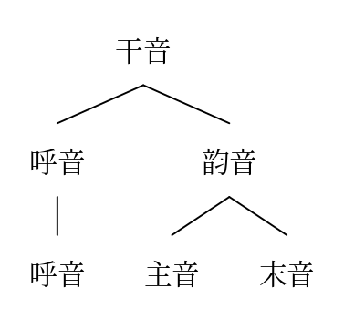
<figcaption>
图 6.2‑1干音的树形结构
</figcaption>
</figure>

在干音的树形结构中，干音分成呼音和韵音两段。呼音在音节中具有承前启后的作用。这种作用表现在在干音的音高和音质上：在音调维度上，呼音包含呼调。呼调不仅仅是把干调分成高调呼调干调和低调呼调干调的依据，而且也是逆向同化确定前面的浊首音的音调的依据。在音质维度上，呼音包含呼质。呼质在音节中具有承前启后的作用。根据呼质的承前启后的作用，干质分成呼质和韵质两段。因此，根据干质分成呼质和韵质两段，干音分成呼音和韵音两段。韵音由主音和末音构成。在干音中，尽管呼音和主音在组合关系上相互选择、相互制约，但末音与主音的组合关系比较紧密，呼音对主音的影响没有末音对主音的影响大。这把主音和末音整合成一个结构相对紧密的整体——韵音。因此，在主音和末音构成韵音后，呼音的承前启后的作用体现在与前面的首音和后面的韵音的配合上、主要体现与后面的韵音的配合上，这使呼音成为与韵音一起直接构成干音的两个同层的音段。

在干音的树形结构中，韵音分成主音和末音两段。在干音中，主音和末音的位置和地位不同。主音是干音的主音。换句话说，主音既是构成音节的也是构成干音的响度最大的音元。主音不仅时长最长而且强度最强，因而，响度最大。主音和末音不仅相互影响，而且受到前面的呼音的制约。在现代通用汉语中，只有当呼音、主音和末音各音的音质都相同时，呼音的音质和末音的音质才能相同，否则，呼音的音质和末音的音质不能相同。因此，主音和末音是直接构成韵音的两个同层的音元。

综述可知，干音的结构，从时间上分析是线性结构，从组合关系的紧密程度上分析是树形结构。

#### 干音的特征

干调和干质是干音的区别特征。干音由呼音、主音和末音构成。呼音、主音和末音都具有确定的音调和确定的音质。三者的音调构成干调。三者的音质构成干质。干音的音调被简称为干调，指与韵母联结的调段。干质是干音的音质的简称，对应韵母。干调与干质构成干音。干调和干质都构成对立。因此，干调和干质是干音的区别特征。

##### 干调

在干音中，干调由呼音的、主音的和末音的音调构成。依序把呼音的、主音的和末音的音调简称为呼调、主调和末调，干调记成：

$$
\begin{matrix}
干调 & = & \begin{bmatrix}
呼调 & 主调 & 末调
\end{bmatrix}
\end{matrix}
$$

根据调型分类，干调分成高调干调、升调干调、低调干调和降调干调四类。高调干调、升调干调、低调干调和降调干调依序就是阴平干调、阳平干调、上声干调和去声干调。根据三度标调法，用调名来标调，高调干调、升调干调、低调干调和降调干调四类干调依序记作：

$$
干调 = \left\{ \begin{matrix}
\begin{bmatrix}
高调呼调 & 高调主调 & 高调末调
\end{bmatrix}，当干调是高调时 \\
\begin{bmatrix}
低调呼调 & 中调主调 & 高调末调
\end{bmatrix}，当干调是升调时 \\
\begin{bmatrix}
低调呼调 & 低调主调 & 低调末调
\end{bmatrix}，当干调是低调时 \\
\begin{bmatrix}
高调呼调 & 中调主调 & 低调末调
\end{bmatrix}，当干调是降调时
\end{matrix} \right.
$$

根据三度标调法，用调号来标调，高调干调、升调干调、低调干调和降调干调四类干调依序记作：[ˊˊˊ]、[ˋˉˊ]、[ˋˋˋ]和[ˊˉˋ]。

根据五度标调法，用数码来标调，高调干调、升调干调、低调干调和降调干调四类干调依序记作：[555]、[345]、[211]和[541]。

根据三度标调法，用调名来标调，各类节调依序记作：

$$
节调 = \left\{ \begin{matrix}
\begin{bmatrix}
首调 & 高调呼调 & 高调主调 & 高调末调
\end{bmatrix}，当节调是高调时 \\[6pt]
\begin{bmatrix}
首调 & 低调呼调 & 中调主调 & 高调末调
\end{bmatrix}，当节调是升调时 \\[6pt]
\begin{bmatrix}
首调 & 低调呼调 & 低调主调 & 低调末调
\end{bmatrix}，当节调是低调时 \\[6pt]
\begin{bmatrix}
首调 & 高调呼调 & 中调主调 & 低调末调
\end{bmatrix}，当节调是降调时
\end{matrix} \right.
$$

在音节中，当首音是清音时，首调是零；当首音是浊音时，首调非零、受干调制约、由干调逆同化动态确定、不必具体确定。由于首调不是节调的区别特征，因此，首调在析音和标音时常被省略。

在不标首调时，根据三度标调法，用调号来标调，高调节调、升调节调、低调节调和降调节调四类节调依序记作：[ˊˊˊ]、[ˋˉˊ]、[ˋˋˋ]和[ˊˉˋ]。高调节调、升调节调、低调节调和降调节调依序就是高调阴平、升调阳平、低调上声和降调去声。

在不标首调时，根据五度标调法，用数码来标调，高调节调、升调节调、低调节调和降调节调四类节调依序记作：[555]、[345]、[211]和[541]。在不标首调时，比较节调和干调的标调结果可知，节调和干调相同。因此，简单地说，干调就是节调。

为从形式上区分节调和干调，根据首调不是节调的区别特征，不分清浊，把首音的音调统一记成[0]。因此，高调节调、升调节调、低调节调和降调节调四类节调依序记作：[0555]、[0345]、[0211]和[0541]；实际调值(连续调值)依序记作：[55]、[35]、[211]和[51]；在《汉语拼音方案》中依序记作：[ˉ]、[ˊ]、[ˇ]和[ˋ]。

根据调型分类，音节分为高调音节、升调音节、低调音节和降调音节四类。高调音节、升调音节、低调音节和降调音节依序就是阴平音节、阳平音节、上声音节和去声音节。各类音节依序记作：

$$
音节 = \left\{ \begin{matrix}
\begin{bmatrix}
首音 & 高调呼音 & 高调主音 & 高调末音
\end{bmatrix}，当音节是高调时 \\[6pt]
\begin{bmatrix}
首音 & 低调呼音 & 中调主音 & 高调末音
\end{bmatrix}，当音节是升调时 \\[6pt]
\begin{bmatrix}
首音 & 低调呼音 & 低调主音 & 低调末音
\end{bmatrix}，当音节是低调时 \\[6pt]
\begin{bmatrix}
首音 & 高调呼音 & 中调主音 & 低调末音
\end{bmatrix}，当音节是降调时
\end{matrix} \right.
$$

根据这种音节表示法可知，音元分析法表示节调的方法与节调质素分析法表示节调的方法不同：在音元系统中，节调由三个音元分段负载，间接用三个音元的音高来表示。在节调质素音节中，节调与节质构成音节，节调采用连续调值表示法直接用调号来表示，根据调型分类，一般把直线调记录成从起始点到讫止点间的水平直线或倾斜直线，把曲折调表示成从起始点经折点或极点到讫止点间的折线或曲线。

综述可知，在确定构成干音的音元时，音元的音调根据干音的音调——干调确定。因此，在经过音元分析后，呼调、主调和末调确定干调的调值。

##### 干质

在干音中，干质由呼音的、主音的和末音的音质构成。依序把呼音的、主音的和末音的音质改名为呼质、主质和末质，干质记成：

$$
\begin{matrix}
干质 & = & \begin{bmatrix}
呼质 & 主质 & 末质
\end{bmatrix}
\end{matrix}
$$

根据干音的音质由呼音的、主音的和末音的音质构成可知，干质是一个音质序列。然而，从呼质、主质和末质的组合关系上分析，呼质、主质和末质的组合关系是层次结构关系。这表现在：一方面，呼质在音节中具有承前启后的作用；另方面，在后长干音和三质干音中，主质与末质的组合关系远比呼质与主质的组合关系紧密。因此，干质结构是树形结构。

呼质在音节中具有承前启后的作用。呼质与主质、主质与末质、甚至呼质与末质在配合时相互选择、相互制约，但呼质在首质与干质配合成节质时作用比较重要。这种作用决定首音与干音在配合成音节时的相互选择和相互制约。这就是呼质的承前启后作用。

主质与末质的组合关系比呼质与主质的组合关系更紧密。末质在与主质配合时存在比较严格的选择和限制，这种选择和限制作用，使主质和末质被整合成一个结构相对紧密的整体，被命名为韵质。韵质是由主音的音质和末音的音质构成的音质，也就是说，韵质是由主质和末质构成的音质。因此，干质从结构上分成呼质和韵质两段。主质和末质构成韵质。根据干质结构是树形结构，干质用等式来表示记成：

$$
\begin{matrix}
干质 & = & \begin{bmatrix}
呼质 & \begin{matrix}
韵 &&& 质
\end{matrix}
\end{bmatrix} \\[6pt]
 & = & \begin{bmatrix}
呼质 & 主质 & 末质
\end{bmatrix}
\end{matrix}
$$

根据这个等式，干质的树形结构图示如图 6.2‑2。

<figure>
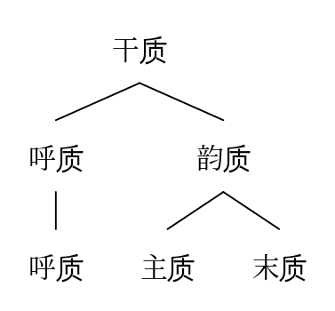
<figcaption>
图 6.2‑2干质的树形结构
</figcaption>
</figure>

干质与韵母的关系有二：

一、干质和韵母异名同实

在把干调与韵母构成干音后，干质是干音的音质的简称。根据节调质素分析法解说，干音由干调与韵母构成，干质就是韵母。在音元系统中，干音由呼音、主音和末音构成；呼质、主质和末质依序就是呼音、主音和末音三音的音质；呼质、主质和末质构成干音的音质；因此，干质由呼音、主音和末音三个音的音质构成。干质是音元分析法的术语，韵母是节调质素分析法的术语。在不强调干质是音元分析法的术语而韵母是节调质素分析法的术语时，两者完全可以互用。

二、干质和韵母异形同质

在经过音元分析后，干质不论是由一个、两个还是三个质素构成，都被根据质调关系的内容分析成由呼音的音质、主音的音质和末音的音质构成的音质。然而，在节调质素音节中，韵母不论是由一个、两个还是三个质素构成，都不考虑干调和韵母的关系，单纯根据质素单复及复合程度被分析成由一个、两个或三个质素构成的韵母。可见，音元分析法的干质和节调质素分析法的韵母的区别，只是结构形式的区别，而不是音质内容的不同。换句话说，在一个干音中，由呼音、主音和末音三个音的音质构成的干质与构成干音的韵母音质相同，形式不同。

然而，韵母是已被广泛接受的术语，因此，在音元系统中，把韵母改名为干质，有这个必要吗？换句话说，区分干质与韵母，这种区别有用吗？这种区别是有用的。

在节调质素音节中，韵母仅指干音的音质。因此，从发音上说，韵母是不能单独发音的抽象的音质，只有在与节调配构成干音后才能发成有具体音值的干音。因此，在指称某个韵母时，只能用某类干音的韵母这种说法或使用韵母的名称。不能发音的韵母，与能发音的干音不同，不能用实际音值来指称。因此，韵母，尽管事实上只是干音的音质，但常人一般都把它们当成由阴平与韵母构成的干音来掌握和理解。也就是说，常人是把指称干质的韵母当作干音的一类，一般是阴平干音，来掌握和理解的。尽管在节调质素音节中韵母指干质，但各种解说节调质素分析法的理论并未明确指出韵母指干音的不能发音的纯粹的音质，往往把韵母等同由阴平与韵母构成的干音。因此，若有人从发音上问一个解说节调质素分析法的语音学家，韵母 ᴀ 是啥？怎么发音？他可能会理直气壮地立即发一个节调是阴平、韵母是 ᴀ 的干音[ᴀ⁵⁵]，然后说，就是这个音。然而，如果继续追问，在发音上，韵母 ᴀ 与你刚才发的这个由阴平与韵母 ᴀ 构成的干音[ᴀ⁵⁵]区别是啥？韵母 ᴀ 怎么发音？他就会傻眼。可是如果从理论上承认韵母是不能发音的纯而又纯的音质，理论上如何解释，发音和拼音上如何解决面临的困难，问题和困难不少。相反，在音元系统中，干音不会产生如何发音的问题。这是由于干音是根据音元序列对应的片音序列拼音的，在拼音时不需再次确定质调关系、不必掌握抽象的干质(亦即韵母)。因此，把干音的音质简称为干质，也就是说把韵母改名为干质，一方面，是为从音质上对干音分类，从音质上认识干音；另方面，在音元系统中，也要说明由构成干音的各音的音质构成的干质和节调质素分析法的韵母的关系，而这时如果把两者都称为韵母，比较时，就需在两者的前面加上长而又长的限定词，说明起来就比较冗繁。

干质根据音元的音质、唱音的音质(质位和质素)记录，韵母根据《汉语拼音方案》和《注音符号方案》记录，干质和韵母的对应关系列表见表
6.2‑7。

<table style="width:93%;">
<caption>
表 6.2‑7干质和韵母的对应关系
</caption>
<colgroup>
<col style="width: 4%" />
<col style="width: 3%" />
<col style="width: 4%" />
<col style="width: 4%" />
<col style="width: 3%" />
<col style="width: 3%" />
<col style="width: 4%" />
<col style="width: 4%" />
<col style="width: 3%" />
<col style="width: 4%" />
<col style="width: 4%" />
<col style="width: 4%" />
<col style="width: 4%" />
<col style="width: 5%" />
<col style="width: 5%" />
<col style="width: 5%" />
<col style="width: 3%" />
<col style="width: 5%" />
<col style="width: 5%" />
<col style="width: 5%" />
</colgroup>
<thead>
<tr>
<th colspan="12">干质</th>
<th colspan="8">韵母</th>
</tr>
<tr>
<th colspan="4">音元的音质</th>
<th colspan="4">质位</th>
<th colspan="4">质素</th>
<th colspan="4">《汉语拼音方案》</th>
<th colspan="4">《注音符号方案》</th>
</tr>
<tr>
<th>无</th>
<th>噫</th>
<th>呜</th>
<th>吁</th>
<th>无</th>
<th>噫</th>
<th>呜</th>
<th>吁</th>
<th>无</th>
<th>噫</th>
<th>呜</th>
<th>吁</th>
<th>无</th>
<th>噫</th>
<th>呜</th>
<th>吁</th>
<th>无</th>
<th>噫</th>
<th>呜</th>
<th>吁</th>
</tr>
</thead>
<tbody>
<tr>
<td>iii</td>
<td></td>
<td></td>
<td></td>
<td>i</td>
<td></td>
<td></td>
<td></td>
<td>i</td>
<td></td>
<td></td>
<td></td>
<td>i</td>
<td></td>
<td></td>
<td></td>
<td>ㄧ</td>
<td></td>
<td></td>
<td></td>
</tr>
<tr>
<td>uuu</td>
<td></td>
<td></td>
<td></td>
<td>u</td>
<td></td>
<td></td>
<td></td>
<td>u</td>
<td></td>
<td></td>
<td></td>
<td>u</td>
<td></td>
<td></td>
<td></td>
<td>ㄨ</td>
<td></td>
<td></td>
<td></td>
</tr>
<tr>
<td>ʏʏʏ</td>
<td></td>
<td></td>
<td></td>
<td>ʏ</td>
<td></td>
<td></td>
<td></td>
<td>ʏ</td>
<td></td>
<td></td>
<td></td>
<td>ü</td>
<td></td>
<td></td>
<td></td>
<td>ㄩ</td>
<td></td>
<td></td>
<td></td>
</tr>
<tr>
<td>ᴀᴀᴀ</td>
<td>iᴀᴀ</td>
<td>uᴀᴀ</td>
<td></td>
<td>ᴀ</td>
<td>iᴀ</td>
<td>uᴀ</td>
<td></td>
<td>ᴀ</td>
<td>iᴀ</td>
<td>uᴀ</td>
<td></td>
<td>ɑ</td>
<td>iɑ</td>
<td>uɑ</td>
<td></td>
<td>ㄚ</td>
<td>ㄧㄚ</td>
<td>ㄨㄚ</td>
<td></td>
</tr>
<tr>
<td rowspan="2">ooo</td>
<td rowspan="2"></td>
<td rowspan="2">uoo</td>
<td rowspan="2"></td>
<td rowspan="2">o</td>
<td rowspan="2"></td>
<td rowspan="2">uo</td>
<td rowspan="2"></td>
<td>o</td>
<td rowspan="2"></td>
<td rowspan="2">uo</td>
<td rowspan="2"></td>
<td rowspan="2">
o

e
</td>
<td rowspan="2"></td>
<td rowspan="2">uo</td>
<td rowspan="2"></td>
<td rowspan="2">ㄛ</td>
<td rowspan="2"></td>
<td rowspan="2">ㄨㄛ</td>
<td rowspan="2"></td>
</tr>
<tr>
<td>ɤ</td>
</tr>
<tr>
<td>ᴇᴇᴇ</td>
<td>iᴇᴇ</td>
<td></td>
<td>ʏᴇᴇ</td>
<td>ᴇ</td>
<td>iᴇ</td>
<td></td>
<td>ʏᴇ</td>
<td>ᴇ</td>
<td>iᴇ</td>
<td></td>
<td>ʏᴇ</td>
<td>ê</td>
<td>ie</td>
<td></td>
<td>üe</td>
<td>ㄝ</td>
<td>ㄧㄝ</td>
<td></td>
<td>ㄩㄝ</td>
</tr>
<tr>
<td rowspan="2">󰉺󰉺󰉺</td>
<td rowspan="2"></td>
<td rowspan="2"></td>
<td rowspan="2"></td>
<td rowspan="2">󰉺</td>
<td rowspan="2"></td>
<td rowspan="2"></td>
<td rowspan="2"></td>
<td>ɿ</td>
<td rowspan="2"></td>
<td rowspan="2"></td>
<td rowspan="2"></td>
<td rowspan="2">i</td>
<td rowspan="2"></td>
<td rowspan="2"></td>
<td rowspan="2"></td>
<td rowspan="2">ㄭ</td>
<td rowspan="2"></td>
<td rowspan="2"></td>
<td rowspan="2"></td>
</tr>
<tr>
<td>ʅ</td>
</tr>
<tr>
<td>󰉻󰉻󰉻</td>
<td></td>
<td></td>
<td></td>
<td>󰉻</td>
<td></td>
<td></td>
<td></td>
<td>ɚ</td>
<td></td>
<td></td>
<td></td>
<td>er</td>
<td></td>
<td></td>
<td></td>
<td>ㄦ</td>
<td></td>
<td></td>
<td></td>
</tr>
<tr>
<td>nnn</td>
<td></td>
<td></td>
<td></td>
<td>n</td>
<td></td>
<td></td>
<td></td>
<td>n</td>
<td></td>
<td></td>
<td></td>
<td>n</td>
<td></td>
<td></td>
<td></td>
<td></td>
<td></td>
<td></td>
<td></td>
</tr>
<tr>
<td>ŋŋŋ</td>
<td></td>
<td></td>
<td></td>
<td>ŋ</td>
<td></td>
<td></td>
<td></td>
<td>ŋ</td>
<td></td>
<td></td>
<td></td>
<td>nɡ</td>
<td></td>
<td></td>
<td></td>
<td></td>
<td></td>
<td></td>
<td></td>
</tr>
<tr>
<td>ᴀᴀi</td>
<td></td>
<td>uᴀi</td>
<td></td>
<td>ᴀi</td>
<td></td>
<td>uᴀi</td>
<td></td>
<td>æɪ</td>
<td></td>
<td>uæɪ</td>
<td></td>
<td>ɑi</td>
<td></td>
<td>uɑi</td>
<td></td>
<td>ㄞ</td>
<td></td>
<td>ㄨㄞ</td>
<td></td>
</tr>
<tr>
<td>ᴇᴇi</td>
<td></td>
<td>uᴇi</td>
<td></td>
<td>ᴇi</td>
<td></td>
<td>uᴇi</td>
<td></td>
<td>eɪ</td>
<td></td>
<td>ueɪ</td>
<td></td>
<td>ei</td>
<td></td>
<td>uei</td>
<td></td>
<td>ㄟ</td>
<td></td>
<td>ㄨㄟ</td>
<td></td>
</tr>
<tr>
<td>ᴀᴀu</td>
<td>iᴀu</td>
<td></td>
<td></td>
<td>ᴀu</td>
<td>iᴀu</td>
<td></td>
<td></td>
<td>ɑᴜ</td>
<td>iɑᴜ</td>
<td></td>
<td></td>
<td>ɑo</td>
<td>iɑo</td>
<td></td>
<td></td>
<td>ㄠ</td>
<td>ㄧㄠ</td>
<td></td>
<td></td>
</tr>
<tr>
<td>oou</td>
<td>iou</td>
<td></td>
<td></td>
<td>ou</td>
<td>iou</td>
<td></td>
<td></td>
<td>ɤᴜ</td>
<td>iɤᴜ</td>
<td></td>
<td></td>
<td>ou</td>
<td>iou</td>
<td></td>
<td></td>
<td>ㄡ</td>
<td>ㄧㄡ</td>
<td></td>
<td></td>
</tr>
<tr>
<td>ᴀᴀn</td>
<td>iᴀn</td>
<td>uᴀn</td>
<td>ʏᴀn</td>
<td>ᴀn</td>
<td>iᴀn</td>
<td>uᴀn</td>
<td>ʏᴀn</td>
<td>an</td>
<td>iæn</td>
<td>uan</td>
<td>ʏæn</td>
<td>ɑn</td>
<td>iɑn</td>
<td>uɑn</td>
<td>üɑn</td>
<td>ㄢ</td>
<td>ㄧㄢ</td>
<td>ㄨㄢ</td>
<td>ㄩㄢ</td>
</tr>
<tr>
<td>ᴇᴇn</td>
<td>iᴇn</td>
<td>uᴇn</td>
<td>ʏᴇn</td>
<td>ᴇn</td>
<td>iᴇn</td>
<td>uᴇn</td>
<td>ʏᴇn</td>
<td>ən</td>
<td>i󰉸n</td>
<td>uən</td>
<td>ʏ󰉸n</td>
<td>en</td>
<td>in</td>
<td>uen</td>
<td>ün</td>
<td>ㄣ</td>
<td>ㄧㄣ</td>
<td>ㄨㄣ</td>
<td>ㄩㄣ</td>
</tr>
<tr>
<td>ᴀᴀŋ</td>
<td>iᴀŋ</td>
<td>uᴀŋ</td>
<td></td>
<td>ᴀŋ</td>
<td>iᴀŋ</td>
<td>uᴀŋ</td>
<td></td>
<td>ɑŋ</td>
<td>iɑŋ</td>
<td>uɑŋ</td>
<td></td>
<td>ɑnɡ</td>
<td>iɑnɡ</td>
<td>uɑnɡ</td>
<td></td>
<td>ㄤ</td>
<td>ㄧㄤ</td>
<td>ㄨㄤ</td>
<td></td>
</tr>
<tr>
<td rowspan="2">ooŋ</td>
<td rowspan="2">ioŋ</td>
<td rowspan="2">uoŋ</td>
<td rowspan="2">ʏoŋ</td>
<td rowspan="2">oŋ</td>
<td rowspan="2">ioŋ</td>
<td rowspan="2">uoŋ</td>
<td rowspan="2">ʏoŋ</td>
<td rowspan="2">ɤŋ</td>
<td rowspan="2">i󰉹ŋ</td>
<td>uɤŋ</td>
<td rowspan="2">y󰉹ŋ</td>
<td rowspan="2">enɡ</td>
<td rowspan="2">inɡ</td>
<td>uenɡ</td>
<td rowspan="2">ionɡ</td>
<td rowspan="2">ㄥ</td>
<td rowspan="2">ㄧㄥ</td>
<td rowspan="2">ㄨㄥ</td>
<td rowspan="2">ㄩㄥ</td>
</tr>
<tr>
<td>ᴜ󰉹ŋ</td>
<td>onɡ</td>
</tr>
</tbody>
</table>

在本表中，在用质素来记录干质时，因受栏宽限制，省略两侧的质素标志符左方括号“[”和有方括号“]”。

在本表中，列标题“无”、“噫”、“呜”和“吁”依序表示无头韵母、噫头韵母、呜头韵母和吁头韵母。

呼质与韵头不同。呼质是呼音的音质的简称。每个干音都有呼音，因此，每个干质都有呼质。根据音质分类，呼质分成未名呼质、噫质呼质、呜质呼质和吁质呼质四类。未名呼质指除噫质呼质、呜质呼质和吁质呼质外的呼质。噫质呼质指呼音的音质是 i[i]的呼音的音质。呜质呼质指呼音的音质是 u[u]的呼音的音质。吁质呼质指呼音的音质是 ʏ[ʏ]的呼音的音质。然而，韵头仅指有头韵母(分为噫头韵母、呜头韵母和吁头韵母)的韵头 i、u 或 ʏ。只有有头韵母(后长韵母和三质韵母)有韵头，无头韵母(前长韵母和单质韵母)没有韵头。

根据呼质与韵头的对应关系可知，在音元系统中，单质韵母被分析成韵母前段、韵母中段和韵母后段三段，并被改名为呼质、主质和末质；前长韵母的充当间质的韵腹被分析成间质前段和间质后段两段，也就是说，充当前长韵母的间质的韵腹被分析成韵腹前段和韵腹后段两段，并被改名为呼质和主质；呼音的音质对应单质韵母的韵母前段、后长韵母的韵头、前长韵母的间质前段和三质韵母的韵头。

主质与韵腹不同。主质是主音的音质的简称。在节调质素音节中，当韵母是单质韵母时，韵腹充当韵母；当韵母是前长韵母时，韵腹充当间质；当韵母是后长韵母时，韵腹充当韵质；当韵母是三质韵母时，韵腹充当主质（主质是主要质素的简称也被简称为主体或核心）。因此，只有当韵母是三质韵母时韵腹才是主质。

根据主质与韵腹的对应关系可知，在音元系统中，单质韵母被分析成韵母前段、韵母中段和韵母后段三段，并被改名为呼质、主质和末质；后长韵母的充当韵质的韵腹被分析成韵质前段和韵质后段两段，也就是说，充当后长韵母的韵质的韵腹被分析成韵腹前段和韵腹后段两段，并被改名为主质和末质；前长韵母的充当间质的韵腹被分析成间质前段和间质后段两段，也就是说，充当前长韵母的间质的韵腹被分析成韵腹前段和韵腹后段两段，并被改名为呼质和主质；主质对应单质韵母的中段、后长韵母的韵质前段、前长韵母的间质后段和三质韵母的韵腹。

末质与韵尾不同。末质是末音的音质的简称。每个干音都有末音，因此，每个韵母都有末质。然而，只有当韵母是前长韵母和三质韵母时韵母才有韵尾，也就是说，在后长韵母和单质韵母中韵母没有韵尾。

根据末质与韵尾的对应关系可知，在音元系统中，单质韵母被分析成韵母前段、韵母中段和韵母后段三段，并被改名为呼质、主质和末质；后长韵母的充当韵质的韵腹被分析成韵质前段和韵质后段两段，也就是说，充当后长韵母的韵质的韵腹被分析成韵腹前段和韵腹后段两段，并被改名为主质和末质；末音的音质对应单质韵母的韵母后段、后长韵母的韵质后段、前长韵母的韵尾和三质韵母的韵尾。

韵质与韵身或韵基不尽相同。在音元系统中，韵质是韵音的音质的简称，由主音的音质和末音的音质构成，也就是说，韵质是由主质和末质构成的音质。在节调质素音节中，韵身在单质韵母和后长韵母中名为韵腹实为韵身，韵身在前长韵母和三质韵母中由韵腹和韵尾构成。这就是说，每个韵母都有韵身，单质韵母的韵身就是由韵腹自成的韵母本身，后长韵母的韵身就是由韵腹自成的韵质本身，前长韵母的韵身就是由韵腹自成的间质与韵尾构成的韵母本身，三质韵母的韵身仅指由韵母的除韵头外的韵腹和韵尾构成的韵质。单质韵母的韵身和前长韵母的韵身实际上是韵母。后长韵母的韵身和三质韵母的韵身不是韵母而是韵质。

根据韵质与韵身的对应关系可知，在音元系统中，单质韵母被分析成韵母前段、韵母中段和韵母后段三段，并被改名为呼质、主质和末质；前长韵母的充当间质的韵腹被分析成间质前段和间质后段两段，也就是说，充当前长韵母的间质的韵腹被分析成韵腹前段和韵腹后段两段，并被改名为呼质和主质；韵质对应单质韵母的中段和后段、后长韵母的韵腹、前长韵母的间质后段和韵尾、三质韵母的由韵腹和韵尾构成韵质。

在音元系统中，根据呼音的特征分类，干音分成未名呼干音、齐齿呼干音、合口呼干音和撮口呼干音四类。未名呼干音指除齐齿呼干音、合口呼干音和撮口呼干音外的干音。齐齿呼干音指呼音的音质是“噫”(i[i])的干音。合口呼干音指呼音的音质是“呜”(u[u])的干音。撮口呼干音指呼音的音质是“吁”(ʏ([ʏ]/[y]))的干音。

在音元系统中，根据韵音的音质分类，干音分成 18 大类。在音元系统中，韵音的音质共有 18 个。因此，干音根据韵音的音质分类分成 18 大类。在音元系统中，干音由干调与干质构成，干调分成四类，因此，根据韵质分类分出的各类干音根据干调分类各分四类。

干音根据干调和韵质交叉分类列表见表 6.2‑8。

<table>
<caption>
表 6.2‑8干音根据干调和韵质交叉分类
</caption>
<colgroup>
<col style="width: 7%" />
<col style="width: 5%" />
<col style="width: 5%" />
<col style="width: 5%" />
<col style="width: 5%" />
<col style="width: 5%" />
<col style="width: 5%" />
<col style="width: 5%" />
<col style="width: 5%" />
<col style="width: 5%" />
<col style="width: 5%" />
<col style="width: 5%" />
<col style="width: 5%" />
<col style="width: 5%" />
<col style="width: 5%" />
<col style="width: 5%" />
<col style="width: 5%" />
</colgroup>
<thead>
<tr>
<th style="text-align: left;"></th>
<th colspan="4">未名呼干音</th>
<th colspan="4">齐齿呼干音</th>
<th colspan="4">合口呼干音</th>
<th colspan="4">撮口呼干音</th>
</tr>
<tr>
<th>
调类

韵质
</th>
<th>高</th>
<th>升</th>
<th>低</th>
<th>降</th>
<th>高</th>
<th>升</th>
<th>低</th>
<th>降</th>
<th>高</th>
<th>升</th>
<th>低</th>
<th>降</th>
<th>高</th>
<th>升</th>
<th>低</th>
<th>降</th>
</tr>
</thead>
<tbody>
<tr>
<td>ii</td>
<td></td>
<td></td>
<td></td>
<td></td>
<td>󰌠󰌠󰌠</td>
<td>󰌤󰌡󰌠</td>
<td>󰌤󰌤󰌤</td>
<td>󰌠󰌡󰌤</td>
<td></td>
<td></td>
<td></td>
<td></td>
<td></td>
<td></td>
<td></td>
<td></td>
</tr>
<tr>
<td>uu</td>
<td></td>
<td></td>
<td></td>
<td></td>
<td></td>
<td></td>
<td></td>
<td></td>
<td>󰌪󰌪󰌪</td>
<td>󰌮󰌫󰌪</td>
<td>󰌮󰌮󰌮</td>
<td>󰌪󰌫󰌮</td>
<td></td>
<td></td>
<td></td>
<td></td>
</tr>
<tr>
<td>ʏʏ</td>
<td></td>
<td></td>
<td></td>
<td></td>
<td></td>
<td></td>
<td></td>
<td></td>
<td></td>
<td></td>
<td></td>
<td></td>
<td>󰌴󰌴󰌴</td>
<td>󰌸󰌵󰌴</td>
<td>󰌸󰌸󰌸</td>
<td>󰌴󰌵󰌸</td>
</tr>
<tr>
<td>ᴀᴀ</td>
<td>󰌾󰌾󰌾</td>
<td>󰍂󰌿󰌾</td>
<td>󰍂󰍂󰍂</td>
<td>󰌿󰍂</td>
<td>󰌠󰌾󰌾</td>
<td>󰌤󰌿󰌾</td>
<td>󰌤󰍂󰍂</td>
<td>󰌠󰌿󰍂</td>
<td>󰌪󰌾󰌾</td>
<td>󰌮󰌿󰌾</td>
<td>󰌮󰍂󰍂</td>
<td>󰌪󰌿󰍂</td>
<td></td>
<td></td>
<td></td>
<td></td>
</tr>
<tr>
<td>oo</td>
<td>󰍒󰍒󰍒</td>
<td>󰍖󰍓󰍒</td>
<td>󰍖󰍖󰍖</td>
<td>󰍒󰍓󰍖</td>
<td></td>
<td></td>
<td></td>
<td></td>
<td>󰌪󰍒󰍒</td>
<td>󰌮󰍓󰍒</td>
<td>󰌮󰍖󰍖</td>
<td>󰌪󰍓󰍖</td>
<td></td>
<td></td>
<td></td>
<td></td>
</tr>
<tr>
<td>ᴇᴇ</td>
<td>󰍡󰍡󰍡</td>
<td>󰍥󰍢󰍡</td>
<td>󰍥󰍥󰍥</td>
<td>󰍡󰍢󰍥</td>
<td>󰌠󰍡󰍡</td>
<td>󰌤󰍢󰍡</td>
<td>󰌤󰍥󰍥</td>
<td>󰌠󰍢󰍥</td>
<td></td>
<td></td>
<td></td>
<td></td>
<td>󰌴󰍡󰍡</td>
<td>󰌸󰍢󰍡</td>
<td>󰌸󰍥󰍥</td>
<td>󰌴󰍢󰍥</td>
</tr>
<tr>
<td>󰉺󰉺</td>
<td>󰍵󰍵󰍵</td>
<td>󰍹󰍶󰍵</td>
<td>󰍹󰍹󰍹</td>
<td>󰍵󰍶󰍹</td>
<td></td>
<td></td>
<td></td>
<td></td>
<td></td>
<td></td>
<td></td>
<td></td>
<td></td>
<td></td>
<td></td>
<td></td>
</tr>
<tr>
<td>󰉻󰉻</td>
<td>󰎄󰎄󰎄</td>
<td>󰎈󰎅󰎄</td>
<td>󰎈󰎈󰎈</td>
<td>󰎄󰎅󰎈</td>
<td></td>
<td></td>
<td></td>
<td></td>
<td></td>
<td></td>
<td></td>
<td></td>
<td></td>
<td></td>
<td></td>
<td></td>
</tr>
<tr>
<td>nn</td>
<td>󰎓󰎓󰎓</td>
<td>󰎗󰎔󰎓</td>
<td>󰎗󰎗󰎗</td>
<td>󰎓󰎔󰎗</td>
<td></td>
<td></td>
<td></td>
<td></td>
<td></td>
<td></td>
<td></td>
<td></td>
<td></td>
<td></td>
<td></td>
<td></td>
</tr>
<tr>
<td>ŋŋ</td>
<td>󰎘󰎘󰎘</td>
<td>󰎜󰎙󰎘</td>
<td>󰎜󰎜󰎜</td>
<td>󰎘󰎙󰎜</td>
<td></td>
<td></td>
<td></td>
<td></td>
<td></td>
<td></td>
<td></td>
<td></td>
<td></td>
<td></td>
<td></td>
<td></td>
</tr>
<tr>
<td>ᴀi</td>
<td>󰌾󰌾󰌠</td>
<td>󰍂󰌿󰌠</td>
<td>󰍂󰍂󰌤</td>
<td>󰌾󰌿󰌤</td>
<td></td>
<td></td>
<td></td>
<td></td>
<td>󰌪󰌾󰌠</td>
<td>󰌮󰌿󰌠</td>
<td>󰌮󰍂󰌤</td>
<td>󰌪󰌿󰌤</td>
<td></td>
<td></td>
<td></td>
<td></td>
</tr>
<tr>
<td>ᴇi</td>
<td>󰍡󰍡󰌠</td>
<td>󰍥󰍢󰌠</td>
<td>󰍥󰍥󰌤</td>
<td>󰍡󰍢󰌤</td>
<td></td>
<td></td>
<td></td>
<td></td>
<td>󰌪󰍡󰌠</td>
<td>󰌮󰍢󰌠</td>
<td>󰌮󰍥󰌤</td>
<td>󰌪󰍢󰌤</td>
<td></td>
<td></td>
<td></td>
<td></td>
</tr>
<tr>
<td>ᴀu</td>
<td>󰌾󰌾󰌪</td>
<td>󰍂󰌿󰌪</td>
<td>󰍂󰍂󰌮</td>
<td>󰌾󰌿󰌮</td>
<td>󰌠󰌾󰌪</td>
<td>󰌤󰌿󰌪</td>
<td>󰌤󰍂󰌮</td>
<td>󰌠󰌿󰌮</td>
<td></td>
<td></td>
<td></td>
<td></td>
<td></td>
<td></td>
<td></td>
<td></td>
</tr>
<tr>
<td>ou</td>
<td>󰍒󰍒󰌪</td>
<td>󰍖󰍓󰌪</td>
<td>󰍖󰍖󰌮</td>
<td>󰍒󰍓󰌮</td>
<td>󰌠󰍒󰌪</td>
<td>󰌤󰍓󰌪</td>
<td>󰌤󰍖󰌮</td>
<td>󰌠󰍓󰌮</td>
<td></td>
<td></td>
<td></td>
<td></td>
<td></td>
<td></td>
<td></td>
<td></td>
</tr>
<tr>
<td>ᴀn</td>
<td>󰌾󰌾󰎓</td>
<td>󰍂󰌿󰎓</td>
<td>󰍂󰍂󰎗</td>
<td>󰌾󰌿󰎗</td>
<td>󰌠󰌾󰎓</td>
<td>󰌤󰌿󰎓</td>
<td>󰌤󰍂󰎗</td>
<td>󰌠󰌿󰎗</td>
<td>󰌪󰌾󰎓</td>
<td>󰌮󰌿󰎓</td>
<td>󰌮󰍂󰎗</td>
<td>󰌪󰌿󰎗</td>
<td>󰌴󰌾󰎓</td>
<td>󰌸󰌿󰎓</td>
<td>󰌸󰍂󰎗</td>
<td>󰌴󰌿󰎗</td>
</tr>
<tr>
<td>ᴇn</td>
<td>󰍡󰍡󰎓</td>
<td>󰍥󰍢󰎓</td>
<td>󰍥󰍥󰎗</td>
<td>󰍡󰍢󰎗</td>
<td>󰌠󰍡󰎓</td>
<td>󰌤󰍢󰎓</td>
<td>󰌤󰍥󰎗</td>
<td>󰌠󰍢󰎗</td>
<td>󰌪󰍡󰎓</td>
<td>󰌮󰍢󰎓</td>
<td>󰌮󰍥󰎗</td>
<td>󰌪󰍢󰎗</td>
<td>󰌴󰍡󰎓</td>
<td>󰌸󰍢󰎓</td>
<td>󰌸󰍥󰎗</td>
<td>󰌴󰍢󰎗</td>
</tr>
<tr>
<td>ᴀŋ</td>
<td>󰌾󰌾󰎘</td>
<td>󰍂󰌿󰎘</td>
<td>󰍂󰍂󰎜</td>
<td>󰌾󰌿󰎜</td>
<td>󰌠󰌾󰎘</td>
<td>󰌤󰌿󰎘</td>
<td>󰌤󰍂󰎜</td>
<td>󰌠󰌿󰎜</td>
<td>󰌪󰌾󰎘</td>
<td>󰌮󰌿󰎘</td>
<td>󰌮󰍂󰎜</td>
<td>󰌪󰌿󰎜</td>
<td></td>
<td></td>
<td></td>
<td></td>
</tr>
<tr>
<td>oŋ</td>
<td>󰍒󰍒󰎘</td>
<td>󰍖󰍓󰎘</td>
<td>󰍖󰍖󰎜</td>
<td>󰍒󰍓󰎜</td>
<td>󰌠󰍒󰎘</td>
<td>󰌤󰍓󰎘</td>
<td>󰌤󰍖󰎜</td>
<td>󰌠󰍓󰎜</td>
<td>󰌪󰍒󰎘</td>
<td>󰌮󰍓󰎘</td>
<td>󰌮󰍖󰎜</td>
<td>󰌪󰍓󰎜</td>
<td>󰌴󰍒󰎘</td>
<td>󰌸󰍓󰎘</td>
<td>󰌸󰍖󰎜</td>
<td>󰌴󰍓󰎜</td>
</tr>
</tbody>
</table>

在本表中，没有列出记录干音的音元序列对应的片音序列、《汉语拼音方案》和《注音符号方案》的音符，以便简洁明了地突显干音的析音效果。

## 音节与拼音

音节由首音和干音构成。根据音元分析法说明音节的构成，具体内容是制作每个音节具体由哪个首音和哪个干音构成的音节表。根据音元分析拼音，就是根据由音元所表示的片音拼音。确定由音元所表示的片音，是根据由音元所表示的片音拼音的前提。确定由音元所表示的片音，就是根据音节的构成确定每个音元的分布状况并确定每个音元在特定的分布环境中的取值(在特定的分布环境中表示的特定片音)及其取值规则。

### 音节的结构

在音元系统中，从时间关系上分析，音节的结构是线性结构。根据音节的结构是线性结构，音节用等式来表示记成：

$$
\begin{matrix}
音节 & = & \begin{bmatrix}
首音 & 呼音 & 主音 & 末音
\end{bmatrix}
\end{matrix}
$$

音节结构是树形结构。在音元系统中，从树形结构上说明，主音和末音构成韵音，呼音和韵音构成干音，首音和干音构成音节。因此，音节结构是树形结构。

根据音节结构是树形结构，音节用等式来表示记成：

$$
\begin{matrix}
音节 & = & \begin{bmatrix}
首音 & \begin{matrix}
干 &&&&&& 音
\end{matrix}
\end{bmatrix} \\[6pt]
 & = & \begin{bmatrix}
首音 & 呼音 & \begin{matrix}
韵 &&& 音
\end{matrix}
\end{bmatrix} \\[6pt]
 & = & \begin{bmatrix}
首音 & 呼音 & 主音 & 末音
\end{bmatrix}
\end{matrix}
$$

音节的树形结构图示如图 6.3‑1。

<figure>
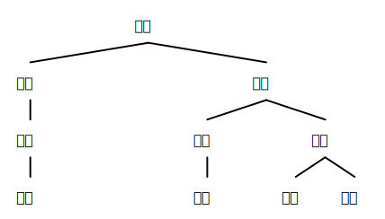
<figcaption>
图 6.3‑1音节的树形结构
</figcaption>
</figure>

在树形音节中，音节分成首音和干音两段。这个层次的分段不仅与构成节调的音节各音的音高的组合关系有关，而且与构成节质的音节各音的音质的组合关系有关。在音调维度上，首音只由噪音充当，分成清音和浊音两类，清音的音调是零，浊音的音调非零。首音的音调不是首音的区别特征，不必确定具体高度。相反，在干音中，音元都是乐音。乐音都具有确定的音高。在干音中，乐音的音高构成干音的音调——干调。在音节中，干调也构成对立，与干音的音质——干质相对独立。因此，在干音中，每个乐音的音高的组合方式受干调的调型制约。虽然，干调与干质相对独立，干调的完整相对不受干质变化的影响，但是，在音值上，在干音中每个乐音的音高都不能脱离各自的音质而存在。因此，干调反过来制约着构成干音的每个乐音的音质的时长，从而制约着整个干音的时长、把由各个乐音构成的干音整合成一个结构相对紧密的整体。这就是说，由于受到干调调型制约，干调具有整合作用，这种整合作用，把构成干音的三个乐音整合成一个相对独立于首音的整体。简单地说，充当首音的音元与构成干音的音元的类型不同，决定充当呼音、主音和末音的乐音在组合时的紧密程度，比充当首音的噪音与构成干音的乐音在组合时的紧密程度大。这种不同使得充当呼音、主音和末音的乐音整合成一个结构相对紧密的整体——干音。在音质维度上，首音和干音能否构成音节，主要由首音与呼音在音质上能否组合决定。也就是说，充当首音的噪音与构成干音的乐音主要是呼音在音质上的选择和制约关系，决定首音和干音能否构成音节。音节各音在音高和音质上能否组合，决定首音和干音是直接构成音节的两个同层的音段。

在树形音节中，干音分成呼音和韵音两段。呼音在音节中具有承前启后的作用。呼音与主音、主音与末音、甚至呼音与末音在构成干音时相互选择、相互制约。然而，呼音与主音的组合关系没有末音与主音的组合关系紧密。这把主音和末音整合成一个结构相对紧密的整体——韵音。因此，在主音和末音构成韵音后，呼音的承前启后的作用体现在与前面的首音和后面的韵音的配合上、主要体现与后面的韵音的配合上，这使呼音成为与韵音一起直接构成干音的两个同层的音段。

在树形音节中，韵音分成主音和末音两段。在干音中，主音和末音不同。主音既是音节的主音，也是干音的主音。换句话说，主音既是构成音节的也是构成干音的响度最大的音元。不考虑首音的响度大小，相对主音，呼音和末音是构成音节和干音的响度较小或最小的音元。在组合关系上，末音与主音的组合关系比呼音与主音的组合关系紧密。因此，主音和末音是直接构成韵音的两个同层的音元。

在音节中，首音只由噪音充当，一个音节只有一个首音。首音根据有无是否构成对立分成实首音和虚首音两类。实首音的有无通常构成对立。虚首音的有无不构成对立。虚首音因其有无不构成对立而在析音和记音时常被省略。然而，虚首音在语流中具有确定音节界限的作用，不是可有可无的，而是必不可少的，因此，虚首音在语流中不能省略。

综述可知，音节的结构，从时间上分析是线性结构，从组合关系的紧密程度上分析是树形结构。

### 音节的构成

根据音元分析法说明音节的构成，具体内容是制作每个音节具体由哪个首音和哪个干音构成的音节表。制作音元分析的音节总表，既可根据首音差异分类制表也可根据韵音的音质的差异分类制表。

根据首音差异分类制表就是把首音相同干音不同的音节录入在同一张表中。根据首音差异分类，把首音是虚首音的音节录入在同一张表中，音节分为 22 个首音不同的类，共有 22 张首音不同的音节表。

根据韵音的音质的差异分类制表就是把首音不同韵音的音质相同的音节录入在同一张表中。在音节或干音中，韵音的音质相同是指构成不同音节或干音的主音的音质和主音的音质、末音的音质和末音的音质对应相同。根据韵音的音质的差异分类，音节分为 18 类，共有 18 张不同的音节表。

根据音元分析法记音，在记录音节时，采用两套体式不同的字符记音：在中文中，音节用与中文兼容的全宽字符来记音，也就是说，音节用一个由两个分别记录首音和干音的半宽字符所构成的全宽字符来记录；在《国际音标》或解说汉语语音的外文例如英文中，用与英文兼容的比例字符来记音。

#### 用和汉字等宽的字符来记音

在音元系统中，根据呼音的特征分类，干音分成未名呼干音、齐齿呼干音、合口呼干音和撮口呼干音四类。未名呼干音指除齐齿呼干音、合口呼干音和撮口呼干音外的干音。齐齿呼干音指呼音的音质是“噫”(i[i])的干音。合口呼干音指呼音的音质是“呜”(u[u])的干音。撮口呼干音指呼音的音质是“吁”(ʏ([ʏ]/[y]))的干音。

在根据韵音的音质的差异分类制表时，把未名呼干音、齐齿呼干音、合口呼干音和撮口呼干音各放在一列，把列标题未名呼干音、齐齿呼干音、合口呼干音和撮口呼干音简称为“未”、“噫”、“呜”和“吁”。

在根据韵音的音质的差异分类制表时，音符 󰄻 表示虚首音的一般形式。当首音是虚首音时且当呼音的音质不是“噫”(i[i])、“呜”(u[u])或“吁”(ʏ([ʏ]/[y]))时，虚首音记为 󰄶[ɣ]。当首音是虚首音时且当呼音的音质是“噫”(i[i])时，虚首音记为 󰄭[j]。当首音是虚首音时且当呼音的音质是“呜”(u[u])时，虚首音记为 󰄤[w]。当首音是虚首音时且当呼音的音质是“吁”(ʏ([ʏ]/[y]))时，虚首音记为 󰄱[ɥ]。

在根据韵音的音质的差异分类制表时，首音不同韵质相同的音节，也就是说，每个首音分别与每类韵质相同的干音的组合状况，用与中文兼容的全宽字符来记音，分别列表见后续表：

<table>
<caption>
表 6.3‑1首音与󰅀类干音构成的音节
</caption>
<colgroup>
<col style="width: 15%" />
<col style="width: 5%" />
<col style="width: 5%" />
<col style="width: 5%" />
<col style="width: 5%" />
<col style="width: 5%" />
<col style="width: 5%" />
<col style="width: 5%" />
<col style="width: 5%" />
<col style="width: 5%" />
<col style="width: 5%" />
<col style="width: 5%" />
<col style="width: 5%" />
<col style="width: 5%" />
<col style="width: 5%" />
<col style="width: 5%" />
<col style="width: 5%" />
</colgroup>
<thead>
<tr>
<th>节调类型</th>
<th colspan="4">高调阴平</th>
<th colspan="4">升调阳平</th>
<th colspan="4">低调上声</th>
<th colspan="4">降调去声</th>
</tr>
<tr>
<th>呼音类型</th>
<th>未</th>
<th>噫</th>
<th>呜</th>
<th>吁</th>
<th>未</th>
<th>噫</th>
<th>呜</th>
<th>吁</th>
<th>未</th>
<th>噫</th>
<th>呜</th>
<th>吁</th>
<th>未</th>
<th>噫</th>
<th>呜</th>
<th>吁</th>
</tr>
<tr>
<th style="text-align: right;">
干音

首音
</th>
<th></th>
<th>󰀠</th>
<th></th>
<th></th>
<th></th>
<th>󰀡</th>
<th></th>
<th></th>
<th></th>
<th>󰀢</th>
<th></th>
<th></th>
<th></th>
<th>󰀣</th>
<th></th>
<th></th>
</tr>
<tr>
<th>󰀛</th>
<th></th>
<th>󰀍󰀠</th>
<th></th>
<th></th>
<th></th>
<th>󰀍󰀡</th>
<th></th>
<th></th>
<th></th>
<th>󰀍󰀢</th>
<th></th>
<th></th>
<th></th>
<th>󰀍󰀣</th>
<th></th>
<th></th>
</tr>
<tr>
<th>󰀀</th>
<th></th>
<th>󰀀󰀠</th>
<th></th>
<th></th>
<th></th>
<th>󰀀󰀡</th>
<th></th>
<th></th>
<th></th>
<th>󰀀󰀢</th>
<th></th>
<th></th>
<th></th>
<th>󰀀󰀣</th>
<th></th>
<th></th>
</tr>
<tr>
<th>󰀁</th>
<th></th>
<th>󰀁󰀠</th>
<th></th>
<th></th>
<th></th>
<th>󰀁󰀡</th>
<th></th>
<th></th>
<th></th>
<th>󰀁󰀢</th>
<th></th>
<th></th>
<th></th>
<th>󰀁󰀣</th>
<th></th>
<th></th>
</tr>
<tr>
<th>󰀂</th>
<th></th>
<th></th>
<th></th>
<th></th>
<th></th>
<th></th>
<th></th>
<th></th>
<th></th>
<th></th>
<th></th>
<th></th>
<th></th>
<th></th>
<th></th>
<th></th>
</tr>
<tr>
<th>󰀃</th>
<th></th>
<th>󰀃󰀠</th>
<th></th>
<th></th>
<th></th>
<th>󰀃󰀡</th>
<th></th>
<th></th>
<th></th>
<th>󰀃󰀢</th>
<th></th>
<th></th>
<th></th>
<th>󰀃󰀣</th>
<th></th>
<th></th>
</tr>
<tr>
<th>󰀉</th>
<th></th>
<th>󰀉󰀠</th>
<th></th>
<th></th>
<th></th>
<th>󰀉󰀡</th>
<th></th>
<th></th>
<th></th>
<th>󰀉󰀢</th>
<th></th>
<th></th>
<th></th>
<th>󰀉󰀣</th>
<th></th>
<th></th>
</tr>
<tr>
<th>󰀊</th>
<th></th>
<th>󰀊󰀠</th>
<th></th>
<th></th>
<th></th>
<th>󰀊󰀡</th>
<th></th>
<th></th>
<th></th>
<th>󰀊󰀢</th>
<th></th>
<th></th>
<th></th>
<th>󰀊󰀣</th>
<th></th>
<th></th>
</tr>
<tr>
<th>󰀋</th>
<th></th>
<th></th>
<th></th>
<th></th>
<th></th>
<th>󰀋󰀡</th>
<th></th>
<th></th>
<th></th>
<th>󰀋󰀢</th>
<th></th>
<th></th>
<th></th>
<th>󰀋󰀣</th>
<th></th>
<th></th>
</tr>
<tr>
<th>󰀌</th>
<th></th>
<th></th>
<th></th>
<th></th>
<th></th>
<th>󰀌󰀡</th>
<th></th>
<th></th>
<th></th>
<th>󰀌󰀢</th>
<th></th>
<th></th>
<th></th>
<th>󰀌󰀣</th>
<th></th>
<th></th>
</tr>
<tr>
<th>󰀒</th>
<th></th>
<th></th>
<th></th>
<th></th>
<th></th>
<th></th>
<th></th>
<th></th>
<th></th>
<th></th>
<th></th>
<th></th>
<th></th>
<th></th>
<th></th>
<th></th>
</tr>
<tr>
<th>󰀓</th>
<th></th>
<th></th>
<th></th>
<th></th>
<th></th>
<th></th>
<th></th>
<th></th>
<th></th>
<th></th>
<th></th>
<th></th>
<th></th>
<th></th>
<th></th>
<th></th>
</tr>
<tr>
<th>󰀔</th>
<th></th>
<th></th>
<th></th>
<th></th>
<th></th>
<th></th>
<th></th>
<th></th>
<th></th>
<th></th>
<th></th>
<th></th>
<th></th>
<th></th>
<th></th>
<th></th>
</tr>
<tr>
<th>󰀎</th>
<th></th>
<th>󰀎󰀠</th>
<th></th>
<th></th>
<th></th>
<th>󰀎󰀡</th>
<th></th>
<th></th>
<th></th>
<th>󰀎󰀢</th>
<th></th>
<th></th>
<th></th>
<th>󰀎󰀣</th>
<th></th>
<th></th>
</tr>
<tr>
<th>󰀏</th>
<th></th>
<th>󰀏󰀠</th>
<th></th>
<th></th>
<th></th>
<th>󰀏󰀡</th>
<th></th>
<th></th>
<th></th>
<th>󰀏󰀢</th>
<th></th>
<th></th>
<th></th>
<th>󰀏󰀣</th>
<th></th>
<th></th>
</tr>
<tr>
<th>󰀐</th>
<th></th>
<th>󰀐󰀠</th>
<th></th>
<th></th>
<th></th>
<th>󰀐󰀡</th>
<th></th>
<th></th>
<th></th>
<th>󰀐󰀢</th>
<th></th>
<th></th>
<th></th>
<th>󰀐󰀣</th>
<th></th>
<th></th>
</tr>
<tr>
<th>󰀗</th>
<th></th>
<th></th>
<th></th>
<th></th>
<th></th>
<th></th>
<th></th>
<th></th>
<th></th>
<th></th>
<th></th>
<th></th>
<th></th>
<th></th>
<th></th>
<th></th>
</tr>
<tr>
<th>󰀘</th>
<th></th>
<th></th>
<th></th>
<th></th>
<th></th>
<th></th>
<th></th>
<th></th>
<th></th>
<th></th>
<th></th>
<th></th>
<th></th>
<th></th>
<th></th>
<th></th>
</tr>
<tr>
<th>󰀙</th>
<th></th>
<th></th>
<th></th>
<th></th>
<th></th>
<th></th>
<th></th>
<th></th>
<th></th>
<th></th>
<th></th>
<th></th>
<th></th>
<th></th>
<th></th>
<th></th>
</tr>
<tr>
<th>󰀚</th>
<th></th>
<th></th>
<th></th>
<th></th>
<th></th>
<th></th>
<th></th>
<th></th>
<th></th>
<th></th>
<th></th>
<th></th>
<th></th>
<th></th>
<th></th>
<th></th>
</tr>
<tr>
<th>󰀅</th>
<th></th>
<th></th>
<th></th>
<th></th>
<th></th>
<th></th>
<th></th>
<th></th>
<th></th>
<th></th>
<th></th>
<th></th>
<th></th>
<th></th>
<th></th>
<th></th>
</tr>
<tr>
<th>󰀆</th>
<th></th>
<th></th>
<th></th>
<th></th>
<th></th>
<th></th>
<th></th>
<th></th>
<th></th>
<th></th>
<th></th>
<th></th>
<th></th>
<th></th>
<th></th>
<th></th>
</tr>
<tr>
<th>󰀇</th>
<th></th>
<th></th>
<th></th>
<th></th>
<th></th>
<th></th>
<th></th>
<th></th>
<th></th>
<th></th>
<th></th>
<th></th>
<th></th>
<th></th>
<th></th>
<th></th>
</tr>
</thead>
<tbody>
</tbody>
</table>

<table>
<caption>
表 6.3‑2首音与󰅄类干音构成的音节
</caption>
<colgroup>
<col style="width: 15%" />
<col style="width: 5%" />
<col style="width: 5%" />
<col style="width: 5%" />
<col style="width: 5%" />
<col style="width: 5%" />
<col style="width: 5%" />
<col style="width: 5%" />
<col style="width: 5%" />
<col style="width: 5%" />
<col style="width: 5%" />
<col style="width: 5%" />
<col style="width: 5%" />
<col style="width: 5%" />
<col style="width: 5%" />
<col style="width: 5%" />
<col style="width: 5%" />
</colgroup>
<thead>
<tr>
<th>节调类型</th>
<th colspan="4">高调阴平</th>
<th colspan="4">升调阳平</th>
<th colspan="4">低调上声</th>
<th colspan="4">降调去声</th>
</tr>
<tr>
<th>呼音类型</th>
<th>未</th>
<th>噫</th>
<th>呜</th>
<th>吁</th>
<th>未</th>
<th>噫</th>
<th>呜</th>
<th>吁</th>
<th>未</th>
<th>噫</th>
<th>呜</th>
<th>吁</th>
<th>未</th>
<th>噫</th>
<th>呜</th>
<th>吁</th>
</tr>
<tr>
<th style="text-align: right;">
干音

首音
</th>
<th></th>
<th></th>
<th>󰀤</th>
<th></th>
<th></th>
<th></th>
<th>󰀥</th>
<th></th>
<th></th>
<th></th>
<th>󰀦</th>
<th></th>
<th></th>
<th></th>
<th>󰀧</th>
<th></th>
</tr>
<tr>
<th>󰀛</th>
<th></th>
<th></th>
<th>󰀄󰀤</th>
<th></th>
<th></th>
<th></th>
<th>󰀄󰀥</th>
<th></th>
<th></th>
<th></th>
<th>󰀄󰀦</th>
<th></th>
<th></th>
<th></th>
<th>󰀄󰀧</th>
<th></th>
</tr>
<tr>
<th>󰀀</th>
<th></th>
<th></th>
<th>󰀀󰀤</th>
<th></th>
<th></th>
<th></th>
<th>󰀀󰀥</th>
<th></th>
<th></th>
<th></th>
<th>󰀀󰀦</th>
<th></th>
<th></th>
<th></th>
<th>󰀀󰀧</th>
<th></th>
</tr>
<tr>
<th>󰀁</th>
<th></th>
<th></th>
<th>󰀁󰀤</th>
<th></th>
<th></th>
<th></th>
<th>󰀁󰀥</th>
<th></th>
<th></th>
<th></th>
<th>󰀁󰀦</th>
<th></th>
<th></th>
<th></th>
<th>󰀁󰀧</th>
<th></th>
</tr>
<tr>
<th>󰀂</th>
<th></th>
<th></th>
<th>󰀤</th>
<th></th>
<th></th>
<th></th>
<th>󰀂󰀥</th>
<th></th>
<th></th>
<th></th>
<th>󰀂󰀦</th>
<th></th>
<th></th>
<th></th>
<th>󰀂󰀧</th>
<th></th>
</tr>
<tr>
<th>󰀃</th>
<th></th>
<th></th>
<th></th>
<th></th>
<th></th>
<th></th>
<th>󰀃󰀥</th>
<th></th>
<th></th>
<th></th>
<th>󰀃󰀦</th>
<th></th>
<th></th>
<th></th>
<th>󰀃󰀧</th>
<th></th>
</tr>
<tr>
<th>󰀉</th>
<th></th>
<th></th>
<th>󰀉󰀤</th>
<th></th>
<th></th>
<th></th>
<th>󰀉󰀥</th>
<th></th>
<th></th>
<th></th>
<th>󰀉󰀦</th>
<th></th>
<th></th>
<th></th>
<th>󰀉󰀧</th>
<th></th>
</tr>
<tr>
<th>󰀊</th>
<th></th>
<th></th>
<th>󰀊󰀤</th>
<th></th>
<th></th>
<th></th>
<th>󰀊󰀥</th>
<th></th>
<th></th>
<th></th>
<th>󰀊󰀦</th>
<th></th>
<th></th>
<th></th>
<th>󰀊󰀧</th>
<th></th>
</tr>
<tr>
<th>󰀋</th>
<th></th>
<th></th>
<th></th>
<th></th>
<th></th>
<th></th>
<th>󰀋󰀥</th>
<th></th>
<th></th>
<th></th>
<th>󰀋󰀦</th>
<th></th>
<th></th>
<th></th>
<th>󰀋󰀧</th>
<th></th>
</tr>
<tr>
<th>󰀌</th>
<th></th>
<th></th>
<th></th>
<th></th>
<th></th>
<th></th>
<th>󰀌󰀥</th>
<th></th>
<th></th>
<th></th>
<th>󰀌󰀦</th>
<th></th>
<th></th>
<th></th>
<th>󰀌󰀧</th>
<th></th>
</tr>
<tr>
<th>󰀒</th>
<th></th>
<th></th>
<th>󰀒󰀤</th>
<th></th>
<th></th>
<th></th>
<th>󰀒󰀥</th>
<th></th>
<th></th>
<th></th>
<th>󰀒󰀦</th>
<th></th>
<th></th>
<th></th>
<th>󰀒󰀧</th>
<th></th>
</tr>
<tr>
<th>󰀓</th>
<th></th>
<th></th>
<th>󰀓󰀤</th>
<th></th>
<th></th>
<th></th>
<th></th>
<th></th>
<th></th>
<th></th>
<th>󰀓󰀦</th>
<th></th>
<th></th>
<th></th>
<th>󰀓󰀧</th>
<th></th>
</tr>
<tr>
<th>󰀔</th>
<th></th>
<th></th>
<th>󰀔󰀤</th>
<th></th>
<th></th>
<th></th>
<th>󰀔󰀥</th>
<th></th>
<th></th>
<th></th>
<th>󰀔󰀦</th>
<th></th>
<th></th>
<th></th>
<th>󰀔󰀧</th>
<th></th>
</tr>
<tr>
<th>󰀎</th>
<th></th>
<th></th>
<th></th>
<th></th>
<th></th>
<th></th>
<th></th>
<th></th>
<th></th>
<th></th>
<th></th>
<th></th>
<th></th>
<th></th>
<th></th>
<th></th>
</tr>
<tr>
<th>󰀏</th>
<th></th>
<th></th>
<th></th>
<th></th>
<th></th>
<th></th>
<th></th>
<th></th>
<th></th>
<th></th>
<th></th>
<th></th>
<th></th>
<th></th>
<th></th>
<th></th>
</tr>
<tr>
<th>󰀐</th>
<th></th>
<th></th>
<th></th>
<th></th>
<th></th>
<th></th>
<th></th>
<th></th>
<th></th>
<th></th>
<th></th>
<th></th>
<th></th>
<th></th>
<th></th>
<th></th>
</tr>
<tr>
<th>󰀗</th>
<th></th>
<th></th>
<th>󰀗󰀤</th>
<th></th>
<th></th>
<th></th>
<th>󰀗󰀥</th>
<th></th>
<th></th>
<th></th>
<th>󰀗󰀦</th>
<th></th>
<th></th>
<th></th>
<th>󰀗󰀧</th>
<th></th>
</tr>
<tr>
<th>󰀘</th>
<th></th>
<th></th>
<th>󰀘󰀤</th>
<th></th>
<th></th>
<th></th>
<th>󰀘󰀥</th>
<th></th>
<th></th>
<th></th>
<th>󰀘󰀦</th>
<th></th>
<th></th>
<th></th>
<th>󰀘󰀧</th>
<th></th>
</tr>
<tr>
<th>󰀙</th>
<th></th>
<th></th>
<th>󰀙󰀤</th>
<th></th>
<th></th>
<th></th>
<th>󰀙󰀥</th>
<th></th>
<th></th>
<th></th>
<th>󰀙󰀦</th>
<th></th>
<th></th>
<th></th>
<th>󰀙󰀧</th>
<th></th>
</tr>
<tr>
<th>󰀚</th>
<th></th>
<th></th>
<th></th>
<th></th>
<th></th>
<th></th>
<th>󰀚󰀥</th>
<th></th>
<th></th>
<th></th>
<th>󰀚󰀦</th>
<th></th>
<th></th>
<th></th>
<th>󰀚󰀧</th>
<th></th>
</tr>
<tr>
<th>󰀅</th>
<th></th>
<th></th>
<th>󰀅󰀤</th>
<th></th>
<th></th>
<th></th>
<th>󰀅󰀥</th>
<th></th>
<th></th>
<th></th>
<th>󰀅󰀦</th>
<th></th>
<th></th>
<th></th>
<th></th>
<th></th>
</tr>
<tr>
<th>󰀆</th>
<th></th>
<th></th>
<th>󰀆󰀤</th>
<th></th>
<th></th>
<th></th>
<th></th>
<th></th>
<th></th>
<th></th>
<th></th>
<th></th>
<th></th>
<th></th>
<th>󰀆󰀧</th>
<th></th>
</tr>
<tr>
<th>󰀇</th>
<th></th>
<th></th>
<th>󰀇󰀤</th>
<th></th>
<th></th>
<th></th>
<th>󰀇󰀥</th>
<th></th>
<th></th>
<th></th>
<th></th>
<th></th>
<th></th>
<th></th>
<th>󰀇󰀧</th>
<th></th>
</tr>
</thead>
<tbody>
</tbody>
</table>

<table>
<caption>
表 6.3‑3首音与󰅈类干音构成的音节
</caption>
<colgroup>
<col style="width: 15%" />
<col style="width: 5%" />
<col style="width: 5%" />
<col style="width: 5%" />
<col style="width: 5%" />
<col style="width: 5%" />
<col style="width: 5%" />
<col style="width: 5%" />
<col style="width: 5%" />
<col style="width: 5%" />
<col style="width: 5%" />
<col style="width: 5%" />
<col style="width: 5%" />
<col style="width: 5%" />
<col style="width: 5%" />
<col style="width: 5%" />
<col style="width: 5%" />
</colgroup>
<thead>
<tr>
<th>节调类型</th>
<th colspan="4">高调阴平</th>
<th colspan="4">升调阳平</th>
<th colspan="4">低调上声</th>
<th colspan="4">降调去声</th>
</tr>
<tr>
<th>呼音类型</th>
<th>未</th>
<th>噫</th>
<th>呜</th>
<th>吁</th>
<th>未</th>
<th>噫</th>
<th>呜</th>
<th>吁</th>
<th>未</th>
<th>噫</th>
<th>呜</th>
<th>吁</th>
<th>未</th>
<th>噫</th>
<th>呜</th>
<th>吁</th>
</tr>
<tr>
<th style="text-align: right;">
干音

首音
</th>
<th></th>
<th></th>
<th></th>
<th>󰀨</th>
<th></th>
<th></th>
<th></th>
<th>󰀩</th>
<th></th>
<th></th>
<th></th>
<th>󰀪</th>
<th></th>
<th></th>
<th></th>
<th>󰀫</th>
</tr>
<tr>
<th>󰀛</th>
<th></th>
<th></th>
<th></th>
<th>󰀑󰀨</th>
<th></th>
<th></th>
<th></th>
<th>󰀑󰀩</th>
<th></th>
<th></th>
<th></th>
<th>󰀑󰀪</th>
<th></th>
<th></th>
<th></th>
<th>󰀑󰀫</th>
</tr>
<tr>
<th>󰀀</th>
<th></th>
<th></th>
<th></th>
<th></th>
<th></th>
<th></th>
<th></th>
<th></th>
<th></th>
<th></th>
<th></th>
<th></th>
<th></th>
<th></th>
<th></th>
<th></th>
</tr>
<tr>
<th>󰀁</th>
<th></th>
<th></th>
<th></th>
<th></th>
<th></th>
<th></th>
<th></th>
<th></th>
<th></th>
<th></th>
<th></th>
<th></th>
<th></th>
<th></th>
<th></th>
<th></th>
</tr>
<tr>
<th>󰀂</th>
<th></th>
<th></th>
<th></th>
<th></th>
<th></th>
<th></th>
<th></th>
<th></th>
<th></th>
<th></th>
<th></th>
<th></th>
<th></th>
<th></th>
<th></th>
<th></th>
</tr>
<tr>
<th>󰀃</th>
<th></th>
<th></th>
<th></th>
<th></th>
<th></th>
<th></th>
<th></th>
<th></th>
<th></th>
<th></th>
<th></th>
<th></th>
<th></th>
<th></th>
<th></th>
<th></th>
</tr>
<tr>
<th>󰀉</th>
<th></th>
<th></th>
<th></th>
<th></th>
<th></th>
<th></th>
<th></th>
<th></th>
<th></th>
<th></th>
<th></th>
<th></th>
<th></th>
<th></th>
<th></th>
<th></th>
</tr>
<tr>
<th>󰀊</th>
<th></th>
<th></th>
<th></th>
<th></th>
<th></th>
<th></th>
<th></th>
<th></th>
<th></th>
<th></th>
<th></th>
<th></th>
<th></th>
<th></th>
<th></th>
<th></th>
</tr>
<tr>
<th>󰀋</th>
<th></th>
<th></th>
<th></th>
<th></th>
<th></th>
<th></th>
<th></th>
<th>󰀋</th>
<th></th>
<th></th>
<th></th>
<th>󰀋󰀪</th>
<th></th>
<th></th>
<th></th>
<th>󰀋󰀫</th>
</tr>
<tr>
<th>󰀌</th>
<th></th>
<th></th>
<th></th>
<th></th>
<th></th>
<th></th>
<th></th>
<th></th>
<th></th>
<th></th>
<th></th>
<th>󰀌󰀪</th>
<th></th>
<th></th>
<th></th>
<th>󰀌󰀫</th>
</tr>
<tr>
<th>󰀒</th>
<th></th>
<th></th>
<th></th>
<th></th>
<th></th>
<th></th>
<th></th>
<th></th>
<th></th>
<th></th>
<th></th>
<th></th>
<th></th>
<th></th>
<th></th>
<th></th>
</tr>
<tr>
<th>󰀓</th>
<th></th>
<th></th>
<th></th>
<th></th>
<th></th>
<th></th>
<th></th>
<th></th>
<th></th>
<th></th>
<th></th>
<th></th>
<th></th>
<th></th>
<th></th>
<th></th>
</tr>
<tr>
<th>󰀔</th>
<th></th>
<th></th>
<th></th>
<th></th>
<th></th>
<th></th>
<th></th>
<th></th>
<th></th>
<th></th>
<th></th>
<th></th>
<th></th>
<th></th>
<th></th>
<th></th>
</tr>
<tr>
<th>󰀎</th>
<th></th>
<th></th>
<th></th>
<th>󰀎󰀨</th>
<th></th>
<th></th>
<th></th>
<th>󰀎󰀩</th>
<th></th>
<th></th>
<th></th>
<th>󰀎󰀪</th>
<th></th>
<th></th>
<th></th>
<th>󰀎󰀫</th>
</tr>
<tr>
<th>󰀏</th>
<th></th>
<th></th>
<th></th>
<th>󰀏󰀨</th>
<th></th>
<th></th>
<th></th>
<th>󰀏󰀩</th>
<th></th>
<th></th>
<th></th>
<th>󰀏󰀪</th>
<th></th>
<th></th>
<th></th>
<th>󰀏󰀫</th>
</tr>
<tr>
<th>󰀐</th>
<th></th>
<th></th>
<th></th>
<th>󰀐󰀨</th>
<th></th>
<th></th>
<th></th>
<th>󰀐󰀩</th>
<th></th>
<th></th>
<th></th>
<th>󰀐󰀪</th>
<th></th>
<th></th>
<th></th>
<th>󰀐󰀫</th>
</tr>
<tr>
<th>󰀗</th>
<th></th>
<th></th>
<th></th>
<th></th>
<th></th>
<th></th>
<th></th>
<th></th>
<th></th>
<th></th>
<th></th>
<th></th>
<th></th>
<th></th>
<th></th>
<th></th>
</tr>
<tr>
<th>󰀘</th>
<th></th>
<th></th>
<th></th>
<th></th>
<th></th>
<th></th>
<th></th>
<th></th>
<th></th>
<th></th>
<th></th>
<th></th>
<th></th>
<th></th>
<th></th>
<th></th>
</tr>
<tr>
<th>󰀙</th>
<th></th>
<th></th>
<th></th>
<th></th>
<th></th>
<th></th>
<th></th>
<th></th>
<th></th>
<th></th>
<th></th>
<th></th>
<th></th>
<th></th>
<th></th>
<th></th>
</tr>
<tr>
<th>󰀚</th>
<th></th>
<th></th>
<th></th>
<th></th>
<th></th>
<th></th>
<th></th>
<th></th>
<th></th>
<th></th>
<th></th>
<th></th>
<th></th>
<th></th>
<th></th>
<th></th>
</tr>
<tr>
<th>󰀅</th>
<th></th>
<th></th>
<th></th>
<th></th>
<th></th>
<th></th>
<th></th>
<th></th>
<th></th>
<th></th>
<th></th>
<th></th>
<th></th>
<th></th>
<th></th>
<th></th>
</tr>
<tr>
<th>󰀆</th>
<th></th>
<th></th>
<th></th>
<th></th>
<th></th>
<th></th>
<th></th>
<th></th>
<th></th>
<th></th>
<th></th>
<th></th>
<th></th>
<th></th>
<th></th>
<th></th>
</tr>
<tr>
<th>󰀇</th>
<th></th>
<th></th>
<th></th>
<th></th>
<th></th>
<th></th>
<th></th>
<th></th>
<th></th>
<th></th>
<th></th>
<th></th>
<th></th>
<th></th>
<th></th>
<th></th>
</tr>
</thead>
<tbody>
</tbody>
</table>

<table>
<caption>
表 6.3‑4首音与󰅌类干音构成的音节
</caption>
<colgroup>
<col style="width: 15%" />
<col style="width: 5%" />
<col style="width: 5%" />
<col style="width: 5%" />
<col style="width: 5%" />
<col style="width: 5%" />
<col style="width: 5%" />
<col style="width: 5%" />
<col style="width: 5%" />
<col style="width: 5%" />
<col style="width: 5%" />
<col style="width: 5%" />
<col style="width: 5%" />
<col style="width: 5%" />
<col style="width: 5%" />
<col style="width: 5%" />
<col style="width: 5%" />
</colgroup>
<thead>
<tr>
<th>节调类型</th>
<th colspan="4">高调阴平</th>
<th colspan="4">升调阳平</th>
<th colspan="4">低调上声</th>
<th colspan="4">降调去声</th>
</tr>
<tr>
<th>呼音类型</th>
<th>未</th>
<th>噫</th>
<th>呜</th>
<th>吁</th>
<th>未</th>
<th>噫</th>
<th>呜</th>
<th>吁</th>
<th>未</th>
<th>噫</th>
<th>呜</th>
<th>吁</th>
<th>未</th>
<th>噫</th>
<th>呜</th>
<th>吁</th>
</tr>
<tr>
<th style="text-align: right;">
干音

首音
</th>
<th>󰀬</th>
<th>󰀰</th>
<th>󰀴</th>
<th></th>
<th>󰀭</th>
<th>󰀱</th>
<th>󰀵</th>
<th></th>
<th>󰀮</th>
<th>󰀲</th>
<th>󰀶</th>
<th></th>
<th>󰀯</th>
<th>󰀳</th>
<th>󰀷</th>
<th></th>
</tr>
<tr>
<th>󰀛</th>
<th>󰀖󰀬</th>
<th>󰀍󰀰</th>
<th>󰀄󰀴</th>
<th></th>
<th>󰀖󰀭</th>
<th>󰀍󰀱</th>
<th>󰀄󰀵</th>
<th></th>
<th>󰀖󰀮</th>
<th>󰀍󰀲</th>
<th>󰀄󰀶</th>
<th></th>
<th>󰀖󰀯</th>
<th>󰀍󰀳</th>
<th>󰀄󰀷</th>
<th></th>
</tr>
<tr>
<th>󰀀</th>
<th>󰀀󰀬</th>
<th></th>
<th></th>
<th></th>
<th>󰀀󰀭</th>
<th></th>
<th></th>
<th></th>
<th>󰀀󰀮</th>
<th></th>
<th></th>
<th></th>
<th>󰀀󰀯</th>
<th></th>
<th></th>
<th></th>
</tr>
<tr>
<th>󰀁</th>
<th>󰀁󰀬</th>
<th></th>
<th></th>
<th></th>
<th>󰀁󰀭</th>
<th></th>
<th></th>
<th></th>
<th>󰀁󰀮</th>
<th></th>
<th></th>
<th></th>
<th>󰀁󰀯</th>
<th></th>
<th></th>
<th></th>
</tr>
<tr>
<th>󰀂</th>
<th>󰀂󰀬</th>
<th></th>
<th></th>
<th></th>
<th>󰀂󰀭</th>
<th></th>
<th></th>
<th></th>
<th>󰀂󰀮</th>
<th></th>
<th></th>
<th></th>
<th>󰀂󰀯</th>
<th></th>
<th></th>
<th></th>
</tr>
<tr>
<th>󰀃</th>
<th>󰀃󰀬</th>
<th></th>
<th></th>
<th></th>
<th>󰀃󰀭</th>
<th></th>
<th></th>
<th></th>
<th>󰀃󰀮</th>
<th></th>
<th></th>
<th></th>
<th>󰀃󰀯</th>
<th></th>
<th></th>
<th></th>
</tr>
<tr>
<th>󰀉</th>
<th>󰀉󰀬</th>
<th></th>
<th></th>
<th></th>
<th>󰀉󰀭</th>
<th></th>
<th></th>
<th></th>
<th>󰀉󰀮</th>
<th></th>
<th></th>
<th></th>
<th>󰀉󰀯</th>
<th></th>
<th></th>
<th></th>
</tr>
<tr>
<th>󰀊</th>
<th>󰀊󰀬</th>
<th></th>
<th></th>
<th></th>
<th></th>
<th></th>
<th></th>
<th></th>
<th>󰀊󰀮</th>
<th></th>
<th></th>
<th></th>
<th>󰀊󰀯</th>
<th></th>
<th></th>
<th></th>
</tr>
<tr>
<th>󰀋</th>
<th></th>
<th></th>
<th></th>
<th></th>
<th>󰀋󰀭</th>
<th></th>
<th></th>
<th></th>
<th>󰀋󰀮</th>
<th>󰀋󰀲</th>
<th></th>
<th></th>
<th>󰀋󰀯</th>
<th></th>
<th></th>
<th></th>
</tr>
<tr>
<th>󰀌</th>
<th>󰀌󰀬</th>
<th></th>
<th></th>
<th></th>
<th>󰀌󰀭</th>
<th></th>
<th></th>
<th></th>
<th>󰀌󰀮</th>
<th></th>
<th></th>
<th></th>
<th>󰀌󰀯</th>
<th></th>
<th></th>
<th></th>
</tr>
<tr>
<th>󰀒</th>
<th>󰀒󰀬</th>
<th></th>
<th>󰀒󰀴</th>
<th></th>
<th>󰀒󰀭</th>
<th></th>
<th></th>
<th></th>
<th>󰀒󰀮</th>
<th></th>
<th>󰀒󰀶</th>
<th></th>
<th>󰀒󰀯</th>
<th></th>
<th>󰀒󰀷</th>
<th></th>
</tr>
<tr>
<th>󰀓</th>
<th>󰀓󰀬</th>
<th></th>
<th>󰀓󰀴</th>
<th></th>
<th></th>
<th></th>
<th></th>
<th></th>
<th>󰀓󰀮</th>
<th></th>
<th>󰀓󰀶</th>
<th></th>
<th></th>
<th></th>
<th>󰀓󰀷</th>
<th></th>
</tr>
<tr>
<th>󰀔</th>
<th>󰀔󰀬</th>
<th></th>
<th>󰀔󰀴</th>
<th></th>
<th>󰀔󰀭</th>
<th></th>
<th>󰀔󰀵</th>
<th></th>
<th>󰀔󰀮</th>
<th></th>
<th></th>
<th></th>
<th></th>
<th></th>
<th>󰀔󰀷</th>
<th></th>
</tr>
<tr>
<th>󰀎</th>
<th></th>
<th>󰀎󰀰</th>
<th></th>
<th></th>
<th></th>
<th>󰀎󰀱</th>
<th></th>
<th></th>
<th></th>
<th>󰀎󰀲</th>
<th></th>
<th></th>
<th></th>
<th>󰀎󰀳</th>
<th></th>
<th></th>
</tr>
<tr>
<th>󰀏</th>
<th></th>
<th>󰀏󰀰</th>
<th></th>
<th></th>
<th></th>
<th></th>
<th></th>
<th></th>
<th></th>
<th>󰀏󰀲</th>
<th></th>
<th></th>
<th></th>
<th>󰀏󰀳</th>
<th></th>
<th></th>
</tr>
<tr>
<th>󰀐</th>
<th></th>
<th>󰀐󰀰</th>
<th></th>
<th></th>
<th></th>
<th>󰀐󰀱</th>
<th></th>
<th></th>
<th></th>
<th></th>
<th></th>
<th></th>
<th></th>
<th>󰀐󰀳</th>
<th></th>
<th></th>
</tr>
<tr>
<th>󰀗</th>
<th>󰀗󰀬</th>
<th></th>
<th>󰀗󰀴</th>
<th></th>
<th>󰀗󰀭</th>
<th></th>
<th></th>
<th></th>
<th>󰀗󰀮</th>
<th></th>
<th>󰀗󰀶</th>
<th></th>
<th>󰀗󰀯</th>
<th></th>
<th></th>
<th></th>
</tr>
<tr>
<th>󰀘</th>
<th>󰀘󰀬</th>
<th></th>
<th></th>
<th></th>
<th>󰀘󰀭</th>
<th></th>
<th></th>
<th></th>
<th>󰀘󰀮</th>
<th></th>
<th></th>
<th></th>
<th>󰀘󰀯</th>
<th></th>
<th></th>
<th></th>
</tr>
<tr>
<th>󰀙</th>
<th>󰀙󰀬</th>
<th></th>
<th>󰀙󰀴</th>
<th></th>
<th>󰀙󰀭</th>
<th></th>
<th></th>
<th></th>
<th>󰀙󰀮</th>
<th></th>
<th>󰀙󰀶</th>
<th></th>
<th>󰀙󰀯</th>
<th></th>
<th></th>
<th></th>
</tr>
<tr>
<th>󰀚</th>
<th></th>
<th></th>
<th></th>
<th></th>
<th></th>
<th></th>
<th></th>
<th></th>
<th></th>
<th></th>
<th></th>
<th></th>
<th></th>
<th></th>
<th></th>
<th></th>
</tr>
<tr>
<th>󰀅</th>
<th>󰀅󰀬</th>
<th></th>
<th></th>
<th></th>
<th>󰀅󰀭</th>
<th></th>
<th></th>
<th></th>
<th></th>
<th></th>
<th></th>
<th></th>
<th></th>
<th></th>
<th></th>
<th></th>
</tr>
<tr>
<th>󰀆</th>
<th>󰀆󰀬</th>
<th></th>
<th></th>
<th></th>
<th></th>
<th></th>
<th></th>
<th></th>
<th></th>
<th></th>
<th></th>
<th></th>
<th></th>
<th></th>
<th></th>
<th></th>
</tr>
<tr>
<th>󰀇</th>
<th>󰀇󰀬</th>
<th></th>
<th></th>
<th></th>
<th></th>
<th></th>
<th></th>
<th></th>
<th>󰀇󰀮</th>
<th></th>
<th></th>
<th></th>
<th>󰀇󰀯</th>
<th></th>
<th></th>
<th></th>
</tr>
</thead>
<tbody>
</tbody>
</table>

<table>
<caption>
表 6.3‑5首音与󰅘类干音构成的音节
</caption>
<colgroup>
<col style="width: 15%" />
<col style="width: 5%" />
<col style="width: 5%" />
<col style="width: 5%" />
<col style="width: 5%" />
<col style="width: 5%" />
<col style="width: 5%" />
<col style="width: 5%" />
<col style="width: 5%" />
<col style="width: 5%" />
<col style="width: 5%" />
<col style="width: 5%" />
<col style="width: 5%" />
<col style="width: 5%" />
<col style="width: 5%" />
<col style="width: 5%" />
<col style="width: 5%" />
</colgroup>
<thead>
<tr>
<th>节调类型</th>
<th colspan="4">高调阴平</th>
<th colspan="4">升调阳平</th>
<th colspan="4">低调上声</th>
<th colspan="4">降调去声</th>
</tr>
<tr>
<th>呼音类型</th>
<th>未</th>
<th>噫</th>
<th>呜</th>
<th>吁</th>
<th>未</th>
<th>噫</th>
<th>呜</th>
<th>吁</th>
<th>未</th>
<th>噫</th>
<th>呜</th>
<th>吁</th>
<th>未</th>
<th>噫</th>
<th>呜</th>
<th>吁</th>
</tr>
<tr>
<th style="text-align: right;">
干音

首音
</th>
<th>󰀸</th>
<th>󰀼</th>
<th>󰁀</th>
<th></th>
<th>󰀹</th>
<th>󰀽</th>
<th>󰁁</th>
<th></th>
<th>󰀺</th>
<th>󰀾</th>
<th>󰁂</th>
<th></th>
<th>󰀻</th>
<th>󰀿</th>
<th>󰁃</th>
<th></th>
</tr>
<tr>
<th>󰀛</th>
<th>󰀖󰀸</th>
<th>󰀍󰀼</th>
<th>󰀄󰁀</th>
<th></th>
<th>󰀖󰀹</th>
<th>󰀍󰀽</th>
<th></th>
<th></th>
<th>󰀖󰀺</th>
<th>󰀍󰀾</th>
<th>󰀄󰁂</th>
<th></th>
<th>󰀖󰀻</th>
<th>󰀍󰀿</th>
<th>󰀄󰁃</th>
<th></th>
</tr>
<tr>
<th>󰀀</th>
<th>󰀀󰀸</th>
<th></th>
<th></th>
<th></th>
<th>󰀀󰀹</th>
<th></th>
<th></th>
<th></th>
<th>󰀀󰀺</th>
<th></th>
<th></th>
<th></th>
<th>󰀀󰀻</th>
<th></th>
<th></th>
<th></th>
</tr>
<tr>
<th>󰀁</th>
<th>󰀁󰀸</th>
<th></th>
<th></th>
<th></th>
<th>󰀁󰀹</th>
<th></th>
<th></th>
<th></th>
<th>󰀁󰀺</th>
<th></th>
<th></th>
<th></th>
<th>󰀁󰀻</th>
<th></th>
<th></th>
<th></th>
</tr>
<tr>
<th>󰀂</th>
<th></th>
<th></th>
<th></th>
<th></th>
<th>󰀂󰀹</th>
<th></th>
<th></th>
<th></th>
<th></th>
<th></th>
<th></th>
<th></th>
<th></th>
<th></th>
<th></th>
<th></th>
</tr>
<tr>
<th>󰀃</th>
<th>󰀃󰀸</th>
<th></th>
<th></th>
<th></th>
<th>󰀃󰀹</th>
<th></th>
<th></th>
<th></th>
<th>󰀃󰀺</th>
<th></th>
<th></th>
<th></th>
<th>󰀃󰀻</th>
<th></th>
<th></th>
<th></th>
</tr>
<tr>
<th>󰀉</th>
<th></th>
<th></th>
<th>󰀉󰁀</th>
<th></th>
<th>󰀉󰀹</th>
<th></th>
<th>󰀉󰁁</th>
<th></th>
<th></th>
<th></th>
<th>󰀉󰁂</th>
<th></th>
<th></th>
<th></th>
<th>󰀉󰁃</th>
<th></th>
</tr>
<tr>
<th>󰀊</th>
<th></th>
<th></th>
<th>󰀊󰁀</th>
<th></th>
<th></th>
<th></th>
<th>󰀊󰁁</th>
<th></th>
<th></th>
<th></th>
<th>󰀊󰁂</th>
<th></th>
<th>󰀊󰀻</th>
<th></th>
<th>󰀊󰁃</th>
<th></th>
</tr>
<tr>
<th>󰀋</th>
<th>󰀋󰀸</th>
<th></th>
<th>󰀋󰁀</th>
<th></th>
<th></th>
<th></th>
<th>󰀋󰁁</th>
<th></th>
<th></th>
<th></th>
<th>󰀋󰁂</th>
<th></th>
<th>󰀋󰀻</th>
<th></th>
<th>󰀋󰁃</th>
<th></th>
</tr>
<tr>
<th>󰀌</th>
<th></th>
<th></th>
<th></th>
<th></th>
<th></th>
<th></th>
<th>󰀌󰁁</th>
<th></th>
<th></th>
<th></th>
<th></th>
<th></th>
<th></th>
<th></th>
<th>󰀌󰁃</th>
<th></th>
</tr>
<tr>
<th>󰀒</th>
<th>󰀒󰀸</th>
<th></th>
<th>󰀒󰁀</th>
<th></th>
<th>󰀒󰀹</th>
<th></th>
<th>󰀒󰁁</th>
<th></th>
<th>󰀒󰀺</th>
<th></th>
<th>󰀒󰁂</th>
<th></th>
<th>󰀒󰀻</th>
<th></th>
<th>󰀒󰁃</th>
<th></th>
</tr>
<tr>
<th>󰀓</th>
<th>󰀓󰀸</th>
<th></th>
<th></th>
<th></th>
<th>󰀓󰀹</th>
<th></th>
<th></th>
<th></th>
<th>󰀓󰀺</th>
<th></th>
<th></th>
<th></th>
<th>󰀓󰀻</th>
<th></th>
<th>󰀓󰁃</th>
<th></th>
</tr>
<tr>
<th>󰀔</th>
<th>󰀔󰀸</th>
<th></th>
<th>󰀔󰁀</th>
<th></th>
<th>󰀔󰀹</th>
<th></th>
<th>󰀔󰁁</th>
<th></th>
<th></th>
<th></th>
<th>󰀔󰁂</th>
<th></th>
<th>󰀔󰀻</th>
<th></th>
<th>󰀔󰁃</th>
<th></th>
</tr>
<tr>
<th>󰀎</th>
<th></th>
<th></th>
<th></th>
<th></th>
<th></th>
<th></th>
<th></th>
<th></th>
<th></th>
<th></th>
<th></th>
<th></th>
<th></th>
<th></th>
<th></th>
<th></th>
</tr>
<tr>
<th>󰀏</th>
<th></th>
<th></th>
<th></th>
<th></th>
<th></th>
<th></th>
<th></th>
<th></th>
<th></th>
<th></th>
<th></th>
<th></th>
<th></th>
<th></th>
<th></th>
<th></th>
</tr>
<tr>
<th>󰀐</th>
<th></th>
<th></th>
<th></th>
<th></th>
<th></th>
<th></th>
<th></th>
<th></th>
<th></th>
<th></th>
<th></th>
<th></th>
<th></th>
<th></th>
<th></th>
<th></th>
</tr>
<tr>
<th>󰀗</th>
<th>󰀗󰀸</th>
<th></th>
<th>󰀗󰁀</th>
<th></th>
<th>󰀗󰀹</th>
<th></th>
<th>󰀗󰁁</th>
<th></th>
<th>󰀗󰀺</th>
<th></th>
<th>󰀗󰁂</th>
<th></th>
<th>󰀗󰀻</th>
<th></th>
<th>󰀗󰁃</th>
<th></th>
</tr>
<tr>
<th>󰀘</th>
<th>󰀘󰀸</th>
<th></th>
<th>󰀘󰁀</th>
<th></th>
<th></th>
<th></th>
<th></th>
<th></th>
<th>󰀘󰀺</th>
<th></th>
<th>󰀘󰁂</th>
<th></th>
<th>󰀘󰀻</th>
<th></th>
<th>󰀘󰁃</th>
<th></th>
</tr>
<tr>
<th>󰀙</th>
<th>󰀙󰀸</th>
<th></th>
<th>󰀙󰁀</th>
<th></th>
<th>󰀙󰀹</th>
<th></th>
<th>󰀙󰁁</th>
<th></th>
<th>󰀙󰀺</th>
<th></th>
<th>󰀙󰁂</th>
<th></th>
<th>󰀙󰀻</th>
<th></th>
<th>󰀙󰁃</th>
<th></th>
</tr>
<tr>
<th>󰀚</th>
<th></th>
<th></th>
<th></th>
<th></th>
<th></th>
<th></th>
<th></th>
<th></th>
<th>󰀚󰀺</th>
<th></th>
<th>󰀚󰁂</th>
<th></th>
<th>󰀚󰀻</th>
<th></th>
<th>󰀚󰁃</th>
<th></th>
</tr>
<tr>
<th>󰀅</th>
<th>󰀅󰀸</th>
<th></th>
<th>󰀅󰁀</th>
<th></th>
<th></th>
<th></th>
<th></th>
<th></th>
<th></th>
<th></th>
<th></th>
<th></th>
<th>󰀅󰀻</th>
<th></th>
<th>󰀅󰁃</th>
<th></th>
</tr>
<tr>
<th>󰀆</th>
<th></th>
<th></th>
<th></th>
<th></th>
<th></th>
<th></th>
<th></th>
<th></th>
<th></th>
<th></th>
<th></th>
<th></th>
<th>󰀆󰀻</th>
<th></th>
<th>󰀆󰁃</th>
<th></th>
</tr>
<tr>
<th>󰀇</th>
<th></th>
<th></th>
<th></th>
<th></th>
<th></th>
<th></th>
<th></th>
<th></th>
<th></th>
<th></th>
<th></th>
<th></th>
<th>󰀇󰀻</th>
<th></th>
<th>󰀇󰁃</th>
<th></th>
</tr>
</thead>
<tbody>
</tbody>
</table>

<table>
<caption>
表 6.3‑6首音与󰅨类干音构成的音节
</caption>
<colgroup>
<col style="width: 15%" />
<col style="width: 5%" />
<col style="width: 5%" />
<col style="width: 5%" />
<col style="width: 5%" />
<col style="width: 5%" />
<col style="width: 5%" />
<col style="width: 5%" />
<col style="width: 5%" />
<col style="width: 5%" />
<col style="width: 5%" />
<col style="width: 5%" />
<col style="width: 5%" />
<col style="width: 5%" />
<col style="width: 5%" />
<col style="width: 5%" />
<col style="width: 5%" />
</colgroup>
<thead>
<tr>
<th>节调类型</th>
<th colspan="4">高调阴平</th>
<th colspan="4">升调阳平</th>
<th colspan="4">低调上声</th>
<th colspan="4">降调去声</th>
</tr>
<tr>
<th>呼音类型</th>
<th>未</th>
<th>噫</th>
<th>呜</th>
<th>吁</th>
<th>未</th>
<th>噫</th>
<th>呜</th>
<th>吁</th>
<th>未</th>
<th>噫</th>
<th>呜</th>
<th>吁</th>
<th>未</th>
<th>噫</th>
<th>呜</th>
<th>吁</th>
</tr>
<tr>
<th style="text-align: right;">
干音

首音
</th>
<th>󰁈</th>
<th>󰁌</th>
<th></th>
<th>󰁐</th>
<th>󰁉</th>
<th>󰁍</th>
<th></th>
<th>󰁑</th>
<th>󰁊</th>
<th>󰁎</th>
<th></th>
<th>󰁒</th>
<th>󰁋</th>
<th>󰁏</th>
<th></th>
<th>󰁓</th>
</tr>
<tr>
<th>󰀛</th>
<th>󰀖󰁈</th>
<th>󰀍󰁌</th>
<th></th>
<th>󰀑󰁐</th>
<th></th>
<th>󰀍󰁍</th>
<th></th>
<th></th>
<th></th>
<th>󰀍󰁎</th>
<th></th>
<th></th>
<th></th>
<th>󰀍󰁏</th>
<th></th>
<th>󰀑󰁓</th>
</tr>
<tr>
<th>󰀀</th>
<th></th>
<th>󰀀󰁌</th>
<th></th>
<th></th>
<th></th>
<th>󰀀󰁍</th>
<th></th>
<th></th>
<th></th>
<th>󰀀󰁎</th>
<th></th>
<th></th>
<th></th>
<th>󰀀󰁏</th>
<th></th>
<th></th>
</tr>
<tr>
<th>󰀁</th>
<th></th>
<th>󰀁󰁌</th>
<th></th>
<th></th>
<th></th>
<th></th>
<th></th>
<th></th>
<th></th>
<th>󰀁󰁎</th>
<th></th>
<th></th>
<th></th>
<th></th>
<th></th>
<th></th>
</tr>
<tr>
<th>󰀂</th>
<th></th>
<th></th>
<th></th>
<th></th>
<th></th>
<th></th>
<th></th>
<th></th>
<th></th>
<th></th>
<th></th>
<th></th>
<th></th>
<th></th>
<th></th>
<th></th>
</tr>
<tr>
<th>󰀃</th>
<th></th>
<th></th>
<th></th>
<th></th>
<th></th>
<th></th>
<th></th>
<th></th>
<th></th>
<th></th>
<th></th>
<th></th>
<th></th>
<th>󰀃󰁏</th>
<th></th>
<th></th>
</tr>
<tr>
<th>󰀉</th>
<th></th>
<th>󰀉󰁌</th>
<th></th>
<th></th>
<th></th>
<th>󰀉󰁍</th>
<th></th>
<th></th>
<th></th>
<th></th>
<th></th>
<th></th>
<th></th>
<th></th>
<th></th>
<th></th>
</tr>
<tr>
<th>󰀊</th>
<th></th>
<th>󰀊󰁌</th>
<th></th>
<th></th>
<th></th>
<th>󰀊󰁍</th>
<th></th>
<th></th>
<th></th>
<th></th>
<th></th>
<th></th>
<th></th>
<th>󰀊󰁏</th>
<th></th>
<th></th>
</tr>
<tr>
<th>󰀋</th>
<th></th>
<th></th>
<th></th>
<th></th>
<th></th>
<th></th>
<th></th>
<th></th>
<th></th>
<th>󰀋󰁎</th>
<th></th>
<th></th>
<th></th>
<th>󰀋󰁏</th>
<th></th>
<th>󰀋󰁓</th>
</tr>
<tr>
<th>󰀌</th>
<th></th>
<th></th>
<th></th>
<th></th>
<th></th>
<th></th>
<th></th>
<th></th>
<th></th>
<th></th>
<th></th>
<th></th>
<th></th>
<th>󰀌󰁏</th>
<th></th>
<th>󰀌󰁓</th>
</tr>
<tr>
<th>󰀒</th>
<th></th>
<th></th>
<th></th>
<th></th>
<th></th>
<th></th>
<th></th>
<th></th>
<th></th>
<th></th>
<th></th>
<th></th>
<th></th>
<th></th>
<th></th>
<th></th>
</tr>
<tr>
<th>󰀓</th>
<th></th>
<th></th>
<th></th>
<th></th>
<th></th>
<th></th>
<th></th>
<th></th>
<th></th>
<th></th>
<th></th>
<th></th>
<th></th>
<th></th>
<th></th>
<th></th>
</tr>
<tr>
<th>󰀔</th>
<th></th>
<th></th>
<th></th>
<th></th>
<th></th>
<th></th>
<th></th>
<th></th>
<th></th>
<th></th>
<th></th>
<th></th>
<th></th>
<th></th>
<th></th>
<th></th>
</tr>
<tr>
<th>󰀎</th>
<th></th>
<th>󰀎󰁌</th>
<th></th>
<th>󰀎󰁐</th>
<th></th>
<th>󰀎󰁍</th>
<th></th>
<th>󰀎󰁑</th>
<th></th>
<th>󰀎󰁎</th>
<th></th>
<th></th>
<th></th>
<th>󰀎󰁏</th>
<th></th>
<th>󰀎󰁓</th>
</tr>
<tr>
<th>󰀏</th>
<th></th>
<th>󰀏󰁌</th>
<th></th>
<th>󰀏󰁐</th>
<th></th>
<th>󰀏󰁍</th>
<th></th>
<th>󰀏󰁑</th>
<th></th>
<th>󰀏󰁎</th>
<th></th>
<th></th>
<th></th>
<th>󰀏󰁏</th>
<th></th>
<th>󰀏󰁓</th>
</tr>
<tr>
<th>󰀐</th>
<th></th>
<th>󰀐󰁌</th>
<th></th>
<th>󰀐󰁐</th>
<th></th>
<th>󰀐󰁍</th>
<th></th>
<th>󰀐󰁑</th>
<th></th>
<th>󰀐󰁎</th>
<th></th>
<th>󰀐󰁒</th>
<th></th>
<th>󰀐󰁏</th>
<th></th>
<th>󰀐󰁓</th>
</tr>
<tr>
<th>󰀗</th>
<th></th>
<th></th>
<th></th>
<th></th>
<th></th>
<th></th>
<th></th>
<th></th>
<th></th>
<th></th>
<th></th>
<th></th>
<th></th>
<th></th>
<th></th>
<th></th>
</tr>
<tr>
<th>󰀘</th>
<th></th>
<th></th>
<th></th>
<th></th>
<th></th>
<th></th>
<th></th>
<th></th>
<th></th>
<th></th>
<th></th>
<th></th>
<th></th>
<th></th>
<th></th>
<th></th>
</tr>
<tr>
<th>󰀙</th>
<th></th>
<th></th>
<th></th>
<th></th>
<th></th>
<th></th>
<th></th>
<th></th>
<th></th>
<th></th>
<th></th>
<th></th>
<th></th>
<th></th>
<th></th>
<th></th>
</tr>
<tr>
<th>󰀚</th>
<th></th>
<th></th>
<th></th>
<th></th>
<th></th>
<th></th>
<th></th>
<th></th>
<th></th>
<th></th>
<th></th>
<th></th>
<th></th>
<th></th>
<th></th>
<th></th>
</tr>
<tr>
<th>󰀅</th>
<th></th>
<th></th>
<th></th>
<th></th>
<th></th>
<th></th>
<th></th>
<th></th>
<th></th>
<th></th>
<th></th>
<th></th>
<th></th>
<th></th>
<th></th>
<th></th>
</tr>
<tr>
<th>󰀆</th>
<th></th>
<th></th>
<th></th>
<th></th>
<th></th>
<th></th>
<th></th>
<th></th>
<th></th>
<th></th>
<th></th>
<th></th>
<th></th>
<th></th>
<th></th>
<th></th>
</tr>
<tr>
<th>󰀇</th>
<th></th>
<th></th>
<th></th>
<th></th>
<th></th>
<th></th>
<th></th>
<th></th>
<th></th>
<th></th>
<th></th>
<th></th>
<th></th>
<th></th>
<th></th>
<th></th>
</tr>
</thead>
<tbody>
</tbody>
</table>

<table>
<caption>
表 6.3‑7首音与󰅸类干音构成的音节
</caption>
<colgroup>
<col style="width: 15%" />
<col style="width: 5%" />
<col style="width: 5%" />
<col style="width: 5%" />
<col style="width: 5%" />
<col style="width: 5%" />
<col style="width: 5%" />
<col style="width: 5%" />
<col style="width: 5%" />
<col style="width: 5%" />
<col style="width: 5%" />
<col style="width: 5%" />
<col style="width: 5%" />
<col style="width: 5%" />
<col style="width: 5%" />
<col style="width: 5%" />
<col style="width: 5%" />
</colgroup>
<thead>
<tr>
<th>节调类型</th>
<th colspan="4">高调阴平</th>
<th colspan="4">升调阳平</th>
<th colspan="4">低调上声</th>
<th colspan="4">降调去声</th>
</tr>
<tr>
<th>呼音类型</th>
<th>未</th>
<th>噫</th>
<th>呜</th>
<th>吁</th>
<th>未</th>
<th>噫</th>
<th>呜</th>
<th>吁</th>
<th>未</th>
<th>噫</th>
<th>呜</th>
<th>吁</th>
<th>未</th>
<th>噫</th>
<th>呜</th>
<th>吁</th>
</tr>
<tr>
<th style="text-align: right;">
干音

首音
</th>
<th>󰁘</th>
<th></th>
<th></th>
<th></th>
<th>󰁙</th>
<th></th>
<th></th>
<th></th>
<th>󰁚</th>
<th></th>
<th></th>
<th></th>
<th>󰁛</th>
<th></th>
<th></th>
<th></th>
</tr>
<tr>
<th>󰀛</th>
<th></th>
<th></th>
<th></th>
<th></th>
<th></th>
<th></th>
<th></th>
<th></th>
<th></th>
<th></th>
<th></th>
<th></th>
<th></th>
<th></th>
<th></th>
<th></th>
</tr>
<tr>
<th>󰀀</th>
<th></th>
<th></th>
<th></th>
<th></th>
<th></th>
<th></th>
<th></th>
<th></th>
<th></th>
<th></th>
<th></th>
<th></th>
<th></th>
<th></th>
<th></th>
<th></th>
</tr>
<tr>
<th>󰀁</th>
<th></th>
<th></th>
<th></th>
<th></th>
<th></th>
<th></th>
<th></th>
<th></th>
<th></th>
<th></th>
<th></th>
<th></th>
<th></th>
<th></th>
<th></th>
<th></th>
</tr>
<tr>
<th>󰀂</th>
<th></th>
<th></th>
<th></th>
<th></th>
<th></th>
<th></th>
<th></th>
<th></th>
<th></th>
<th></th>
<th></th>
<th></th>
<th></th>
<th></th>
<th></th>
<th></th>
</tr>
<tr>
<th>󰀃</th>
<th></th>
<th></th>
<th></th>
<th></th>
<th></th>
<th></th>
<th></th>
<th></th>
<th></th>
<th></th>
<th></th>
<th></th>
<th></th>
<th></th>
<th></th>
<th></th>
</tr>
<tr>
<th>󰀉</th>
<th></th>
<th></th>
<th></th>
<th></th>
<th></th>
<th></th>
<th></th>
<th></th>
<th></th>
<th></th>
<th></th>
<th></th>
<th></th>
<th></th>
<th></th>
<th></th>
</tr>
<tr>
<th>󰀊</th>
<th></th>
<th></th>
<th></th>
<th></th>
<th></th>
<th></th>
<th></th>
<th></th>
<th></th>
<th></th>
<th></th>
<th></th>
<th></th>
<th></th>
<th></th>
<th></th>
</tr>
<tr>
<th>󰀋</th>
<th></th>
<th></th>
<th></th>
<th></th>
<th></th>
<th></th>
<th></th>
<th></th>
<th></th>
<th></th>
<th></th>
<th></th>
<th></th>
<th></th>
<th></th>
<th></th>
</tr>
<tr>
<th>󰀌</th>
<th></th>
<th></th>
<th></th>
<th></th>
<th></th>
<th></th>
<th></th>
<th></th>
<th></th>
<th></th>
<th></th>
<th></th>
<th></th>
<th></th>
<th></th>
<th></th>
</tr>
<tr>
<th>󰀒</th>
<th></th>
<th></th>
<th></th>
<th></th>
<th></th>
<th></th>
<th></th>
<th></th>
<th></th>
<th></th>
<th></th>
<th></th>
<th></th>
<th></th>
<th></th>
<th></th>
</tr>
<tr>
<th>󰀓</th>
<th></th>
<th></th>
<th></th>
<th></th>
<th></th>
<th></th>
<th></th>
<th></th>
<th></th>
<th></th>
<th></th>
<th></th>
<th></th>
<th></th>
<th></th>
<th></th>
</tr>
<tr>
<th>󰀔</th>
<th></th>
<th></th>
<th></th>
<th></th>
<th></th>
<th></th>
<th></th>
<th></th>
<th></th>
<th></th>
<th></th>
<th></th>
<th></th>
<th></th>
<th></th>
<th></th>
</tr>
<tr>
<th>󰀎</th>
<th></th>
<th></th>
<th></th>
<th></th>
<th></th>
<th></th>
<th></th>
<th></th>
<th></th>
<th></th>
<th></th>
<th></th>
<th></th>
<th></th>
<th></th>
<th></th>
</tr>
<tr>
<th>󰀏</th>
<th></th>
<th></th>
<th></th>
<th></th>
<th></th>
<th></th>
<th></th>
<th></th>
<th></th>
<th></th>
<th></th>
<th></th>
<th></th>
<th></th>
<th></th>
<th></th>
</tr>
<tr>
<th>󰀐</th>
<th></th>
<th></th>
<th></th>
<th></th>
<th></th>
<th></th>
<th></th>
<th></th>
<th></th>
<th></th>
<th></th>
<th></th>
<th></th>
<th></th>
<th></th>
<th></th>
</tr>
<tr>
<th>󰀗</th>
<th>󰀗󰁘</th>
<th></th>
<th></th>
<th></th>
<th>󰀗󰁙</th>
<th></th>
<th></th>
<th></th>
<th>󰀗󰁚</th>
<th></th>
<th></th>
<th></th>
<th>󰀗󰁛</th>
<th></th>
<th></th>
<th></th>
</tr>
<tr>
<th>󰀘</th>
<th>󰀘󰁘</th>
<th></th>
<th></th>
<th></th>
<th>󰀘󰁙</th>
<th></th>
<th></th>
<th></th>
<th>󰀘󰁚</th>
<th></th>
<th></th>
<th></th>
<th>󰀘󰁛</th>
<th></th>
<th></th>
<th></th>
</tr>
<tr>
<th>󰀙</th>
<th>󰀙󰁘</th>
<th></th>
<th></th>
<th></th>
<th>󰀙󰁙</th>
<th></th>
<th></th>
<th></th>
<th>󰀙󰁚</th>
<th></th>
<th></th>
<th></th>
<th>󰀙󰁛</th>
<th></th>
<th></th>
<th></th>
</tr>
<tr>
<th>󰀚</th>
<th></th>
<th></th>
<th></th>
<th></th>
<th></th>
<th></th>
<th></th>
<th></th>
<th></th>
<th></th>
<th></th>
<th></th>
<th>󰀚󰁛</th>
<th></th>
<th></th>
<th></th>
</tr>
<tr>
<th>󰀅</th>
<th>󰀅󰁘</th>
<th></th>
<th></th>
<th></th>
<th></th>
<th></th>
<th></th>
<th></th>
<th>󰀅󰁚</th>
<th></th>
<th></th>
<th></th>
<th>󰀅󰁛</th>
<th></th>
<th></th>
<th></th>
</tr>
<tr>
<th>󰀆</th>
<th>󰀆󰁘</th>
<th></th>
<th></th>
<th></th>
<th>󰀆󰁙</th>
<th></th>
<th></th>
<th></th>
<th>󰀆󰁚</th>
<th></th>
<th></th>
<th></th>
<th>󰀆󰁛</th>
<th></th>
<th></th>
<th></th>
</tr>
<tr>
<th>󰀇</th>
<th>󰀇󰁘</th>
<th></th>
<th></th>
<th></th>
<th></th>
<th></th>
<th></th>
<th></th>
<th>󰀇󰁚</th>
<th></th>
<th></th>
<th></th>
<th>󰀇󰁛</th>
<th></th>
<th></th>
<th></th>
</tr>
</thead>
<tbody>
</tbody>
</table>

<table>
<caption>
表 6.3‑8首音与󰅼类干音构成的音节
</caption>
<colgroup>
<col style="width: 15%" />
<col style="width: 5%" />
<col style="width: 5%" />
<col style="width: 5%" />
<col style="width: 5%" />
<col style="width: 5%" />
<col style="width: 5%" />
<col style="width: 5%" />
<col style="width: 5%" />
<col style="width: 5%" />
<col style="width: 5%" />
<col style="width: 5%" />
<col style="width: 5%" />
<col style="width: 5%" />
<col style="width: 5%" />
<col style="width: 5%" />
<col style="width: 5%" />
</colgroup>
<thead>
<tr>
<th>节调类型</th>
<th colspan="4">高调阴平</th>
<th colspan="4">升调阳平</th>
<th colspan="4">低调上声</th>
<th colspan="4">降调去声</th>
</tr>
<tr>
<th>呼音类型</th>
<th>未</th>
<th>噫</th>
<th>呜</th>
<th>吁</th>
<th>未</th>
<th>噫</th>
<th>呜</th>
<th>吁</th>
<th>未</th>
<th>噫</th>
<th>呜</th>
<th>吁</th>
<th>未</th>
<th>噫</th>
<th>呜</th>
<th>吁</th>
</tr>
<tr>
<th style="text-align: right;">
干音

首音
</th>
<th>󰁜</th>
<th></th>
<th></th>
<th></th>
<th>󰁝</th>
<th></th>
<th></th>
<th></th>
<th>󰁞</th>
<th></th>
<th></th>
<th></th>
<th></th>
<th></th>
<th></th>
<th></th>
</tr>
<tr>
<th>󰀛</th>
<th>󰀖󰁜</th>
<th></th>
<th></th>
<th></th>
<th>󰀖󰁝</th>
<th></th>
<th></th>
<th></th>
<th>󰀖󰁞</th>
<th></th>
<th></th>
<th></th>
<th>󰀖󰁟</th>
<th></th>
<th></th>
<th></th>
</tr>
<tr>
<th>󰀀</th>
<th></th>
<th></th>
<th></th>
<th></th>
<th></th>
<th></th>
<th></th>
<th></th>
<th></th>
<th></th>
<th></th>
<th></th>
<th></th>
<th></th>
<th></th>
<th></th>
</tr>
<tr>
<th>󰀁</th>
<th></th>
<th></th>
<th></th>
<th></th>
<th></th>
<th></th>
<th></th>
<th></th>
<th></th>
<th></th>
<th></th>
<th></th>
<th></th>
<th></th>
<th></th>
<th></th>
</tr>
<tr>
<th>󰀂</th>
<th></th>
<th></th>
<th></th>
<th></th>
<th></th>
<th></th>
<th></th>
<th></th>
<th></th>
<th></th>
<th></th>
<th></th>
<th></th>
<th></th>
<th></th>
<th></th>
</tr>
<tr>
<th>󰀃</th>
<th></th>
<th></th>
<th></th>
<th></th>
<th></th>
<th></th>
<th></th>
<th></th>
<th></th>
<th></th>
<th></th>
<th></th>
<th></th>
<th></th>
<th></th>
<th></th>
</tr>
<tr>
<th>󰀉</th>
<th></th>
<th></th>
<th></th>
<th></th>
<th></th>
<th></th>
<th></th>
<th></th>
<th></th>
<th></th>
<th></th>
<th></th>
<th></th>
<th></th>
<th></th>
<th></th>
</tr>
<tr>
<th>󰀊</th>
<th></th>
<th></th>
<th></th>
<th></th>
<th></th>
<th></th>
<th></th>
<th></th>
<th></th>
<th></th>
<th></th>
<th></th>
<th></th>
<th></th>
<th></th>
<th></th>
</tr>
<tr>
<th>󰀋</th>
<th></th>
<th></th>
<th></th>
<th></th>
<th></th>
<th></th>
<th></th>
<th></th>
<th></th>
<th></th>
<th></th>
<th></th>
<th></th>
<th></th>
<th></th>
<th></th>
</tr>
<tr>
<th>󰀌</th>
<th></th>
<th></th>
<th></th>
<th></th>
<th></th>
<th></th>
<th></th>
<th></th>
<th></th>
<th></th>
<th></th>
<th></th>
<th></th>
<th></th>
<th></th>
<th></th>
</tr>
<tr>
<th>󰀒</th>
<th></th>
<th></th>
<th></th>
<th></th>
<th></th>
<th></th>
<th></th>
<th></th>
<th></th>
<th></th>
<th></th>
<th></th>
<th></th>
<th></th>
<th></th>
<th></th>
</tr>
<tr>
<th>󰀓</th>
<th></th>
<th></th>
<th></th>
<th></th>
<th></th>
<th></th>
<th></th>
<th></th>
<th></th>
<th></th>
<th></th>
<th></th>
<th></th>
<th></th>
<th></th>
<th></th>
</tr>
<tr>
<th>󰀔</th>
<th></th>
<th></th>
<th></th>
<th></th>
<th></th>
<th></th>
<th></th>
<th></th>
<th></th>
<th></th>
<th></th>
<th></th>
<th></th>
<th></th>
<th></th>
<th></th>
</tr>
<tr>
<th>󰀎</th>
<th></th>
<th></th>
<th></th>
<th></th>
<th></th>
<th></th>
<th></th>
<th></th>
<th></th>
<th></th>
<th></th>
<th></th>
<th></th>
<th></th>
<th></th>
<th></th>
</tr>
<tr>
<th>󰀏</th>
<th></th>
<th></th>
<th></th>
<th></th>
<th></th>
<th></th>
<th></th>
<th></th>
<th></th>
<th></th>
<th></th>
<th></th>
<th></th>
<th></th>
<th></th>
<th></th>
</tr>
<tr>
<th>󰀐</th>
<th></th>
<th></th>
<th></th>
<th></th>
<th></th>
<th></th>
<th></th>
<th></th>
<th></th>
<th></th>
<th></th>
<th></th>
<th></th>
<th></th>
<th></th>
<th></th>
</tr>
<tr>
<th>󰀗</th>
<th></th>
<th></th>
<th></th>
<th></th>
<th></th>
<th></th>
<th></th>
<th></th>
<th></th>
<th></th>
<th></th>
<th></th>
<th></th>
<th></th>
<th></th>
<th></th>
</tr>
<tr>
<th>󰀘</th>
<th></th>
<th></th>
<th></th>
<th></th>
<th></th>
<th></th>
<th></th>
<th></th>
<th></th>
<th></th>
<th></th>
<th></th>
<th></th>
<th></th>
<th></th>
<th></th>
</tr>
<tr>
<th>󰀙</th>
<th></th>
<th></th>
<th></th>
<th></th>
<th></th>
<th></th>
<th></th>
<th></th>
<th></th>
<th></th>
<th></th>
<th></th>
<th></th>
<th></th>
<th></th>
<th></th>
</tr>
<tr>
<th>󰀚</th>
<th></th>
<th></th>
<th></th>
<th></th>
<th></th>
<th></th>
<th></th>
<th></th>
<th></th>
<th></th>
<th></th>
<th></th>
<th></th>
<th></th>
<th></th>
<th></th>
</tr>
<tr>
<th>󰀅</th>
<th></th>
<th></th>
<th></th>
<th></th>
<th></th>
<th></th>
<th></th>
<th></th>
<th></th>
<th></th>
<th></th>
<th></th>
<th></th>
<th></th>
<th></th>
<th></th>
</tr>
<tr>
<th>󰀆</th>
<th></th>
<th></th>
<th></th>
<th></th>
<th></th>
<th></th>
<th></th>
<th></th>
<th></th>
<th></th>
<th></th>
<th></th>
<th></th>
<th></th>
<th></th>
<th></th>
</tr>
<tr>
<th>󰀇</th>
<th></th>
<th></th>
<th></th>
<th></th>
<th></th>
<th></th>
<th></th>
<th></th>
<th></th>
<th></th>
<th></th>
<th></th>
<th></th>
<th></th>
<th></th>
<th></th>
</tr>
</thead>
<tbody>
</tbody>
</table>

<table>
<caption>
表 6.3‑9首音与󰆌类干音构成的音节
</caption>
<colgroup>
<col style="width: 15%" />
<col style="width: 5%" />
<col style="width: 5%" />
<col style="width: 5%" />
<col style="width: 5%" />
<col style="width: 5%" />
<col style="width: 5%" />
<col style="width: 5%" />
<col style="width: 5%" />
<col style="width: 5%" />
<col style="width: 5%" />
<col style="width: 5%" />
<col style="width: 5%" />
<col style="width: 5%" />
<col style="width: 5%" />
<col style="width: 5%" />
<col style="width: 5%" />
</colgroup>
<thead>
<tr>
<th>节调类型</th>
<th colspan="4">高调阴平</th>
<th colspan="4">升调阳平</th>
<th colspan="4">低调上声</th>
<th colspan="4">降调去声</th>
</tr>
<tr>
<th>呼音类型</th>
<th>未</th>
<th>噫</th>
<th>呜</th>
<th>吁</th>
<th>未</th>
<th>噫</th>
<th>呜</th>
<th>吁</th>
<th>未</th>
<th>噫</th>
<th>呜</th>
<th>吁</th>
<th>未</th>
<th>噫</th>
<th>呜</th>
<th>吁</th>
</tr>
<tr>
<th style="text-align: right;">
干音

首音
</th>
<th>󰁬</th>
<th></th>
<th>󰁰</th>
<th></th>
<th>󰁭</th>
<th></th>
<th>󰁱</th>
<th></th>
<th>󰁮</th>
<th></th>
<th>󰁲</th>
<th></th>
<th>󰁯</th>
<th></th>
<th>󰁳</th>
<th></th>
</tr>
</thead>
<tbody>
<tr>
<td>󰀛</td>
<td>󰀖󰁬</td>
<td></td>
<td>󰀄󰁰</td>
<td></td>
<td>󰀖󰁭</td>
<td></td>
<td></td>
<td></td>
<td>󰀖󰁮</td>
<td></td>
<td></td>
<td></td>
<td>󰀖󰁯</td>
<td></td>
<td>󰀄󰁳</td>
<td></td>
</tr>
<tr>
<td>󰀀</td>
<td>󰀀󰁬</td>
<td></td>
<td></td>
<td></td>
<td>󰀀󰁭</td>
<td></td>
<td></td>
<td></td>
<td>󰀀󰁮</td>
<td></td>
<td></td>
<td></td>
<td>󰀀󰁯</td>
<td></td>
<td></td>
<td></td>
</tr>
<tr>
<td>󰀁</td>
<td>󰀁󰁬</td>
<td></td>
<td></td>
<td></td>
<td>󰀁󰁭</td>
<td></td>
<td></td>
<td></td>
<td></td>
<td></td>
<td></td>
<td></td>
<td>󰀁󰁯</td>
<td></td>
<td></td>
<td></td>
</tr>
<tr>
<td>󰀂</td>
<td></td>
<td></td>
<td></td>
<td></td>
<td></td>
<td></td>
<td></td>
<td></td>
<td></td>
<td></td>
<td></td>
<td></td>
<td></td>
<td></td>
<td></td>
<td></td>
</tr>
<tr>
<td>󰀃</td>
<td></td>
<td></td>
<td></td>
<td></td>
<td>󰀃󰁭</td>
<td></td>
<td></td>
<td></td>
<td>󰀃󰁮</td>
<td></td>
<td></td>
<td></td>
<td>󰀃󰁯</td>
<td></td>
<td></td>
<td></td>
</tr>
<tr>
<td>󰀉</td>
<td>󰀉󰁬</td>
<td></td>
<td></td>
<td></td>
<td></td>
<td></td>
<td></td>
<td></td>
<td>󰀉󰁮</td>
<td></td>
<td></td>
<td></td>
<td>󰀉󰁯</td>
<td></td>
<td></td>
<td></td>
</tr>
<tr>
<td>󰀊</td>
<td>󰀊󰁬</td>
<td></td>
<td></td>
<td></td>
<td>󰀊󰁭</td>
<td></td>
<td></td>
<td></td>
<td></td>
<td></td>
<td></td>
<td></td>
<td>󰀊󰁯</td>
<td></td>
<td></td>
<td></td>
</tr>
<tr>
<td>󰀋</td>
<td></td>
<td></td>
<td></td>
<td></td>
<td>󰀋󰁭</td>
<td></td>
<td></td>
<td></td>
<td></td>
<td></td>
<td></td>
<td></td>
<td>󰀋󰁯</td>
<td></td>
<td></td>
<td></td>
</tr>
<tr>
<td>󰀌</td>
<td></td>
<td></td>
<td></td>
<td></td>
<td></td>
<td></td>
<td></td>
<td></td>
<td>󰀌󰁮</td>
<td></td>
<td></td>
<td></td>
<td>󰀌󰁯</td>
<td></td>
<td></td>
<td></td>
</tr>
<tr>
<td>󰀒</td>
<td>󰀒󰁬</td>
<td></td>
<td>󰀒󰁰</td>
<td></td>
<td></td>
<td></td>
<td></td>
<td></td>
<td>󰀒󰁮</td>
<td></td>
<td>󰀒󰁲</td>
<td></td>
<td>󰀒󰁯</td>
<td></td>
<td>󰀒󰁳</td>
<td></td>
</tr>
<tr>
<td>󰀓</td>
<td>󰀓󰁬</td>
<td></td>
<td></td>
<td></td>
<td></td>
<td></td>
<td></td>
<td></td>
<td>󰀓󰁮</td>
<td></td>
<td></td>
<td></td>
<td>󰀓󰁯</td>
<td></td>
<td>󰀓󰁳</td>
<td></td>
</tr>
<tr>
<td>󰀔</td>
<td>󰀔󰁬</td>
<td></td>
<td></td>
<td></td>
<td>󰀔󰁭</td>
<td></td>
<td>󰀔󰁱</td>
<td></td>
<td>󰀔󰁮</td>
<td></td>
<td></td>
<td></td>
<td>󰀔󰁯</td>
<td></td>
<td>󰀔󰁳</td>
<td></td>
</tr>
<tr>
<td>󰀎</td>
<td></td>
<td></td>
<td></td>
<td></td>
<td></td>
<td></td>
<td></td>
<td></td>
<td></td>
<td></td>
<td></td>
<td></td>
<td></td>
<td></td>
<td></td>
<td></td>
</tr>
<tr>
<td>󰀏</td>
<td></td>
<td></td>
<td></td>
<td></td>
<td></td>
<td></td>
<td></td>
<td></td>
<td></td>
<td></td>
<td></td>
<td></td>
<td></td>
<td></td>
<td></td>
<td></td>
</tr>
<tr>
<td>󰀐</td>
<td></td>
<td></td>
<td></td>
<td></td>
<td></td>
<td></td>
<td></td>
<td></td>
<td></td>
<td></td>
<td></td>
<td></td>
<td></td>
<td></td>
<td></td>
<td></td>
</tr>
<tr>
<td>󰀗</td>
<td>󰀗󰁬</td>
<td></td>
<td>󰀗󰁰</td>
<td></td>
<td>󰀗󰁭</td>
<td></td>
<td></td>
<td></td>
<td>󰀗󰁮</td>
<td></td>
<td>󰀗󰁲</td>
<td></td>
<td>󰀗󰁯</td>
<td></td>
<td>󰀗󰁳</td>
<td></td>
</tr>
<tr>
<td>󰀘</td>
<td>󰀘󰁬</td>
<td></td>
<td>󰀘󰁰</td>
<td></td>
<td>󰀘󰁭</td>
<td></td>
<td></td>
<td></td>
<td></td>
<td></td>
<td></td>
<td></td>
<td></td>
<td></td>
<td></td>
<td></td>
</tr>
<tr>
<td>󰀙</td>
<td>󰀙󰁬</td>
<td></td>
<td>󰀙󰁰</td>
<td></td>
<td></td>
<td></td>
<td></td>
<td></td>
<td>󰀙󰁮</td>
<td></td>
<td>󰀙󰁲</td>
<td></td>
<td>󰀙󰁯</td>
<td></td>
<td>󰀙󰁳</td>
<td></td>
</tr>
<tr>
<td>󰀚</td>
<td></td>
<td></td>
<td></td>
<td></td>
<td></td>
<td></td>
<td></td>
<td></td>
<td></td>
<td></td>
<td></td>
<td></td>
<td></td>
<td></td>
<td></td>
<td></td>
</tr>
<tr>
<td>󰀅</td>
<td>󰀅󰁬</td>
<td></td>
<td></td>
<td></td>
<td></td>
<td></td>
<td></td>
<td></td>
<td>󰀅󰁮</td>
<td></td>
<td></td>
<td></td>
<td>󰀅󰁯</td>
<td></td>
<td></td>
<td></td>
</tr>
<tr>
<td>󰀆</td>
<td>󰀆󰁬</td>
<td></td>
<td></td>
<td></td>
<td>󰀆󰁭</td>
<td></td>
<td></td>
<td></td>
<td>󰀆󰁮</td>
<td></td>
<td></td>
<td></td>
<td>󰀆󰁯</td>
<td></td>
<td></td>
<td></td>
</tr>
<tr>
<td>󰀇</td>
<td>󰀇󰁬</td>
<td></td>
<td></td>
<td></td>
<td></td>
<td></td>
<td></td>
<td></td>
<td></td>
<td></td>
<td></td>
<td></td>
<td>󰀇󰁯</td>
<td></td>
<td></td>
<td></td>
</tr>
</tbody>
</table>

<table>
<caption>
表 6.3‑10首音与󰆔类干音构成的音节
</caption>
<colgroup>
<col style="width: 15%" />
<col style="width: 5%" />
<col style="width: 5%" />
<col style="width: 5%" />
<col style="width: 5%" />
<col style="width: 5%" />
<col style="width: 5%" />
<col style="width: 5%" />
<col style="width: 5%" />
<col style="width: 5%" />
<col style="width: 5%" />
<col style="width: 5%" />
<col style="width: 5%" />
<col style="width: 5%" />
<col style="width: 5%" />
<col style="width: 5%" />
<col style="width: 5%" />
</colgroup>
<thead>
<tr>
<th>节调类型</th>
<th colspan="4">高调阴平</th>
<th colspan="4">升调阳平</th>
<th colspan="4">低调上声</th>
<th colspan="4">降调去声</th>
</tr>
<tr>
<th>呼音类型</th>
<th>未</th>
<th>噫</th>
<th>呜</th>
<th>吁</th>
<th>未</th>
<th>噫</th>
<th>呜</th>
<th>吁</th>
<th>未</th>
<th>噫</th>
<th>呜</th>
<th>吁</th>
<th>未</th>
<th>噫</th>
<th>呜</th>
<th>吁</th>
</tr>
<tr>
<th style="text-align: right;">
干音

首音
</th>
<th>󰁴</th>
<th></th>
<th>󰁸</th>
<th></th>
<th>󰁵</th>
<th></th>
<th>󰁹</th>
<th></th>
<th>󰁶</th>
<th></th>
<th>󰁺</th>
<th></th>
<th>󰁷</th>
<th></th>
<th>󰁻</th>
<th></th>
</tr>
<tr>
<th>󰀛</th>
<th>󰀖󰁴</th>
<th></th>
<th>󰀄󰁸</th>
<th></th>
<th></th>
<th></th>
<th>󰀄󰁹</th>
<th></th>
<th></th>
<th></th>
<th>󰀄󰁺</th>
<th></th>
<th></th>
<th></th>
<th>󰀄󰁻</th>
<th></th>
</tr>
<tr>
<th>󰀀</th>
<th>󰀀󰁴</th>
<th></th>
<th></th>
<th></th>
<th></th>
<th></th>
<th></th>
<th></th>
<th>󰀀󰁶</th>
<th></th>
<th></th>
<th></th>
<th>󰀀󰁷</th>
<th></th>
<th></th>
<th></th>
</tr>
<tr>
<th>󰀁</th>
<th>󰀁󰁴</th>
<th></th>
<th></th>
<th></th>
<th>󰀁󰁵</th>
<th></th>
<th></th>
<th></th>
<th></th>
<th></th>
<th></th>
<th></th>
<th>󰀁󰁷</th>
<th></th>
<th></th>
<th></th>
</tr>
<tr>
<th>󰀂</th>
<th>󰀂󰁴</th>
<th></th>
<th></th>
<th></th>
<th>󰀂󰁵</th>
<th></th>
<th></th>
<th></th>
<th>󰀂󰁶</th>
<th></th>
<th></th>
<th></th>
<th>󰀂󰁷</th>
<th></th>
<th></th>
<th></th>
</tr>
<tr>
<th>󰀃</th>
<th></th>
<th></th>
<th></th>
<th></th>
<th>󰀃󰁵</th>
<th></th>
<th></th>
<th></th>
<th>󰀃󰁶</th>
<th></th>
<th></th>
<th></th>
<th>󰀃󰁷</th>
<th></th>
<th></th>
<th></th>
</tr>
<tr>
<th>󰀉</th>
<th></th>
<th></th>
<th>󰀉󰁸</th>
<th></th>
<th></th>
<th></th>
<th></th>
<th></th>
<th>󰀉󰁶</th>
<th></th>
<th></th>
<th></th>
<th></th>
<th></th>
<th>󰀉󰁻</th>
<th></th>
</tr>
<tr>
<th>󰀊</th>
<th></th>
<th></th>
<th>󰀊󰁸</th>
<th></th>
<th></th>
<th></th>
<th>󰀊󰁹</th>
<th></th>
<th></th>
<th></th>
<th>󰀊󰁺</th>
<th></th>
<th></th>
<th></th>
<th>󰀊󰁻</th>
<th></th>
</tr>
<tr>
<th>󰀋</th>
<th>󰀋󰁴</th>
<th></th>
<th></th>
<th></th>
<th>󰀋󰁵</th>
<th></th>
<th></th>
<th></th>
<th>󰀋󰁶</th>
<th></th>
<th></th>
<th></th>
<th>󰀋󰁷</th>
<th></th>
<th></th>
<th></th>
</tr>
<tr>
<th>󰀌</th>
<th></th>
<th></th>
<th></th>
<th></th>
<th></th>
<th></th>
<th></th>
<th></th>
<th>󰀌󰁶</th>
<th></th>
<th></th>
<th></th>
<th>󰀌󰁷</th>
<th></th>
<th></th>
<th></th>
</tr>
<tr>
<th>󰀒</th>
<th></th>
<th></th>
<th>󰀒󰁸</th>
<th></th>
<th></th>
<th></th>
<th></th>
<th></th>
<th>󰀒󰁶</th>
<th></th>
<th>󰀒󰁺</th>
<th></th>
<th></th>
<th></th>
<th>󰀒󰁻</th>
<th></th>
</tr>
<tr>
<th>󰀓</th>
<th>󰀓󰁴</th>
<th></th>
<th>󰀓󰁸</th>
<th></th>
<th></th>
<th></th>
<th>󰀓󰁹</th>
<th></th>
<th></th>
<th></th>
<th>󰀓󰁺</th>
<th></th>
<th></th>
<th></th>
<th>󰀓󰁻</th>
<th></th>
</tr>
<tr>
<th>󰀔</th>
<th>󰀔󰁴</th>
<th></th>
<th>󰀔󰁸</th>
<th></th>
<th></th>
<th></th>
<th>󰀔󰁹</th>
<th></th>
<th></th>
<th></th>
<th>󰀔󰁺</th>
<th></th>
<th></th>
<th></th>
<th>󰀔󰁻</th>
<th></th>
</tr>
<tr>
<th>󰀎</th>
<th></th>
<th></th>
<th></th>
<th></th>
<th></th>
<th></th>
<th></th>
<th></th>
<th></th>
<th></th>
<th></th>
<th></th>
<th></th>
<th></th>
<th></th>
<th></th>
</tr>
<tr>
<th>󰀏</th>
<th></th>
<th></th>
<th></th>
<th></th>
<th></th>
<th></th>
<th></th>
<th></th>
<th></th>
<th></th>
<th></th>
<th></th>
<th></th>
<th></th>
<th></th>
<th></th>
</tr>
<tr>
<th>󰀐</th>
<th></th>
<th></th>
<th></th>
<th></th>
<th></th>
<th></th>
<th></th>
<th></th>
<th></th>
<th></th>
<th></th>
<th></th>
<th></th>
<th></th>
<th></th>
<th></th>
</tr>
<tr>
<th>󰀗</th>
<th></th>
<th></th>
<th>󰀗󰁸</th>
<th></th>
<th></th>
<th></th>
<th></th>
<th></th>
<th></th>
<th></th>
<th></th>
<th></th>
<th>󰀗󰁷</th>
<th></th>
<th>󰀗󰁻</th>
<th></th>
</tr>
<tr>
<th>󰀘</th>
<th></th>
<th></th>
<th>󰀘󰁸</th>
<th></th>
<th></th>
<th></th>
<th>󰀘󰁹</th>
<th></th>
<th></th>
<th></th>
<th></th>
<th></th>
<th></th>
<th></th>
<th></th>
<th></th>
</tr>
<tr>
<th>󰀙</th>
<th></th>
<th></th>
<th></th>
<th></th>
<th>󰀙󰁵</th>
<th></th>
<th>󰀙󰁹</th>
<th></th>
<th></th>
<th></th>
<th>󰀙󰁺</th>
<th></th>
<th></th>
<th></th>
<th>󰀙󰁻</th>
<th></th>
</tr>
<tr>
<th>󰀚</th>
<th></th>
<th></th>
<th></th>
<th></th>
<th></th>
<th></th>
<th>󰀚󰁹</th>
<th></th>
<th></th>
<th></th>
<th>󰀚󰁺</th>
<th></th>
<th></th>
<th></th>
<th>󰀚󰁻</th>
<th></th>
</tr>
<tr>
<th>󰀅</th>
<th></th>
<th></th>
<th></th>
<th></th>
<th>󰀅󰁵</th>
<th></th>
<th></th>
<th></th>
<th></th>
<th></th>
<th>󰀅󰁺</th>
<th></th>
<th></th>
<th></th>
<th>󰀅󰁻</th>
<th></th>
</tr>
<tr>
<th>󰀆</th>
<th></th>
<th></th>
<th>󰀆󰁸</th>
<th></th>
<th></th>
<th></th>
<th></th>
<th></th>
<th></th>
<th></th>
<th></th>
<th></th>
<th></th>
<th></th>
<th>󰀆󰁻</th>
<th></th>
</tr>
<tr>
<th>󰀇</th>
<th></th>
<th></th>
<th>󰀇󰁸</th>
<th></th>
<th></th>
<th></th>
<th>󰀇󰁹</th>
<th></th>
<th></th>
<th></th>
<th>󰀇󰁺</th>
<th></th>
<th></th>
<th></th>
<th>󰀇󰁻</th>
<th></th>
</tr>
</thead>
<tbody>
</tbody>
</table>

<table>
<caption>
表 6.3‑11首音与󰆜类干音构成的音节
</caption>
<colgroup>
<col style="width: 15%" />
<col style="width: 5%" />
<col style="width: 5%" />
<col style="width: 5%" />
<col style="width: 5%" />
<col style="width: 5%" />
<col style="width: 5%" />
<col style="width: 5%" />
<col style="width: 5%" />
<col style="width: 5%" />
<col style="width: 5%" />
<col style="width: 5%" />
<col style="width: 5%" />
<col style="width: 5%" />
<col style="width: 5%" />
<col style="width: 5%" />
<col style="width: 5%" />
</colgroup>
<thead>
<tr>
<th>节调类型</th>
<th colspan="4">高调阴平</th>
<th colspan="4">升调阳平</th>
<th colspan="4">低调上声</th>
<th colspan="4">降调去声</th>
</tr>
<tr>
<th>呼音类型</th>
<th>未</th>
<th>噫</th>
<th>呜</th>
<th>吁</th>
<th>未</th>
<th>噫</th>
<th>呜</th>
<th>吁</th>
<th>未</th>
<th>噫</th>
<th>呜</th>
<th>吁</th>
<th>未</th>
<th>噫</th>
<th>呜</th>
<th>吁</th>
</tr>
<tr>
<th style="text-align: right;">
干音

首音
</th>
<th>󰁼</th>
<th>󰂀</th>
<th></th>
<th></th>
<th>󰁽</th>
<th>󰂁</th>
<th></th>
<th></th>
<th>󰁾</th>
<th>󰂂</th>
<th></th>
<th></th>
<th>󰁿</th>
<th>󰂃</th>
<th></th>
<th></th>
</tr>
<tr>
<th>󰀛</th>
<th>󰀖󰁼</th>
<th>󰀍󰂀</th>
<th></th>
<th></th>
<th>󰀖󰁽</th>
<th>󰀍󰂁</th>
<th></th>
<th></th>
<th>󰀖󰁾</th>
<th>󰀍󰂂</th>
<th></th>
<th></th>
<th>󰀖󰁿</th>
<th>󰀍󰂃</th>
<th></th>
<th></th>
</tr>
<tr>
<th>󰀀</th>
<th>󰀀󰁼</th>
<th>󰀀󰂀</th>
<th></th>
<th></th>
<th>󰀀󰁽</th>
<th></th>
<th></th>
<th></th>
<th>󰀀󰁾</th>
<th>󰀀󰂂</th>
<th></th>
<th></th>
<th>󰀀󰁿</th>
<th>󰀀󰂃</th>
<th></th>
<th></th>
</tr>
<tr>
<th>󰀁</th>
<th>󰀁󰁼</th>
<th>󰀁󰂀</th>
<th></th>
<th></th>
<th>󰀁󰁽</th>
<th>󰀁󰂁</th>
<th></th>
<th></th>
<th>󰀁󰁾</th>
<th>󰀁󰂂</th>
<th></th>
<th></th>
<th>󰀁󰁿</th>
<th>󰀁󰂃</th>
<th></th>
<th></th>
</tr>
<tr>
<th>󰀂</th>
<th></th>
<th></th>
<th></th>
<th></th>
<th></th>
<th></th>
<th></th>
<th></th>
<th></th>
<th></th>
<th></th>
<th></th>
<th></th>
<th></th>
<th></th>
<th></th>
</tr>
<tr>
<th>󰀃</th>
<th>󰀃󰁼</th>
<th>󰀃󰂀</th>
<th></th>
<th></th>
<th>󰀃󰁽</th>
<th>󰀃󰂁</th>
<th></th>
<th></th>
<th>󰀃󰁾</th>
<th>󰀃󰂂</th>
<th></th>
<th></th>
<th>󰀃</th>
<th>󰀃󰂃</th>
<th></th>
<th></th>
</tr>
<tr>
<th>󰀉</th>
<th>󰀉󰁼</th>
<th>󰀉󰂀</th>
<th></th>
<th></th>
<th>󰀉󰁽</th>
<th></th>
<th></th>
<th></th>
<th>󰀉󰁾</th>
<th>󰀉󰂂</th>
<th></th>
<th></th>
<th>󰀉󰁿</th>
<th>󰀉󰂃</th>
<th></th>
<th></th>
</tr>
<tr>
<th>󰀊</th>
<th>󰀊󰁼</th>
<th>󰀊󰂀</th>
<th></th>
<th></th>
<th>󰀊󰁽</th>
<th>󰀊󰂁</th>
<th></th>
<th></th>
<th>󰀊󰁾</th>
<th>󰀊󰂂</th>
<th></th>
<th></th>
<th>󰀊󰁿</th>
<th>󰀊󰂃</th>
<th></th>
<th></th>
</tr>
<tr>
<th>󰀋</th>
<th>󰀋󰁼</th>
<th>󰀋󰂀</th>
<th></th>
<th></th>
<th>󰀋󰁽</th>
<th>󰀋󰂁</th>
<th></th>
<th></th>
<th>󰀋󰁾</th>
<th>󰀋󰂂</th>
<th></th>
<th></th>
<th>󰀋󰁿</th>
<th>󰀋󰂃</th>
<th></th>
<th></th>
</tr>
<tr>
<th>󰀌</th>
<th></th>
<th></th>
<th></th>
<th></th>
<th>󰀌󰁽</th>
<th></th>
<th></th>
<th></th>
<th>󰀌󰁾</th>
<th>󰀌󰂂</th>
<th></th>
<th></th>
<th>󰀌󰁿</th>
<th>󰀌󰂃</th>
<th></th>
<th></th>
</tr>
<tr>
<th>󰀒</th>
<th>󰀒󰁼</th>
<th></th>
<th></th>
<th></th>
<th></th>
<th></th>
<th></th>
<th></th>
<th>󰀒󰁾</th>
<th></th>
<th></th>
<th></th>
<th>󰀒󰁿</th>
<th></th>
<th></th>
<th></th>
</tr>
<tr>
<th>󰀓</th>
<th></th>
<th></th>
<th></th>
<th></th>
<th></th>
<th></th>
<th></th>
<th></th>
<th>󰀓󰁾</th>
<th></th>
<th></th>
<th></th>
<th>󰀓󰁿</th>
<th></th>
<th></th>
<th></th>
</tr>
<tr>
<th>󰀔</th>
<th>󰀔󰁼</th>
<th></th>
<th></th>
<th></th>
<th>󰀔󰁽</th>
<th></th>
<th></th>
<th></th>
<th>󰀔󰁾</th>
<th></th>
<th></th>
<th></th>
<th>󰀔󰁿</th>
<th></th>
<th></th>
<th></th>
</tr>
<tr>
<th>󰀎</th>
<th></th>
<th>󰀎󰂀</th>
<th></th>
<th></th>
<th></th>
<th>󰀎󰂁</th>
<th></th>
<th></th>
<th></th>
<th>󰀎󰂂</th>
<th></th>
<th></th>
<th></th>
<th>󰀎󰂃</th>
<th></th>
<th></th>
</tr>
<tr>
<th>󰀏</th>
<th></th>
<th>󰀏󰂀</th>
<th></th>
<th></th>
<th></th>
<th>󰀏󰂁</th>
<th></th>
<th></th>
<th></th>
<th>󰀏󰂂</th>
<th></th>
<th></th>
<th></th>
<th>󰀏󰂃</th>
<th></th>
<th></th>
</tr>
<tr>
<th>󰀐</th>
<th></th>
<th>󰀐󰂀</th>
<th></th>
<th></th>
<th></th>
<th>󰀐󰂁</th>
<th></th>
<th></th>
<th></th>
<th>󰀐󰂂</th>
<th></th>
<th></th>
<th></th>
<th>󰀐󰂃</th>
<th></th>
<th></th>
</tr>
<tr>
<th>󰀗</th>
<th>󰀗󰁼</th>
<th></th>
<th></th>
<th></th>
<th>󰀗󰁽</th>
<th></th>
<th></th>
<th></th>
<th>󰀗󰁾</th>
<th></th>
<th></th>
<th></th>
<th>󰀗󰁿</th>
<th></th>
<th></th>
<th></th>
</tr>
<tr>
<th>󰀘</th>
<th>󰀘󰁼</th>
<th></th>
<th></th>
<th></th>
<th>󰀘󰁽</th>
<th></th>
<th></th>
<th></th>
<th>󰀘󰁾</th>
<th></th>
<th></th>
<th></th>
<th></th>
<th></th>
<th></th>
<th></th>
</tr>
<tr>
<th>󰀙</th>
<th>󰀙󰁼</th>
<th></th>
<th></th>
<th></th>
<th>󰀙󰁽</th>
<th></th>
<th></th>
<th></th>
<th>󰀙󰁾</th>
<th></th>
<th></th>
<th></th>
<th>󰀙󰁿</th>
<th></th>
<th></th>
<th></th>
</tr>
<tr>
<th>󰀚</th>
<th></th>
<th></th>
<th></th>
<th></th>
<th>󰀚󰁽</th>
<th></th>
<th></th>
<th></th>
<th>󰀚󰁾</th>
<th></th>
<th></th>
<th></th>
<th>󰀚󰁿</th>
<th></th>
<th></th>
<th></th>
</tr>
<tr>
<th>󰀅</th>
<th>󰀅󰁼</th>
<th></th>
<th></th>
<th></th>
<th>󰀅󰁽</th>
<th></th>
<th></th>
<th></th>
<th>󰀅󰁾</th>
<th></th>
<th></th>
<th></th>
<th>󰀅󰁿</th>
<th></th>
<th></th>
<th></th>
</tr>
<tr>
<th>󰀆</th>
<th>󰀆󰁼</th>
<th></th>
<th></th>
<th></th>
<th>󰀆󰁽</th>
<th></th>
<th></th>
<th></th>
<th>󰀆󰁾</th>
<th></th>
<th></th>
<th></th>
<th>󰀆󰁿</th>
<th></th>
<th></th>
<th></th>
</tr>
<tr>
<th>󰀇</th>
<th>󰀇󰁼</th>
<th></th>
<th></th>
<th></th>
<th></th>
<th></th>
<th></th>
<th></th>
<th>󰀇󰁾</th>
<th></th>
<th></th>
<th></th>
<th>󰀇󰁿</th>
<th></th>
<th></th>
<th></th>
</tr>
</thead>
<tbody>
</tbody>
</table>

<table>
<caption>
表 6.3‑12首音与󰆤类干音构成的音节
</caption>
<colgroup>
<col style="width: 15%" />
<col style="width: 5%" />
<col style="width: 5%" />
<col style="width: 5%" />
<col style="width: 5%" />
<col style="width: 5%" />
<col style="width: 5%" />
<col style="width: 5%" />
<col style="width: 5%" />
<col style="width: 5%" />
<col style="width: 5%" />
<col style="width: 5%" />
<col style="width: 5%" />
<col style="width: 5%" />
<col style="width: 5%" />
<col style="width: 5%" />
<col style="width: 5%" />
</colgroup>
<thead>
<tr>
<th>节调类型</th>
<th colspan="4">高调阴平</th>
<th colspan="4">升调阳平</th>
<th colspan="4">低调上声</th>
<th colspan="4">降调去声</th>
</tr>
<tr>
<th>呼音类型</th>
<th>未</th>
<th>噫</th>
<th>呜</th>
<th>吁</th>
<th>未</th>
<th>噫</th>
<th>呜</th>
<th>吁</th>
<th>未</th>
<th>噫</th>
<th>呜</th>
<th>吁</th>
<th>未</th>
<th>噫</th>
<th>呜</th>
<th>吁</th>
</tr>
<tr>
<th style="text-align: right;">
干音

首音
</th>
<th>󰂄</th>
<th>󰂈</th>
<th></th>
<th></th>
<th>󰂅</th>
<th>󰂉</th>
<th></th>
<th></th>
<th>󰂆</th>
<th>󰂊</th>
<th></th>
<th></th>
<th>󰂇</th>
<th>󰂋</th>
<th></th>
<th></th>
</tr>
<tr>
<th>󰀛</th>
<th>󰂄</th>
<th>󰀍󰂈</th>
<th></th>
<th></th>
<th></th>
<th>󰀍󰂉</th>
<th></th>
<th></th>
<th>󰀖󰂆</th>
<th>󰀍󰂊</th>
<th></th>
<th></th>
<th>󰀖󰂇</th>
<th>󰀍󰂋</th>
<th></th>
<th></th>
</tr>
<tr>
<th>󰀀</th>
<th></th>
<th></th>
<th></th>
<th></th>
<th></th>
<th></th>
<th></th>
<th></th>
<th></th>
<th></th>
<th></th>
<th></th>
<th></th>
<th></th>
<th></th>
<th></th>
</tr>
<tr>
<th>󰀁</th>
<th>󰀁󰂄</th>
<th></th>
<th></th>
<th></th>
<th>󰀁󰂅</th>
<th></th>
<th></th>
<th></th>
<th></th>
<th></th>
<th></th>
<th></th>
<th></th>
<th></th>
<th></th>
<th></th>
</tr>
<tr>
<th>󰀂</th>
<th></th>
<th></th>
<th></th>
<th></th>
<th>󰀂󰂅</th>
<th></th>
<th></th>
<th></th>
<th>󰀂󰂆</th>
<th></th>
<th></th>
<th></th>
<th></th>
<th></th>
<th></th>
<th></th>
</tr>
<tr>
<th>󰀃</th>
<th>󰀃󰂄</th>
<th></th>
<th></th>
<th></th>
<th>󰀃󰂅</th>
<th></th>
<th></th>
<th></th>
<th>󰀃󰂆</th>
<th></th>
<th></th>
<th></th>
<th></th>
<th>󰀃󰂋</th>
<th></th>
<th></th>
</tr>
<tr>
<th>󰀉</th>
<th>󰀉󰂄</th>
<th>󰀉󰂈</th>
<th></th>
<th></th>
<th></th>
<th></th>
<th></th>
<th></th>
<th>󰀉󰂆</th>
<th></th>
<th></th>
<th></th>
<th>󰀉󰂇</th>
<th></th>
<th></th>
<th></th>
</tr>
<tr>
<th>󰀊</th>
<th>󰀊󰂄</th>
<th></th>
<th></th>
<th></th>
<th>󰀊󰂅</th>
<th></th>
<th></th>
<th></th>
<th></th>
<th></th>
<th></th>
<th></th>
<th>󰀊󰂇</th>
<th></th>
<th></th>
<th></th>
</tr>
<tr>
<th>󰀋</th>
<th>󰀋󰂄</th>
<th>󰀋󰂈</th>
<th></th>
<th></th>
<th>󰀋󰂅</th>
<th>󰀋󰂉</th>
<th></th>
<th></th>
<th>󰀋󰂆</th>
<th>󰀋󰂊</th>
<th></th>
<th></th>
<th>󰀋󰂇</th>
<th>󰀋󰂋</th>
<th></th>
<th></th>
</tr>
<tr>
<th>󰀌</th>
<th></th>
<th>󰀌󰂈</th>
<th></th>
<th></th>
<th></th>
<th>󰀌󰂉</th>
<th></th>
<th></th>
<th></th>
<th>󰀌󰂊</th>
<th></th>
<th></th>
<th>󰀌󰂇</th>
<th></th>
<th></th>
<th></th>
</tr>
<tr>
<th>󰀒</th>
<th>󰀒󰂄</th>
<th></th>
<th></th>
<th></th>
<th></th>
<th></th>
<th></th>
<th></th>
<th>󰀒󰂆</th>
<th></th>
<th></th>
<th></th>
<th>󰀒󰂇</th>
<th></th>
<th></th>
<th></th>
</tr>
<tr>
<th>󰀓</th>
<th>󰀓󰂄</th>
<th></th>
<th></th>
<th></th>
<th></th>
<th></th>
<th></th>
<th></th>
<th>󰀓󰂆</th>
<th></th>
<th></th>
<th></th>
<th>󰀓󰂇</th>
<th></th>
<th></th>
<th></th>
</tr>
<tr>
<th>󰀔</th>
<th>󰀔󰂄</th>
<th></th>
<th></th>
<th></th>
<th>󰀔󰂅</th>
<th></th>
<th></th>
<th></th>
<th>󰀔󰂆</th>
<th></th>
<th></th>
<th></th>
<th>󰀔󰂇</th>
<th></th>
<th></th>
<th></th>
</tr>
<tr>
<th>󰀎</th>
<th></th>
<th>󰀎󰂈</th>
<th></th>
<th></th>
<th></th>
<th></th>
<th></th>
<th></th>
<th></th>
<th>󰀎󰂊</th>
<th></th>
<th></th>
<th></th>
<th>󰀎󰂋</th>
<th></th>
<th></th>
</tr>
<tr>
<th>󰀏</th>
<th></th>
<th>󰀏󰂈</th>
<th></th>
<th></th>
<th></th>
<th>󰀏󰂉</th>
<th></th>
<th></th>
<th></th>
<th></th>
<th></th>
<th></th>
<th></th>
<th></th>
<th></th>
<th></th>
</tr>
<tr>
<th>󰀐</th>
<th></th>
<th>󰀐󰂈</th>
<th></th>
<th></th>
<th></th>
<th></th>
<th></th>
<th></th>
<th></th>
<th>󰀐󰂊</th>
<th></th>
<th></th>
<th></th>
<th>󰀐󰂋</th>
<th></th>
<th></th>
</tr>
<tr>
<th>󰀗</th>
<th>󰀗󰂄</th>
<th></th>
<th></th>
<th></th>
<th>󰀗󰂅</th>
<th></th>
<th></th>
<th></th>
<th>󰀗󰂆</th>
<th></th>
<th></th>
<th></th>
<th>󰀗󰂇</th>
<th></th>
<th></th>
<th></th>
</tr>
<tr>
<th>󰀘</th>
<th>󰀘󰂄</th>
<th></th>
<th></th>
<th></th>
<th>󰀘󰂅</th>
<th></th>
<th></th>
<th></th>
<th>󰀘󰂆</th>
<th></th>
<th></th>
<th></th>
<th>󰀘󰂇</th>
<th></th>
<th></th>
<th></th>
</tr>
<tr>
<th>󰀙</th>
<th>󰀙󰂄</th>
<th></th>
<th></th>
<th></th>
<th></th>
<th></th>
<th></th>
<th></th>
<th>󰀙󰂆</th>
<th></th>
<th></th>
<th></th>
<th>󰀙󰂇</th>
<th></th>
<th></th>
<th></th>
</tr>
<tr>
<th>󰀚</th>
<th></th>
<th></th>
<th></th>
<th></th>
<th>󰀚󰂅</th>
<th></th>
<th></th>
<th></th>
<th></th>
<th></th>
<th></th>
<th></th>
<th>󰀚󰂇</th>
<th></th>
<th></th>
<th></th>
</tr>
<tr>
<th>󰀅</th>
<th></th>
<th></th>
<th></th>
<th></th>
<th></th>
<th></th>
<th></th>
<th></th>
<th>󰀅󰂆</th>
<th></th>
<th></th>
<th></th>
<th>󰀅󰂇</th>
<th></th>
<th></th>
<th></th>
</tr>
<tr>
<th>󰀆</th>
<th></th>
<th></th>
<th></th>
<th></th>
<th></th>
<th></th>
<th></th>
<th></th>
<th></th>
<th></th>
<th></th>
<th></th>
<th>󰀆󰂇</th>
<th></th>
<th></th>
<th></th>
</tr>
<tr>
<th>󰀇</th>
<th>󰀇󰂄</th>
<th></th>
<th></th>
<th></th>
<th></th>
<th></th>
<th></th>
<th></th>
<th>󰀇󰂆</th>
<th></th>
<th></th>
<th></th>
<th>󰀇󰂇</th>
<th></th>
<th></th>
<th></th>
</tr>
</thead>
<tbody>
</tbody>
</table>

<table>
<caption>
表 6.3‑13首音与󰆬类干音构成的音节
</caption>
<colgroup>
<col style="width: 15%" />
<col style="width: 5%" />
<col style="width: 5%" />
<col style="width: 5%" />
<col style="width: 5%" />
<col style="width: 5%" />
<col style="width: 5%" />
<col style="width: 5%" />
<col style="width: 5%" />
<col style="width: 5%" />
<col style="width: 5%" />
<col style="width: 5%" />
<col style="width: 5%" />
<col style="width: 5%" />
<col style="width: 5%" />
<col style="width: 5%" />
<col style="width: 5%" />
</colgroup>
<thead>
<tr>
<th>节调类型</th>
<th colspan="4">高调阴平</th>
<th colspan="4">升调阳平</th>
<th colspan="4">低调上声</th>
<th colspan="4">降调去声</th>
</tr>
<tr>
<th>呼音类型</th>
<th>未</th>
<th>噫</th>
<th>呜</th>
<th>吁</th>
<th>未</th>
<th>噫</th>
<th>呜</th>
<th>吁</th>
<th>未</th>
<th>噫</th>
<th>呜</th>
<th>吁</th>
<th>未</th>
<th>噫</th>
<th>呜</th>
<th>吁</th>
</tr>
<tr>
<th style="text-align: right;">
干音

首音
</th>
<th>󰂌</th>
<th>󰂐</th>
<th>󰂔</th>
<th>󰂘</th>
<th>󰂍</th>
<th>󰂑</th>
<th>󰂕</th>
<th>󰂙</th>
<th>󰂎</th>
<th>󰂒</th>
<th>󰂖</th>
<th>󰂚</th>
<th>󰂏</th>
<th>󰂓</th>
<th>󰂗</th>
<th>󰂛</th>
</tr>
<tr>
<th>󰀛</th>
<th>󰀖󰂌</th>
<th>󰀍󰂐</th>
<th>󰀄󰂔</th>
<th>󰀑󰂘</th>
<th></th>
<th>󰀍󰂑</th>
<th>󰀄󰂕</th>
<th>󰀑󰂙</th>
<th>󰀖󰂎</th>
<th>󰀍󰂒</th>
<th>󰀄󰂖</th>
<th>󰀑󰂚</th>
<th>󰀖󰂏</th>
<th>󰀍󰂓</th>
<th>󰀄󰂗</th>
<th>󰀑󰂛</th>
</tr>
<tr>
<th>󰀀</th>
<th>󰀀󰂌</th>
<th>󰀀󰂐</th>
<th></th>
<th></th>
<th></th>
<th></th>
<th></th>
<th></th>
<th>󰀀󰂎</th>
<th>󰀀󰂒</th>
<th></th>
<th></th>
<th>󰀀󰂏</th>
<th>󰀀󰂓</th>
<th></th>
<th></th>
</tr>
<tr>
<th>󰀁</th>
<th>󰀁󰂌</th>
<th>󰀁󰂐</th>
<th></th>
<th></th>
<th>󰀁󰂍</th>
<th>󰀁󰂑</th>
<th></th>
<th></th>
<th></th>
<th></th>
<th></th>
<th></th>
<th>󰀁󰂏</th>
<th>󰀁󰂓</th>
<th></th>
<th></th>
</tr>
<tr>
<th>󰀂</th>
<th>󰀂󰂌</th>
<th></th>
<th></th>
<th></th>
<th>󰀂󰂍</th>
<th></th>
<th></th>
<th></th>
<th>󰀂󰂎</th>
<th></th>
<th></th>
<th></th>
<th>󰀂󰂏</th>
<th></th>
<th></th>
<th></th>
</tr>
<tr>
<th>󰀃</th>
<th>󰀃󰂌</th>
<th></th>
<th></th>
<th></th>
<th>󰀃󰂍</th>
<th>󰀃󰂑</th>
<th></th>
<th></th>
<th>󰀃󰂎</th>
<th>󰀃󰂒</th>
<th></th>
<th></th>
<th>󰀃󰂏</th>
<th>󰀃󰂓</th>
<th></th>
<th></th>
</tr>
<tr>
<th>󰀉</th>
<th>󰀉󰂌</th>
<th>󰀉󰂐</th>
<th>󰀉󰂔</th>
<th></th>
<th></th>
<th></th>
<th></th>
<th></th>
<th>󰀉󰂎</th>
<th>󰀉󰂒</th>
<th>󰀉󰂖</th>
<th></th>
<th>󰀉󰂏</th>
<th>󰀉󰂓</th>
<th>󰀉󰂗</th>
<th></th>
</tr>
<tr>
<th>󰀊</th>
<th>󰀊󰂌</th>
<th>󰀊󰂐</th>
<th>󰀊󰂔</th>
<th></th>
<th>󰀊󰂍</th>
<th>󰀊󰂑</th>
<th>󰀊󰂕</th>
<th></th>
<th>󰀊󰂎</th>
<th>󰀊󰂒</th>
<th>󰀊󰂖</th>
<th></th>
<th>󰀊󰂏</th>
<th>󰀊󰂓</th>
<th>󰀊󰂗</th>
<th></th>
</tr>
<tr>
<th>󰀋</th>
<th></th>
<th></th>
<th></th>
<th></th>
<th>󰀋󰂍</th>
<th>󰀋󰂑</th>
<th>󰀋󰂕</th>
<th></th>
<th>󰀋󰂎</th>
<th>󰀋󰂒</th>
<th>󰀋󰂖</th>
<th></th>
<th>󰀋󰂏</th>
<th>󰀋󰂓</th>
<th>󰀋󰂗</th>
<th></th>
</tr>
<tr>
<th>󰀌</th>
<th>󰀌󰂌</th>
<th>󰀌󰂐</th>
<th></th>
<th></th>
<th>󰀌󰂍</th>
<th>󰀌󰂑</th>
<th></th>
<th></th>
<th>󰀌󰂎</th>
<th>󰀌󰂒</th>
<th>󰀌󰂖</th>
<th></th>
<th>󰀌󰂏</th>
<th>󰀌󰂓</th>
<th></th>
<th></th>
</tr>
<tr>
<th>󰀒</th>
<th>󰀒󰂌</th>
<th></th>
<th>󰀒󰂔</th>
<th></th>
<th></th>
<th></th>
<th></th>
<th></th>
<th>󰀒󰂎</th>
<th></th>
<th>󰀒󰂖</th>
<th></th>
<th>󰀒󰂏</th>
<th></th>
<th>󰀒󰂗</th>
<th></th>
</tr>
<tr>
<th>󰀓</th>
<th>󰀓󰂌</th>
<th></th>
<th>󰀓󰂔</th>
<th></th>
<th></th>
<th></th>
<th></th>
<th></th>
<th>󰀓󰂎</th>
<th></th>
<th>󰀓󰂖</th>
<th></th>
<th>󰀓󰂏</th>
<th></th>
<th></th>
<th></th>
</tr>
<tr>
<th>󰀔</th>
<th>󰀔󰂌</th>
<th></th>
<th>󰀔󰂔</th>
<th></th>
<th>󰀔󰂍</th>
<th></th>
<th>󰀔󰂕</th>
<th></th>
<th>󰀔󰂎</th>
<th></th>
<th>󰀔󰂖</th>
<th></th>
<th>󰀔󰂏</th>
<th></th>
<th>󰀔󰂗</th>
<th></th>
</tr>
<tr>
<th>󰀎</th>
<th></th>
<th>󰀎󰂐</th>
<th></th>
<th>󰀎󰂘</th>
<th></th>
<th></th>
<th></th>
<th></th>
<th></th>
<th>󰀎󰂒</th>
<th></th>
<th>󰀎󰂚</th>
<th></th>
<th>󰀎󰂓</th>
<th></th>
<th>󰀎󰂛</th>
</tr>
<tr>
<th>󰀏</th>
<th></th>
<th>󰀏󰂐</th>
<th></th>
<th>󰀏󰂘</th>
<th></th>
<th>󰀏󰂑</th>
<th></th>
<th>󰀏󰂙</th>
<th></th>
<th>󰀏󰂒</th>
<th></th>
<th>󰀏󰂚</th>
<th></th>
<th>󰀏󰂓</th>
<th></th>
<th>󰀏󰂛</th>
</tr>
<tr>
<th>󰀐</th>
<th></th>
<th>󰀐󰂐</th>
<th></th>
<th>󰀐󰂘</th>
<th></th>
<th>󰀐󰂑</th>
<th></th>
<th>󰀐󰂙</th>
<th></th>
<th>󰀐󰂒</th>
<th></th>
<th>󰀐󰂚</th>
<th></th>
<th>󰀐󰂓</th>
<th></th>
<th>󰀐󰂛</th>
</tr>
<tr>
<th>󰀗</th>
<th>󰀗󰂌</th>
<th></th>
<th>󰀗󰂔</th>
<th></th>
<th></th>
<th></th>
<th></th>
<th></th>
<th>󰀗󰂎</th>
<th></th>
<th>󰀗󰂖</th>
<th></th>
<th>󰀗󰂏</th>
<th></th>
<th>󰀗󰂗</th>
<th></th>
</tr>
<tr>
<th>󰀘</th>
<th>󰀘󰂌</th>
<th></th>
<th>󰀘󰂔</th>
<th></th>
<th>󰀘󰂍</th>
<th></th>
<th>󰀘󰂕</th>
<th></th>
<th>󰀘󰂎</th>
<th></th>
<th>󰀘󰂖</th>
<th></th>
<th>󰀘󰂏</th>
<th></th>
<th>󰀘󰂗</th>
<th></th>
</tr>
<tr>
<th>󰀙</th>
<th>󰀙󰂌</th>
<th></th>
<th>󰀙󰂔</th>
<th></th>
<th></th>
<th></th>
<th></th>
<th></th>
<th>󰀙󰂎</th>
<th></th>
<th></th>
<th></th>
<th>󰀙󰂏</th>
<th></th>
<th>󰀙󰂗</th>
<th></th>
</tr>
<tr>
<th>󰀚</th>
<th></th>
<th></th>
<th></th>
<th></th>
<th>󰀚󰂍</th>
<th></th>
<th></th>
<th></th>
<th>󰀚󰂎</th>
<th></th>
<th>󰀚󰂖</th>
<th></th>
<th></th>
<th></th>
<th></th>
<th></th>
</tr>
<tr>
<th>󰀅</th>
<th>󰀅󰂌</th>
<th></th>
<th>󰀅󰂔</th>
<th></th>
<th>󰀅󰂍</th>
<th></th>
<th></th>
<th></th>
<th>󰀅󰂎</th>
<th></th>
<th>󰀅󰂖</th>
<th></th>
<th>󰀅󰂏</th>
<th></th>
<th>󰀅󰂗</th>
<th></th>
</tr>
<tr>
<th>󰀆</th>
<th>󰀆󰂌</th>
<th></th>
<th>󰀆󰂔</th>
<th></th>
<th>󰀆󰂍</th>
<th></th>
<th>󰀆󰂕</th>
<th></th>
<th>󰀆󰂎</th>
<th></th>
<th></th>
<th></th>
<th>󰀆󰂏</th>
<th></th>
<th>󰀆󰂗</th>
<th></th>
</tr>
<tr>
<th>󰀇</th>
<th>󰀇󰂌</th>
<th></th>
<th>󰀇󰂔</th>
<th></th>
<th></th>
<th></th>
<th></th>
<th></th>
<th>󰀇󰂎</th>
<th></th>
<th></th>
<th></th>
<th>󰀇󰂏</th>
<th></th>
<th>󰀇󰂗</th>
<th></th>
</tr>
</thead>
<tbody>
</tbody>
</table>

<table>
<caption>
表 6.3‑14首音与󰆼类干音构成的音节
</caption>
<colgroup>
<col style="width: 15%" />
<col style="width: 5%" />
<col style="width: 5%" />
<col style="width: 5%" />
<col style="width: 5%" />
<col style="width: 5%" />
<col style="width: 5%" />
<col style="width: 5%" />
<col style="width: 5%" />
<col style="width: 5%" />
<col style="width: 5%" />
<col style="width: 5%" />
<col style="width: 5%" />
<col style="width: 5%" />
<col style="width: 5%" />
<col style="width: 5%" />
<col style="width: 5%" />
</colgroup>
<thead>
<tr>
<th>节调类型</th>
<th colspan="4">高调阴平</th>
<th colspan="4">升调阳平</th>
<th colspan="4">低调上声</th>
<th colspan="4">降调去声</th>
</tr>
<tr>
<th>呼音类型</th>
<th>未</th>
<th>噫</th>
<th>呜</th>
<th>吁</th>
<th>未</th>
<th>噫</th>
<th>呜</th>
<th>吁</th>
<th>未</th>
<th>噫</th>
<th>呜</th>
<th>吁</th>
<th>未</th>
<th>噫</th>
<th>呜</th>
<th>吁</th>
</tr>
<tr>
<th style="text-align: right;">
干音

首音
</th>
<th>󰂜</th>
<th>󰂠</th>
<th>󰂤</th>
<th>󰂨</th>
<th>󰂝</th>
<th>󰂡</th>
<th>󰂥</th>
<th>󰂩</th>
<th>󰂞</th>
<th>󰂢</th>
<th>󰂦</th>
<th>󰂪</th>
<th>󰂟</th>
<th>󰂣</th>
<th>󰂧</th>
<th>󰂫</th>
</tr>
<tr>
<th>󰀛</th>
<th>󰀖󰂜</th>
<th>󰀍󰂠</th>
<th>󰀄󰂤</th>
<th>󰀑󰂨</th>
<th></th>
<th>󰀍󰂡</th>
<th>󰀄󰂥</th>
<th>󰀑󰂩</th>
<th></th>
<th>󰀍󰂢</th>
<th>󰀄󰂦</th>
<th>󰀑󰂪</th>
<th>󰀖󰂟</th>
<th>󰀍󰂣</th>
<th>󰀄󰂧</th>
<th>󰀑󰂫</th>
</tr>
<tr>
<th>󰀀</th>
<th>󰀀󰂜</th>
<th>󰀀󰂠</th>
<th></th>
<th></th>
<th></th>
<th></th>
<th></th>
<th></th>
<th>󰀀󰂞</th>
<th></th>
<th></th>
<th></th>
<th>󰀀󰂟</th>
<th>󰀀󰂣</th>
<th></th>
<th></th>
</tr>
<tr>
<th>󰀁</th>
<th>󰀁󰂜</th>
<th>󰀁󰂠</th>
<th></th>
<th></th>
<th>󰀁󰂝</th>
<th>󰀁󰂡</th>
<th></th>
<th></th>
<th></th>
<th>󰀁󰂢</th>
<th></th>
<th></th>
<th>󰀁󰂟</th>
<th>󰀁󰂣</th>
<th></th>
<th></th>
</tr>
<tr>
<th>󰀂</th>
<th>󰀂</th>
<th></th>
<th></th>
<th></th>
<th>󰀂󰂝</th>
<th></th>
<th></th>
<th></th>
<th>󰀂󰂞</th>
<th></th>
<th></th>
<th></th>
<th>󰀂󰂟</th>
<th></th>
<th></th>
<th></th>
</tr>
<tr>
<th>󰀃</th>
<th>󰀃󰂜</th>
<th></th>
<th></th>
<th></th>
<th>󰀃󰂝</th>
<th>󰀃󰂡</th>
<th></th>
<th></th>
<th></th>
<th>󰀃󰂢</th>
<th></th>
<th></th>
<th>󰀃󰂟</th>
<th></th>
<th></th>
<th></th>
</tr>
<tr>
<th>󰀉</th>
<th></th>
<th></th>
<th>󰀉󰂤</th>
<th></th>
<th></th>
<th></th>
<th></th>
<th></th>
<th></th>
<th></th>
<th>󰀉󰂦</th>
<th></th>
<th>󰀉󰂟</th>
<th></th>
<th>󰀉󰂧</th>
<th></th>
</tr>
<tr>
<th>󰀊</th>
<th></th>
<th></th>
<th>󰀊󰂤</th>
<th></th>
<th></th>
<th></th>
<th>󰀊󰂥</th>
<th></th>
<th></th>
<th></th>
<th></th>
<th></th>
<th></th>
<th></th>
<th>󰀊󰂧</th>
<th></th>
</tr>
<tr>
<th>󰀋</th>
<th></th>
<th></th>
<th>󰀋󰂤</th>
<th></th>
<th></th>
<th>󰀋󰂡</th>
<th>󰀋󰂥</th>
<th></th>
<th></th>
<th>󰀋󰂢</th>
<th></th>
<th></th>
<th></th>
<th>󰀋󰂣</th>
<th>󰀋󰂧</th>
<th></th>
</tr>
<tr>
<th>󰀌</th>
<th></th>
<th></th>
<th></th>
<th></th>
<th></th>
<th>󰀌󰂡</th>
<th></th>
<th></th>
<th></th>
<th></th>
<th></th>
<th></th>
<th>󰀌󰂟</th>
<th></th>
<th></th>
<th></th>
</tr>
<tr>
<th>󰀒</th>
<th>󰀒󰂜</th>
<th></th>
<th></th>
<th></th>
<th>󰀒󰂝</th>
<th></th>
<th></th>
<th></th>
<th>󰀒󰂞</th>
<th></th>
<th>󰀒󰂦</th>
<th></th>
<th>󰀒󰂟</th>
<th></th>
<th>󰀒󰂧</th>
<th></th>
</tr>
<tr>
<th>󰀓</th>
<th></th>
<th></th>
<th>󰀓󰂤</th>
<th></th>
<th></th>
<th></th>
<th></th>
<th></th>
<th>󰀓󰂞</th>
<th></th>
<th>󰀓󰂦</th>
<th></th>
<th>󰀓󰂟</th>
<th></th>
<th>󰀓󰂧</th>
<th></th>
</tr>
<tr>
<th>󰀔</th>
<th></th>
<th></th>
<th>󰀔󰂤</th>
<th></th>
<th>󰀔󰂝</th>
<th></th>
<th>󰀔󰂥</th>
<th></th>
<th>󰀔󰂞</th>
<th></th>
<th></th>
<th></th>
<th>󰀔󰂟</th>
<th></th>
<th>󰀔󰂧</th>
<th></th>
</tr>
<tr>
<th>󰀎</th>
<th></th>
<th>󰀎󰂠</th>
<th></th>
<th>󰀎󰂨</th>
<th></th>
<th></th>
<th></th>
<th></th>
<th></th>
<th>󰀎󰂢</th>
<th></th>
<th></th>
<th></th>
<th>󰀎󰂣</th>
<th></th>
<th>󰀎󰂫</th>
</tr>
<tr>
<th>󰀏</th>
<th></th>
<th>󰀏󰂠</th>
<th></th>
<th></th>
<th></th>
<th>󰀏󰂡</th>
<th></th>
<th>󰀏󰂩</th>
<th></th>
<th>󰀏󰂢</th>
<th></th>
<th></th>
<th></th>
<th>󰀏󰂣</th>
<th></th>
<th></th>
</tr>
<tr>
<th>󰀐</th>
<th></th>
<th>󰀐󰂠</th>
<th></th>
<th>󰀐󰂨</th>
<th></th>
<th></th>
<th></th>
<th>󰀐󰂩</th>
<th></th>
<th></th>
<th></th>
<th></th>
<th></th>
<th>󰀐󰂣</th>
<th></th>
<th>󰀐󰂫</th>
</tr>
<tr>
<th>󰀗</th>
<th>󰀗󰂜</th>
<th></th>
<th>󰀗󰂤</th>
<th></th>
<th></th>
<th></th>
<th></th>
<th></th>
<th>󰀗󰂞</th>
<th></th>
<th>󰀗󰂦</th>
<th></th>
<th>󰀗󰂟</th>
<th></th>
<th></th>
<th></th>
</tr>
<tr>
<th>󰀘</th>
<th>󰀘󰂜</th>
<th></th>
<th>󰀘󰂤</th>
<th></th>
<th>󰀘󰂝</th>
<th></th>
<th>󰀘󰂥</th>
<th></th>
<th>󰀘󰂞</th>
<th></th>
<th>󰀘󰂦</th>
<th></th>
<th>󰀘󰂟</th>
<th></th>
<th></th>
<th></th>
</tr>
<tr>
<th>󰀙</th>
<th>󰀙󰂜</th>
<th></th>
<th>󰀙󰂤</th>
<th></th>
<th>󰀙󰂝</th>
<th></th>
<th></th>
<th></th>
<th>󰀙󰂞</th>
<th></th>
<th>󰀙󰂦</th>
<th></th>
<th>󰀙󰂟</th>
<th></th>
<th>󰀙󰂧</th>
<th></th>
</tr>
<tr>
<th>󰀚</th>
<th></th>
<th></th>
<th></th>
<th></th>
<th>󰀚󰂝</th>
<th></th>
<th></th>
<th></th>
<th>󰀚󰂞</th>
<th></th>
<th></th>
<th></th>
<th>󰀚󰂟</th>
<th></th>
<th>󰀚󰂧</th>
<th></th>
</tr>
<tr>
<th>󰀅</th>
<th></th>
<th></th>
<th>󰀅󰂤</th>
<th></th>
<th></th>
<th></th>
<th></th>
<th></th>
<th>󰀅</th>
<th></th>
<th></th>
<th></th>
<th></th>
<th></th>
<th></th>
<th></th>
</tr>
<tr>
<th>󰀆</th>
<th>󰀆󰂜</th>
<th></th>
<th>󰀆󰂤</th>
<th></th>
<th>󰀆󰂝</th>
<th></th>
<th>󰀆󰂥</th>
<th></th>
<th></th>
<th></th>
<th>󰀆󰂦</th>
<th></th>
<th></th>
<th></th>
<th>󰀆󰂧</th>
<th></th>
</tr>
<tr>
<th>󰀇</th>
<th>󰀇󰂜</th>
<th></th>
<th>󰀇󰂤</th>
<th></th>
<th></th>
<th></th>
<th></th>
<th></th>
<th></th>
<th></th>
<th>󰀇󰂦</th>
<th></th>
<th></th>
<th></th>
<th></th>
<th></th>
</tr>
</thead>
<tbody>
</tbody>
</table>

<table>
<caption>
表 6.3‑15首音与󰇌类干音构成的音节
</caption>
<colgroup>
<col style="width: 15%" />
<col style="width: 5%" />
<col style="width: 5%" />
<col style="width: 5%" />
<col style="width: 5%" />
<col style="width: 5%" />
<col style="width: 5%" />
<col style="width: 5%" />
<col style="width: 5%" />
<col style="width: 5%" />
<col style="width: 5%" />
<col style="width: 5%" />
<col style="width: 5%" />
<col style="width: 5%" />
<col style="width: 5%" />
<col style="width: 5%" />
<col style="width: 5%" />
</colgroup>
<thead>
<tr>
<th>节调类型</th>
<th colspan="4">高调阴平</th>
<th colspan="4">升调阳平</th>
<th colspan="4">低调上声</th>
<th colspan="4">降调去声</th>
</tr>
<tr>
<th>呼音类型</th>
<th>未</th>
<th>噫</th>
<th>呜</th>
<th>吁</th>
<th>未</th>
<th>噫</th>
<th>呜</th>
<th>吁</th>
<th>未</th>
<th>噫</th>
<th>呜</th>
<th>吁</th>
<th>未</th>
<th>噫</th>
<th>呜</th>
<th>吁</th>
</tr>
<tr>
<th style="text-align: right;">
干音

首音
</th>
<th>󰂬</th>
<th>󰂰</th>
<th>󰂴</th>
<th></th>
<th>󰂭</th>
<th>󰂱</th>
<th>󰂵</th>
<th></th>
<th>󰂮</th>
<th>󰂲</th>
<th>󰂶</th>
<th></th>
<th>󰂯</th>
<th>󰂳</th>
<th>󰂷</th>
<th></th>
</tr>
<tr>
<th>󰀛</th>
<th>󰀖󰂬</th>
<th>󰀍󰂰</th>
<th>󰀄󰂴</th>
<th></th>
<th>󰀖󰂭</th>
<th>󰀍󰂱</th>
<th>󰀄󰂵</th>
<th></th>
<th></th>
<th>󰀍󰂲</th>
<th>󰀄󰂶</th>
<th></th>
<th>󰀖󰂯</th>
<th>󰀍󰂳</th>
<th>󰀄󰂷</th>
<th></th>
</tr>
<tr>
<th>󰀀</th>
<th>󰀀󰂬</th>
<th></th>
<th></th>
<th></th>
<th></th>
<th></th>
<th></th>
<th></th>
<th>󰀀󰂮</th>
<th></th>
<th></th>
<th></th>
<th>󰀀󰂯</th>
<th></th>
<th></th>
<th></th>
</tr>
<tr>
<th>󰀁</th>
<th>󰀁󰂬</th>
<th></th>
<th></th>
<th></th>
<th>󰀁󰂭</th>
<th></th>
<th></th>
<th></th>
<th>󰀁󰂮</th>
<th></th>
<th></th>
<th></th>
<th>󰀁󰂯</th>
<th></th>
<th></th>
<th></th>
</tr>
<tr>
<th>󰀂</th>
<th>󰀂󰂬</th>
<th></th>
<th></th>
<th></th>
<th>󰀂󰂭</th>
<th></th>
<th></th>
<th></th>
<th>󰀂󰂮</th>
<th></th>
<th></th>
<th></th>
<th>󰀂󰂯</th>
<th></th>
<th></th>
<th></th>
</tr>
<tr>
<th>󰀃</th>
<th></th>
<th></th>
<th></th>
<th></th>
<th>󰀃󰂭</th>
<th></th>
<th></th>
<th></th>
<th>󰀃󰂮</th>
<th></th>
<th></th>
<th></th>
<th></th>
<th></th>
<th></th>
<th></th>
</tr>
<tr>
<th>󰀉</th>
<th>󰀉󰂬</th>
<th></th>
<th></th>
<th></th>
<th></th>
<th></th>
<th></th>
<th></th>
<th>󰀉󰂮</th>
<th></th>
<th></th>
<th></th>
<th>󰀉󰂯</th>
<th></th>
<th></th>
<th></th>
</tr>
<tr>
<th>󰀊</th>
<th>󰀊󰂬</th>
<th></th>
<th></th>
<th></th>
<th>󰀊󰂭</th>
<th></th>
<th></th>
<th></th>
<th>󰀊󰂮</th>
<th></th>
<th></th>
<th></th>
<th>󰀊󰂯</th>
<th></th>
<th></th>
<th></th>
</tr>
<tr>
<th>󰀋</th>
<th></th>
<th></th>
<th></th>
<th></th>
<th>󰀋󰂭</th>
<th>󰀋󰂱</th>
<th></th>
<th></th>
<th>󰀋󰂮</th>
<th>󰀋󰂲</th>
<th></th>
<th></th>
<th>󰀋󰂯</th>
<th>󰀋󰂳</th>
<th></th>
<th></th>
</tr>
<tr>
<th>󰀌</th>
<th></th>
<th></th>
<th></th>
<th></th>
<th>󰀌󰂭</th>
<th>󰀌󰂱</th>
<th></th>
<th></th>
<th>󰀌󰂮</th>
<th></th>
<th></th>
<th></th>
<th>󰀌󰂯</th>
<th>󰀌󰂳</th>
<th></th>
<th></th>
</tr>
<tr>
<th>󰀒</th>
<th>󰀒󰂬</th>
<th></th>
<th>󰀒󰂴</th>
<th></th>
<th></th>
<th></th>
<th></th>
<th></th>
<th>󰀒󰂮</th>
<th></th>
<th>󰀒󰂶</th>
<th></th>
<th>󰀒󰂯</th>
<th></th>
<th>󰀒󰂷</th>
<th></th>
</tr>
<tr>
<th>󰀓</th>
<th>󰀓󰂬</th>
<th></th>
<th>󰀓󰂴</th>
<th></th>
<th>󰀓󰂭</th>
<th></th>
<th>󰀓󰂵</th>
<th></th>
<th></th>
<th></th>
<th></th>
<th></th>
<th>󰀓󰂯</th>
<th></th>
<th>󰀓󰂷</th>
<th></th>
</tr>
<tr>
<th>󰀔</th>
<th>󰀔󰂬</th>
<th></th>
<th>󰀔󰂴</th>
<th></th>
<th>󰀔󰂭</th>
<th></th>
<th>󰀔󰂵</th>
<th></th>
<th></th>
<th></th>
<th>󰀔󰂶</th>
<th></th>
<th>󰀔󰂯</th>
<th></th>
<th>󰀔󰂷</th>
<th></th>
</tr>
<tr>
<th>󰀎</th>
<th></th>
<th>󰀎󰂰</th>
<th></th>
<th></th>
<th></th>
<th></th>
<th></th>
<th></th>
<th></th>
<th>󰀎󰂲</th>
<th></th>
<th></th>
<th></th>
<th>󰀎󰂳</th>
<th></th>
<th></th>
</tr>
<tr>
<th>󰀏</th>
<th></th>
<th>󰀏󰂰</th>
<th></th>
<th></th>
<th></th>
<th>󰀏󰂱</th>
<th></th>
<th></th>
<th></th>
<th>󰀏󰂲</th>
<th></th>
<th></th>
<th></th>
<th>󰀏󰂳</th>
<th></th>
<th></th>
</tr>
<tr>
<th>󰀐</th>
<th></th>
<th>󰀐󰂰</th>
<th></th>
<th></th>
<th></th>
<th>󰀐󰂱</th>
<th></th>
<th></th>
<th></th>
<th>󰀐󰂲</th>
<th></th>
<th></th>
<th></th>
<th>󰀐󰂳</th>
<th></th>
<th></th>
</tr>
<tr>
<th>󰀗</th>
<th>󰀗󰂬</th>
<th></th>
<th>󰀗󰂴</th>
<th></th>
<th></th>
<th></th>
<th></th>
<th></th>
<th>󰀗󰂮</th>
<th></th>
<th>󰀗󰂶</th>
<th></th>
<th>󰀗󰂯</th>
<th></th>
<th>󰀗󰂷</th>
<th></th>
</tr>
<tr>
<th>󰀘</th>
<th>󰀘󰂬</th>
<th></th>
<th>󰀘󰂴</th>
<th></th>
<th>󰀘󰂭</th>
<th></th>
<th>󰀘󰂵</th>
<th></th>
<th>󰀘󰂮</th>
<th></th>
<th>󰀘󰂶</th>
<th></th>
<th>󰀘󰂯</th>
<th></th>
<th>󰀘󰂷</th>
<th></th>
</tr>
<tr>
<th>󰀙</th>
<th>󰀙󰂬</th>
<th></th>
<th>󰀙󰂴</th>
<th></th>
<th></th>
<th></th>
<th></th>
<th></th>
<th>󰀙󰂮</th>
<th></th>
<th>󰀙󰂶</th>
<th></th>
<th>󰀙󰂯</th>
<th></th>
<th></th>
<th></th>
</tr>
<tr>
<th>󰀚</th>
<th>󰀚󰂬</th>
<th></th>
<th></th>
<th></th>
<th>󰀚󰂭</th>
<th></th>
<th></th>
<th></th>
<th>󰀚󰂮</th>
<th></th>
<th></th>
<th></th>
<th>󰀚󰂯</th>
<th></th>
<th></th>
<th></th>
</tr>
<tr>
<th>󰀅</th>
<th>󰀅󰂬</th>
<th></th>
<th></th>
<th></th>
<th></th>
<th></th>
<th></th>
<th></th>
<th></th>
<th></th>
<th></th>
<th></th>
<th>󰀅󰂯</th>
<th></th>
<th></th>
<th></th>
</tr>
<tr>
<th>󰀆</th>
<th>󰀆󰂬</th>
<th></th>
<th></th>
<th></th>
<th>󰀆󰂭</th>
<th></th>
<th></th>
<th></th>
<th></th>
<th></th>
<th></th>
<th></th>
<th></th>
<th></th>
<th></th>
<th></th>
</tr>
<tr>
<th>󰀇</th>
<th>󰀇󰂬</th>
<th></th>
<th></th>
<th></th>
<th></th>
<th></th>
<th></th>
<th></th>
<th>󰀇󰂮</th>
<th></th>
<th></th>
<th></th>
<th>󰀇󰂯</th>
<th></th>
<th></th>
<th></th>
</tr>
</thead>
<tbody>
</tbody>
</table>

<table>
<caption>
表 6.3‑16首音与󰇘类干音构成的音节
</caption>
<colgroup>
<col style="width: 15%" />
<col style="width: 5%" />
<col style="width: 5%" />
<col style="width: 5%" />
<col style="width: 5%" />
<col style="width: 5%" />
<col style="width: 5%" />
<col style="width: 5%" />
<col style="width: 5%" />
<col style="width: 5%" />
<col style="width: 5%" />
<col style="width: 5%" />
<col style="width: 5%" />
<col style="width: 5%" />
<col style="width: 5%" />
<col style="width: 5%" />
<col style="width: 5%" />
</colgroup>
<thead>
<tr>
<th>节调类型</th>
<th colspan="4">高调阴平</th>
<th colspan="4">升调阳平</th>
<th colspan="4">低调上声</th>
<th colspan="4">降调去声</th>
</tr>
<tr>
<th>呼音类型</th>
<th>未</th>
<th>噫</th>
<th>呜</th>
<th>吁</th>
<th>未</th>
<th>噫</th>
<th>呜</th>
<th>吁</th>
<th>未</th>
<th>噫</th>
<th>呜</th>
<th>吁</th>
<th>未</th>
<th>噫</th>
<th>呜</th>
<th>吁</th>
</tr>
<tr>
<th style="text-align: right;">
干音

首音
</th>
<th>󰂸</th>
<th>󰂼</th>
<th>󰃀</th>
<th>󰃄</th>
<th>󰂹</th>
<th>󰂽</th>
<th>󰃁</th>
<th>󰃅</th>
<th>󰂺</th>
<th>󰂾</th>
<th>󰃂</th>
<th>󰃆</th>
<th>󰂻</th>
<th>󰂿</th>
<th>󰃃</th>
<th>󰃇</th>
</tr>
<tr>
<th>󰀛</th>
<th>󰀖󰂸</th>
<th>󰀍󰂼</th>
<th>󰀄󰃀</th>
<th>󰀑󰃄</th>
<th></th>
<th>󰀍󰂽</th>
<th></th>
<th>󰀑󰃅</th>
<th></th>
<th>󰀍󰂾</th>
<th>󰀄󰃂</th>
<th>󰀑󰃆</th>
<th></th>
<th>󰀍󰂿</th>
<th>󰀄󰃃</th>
<th>󰀑󰃇</th>
</tr>
<tr>
<th>󰀀</th>
<th>󰀀󰂸</th>
<th>󰀀󰂼</th>
<th></th>
<th></th>
<th>󰀀󰂹</th>
<th></th>
<th></th>
<th></th>
<th>󰀀󰂺</th>
<th>󰀀󰂾</th>
<th></th>
<th></th>
<th>󰀀󰂻</th>
<th>󰀀󰂿</th>
<th></th>
<th></th>
</tr>
<tr>
<th>󰀁</th>
<th>󰀁󰂸</th>
<th>󰀁󰂼</th>
<th></th>
<th></th>
<th>󰀁󰂹</th>
<th>󰀁󰂽</th>
<th></th>
<th></th>
<th>󰀁󰂺</th>
<th></th>
<th></th>
<th></th>
<th>󰀁󰂻</th>
<th></th>
<th></th>
<th></th>
</tr>
<tr>
<th>󰀂</th>
<th>󰀂󰂸</th>
<th></th>
<th></th>
<th></th>
<th>󰀂󰂹</th>
<th></th>
<th></th>
<th></th>
<th>󰀂󰂺</th>
<th></th>
<th></th>
<th></th>
<th>󰀂󰂻</th>
<th></th>
<th></th>
<th></th>
</tr>
<tr>
<th>󰀃</th>
<th>󰀃󰂸</th>
<th></th>
<th></th>
<th></th>
<th>󰀃󰂹</th>
<th>󰀃󰂽</th>
<th></th>
<th></th>
<th>󰀃󰂺</th>
<th>󰀃󰂾</th>
<th></th>
<th></th>
<th>󰀃󰂻</th>
<th>󰀃󰂿</th>
<th></th>
<th></th>
</tr>
<tr>
<th>󰀉</th>
<th>󰀉󰂸</th>
<th>󰀉󰂼</th>
<th>󰀉󰃀</th>
<th></th>
<th></th>
<th></th>
<th></th>
<th></th>
<th>󰀉󰂺</th>
<th>󰀉󰂾</th>
<th>󰀉󰃂</th>
<th></th>
<th>󰀉󰂻</th>
<th>󰀉󰂿</th>
<th>󰀉󰃃</th>
<th></th>
</tr>
<tr>
<th>󰀊</th>
<th></th>
<th>󰀊󰂼</th>
<th>󰀊󰃀</th>
<th></th>
<th>󰀊󰂹</th>
<th>󰀊󰂽</th>
<th>󰀊󰃁</th>
<th></th>
<th></th>
<th>󰀊󰂾</th>
<th>󰀊󰃂</th>
<th></th>
<th></th>
<th>󰀊󰂿</th>
<th>󰀊󰃃</th>
<th></th>
</tr>
<tr>
<th>󰀋</th>
<th>󰀋󰂸</th>
<th>󰀋󰂼</th>
<th></th>
<th></th>
<th>󰀋󰂹</th>
<th>󰀋󰂽</th>
<th>󰀋󰃁</th>
<th></th>
<th>󰀋󰂺</th>
<th>󰀋󰂾</th>
<th>󰀋󰃂</th>
<th></th>
<th>󰀋󰂻</th>
<th>󰀋󰂿</th>
<th>󰀋󰃃</th>
<th></th>
</tr>
<tr>
<th>󰀌</th>
<th></th>
<th></th>
<th></th>
<th></th>
<th>󰀌󰂹</th>
<th>󰀌󰂽</th>
<th>󰀌󰃁</th>
<th></th>
<th></th>
<th>󰀌󰂾</th>
<th></th>
<th></th>
<th></th>
<th>󰀌󰂿</th>
<th>󰀌󰃃</th>
<th></th>
</tr>
<tr>
<th>󰀒</th>
<th>󰀒󰂸</th>
<th></th>
<th>󰀒󰃀</th>
<th></th>
<th></th>
<th></th>
<th></th>
<th></th>
<th>󰀒󰂺</th>
<th></th>
<th>󰀒󰃂</th>
<th></th>
<th>󰀒󰂻</th>
<th></th>
<th>󰀒󰃃</th>
<th></th>
</tr>
<tr>
<th>󰀓</th>
<th>󰀓󰂸</th>
<th></th>
<th>󰀓󰃀</th>
<th></th>
<th></th>
<th></th>
<th></th>
<th></th>
<th></th>
<th></th>
<th>󰀓󰃂</th>
<th></th>
<th></th>
<th></th>
<th>󰀓󰃃</th>
<th></th>
</tr>
<tr>
<th>󰀔</th>
<th>󰀔󰂸</th>
<th></th>
<th>󰀔󰃀</th>
<th></th>
<th>󰀔󰂹</th>
<th></th>
<th>󰀔󰃁</th>
<th></th>
<th></th>
<th></th>
<th>󰀔󰃂</th>
<th></th>
<th>󰀔󰂻</th>
<th></th>
<th>󰀔󰃃</th>
<th></th>
</tr>
<tr>
<th>󰀎</th>
<th></th>
<th>󰀎󰂼</th>
<th></th>
<th>󰀎󰃄</th>
<th></th>
<th></th>
<th></th>
<th></th>
<th></th>
<th>󰀎󰂾</th>
<th></th>
<th>󰀎󰃆</th>
<th></th>
<th>󰀎󰂿</th>
<th></th>
<th></th>
</tr>
<tr>
<th>󰀏</th>
<th></th>
<th>󰀏󰂼</th>
<th></th>
<th>󰀏󰃄</th>
<th></th>
<th>󰀏󰂽</th>
<th></th>
<th>󰀏󰃅</th>
<th></th>
<th>󰀏󰂾</th>
<th></th>
<th></th>
<th></th>
<th>󰀏󰂿</th>
<th></th>
<th></th>
</tr>
<tr>
<th>󰀐</th>
<th></th>
<th>󰀐󰂼</th>
<th></th>
<th>󰀐󰃄</th>
<th></th>
<th>󰀐󰂽</th>
<th></th>
<th>󰀐󰃅</th>
<th></th>
<th>󰀐󰂾</th>
<th></th>
<th></th>
<th></th>
<th>󰀐󰂿</th>
<th></th>
<th>󰀐󰃇</th>
</tr>
<tr>
<th>󰀗</th>
<th>󰀗󰂸</th>
<th></th>
<th>󰀗󰃀</th>
<th></th>
<th></th>
<th></th>
<th></th>
<th></th>
<th>󰀗󰂺</th>
<th></th>
<th>󰀗󰃂</th>
<th></th>
<th>󰀗󰂻</th>
<th></th>
<th>󰀗󰃃</th>
<th></th>
</tr>
<tr>
<th>󰀘</th>
<th>󰀘󰂸</th>
<th></th>
<th>󰀘󰃀</th>
<th></th>
<th>󰀘󰂹</th>
<th></th>
<th>󰀘󰃁</th>
<th></th>
<th>󰀘󰂺</th>
<th></th>
<th>󰀘󰃂</th>
<th></th>
<th>󰀘󰂻</th>
<th></th>
<th>󰀘󰃃</th>
<th></th>
</tr>
<tr>
<th>󰀙</th>
<th>󰀙󰂸</th>
<th></th>
<th></th>
<th></th>
<th>󰀙󰂹</th>
<th></th>
<th></th>
<th></th>
<th>󰀙󰂺</th>
<th></th>
<th></th>
<th></th>
<th>󰀙󰂻</th>
<th></th>
<th></th>
<th></th>
</tr>
<tr>
<th>󰀚</th>
<th>󰀚󰂸</th>
<th></th>
<th></th>
<th></th>
<th>󰀚󰂹</th>
<th></th>
<th>󰀚󰃁</th>
<th></th>
<th></th>
<th></th>
<th>󰀚󰃂</th>
<th></th>
<th></th>
<th></th>
<th></th>
<th></th>
</tr>
<tr>
<th>󰀅</th>
<th>󰀅󰂸</th>
<th></th>
<th>󰀅󰃀</th>
<th></th>
<th></th>
<th></th>
<th></th>
<th></th>
<th></th>
<th></th>
<th>󰀅󰃂</th>
<th></th>
<th>󰀅󰂻</th>
<th></th>
<th>󰀅󰃃</th>
<th></th>
</tr>
<tr>
<th>󰀆</th>
<th></th>
<th></th>
<th>󰀆󰃀</th>
<th></th>
<th>󰀆󰂹</th>
<th></th>
<th>󰀆󰃁</th>
<th></th>
<th></th>
<th></th>
<th></th>
<th></th>
<th>󰀆󰂻</th>
<th></th>
<th></th>
<th></th>
</tr>
<tr>
<th>󰀇</th>
<th>󰀇󰂸</th>
<th></th>
<th>󰀇󰃀</th>
<th></th>
<th></th>
<th></th>
<th></th>
<th></th>
<th></th>
<th></th>
<th>󰀇󰃂</th>
<th></th>
<th></th>
<th></th>
<th>󰀇󰃃</th>
<th></th>
</tr>
</thead>
<tbody>
</tbody>
</table>

#### 用与英文兼容的字符来记音

在根据韵音的音质的差异分类制表时，首音不同韵质相同的音节，也就是说，每个首音分别与每类韵质相同的干音的组合状况，用与英文兼容的比例字符来记音，分别列表见后续表：

<table>
<caption>
表 6.3‑17首音与󰅀类干音构成的音节
</caption>
<colgroup>
<col style="width: 13%" />
<col style="width: 4%" />
<col style="width: 7%" />
<col style="width: 4%" />
<col style="width: 4%" />
<col style="width: 4%" />
<col style="width: 7%" />
<col style="width: 4%" />
<col style="width: 4%" />
<col style="width: 4%" />
<col style="width: 7%" />
<col style="width: 4%" />
<col style="width: 4%" />
<col style="width: 4%" />
<col style="width: 7%" />
<col style="width: 4%" />
<col style="width: 4%" />
</colgroup>
<thead>
<tr>
<th>节调类型</th>
<th colspan="4">高调阴平</th>
<th colspan="4">升调阳平</th>
<th colspan="4">低调上声</th>
<th colspan="4">降调去声</th>
</tr>
<tr>
<th>呼音类型</th>
<th>未</th>
<th>噫</th>
<th>呜</th>
<th>吁</th>
<th>未</th>
<th>噫</th>
<th>呜</th>
<th>吁</th>
<th>未</th>
<th>噫</th>
<th>呜</th>
<th>吁</th>
<th>未</th>
<th>噫</th>
<th>呜</th>
<th>吁</th>
</tr>
<tr>
<th style="text-align: right;">
干音

首音
</th>
<th></th>
<th>󰃰󰃰󰃰</th>
<th></th>
<th></th>
<th></th>
<th>󰃲󰃱󰃰</th>
<th></th>
<th></th>
<th></th>
<th>󰃰󰃱󰃲</th>
<th></th>
<th></th>
<th></th>
<th>󰃲󰃲󰃲</th>
<th></th>
<th></th>
</tr>
<tr>
<th>󰃫</th>
<th></th>
<th>󰃝󰃰󰃰󰃰</th>
<th></th>
<th></th>
<th></th>
<th>󰃝󰃲󰃱󰃰</th>
<th></th>
<th></th>
<th></th>
<th>󰃝󰃰󰃱󰃲</th>
<th></th>
<th></th>
<th></th>
<th>󰃝󰃲󰃲󰃲</th>
<th></th>
<th></th>
</tr>
<tr>
<th>󰃐</th>
<th></th>
<th>󰃐󰃰󰃰󰃰</th>
<th></th>
<th></th>
<th></th>
<th>󰃐󰃲󰃱󰃰</th>
<th></th>
<th></th>
<th></th>
<th>󰃐󰃰󰃱󰃲</th>
<th></th>
<th></th>
<th></th>
<th>󰃐󰃲󰃲󰃲</th>
<th></th>
<th></th>
</tr>
<tr>
<th>󰃑</th>
<th></th>
<th>󰃑󰃰󰃰󰃰</th>
<th></th>
<th></th>
<th></th>
<th>󰃑󰃲󰃱󰃰</th>
<th></th>
<th></th>
<th></th>
<th>󰃑󰃰󰃱󰃲</th>
<th></th>
<th></th>
<th></th>
<th>󰃑󰃲󰃲󰃲</th>
<th></th>
<th></th>
</tr>
<tr>
<th>󰃒</th>
<th></th>
<th></th>
<th></th>
<th></th>
<th></th>
<th></th>
<th></th>
<th></th>
<th></th>
<th></th>
<th></th>
<th></th>
<th></th>
<th></th>
<th></th>
<th></th>
</tr>
<tr>
<th>󰃓</th>
<th></th>
<th>󰃓󰃰󰃰󰃰</th>
<th></th>
<th></th>
<th></th>
<th>󰃓󰃲󰃱󰃰</th>
<th></th>
<th></th>
<th></th>
<th>󰃓󰃰󰃱󰃲</th>
<th></th>
<th></th>
<th></th>
<th>󰃓󰃲󰃲󰃲</th>
<th></th>
<th></th>
</tr>
<tr>
<th>󰃙</th>
<th></th>
<th>󰃙󰃰󰃰󰃰</th>
<th></th>
<th></th>
<th></th>
<th>󰃙󰃲󰃱󰃰</th>
<th></th>
<th></th>
<th></th>
<th>󰃙󰃰󰃱󰃲</th>
<th></th>
<th></th>
<th></th>
<th>󰃙󰃲󰃲󰃲</th>
<th></th>
<th></th>
</tr>
<tr>
<th>󰃚</th>
<th></th>
<th>󰃚󰃰󰃰󰃰</th>
<th></th>
<th></th>
<th></th>
<th>󰃚󰃲󰃱󰃰</th>
<th></th>
<th></th>
<th></th>
<th>󰃚󰃰󰃱󰃲</th>
<th></th>
<th></th>
<th></th>
<th>󰃚󰃲󰃲󰃲</th>
<th></th>
<th></th>
</tr>
<tr>
<th>󰃛</th>
<th></th>
<th></th>
<th></th>
<th></th>
<th></th>
<th>󰃛󰃲󰃱󰃰</th>
<th></th>
<th></th>
<th></th>
<th>󰃛󰃰󰃱󰃲</th>
<th></th>
<th></th>
<th></th>
<th>󰃛󰃲󰃲󰃲</th>
<th></th>
<th></th>
</tr>
<tr>
<th>󰃜</th>
<th></th>
<th></th>
<th></th>
<th></th>
<th></th>
<th>󰃜󰃲󰃱󰃰</th>
<th></th>
<th></th>
<th></th>
<th>󰃜󰃰󰃱󰃲</th>
<th></th>
<th></th>
<th></th>
<th>󰃜󰃲󰃲󰃲</th>
<th></th>
<th></th>
</tr>
<tr>
<th>󰃢</th>
<th></th>
<th></th>
<th></th>
<th></th>
<th></th>
<th></th>
<th></th>
<th></th>
<th></th>
<th></th>
<th></th>
<th></th>
<th></th>
<th></th>
<th></th>
<th></th>
</tr>
<tr>
<th>󰃣</th>
<th></th>
<th></th>
<th></th>
<th></th>
<th></th>
<th></th>
<th></th>
<th></th>
<th></th>
<th></th>
<th></th>
<th></th>
<th></th>
<th></th>
<th></th>
<th></th>
</tr>
<tr>
<th>󰃤</th>
<th></th>
<th></th>
<th></th>
<th></th>
<th></th>
<th></th>
<th></th>
<th></th>
<th></th>
<th></th>
<th></th>
<th></th>
<th></th>
<th></th>
<th></th>
<th></th>
</tr>
<tr>
<th>󰃞</th>
<th></th>
<th>󰃞󰃰󰃰󰃰</th>
<th></th>
<th></th>
<th></th>
<th>󰃞󰃲󰃱󰃰</th>
<th></th>
<th></th>
<th></th>
<th>󰃞󰃰󰃱󰃲</th>
<th></th>
<th></th>
<th></th>
<th>󰃞󰃲󰃲󰃲</th>
<th></th>
<th></th>
</tr>
<tr>
<th>󰃟</th>
<th></th>
<th>󰃟󰃰󰃰󰃰</th>
<th></th>
<th></th>
<th></th>
<th>󰃟󰃲󰃱󰃰</th>
<th></th>
<th></th>
<th></th>
<th>󰃟󰃰󰃱󰃲</th>
<th></th>
<th></th>
<th></th>
<th>󰃟󰃲󰃲󰃲</th>
<th></th>
<th></th>
</tr>
<tr>
<th>󰃠</th>
<th></th>
<th>󰃠󰃰󰃰󰃰</th>
<th></th>
<th></th>
<th></th>
<th>󰃠󰃲󰃱󰃰</th>
<th></th>
<th></th>
<th></th>
<th>󰃠󰃰󰃱󰃲</th>
<th></th>
<th></th>
<th></th>
<th>󰃠󰃲󰃲󰃲</th>
<th></th>
<th></th>
</tr>
<tr>
<th>󰃧</th>
<th></th>
<th></th>
<th></th>
<th></th>
<th></th>
<th></th>
<th></th>
<th></th>
<th></th>
<th></th>
<th></th>
<th></th>
<th></th>
<th></th>
<th></th>
<th></th>
</tr>
<tr>
<th>󰃨</th>
<th></th>
<th></th>
<th></th>
<th></th>
<th></th>
<th></th>
<th></th>
<th></th>
<th></th>
<th></th>
<th></th>
<th></th>
<th></th>
<th></th>
<th></th>
<th></th>
</tr>
<tr>
<th>󰃩</th>
<th></th>
<th></th>
<th></th>
<th></th>
<th></th>
<th></th>
<th></th>
<th></th>
<th></th>
<th></th>
<th></th>
<th></th>
<th></th>
<th></th>
<th></th>
<th></th>
</tr>
<tr>
<th>󰃪</th>
<th></th>
<th></th>
<th></th>
<th></th>
<th></th>
<th></th>
<th></th>
<th></th>
<th></th>
<th></th>
<th></th>
<th></th>
<th></th>
<th></th>
<th></th>
<th></th>
</tr>
<tr>
<th>󰃕</th>
<th></th>
<th></th>
<th></th>
<th></th>
<th></th>
<th></th>
<th></th>
<th></th>
<th></th>
<th></th>
<th></th>
<th></th>
<th></th>
<th></th>
<th></th>
<th></th>
</tr>
<tr>
<th>󰃖</th>
<th></th>
<th></th>
<th></th>
<th></th>
<th></th>
<th></th>
<th></th>
<th></th>
<th></th>
<th></th>
<th></th>
<th></th>
<th></th>
<th></th>
<th></th>
<th></th>
</tr>
<tr>
<th>󰃗</th>
<th></th>
<th></th>
<th></th>
<th></th>
<th></th>
<th></th>
<th></th>
<th></th>
<th></th>
<th></th>
<th></th>
<th></th>
<th></th>
<th></th>
<th></th>
<th></th>
</tr>
</thead>
<tbody>
</tbody>
</table>

<table>
<caption>
表 6.3‑18首音与󰅄类干音构成的音节
</caption>
<colgroup>
<col style="width: 13%" />
<col style="width: 4%" />
<col style="width: 4%" />
<col style="width: 7%" />
<col style="width: 4%" />
<col style="width: 4%" />
<col style="width: 4%" />
<col style="width: 7%" />
<col style="width: 4%" />
<col style="width: 4%" />
<col style="width: 4%" />
<col style="width: 7%" />
<col style="width: 4%" />
<col style="width: 4%" />
<col style="width: 4%" />
<col style="width: 7%" />
<col style="width: 4%" />
</colgroup>
<thead>
<tr>
<th>节调类型</th>
<th colspan="4">高调阴平</th>
<th colspan="4">升调阳平</th>
<th colspan="4">低调上声</th>
<th colspan="4">降调去声</th>
</tr>
<tr>
<th>呼音类型</th>
<th>未</th>
<th>噫</th>
<th>呜</th>
<th>吁</th>
<th>未</th>
<th>噫</th>
<th>呜</th>
<th>吁</th>
<th>未</th>
<th>噫</th>
<th>呜</th>
<th>吁</th>
<th>未</th>
<th>噫</th>
<th>呜</th>
<th>吁</th>
</tr>
<tr>
<th style="text-align: right;">
干音

首音
</th>
<th></th>
<th></th>
<th>󰃳󰃳󰃳</th>
<th></th>
<th></th>
<th></th>
<th>󰃵󰃴󰃳</th>
<th></th>
<th></th>
<th></th>
<th>󰃵󰃵󰃵</th>
<th></th>
<th></th>
<th></th>
<th>󰃳󰃴󰃵</th>
<th></th>
</tr>
<tr>
<th>󰃫</th>
<th></th>
<th></th>
<th>󰃔󰃳󰃳󰃳</th>
<th></th>
<th></th>
<th></th>
<th>󰃔󰃵󰃴󰃳</th>
<th></th>
<th></th>
<th></th>
<th>󰃔󰃵󰃵󰃵</th>
<th></th>
<th></th>
<th></th>
<th>󰃔󰃳󰃴󰃵</th>
<th></th>
</tr>
<tr>
<th>󰃐</th>
<th></th>
<th></th>
<th>󰃐󰃳󰃳󰃳</th>
<th></th>
<th></th>
<th></th>
<th>󰃐󰃵󰃴󰃳</th>
<th></th>
<th></th>
<th></th>
<th>󰃐󰃵󰃵󰃵</th>
<th></th>
<th></th>
<th></th>
<th>󰃐󰃳󰃴󰃵</th>
<th></th>
</tr>
<tr>
<th>󰃑</th>
<th></th>
<th></th>
<th>󰃑󰃳󰃳󰃳</th>
<th></th>
<th></th>
<th></th>
<th>󰃑󰃵󰃴󰃳</th>
<th></th>
<th></th>
<th></th>
<th>󰃑󰃵󰃵󰃵</th>
<th></th>
<th></th>
<th></th>
<th>󰃑󰃳󰃴󰃵</th>
<th></th>
</tr>
<tr>
<th>󰃒</th>
<th></th>
<th></th>
<th>󰃒󰃳󰃳󰃳</th>
<th></th>
<th></th>
<th></th>
<th>󰃒󰃵󰃴󰃳</th>
<th></th>
<th></th>
<th></th>
<th>󰃒󰃵󰃵󰃵</th>
<th></th>
<th></th>
<th></th>
<th>󰃒󰃳󰃴󰃵</th>
<th></th>
</tr>
<tr>
<th>󰃓</th>
<th></th>
<th></th>
<th></th>
<th></th>
<th></th>
<th></th>
<th>󰃓󰃵󰃴󰃳</th>
<th></th>
<th></th>
<th></th>
<th>󰃓󰃵󰃵󰃵</th>
<th></th>
<th></th>
<th></th>
<th>󰃓󰃳󰃴󰃵</th>
<th></th>
</tr>
<tr>
<th>󰃙</th>
<th></th>
<th></th>
<th>󰃙󰃳󰃳󰃳</th>
<th></th>
<th></th>
<th></th>
<th>󰃙󰃵󰃴󰃳</th>
<th></th>
<th></th>
<th></th>
<th>󰃙󰃵󰃵󰃵</th>
<th></th>
<th></th>
<th></th>
<th>󰃙󰃳󰃴󰃵</th>
<th></th>
</tr>
<tr>
<th>󰃚</th>
<th></th>
<th></th>
<th>󰃚󰃳󰃳󰃳</th>
<th></th>
<th></th>
<th></th>
<th>󰃚󰃵󰃴󰃳</th>
<th></th>
<th></th>
<th></th>
<th>󰃚󰃵󰃵󰃵</th>
<th></th>
<th></th>
<th></th>
<th>󰃳󰃴󰃵</th>
<th></th>
</tr>
<tr>
<th>󰃛</th>
<th></th>
<th></th>
<th></th>
<th></th>
<th></th>
<th></th>
<th>󰃛󰃵󰃴󰃳</th>
<th></th>
<th></th>
<th></th>
<th>󰃛󰃵󰃵󰃵</th>
<th></th>
<th></th>
<th></th>
<th>󰃛󰃳󰃴󰃵</th>
<th></th>
</tr>
<tr>
<th>󰃜</th>
<th></th>
<th></th>
<th></th>
<th></th>
<th></th>
<th></th>
<th>󰃜󰃵󰃴󰃳</th>
<th></th>
<th></th>
<th></th>
<th>󰃜󰃵󰃵󰃵</th>
<th></th>
<th></th>
<th></th>
<th>󰃜󰃳󰃴󰃵</th>
<th></th>
</tr>
<tr>
<th>󰃢</th>
<th></th>
<th></th>
<th>󰃢󰃳󰃳󰃳</th>
<th></th>
<th></th>
<th></th>
<th>󰃢󰃵󰃴󰃳</th>
<th></th>
<th></th>
<th></th>
<th>󰃢󰃵󰃵󰃵</th>
<th></th>
<th></th>
<th></th>
<th>󰃢󰃳󰃴󰃵</th>
<th></th>
</tr>
<tr>
<th>󰃣</th>
<th></th>
<th></th>
<th>󰃣󰃳󰃳󰃳</th>
<th></th>
<th></th>
<th></th>
<th></th>
<th></th>
<th></th>
<th></th>
<th>󰃣󰃵󰃵󰃵</th>
<th></th>
<th></th>
<th></th>
<th>󰃣󰃳󰃴󰃵</th>
<th></th>
</tr>
<tr>
<th>󰃤</th>
<th></th>
<th></th>
<th>󰃤󰃳󰃳󰃳</th>
<th></th>
<th></th>
<th></th>
<th>󰃤󰃵󰃴󰃳</th>
<th></th>
<th></th>
<th></th>
<th>󰃤󰃵󰃵󰃵</th>
<th></th>
<th></th>
<th></th>
<th>󰃤󰃳󰃴󰃵</th>
<th></th>
</tr>
<tr>
<th>󰃞</th>
<th></th>
<th></th>
<th></th>
<th></th>
<th></th>
<th></th>
<th></th>
<th></th>
<th></th>
<th></th>
<th></th>
<th></th>
<th></th>
<th></th>
<th></th>
<th></th>
</tr>
<tr>
<th>󰃟</th>
<th></th>
<th></th>
<th></th>
<th></th>
<th></th>
<th></th>
<th></th>
<th></th>
<th></th>
<th></th>
<th></th>
<th></th>
<th></th>
<th></th>
<th></th>
<th></th>
</tr>
<tr>
<th>󰃠</th>
<th></th>
<th></th>
<th></th>
<th></th>
<th></th>
<th></th>
<th></th>
<th></th>
<th></th>
<th></th>
<th></th>
<th></th>
<th></th>
<th></th>
<th></th>
<th></th>
</tr>
<tr>
<th>󰃧</th>
<th></th>
<th></th>
<th>󰃧󰃳󰃳󰃳</th>
<th></th>
<th></th>
<th></th>
<th>󰃧󰃵󰃴󰃳</th>
<th></th>
<th></th>
<th></th>
<th>󰃧󰃵󰃵󰃵</th>
<th></th>
<th></th>
<th></th>
<th>󰃧󰃳󰃴󰃵</th>
<th></th>
</tr>
<tr>
<th>󰃨</th>
<th></th>
<th></th>
<th>󰃨󰃳󰃳󰃳</th>
<th></th>
<th></th>
<th></th>
<th>󰃨󰃵󰃴󰃳</th>
<th></th>
<th></th>
<th></th>
<th>󰃨󰃵󰃵󰃵</th>
<th></th>
<th></th>
<th></th>
<th>󰃨󰃳󰃴󰃵</th>
<th></th>
</tr>
<tr>
<th>󰃩</th>
<th></th>
<th></th>
<th>󰃩󰃳󰃳󰃳</th>
<th></th>
<th></th>
<th></th>
<th>󰃩󰃵󰃴󰃳</th>
<th></th>
<th></th>
<th></th>
<th>󰃩󰃵󰃵󰃵</th>
<th></th>
<th></th>
<th></th>
<th>󰃩󰃳󰃴󰃵</th>
<th></th>
</tr>
<tr>
<th>󰃪</th>
<th></th>
<th></th>
<th></th>
<th></th>
<th></th>
<th></th>
<th>󰃪󰃵󰃴󰃳</th>
<th></th>
<th></th>
<th></th>
<th>󰃪󰃵󰃵󰃵</th>
<th></th>
<th></th>
<th></th>
<th>󰃪󰃳󰃴󰃵</th>
<th></th>
</tr>
<tr>
<th>󰃕</th>
<th></th>
<th></th>
<th>󰃕󰃳󰃳󰃳</th>
<th></th>
<th></th>
<th></th>
<th>󰃕󰃵󰃴󰃳</th>
<th></th>
<th></th>
<th></th>
<th>󰃕󰃵󰃵󰃵</th>
<th></th>
<th></th>
<th></th>
<th></th>
<th></th>
</tr>
<tr>
<th>󰃖</th>
<th></th>
<th></th>
<th>󰃖󰃳󰃳󰃳</th>
<th></th>
<th></th>
<th></th>
<th></th>
<th></th>
<th></th>
<th></th>
<th></th>
<th></th>
<th></th>
<th></th>
<th>󰃖󰃳󰃴󰃵</th>
<th></th>
</tr>
<tr>
<th>󰃗</th>
<th></th>
<th></th>
<th>󰃗󰃳󰃳󰃳</th>
<th></th>
<th></th>
<th></th>
<th>󰃗󰃵󰃴󰃳</th>
<th></th>
<th></th>
<th></th>
<th></th>
<th></th>
<th></th>
<th></th>
<th>󰃗󰃳󰃴󰃵</th>
<th></th>
</tr>
</thead>
<tbody>
</tbody>
</table>

<table>
<caption>
表 6.3‑19首音与󰅈类干音构成的音节
</caption>
<colgroup>
<col style="width: 13%" />
<col style="width: 4%" />
<col style="width: 4%" />
<col style="width: 4%" />
<col style="width: 7%" />
<col style="width: 4%" />
<col style="width: 4%" />
<col style="width: 4%" />
<col style="width: 7%" />
<col style="width: 4%" />
<col style="width: 4%" />
<col style="width: 4%" />
<col style="width: 7%" />
<col style="width: 4%" />
<col style="width: 4%" />
<col style="width: 4%" />
<col style="width: 7%" />
</colgroup>
<thead>
<tr>
<th>节调类型</th>
<th colspan="4">高调阴平</th>
<th colspan="4">升调阳平</th>
<th colspan="4">低调上声</th>
<th colspan="4">降调去声</th>
</tr>
<tr>
<th>呼音类型</th>
<th>未</th>
<th>噫</th>
<th>呜</th>
<th>吁</th>
<th>未</th>
<th>噫</th>
<th>呜</th>
<th>吁</th>
<th>未</th>
<th>噫</th>
<th>呜</th>
<th>吁</th>
<th>未</th>
<th>噫</th>
<th>呜</th>
<th>吁</th>
</tr>
<tr>
<th style="text-align: right;">
干音

首音
</th>
<th></th>
<th></th>
<th></th>
<th>󰃶󰃶󰃶</th>
<th></th>
<th></th>
<th></th>
<th>󰃸󰃷󰃶</th>
<th></th>
<th></th>
<th></th>
<th>󰃸󰃸󰃸</th>
<th></th>
<th></th>
<th></th>
<th>󰃶󰃷󰃸</th>
</tr>
<tr>
<th>󰃫</th>
<th></th>
<th></th>
<th></th>
<th>󰃡󰃶󰃶󰃶</th>
<th></th>
<th></th>
<th></th>
<th>󰃡󰃸󰃷󰃶</th>
<th></th>
<th></th>
<th></th>
<th>󰃡󰃸󰃸󰃸</th>
<th></th>
<th></th>
<th></th>
<th>󰃡󰃶󰃷󰃸</th>
</tr>
<tr>
<th>󰃐</th>
<th></th>
<th></th>
<th></th>
<th></th>
<th></th>
<th></th>
<th></th>
<th></th>
<th></th>
<th></th>
<th></th>
<th></th>
<th></th>
<th></th>
<th></th>
<th></th>
</tr>
<tr>
<th>󰃑</th>
<th></th>
<th></th>
<th></th>
<th></th>
<th></th>
<th></th>
<th></th>
<th></th>
<th></th>
<th></th>
<th></th>
<th></th>
<th></th>
<th></th>
<th></th>
<th></th>
</tr>
<tr>
<th>󰃒</th>
<th></th>
<th></th>
<th></th>
<th></th>
<th></th>
<th></th>
<th></th>
<th></th>
<th></th>
<th></th>
<th></th>
<th></th>
<th></th>
<th></th>
<th></th>
<th></th>
</tr>
<tr>
<th>󰃓</th>
<th></th>
<th></th>
<th></th>
<th></th>
<th></th>
<th></th>
<th></th>
<th></th>
<th></th>
<th></th>
<th></th>
<th></th>
<th></th>
<th></th>
<th></th>
<th></th>
</tr>
<tr>
<th>󰃙</th>
<th></th>
<th></th>
<th></th>
<th></th>
<th></th>
<th></th>
<th></th>
<th></th>
<th></th>
<th></th>
<th></th>
<th></th>
<th></th>
<th></th>
<th></th>
<th></th>
</tr>
<tr>
<th>󰃚</th>
<th></th>
<th></th>
<th></th>
<th></th>
<th></th>
<th></th>
<th></th>
<th></th>
<th></th>
<th></th>
<th></th>
<th></th>
<th></th>
<th></th>
<th></th>
<th></th>
</tr>
<tr>
<th>󰃛</th>
<th></th>
<th></th>
<th></th>
<th></th>
<th></th>
<th></th>
<th></th>
<th>󰃛󰃸󰃷󰃶</th>
<th></th>
<th></th>
<th></th>
<th>󰃛󰃸󰃸󰃸</th>
<th></th>
<th></th>
<th></th>
<th>󰃛󰃶󰃷󰃸</th>
</tr>
<tr>
<th>󰃜</th>
<th></th>
<th></th>
<th></th>
<th></th>
<th></th>
<th></th>
<th></th>
<th></th>
<th></th>
<th></th>
<th></th>
<th>󰃜󰃸󰃸󰃸</th>
<th></th>
<th></th>
<th></th>
<th>󰃜󰃶󰃷󰃸</th>
</tr>
<tr>
<th>󰃢</th>
<th></th>
<th></th>
<th></th>
<th></th>
<th></th>
<th></th>
<th></th>
<th></th>
<th></th>
<th></th>
<th></th>
<th></th>
<th></th>
<th></th>
<th></th>
<th></th>
</tr>
<tr>
<th>󰃣</th>
<th></th>
<th></th>
<th></th>
<th></th>
<th></th>
<th></th>
<th></th>
<th></th>
<th></th>
<th></th>
<th></th>
<th></th>
<th></th>
<th></th>
<th></th>
<th></th>
</tr>
<tr>
<th>󰃤</th>
<th></th>
<th></th>
<th></th>
<th></th>
<th></th>
<th></th>
<th></th>
<th></th>
<th></th>
<th></th>
<th></th>
<th></th>
<th></th>
<th></th>
<th></th>
<th></th>
</tr>
<tr>
<th>󰃞</th>
<th></th>
<th></th>
<th></th>
<th>󰃞󰃶󰃶󰃶</th>
<th></th>
<th></th>
<th></th>
<th>󰃞󰃸󰃷󰃶</th>
<th></th>
<th></th>
<th></th>
<th>󰃞󰃸󰃸󰃸</th>
<th></th>
<th></th>
<th></th>
<th>󰃞󰃶󰃷󰃸</th>
</tr>
<tr>
<th>󰃟</th>
<th></th>
<th></th>
<th></th>
<th>󰃟󰃶󰃶󰃶</th>
<th></th>
<th></th>
<th></th>
<th>󰃟󰃸󰃷󰃶</th>
<th></th>
<th></th>
<th></th>
<th>󰃟󰃸󰃸󰃸</th>
<th></th>
<th></th>
<th></th>
<th>󰃟󰃶󰃷󰃸</th>
</tr>
<tr>
<th>󰃠</th>
<th></th>
<th></th>
<th></th>
<th>󰃠󰃶󰃶󰃶</th>
<th></th>
<th></th>
<th></th>
<th>󰃠󰃸󰃷󰃶</th>
<th></th>
<th></th>
<th></th>
<th>󰃠󰃸󰃸󰃸</th>
<th></th>
<th></th>
<th></th>
<th>󰃠󰃶󰃷󰃸</th>
</tr>
<tr>
<th>󰃧</th>
<th></th>
<th></th>
<th></th>
<th></th>
<th></th>
<th></th>
<th></th>
<th></th>
<th></th>
<th></th>
<th></th>
<th></th>
<th></th>
<th></th>
<th></th>
<th></th>
</tr>
<tr>
<th>󰃨</th>
<th></th>
<th></th>
<th></th>
<th></th>
<th></th>
<th></th>
<th></th>
<th></th>
<th></th>
<th></th>
<th></th>
<th></th>
<th></th>
<th></th>
<th></th>
<th></th>
</tr>
<tr>
<th>󰃩</th>
<th></th>
<th></th>
<th></th>
<th></th>
<th></th>
<th></th>
<th></th>
<th></th>
<th></th>
<th></th>
<th></th>
<th></th>
<th></th>
<th></th>
<th></th>
<th></th>
</tr>
<tr>
<th>󰃪</th>
<th></th>
<th></th>
<th></th>
<th></th>
<th></th>
<th></th>
<th></th>
<th></th>
<th></th>
<th></th>
<th></th>
<th></th>
<th></th>
<th></th>
<th></th>
<th></th>
</tr>
<tr>
<th>󰃕</th>
<th></th>
<th></th>
<th></th>
<th></th>
<th></th>
<th></th>
<th></th>
<th></th>
<th></th>
<th></th>
<th></th>
<th></th>
<th></th>
<th></th>
<th></th>
<th></th>
</tr>
<tr>
<th>󰃖</th>
<th></th>
<th></th>
<th></th>
<th></th>
<th></th>
<th></th>
<th></th>
<th></th>
<th></th>
<th></th>
<th></th>
<th></th>
<th></th>
<th></th>
<th></th>
<th></th>
</tr>
<tr>
<th>󰃗</th>
<th></th>
<th></th>
<th></th>
<th></th>
<th></th>
<th></th>
<th></th>
<th></th>
<th></th>
<th></th>
<th></th>
<th></th>
<th></th>
<th></th>
<th></th>
<th></th>
</tr>
</thead>
<tbody>
</tbody>
</table>

<table style="width:100%;">
<caption>
表 6.3‑20首音与󰅌类干音构成的音节
</caption>
<colgroup>
<col style="width: 12%" />
<col style="width: 6%" />
<col style="width: 6%" />
<col style="width: 6%" />
<col style="width: 3%" />
<col style="width: 6%" />
<col style="width: 6%" />
<col style="width: 6%" />
<col style="width: 3%" />
<col style="width: 6%" />
<col style="width: 6%" />
<col style="width: 6%" />
<col style="width: 3%" />
<col style="width: 6%" />
<col style="width: 6%" />
<col style="width: 6%" />
<col style="width: 3%" />
</colgroup>
<thead>
<tr>
<th>节调类型</th>
<th colspan="4">高调阴平</th>
<th colspan="4">升调阳平</th>
<th colspan="4">低调上声</th>
<th colspan="4">降调去声</th>
</tr>
<tr>
<th>呼音类型</th>
<th>未</th>
<th>噫</th>
<th>呜</th>
<th>吁</th>
<th>未</th>
<th>噫</th>
<th>呜</th>
<th>吁</th>
<th>未</th>
<th>噫</th>
<th>呜</th>
<th>吁</th>
<th>未</th>
<th>噫</th>
<th>呜</th>
<th>吁</th>
</tr>
<tr>
<th style="text-align: right;">
干音

首音
</th>
<th>󰃹󰃹󰃹</th>
<th>󰃰󰃹󰃹</th>
<th>󰃳󰃹󰃹</th>
<th></th>
<th>󰃻󰃺󰃹</th>
<th>󰃲󰃺󰃹</th>
<th>󰃵󰃺󰃹</th>
<th></th>
<th>󰃻󰃻󰃻</th>
<th>󰃲󰃻󰃻</th>
<th>󰃵󰃻󰃻</th>
<th></th>
<th>󰃹󰃺󰃻</th>
<th>󰃰󰃺󰃻</th>
<th>󰃳󰃺󰃻</th>
<th></th>
</tr>
<tr>
<th>󰃫</th>
<th>󰃦󰃹󰃹󰃹</th>
<th>󰃝󰃰󰃹󰃹</th>
<th>󰃔󰃳󰃹󰃹</th>
<th></th>
<th>󰃦󰃻󰃺󰃹</th>
<th>󰃝󰃲󰃺󰃹</th>
<th>󰃔󰃵󰃺󰃹</th>
<th></th>
<th>󰃦󰃻󰃻󰃻</th>
<th>󰃝󰃲󰃻󰃻</th>
<th>󰃔󰃵󰃻󰃻</th>
<th></th>
<th>󰃦󰃹󰃺󰃻</th>
<th>󰃝󰃰󰃺󰃻</th>
<th>󰃔󰃳󰃺󰃻</th>
<th></th>
</tr>
<tr>
<th>󰃐</th>
<th>󰃐󰃹󰃹󰃹</th>
<th></th>
<th></th>
<th></th>
<th>󰃐󰃻󰃺󰃹</th>
<th></th>
<th></th>
<th></th>
<th>󰃐󰃻󰃻󰃻</th>
<th></th>
<th></th>
<th></th>
<th>󰃐󰃹󰃺󰃻</th>
<th></th>
<th></th>
<th></th>
</tr>
<tr>
<th>󰃑</th>
<th>󰃑󰃹󰃹󰃹</th>
<th></th>
<th></th>
<th></th>
<th>󰃑󰃻󰃺󰃹</th>
<th></th>
<th></th>
<th></th>
<th>󰃑󰃻󰃻󰃻</th>
<th></th>
<th></th>
<th></th>
<th>󰃑󰃹󰃺󰃻</th>
<th></th>
<th></th>
<th></th>
</tr>
<tr>
<th>󰃒</th>
<th>󰃒󰃹󰃹󰃹</th>
<th></th>
<th></th>
<th></th>
<th>󰃒󰃻󰃺󰃹</th>
<th></th>
<th></th>
<th></th>
<th>󰃒󰃻󰃻󰃻</th>
<th></th>
<th></th>
<th></th>
<th>󰃒󰃹󰃺󰃻</th>
<th></th>
<th></th>
<th></th>
</tr>
<tr>
<th>󰃓</th>
<th>󰃓󰃹󰃹󰃹</th>
<th></th>
<th></th>
<th></th>
<th>󰃻󰃺󰃹</th>
<th></th>
<th></th>
<th></th>
<th>󰃓󰃻󰃻󰃻</th>
<th></th>
<th></th>
<th></th>
<th>󰃓󰃹󰃺󰃻</th>
<th></th>
<th></th>
<th></th>
</tr>
<tr>
<th>󰃙</th>
<th>󰃙󰃹󰃹󰃹</th>
<th></th>
<th></th>
<th></th>
<th>󰃙󰃻󰃺󰃹</th>
<th></th>
<th></th>
<th></th>
<th>󰃙󰃻󰃻󰃻</th>
<th></th>
<th></th>
<th></th>
<th>󰃙󰃹󰃺󰃻</th>
<th></th>
<th></th>
<th></th>
</tr>
<tr>
<th>󰃚</th>
<th>󰃚󰃹󰃹󰃹</th>
<th></th>
<th></th>
<th></th>
<th></th>
<th></th>
<th></th>
<th></th>
<th>󰃚󰃻󰃻󰃻</th>
<th></th>
<th></th>
<th></th>
<th>󰃚󰃹󰃺󰃻</th>
<th></th>
<th></th>
<th></th>
</tr>
<tr>
<th>󰃛</th>
<th></th>
<th></th>
<th></th>
<th></th>
<th>󰃛󰃻󰃺󰃹</th>
<th></th>
<th></th>
<th></th>
<th>󰃛󰃻󰃻󰃻</th>
<th>󰃛󰃲󰃻󰃻</th>
<th></th>
<th></th>
<th>󰃛󰃺󰃻</th>
<th></th>
<th></th>
<th></th>
</tr>
<tr>
<th>󰃜</th>
<th>󰃜󰃹󰃹󰃹</th>
<th></th>
<th></th>
<th></th>
<th>󰃜󰃻󰃺󰃹</th>
<th></th>
<th></th>
<th></th>
<th>󰃜󰃻󰃻󰃻</th>
<th></th>
<th></th>
<th></th>
<th>󰃜󰃹󰃺󰃻</th>
<th></th>
<th></th>
<th></th>
</tr>
<tr>
<th>󰃢</th>
<th>󰃢󰃹󰃹󰃹</th>
<th></th>
<th>󰃢󰃳󰃹󰃹</th>
<th></th>
<th>󰃢󰃻󰃺󰃹</th>
<th></th>
<th></th>
<th></th>
<th>󰃢󰃻󰃻󰃻</th>
<th></th>
<th>󰃢󰃵󰃻󰃻</th>
<th></th>
<th>󰃢󰃹󰃺󰃻</th>
<th></th>
<th>󰃢󰃳󰃺󰃻</th>
<th></th>
</tr>
<tr>
<th>󰃣</th>
<th>󰃣󰃹󰃹󰃹</th>
<th></th>
<th>󰃣󰃳󰃹󰃹</th>
<th></th>
<th></th>
<th></th>
<th></th>
<th></th>
<th>󰃣󰃻󰃻󰃻</th>
<th></th>
<th>󰃣󰃵󰃻󰃻</th>
<th></th>
<th></th>
<th></th>
<th>󰃣󰃳󰃺󰃻</th>
<th></th>
</tr>
<tr>
<th>󰃤</th>
<th>󰃤󰃹󰃹󰃹</th>
<th></th>
<th>󰃤󰃳󰃹󰃹</th>
<th></th>
<th>󰃤󰃻󰃺󰃹</th>
<th></th>
<th>󰃤󰃵󰃺󰃹</th>
<th></th>
<th>󰃤󰃻󰃻󰃻</th>
<th></th>
<th></th>
<th></th>
<th></th>
<th></th>
<th>󰃤󰃳󰃺󰃻</th>
<th></th>
</tr>
<tr>
<th>󰃞</th>
<th></th>
<th>󰃞󰃰󰃹󰃹</th>
<th></th>
<th></th>
<th></th>
<th>󰃞󰃲󰃺󰃹</th>
<th></th>
<th></th>
<th></th>
<th>󰃞󰃲󰃻󰃻</th>
<th></th>
<th></th>
<th></th>
<th>󰃞󰃰󰃺󰃻</th>
<th></th>
<th></th>
</tr>
<tr>
<th>󰃟</th>
<th></th>
<th>󰃟󰃰󰃹󰃹</th>
<th></th>
<th></th>
<th></th>
<th></th>
<th></th>
<th></th>
<th></th>
<th>󰃟󰃲󰃻󰃻</th>
<th></th>
<th></th>
<th></th>
<th>󰃟󰃰󰃺󰃻</th>
<th></th>
<th></th>
</tr>
<tr>
<th>󰃠</th>
<th></th>
<th>󰃠󰃰󰃹󰃹</th>
<th></th>
<th></th>
<th></th>
<th>󰃠󰃲󰃺󰃹</th>
<th></th>
<th></th>
<th></th>
<th></th>
<th></th>
<th></th>
<th></th>
<th>󰃠󰃰󰃺󰃻</th>
<th></th>
<th></th>
</tr>
<tr>
<th>󰃧</th>
<th>󰃧󰃹󰃹󰃹</th>
<th></th>
<th>󰃧󰃳󰃹󰃹</th>
<th></th>
<th>󰃧󰃻󰃺󰃹</th>
<th></th>
<th></th>
<th></th>
<th>󰃧󰃻󰃻󰃻</th>
<th></th>
<th>󰃧󰃵󰃻󰃻</th>
<th></th>
<th>󰃧󰃹󰃺󰃻</th>
<th></th>
<th></th>
<th></th>
</tr>
<tr>
<th>󰃨</th>
<th>󰃨󰃹󰃹󰃹</th>
<th></th>
<th></th>
<th></th>
<th>󰃨󰃻󰃺󰃹</th>
<th></th>
<th></th>
<th></th>
<th>󰃨󰃻󰃻󰃻</th>
<th></th>
<th></th>
<th></th>
<th>󰃨󰃹󰃺󰃻</th>
<th></th>
<th></th>
<th></th>
</tr>
<tr>
<th>󰃩</th>
<th>󰃩󰃹󰃹󰃹</th>
<th></th>
<th>󰃩󰃳󰃹󰃹</th>
<th></th>
<th>󰃩󰃻󰃺󰃹</th>
<th></th>
<th></th>
<th></th>
<th>󰃩󰃻󰃻󰃻</th>
<th></th>
<th>󰃩󰃵󰃻󰃻</th>
<th></th>
<th>󰃩󰃹󰃺󰃻</th>
<th></th>
<th></th>
<th></th>
</tr>
<tr>
<th>󰃪</th>
<th></th>
<th></th>
<th></th>
<th></th>
<th></th>
<th></th>
<th></th>
<th></th>
<th></th>
<th></th>
<th></th>
<th></th>
<th></th>
<th></th>
<th></th>
<th></th>
</tr>
<tr>
<th>󰃕</th>
<th>󰃕󰃹󰃹󰃹</th>
<th></th>
<th></th>
<th></th>
<th>󰃕󰃻󰃺󰃹</th>
<th></th>
<th></th>
<th></th>
<th></th>
<th></th>
<th></th>
<th></th>
<th></th>
<th></th>
<th></th>
<th></th>
</tr>
<tr>
<th>󰃖</th>
<th>󰃖󰃹󰃹󰃹</th>
<th></th>
<th></th>
<th></th>
<th></th>
<th></th>
<th></th>
<th></th>
<th></th>
<th></th>
<th></th>
<th></th>
<th></th>
<th></th>
<th></th>
<th></th>
</tr>
<tr>
<th>󰃗</th>
<th>󰃗󰃹󰃹󰃹</th>
<th></th>
<th></th>
<th></th>
<th></th>
<th></th>
<th></th>
<th></th>
<th>󰃗󰃻󰃻󰃻</th>
<th></th>
<th></th>
<th></th>
<th>󰃗󰃹󰃺󰃻</th>
<th></th>
<th></th>
<th></th>
</tr>
</thead>
<tbody>
</tbody>
</table>

<table style="width:100%;">
<caption>
表 6.3‑21首音与󰅘类干音构成的音节
</caption>
<colgroup>
<col style="width: 12%" />
<col style="width: 6%" />
<col style="width: 6%" />
<col style="width: 6%" />
<col style="width: 3%" />
<col style="width: 6%" />
<col style="width: 4%" />
<col style="width: 6%" />
<col style="width: 3%" />
<col style="width: 6%" />
<col style="width: 4%" />
<col style="width: 6%" />
<col style="width: 3%" />
<col style="width: 6%" />
<col style="width: 4%" />
<col style="width: 6%" />
<col style="width: 3%" />
</colgroup>
<thead>
<tr>
<th>节调类型</th>
<th colspan="4">高调阴平</th>
<th colspan="4">升调阳平</th>
<th colspan="4">低调上声</th>
<th colspan="4">降调去声</th>
</tr>
<tr>
<th>呼音类型</th>
<th>未</th>
<th>噫</th>
<th>呜</th>
<th>吁</th>
<th>未</th>
<th>噫</th>
<th>呜</th>
<th>吁</th>
<th>未</th>
<th>噫</th>
<th>呜</th>
<th>吁</th>
<th>未</th>
<th>噫</th>
<th>呜</th>
<th>吁</th>
</tr>
<tr>
<th style="text-align: right;">
干音

首音
</th>
<th>󰃼󰃼󰃼</th>
<th>󰃰󰃼󰃼</th>
<th>󰃳󰃼󰃼</th>
<th></th>
<th>󰃾󰃽󰃼</th>
<th>󰃲󰃽󰃼</th>
<th>󰃵󰃽󰃼</th>
<th></th>
<th>󰃾󰃾󰃾</th>
<th>󰃲󰃾󰃾</th>
<th>󰃵󰃾󰃾</th>
<th></th>
<th>󰃼󰃽󰃾</th>
<th>󰃰󰃽󰃾</th>
<th>󰃳󰃽󰃾</th>
<th></th>
</tr>
<tr>
<th>󰃫</th>
<th>󰃦󰃼󰃼󰃼</th>
<th>󰃝󰃰󰃼󰃼</th>
<th>󰃔󰃳󰃼󰃼</th>
<th></th>
<th>󰃦󰃾󰃽󰃼</th>
<th></th>
<th></th>
<th></th>
<th>󰃦󰃾󰃾󰃾</th>
<th></th>
<th>󰃔󰃵󰃾󰃾</th>
<th></th>
<th>󰃦󰃼󰃽󰃾</th>
<th></th>
<th>󰃔󰃳󰃽󰃾</th>
<th></th>
</tr>
<tr>
<th>󰃐</th>
<th>󰃐󰃼󰃼󰃼</th>
<th></th>
<th></th>
<th></th>
<th>󰃐󰃾󰃽󰃼</th>
<th></th>
<th></th>
<th></th>
<th>󰃐󰃾󰃾󰃾</th>
<th></th>
<th></th>
<th></th>
<th>󰃐󰃼󰃽󰃾</th>
<th></th>
<th></th>
<th></th>
</tr>
<tr>
<th>󰃑</th>
<th>󰃑󰃼󰃼󰃼</th>
<th></th>
<th></th>
<th></th>
<th>󰃑󰃾󰃽󰃼</th>
<th></th>
<th></th>
<th></th>
<th>󰃑󰃾󰃾󰃾</th>
<th></th>
<th></th>
<th></th>
<th>󰃑󰃼󰃽󰃾</th>
<th></th>
<th></th>
<th></th>
</tr>
<tr>
<th>󰃒</th>
<th></th>
<th></th>
<th></th>
<th></th>
<th>󰃒󰃾󰃽󰃼</th>
<th></th>
<th></th>
<th></th>
<th></th>
<th></th>
<th></th>
<th></th>
<th></th>
<th></th>
<th></th>
<th></th>
</tr>
<tr>
<th>󰃓</th>
<th>󰃓󰃼󰃼󰃼</th>
<th></th>
<th></th>
<th></th>
<th>󰃓󰃾󰃽󰃼</th>
<th></th>
<th></th>
<th></th>
<th>󰃓󰃾󰃾󰃾</th>
<th></th>
<th></th>
<th></th>
<th>󰃓󰃼󰃽󰃾</th>
<th></th>
<th></th>
<th></th>
</tr>
<tr>
<th>󰃙</th>
<th></th>
<th></th>
<th>󰃙󰃳󰃼󰃼</th>
<th></th>
<th>󰃙󰃾󰃽󰃼</th>
<th></th>
<th>󰃙󰃵󰃽󰃼</th>
<th></th>
<th></th>
<th></th>
<th>󰃙󰃵󰃾󰃾</th>
<th></th>
<th></th>
<th></th>
<th>󰃙󰃳󰃽󰃾</th>
<th></th>
</tr>
<tr>
<th>󰃚</th>
<th></th>
<th></th>
<th>󰃚󰃳󰃼󰃼</th>
<th></th>
<th></th>
<th></th>
<th>󰃚󰃵󰃽󰃼</th>
<th></th>
<th></th>
<th></th>
<th>󰃚󰃵󰃾󰃾</th>
<th></th>
<th>󰃚󰃼󰃽󰃾</th>
<th></th>
<th>󰃚󰃳󰃽󰃾</th>
<th></th>
</tr>
<tr>
<th>󰃛</th>
<th>󰃛󰃼󰃼󰃼</th>
<th></th>
<th>󰃛󰃳󰃼󰃼</th>
<th></th>
<th></th>
<th></th>
<th>󰃛󰃵󰃽󰃼</th>
<th></th>
<th></th>
<th></th>
<th>󰃛󰃵󰃾󰃾</th>
<th></th>
<th>󰃛󰃼󰃽󰃾</th>
<th></th>
<th>󰃛󰃳󰃽󰃾</th>
<th></th>
</tr>
<tr>
<th>󰃜</th>
<th></th>
<th></th>
<th></th>
<th></th>
<th></th>
<th></th>
<th>󰃜󰃵󰃽󰃼</th>
<th></th>
<th></th>
<th></th>
<th></th>
<th></th>
<th></th>
<th></th>
<th>󰃜󰃳󰃽󰃾</th>
<th></th>
</tr>
<tr>
<th>󰃢</th>
<th>󰃢󰃼󰃼󰃼</th>
<th></th>
<th>󰃢󰃳󰃼󰃼</th>
<th></th>
<th>󰃢󰃾󰃽󰃼</th>
<th></th>
<th>󰃢󰃵󰃽󰃼</th>
<th></th>
<th>󰃢󰃾󰃾󰃾</th>
<th></th>
<th>󰃢󰃵󰃾󰃾</th>
<th></th>
<th>󰃢󰃼󰃽󰃾</th>
<th></th>
<th>󰃢󰃳󰃽󰃾</th>
<th></th>
</tr>
<tr>
<th>󰃣</th>
<th>󰃣󰃼󰃼󰃼</th>
<th></th>
<th></th>
<th></th>
<th>󰃣󰃾󰃽󰃼</th>
<th></th>
<th></th>
<th></th>
<th>󰃣󰃾󰃾󰃾</th>
<th></th>
<th></th>
<th></th>
<th>󰃣󰃼󰃽󰃾</th>
<th></th>
<th>󰃣󰃳󰃽󰃾</th>
<th></th>
</tr>
<tr>
<th>󰃤</th>
<th>󰃤󰃼󰃼󰃼</th>
<th></th>
<th>󰃤󰃳󰃼󰃼</th>
<th></th>
<th>󰃤󰃾󰃽󰃼</th>
<th></th>
<th>󰃤󰃵󰃽󰃼</th>
<th></th>
<th></th>
<th></th>
<th>󰃤󰃵󰃾󰃾</th>
<th></th>
<th>󰃤󰃼󰃽󰃾</th>
<th></th>
<th>󰃤󰃳󰃽󰃾</th>
<th></th>
</tr>
<tr>
<th>󰃞</th>
<th></th>
<th></th>
<th></th>
<th></th>
<th></th>
<th></th>
<th></th>
<th></th>
<th></th>
<th></th>
<th></th>
<th></th>
<th></th>
<th></th>
<th></th>
<th></th>
</tr>
<tr>
<th>󰃟</th>
<th></th>
<th></th>
<th></th>
<th></th>
<th></th>
<th></th>
<th></th>
<th></th>
<th></th>
<th></th>
<th></th>
<th></th>
<th></th>
<th></th>
<th></th>
<th></th>
</tr>
<tr>
<th>󰃠</th>
<th></th>
<th></th>
<th></th>
<th></th>
<th></th>
<th></th>
<th></th>
<th></th>
<th></th>
<th></th>
<th></th>
<th></th>
<th></th>
<th></th>
<th></th>
<th></th>
</tr>
<tr>
<th>󰃧</th>
<th>󰃧󰃼󰃼󰃼</th>
<th></th>
<th>󰃧󰃳󰃼󰃼</th>
<th></th>
<th>󰃧󰃾󰃽󰃼</th>
<th></th>
<th>󰃧󰃵󰃽󰃼</th>
<th></th>
<th>󰃧󰃾󰃾󰃾</th>
<th></th>
<th>󰃧󰃵󰃾󰃾</th>
<th></th>
<th>󰃧󰃼󰃽󰃾</th>
<th></th>
<th>󰃧󰃳󰃽󰃾</th>
<th></th>
</tr>
<tr>
<th>󰃨</th>
<th>󰃨󰃼󰃼󰃼</th>
<th></th>
<th>󰃨󰃳󰃼󰃼</th>
<th></th>
<th></th>
<th></th>
<th></th>
<th></th>
<th>󰃨󰃾󰃾󰃾</th>
<th></th>
<th>󰃨󰃵󰃾󰃾</th>
<th></th>
<th>󰃨󰃼󰃽󰃾</th>
<th></th>
<th>󰃨󰃳󰃽󰃾</th>
<th></th>
</tr>
<tr>
<th>󰃩</th>
<th>󰃩󰃼󰃼󰃼</th>
<th></th>
<th>󰃩󰃳󰃼󰃼</th>
<th></th>
<th>󰃩󰃾󰃽󰃼</th>
<th></th>
<th>󰃩󰃵󰃽󰃼</th>
<th></th>
<th>󰃩󰃾󰃾󰃾</th>
<th></th>
<th>󰃩󰃵󰃾󰃾</th>
<th></th>
<th>󰃩󰃼󰃽󰃾</th>
<th></th>
<th>󰃩󰃳󰃽󰃾</th>
<th></th>
</tr>
<tr>
<th>󰃪</th>
<th></th>
<th></th>
<th></th>
<th></th>
<th></th>
<th></th>
<th></th>
<th></th>
<th>󰃪󰃾󰃾󰃾</th>
<th></th>
<th>󰃪󰃵󰃾󰃾</th>
<th></th>
<th>󰃪󰃼󰃽󰃾</th>
<th></th>
<th>󰃪󰃳󰃽󰃾</th>
<th></th>
</tr>
<tr>
<th>󰃕</th>
<th>󰃕󰃼󰃼󰃼</th>
<th></th>
<th>󰃕󰃳󰃼󰃼</th>
<th></th>
<th></th>
<th></th>
<th></th>
<th></th>
<th></th>
<th></th>
<th></th>
<th></th>
<th>󰃕󰃼󰃽󰃾</th>
<th></th>
<th>󰃕󰃳󰃽󰃾</th>
<th></th>
</tr>
<tr>
<th>󰃖</th>
<th></th>
<th></th>
<th></th>
<th></th>
<th></th>
<th></th>
<th></th>
<th></th>
<th></th>
<th></th>
<th></th>
<th></th>
<th>󰃖󰃼󰃽󰃾</th>
<th></th>
<th>󰃖󰃳󰃽󰃾</th>
<th></th>
</tr>
<tr>
<th>󰃗</th>
<th></th>
<th></th>
<th></th>
<th></th>
<th></th>
<th></th>
<th></th>
<th></th>
<th></th>
<th></th>
<th></th>
<th></th>
<th>󰃗󰃼󰃽󰃾</th>
<th></th>
<th>󰃗󰃳󰃽󰃾</th>
<th></th>
</tr>
</thead>
<tbody>
</tbody>
</table>

<table style="width:100%;">
<caption>
表 6.3‑22首音与󰅨类干音构成的音节
</caption>
<colgroup>
<col style="width: 12%" />
<col style="width: 6%" />
<col style="width: 6%" />
<col style="width: 3%" />
<col style="width: 6%" />
<col style="width: 4%" />
<col style="width: 6%" />
<col style="width: 3%" />
<col style="width: 6%" />
<col style="width: 4%" />
<col style="width: 6%" />
<col style="width: 3%" />
<col style="width: 6%" />
<col style="width: 4%" />
<col style="width: 6%" />
<col style="width: 3%" />
<col style="width: 6%" />
</colgroup>
<thead>
<tr>
<th>节调类型</th>
<th colspan="4">高调阴平</th>
<th colspan="4">升调阳平</th>
<th colspan="4">低调上声</th>
<th colspan="4">降调去声</th>
</tr>
<tr>
<th>呼音类型</th>
<th>未</th>
<th>噫</th>
<th>呜</th>
<th>吁</th>
<th>未</th>
<th>噫</th>
<th>呜</th>
<th>吁</th>
<th>未</th>
<th>噫</th>
<th>呜</th>
<th>吁</th>
<th>未</th>
<th>噫</th>
<th>呜</th>
<th>吁</th>
</tr>
<tr>
<th style="text-align: right;">
干音

首音
</th>
<th>󰃿󰃿󰃿</th>
<th>󰃰󰃿󰃿</th>
<th></th>
<th>󰃶󰃿󰃿</th>
<th>󰄁󰄀󰃿</th>
<th>󰃲󰄀󰃿</th>
<th></th>
<th>󰃸󰄀󰃿</th>
<th>󰄁󰄁󰄁</th>
<th>󰃲󰄁󰄁</th>
<th></th>
<th>󰃸󰄁󰄁</th>
<th>󰃿󰄀󰄁</th>
<th>󰃰󰄀󰄁</th>
<th></th>
<th>󰃶󰄀󰄁</th>
</tr>
<tr>
<th>󰃫</th>
<th>󰃦󰃿󰃿󰃿</th>
<th>󰃝󰃰󰃿󰃿</th>
<th></th>
<th>󰃡󰃶󰃿󰃿</th>
<th></th>
<th>󰃝󰃲󰄀󰃿</th>
<th></th>
<th></th>
<th></th>
<th>󰃝󰃲󰄁󰄁</th>
<th></th>
<th></th>
<th></th>
<th>󰃝󰃰󰄀󰄁</th>
<th></th>
<th>󰃡󰃶󰄀󰄁</th>
</tr>
<tr>
<th>󰃐</th>
<th></th>
<th>󰃐󰃰󰃿󰃿</th>
<th></th>
<th></th>
<th></th>
<th>󰃐󰃲󰄀󰃿</th>
<th></th>
<th></th>
<th></th>
<th>󰃐󰃲󰄁󰄁</th>
<th></th>
<th></th>
<th></th>
<th>󰃐󰃰󰄀󰄁</th>
<th></th>
<th></th>
</tr>
<tr>
<th>󰃑</th>
<th></th>
<th>󰃑󰃰󰃿󰃿</th>
<th></th>
<th></th>
<th></th>
<th></th>
<th></th>
<th></th>
<th></th>
<th>󰃑󰃲󰄁󰄁</th>
<th></th>
<th></th>
<th></th>
<th></th>
<th></th>
<th></th>
</tr>
<tr>
<th>󰃒</th>
<th></th>
<th></th>
<th></th>
<th></th>
<th></th>
<th></th>
<th></th>
<th></th>
<th></th>
<th></th>
<th></th>
<th></th>
<th></th>
<th></th>
<th></th>
<th></th>
</tr>
<tr>
<th>󰃓</th>
<th></th>
<th></th>
<th></th>
<th></th>
<th></th>
<th></th>
<th></th>
<th></th>
<th></th>
<th></th>
<th></th>
<th></th>
<th></th>
<th>󰃓󰃰󰄀󰄁</th>
<th></th>
<th></th>
</tr>
<tr>
<th>󰃙</th>
<th></th>
<th>󰃙󰃰󰃿󰃿</th>
<th></th>
<th></th>
<th></th>
<th>󰃙󰃲󰄀󰃿</th>
<th></th>
<th></th>
<th></th>
<th></th>
<th></th>
<th></th>
<th></th>
<th></th>
<th></th>
<th></th>
</tr>
<tr>
<th>󰃚</th>
<th></th>
<th>󰃚󰃰󰃿󰃿</th>
<th></th>
<th></th>
<th></th>
<th>󰃚󰃲󰄀󰃿</th>
<th></th>
<th></th>
<th></th>
<th></th>
<th></th>
<th></th>
<th></th>
<th>󰃚󰃰󰄀󰄁</th>
<th></th>
<th></th>
</tr>
<tr>
<th>󰃛</th>
<th></th>
<th></th>
<th></th>
<th></th>
<th></th>
<th></th>
<th></th>
<th></th>
<th></th>
<th>󰃛󰃲󰄁󰄁</th>
<th></th>
<th></th>
<th></th>
<th>󰃛󰃰󰄀󰄁</th>
<th></th>
<th>󰃛󰃶󰄀󰄁</th>
</tr>
<tr>
<th>󰃜</th>
<th></th>
<th></th>
<th></th>
<th></th>
<th></th>
<th></th>
<th></th>
<th></th>
<th></th>
<th></th>
<th></th>
<th></th>
<th></th>
<th>󰃜󰃰󰄀󰄁</th>
<th></th>
<th>󰃜󰃶󰄀󰄁</th>
</tr>
<tr>
<th>󰃢</th>
<th></th>
<th></th>
<th></th>
<th></th>
<th></th>
<th></th>
<th></th>
<th></th>
<th></th>
<th></th>
<th></th>
<th></th>
<th></th>
<th></th>
<th></th>
<th></th>
</tr>
<tr>
<th>󰃣</th>
<th></th>
<th></th>
<th></th>
<th></th>
<th></th>
<th></th>
<th></th>
<th></th>
<th></th>
<th></th>
<th></th>
<th></th>
<th></th>
<th></th>
<th></th>
<th></th>
</tr>
<tr>
<th>󰃤</th>
<th></th>
<th></th>
<th></th>
<th></th>
<th></th>
<th></th>
<th></th>
<th></th>
<th></th>
<th></th>
<th></th>
<th></th>
<th></th>
<th></th>
<th></th>
<th></th>
</tr>
<tr>
<th>󰃞</th>
<th></th>
<th>󰃞󰃰󰃿󰃿</th>
<th></th>
<th>󰃞󰃶󰃿󰃿</th>
<th></th>
<th>󰃞󰃲󰄀󰃿</th>
<th></th>
<th>󰃞󰃸󰄀󰃿</th>
<th></th>
<th>󰃞󰃲󰄁󰄁</th>
<th></th>
<th></th>
<th></th>
<th>󰃞󰃰󰄀󰄁</th>
<th></th>
<th>󰃞󰃶󰄀󰄁</th>
</tr>
<tr>
<th>󰃟</th>
<th></th>
<th>󰃟󰃰󰃿󰃿</th>
<th></th>
<th>󰃟󰃶󰃿󰃿</th>
<th></th>
<th>󰃟󰃲󰄀󰃿</th>
<th></th>
<th>󰃟󰃸󰄀󰃿</th>
<th></th>
<th>󰃟󰃲󰄁󰄁</th>
<th></th>
<th></th>
<th></th>
<th>󰃟󰃰󰄀󰄁</th>
<th></th>
<th>󰃟󰃶󰄀󰄁</th>
</tr>
<tr>
<th>󰃠</th>
<th></th>
<th>󰃠󰃰󰃿󰃿</th>
<th></th>
<th>󰃠󰃶󰃿󰃿</th>
<th></th>
<th>󰃠󰃲󰄀󰃿</th>
<th></th>
<th>󰃠󰃸󰄀󰃿</th>
<th></th>
<th>󰃠󰃲󰄁󰄁</th>
<th></th>
<th>󰃠󰃸󰄁󰄁</th>
<th></th>
<th>󰃠󰃰󰄀󰄁</th>
<th></th>
<th>󰃠󰃶󰄀󰄁</th>
</tr>
<tr>
<th>󰃧</th>
<th></th>
<th></th>
<th></th>
<th></th>
<th></th>
<th></th>
<th></th>
<th></th>
<th></th>
<th></th>
<th></th>
<th></th>
<th></th>
<th></th>
<th></th>
<th></th>
</tr>
<tr>
<th>󰃨</th>
<th></th>
<th></th>
<th></th>
<th></th>
<th></th>
<th></th>
<th></th>
<th></th>
<th></th>
<th></th>
<th></th>
<th></th>
<th></th>
<th></th>
<th></th>
<th></th>
</tr>
<tr>
<th>󰃩</th>
<th></th>
<th></th>
<th></th>
<th></th>
<th></th>
<th></th>
<th></th>
<th></th>
<th></th>
<th></th>
<th></th>
<th></th>
<th></th>
<th></th>
<th></th>
<th></th>
</tr>
<tr>
<th>󰃪</th>
<th></th>
<th></th>
<th></th>
<th></th>
<th></th>
<th></th>
<th></th>
<th></th>
<th></th>
<th></th>
<th></th>
<th></th>
<th></th>
<th></th>
<th></th>
<th></th>
</tr>
<tr>
<th>󰃕</th>
<th></th>
<th></th>
<th></th>
<th></th>
<th></th>
<th></th>
<th></th>
<th></th>
<th></th>
<th></th>
<th></th>
<th></th>
<th></th>
<th></th>
<th></th>
<th></th>
</tr>
<tr>
<th>󰃖</th>
<th></th>
<th></th>
<th></th>
<th></th>
<th></th>
<th></th>
<th></th>
<th></th>
<th></th>
<th></th>
<th></th>
<th></th>
<th></th>
<th></th>
<th></th>
<th></th>
</tr>
<tr>
<th>󰃗</th>
<th></th>
<th></th>
<th></th>
<th></th>
<th></th>
<th></th>
<th></th>
<th></th>
<th></th>
<th></th>
<th></th>
<th></th>
<th></th>
<th></th>
<th></th>
<th></th>
</tr>
</thead>
<tbody>
</tbody>
</table>

<table style="width:100%;">
<caption>
表 6.3‑23首音与󰅸类干音构成的音节
</caption>
<colgroup>
<col style="width: 16%" />
<col style="width: 8%" />
<col style="width: 4%" />
<col style="width: 4%" />
<col style="width: 4%" />
<col style="width: 8%" />
<col style="width: 4%" />
<col style="width: 4%" />
<col style="width: 4%" />
<col style="width: 8%" />
<col style="width: 4%" />
<col style="width: 4%" />
<col style="width: 4%" />
<col style="width: 8%" />
<col style="width: 4%" />
<col style="width: 4%" />
<col style="width: 4%" />
</colgroup>
<thead>
<tr>
<th>节调类型</th>
<th colspan="4">高调阴平</th>
<th colspan="4">升调阳平</th>
<th colspan="4">低调上声</th>
<th colspan="4">降调去声</th>
</tr>
<tr>
<th>呼音类型</th>
<th>未</th>
<th>噫</th>
<th>呜</th>
<th>吁</th>
<th>未</th>
<th>噫</th>
<th>呜</th>
<th>吁</th>
<th>未</th>
<th>噫</th>
<th>呜</th>
<th>吁</th>
<th>未</th>
<th>噫</th>
<th>呜</th>
<th>吁</th>
</tr>
<tr>
<th style="text-align: right;">
干音

首音
</th>
<th>󰄂󰄂󰄂</th>
<th></th>
<th></th>
<th></th>
<th>󰄄󰄃󰄂</th>
<th></th>
<th></th>
<th></th>
<th>󰄄󰄄󰄄</th>
<th></th>
<th></th>
<th></th>
<th>󰄂󰄃󰄄</th>
<th></th>
<th></th>
<th></th>
</tr>
<tr>
<th>󰃫</th>
<th></th>
<th></th>
<th></th>
<th></th>
<th></th>
<th></th>
<th></th>
<th></th>
<th></th>
<th></th>
<th></th>
<th></th>
<th></th>
<th></th>
<th></th>
<th></th>
</tr>
<tr>
<th>󰃐</th>
<th></th>
<th></th>
<th></th>
<th></th>
<th></th>
<th></th>
<th></th>
<th></th>
<th></th>
<th></th>
<th></th>
<th></th>
<th></th>
<th></th>
<th></th>
<th></th>
</tr>
<tr>
<th>󰃑</th>
<th></th>
<th></th>
<th></th>
<th></th>
<th></th>
<th></th>
<th></th>
<th></th>
<th></th>
<th></th>
<th></th>
<th></th>
<th></th>
<th></th>
<th></th>
<th></th>
</tr>
<tr>
<th>󰃒</th>
<th></th>
<th></th>
<th></th>
<th></th>
<th></th>
<th></th>
<th></th>
<th></th>
<th></th>
<th></th>
<th></th>
<th></th>
<th></th>
<th></th>
<th></th>
<th></th>
</tr>
<tr>
<th>󰃓</th>
<th></th>
<th></th>
<th></th>
<th></th>
<th></th>
<th></th>
<th></th>
<th></th>
<th></th>
<th></th>
<th></th>
<th></th>
<th></th>
<th></th>
<th></th>
<th></th>
</tr>
<tr>
<th>󰃙</th>
<th></th>
<th></th>
<th></th>
<th></th>
<th></th>
<th></th>
<th></th>
<th></th>
<th></th>
<th></th>
<th></th>
<th></th>
<th></th>
<th></th>
<th></th>
<th></th>
</tr>
<tr>
<th>󰃚</th>
<th></th>
<th></th>
<th></th>
<th></th>
<th></th>
<th></th>
<th></th>
<th></th>
<th></th>
<th></th>
<th></th>
<th></th>
<th></th>
<th></th>
<th></th>
<th></th>
</tr>
<tr>
<th>󰃛</th>
<th></th>
<th></th>
<th></th>
<th></th>
<th></th>
<th></th>
<th></th>
<th></th>
<th></th>
<th></th>
<th></th>
<th></th>
<th></th>
<th></th>
<th></th>
<th></th>
</tr>
<tr>
<th>󰃜</th>
<th></th>
<th></th>
<th></th>
<th></th>
<th></th>
<th></th>
<th></th>
<th></th>
<th></th>
<th></th>
<th></th>
<th></th>
<th></th>
<th></th>
<th></th>
<th></th>
</tr>
<tr>
<th>󰃢</th>
<th></th>
<th></th>
<th></th>
<th></th>
<th></th>
<th></th>
<th></th>
<th></th>
<th></th>
<th></th>
<th></th>
<th></th>
<th></th>
<th></th>
<th></th>
<th></th>
</tr>
<tr>
<th>󰃣</th>
<th></th>
<th></th>
<th></th>
<th></th>
<th></th>
<th></th>
<th></th>
<th></th>
<th></th>
<th></th>
<th></th>
<th></th>
<th></th>
<th></th>
<th></th>
<th></th>
</tr>
<tr>
<th>󰃤</th>
<th></th>
<th></th>
<th></th>
<th></th>
<th></th>
<th></th>
<th></th>
<th></th>
<th></th>
<th></th>
<th></th>
<th></th>
<th></th>
<th></th>
<th></th>
<th></th>
</tr>
<tr>
<th>󰃞</th>
<th></th>
<th></th>
<th></th>
<th></th>
<th></th>
<th></th>
<th></th>
<th></th>
<th></th>
<th></th>
<th></th>
<th></th>
<th></th>
<th></th>
<th></th>
<th></th>
</tr>
<tr>
<th>󰃟</th>
<th></th>
<th></th>
<th></th>
<th></th>
<th></th>
<th></th>
<th></th>
<th></th>
<th></th>
<th></th>
<th></th>
<th></th>
<th></th>
<th></th>
<th></th>
<th></th>
</tr>
<tr>
<th>󰃠</th>
<th></th>
<th></th>
<th></th>
<th></th>
<th></th>
<th></th>
<th></th>
<th></th>
<th></th>
<th></th>
<th></th>
<th></th>
<th></th>
<th></th>
<th></th>
<th></th>
</tr>
<tr>
<th>󰃧</th>
<th>󰃧󰄂󰄂󰄂</th>
<th></th>
<th></th>
<th></th>
<th>󰃧󰄄󰄃󰄂</th>
<th></th>
<th></th>
<th></th>
<th>󰃧󰄄󰄄󰄄</th>
<th></th>
<th></th>
<th></th>
<th>󰃧󰄂󰄃󰄄</th>
<th></th>
<th></th>
<th></th>
</tr>
<tr>
<th>󰃨</th>
<th>󰃨󰄂󰄂󰄂</th>
<th></th>
<th></th>
<th></th>
<th>󰃨󰄄󰄃󰄂</th>
<th></th>
<th></th>
<th></th>
<th>󰃨󰄄󰄄󰄄</th>
<th></th>
<th></th>
<th></th>
<th>󰃨󰄂󰄃󰄄</th>
<th></th>
<th></th>
<th></th>
</tr>
<tr>
<th>󰃩</th>
<th>󰃩󰄂󰄂󰄂</th>
<th></th>
<th></th>
<th></th>
<th>󰃩󰄄󰄃󰄂</th>
<th></th>
<th></th>
<th></th>
<th>󰃩󰄄󰄄󰄄</th>
<th></th>
<th></th>
<th></th>
<th>󰃩󰄂󰄃󰄄</th>
<th></th>
<th></th>
<th></th>
</tr>
<tr>
<th>󰃪</th>
<th></th>
<th></th>
<th></th>
<th></th>
<th></th>
<th></th>
<th></th>
<th></th>
<th></th>
<th></th>
<th></th>
<th></th>
<th>󰃪󰄃󰄄</th>
<th></th>
<th></th>
<th></th>
</tr>
<tr>
<th>󰃕</th>
<th>󰃕󰄂󰄂󰄂</th>
<th></th>
<th></th>
<th></th>
<th></th>
<th></th>
<th></th>
<th></th>
<th>󰃕󰄄󰄄󰄄</th>
<th></th>
<th></th>
<th></th>
<th>󰃕󰄂󰄃󰄄</th>
<th></th>
<th></th>
<th></th>
</tr>
<tr>
<th>󰃖</th>
<th>󰃖󰄂󰄂󰄂</th>
<th></th>
<th></th>
<th></th>
<th>󰃖󰄄󰄃󰄂</th>
<th></th>
<th></th>
<th></th>
<th>󰃖󰄄󰄄󰄄</th>
<th></th>
<th></th>
<th></th>
<th>󰃖󰄂󰄃󰄄</th>
<th></th>
<th></th>
<th></th>
</tr>
<tr>
<th>󰃗</th>
<th>󰃗󰄂󰄂󰄂</th>
<th></th>
<th></th>
<th></th>
<th></th>
<th></th>
<th></th>
<th></th>
<th>󰃗󰄄󰄄󰄄</th>
<th></th>
<th></th>
<th></th>
<th>󰃗󰄂󰄃󰄄</th>
<th></th>
<th></th>
<th></th>
</tr>
</thead>
<tbody>
</tbody>
</table>

<table style="width:100%;">
<caption>
表 6.3‑24首音与󰅼类干音构成的音节
</caption>
<colgroup>
<col style="width: 16%" />
<col style="width: 6%" />
<col style="width: 4%" />
<col style="width: 4%" />
<col style="width: 4%" />
<col style="width: 8%" />
<col style="width: 4%" />
<col style="width: 4%" />
<col style="width: 4%" />
<col style="width: 8%" />
<col style="width: 4%" />
<col style="width: 4%" />
<col style="width: 4%" />
<col style="width: 8%" />
<col style="width: 4%" />
<col style="width: 4%" />
<col style="width: 4%" />
</colgroup>
<thead>
<tr>
<th>节调类型</th>
<th colspan="4">高调阴平</th>
<th colspan="4">升调阳平</th>
<th colspan="4">低调上声</th>
<th colspan="4">降调去声</th>
</tr>
<tr>
<th>呼音类型</th>
<th>未</th>
<th>噫</th>
<th>呜</th>
<th>吁</th>
<th>未</th>
<th>噫</th>
<th>呜</th>
<th>吁</th>
<th>未</th>
<th>噫</th>
<th>呜</th>
<th>吁</th>
<th>未</th>
<th>噫</th>
<th>呜</th>
<th>吁</th>
</tr>
<tr>
<th style="text-align: right;">
干音

首音
</th>
<th>󰄅󰄅󰄅</th>
<th></th>
<th></th>
<th></th>
<th>󰄇󰄆󰄅</th>
<th></th>
<th></th>
<th></th>
<th>󰄇󰄇󰄇</th>
<th></th>
<th></th>
<th></th>
<th>󰄅󰄆󰄇</th>
<th></th>
<th></th>
<th></th>
</tr>
<tr>
<th>󰃫</th>
<th></th>
<th></th>
<th></th>
<th></th>
<th>󰃦󰄇󰄆󰄅</th>
<th></th>
<th></th>
<th></th>
<th>󰃦󰄇󰄇󰄇</th>
<th></th>
<th></th>
<th></th>
<th>󰃦󰄅󰄆󰄇</th>
<th></th>
<th></th>
<th></th>
</tr>
<tr>
<th>󰃐</th>
<th></th>
<th></th>
<th></th>
<th></th>
<th></th>
<th></th>
<th></th>
<th></th>
<th></th>
<th></th>
<th></th>
<th></th>
<th></th>
<th></th>
<th></th>
<th></th>
</tr>
<tr>
<th>󰃑</th>
<th></th>
<th></th>
<th></th>
<th></th>
<th></th>
<th></th>
<th></th>
<th></th>
<th></th>
<th></th>
<th></th>
<th></th>
<th></th>
<th></th>
<th></th>
<th></th>
</tr>
<tr>
<th>󰃒</th>
<th></th>
<th></th>
<th></th>
<th></th>
<th></th>
<th></th>
<th></th>
<th></th>
<th></th>
<th></th>
<th></th>
<th></th>
<th></th>
<th></th>
<th></th>
<th></th>
</tr>
<tr>
<th>󰃓</th>
<th></th>
<th></th>
<th></th>
<th></th>
<th></th>
<th></th>
<th></th>
<th></th>
<th></th>
<th></th>
<th></th>
<th></th>
<th></th>
<th></th>
<th></th>
<th></th>
</tr>
<tr>
<th>󰃙</th>
<th></th>
<th></th>
<th></th>
<th></th>
<th></th>
<th></th>
<th></th>
<th></th>
<th></th>
<th></th>
<th></th>
<th></th>
<th></th>
<th></th>
<th></th>
<th></th>
</tr>
<tr>
<th>󰃚</th>
<th></th>
<th></th>
<th></th>
<th></th>
<th></th>
<th></th>
<th></th>
<th></th>
<th></th>
<th></th>
<th></th>
<th></th>
<th></th>
<th></th>
<th></th>
<th></th>
</tr>
<tr>
<th>󰃛</th>
<th></th>
<th></th>
<th></th>
<th></th>
<th></th>
<th></th>
<th></th>
<th></th>
<th></th>
<th></th>
<th></th>
<th></th>
<th></th>
<th></th>
<th></th>
<th></th>
</tr>
<tr>
<th>󰃜</th>
<th></th>
<th></th>
<th></th>
<th></th>
<th></th>
<th></th>
<th></th>
<th></th>
<th></th>
<th></th>
<th></th>
<th></th>
<th></th>
<th></th>
<th></th>
<th></th>
</tr>
<tr>
<th>󰃢</th>
<th></th>
<th></th>
<th></th>
<th></th>
<th></th>
<th></th>
<th></th>
<th></th>
<th></th>
<th></th>
<th></th>
<th></th>
<th></th>
<th></th>
<th></th>
<th></th>
</tr>
<tr>
<th>󰃣</th>
<th></th>
<th></th>
<th></th>
<th></th>
<th></th>
<th></th>
<th></th>
<th></th>
<th></th>
<th></th>
<th></th>
<th></th>
<th></th>
<th></th>
<th></th>
<th></th>
</tr>
<tr>
<th>󰃤</th>
<th></th>
<th></th>
<th></th>
<th></th>
<th></th>
<th></th>
<th></th>
<th></th>
<th></th>
<th></th>
<th></th>
<th></th>
<th></th>
<th></th>
<th></th>
<th></th>
</tr>
<tr>
<th>󰃞</th>
<th></th>
<th></th>
<th></th>
<th></th>
<th></th>
<th></th>
<th></th>
<th></th>
<th></th>
<th></th>
<th></th>
<th></th>
<th></th>
<th></th>
<th></th>
<th></th>
</tr>
<tr>
<th>󰃟</th>
<th></th>
<th></th>
<th></th>
<th></th>
<th></th>
<th></th>
<th></th>
<th></th>
<th></th>
<th></th>
<th></th>
<th></th>
<th></th>
<th></th>
<th></th>
<th></th>
</tr>
<tr>
<th>󰃠</th>
<th></th>
<th></th>
<th></th>
<th></th>
<th></th>
<th></th>
<th></th>
<th></th>
<th></th>
<th></th>
<th></th>
<th></th>
<th></th>
<th></th>
<th></th>
<th></th>
</tr>
<tr>
<th>󰃧</th>
<th></th>
<th></th>
<th></th>
<th></th>
<th></th>
<th></th>
<th></th>
<th></th>
<th></th>
<th></th>
<th></th>
<th></th>
<th></th>
<th></th>
<th></th>
<th></th>
</tr>
<tr>
<th>󰃨</th>
<th></th>
<th></th>
<th></th>
<th></th>
<th></th>
<th></th>
<th></th>
<th></th>
<th></th>
<th></th>
<th></th>
<th></th>
<th></th>
<th></th>
<th></th>
<th></th>
</tr>
<tr>
<th>󰃩</th>
<th></th>
<th></th>
<th></th>
<th></th>
<th></th>
<th></th>
<th></th>
<th></th>
<th></th>
<th></th>
<th></th>
<th></th>
<th></th>
<th></th>
<th></th>
<th></th>
</tr>
<tr>
<th>󰃪</th>
<th></th>
<th></th>
<th></th>
<th></th>
<th></th>
<th></th>
<th></th>
<th></th>
<th></th>
<th></th>
<th></th>
<th></th>
<th></th>
<th></th>
<th></th>
<th></th>
</tr>
<tr>
<th>󰃕</th>
<th></th>
<th></th>
<th></th>
<th></th>
<th></th>
<th></th>
<th></th>
<th></th>
<th></th>
<th></th>
<th></th>
<th></th>
<th></th>
<th></th>
<th></th>
<th></th>
</tr>
<tr>
<th>󰃖</th>
<th></th>
<th></th>
<th></th>
<th></th>
<th></th>
<th></th>
<th></th>
<th></th>
<th></th>
<th></th>
<th></th>
<th></th>
<th></th>
<th></th>
<th></th>
<th></th>
</tr>
<tr>
<th>󰃗</th>
<th></th>
<th></th>
<th></th>
<th></th>
<th></th>
<th></th>
<th></th>
<th></th>
<th></th>
<th></th>
<th></th>
<th></th>
<th></th>
<th></th>
<th></th>
<th></th>
</tr>
</thead>
<tbody>
</tbody>
</table>

<table style="width:100%;">
<caption>
表 6.3‑25首音与󰆌类干音构成的音节
</caption>
<colgroup>
<col style="width: 14%" />
<col style="width: 7%" />
<col style="width: 3%" />
<col style="width: 7%" />
<col style="width: 3%" />
<col style="width: 7%" />
<col style="width: 3%" />
<col style="width: 7%" />
<col style="width: 3%" />
<col style="width: 7%" />
<col style="width: 3%" />
<col style="width: 7%" />
<col style="width: 3%" />
<col style="width: 7%" />
<col style="width: 3%" />
<col style="width: 7%" />
<col style="width: 3%" />
</colgroup>
<thead>
<tr>
<th>节调类型</th>
<th colspan="4">高调阴平</th>
<th colspan="4">升调阳平</th>
<th colspan="4">低调上声</th>
<th colspan="4">降调去声</th>
</tr>
<tr>
<th>呼音类型</th>
<th>未</th>
<th>噫</th>
<th>呜</th>
<th>吁</th>
<th>未</th>
<th>噫</th>
<th>呜</th>
<th>吁</th>
<th>未</th>
<th>噫</th>
<th>呜</th>
<th>吁</th>
<th>未</th>
<th>噫</th>
<th>呜</th>
<th>吁</th>
</tr>
<tr>
<th style="text-align: right;">
干音

首音
</th>
<th>󰃹󰃹󰃰</th>
<th></th>
<th>󰃳󰃹󰃰</th>
<th></th>
<th>󰃻󰃺󰃰</th>
<th></th>
<th>󰃵󰃺󰃰</th>
<th></th>
<th>󰃻󰃻󰃲</th>
<th></th>
<th>󰃵󰃻󰃲</th>
<th></th>
<th>󰃹󰃺󰃲</th>
<th></th>
<th>󰃳󰃺󰃲</th>
<th></th>
</tr>
<tr>
<th>󰃫</th>
<th>󰃦󰃹󰃹󰃰</th>
<th></th>
<th>󰃔󰃳󰃹󰃰</th>
<th></th>
<th>󰃦󰃻󰃺󰃰</th>
<th></th>
<th></th>
<th></th>
<th>󰃦󰃻󰃻󰃲</th>
<th></th>
<th></th>
<th></th>
<th>󰃦󰃹󰃺󰃲</th>
<th></th>
<th>󰃔󰃳󰃺󰃲</th>
<th></th>
</tr>
<tr>
<th>󰃐</th>
<th>󰃐󰃹󰃹󰃰</th>
<th></th>
<th></th>
<th></th>
<th>󰃐󰃻󰃺󰃰</th>
<th></th>
<th></th>
<th></th>
<th>󰃐󰃻󰃻󰃲</th>
<th></th>
<th></th>
<th></th>
<th>󰃐󰃹󰃺󰃲</th>
<th></th>
<th></th>
<th></th>
</tr>
<tr>
<th>󰃑</th>
<th>󰃑󰃹󰃹󰃰</th>
<th></th>
<th></th>
<th></th>
<th>󰃑󰃻󰃺󰃰</th>
<th></th>
<th></th>
<th></th>
<th></th>
<th></th>
<th></th>
<th></th>
<th>󰃑󰃹󰃺󰃲</th>
<th></th>
<th></th>
<th></th>
</tr>
<tr>
<th>󰃒</th>
<th></th>
<th></th>
<th></th>
<th></th>
<th></th>
<th></th>
<th></th>
<th></th>
<th></th>
<th></th>
<th></th>
<th></th>
<th></th>
<th></th>
<th></th>
<th></th>
</tr>
<tr>
<th>󰃓</th>
<th></th>
<th></th>
<th></th>
<th></th>
<th>󰃓󰃻󰃺󰃰</th>
<th></th>
<th></th>
<th></th>
<th>󰃓󰃻󰃻󰃲</th>
<th></th>
<th></th>
<th></th>
<th>󰃓󰃹󰃺󰃲</th>
<th></th>
<th></th>
<th></th>
</tr>
<tr>
<th>󰃙</th>
<th>󰃙󰃹󰃹󰃰</th>
<th></th>
<th></th>
<th></th>
<th></th>
<th></th>
<th></th>
<th></th>
<th>󰃙󰃻󰃻󰃲</th>
<th></th>
<th></th>
<th></th>
<th>󰃙󰃹󰃺󰃲</th>
<th></th>
<th></th>
<th></th>
</tr>
<tr>
<th>󰃚</th>
<th>󰃚󰃹󰃹󰃰</th>
<th></th>
<th></th>
<th></th>
<th>󰃚󰃻󰃺󰃰</th>
<th></th>
<th></th>
<th></th>
<th></th>
<th></th>
<th></th>
<th></th>
<th>󰃚󰃹󰃺󰃲</th>
<th></th>
<th></th>
<th></th>
</tr>
<tr>
<th>󰃛</th>
<th></th>
<th></th>
<th></th>
<th></th>
<th>󰃛󰃻󰃺󰃰</th>
<th></th>
<th></th>
<th></th>
<th></th>
<th></th>
<th></th>
<th></th>
<th>󰃛󰃹󰃺󰃲</th>
<th></th>
<th></th>
<th></th>
</tr>
<tr>
<th>󰃜</th>
<th></th>
<th></th>
<th></th>
<th></th>
<th></th>
<th></th>
<th></th>
<th></th>
<th>󰃜󰃻󰃻󰃲</th>
<th></th>
<th></th>
<th></th>
<th>󰃜󰃹󰃺󰃲</th>
<th></th>
<th></th>
<th></th>
</tr>
<tr>
<th>󰃢</th>
<th>󰃢󰃹󰃹󰃰</th>
<th></th>
<th>󰃢󰃳󰃹󰃰</th>
<th></th>
<th></th>
<th></th>
<th></th>
<th></th>
<th>󰃢󰃻󰃻󰃲</th>
<th></th>
<th>󰃢󰃵󰃻󰃲</th>
<th></th>
<th>󰃢󰃹󰃺󰃲</th>
<th></th>
<th>󰃢󰃳󰃺󰃲</th>
<th></th>
</tr>
<tr>
<th>󰃣</th>
<th>󰃣󰃹󰃹󰃰</th>
<th></th>
<th></th>
<th></th>
<th></th>
<th></th>
<th></th>
<th></th>
<th>󰃣󰃻󰃻󰃲</th>
<th></th>
<th></th>
<th></th>
<th>󰃣󰃹󰃺󰃲</th>
<th></th>
<th>󰃣󰃳󰃺󰃲</th>
<th></th>
</tr>
<tr>
<th>󰃤</th>
<th>󰃤󰃹󰃹󰃰</th>
<th></th>
<th></th>
<th></th>
<th>󰃤󰃻󰃺󰃰</th>
<th></th>
<th>󰃤󰃵󰃺󰃰</th>
<th></th>
<th>󰃤󰃻󰃻󰃲</th>
<th></th>
<th></th>
<th></th>
<th>󰃤󰃹󰃺󰃲</th>
<th></th>
<th>󰃤󰃳󰃺󰃲</th>
<th></th>
</tr>
<tr>
<th>󰃞</th>
<th></th>
<th></th>
<th></th>
<th></th>
<th></th>
<th></th>
<th></th>
<th></th>
<th></th>
<th></th>
<th></th>
<th></th>
<th></th>
<th></th>
<th></th>
<th></th>
</tr>
<tr>
<th>󰃟</th>
<th></th>
<th></th>
<th></th>
<th></th>
<th></th>
<th></th>
<th></th>
<th></th>
<th></th>
<th></th>
<th></th>
<th></th>
<th></th>
<th></th>
<th></th>
<th></th>
</tr>
<tr>
<th>󰃠</th>
<th></th>
<th></th>
<th></th>
<th></th>
<th></th>
<th></th>
<th></th>
<th></th>
<th></th>
<th></th>
<th></th>
<th></th>
<th></th>
<th></th>
<th></th>
<th></th>
</tr>
<tr>
<th>󰃧</th>
<th>󰃧󰃹󰃹󰃰</th>
<th></th>
<th>󰃧󰃳󰃹󰃰</th>
<th></th>
<th>󰃧󰃻󰃺󰃰</th>
<th></th>
<th></th>
<th></th>
<th>󰃧󰃻󰃻󰃲</th>
<th></th>
<th>󰃧󰃵󰃻󰃲</th>
<th></th>
<th>󰃧󰃹󰃺󰃲</th>
<th></th>
<th>󰃧󰃳󰃺󰃲</th>
<th></th>
</tr>
<tr>
<th>󰃨</th>
<th>󰃨󰃹󰃹󰃰</th>
<th></th>
<th>󰃨󰃳󰃹󰃰</th>
<th></th>
<th>󰃨󰃻󰃺󰃰</th>
<th></th>
<th></th>
<th></th>
<th></th>
<th></th>
<th></th>
<th></th>
<th></th>
<th></th>
<th></th>
<th></th>
</tr>
<tr>
<th>󰃩</th>
<th>󰃩󰃹󰃹󰃰</th>
<th></th>
<th>󰃩󰃳󰃹󰃰</th>
<th></th>
<th></th>
<th></th>
<th></th>
<th></th>
<th>󰃩󰃻󰃻󰃲</th>
<th></th>
<th>󰃩󰃵󰃻󰃲</th>
<th></th>
<th>󰃩󰃹󰃺󰃲</th>
<th></th>
<th>󰃩󰃳󰃺󰃲</th>
<th></th>
</tr>
<tr>
<th>󰃪</th>
<th></th>
<th></th>
<th></th>
<th></th>
<th></th>
<th></th>
<th></th>
<th></th>
<th></th>
<th></th>
<th></th>
<th></th>
<th></th>
<th></th>
<th></th>
<th></th>
</tr>
<tr>
<th>󰃕</th>
<th>󰃕󰃹󰃹󰃰</th>
<th></th>
<th></th>
<th></th>
<th></th>
<th></th>
<th></th>
<th></th>
<th>󰃕󰃻󰃻󰃲</th>
<th></th>
<th></th>
<th></th>
<th>󰃕󰃹󰃺󰃲</th>
<th></th>
<th></th>
<th></th>
</tr>
<tr>
<th>󰃖</th>
<th>󰃖󰃹󰃹󰃰</th>
<th></th>
<th></th>
<th></th>
<th>󰃖󰃻󰃺󰃰</th>
<th></th>
<th></th>
<th></th>
<th>󰃖󰃻󰃻󰃲</th>
<th></th>
<th></th>
<th></th>
<th>󰃖󰃹󰃺󰃲</th>
<th></th>
<th></th>
<th></th>
</tr>
<tr>
<th>󰃗</th>
<th>󰃗󰃹󰃹󰃰</th>
<th></th>
<th></th>
<th></th>
<th></th>
<th></th>
<th></th>
<th></th>
<th></th>
<th></th>
<th></th>
<th></th>
<th>󰃗󰃹󰃺󰃲</th>
<th></th>
<th></th>
<th></th>
</tr>
</thead>
<tbody>
</tbody>
</table>

<table style="width:100%;">
<caption>
表 6.3‑26首音与󰆔类干音构成的音节
</caption>
<colgroup>
<col style="width: 14%" />
<col style="width: 7%" />
<col style="width: 3%" />
<col style="width: 7%" />
<col style="width: 3%" />
<col style="width: 7%" />
<col style="width: 3%" />
<col style="width: 7%" />
<col style="width: 3%" />
<col style="width: 7%" />
<col style="width: 3%" />
<col style="width: 7%" />
<col style="width: 3%" />
<col style="width: 7%" />
<col style="width: 3%" />
<col style="width: 7%" />
<col style="width: 3%" />
</colgroup>
<thead>
<tr>
<th>节调类型</th>
<th colspan="4">高调阴平</th>
<th colspan="4">升调阳平</th>
<th colspan="4">低调上声</th>
<th colspan="4">降调去声</th>
</tr>
<tr>
<th>呼音类型</th>
<th>未</th>
<th>噫</th>
<th>呜</th>
<th>吁</th>
<th>未</th>
<th>噫</th>
<th>呜</th>
<th>吁</th>
<th>未</th>
<th>噫</th>
<th>呜</th>
<th>吁</th>
<th>未</th>
<th>噫</th>
<th>呜</th>
<th>吁</th>
</tr>
<tr>
<th style="text-align: right;">
干音

首音
</th>
<th>󰃿󰃿󰃰</th>
<th></th>
<th>󰃳󰃿󰃰</th>
<th></th>
<th>󰄁󰄀󰃰</th>
<th></th>
<th>󰃵󰄀󰃰</th>
<th></th>
<th>󰄁󰄁󰃲</th>
<th></th>
<th>󰃵󰄁󰃲</th>
<th></th>
<th>󰃿󰄀󰃲</th>
<th></th>
<th>󰃳󰄀󰃲</th>
<th></th>
</tr>
<tr>
<th>󰃫</th>
<th>󰃦󰃿󰃿󰃰</th>
<th></th>
<th>󰃔󰃳󰃿󰃰</th>
<th></th>
<th></th>
<th></th>
<th>󰃔󰃵󰄀󰃰</th>
<th></th>
<th></th>
<th></th>
<th>󰃔󰃵󰄁󰃲</th>
<th></th>
<th></th>
<th></th>
<th>󰃔󰃳󰄀󰃲</th>
<th></th>
</tr>
<tr>
<th>󰃐</th>
<th>󰃐󰃿󰃿󰃰</th>
<th></th>
<th></th>
<th></th>
<th></th>
<th></th>
<th></th>
<th></th>
<th>󰃐󰄁󰄁󰃲</th>
<th></th>
<th></th>
<th></th>
<th>󰃐󰃿󰄀󰃲</th>
<th></th>
<th></th>
<th></th>
</tr>
<tr>
<th>󰃑</th>
<th>󰃑󰃿󰃿󰃰</th>
<th></th>
<th></th>
<th></th>
<th>󰃑󰄁󰄀󰃰</th>
<th></th>
<th></th>
<th></th>
<th></th>
<th></th>
<th></th>
<th></th>
<th>󰃑󰃿󰄀󰃲</th>
<th></th>
<th></th>
<th></th>
</tr>
<tr>
<th>󰃒</th>
<th>󰃒󰃿󰃿󰃰</th>
<th></th>
<th></th>
<th></th>
<th>󰃒󰄁󰄀󰃰</th>
<th></th>
<th></th>
<th></th>
<th>󰃒󰄁󰄁󰃲</th>
<th></th>
<th></th>
<th></th>
<th>󰃒󰃿󰄀󰃲</th>
<th></th>
<th></th>
<th></th>
</tr>
<tr>
<th>󰃓</th>
<th></th>
<th></th>
<th></th>
<th></th>
<th>󰃓󰄁󰄀󰃰</th>
<th></th>
<th></th>
<th></th>
<th>󰃓󰄁󰄁󰃲</th>
<th></th>
<th></th>
<th></th>
<th>󰃓󰃿󰄀󰃲</th>
<th></th>
<th></th>
<th></th>
</tr>
<tr>
<th>󰃙</th>
<th></th>
<th></th>
<th>󰃙󰃳󰃿󰃰</th>
<th></th>
<th></th>
<th></th>
<th></th>
<th></th>
<th>󰃙󰄁󰄁󰃲</th>
<th></th>
<th></th>
<th></th>
<th></th>
<th></th>
<th>󰃙󰃳󰄀󰃲</th>
<th></th>
</tr>
<tr>
<th>󰃚</th>
<th></th>
<th></th>
<th>󰃚󰃳󰃰</th>
<th></th>
<th></th>
<th></th>
<th>󰃚󰃵󰄀󰃰</th>
<th></th>
<th></th>
<th></th>
<th>󰃚󰃵󰄁󰃲</th>
<th></th>
<th></th>
<th></th>
<th>󰃚󰃳󰄀󰃲</th>
<th></th>
</tr>
<tr>
<th>󰃛</th>
<th>󰃛󰃿󰃿󰃰</th>
<th></th>
<th></th>
<th></th>
<th>󰃛󰄁󰄀󰃰</th>
<th></th>
<th></th>
<th></th>
<th>󰃛󰄁󰄁󰃲</th>
<th></th>
<th></th>
<th></th>
<th>󰃛󰃿󰄀󰃲</th>
<th></th>
<th></th>
<th></th>
</tr>
<tr>
<th>󰃜</th>
<th></th>
<th></th>
<th></th>
<th></th>
<th></th>
<th></th>
<th></th>
<th></th>
<th>󰃜󰄁󰄁󰃲</th>
<th></th>
<th></th>
<th></th>
<th>󰃜󰃿󰄀󰃲</th>
<th></th>
<th></th>
<th></th>
</tr>
<tr>
<th>󰃢</th>
<th></th>
<th></th>
<th>󰃢󰃳󰃿󰃰</th>
<th></th>
<th></th>
<th></th>
<th></th>
<th></th>
<th>󰃢󰄁󰄁󰃲</th>
<th></th>
<th>󰃢󰃵󰄁󰃲</th>
<th></th>
<th></th>
<th></th>
<th>󰃢󰃳󰄀󰃲</th>
<th></th>
</tr>
<tr>
<th>󰃣</th>
<th></th>
<th></th>
<th>󰃣󰃳󰃿󰃰</th>
<th></th>
<th></th>
<th></th>
<th>󰃣󰃵󰄀󰃰</th>
<th></th>
<th></th>
<th></th>
<th>󰃣󰃵󰄁󰃲</th>
<th></th>
<th></th>
<th></th>
<th>󰃣󰃳󰄀󰃲</th>
<th></th>
</tr>
<tr>
<th>󰃤</th>
<th>󰃤󰃿󰃿󰃰</th>
<th></th>
<th>󰃤󰃳󰃿󰃰</th>
<th></th>
<th></th>
<th></th>
<th>󰃤󰃵󰄀󰃰</th>
<th></th>
<th></th>
<th></th>
<th>󰃤󰃵󰄁󰃲</th>
<th></th>
<th></th>
<th></th>
<th>󰃤󰃳󰄀󰃲</th>
<th></th>
</tr>
<tr>
<th>󰃞</th>
<th></th>
<th></th>
<th></th>
<th></th>
<th></th>
<th></th>
<th></th>
<th></th>
<th></th>
<th></th>
<th></th>
<th></th>
<th></th>
<th></th>
<th></th>
<th></th>
</tr>
<tr>
<th>󰃟</th>
<th></th>
<th></th>
<th></th>
<th></th>
<th></th>
<th></th>
<th></th>
<th></th>
<th></th>
<th></th>
<th></th>
<th></th>
<th></th>
<th></th>
<th></th>
<th></th>
</tr>
<tr>
<th>󰃠</th>
<th></th>
<th></th>
<th></th>
<th></th>
<th></th>
<th></th>
<th></th>
<th></th>
<th></th>
<th></th>
<th></th>
<th></th>
<th></th>
<th></th>
<th></th>
<th></th>
</tr>
<tr>
<th>󰃧</th>
<th></th>
<th></th>
<th>󰃧󰃳󰃿󰃰</th>
<th></th>
<th></th>
<th></th>
<th></th>
<th></th>
<th></th>
<th></th>
<th></th>
<th></th>
<th>󰃧󰃿󰄀󰃲</th>
<th></th>
<th>󰃧󰃳󰄀󰃲</th>
<th></th>
</tr>
<tr>
<th>󰃨</th>
<th></th>
<th></th>
<th>󰃨󰃳󰃿󰃰</th>
<th></th>
<th></th>
<th></th>
<th>󰃨󰃵󰄀󰃰</th>
<th></th>
<th></th>
<th></th>
<th></th>
<th></th>
<th></th>
<th></th>
<th></th>
<th></th>
</tr>
<tr>
<th>󰃩</th>
<th></th>
<th></th>
<th></th>
<th></th>
<th>󰃩󰄁󰄀󰃰</th>
<th></th>
<th>󰃩󰃵󰄀󰃰</th>
<th></th>
<th></th>
<th></th>
<th>󰃩󰃵󰄁󰃲</th>
<th></th>
<th></th>
<th></th>
<th>󰃩󰃳󰄀󰃲</th>
<th></th>
</tr>
<tr>
<th>󰃪</th>
<th></th>
<th></th>
<th></th>
<th></th>
<th></th>
<th></th>
<th>󰃪󰃵󰄀󰃰</th>
<th></th>
<th></th>
<th></th>
<th>󰃪󰃵󰄁󰃲</th>
<th></th>
<th></th>
<th></th>
<th>󰃪󰃳󰄀󰃲</th>
<th></th>
</tr>
<tr>
<th>󰃕</th>
<th></th>
<th></th>
<th></th>
<th></th>
<th>󰃕󰄁󰄀󰃰</th>
<th></th>
<th></th>
<th></th>
<th></th>
<th></th>
<th>󰃕󰃵󰄁󰃲</th>
<th></th>
<th></th>
<th></th>
<th>󰃕󰃳󰄀󰃲</th>
<th></th>
</tr>
<tr>
<th>󰃖</th>
<th></th>
<th></th>
<th>󰃖󰃳󰃿󰃰</th>
<th></th>
<th></th>
<th></th>
<th></th>
<th></th>
<th></th>
<th></th>
<th></th>
<th></th>
<th></th>
<th></th>
<th>󰃖󰃳󰄀󰃲</th>
<th></th>
</tr>
<tr>
<th>󰃗</th>
<th></th>
<th></th>
<th>󰃗󰃳󰃿󰃰</th>
<th></th>
<th></th>
<th></th>
<th>󰃗󰃵󰄀󰃰</th>
<th></th>
<th></th>
<th></th>
<th>󰃗󰃵󰄁󰃲</th>
<th></th>
<th></th>
<th></th>
<th>󰃗󰃳󰄀󰃲</th>
<th></th>
</tr>
</thead>
<tbody>
</tbody>
</table>

<table style="width:100%;">
<caption>
表 6.3‑27首音与󰆜类干音构成的音节
</caption>
<colgroup>
<col style="width: 14%" />
<col style="width: 7%" />
<col style="width: 7%" />
<col style="width: 3%" />
<col style="width: 3%" />
<col style="width: 7%" />
<col style="width: 7%" />
<col style="width: 3%" />
<col style="width: 3%" />
<col style="width: 7%" />
<col style="width: 7%" />
<col style="width: 3%" />
<col style="width: 3%" />
<col style="width: 7%" />
<col style="width: 7%" />
<col style="width: 3%" />
<col style="width: 3%" />
</colgroup>
<thead>
<tr>
<th>节调类型</th>
<th colspan="4">高调阴平</th>
<th colspan="4">升调阳平</th>
<th colspan="4">低调上声</th>
<th colspan="4">降调去声</th>
</tr>
<tr>
<th>呼音类型</th>
<th>未</th>
<th>噫</th>
<th>呜</th>
<th>吁</th>
<th>未</th>
<th>噫</th>
<th>呜</th>
<th>吁</th>
<th>未</th>
<th>噫</th>
<th>呜</th>
<th>吁</th>
<th>未</th>
<th>噫</th>
<th>呜</th>
<th>吁</th>
</tr>
<tr>
<th style="text-align: right;">
干音

首音
</th>
<th>󰃹󰃹󰃳</th>
<th>󰃰󰃹󰃳</th>
<th></th>
<th></th>
<th>󰃻󰃺󰃳</th>
<th>󰃲󰃺󰃳</th>
<th></th>
<th></th>
<th>󰃻󰃻󰃵</th>
<th>󰃲󰃻󰃵</th>
<th></th>
<th></th>
<th>󰃹󰃺󰃵</th>
<th>󰃰󰃺󰃵</th>
<th></th>
<th></th>
</tr>
<tr>
<th>󰃫</th>
<th>󰃦󰃹󰃹󰃳</th>
<th>󰃝󰃰󰃹󰃳</th>
<th></th>
<th></th>
<th>󰃦󰃻󰃺󰃳</th>
<th>󰃝󰃲󰃺󰃳</th>
<th></th>
<th></th>
<th>󰃦󰃻󰃻󰃵</th>
<th>󰃝󰃲󰃻󰃵</th>
<th></th>
<th></th>
<th>󰃦󰃹󰃺󰃵</th>
<th>󰃝󰃰󰃺󰃵</th>
<th></th>
<th></th>
</tr>
<tr>
<th>󰃐</th>
<th>󰃐󰃹󰃹󰃳</th>
<th>󰃐󰃰󰃹󰃳</th>
<th></th>
<th></th>
<th>󰃐󰃻󰃺󰃳</th>
<th></th>
<th></th>
<th></th>
<th>󰃐󰃻󰃻󰃵</th>
<th>󰃐󰃲󰃻󰃵</th>
<th></th>
<th></th>
<th>󰃐󰃹󰃺󰃵</th>
<th>󰃐󰃰󰃺󰃵</th>
<th></th>
<th></th>
</tr>
<tr>
<th>󰃑</th>
<th>󰃑󰃹󰃹󰃳</th>
<th>󰃑󰃰󰃹󰃳</th>
<th></th>
<th></th>
<th>󰃑󰃻󰃺󰃳</th>
<th>󰃑󰃲󰃺󰃳</th>
<th></th>
<th></th>
<th>󰃑󰃻󰃻󰃵</th>
<th>󰃑󰃲󰃻󰃵</th>
<th></th>
<th></th>
<th>󰃑󰃹󰃺󰃵</th>
<th>󰃑󰃰󰃺󰃵</th>
<th></th>
<th></th>
</tr>
<tr>
<th>󰃒</th>
<th></th>
<th></th>
<th></th>
<th></th>
<th></th>
<th></th>
<th></th>
<th></th>
<th></th>
<th></th>
<th></th>
<th></th>
<th></th>
<th></th>
<th></th>
<th></th>
</tr>
<tr>
<th>󰃓</th>
<th>󰃓󰃹󰃹󰃳</th>
<th>󰃓󰃰󰃹󰃳</th>
<th></th>
<th></th>
<th>󰃓󰃻󰃺󰃳</th>
<th>󰃓󰃲󰃺󰃳</th>
<th></th>
<th></th>
<th>󰃓󰃻󰃻󰃵</th>
<th>󰃓󰃲󰃻󰃵</th>
<th></th>
<th></th>
<th>󰃓󰃹󰃺󰃵</th>
<th>󰃓󰃰󰃺󰃵</th>
<th></th>
<th></th>
</tr>
<tr>
<th>󰃙</th>
<th>󰃙󰃹󰃹󰃳</th>
<th>󰃙󰃰󰃹󰃳</th>
<th></th>
<th></th>
<th>󰃙󰃻󰃺󰃳</th>
<th></th>
<th></th>
<th></th>
<th>󰃙󰃻󰃻󰃵</th>
<th>󰃙󰃲󰃻󰃵</th>
<th></th>
<th></th>
<th>󰃙󰃹󰃺󰃵</th>
<th>󰃙󰃰󰃺󰃵</th>
<th></th>
<th></th>
</tr>
<tr>
<th>󰃚</th>
<th>󰃚󰃹󰃹󰃳</th>
<th>󰃚󰃰󰃹󰃳</th>
<th></th>
<th></th>
<th>󰃚󰃻󰃺󰃳</th>
<th>󰃚󰃲󰃺󰃳</th>
<th></th>
<th></th>
<th>󰃚󰃻󰃻󰃵</th>
<th>󰃚󰃲󰃻󰃵</th>
<th></th>
<th></th>
<th>󰃚󰃹󰃺󰃵</th>
<th>󰃚󰃰󰃺󰃵</th>
<th></th>
<th></th>
</tr>
<tr>
<th>󰃛</th>
<th>󰃛󰃹󰃹󰃳</th>
<th>󰃛󰃰󰃹󰃳</th>
<th></th>
<th></th>
<th>󰃛󰃻󰃺󰃳</th>
<th>󰃛󰃲󰃺󰃳</th>
<th></th>
<th></th>
<th>󰃛󰃻󰃻󰃵</th>
<th>󰃛󰃲󰃻󰃵</th>
<th></th>
<th></th>
<th>󰃛󰃹󰃺󰃵</th>
<th>󰃛󰃰󰃺󰃵</th>
<th></th>
<th></th>
</tr>
<tr>
<th>󰃜</th>
<th></th>
<th></th>
<th></th>
<th></th>
<th>󰃜󰃻󰃺󰃳</th>
<th></th>
<th></th>
<th></th>
<th>󰃜󰃻󰃻󰃵</th>
<th>󰃜󰃲󰃻󰃵</th>
<th></th>
<th></th>
<th>󰃜󰃹󰃺󰃵</th>
<th>󰃜󰃰󰃺󰃵</th>
<th></th>
<th></th>
</tr>
<tr>
<th>󰃢</th>
<th>󰃢󰃹󰃹󰃳</th>
<th></th>
<th></th>
<th></th>
<th></th>
<th></th>
<th></th>
<th></th>
<th>󰃢󰃻󰃻󰃵</th>
<th></th>
<th></th>
<th></th>
<th>󰃢󰃹󰃺󰃵</th>
<th></th>
<th></th>
<th></th>
</tr>
<tr>
<th>󰃣</th>
<th></th>
<th></th>
<th></th>
<th></th>
<th></th>
<th></th>
<th></th>
<th></th>
<th>󰃣󰃻󰃻󰃵</th>
<th></th>
<th></th>
<th></th>
<th>󰃣󰃹󰃺󰃵</th>
<th></th>
<th></th>
<th></th>
</tr>
<tr>
<th>󰃤</th>
<th>󰃤󰃹󰃹󰃳</th>
<th></th>
<th></th>
<th></th>
<th>󰃤󰃻󰃺󰃳</th>
<th></th>
<th></th>
<th></th>
<th>󰃤󰃻󰃻󰃵</th>
<th></th>
<th></th>
<th></th>
<th>󰃤󰃹󰃺󰃵</th>
<th></th>
<th></th>
<th></th>
</tr>
<tr>
<th>󰃞</th>
<th></th>
<th>󰃞󰃰󰃹󰃳</th>
<th></th>
<th></th>
<th></th>
<th>󰃞󰃲󰃺󰃳</th>
<th></th>
<th></th>
<th></th>
<th>󰃞󰃲󰃻󰃵</th>
<th></th>
<th></th>
<th></th>
<th>󰃞󰃰󰃺󰃵</th>
<th></th>
<th></th>
</tr>
<tr>
<th>󰃟</th>
<th></th>
<th>󰃟󰃰󰃹󰃳</th>
<th></th>
<th></th>
<th></th>
<th>󰃟󰃲󰃺󰃳</th>
<th></th>
<th></th>
<th></th>
<th>󰃟󰃲󰃻󰃵</th>
<th></th>
<th></th>
<th></th>
<th>󰃟󰃰󰃺󰃵</th>
<th></th>
<th></th>
</tr>
<tr>
<th>󰃠</th>
<th></th>
<th>󰃠󰃰󰃹󰃳</th>
<th></th>
<th></th>
<th></th>
<th>󰃠󰃲󰃺󰃳</th>
<th></th>
<th></th>
<th></th>
<th>󰃠󰃲󰃻󰃵</th>
<th></th>
<th></th>
<th></th>
<th>󰃠󰃰󰃺󰃵</th>
<th></th>
<th></th>
</tr>
<tr>
<th>󰃧</th>
<th>󰃧󰃹󰃹󰃳</th>
<th></th>
<th></th>
<th></th>
<th>󰃧󰃻󰃺󰃳</th>
<th></th>
<th></th>
<th></th>
<th>󰃧󰃻󰃻󰃵</th>
<th></th>
<th></th>
<th></th>
<th>󰃧󰃹󰃺󰃵</th>
<th></th>
<th></th>
<th></th>
</tr>
<tr>
<th>󰃨</th>
<th>󰃨󰃹󰃹󰃳</th>
<th></th>
<th></th>
<th></th>
<th>󰃨󰃻󰃺󰃳</th>
<th></th>
<th></th>
<th></th>
<th>󰃨󰃻󰃻󰃵</th>
<th></th>
<th></th>
<th></th>
<th></th>
<th></th>
<th></th>
<th></th>
</tr>
<tr>
<th>󰃩</th>
<th>󰃩󰃹󰃹󰃳</th>
<th></th>
<th></th>
<th></th>
<th>󰃩󰃻󰃺󰃳</th>
<th></th>
<th></th>
<th></th>
<th>󰃩󰃻󰃻󰃵</th>
<th></th>
<th></th>
<th></th>
<th>󰃩󰃹󰃺󰃵</th>
<th></th>
<th></th>
<th></th>
</tr>
<tr>
<th>󰃪</th>
<th></th>
<th></th>
<th></th>
<th></th>
<th>󰃪󰃻󰃺󰃳</th>
<th></th>
<th></th>
<th></th>
<th>󰃪󰃻󰃻󰃵</th>
<th></th>
<th></th>
<th></th>
<th>󰃪󰃹󰃺󰃵</th>
<th></th>
<th></th>
<th></th>
</tr>
<tr>
<th>󰃕</th>
<th>󰃕󰃹󰃹󰃳</th>
<th></th>
<th></th>
<th></th>
<th>󰃕󰃻󰃺󰃳</th>
<th></th>
<th></th>
<th></th>
<th>󰃕󰃻󰃻󰃵</th>
<th></th>
<th></th>
<th></th>
<th>󰃕󰃹󰃺󰃵</th>
<th></th>
<th></th>
<th></th>
</tr>
<tr>
<th>󰃖</th>
<th>󰃖󰃹󰃹󰃳</th>
<th></th>
<th></th>
<th></th>
<th>󰃖󰃻󰃺󰃳</th>
<th></th>
<th></th>
<th></th>
<th>󰃖󰃻󰃻󰃵</th>
<th></th>
<th></th>
<th></th>
<th>󰃖󰃹󰃺󰃵</th>
<th></th>
<th></th>
<th></th>
</tr>
<tr>
<th>󰃗</th>
<th>󰃗󰃹󰃹󰃳</th>
<th></th>
<th></th>
<th></th>
<th></th>
<th></th>
<th></th>
<th></th>
<th>󰃗󰃻󰃻󰃵</th>
<th></th>
<th></th>
<th></th>
<th>󰃗󰃹󰃺󰃵</th>
<th></th>
<th></th>
<th></th>
</tr>
</thead>
<tbody>
</tbody>
</table>

<table style="width:100%;">
<caption>
表 6.3‑28首音与󰆤类干音构成的音节
</caption>
<colgroup>
<col style="width: 14%" />
<col style="width: 7%" />
<col style="width: 7%" />
<col style="width: 3%" />
<col style="width: 3%" />
<col style="width: 7%" />
<col style="width: 7%" />
<col style="width: 3%" />
<col style="width: 3%" />
<col style="width: 7%" />
<col style="width: 7%" />
<col style="width: 3%" />
<col style="width: 3%" />
<col style="width: 7%" />
<col style="width: 7%" />
<col style="width: 3%" />
<col style="width: 3%" />
</colgroup>
<thead>
<tr>
<th>节调类型</th>
<th colspan="4">高调阴平</th>
<th colspan="4">升调阳平</th>
<th colspan="4">低调上声</th>
<th colspan="4">降调去声</th>
</tr>
<tr>
<th>呼音类型</th>
<th>未</th>
<th>噫</th>
<th>呜</th>
<th>吁</th>
<th>未</th>
<th>噫</th>
<th>呜</th>
<th>吁</th>
<th>未</th>
<th>噫</th>
<th>呜</th>
<th>吁</th>
<th>未</th>
<th>噫</th>
<th>呜</th>
<th>吁</th>
</tr>
<tr>
<th style="text-align: right;">
干音

首音
</th>
<th>󰃼󰃼󰃳</th>
<th>󰃰󰃼󰃳</th>
<th></th>
<th></th>
<th>󰃾󰃽󰃳</th>
<th>󰃲󰃽󰃳</th>
<th></th>
<th></th>
<th>󰃾󰃾󰃵</th>
<th>󰃲󰃾󰃵</th>
<th></th>
<th></th>
<th>󰃼󰃽󰃵</th>
<th>󰃰󰃽󰃵</th>
<th></th>
<th></th>
</tr>
<tr>
<th>󰃫</th>
<th>󰃦󰃼󰃼󰃳</th>
<th>󰃝󰃰󰃼󰃳</th>
<th></th>
<th></th>
<th></th>
<th>󰃝󰃲󰃽󰃳</th>
<th></th>
<th></th>
<th>󰃦󰃾󰃾󰃵</th>
<th>󰃝󰃲󰃾󰃵</th>
<th></th>
<th></th>
<th>󰃦󰃼󰃽󰃵</th>
<th>󰃝󰃰󰃽󰃵</th>
<th></th>
<th></th>
</tr>
<tr>
<th>󰃐</th>
<th></th>
<th></th>
<th></th>
<th></th>
<th></th>
<th></th>
<th></th>
<th></th>
<th></th>
<th></th>
<th></th>
<th></th>
<th></th>
<th></th>
<th></th>
<th></th>
</tr>
<tr>
<th>󰃑</th>
<th>󰃑󰃼󰃼󰃳</th>
<th></th>
<th></th>
<th></th>
<th>󰃑󰃾󰃽󰃳</th>
<th></th>
<th></th>
<th></th>
<th></th>
<th></th>
<th></th>
<th></th>
<th></th>
<th></th>
<th></th>
<th></th>
</tr>
<tr>
<th>󰃒</th>
<th></th>
<th></th>
<th></th>
<th></th>
<th>󰃒󰃾󰃽󰃳</th>
<th></th>
<th></th>
<th></th>
<th>󰃒󰃾󰃾󰃵</th>
<th></th>
<th></th>
<th></th>
<th></th>
<th></th>
<th></th>
<th></th>
</tr>
<tr>
<th>󰃓</th>
<th>󰃓󰃼󰃼󰃳</th>
<th></th>
<th></th>
<th></th>
<th>󰃓󰃾󰃽󰃳</th>
<th></th>
<th></th>
<th></th>
<th>󰃓󰃾󰃾󰃵</th>
<th></th>
<th></th>
<th></th>
<th></th>
<th>󰃓󰃰󰃽󰃵</th>
<th></th>
<th></th>
</tr>
<tr>
<th>󰃙</th>
<th>󰃙󰃼󰃼󰃳</th>
<th>󰃙󰃰󰃼󰃳</th>
<th></th>
<th></th>
<th></th>
<th></th>
<th></th>
<th></th>
<th>󰃙󰃾󰃾</th>
<th></th>
<th></th>
<th></th>
<th>󰃙󰃼󰃽󰃵</th>
<th></th>
<th></th>
<th></th>
</tr>
<tr>
<th>󰃚</th>
<th>󰃚󰃼󰃼󰃳</th>
<th></th>
<th></th>
<th></th>
<th>󰃚󰃾󰃽󰃳</th>
<th></th>
<th></th>
<th></th>
<th></th>
<th></th>
<th></th>
<th></th>
<th>󰃚󰃼󰃽󰃵</th>
<th></th>
<th></th>
<th></th>
</tr>
<tr>
<th>󰃛</th>
<th>󰃛󰃼󰃼󰃳</th>
<th>󰃛󰃰󰃼󰃳</th>
<th></th>
<th></th>
<th>󰃛󰃾󰃽󰃳</th>
<th>󰃛󰃲󰃽󰃳</th>
<th></th>
<th></th>
<th>󰃛󰃾󰃾󰃵</th>
<th>󰃛󰃲󰃾󰃵</th>
<th></th>
<th></th>
<th>󰃛󰃼󰃽󰃵</th>
<th>󰃛󰃰󰃽󰃵</th>
<th></th>
<th></th>
</tr>
<tr>
<th>󰃜</th>
<th></th>
<th>󰃜󰃰󰃼󰃳</th>
<th></th>
<th></th>
<th></th>
<th>󰃜󰃲󰃽󰃳</th>
<th></th>
<th></th>
<th></th>
<th>󰃜󰃲󰃾󰃵</th>
<th></th>
<th></th>
<th>󰃜󰃼󰃽󰃵</th>
<th></th>
<th></th>
<th></th>
</tr>
<tr>
<th>󰃢</th>
<th>󰃢󰃼󰃼󰃳</th>
<th></th>
<th></th>
<th></th>
<th></th>
<th></th>
<th></th>
<th></th>
<th>󰃢󰃾󰃾󰃵</th>
<th></th>
<th></th>
<th></th>
<th>󰃢󰃽󰃵</th>
<th></th>
<th></th>
<th></th>
</tr>
<tr>
<th>󰃣</th>
<th>󰃣󰃼󰃼󰃳</th>
<th></th>
<th></th>
<th></th>
<th></th>
<th></th>
<th></th>
<th></th>
<th>󰃣󰃾󰃾󰃵</th>
<th></th>
<th></th>
<th></th>
<th>󰃣󰃼󰃽󰃵</th>
<th></th>
<th></th>
<th></th>
</tr>
<tr>
<th>󰃤</th>
<th>󰃤󰃼󰃼󰃳</th>
<th></th>
<th></th>
<th></th>
<th>󰃤󰃾󰃽󰃳</th>
<th></th>
<th></th>
<th></th>
<th>󰃤󰃾󰃾󰃵</th>
<th></th>
<th></th>
<th></th>
<th>󰃤󰃼󰃽󰃵</th>
<th></th>
<th></th>
<th></th>
</tr>
<tr>
<th>󰃞</th>
<th></th>
<th>󰃞󰃰󰃼󰃳</th>
<th></th>
<th></th>
<th></th>
<th></th>
<th></th>
<th></th>
<th></th>
<th>󰃞󰃲󰃾󰃵</th>
<th></th>
<th></th>
<th></th>
<th>󰃞󰃰󰃽󰃵</th>
<th></th>
<th></th>
</tr>
<tr>
<th>󰃟</th>
<th></th>
<th>󰃟󰃰󰃼󰃳</th>
<th></th>
<th></th>
<th></th>
<th>󰃟󰃲󰃽󰃳</th>
<th></th>
<th></th>
<th></th>
<th></th>
<th></th>
<th></th>
<th></th>
<th></th>
<th></th>
<th></th>
</tr>
<tr>
<th>󰃠</th>
<th></th>
<th>󰃠󰃰󰃼󰃳</th>
<th></th>
<th></th>
<th></th>
<th></th>
<th></th>
<th></th>
<th></th>
<th>󰃠󰃲󰃾󰃵</th>
<th></th>
<th></th>
<th></th>
<th>󰃠󰃰󰃽󰃵</th>
<th></th>
<th></th>
</tr>
<tr>
<th>󰃧</th>
<th>󰃧󰃼󰃼󰃳</th>
<th></th>
<th></th>
<th></th>
<th>󰃧󰃾󰃽󰃳</th>
<th></th>
<th></th>
<th></th>
<th>󰃧󰃾󰃾󰃵</th>
<th></th>
<th></th>
<th></th>
<th>󰃧󰃼󰃽󰃵</th>
<th></th>
<th></th>
<th></th>
</tr>
<tr>
<th>󰃨</th>
<th>󰃨󰃼󰃼󰃳</th>
<th></th>
<th></th>
<th></th>
<th>󰃨󰃾󰃽󰃳</th>
<th></th>
<th></th>
<th></th>
<th>󰃨󰃾󰃾󰃵</th>
<th></th>
<th></th>
<th></th>
<th>󰃨󰃼󰃽󰃵</th>
<th></th>
<th></th>
<th></th>
</tr>
<tr>
<th>󰃩</th>
<th>󰃩󰃼󰃼󰃳</th>
<th></th>
<th></th>
<th></th>
<th></th>
<th></th>
<th></th>
<th></th>
<th>󰃩󰃾󰃾󰃵</th>
<th></th>
<th></th>
<th></th>
<th>󰃩󰃼󰃽󰃵</th>
<th></th>
<th></th>
<th></th>
</tr>
<tr>
<th>󰃪</th>
<th></th>
<th></th>
<th></th>
<th></th>
<th>󰃪󰃾󰃽󰃳</th>
<th></th>
<th></th>
<th></th>
<th></th>
<th></th>
<th></th>
<th></th>
<th>󰃪󰃼󰃽󰃵</th>
<th></th>
<th></th>
<th></th>
</tr>
<tr>
<th>󰃕</th>
<th></th>
<th></th>
<th></th>
<th></th>
<th></th>
<th></th>
<th></th>
<th></th>
<th>󰃕󰃾󰃾󰃵</th>
<th></th>
<th></th>
<th></th>
<th>󰃕󰃼󰃽󰃵</th>
<th></th>
<th></th>
<th></th>
</tr>
<tr>
<th>󰃖</th>
<th></th>
<th></th>
<th></th>
<th></th>
<th></th>
<th></th>
<th></th>
<th></th>
<th></th>
<th></th>
<th></th>
<th></th>
<th>󰃖󰃼󰃽󰃵</th>
<th></th>
<th></th>
<th></th>
</tr>
<tr>
<th>󰃗</th>
<th>󰃗󰃼󰃼󰃳</th>
<th></th>
<th></th>
<th></th>
<th></th>
<th></th>
<th></th>
<th></th>
<th>󰃗󰃾󰃾󰃵</th>
<th></th>
<th></th>
<th></th>
<th>󰃗󰃼󰃽󰃵</th>
<th></th>
<th></th>
<th></th>
</tr>
</thead>
<tbody>
</tbody>
</table>

<table style="width:100%;">
<caption>
表 6.3‑29首音与󰆬类干音构成的音节
</caption>
<colgroup>
<col style="width: 5%" />
<col style="width: 5%" />
<col style="width: 5%" />
<col style="width: 5%" />
<col style="width: 5%" />
<col style="width: 5%" />
<col style="width: 5%" />
<col style="width: 5%" />
<col style="width: 5%" />
<col style="width: 5%" />
<col style="width: 5%" />
<col style="width: 5%" />
<col style="width: 5%" />
<col style="width: 5%" />
<col style="width: 5%" />
<col style="width: 5%" />
<col style="width: 5%" />
</colgroup>
<thead>
<tr>
<th>节调类型</th>
<th colspan="4">高调阴平</th>
<th colspan="4">升调阳平</th>
<th colspan="4">低调上声</th>
<th colspan="4">降调去声</th>
</tr>
<tr>
<th>呼音类型</th>
<th>未</th>
<th>噫</th>
<th>呜</th>
<th>吁</th>
<th>未</th>
<th>噫</th>
<th>呜</th>
<th>吁</th>
<th>未</th>
<th>噫</th>
<th>呜</th>
<th>吁</th>
<th>未</th>
<th>噫</th>
<th>呜</th>
<th>吁</th>
</tr>
<tr>
<th style="text-align: right;">
干音

首音
</th>
<th>󰃹󰃹󰄈</th>
<th>󰃰󰃹󰄈</th>
<th>󰃳󰃹󰄈</th>
<th>󰃶󰃹󰄈</th>
<th>󰃻󰃺󰄈</th>
<th>󰃲󰃺󰄈</th>
<th>󰃵󰃺󰄈</th>
<th>󰃸󰃺󰄈</th>
<th>󰃻󰃻󰄊</th>
<th>󰃲󰃻󰄊</th>
<th>󰃵󰃻󰄊</th>
<th>󰃸󰃻󰄊</th>
<th>󰃹󰃺󰄊</th>
<th>󰃰󰃺󰄊</th>
<th>󰃳󰃺󰄊</th>
<th>󰃶󰃺󰄊</th>
</tr>
<tr>
<th>󰃫</th>
<th>󰃦󰃹󰃹󰄈</th>
<th>󰃝󰃰󰃹󰄈</th>
<th>󰃔󰃳󰃹󰄈</th>
<th>󰃡󰃶󰃹󰄈</th>
<th></th>
<th>󰃝󰃲󰃺󰄈</th>
<th>󰃔󰃵󰃺󰄈</th>
<th>󰃡󰃸󰃺󰄈</th>
<th>󰃦󰃻󰃻󰄊</th>
<th>󰃝󰃲󰃻󰄊</th>
<th>󰃔󰃵󰃻󰄊</th>
<th>󰃡󰃸󰃻󰄊</th>
<th>󰃦󰃹󰃺󰄊</th>
<th>󰃝󰃰󰃺󰄊</th>
<th>󰃔󰃳󰃺󰄊</th>
<th>󰃡󰃶󰃺󰄊</th>
</tr>
<tr>
<th>󰃐</th>
<th>󰃐󰃹󰃹󰄈</th>
<th>󰃐󰃰󰃹󰄈</th>
<th></th>
<th></th>
<th></th>
<th></th>
<th></th>
<th></th>
<th>󰃐󰃻󰃻󰄊</th>
<th>󰃐󰃲󰃻󰄊</th>
<th></th>
<th></th>
<th>󰃐󰃹󰃺󰄊</th>
<th>󰃐󰃰󰃺󰄊</th>
<th></th>
<th></th>
</tr>
<tr>
<th>󰃑</th>
<th>󰃑󰃹󰃹󰄈</th>
<th>󰃑󰃰󰃹󰄈</th>
<th></th>
<th></th>
<th>󰃑󰃻󰃺󰄈</th>
<th>󰃑󰃲󰃺󰄈</th>
<th></th>
<th></th>
<th></th>
<th></th>
<th></th>
<th></th>
<th>󰃑󰃹󰃺󰄊</th>
<th>󰃑󰃰󰃺󰄊</th>
<th></th>
<th></th>
</tr>
<tr>
<th>󰃒</th>
<th>󰃒󰃹󰃹󰄈</th>
<th></th>
<th></th>
<th></th>
<th>󰃒󰃻󰃺󰄈</th>
<th></th>
<th></th>
<th></th>
<th>󰃒󰃻󰃻󰄊</th>
<th></th>
<th></th>
<th></th>
<th>󰃒󰃹󰃺󰄊</th>
<th></th>
<th></th>
<th></th>
</tr>
<tr>
<th>󰃓</th>
<th>󰃓󰃹󰃹󰄈</th>
<th></th>
<th></th>
<th></th>
<th>󰃓󰃻󰃺󰄈</th>
<th>󰃓󰃲󰃺󰄈</th>
<th></th>
<th></th>
<th>󰃓󰃻󰃻󰄊</th>
<th>󰃓󰃲󰃻󰄊</th>
<th></th>
<th></th>
<th>󰃓󰃹󰃺󰄊</th>
<th>󰃓󰃰󰃺󰄊</th>
<th></th>
<th></th>
</tr>
<tr>
<th>󰃙</th>
<th>󰃙󰃹󰃹󰄈</th>
<th>󰃙󰃰󰃹󰄈</th>
<th>󰃙󰃳󰃹󰄈</th>
<th></th>
<th></th>
<th></th>
<th></th>
<th></th>
<th>󰃙󰃻󰃻󰄊</th>
<th>󰃙󰃲󰃻󰄊</th>
<th>󰃙󰃵󰃻󰄊</th>
<th></th>
<th>󰃙󰃹󰃺󰄊</th>
<th>󰃙󰃰󰃺󰄊</th>
<th>󰃙󰃳󰃺󰄊</th>
<th></th>
</tr>
<tr>
<th>󰃚</th>
<th>󰃚󰃹󰃹󰄈</th>
<th>󰃚󰃰󰃹󰄈</th>
<th>󰃚󰃳󰃹󰄈</th>
<th></th>
<th>󰃚󰃻󰃺󰄈</th>
<th>󰃚󰃲󰃺󰄈</th>
<th>󰃚󰃵󰃺󰄈</th>
<th></th>
<th>󰃚󰃻󰃻󰄊</th>
<th>󰃚󰃲󰃻󰄊</th>
<th>󰃚󰃵󰃻󰄊</th>
<th></th>
<th>󰃚󰃹󰃺󰄊</th>
<th>󰃚󰃰󰃺󰄊</th>
<th>󰃚󰃳󰃺󰄊</th>
<th></th>
</tr>
<tr>
<th>󰃛</th>
<th></th>
<th></th>
<th></th>
<th></th>
<th>󰃛󰃻󰃺󰄈</th>
<th>󰃛󰃲󰃺󰄈</th>
<th>󰃛󰃵󰃺󰄈</th>
<th></th>
<th>󰃛󰃻󰃻󰄊</th>
<th>󰃛󰃲󰃻󰄊</th>
<th>󰃛󰃵󰃻󰄊</th>
<th></th>
<th>󰃛󰃹󰃺󰄊</th>
<th>󰃛󰃰󰃺󰄊</th>
<th>󰃛󰃳󰃺󰄊</th>
<th></th>
</tr>
<tr>
<th>󰃜</th>
<th>󰃜󰃹󰃹󰄈</th>
<th>󰃜󰃰󰃹󰄈</th>
<th></th>
<th></th>
<th>󰃜󰃻󰃺󰄈</th>
<th>󰃜󰃲󰃺󰄈</th>
<th></th>
<th></th>
<th>󰃜󰃻󰃻󰄊</th>
<th>󰃜󰃲󰃻󰄊</th>
<th>󰃜󰃵󰃻󰄊</th>
<th></th>
<th>󰃜󰃹󰃺󰄊</th>
<th>󰃜󰃰󰃺󰄊</th>
<th></th>
<th></th>
</tr>
<tr>
<th>󰃢</th>
<th>󰃢󰃹󰃹󰄈</th>
<th></th>
<th>󰃢󰃳󰃹󰄈</th>
<th></th>
<th></th>
<th></th>
<th></th>
<th></th>
<th>󰃢󰃻󰃻󰄊</th>
<th></th>
<th>󰃢󰃵󰃻󰄊</th>
<th></th>
<th>󰃢󰃹󰃺󰄊</th>
<th></th>
<th>󰃢󰃳󰃺󰄊</th>
<th></th>
</tr>
<tr>
<th>󰃣</th>
<th>󰃣󰃹󰃹󰄈</th>
<th></th>
<th>󰃣󰃳󰃹󰄈</th>
<th></th>
<th></th>
<th></th>
<th></th>
<th></th>
<th>󰃣󰃻󰃻󰄊</th>
<th></th>
<th>󰃣󰃵󰃻󰄊</th>
<th></th>
<th>󰃣󰃹󰃺󰄊</th>
<th></th>
<th></th>
<th></th>
</tr>
<tr>
<th>󰃤</th>
<th>󰃤󰃹󰃹󰄈</th>
<th></th>
<th>󰃤󰃳󰃹󰄈</th>
<th></th>
<th>󰃤󰃻󰃺󰄈</th>
<th></th>
<th>󰃤󰃵󰃺󰄈</th>
<th></th>
<th>󰃤󰃻󰃻󰄊</th>
<th></th>
<th>󰃤󰃵󰃻󰄊</th>
<th></th>
<th>󰃤󰃹󰃺󰄊</th>
<th></th>
<th>󰃤󰃳󰃺󰄊</th>
<th></th>
</tr>
<tr>
<th>󰃞</th>
<th></th>
<th>󰃞󰃰󰃹󰄈</th>
<th></th>
<th>󰃞󰃶󰃹󰄈</th>
<th></th>
<th></th>
<th></th>
<th></th>
<th></th>
<th>󰃞󰃲󰃻󰄊</th>
<th></th>
<th>󰃞󰃸󰃻󰄊</th>
<th></th>
<th>󰃞󰃰󰃺󰄊</th>
<th></th>
<th>󰃞󰃶󰃺󰄊</th>
</tr>
<tr>
<th>󰃟</th>
<th></th>
<th>󰃟󰃰󰃹󰄈</th>
<th></th>
<th>󰃟󰃶󰃹󰄈</th>
<th></th>
<th>󰃟󰃲󰃺󰄈</th>
<th></th>
<th>󰃟󰃸󰃺󰄈</th>
<th></th>
<th>󰃟󰃲󰃻󰄊</th>
<th></th>
<th>󰃟󰃸󰃻󰄊</th>
<th></th>
<th>󰃟󰃰󰃺󰄊</th>
<th></th>
<th>󰃟󰃶󰃺󰄊</th>
</tr>
<tr>
<th>󰃠</th>
<th></th>
<th>󰃠󰃰󰃹󰄈</th>
<th></th>
<th>󰃠󰃶󰃹󰄈</th>
<th></th>
<th>󰃠󰃲󰃺󰄈</th>
<th></th>
<th>󰃠󰃸󰃺󰄈</th>
<th></th>
<th>󰃠󰃲󰃻󰄊</th>
<th></th>
<th>󰃠󰃸󰃻󰄊</th>
<th></th>
<th>󰃠󰃰󰃺󰄊</th>
<th></th>
<th>󰃠󰃶󰃺󰄊</th>
</tr>
<tr>
<th>󰃧</th>
<th>󰃧󰃹󰃹</th>
<th></th>
<th>󰃧󰃳󰃹󰄈</th>
<th></th>
<th></th>
<th></th>
<th></th>
<th></th>
<th>󰃧󰃻󰃻󰄊</th>
<th></th>
<th>󰃧󰃵󰃻󰄊</th>
<th></th>
<th>󰃧󰃹󰃺󰄊</th>
<th></th>
<th>󰃳󰃺󰄊</th>
<th></th>
</tr>
<tr>
<th>󰃨</th>
<th>󰃨󰃹󰃹󰄈</th>
<th></th>
<th>󰃨󰃳󰃹󰄈</th>
<th></th>
<th>󰃨󰃻󰃺󰄈</th>
<th></th>
<th>󰃨󰃵󰃺󰄈</th>
<th></th>
<th>󰃨󰃻󰃻󰄊</th>
<th></th>
<th>󰃨󰃵󰃻󰄊</th>
<th></th>
<th>󰃨󰃹󰃺󰄊</th>
<th></th>
<th>󰃨󰃳󰃺󰄊</th>
<th></th>
</tr>
<tr>
<th>󰃩</th>
<th>󰃩󰃹󰃹󰄈</th>
<th></th>
<th>󰃩󰃳󰃹󰄈</th>
<th></th>
<th></th>
<th></th>
<th></th>
<th></th>
<th>󰃩󰃻󰃻󰄊</th>
<th></th>
<th></th>
<th></th>
<th>󰃩󰃹󰃺󰄊</th>
<th></th>
<th>󰃩󰃳󰃺󰄊</th>
<th></th>
</tr>
<tr>
<th>󰃪</th>
<th></th>
<th></th>
<th></th>
<th></th>
<th>󰃪󰃻󰃺󰄈</th>
<th></th>
<th></th>
<th></th>
<th>󰃪󰃻󰃻󰄊</th>
<th></th>
<th>󰃪󰃵󰃻󰄊</th>
<th></th>
<th></th>
<th></th>
<th></th>
<th></th>
</tr>
<tr>
<th>󰃕</th>
<th>󰃕󰃹󰃹󰄈</th>
<th></th>
<th>󰃕󰃳󰃹󰄈</th>
<th></th>
<th>󰃕󰃻󰃺󰄈</th>
<th></th>
<th></th>
<th></th>
<th>󰃕󰃻󰃻󰄊</th>
<th></th>
<th>󰃕󰃵󰃻󰄊</th>
<th></th>
<th>󰃕󰃹󰃺󰄊</th>
<th></th>
<th>󰃕󰃳󰃺󰄊</th>
<th></th>
</tr>
<tr>
<th>󰃖</th>
<th>󰃖󰃹󰃹󰄈</th>
<th></th>
<th>󰃖󰃳󰃹󰄈</th>
<th></th>
<th>󰃖󰃻󰃺󰄈</th>
<th></th>
<th>󰃖󰃵󰃺󰄈</th>
<th></th>
<th>󰃖󰃻󰃻󰄊</th>
<th></th>
<th></th>
<th></th>
<th>󰃖󰃹󰃺󰄊</th>
<th></th>
<th>󰃖󰃳󰃺󰄊</th>
<th></th>
</tr>
<tr>
<th>󰃗</th>
<th>󰃗󰃹󰃹󰄈</th>
<th></th>
<th>󰃗󰃳󰃹󰄈</th>
<th></th>
<th></th>
<th></th>
<th></th>
<th></th>
<th>󰃗󰃻󰃻󰄊</th>
<th></th>
<th></th>
<th></th>
<th>󰃗󰃹󰃺󰄊</th>
<th></th>
<th>󰃗󰃳󰃺󰄊</th>
<th></th>
</tr>
</thead>
<tbody>
</tbody>
</table>

<table>
<caption>
表 6.3‑30首音与󰆼类干音构成的音节
</caption>
<colgroup>
<col style="width: 10%" />
<col style="width: 5%" />
<col style="width: 5%" />
<col style="width: 5%" />
<col style="width: 5%" />
<col style="width: 5%" />
<col style="width: 5%" />
<col style="width: 5%" />
<col style="width: 5%" />
<col style="width: 5%" />
<col style="width: 5%" />
<col style="width: 5%" />
<col style="width: 5%" />
<col style="width: 5%" />
<col style="width: 5%" />
<col style="width: 5%" />
<col style="width: 5%" />
</colgroup>
<thead>
<tr>
<th>节调类型</th>
<th colspan="4">高调阴平</th>
<th colspan="4">升调阳平</th>
<th colspan="4">低调上声</th>
<th colspan="4">降调去声</th>
</tr>
<tr>
<th>呼音类型</th>
<th>未</th>
<th>噫</th>
<th>呜</th>
<th>吁</th>
<th>未</th>
<th>噫</th>
<th>呜</th>
<th>吁</th>
<th>未</th>
<th>噫</th>
<th>呜</th>
<th>吁</th>
<th>未</th>
<th>噫</th>
<th>呜</th>
<th>吁</th>
</tr>
<tr>
<th style="text-align: right;">
干音

首音
</th>
<th>󰃿󰃿󰄈</th>
<th>󰃰󰃿󰄈</th>
<th>󰃳󰃿󰄈</th>
<th>󰃶󰃿󰄈</th>
<th>󰄁󰄀󰄈</th>
<th>󰃲󰄀󰄈</th>
<th>󰃵󰄀󰄈</th>
<th>󰃸󰄀󰄈</th>
<th>󰄁󰄁󰄊</th>
<th>󰃲󰄁󰄊</th>
<th>󰃵󰄁󰄊</th>
<th>󰃸󰄁󰄊</th>
<th>󰃿󰄀󰄊</th>
<th>󰃰󰄀󰄊</th>
<th>󰃳󰄀󰄊</th>
<th>󰃶󰄀󰄊</th>
</tr>
<tr>
<th>󰃫</th>
<th>󰃦󰃿󰃿</th>
<th>󰃝󰃰󰃿󰄈</th>
<th>󰃔󰃳󰃿󰄈</th>
<th>󰃡󰃶󰃿󰄈</th>
<th></th>
<th>󰃝󰃲󰄀󰄈</th>
<th>󰃔󰃵󰄀󰄈</th>
<th>󰃡󰃸󰄀󰄈</th>
<th></th>
<th>󰃝󰃲󰄁󰄊</th>
<th>󰃔󰃵󰄁󰄊</th>
<th>󰃡󰃸󰄁󰄊</th>
<th>󰃦󰃿󰄀󰄊</th>
<th>󰃝󰃰󰄀󰄊</th>
<th>󰃔󰃳󰄀󰄊</th>
<th>󰃡󰃶󰄀󰄊</th>
</tr>
<tr>
<th>󰃐</th>
<th>󰃐󰃿󰃿󰄈</th>
<th>󰃐󰃰󰃿󰄈</th>
<th></th>
<th></th>
<th></th>
<th></th>
<th></th>
<th></th>
<th>󰃐󰄁󰄁󰄊</th>
<th></th>
<th></th>
<th></th>
<th>󰃐󰃿󰄀󰄊</th>
<th>󰃐󰃰󰄀󰄊</th>
<th></th>
<th></th>
</tr>
<tr>
<th>󰃑</th>
<th>󰃑󰃿󰃿󰄈</th>
<th>󰃑󰃰󰃿󰄈</th>
<th></th>
<th></th>
<th>󰃑󰄁󰄀󰄈</th>
<th>󰃑󰃲󰄀󰄈</th>
<th></th>
<th></th>
<th></th>
<th>󰃑󰃲󰄁󰄊</th>
<th></th>
<th></th>
<th>󰃑󰃿󰄀󰄊</th>
<th>󰃑󰃰󰄀󰄊</th>
<th></th>
<th></th>
</tr>
<tr>
<th>󰃒</th>
<th>󰃒󰃿󰃿󰄈</th>
<th></th>
<th></th>
<th></th>
<th>󰃒󰄁󰄀󰄈</th>
<th></th>
<th></th>
<th></th>
<th>󰃒󰄁󰄁󰄊</th>
<th></th>
<th></th>
<th></th>
<th>󰃒󰃿󰄀󰄊</th>
<th></th>
<th></th>
<th></th>
</tr>
<tr>
<th>󰃓</th>
<th>󰃓󰃿󰃿󰄈</th>
<th></th>
<th></th>
<th></th>
<th>󰃓󰄁󰄀󰄈</th>
<th>󰃓󰃲󰄀󰄈</th>
<th></th>
<th></th>
<th></th>
<th>󰃓󰃲󰄁󰄊</th>
<th></th>
<th></th>
<th>󰃓󰃿󰄀󰄊</th>
<th></th>
<th></th>
<th></th>
</tr>
<tr>
<th>󰃙</th>
<th></th>
<th></th>
<th>󰃙󰃳󰃿󰄈</th>
<th></th>
<th></th>
<th></th>
<th></th>
<th></th>
<th></th>
<th></th>
<th>󰃙󰃵󰄁󰄊</th>
<th></th>
<th>󰃙󰃿󰄀󰄊</th>
<th></th>
<th>󰃙󰃳󰄀󰄊</th>
<th></th>
</tr>
<tr>
<th>󰃚</th>
<th></th>
<th></th>
<th>󰃚󰃳󰃿󰄈</th>
<th></th>
<th></th>
<th></th>
<th>󰃚󰃵󰄀󰄈</th>
<th></th>
<th></th>
<th></th>
<th></th>
<th></th>
<th></th>
<th></th>
<th>󰃚󰃳󰄀󰄊</th>
<th></th>
</tr>
<tr>
<th>󰃛</th>
<th></th>
<th></th>
<th>󰃛󰃳󰃿󰄈</th>
<th></th>
<th></th>
<th>󰃛󰃲󰄀󰄈</th>
<th>󰃛󰃵󰄀󰄈</th>
<th></th>
<th></th>
<th>󰃛󰃲󰄁󰄊</th>
<th></th>
<th></th>
<th></th>
<th>󰃛󰃰󰄀󰄊</th>
<th>󰃛󰃳󰄀󰄊</th>
<th></th>
</tr>
<tr>
<th>󰃜</th>
<th></th>
<th></th>
<th></th>
<th></th>
<th></th>
<th>󰃜󰃲󰄀󰄈</th>
<th></th>
<th></th>
<th></th>
<th></th>
<th></th>
<th></th>
<th>󰃜󰃿󰄀󰄊</th>
<th></th>
<th></th>
<th></th>
</tr>
<tr>
<th>󰃢</th>
<th>󰃢󰃿󰃿󰄈</th>
<th></th>
<th></th>
<th></th>
<th>󰃢󰄁󰄀󰄈</th>
<th></th>
<th></th>
<th></th>
<th>󰃢󰄁󰄁󰄊</th>
<th></th>
<th>󰃢󰃵󰄁󰄊</th>
<th></th>
<th>󰃢󰃿󰄀󰄊</th>
<th></th>
<th>󰃢󰃳󰄀󰄊</th>
<th></th>
</tr>
<tr>
<th>󰃣</th>
<th></th>
<th></th>
<th>󰃣󰃳󰃿󰄈</th>
<th></th>
<th></th>
<th></th>
<th></th>
<th></th>
<th>󰃣󰄁󰄁󰄊</th>
<th></th>
<th>󰃣󰃵󰄁󰄊</th>
<th></th>
<th>󰃣󰃿󰄀󰄊</th>
<th></th>
<th>󰃣󰃳󰄀󰄊</th>
<th></th>
</tr>
<tr>
<th>󰃤</th>
<th></th>
<th></th>
<th>󰃤󰃳󰃿󰄈</th>
<th></th>
<th>󰃤󰄁󰄀󰄈</th>
<th></th>
<th>󰃤󰃵󰄀󰄈</th>
<th></th>
<th>󰃤󰄁󰄁󰄊</th>
<th></th>
<th></th>
<th></th>
<th>󰃤󰃿󰄀󰄊</th>
<th></th>
<th>󰃤󰃳󰄀󰄊</th>
<th></th>
</tr>
<tr>
<th>󰃞</th>
<th></th>
<th>󰃞󰃰󰃿󰄈</th>
<th></th>
<th>󰃞󰃶󰃿󰄈</th>
<th></th>
<th></th>
<th></th>
<th></th>
<th></th>
<th>󰃞󰃲󰄁󰄊</th>
<th></th>
<th></th>
<th></th>
<th>󰃞󰃰󰄀󰄊</th>
<th></th>
<th>󰃞󰃶󰄀󰄊</th>
</tr>
<tr>
<th>󰃟</th>
<th></th>
<th>󰃟󰃰󰃿󰄈</th>
<th></th>
<th></th>
<th></th>
<th>󰃟󰃲󰄀󰄈</th>
<th></th>
<th>󰃟󰃸󰄀󰄈</th>
<th></th>
<th>󰃟󰃲󰄁󰄊</th>
<th></th>
<th></th>
<th></th>
<th>󰃟󰃰󰄀󰄊</th>
<th></th>
<th></th>
</tr>
<tr>
<th>󰃠</th>
<th></th>
<th>󰃠󰃰󰃿󰄈</th>
<th></th>
<th>󰃠󰃶󰃿󰄈</th>
<th></th>
<th></th>
<th></th>
<th>󰃠󰃸󰄀󰄈</th>
<th></th>
<th></th>
<th></th>
<th></th>
<th></th>
<th>󰃠󰃰󰄀󰄊</th>
<th></th>
<th>󰃠󰃶󰄀󰄊</th>
</tr>
<tr>
<th>󰃧</th>
<th>󰃧󰃿󰃿󰄈</th>
<th></th>
<th>󰃧󰃳󰃿󰄈</th>
<th></th>
<th></th>
<th></th>
<th></th>
<th></th>
<th>󰃧󰄁󰄁󰄊</th>
<th></th>
<th>󰃧󰃵󰄁󰄊</th>
<th></th>
<th>󰃧󰃿󰄀󰄊</th>
<th></th>
<th></th>
<th></th>
</tr>
<tr>
<th>󰃨</th>
<th>󰃨󰃿󰃿󰄈</th>
<th></th>
<th>󰃨󰃳󰃿󰄈</th>
<th></th>
<th>󰃨󰄁󰄀󰄈</th>
<th></th>
<th>󰃨󰃵󰄀󰄈</th>
<th></th>
<th>󰃨󰄁󰄁󰄊</th>
<th></th>
<th>󰃨󰃵󰄁󰄊</th>
<th></th>
<th>󰃨󰃿󰄀󰄊</th>
<th></th>
<th></th>
<th></th>
</tr>
<tr>
<th>󰃩</th>
<th>󰃩󰃿󰃿󰄈</th>
<th></th>
<th>󰃩󰃳󰃿󰄈</th>
<th></th>
<th>󰃩󰄁󰄀󰄈</th>
<th></th>
<th></th>
<th></th>
<th>󰃩󰄁󰄁󰄊</th>
<th></th>
<th>󰃩󰃵󰄁󰄊</th>
<th></th>
<th>󰃩󰃿󰄀󰄊</th>
<th></th>
<th>󰃩󰃳󰄀󰄊</th>
<th></th>
</tr>
<tr>
<th>󰃪</th>
<th></th>
<th></th>
<th></th>
<th></th>
<th>󰃪󰄁󰄀󰄈</th>
<th></th>
<th></th>
<th></th>
<th>󰃪󰄁󰄁󰄊</th>
<th></th>
<th></th>
<th></th>
<th>󰃪󰃿󰄀󰄊</th>
<th></th>
<th>󰃪󰃳󰄀󰄊</th>
<th></th>
</tr>
<tr>
<th>󰃕</th>
<th></th>
<th></th>
<th>󰃕󰃳󰃿󰄈</th>
<th></th>
<th></th>
<th></th>
<th></th>
<th></th>
<th>󰃕󰄁󰄁󰄊</th>
<th></th>
<th></th>
<th></th>
<th></th>
<th></th>
<th></th>
<th></th>
</tr>
<tr>
<th>󰃖</th>
<th>󰃖󰃿󰃿󰄈</th>
<th></th>
<th>󰃖󰃳󰃿󰄈</th>
<th></th>
<th>󰃖󰄁󰄀󰄈</th>
<th></th>
<th>󰃖󰃵󰄀󰄈</th>
<th></th>
<th></th>
<th></th>
<th>󰃖󰃵󰄁󰄊</th>
<th></th>
<th></th>
<th></th>
<th>󰃖󰃳󰄀󰄊</th>
<th></th>
</tr>
<tr>
<th>󰃗</th>
<th>󰃗󰃿󰃿󰄈</th>
<th></th>
<th>󰃗󰃳󰃿󰄈</th>
<th></th>
<th></th>
<th></th>
<th></th>
<th></th>
<th></th>
<th></th>
<th>󰃗󰃵󰄊</th>
<th></th>
<th></th>
<th></th>
<th></th>
<th></th>
</tr>
</thead>
<tbody>
</tbody>
</table>

<table>
<caption>
表 6.3‑31首音与󰇌类干音构成的音节
</caption>
<colgroup>
<col style="width: 12%" />
<col style="width: 6%" />
<col style="width: 6%" />
<col style="width: 6%" />
<col style="width: 3%" />
<col style="width: 6%" />
<col style="width: 6%" />
<col style="width: 6%" />
<col style="width: 3%" />
<col style="width: 6%" />
<col style="width: 6%" />
<col style="width: 6%" />
<col style="width: 3%" />
<col style="width: 6%" />
<col style="width: 6%" />
<col style="width: 6%" />
<col style="width: 3%" />
</colgroup>
<thead>
<tr>
<th>节调类型</th>
<th colspan="4">高调阴平</th>
<th colspan="4">升调阳平</th>
<th colspan="4">低调上声</th>
<th colspan="4">降调去声</th>
</tr>
<tr>
<th>呼音类型</th>
<th>未</th>
<th>噫</th>
<th>呜</th>
<th>吁</th>
<th>未</th>
<th>噫</th>
<th>呜</th>
<th>吁</th>
<th>未</th>
<th>噫</th>
<th>呜</th>
<th>吁</th>
<th>未</th>
<th>噫</th>
<th>呜</th>
<th>吁</th>
</tr>
<tr>
<th style="text-align: right;">
干音

首音
</th>
<th>󰃹󰃹󰄋</th>
<th>󰃰󰃹󰄋</th>
<th>󰃳󰃹󰄋</th>
<th></th>
<th>󰃻󰃺󰄋</th>
<th>󰃲󰃺󰄋</th>
<th>󰃵󰃺󰄋</th>
<th></th>
<th>󰃻󰃻󰄍</th>
<th>󰃲󰃻󰄍</th>
<th>󰃵󰃻󰄍</th>
<th></th>
<th>󰃹󰃺󰄍</th>
<th>󰃰󰃺󰄍</th>
<th>󰃳󰃺󰄍</th>
<th></th>
</tr>
<tr>
<th>󰃫</th>
<th>󰃦󰃹󰃹󰄋</th>
<th>󰃝󰃰󰃹󰄋</th>
<th>󰃔󰃳󰃹󰄋</th>
<th></th>
<th>󰃦󰃻󰃺󰄋</th>
<th>󰃝󰃲󰃺󰄋</th>
<th>󰃔󰃵󰃺󰄋</th>
<th></th>
<th></th>
<th>󰃝󰃲󰃻󰄍</th>
<th>󰃔󰃵󰃻󰄍</th>
<th></th>
<th>󰃦󰃹󰃺󰄍</th>
<th>󰃝󰃰󰃺󰄍</th>
<th>󰃔󰃳󰃺󰄍</th>
<th></th>
</tr>
<tr>
<th>󰃐</th>
<th>󰃐󰃹󰃹󰄋</th>
<th></th>
<th></th>
<th></th>
<th></th>
<th></th>
<th></th>
<th></th>
<th>󰃐󰃻󰃻󰄍</th>
<th></th>
<th></th>
<th></th>
<th>󰃐󰃹󰃺󰄍</th>
<th></th>
<th></th>
<th></th>
</tr>
<tr>
<th>󰃑</th>
<th>󰃑󰃹󰃹󰄋</th>
<th></th>
<th></th>
<th></th>
<th>󰃑󰃻󰃺󰄋</th>
<th></th>
<th></th>
<th></th>
<th>󰃑󰃻󰃻󰄍</th>
<th></th>
<th></th>
<th></th>
<th>󰃑󰃹󰃺󰄍</th>
<th></th>
<th></th>
<th></th>
</tr>
<tr>
<th>󰃒</th>
<th>󰃒󰃹󰃹󰄋</th>
<th></th>
<th></th>
<th></th>
<th>󰃒󰃻󰃺󰄋</th>
<th></th>
<th></th>
<th></th>
<th>󰃒󰃻󰃻󰄍</th>
<th></th>
<th></th>
<th></th>
<th>󰃒󰃹󰃺󰄍</th>
<th></th>
<th></th>
<th></th>
</tr>
<tr>
<th>󰃓</th>
<th></th>
<th></th>
<th></th>
<th></th>
<th>󰃓󰃻󰃺󰄋</th>
<th></th>
<th></th>
<th></th>
<th>󰃓󰃻󰃻󰄍</th>
<th></th>
<th></th>
<th></th>
<th></th>
<th></th>
<th></th>
<th></th>
</tr>
<tr>
<th>󰃙</th>
<th>󰃙󰃹󰃹󰄋</th>
<th></th>
<th></th>
<th></th>
<th></th>
<th></th>
<th></th>
<th></th>
<th>󰃙󰃻󰃻󰄍</th>
<th></th>
<th></th>
<th></th>
<th>󰃙󰃹󰃺󰄍</th>
<th></th>
<th></th>
<th></th>
</tr>
<tr>
<th>󰃚</th>
<th>󰃚󰃹󰃹󰄋</th>
<th></th>
<th></th>
<th></th>
<th>󰃚󰃻󰃺󰄋</th>
<th></th>
<th></th>
<th></th>
<th>󰃚󰃻󰃻󰄍</th>
<th></th>
<th></th>
<th></th>
<th>󰃚󰃹󰃺󰄍</th>
<th></th>
<th></th>
<th></th>
</tr>
<tr>
<th>󰃛</th>
<th></th>
<th></th>
<th></th>
<th></th>
<th>󰃛󰃻󰃺󰄋</th>
<th>󰃛󰃲󰃺󰄋</th>
<th></th>
<th></th>
<th>󰃛󰃻󰃻󰄍</th>
<th>󰃛󰃲󰃻󰄍</th>
<th></th>
<th></th>
<th>󰃛󰃹󰃺󰄍</th>
<th>󰃛󰃰󰃺󰄍</th>
<th></th>
<th></th>
</tr>
<tr>
<th>󰃜</th>
<th></th>
<th></th>
<th></th>
<th></th>
<th>󰃜󰃻󰃺󰄋</th>
<th>󰃜󰃲󰃺󰄋</th>
<th></th>
<th></th>
<th>󰃜󰃻󰃻󰄍</th>
<th></th>
<th></th>
<th></th>
<th>󰃜󰃹󰃺󰄍</th>
<th>󰃜󰃰󰃺󰄍</th>
<th></th>
<th></th>
</tr>
<tr>
<th>󰃢</th>
<th>󰃢󰃹󰃹󰄋</th>
<th></th>
<th>󰃢󰃳󰃹󰄋</th>
<th></th>
<th></th>
<th></th>
<th></th>
<th></th>
<th>󰃢󰃻󰃻󰄍</th>
<th></th>
<th>󰃢󰃵󰃻󰄍</th>
<th></th>
<th>󰃢󰃹󰃺󰄍</th>
<th></th>
<th>󰃢󰃳󰃺󰄍</th>
<th></th>
</tr>
<tr>
<th>󰃣</th>
<th>󰃣󰃹󰃹󰄋</th>
<th></th>
<th>󰃣󰃳󰃹󰄋</th>
<th></th>
<th>󰃣󰃻󰃺󰄋</th>
<th></th>
<th>󰃣󰃵󰃺󰄋</th>
<th></th>
<th></th>
<th></th>
<th></th>
<th></th>
<th>󰃣󰃹󰃺󰄍</th>
<th></th>
<th>󰃣󰃳󰃺󰄍</th>
<th></th>
</tr>
<tr>
<th>󰃤</th>
<th>󰃤󰃹󰃹󰄋</th>
<th></th>
<th>󰃤󰃳󰃹󰄋</th>
<th></th>
<th>󰃤󰃻󰃺󰄋</th>
<th></th>
<th>󰃤󰃵󰃺󰄋</th>
<th></th>
<th></th>
<th></th>
<th>󰃤󰃵󰃻󰄍</th>
<th></th>
<th>󰃤󰃹󰃺󰄍</th>
<th></th>
<th>󰃤󰃳󰃺󰄍</th>
<th></th>
</tr>
<tr>
<th>󰃞</th>
<th></th>
<th>󰃞󰃰󰃹󰄋</th>
<th></th>
<th></th>
<th></th>
<th></th>
<th></th>
<th></th>
<th></th>
<th>󰃞󰃲󰃻󰄍</th>
<th></th>
<th></th>
<th></th>
<th>󰃞󰃰󰃺󰄍</th>
<th></th>
<th></th>
</tr>
<tr>
<th>󰃟</th>
<th></th>
<th>󰃟󰃰󰃹󰄋</th>
<th></th>
<th></th>
<th></th>
<th>󰃟󰃲󰃺󰄋</th>
<th></th>
<th></th>
<th></th>
<th>󰃟󰃲󰃻󰄍</th>
<th></th>
<th></th>
<th></th>
<th>󰃟󰃰󰃺󰄍</th>
<th></th>
<th></th>
</tr>
<tr>
<th>󰃠</th>
<th></th>
<th>󰃠󰃰󰃹󰄋</th>
<th></th>
<th></th>
<th></th>
<th>󰃠󰃲󰃺󰄋</th>
<th></th>
<th></th>
<th></th>
<th>󰃠󰃲󰃻󰄍</th>
<th></th>
<th></th>
<th></th>
<th>󰃠󰃰󰃺󰄍</th>
<th></th>
<th></th>
</tr>
<tr>
<th>󰃧</th>
<th>󰃧󰃹󰃹󰄋</th>
<th></th>
<th>󰃧󰃳󰃹󰄋</th>
<th></th>
<th></th>
<th></th>
<th></th>
<th></th>
<th>󰃧󰃻󰃻󰄍</th>
<th></th>
<th>󰃧󰃵󰃻󰄍</th>
<th></th>
<th>󰃧󰃹󰃺󰄍</th>
<th></th>
<th>󰃧󰃳󰃺󰄍</th>
<th></th>
</tr>
<tr>
<th>󰃨</th>
<th>󰃨󰃹󰃹󰄋</th>
<th></th>
<th>󰃨󰃳󰃹󰄋</th>
<th></th>
<th>󰃨󰃻󰃺󰄋</th>
<th></th>
<th>󰃨󰃵󰃺󰄋</th>
<th></th>
<th>󰃨󰃻󰃻󰄍</th>
<th></th>
<th>󰃨󰃵󰃻󰄍</th>
<th></th>
<th>󰃨󰃹󰃺󰄍</th>
<th></th>
<th>󰃨󰃳󰃺󰄍</th>
<th></th>
</tr>
<tr>
<th>󰃩</th>
<th>󰃩󰃹󰃹󰄋</th>
<th></th>
<th>󰃩󰃳󰃹󰄋</th>
<th></th>
<th></th>
<th></th>
<th></th>
<th></th>
<th>󰃩󰃻󰃻󰄍</th>
<th></th>
<th>󰃩󰃵󰃻󰄍</th>
<th></th>
<th>󰃩󰃹󰃺󰄍</th>
<th></th>
<th></th>
<th></th>
</tr>
<tr>
<th>󰃪</th>
<th>󰃪󰃹󰃹󰄋</th>
<th></th>
<th></th>
<th></th>
<th>󰃪󰃻󰃺󰄋</th>
<th></th>
<th></th>
<th></th>
<th>󰃪󰃻󰃻󰄍</th>
<th></th>
<th></th>
<th></th>
<th>󰃪󰃹󰃺󰄍</th>
<th></th>
<th></th>
<th></th>
</tr>
<tr>
<th>󰃕</th>
<th>󰃕󰃹󰃹󰄋</th>
<th></th>
<th></th>
<th></th>
<th></th>
<th></th>
<th></th>
<th></th>
<th></th>
<th></th>
<th></th>
<th></th>
<th>󰃕󰃹󰃺󰄍</th>
<th></th>
<th></th>
<th></th>
</tr>
<tr>
<th>󰃖</th>
<th>󰃖󰃹󰃹󰄋</th>
<th></th>
<th></th>
<th></th>
<th>󰃖󰃻󰃺󰄋</th>
<th></th>
<th></th>
<th></th>
<th></th>
<th></th>
<th></th>
<th></th>
<th></th>
<th></th>
<th></th>
<th></th>
</tr>
<tr>
<th>󰃗</th>
<th>󰃗󰃹󰃹󰄋</th>
<th></th>
<th></th>
<th></th>
<th></th>
<th></th>
<th></th>
<th></th>
<th>󰃗󰃻󰃻󰄍</th>
<th></th>
<th></th>
<th></th>
<th>󰃗󰃹󰃺󰄍</th>
<th></th>
<th></th>
<th></th>
</tr>
</thead>
<tbody>
</tbody>
</table>

<table style="width:100%;">
<caption>
表 6.3‑32首音与󰇘类干音构成的音节
</caption>
<colgroup>
<col style="width: 5%" />
<col style="width: 5%" />
<col style="width: 5%" />
<col style="width: 5%" />
<col style="width: 5%" />
<col style="width: 5%" />
<col style="width: 5%" />
<col style="width: 5%" />
<col style="width: 5%" />
<col style="width: 5%" />
<col style="width: 5%" />
<col style="width: 5%" />
<col style="width: 5%" />
<col style="width: 5%" />
<col style="width: 5%" />
<col style="width: 5%" />
<col style="width: 5%" />
</colgroup>
<thead>
<tr>
<th>节调类型</th>
<th colspan="4">高调阴平</th>
<th colspan="4">升调阳平</th>
<th colspan="4">低调上声</th>
<th colspan="4">降调去声</th>
</tr>
<tr>
<th>呼音类型</th>
<th>未</th>
<th>噫</th>
<th>呜</th>
<th>吁</th>
<th>未</th>
<th>噫</th>
<th>呜</th>
<th>吁</th>
<th>未</th>
<th>噫</th>
<th>呜</th>
<th>吁</th>
<th>未</th>
<th>噫</th>
<th>呜</th>
<th>吁</th>
</tr>
<tr>
<th style="text-align: right;">
干音

首音
</th>
<th>󰃼󰃼󰄋</th>
<th>󰃰󰃼󰄋</th>
<th>󰃳󰃼󰄋</th>
<th>󰃶󰃼󰄋</th>
<th>󰃾󰃽󰄋</th>
<th>󰃲󰃽󰄋</th>
<th>󰃵󰃽󰄋</th>
<th>󰃸󰃽󰄋</th>
<th>󰃾󰃾󰄍</th>
<th>󰃲󰃾󰄍</th>
<th>󰃵󰃾󰄍</th>
<th>󰃸󰃾󰄍</th>
<th>󰃼󰃽󰄍</th>
<th>󰃰󰃽󰄍</th>
<th>󰃳󰃽󰄍</th>
<th>󰃶󰃽󰄍</th>
</tr>
<tr>
<th>󰃫</th>
<th>󰃦󰃼󰃼󰄋</th>
<th>󰃝󰃰󰃼󰄋</th>
<th>󰃔󰃳󰃼󰄋</th>
<th>󰃡󰃶󰃼󰄋</th>
<th></th>
<th>󰃝󰃲󰃽󰄋</th>
<th></th>
<th>󰃡󰃸󰃽󰄋</th>
<th></th>
<th>󰃝󰃲󰃾󰄍</th>
<th>󰃔󰃵󰃾󰄍</th>
<th>󰃡󰃸󰃾󰄍</th>
<th></th>
<th>󰃝󰃰󰃽󰄍</th>
<th>󰃔󰃳󰃽󰄍</th>
<th>󰃡󰃶󰃽󰄍</th>
</tr>
<tr>
<th>󰃐</th>
<th>󰃐󰃼󰃼󰄋</th>
<th>󰃐󰃰󰃼󰄋</th>
<th></th>
<th></th>
<th>󰃐󰃾󰃽󰄋</th>
<th></th>
<th></th>
<th></th>
<th>󰃐󰃾󰃾󰄍</th>
<th>󰃐󰃲󰃾󰄍</th>
<th></th>
<th></th>
<th>󰃐󰃼󰃽󰄍</th>
<th>󰃐󰃰󰃽󰄍</th>
<th></th>
<th></th>
</tr>
<tr>
<th>󰃑</th>
<th>󰃑󰃼󰃼󰄋</th>
<th>󰃑󰃰󰃼󰄋</th>
<th></th>
<th></th>
<th>󰃑󰃾󰃽󰄋</th>
<th>󰃑󰃲󰃽󰄋</th>
<th></th>
<th></th>
<th>󰃑󰃾󰃾󰄍</th>
<th></th>
<th></th>
<th></th>
<th>󰃑󰃼󰃽󰄍</th>
<th></th>
<th></th>
<th></th>
</tr>
<tr>
<th>󰃒</th>
<th>󰃒󰃼󰃼󰄋</th>
<th></th>
<th></th>
<th></th>
<th>󰃒󰃾󰃽󰄋</th>
<th></th>
<th></th>
<th></th>
<th>󰃒󰃾󰃾󰄍</th>
<th></th>
<th></th>
<th></th>
<th>󰃒󰃼󰃽󰄍</th>
<th></th>
<th></th>
<th></th>
</tr>
<tr>
<th>󰃓</th>
<th>󰃓󰃼󰃼󰄋</th>
<th></th>
<th></th>
<th></th>
<th>󰃓󰃾󰃽󰄋</th>
<th>󰃓󰃲󰃽󰄋</th>
<th></th>
<th></th>
<th>󰃓󰃾󰃾󰄍</th>
<th>󰃓󰃲󰃾󰄍</th>
<th></th>
<th></th>
<th>󰃓󰃼󰃽󰄍</th>
<th>󰃓󰃰󰃽󰄍</th>
<th></th>
<th></th>
</tr>
<tr>
<th>󰃙</th>
<th>󰃙󰃼󰃼󰄋</th>
<th>󰃙󰃰󰃼󰄋</th>
<th>󰃙󰃳󰃼󰄋</th>
<th></th>
<th></th>
<th></th>
<th></th>
<th></th>
<th>󰃙󰃾󰃾󰄍</th>
<th>󰃙󰃲󰃾󰄍</th>
<th>󰃙󰃵󰃾󰄍</th>
<th></th>
<th>󰃙󰃼󰃽󰄍</th>
<th>󰃙󰃰󰃽󰄍</th>
<th>󰃙󰃳󰃽󰄍</th>
<th></th>
</tr>
<tr>
<th>󰃚</th>
<th></th>
<th>󰃚󰃰󰃼󰄋</th>
<th>󰃚󰃳󰃼󰄋</th>
<th></th>
<th>󰃚󰃾󰃽󰄋</th>
<th>󰃚󰃲󰃽󰄋</th>
<th>󰃚󰃵󰃽󰄋</th>
<th></th>
<th></th>
<th>󰃚󰃲󰃾󰄍</th>
<th>󰃚󰃵󰃾󰄍</th>
<th></th>
<th></th>
<th>󰃚󰃰󰃽󰄍</th>
<th>󰃚󰃳󰃽󰄍</th>
<th></th>
</tr>
<tr>
<th>󰃛</th>
<th>󰃛󰃼󰃼󰄋</th>
<th>󰃛󰃰󰃼󰄋</th>
<th></th>
<th></th>
<th>󰃛󰃾󰃽󰄋</th>
<th>󰃛󰃲󰃽󰄋</th>
<th>󰃛󰃵󰃽󰄋</th>
<th></th>
<th>󰃛󰃾󰃾󰄍</th>
<th>󰃛󰃲󰃾󰄍</th>
<th>󰃛󰃵󰃾󰄍</th>
<th></th>
<th>󰃛󰃼󰃽󰄍</th>
<th>󰃛󰃰󰃽󰄍</th>
<th>󰃛󰃳󰃽󰄍</th>
<th></th>
</tr>
<tr>
<th>󰃜</th>
<th></th>
<th></th>
<th></th>
<th></th>
<th>󰃜󰃾󰃽󰄋</th>
<th>󰃜󰃲󰃽󰄋</th>
<th>󰃜󰃵󰃽󰄋</th>
<th></th>
<th></th>
<th>󰃜󰃲󰃾󰄍</th>
<th></th>
<th></th>
<th></th>
<th>󰃜󰃰󰃽󰄍</th>
<th>󰃜󰃳󰃽󰄍</th>
<th></th>
</tr>
<tr>
<th>󰃢</th>
<th>󰃢󰃼󰃼󰄋</th>
<th></th>
<th>󰃢󰃳󰃼󰄋</th>
<th></th>
<th></th>
<th></th>
<th></th>
<th></th>
<th>󰃢󰃾󰃾󰄍</th>
<th></th>
<th>󰃢󰃵󰃾󰄍</th>
<th></th>
<th>󰃢󰃼󰃽󰄍</th>
<th></th>
<th>󰃢󰃳󰃽󰄍</th>
<th></th>
</tr>
<tr>
<th>󰃣</th>
<th>󰃣󰃼󰃼󰄋</th>
<th></th>
<th>󰃣󰃳󰃼󰄋</th>
<th></th>
<th></th>
<th></th>
<th></th>
<th></th>
<th></th>
<th></th>
<th>󰃣󰃵󰃾󰄍</th>
<th></th>
<th></th>
<th></th>
<th>󰃣󰃳󰃽󰄍</th>
<th></th>
</tr>
<tr>
<th>󰃤</th>
<th>󰃤󰃼󰃼󰄋</th>
<th></th>
<th>󰃤󰃳󰃼󰄋</th>
<th></th>
<th>󰃤󰃾󰃽󰄋</th>
<th></th>
<th>󰃤󰃵󰃽󰄋</th>
<th></th>
<th></th>
<th></th>
<th>󰃤󰃵󰃾󰄍</th>
<th></th>
<th>󰃤󰃼󰃽󰄍</th>
<th></th>
<th>󰃤󰃳󰃽󰄍</th>
<th></th>
</tr>
<tr>
<th>󰃞</th>
<th></th>
<th>󰃞󰃰󰃼󰄋</th>
<th></th>
<th>󰃞󰃶󰃼󰄋</th>
<th></th>
<th></th>
<th></th>
<th></th>
<th></th>
<th>󰃞󰃲󰃾󰄍</th>
<th></th>
<th>󰃞󰃸󰃾󰄍</th>
<th></th>
<th>󰃞󰃰󰃽󰄍</th>
<th></th>
<th></th>
</tr>
<tr>
<th>󰃟</th>
<th></th>
<th>󰃟󰃰󰃼󰄋</th>
<th></th>
<th>󰃟󰃶󰃼󰄋</th>
<th></th>
<th>󰃟󰃲󰃽󰄋</th>
<th></th>
<th>󰃟󰃸󰃽󰄋</th>
<th></th>
<th>󰃟󰃲󰃾󰄍</th>
<th></th>
<th></th>
<th></th>
<th>󰃟󰃰󰃽󰄍</th>
<th></th>
<th></th>
</tr>
<tr>
<th>󰃠</th>
<th></th>
<th>󰃠󰃰󰃼󰄋</th>
<th></th>
<th>󰃠󰃶󰃼󰄋</th>
<th></th>
<th>󰃠󰃲󰃽󰄋</th>
<th></th>
<th>󰃠󰃸󰃽󰄋</th>
<th></th>
<th>󰃠󰃲󰃾󰄍</th>
<th></th>
<th></th>
<th></th>
<th>󰃠󰃰󰃽󰄍</th>
<th></th>
<th>󰃠󰃶󰃽󰄍</th>
</tr>
<tr>
<th>󰃧</th>
<th>󰃧󰃼󰃼󰄋</th>
<th></th>
<th>󰃧󰃳󰃼󰄋</th>
<th></th>
<th></th>
<th></th>
<th></th>
<th></th>
<th>󰃧󰃾󰃾󰄍</th>
<th></th>
<th>󰃧󰃵󰃾󰄍</th>
<th></th>
<th>󰃧󰃼󰃽󰄍</th>
<th></th>
<th>󰃧󰃳󰃽󰄍</th>
<th></th>
</tr>
<tr>
<th>󰃨</th>
<th>󰃨󰃼󰃼󰄋</th>
<th></th>
<th>󰃨󰃳󰃼󰄋</th>
<th></th>
<th>󰃨󰃾󰃽󰄋</th>
<th></th>
<th>󰃨󰃵󰃽󰄋</th>
<th></th>
<th>󰃨󰃾󰃾󰄍</th>
<th></th>
<th>󰃨󰃵󰃾󰄍</th>
<th></th>
<th>󰃨󰃼󰃽󰄍</th>
<th></th>
<th>󰃨󰃳󰃽󰄍</th>
<th></th>
</tr>
<tr>
<th>󰃩</th>
<th>󰃩󰃼󰃼󰄋</th>
<th></th>
<th></th>
<th></th>
<th>󰃩󰃾󰃽󰄋</th>
<th></th>
<th></th>
<th></th>
<th>󰃩󰃾󰃾󰄍</th>
<th></th>
<th></th>
<th></th>
<th>󰃩󰃼󰃽󰄍</th>
<th></th>
<th></th>
<th></th>
</tr>
<tr>
<th>󰃪</th>
<th>󰃪󰃼󰃼󰄋</th>
<th></th>
<th></th>
<th></th>
<th>󰃪󰃾󰃽󰄋</th>
<th></th>
<th>󰃪󰃵󰃽󰄋</th>
<th></th>
<th></th>
<th></th>
<th>󰃪󰃵󰃾󰄍</th>
<th></th>
<th></th>
<th></th>
<th></th>
<th></th>
</tr>
<tr>
<th>󰃕</th>
<th>󰃕󰃼󰃼󰄋</th>
<th></th>
<th>󰃕󰃳󰃼󰄋</th>
<th></th>
<th></th>
<th></th>
<th></th>
<th></th>
<th></th>
<th></th>
<th>󰃕󰃵󰃾󰄍</th>
<th></th>
<th>󰃕󰃼󰃽󰄍</th>
<th></th>
<th>󰃕󰃳󰃽󰄍</th>
<th></th>
</tr>
<tr>
<th>󰃖</th>
<th></th>
<th></th>
<th>󰃖󰃳󰃼󰄋</th>
<th></th>
<th>󰃖󰃾󰃽󰄋</th>
<th></th>
<th>󰃖󰃵󰃽󰄋</th>
<th></th>
<th></th>
<th></th>
<th></th>
<th></th>
<th>󰃖󰃼󰃽󰄍</th>
<th></th>
<th></th>
<th></th>
</tr>
<tr>
<th>󰃗</th>
<th>󰃗󰃼󰃼󰄋</th>
<th></th>
<th>󰃗󰃳󰃼󰄋</th>
<th></th>
<th></th>
<th></th>
<th></th>
<th></th>
<th></th>
<th></th>
<th>󰃗󰃵󰃾󰄍</th>
<th></th>
<th></th>
<th></th>
<th>󰃗󰃳󰃽󰄍</th>
<th></th>
</tr>
</thead>
<tbody>
</tbody>
</table>

首音和干音能否构成音节，主要是以首音和呼音能否相拼为依据的。首音和呼音能否相拼主要由首音和呼音在音质上能否相拼决定。

首音和干音的组合条件简况列表如表 6.3‑33。

<table style="width:85%;">
<caption>
表 6.3‑33首音和干音的组合条件简况
</caption>
<colgroup>
<col style="width: 20%" />
<col style="width: 18%" />
<col style="width: 8%" />
<col style="width: 8%" />
<col style="width: 20%" />
<col style="width: 8%" />
</colgroup>
<tbody>
<tr>
<td colspan="2" rowspan="2">首音</td>
<td colspan="4">干音</td>
</tr>
<tr>
<td>未名呼</td>
<td>齐齿呼</td>
<td>合口呼</td>
<td>撮口呼</td>
</tr>
<tr>
<td>虚首音</td>
<td>󰄻</td>
<td>+</td>
<td>+</td>
<td>+</td>
<td>+</td>
</tr>
<tr>
<td>双唇首音</td>
<td>󰄠、󰄡、󰄣</td>
<td>+</td>
<td>+</td>
<td>只与󰅄类干音相拼</td>
<td></td>
</tr>
<tr>
<td>齿唇首音</td>
<td>󰄢</td>
<td>+</td>
<td></td>
<td>只与󰅄类干音相拼</td>
<td></td>
</tr>
<tr>
<td rowspan="2">齿龈舌尖首音</td>
<td>󰄩、󰄪</td>
<td>+</td>
<td>+</td>
<td>+</td>
<td></td>
</tr>
<tr>
<td>󰄫、󰄬</td>
<td>+</td>
<td>+</td>
<td>+</td>
<td>+</td>
</tr>
<tr>
<td>硬腭舌面前部首音</td>
<td>󰄮、󰄯、󰄰</td>
<td></td>
<td>+</td>
<td></td>
<td>+</td>
</tr>
<tr>
<td>软腭舌面后部首音</td>
<td>󰄲、󰄳、󰄴</td>
<td>+</td>
<td></td>
<td>+</td>
<td></td>
</tr>
<tr>
<td>齿龈后部翘舌首音</td>
<td>󰄷、󰄸、󰄹、󰄺</td>
<td>+</td>
<td></td>
<td>+</td>
<td></td>
</tr>
<tr>
<td>上齿齿背舌尖首音</td>
<td>󰄥、󰄦、󰄧</td>
<td>+</td>
<td></td>
<td>+</td>
<td></td>
</tr>
</tbody>
</table>

在表
6.3‑33 中，“+”表示在现代通用汉语中至少存在一个由该行的首音和该列的干音构成的音节；空白表示在现代通用汉语中不存在任一由该行的首音和该列的干音构成的音节。这个表只是大致反映首音和干音的组合条件。

### 音元的音值

音元的音值，是指分布在音节中的音元在拼音时的取值，换句话说，音元的音值就是由音元所表示的片音。在音元系统中，按照片音序列发音，就是根据音元的音值拼音。按照片音序列发音，能够较逼真地拼出音节。当一个音元分布在一个音节的一个位置上时，分布在这个音节的其余位置上的音元构成这个音元的分布条件或分布环境。一个音元的各种不同的分布条件构成这个音元在音节总表中即在语音系统中的分布状况。在音元系统中，同元音集是由同一音元所表示的分布在不同环境中的不同片音构成的音集。一个音元对应一个同元音集。当一个音元对应的同元音集至少含有两个习惯片音时，这个音元，不受分布条件制约，可以根据特定的发音习惯从与其对应的同元音集中选择特定习惯片音。当一个音元对应的同元音集至少含有两个条件片音时，这个音元，因受分布条件制约，只能根据自身的分布环境从与其对应的同元音集中选择特定条件片音。当一个音元对应的同元音集只有一个片音时，把这个片音从形式上分析成条件片音；当一个音元对应的同元音集至少含有两个习惯片音时，把每个习惯片音都分析成是由特定的发音习惯确定的特殊条件片音；针对每个音元，都有由一个音元所表示的不同片音都是这个音元的条件片音。因此，片音是分布在特定环境中的特定音元所取的音值，简单地说，片音是音元的音值，因此，拼音是一个逐个代入音元的音值即逐个用片音来给音元赋值的过程；具体地说，拼音是一个逐个从每个音元对应的同元音集中选取由各个音元的分布环境确定的特定片音并用所取片音来给对应的音元赋值的过程。因此，音元是用来根据它的分布环境从它对应的同元音集中选取特定片音的变元。简单地说，音元是用来表示片音的变元。因此，根据音元分析拼音，就是根据每个分布在音节中的音元的的音值确定音节的音值。

在音元系统中，强调说明，在每个同元音集中，每个片音的地位都是相同的，各个片音互不相同是由分布条件不同决定的，不存在由一个音元所表示的某个片音是这个音元的主要片音或基本片音而其余片音是次要片音或非基本片音的问题，因此，在由一个音元所表示的不同条件片音中，不能把某个片音划定为主要片音或基本片音而把其余片音都划定为次要片音或非基本片音。

在音元系统中，强调说明，在每个同元音集中，每个片音的存在与否都是由各自的分布条件决定的，因此，每个片音都不是由抽象的音元本体随分布条件变化而生成的条件变体，而是因分布条件不同而实际存在的条件片音。因此，由一个音元所表示的不同片音都是条件片音。因此，音元没有抽象本体和条件变体的区别，只有音元变元与音元音值的区别。音元音值是条件片音。因此，在一个同元音集中，每个片音都是条件片音。

#### 噪音的音值

在现代通用汉语中，噪音是充当首音的音元，噪音的音值指充当首音的音元的音值，也就是说，噪音的音值指充当首音的音元在拼音时的取值，具体地说，噪音的音值指由充当首音的噪音所表示的片音。

首音根据有无是否构成对立分成实首音和虚首音两类。实首音的有无通常构成对立。虚首音的有无不构成对立。在一般情况下，在不同的分布环境中，由一个充当实首音的音元所表示的片音都是相同的，简单地说，一个首音通常仅只表示一个条件片音。

由充当实首音的音元所表示的片音列表见表 6.3‑34。

|         |          |         |         |
| :------ | :------- | :------ | :------ |
| 󰄠 ＝[p] | 󰄡 ＝[pʰ] | 󰄢 ＝[f] | 󰄣 ＝[m] |
| 󰄩 ＝[t] | 󰄪 ＝[tʰ] | 󰄫 ＝[l] | 󰄬 ＝[n] |
| 󰄲 ＝[k] | 󰄳 ＝[kʰ] | 󰄴 ＝[x] |         |
| 󰄥 ＝[ʦ] | 󰄦 ＝[ʦʰ] | 󰄧 ＝[s] |         |
| 󰄷 ＝[ꭧ] | 󰄸 ＝[ꭧʰ] | 󰄹 ＝[ʂ] | 󰄺 ＝[ɻ] |
| 󰄮 ＝[ʨ] | 󰄯 ＝[ʨʰ] | 󰄰 ＝[ɕ] |         |

表 6.3‑34 由充当实首音的音元所表示的片音

然而，由充当实首音的音元所表示的片音，在下列一些特殊情况下，在细节上稍有不同：

1. 分布在轻声音节中的不送气清爆破音 󰄠[p]、󰄩[t]、󰄲[k]和清塞擦音 󰄥[ʦ]、󰄷[ꭧ]、󰄮[ʨ]，由于发音较弱，受到前后乐音的影响，有时发成对应的浊音[b]、[d]、[g]和[dz]、[dʐ]、[dʑ]。

2. 除齿唇音 󰄢[f]等少数噪音外，大多数噪音在与圆唇噪音拼合时都双唇拢圆，发成带有圆唇特征的噪音。例如 󰄲[k]在音节 󰀒󰁀 中发成 󰄲[kʷ]。

3. 齿龈噪音 󰄩[t]、󰄪[tʰ]、󰄫[l]、󰄬[n]在与齐齿呼干音拼合时发生鄂化，发成带有鄂化特征的噪音 󰄩[tʲ]、󰄪[tʰʲ]、󰄫[lʲ]、󰄬[nʲ]。

4. 舌根噪音 󰄲[k]在 󰀒󰁶 中受到后面的舌位较高的前中乐音 󰄁[󰍪]的影响，󰄳[kʰ]在 󰀓󰁴 中和 󰄴[x]在 󰀔󰁴 中受到后面的舌位较高的前中乐音 󰃿[󰍦]的影响，发音部位前移，发成舌面中硬腭噪音[c]、[cʰ]、[ç]。

由充当虚首音的音元所表示的片音分为四种情况：

1. 当呼音的音质不是“噫”(i[i])、“呜”(u[u])或“吁”(ʏ([ʏ]/[y]))时，虚首音为[ŋ]、[ɣ]或[ʔ]。

2. 当呼音的音质是“噫”(i[i])时，虚首音为[j]。

3. 当呼音的音质是“呜”(u[u])时，虚首音为[w]或[v]。

4. 当呼音的音质是“吁”(ʏ([ʏ]/[y]))时，虚首音为[ɥ]。

尽管清噪音的发音特征是声带不振动、没有以浊音基频为内容的音调，然而只有把清噪音的音调从形式上分析成零、才能从形式上表示每个音元都有音调，因此，从形式上分析，清噪音的音调是零。

尽管浊噪音的发音特征是声带必振动、具有以浊音基频为内容的音调，然而由于浊噪音的音调不是浊噪音的区别特征且与浊噪音的音质相对独立，因此，当首音是浊噪音时，浊噪音的音调——首调受由呼音、主音和末音构成的干音的音调——干调制约，由干调逆同化动态确定。因此，在音节中，不论噪音清浊，通常都不必具体确定噪音的音调，也就是说，浊噪音的音调由干音的音调同化确定、不必具体确定。

#### 乐音的音值

在现代通用汉语中，乐音是构成干音的音元，乐音的音值指构成干音的音元的音值，也就是说，乐音的音值指构成干音的音元在拼音时的取值，具体地说，乐音的音值指由构成干音的音元所表示的片音。

乐音的音值，用枚举法来表示分布条件，既可以用音元与片音的对应关系表来表示，也可以用生成表达式或赋值表达式来表示。

用枚举法来表示分布条件，用音元与片音的对应关系表来表示乐音的音值，各类乐音的音元与片音的对应关系列表见表
6.3‑35 至表
6.3‑44。在各类乐音的音元与片音的对应关系表中，下划线(\_)表示音元的分布位置。

<table style="width:83%;">
<caption>
表 6.3‑35由󰅌类音元所表示的片音
</caption>
<colgroup>
<col style="width: 7%" />
<col style="width: 7%" />
<col style="width: 68%" />
</colgroup>
<tbody>
<tr>
<td>音元</td>
<td>片音</td>
<td>分布条件</td>
</tr>
<tr>
<td rowspan="4">󰃹</td>
<td>[󰌾]</td>
<td
style="text-align: left;">_󰃹󰃹，_󰃺󰃻；󰃹_󰃹，󰃰_󰃹，󰃳_󰃹；󰃹󰃹_，󰃰󰃹_，󰃳󰃹_；󰃻󰃺_，󰃲󰃺_，󰃵󰃺_</td>
</tr>
<tr>
<td>[󰍃]</td>
<td style="text-align: left;">_󰃹󰄈，_󰃺󰄊；󰃹_󰄈，󰃳_󰄈</td>
</tr>
<tr>
<td>[󰍍]</td>
<td
style="text-align: left;">_󰃹󰃳，_󰃹󰄋；_󰃺󰃵，_󰃺󰄍；󰃹_󰃳，󰃰_󰃳；󰃹_󰄋，󰃰_󰄋，󰃳_󰄋</td>
</tr>
<tr>
<td>[󰍈]</td>
<td style="text-align: left;">_󰃹󰃰，_󰃺󰃲；󰃹_󰃰，󰃳_󰃰；󰃰_󰄈，󰃶_󰄈</td>
</tr>
<tr>
<td rowspan="4">󰃺</td>
<td>[󰌿]</td>
<td style="text-align: left;">󰃻_󰃹，󰃲_󰃹，󰃵_󰃹；󰃹_󰃻，󰃰_󰃻，󰃳_󰃻</td>
</tr>
<tr>
<td>[󰍄]</td>
<td style="text-align: left;">󰃻_󰄈，󰃵_󰄈，󰃹_󰄊，󰃳_󰄊</td>
</tr>
<tr>
<td>[󰍎]</td>
<td
style="text-align: left;">󰃻_󰃳，󰃻_󰄋，󰃲_󰃳，󰃲_󰄋，󰃵_󰄋，󰃹_󰃵，󰃹_󰄍，󰃰_󰃵，󰃰_󰄍，󰃳_󰄍，</td>
</tr>
<tr>
<td>[󰍉]</td>
<td
style="text-align: left;">󰃻_󰃰，󰃤󰃵_󰃰，󰃹_󰃲，󰃳_󰃲；󰃲_󰄈，󰃸_󰄈，󰃰_󰄊，󰃶_󰄊</td>
</tr>
<tr>
<td rowspan="12">󰃻</td>
<td>[󰍀]</td>
<td style="text-align: left;">_󰃺󰃹</td>
</tr>
<tr>
<td>[󰍅]</td>
<td style="text-align: left;">_󰃺󰄈</td>
</tr>
<tr>
<td>[󰍏]</td>
<td style="text-align: left;">_󰃺󰃳，_󰃺󰄋</td>
</tr>
<tr>
<td>[󰍊]</td>
<td style="text-align: left;">_󰃺󰃰</td>
</tr>
<tr>
<td>[󰍁]</td>
<td style="text-align: left;">_󰃻󰃻</td>
</tr>
<tr>
<td>[󰍆]</td>
<td style="text-align: left;">_󰃻󰄊</td>
</tr>
<tr>
<td>[󰍐]</td>
<td style="text-align: left;">_󰃻󰃵，󰃒_󰃻󰄍</td>
</tr>
<tr>
<td>[󰍋]</td>
<td style="text-align: left;">_󰃻󰃲</td>
</tr>
<tr>
<td>[󰍂]</td>
<td
style="text-align: left;">󰃻_󰃻，󰃲_󰃻，󰃵_󰃻；󰃻󰃻_，󰃲󰃻_，󰃵󰃻_，󰃹󰃺_，󰃰󰃺_，󰃳󰃺_</td>
</tr>
<tr>
<td>[󰍇]</td>
<td style="text-align: left;">󰃻_󰄊，󰃵_󰄊</td>
</tr>
<tr>
<td>[󰍑]</td>
<td style="text-align: left;">󰃻_󰃵，󰃲_󰃵，󰃒󰃻_󰄍，󰃲_󰄍，󰃵_󰄍</td>
</tr>
<tr>
<td>[󰍌]</td>
<td style="text-align: left;">󰃻_󰃲，󰃵_󰃲，󰃲_󰄊，󰃸_󰄊</td>
</tr>
</tbody>
</table>

<table style="width:71%;">
<caption>
表 6.3‑36由󰅨类音元所表示的片音
</caption>
<colgroup>
<col style="width: 7%" />
<col style="width: 7%" />
<col style="width: 57%" />
</colgroup>
<tbody>
<tr>
<td>音元</td>
<td>片音</td>
<td>分布条件</td>
</tr>
<tr>
<td rowspan="3">󰃿</td>
<td>[󰍡]</td>
<td
style="text-align: left;">_󰃿󰃿，_󰄀󰄁；󰃿_󰃿，󰃰_󰃿，󰃶_󰃿；󰃿󰃿_，󰄁󰄀_，󰃲󰄀_，󰃟󰃸󰄀_</td>
</tr>
<tr>
<td>[󰍦]</td>
<td style="text-align: left;">_󰃿󰃰，_󰄀󰃲；󰃿_󰃰，󰃳_󰃰</td>
</tr>
<tr>
<td>[󰍫]</td>
<td style="text-align: left;">_󰃿󰄈，_󰄀󰄊；󰃿_󰄈，󰃰_󰄈，󰃳_󰄈，󰃶_󰄈</td>
</tr>
<tr>
<td rowspan="3">󰄀</td>
<td>[󰍢]</td>
<td style="text-align: left;">󰃲_󰃿，󰃟󰃸_󰃿；󰃰_󰄁，󰃶_󰄁</td>
</tr>
<tr>
<td>[󰍧]</td>
<td style="text-align: left;">󰄁_󰃰，󰃵_󰃰，󰃿_󰃲，󰃳_󰃲</td>
</tr>
<tr>
<td>[󰍬]</td>
<td
style="text-align: left;">󰃒󰄁_󰄈，󰃲_󰄈，󰃵_󰄈，󰃸_󰄈；󰃿_󰄊，󰃰_󰄊，󰃳_󰄊，󰃶_󰄊</td>
</tr>
<tr>
<td rowspan="9">󰄁</td>
<td>[󰍣]</td>
<td style="text-align: left;">_󰄀󰃿</td>
</tr>
<tr>
<td>[󰍨]</td>
<td style="text-align: left;">_󰄀󰃰</td>
</tr>
<tr>
<td>[󰍭]</td>
<td style="text-align: left;">󰃒_󰄀󰄈</td>
</tr>
<tr>
<td>[󰍤]</td>
<td style="text-align: left;">󰄁_󰄁</td>
</tr>
<tr>
<td>[󰍩]</td>
<td style="text-align: left;">_󰄁󰃲</td>
</tr>
<tr>
<td>[󰍮]</td>
<td style="text-align: left;">󰃒_󰄁󰄊</td>
</tr>
<tr>
<td>[󰍥]</td>
<td
style="text-align: left;">󰄁_󰄁，󰃲_󰄁，󰃸_󰄁；󰄁󰄁_，󰃲󰄁_，󰃸󰄁_；󰃿󰄀_，󰃰󰄀_，󰃶󰄀_</td>
</tr>
<tr>
<td>[󰍪]</td>
<td style="text-align: left;">󰄁_󰃲，󰃵_󰃲</td>
</tr>
<tr>
<td>[󰍯]</td>
<td style="text-align: left;">󰃒󰄁_󰄊，󰃲_󰄊，󰃵_󰄊，󰃸_󰄊</td>
</tr>
</tbody>
</table>

说明：

1. 乐音 󰃿，在充当 󰃰󰃿󰄈 和 󰃶󰃿󰄈 的主音时，因受到发音机制制约(受到前后两音影响)而弱化为[󰍰]甚至音质发生变异变成 󰄈[󰎓]。

2. 乐音 󰄀，在充当 󰃲󰄀󰄈、󰃸󰄀󰄈、󰃰󰄀󰄊 和 󰃶󰄀󰄊 的主音时，因受到发音机制制约(受到前后两音影响)而弱化为[󰍱]甚至音质发生变异变成[󰎔]。

3. 乐音 󰄁，在充当 󰃲󰄁󰄊 和 󰃸󰄁󰄊 的主音时，因受到发音机制制约(受到前后两音影响)而弱化为[󰍴]甚至音质发生变异变成 󰄊[󰎗]。

<table style="width:78%;">
<caption>
表 6.3‑37由󰅘类音元所表示的片音
</caption>
<colgroup>
<col style="width: 7%" />
<col style="width: 7%" />
<col style="width: 62%" />
</colgroup>
<thead>
<tr>
<th>音元</th>
<th>片音</th>
<th>分布条件</th>
</tr>
<tr>
<th rowspan="2">󰃼</th>
<th>[󰍒]</th>
<th
style="text-align: left;">
{󰃐，󰃑，󰃒，󰃓}_󰃼󰃼，{󰃐，󰃑，󰃒，󰃓}_󰃽󰃾，_󰃼󰃳，_󰃽󰃵；

{󰃐，󰃑，󰃒，󰃓}󰃼_󰃼，󰃳_󰃼，󰃼_󰃳，󰃰_󰃳

{󰃐，󰃑，󰃒，󰃓}󰃼󰃼_，󰃳󰃼_，󰃾󰃽_，{󰃐，󰃑，󰃒，󰃓}󰃾󰃽_，󰃤󰃵󰃽_
</th>
</tr>
<tr>
<th>[󰍗]</th>
<th
style="text-align: left;">
{-{󰃐，󰃑，󰃒，󰃓}}_󰃼󰃼，{-{󰃐，󰃑，󰃒，󰃓}}_󰃽󰃾，_󰃼󰄋；

{-{󰃐，󰃑，󰃒，󰃓}}󰃼_󰃼；󰃼_󰄋，󰃰_󰄋，󰃳_󰄋，󰃶_󰄋

{-{󰃐，󰃑，󰃒，󰃓}}󰃼󰃼_，{-{󰃐，󰃑，󰃒，󰃓}}󰃾󰃽_，󰃐_󰃽󰄍
</th>
</tr>
<tr>
<th rowspan="2">󰃽</th>
<th>[󰍓]</th>
<th
style="text-align: left;">
{󰃐，󰃑，󰃒，󰃓}󰃾_󰃼，󰃤󰃵_󰃼，{󰃐，󰃑，󰃒，󰃓}󰃼_󰃾，󰃳_󰃾，

󰃤󰃾_󰃳，󰃲_󰃳，󰃼_󰃵，󰃰_󰃵
</th>
</tr>
<tr>
<th>[󰍘]</th>
<th
style="text-align: left;">
{-{󰃐，󰃑，󰃒，󰃓}}󰃾_󰃼，{-{󰃐，󰃑，󰃒，󰃓}}󰃼_󰃾

󰃤󰃾_󰄋，󰃲_󰄋，󰃵_󰄋，󰃸_󰄋，󰃤󰃼_󰄍，󰃰_󰄍，󰃳_󰄍，󰃶_󰄍
</th>
</tr>
<tr>
<th rowspan="6">󰃾</th>
<th>[󰍔]</th>
<th style="text-align: left;">{󰃐，󰃑，󰃒，󰃓}_󰃽󰃼，󰃤_󰃽󰃳</th>
</tr>
<tr>
<th>[󰍙]</th>
<th style="text-align: left;">{-{󰃐，󰃑，󰃒，󰃓}}_󰃽󰃼，󰃤_󰃽󰄋</th>
</tr>
<tr>
<th>[󰍕]</th>
<th style="text-align: left;">{󰃐，󰃑，󰃒，󰃓}_󰃾󰃾，_󰃾󰃵</th>
</tr>
<tr>
<th>[󰍚]</th>
<th style="text-align: left;">{-{󰃐，󰃑，󰃒，󰃓}}_󰃾󰃾，󰃑_󰃾󰄍</th>
</tr>
<tr>
<th>[󰍖]</th>
<th
style="text-align: left;">
{󰃐，󰃑，󰃒，󰃓}󰃾_󰃾，󰃾_󰃵，󰃲_󰃵；{󰃐，󰃑，󰃒，󰃓}󰃾󰃾_，

{󰃐，󰃑，󰃒，󰃓}󰃼󰃽_，󰃳󰃽_
</th>
</tr>
<tr>
<th>[󰍛]</th>
<th style="text-align: left;">󰃾_󰃾；󰃾󰃾_，󰃼󰃽_；󰃙󰃾_󰄍，󰃲_󰄍，󰃵_󰄍，󰃸_󰄍</th>
</tr>
</thead>
<tbody>
</tbody>
</table>

说明：

1. 在本表中，{󰃐，󰃑，󰃒，󰃓}指唇音类首音；{-{󰃐，󰃑，󰃒，󰃓}}指可与呼音为 󰃾 或 󰃼 的干音相拼的非唇音类首音，包含虚首音。

2. 乐音 󰃼，在充当 󰃰󰃼󰄋、󰃳󰃼󰄋 和 󰃶󰃼󰄋 的主音时，因受到发音机制制约(受到前后两音影响)而弱化为[󰍜]甚至音质发生变异变成 󰄋[󰎘]。

3. 乐音 󰃽，在充当 󰃲󰃽󰄋、󰃵󰃽󰄋、󰃸󰃽󰄋 和 󰃰󰃽󰄍、󰃳󰃽󰄍、󰃶󰃽󰄍 的主音时，因受到发音机制制约(受到前后两音影响)而弱化为[󰍝]甚至音质发生变异变成[󰎙]。

4. 乐音 󰃾，在充当 󰃲󰃾󰄍、󰃵󰃾󰄍 和 󰃸󰃾󰄍 的主音时，因受到发音机制制约(受到前后两音影响)而弱化为[󰍠]甚至音质发生变异变成 󰄍[󰎜]。

<table>
<caption>
表 6.3‑38由󰅀类音元所表示的片音
</caption>
<colgroup>
<col style="width: 9%" />
<col style="width: 9%" />
<col style="width: 80%" />
</colgroup>
<tbody>
<tr>
<td>音元</td>
<td>片音</td>
<td>分布条件</td>
</tr>
<tr>
<td rowspan="2">󰃰</td>
<td>[󰌠]</td>
<td
style="text-align: left;">_󰃰󰃰，_󰃱󰃲，󰃰_󰃰，󰃰󰃰_，󰃲󰃱_；_󰃹󰃹，_󰃿󰃿，_󰃹󰃳，_󰃼󰃳，_󰃹󰄈，_󰃿󰄈，_󰃹󰄋，_󰃼󰄋；_󰃺󰃻，_󰄀󰄁，_󰃺󰃵，_󰃽󰃵，_󰃺󰄊，_󰄀󰄊，_󰃺󰄍，_󰃽󰄍</td>
</tr>
<tr>
<td>[󰌥]</td>
<td
style="text-align: left;">󰃹󰃹_，󰃿󰃿_，󰃳󰃹_，󰃳󰃿_，󰃻󰃺_，󰄁󰄀_，󰃵󰃺_，󰃵󰄀_</td>
</tr>
<tr>
<td rowspan="2">󰃱</td>
<td>[󰌡]</td>
<td style="text-align: left;">󰃲_󰃰，󰃰_󰃲</td>
</tr>
<tr>
<td>[󰌦]</td>
<td style="text-align: left;">󰃻󰃻_，󰄁󰄁_，󰃵󰃻_，󰃵󰄁_</td>
</tr>
<tr>
<td rowspan="5">󰃲</td>
<td>[󰌢]</td>
<td
style="text-align: left;">_󰃱󰃰，_󰃺󰃹，_󰄀󰃿，_󰃺󰃳，_󰃽󰃳，_󰃺󰄈，_󰄀󰄈，_󰃺󰄋，_󰃽󰄋；</td>
</tr>
<tr>
<td>[󰌧]</td>
<td style="text-align: left;">󰃹󰃺_，󰃿󰄀_，󰃳󰃺_，󰃳󰄀_</td>
</tr>
<tr>
<td>[󰌣]</td>
<td
style="text-align: left;">_󰃲󰃲，_󰃻󰃻，_󰄁󰄁，_󰃺󰃳，_󰃽󰃳，_󰃺󰄈，_󰄀󰄈，_󰃺󰄍，_󰃽󰄍；</td>
</tr>
<tr>
<td>[󰌤]</td>
<td style="text-align: left;">󰃲_󰃲，󰃲󰃲_，󰃰󰃱_</td>
</tr>
<tr>
<td>[󰌩]</td>
<td style="text-align: left;">󰃹󰃺_，󰃿󰄀_，󰃳󰃺_，󰃳󰄀_</td>
</tr>
</tbody>
</table>

<table>
<caption>
表 6.3‑39由󰅄类音元所表示的片音
</caption>
<colgroup>
<col style="width: 10%" />
<col style="width: 10%" />
<col style="width: 79%" />
</colgroup>
<thead>
<tr>
<th>音元</th>
<th>片音</th>
<th>分布条件</th>
</tr>
<tr>
<th rowspan="2">󰃳</th>
<th>[󰌪]</th>
<th
style="text-align: left;">_󰃳󰃳，_󰃴󰃵，󰃳_󰃳，󰃳󰃳_，󰃵󰃴_；_󰃹󰃹，_󰃼󰃼，_󰃹󰃰，_󰃿󰃰，_󰃹󰄈，_󰃿󰄈，_󰃹󰄋，_󰃼󰄋；_󰃺󰃻，_󰃽󰃾，_󰃺󰃲，_󰄀󰃲，_󰃺󰄊，_󰄀󰄊，_󰃺󰄍，_󰃽󰄍</th>
</tr>
<tr>
<th>[󰌯]</th>
<th
style="text-align: left;">󰃹󰃹_，󰃼󰃼_，󰃰󰃹_，󰃰󰃼_，󰃻󰃺_，󰃾󰃽_，󰃲󰃺_，󰃲󰃽_</th>
</tr>
<tr>
<th rowspan="2">󰃴</th>
<th>[󰌫]</th>
<th style="text-align: left;">󰃵_󰃳，󰃳_󰃵</th>
</tr>
<tr>
<th>[󰌰]</th>
<th style="text-align: left;">󰃻󰃻_，󰃲󰃻_，󰃾󰃾_，󰃲_</th>
</tr>
<tr>
<th rowspan="5">󰃵</th>
<th>[󰌬]</th>
<th
style="text-align: left;">_󰃴󰃳，_󰃺󰃹，_󰃽󰃼，_󰃺󰃰，_󰄀󰃰，_󰃺󰄈，_󰄀󰄈，_󰃺󰄋，_󰃽󰄋</th>
</tr>
<tr>
<th>[󰌱]</th>
<th style="text-align: left;">󰃹󰃺_，󰃰󰃺_，󰃼󰃽_，󰃰󰃽_</th>
</tr>
<tr>
<th>[󰌭]</th>
<th
style="text-align: left;">_󰃵󰃵，_󰃻󰃻，_󰃾󰃾，_󰃻󰃲，_󰄁󰃲，_󰃻󰄊，_󰄁󰄊，_󰃻󰄍，_󰃾󰄍</th>
</tr>
<tr>
<th>[󰌮]</th>
<th style="text-align: left;">󰃵_󰃵，󰃵_，󰃳󰃴_</th>
</tr>
<tr>
<th>[󰌳]</th>
<th style="text-align: left;">󰃹󰃺_，󰃰󰃺_，󰃼󰃽_，󰃰󰃽_</th>
</tr>
</thead>
<tbody>
</tbody>
</table>

<table>
<caption>
表 6.3‑40由󰅈类音元所表示的片音
</caption>
<colgroup>
<col style="width: 11%" />
<col style="width: 11%" />
<col style="width: 77%" />
</colgroup>
<tbody>
<tr>
<td>音元</td>
<td>片音</td>
<td>分布条件</td>
</tr>
<tr>
<td rowspan="2">󰃶</td>
<td>[󰌴]</td>
<td style="text-align: left;">
_󰃶󰃶，_󰃴󰃸，󰃶_󰃶

󰃶󰃶_，󰃸󰃴_，_󰃿󰃿，_󰃹󰄈，_󰃿󰄈，_󰄀󰄁，_󰃺󰄊，_󰄀󰄊
</td>
</tr>
<tr>
<td>[󰊒]</td>
<td style="text-align: left;">_󰃼󰄋，_󰃽󰄍</td>
</tr>
<tr>
<td>󰃴</td>
<td>[󰌵]</td>
<td style="text-align: left;">󰃸_󰃶，󰃶_󰃸</td>
</tr>
<tr>
<td rowspan="5">󰃸</td>
<td>[󰌶]</td>
<td style="text-align: left;">_󰃴󰃶，_󰄀󰃿，_󰃺󰄈，_󰄀󰄈</td>
</tr>
<tr>
<td>[󰊓]</td>
<td style="text-align: left;">_󰃽󰄋</td>
</tr>
<tr>
<td>[󰌷]</td>
<td style="text-align: left;">_󰃸󰃸，_󰄁󰄁，_󰃻󰄊，_󰄁󰄊</td>
</tr>
<tr>
<td>[󰊔]</td>
<td style="text-align: left;">_󰃾󰄍</td>
</tr>
<tr>
<td>[󰌸]</td>
<td style="text-align: left;">󰃸_󰃸，󰃸󰃸_，󰃶󰃴_</td>
</tr>
</tbody>
</table>

<table>
<caption>
表 6.3‑41由󰅸类音元所表示的片音
</caption>
<colgroup>
<col style="width: 6%" />
<col style="width: 6%" />
<col style="width: 86%" />
</colgroup>
<tbody>
<tr>
<td>音元</td>
<td>片音</td>
<td>分布条件</td>
</tr>
<tr>
<td rowspan="2">󰄂</td>
<td>[󰍺]</td>
<td
style="text-align: left;">{󰄥，󰄦，󰄧}_󰄂󰄂，{󰄥，󰄦，󰄧}_󰄃󰄄；{󰄥，󰄦，󰄧}󰄂_󰄂；{󰄥，󰄦，󰄧}󰄂󰄂_，{󰄥，󰄦，󰄧}󰄄󰄃_</td>
</tr>
<tr>
<td>[󰍿]</td>
<td style="text-align: left;">
{󰄷，󰄸，󰄹，󰄺}_󰄂󰄂，{󰄷，󰄸，󰄹，󰄺}_󰄃󰄄；

{󰄷，󰄸，󰄹，󰄺}󰄂_󰄂；{󰄷，󰄸，󰄹，󰄺}󰄂󰄂_，

{󰄷，󰄸，󰄹，󰄺}󰄄󰄃_
</td>
</tr>
<tr>
<td rowspan="2">󰄃</td>
<td>[󰍻]</td>
<td style="text-align: left;">{󰄥，󰄦，󰄧}󰄄_󰄂，{󰄥，󰄦，󰄧}󰄂_󰄄</td>
</tr>
<tr>
<td>[󰎀]</td>
<td style="text-align: left;">{󰄷，󰄸，󰄹，󰄺}󰄄_󰄂，{󰄷，󰄸，󰄹，󰄺}󰄂_󰄄</td>
</tr>
<tr>
<td rowspan="6">󰄄</td>
<td>[󰍼]</td>
<td style="text-align: left;">{󰄥，󰄦，󰄧}_󰄃󰄂</td>
</tr>
<tr>
<td>[󰎁]</td>
<td style="text-align: left;">{󰄷，󰄸，󰄹，󰄺}_󰄃󰄂</td>
</tr>
<tr>
<td>[󰍽]</td>
<td style="text-align: left;">{󰄥，󰄦，󰄧}_󰄄󰄄</td>
</tr>
<tr>
<td>[󰎂]</td>
<td style="text-align: left;">{󰄷，󰄸，󰄹，󰄺}_󰄄󰄄</td>
</tr>
<tr>
<td>[󰍾]</td>
<td
style="text-align: left;">{󰄥，󰄦，󰄧}󰄄_󰄄；{󰄥，󰄦，󰄧}󰄄󰄄_，{󰄥，󰄦，󰄧}󰄂󰄃_</td>
</tr>
<tr>
<td>[󰎃]</td>
<td style="text-align: left;">
{󰄷，󰄸，󰄹，󰄺}󰄄_󰄄；{󰄷，󰄸，󰄹，󰄺}󰄄󰄄_；

{󰄷，󰄸，󰄹，󰄺}󰄂󰄃_
</td>
</tr>
</tbody>
</table>

<table>
<caption>
表 6.3‑42由󰅼类音元所表示的片音
</caption>
<colgroup>
<col style="width: 21%" />
<col style="width: 21%" />
<col style="width: 56%" />
</colgroup>
<tbody>
<tr>
<td>音元</td>
<td>片音</td>
<td>分布条件</td>
</tr>
<tr>
<td>󰄅</td>
<td>[󰎉]</td>
<td style="text-align: left;">󰄇󰄆_，_󰄆󰄇</td>
</tr>
<tr>
<td>󰄆</td>
<td>[󰎊]</td>
<td style="text-align: left;">󰄇_󰄅，󰄇_󰄅</td>
</tr>
<tr>
<td rowspan="3">󰄇</td>
<td>[󰎋]</td>
<td style="text-align: left;">_󰄆󰄅</td>
</tr>
<tr>
<td>[󰎌]</td>
<td style="text-align: left;">_󰄇󰄇</td>
</tr>
<tr>
<td>[󰎍]</td>
<td style="text-align: left;">󰄇_󰄇；󰄇󰄇_，󰄅󰄆_</td>
</tr>
</tbody>
</table>

<table>
<caption>
表 6.3‑43由󰆄类音元所表示的片音
</caption>
<colgroup>
<col style="width: 10%" />
<col style="width: 10%" />
<col style="width: 79%" />
</colgroup>
<tbody>
<tr>
<td>音元</td>
<td>片音</td>
<td>分布条件</td>
</tr>
<tr>
<td>󰄈</td>
<td>[󰎓]</td>
<td
style="text-align: left;">󰃹󰃹_，󰃿󰃿_，󰃰󰃹_，󰃰󰃿_，󰃳󰃹_，󰃳󰃿_，󰃶󰃹_，󰃶󰃿_；󰃻󰃺_，󰄁󰄀_，󰃲󰃺_，󰃲󰄀_，󰃵󰃺_，󰃵󰄀_，󰃸󰃺_，󰃸󰄀_；_󰄉󰄊，󰄊󰄉_</td>
</tr>
<tr>
<td>󰄉</td>
<td>[󰎔]</td>
<td style="text-align: left;">󰄊_󰄈，󰄈_󰄊</td>
</tr>
<tr>
<td rowspan="3">󰄊</td>
<td>[󰎕]</td>
<td style="text-align: left;">_󰄉󰄈</td>
</tr>
<tr>
<td>[󰎖]</td>
<td style="text-align: left;">_󰄊󰄊</td>
</tr>
<tr>
<td>[󰎗]</td>
<td
style="text-align: left;">󰃻󰃻_，󰃤󰄁󰄁_，󰃲_，󰃲󰄁_，󰃵󰃻_，󰃵󰄁_，󰃸󰃻_，󰃸󰄁_；󰃹󰃺_，󰃿󰄀_，󰃰󰃺_，󰃰󰄀_，󰃳󰃺_，󰃳󰄀_，󰃶󰃺_，󰃶󰄀_；󰄊_󰄊，󰄊󰄊_</td>
</tr>
</tbody>
</table>

<table style="width:100%;">
<caption>
表 6.3‑44由󰆈类音元所表示的片音
</caption>
<colgroup>
<col style="width: 11%" />
<col style="width: 11%" />
<col style="width: 77%" />
</colgroup>
<tbody>
<tr>
<td>音元</td>
<td>片音</td>
<td>分布条件</td>
</tr>
<tr>
<td>󰄋</td>
<td>[󰎘]</td>
<td
style="text-align: left;">󰃹󰃹_，󰃼󰃼_，󰃰󰃹_，󰃰󰃼_，󰃳󰃹_，󰃳󰃼_，󰃶󰃼_；󰃻󰃺_，󰃤󰃾󰃽_，󰃲󰃺_，󰃲󰃽_，󰃵󰃺_，󰃤󰃵󰃽_，󰃸󰃽_；_󰄌󰄍，󰄍󰄌_</td>
</tr>
<tr>
<td>󰄌</td>
<td>[󰎙]</td>
<td style="text-align: left;">󰄍_󰄋，󰄋_󰄍</td>
</tr>
<tr>
<td rowspan="3">󰄍</td>
<td>[󰎚]</td>
<td style="text-align: left;">_󰄌󰄋</td>
</tr>
<tr>
<td>[󰎛]</td>
<td style="text-align: left;">_󰄍󰄍</td>
</tr>
<tr>
<td>[󰎜]</td>
<td
style="text-align: left;">󰃐󰃻󰃻_，󰃐󰃾󰃾_，󰃲󰃻_，󰃲󰃾_，󰃵󰃻_，󰃵󰃾_，󰃸󰃾_；󰃹󰃺_，󰃐󰃼󰃽_，󰃰󰃺_，󰃰󰃽_，󰃳󰃺_，󰃳󰃽_，󰃶󰃽_；󰄍_，󰄍󰄍_</td>
</tr>
</tbody>
</table>

用枚举法来表示分布条件，用生成表达式或赋值表达式来表示由音元 󰃹 所表示的片音，由音元 󰃹 所表示的片音是：

<figure>
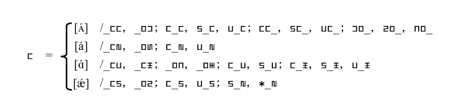
<figcaption>
图 6.3‑2生成表达式举例
</figcaption>
</figure>

在这个生成表达式或赋值表达式中，左斜杠(/)后为音元的分布条件，左斜杠(/)前为由音元在相应分布条件下所表示的片音；下划线(\_)表示音元的分布位置。其余乐音的生成表达式或赋值表达式类推，不作赘述。

在现代通用汉语中，根据音元分析法构建音元系统，就是确定音元系统的音元，就是确定由每个音元在不同的分布条件下所表示的片音，就是确定每个音元在特定的分布条件下取用特定的片音的取值规则，也就是说，就是确定在特定的分布条件下取用特定的片音并把它赋给特定的音元的赋值机制。然而，前述根据音元分析法构建的现代通用汉语的音元系统，大致只是列出了音元和由音元所表示的片音，并未一一具体说明根据音元分析法确定构成现代通用汉语的音元系统的每个音元的方法。根据音元分析法构建现代通用汉语的音元系统，不仅存在许多还不完善的地方和尚待完成的任务，而且存在许多尚待解决的问题和极难解决的问题。例如说明根据并立分布的片音是否构成对立、互补分布的片音递相置换是否呈现趋同态势确定表示片音的音元的方法，说明音元生成实际音值的制约机制或音元取用特定的片音的取值规则，等等，就是这类任务和问题。因此，根据音元分析法构建现代通用汉语的音元系统，有待赞成音元系统理论的学人再作仔细探讨。

# 结论

音元系统准确可靠。具体地说，音元系统不仅表音准确而且表义可靠。首先，音元系统表音准确。在音元系统中，片音是分布在特定环境中的特定音元所取的音值，是根据一组决定音段的最小音高和最小音质的差异的发音特征切出的最小音段，是单独能发的有声短音，是构成音节的基本音段，具有作为分析或识别对象的实发音段具备的语音特征。简单地说，片音是音元的音值。因此，按照片音序列发音，就是根据音元的音值拼音。按照片音序列发音，能够较逼真地拼出音节。因此，音元系统表音准确。其次，音元系统表义可靠。在音元系统中，片音不仅具有作为分析或识别对象的实发音段具备的语音特征，而且具有作为分析或识别对象的实发音段具备的区别特征。因此，由片音构成的音节不仅具有作为分析或识别对象的音节在发音和听音时具备的语音信息，而且具有作为分析或识别对象的音节在辨义时具备的语音信息，充分满足可靠性的要求，也就是说，充分满足能够区分不同音节的要求。因此，音元系统不仅表音准确而且表义可靠。

音元系统效率较高。在衡量音元系统和音位系统的效率高低时，根据音元均数计量音元系统的效率，根据音位均数计量音位系统的效率。音元均数指全类音节的平均音元个数。音位均数指全类音节的平均音位个数。全类音节不仅包含在语言中实际使用的音节而且包含在语言中不用只在教学时才用的音节。在语言中实际使用的音节指表示单音节语素或具有拟声功能的有义音节和虽在多音节语素中存在但在游离状态下并不表示单音节语素或并不具有拟声功能的无义音节。在现代通用汉语中，有些音节尽管既不表示任何单音节语素又不具有现实的拟声功能也不出现在复音节语素中，但在教学时却是经常实际使用的。例如 h󰍧i、h󰍦i、hěi、h󰍪i 这四个音节，只有 h󰍧i 被用来表示黑，而 h󰍦i、hěi、h󰍪i 这三个音节都既不表示任何单音节语素又不具有现实的拟声功能也不出现在复音节语素中，但在教学时却是经常四个音节一起教学。因此，在统计音元和音位时，构成这些既不表示任何单音节语素又不具有现实的拟声功能也不出现在复音节语素中的音节的音元和音位也要一起统计。

在音元系统中，计入虚首音，音元均数是 4 个。然而，在音位系统中，计入零声母，声母是一个音位，单质韵母是一个音位，前长韵母和后长韵母各是两个音位，三质韵母是三个音位，节调是一个音位，音位个数最大值是 5 个、最小值是 3 个，音位均数是 4.14 个。因此，音节的音元均数比音位均数少 0.14，音元系统的效率比音位系统的效率高 3.39 个百分点。

在音元系统中，不计入虚首音，音元个数最大值是 4 个、最小值是 3 个，音元均数是 3.92 个。然而，在音位系统中，不计入零声母，非零声母是一个音位，单质韵母是一个音位，前长韵母和后长韵母各是两个音位，三质韵母是三个音位，节调是一个音位，音位个数最大值是 5 个、最小值是 2 个，音位均数是 4.06 个。因此，音节的音元均数比音位均数少 0.14，音元系统的效率比音位系统的效率高 3.46 个百分点。

在音元系统中，不计入虚首音，把在音节中连续存在的两个或三个完全相同的乐音分析成一个音元，音元个数最大值是 4 个、最小值是 1 个，音元均数是 3.49 个。然而，在音位系统中，不计入零声母，音位个数最大值是 5 个、最小值是 2 个，音位均数是 4.06 个。因此，音节的音元均数比音位均数少 0.57，音元系统的效率比音位系统的效率高 14.03 个百分点。

在音元系统中，不计入虚首音，把在音节中连续存在的两个或三个完全相同的乐音分析成一个音元，音元个数最大值是 4 个、最小值是 1 个，音元均数是 3.49 个。然而，在音位系统中，根据《汉语拼音方案》计算音位均数，不计入零声母，用两个字符来记录的卷舌韵母 er、声母 zh、ch、sh 和后鼻韵尾 nɡ 全都各只算作一个音位，音位均数是 3.91 个。因此，音节的音元均数比音位均数少 0.42，音元系统的效率比音位系统的效率高 10.72 个百分点。

通过比较可知，音元系统的效率比音位系统的效率高。在不计入虚首音和不计入零声母时，尽管音元均数与音位均数相比相差不大、平均只减少了 0.14，音元系统的效率与音位系统的效率相比高得不多、只增高了 3.46 个百分点。然而，在把在音节中连续存在的两个或三个完全相同的乐音分析成一个音元时，音元均数与音位均数相比相差较大、平均减少了 0.57，音元系统的效率与音位系统的效率相比明显增高了很多、竟增高了 14.03 个百分点。在把在音节中连续存在的两个或三个完全相同的乐音分析成一个音元时，即使根据《汉语拼音方案》计算音位均数，音元均数与音位均数相比相差也还很大、平均还减少了 0.42，音元系统的效率与音位系统的效率相比也还很高、还增高了 10.72 个百分点。

音元系统易学易用。在音元系统中，计入虚首音，只用 52 个音元就能完全记录全类音节，尽管音元总数与音位总数相比相差较大，然而音元总数绝对数量不大。换句话说，在音元系统中，音元总数适度。因此，掌握音元费时、费力和费用不大。音元系统易学易用，与音位系统相比较，具体内容是：

一、掌握首音和掌握声母的难度相当。首音与声母一一对应、数量相同，都是除阻辅音，事实上就是声母。因此，对尚未掌握声母的个人来说，掌握首音，等同掌握声母或充当声母的除阻辅音。对已经掌握声母的个人来说，基本不用重新学习，只需简单地记住记录首音的音符和记录声母的音符的对应关系，就能掌握首音。

二、掌握干音比掌握带调韵母更容易。干音由乐音构成。乐音共有 30 个，根据音高不同分类分为高调、中调、低调三类，每类各有 10 个；根据音质不同分类分为 10 类，每类 3 个。因此，在掌握乐音时，只要掌握 10 个音质不同的高调乐音，就能逐类旁通、举一反三掌握 10 个中调和 10 个低调乐音，从而掌握全类 30 个乐音。音元系统的 10 类乐音的音质就是音位系统的 10 个单质韵母的音质。因此，掌握 10 个高调乐音，对尚未掌握单质韵母的个人来说，与掌握 10 个单质韵母相比，费时、费力和费用相当。因而，对已经掌握单质韵母的个人来说，只需根据迁移学习法稍加学习就能轻松掌握全类 30 个乐音。尽管掌握 30 个乐音的难度比掌握 10 个单质韵母的难度稍大，然而，由于由乐音构成的干音就是音位系统的干音亦即带调韵母，因此，掌握由乐音构成的干音的难度比掌握带调韵母更容易、至多和掌握带调韵母的难度相当。

三、掌握片音比掌握质素要容易得多。在音位系统中，构成韵母的质素事实上是从干音的音质中划分出来的最小音质，在脱离声调时不是发音器官实际发出的音段，只不过是构成韵母的一段音质，因此，在发音和听音上都很难掌握。在正常话语中，人体发音系统不能发出不具有任何音高只具有某种音质的浊音。相反，在音元系统中，音元是表示分布在特定环境中的特定片音的变元，片音是根据一组决定音段的最小音高和最小音质的差异的发音特征切出的最小音段，是发音器官实际发出的音段，而不是抽象的音质，因此，掌握片音的难度比掌握质素的难度更小。

四、音元系统的音节结构更容易掌握。在音元系统中，音节的结构是线性结构，音节在结构上还呈现出音元数量和结构形式完全相同的特点。具体地说，音节都是由四个音元按照一个形式相同的结构模型构成的音列。然而，在音位系统中，声母分成零声母、清声母和浊声母三类；韵母分成单质韵母、前长韵母、后长韵母和三质韵母四类；节调分为高调阴平、升调阳平、低调上声和降调去声四类；三类声母、四类韵母和四类节调构成 48 种结构类型不同的音节，这就是说，结构类型至少也有 48 种；计入零声母，音位个数最大值是 5 个、最小值是 3 个。因此，音元系统的音节结构比音位系统的音节结构更容易掌握。

五、音元系统的拼音方法更容易掌握。在音元系统中，音节的结构形式相同，音节的音元数量相等。这种同模的音节结构，在学习和拼音时，不必考虑音节内部的结构层次，不必学习和掌握与析音方法相悖的任何特殊的拼音方法，只需根据音元的音值拼音，就能较逼真地拼出音节的音值。然而，在音位系统中，构成韵母的质素，不是发音系统实际发出的音段，在根据节调质素分析拼音时总是存在节调发音不准和因质调关系的内容不全面和不具体而不能根据质调关系的内容拼音等拼音困难。因此，音元系统的拼音方法比音位系统的拼音方法更容易掌握。

六、音元系统的拼音规则更容易掌握。在音元系统中，一般地说，在拼音时，不必一一掌握由每个音元所表示的分布在各种可能的分布环境中的片音，只需掌握从由每个音元所表示的不同片音中选出的某个或某些在别的片音的分布环境中出现置换呈现趋同态势的条件片音，然后根据这个或这些条件片音发音就能在发音机制的制约下较逼真地拼出音节的音值。从这个意义上比较，音元拼音相对容易。相反，在音位系统中，如果拼音规则真正是简单的，就不会出现在根据节调质素分析拼音时总是存在节调发音不准和因质调关系的内容不全面和不具体而不能根据质调关系的内容拼音等拼音困难了。

七、音元拼音是面向发音听音的拼音。在现代通用汉语中，片音是根据一组决定音段的最小音高和最小音质的差异的发音特征切出的最小音段，具有确定的音值，不仅在游离状态和拼合状态下音值基本相同，而且在发音时是可以根据一组可以操作的发音特征发出的音段，能充分满足在游离状态下能发音、在拼合状态中能拼音的要求。然而，在音位系统中，构成韵母的质素，不是发音系统实际发出的音段，根本不能真正满足在游离状态下能发音、在拼合状态中能拼音的要求。因此，音元拼音是一种真正地面向发音系统和听音系统的拼音。

在现代通用汉语中，音元系统是一套实用的语音系统。音元分析不仅能确定音节的全部辨义特征，而且能根据语音规则生成音节的音值。因此，音元系统不仅仅是一套表音准确、表义可靠和效率更高的语音系统，而且也是一套真正面向发音系统和听音系统的语音系统，因而是一套实用的语音系统。

音元系统可以用作根据音位系统教学汉语语音的基础。在仍然采用《汉语拼音方案》记音的情况下，根据音元系统教学汉语语音，可克服根据音位系统教学汉语语音面临的困难。根据节调质素分析教学汉语语音面临的节调发音不准和因质调关系的内容不全面和不具体而不能根据质调关系的内容拼音等拼音困难，只要根据音元系统教学和拼音，就能解决。

音元系统，在语音分析、语音编码、语音识别和语音合成领域中具有一定的应用价值，具有推动汉语语音的理论研究和应用研究向前发展的作用。根据音元系统可以制作一套用音元作人机交互界面或接口的语音识别和语音合成系统。

音元系统是设计输入汉字的音元输入法的基础。在已有拼音输入法中，根据《汉语拼音方案》设计的输入法效率最高。根据这类输入法输入《通用规范汉字表》的 8105 个字，不区分声调，不动态调整字频，粗略计算，平均击键率超过 5 键；根据这类输入法输入 GB
18030-2022《信息技术中文编码字符集》的 8 万多个字，不区分声调，不动态调整字频，粗略计算，平均击键率超过 25 键。根据音元系统设计音元输入法，音元就是码元。因此，根据音元输入法输入《通用规范汉字表》的 8105 个字，不动态调整字频，因能自动区分声调，粗略计算，平均击键率不到 4 键；根据音元输入法输入 GB
18030-2022《信息技术中文编码字符集》的 8 万多个字，不动态调整字频，因能自动区分声调，粗略计算，平均击键率不到 9 键。因此，音元输入法是一种输入效率最高的输入汉字的音码输入法。

# 文献

BaoZhiming. (1990). On the Nature of Tone. Massachusetts: Ph. D.
dissertation, Massachusetts.

Chomsky& FantHalle. (1956). On Accent and Juncture in English. For Roman
Jakobson ed. by Morris Halle et al., Mount: The Huge, 65-80.

DuanmuSan. (1990). A Formal Study of Syllable, Tone, stress and Domain
in Chinese Language. Massachusetts: Ph. D. dissertation, Massachusetts
Institude of Technology, Massachusetts.

DuanmuSan. (1994). Against Contour Tone Units. Linguistic Inquiry,
25-4:555-608.

GoldsmithJhon. (1976). Autosegmental Phonology. Ph. D. dissertation,
Massachusetts Institude of Technology, Massachusetts.

GoldsmithJhon. (1990). Autosegmental and Metrical Phonology. Cambridge
MA & Oxford UK： Blackwell Publishers.

Halle&Chomsky. (1968). The Sound Pattern of English. New York: Harper
and Row.

Jakobson& HalleFant. (1952). Preliminaries to Speech Analysis.
Cambridge, MA: MIT Press.

KenstowiczMichael. (1994). Phonology in Generative Grammar. Cambridge MA
& Oxford UK: Blackwell Publishers.

McCarthy. (1979). Formal Problems in Semitic Phonology. massachusetts:
Massachusetts Institute of Technology.

ShenJiaxuan. (1993). Slips of the Tongue and the Syllable Structure in
Yau. Shun-chiu(ed) Essays on the Chinese Language Editions Langguage
Croises.

WangS. Y.William. (1967). The Phonological Features of Tone.
International Journal of American Linguistics.

WooNancy. (1969). Prosody and Phonology. Massachusetts: Ph. D.
dissertation, Massachusetts Institute of Technology, Massachusetts.

YipMoira. (1980). The Tonal Phonology of Chinese. Massachusetts: Ph. D.
dissertation, Massachusetts Institude of Technology, Massachusetts.

YipMoira. (1989). Contour Tones. Phonology, 6:149-174.

YipMoira. (2002). Tone. Cambridge: Cambridge University Press.

班弨. (1998). 中国语言文字学通史 (第一版 版本). 广东高等教育出版社.

包智明. (1997). 《生成音系学理论及其应用》 (第一版 版本).
中国社会科学出版社.

陈澧. (1984). 《切韵考》. 北京: 中国书店.

程祥徽. (1957 年 6 月). 《关于普通话音位》. 《中国语文》.

程雨民. (2003). 《汉语字基语法》 (1 版本). 复旦大学出版社.

杜天. (2020). 基于两种分析方法的元音鼻化实验研究——以洞口方言为例.
《湖南大学》.

傅懋勣. (1955 年 9 月). 《拼音汉字中的声调问题》. 《中国语文》.

高本汉. (1940). 《中国音韵学研究》(赵元任、罗常培、李方桂译).
商务印书馆.

国际语音学会. (2008). 《国际语音学会手册•国际音标使用指南》.
上海世纪出版公司.

国家语言文字工作委员会普通话培训测试中心. (2008).
《普通话水平测试实施纲要》. 商务印书馆.

何九盈. (1995). 《中国古代语言学史》. 广州: 广东教育出版社.

胡伟民. (1987 年 12 月). 《调位三论》. 《语文导报》.

胡裕树. (1987). 《现代汉语》(增订本) (第四版 版本). 上海教育出版社.

黄伯荣、廖序东等. (2002). 《现代汉语》 (第三版 版本). 高等教育出版社.

李新魁. (1983). 《汉语等韵学》 (第一版 版本). 北京: 中华书局.

林华. (1998 年 1 月). 《“调素论”及普通话连读变调》. 《中国语文》.

林茂灿. (1995 年 6 月). 《北京话声调分布区的知觉研究》. 《声学学报》.

林焘、耿振声. (2004). 《音韵学概要》 (第一版 版本). 北京: 商务印书馆.

林焘、王理嘉. (1992). 《语音学教程》 (第一版 版本). 北京:
北京大学出版社.

刘俐李. (2004). 《汉语声调论》 (第一版 版本). 南京: 南京师范大学出版社.

罗常培、王均. (2002). 《普通语音学纲要(修订版)》. 北京: 商务印书馆.

瞿霭堂. (1985 年 6 月). 《汉藏语言调值研究的价值和方法》. 民族语文.

沈家煊. (1992 年 4 月). 《口误类例》. 《中国语文》.

沈阳. (2005). 语言学常识十五讲 (第一版 版本). 北京大学出版社.

施向东. (2008). 《等韵学与音位学》，《中国音韵学》. 南京:
南京大学出版社.

石锋. (1991). 《北京话的声调格局》. 《语言研究(增刊)》.

石锋. (1991). 《北京话的语音格局》. 《语言研究(增刊)》.

石锋. (1994). 《关于声调分析的几个问题》. 出处 《语音丛稿》. 北京语言学院出版社.

石锋. (2002 年第一期月). 《北京话的元音格局》. 《南开语言学刊》.

石锋. (2008). 《语音格局》. 商务印书馆.

石锋、廖荣蓉. (1987 年 2 月). 《汉语普通话/r/声母音质的实验研究》.
《语言研究》.

史存直. (1957 年第九期月). 《从音位学看汉语的字调(声调)》. 《中国语文》.

宋欣桥. (1993). 《普通话语音训练教程》. 北京: 吉林人民出版社.

孙玉文. (2000). 《汉语变调构词研究》 (第一版 版本). 北京:
北京大学出版社.

谭世宝. (2009). 《息昙学与汉字音学新论》 (第一版 版本). 中华书局.

王洪君. (1999). 《汉语非线性音系学》 (第一版 版本). 北京大学出版社.

王理嘉. (1991). 《音系学基础》 (第一版 版本). 北京: 语文出版社.

王力. (1962). 汉语音韵. 北京: 中华书局.

王力. (1979). 《现代汉语语音分析中的几个问题》. 中国语文.

王力. (1981). 《中国语言学史》. 山西人民出版社.

王力. (1983). 《再论日母的音值，兼论普通话声母表》. 《中国语文》.

王力. (2003). 汉语音韵 (新一版 版本). 北京: 中华书局.

王力. (2015). 《汉语史稿》. 中华书局.

五臺. (1986). 关于“连续变调”的再认识. 《语言研究》(第 1 期), 1-6.

徐世荣. (1957 年第六期月). 《试论北京语音的“声调音位”》. 《中国语文》.

徐通锵. (2001). 《基础语言学教程》 (第一版 版本). 北京: 北京大学出版社.

薛凤生. (1986). 《北京音系解析》. 北京: 北京语言学院出版社.

张静. (1957 年 2 月). 《谈北京话的音位》. 《中国语文》.

赵诚. (1980). 《中国古代韵书》. 中华书局.

赵元任. (1928). 《现代吴语的研究》. 清华大学研究院丛书第四种.

赵元任. (1930). 《汉语的音调》. 商务印书馆.

赵元任. (1975).
《汉语词的概念及其结构和节奏(王洪君译)》，转载《中国现代语言学的开拓和发展——赵元任语言学论文集》.
清华大学出版社.

赵元任. (1979). 《汉语口语语法》. 商务印书馆.

中国大百科全书出版社. (1988). 《中国大百科全书•语言文字》.
中国大百科全书出版社.

周耀文. (1958 年 2 月). 《怎样处理声调在音位系统中的地位问题》.
《中国语文》.

朱晓农. (1996). 《上海音系》，夏剑钦摘译. 《国外语言学》.

朱晓农. (2010). 《语音学》 (第一版 版本). 北京: 商务印书馆.

朱晓农、夏秋. (1982). 《关于普通话“日”母的音值(一)、(二)》.
《中国语文通讯》.

# 注释

[^1]: 在现代通用汉语中，精确地说，只有单音节语素的语音才是有义音节。只有在根据语言的能产性把只出现在多音节语素中的无义音节都分析成潜在的有义音节的情况下，才能把只出现在多音节语素中的无义音节当成有义音节来分析。因此，在根据语言的能产性把只出现在多音节语素中的无义音节都分析成潜在的有义音节的情况下，在汉语中，音节都是有义音节(单音节语素的语音)，没有无义音节。
[^2]: 音节就是字音。古人用汉字来记录汉语，一个单音节词总是用一个汉字来记录。在古代汉语中，尽管单音节词数量占绝对优势、多音节词(至少含有两个音节的词)数量较少，然而多音节词使用频率不低。用汉字来记录汉语，多音节词也要记录。在汉语中，除重言(叠字)词例如姥姥、妈妈和崽崽外，多音节词分为单语素词和多语素词两类。单语素词是只含一个语素的词，又名单纯词。多语素词是至少含有两个语素的词，又名合成词。因此，多音节词分为多音节单语素词和多音节多语素词两类。多音节单语素词就是多音节单纯词。多音节多语素词就是多音节合成词。古人用汉字来记录汉语，在记录多音节多语素词时，用记录构成多语素词的每个语素的汉字来记录。古人用汉字来记录汉语，在记录多音节单语素词时，通常不考虑语义、只考虑语音，一个多音节单语素词包含几个音节就用几个汉字来记录。记录多音节单语素词包含的音节的汉字，当记录的音节和某个单音节语素同音时，一般都是借用记录某个单音节语素的汉字例如辗转的“转”；只有当记录的音节和任何一个单音节语素都不同音时，才会用一个独特的汉字例如尴尬的“尬”。在古代汉语中，单音节语素大致都是单音节词。因此，在古代汉语中，记录单音节词的汉字，都是记录单音节语素的汉字。记录单音节词的汉字，在周秦时，或称为文或称为字。文与字相对，文指独体字，字指合体字，都记录单音节词。许慎在《说文解字》中说：“仓颉之初作书，盖依类象形，故谓之文。其后形声相益，即谓之字。文者，物象之本也；字者，言孳乳而浸多也。”直到秦末，秦始皇在“琅琊山石刻”中才第一次把文和字统称为字。在用汉字来记录单音节词、记录构成多语素词的语素和记录多音节单语素词包含的音节后，音节和汉字的对应关系是：音节就是同音字集的字音。因此，在汉字系统形成后，音节就是字音。
[^3]: 在古代汉语中，“字”和“词”大致是同义词，字音大致就是词音，分析字音大致就是分析词音。在学术上，一种观点是，在现代通用汉语中，构成语句的基本单位(语法的基本单位)是“字”而不是“词”，两者不能等同 (徐通锵, 2001) (程雨民, 2003)。然而，在古代汉语中，指称概念或名称的“词”或“字”和指称构成语句的基本单位的“词”或“字”，指称对象大致是相同的。在古代汉语中，“词”和“辞”在“言词(即概念或名称)”这个义项上是同义词，只不过是在汉代以前，古人一般只说“辞”，不说“词”。荀子在《荀子·正名》中把“辞”定义为：“辞也者，兼异实之名，以论一意也。”这就是说，“辞”是指称一类事物的名称，表达一类事物的概念意义。汉代以后，古人才逐渐以“词”代“辞”。许慎在《说文解字》中把“词”定义为：“词，意内而言外也。”这就是说，“词”是概念的名称，具有内涵和外延。可见，在“言词”这个义项上，汉代以前的“辞”就是汉代以后的“词”。在古代汉语中，单音节词占绝对优势，多音节词(包括多音节单语素词(多音节单纯词)和多音节多语素词(多音节合成词))数量较少，表示构成语句的基本单位的词，大致都是单音节词。古人用汉字来记录汉语，一个单音节词总是用一个汉字来记录。因此，在古人语文中，指称单个汉字的“字”常被引申来指称单音节词的“词”。因此，在古代汉语中，由指称单个汉字的“字”引申来指称单音节词的“字”、表示概念或名称的“词”和指称单音节词(构成语句的基本单位)的“词”，指称对象大致是相同的。这就是说，在古代汉语中，“字”和“词”大致是同义词，字音大致就是词音，分析字音大致就是分析词音。

[^4]: 在把从音节中切除了韵以后剩下的音段整体分析成“声”从而把音节分析成由声和韵构成的音节后，“韵”是音节的除声以外的音段。然而，由于音节或由“韵”充当或由“声”和“韵”构成，因此，“韵”是音节的除声以外的音段，这个判断，严格地说，是不准确的。不过，根据反切解说，古人认为，每个音节都是由反切上下两字所记录的“声”和“韵”构成的，也就是说，古人把由“韵”充当的音节分析成零“声”音节。因此，根据每个音节都是由反切上下两字所记录的“声”和“韵”构成的这个论断可知，在音节中，“韵”是音节的除声以外的音段。
[^5]: 根据汉语在音译外语时的音译实践可知，汉语特有的音节结构观念，也就是说，汉语特有的划分汉语和其它语言的音节的方法是：⑴ 当在元音前有单辅音时，把单辅音分析成首音；当在元音前有复辅音时，把元音前的复辅音中的倒数第一个辅音分析成首音；当在首音和元音间还有半元音时，或把半元音分析成独立的音段，或把半元音分析成首音的特征，或把半元音分析成高元音。例如，在英语单词 spray 中 r 是音节 ray 的首音，在英语单词 sky 中 k 是音节 ky[kai]的首音。⑵ 在复辅音中，对首音前面的辅音，一个辅音分析成一个音节，有几个辅音就分析成(翻译成)几个音节。例如，在英语单词 spray 中，s 和 p 各算一个音节、ray 算一个音节、整个单词共有三个音节。又如，在英语单词 sky 中，s 算一个音节、ky[kai]算一个音节、整个单词共有两个音节。⑶ 把元音后面的不除阻的塞音(不完全发音的塞音)分析成尾音。例如，汉语方言的塞尾。⑷ 把和元音相拼的元音后面的鼻音分析成尾音。⑸ 把元音后面的除尾音(塞尾和鼻尾)外的单辅音或复辅音，一个辅音分析成一个音节，有几个辅音就分析成(翻译成)几个音节；把尾音(塞尾和鼻尾)后面的单辅音或复辅音，一个辅音分析成一个音节，有几个辅音就分析成(翻译成)几个音节。例如，在英语单词 max[mæks]中，ma 算一个音节、k 和 s 各算一个音节、整个单词共有三个音节。又如，在英语单词 desks[dɛsks]中，de 算一个音节，s、k 和 s 各算一个音节、整个单词共有四个音节。⑹ 当一个辅音例如鼻音既充当前一音节的尾音又充当后一音节的首音时，分属两个音节。例如，在英语单词 china 中，n 既充当前一音节的尾音又充当后一音节的首音、分属两个音节，音译“秦那”，整个单词共有两个音节。⑺ 在汉语音节中，当音节无介音时韵段是音节的除首音外的音段、当音节有介音时韵段是音节的除首介合音外的音段。当音节有尾音时韵段包含音节的尾音。在汉语中，韵段包含声调。
[^6]: 在唐宋韵书中，韵书编撰的体例是：⑴ 按照调类是否相同把韵段分成平、上、去、入四类。⑵ 按照韵目是否相同分别把平声韵、上声韵、去声韵和入声韵各分成若干个不同的韵，例如在《切韵》中把平声韵分为 54 韵、把上声韵分为 51 韵、把去声韵分为 56 韵、把入声韵分为 32 韵，总计把韵分为 193 韵；⑶ 根据字音是否相同把同韵的字分成若干个字音不同的小组(小韵)。⑷ 在每个小韵前标注一个圆圈，作为分组的标志。这个圆圈被称为纽。因此，纽，随后就被引申来指称小韵，例如把一个小韵称为一纽。纽，后又被引申来指称同韵不同小韵的字音的声段，也就是说，纽或指首音或指首介合音，例如把两个同属一韵分属不同小韵的字音称为两个不同纽或纽不同的字音。纽，最后甚至又被章炳麟等人引申来指称首音(节首辅音)。根据纽指称同韵不同小韵的字音的声段，也就是说，根据纽或指首音或指首介合音，纽就是声韵二分法的两类声段。因此，纽，在声韵二分法中被改名为声段。
[^7]: 在学术上，关于韵的解释，主要解释约有两种：一种解释是，韵就是隋朝陆法言在《切韵》中和北宋陈彭年等人在《广韵》中所指的韵，当音节无介音时韵是音节的除首音外的音段、当音节有介音时韵是音节的除首介合音外的音段。根据这个解释，当音节无介音时声指首音、当音节有介音时声指由首音和介音构成的首介合音。另种解释是，韵就是等韵，是音节的除首音外的音段、当音节有介音时韵还包含介音。根据这个解释，无论音节是哪类音节，声都不含介音。因此，历时地看，“声”和“韵”的指称对象都不是专一的。因此，在说明音节时，为使说明准确，不再用”声”来表示反切上字所记录的音段、不再用“韵”来表示反切下字所记录的音段。
[^8]:
    历时地看，“声”的指称对象不是专一的，汇集起来，大致存在 5 种情况：⑴ 指声段(声段特指由《切韵》系韵书的反切上字所记录的音段)；⑵ 指声调；⑶ 指声母；⑷ 指韵或韵母；⑸ 指音节。声，最初，即在声韵二分法(第一代析音法)或第一代反切中，被用来指称由反切上字所记录的声段，例如古人在说明反切时说被切音字和反切上字双声、就是说两者的声段相同。声，六朝齐梁以后又被用来指称声调，例如“四声”就是指四类声调。声，隋唐以后又被用来指称声母，例如神珙“五音声论”把声母分为五声：“东方喉声、西方舌声、南方齿声、北方唇声、中央牙声”。声，偶尔还被用来指称“韵”或“韵母”，例如宋代邵雍在《皇极经世书·声音唱和图》中就用声来指称“韵”
    (中国大百科全书出版社, 1988)或“韵母” (林焘、耿振声, 2004, 页 61)。声，甚至还被用来指称音节，例如宋代丁度等编撰的《礼部韵略》中说：“音韵展转相协谓之反，亦作翻；两字相摩以成声谓之切。”历时地看，韵的指称对象不是专一的，汇集起来，大致存在 4 种情况：⑴ 指韵段(韵段特指由《切韵》系韵书的反切下字所记录的音段)；⑵ 指等韵；⑶ 指韵母；⑷ 指韵基。韵，最初，即在声韵二分法(第一代析音法)或第一代反切中，被用来指称由反切下字所记录的韵段。韵段指由韵基和与其联结的调段构成的音段，它是《切韵》系韵书的分析对象，大致对应同调同部相押的韵文韵语的韵。在唐宋韵书中，声调是韵的组成部分，不同声调就算不同的韵，也就是说，“韵基(即韵腹加韵尾)相同，并且声调也相同的汉字属于同一个部类，每一个部类就叫做一个韵。”
    (林焘、耿振声, 2004)六朝以后，律诗兴起，古人做诗讲究同调相押，而不是后来的异调相押，韵文韵语的韵多数是指韵段。研究表明，先秦韵文多数也是同调相押的。随后，韵又被引申来指称等韵。这从早期等韵图中看就是先按开合再按等呼划分等级的等韵图的韵，从语音上而不是从音系上分析，就是清末陈澧在《切韵考》中说的“韵类”
    (谭世宝, 2009)，从韵母的角度来说，就是由韵母和与其联结的调段构成的音段，这在有些文献中被称为“带韵调母”。表示“等韵”或“韵类”的韵和《切韵》的韵或同调同部相押的韵文韵语的韵不尽相同。《切韵》的韵或同调同部相押的韵文韵语的韵，韵母的韵头不同也算同韵，而表示“等韵”或“韵类”的韵只有韵母和声调完全相同才算同韵。在析出节调后，韵又经常用作韵母的简称，因而意指韵母。在分出韵头后，韵又经常用作韵身或韵基的简称，因而意指韵身或韵基，这可以说就是不同调但同部相押的韵文韵语的韵。谭世宝在《悉昙学与汉字音学新论》
    (谭世宝, 2009)中，从词源的角度，详尽讨论了声韵的多义性及其在学术上的基本含义，就是明证。可见，历时地看，“声”和“韵”的指称对象都不是专一的，在这种情况下，如果把声段和韵段简称为“声”和“韵”，而又仍然把声母或声调简称为“声”，把等韵、韵母或韵基简称为“韵”，就不能说清这些不同的声、韵到底谁是谁，谁非谁了。综述说明，“声”，除用来指称由反切上字所记录的声段外，一般地说，又用来指称声母，也用来指称声调，还用来指称音节，甚至有时还用来指称韵段或韵母。韵，除用来指称由反切下字所记录的韵段外，一般地说，又用来指称等韵，也用来指称韵母，还用来指称韵身(韵母除韵头外的部分(近些年来称为韵基))。

[^9]:
    汉语是在系统使用变调法构词后变成声调语言的。汉语曾系统使用变调法构词。变调构词法是单音节词占数量优势并处主导地位的时期的一种构词法。“变调构词指利用声调的变化构造意义有联系的新词，它是音变构词的一种类型”
    (孙玉文, 2000)。研究表明，最晚从《诗经》时代起，汉语就已经采用变调法构词。尽管学界对于变调构词法产生之前汉语是否已是声调语言存在争议，然而，可以明确，自系统采用变调构成法后，汉语音节已经用声调对立来辨别意义，也就是说，汉语音节已经存在对立的声调，这标志着汉语已经是一种声调语言。

[^10]: 修订内容主要内容约有六项：⑴ 排定字母音类次序。1919 年 4 月 6 日，教育部公布《注音字母音类次序》，把 39 个字母按照发音部位排成以下次序：唇音：ㄅ、ㄆ、ㄇ、ㄈ；舌尖音：ㄉ、ㄊ、ㄋ、ㄌ；舌根音：ㄍ、ㄎ、ㄫ、ㄏ；舌面音：ㄐ、ㄑ、ㄬ、ㄒ；翘舌音：ㄓ、ㄔ、ㄕ、ㄖ；齿音：ㄗ、ㄘ、ㄙ；介母：ㄧ、ㄨ、ㄩ；单韵母：ㄚ、ㄛ、ㄝ；复韵母：ㄞ、ㄟ、ㄠ、ㄡ；带声韵母：ㄢ、ㄣ、ㄤ、ㄥ；特殊韵母：ㄦ。⑵ 增加韵母ㄜ。1920 年 5 月 22 日，教育部国语统一筹备会审音委员会认为，ㄛ母兼标[o]、[ɤ]两音不便，决议标“质”、“日”、“陌”、“职”、“缉”等韵母时，在字母ㄛ上方加小圆点写成ㄮ，以示区别。但 1922 年教育部公布《注音字母书法体式》时，把上面的圆点与下面的ㄛ相连，成为“ㄜ”，形成了另一个字母，使“注音字母”从 39 个字母增加为四十个。⑶ 改变标调方法。1922 年教育部公布《注音字母书法体式》，把原来在注音字母四角加点的标调方法改为在韵母上方添加上标短横线[ˉ](标阴平，可不用)、锐音符[ˊ](标阳平)、抑扬符[ˇ](标上声)、钝音符[ˋ](标去声)和上圆点[˙](标入声，后不用)。⑷ 改变拼音标准。1923 年，教育部国语统一筹备会第五次大会决议，成立“修订《国音字典》委员会”，改注音字母的拼音标准为北京话的普通读音，不再拼“读音统一会”议定的“国音”。新的拼音标准(后称新国音或京音)与“国音”(后称老国音)有以下 6 点不同：① ㄪ、ㄫ、ㄬ 3 个声母不用。② 取消尖音。ㄗ、ㄘ、ㄙ不再与ㄧ、ㄩ拼，凡与ㄧ、ㄩ拼的字音，都按北京语音用ㄐ、ㄑ、ㄒ拼成团音。③ ㄛ除作叹词外，分为ㄜ和ㄨㄜ两音，不过与ㄅ、ㄆ、ㄇ、ㄈ拼时，ㄨㄛ可省略ㄨ，作ㄅㄛ、ㄆㄛ、ㄇㄛ、ㄈㄛ。④ ㄧㄛ改拼为ㄩㄛ。ㄧㄛ只作叹词用。⑤ ㄝ拼音时只作ㄧㄝ和ㄩㄝ。⑥ 入声不用，原有的入声字分归平上去各声。从 1923 年起，注音字母就一律按北京音拼了。⑸ 改变方案名称。1930 年 4 月 21 日，中国国民党中央执行委员会第八十八次常务会议议决，改“注音字母”名称为“注音符号”，认为《注音方案》的功用“仅适注音，不合造字，称为字母，徒滋歧误，所以应改名为‘注音符号’，以副名实”。⑹ 添补“ㄭ”母。1932 年 1 月教育部“编订《国音常用字汇》特组会议”决定，为了说明上的方便，添补一个注音不用、单为说明音理用的“ㄭ”母，作为ㄓ、ㄔ、ㄕ、ㄖ、ㄗ、ㄘ、ㄙ 7 个声母单独成音节时的省略韵母(虚母)。
[^11]: 《注音符号方案》只有四个声调(高调阴平、升调阳平、低调上声和降调去声)。1923 年，教育部国语统一筹备会第五次大会决议，成立“修订《国音字典》委员会”，改注音字母的拼音标准为北京话的普通读音，不再拼“读音统一会”议定的“国音”。新的拼音标准(后称新国音或京音)与“国音”(后称老国音)有 6 点不同，与声调有关的内容就是：入声不用，原有的入声字分归平上去各声。从 1923 年起，注音字母就一律按北京音拼了。因此，《注音符号方案》只有四个声调。《注音符号方案》的标调方法和《汉语拼音方案》的标调方法相同。《注音方案》的标调方法，最初在字母四角上加点标调。具体方法为：阴平不标，阳平标在左下角，上声标在左上角，去声标在右上角，入声标在右下角。1922 年教育部公布《注音字母书法体式》，把原来在注音字母四角上加点的标调方法改为在韵母上方添加上标短横线[ˉ](标阴平，可不用)、锐音符[ˊ](标阳平)、抑扬符[ˇ](标上声)、钝音符[ˋ](标去声)和上圆点[˙](标入声，后不用)。
[^12]: 《注音方案》的“韵母”和《汉语拼音方案》的“韵母”不尽相同。在多数解说《注音方案》的文献中，通常把该案的韵母划分成“基本韵母”和“结合韵母”两类。基本韵母指由该案的“韵母”和“介母”充当的韵母。基本韵母包含“韵母”ㄚ、ㄛ(ㄜ)、ㄝ、ㄭ、ㄦ、ㄞ、ㄟ、ㄠ、ㄡ、ㄢ、ㄣ、ㄤ、ㄥ和由“介母”ㄧ、ㄨ和ㄩ充当的韵母；共有 16 个。结合韵母指由“介母”和“韵母”构成的韵母。结合韵母包含ㄧㄚ、ㄧㄛ、ㄧㄝ、ㄧㄠ、ㄧㄡ、ㄧㄢ、ㄧㄣ、ㄧㄤ、ㄧㄥ，ㄨㄚ、ㄨㄛ、ㄨㄞ、ㄨㄟ、ㄨㄢ、ㄨㄣ、ㄨㄤ、ㄨㄥ和ㄩㄝ、ㄩㄢ、ㄩㄣ、ㄩㄥ；共有 21 个。在《汉语拼音方案》中，韵母包含《注音方案》的“基本韵母”和“结合韵母”两类韵母。在解说《汉语拼音方案》的文献中，结合韵母的介母被分析成韵头；相对韵头，结合韵母的除介母外的部分(“韵母”)被分析成韵基。《注音方案》的“基本韵母”和“结合韵母”与《汉语拼音方案》的韵母的对应关系是：一、在《注音方案》中，介母既充当基本韵母也充当结合韵母的介母。介母有ㄧ、ㄨ和ㄩ 3 个。介母，除在结合韵母中充当介母外，还能单独充当韵母。由三个介母充当的基本韵母，也属《汉语拼音方案》的韵母。二、在《注音方案》中，“韵母”既充当基本韵母也充当结合韵母的韵基。结合韵母的韵基，在《注音方案》中叫做“韵母”，因此，在《注音方案》的结合韵母中，“韵母”事实上只是结合韵母的韵基。在《注音方案》中，“韵母”，除在结合韵母中充当韵基外，还能单独充当韵母。这类基本韵母也属《汉语拼音方案》的韵母。在《注音方案》中，“韵母”包含ㄭ，但不分ㄛ[o]和ㄜ[ɤ]，实有 13 个：ㄭ、ㄦ、ㄚ、ㄛ、ㄝ、ㄞ、ㄟ、ㄠ、ㄡ、ㄢ、ㄣ、ㄤ和ㄥ。尽管《注音方案》最初没有列出韵母ㄭ，但在说明中规定，含有这个韵母的音节，用声韵合母的齿背音声母ㄓ、ㄔ、ㄕ、ㄖ和翘舌音声母ㄗ、ㄘ、ㄙ记音。韵母ㄭ为 1932 年修订时增加，但规定仅限在说明音理时使用。既然这些音节含有这个韵母，它就是《注音方案》的一个韵母。因此，在《注音方案》中，“韵母”实有 13 个。在《注音方案》中，最初，韵母ㄜ[ɤ]包含在韵母ㄛ[o]中，不分韵母ㄛ[o]和ㄜ[ɤ]。韵母ㄜ[ɤ]是 1920 年修订增加的，在增加这个韵母后，“韵母”从 13 个增加为 14 个。因此，《注音符号方案》共有 14 个“韵母”。三、《注音方案》没有显式列出的结合韵母也属《汉语拼音方案》的韵母。结合韵母，在《注音符号方案》中，指由介母ㄧ、ㄨ或ㄩ和单韵母ㄚ、ㄛ、ㄝ，复韵母ㄞ、ㄟ、ㄠ、ㄡ，带声韵母ㄢ、ㄣ、ㄤ、ㄥ构成的韵母，属不言而喻的内容。可是，《注音符号方案》既未列出这类韵母，也未给出这类韵母的名称。这类韵母，在多数解说《注音方案》的文献中常被称为结合韵母。结合韵母也属《汉语拼音方案》的韵母。
[^13]:
    根据质素单复而不是根据元音单复把韵母划分成单纯音质韵母和复合音质韵母两类，是有事实根据的。王力在《汉语音韵》
    (王力, 汉语音韵, 2003)中就曾根据质素单复而不是根据元音单复把韵母划分成单纯音质韵母和复合音质韵母两类。根据名从主人这个惯例，王力在《汉语音韵》中把韵母分成单韵母和复韵母两类。单韵母主要是指单元音韵母。复韵母分为三类：有些是加韵头的，有些是加韵尾(含鼻音韵尾)的，有些是既加韵头又加韵尾(含鼻音韵尾)的。可见，王力的复韵母就是根据质素单复分出的复合音质韵母。然而，在许多文献中，例如在《语音学教程》
    (林焘、王理嘉, 1992, 页 110)中，“复韵母”仅指复元音韵母，因此，王力的“复韵母”和仅指复元音韵母的“复韵母”不同。因此，为和仅指复元音韵母的“复韵母”区别，不能把复合音质韵母改名为仅指复元音韵母的复韵母。王力根据质素单复分出的单质韵母，不仅包括单韵母，而且包括单鼻韵母。在现代通用汉语中，鼻音 m、n 和 ŋ 的音质也能充当韵母。这类由单质鼻音的音质充当的韵母，被简称为单鼻韵母。单鼻韵母是次要韵母，根据汉语语音学传统，在分析韵母时，通常不予考虑。然而，单鼻韵母也是韵母，在分析韵母时，如果把这类单鼻韵母完全排除在外，分类就不具有系统性和完备性。因此，在划分韵母类型时，只有包含这类韵母，至少只有提及这类韵母，分类才具有系统性。王力的单韵母实际包括单鼻韵母。他在《汉语音韵》中说，依照传统的说法，每个音节都有一个元音，元音的前后可以有辅音或半元音，但在脚注中注明：充当音节的辅音是所谓响音、带有元音的性质，并举例说鼻音 m、n 和 ŋ 等就是充当音节的辅音。他说的传统说法，大概指清末劳乃宣的说法。劳氏在《等韵一得》中分喉音韵部为三部。喉音三部是韵尾为 u 的韵部。喉音二部是韵尾为 i 的韵部。喉音一部是由 a、o、i、u、y 这五个单元音充当的韵部。劳氏说，此五者为生声之元，是为喉音一部。这说明劳氏是看出这五个音作为“元音”的重要性的。为了调和劳氏的说法和语音事实的冲突，他只好在脚注中补充说充当音节的辅音是所谓响音、带有元音的性质。尽管，王力只说充当音节的辅音是所谓响音、带有元音的性质，并未明说这类充当音节的辅音的音质也能充当韵母。然而，韵母是音节必有的，一个充当音节的音素，它的音质必然充当韵母。因此，鼻音 m、n 和 ŋ 的音质也能充当韵母。根据语音事实可知，充当音节的辅音，在发音时，和充当声母时发音不同，不除阻，而且具有声调，是另外一类辅音。尽管这的确是语音事实，然而根据音素分为辅音和元音两类，充当音节的辅音毕竟不是元音。况且，韵母是说明音节结构的术语，辅音和元音是说明发音分类的术语，辅音和元音的音质能否充当韵母是它们的功能，从鼻音的音质可以充当韵母这个语音事实上判断，汉语并无限定韵母只能由元音的音质不能由辅音的音质充当的机制。因此，为了避免传统说法和辅音的音质充当韵母这个语音事实的冲突，与其像王力那样迁就传统说法，不如抛弃传统说法，直接承认这些韵母由辅音的音质充当，同时说明由辅音的音质充当的韵母在发音时的特殊表现。从这个意义上分析，王力的单韵母实际包括单鼻韵母。然而，鉴于他未明说单韵母包括单鼻韵母，因此，不能把单质韵母改名为仅指单元音韵母的单韵母。

[^14]: 单韵母是由单元音的音质充当的韵母。强调指出，单韵母不能被定义为由单元音充当的韵母。在析出节调后，单韵母仅指单元音的音质，不含单元音的音调(简单地说就是声调)。因此，不能认为单韵母就是单元音。
[^15]: 二合复韵母包含前响复韵母和后响复韵母。开口呼鼻韵母指既属开口呼韵母又属鼻韵母的二质韵母，又被称为开口呼二质口鼻韵母。复韵母是由复元音的音质充当的韵母。强调指出，复韵母不能被定义为由复元音充当的韵母。鼻韵母是由口鼻合音的音质充当的韵母。强调指出，鼻韵母不能被定义为由口鼻合音充当的韵母。口鼻合音，就是元鼻合音，指由口腔元音和鼻音构成的音段，或由非高元音和鼻音构成，或由高元音和鼻音构成，或由高元音、非高元音和鼻音构成。
[^16]: 三合复韵母就是中响复韵母。非开口呼鼻韵母指既属非开口呼韵母又属鼻韵母的三质韵母，又被称为非开口呼三质鼻韵母。非开口呼鼻韵母也指由非开口呼三质鼻韵母在韵腹脱落后变成的非开口呼二质口鼻韵母(非开口呼三质鼻韵母在韵腹脱落后的实际音质)。由非开口呼三质鼻韵母在韵腹脱落后变成的非开口呼二质口鼻韵母，从韵母的系统性上分析，被分析成三质韵母。
[^17]: 前长韵母是前长二质韵母的简称。前长韵母，都是开口呼韵母，也被称为开口呼二质韵母。前长是指前长韵母的韵腹的时长和三质韵母的韵腹的时长相比较长、长出部分和三质韵母的韵头相对等长。换句话说，前长韵母的韵腹的时长和三质韵母的韵头的时长和韵腹的时长的总长相对等长。
[^18]: 后长韵母是后长二质韵母的简称。后长韵母，都是非开口呼韵母，也被称为非开口呼二质韵母。在通常情况下，后长韵母只包含后响复韵母。非开口呼三质鼻韵母在韵腹脱落后变成的非开口呼二质口鼻韵母，在不被从韵母的系统性上分析成三质韵母时，也被看成是后长韵母。后长是指后长韵母的韵腹的时长和三质韵母的韵腹的时长相比较长、长出部分和三质韵母的韵尾相对等长。换句话说，后长韵母的韵腹的时长和三质韵母的韵腹的时长和韵尾的时长的总长相对等长。
[^19]:
    对“音节结构具有层层二分的特性”这个看法，学界尚存争议。一般地说，引入生成音系学的理论和方法以前，在汉语语音学中，音节的结构是否具有层层二分的特性，在学术上，是不明确的。例如王力在《汉语音韵》中虽然认为韵腹和韵尾构成韵身(韵基)，但是没有明说韵腹和韵尾同处一层而韵头与韵腹和韵尾不同处一层
    (王力, 汉语音韵, 1962)。根据已知事实判断，这个看法是近些年来学界在生成音系学派的影响下才明确提出来的。然而，根据析音法的演进历程判断，若不考虑古人从音节中析出节调以前的情况，那么，古人从音节中析出节调，从析出节调以后的节质中析出声母和韵母，从韵母中分出韵头和韵身(韵基)，从韵身(韵基)中分出韵腹和韵尾，这个过程是层层二分的
    (施向东, 2008)。在结构上，音节内部各个部分的关系也具有层层二分的特性
    (徐通锵, 2001, 页 57) (施向东, 2008)。这表现在，韵腹是音节和韵母的核心，韵腹和韵尾的关系比较紧密，韵头和韵腹结合的紧密程度小于韵尾和韵腹结合的紧密程度
    (石锋, 《语音格局》, 2008)，韵头和韵身(韵基)结合的紧密程度在一定程度上大于韵头和声母结合的紧密程度，声调一般地说是整个音节的特征。然而，在汉语语音学中，一直存在一种与层层二分法不同的历史更久影响更大的方法。这表现在，由于韵头和韵身(韵基)结合的紧密程度只是在一定程度上大于韵头和声母结合的紧密程度，因此不论是在古人还是在今人中，都有把声母和韵头分在声段一边的。在《切韵》系韵书中，古人通常把首音和介音分析成声段、不作深入分析。曲韵学派通常采用这种方法，例如明末沈宠绥(？～ 1645)在《度曲须知》中、清代徐大椿在《乐府传声》中就采用这种方法。曲韵学派分析声段连声带呼(连声母带等呼)，认为在唱曲时“出字”，这在拼音时就是声段的发音，要“审五音、正四呼”。在今人中，也有不少是先沿用这种方法把声母和韵头一起分析成首音(Onset)、再把首音分析成声母和介质两段的。例如王洪君在《汉语非线性音系学》
    (王洪君, 1999)中就采用这种方法。再者，和前面的两种观点不同，在今人中，有人提出韵头既不属声段也不属韵母，声母、韵头、韵身(韵基)一字排开，三者同处一层的观点。例如沈家煊
    (沈家煊, 1992) (Shen, 1993)就把韵头独立出来，与声母和韵身(韵基)并列。朱晓农在《语音学》
    (朱晓农, 《语音学》, 2010, 页 304)中也采用这种方法。可见，韵头究竟是属声段还是属韵母，在学术上还是一个存在争议的问题。除这个问题外，古人一般认为，声调在形式上是整个音节的特征，用非线性音系学的术语来说明，就是节质与声调联结。然而，在今人中，一种不同的看法是，声调只与韵基联结
    [(王洪君1999)](#(王洪君1999)) (朱晓农, 《语音学》, 2010, 页 304)。

[^20]:
    在汉语中，前人认为，从音节中析出的“音素”和运用音素分析法从非声调语言的语音中分出的音素，内涵是相同的，都是从音质的角度划分出来的最小音段。例如，前人认为，从汉语音节 y󰌡[i⁵⁵]、y󰌠[i³⁵]、yǐ[i²¹⁴]、y󰌤[i⁵¹]、xi󰍧[ɕiᴇ⁵⁵]、xi󰍦[ɕiᴇ³⁵]、xiě[ɕiᴇ²¹¹]和 xi󰍪[ɕiᴇ⁵¹]中分出的 i[i]，和从英语语音 be[bi]、me[mi]、he[hi]中分出的 i[i]相比，内涵完全相同，都是从音质的角度划分出来的最小音段 i[i]。在非声调语言中，音素确实是从音质的角度划分出来的最小音段。非声调语言不用对立的声调来区别语义，因此，从非声调语言的语音中分出音素并确定表示音素的音位，完全不必区分音素及音位的音高特征的差异。然而，从非声调语言的语音中分出音素，只是没有区分音素的音高差异，根本没有分出音素的音高。在非声调语言中，当音素是清音时，清音的音调是零、不随语调变化而变化，因而，清音是具有确定的音质和确定的音高的音段。然而，在非声调语言中，当音素是浊音时，浊音的音高随语调变化而变化，因此，一个浊音表示一类音质相同、音高不定的音段。例如，根据三度标调法用字符来标调，依序用 H、L、LH 和 HL 来记录高调、低调、升调和降调，用特征矩阵来表示音段，元音[i]，音质相同、音高随语调变化而变化，既可能对应高调的[i]，又可能对应低调的[i]，也可能对应升调的[i]，还可能对应降调的[i]，依序记作：
    $\begin{matrix}
    \begin{bmatrix}
    ʜ \\
    i
    \end{bmatrix} & ， & \begin{bmatrix}
    ʟ \\
    i
    \end{bmatrix} & ， & \begin{bmatrix}
    ʟʜ \\
    i
    \end{bmatrix} & 和 & \begin{bmatrix}
    ʜʟ \\
    i
    \end{bmatrix}
    \end{matrix}$

    因此，元音[i]表示一类音质同为[i]、音高随语调变化而变化的音段。又如，浊辅音[n]，音质相同、音高随语调变化而变化，既可能对应高调的[n]，又可能对应低调的[n]，也可能对应升调的[n]，还可能对应降调的[n]，依序记作：
    $\begin{matrix}
    \begin{bmatrix}
    ʜ \\
    n
    \end{bmatrix} & ， & \begin{bmatrix}
    ʟ \\
    n
    \end{bmatrix} & ， & \begin{bmatrix}
    ʟʜ \\
    n
    \end{bmatrix} & 和 & \begin{bmatrix}
    ʜʟ \\
    n
    \end{bmatrix}
    \end{matrix}$
    因此，浊辅音[n]表示一类音质同为[n]、音高随语调变化而变化的音段。在汉语中，尽管前人认为“音素”是从音质的角度划分出来的最小音段，然而，在这种由节调与充当声母和构成韵母的“音素”构成的音节中，无论是先析出节调还是后析出节调，只要析出节调，在析出节调后，“音素”已不再是从音质的角度划分出来的最小音段、而仅仅是根据音质的差异从由声母和韵母构成的节质中析出的只表示音质不表示音调的最小音质，简单地说，“音素”只不过是音素的音质，因此，把音素的音质命名为“质素”，“音素”实际上是质素，音节实际上是由节调与构成节质的质素序列构成的音节。这种音节被简称为节调质素音节，因此，尽管在术语上沿用指称非声调语言的音素这个术语，尽管在音标上沿用记录非声调语言的音素的音标，然而，“音素”只不过是一类音质相同、音高不定的音段的音质。这就是说，尽管前人在套用音素分析法来分析汉语音节时，没有具体考虑汉语具有声调这个特征，直接借用非声调语言的音素这个术语来指称汉语语音的“音素”。然而，严格地说，声调语言的“音素”和非声调语言的音素的内涵是完全不同的。非声调语言的音素是具有确定的音质、未定的音调的音段。然而，在汉语中，在析音时，如果先析出节调再析出“音素”，那么析出的“音素”事实上是构成节质的质素。如果先析出音素再析出节调，那么声调被一段段地划分到各音中，分出的音素具有作为节调的一个调段的音调，因此，析出节调、就是析出每个音素具有的作为节调的一个调段的音调。在从音素中析出了它所具有的作为节调的一个调段的音调后，“音素”已不再是音素而是音素的音质或构成节质的质素。因此，在汉语中，“音素”只不过是音素的音质或构成节质的质素，换句话说，“音素”只不过是在从音素中析出了它所具有的作为节调的一个调段的音调后剩下的音质——质素。例如，在析出节调后，从音节 󰉜[ᴀ⁵⁵](阿)中分出的 ɑ[ᴀ]、从音节 y󰍦[iᴇ³⁵](爷)中分出的 y[i]和 e[ᴇ]、从音节 w󰉞i[wæɪ²¹⁴](歪)中分出的 w[w]、ɑ[æ]和 i[ɪ]、从音节 mi󰉟n[miæn⁵¹](面)中分出的 m[m]、i[i]、ɑ[æ]和 n[n]，都不是音素，都只是音素的音质或构成节质的质素。因此，前人借用“音素”来指称音素的音质是名不副实的；今人沿用“音素”来指称音素的音质是词不达意的，不能再把音素的音质称为“音素”。只有根据“音素”只不过是音素的音质用“质素”来指称音素的音质，才能避开名不副实的矛盾，才能名符其实地反映这类过去长期被称呼成“音素”的对象是音素的音质这一事实。因此，在把“音素”改名为质素后，“音素”实际上是质素。综合说明，在现代通用汉语中，“音素”只不过是音素的音质或构成节质的质素。

[^21]: 质素分析法特指分析声调语言的语音的音质的方法。声调语言分成单音节声调语言和多音节声调语言两类。汉语是单音节声调语言。相对非声调语言，汉语具有声调；相对多音节声调语言，在汉语中，把音节的声调简称为节调，节调是声调的形式。因此，分析汉语音节，不能完全不考虑节调对立、直接根据音素分析法把音节分析成一列不含节调的音素。如果完全不考虑节调对立，直接根据音素分析法把音节分析成一列不含节调的音素，就不能确定声调。这在学术上是有历史教训的。元代的《八思巴字》和民国的《拉丁化新文字》碰到的问题就是历史教训。两者的共同特征是在拼写汉语时不标声调，因此，如果原文没有汉字对照或没有其它参考材料，往往难以确定拼写内容对应的汉字(同音异义词)究竟是哪个汉字，因而，两者由于不能区分声调，不符合汉语语音实际，事实证明是两个失败的方案。相反，那些能够区分声调的方案，只能说因完全不能区分同音同调不同字义的汉字而还很不完善，不能说完全是失败的。事实上，如果汉语没有历史悠久、形体优美、完全成熟的文字系统(方块汉字)，那么，在一个能够区分节调的纯粹拼音的方案的基础上，找到一种可行的区分同音异义汉字的方法，就会得到一个成功的拼写汉语的方案。藏文、缅文、泰文及现行的越文就是成功的拼音文字。一个拼音方案的成功与否，涉及许多因素，但是如果一个拼音方案的语音分析本身是失败的，那么这个方案注定是失败的。因此，分析汉语音节，形成一种和音素分析法不同的方法。这种方法，分析汉语音节，内容就是析出节调和节质并把节质分析成质素序列，把音节分析成由节调与构成节质的质素序列构成的音节。《西字奇迹》、《西儒耳目资》、《中国音韵学研究》、《国语罗马字拼音法式》和《汉语拼音方案》都是根据这种析音法析音的方案。
[^22]: 在汉语中，根据“音素”实际上是质素(“音素”的音质)和“音素”分为“辅音和元音”两类，“辅音”事实上是辅音的音质；“元音”事实上是元音的音质。根据“音素”分为“清音“和”浊音”两类，“清音”就是清音的音质；“浊音”事实上是浊音的音质。尽管，当辅音为浊音时，浊辅音事实上是浊辅音的音质，然而，对充当声母的浊辅音，这类浊辅音的音高不构成对立，在析出节调时，不必分出这类浊辅音的音高，也就是说，不必考虑这类浊辅音的基频差异，把这类辅音分析成浊辅音，可以认为这类浊辅音的音质就是浊辅音，不必对两者作严格区分。可是，在汉语中，在析出节调后，对构成韵母的浊音类的“音素”(包含充当韵母或构成韵母的“元音”和“辅音”)，这类“浊音”只有音质没有音高，因此，这类“浊音”只是这类浊音的音质。
[^23]: 节调质素分析法是由汉语的音义关系的基本特征决定的。在汉语中，音节分为有义音节和无义音节两类。有义音节就是单音节语素的语音，包含那些只被用作拟声语素的音节。无义音节是指虽则在多音节语素中存在但却并不表示任何单音节语素的语音的音节。在汉语中，既不出现在多音节语素中也不是任何单音节语素的语音的音节是不存在的。因此，准确地说，无义音节是指那些从多音节语素中分离出来孤立地看不是任何一个单音节语素的语音的有音无义的音节。例如，在“尴尬”这个双音节单语素词(双音节单纯词)中，“尬”的字音，在被用来表示尬笑、尬聊、尬黑、尬舞、尬演、尬住和不尴不尬等等词语的“尬”前，就是一个无义音节。在汉语中，只有数量极少甚至可以忽略不计的个别音节是无义音节。无义音节的归宿不外三种情况：一、因被当成单音节语素使用而变成有义音节。例如，“尬”的字音，原本只是一个有音无义的音节，但在近些年来被用来表示尬笑、尬聊、尬黑、尬舞、尬演、尬住和不尴不尬等等词语的“尬”后，却变成了一个具有“尴尬”这个义项的有义音节。二、因一向不被当成单音节语素使用导致使用频率越来越低而渐渐消亡。就算是有义音节例如“挼”的字音也存在这种情况，何况是那些从来不被用来表示任何语义的无义音节。三、因被当成拟声语素使用具有模拟某个声音的义项而变成有义音节。由于语言具有能产性，因此，在汉语中，一个无义音节即使从未被当成拟声语素用过，也不能确定它将来一定不会被当成拟声语素来用。因此，每个无义音节尽管不是现实的有义音节但却都是潜在的有义音节。因而，在现代通用汉语中，由于语言具有能产性，音节不是现实的有义音节就是潜在的有义音节、没有无义音节。这就是说，由于语言具有能产性，音节不是现实的单音节语素的语音就是潜在的单音节语素的语音。因此，分析音节就是分析现实的和潜在的有义音节，就是分析表现为音节的现实的和潜在的最小表义单位——单音节语素的语音，简单地说，就是分析单音节语素的语音。声调语言分成单音节声调语言和多音节声调语言两类。汉语是单音节声调语言。在多音节声调语言中，声调表现为音节数量不定的语素、词语等语言单位的音调。然而，在汉语中，声调总是表现为音节数量唯一的单音节语素或单音节词的音调，简单地说，声调总是表现为音节的声调，具体地说，排除因受前后音节的声调等外部影响而发生的变调情况，每个音节都有且仅有一个声调。在现代通用汉语中，音节的音调差异和音质差异都构成对立。因此，在已有析音法中，一种方法是先析出节调和节质再析出构成节质的质素从而把音节分析成由节调与构成节质的质素序列构成的音节。这种析音法就是节调质素分析法。
[^24]: 第一代反切是古人在第二代析音形成以前根据第一代析音法制作的反切。相对第一代反切，根据第二、第三和第四代析音法制作的反切依序就是第二代、第三代和第四代反切。第二代析音法产生以后，古人制作反切，通常不再根据第一代析音法制作反切。尽管，不能完全排除，第二代析音法产生以后，个别古人制作反切还在根据第一代析音法制作反切。然而，即使古人根据第二、第三或第四代析音法制作反切，也要先把第二、第三或第四代析音法还原成一种两段二分法，才能制作反切。因此，从这个意义上理解，第二代、第三代和第四代反切也是根据两段二分法制作的反切。
[^25]: 第一代析音法的产生再晚也是和反切的发明同时的。第一代析音法是声韵二分法。声韵二分法的产生可能比反切的发明还早。尽管目前没有确凿史实证明声韵二分法的产生早于反切的发明，然而声韵二分法的产生最晚不会晚于反切的发明，即便不是更早，也是同时产生的。根据考证，古人在第二代析音法形成以前制作的反切都是根据声韵二分法制作的反切、都不是根据其它析音法制作的反切。因此，声韵二分法的产生再晚也是和反切的发明同时的。反切的发明是声韵二分法存在的标志。在没有确凿史实证明声韵二分法的产生早于反切的发明的情况下，用反切的发明时间作第一代析音法的产生标志是合理的。因此，反切的发明是第一代析音法产生的标志。
[^26]: 反切上字与被注音字双声、反切下字与被注音字叠韵，这就是体现在反切中的双声叠韵关系。清末陈澧(1810 ～ 1882)在《切韵考·序》中说：“切语之法，以二字为一字之音；上字与所切之字双声，下字与所切之字叠韵；上字定其清浊，下字定其平上去入(平上去入四声各有一清一浊。详见通论)。上字定清浊而不论平上去入，如，东、德红切，同、徒红切，东、德皆清，同、徒皆浊也，然同、徒皆平可也，东平、德入亦可也。下字定平上去入而不论清浊，如，东、德红切，同、徒红切，中、陟弓切，虫、直弓切，东红、同红、中弓、虫弓皆平也，然同红皆浊、中弓皆清可也；东清红浊、虫浊弓清亦可也。东、同、中、虫四字在一东韵之首，此四字切语已尽备。切语之法，其体例精约如此，盖陆氏之旧也。今考切语之法，皆由此而明之。”
[^27]: 刘勰(约公元 465 ～ 520)在《文心雕龙·声律》中说：“双声隔字而每舛，叠韵杂句而必暌。”南齐永明年间沈约等人倡“声病”说，这种学说在唐朝时演变成为“四声八病”论。八病为：平头、上尾、蜂腰、鹤膝、大韵、小韵、旁纽、正纽，指作诗在声律上应当避忌的八种弊病。平头、上尾、蜂腰、鹤膝主要涉及声调方面的问题，这里不作详述。大韵指在五言律诗中如以“新”为韵，在韵之前九字中不能出现“人”、“津”、“邻”、“身”、“陈”等与“新”同韵的字，否则就是犯“大韵”。小韵指在韵之前九字中不能出现彼此同韵(叠韵)的字，否则就是犯“小韵”。旁纽一名大纽，即如在五字句中已有“月”字，就不能出现“鱼”、“元”、“阮”、“愿”等与“月”字同声纽的字(即不能出现与“月”双声的字)，否则就是犯“旁纽”。正纽一名小纽，即以“壬”、“衽”、“任”、“入”为一纽(即以平、上、去、入四声为一纽)，如在五字句中已有“壬”字，就不能出现“衽”、“任”、“入”等字，否则就是犯“正纽”。从总体上说，旁纽就是在诗句中不该出现双声的地方出现了双声；大韵、小韵和正纽就是在诗句中不该出现叠韵的地方出现了叠韵。这说明古人已经从理论上认识了什么是双声叠韵。根据《南史·谢庄传》记载：“王玄谟问谢庄：‘何谓双声叠韵？’答曰：‘玄护为双声，璈碻为叠韵’。”王玄谟和桓护曾率兵北伐，在璈碻打过败仗，由于当时“玄”、“护”双声，“璈”、“碻”叠韵，因此，谢庄用解释什么叫双声叠韵来跟他们开玩笑。这说明古人在语言中已经掌握了什么是双声叠韵。用双声词语说话，称为双声语，又称为体语。南北朝时代盛行双声语。《北齐书·徐之才传》说：“(徐之才)尤好剧谈体语。”这是最早见于史书记载的体语。只不过，徐之才说的体语，与一般的双声语略有不同，比如他说一个姓卢的人是：“生男则为虏，养马则为驴。”就是根据卢、虏、驴三个字同声，都是来声，用虏、驴来暗示那个人姓卢。北魏杨衒之《洛阳伽蓝记》记载：“陇西李元谦乐双声语。尝经(郭)文远宅……曰：‘是谁第宅过佳？’值婢春风出曰：‘郭冠军家’。元谦曰：‘凡婢双声。’春风曰：‘儜奴慢骂。’”这里的对话都是用双声语。“是谁”两字禅声，“第宅”两字定(澄)声，“过佳”两字见声，这句话是三组双声字。“郭冠军家”四个字都是见声。“凡婢”两字並(奉)声，“双声”两字审声，这句话是两组双声字。“儜奴”两字泥声，“慢骂”两字明声，这句话也是两组双声字。这一类的双声语是真正的双声语。南北朝时代盛行双声语，这说明古人在语言中已经广泛应用双声叠韵。
[^28]: 反切，在成为通用术语前，曾被称为“反语”、“切韵”或“反音”，偶尔也被称为“翻切”；在成为通用术语后，也还被人称为“切语”或“切音”。古人在《广韵》成书前不用“反切”这个术语，而用“反语”、“切韵”或“反音”。简略地说，古人在南北朝时称“反切”为“反语”，在隋末唐初后称“反切”为“切韵”，在唐朝时一度称“反切”为“反音”。即使在《广韵》成书后的北宋时期，古人仍然不用“反切”这个术语，通用“切韵”。不过存在两个例外情况。一是，北宋丁度(990 ～ 1053)在 1037 年成书的《礼部韵略》和 1039 年成书的《集韵·韵例》中首先创用“翻切”这个术语，用来取代原来的“切韵”；二是，北宋沈括在 1086 ～ 1093 年成书的《梦溪笔谈》中率先用“反切”这个术语来解说“切韵”，但仅用一次，属于偶用。“反切”这个术语，一直到南宋时期和元朝初期才逐渐盛行起来。在南宋中期编成的《切韵指掌图》中，编者用“反切”来解说“切韵”，可以说是“反切”行将取代“切韵”成为流行术语的标志。在宋元后，即使“反切”已经取代“切韵”成为流行术语，也还有人把“反切”称为“切语”或“切音”。例如，清末陈澧(1810 ～ 1882)在《切韵考》中就把“反切”称为“切语”。
[^29]: 这个反切引自汉末曹魏孙炎(？～ 260)编撰的《〈尔雅〉音义》。
[^30]: 这个反切引自北宋陈彭年(961 ～ 1017)等人编订的《广韵》。
[^31]: 反切标志，在北宋陈彭年(961 ～ 1017)等人奉诏编订《广韵》前几乎全用“反”字；在《广韵》编成后，通用“切”字。在北宋时，陈彭年(961 ～ 1017)等人奉诏编订《广韵》，在反切中不再沿用“反”字，率先改用“切”字来作反切标志。在《广韵》编成后，古人不仅在注音中尽量避免沿用“反”字来作反切标志，而且还对前人著作的注音，例如《唐韵》等韵书的注音，大作改“反”为“切”的手术。结果，“切”字，代替“反”字，成为通用的反切标志。
[^32]: 在一个作为条目的汉字有几个读音就对应标注几个反切的字典中，存在个别只有一个读音的汉字的读音、个别具有几个读音的汉字的某个或某些读音不用反切来注音的例外情况。导致这类例外情况产生的原因，主要原因约有两个：⑴ 个别只有一个读音的汉字是生僻字、个别具有几个读音的汉字的某个或某些读音是生僻读音，字典编者认为，不必制作反切；⑵ 个别只有一个读音的汉字的读音、个别具有几个读音的汉字的某个或某些读音，没有合适的反切用字，无法制作反切；等等。然而，不计这类例外情况，可以认为，在这类字典中，一般地说，一个作为条目的汉字有几个读音就对应标注几个反切。
[^33]: 在一个音节只用一个反切来记音的韵书中，存在个别音节不用反切来记音的例外情况。导致这类例外情况产生的原因，主要原因约有两个：⑴ 个别音节对应的同音字集的字数极少(只有一两个字)且大约都是生僻字，韵书作者认为，不必制作反切；⑵ 个别音节没有合适的反切用字，无法制作反切；等等。然而，不计这类例外情况，可以认为，在这类韵书中，一个音节只用一个反切来记音。
[^34]: 音书，包括韵书和除韵书外的音书。韵书特指根据韵类划分音节类别的音书。除韵书外的音书，是指从语音上系统分析说明汉字读音的图书，包括根据音序编排的字典、不根据音序编排但大致根据某一韵书的反切注音或附有作为注音根据的韵图或注音方案的字典等。
[^35]: 在一个音节只用一个反切来记音的韵书出现以前，古人在注书或字书(字典)中注音，即便是在同一作者编著的注书中或在同一字典中，在给具有相同读音的不同汉字注音时，也不大可能做到全部同音字的读音共用一个形式完全相同的反切，也就是说，也不大可能做到构成各字的反切的两个用作注音符号的汉字分别相同。根据已知事实判断，在一个音节只用一个反切来记音的韵书出现以前，古人在注书或字书(字典)中注音，一个同音字集的不同汉字的读音，在同一作者编著的注书中或在同一字典中，往往存在不止一个反切上字或不止一个反切下字的同音反切。
[^36]: 反切可能是自发形成的。声韵二分法的产生可能比反切的发明还早。汉语曾系统使用变音法构词。变音构词法是单音节词占数量优势并处主导地位的时期的主要构词法。古人开始使用变音法构词的时间比反切的发明时间早得多。在根据变音法构词时，伴随一个比较新词和原词的语音差异的过程。在这个过程中，在不存在任何析音方法的情况下，造词人只知新词和原词的语音相比局部起了变化、有点不同，确实不知究竟是音节的哪个部分或哪种成分起了变化、有何不同。然而，在汉语中，在变音构词法由兴到衰的过程中，同时存在一种既是天然生成的又是十分简单的析音方法，这就是古人在说韵语写韵文例如创作诗词歌赋时经常用到的比较声韵差异的双声叠韵法，这就是声韵二分法。在这种情况下，古人在根据变音法构词时，就会用到声韵二分法，就会根据声韵二分法比较新词和原词的声韵差异。在这种情况下，变音构词法不是变声构词法就是变韵构词法，根据变音法构词就是根据声韵二分法变声或变韵构词。在这种情况下，造词人不仅知道新词和原词的语音相比局部起了变化、有点不同，而且明确知道是声或韵起了变化、是声或韵不同。因此，声韵二分法早在古人根据变音法构词时就有了、甚至是和诗歌一起产生的。诗歌和变音构词法都比反切产生得早。因此，声韵二分法比反切产生得早。然而，目前既没有足够的史实证明古人在反切产生前说韵语写韵文时确实用过双声叠韵法(声韵二分法)来比较声韵差异，也没有足够的史实证明古人在根据变音法构词时确实用过双声叠韵法(声韵二分法)来比较声韵差异。因此，声韵二分法比反切产生得早，只能存疑，不是定论。然而，在声韵二分法不是可能而是确实比反切产生得早的情况下，在汉字产生和形成后，在构造新词并给新词造字时，在给有词无字的旧词造字时，就会有人个别地、部分地、逐渐地，根据构词时的析音活动，也就是说，根据声韵二分法，用两个汉字把造出的新词或新字的音节记录下来，用来临时记音。清代刘熙载(1813 ～ 1881)《说文双声·序》说：“切音……起于始制文字者也。许氏《说文》于字下系之以声，其有所受之矣。夫六书中较难知者，莫如谐声，叠韵、双声，皆谐声也。许氏论形声，及于江河二字，方许氏时，未有叠韵、双声之名，然河可为叠韵，江工为双声，是其实也。”虽然形声字不是反切，但是形声字不都是和它的谐声偏旁(声旁)完全同音的同音字，形声字和它的谐声偏旁多数是同声或同韵但不同音的近音字，因此，从构词的意义上分析，构造这些形声字对应的新词的构词活动，必然包含声韵二分法，因而，在给这些新词造字时，必然会引发造字人重复构词人在构词时根据两段二分法析音和根据两段二分法拼音的活动。在语言中，新词是一个一个地逐渐产生的，因此，构词人在构造新词时根据两段二分法析音和根据两段二分法拼音的活动，也是一个一个地由个别构词人进行的。在汉字中，新字也是一个一个地逐渐造出的，因此，在构造新字时引发的造字人重复构词人在构词时根据两段二分法析音和根据两段二分法拼音的活动，也是一个一个地由个别造字人进行的。因此，那种认为反切是汉语自古以来就有的合音的发展的说法，即反切自发形成说，可以说也言之成理。因为只有在构词时，构词人才会自觉地使用合音(声韵拼音)，这个合音只有因为它是词音(字音)才能传承下来，并被造字人或注音人(例如服虔、应劭和孙炎)用两个汉字记录下来。古人一般不会为合音而合音，不是词音(字音)的合音在语言中是不会长期存在的。宋代沈括、郑樵，明清之际顾炎武都持有这种看法。顾炎武《音学五书·音论》说：“按反切之语，自汉以上即已有之。宋沈括谓古语已有二声合为一字者，如‘不可’为‘叵’，‘何不’谓‘盍’……郑樵谓慢声为二，急声为一，慢声为‘者焉’，急声为‘旃’，慢声为‘者与’，急声为‘诸’，……，是也。愚尝考之经传，盖不止此。如《诗·墙有茨》传，‘茨，蒺藜也’，蒺藜正切茨字。八月断壶，今人谓之胡卢。《北史·后妃传》作瓠芦。瓠芦正切壶字。……。以此推之，反语不始于汉末矣。”合音字虽然不是反切，但是合音这种语音活动却是一种根据声韵二分法拼音的拼音法的特例，如果不是把合音理解为无意识的偶然的急声活动，而是理解为有意识的必然的构词活动包含的语音活动，合音就是一种根据声韵二分法拼音的拼音法，而反切无论怎么解说就是声韵二分法的记音方法、根据反切拼音无论怎么解说就是根据两段二分法拼音。因此，反切是自发形成的不是一点可能性都没有。
[^37]: 声韵二分法的产生可能比反切的发明还早。汉语曾系统使用变音法构词。变音构词法是单音节词占数量优势并处主导地位的时期的主要构词法。古人开始使用变音法构词的时间比反切的发明时间早得多。在根据变音法构词时，伴随一个比较新词和原词的语音差异的过程。在这个过程中，在不存在任何析音方法的情况下，造词人只知新词和原词的语音相比局部起了变化、有点不同，确实不知究竟是音节的哪个部分或哪种成分起了变化、有何不同。然而，在汉语中，在变音构词法由兴到衰的过程中，同时存在一种既是天然生成的又是十分简单的析音方法，这就是古人在说韵语写韵文例如创作诗词歌赋时经常用到的比较声韵差异的双声叠韵法，这就是声韵二分法。在这种情况下，古人在根据变音法构词时，就会用到声韵二分法，就会根据声韵二分法比较新词和原词的声韵差异。在这种情况下，变音构词法不是变声构词法就是变韵构词法，根据变音法构词就是根据声韵二分法变声或变韵构词。在这种情况下，造词人不仅知道新词和原词的语音相比局部起了变化、有点不同，而且明确知道是声或韵起了变化、是声或韵不同。因此，声韵二分法早在古人根据变音法构词时就有了、甚至是和诗歌一起产生的。诗歌和变音构词法都比反切产生得早。因此，声韵二分法比反切产生得早。然而，目前既没有足够的史实证明古人在反切产生前说韵语写韵文时确实用过双声叠韵法(声韵二分法)来比较声韵差异，也没有足够的史实证明古人在根据变音法构词时确实用过双声叠韵法(声韵二分法)来比较声韵差异。因此，声韵二分法比反切产生得早，只能存疑，不是定论。
[^38]:
    孙炎卒年参考吴承仕《经籍旧音序录·经籍旧音辨证》第 31 页。王力在《中国语言学史》
    (王力, 《中国语言学史》, 1981)中推断：“孙炎虽然是三国时人，恐怕也是汉末出生的人。”

[^39]:
    汉语是在系统使用变调法构词后变成声调语言的。汉语曾系统使用变调法构词。变调构词法是单音节词占数量优势并处主导地位的时期的一种构词法。“变调构词指利用声调的变化构造意义有联系的新词，它是音变构词的一种类型”
    (孙玉文, 2000)。研究表明，最晚从《诗经》时代起，汉语就已经采用变调法构词。尽管学界对于变调构词法产生之前汉语是否已是声调语言存在争议，然而，可以明确，自系统采用变调构成法后，汉语音节已经用声调对立来辨别意义，也就是说，汉语音节已经存在对立的声调，这标志着汉语已经是一种声调语言。

[^40]: 古人从理论上析出节调的时间，比古人从直觉上辨认节调的时间要晚得多。汉语是在系统使用变调法构词后变成声调语言的。汉语曾系统使用变调法构词。研究表明，最晚从《诗经》时代起，汉语就已经采用变调法构词。在根据变调法构词时，古人必定能够从直觉上辨认节调，因此，古人从直觉上辨认节调的时间，和古人采用变调法构词的历史同样悠久。然而，在古人析出节调以前，也就是说，在汉末魏晋刘宋时，古人不仅还未发现舒声韵音节根据声调对立分为平声、上声和去声三类；而且还未把促声韵音节分析成声调与舒声韵音节的三类声调(平声、上声和去声)都对立的入声。这就是说，如不考虑促声韵音节与舒声韵音节到底是声调不同还是韵母不同这个问题，在这个时段上，古人虽然知道音质相同而声调不同的音节各不相同，且能表达不同的意义，但在析音时却不知它们只是声调不同。这就是说，在古人析出节调以前，古人虽然从直觉上能够辨认节调，但却不能从理论上析出节调。只有从理论上析出节调，才能根据调类划分音节类别。根据调类划分音节类别，一般是先根据调类划分韵段类别再根据韵类划分音节类别。如果不从理论上析出节调，那就不能根据调类划分音节类别。因此，在南朝齐梁以前，古人还不能根据调类划分音节类别。只有先根据调类划分音节类别，才能从调类相同的音节中分出这类音节的声调。如果不先根据调类划分音节类别，那就不能从调类相同的音节中分出这类音节的声调。因此，在南朝齐梁以前，古人还未从理论上析出节调。
[^41]: 反切在东汉末期时产生、在汉末曹魏时形成。第二代析音法(节调声质韵质分析法)在齐梁时产生，在《切韵》问世时形成。因此，节调声质韵质分析法产生的时间，比反切的形成时间约晚两百到三百四五十年。
[^42]: 经过考证，目前还没有发现在《四声谱》成书以前存在与其类同的根据调类划分音节类别的韵书，因此，在《四声谱》成书以前，声韵二分法还没有演变成节调声质韵质分析法。根据调类划分音节类别，一般是先根据调类划分韵段类别再根据韵类划分音节类别。在《四声谱》成书以前，古人还不能根据调类划分音节类别，因此，这个时期的韵书，例如曹魏李登的《声类》和西晋吕静的《韵集》等，只能是声韵二分法阶段的韵书。然而，这些韵书早已失传，因此，它们对节调是否作某种形式的说明，是否和后来沈约(441 ～ 513)编写的《四声谱》和陆法言编写的《切韵》一样根据调类划分音节类别，留待考证。然而，即使经过考证证明这些韵书，已经根据调类划分音节类别，是后一阶段的韵书，在各代析音法中实际存在声韵二分法这个阶段，同样也是确定无疑的。况且，后起的节调声质韵质分析法，即使根据调类划分音节类别，但记音时总是用反切来注音，而在反切中一直都没有把声调从声段和韵段中分离出来用专门的调号来标调，反切下字记录的韵段，都是包含声调的韵段，韵质(韵基或韵身)相同调类不同的音节，反切下字不同，因此，从反切的观点看，用反切作为记音方法的节调声质韵质分析法，仍然算是声韵二分法。
[^43]:
    这个阶段也被称为反切时期 (施向东, 2008)。然而，把这个阶段称为反切时期，不太合理。从注音法方面来看，这个阶段的特征是，古人用反切来注音，把字音分为声段和韵段两段来记录，反切上字记录声段，反切下字记录韵段。尽管古人在这个阶段上用反切来注音，然而反切一直用到清末、覆盖几代分析时期，因此，尽管反切的系统运用是第一代析音法最终形成的标志，但是，仅仅根据古人在这个阶段上用反切来注音，就把这个阶段称为反切时期，不太合理。

[^44]:
    这个阶段还被称为前韵书时期 (施向东, 2008)。然而，把这个阶段称为前韵书时期，不太恰当。孙炎在《〈尔雅〉音义》中只不过是最早系统运用反切来给整部《尔雅》收录的汉字注音，因此，《〈尔雅〉音义》是音义书，不是按韵段分类编排的韵书。因此，如果不考虑还存在和《〈尔雅〉音义》大致同时和稍后的韵书，用《〈尔雅〉音义》作分段标志，把这个阶段称为前韵书时期，是合理的。然而，和《〈尔雅〉音义》大致同时，曹魏李登著述《声类》；比《〈尔雅〉音义》稍后，西晋吕静著述《韵集》；除《声类》和《韵集》外，在周颙编写的《四声切韵》或沈约(441 ～ 513)编写的《四声谱》成书前后的魏晋南北朝时期，是韵书蜂起的时期，还出现了很多韵书。颜之推在《颜氏家训·音辞》里说：“孙叔然创《〈尔雅〉音义》，是汉末人独知反语。至于魏世，此事大行。高贵乡公不解反语，以为怪异。自兹厥后，音韵蜂出，各有土风，递相非笑。”《隋书·经籍志》提到的韵书有十余种，比《四声切韵》或《四声谱》成书早的有好几种，但这些韵书与《声类》和《韵集》一样都早已失传，仅存书名。一般认为，在《四声切韵》或《四声谱》成书以前，韵书依旧不能根据调类划分音节类别，析音法还是第一代析音法，因而，古人当时编撰的韵书，例如《声类》和《韵集》等等，是这个阶段的韵书。相反，《四声切韵》或《四声谱》，根据调类划分音节类别，不是这个阶段的韵书，而是第二代析音法时期的韵书。然而，鉴于《四声切韵》或《四声谱》成书前的韵书都早已失传，因此，这些韵书对节调是否作某种形式的说明，是否与后来的《四声切韵》或《四声谱》和《切韵》一样根据调类划分音节类别，留待考证，因而，这些韵书是否是第二代析音法时期的韵书，留待考证。在考证结果出来以前，根据这些韵书都早已失传这个很可能是不可逆转的事实，只有假定它们都是第二代析音法时期的韵书，才能把这个阶段(第一代析音法)称为前韵书时期。然而，既然《声类》和《韵集》等书是韵书，而以根据调类划分音节类别为分期标志，在考证结果出来以前，又不能具体确定它们到底属前属后，这就另当别论了。《四声切韵》或《四声谱》根据调类划分音节类别，这是大家公认的事实，《声类》和《韵集》等书是韵书，《声类》和《韵集》成书比《四声切韵》或《四声谱》成书早，这也是大家公认的事实，换句话说，在古人析出节调以前，也有《声类》和《韵集》这类不是根据调类划分音节类别的韵书，因此，把这个阶段称为前韵书时期，不太恰当。综述可知，只有把这个阶段称为第一代析音法才能比较合理。

[^45]: 八思巴字，是元世祖忽必烈授权国师八思巴(1239 ～ 1280)创制的拼音文字，当初称为蒙古新字，后来称为蒙古字，现在称为八思巴字。八思巴字的字母主要由藏文字母组成，也有少数梵文字母，还有几个新造字母。八思巴字以音素为表音单位，字母分辅音和元音。元音 a 不设专门字母，用依附于辅音字母(包括作韵头的半元音字母[j]、[w])的零形式表示，即音节首的辅音字母(包括零声母符号)或韵头字母后面不写其它元音字母时，就表示后面有元音 a。书写单位是音节，不是词。从左至右直行书写；不使用标点符号。由于书写单位不是词，加上不使用标点符号，因此，阅读时只能靠上下文判断词的界限和句子的界限。八思巴字，按当时的要求是用来“译写一切文字”的，因此，也曾用来书写过汉语。用八思巴字拼写的汉语，称为八思巴字汉语(近代汉语通语)。八思巴字汉语拼写汉语时不标声调，因此，如果原文没有汉字对照或没有其它参考材料，往往难以确定拼写内容对应的汉字。《蒙古字韵》是用八思巴字拼写汉语的“通用备检之本”，在 1269 ～ 1292 年间编成，编者不详。元代刻印本流传至清代道光年间，后亡佚。现仅存一个旧手写本，有残阙，也已流失国外。正文分为 15 个韵(部)：⑴ 东，⑵ 庚，⑶ 阳，⑷ 支，⑸ 鱼，⑹ 佳，⑺ 真，⑻ 寒，⑼ 先，⑽ 萧，⑾ 尤，⑿ 覃，⒀ 侵，⒁ 歌，⒂ 麻，各韵顺序按收音类聚，大致不乱。⑴ ～ ⑶ 为穿鼻韵(软腭鼻尾韵)，⑷ ～ ⑹ 为展辅韵(鱼兼敛唇韵)，⑺ ～ ⑼ 为抵腭韵(龈腭鼻尾韵)，⑽ ～ ⑾ 为敛唇韵，⑿、⒀ 为闭口韵(双唇鼻尾韵)，⒁、⒂ 为直喉韵。每一韵又分为若干韵类，每一韵类里面，按照声类的一定顺序(始见终日)排列同音字组，上冠八思巴字字头，下列所拼汉字，汉字标明平上去入(支鱼佳萧歌麻六韵有入)四声，四声相承。共收八思巴字 814 个，残阙处可补约 35 个；共收汉字 9149 个，残阙处可补约 302 个。由于《蒙古字韵》是用八思巴字拼写汉语的“通用备检之本”，因此，它反映当时汉语通语语音最全面最系统，是研究八思巴字汉语(近代汉语通语)最为重要的文献资料。《蒙古字韵》是元代用八思巴字拼写汉语的韵书，它蕴含根据一调二质分析法记音的记音法的因素。在《蒙古字韵》中，如果把标示汉字调类的标志(平上去入)作成调号，称为调类，从八思巴字中分出韵母并把韵母看作一个未作分析的整体，称为韵母，不是把调号赘加在汉字旁而是转移并附加到对应的八思巴字(韵母)上，就是最早的记录汉语语音的根据一调二质分析法记音的记音法，但这种关系在《蒙古字韵》中没有发生，因此，《蒙古字韵》只是蕴含根据一调二质分析法记音的记音法的因素。
[^46]: 把声调从声段和韵段中独立出来，并用专门的调号来标调的方案，也就是说，根据一调二质分析法记音的记音法，到清末汉语拼音文字运动(前期称为切音字运动)兴起后才出现。卢憨章是清末第一个提出改革汉字和制订切音字(拼音文字)方案的人。他拟订的《中国切音新字》，严格根据一调二质分析法记音，是最早的根据一调二质分析法记音的记音法方案。卢憨章经过 10 年研究，在 1892 年拟成一个“两字合切成音(声韵双拼)”的厦门话切音字方案，采用拉丁字符和它的变体记音，取名《中国第一快切音新字》，出版课本《一目了然初阶(中国切音新字(厦腔))》，在厦门传授。1898 年他把自己的方案呈交清政府审查，但因戊戌变法失败被搁置下来。1905 年他到北京，再次呈交方案。这时王照的汉字偏旁式切音字方案《官话合声字母》在北方流行，因此他放弃原来的方案，又拟订了一个“两字合切成音”的北京话切音字方案，采用汉字笔画记音，取名《中国切音新字》，呈交清政府审定。但清政府不予采用。他只好回到厦门，并在 1906 年出版课本《中国字母北京切音教科书》，在民间推行。在汉语拼音文字运动中，属于根据一调二质分析法记音的记音法的方案，还有蔡锡勇的《传音快字》。《传音快字》采用速记符号记录声母和韵母，声母称“声”或“声母字”，韵母称韵或“韵母字”；一声一韵，两笔相连，切成一音；用小圈标调，标在字的两边，按左右、远近、连笔和分笔区别调类；多音节词可以连写。在汉语拼音文字运动中，一些比较有影响的方案，例如王照的《官话合声字母》和刘孟扬的《中国音标字》，采用声介合母的方式记音，也是根据一调二质分析法记音的记音法。
[^47]:
    汉语是在系统使用变调法构词后变成声调语言的。汉语曾系统使用变调法构词。变调构词法是单音节词占数量优势并处主导地位的时期的一种构词法。“变调构词指利用声调的变化构造意义有联系的新词，它是音变构词的一种类型”
    (孙玉文, 2000)。研究表明，最晚从《诗经》时代起，汉语就已经采用变调法构词。尽管学界对于变调构词法产生之前汉语是否已是声调语言存在争议，然而，可以明确，自系统采用变调构成法后，汉语音节已经用声调对立来辨别意义，也就是说，汉语音节已经存在对立的声调，这标志着汉语已经是一种声调语言。

[^48]: 根据调类划分音节类别的方法，最初表现为把全部音节分成平、上、去、入四类的方法。这种方法的产生，也就是说，齐梁周颙编写的《四声切韵》或沈约(441 ～ 513)编写的《四声谱》成书，是节调声质韵质分析法产生的标志。在齐梁时，古人不仅发现舒声韵音节根据声调对立分为平声、上声和去声三类；而且把促声韵音节分析成声调与舒声韵音节的三类声调(平声、上声和去声)都对立的入声。在稍后的《切韵》系的韵书中，反切就是以这种分类为纲编排的。
[^49]: 据《梁书·庾肩吾传》记载，“齐永明中，文士王融、谢眺、沈约，文章始用四声，以为新变。”又据《南史·陆厥传》记载，“时盛为文章，吴兴沈约、陈郡谢朓、琅邪王融以气类相推毂，汝南周顒善识声韵。约等文皆用宫商，将平上去入四声，以此制韵。”据《南史·周朗传》记载，周朗族孙周颙宋明帝时任国子博士兼著作，“始著《四声切韵》行于时。后卒于官。子舍。”又据《梁书·沈约传》记载，沈约“撰《四声谱》，以为在昔词人，累千载而不寤，而独得胸衿，穷其妙旨，自谓入神之作，高祖(梁武帝)雅不好焉。帝(梁武帝)问周舍曰：‘何谓四声？’舍曰：‘天、子、圣、哲，是也。’”这些文献说明，在齐梁时，古人已经从理论上认识到了音节根据调类分为四类，取名平、上、去、入，统称四声，并用“天、子、圣、哲”四字的字音来作举例说明。综述说明，在齐梁时，周颙和沈约等人，从理论上认识到了“平、上、去、入”四声的分别，揭示了汉语语音的一个基本特征，从此奠定了汉语音节分为声母、韵母和节调三种成分的基础。换句话说，在齐梁时，古人初步提出了音节由节调和节质两类性质不同的元素构成且节质由声母和韵母构成的析音方法。
[^50]: 在南朝齐梁以前，古人还未从理论上析出节调。在古人析出节调以前，也就是说，在汉末魏晋刘宋时，古人不仅还未发现舒声韵音节根据声调对立分为平声、上声和去声三类；而且还未把促声韵音节分析成声调与舒声韵音节的三类声调(平声、上声和去声)都对立的入声。这就是说，如不考虑促声韵音节与舒声韵音节到底是声调不同还是韵母不同这个问题，在这个时段上，古人虽然知道音质相同而声调不同的音节各不相同，且能表达不同的意义，但在析音时却不知它们只是声调不同。这就是说，在古人析出节调以前，古人虽然从直觉上能够辨认节调，但却不能从理论上析出节调。只有从理论上析出节调，才能根据调类划分音节类别。如果不从理论上析出节调，那就不能根据调类划分音节类别。因此，在南朝齐梁以前，古人还不能根据调类划分音节类别。只有先根据调类划分音节类别，才能从调类相同的音节中分出这类音节的声调。如果不先根据调类划分音节类别，那就不能从调类相同的音节中分出这类音节的声调。因此，在南朝齐梁以前，古人还未从理论上析出节调。
[^51]:
    这种观点认为，不仅周颙在《四声切韵》中和沈约在《四声谱》中都根据节调对立析音，而且《四声切韵》成书比《四声谱》成书还早，因此，不是沈约在《四声谱》中而是周颙在《四声切韵》中最早根据节调对立析音
    (谭世宝, 2009)。

[^52]:
    这个时期也被称为韵书时期 (施向东, 2008)。他认为，到韵书时期，平、上、去、入四声被发现，韵书按四声分卷，也就是说，古人认识到了一个字可以分为声母、韵母和节调三个要素。然而，学界认为，在周颙的《四声切韵》和沈约的《四声谱》成书前，已有《声类》和《韵集》等韵书，因此，第二代析音法时期不宜称为韵书时期。

[^53]: 注音字母是在清末的切音字运动中产生的。在清末 20 年间，民间产生了 27 种以“言文一致”和“普及教育”(后来又增加“统一国语”)为目标的拼音方案，叫做“切音字”。在这些方案中，卢憨章拟订的《中国第一快切音新字》时间最早，王照、劳乃宣拟订的《官话合声简字》推行最广，影响最大。1910 年冬，各地纷纷提出“说帖”(提案)要求清朝政府资政院奏请政府颁行和推广王照、劳乃宣的《官话合声简字》，实施国语教育。提案经审查，提出四点意见，大意认为：“谋国语教育，则不得不添造音标文字”；主张“将‘简字’正名为‘音标’”，用来“拼合国语”和“范正汉字读音”。1911 年夏，这些意见被提交到当时召开的“中央教育会议”上讨论。经过讨论，议决了一个《统一国语办法案》，提出五项办法，其中第三和第四项与“音标”关系最直接。第三项为：审定“音、声、话之标准”。音“以京音为主”，声“以不废入声为主”，话“以官话为主”。第四项为：选定音标。要求音标“音韵须准须备，拼法须合公例，字画须简，形式须美，书写须便”，并“须兼备行楷两种”。但 10 月发生辛亥革命，清朝政府被推翻，这些办法就成了“民国”要办的办法了。民国元年(1912)7 月 10 日，教育部在北京召开“临时教育会议”，通过《采用注音字母案》，决定先从统一汉字读音着手，实施国语教育，把清末资政院提出的“音标”改称“注音字母”，用“注音字母”来给汉字注音。决议案内容共有七点，其中第五和第六点与“注音字母”关系最直接。第五点为：“字音既定，宜将一切音韵纳于少数母韵(字典等韵有三十六母、十二韵，母者辅音，韵者主音)，凡一母一韵，皆用一韵表之，名曰字母”。第六点为：“字母形体，但凡笔画简易，便于书写，由教育部征集各种字母形体，酌取其一”。同年 12 月，教育部根据这个决议案，成立筹备处，筹备召开“读音统一会”。1913 年 2 月 15 日，“读音统一会”在北京召开。会议第一步审定 6500 多字的“国音”，第二步核定音素和采定字母。会上提出的字母方案很多，有采用汉字偏旁笔画的，有自造符号的，有采用罗马字符及其变体的，争论不休，最后决定把会议审音用的“记音字母”作为正式字母通过。这套字母共 38 个，都是笔画很少的古字，有 15 个采自 1908 年章炳麟“皆取古文篆籀迳省之形”制订的《纽文·韵文》。于是，这套汉字笔画形式的拼音方案产生了。由于拼注的是“国音”，所以又叫“国音字母”。字母通过后，议决《国音推行方法》七条，规定将小学“国文”科改为“国语”科或另添“国语”一门，小学课本一律在字旁添注“国音”，中小学教师必须以“国音”授课。由于国内政局的变动和保守势力的反对，这套字母直到五年后的 1918 年 11 月 25 日才由教育部正式公布，公布时增加一个“儿”，成为 39 个。
[^54]: 第四代析音法(节调质素分析法)在明末时产生，这表现在两个方面：一方面，在明末时，来华意大利人利玛窦(1552 ～ 1610)等人拟订的《西字奇迹》方案，1625 年来华法国人金尼阁(1577 ～ 1628)在利玛窦等人拟订的方案基础上写成的《西儒耳目资》方案，明确析出了韵母的韵尾。另方面，在明末时，古人根据字尾分韵，把韵分为六类，实为分析韵尾。明末沈宠绥(？～ 1645)在《度曲须知》中把字音分为字头、字腹、字尾三段，把字尾分为噫音(收音-i)、呜音(收音-u)、鼻音(收音-ŋ)、抵腭音(收音-n)、闭口音(收音-m)和直出无收的单韵母和后响复韵母六种。随后，大约比沈宠绥晚几十年，清初毛先舒(1620 ～ 1688)在《韵学通指》中把字尾分为“穿鼻”(收音-ŋ)、“抵颚”(收音-n)、“闭口”(收音-m)、“展辅”(收音-i)、“敛唇”(收音-u)和“直喉”6 种，也就是说，按字尾分韵把韵分为穿鼻、抵腭、闭口、展辅、敛唇、直喉六部。
[^55]: 高本汉最大的贡献，是把印欧比较语言学的构拟古形的方法引入到汉语语音学中，使汉语语音学除分类外，在拟音上有了一套比较合适的方法和方便的工具。他用这种方法，从各个方言的现在读音出发，加上外语译音，例如日语的吴音和汉音，越南语和朝鲜语的汉字音，等等，上溯推求并用音记录录出所谓“7 世纪长安音”，实际是洛阳及其附近地区的通语语音。他的这些工作说不上完美，不过他带来了新方法，运用了新材料，所以在运用历史比较法和方言资料上他和陈澧成了“百世不祧之宗”。20 世纪 30 年代以后的汉语语音学著作，不论申述他的意见还是改正他的意见，都离不开他的影响。今人多半还是他俩的信徒。
[^56]: 《国语罗马字拼音法式》的形成还有更深的历史背景。在《注音方案》公布后，汉语拼音文字运动(前期称为切音字运动)并无偃旗息鼓、而是继续深入，《新青年》和《新潮》等杂志讨论文字改革，提出采用罗马字(拉丁字符)拼音的问题。1923 年，《国语月刊》出版“汉字改革号”继续讨论这个问题，发表钱玄同的《汉字革命》、蔡元培的《汉字改革说》、黎锦熙的《汉字革命军前进的一条大路》、赵元任的《国语罗马字的研究》等文章。赵元任提出制订国语罗马字的 25 条原则和一个国语罗马字方案的草稿。钱玄同、周辨明、林语堂、许锡五等也都提出了各自的罗马字拼音方案。1923 年，国语统一筹备会开会，钱玄同提出《请组织国语罗马字委员会案》，黎锦熙、叶谷虚等也提案请求公议一种罗马字拼音方案，与注音字母同时推行。大会通过决议，成立“国语罗马字拼音研究委员会”，指定钱玄同、黎锦熙、黎锦晖、赵元任、周辨明、林语堂、汪怡、叶谷虚、易作霖、朱文熊、张远荫 11 人为委员。但由于时局变动，委员会无法开会，改由刘复发起的研究音韵学的“数人会”进行讨论。“数人会”的 6 个成员中，5 个是“国语罗马字拼音研究委员会”的在京委员。经过一年时间，开会 22 次，九易其稿，终于议定了《国语罗马字拼音法式》。1926 年 9 月，“国语统一筹备会”召开“国语罗马字拼音研究委员会”，通过并提请教育部公布。1928 年 9 月 26 日，民国政府大学院公布了这套法式，作为“国音字母第二式”。
[^57]: 汉语的音位系统是以质位和调位为元素的语音系统，是根据节调质素分析拼音的基础。根据节调质素分析拼音，泛指任何一种以汉语的音位系统为基础的拼音。在汉语中，根据节调质素分析拼音的方案，在历史上影响较大的，先后有《西字奇迹》、《西儒耳目资》、教会罗马字拼音、威妥玛拼音、《国语罗马字拼音法式》、《汉语拼音方案》，等等。《国语罗马字拼音法式》，经常被简称为《国语罗马字》。《汉语拼音方案》是一个典型的根据节调质素分析拼音的方案，是《国语罗马字拼音法式》等已有根据节调质素分析拼音的方案的继承和发展。《汉语拼音方案》采用的语音系统是汉语的音位系统的一种。
[^58]: 元人周德清(1277 ～ 1365)在 1324 年时发表《中原音韵》。在《中原音韵》成书时，传统韵书(小学派韵书)形成的习惯势力相当强大。然而，《中原音韵》成书的时期，正是元代戏曲盛行的时期，而《中原音韵》是专为指导北曲创作而编著的，因此它能冲破传统韵书的传统势力、跳出《切韵》系统韵书的窠臼，从当时的实际语言出发，完整真实地记录下了活跃在元代舞台上的北方语音系统(“治世之音”)。周德清根据当时北曲作家用韵的情况整理成书的《中原音韵》，后来成为写作北曲用韵的准绳，对中国古代戏曲创作有很大影响。从那时起，曲韵派韵书兴起，从另一个侧面有力地推动了汉语语音学的发展。大约 300 年后，明末沈宠绥(？～ 1645)在《度曲须知》中把字音分为字头、字腹、字尾三段，根据字尾划分曲韵类型，提出根据“出字”、“归韵”、“收音”三音相切法拼音，也就是说，根据字头、字腹、字尾相拼的三拼法拼音的理论。根据反切，读字时，用声韵相切成字，即用两音相切成字，这是汉语语音学传统。然而，沈宠绥说，唱曲用两音相切不及三音相切。所谓两音，指声韵，所谓三音，是在声韵之外，加一收音(实际是从有尾韵中分出收音)，如“萧”字，在唱念时除以“西”、“鏖”两音相切外，还要以“呜”音收尾，这样才唱出一个完整的“萧”字。简单地说，就是用“西鏖呜”来切(唱)“萧”字。否则出口时是“萧”，收音时就不是“萧”了。从有尾韵中分出收音后，字音分为字头、字腹、字尾三个部分(无尾韵的字除外)。这种理论不仅对戏曲演唱来说非常重要，而且对汉语语音学来说也具有非常重要的意义。这就是说，根据汉语音节结构的特征，字(字音)不仅可以分为字头、字腹、字尾三段，而且可以根据“出字”、“归韵”、“收音”三段唱曲法唱曲和三段拼音法拼音。在曲韵中，字头包含声母和介质，即指声介合母，这和等韵学派通常把韵头分在韵母一边的方法不同；出字指声母和介质的唱法。传统戏曲演唱要求“审五音、正四呼”。“五音四呼”的涵义，清代徐大椿在《乐府传声》中说：“喉、舌、齿、牙、唇，谓之五音。……开、齐、撮、合，谓之四呼。……喉、舌、齿、牙、唇者，字之所从生，开、齐、撮、合者，字之所从出。喉、舌、齿、牙、唇，各有开、齐、撮、合”。字腹指韵腹；归韵指韵腹的唱法。字尾指韵尾；收音指韵尾和无尾韵的唱法。出字、归韵、收音是戏曲传统唱念中，使声音与字音密切结合所必须遵守的法则。收音是区分各种字尾，使唱念时字音最后交代完整的唱法。如果没有收音，字音失去最后归宿，就成为“飘音”。在唱念时，头、腹、尾三音，既要交代清楚，又须浑然一体，如果割裂，则是大病。字尾的分出和尾音的唱法，从汉语语音学上看就是析出了韵尾。在创作《度曲须知》以前，沈宠绥还创作了它的姊妹篇《弦索辨讹》。在《弦索辨讹》中，他选录了北曲《西厢记》各套及南曲传奇中部分北曲套数的唱曲共 375 首，对其中凡属闭口、撮口、鼻音、开口、穿牙、阴出阳收的字音，均在曲词旁用符号分别标明，以作演唱准绳。在《度曲须知》中，他为了帮助唱曲者掌握四声音韵的要领，把这些要领编成了各种口诀。有《四声宜忌总诀》，如“阴去忌冒”之类。《出字总诀》，如“一东钟，舌居中。二江阳，口开张”之类。《收音总诀》，如“曲度庚青，急转鼻音”，“江阳东钟，缓入鼻中”之类。还有《入声收诀》，说明平上去三声南北大略相同，唯入声南北各异，处理好入声字，对南曲演唱有特别重要的意义。可见，沈宠绥事实上已经开始按发音部位分析韵尾。大约比沈宠绥晚几十年，清初毛先舒(1620 ～ 1688)在《韵学通指》中明确根据字尾分韵，把曲韵分为直喉、展辅、敛唇、穿鼻、抵腭、闭口六部，也就是说，把字尾分为“穿鼻”(收音-ŋ)、“抵颚”(收音-n)、“展辅”(收音-i)、“敛唇”(收音-u)、“直喉”(即直出无收(或称收本音)，韵基或韵腹充当韵母，如 a、e、o、i、u、y 等)及“闭口”(收音-m)等 6 种(现在闽、粤和客家等方言中还有双唇鼻韵尾 m)。他还在《南曲入声客问》中专门回答南曲演唱中的入声字的唱法(发音)问题，指出，由于入声字没有闭口音，也无穿鼻、抵腭韵，演唱时只有吐字、作腔，而无收韵。后来，小学派韵书就采用了曲韵派韵书按字尾分韵的方法。清初赵绍箕在《拙庵韵悟》中按“十要”：呼、应、吸、声、音、韵、经、纬、分、合分析字音。他按呼分声，分为六呼。他说：“呼者，声之发端也。古名字头。余名为呼。”按应分析韵腹。他说：“应者，声之承转也。古名字腹。余名为应。”按吸分析韵尾，分为八吸。他说：“吸者，声之收煞也。古名字尾。余名为吸。”八吸为：一、运颚，指单元音 u、ǝ、i、ɿ、ʅ、y 充当的韵母(称为奇韵也被称为独韵)；二、逆鼻，指收音为-n；三、顺鼻，指收音为-ŋ；四、敛龈，指收音为-i；五、伸龈，指收音为-u；六、抑嗓，指收音为-e 和-ʔ；七、扬嗓，指开尾-a 和-o；八、曲咽，指儿化韵(收音为-r)。按韵分析韵母，首先把韵母分成奇韵和偶韵两个大类，然后把偶韵或按开齐归类或按合撮归类，归类成为二十八个通韵，最后不分开齐合撮把偶韵归类成为十四个通韵。奇韵，相对通韵，也被称为独韵，指单元音 u、ǝ、i、ɿ、ʅ、y 充当的韵母。相对奇韵，偶韵既包括二质韵母和三质韵母也包括单元音 a、e、o、ɚ 充当的韵母，主要指二质韵母和三质韵母。清代贾存仁在《等韵精要》中定收音为 6 种：-i、-u、-n、-ŋ、-m 及直尾。贾氏以前，曲家只把字音分为字头、字腹、字尾三段，他提出一个音节应分为头、颈、腹、尾四段。颈，就是韵头，这是汉语语音学的一个进步。
[^59]: 在学术上，由于韵质的归类标准不同，不同的韵母系统，韵质个数和韵母个数往往存在一些差异。这些大同小异的韵母系统主要有七套：第一套、根据韵质单复把韵质分成八个单质韵质(ᴀ、o([ɤ]和[o])、ᴇ[ᴇ]、i、u、y、󰉺([ɿ]和[ʅ])和 󰉻[ɚ])和八个复合韵质(ᴀi、ᴇi、ᴀu、ou、ᴀn、ᴇn、ᴀŋ 和 oŋ)并根据韵质差异把韵母分成十六类的韵母系统。第二套、根据韵质单复把韵质分成九个单质韵质(ᴀ、o[o]、ɤ[ɤ]、ᴇ[ᴇ]、i、u、y、󰉺([ɿ]和[ʅ])和 󰉻[ɚ])和八个复合韵质(ᴀi、ᴇi、ᴀu、ou、ᴀn、ᴇn、ᴀŋ 和 oŋ)并根据韵质差异把韵母分成十七类的韵母系统。这就是《注音符号方案》的韵母系统。第三套、根据韵质单复把韵质分成九个单质韵质(ɑ、o[o]、e[ɤ]、ê[ᴇ]、i、u、y、󰉺([ɿ]和[ʅ])、󰉻[ɚ])和九个复合韵质(ɑi、ei、ɑu、ou、ɑn、en、ɑŋ、eŋ 和 oŋ)并根据韵质差异把韵母分成十八类的韵母系统。这就是《汉语拼音方案》采用的韵母系统。《汉语拼音方案》的韵母系统与《注音符号方案》的“韵母”系统相比主要有两点不同：一是把《注音方案》的“韵母”ㄨㄥ分为 onɡ 和 uenɡ，分别归入开口呼和合口呼；二是把《注音方案》的“韵母”ㄩㄥ记为 ionɡ 归入齐齿呼。由于《汉语拼音方案》的韵母系统，既分别韵母 e[ɤ]和 o[o]，又分别韵母 onɡ 和 uenɡ，主要由于在《汉语拼音方案》的韵母系统中表示中元音的音位存在交叉、不太合理，因此，在说明音元系统时不采用《汉语拼音方案》的韵母系统。第四套、根据韵质单复把韵质分成十个单质韵质(a、o[o]、ə[ɤ]、e[ᴇ]、i、u、y、ɿ、ʅ 和 ɚ)和八个复合韵质(ai、ei、au、ou、an、ən、aŋ 和 əŋ)并根据韵质差异把韵母分成十八类的韵母系统。多数《现代汉语》教材例如黄伯荣和廖序东主编的《现代汉语》用的就是这套韵母系统。这套韵母系统和《汉语拼音方案》的韵母系统相比有三处不同：⑴ 把《汉语拼音方案》的韵母 i([ɿ]和[ʅ])分为 ɿ 和 ʅ，把中元音分析为三个音位 o、e 和 ə，从而把单质韵母分为 10 个；⑵ 根据《注音方案》把《汉语拼音方案》的韵母 onɡ 和 uenɡ 合为一个韵母，归入合口呼；⑶ 根据《注音方案》把《汉语拼音方案》的齐齿呼韵母 ionɡ 归入撮口呼。这套韵母系统，由于用 ə 来表示单质韵母[ɤ]、分布在后鼻韵母中的[ɤ]和分布在前鼻韵母中的[ə]，从而把中元音分析为三个音位 o、e 和 ə，不反映舌面前中元音只与前鼻音和舌面前高元音组合、舌面后中元音只与后鼻音和舌面后高元音组合的系统特点；由于 ɿ 和 ʅ 是互补的，因此，分别 ɿ 和 ʅ 是不必要的，因此，在说明音元系统时不采用这套韵母系统。第五套、根据韵质单复把韵质分成七个单质韵质(a、ə([ɤ]、[o]和[ᴇ])、i、u、y、󰉺([ɿ]和[ʅ])和 󰉻[ɚ])和八个复合韵质(ai、əi、au、əu、an、ən、aŋ 和 əŋ)并根据韵质差异把韵母分成十五类的韵母系统。这套韵母系统，用 ə 来表示中元音，把单质韵质归纳为 7 个，是一种单质韵质个数较少的韵母系统。这套韵母系统由于 ə 过于概括，包含[e]，[ᴇ]，[ə]，[o]和[ɤ]，ə 在不同条件下表示的音质差异较大，音值生成规则必然复杂，因此，在说明音元系统时不采用这套韵母系统。第六套、根据韵质单复把韵质分成六个单质韵质(a、ə([ɤ]、[o]和[ᴇ])、i、u、y 和 󰉺([ɿ]和[ʅ]))和九个复合韵质(ai、əi、au、əu、an、ən、aŋ、əŋ 和 ər)并根据韵质差异把韵母分成十五类的韵母系统。这套韵母系统是在第五套韵母系统基础上把韵母 ɚ 分析成带卷舌韵尾的二质韵母 ər 从而去掉卷舌单质韵质的韵母系统。第七套、根据韵质单复把韵质分成五个单质韵质(a、ə([ɤ]、[o]和[ᴇ])、i([i]、[ɿ]和[ʅ])、u、y)和九个复合韵质(ai、əi、au、əu、an、ən、aŋ、əŋ 和 ər)并根据韵质差异把韵母分成十四类的韵母系统。这套韵母系统是在第六套韵母系统基础上把韵母 󰉺([ɿ]和[ʅ])和 i[i]归纳为韵母 i 的韵母系统，是一种单质韵质个数最少的韵母系统。
[^60]:
    根据质素单复而不是根据元音单复把韵母划分成单纯音质韵母和复合音质韵母两类，是有事实根据的。王力在《汉语音韵》
    (王力, 汉语音韵, 2003)中就曾根据质素单复而不是根据元音单复把韵母划分成单纯音质韵母和复合音质韵母两类。根据名从主人这个惯例，王力在《汉语音韵》中把韵母分成单韵母和复韵母两类。单韵母主要是指单元音韵母。复韵母分为三类：有些是加韵头的，有些是加韵尾(含鼻音韵尾)的，有些是既加韵头又加韵尾(含鼻音韵尾)的。可见，王力的复韵母就是根据质素单复分出的复合音质韵母。然而，在许多文献中，例如在《语音学教程》
    (林焘、王理嘉, 1992, 页 110)中，“复韵母”仅指复元音韵母，因此，王力的“复韵母”和仅指复元音韵母的“复韵母”不同。因此，为和仅指复元音韵母的“复韵母”区别，不能把复合音质韵母改名为仅指复元音韵母的复韵母。王力根据质素单复分出的单质韵母，不仅包括单韵母，而且包括单鼻韵母。在现代通用汉语中，鼻音 m、n 和 ŋ 的音质也能充当韵母。这类由单质鼻音的音质充当的韵母，被简称为单鼻韵母。单鼻韵母是次要韵母，根据汉语语音学传统，在分析韵母时，通常不予考虑。然而，单鼻韵母也是韵母，在分析韵母时，如果把这类单鼻韵母完全排除在外，分类就不具有系统性和完备性。因此，在划分韵母类型时，只有包含这类韵母，至少只有提及这类韵母，分类才具有系统性。王力的单韵母实际包括单鼻韵母。他在《汉语音韵》中说，依照传统的说法，每个音节都有一个元音，元音的前后可以有辅音或半元音，但在脚注中注明：充当音节的辅音是所谓响音、带有元音的性质，并举例说鼻音 m、n 和 ŋ 等就是充当音节的辅音。他说的传统说法，大概指清末劳乃宣的说法。劳氏在《等韵一得》中分喉音韵部为三部。喉音三部是韵尾为 u 的韵部。喉音二部是韵尾为 i 的韵部。喉音一部是由 a、o、i、u、y 这五个单元音充当的韵部。劳氏说，此五者为生声之元，是为喉音一部。这说明劳氏是看出这五个音作为“元音”的重要性的。为了调和劳氏的说法和语音事实的冲突，他只好在脚注中补充说充当音节的辅音是所谓响音、带有元音的性质。尽管，王力只说充当音节的辅音是所谓响音、带有元音的性质，并未明说这类充当音节的辅音的音质也能充当韵母。然而，韵母是音节必有的，一个充当音节的音素，它的音质必然充当韵母。因此，鼻音 m、n 和 ŋ 的音质也能充当韵母。根据语音事实可知，充当音节的辅音，在发音时，和充当声母时发音不同，不除阻，而且具有声调，是另外一类辅音。尽管这的确是语音事实，然而根据音素分为辅音和元音两类，充当音节的辅音毕竟不是元音。况且，韵母是说明音节结构的术语，辅音和元音是说明发音分类的术语，辅音和元音的音质能否充当韵母是它们的功能，从鼻音的音质可以充当韵母这个语音事实上判断，汉语并无限定韵母只能由元音的音质不能由辅音的音质充当的机制。因此，为了避免传统说法和辅音的音质充当韵母这个语音事实的冲突，与其像王力那样迁就传统说法，不如抛弃传统说法，直接承认这些韵母由辅音的音质充当，同时说明由辅音的音质充当的韵母在发音时的特殊表现。从这个意义上分析，王力的单韵母实际包括单鼻韵母。然而，鉴于他未明说单韵母包括单鼻韵母，因此，不能把单质韵母改名为仅指单元音韵母的单韵母。

[^61]: 音素分为口音和鼻音两类。口音包括口腔元音和口腔辅音。口腔元音是除鼻化元音外的元音。口腔辅音是除鼻音外的辅音。因此，口腔元音只是口音的一类、不含口腔辅音、不等同于口音。然而，在现代通用汉语中，单质韵母或由口腔元音的音质充当或由鼻音的音质充当、既没有由鼻化元音的音质充当的韵母也没有由除鼻音外的口腔辅音的音质充当的韵母，因此，在说明单质韵母时，用口音来代指口腔元音(整体代指部分)，也就是说，把充当单质韵母的口腔元音的音质简称为口音的音质，不会产生歧义。因此，由单质元音的音质充当的韵母，就是由单质口音的音质充当的韵母，被简称为单口韵母。对应单口韵母，由单质鼻音的音质充当的韵母，被简称为单鼻韵母。因此，根据单质韵母是单质口音的音质或是单质鼻音的音质分类，单质韵母分成单口韵母和单鼻韵母两类。
[^62]: 在现代通用汉语中，在把音素分为口音和鼻音两类后，出现在复合音质韵母中的辅音的音质都是鼻音的音质、都没有除鼻音外的辅音的音质，因此，在说明韵母时，用口音来代指口腔元音(整体代指部分)，也就是说，把出现在复合音质韵母中的口腔元音的音质简称为口音的音质，不会产生歧义。因此，由复合元音的音质充当的韵母，就是由口口合音的音质充当的韵母，被简称为口口韵母。与口口韵母相对应，由元鼻合音的音质充当的韵母，就是由口鼻合音的音质充当的韵母，被简称为口鼻韵母。换句话说，根据复合音质韵母是口口合音的音质或口鼻合音的音质分类，复合音质韵母分为口口韵母和口鼻韵母两类。复合口音是复合口腔元音的简称。复合口腔元音就是复合元音。复合口腔元音从头到尾都是口腔元音，因此，被简称为口口合音。因此，口口韵母就是由口口合音的音质充当的韵母。与口口合音相对应，口鼻合音就是元鼻合音，一类用一个非高元音的音质和一个鼻音的音质来表示，一类用一个高元音的音质、一个非高元音的音质和一个鼻音的音质来表示。口鼻韵母就是由口鼻合音的音质充当的韵母。这就是说，口鼻韵母就是元鼻韵母，就是鼻韵母。
[^63]: 在现代通用汉语中，有一类由声调与鼻音 m、n 和 ŋ 构成的音节，在这类音节中，鼻音的音质就是音节的韵母。音节有韵母必有韵基以及韵腹。因此，在这类音节中，鼻音的音质就是韵母的韵基以及韵腹。承认这个事实，就得承认，在韵母中，韵基有由鼻音的音质充当的韵基。这就否定了韵基只能由元音的音质充当不能由鼻音的音质充当的论断，方便分析韵母 in、iŋ、uŋ、ʏn 和 ʏŋ 的性质和表现。韵母 in、iŋ、uŋ、ʏn 和 ʏŋ 的发音，前面的高元音的音质较短较弱、后面的鼻音的音质较长较强因而较响，因此，在这几个韵母中，i、u 或 ʏ 实际上是韵头而不是通常认为的韵腹，而 n 和 ŋ 实际上是韵腹而不是通常认为的韵尾。这就是说，在这几个韵母中，鼻音的音质名为韵腹实为韵基。因此，在这几个韵母中，不能把高元音的音质分析成韵腹，否则，在发音时严格按照这种分析发音，发音就会失真。只要把通常发音较短较弱的高元音的音质稍微延长几十毫秒，相应地，把通常发音较长较强因而较响的鼻音的音质稍微缩短几十毫秒，就是实证。
