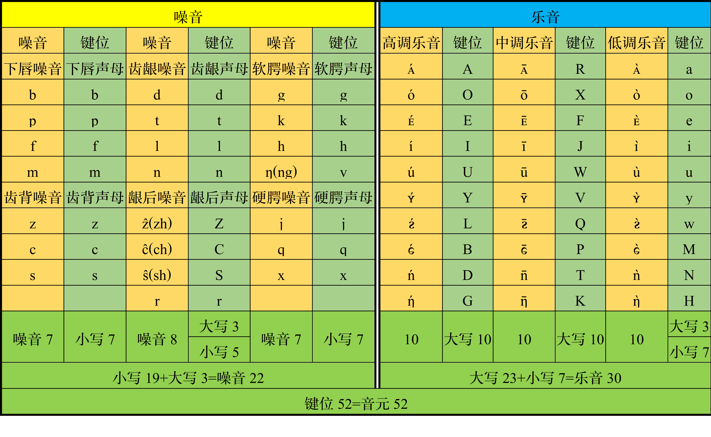
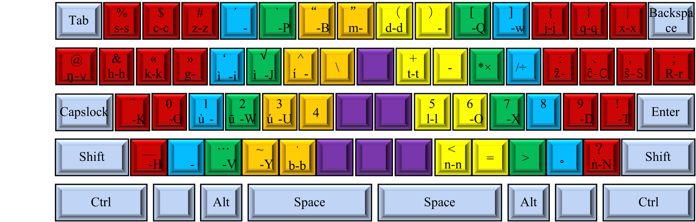

# 音元输入法 (Yinyuan Input Method Editor)

## 引言

音元输入法是一种音码输入法，在连续输入模式下，其操作方式为：用户依次输入构成话语的每个有声调的音节的音元序列（音元编码）；系统依据输入的音元序列，输出每个音节对应的候选汉字，并根据语言处理技术动态选定汉字且动态把选出的汉字整合成连贯的话语。在音元输入系统中，码元就是音元系统的音元。音元系统是以音元为元素的语音系统。在通用现代汉语的音元系统中，音元共有 52 个，分成噪音和乐音两类，其中，噪音有 22 个；乐音有 30 个。噪音特指充当首音的除阻辅音，只有音质是区别特征。乐音特指构成干音的有乐调的音元，音高和音质都是区别特征。乐音与音位系统的音质音位和声调音位没有简单而又直接的对应关系。乐音，根据音质分成10类，每类3个；根据音高分成高调乐音、中调乐音和低调乐音三类，每类 10 个。在结构上，噪音充当首音；乐音构成干音。首音对应声母。首音分成实首音和虚首音两类。实首音对应非零声母。虚首音对应零声母。干音对应带调韵母，在等长编码模式下，均由三个乐音构成。在音元系统中，表示音元的字符也简称为音符。音元输入法，在全拼模式下，是平均码长最短的音码输入法。音元输入法有与全拼输入法对应的简拼、双拼和并击输入法。简拼是指把全拼的构成干音的两个或三个相同的音元合并成一个音元和从全拼的由三个音质相同的音元构成的干音中把中调乐音省掉后而得到的输入方式。双拼输入法是指一键输入首音一键输入干音的输入方式。并击，也称合击，是指在一键输入首音后同时输入一组表示干音的音元的组合键从而输入干音从而输入音节的输入方式。

## 码元

在音元输入系统中，码元就是音元系统的音元。全拼输入的基本原则是一音一码。

### 音元输入法的键盘布局

根据一音一码原则，音元输入法可用两种键盘输入汉字：
一种是采用重新排布键位的美式键盘。这种键盘布局，在全拼状态下，按照一音一码原则，对52个音元，把47个音元对应的音符安排在初始（下档）状态下，把5个音元对应的音符安排在上档（Shift）状态下。在这种键盘上，音元的分布草图如图：

图 1 音元在键盘上的分布

图 2 音元在键盘上的分布

一种是设计新式键盘。这种键盘的布局是，通过调用中英文切换键改变输入状态，在中文输入状态下，把美式键盘的大小写字母键全部做成下档键并重新排布键位。这就是说，这种键盘共有 52 个下档键位：键值为 65\~90 和 97\~122 的键位；其它键值的键位，包括数字 0\~9、运算符号、标点符号、等等，全部做成上档键位。这种键盘主要用来根据音元输入法输入汉字。在这种键盘上，音元的分布草图如图：

.png>)

图 3 音元在键盘上的分布

### 音元与键位的对应关系

在音元输入法中，根据一音一码原则确定音元与键位的对应关系。在现代通用汉语中，首音由噪音充当。换句话说，首音就是噪音。首音与声母一一对应。首音ng[ŋ]，表示开口呼零声母或隔音符号，在美式键盘上，用小写字母键v键或其它字母键输入，以便做到完全不用符号键（除键值为65\~90和97\~122的键位外的键位）输入音元。

在音元输入法中，若仍用 ascii 码编码，以音元为线索，在美式键盘上，音元对应的键位——噪音和乐音对应的键位列表见表：

表 1 音元对应的键位

在音元输入法中，若仍用 ascii 码给机器编码，以键位为线索，在美式键盘上，键位对应的音元——大写和小写键位对应的音元列表见表：

表 2 键位对应的音元

在新式键盘上，若仍用 ascii 码给机器编码，音元与键位的对应关系如图：

图 4 音元与键位在新式键盘上的对应关系

音元与键位在美式键盘上的对应关系参考音元与键位在新式键盘上的对应关系修改。

### 音元与音符的对应关系

在音元输入法中，根据一音一符原则确定确定音元与音符（表示音元的字符）的对应关系。在音元系统中，为与中文或英文混排，表示音元，需要用到三套字符：与中文兼容的全宽字符、与中文兼容的半宽字符和与英文兼容的比例字符。

在音元输入法中，音元对应的音符——首音和乐音，用与中文兼容的全宽字符和与英文兼容的半宽字符来记音，列表见表：

表 3 首音的音符

表 4 乐音的音符

这套字符只是临时的试样，在使用过程中，可根据社会认可度修改。

## 干音

根据音元分析法标记干音，既可采用与汉字兼容的字符标音也可采用与英文兼容的字符标音。用与汉字兼容的字符来标音就是，首先把标记干音的三个音元的音符竖向排成一列，然后，或把这列字符制作成一个高度占居一个汉字高度、宽度占居半个汉字宽度的标记干音的半宽字符，或把这列字符制作成一个高度占居一个汉字高度、宽度占居一个汉字宽度的标记干音的全宽字符。半宽字符在首音和干音拼合成音节时使用。全宽字符在首音或干音游离在行文中时使用。干音分成呼音和韵音两段。干音根据韵音的音质也就是说韵质是否相近或相同分成十八类。

干音根据韵质分类采用与汉字兼容的字符标音详见表5。

表 5 干音用半宽字符来标音

在本表中，音符丨在干音 󰅁 和 󰅃 中的写法由竖写变横写变成一。

在本表中，列标题“未”、“噫”、“呜”和“吁”依序是未名呼干音、齐齿呼干音、合口呼干音和撮口呼干音的简称。在音元系统中，根据二音的音质分类，干音分成未名呼干音、齐齿呼干音、合口呼干音和撮口呼干音四类。未名呼干音指除齐齿呼干音、合口呼干音和撮口呼干音外的干音。齐齿呼干音指二音是噫质二音的干音。合口呼干音指二音是呜质二音的干音。撮口呼干音指二音是吁质二音的干音。噫质二音指二音的音质是 i[i]的二音。呜质二音指二音的音质是 u[u]的二音。吁质二音指二音的音质是 ʏ[ʏ]的二音。未名二音指除噫质二音、呜质二音和吁质二音外的二音。在根据韵音的音质的差异分类制表时，把未名呼干音、齐齿呼干音、合口呼干音和撮口呼干音各放在一列，把韵质相同的干音合放在一行。

用与英文兼容的字符来标音，就是把标记干音的三个音元的音符制作成三个高度占居半个汉字高度、宽度占居半个汉字宽度的半高半宽字符，并把标记干音的三个半高半宽字符依序在基线上横向排成一列标记干音的字符。

干音根据韵质分类采用与英文兼容的字符标音详见。

表 6 干音用字符序列来标音

干音分别采用半宽字符、音符序列、用上标来标调的组合式音符、《国际音标》和《汉语拼音方案》五种常用方式记音的对应关系列表见表。

表 7 干音的常用的几种记音方式的对应关系

在本表中，列标题“高”、“升”、“低”和“降”依序是高调节调、升调节调、低调节调和降调节调的简称。高调节调、升调节调、低调节调和降调节调依序就是高调阴平、升调阳平、低调上声和降调去声。

## 音节

音节由首音和干音构成。首音和干音的组合与有声调的音节一一对应。

音节表示例：

表 8 首音与 󰇘 类干音构成的音节

音节总表暂不列出。

综述说明，在音元系统中，首音对应声母、干音对应带调韵母，音元输入法通过输入充当首音和构成干音的的音元的音符输入每个有声调的音节从而输入与每个有声调的音节对应的汉字及其构成的语句。强调说明，音元、字符与键位的对应关系可根据设计和使用需要修改。

## 码表

### 单字码表

根据音元系统的音节和《汉语拼音方案》的有声调的音节的一一对应关系构建音元输入法的单字码表。单字码表根据现有带调全拼单字码表转换。

### 词语码表

根据单字码表构建词语码表。词语码表根据现有带调全拼词语码表转换。在输入单字和词语基础上通过字频调整、词频调整和语句及语段生成算法（语义算法）输入语句和语段。

## 结论

音元输入法，在全拼模式下，是平均码长最短的音码输入法。
